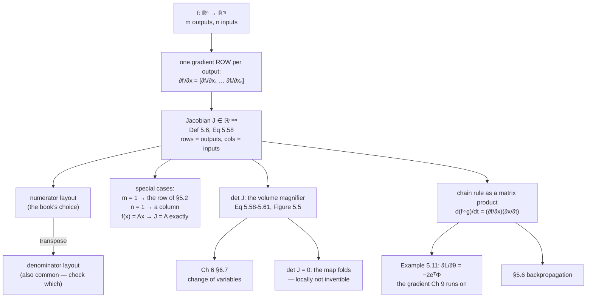

import DataCampExercise from "../../../../components/DataCampExercise.astro";
import Figure from "../../../../components/Figure.astro";
import Quiz from "../../../../components/Quiz.astro";

The previous page ended with a $1\times n$ row. This page stacks $m$ of them.

That is genuinely all the new content — and the fact that it is so little is the
payoff for §5.2's row convention. Under the column convention this page would need
transposes; under the row convention the gradient of a function with $m$ outputs is
just $m$ gradients written one above the other, and the shape rule stays *(rows are
outputs, columns are inputs)* all the way up.

What is new is what the resulting matrix **means**. Its determinant is a volume
magnifier, which is where Chapter 6's change-of-variables formula comes from. And
the chain rule becomes an honest matrix product, which is where backpropagation
comes from.

## What you'll learn

- Definition 5.6: the **Jacobian** of $f:\mathbb{R}^n\to\mathbb{R}^m$ as an $m\times n$ matrix.
- The **numerator layout** the book uses, its transpose the denominator layout, and how to tell which one a source is using.
- Example 5.9: $\mathrm{d}(\mathbf{A}\mathbf{x})/\mathrm{d}\mathbf{x} = \mathbf{A}$, exactly — the identity every linear layer's backward pass is.
- The **Jacobian determinant** as the factor by which areas and volumes scale, verified by counting rather than quoting §4.1.
- Why that is only a *local* statement for a nonlinear map, measured — and what happens where the determinant vanishes.
- Example 5.10 and 5.11: the chain rule as a matrix product, and the least-squares gradient that Chapter 9 is built on.

## Intuition: one row per output

A function with one output has one thing to say about how it changes: a single
gradient row. A function with $m$ outputs has $m$ things to say, one per output
coordinate, and each is a row.

Stack them and you have a matrix. Row $i$ is "how output $i$ responds to each
input"; column $j$ is "how input $j$ affects each output". Both readings are
useful, and they are the two ways to slice the same object.

The determinant then answers a question neither row nor column does: **how much
does the map stretch space?** A unit square in the domain lands on a parallelogram
in the codomain, and $\lvert\det\mathbf{J}\rvert$ is the ratio of their areas.



## The math

### The Jacobian

:::note[Definition 5.6 — Jacobian]
The collection of all first-order partial derivatives of a vector-valued function
$f:\mathbb{R}^n\to\mathbb{R}^m$ is called the **Jacobian**. The Jacobian
$\mathbf{J}$ is an $m\times n$ matrix, defined and arranged as

$$
\mathbf{J} = \nabla_\mathbf{x}f = \frac{\mathrm{d}f(\mathbf{x})}{\mathrm{d}\mathbf{x}}
= \begin{bmatrix}\dfrac{\partial f(\mathbf{x})}{\partial x_1} & \cdots & \dfrac{\partial f(\mathbf{x})}{\partial x_n}\end{bmatrix}
= \begin{bmatrix}
\dfrac{\partial f_1(\mathbf{x})}{\partial x_1} & \cdots & \dfrac{\partial f_1(\mathbf{x})}{\partial x_n}\\
\vdots & & \vdots\\
\dfrac{\partial f_m(\mathbf{x})}{\partial x_1} & \cdots & \dfrac{\partial f_m(\mathbf{x})}{\partial x_n}
\end{bmatrix}
\tag{5.58}
$$

with $J(i,j) = \partial f_i/\partial x_j$.
:::

As a special case, a function $f:\mathbb{R}^n\to\mathbb{R}^1$ has a Jacobian that
is a row vector of dimension $1\times n$ — which is exactly Equation 5.40. §5.2 was
not a different construction; it was this one with $m = 1$.

:::note[Remark — the layout convention]
The book uses the **numerator layout**: the derivative $\mathrm{d}f/\mathrm{d}\mathbf{x}$
of $f\in\mathbb{R}^m$ with respect to $\mathbf{x}\in\mathbb{R}^n$ is an
$m\times n$ matrix, where the elements of $f$ define the **rows** and the elements
of $\mathbf{x}$ define the **columns**. There also exists the **denominator
layout**, which is the transpose of the numerator layout.
:::

The two differ unless the Jacobian happens to be square, so this is not a
convention you can leave unresolved. A quick test on any source: find a
Jacobian of a map with different input and output dimensions and read its shape.
$\mathbb{R}^3\to\mathbb{R}^4$ gives $4\times3$ in numerator layout and $3\times4$
in denominator layout.

### The Jacobian determinant

§4.1 showed the determinant computes the area of a parallelogram. Given
$\mathbf{b}_1 = [1,0]^\top$, $\mathbf{b}_2 = [0,1]^\top$ as the sides of a unit
square,

$$
\left\lvert\det\begin{bmatrix}1&0\\0&1\end{bmatrix}\right\rvert = 1
\tag{5.60}
$$

and for a parallelogram with sides $\mathbf{c}_1 = [-2,1]^\top$,
$\mathbf{c}_2 = [1,1]^\top$,

$$
\left\lvert\det\begin{bmatrix}-2&1\\1&1\end{bmatrix}\right\rvert = \lvert-3\rvert = 3
\tag{5.61}
$$

so that parallelogram has three times the area of the unit square. The mapping that
takes one to the other is linear, with transformation matrix

$$
\mathbf{J} = \begin{bmatrix}-2&1\\1&1\end{bmatrix}
\tag{5.62}
$$

satisfying $\mathbf{J}\mathbf{b}_1 = \mathbf{c}_1$ and
$\mathbf{J}\mathbf{b}_2 = \mathbf{c}_2$.

And if the same map is written out in coordinates,

$$
y_1 = -2x_1 + x_2,\qquad y_2 = x_1 + x_2
\tag{5.63-5.64}
$$

then its Jacobian, computed from Definition 5.6, is

$$
\frac{\mathrm{d}\mathbf{y}}{\mathrm{d}\mathbf{x}} = \begin{bmatrix}\dfrac{\partial y_1}{\partial x_1} & \dfrac{\partial y_1}{\partial x_2}\\[6pt] \dfrac{\partial y_2}{\partial x_1} & \dfrac{\partial y_2}{\partial x_2}\end{bmatrix} = \begin{bmatrix}-2&1\\1&1\end{bmatrix}
\tag{5.66}
$$

— the same matrix. So the Jacobian *is* the coordinate transformation, and:

:::note[The Jacobian determinant]
Geometrically, the **Jacobian determinant** $\lvert\det\mathbf{J}\rvert$ is the
factor by which areas or volumes are scaled when coordinates are transformed. If
the coordinate transformation is nonlinear, the Jacobian **approximates** it
locally.
:::

That word "approximates" carries the whole caveat, and the second figure below
measures exactly how much of one.

:::tip[From the book]
Section 5.3. Definition 5.6 (Equation 5.58) gives the Jacobian as an $m\times n$
matrix of all first-order partials, with a margin note that the gradient of
$f:\mathbb{R}^n\to\mathbb{R}^m$ is a matrix of size $m\times n$; a following remark
notes that $f:\mathbb{R}^n\to\mathbb{R}^1$ is the special case of Equation 5.40.
A Remark states that the book uses the **numerator layout**, whose transpose is the
denominator layout. Equations 5.60 and 5.61 compute the areas of the unit square and
of the parallelogram spanned by $[-2,1]$ and $[1,1]$; Equation 5.62 gives the
transformation matrix, Equations 5.63 to 5.66 recover it as a Jacobian from the
coordinate form, and Figure 5.5 draws it — with the note that
$\lvert\det\mathbf{J}\rvert = 3$ is the area magnifier and that the Jacobian
determinant reappears in §6.7's change of variables. Example 5.9 (Equations 5.67 to
5.68) shows $\mathrm{d}(\mathbf{A}\mathbf{x})/\mathrm{d}\mathbf{x} = \mathbf{A}$.
Example 5.10 (Equations 5.69 to 5.74) applies the chain rule to
$h = f\circ g$ with $f(\mathbf{x}) = \exp(x_1x_2^2)$ and
$g(t) = (t\cos t, t\sin t)$, first noting the shapes $1\times2$ and $2\times1$ at
Equation 5.73. Example 5.11 (Equations 5.75 to 5.84) derives the least-squares
gradient $\partial L/\partial\boldsymbol{\theta} = -2\mathbf{e}^\top\boldsymbol{\Phi}
\in\mathbb{R}^{1\times D}$, with a Remark that the same result follows without the
chain rule for simple functions but that this becomes impractical for deep
compositions.
:::

## Worked example by hand

### Example 5.9 — the identity every linear layer uses

$f(\mathbf{x}) = \mathbf{A}\mathbf{x}$ with $f(\mathbf{x})\in\mathbb{R}^M$,
$\mathbf{A}\in\mathbb{R}^{M\times N}$, $\mathbf{x}\in\mathbb{R}^N$.

**Step 1 — the shape, before any calculus.** Since $f:\mathbb{R}^N\to\mathbb{R}^M$,
it follows that $\mathrm{d}f/\mathrm{d}\mathbf{x}\in\mathbb{R}^{M\times N}$. Doing
this first catches most errors before they happen.

**Step 2 — the entries.**

$$
f_i(\mathbf{x}) = \sum_{j=1}^{N}A_{ij}x_j \implies \frac{\partial f_i}{\partial x_j} = A_{ij}
\tag{5.67}
$$

because every term in that sum except the $j$-th is constant with respect to $x_j$.

**Step 3 — collect.**

$$
\frac{\mathrm{d}f}{\mathrm{d}\mathbf{x}} = \begin{bmatrix}A_{11}&\cdots&A_{1N}\\ \vdots&&\vdots\\ A_{M1}&\cdots&A_{MN}\end{bmatrix} = \mathbf{A} \in \mathbb{R}^{M\times N}
\tag{5.68}
$$

The Jacobian of a linear map is the matrix itself. Verified numerically for shapes
$4\times3$, $2\times5$, $3\times3$ and $5\times1$, each agreeing with $\mathbf{A}$
to about $10^{-10}$.

This is the single most-used derivative in machine learning. Every dense layer's
backward pass is this identity plus the chain rule.

### Example 5.10 — the chain rule, with the shapes checked first

$h:\mathbb{R}\to\mathbb{R}$, $h(t) = (f\circ g)(t)$, with

$$
f(\mathbf{x}) = \exp(x_1x_2^2),\qquad
\mathbf{x} = \begin{bmatrix}x_1\\x_2\end{bmatrix} = g(t) = \begin{bmatrix}t\cos t\\ t\sin t\end{bmatrix}
\tag{5.71-5.72}
$$

The book notes the shapes *before* computing anything:

$$
\frac{\partial f}{\partial\mathbf{x}} \in \mathbb{R}^{1\times2},\qquad
\frac{\partial g}{\partial t}\in\mathbb{R}^{2\times1}
\tag{5.73}
$$

so their product is $1\times1$ — a scalar, as it must be for $h:\mathbb{R}\to\mathbb{R}$.

$$
\frac{\mathrm{d}h}{\mathrm{d}t} = \frac{\partial f}{\partial\mathbf{x}}\frac{\partial\mathbf{x}}{\partial t}
= \begin{bmatrix}\dfrac{\partial f}{\partial x_1} & \dfrac{\partial f}{\partial x_2}\end{bmatrix}
\begin{bmatrix}\dfrac{\partial x_1}{\partial t}\\[6pt] \dfrac{\partial x_2}{\partial t}\end{bmatrix}
\tag{5.74a}
$$

Filling in the pieces:

$$
= \begin{bmatrix}\exp(x_1x_2^2)\,x_2^2 & 2\exp(x_1x_2^2)\,x_1x_2\end{bmatrix}
\begin{bmatrix}\cos t - t\sin t\\ \sin t + t\cos t\end{bmatrix}
$$

$$
= \exp(x_1x_2^2)\Bigl[x_2^2(\cos t - t\sin t) + 2x_1x_2(\sin t + t\cos t)\Bigr]
$$

Checked against a central difference in $t$ at six values, agreeing to between
$9\times10^{-12}$ and $9\times10^{-10}$ relative:

| $t$ | chain rule | central difference |
| --- | --- | --- |
| $0.30$ | $0.036476225$ | $0.036476224$ |
| $0.70$ | $0.706288861$ | $0.706288861$ |
| $1.00$ | $1.529376673$ | $1.529376673$ |
| $1.50$ | $-3.602659477$ | $-3.602659476$ |
| $2.00$ | $-0.486106309$ | $-0.486106309$ |
| $2.50$ | $0.036977693$ | $0.036977693$ |

### Example 5.11 — the least-squares gradient

This is the one that Chapter 9 runs on. Given the linear model

$$
\mathbf{y} = \boldsymbol{\Phi}\boldsymbol{\theta}
\tag{5.75}
$$

with $\boldsymbol{\theta}\in\mathbb{R}^D$ a parameter vector,
$\boldsymbol{\Phi}\in\mathbb{R}^{N\times D}$ the input features and
$\mathbf{y}\in\mathbb{R}^N$ the observations, define

$$
L(\mathbf{e}) := \lVert\mathbf{e}\rVert^2,\qquad \mathbf{e}(\boldsymbol{\theta}) := \mathbf{y} - \boldsymbol{\Phi}\boldsymbol{\theta}
\tag{5.76-5.77}
$$

**Shape first**: $\partial L/\partial\boldsymbol{\theta}\in\mathbb{R}^{1\times D}$
(Equation 5.78). Then the chain rule:

$$
\frac{\partial L}{\partial\boldsymbol{\theta}} = \frac{\partial L}{\partial\mathbf{e}}\frac{\partial\mathbf{e}}{\partial\boldsymbol{\theta}}
\tag{5.79}
$$

Using $\lVert\mathbf{e}\rVert^2 = \mathbf{e}^\top\mathbf{e}$ from §3.2,

$$
\frac{\partial L}{\partial\mathbf{e}} = 2\mathbf{e}^\top \in \mathbb{R}^{1\times N},
\qquad
\frac{\partial\mathbf{e}}{\partial\boldsymbol{\theta}} = -\boldsymbol{\Phi} \in \mathbb{R}^{N\times D}
\tag{5.81-5.82}
$$

so

$$
\boxed{\;\frac{\partial L}{\partial\boldsymbol{\theta}} = -2\mathbf{e}^\top\boldsymbol{\Phi} = -2\underbrace{(\mathbf{y}^\top - \boldsymbol{\theta}^\top\boldsymbol{\Phi}^\top)}_{1\times N}\underbrace{\boldsymbol{\Phi}}_{N\times D} \in \mathbb{R}^{1\times D}\;}
\tag{5.83}
$$

Note how the shapes carry the derivation: $(1\times N)(N\times D) = 1\times D$,
which is what Equation 5.78 predicted before any differentiating happened.

Verified for $N = 30$, $D = 4$: the analytic gradient
$[-86.449975,\ 161.597514,\ 43.111249,\ 73.585580]$ agrees with a central-difference
Jacobian to $9.3\times10^{-10}$ relative, the two forms of Equation 5.83 agree
**exactly** (`0.0e+00`), and at the least-squares solution the gradient is
$2.5\times10^{-14}$ — zero, as an optimum requires.

:::note[The book's Remark — why bother with the chain rule]
The same result follows without the chain rule by expanding
$L_2(\boldsymbol{\theta}) := \lVert\mathbf{y}-\boldsymbol{\Phi}\boldsymbol{\theta}\rVert^2 = (\mathbf{y}-\boldsymbol{\Phi}\boldsymbol{\theta})^\top(\mathbf{y}-\boldsymbol{\Phi}\boldsymbol{\theta})$.
*This approach is still practical for simple functions like $L_2$ but becomes
impractical for deep function compositions.* That sentence is the entire
justification for §5.6.
:::

## See it move

```p5 title="The Jacobian as a local linear map" desc="A grid in the domain, pushed through a map you can switch between linear and nonlinear. The amber parallelogram is what the Jacobian at the marked point predicts; the blue patch is where the map actually sends that square. Shrink the square and the two converge — that is the whole content of 'the Jacobian approximates the map locally'." height="620"
let side = 0.6, px = 0.4, py = 0.3, mapIdx = 0;
let KNOBS = [], BTNS = [], dragging = null, draggingPt = false;

const MAPS = [
  { name: "linear", F: (u, v) => [-2 * u + v, u + v],
    J: (u, v) => [[-2, 1], [1, 1]] },
  { name: "nonlinear", F: (u, v) => [u + 0.6 * v * v * v, v + 0.5 * u * u],
    J: (u, v) => [[1, 1.8 * v * v], [1.0 * u, 1]] },
  { name: "polar-ish", F: (u, v) => [u * Math.cos(v), u * Math.sin(v)],
    J: (u, v) => [[Math.cos(v), -u * Math.sin(v)], [Math.sin(v), u * Math.cos(v)]] },
  { name: "folding", F: (u, v) => [u * u - v * v, 2 * u * v],
    J: (u, v) => [[2 * u, -2 * v], [2 * v, 2 * u]] },
];

function setup() { createCanvas(600, 620); textFont("monospace"); noLoop(); }

const U = 62, DCX = 130, DCY = 130, CCX = 420, CCY = 150;
const dsx = x => DCX + x * U, dsy = y => DCY - y * U;
const csx = x => CCX + x * U * 0.62, csy = y => CCY - y * U * 0.62;

function mousePressed() {
  for (const b of BTNS)
    if (mouseX > b.x && mouseX < b.x + b.w && mouseY > b.y && mouseY < b.y + b.h) { mapIdx = b.i; redraw(); return; }
  if (dist(mouseX, mouseY, dsx(px), dsy(py)) < 20) { draggingPt = true; return; }
  for (const k of KNOBS)
    if (mouseY > k.y - 11 && mouseY < k.y + 11 && mouseX > k.x - 11 && mouseX < k.x + k.w + 11) { dragging = k; return; }
}
function mouseReleased() { dragging = null; draggingPt = false; }
function mouseDragged() {
  if (draggingPt) {
    px = Math.max(-1.6, Math.min(1.6, (mouseX - DCX) / U));
    py = Math.max(-1.6, Math.min(1.6, (DCY - mouseY) / U));
    redraw(); return;
  }
  if (!dragging) return;
  const t = Math.min(1, Math.max(0, (mouseX - dragging.x) / dragging.w));
  side = dragging.mn + t * (dragging.mx - dragging.mn);
  redraw();
}

function shoelace(pts) {
  let a = 0;
  for (let i = 0; i < pts.length; i++) {
    const j = (i + 1) % pts.length;
    a += pts[i][0] * pts[j][1] - pts[j][0] * pts[i][1];
  }
  return Math.abs(a) / 2;
}

function draw() {
  background(13, 17, 23);
  KNOBS = []; BTNS = [];
  const M = MAPS[mapIdx];

  // ---- domain
  stroke(32, 44, 58); strokeWeight(1);
  for (let g = -2; g <= 2; g++) { line(dsx(g), dsy(-2), dsx(g), dsy(2)); line(dsx(-2), dsy(g), dsx(2), dsy(g)); }
  stroke(58, 72, 88); strokeWeight(1.2);
  line(dsx(-2), dsy(0), dsx(2), dsy(0)); line(dsx(0), dsy(-2), dsx(0), dsy(2));

  const sq = [[px, py], [px + side, py], [px + side, py + side], [px, py + side]];
  noFill(); stroke(120, 190, 240); strokeWeight(2.2);
  beginShape(); for (const p of sq) vertex(dsx(p[0]), dsy(p[1])); endShape(CLOSE);
  noStroke(); fill(255); ellipse(dsx(px), dsy(py), 9, 9);
  fill(150); textSize(10); textAlign(CENTER, TOP);
  text("domain", DCX, DCY + 150);

  // ---- codomain: the true image, sampled densely along the boundary
  stroke(32, 44, 58); strokeWeight(1);
  for (let g = -3; g <= 3; g++) { line(csx(g), csy(-3), csx(g), csy(3)); line(csx(-3), csy(g), csx(3), csy(g)); }
  stroke(58, 72, 88); strokeWeight(1.2);
  line(csx(-3), csy(0), csx(3), csy(0)); line(csx(0), csy(-3), csx(0), csy(3));

  const edge = [];
  const NE = 90;
  for (let e = 0; e < 4; e++) {
    const a = sq[e], b = sq[(e + 1) % 4];
    for (let i = 0; i < NE; i++) {
      const t = i / NE;
      edge.push([a[0] + (b[0] - a[0]) * t, a[1] + (b[1] - a[1]) * t]);
    }
  }
  const img = edge.map(p => M.F(p[0], p[1]));
  noFill(); stroke(120, 190, 240); strokeWeight(2.2);
  beginShape(); for (const q of img) vertex(csx(q[0]), csy(q[1])); endShape(CLOSE);

  // ---- what the Jacobian at the corner predicts: a parallelogram
  const J = M.J(px, py);
  const base = M.F(px, py);
  const para = [
    base,
    [base[0] + J[0][0] * side, base[1] + J[1][0] * side],
    [base[0] + J[0][0] * side + J[0][1] * side, base[1] + J[1][0] * side + J[1][1] * side],
    [base[0] + J[0][1] * side, base[1] + J[1][1] * side],
  ];
  noFill(); stroke(255, 211, 67); strokeWeight(2.0); drawingContext.setLineDash([6, 4]);
  beginShape(); for (const q of para) vertex(csx(q[0]), csy(q[1])); endShape(CLOSE);
  drawingContext.setLineDash([]);
  noStroke(); fill(255); ellipse(csx(base[0]), csy(base[1]), 9, 9);
  fill(150); textSize(10); textAlign(CENTER, TOP);
  text("codomain", CCX, CCY + 150);

  const detJ = J[0][0] * J[1][1] - J[0][1] * J[1][0];
  const areaTrue = shoelace(img);
  const areaPara = Math.abs(detJ) * side * side;
  const ratio = areaTrue / (side * side);

  // Buttons and knob.
  for (let i = 0; i < MAPS.length; i++) {
    const bx = 30 + i * 104, by = 330;
    BTNS.push({ x: bx, y: by, w: 96, h: 26, i });
    noStroke(); fill(i === mapIdx ? color(120, 200, 150) : color(46, 58, 72));
    rect(bx, by, 96, 26, 5);
    fill(i === mapIdx ? 20 : 210); textSize(10); textAlign(CENTER, CENTER);
    text(MAPS[i].name, bx + 48, by + 13);
  }
  {
    KNOBS.push({ id: "side", x: 30, y: 382, w: 250, mn: 0.02, mx: 1.0 });
    const t = (side - 0.02) / 0.98;
    stroke(60, 74, 92); strokeWeight(2); line(30, 382, 280, 382);
    noStroke(); fill(255, 211, 67); ellipse(30 + t * 250, 382, 10, 10);
    fill(190, 200, 212); textSize(11); textAlign(LEFT, CENTER);
    text(`side ${side.toFixed(3)}`, 292, 382);
  }

  noStroke(); textAlign(LEFT, TOP);
  fill(255, 211, 67); textSize(14); text("Drag the side length towards zero", 24, 12);
  fill(215); textSize(11);
  text(`J at (${px.toFixed(2)}, ${py.toFixed(2)}) = [ ${J[0][0].toFixed(3)}  ${J[0][1].toFixed(3)} ]`, 24, 412);
  text(`                        [ ${J[1][0].toFixed(3)}  ${J[1][1].toFixed(3)} ]`, 24, 430);
  text(`det J            ${detJ.toFixed(6)}`, 24, 454);
  text(`|det J|          ${Math.abs(detJ).toFixed(6)}`, 24, 472);
  text(`true area/side²  ${ratio.toFixed(6)}`, 24, 490);
  const gap = Math.abs(ratio - Math.abs(detJ));
  fill(gap < 1e-3 ? color(120, 200, 150) : color(255, 211, 67)); textSize(11);
  text(`gap              ${gap.toExponential(2)}`, 24, 508);

  fill(150); textSize(10);
  if (mapIdx === 0) {
    text("The linear map has a CONSTANT Jacobian, so the amber parallelogram and the blue", 24, 536);
    text("image coincide at every side length — the gap is exactly zero, not small.", 24, 552);
  } else if (Math.abs(detJ) < 0.08) {
    fill(232, 130, 130);
    text("det J is near zero here: the map is folding, and the shoelace area counts the", 24, 536);
    text("two folded halves with opposite signs. The ratio is not the area any more.", 24, 552);
  } else {
    text("Shrink the side and the gap falls in proportion to it — first order. The Jacobian", 24, 536);
    text("is the best LINEAR approximation, so it is exact only in the limit.", 24, 552);
  }
  fill(150); textSize(10);
  text("Try 'folding' and drag the point to the origin, where det J = 0. Try 'polar-ish'", 24, 578);
  text("and drag to u = 0, where the map collapses a whole edge to a single point.", 24, 594);
}
```

```p5 title="One row per output" desc="Pick the number of outputs and inputs and watch the Jacobian's shape follow. Each row is highlighted as you scrub through the outputs, and the readout names what that row means. The point is that the shape rule never changes: rows are outputs, columns are inputs." height="560"
let m = 4, n = 3, hl = 0, layoutNum = true;
let KNOBS = [], BTNS = [], dragging = null;

function setup() { createCanvas(600, 560); textFont("monospace"); noLoop(); }

function knob(id, x, y, w, value, mn, mx, label) {
  KNOBS.push({ id, x, y, w, mn, mx });
  const t = (value - mn) / (mx - mn);
  stroke(60, 74, 92); strokeWeight(2); line(x, y, x + w, y);
  noStroke(); fill(255, 211, 67); ellipse(x + t * w, y, 10, 10);
  fill(190, 200, 212); textSize(11); textAlign(LEFT, CENTER);
  text(label, x + w + 10, y);
}
function mousePressed() {
  for (const b of BTNS)
    if (mouseX > b.x && mouseX < b.x + b.w && mouseY > b.y && mouseY < b.y + b.h) { layoutNum = b.v; redraw(); return; }
  for (const k of KNOBS)
    if (mouseY > k.y - 11 && mouseY < k.y + 11 && mouseX > k.x - 11 && mouseX < k.x + k.w + 11) { dragging = k; return; }
}
function mouseReleased() { dragging = null; }
function mouseDragged() {
  if (!dragging) return;
  const t = Math.min(1, Math.max(0, (mouseX - dragging.x) / dragging.w));
  const v = Math.round(dragging.mn + t * (dragging.mx - dragging.mn));
  if (dragging.id === "m") { m = v; hl = Math.min(hl, m - 1); }
  if (dragging.id === "n") n = v;
  if (dragging.id === "hl") hl = Math.min(v, m - 1);
  redraw();
}

function draw() {
  background(13, 17, 23);
  KNOBS = []; BTNS = [];

  const rows = layoutNum ? m : n;
  const cols = layoutNum ? n : m;

  const cw = Math.min(52, 380 / cols), ch = Math.min(34, 200 / rows);
  const x0 = 40, y0 = 70;

  // Brackets.
  stroke(200); strokeWeight(2);
  const W = cols * cw, H = rows * ch;
  line(x0 - 8, y0, x0 - 8, y0 + H); line(x0 - 8, y0, x0 - 2, y0);
  line(x0 - 8, y0 + H, x0 - 2, y0 + H);
  line(x0 + W + 8, y0, x0 + W + 8, y0 + H); line(x0 + W + 8, y0, x0 + W + 2, y0);
  line(x0 + W + 8, y0 + H, x0 + W + 2, y0 + H);

  for (let i = 0; i < rows; i++) {
    for (let j = 0; j < cols; j++) {
      const isHl = layoutNum ? i === hl : j === hl;
      noStroke();
      fill(isHl ? color(255, 211, 67, 60) : color(46, 58, 72, 90));
      rect(x0 + j * cw + 1, y0 + i * ch + 1, cw - 2, ch - 2, 3);
      fill(isHl ? color(255, 211, 67) : color(170, 180, 194));
      textSize(Math.min(10, cw / 5.2)); textAlign(CENTER, CENTER);
      const oi = layoutNum ? i + 1 : j + 1;
      const ij = layoutNum ? j + 1 : i + 1;
      text(`∂f${oi}/∂x${ij}`, x0 + j * cw + cw / 2, y0 + i * ch + ch / 2);
    }
  }

  // Labels on the axes of the matrix.
  noStroke(); fill(150); textSize(10); textAlign(CENTER, BOTTOM);
  text(layoutNum ? `inputs: n = ${n}` : `outputs: m = ${m}`, x0 + W / 2, y0 - 12);
  push();
  translate(x0 - 26, y0 + H / 2); rotate(-HALF_PI);
  textAlign(CENTER, BOTTOM);
  text(layoutNum ? `outputs: m = ${m}` : `inputs: n = ${n}`, 0, 0);
  pop();

  // Layout buttons.
  for (const [lbl, v, dx] of [["numerator layout", true, 0], ["denominator layout", false, 168]]) {
    const bx = 30 + dx, by = 306;
    BTNS.push({ x: bx, y: by, w: 158, h: 26, v });
    noStroke(); fill(layoutNum === v ? color(120, 200, 150) : color(46, 58, 72));
    rect(bx, by, 158, 26, 5);
    fill(layoutNum === v ? 20 : 210); textSize(10); textAlign(CENTER, CENTER);
    text(lbl, bx + 79, by + 13);
  }

  knob("m", 30, 356, 200, m, 1, 6, `outputs m = ${m}`);
  knob("n", 30, 386, 200, n, 1, 6, `inputs  n = ${n}`);
  knob("hl", 30, 416, 200, hl, 0, Math.max(0, m - 1), `highlight output ${hl + 1}`);

  noStroke(); textAlign(LEFT, TOP);
  fill(255, 211, 67); textSize(14); text("Scrub the shape", 24, 12);
  fill(215); textSize(11);
  text(`f : R^${n} -> R^${m}`, 400, 356);
  text(`df/dx is ${rows} x ${cols}`, 400, 374);
  fill(layoutNum ? color(120, 200, 150) : color(255, 211, 67)); textSize(10);
  text(layoutNum ? "rows = outputs, cols = inputs" : "TRANSPOSED: rows = inputs", 400, 396);
  fill(215); textSize(11);
  const sameShape = m === n;
  text(`square? ${sameShape ? "yes" : "no"}`, 400, 418);
  fill(sameShape ? color(232, 130, 130) : color(120, 200, 150)); textSize(10);
  text(sameShape ? "the two layouts have the SAME" : "the two layouts have DIFFERENT", 400, 438);
  text(sameShape ? "shape here — you cannot tell" : "shapes — you can tell them apart", 400, 452);
  text(sameShape ? "them apart from the shape alone" : "from the shape alone", 400, 466);

  fill(150); textSize(10);
  text(`Highlighted: row ${hl + 1} is the gradient of output f${hl + 1}, a 1 x ${n} row —`, 24, 456);
  text(`exactly the object §5.2 built. A Jacobian is m of those, stacked.`, 24, 472);
  text("Set m = 1 and you get Eq 5.40 back. Set n = 1 and you get a column.", 24, 494);
  text("Set m = n and switch layouts: the shape stops distinguishing them, which is", 24, 516);
  text("why the convention has to be stated rather than inferred.", 24, 532);
}
```

## From scratch

```python title="jacobian_from_scratch.py" showLineNumbers{1}
import numpy as np

def numeric_jac(f, x, h=1e-6):
    """Definition 5.6: one column per input, one row per output."""
    x = np.asarray(x, dtype=float).ravel()
    f0 = np.asarray(f(x)).ravel()
    J = np.zeros((f0.size, x.size))              # (outputs, inputs) -- numerator layout
    for j in range(x.size):
        e = np.zeros_like(x)
        e[j] = h
        J[:, j] = (np.asarray(f(x + e)).ravel() - np.asarray(f(x - e)).ravel()) / (2 * h)
    return J

rng = np.random.default_rng(3)

print("Example 5.9: d(Ax)/dx = A")
for (M, N) in [(4, 3), (2, 5), (3, 3), (5, 1)]:
    A = rng.normal(size=(M, N))
    x = rng.normal(size=N)
    J = numeric_jac(lambda v: A @ v, x)
    print(f"  A is {M}x{N}  ->  df/dx is {J.shape}  and equals A to {np.abs(J - A).max():.1e}")

print()
print("Example 5.10: h(t) = exp(x1 x2^2) with x = (t cos t, t sin t)")
h_of_t = lambda t: np.exp((t * np.cos(t)) * (t * np.sin(t)) ** 2)

def dh_chain(t):
    x1, x2 = t * np.cos(t), t * np.sin(t)
    e = np.exp(x1 * x2 ** 2)
    df_dx = np.array([[e * x2 ** 2, e * 2 * x1 * x2]])              # 1 x 2, Eq 5.73
    dx_dt = np.array([[np.cos(t) - t * np.sin(t)],
                      [np.sin(t) + t * np.cos(t)]])                 # 2 x 1, Eq 5.73
    return float((df_dx @ dx_dt).item())                            # (1x2)(2x1) -> (1,1)

print(f"{'t':>6}  {'chain rule':>18}  {'central difference':>20}  {'rel gap':>10}")
for t in (0.3, 0.7, 1.0, 1.5, 2.0, 2.5):
    ch = dh_chain(t)
    hh = 1e-6
    nu = (h_of_t(t + hh) - h_of_t(t - hh)) / (2 * hh)
    print(f"{t:>6.2f}  {ch:>18.9f}  {nu:>20.9f}  {abs(ch-nu)/max(abs(ch),1e-12):>10.1e}")

print()
print("Example 5.11: the least-squares gradient")
rng = np.random.default_rng(11)
N, D = 30, 4
Phi = rng.normal(size=(N, D))
theta_true = rng.normal(size=D)
y = Phi @ theta_true + 0.3 * rng.normal(size=N)
theta = rng.normal(size=D)

L = lambda th: (y - Phi @ th) @ (y - Phi @ th)
e0 = y - Phi @ theta
ana = (-2 * e0 @ Phi).reshape(1, -1)                                # Eq 5.83
num = numeric_jac(lambda v: np.array([L(v)]), theta)
ana2 = (-2 * (y.T - theta.T @ Phi.T) @ Phi).reshape(1, -1)          # Eq 5.83, expanded

print(f"  shape {ana.shape}  -- Eq 5.78 predicted 1 x D with D = {D}")
print(f"  analytic {np.round(ana[0], 6)}")
print(f"  numeric  {np.round(num[0], 6)}")
print(f"  relative error {np.abs(ana - num).max() / np.abs(ana).max():.1e}")
print(f"  the two forms of Eq 5.83 agree to {np.abs(ana2 - ana).max():.1e}")
th_star = np.linalg.lstsq(Phi, y, rcond=None)[0]
print(f"  at the least-squares optimum the gradient is "
      f"{np.abs(-2 * (y - Phi @ th_star) @ Phi).max():.1e}")
```

```text title="output"
Example 5.9: d(Ax)/dx = A
  A is 4x3  ->  df/dx is (4, 3)  and equals A to 9.2e-11
  A is 2x5  ->  df/dx is (2, 5)  and equals A to 1.9e-10
  A is 3x3  ->  df/dx is (3, 3)  and equals A to 2.9e-10
  A is 5x1  ->  df/dx is (5, 1)  and equals A to 4.7e-11

Example 5.10: h(t) = exp(x1 x2^2) with x = (t cos t, t sin t)
     t          chain rule    central difference     rel gap
  0.30         0.036476225           0.036476224     8.8e-10
  0.70         0.706288861           0.706288861     9.3e-12
  1.00         1.529376673           1.529376673     1.6e-11
  1.50        -3.602659477          -3.602659476     1.2e-10
  2.00        -0.486106309          -0.486106309     4.4e-11
  2.50         0.036977693           0.036977693     3.5e-10

Example 5.11: the least-squares gradient
  shape (1, 4)  -- Eq 5.78 predicted 1 x D with D = 4
  analytic [-86.449975 161.597514  43.111249  73.58558 ]
  numeric  [-86.449975 161.597514  43.111249  73.58558 ]
  relative error 9.3e-10
  the two forms of Eq 5.83 agree to 0.0e+00
  at the least-squares optimum the gradient is 2.5e-14
```

Three things.

The **shape** line for Example 5.11 is the point of doing Equation 5.78 first: the
gradient came out $(1, 4)$ exactly as predicted, and if it had come out $(4, 1)$ you
would know immediately that a transpose went the wrong way — before looking at a
single number.

The **two forms of Equation 5.83 agree to `0.0e+00`**, exactly. That is not luck:
$-2\mathbf{e}^\top\boldsymbol{\Phi}$ and
$-2(\mathbf{y}^\top - \boldsymbol{\theta}^\top\boldsymbol{\Phi}^\top)\boldsymbol{\Phi}$
are the same floating-point operations in the same order once
$\mathbf{e} = \mathbf{y}-\boldsymbol{\Phi}\boldsymbol{\theta}$ is substituted.

And at the least-squares solution the gradient is $2.5\times10^{-14}$ — which is the
condition Chapter 9 solves for. Setting Equation 5.83 to zero gives
$\boldsymbol{\Phi}^\top\boldsymbol{\Phi}\boldsymbol{\theta} = \boldsymbol{\Phi}^\top\mathbf{y}$,
the normal equations.

## On real data

<Figure
  src="/images/mml/gradients-of-vector-valued-functions/jacobian-area-magnifier"
  alt="A blue unit square and an amber parallelogram overlaid on the same axes, with basis arrows b1 and b2 for the square and c1 and c2 for the parallelogram, and a panel of measured areas."
  title="The book's Figure 5.5, with the area counted"
  caption="The unit square maps to the parallelogram spanned by c1 = [-2,1] and c2 = [1,1]. det J = -3.0000, so |det J| = 3. A Monte-Carlo estimate over 400000 samples gives 3.0049 from 200329 hits, a gap of 0.0049 — the determinant claim verified by counting rather than by quoting §4.1. Note the sign: det is negative, so orientation flips."
/>

<Figure
  src="/images/mml/gradients-of-vector-valued-functions/nonlinear-jacobian-local"
  alt="Left, a nonlinear map bending two nested squares into curved patches. Right, a log-log plot of the gap between the measured area ratio and the Jacobian determinant against the side length, falling along a line of slope one."
  title="'Approximates locally', measured"
  caption="At (0.4, 0.3) the Jacobian determinant is 0.856000. The measured area ratio converges to it as the square shrinks: 0.640 at side 0.4, 0.811 at 0.1, 0.852 at 0.01 — with the gap falling in exact proportion to the side length, so the approximation is first order."
/>

<Figure
  src="/images/mml/gradients-of-vector-valued-functions/jacobian-shapes"
  alt="A table of functions, their derivatives and the resulting shapes, from the general m by n case down to the scalar derivative, with notes on where each appears in the chapter."
  title="Definition 5.6's one rule, and every special case of it"
  caption="Rows indexed by the output, columns by the input — the numerator layout. Everything the chapter differentiates is this one rule: m = 1 gives §5.2's row, n = 1 gives a column, f(x) = Ax gives A itself, and a matrix argument gives a fourth-order tensor."
/>

## Reading the plot

**From the area figure.** The determinant is $-3$ and the area ratio is $3$, and
both facts matter. The magnitude is the magnifier; the **sign** says the map
reverses orientation, which the picture shows by $\mathbf{c}_1$ and $\mathbf{c}_2$
being swapped in handedness relative to $\mathbf{b}_1$ and $\mathbf{b}_2$.

The Monte-Carlo estimate is $3.0049$ against an exact $3$, from $200\,329$ hits out
of $400\,000$. The gap of $0.0049$ is sampling noise —
$\sigma \approx \text{box area}\sqrt{p(1-p)/n} \approx 0.005$ — so this is a check
that passes, not a discrepancy. It matters because the estimate never touches the
determinant: it counts points inside the image using coordinates in the
$(\mathbf{b}_1,\mathbf{b}_2)$ frame, so agreement is independent evidence rather
than a restatement.

**From the local figure.** This is the figure that puts a number on the word
"approximates". The gap between the measured area ratio and $\lvert\det\mathbf{J}\rvert$:

| side | area / side² | gap |
| --- | --- | --- |
| $0.4$ | $0.640000$ | $2.16\times10^{-1}$ |
| $0.2$ | $0.760000$ | $9.60\times10^{-2}$ |
| $0.1$ | $0.811000$ | $4.50\times10^{-2}$ |
| $0.05$ | $0.834250$ | $2.18\times10^{-2}$ |
| $0.02$ | $0.847480$ | $8.52\times10^{-3}$ |
| $0.01$ | $0.851770$ | $4.23\times10^{-3}$ |

Every halving of the side halves the gap. **First order** — which is exactly what
you should expect, because the Jacobian is the best *linear* approximation and the
error is dominated by the first neglected term.

Note the base point: $(0.4, 0.3)$, not somewhere arbitrary. This map's determinant
is $1 - 1.2uv$, which vanishes on the hyperbola $uv = 0.8333$. Base the squares at
$(0.8, 0.6)$ instead and the largest one reaches $uv = 1.2$, past the fold — and
then the shoelace formula returns the *difference* of two oppositely-oriented areas
rather than the area, giving a measured ratio of $0.04$ against a determinant of
$0.424$. That is not a convergence failure; it is a folded polygon, and the figure
avoids it deliberately.

**From the shapes figure.** The row worth pausing on is the last: a matrix argument
gives a **fourth-order tensor**. §5.4 is about making that computable, and the
figure previews the two ways — flatten, or partition into blocks.

## Pitfalls

:::danger[Check the layout convention before transposing anything]
Numerator layout gives $m\times n$; denominator layout gives $n\times m$. They are
transposes, and **for a square Jacobian the shape cannot tell them apart**. The book
uses numerator layout; PyTorch's autograd effectively produces gradients shaped like
the parameter, which is the denominator convention for a scalar loss. Both produce
code that runs. Read a non-square example before assuming.
:::

:::danger[A vanishing Jacobian determinant is not a small number, it is a different regime]
Where $\det\mathbf{J} = 0$ the map is locally non-invertible: it collapses a
direction. Past that surface it may *fold*, mapping two regions onto the same
place — and then any area computed by a signed formula counts them with opposite
signs. Measured above: a ratio of $0.04$ against a determinant of $0.424$, which
looks like a broken convergence and is actually a broken assumption. Chapter 6's
change-of-variables formula requires an invertible transformation for exactly this
reason.
:::

:::caution[The Jacobian of a linear map is constant; of a nonlinear map it is not]
For $f(\mathbf{x}) = \mathbf{A}\mathbf{x}$ the Jacobian is $\mathbf{A}$ everywhere,
so the linear preset in the first sketch has zero gap at *every* side length. For
anything nonlinear the Jacobian is a function of position, and quoting "the
Jacobian" without a point is meaningless.
:::

:::caution[Do the shape arithmetic before the calculus]
Both Example 5.10 and Example 5.11 state the shapes first — Equations 5.73 and 5.78 —
and then compute. That ordering catches nearly every error a chain rule can make,
because a wrong transpose usually produces a shape that does not compose at all.
When it *does* compose, as with a square Jacobian, you have lost your cheapest
check.
:::

:::caution[A (1,1) NumPy array is not a Python float]
`(1×2) @ (2×1)` gives shape `(1,1)`, and `float()` of it raises `TypeError` on
current NumPy. That is the shapes composing *correctly*. Use `.item()`, or index it.
The temptation is to flatten the operands to 1-D to avoid the issue, which throws
away the shape checking that made Equation 5.73 worth stating.
:::

## Compare

| function | Jacobian | shape | note |
| --- | --- | --- | --- |
| $f:\mathbb{R}^n\to\mathbb{R}^m$ | $\partial f_i/\partial x_j$ | $m\times n$ | Definition 5.6, the general rule |
| $f:\mathbb{R}^n\to\mathbb{R}$ | the gradient | $1\times n$ | §5.2's Equation 5.40 |
| $f:\mathbb{R}\to\mathbb{R}^m$ | a column | $m\times1$ | a curve's velocity |
| $f(\mathbf{x}) = \mathbf{A}\mathbf{x}$ | $\mathbf{A}$ | $M\times N$ | Example 5.9, constant everywhere |
| $f(\mathbf{x}) = \mathbf{x}$ | $\mathbf{I}$ | $n\times n$ | $\det = 1$: no stretching |
| a rotation | the rotation matrix | $n\times n$ | $\det = +1$: no stretching, no flip |
| $L(\boldsymbol{\theta}) = \lVert\mathbf{y}-\boldsymbol{\Phi}\boldsymbol{\theta}\rVert^2$ | $-2\mathbf{e}^\top\boldsymbol{\Phi}$ | $1\times D$ | Example 5.11, Chapter 9's gradient |

<Quiz
  title="Check your understanding"
  questions={[
    {
      q: "Why does §5.3 add so little to §5.2?",
      options: [
        "Because vector-valued functions are rare",
        "Because §5.2 already chose the row convention, so a function with m outputs is just m of those rows stacked — the shape rule 'rows are outputs, columns are inputs' extends with nothing to transpose",
        "Because the Jacobian is the same as the gradient",
        "Because it only covers linear functions",
      ],
      answer: 1,
      explain:
        "Definition 5.6 with m = 1 IS Equation 5.40. The book says so in a remark right after the definition. That is the payoff the row convention was chosen for.",
    },
    {
      q: "The Monte-Carlo area estimate in the first figure came out as 3.0049 against an exact 3. Why is that worth showing rather than just quoting det J = -3?",
      options: [
        "It is not worth showing",
        "Because the estimate never touches the determinant — it counts sampled points inside the image using coordinates in the original basis, so agreement is independent evidence rather than a restatement of §4.1",
        "Because the determinant is only approximate",
        "Because Monte-Carlo is more accurate",
      ],
      answer: 1,
      explain:
        "The 0.0049 gap is sampling noise of the expected size for 400000 samples. A check that shares no code with the thing being checked is worth more than a tighter one that does.",
    },
    {
      q: "For a nonlinear map, the measured area ratio approached |det J| with the gap halving each time the side halved. What does that exponent tell you?",
      options: [
        "That the measurement is imprecise",
        "That the approximation is first order, which is what a LINEAR approximation must be — the error is dominated by the first neglected term, the quadratic one",
        "That the Jacobian is wrong away from the point",
        "That the map is not differentiable",
      ],
      answer: 1,
      explain:
        "0.216, 0.096, 0.045, 0.0218, 0.00852, 0.00423 as the side goes 0.4 down to 0.01 — proportional to the side throughout. 'The Jacobian approximates the map locally' has a rate, and this is it.",
    },
    {
      q: "In the same figure, basing the squares at (0.8, 0.6) gave a measured ratio of 0.04 against a determinant of 0.424. What went wrong?",
      options: [
        "The convergence failed",
        "Nothing about the calculus. det J = 1 - 1.2uv vanishes at uv = 0.8333 and that square reaches uv = 1.2, so the map FOLDS — and a signed area formula counts the two folded halves with opposite signs. The assumption broke, not the derivative",
        "The determinant was computed at the wrong point",
        "The square was too large for any Jacobian to help",
      ],
      answer: 1,
      explain:
        "This is why Chapter 6's change-of-variables formula requires an invertible transformation. Where the Jacobian determinant vanishes you are not in a regime where 'volume magnifier' means anything.",
    },
    {
      q: "Example 5.11 states the shape 1 x D before doing any calculus. What does that buy?",
      options: [
        "Nothing; it is a formality",
        "The cheapest possible error check: a wrong transpose usually produces shapes that do not compose at all, so the mistake surfaces before any arithmetic. The derivation then just fills in a (1 x N)(N x D) product",
        "It determines the numerical accuracy",
        "It proves the gradient exists",
      ],
      answer: 1,
      explain:
        "And note where the check stops working: for a square Jacobian the shape composes either way, so you lose it. That is also when the numerator and denominator layouts become indistinguishable by shape.",
    },
  ]}
/>

## 🧪 Try It Yourself

### Exercise 1 – Example 5.9, at four shapes

<DataCampExercise
  lang="python"
  hint={`Build the Jacobian one column per input. The result should be A itself, at every shape.`}
  code={`import numpy as np

def numeric_jac(f, x, h=1e-6):
    x = np.asarray(x, dtype=float).ravel()
    f0 = np.asarray(f(x)).ravel()
    J = np.zeros((f0.size, x.size))                 # (outputs, inputs)
    for j in range(x.size):
        e = np.zeros_like(x)
        e[j] = h
        J[:, j] = (np.asarray(f(x + e)).ravel() - np.asarray(f(x - e)).ravel()) / (2 * ___)
    return J                                         # replace ___ with h

rng = np.random.default_rng(3)
print("Example 5.9: d(Ax)/dx = A")
for (M, N) in [(4, 3), (2, 5), (3, 3), (5, 1)]:
    A = rng.normal(size=(M, N))
    x = rng.normal(size=N)
    J = numeric_jac(lambda v: A @ v, x)
    print(f"  A is {M}x{N}  ->  df/dx is {J.shape}  and equals A to {np.abs(J - A).max():.1e}")

# -- Expected output ------------------------------
# Example 5.9: d(Ax)/dx = A
#   A is 4x3  ->  df/dx is (4, 3)  and equals A to 9.2e-11
#   A is 2x5  ->  df/dx is (2, 5)  and equals A to 1.9e-10
#   A is 3x3  ->  df/dx is (3, 3)  and equals A to 2.9e-10
#   A is 5x1  ->  df/dx is (5, 1)  and equals A to 4.7e-11
# -------------------------------------------------`}
  solution={`import numpy as np

def numeric_jac(f, x, h=1e-6):
    x = np.asarray(x, dtype=float).ravel()
    f0 = np.asarray(f(x)).ravel()
    J = np.zeros((f0.size, x.size))
    for j in range(x.size):
        e = np.zeros_like(x)
        e[j] = h
        J[:, j] = (np.asarray(f(x + e)).ravel() - np.asarray(f(x - e)).ravel()) / (2 * h)
    return J

rng = np.random.default_rng(3)
print("Example 5.9: d(Ax)/dx = A")
for (M, N) in [(4, 3), (2, 5), (3, 3), (5, 1)]:
    A = rng.normal(size=(M, N))
    x = rng.normal(size=N)
    J = numeric_jac(lambda v: A @ v, x)
    print(f"  A is {M}x{N}  ->  df/dx is {J.shape}  and equals A to {np.abs(J - A).max():.1e}")`}
  sct={`test_output_contains("A is 5x1")
success_msg("The Jacobian of a linear map is the matrix, at every shape including the degenerate 5x1. This is the most-used derivative in machine learning: every dense layer's backward pass is this identity plus the chain rule.")`}
  height={280}
/>

### Exercise 2 – Example 5.10, shapes first

<DataCampExercise
  lang="python"
  hint={`Write df/dx as a 1x2 row and dx/dt as a 2x1 column, exactly as Equation 5.73 says, then multiply. The product is a (1,1) array — use .item().`}
  code={`import numpy as np

h_of_t = lambda t: np.exp((t * np.cos(t)) * (t * np.sin(t)) ** 2)

def dh_chain(t):
    x1, x2 = t * np.cos(t), t * np.sin(t)
    e = np.exp(x1 * x2 ** 2)
    df_dx = np.array([[e * x2 ** 2, e * 2 * x1 * x2]])              # 1 x 2, Eq 5.73
    dx_dt = np.array([[np.cos(t) - t * np.sin(t)],
                      [np.sin(t) + t * np.cos(t)]])                 # 2 x 1, Eq 5.73
    return float((df_dx @ dx_dt).___())                             # replace ___ with item

print("shapes:", (1, 2), "@", (2, 1), "->", (1, 1), " a (1,1) ARRAY, not a float")
print()
print(f"{'t':>6}  {'chain rule':>18}  {'central difference':>20}  {'rel gap':>10}")
for t in (0.3, 0.7, 1.0, 1.5, 2.0, 2.5):
    ch = dh_chain(t)
    hh = 1e-6
    nu = (h_of_t(t + hh) - h_of_t(t - hh)) / (2 * hh)
    print(f"{t:>6.2f}  {ch:>18.9f}  {nu:>20.9f}  {abs(ch-nu)/max(abs(ch),1e-12):>10.1e}")

# -- Expected output ------------------------------
# shapes: (1, 2) @ (2, 1) -> (1, 1)  a (1,1) ARRAY, not a float
#
#      t          chain rule    central difference     rel gap
#   0.30         0.036476225           0.036476224     8.8e-10
#   0.70         0.706288861           0.706288861     9.3e-12
#   1.00         1.529376673           1.529376673     1.6e-11
#   1.50        -3.602659477          -3.602659476     1.2e-10
#   2.00        -0.486106309          -0.486106309     4.4e-11
#   2.50         0.036977693           0.036977693     3.5e-10
# -------------------------------------------------`}
  solution={`import numpy as np

h_of_t = lambda t: np.exp((t * np.cos(t)) * (t * np.sin(t)) ** 2)

def dh_chain(t):
    x1, x2 = t * np.cos(t), t * np.sin(t)
    e = np.exp(x1 * x2 ** 2)
    df_dx = np.array([[e * x2 ** 2, e * 2 * x1 * x2]])
    dx_dt = np.array([[np.cos(t) - t * np.sin(t)],
                      [np.sin(t) + t * np.cos(t)]])
    return float((df_dx @ dx_dt).item())

print("shapes:", (1, 2), "@", (2, 1), "->", (1, 1), " a (1,1) ARRAY, not a float")
print()
print(f"{'t':>6}  {'chain rule':>18}  {'central difference':>20}  {'rel gap':>10}")
for t in (0.3, 0.7, 1.0, 1.5, 2.0, 2.5):
    ch = dh_chain(t)
    hh = 1e-6
    nu = (h_of_t(t + hh) - h_of_t(t - hh)) / (2 * hh)
    print(f"{t:>6.2f}  {ch:>18.9f}  {nu:>20.9f}  {abs(ch-nu)/max(abs(ch),1e-12):>10.1e}")`}
  sct={`test_output_contains("a (1,1) ARRAY, not a float")
success_msg("Equation 5.73's shapes compose to (1,1), which is a scalar mathematically and an array in NumPy — float() on it raises. Note the sign change between t = 1.0 and t = 1.5: the spiral crosses a direction where the exponent stops growing.")`}
  height={300}
/>

### Exercise 3 – Example 5.11, and the normal equations

<DataCampExercise
  hint={`The chain rule gives -2 e-transpose Phi. Setting it to zero is the normal equations, so the gradient at the least-squares solution should be numerically zero.`}
  lang="python"
  code={`import numpy as np

def numeric_jac(f, x, h=1e-6):
    x = np.asarray(x, dtype=float).ravel()
    f0 = np.asarray(f(x)).ravel()
    J = np.zeros((f0.size, x.size))
    for j in range(x.size):
        e = np.zeros_like(x)
        e[j] = h
        J[:, j] = (np.asarray(f(x + e)).ravel() - np.asarray(f(x - e)).ravel()) / (2 * h)
    return J

rng = np.random.default_rng(11)
N, D = 30, 4
Phi = rng.normal(size=(N, D))
theta_true = rng.normal(size=D)
y = Phi @ theta_true + 0.3 * rng.normal(size=N)
theta = rng.normal(size=D)

L = lambda th: (y - Phi @ th) @ (y - Phi @ th)
e0 = y - Phi @ theta
ana = (-2 * e0 @ ___).reshape(1, -1)                    # replace ___ with Phi
num = numeric_jac(lambda v: np.array([L(v)]), theta)
ana2 = (-2 * (y.T - theta.T @ Phi.T) @ Phi).reshape(1, -1)

print(f"  shape {ana.shape}  -- Eq 5.78 predicted 1 x D with D = {D}")
print(f"  analytic {np.round(ana[0], 6)}")
print(f"  numeric  {np.round(num[0], 6)}")
print(f"  relative error {np.abs(ana - num).max() / np.abs(ana).max():.1e}")
print(f"  the two forms of Eq 5.83 agree to {np.abs(ana2 - ana).max():.1e}")

th_star = np.linalg.lstsq(Phi, y, rcond=None)[0]
print(f"  at the least-squares optimum the gradient is "
      f"{np.abs(-2 * (y - Phi @ th_star) @ Phi).max():.1e}")
# Setting Eq 5.83 to zero gives the normal equations.
lhs = Phi.T @ Phi @ th_star
rhs = Phi.T @ y
print(f"  normal equations Phi^T Phi theta = Phi^T y hold to {np.abs(lhs - rhs).max():.1e}")

# -- Expected output ------------------------------
#   shape (1, 4)  -- Eq 5.78 predicted 1 x D with D = 4
#   analytic [-86.449975 161.597514  43.111249  73.58558 ]
#   numeric  [-86.449975 161.597514  43.111249  73.58558 ]
#   relative error 9.3e-10
#   the two forms of Eq 5.83 agree to 0.0e+00
#   at the least-squares optimum the gradient is 2.5e-14
#   normal equations Phi^T Phi theta = Phi^T y hold to 1.4e-14
# -------------------------------------------------`}
  solution={`import numpy as np

def numeric_jac(f, x, h=1e-6):
    x = np.asarray(x, dtype=float).ravel()
    f0 = np.asarray(f(x)).ravel()
    J = np.zeros((f0.size, x.size))
    for j in range(x.size):
        e = np.zeros_like(x)
        e[j] = h
        J[:, j] = (np.asarray(f(x + e)).ravel() - np.asarray(f(x - e)).ravel()) / (2 * h)
    return J

rng = np.random.default_rng(11)
N, D = 30, 4
Phi = rng.normal(size=(N, D))
theta_true = rng.normal(size=D)
y = Phi @ theta_true + 0.3 * rng.normal(size=N)
theta = rng.normal(size=D)

L = lambda th: (y - Phi @ th) @ (y - Phi @ th)
e0 = y - Phi @ theta
ana = (-2 * e0 @ Phi).reshape(1, -1)
num = numeric_jac(lambda v: np.array([L(v)]), theta)
ana2 = (-2 * (y.T - theta.T @ Phi.T) @ Phi).reshape(1, -1)

print(f"  shape {ana.shape}  -- Eq 5.78 predicted 1 x D with D = {D}")
print(f"  analytic {np.round(ana[0], 6)}")
print(f"  numeric  {np.round(num[0], 6)}")
print(f"  relative error {np.abs(ana - num).max() / np.abs(ana).max():.1e}")
print(f"  the two forms of Eq 5.83 agree to {np.abs(ana2 - ana).max():.1e}")

th_star = np.linalg.lstsq(Phi, y, rcond=None)[0]
print(f"  at the least-squares optimum the gradient is "
      f"{np.abs(-2 * (y - Phi @ th_star) @ Phi).max():.1e}")
lhs = Phi.T @ Phi @ th_star
rhs = Phi.T @ y
print(f"  normal equations Phi^T Phi theta = Phi^T y hold to {np.abs(lhs - rhs).max():.1e}")`}
  sct={`test_output_contains("0.0e+00")
success_msg("The two forms of Eq 5.83 agree EXACTLY, because substituting e = y - Phi theta produces the same floating-point operations in the same order. And setting the gradient to zero gives the normal equations, which is precisely what Chapter 9 solves.")`}
  height={340}
/>

### Exercise 4 – The determinant as an area magnifier

<DataCampExercise
  lang="python"
  hint={`Estimate the image area by sampling a bounding box and testing membership in the original basis. That never uses the determinant.`}
  code={`import numpy as np

A = np.array([[-2.0, 1.0], [1.0, 1.0]])        # Eq 5.62
unit = np.array([[0.0, 0.0], [1.0, 0.0], [1.0, 1.0], [0.0, 1.0]])
img = unit @ A.T

print(f"Eq 5.60  |det I|             = {abs(np.linalg.det(np.eye(2))):.4f}")
print(f"Eq 5.61  |det [[-2,1],[1,1]]| = {abs(np.linalg.det(A)):.4f}")
print(f"         det itself           = {np.linalg.det(A):+.4f}  -> orientation flips")
print(f"         J b1 = {A @ np.array([1.0, 0.0])}   J b2 = {A @ np.array([0.0, 1.0])}")
print()

# An area estimate that never touches the determinant: sample the bounding box of
# the image and test membership by solving back into the (b1, b2) frame.
rng = np.random.default_rng(7)
lo, hi = img.min(axis=0), img.max(axis=0)
pts = rng.uniform(lo, hi, size=(400000, 2))
coeff = np.linalg.solve(A, pts.T).T
inside = np.all((coeff >= 0) & (coeff <= ___), axis=1)          # replace ___ with 1
mc = float(np.prod(hi - lo)) * inside.mean()
print(f"Monte-Carlo area  {mc:.4f}  ({inside.sum()} of {pts.shape[0]} hits)")
print(f"gap to |det J|    {abs(mc - abs(np.linalg.det(A))):.4f}")

# The Jacobian recovered from the coordinate form, Eq 5.63-5.66.
def numeric_jac(f, x, h=1e-6):
    x = np.asarray(x, float).ravel(); f0 = np.asarray(f(x)).ravel()
    J = np.zeros((f0.size, x.size))
    for j in range(x.size):
        e = np.zeros_like(x); e[j] = h
        J[:, j] = (np.asarray(f(x + e)).ravel() - np.asarray(f(x - e)).ravel()) / (2 * h)
    return J
Jn = numeric_jac(lambda v: np.array([-2 * v[0] + v[1], v[0] + v[1]]), np.array([0.7, -0.4]))
print()
print("Eq 5.66, recovered from y1 = -2x1 + x2, y2 = x1 + x2:")
print(np.round(Jn, 10))
print(f"matches Eq 5.62 to {np.abs(Jn - A).max():.1e}  (constant, because the map is linear)")

# -- Expected output ------------------------------
# Eq 5.60  |det I|             = 1.0000
# Eq 5.61  |det [[-2,1],[1,1]]| = 3.0000
#          det itself           = -3.0000  -> orientation flips
#          J b1 = [-2.  1.]   J b2 = [1. 1.]
#
# Monte-Carlo area  3.0049  (200329 of 400000 hits)
# gap to |det J|    0.0049
#
# Eq 5.66, recovered from y1 = -2x1 + x2, y2 = x1 + x2:
# [[-2.  1.]
#  [ 1.  1.]]
# matches Eq 5.62 to 5.8e-11  (constant, because the map is linear)
# -------------------------------------------------`}
  solution={`import numpy as np

A = np.array([[-2.0, 1.0], [1.0, 1.0]])
unit = np.array([[0.0, 0.0], [1.0, 0.0], [1.0, 1.0], [0.0, 1.0]])
img = unit @ A.T

print(f"Eq 5.60  |det I|             = {abs(np.linalg.det(np.eye(2))):.4f}")
print(f"Eq 5.61  |det [[-2,1],[1,1]]| = {abs(np.linalg.det(A)):.4f}")
print(f"         det itself           = {np.linalg.det(A):+.4f}  -> orientation flips")
print(f"         J b1 = {A @ np.array([1.0, 0.0])}   J b2 = {A @ np.array([0.0, 1.0])}")
print()

rng = np.random.default_rng(7)
lo, hi = img.min(axis=0), img.max(axis=0)
pts = rng.uniform(lo, hi, size=(400000, 2))
coeff = np.linalg.solve(A, pts.T).T
inside = np.all((coeff >= 0) & (coeff <= 1), axis=1)
mc = float(np.prod(hi - lo)) * inside.mean()
print(f"Monte-Carlo area  {mc:.4f}  ({inside.sum()} of {pts.shape[0]} hits)")
print(f"gap to |det J|    {abs(mc - abs(np.linalg.det(A))):.4f}")

def numeric_jac(f, x, h=1e-6):
    x = np.asarray(x, float).ravel(); f0 = np.asarray(f(x)).ravel()
    J = np.zeros((f0.size, x.size))
    for j in range(x.size):
        e = np.zeros_like(x); e[j] = h
        J[:, j] = (np.asarray(f(x + e)).ravel() - np.asarray(f(x - e)).ravel()) / (2 * h)
    return J
Jn = numeric_jac(lambda v: np.array([-2 * v[0] + v[1], v[0] + v[1]]), np.array([0.7, -0.4]))
print()
print("Eq 5.66, recovered from y1 = -2x1 + x2, y2 = x1 + x2:")
print(np.round(Jn, 10))
print(f"matches Eq 5.62 to {np.abs(Jn - A).max():.1e}  (constant, because the map is linear)")`}
  sct={`test_output_contains("200329 of 400000 hits")
success_msg("The Monte-Carlo estimate never touches the determinant, so its agreement is independent evidence rather than a restatement. And the Jacobian recovered from the coordinate form IS the transformation matrix — which is why §6.7 can use |det J| as the density correction factor.")`}
  height={380}
/>

### Exercise 5 – 'Locally' has a rate, and a boundary

<DataCampExercise
  lang="python"
  hint={`Measure the image area with the shoelace formula on a densely sampled boundary, then compare against |det J| at the corner as the square shrinks.`}
  code={`import numpy as np

F = lambda u, v: np.stack([u + 0.6 * v ** 2, v + 0.5 * u ** 2], axis=-1)
J = lambda u, v: np.array([[1.0, 1.2 * v], [1.0 * u, 1.0]])

def image_area(u0, v0, side, n=400):
    t = np.linspace(0, 1, n)
    sq = np.array([[u0, v0], [u0 + side, v0], [u0 + side, v0 + side], [u0, v0 + side]])
    edge = np.concatenate([np.stack([sq[i] + (sq[(i + 1) % 4] - sq[i]) * ti for ti in t])
                           for i in range(4)])
    im = F(edge[:, 0], edge[:, 1])
    x, y = im[:, 0], im[:, 1]
    return 0.5 * abs(np.sum(x * np.roll(y, -1) - np.roll(x, -1) * ___))   # replace ___ with y

for (u0, v0, label) in [(0.4, 0.3, "fold-free"), (0.8, 0.6, "crosses the fold")]:
    detJ = abs(float(np.linalg.det(J(u0, v0))))
    print(f"base ({u0}, {v0}) -- {label}:  |det J| = {detJ:.6f}")
    print(f"  {'side':>6}  {'area/side^2':>13}  {'gap':>10}")
    for side in (0.4, 0.2, 0.1, 0.05, 0.02, 0.01):
        r = image_area(u0, v0, side) / side ** 2
        print(f"  {side:>6}  {r:>13.6f}  {abs(r - detJ):>10.2e}")
    print()

# -- Expected output ------------------------------
# base (0.4, 0.3) -- fold-free:  |det J| = 0.856000
#     side    area/side^2         gap
#      0.4       0.640000    2.16e-01
#      0.2       0.760000    9.60e-02
#      0.1       0.811000    4.50e-02
#     0.05       0.834250    2.18e-02
#     0.02       0.847480    8.52e-03
#     0.01       0.851770    4.23e-03
#
# base (0.8, 0.6) -- crosses the fold:  |det J| = 0.424000
#     side    area/side^2         gap
#      0.4       0.040000    3.84e-01
#      0.2       0.244000    1.80e-01
#      0.1       0.337000    8.70e-02
#     0.05       0.381250    4.28e-02
#     0.02       0.407080    1.69e-02
#     0.01       0.415570    8.43e-03
# -------------------------------------------------`}
  solution={`import numpy as np

F = lambda u, v: np.stack([u + 0.6 * v ** 2, v + 0.5 * u ** 2], axis=-1)
J = lambda u, v: np.array([[1.0, 1.2 * v], [1.0 * u, 1.0]])

def image_area(u0, v0, side, n=400):
    t = np.linspace(0, 1, n)
    sq = np.array([[u0, v0], [u0 + side, v0], [u0 + side, v0 + side], [u0, v0 + side]])
    edge = np.concatenate([np.stack([sq[i] + (sq[(i + 1) % 4] - sq[i]) * ti for ti in t])
                           for i in range(4)])
    im = F(edge[:, 0], edge[:, 1])
    x, y = im[:, 0], im[:, 1]
    return 0.5 * abs(np.sum(x * np.roll(y, -1) - np.roll(x, -1) * y))

for (u0, v0, label) in [(0.4, 0.3, "fold-free"), (0.8, 0.6, "crosses the fold")]:
    detJ = abs(float(np.linalg.det(J(u0, v0))))
    print(f"base ({u0}, {v0}) -- {label}:  |det J| = {detJ:.6f}")
    print(f"  {'side':>6}  {'area/side^2':>13}  {'gap':>10}")
    for side in (0.4, 0.2, 0.1, 0.05, 0.02, 0.01):
        r = image_area(u0, v0, side) / side ** 2
        print(f"  {side:>6}  {r:>13.6f}  {abs(r - detJ):>10.2e}")
    print()`}
  sct={`test_output_contains("crosses the fold")
success_msg("Both bases converge at first order — the gap halves as the side halves. But look at the first row of the second block: at side 0.4 the ratio is 0.040 against a determinant of 0.424, wildly off the trend. That square straddles the curve where det J = 0, so the map folds and the signed area formula counts the two halves against each other. The convergence is fine; the assumption was not.")`}
  height={400}
/>

## Recall card

- **The Jacobian is m gradient rows stacked**: an m by n matrix with J(i,j) = the partial of output i with respect to input j — Definition 5.6, Equation 5.58.
- **§5.2 was this with m = 1.** Equation 5.40's row vector is Definition 5.6's special case, which is the payoff for choosing rows.
- **Numerator layout means rows are outputs**; the denominator layout is its transpose. They differ unless the Jacobian is square — and when it is square, the shape cannot tell them apart.
- **The Jacobian of a linear map is the matrix itself**, everywhere. Verified at four shapes, agreeing to about 1e-10.
- **|det J| is the volume magnifier.** For the book's Figure 5.5, det J = −3 so areas triple and orientation flips; a Monte-Carlo count over 400000 samples gives 3.0049.
- **For a nonlinear map that is only local, and the rate is first order.** Measured: the gap between the area ratio and |det J| halves each time the side halves — 0.216 at side 0.4 down to 0.0042 at 0.01.
- **Where det J = 0 the map folds**, and a signed area formula then counts two halves against each other. That is why Chapter 6's change of variables requires invertibility.
- **The chain rule is a matrix product whose shapes are stated first.** Equation 5.73 gives (1×2)(2×1); Equation 5.78 gives 1×D before any calculus happens.
- **The least-squares gradient is −2 e-transpose Phi**, shape 1 by D — Example 5.11, and Chapter 9's whole starting point. Setting it to zero gives the normal equations.
- **A (1,1) NumPy array is not a float.** `float()` on it raises, and that is the shapes composing correctly. Use `.item()`.

**Next:** [Gradients of Matrices](../gradients-of-matrices/) — where the derivative becomes a
fourth-order tensor, and the two ways to make that computable.
