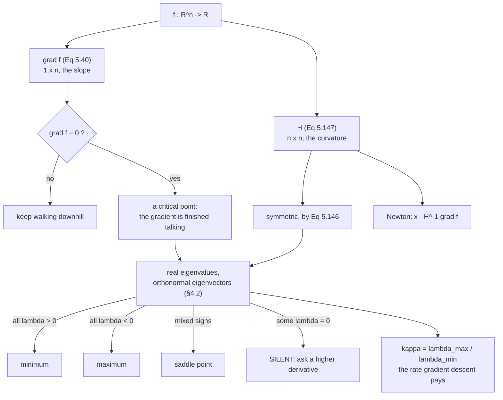

§5.7 is two pages long, and it opens with a reason rather than a definition:

> Sometimes, we are interested in derivatives of higher order, e.g., when we want
> to use Newton's Method for optimization, which requires second-order
> derivatives.

That is the whole motivation, and it is worth taking seriously before the
notation arrives. Every method in [§5.6](../backpropagation-and-automatic-differentiation/)
computes a gradient. A gradient tells you which way is downhill and how steeply.
It does not tell you how far to go, and it does not tell you whether the flat
spot you have arrived at is the bottom of a valley, the top of a hill, or a
mountain pass. Those are second-order questions, and second derivatives are the
answer to all three.

## What you'll learn

- The book's notation for higher-order partials, and why the *order* of the
  subscripts is a real distinction and not decoration.
- **Equation 5.146**, Schwarz's theorem — and the hypothesis in it that everyone
  drops, with the function that punishes you for dropping it.
- **Equation 5.147**, the Hessian, and why symmetry is the property that lets
  [§4.2's spectral theorem](../../chapter-04---matrix-decompositions/eigenvalues-and-eigenvectors/)
  do the classifying.
- What *"the Hessian measures the curvature of the function locally"* means as an
  equation: the second derivative along a unit direction $\mathbf{d}$ is exactly
  $\mathbf{d}^\top H \mathbf{d}$, and its extremes over all $\mathbf{d}$ are the
  eigenvalues.
- The **second-order test**, its three verdicts, and the fourth outcome — silence
  — which is where three different functions with one shared Hessian part company.
- **Newton's method**, measured: quadratic convergence, 8 steps against 426, no
  learning rate — and the two ways it fails that gradient descent does not.
- The book's **Remark**: for a vector field the Hessian is an $(m \times n \times n)$
  tensor, which is why a loss is always a scalar.

## Intuition: slope says where, curvature says what

Stand on a hillside in fog with a spirit level. The level tells you the slope
under your feet — that is the gradient, and it is enough to walk downhill. Walk
until the bubble centres, and now the level is useless: it reads flat at the
bottom of a valley, flat at the summit, and flat in the middle of a pass.

To tell those apart you need a second instrument, one that measures how the slope
*changes* as you step. Take one step north and re-read the level: if the slope
tilts back toward you, the ground curves upward in that direction. Do it east as
well. Do it along every compass bearing, and you have the whole local shape.

The Hessian is that instrument, and it fits in four numbers because curvature in
every direction is determined by curvature along two — a fact that is not obvious
and is exactly what the eigendecomposition is for.



## The math

### Notation, and why the order matters

For $f : \mathbb{R}^2 \to \mathbb{R}$ of two variables $x, y$, the book fixes
four pieces of notation:

| Notation | Meaning |
|---|---|
| $\dfrac{\partial^2 f}{\partial x^2}$ | differentiate twice with respect to $x$ |
| $\dfrac{\partial^n f}{\partial x^n}$ | the $n$th partial derivative with respect to $x$ |
| $\dfrac{\partial^2 f}{\partial y\,\partial x} = \dfrac{\partial}{\partial y}\!\left(\dfrac{\partial f}{\partial x}\right)$ | $x$ first, then $y$ |
| $\dfrac{\partial^2 f}{\partial x\,\partial y}$ | $y$ first, then $x$ |

Read the last two carefully: the operator **closest to $f$ acts first**, so the
subscripts are read right to left. It is a genuinely confusing convention, and
the only mercy is that Equation 5.146 makes the distinction moot for the
functions you will actually meet — which is precisely why so many people never
notice that they had it backwards.

### Equation 5.146, and the hypothesis in it

If $f(x, y)$ is a **twice (continuously) differentiable** function, then

$$
\frac{\partial^2 f}{\partial x\,\partial y} = \frac{\partial^2 f}{\partial y\,\partial x}
\tag{5.146}
$$

The order of differentiation does not matter. Almost every statement of this
result you will see in an ML context drops the hypothesis and says "mixed
partials commute", full stop. They do not, in general. The counterexample is
standard and short:

$$
g(x, y) = \begin{cases} \dfrac{xy\left(x^2 - y^2\right)}{x^2 + y^2} & (x, y) \neq (0, 0) \\[6pt] 0 & (x, y) = (0, 0) \end{cases}
$$

Both mixed partials exist at the origin. They are $-1$ and $+1$. The
[from scratch](#from-scratch) section measures them, and the gap is exactly $2$
at every step size — not a small numerical discrepancy, a whole integer. What
fails is not differentiability, it is *continuity* of the second derivatives at
the origin, which is the clause the short version of the theorem throws away.

### Equation 5.147, the Hessian

Collect all four second partials:

$$
H = \begin{bmatrix}
\dfrac{\partial^2 f}{\partial x^2} & \dfrac{\partial^2 f}{\partial x\,\partial y} \\[10pt]
\dfrac{\partial^2 f}{\partial x\,\partial y} & \dfrac{\partial^2 f}{\partial y^2}
\end{bmatrix}
\tag{5.147}
$$

The book writes it with the *same* entry in both off-diagonal slots, which is
Equation 5.146 already applied. The Hessian is denoted $\nabla^2_{x,y} f(x, y)$.
Generally, for $\mathbf{x} \in \mathbb{R}^n$ and $f : \mathbb{R}^n \to \mathbb{R}$,
$H$ is an $n \times n$ matrix, and

> The Hessian measures the curvature of the function locally around $(x, y)$.

That sentence is the payload of the section, and the next subsection turns it
into something you can check.

### What "measures the curvature" actually says

Take a unit direction $\mathbf{d}$ and walk along it: define
$\varphi(t) = f(\mathbf{x} + t\mathbf{d})$. Differentiate twice by the chain rule
of [§5.2](../partial-differentiation-and-gradients/):

$$
\varphi'(t) = \nabla f(\mathbf{x} + t\mathbf{d})\,\mathbf{d},
\qquad
\varphi''(t) = \mathbf{d}^\top H(\mathbf{x} + t\mathbf{d})\,\mathbf{d}
$$

so at $t = 0$:

$$
\left.\frac{\mathrm{d}^2}{\mathrm{d}t^2} f(\mathbf{x} + t\mathbf{d})\right|_{t=0} = \mathbf{d}^\top H \mathbf{d}
$$

That is the precise version of the sentence. The curvature along $\mathbf{d}$ is
a **quadratic form** in $\mathbf{d}$, and because $H$ is symmetric, §4.2 tells you
everything about that form at once: it has an orthonormal eigenbasis, and over
all unit $\mathbf{d}$,

$$
\lambda_{\min} \;\le\; \mathbf{d}^\top H \mathbf{d} \;\le\; \lambda_{\max}
$$

with both bounds *attained*, along the corresponding eigenvectors. Two numbers
pin down the curvature in every one of infinitely many directions. That is the
content of "the Hessian measures curvature", and the
[curvature sweep below](#see-it-move) draws it as a rosette and checks it against
a measured second difference in all 360 directions.

### The second-order test, and its fourth outcome

At a critical point ($\nabla f = \mathbf{0}$) the signs of the eigenvalues
classify it:

| Eigenvalues of $H$ | Quadratic form | Critical point | Shape |
|---|---|---|---|
| all $> 0$ | positive definite | **strict minimum** | bowl |
| all $< 0$ | negative definite | **strict maximum** | dome |
| mixed signs | indefinite | **saddle point** | pass |
| some $= 0$ | semidefinite | **the test says nothing** | — |

The fourth row is not an edge case to be waved past. Here are three functions:

$$
x_1^2 + x_2^4, \qquad x_1^2 + x_2^3, \qquad x_1^2 - x_2^4
$$

All three have gradient $\mathbf{0}$ at the origin. All three have the **same**
Hessian there,

$$
H = \begin{bmatrix} 2 & 0 \\ 0 & 0 \end{bmatrix}
$$

and the origin is a strict minimum for the first and not an optimum at all for
the other two. No second-order information can separate them, because they do not
differ at second order. A zero eigenvalue means *ask a higher derivative*, not
*no optimum*.

### Newton's method

The reason the book raises second derivatives at all. Model $f$ near
$\mathbf{x}$ by its second-order Taylor polynomial — the subject of the
[next page](../linearization-and-multivariate-taylor-series/) — and jump to the
minimum of the model rather than taking a small step downhill:

$$
\mathbf{x}_{\text{new}} = \mathbf{x} - H^{-1} \nabla f(\mathbf{x})^\top
$$

Three consequences, all measured below:

1. **On a quadratic it is exact in one step**, whatever the conditioning, because
   there the model *is* $f$.
2. **Near a minimum it converges quadratically** — the error roughly squares each
   step. Measured: $1.08\text{e-}01 \to 9.8\text{e-}03 \to 8.1\text{e-}05 \to 5.5\text{e-}09$.
3. **It has no learning rate.** The Hessian supplies the scale. Measured on the
   same problem: 8 Newton steps against 426 gradient-descent steps, and three of
   the four step sizes tried diverged outright.

The price is an $n \times n$ linear solve every step, which is why large models
use first-order methods with cheap curvature proxies (L-BFGS's low-rank
approximation, Adam's diagonal one) instead.

:::caution[Newton's method solves the wrong problem, correctly]
$\mathbf{x} - H^{-1}\nabla f$ is derived from $\nabla f = \mathbf{0}$. It finds
**critical points**, with no preference among them. On $f = x_1^2 - x_2^2$ one
Newton step from anywhere lands *exactly on the saddle* — measured below as
`0.0e+0`. Gradient descent, which only ever goes downhill, walks away from the
same point. Second-order information is strictly more information, and it is not
automatically better behaved.
:::

### Vector-valued functions

The book closes §5.7 with a Remark: if $f : \mathbb{R}^n \to \mathbb{R}^m$ is a
vector field, the Hessian is an $(m \times n \times n)$ **tensor** — one
$n \times n$ Hessian per output component, stacked. Measured for
$f : \mathbb{R}^2 \to \mathbb{R}^3$ below: shape $(3, 2, 2)$, each slice
symmetric, matching the analytic tensor to $1.2\text{e-}08$.

There is no "eigenvalue of a tensor" to read a verdict from. Classification is a
scalar-output idea — which is one concrete reason a training objective is always
collapsed to a single number before anyone differentiates it twice.

:::tip[From the book]
*Mathematics for Machine Learning*, §5.7. The motivation for higher-order
derivatives is Newton's method (citing Nocedal and Wright, 2006). The four
notational conventions for $\partial^2 f / \partial x^2$,
$\partial^n f / \partial x^n$, $\partial^2 f / \partial y \partial x$ and
$\partial^2 f / \partial x \partial y$ are stated with the "closest to $f$ acts
first" reading. **Equation 5.146** gives the commutation of mixed partials for a
twice continuously differentiable $f$; **Equation 5.147** defines the Hessian
matrix, notes it is symmetric, that it is denoted $\nabla^2_{x,y} f(x,y)$, that
it is $n \times n$ in general, and that it "measures the curvature of the
function locally". The closing Remark gives the $(m \times n \times n)$ tensor
for a vector field. The book defers the classification test and Newton's method
themselves to Chapter 7.
:::

## Worked example by hand

Continue the book's **Example 5.7** from §5.2:

$$
f(x_1, x_2) = x_1^2 x_2 + x_1 x_2^3
$$

§5.2 found the gradient. Differentiate each component again. Start from

$$
\frac{\partial f}{\partial x_1} = 2x_1x_2 + x_2^3,
\qquad
\frac{\partial f}{\partial x_2} = x_1^2 + 3x_1x_2^2
$$

**Step 1 — differentiate the first partial with respect to $x_1$.** Treat $x_2$
as a constant. $2x_1x_2$ differentiates to $2x_2$; $x_2^3$ has no $x_1$ in it, so
it goes to zero:

$$
\frac{\partial^2 f}{\partial x_1^2} = 2x_2
$$

**Step 2 — differentiate the first partial with respect to $x_2$.** Now $x_1$ is
the constant. $2x_1x_2 \to 2x_1$, and $x_2^3 \to 3x_2^2$:

$$
\frac{\partial^2 f}{\partial x_2\,\partial x_1} = 2x_1 + 3x_2^2
$$

**Step 3 — the other order, as a check.** Differentiate
$\partial f/\partial x_2 = x_1^2 + 3x_1x_2^2$ with respect to $x_1$:
$x_1^2 \to 2x_1$ and $3x_1x_2^2 \to 3x_2^2$, so

$$
\frac{\partial^2 f}{\partial x_1\,\partial x_2} = 2x_1 + 3x_2^2
$$

Same expression. That is Equation 5.146 for this function, verified rather than
assumed — and here the verification costs one line, which is the usual situation.

**Step 4 — the last entry.** $\partial f/\partial x_2 = x_1^2 + 3x_1x_2^2$
differentiated with respect to $x_2$: the first term dies and the second gives

$$
\frac{\partial^2 f}{\partial x_2^2} = 6x_1x_2
$$

**Step 5 — assemble Equation 5.147.**

$$
H(x_1, x_2) = \begin{bmatrix} 2x_2 & 2x_1 + 3x_2^2 \\ 2x_1 + 3x_2^2 & 6x_1x_2 \end{bmatrix}
$$

Unlike a quadratic's, this Hessian is *not constant* — the curvature genuinely
changes from point to point — and it is *not diagonal*, so the two variables are
coupled.

**Step 6 — evaluate at $(1, 1)$.**

$$
H(1, 1) = \begin{bmatrix} 2 & 5 \\ 5 & 6 \end{bmatrix},
\qquad \operatorname{tr} H = 8,
\qquad \det H = 12 - 25 = -13
$$

The determinant is the product of the eigenvalues and it is **negative**, so the
eigenvalues have opposite signs — you can read "indefinite" off the determinant
without computing either eigenvalue. For the record they are

$$
\lambda = \frac{8 \pm \sqrt{16 + 100}}{2} = 4 \pm \sqrt{29} \approx -1.385165,\; 9.385165
$$

| Quantity | By hand | Differenced, $h = 10^{-4}$ |
|---|---|---|
| $\partial^2 f/\partial x_1^2$ | $2$ | $2.00000003$ |
| $\partial^2 f/\partial x_1 \partial x_2$ | $5$ | $5.00000001$ |
| $\partial^2 f/\partial x_2 \partial x_1$ | $5$ | $5.00000001$ |
| $\partial^2 f/\partial x_2^2$ | $6$ | $6.00000001$ |
| worst gap | — | $3.2 \times 10^{-8}$ |

:::caution[One thing this example is not]
$\nabla f(1,1) = \begin{bmatrix} 3 & 4 \end{bmatrix} \neq \mathbf{0}$, so $(1,1)$
is **not a critical point**. The eigenvalues above describe the curvature there;
they are not a verdict about an optimum, because there is no optimum at $(1,1)$
to have a verdict about. Reading "saddle" off an indefinite Hessian at a
non-critical point is a common and meaningless move.
:::

## See it move

<HessianLab
  client:visible
  surface="saddle"
  title="A saddle, built from four difference stencils"
  desc="Seven frames: the point, the four entries, what the symmetry check can and cannot prove, the eigendecomposition, the curvature rosette, the verdict against a sampled ground truth, and one Newton step. Stop on the rosette — the dashed curve is a measured second difference lying on top of the analytic d-transpose-H-d."
/>

<HessianLab
  client:visible
  surface="degenerate"
  title="The case the test cannot decide"
  desc="x1 squared plus x2 to the fourth. One eigenvalue is exactly zero, so the second-order test is silent — and the origin is a strict minimum anyway. Watch the stencil ladder: the exact zero measures as 2 h-squared, which is POSITIVE, so a naive positive-definiteness test gets the right answer here for entirely the wrong reason."
/>

<HessianLab
  client:visible
  surface="example-5-7"
  title="Example 5.7's Hessian, which is neither constant nor diagonal"
  desc="The same surface §5.2 built its gradient on. The off-diagonal entry is 5, and it is what tips the curvature range out to minus 1.39 and plus 9.39. The last frame is the warning: at an indefinite point the Newton step is not a descent step, and here it lands FARTHER from the reference point than the gradient step does."
/>

```p5 title="Curvature in every direction" desc="Drag the three entries of a symmetric H. The rosette is the curvature d-transpose-H-d as the direction d sweeps the circle: green where the surface bends up along that direction, red where it bends down. The rosette's widest and narrowest reaches are the eigenvalues, and the verdict follows from their signs alone." height="620"
let a = 2, b = 0, d = -2;
let KNOBS = [], BTNS = [], dragging = null, dirAngle = 0.6;

const PRESETS = [
  ["bowl", 2, 0, 4],
  ["dome", -2, 0, -4],
  ["saddle", 2, 0, -2],
  ["ravine", 1, 0, 30],
  ["Example 5.7 at (1,1)", 2, 5, 6],
  ["singular", 2, 0, 0],
];

function setup() { createCanvas(600, 620); textFont("monospace"); noLoop(); }

function knob(id, x, y, w, value, mn, mx, label) {
  KNOBS.push({ id, x, y, w, mn, mx });
  const t = (value - mn) / (mx - mn);
  stroke(60, 74, 92); strokeWeight(2); line(x, y, x + w, y);
  noStroke(); fill(255, 211, 67); ellipse(x + t * w, y, 10, 10);
  fill(190, 200, 212); textSize(11); textAlign(LEFT, CENTER);
  text(label, x + w + 12, y);
}

function mousePressed() {
  for (const t of BTNS)
    if (mouseX > t.x && mouseX < t.x + t.w && mouseY > t.y && mouseY < t.y + t.h) {
      a = t.a; b = t.b; d = t.d; redraw(); return;
    }
  for (const k of KNOBS)
    if (mouseY > k.y - 11 && mouseY < k.y + 11 && mouseX > k.x - 11 && mouseX < k.x + k.w + 11) {
      dragging = k; return;
    }
  // Clicking in the rosette picks the direction to read off.
  if (dist(mouseX, mouseY, 300, 300) < 170) {
    dirAngle = Math.atan2(300 - mouseY, mouseX - 300); redraw();
  }
}
function mouseReleased() { dragging = null; }
function mouseDragged() {
  if (!dragging) {
    if (dist(mouseX, mouseY, 300, 300) < 190) {
      dirAngle = Math.atan2(300 - mouseY, mouseX - 300); redraw();
    }
    return;
  }
  const t = Math.min(1, Math.max(0, (mouseX - dragging.x) / dragging.w));
  const v = Math.round((dragging.mn + t * (dragging.mx - dragging.mn)) * 2) / 2;
  if (dragging.id === "a") a = v;
  if (dragging.id === "b") b = v;
  if (dragging.id === "d") d = v;
  redraw();
}

// Closed-form symmetric 2x2 eigenvalues. No iteration, so nothing to converge.
function eigs() {
  const mid = (a + d) / 2, disc = Math.sqrt(((a - d) / 2) ** 2 + b * b);
  return [mid - disc, mid + disc];
}

function draw() {
  background(13, 17, 23);
  KNOBS = []; BTNS = [];
  const [l1, l2] = eigs();
  const TOL = 1e-9;
  const verdict = l1 > TOL ? "positive definite: MINIMUM"
    : l2 < -TOL ? "negative definite: MAXIMUM"
    : (l1 < -TOL && l2 > TOL) ? "indefinite: SADDLE POINT"
    : "semidefinite: THE TEST SAYS NOTHING";
  const vcol = l1 > TOL ? color(120, 200, 150)
    : l2 < -TOL ? color(107, 169, 221)
    : (l1 < -TOL && l2 > TOL) ? color(197, 153, 255)
    : color(255, 211, 67);

  // The rosette: radius |d^T H d|, colour by sign.
  const cx = 300, cy = 300;
  const cmax = Math.max(Math.abs(l1), Math.abs(l2), 1e-9);
  const R = 150;
  noFill();
  for (let i = 0; i < 360; i++) {
    const t0 = (i * Math.PI) / 180, t1 = ((i + 1) * Math.PI) / 180;
    const q = (t) => a * Math.cos(t) ** 2 + 2 * b * Math.cos(t) * Math.sin(t) + d * Math.sin(t) ** 2;
    const q0 = q(t0), q1 = q(t1);
    const r0 = (Math.abs(q0) / cmax) * R, r1 = (Math.abs(q1) / cmax) * R;
    stroke(q0 >= 0 ? color(120, 200, 150) : color(232, 110, 110));
    strokeWeight(2.4);
    line(cx + r0 * Math.cos(t0), cy - r0 * Math.sin(t0),
         cx + r1 * Math.cos(t1), cy - r1 * Math.sin(t1));
  }
  // Unit circle for scale, and the zero-curvature ring.
  stroke(60, 74, 92); strokeWeight(1); noFill(); ellipse(cx, cy, 2 * R, 2 * R);
  fill(120, 130, 145); noStroke(); textSize(10); textAlign(LEFT, CENTER);
  text(`|curvature| = ${cmax.toFixed(1)}`, cx + R + 6, cy);

  // The picked direction, and its curvature.
  const cd = Math.cos(dirAngle), sd = Math.sin(dirAngle);
  const qd = a * cd * cd + 2 * b * cd * sd + d * sd * sd;
  const rd = (Math.abs(qd) / cmax) * R;
  stroke(255, 211, 67); strokeWeight(2);
  line(cx, cy, cx + rd * cd, cy - rd * sd);
  noStroke(); fill(255, 211, 67); ellipse(cx + rd * cd, cy - rd * sd, 9, 9);

  // Eigenvector axes.
  const evecs = Math.abs(b) < 1e-12
    ? [[1, 0], [0, 1]]
    : [[b, l1 - a], [b, l2 - a]].map(([p, q]) => { const n = Math.hypot(p, q); return [p / n, q / n]; });
  const evals = Math.abs(b) < 1e-12 ? [a, d] : [l1, l2];
  for (let k = 0; k < 2; k++) {
    const [vx, vy] = evecs[k], lv = evals[k];
    const L = 0.34 * R + (Math.abs(lv) / cmax) * 0.66 * R;
    stroke(lv > TOL ? color(120, 200, 150) : lv < -TOL ? color(232, 110, 110) : color(255, 211, 67));
    strokeWeight(1.6); drawingContext.setLineDash([5, 4]);
    line(cx - L * vx, cy + L * vy, cx + L * vx, cy - L * vy);
    drawingContext.setLineDash([]);
  }

  // Header and the live numbers.
  noStroke(); textAlign(LEFT, TOP);
  fill(255, 211, 67); textSize(15); text("d^T H d, swept over every unit direction", 16, 12);
  fill(200, 210, 222); textSize(11);
  text("green = curves UP along d, red = curves DOWN. Click inside to pick a direction.", 16, 34);
  fill(235); textSize(12);
  text(`H = [ ${a.toFixed(1)}  ${b.toFixed(1)} ;  ${b.toFixed(1)}  ${d.toFixed(1)} ]`, 16, 56);
  text(`trace ${(a + d).toFixed(2)}    det ${(a * d - b * b).toFixed(2)}`, 300, 56);
  fill(150); textSize(11);
  text(`eigenvalues  ${l1.toFixed(4)}   ${l2.toFixed(4)}`, 16, 78);
  const kappa = Math.min(Math.abs(l1), Math.abs(l2)) > 1e-9 && l1 * l2 > 0
    ? (Math.max(Math.abs(l1), Math.abs(l2)) / Math.min(Math.abs(l1), Math.abs(l2))).toFixed(2)
    : "not defined (H is not definite)";
  text(`condition number  ${kappa}`, 300, 78);

  // The picked direction's readout.
  fill(255, 211, 67); textSize(12);
  text(`d = [ ${cd.toFixed(4)}  ${sd.toFixed(4)} ]   ->   d^T H d = ${qd.toFixed(4)}`, 16, 470);
  fill(150); textSize(11);
  text(`and it is squeezed: ${l1.toFixed(4)} <= ${qd.toFixed(4)} <= ${l2.toFixed(4)}`, 16, 490);

  // The verdict.
  fill(vcol); textSize(15); text(verdict, 16, 512);

  // Knobs.
  knob("a", 16, 552, 150, a, -6, 6, `H11 = ${a.toFixed(1)}`);
  knob("b", 16, 578, 150, b, -6, 6, `H12 = H21 = ${b.toFixed(1)}`);
  knob("d", 16, 604, 150, d, -6, 6, `H22 = ${d.toFixed(1)}`);

  // Presets.
  let bx = 330, by = 540;
  fill(150); noStroke(); textSize(10); textAlign(LEFT, BOTTOM);
  text("presets", bx, by - 4);
  for (let i = 0; i < PRESETS.length; i++) {
    const [nm, pa, pb, pd] = PRESETS[i];
    const x = bx + (i % 2) * 130, y = by + Math.floor(i / 2) * 26;
    const on = a === pa && b === pb && d === pd;
    BTNS.push({ x, y, w: 124, h: 21, a: pa, b: pb, d: pd });
    noStroke(); fill(on ? color(255, 211, 67) : color(38, 48, 60));
    rect(x, y, 124, 21, 4);
    fill(on ? 13 : 200); textSize(9.5); textAlign(CENTER, CENTER);
    text(nm, x + 62, y + 11);
  }
}
```

```p5 title="Why the test goes silent" desc="f = x1 squared plus s times x2 to the power p. Slide p. At p = 2 the Hessian is diagonal with both entries nonzero and the test answers. At p > 2 the second derivative in x2 is exactly zero at the origin, the Hessian is singular, and the test is silent — while the truth, sampled from the function itself, keeps changing with p and with the sign s." height="560"
let p = 4, sgn = 1;
let KNOBS = [], BTNS = [], dragging = null;

function setup() { createCanvas(600, 560); textFont("monospace"); noLoop(); }

function knob(id, x, y, w, value, mn, mx, label) {
  KNOBS.push({ id, x, y, w, mn, mx });
  const t = (value - mn) / (mx - mn);
  stroke(60, 74, 92); strokeWeight(2); line(x, y, x + w, y);
  noStroke(); fill(255, 211, 67); ellipse(x + t * w, y, 10, 10);
  fill(190, 200, 212); textSize(11); textAlign(LEFT, CENTER);
  text(label, x + w + 12, y);
}
function mousePressed() {
  for (const t of BTNS)
    if (mouseX > t.x && mouseX < t.x + t.w && mouseY > t.y && mouseY < t.y + t.h) {
      sgn = t.s; redraw(); return;
    }
  for (const k of KNOBS)
    if (mouseY > k.y - 11 && mouseY < k.y + 11 && mouseX > k.x - 11 && mouseX < k.x + k.w + 11) {
      dragging = k; return;
    }
}
function mouseReleased() { dragging = null; }
function mouseDragged() {
  if (!dragging) return;
  const t = Math.min(1, Math.max(0, (mouseX - dragging.x) / dragging.w));
  p = Math.round(dragging.mn + t * (dragging.mx - dragging.mn));
  redraw();
}

const f = (x, y) => x * x + sgn * Math.pow(y, p);

function draw() {
  background(13, 17, 23);
  KNOBS = []; BTNS = [];

  // The Hessian's x2x2 entry at the origin: p(p-1) y^(p-2) at y = 0.
  const fyy = p === 2 ? 2 * sgn : 0;
  const singular = Math.abs(fyy) < 1e-12;
  const eig = [Math.min(2, fyy), Math.max(2, fyy)];

  // The truth, sampled rather than asserted: walk a small circle.
  let up = 0, down = 0;
  for (let i = 0; i < 720; i++) {
    const t = (2 * Math.PI * i) / 720, r = 0.05;
    const v = f(r * Math.cos(t), r * Math.sin(t));
    if (v > 1e-15) up++; else if (v < -1e-15) down++;
  }
  const truth = down === 0 ? "a strict MINIMUM" : up === 0 ? "a strict MAXIMUM" : "NOT an optimum";
  const says = eig[0] > 1e-9 ? "minimum"
    : eig[1] < -1e-9 ? "maximum"
    : (eig[0] < -1e-9 && eig[1] > 1e-9) ? "saddle" : "NOTHING";

  // The slice along x2, which is where all the action is.
  const gx = 60, gy = 250, gw = 480, gh = 170;
  noStroke(); fill(20, 26, 34); rect(gx, gy - gh / 2, gw, gh, 4);
  stroke(60, 74, 92); strokeWeight(1);
  line(gx, gy, gx + gw, gy);
  line(gx + gw / 2, gy - gh / 2, gx + gw / 2, gy + gh / 2);

  const YR = 1.15;
  let vmax = 1e-9;
  for (let i = 0; i <= 200; i++) {
    const y = -YR + (2 * YR * i) / 200;
    vmax = Math.max(vmax, Math.abs(sgn * Math.pow(y, p)));
  }
  // The function along x2, and its second-order model, which is FLAT here.
  stroke(107, 169, 221); strokeWeight(2.4); noFill();
  beginShape();
  for (let i = 0; i <= 240; i++) {
    const y = -YR + (2 * YR * i) / 240;
    const v = sgn * Math.pow(y, p);
    vertex(gx + ((y + YR) / (2 * YR)) * gw, gy - (v / vmax) * (gh / 2 - 8));
  }
  endShape();
  stroke(255, 211, 67); strokeWeight(1.8); drawingContext.setLineDash([6, 5]);
  beginShape();
  for (let i = 0; i <= 40; i++) {
    const y = -YR + (2 * YR * i) / 40;
    const v = 0.5 * fyy * y * y;                      // the second-order model
    vertex(gx + ((y + YR) / (2 * YR)) * gw, gy - (v / vmax) * (gh / 2 - 8));
  }
  endShape();
  drawingContext.setLineDash([]);

  noStroke(); textAlign(LEFT, TOP);
  fill(255, 211, 67); textSize(15);
  text("the slice along x2, and what second order can see of it", 16, 12);
  fill(200, 210, 222); textSize(11);
  text("solid blue: f along x2.  dashed amber: the whole second-order model of that slice.", 16, 34);

  fill(235); textSize(13);
  text(`f(x1, x2) = x1^2 ${sgn > 0 ? "+" : "-"} x2^${p}`, 16, 62);
  fill(150); textSize(11);
  text(`H(0) = [ 2  0 ; 0  ${fyy.toFixed(0)} ]     eigenvalues ${eig[0].toFixed(0)}, ${eig[1].toFixed(0)}`, 16, 86);
  text(`sampled on a circle of radius 0.05:  ${up} up, ${down} down, of 720`, 16, 106);

  fill(singular ? color(255, 211, 67) : color(120, 200, 150)); textSize(14);
  text(`the second-order test says: ${says}`, 16, 136);
  fill(107, 169, 221); textSize(14);
  text(`the truth is: ${truth}`, 16, 158);
  fill(150); textSize(11);
  text(singular
    ? `d2f/dx2^2 at the origin is p(p-1) y^(p-2) = 0 for p > 2, so the model of this`
    : `both diagonal entries are nonzero, so the test is decisive and correct`, 16, 182);
  if (singular) text(`slice is the flat amber line -- and a flat model has no verdict to give.`, 16, 198);

  fill(120, 130, 145); textSize(10); textAlign(CENTER, TOP);
  text("x2 = -1.15", gx, gy + gh / 2 + 6);
  text("0", gx + gw / 2, gy + gh / 2 + 6);
  text("x2 = +1.15", gx + gw, gy + gh / 2 + 6);

  knob("p", 16, 480, 200, p, 2, 6, `p = ${p}`);
  let bx = 330, by = 468;
  fill(150); noStroke(); textSize(10); textAlign(LEFT, BOTTOM);
  text("sign s", bx, by - 4);
  for (const [nm, sv] of [["+ x2^p", 1], ["- x2^p", -1]]) {
    const x = bx + (sv > 0 ? 0 : 110), y = by;
    BTNS.push({ x, y, w: 100, h: 22, s: sv });
    noStroke(); fill(sgn === sv ? color(255, 211, 67) : color(38, 48, 60));
    rect(x, y, 100, 22, 4);
    fill(sgn === sv ? 13 : 200); textSize(10.5); textAlign(CENTER, CENTER);
    text(nm, x + 50, y + 11);
  }
  fill(150); noStroke(); textSize(10); textAlign(LEFT, TOP);
  text("At p = 3 and p = 5 the origin is not an optimum for either sign.", 330, 500);
  text("At p = 4 and p = 6 the sign decides it, and the Hessian never knows.", 330, 516);
}
```

Two labs from Chapter 7's toolkit, because the point of §5.7 is what the Hessian
*buys*:

<DescentLab
  client:visible
  surface="ill-conditioned"
  method="newton"
  title="Newton on a ravine: one step, no learning rate"
  desc="The same surface where gradient descent zig-zags for hundreds of iterations. On a quadratic the second-order model is the function, so the first Newton step lands on the minimum regardless of how badly conditioned it is."
/>

<DescentLab
  client:visible
  surface="saddle"
  method="newton"
  title="And the same method walking straight onto a saddle"
  desc="Newton solves grad f = 0. Given an indefinite Hessian it converges to the saddle in one step and stops there, reporting success. This is the failure mode that first-order methods, for all their slowness, do not have."
/>

## From scratch

Build the Hessian from its definition, classify with it, and then find the three
places where the classification does not do what the summary version promises.

```python title="hessian_from_scratch.py" showLineNumbers{1}
import numpy as np


def hessian(f, x, h=1e-4):
    """Every entry from its own stencil. Nothing is copied across the diagonal."""
    x = np.asarray(x, dtype=float)
    n = x.size
    H = np.zeros((n, n))
    f0 = f(x)
    for i in range(n):
        ei = np.zeros(n)
        ei[i] = h
        H[i, i] = (f(x + ei) - 2 * f0 + f(x - ei)) / h ** 2
        for j in range(n):
            if i == j:
                continue
            ej = np.zeros(n)
            ej[j] = h
            H[i, j] = (f(x + ei + ej) - f(x + ei - ej)
                       - f(x - ei + ej) + f(x - ei - ej)) / (4 * h ** 2)
    return H


def classify(H, tol=1e-6):
    """Eq 5.147's matrix is symmetric, so eigvalsh is the right routine."""
    ev = np.linalg.eigvalsh(H)
    if ev.min() > tol:
        return "minimum", ev
    if ev.max() < -tol:
        return "maximum", ev
    if ev.min() < -tol < tol < ev.max():
        return "saddle", ev
    return "SILENT (an eigenvalue is zero)", ev


# Example 5.7, differentiated twice by hand:
#   f    = x1^2 x2 + x1 x2^3
#   H    = [[ 2 x2,          2 x1 + 3 x2^2 ],
#           [ 2 x1 + 3 x2^2, 6 x1 x2       ]]
f = lambda v: v[0] ** 2 * v[1] + v[0] * v[1] ** 3
H_exact = lambda x, y: np.array([[2 * y, 2 * x + 3 * y ** 2],
                                 [2 * x + 3 * y ** 2, 6 * x * y]])

print("Example 5.7's Hessian: differenced against the hand derivation")
print(f"  {'point':>12}  {'H by differences':>32}  {'H by hand':>32}  {'worst gap':>9}")
for pt in ([1.0, 1.0], [0.5, -1.5], [2.0, 0.3], [0.0, 0.0]):
    Hn = hessian(f, pt)
    He = H_exact(*pt)
    print(f"  {str(pt):>12}  {str(np.round(Hn.ravel(), 4)):>32}"
          f"  {str(np.round(He.ravel(), 4)):>32}  {np.abs(Hn - He).max():>9.1e}")

H11 = H_exact(1.0, 1.0)
kind, ev = classify(H11)
print()
print(f"At (1, 1): H = {H11.tolist()}")
print(f"  trace {np.trace(H11):.4f}   det {np.linalg.det(H11):.4f}")
print(f"  eigenvalues {ev}  ->  {kind}")
print(f"  but grad f(1,1) = {np.array([3.0, 4.0])}, which is not zero, so there is")
print("  nothing to classify here: those eigenvalues are curvature, not a verdict.")

print()
print("The trio the textbooks show, and the one they leave out")
tri = [
    ("x1^2 + 2 x2^2", lambda v: v[0] ** 2 + 2 * v[1] ** 2),
    ("-x1^2 - 2 x2^2", lambda v: -(v[0] ** 2) - 2 * v[1] ** 2),
    ("x1^2 - x2^2", lambda v: v[0] ** 2 - v[1] ** 2),
    ("x1^2 + x2^4", lambda v: v[0] ** 2 + v[1] ** 4),
    ("x1^2 + x2^3", lambda v: v[0] ** 2 + v[1] ** 3),
    ("x1^2 - x2^4", lambda v: v[0] ** 2 - v[1] ** 4),
]
# Ground truth, sampled rather than asserted: walk a small circle around the
# origin and see whether f goes up, down, or both.
th = np.linspace(0, 2 * np.pi, 720, endpoint=False)
r = 0.05
print(f"  {'f':>16}  {'eigenvalues of H(0)':>22}  {'test says':>32}  {'truth':>8}")
for name, fn in tri:
    H = hessian(fn, [0.0, 0.0])
    kind, ev = classify(H)
    vals = np.array([fn([r * np.cos(t), r * np.sin(t)]) for t in th]) - fn([0.0, 0.0])
    up, dn = int((vals > 1e-14).sum()), int((vals < -1e-14).sum())
    truth = "minimum" if dn == 0 else "maximum" if up == 0 else "neither"
    print(f"  {name:>16}  [{ev[0]:+.4f} {ev[1]:+.4f}]  {kind:>32}  {truth:>8}")
print("  The last three share the SAME Hessian, [[2,0],[0,0]], and have three")
print("  different answers. A singular Hessian is not a hard case, it is a case")
print("  the second-order test does not address.")

print()
print("Why you must never test an eigenvalue against zero")
g = lambda v: v[0] ** 2 + v[1] ** 4          # exact d2f/dx2^2 at the origin is 0
print(f"  {'h':>8}  {'d2f/dx2^2':>12}  {'2 h^2':>9}  {'min eigenvalue > 0 ?':>20}")
for h in (1e-2, 1e-3, 1e-4, 1e-5, 1e-6, 1e-7):
    H = hessian(g, [0.0, 0.0], h)
    ev = np.linalg.eigvalsh(H)
    print(f"  {h:>8.0e}  {H[1, 1]:>12.3e}  {2 * h ** 2:>9.1e}  {str(bool(ev.min() > 0)):>20}")
print("  The floor is exactly 2h^2 -- the leading truncation term of the stencil --")
print("  and it is POSITIVE, so a naive test calls this singular Hessian positive")
print("  definite at every step size. Compare against a tolerance, not against 0.")

print()
print("The mixed partials: what the stencil can and cannot show")
smooth = lambda x, y: np.sin(x * y) + x ** 2 * y ** 3 + np.exp(0.3 * x)
worst = 0.0
for h in np.logspace(-1, -7, 13):
    for xx in np.linspace(-1.2, 1.2, 9):
        for yy in np.linspace(-1.2, 1.2, 9):
            a = (smooth(xx + h, yy + h) - smooth(xx + h, yy - h)
                 - smooth(xx - h, yy + h) + smooth(xx - h, yy - h)) / (4 * h ** 2)
            b = (smooth(xx + h, yy + h) - smooth(xx - h, yy + h)
                 - smooth(xx + h, yy - h) + smooth(xx - h, yy - h)) / (4 * h ** 2)
            worst = max(worst, abs(a - b))
print(f"  a smooth f, 13 step sizes x 81 grid points: worst gap {worst:.1e}")
print("  and that proves nothing: both orders regroup the same four corner values,")
print("  so this stencil is symmetric by construction. To see Eq 5.146 FAIL you have")
print("  to take the two iterated limits separately:")


def bad(x, y):
    """The standard counterexample. Not twice continuously differentiable at 0."""
    r2 = x * x + y * y
    return 0.0 if r2 == 0 else x * y * (x * x - y * y) / r2


dx = lambda y, d: (bad(d, y) - bad(-d, y)) / (2 * d)
dy = lambda x, d: (bad(x, d) - bad(x, -d)) / (2 * d)
print(f"    {'outer step':>11}  {'d_y(d_x g)':>11}  {'d_x(d_y g)':>11}  {'gap':>5}")
for t in (1e-1, 1e-2, 1e-3, 1e-4, 1e-5):
    inner = t * 1e-5
    a = (dx(t, inner) - dx(-t, inner)) / (2 * t)
    b = (dy(t, inner) - dy(-t, inner)) / (2 * t)
    print(f"    {t:>11.0e}  {a:>11.6f}  {b:>11.6f}  {abs(a - b):>5.2f}")
print("  Eq 5.146's hypothesis is TWICE CONTINUOUSLY differentiable, and this g is")
print("  not: the mixed partials exist at the origin and differ by exactly 2.")
```

```text title="output"
Example 5.7's Hessian: differenced against the hand derivation
         point                  H by differences                         H by hand  worst gap
    [1.0, 1.0]                     [2. 5. 5. 6.]                     [2. 5. 5. 6.]    3.2e-08
   [0.5, -1.5]         [-3.    7.75  7.75 -4.5 ]         [-3.    7.75  7.75 -4.5 ]    2.0e-08
    [2.0, 0.3]             [0.6  4.27 4.27 3.6 ]             [0.6  4.27 4.27 3.6 ]    1.3e-08
    [0.0, 0.0]                     [0. 0. 0. 0.]                     [0. 0. 0. 0.]    1.0e-08

At (1, 1): H = [[2.0, 5.0], [5.0, 6.0]]
  trace 8.0000   det -13.0000
  eigenvalues [-1.38516481  9.38516481]  ->  saddle
  but grad f(1,1) = [3. 4.], which is not zero, so there is
  nothing to classify here: those eigenvalues are curvature, not a verdict.

The trio the textbooks show, and the one they leave out
                 f     eigenvalues of H(0)                         test says     truth
     x1^2 + 2 x2^2  [+2.0000 +4.0000]                           minimum   minimum
    -x1^2 - 2 x2^2  [-4.0000 -2.0000]                           maximum   maximum
       x1^2 - x2^2  [-2.0000 +2.0000]                            saddle   neither
       x1^2 + x2^4  [+0.0000 +2.0000]    SILENT (an eigenvalue is zero)   minimum
       x1^2 + x2^3  [+0.0000 +2.0000]    SILENT (an eigenvalue is zero)   neither
       x1^2 - x2^4  [-0.0000 +2.0000]    SILENT (an eigenvalue is zero)   neither
  The last three share the SAME Hessian, [[2,0],[0,0]], and have three
  different answers. A singular Hessian is not a hard case, it is a case
  the second-order test does not address.

Why you must never test an eigenvalue against zero
         h     d2f/dx2^2      2 h^2  min eigenvalue > 0 ?
     1e-02     2.000e-04    2.0e-04                  True
     1e-03     2.000e-06    2.0e-06                  True
     1e-04     2.000e-08    2.0e-08                  True
     1e-05     2.000e-10    2.0e-10                  True
     1e-06     2.000e-12    2.0e-12                  True
     1e-07     2.000e-14    2.0e-14                  True
  The floor is exactly 2h^2 -- the leading truncation term of the stencil --
  and it is POSITIVE, so a naive test calls this singular Hessian positive
  definite at every step size. Compare against a tolerance, not against 0.

The mixed partials: what the stencil can and cannot show
  a smooth f, 13 step sizes x 81 grid points: worst gap 0.0e+00
  and that proves nothing: both orders regroup the same four corner values,
  so this stencil is symmetric by construction. To see Eq 5.146 FAIL you have
  to take the two iterated limits separately:
     outer step   d_y(d_x g)   d_x(d_y g)    gap
          1e-01    -1.000000     1.000000   2.00
          1e-02    -1.000000     1.000000   2.00
          1e-03    -1.000000     1.000000   2.00
          1e-04    -1.000000     1.000000   2.00
          1e-05    -1.000000     1.000000   2.00
  Eq 5.146's hypothesis is TWICE CONTINUOUSLY differentiable, and this g is
  not: the mixed partials exist at the origin and differ by exactly 2.
```

Three things in that output are worth pausing on.

The **worst gap of $3.2 \times 10^{-8}$** is not a small number for a second
derivative, and it is not sloppiness. A second difference divides by $h^2$, so
where a first derivative loses about half its digits at the optimal step, a
second derivative loses about two thirds. Second derivatives are simply harder to
get numerically, which is one more argument for
[automatic differentiation](../backpropagation-and-automatic-differentiation/)
over differencing.

The **three-way split** on `x1^2 + x2^4`, `x1^2 + x2^3` and `x1^2 - x2^4` is the
main event. One Hessian, three answers, and no tolerance choice or step size can
fix it: the information is not there.

The **`2h^2` column** is the trap that follows from that. Read the `min eigenvalue > 0`
column: it says `True` at every step size, for a matrix whose smaller eigenvalue
is exactly zero. Test against zero and you will confidently call a degenerate
point a strict minimum, forever.

Then the part §5.7 is actually motivated by:

```python title="newton_vs_descent.py" showLineNumbers{1}
import numpy as np

# A strictly convex function with no closed-form minimiser, so "converged" is a
# measurement rather than a comparison against an answer that was known already.
A = np.array([[1.0, 3.0], [1.0, -3.0], [-1.0, 0.0]])
b = np.array([-0.1, -0.1, -0.1])

f = lambda x: float(np.sum(np.exp(A @ x + b)))
grad = lambda x: A.T @ np.exp(A @ x + b)


def hess(x):
    w = np.exp(A @ x + b)
    return A.T @ (w[:, None] * A)


# The reference optimum: Newton run far past convergence.
xs = np.zeros(2)
for _ in range(200):
    xs = xs - np.linalg.solve(hess(xs), grad(xs))

print(f"minimiser x* = [{xs[0]:.12f} {xs[1]:.12f}]   |grad f(x*)| = {np.linalg.norm(grad(xs)):.1e}")
print(f"H(x*) eigenvalues {np.linalg.eigvalsh(hess(xs))}  ->  positive definite, a strict minimum")
print()
print("Newton from x0 = [1.0, 0.8]:  x <- x - H^-1 grad f")
print(f"  {'iter':>5}  {'|x - x*|':>11}  {'|grad f|':>11}  {'err / prev^2':>12}")
x = np.array([1.0, 0.8])
prev = np.linalg.norm(x - xs)
print(f"  {0:>5}  {prev:>11.3e}  {np.linalg.norm(grad(x)):>11.3e}")
for k in range(1, 9):
    x = x - np.linalg.solve(hess(x), grad(x))
    e = np.linalg.norm(x - xs)
    print(f"  {k:>5}  {e:>11.3e}  {np.linalg.norm(grad(x)):>11.3e}  {e / prev ** 2:>12.4f}")
    prev = e
    if e < 1e-15:
        break
print("  Each error is about 0.84 times the SQUARE of the previous one: that ratio")
print("  settling to a constant is what quadratic convergence looks like.")
print()
print("Gradient descent from the same start, fixed step:")
# A diverging run overflows exp() on the way out, which is the divergence itself
# rather than a bug -- silence the warning and report the outcome.
np.seterr(over="ignore", invalid="ignore")
for lr in (0.02, 0.05, 0.1, 0.2):
    x = np.array([1.0, 0.8])
    n = 0
    blew = False
    while np.linalg.norm(x - xs) > 1e-10 and n < 200000:
        x = x - lr * grad(x)
        n += 1
        if not np.all(np.isfinite(x)) or np.linalg.norm(x) > 1e6:
            blew = True
            break
    print(f"  step {lr:<5} {'DIVERGED' if blew else f'{n:>6} iterations to |x - x*| < 1e-10'}")
print("  8 Newton steps against 426, and only one of four step sizes even converged.")
print("  Newton has no step size to tune: the Hessian supplies the scale.")

print()
print("What the eigenvalue RATIO costs gradient descent")
print(f"  {'kappa':>7}  {'measured steps':>14}  {'log(eps) / log((k-1)/(k+1))':>28}")
for k in (1.0, 2.0, 5.0, 10.0, 30.0, 100.0, 300.0, 1000.0):
    lam = np.array([1.0, k])              # H = diag(1, k), a quadratic bowl
    lr = 2.0 / (1.0 + k)                  # the optimal fixed step for this H
    x = np.array([1.0, 1.0])
    n = 0
    while np.linalg.norm(x) > 1e-8 and n < 200000:
        x = x - lr * lam * x
        n += 1
    pred = np.log(1e-8 / np.sqrt(2)) / np.log((k - 1) / (k + 1)) if k > 1 else 1
    print(f"  {k:>7.0f}  {n:>14}  {pred:>28.0f}")
print("  The count is linear in kappa, and the closed-form rate predicts it to within")
print("  one step across three orders of magnitude. Newton needs exactly 1 step for")
print("  every one of these, because for a quadratic the second-order model is f.")
```

```text title="output"
minimiser x* = [-0.346573590280 -0.000000000000]   |grad f(x*)| = 0.0e+00
H(x*) eigenvalues [ 2.5592667  11.51670013]  ->  positive definite, a strict minimum

Newton from x0 = [1.0, 0.8]:  x <- x - H^-1 grad f
   iter     |x - x*|     |grad f|  err / prev^2
      0    1.566e+00    8.507e+01
      1    1.088e+00    3.104e+01        0.4434
      2    7.223e-01    1.098e+01        0.6106
      3    3.622e-01    3.527e+00        0.6942
      4    1.083e-01    7.982e-01        0.8255
      5    9.837e-03    6.710e-02        0.8386
      6    8.141e-05    5.457e-04        0.8413
      7    5.468e-09    3.699e-08        0.8251
      8    2.345e-17    0.000e+00        0.7842
  Each error is about 0.84 times the SQUARE of the previous one: that ratio
  settling to a constant is what quadratic convergence looks like.

Gradient descent from the same start, fixed step:
  step 0.02     426 iterations to |x - x*| < 1e-10
  step 0.05  DIVERGED
  step 0.1   DIVERGED
  step 0.2   DIVERGED
  8 Newton steps against 426, and only one of four step sizes even converged.
  Newton has no step size to tune: the Hessian supplies the scale.

What the eigenvalue RATIO costs gradient descent
    kappa  measured steps   log(eps) / log((k-1)/(k+1))
        1               1                             1
        2              18                            17
        5              47                            46
       10              94                            94
       30             282                           281
      100             939                           938
      300            2816                          2815
     1000            9384                          9384
  The count is linear in kappa, and the closed-form rate predicts it to within
  one step across three orders of magnitude. Newton needs exactly 1 step for
  every one of these, because for a quadratic the second-order model is f.
```

The `err / prev^2` column is the whole argument for second-order methods. It
settles at about $0.84$ and stays there, which means each error is a constant
times the *square* of the last: $1.08\text{e-}01$, then $9.8\text{e-}03$, then
$8.1\text{e-}05$, then $5.5\text{e-}09$. Roughly doubling the number of correct
digits per step. Gradient descent's error falls by a constant *factor* instead,
and the factor is $(\kappa-1)/(\kappa+1)$ — which is why the last table's step
count is linear in the eigenvalue ratio.

And the two facts §5.7's Remark and Chapter 7 leave you to discover:

```python title="curvature_in_the_large.py" showLineNumbers{1}
import numpy as np


def hessian(f, x, h=1e-4):
    x = np.asarray(x, dtype=float)
    n = x.size
    H = np.zeros((n, n))
    f0 = f(x)
    for i in range(n):
        ei = np.zeros(n)
        ei[i] = h
        H[i, i] = (f(x + ei) - 2 * f0 + f(x - ei)) / h ** 2
        for j in range(n):
            if i == j:
                continue
            ej = np.zeros(n)
            ej[j] = h
            H[i, j] = (f(x + ei + ej) - f(x + ei - ej)
                       - f(x - ei + ej) + f(x - ei - ej)) / (4 * h ** 2)
    return H


print("The Remark: for a vector field the Hessian is an (m x n x n) tensor")
F = lambda v: np.array([v[0] ** 2 * v[1], np.sin(v[0]) + v[1] ** 3, v[0] * v[1]])
x0 = np.array([0.7, -0.4])
m, n = 3, 2
T = np.stack([hessian(lambda v, k=k: F(v)[k], x0) for k in range(m)])
exact = np.array([
    [[2 * x0[1], 2 * x0[0]], [2 * x0[0], 0.0]],
    [[-np.sin(x0[0]), 0.0], [0.0, 6 * x0[1]]],
    [[0.0, 1.0], [1.0, 0.0]],
])
print(f"  f : R^{n} -> R^{m}      grad f is {m} x {n}      the Hessian is {T.shape}")
print(f"  one n x n Hessian per output component, stacked")
print(f"  matches the analytic tensor to {np.abs(T - exact).max():.1e}")
print(f"  every n x n slice symmetric to {max(np.abs(T[k] - T[k].T).max() for k in range(m)):.1e}")
print("  There is no 'eigenvalue of a tensor' to read a verdict from -- classification")
print("  is a scalar-output idea, which is why a loss is always a scalar.")

print()
print("How rare a minimum is in n dimensions")
print("  Random symmetric Hessians (the Gaussian orthogonal ensemble), 20000 draws each.")
rng = np.random.default_rng(0)
T_DRAWS = 20000
print(f"  {'n':>4}  {'P(all eigenvalues > 0)':>22}  {'coin-flip guess 2^-n':>20}  {'P(saddle)':>10}")
for nd in (1, 2, 3, 4, 5, 6, 8, 10, 12):
    pd = sad = 0
    for _ in range(T_DRAWS):
        M = rng.normal(size=(nd, nd))
        S = (M + M.T) / np.sqrt(2 * nd)
        ev = np.linalg.eigvalsh(S)
        if ev.min() > 0:
            pd += 1
        elif ev.min() < 0 < ev.max():
            sad += 1
    print(f"  {nd:>4}  {pd / T_DRAWS:>22.5f}  {2.0 ** -nd:>20.5f}  {sad / T_DRAWS:>10.5f}")
print("  Note the two middle columns do NOT agree, and the direction matters: the")
print("  coin-flip guess is far too OPTIMISTIC. Eigenvalues of a symmetric matrix")
print("  repel each other rather than landing independently, so all-same-sign is")
print("  rarer than n independent coin flips. By n = 6 it is already unobservable in")
print("  20000 draws -- and a network has millions of parameters.")

print()
print("The cheap positive-definiteness test: Cholesky, not eigenvalues")
mats = [("Example 5.7 at (1,1)", np.array([[2.0, 5.0], [5.0, 6.0]])),
        ("bowl", np.array([[2.0, 0.0], [0.0, 4.0]])),
        ("degenerate", np.array([[2.0, 0.0], [0.0, 0.0]])),
        ("ravine", np.array([[1.0, 0.0], [0.0, 30.0]]))]
for name, M in mats:
    try:
        np.linalg.cholesky(M)
        verdict = "succeeds -> positive definite"
    except np.linalg.LinAlgError:
        verdict = "raises LinAlgError -> not positive definite"
    print(f"  {name:22} eigenvalues {np.linalg.eigvalsh(M)}   cholesky {verdict}")
print("  Section 4.3's decomposition exists if and only if H is positive definite, and it")
print("  costs about half an eigendecomposition. If all you need is 'is this a")
print("  minimum', try to factorise and catch the failure.")

print()
print("Two routines that are not interchangeable")
H = np.array([[2.0, 5.0], [5.0, 6.0]])
print(f"  eigvals(H)  {np.linalg.eigvals(H)}   dtype {np.linalg.eigvals(H).dtype}")
print(f"  eigvalsh(H) {np.linalg.eigvalsh(H)}   dtype {np.linalg.eigvalsh(H).dtype}   (sorted)")
R = np.array([[0.0, -1.0], [1.0, 0.0]])
print(f"  a NON-symmetric matrix R = {R.tolist()}")
print(f"    eigvals(R)  {np.linalg.eigvals(R)}   -- complex, correctly")
print(f"    eigvalsh(R) {np.linalg.eigvalsh(R)}   -- WRONG, and silent")
print("  eigvalsh reads only the lower triangle and assumes the rest. It does not")
print("  check symmetry, so it will hand you confident nonsense for a matrix that")
print("  is not a Hessian. Use it because Eq 5.146 guarantees symmetry, not by habit.")
```

```text title="output"
The Remark: for a vector field the Hessian is an (m x n x n) tensor
  f : R^2 -> R^3      grad f is 3 x 2      the Hessian is (3, 2, 2)
  one n x n Hessian per output component, stacked
  matches the analytic tensor to 1.2e-08
  every n x n slice symmetric to 0.0e+00
  There is no 'eigenvalue of a tensor' to read a verdict from -- classification
  is a scalar-output idea, which is why a loss is always a scalar.

How rare a minimum is in n dimensions
  Random symmetric Hessians (the Gaussian orthogonal ensemble), 20000 draws each.
     n  P(all eigenvalues > 0)  coin-flip guess 2^-n   P(saddle)
     1                 0.49800               0.50000     0.00000
     2                 0.14500               0.25000     0.70775
     3                 0.02715               0.12500     0.94745
     4                 0.00240               0.06250     0.99555
     5                 0.00005               0.03125     0.99990
     6                 0.00000               0.01562     1.00000
     8                 0.00000               0.00391     1.00000
    10                 0.00000               0.00098     1.00000
    12                 0.00000               0.00024     1.00000
  Note the two middle columns do NOT agree, and the direction matters: the
  coin-flip guess is far too OPTIMISTIC. Eigenvalues of a symmetric matrix
  repel each other rather than landing independently, so all-same-sign is
  rarer than n independent coin flips. By n = 6 it is already unobservable in
  20000 draws -- and a network has millions of parameters.

The cheap positive-definiteness test: Cholesky, not eigenvalues
  Example 5.7 at (1,1)   eigenvalues [-1.38516481  9.38516481]   cholesky raises LinAlgError -> not positive definite
  bowl                   eigenvalues [2. 4.]   cholesky succeeds -> positive definite
  degenerate             eigenvalues [0. 2.]   cholesky raises LinAlgError -> not positive definite
  ravine                 eigenvalues [ 1. 30.]   cholesky succeeds -> positive definite
  Section 4.3's decomposition exists if and only if H is positive definite, and it
  costs about half an eigendecomposition. If all you need is 'is this a
  minimum', try to factorise and catch the failure.

Two routines that are not interchangeable
  eigvals(H)  [-1.38516481  9.38516481]   dtype float64
  eigvalsh(H) [-1.38516481  9.38516481]   dtype float64   (sorted)
  a NON-symmetric matrix R = [[0.0, -1.0], [1.0, 0.0]]
    eigvals(R)  [0.+1.j 0.-1.j]   -- complex, correctly
    eigvalsh(R) [-1.  1.]   -- WRONG, and silent
  eigvalsh reads only the lower triangle and assumes the rest. It does not
  check symmetry, so it will hand you confident nonsense for a matrix that
  is not a Hessian. Use it because Eq 5.146 guarantees symmetry, not by habit.
```

## On real data

<Figure
  src="/images/mml/higher-order-derivatives/hessian-classifies-critical-points"
  alt="Four contour panels side by side: concentric ellipses for a minimum, concentric ellipses for a maximum, hyperbolas for a saddle, and elongated contours for a degenerate case, each annotated with its Hessian eigenvalues, a sampled up-and-down count, and a verdict."
  title="Four critical points, one classifier — and the one it cannot classify"
  caption="The first three are the textbook trio and the eigenvalue signs settle them: [+2.000, +4.000] with 4000 samples up and 0 down; [-4.000, -2.000] the mirror image; [-2.000, +2.000] with 1970 up and 2030 down. The fourth is x1 squared plus x2 to the fourth, whose eigenvalues are [+0.000, +2.000] — the test is silent, and yet all 4000 samples go up, because the origin IS a strict minimum. A zero eigenvalue means ask a higher derivative."
/>

<Figure
  src="/images/mml/higher-order-derivatives/mixed-partials-commute"
  alt="Left, a log-log plot of the worst gap between the two mixed partial derivatives against step size, pinned at the bottom of the axis. Right, the same measurement for the standard counterexample, showing two values separated by a constant gap at every step size."
  title="Equation 5.146, and the function that ignores it"
  caption="On the left a smooth function, measured over 13 step sizes and 81 grid points: the worst gap is 0.0e+00, exactly, because the five-point stencil computes both orders from the same four corner values and is therefore symmetric by construction. On the right the counterexample xy(x squared minus y squared) over (x squared plus y squared), where the two iterated limits at the origin are -1 and +1 — a gap of exactly 2, at every step size. Equation 5.146 needs its continuity hypothesis."
/>

<Figure
  src="/images/mml/higher-order-derivatives/hessian-conditioning"
  alt="Left, a log-log plot of gradient-descent iteration count against the Hessian's condition number, with measured points and a closed-form prediction lying on top of each other. Right, contours of a badly conditioned quadratic with a descent path zig-zagging across a narrow valley."
  title="The eigenvalue ratio is the price, in iterations"
  caption="Left: steps to reach 1e-8, against the condition number. Measured 18, 47, 94, 282, 939, 2816, 9384 for kappa of 2, 5, 10, 30, 100, 300, 1000 — and the closed-form rate log(eps)/log((k-1)/(k+1)) predicts 17, 46, 94, 281, 938, 2815, 9384. Right: why. A step small enough to be stable in the steep direction is kappa times too small in the shallow one, so the path crosses the valley instead of running down it. Newton needs one step for every one of these."
/>

## Reading the plot

**From the four-panel figure.** Compare the first and fourth panels. Both have
all-non-negative eigenvalues, both have every sample going up, and both are
strict minima. But the first panel's verdict is *earned* — the eigenvalues are
$+2$ and $+4$, positive definite, and the theorem applies. The fourth panel's is
a coincidence: the test could not decide, the sampling found the answer, and if
the fourth-order term had been $-x_2^4$ instead the eigenvalues would have been
*identical* and the answer different. The lesson is not "the test usually works",
it is that a zero eigenvalue takes the question out of the Hessian's hands.

**From the middle figure.** The left panel is the one to be suspicious of. A
measured gap of exactly `0.0e+00`, at thirteen step sizes and eighty-one points,
is too clean to be a measurement of the *function* — and it is not one. It is a
measurement of the *stencil*: rearranging $f_{++} - f_{+-} - f_{-+} + f_{--}$ is
the same four floating-point numbers in a different order. The right panel is the
real test, and it needed a completely different construction — two separate
iterated limits with independent inner and outer step sizes — to see anything at
all.

**From the conditioning figure.** The measured and predicted curves lie on top of
each other across three orders of magnitude, and that agreement is what licenses
the interpretation. The step count is not vaguely related to conditioning; it is
$\log \varepsilon / \log\frac{\kappa-1}{\kappa+1}$, to within one step. The
right-hand panel shows the mechanism: the largest stable step is set by
$\lambda_{\max}$ and the distance to be covered is set by $\lambda_{\min}$, so
the two requirements fight, and $\kappa$ is the score.

## Pitfalls

:::danger[Never compare an eigenvalue to zero]
A second difference has a truncation floor. For $x_1^2 + x_2^4$ the exact
$\partial^2 f/\partial x_2^2$ at the origin is $0$, and the stencil returns
$2h^2$ — measured as $2.0\text{e-}04$ at $h = 10^{-2}$ down to $2.0\text{e-}14$
at $h = 10^{-7}$, and **positive at every one of them**. `ev.min() > 0` reports
`True` for a singular Hessian at every step size. Use a tolerance scaled to the
size of the entries, and treat "near zero" as *the test does not apply*.
:::

:::danger[A symmetric stencil cannot verify Equation 5.146]
The five-point mixed stencil builds both $\partial_{xy}f$ and $\partial_{yx}f$
from the same four corner values, so their difference is `0.0e+00` — for every
function, including the ones that violate Equation 5.146. If you "check
Schwarz's theorem numerically" this way you have checked nothing. Seeing the
failure requires two independent iterated limits, which is what the counterexample
table does with an inner step of $10^{-5}$ times the outer one.
:::

:::caution[Newton's method finds critical points, not minima]
The update $\mathbf{x} - H^{-1}\nabla f$ solves $\nabla f = \mathbf{0}$ and has
no preference among solutions. On $f = x_1^2 - x_2^2$ one step lands **exactly on
the saddle** — measured `0.0e+0` — and reports convergence. And where $H$ is
indefinite, $-H^{-1}\nabla f$ need not even point downhill: on Example 5.7's
surface at $(2.2, 1.9)$ the Hessian's eigenvalues are $-4.139$ and $33.02$, and
the Newton step lands $0.798$ from the reference point against the gradient step's
$0.740$. This is what trust regions and Hessian modification exist to fix.
:::

:::caution[eigvalsh does not check that its argument is symmetric]
It reads the lower triangle and assumes the rest. Hand it the rotation matrix
$\begin{bmatrix} 0 & -1 \\ 1 & 0 \end{bmatrix}$ and it returns $[-1, +1]$ —
confident, silent, and wrong; `eigvals` correctly returns $\pm i$. Use `eigvalsh`
on a Hessian because Equation 5.146 *guarantees* the symmetry, not because it is
the routine you happen to reach for. If $H$ came from an approximation that might
not be symmetric, symmetrise it explicitly first with
$\tfrac{1}{2}(H + H^\top)$.
:::

:::caution[The Hessian costs a factor of n more than the gradient]
[Reverse-mode AD](../backpropagation-and-automatic-differentiation/) gives you a
gradient for about the cost of one function evaluation, and that is what makes
first-order training possible. A full Hessian is $n$ gradient-like sweeps, and
the linear solve is another $O(n^3)$. At a million parameters the Hessian has
$10^{12}$ entries. This is why practical second-order methods never form it:
L-BFGS keeps a low-rank approximation from past gradients, Adam keeps only the
diagonal, and Hessian-vector products get $H\mathbf{v}$ for one extra sweep
without ever building $H$.
:::

:::caution[In high dimensions a critical point is almost never an optimum]
An optimum needs **all $n$** eigenvalue signs to agree. Measured on random
symmetric matrices: the probability of all-positive is $0.498$ at $n = 1$,
$0.145$ at $n = 2$, $0.0272$ at $n = 3$, $0.0024$ at $n = 4$, and by $n = 6$ it
does not appear in 20 000 draws. Note the naive $2^{-n}$ coin-flip estimate
($0.125$ at $n = 3$) is far too *optimistic*: eigenvalues of a symmetric matrix
repel, so all-same-sign is rarer than independent flips would suggest. In a
million-parameter loss surface, essentially every critical point is a saddle.
:::

## Compare

| | Gradient, $\nabla f$ | Hessian, $H$ | Full Taylor series |
|---|---|---|---|
| Shape | $1 \times n$ (Eq 5.40) | $n \times n$ (Eq 5.147) | a tensor per order |
| Answers | which way, how steeply | what shape, how fast the slope changes | everything, locally |
| Cost by AD | ~1 function evaluation | ~$n$ sweeps, plus $O(n^3)$ to solve | grows with the order |
| At a critical point | says nothing | classifies, unless singular | resolves the singular case |
| In ML | every training step | L-BFGS, Adam's diagonal, Laplace approximation | rarely past order 2 |

| Method | Uses | Steps on the convex test | Learning rate? | Fails when |
|---|---|---|---|---|
| Gradient descent | $\nabla f$ | 426 (and 3 of 4 rates diverged) | must be tuned | $\kappa$ is large |
| Newton | $\nabla f$, $H$ | 8 | none needed | $H$ singular or indefinite |
| Quasi-Newton (L-BFGS) | $\nabla f$ history | between the two | line search | memory, non-smoothness |
| Adam | $\nabla f$, diagonal moments | between the two | tuned, but forgiving | badly coupled curvature |

<Quiz
  title="Check your understanding"
  questions={[
    {
      q: "What does \"the Hessian measures the curvature of the function locally\" mean as an equation?",
      options: [
        "The Hessian's trace is the total curvature",
        "The second derivative of f along a unit direction d is exactly d-transpose H d, and over all unit d that quadratic form is squeezed between the smallest and largest eigenvalues of H, attaining both along the eigenvectors",
        "The Hessian's determinant measures how curved the surface is",
        "Curvature is the norm of the Hessian",
      ],
      answer: 1,
      explain:
        "That is why two eigenvalues determine the curvature in infinitely many directions, and why §4.2's spectral theorem is the tool that makes the second-order test work. Measured in the lab above: d-transpose H d agrees with a directly measured second difference to about 1e-15 in all 360 directions.",
    },
    {
      q: "The functions x1^2 + x2^4, x1^2 + x2^3 and x1^2 - x2^4 all have gradient zero and Hessian [[2,0],[0,0]] at the origin. What follows?",
      options: [
        "All three have a minimum at the origin",
        "The origin is a strict minimum for the first and not an optimum for the other two, so no second-order test can distinguish them — the information is not in the Hessian",
        "The Hessian computation must be wrong for at least one of them",
        "They are all saddle points because the Hessian is singular",
      ],
      answer: 1,
      explain:
        "A singular Hessian is not a hard case that needs a better tolerance; it is a case the second-order test does not address. The quartic and cubic terms decide, and only a higher-order expansion can see them.",
    },
    {
      q: "Measuring the two mixed partials of a smooth function with the standard five-point stencil gives a gap of exactly 0.0e+00 at 13 step sizes and 81 grid points. What has that established?",
      options: [
        "That Equation 5.146 holds for this function",
        "Almost nothing: the stencil computes both orders from the same four corner values, so its gap is exactly zero for every function, including ones that violate Equation 5.146",
        "That the function is twice continuously differentiable",
        "That the step size was chosen well",
      ],
      answer: 1,
      explain:
        "It is a measurement of the stencil, not of the function. To see Equation 5.146 fail you need two separate iterated limits — which on xy(x^2-y^2)/(x^2+y^2) return -1 and +1, a gap of exactly 2 at every step size.",
    },
    {
      q: "On the convex test problem, Newton reached 1e-10 in 8 steps while gradient descent needed 426 and diverged at three of four step sizes. Does that make Newton the better method?",
      options: [
        "Yes, second-order information is strictly better",
        "No. It costs an n-by-n solve per step, so it is impractical at scale, and it solves grad f = 0 rather than seeking a minimum — on x1^2 - x2^2 one step lands exactly on the saddle and reports success",
        "No, because Newton needs a learning rate too",
        "Yes, and the cost is the same",
      ],
      answer: 1,
      explain:
        "Both halves matter. The cost is why L-BFGS and Adam exist; the wrong-problem issue is why trust regions and Hessian modification exist. A method that converges faster to the wrong kind of point is not automatically an improvement.",
    },
    {
      q: "A random symmetric 3x3 Hessian was positive definite in 2.7% of 20000 draws, against a coin-flip estimate of 2^-3 = 12.5%. What does the discrepancy tell you?",
      options: [
        "The sample size was too small",
        "The eigenvalue signs are not independent — eigenvalues of a symmetric matrix repel — so all-same-sign is RARER than independent flips predict, and the naive estimate is too optimistic",
        "The random matrices were not really symmetric",
        "Nothing, 2.7% and 12.5% are the same order of magnitude",
      ],
      answer: 1,
      explain:
        "The direction of the error is the point. Even the pessimistic-looking 2^-n understates how rare optima are among critical points, and by n = 6 positive definiteness did not occur once in 20000 draws. In a million-parameter loss surface essentially every critical point is a saddle.",
    },
  ]}
/>

## 🧪 Try It Yourself

### Exercise 1 – Assemble a Hessian by hand

<DataCampExercise
  lang="python"
  hint={`Differentiate twice. For f = x1^2 x2 + x1 x2^3 the (2,2) entry is d/dx2 of (x1^2 + 3 x1 x2^2), which is 6 x1 x2 — at (1,1) that is 6.`}
  code={`import numpy as np

# f = x1^2 x2 + x1 x2^3, Example 5.7. Fill in the last entry of H(1, 1).
H = np.array([[2.0, 5.0],
              [5.0, ___]])          # replace ___ with the value of 6 x1 x2 at (1,1)

print("H =", H.tolist())
print("symmetric?", np.allclose(H, H.T))
print("trace", np.trace(H), " det", np.linalg.det(H))
print("eigenvalues", np.linalg.eigvalsh(H))

# ── Expected Output ───────────────────────────────
# H = [[2.0, 5.0], [5.0, 6.0]]
# symmetric? True
# trace 8.0  det -12.999999999999995
# eigenvalues [-1.38516481  9.38516481]
# ──────────────────────────────────────────────────`}
  solution={`import numpy as np

H = np.array([[2.0, 5.0],
              [5.0, 6.0]])

print("H =", H.tolist())
print("symmetric?", np.allclose(H, H.T))
print("trace", np.trace(H), " det", np.linalg.det(H))
print("eigenvalues", np.linalg.eigvalsh(H))`}
  sct={`test_output_contains("symmetric? True")
success_msg("A negative determinant on a 2x2 Hessian already tells you the eigenvalues have opposite signs — you can read 'indefinite' off det H without computing either one.")`}
  height={260}
/>

### Exercise 2 – Curvature along a direction

<DataCampExercise
  lang="python"
  hint={`The second derivative along a unit direction d is d @ H @ d. Normalise d first with d / np.linalg.norm(d).`}
  code={`import numpy as np

H = np.array([[2.0, 5.0],
              [5.0, 6.0]])
d = np.array([1.0, 1.0])
d = d / np.linalg.norm(d)             # must be a UNIT direction

curv = d @ ___ @ d                    # replace ___ with H
lo, hi = np.linalg.eigvalsh(H)

print(f"curvature along d: {curv:.6f}")
print(f"eigenvalue bounds: {lo:.6f} to {hi:.6f}")
print("inside the bounds?", bool(lo - 1e-12 <= curv <= hi + 1e-12))

# ── Expected Output ───────────────────────────────
# curvature along d: 9.000000
# eigenvalue bounds: -1.385165 to 9.385165
# inside the bounds? True
# ──────────────────────────────────────────────────`}
  solution={`import numpy as np

H = np.array([[2.0, 5.0],
              [5.0, 6.0]])
d = np.array([1.0, 1.0])
d = d / np.linalg.norm(d)

curv = d @ H @ d
lo, hi = np.linalg.eigvalsh(H)

print(f"curvature along d: {curv:.6f}")
print(f"eigenvalue bounds: {lo:.6f} to {hi:.6f}")
print("inside the bounds?", bool(lo - 1e-12 <= curv <= hi + 1e-12))`}
  sct={`test_output_contains("inside the bounds? True")
success_msg("9.0 along the diagonal, close to the maximum of 9.385 — because the off-diagonal 5 makes the steepest-curvature eigenvector point near the diagonal. Forget to normalise d and the number scales by |d| squared.")`}
  height={280}
/>

### Exercise 3 – Classify, with a tolerance

<DataCampExercise
  lang="python"
  hint={`Compare the smallest eigenvalue against a tolerance, not against 0. The degenerate Hessian's smallest eigenvalue is 0, so it must land in the 'cannot tell' branch.`}
  code={`import numpy as np

def classify(H, tol=1e-8):
    ev = np.linalg.eigvalsh(H)
    if ev.min() > tol:            return "minimum"
    if ev.max() < -tol:           return "maximum"
    if ev.min() < -tol and ev.max() > tol:  return "saddle"
    return "___"                  # replace ___ with cannot tell

for name, H in [("bowl",       np.array([[2.,0.],[0.,4.]])),
                ("dome",       np.array([[-2.,0.],[0.,-4.]])),
                ("pass",       np.array([[2.,0.],[0.,-2.]])),
                ("degenerate", np.array([[2.,0.],[0.,0.]]))]:
    print(f"{name:11} {np.linalg.eigvalsh(H)} -> {classify(H)}")

# ── Expected Output ───────────────────────────────
# bowl        [2. 4.] -> minimum
# dome        [-4. -2.] -> maximum
# pass        [-2.  2.] -> saddle
# degenerate  [0. 2.] -> cannot tell
# ──────────────────────────────────────────────────`}
  solution={`import numpy as np

def classify(H, tol=1e-8):
    ev = np.linalg.eigvalsh(H)
    if ev.min() > tol:            return "minimum"
    if ev.max() < -tol:           return "maximum"
    if ev.min() < -tol and ev.max() > tol:  return "saddle"
    return "cannot tell"

for name, H in [("bowl",       np.array([[2.,0.],[0.,4.]])),
                ("dome",       np.array([[-2.,0.],[0.,-4.]])),
                ("pass",       np.array([[2.,0.],[0.,-2.]])),
                ("degenerate", np.array([[2.,0.],[0.,0.]]))]:
    print(f"{name:11} {np.linalg.eigvalsh(H)} -> {classify(H)}")`}
  sct={`test_output_contains("degenerate  [0. 2.] -> cannot tell", pattern=False)
success_msg("Four outcomes, not three. The fourth is the one that gets dropped from summaries, and it is exactly where x1^2 + x2^4 and x1^2 - x2^4 — same Hessian, different answers — live.")`}
  height={330}
/>

### Exercise 4 – One Newton step on a quadratic

<DataCampExercise
  lang="python"
  hint={`Use np.linalg.solve(H, grad) rather than np.linalg.inv(H) @ grad — same answer, better conditioned, and it is what every library actually does.`}
  code={`import numpy as np

# minimise f(x) = 0.5 x^T H x, whose gradient is H x. The minimum is at 0.
H = np.array([[1.0, 0.0],
              [0.0, 30.0]])          # condition number 30: a ravine
x = np.array([1.0, 1.0])

grad = H @ x
x_new = x - np.linalg.___(H, grad)   # replace ___ with solve

print("after one Newton step:", x_new)
print("distance from the optimum:", np.linalg.norm(x_new))

# and what a gradient step gets, at the largest stable rate
lr = 1.0 / 30.0
print("after one gradient step:", np.linalg.norm(x - lr * grad))

# ── Expected Output ───────────────────────────────
# after one Newton step: [0. 0.]
# distance from the optimum: 0.0
# after one gradient step: 0.9666666666666667
# ──────────────────────────────────────────────────`}
  solution={`import numpy as np

H = np.array([[1.0, 0.0],
              [0.0, 30.0]])
x = np.array([1.0, 1.0])

grad = H @ x
x_new = x - np.linalg.solve(H, grad)

print("after one Newton step:", x_new)
print("distance from the optimum:", np.linalg.norm(x_new))

lr = 1.0 / 30.0
print("after one gradient step:", np.linalg.norm(x - lr * grad))`}
  sct={`test_output_contains("distance from the optimum: 0.0")
success_msg("Exact in one step, and the conditioning did not matter at all — because for a quadratic the second-order model IS the function. The gradient step covered 3 percent of the distance, and it would need 282 more.")`}
  height={330}
/>

### Exercise 5 – Find the case the test cannot see

<DataCampExercise
  lang="python"
  hint={`Both functions have the Hessian [[2,0],[0,0]] at the origin. Decide the truth by sampling f on a small circle: if any sampled value is below f(0), the origin is not a minimum.`}
  code={`import numpy as np

th = np.linspace(0, 2 * np.pi, 720, endpoint=False)
r = 0.05

for name, f in [("x1^2 + x2^4", lambda x, y: x**2 + y**4),
                ("x1^2 - x2^4", lambda x, y: x**2 - y**4)]:
    vals = f(r * np.cos(th), r * np.sin(th)) - f(0.0, 0.0)
    up   = int((vals > 1e-15).sum())
    down = int((vals < -1e-15).___())      # replace ___ with sum
    truth = "minimum" if down == 0 else "not an optimum"
    print(f"{name}:  H(0) = [[2,0],[0,0]]  |  {up} up, {down} down  ->  {truth}")

# ── Expected Output ───────────────────────────────
# x1^2 + x2^4:  H(0) = [[2,0],[0,0]]  |  720 up, 0 down  ->  minimum
# x1^2 - x2^4:  H(0) = [[2,0],[0,0]]  |  698 up, 22 down  ->  not an optimum
# ──────────────────────────────────────────────────`}
  solution={`import numpy as np

th = np.linspace(0, 2 * np.pi, 720, endpoint=False)
r = 0.05

for name, f in [("x1^2 + x2^4", lambda x, y: x**2 + y**4),
                ("x1^2 - x2^4", lambda x, y: x**2 - y**4)]:
    vals = f(r * np.cos(th), r * np.sin(th)) - f(0.0, 0.0)
    up   = int((vals > 1e-15).sum())
    down = int((vals < -1e-15).sum())
    truth = "minimum" if down == 0 else "not an optimum"
    print(f"{name}:  H(0) = [[2,0],[0,0]]  |  {up} up, {down} down  ->  {truth}")`}
  sct={`test_output_contains("not an optimum")
success_msg("Identical Hessians, different answers, and the only thing that separated them was evaluating f itself. That is what a singular Hessian costs you: the shortcut is gone and you are back to looking at the function.")`}
  height={330}
/>

## Recall card

- **Higher-order partials read right to left.** In Equation 5.146's notation the operator closest to f acts first, so d2f/dy dx means x first, then y.
- **Equation 5.146 needs its hypothesis.** Mixed partials commute for a TWICE CONTINUOUSLY differentiable f. On xy(x^2-y^2)/(x^2+y^2) at the origin they exist and differ by exactly 2, measured at every step size.
- **Equation 5.147's Hessian is symmetric**, which is why §4.2 applies to it: real eigenvalues and an orthonormal eigenbasis, with no complex arithmetic anywhere.
- **"The Hessian measures curvature" means d-transpose H d.** The second derivative along a unit direction d is that quadratic form, squeezed between the smallest and largest eigenvalues and attaining both along the eigenvectors. Measured against direct second differences in 360 directions: agreement to about 1e-15.
- **The second-order test has FOUR outcomes, not three.** All eigenvalues positive, all negative, mixed — and some zero, where it says nothing.
- **Three functions, one Hessian, three answers.** x1^2 + x2^4 is a strict minimum, x1^2 + x2^3 and x1^2 - x2^4 are not optima, and all three have H = [[2,0],[0,0]] at the origin. A zero eigenvalue means ask a higher derivative, not no optimum.
- **Never test an eigenvalue against zero.** A second difference's truncation floor is 2h^2 and it is POSITIVE, so a singular Hessian measures as positive definite at every step size — 2.0e-04 at h = 1e-2 down to 2.0e-14 at h = 1e-7.
- **A symmetric stencil cannot verify symmetry.** The five-point mixed stencil regroups the same four corner values, so its gap is 0.0e+00 for every function including the counterexamples. Two independent iterated limits are needed to see a failure.
- **Newton's method solves grad f = 0, not "find a minimum".** On x1^2 - x2^2 one step lands exactly on the saddle and reports success; at an indefinite point -H-inverse-grad need not even point downhill.
- **Newton converges quadratically and has no learning rate.** Measured on a convex problem: 8 steps against gradient descent's 426, with the error ratio settling at 0.84 times the previous error SQUARED — and three of the four step sizes tried for gradient descent diverged.
- **The eigenvalue ratio is the price gradient descent pays.** Steps to 1e-8 measured as 18, 94, 939, 9384 for kappa of 2, 10, 100, 1000, matching log(eps)/log((k-1)/(k+1)) to within one step.
- **The Hessian costs a factor of n more than the gradient**, plus O(n^3) to solve, which is why L-BFGS keeps a low-rank approximation, Adam keeps the diagonal, and Hessian-vector products avoid forming H at all.
- **In high dimensions a critical point is almost never an optimum.** P(positive definite) measured at 0.498, 0.145, 0.0272, 0.0024 for n = 1 to 4, and unobservable in 20000 draws by n = 6 — rarer than the naive 2^-n guess, because eigenvalues repel.
- **Use eigvalsh because Equation 5.146 guarantees symmetry, not by habit.** It reads only the lower triangle and does not check; on a rotation matrix it returns a confident, silent, wrong answer.
- **For a vector field the Hessian is an (m x n x n) tensor** — one n-by-n Hessian per output, each symmetric. There is no eigenvalue of a tensor to classify with, which is one concrete reason a loss is always a scalar.

**Next:** [Linearization and Multivariate Taylor Series](../linearization-and-multivariate-taylor-series/)
— where the gradient and the Hessian turn out to be the first two terms of one
series, and the degenerate cases on this page finally get resolved by the third.
