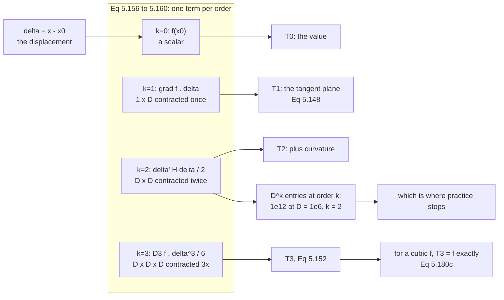

Everything in this chapter has been building one object without saying so. The
[gradient](../partial-differentiation-and-gradients/) is a $1 \times D$ row; the
[Hessian](../higher-order-derivatives/) is a $D \times D$ matrix; §5.7's Remark
mentioned a $D \times D \times D$ tensor and moved on. §5.8 finally says what
they are: consecutive terms of a single series, each one a tensor of one higher
order, each contracted against one more copy of the same displacement vector.

The section starts with the humblest possible use of the gradient and ends with a
polynomial reproduced exactly.

## What you'll learn

- **Equation 5.148**, linearization — the one-line formula behind tangent planes,
  Gauss–Newton, delta-method error propagation, and every "assume it's locally
  linear" argument you will ever read.
- **Definition 5.7** and **Equation 5.151**: the multivariate Taylor series, and
  what $\boldsymbol{\delta}^k$ means when $\boldsymbol{\delta}$ is a vector.
- **Definition 5.8**: the Taylor polynomial $T_n$, and the fact that truncating a
  series is a *local* promise, measured.
- **Equations 5.153 to 5.155**: outer products, why order-$k$ derivatives are
  order-$k$ tensors, and the three `einsum` calls the book puts in its margin.
- **Equations 5.156 to 5.160** written out for $k = 0, 1, 2, 3$, including why
  $\operatorname{tr}(H\boldsymbol{\delta}\boldsymbol{\delta}^\top)$ and
  $\boldsymbol{\delta}^\top H \boldsymbol{\delta}$ are the same number.
- **Example 5.15** end to end: $f = x^2 + 2xy + y^3$ at $(1, 2)$, every equation
  from 5.161 to 5.180 reproduced and checked, including the claim that $T_3$ *is*
  $f$ — verified over a grid, not at a point.
- The two reasons nobody goes past second order: the term count, and the fact
  that on a fixed window a higher-order model can be **worse**.
- The **Laplace approximation**, which is a second-order Taylor expansion of a
  log-density wearing a different hat.

## Intuition: three ways to answer "what does f look like near here?"

Someone asks you to describe a hillside at the spot you are standing.

The **zeroth-order** answer is a number: "the elevation here is 340 m." Useless
for walking, but it is right at one point.

The **first-order** answer adds a direction and a rate: "340 m, sloping up at 12%
toward the north-east." That is Equation 5.148, and it is a *plane* — the tangent
plane. It is right at the point and it gets the slope right, so for small steps it
is very good and for large steps it is a plane pretending to be a hill.

The **second-order** answer adds how the slope changes: "…and it curves away
sharply to the left, gently ahead." That is a quadratic bowl or saddle glued to
the point, which is the Hessian's job.

Each answer costs more to compute and each is only better *near* the point. Push
far enough out and the extra terms turn on you: measured below, at radius 3.2 the
quadratic model's error is **five times** the constant model's. That is not a bug;
it is what "asymptotic" means.



## The math

### Equation 5.148: linearization

The plainest use of a gradient:

$$
f(\mathbf{x}) \approx f(\mathbf{x}_0) + (\nabla_{\mathbf{x}}f)(\mathbf{x}_0)(\mathbf{x} - \mathbf{x}_0)
\tag{5.148}
$$

Note the shapes, which are the reason §5.2 insisted the gradient be a row:
$(\nabla_\mathbf{x}f)(\mathbf{x}_0)$ is $1 \times D$, $(\mathbf{x} - \mathbf{x}_0)$
is $D \times 1$, and the product is the scalar you add to $f(\mathbf{x}_0)$. No
transposes to remember.

The book's Figure 5.12 shows the univariate case: a curve linearized at
$x_0 = -2$, approximated by a straight line, *"locally accurate, but the farther
we move away from $x_0$ the worse the approximation gets."* Equation 5.148 is a
truncation of something larger, and the rest of §5.8 is that something.

### Definition 5.7: the multivariate Taylor series

For $f : \mathbb{R}^D \to \mathbb{R}$ smooth at $\mathbf{x}_0$, with
$\boldsymbol{\delta} := \mathbf{x} - \mathbf{x}_0$:

$$
f(\mathbf{x}) = \sum_{k=0}^{\infty} \frac{D_{\mathbf{x}}^k f(\mathbf{x}_0)}{k!}\,\boldsymbol{\delta}^k
\tag{5.151}
$$

where $D^k_\mathbf{x} f(\mathbf{x}_0)$ is the $k$-th total derivative of $f$ with
respect to $\mathbf{x}$, evaluated at $\mathbf{x}_0$.

### Definition 5.8: the Taylor polynomial

$$
T_n(\mathbf{x}) = \sum_{k=0}^{n} \frac{D_{\mathbf{x}}^k f(\mathbf{x}_0)}{k!}\,\boldsymbol{\delta}^k
\tag{5.152}
$$

the first $n+1$ terms of the series. Equation 5.148 is exactly $T_1$.

### What delta-to-the-k means

The book flags its own notation as *"slightly sloppy"*: $\boldsymbol{\delta}^k$ is
not defined for a vector when $k > 1$. Both $D^k_\mathbf{x}f$ and
$\boldsymbol{\delta}^k$ are **$k$-th order tensors** — $k$-dimensional arrays —
and $\boldsymbol{\delta}^k$ is the $k$-fold **outer product** $\otimes$ of
$\boldsymbol{\delta}$ with itself:

$$
\boldsymbol{\delta}^2 := \boldsymbol{\delta} \otimes \boldsymbol{\delta} = \boldsymbol{\delta}\boldsymbol{\delta}^\top,
\qquad \boldsymbol{\delta}^2[i, j] = \delta[i]\,\delta[j]
\tag{5.153}
$$

$$
\boldsymbol{\delta}^3 := \boldsymbol{\delta} \otimes \boldsymbol{\delta} \otimes \boldsymbol{\delta},
\qquad \boldsymbol{\delta}^3[i, j, k] = \delta[i]\,\delta[j]\,\delta[k]
\tag{5.154}
$$

Each outer product raises the dimensionality of the array by one, which is what
the book's Figure 5.13 draws: a vector in $\mathbb{R}^4$, then a $4 \times 4$
matrix, then a $4 \times 4 \times 4$ cube. Then the general term is a full
contraction — every index of the derivative tensor paired with one copy of
$\boldsymbol{\delta}$:

$$
D^k_\mathbf{x}f(\mathbf{x}_0)\boldsymbol{\delta}^k = \sum_{i_1=1}^{D}\cdots\sum_{i_k=1}^{D} D^k_\mathbf{x}f(\mathbf{x}_0)[i_1, \ldots, i_k]\,\delta[i_1]\cdots\delta[i_k]
\tag{5.155}
$$

which is a $k$-th order polynomial in the components of $\boldsymbol{\delta}$.

### Equations 5.156 to 5.160: the first four terms

$$
k = 0: \quad D^0_\mathbf{x}f(\mathbf{x}_0)\boldsymbol{\delta}^0 = f(\mathbf{x}_0) \in \mathbb{R}
\tag{5.156}
$$

$$
k = 1: \quad D^1_\mathbf{x}f(\mathbf{x}_0)\boldsymbol{\delta}^1 = \underbrace{\nabla_\mathbf{x}f(\mathbf{x}_0)}_{1 \times D}\underbrace{\boldsymbol{\delta}}_{D \times 1} = \sum_{i=1}^{D}\nabla_\mathbf{x}f(\mathbf{x}_0)[i]\,\delta[i]
\tag{5.157}
$$

$$
k = 2: \quad D^2_\mathbf{x}f(\mathbf{x}_0)\boldsymbol{\delta}^2 = \operatorname{tr}\bigl(\underbrace{H(\mathbf{x}_0)}_{D \times D}\underbrace{\boldsymbol{\delta}}_{D \times 1}\underbrace{\boldsymbol{\delta}^\top}_{1 \times D}\bigr) = \boldsymbol{\delta}^\top H(\mathbf{x}_0)\boldsymbol{\delta}
\tag{5.158}
$$

$$
= \sum_{i=1}^{D}\sum_{j=1}^{D} H[i,j]\,\delta[i]\,\delta[j]
\tag{5.159}
$$

$$
k = 3: \quad D^3_\mathbf{x}f(\mathbf{x}_0)\boldsymbol{\delta}^3 = \sum_{i=1}^{D}\sum_{j=1}^{D}\sum_{k=1}^{D} D^3_\mathbf{x}f(\mathbf{x}_0)[i,j,k]\,\delta[i]\,\delta[j]\,\delta[k]
\tag{5.160}
$$

Two things worth pausing on.

**Equation 5.158's two forms are the same number.** $\boldsymbol{\delta}\boldsymbol{\delta}^\top$
is a $D \times D$ rank-one matrix; multiplying by $H$ and taking the trace
contracts both indices, and that is exactly what
$\boldsymbol{\delta}^\top H \boldsymbol{\delta}$ does. Verified below to
$0.0\text{e-}00$ at four displacements. The trace form is the one that generalises
to arbitrary $k$; the quadratic form is the one you should actually compute, since
it never builds the $D \times D$ intermediate.

**The margin of page 167 gives the code.** The book puts three NumPy calls beside
these equations, and they are the cleanest statement of the pattern:

$$
\texttt{np.einsum('i,i', Df1, d)}, \quad
\texttt{np.einsum('ij,i,j', Df2, d, d)}, \quad
\texttt{np.einsum('ijk,i,j,k', Df3, d, d, d)}
$$

One index letter per tensor order, one `d` per copy of $\boldsymbol{\delta}$. The
pattern for order $k$ writes itself.

:::note[Where the factorials come from]
Equation 5.151 divides the $k$-th term by $k!$, and Equation 5.159's double sum
runs over *all* ordered pairs $(i, j)$ — so the cross term $H[1,2]\delta_1\delta_2$
is counted twice, once as $(1,2)$ and once as $(2,1)$. That is why Equation
5.173c's expansion has $2(x-1)(y-2)$ with a factor of 2 while the squared terms do
not, and why the $\tfrac{1}{2}$ out front does not simply cancel. Getting this
wrong by a factor of two is the single most common error in hand-expanding a
multivariate Taylor series.
:::

## Worked example by hand

The book's **Example 5.15**, in full. Expand

$$
f(x, y) = x^2 + 2xy + y^3
\tag{5.161}
$$

at $(x_0, y_0) = (1, 2)$.

**Predict the answer first.** $f$ is a polynomial of degree 3, and a Taylor
expansion is a linear combination of polynomials. So there is no way a term of
fourth order or higher can appear, and the first four terms of Equation 5.151
ought to reproduce $f$ *exactly*. The book makes this prediction before computing
anything, and it is a good habit: it tells you what a correct answer looks like.

**Order 0.**

$$
f(1, 2) = 1 + 4 + 8 = 13
\tag{5.162}
$$

**Order 1.** Differentiate once in each variable:

$$
\frac{\partial f}{\partial x} = 2x + 2y \implies \frac{\partial f}{\partial x}(1,2) = 2 + 4 = 6
\tag{5.163}
$$

$$
\frac{\partial f}{\partial y} = 2x + 3y^2 \implies \frac{\partial f}{\partial y}(1,2) = 2 + 12 = 14
\tag{5.164}
$$

so

$$
D^1_{x,y}f(1,2) = \nabla_{x,y}f(1,2) = \begin{bmatrix} 6 & 14 \end{bmatrix} \in \mathbb{R}^{1 \times 2}
\tag{5.165}
$$

and the first-order term is

$$
\frac{D^1_{x,y}f(1,2)}{1!}\boldsymbol{\delta} = \begin{bmatrix} 6 & 14 \end{bmatrix}\begin{bmatrix} x - 1 \\ y - 2 \end{bmatrix} = 6(x-1) + 14(y-2)
\tag{5.166}
$$

Linear terms only, as promised.

**Order 2.** Four second partials:

$$
\frac{\partial^2 f}{\partial x^2} = 2 \implies 2,
\qquad
\frac{\partial^2 f}{\partial y^2} = 6y \implies 12
\tag{5.167, 5.168}
$$

$$
\frac{\partial^2 f}{\partial y\,\partial x} = 2,
\qquad
\frac{\partial^2 f}{\partial x\,\partial y} = 2
\tag{5.169, 5.170}
$$

The last two agree, which is [Equation 5.146](../higher-order-derivatives/) doing
its job. Collect:

$$
H = \begin{bmatrix} 2 & 2 \\ 2 & 6y \end{bmatrix},
\qquad
H(1,2) = \begin{bmatrix} 2 & 2 \\ 2 & 12 \end{bmatrix} \in \mathbb{R}^{2\times 2}
\tag{5.171, 5.172}
$$

and the second-order term is

$$
\frac{D^2_{x,y}f(1,2)}{2!}\boldsymbol{\delta}^2 = \tfrac{1}{2}\boldsymbol{\delta}^\top H(1,2)\boldsymbol{\delta}
\tag{5.173a}
$$

$$
= \tfrac{1}{2}\begin{bmatrix} x-1 & y-2 \end{bmatrix}\begin{bmatrix} 2 & 2 \\ 2 & 12 \end{bmatrix}\begin{bmatrix} x-1 \\ y-2 \end{bmatrix}
\tag{5.173b}
$$

$$
= (x-1)^2 + 2(x-1)(y-2) + 6(y-2)^2
\tag{5.173c}
$$

Multiply that out by hand to see where each coefficient comes from. The quadratic
form is $2\delta_1^2 + 2\delta_1\delta_2 + 2\delta_2\delta_1 + 12\delta_2^2 =
2\delta_1^2 + 4\delta_1\delta_2 + 12\delta_2^2$; halve it and you get
$\delta_1^2 + 2\delta_1\delta_2 + 6\delta_2^2$. The cross term kept its factor of
2 because the double sum counted it twice.

**Order 3.** The third derivative is a $2 \times 2 \times 2$ tensor, and the book
writes it as two slices — the derivative of the Hessian with respect to each
variable:

$$
D^3_{x,y}f = \begin{bmatrix} \dfrac{\partial H}{\partial x} & \dfrac{\partial H}{\partial y} \end{bmatrix} \in \mathbb{R}^{2\times 2\times 2}
\tag{5.174}
$$

Look back at Equation 5.171. Three of its four entries are constants, so they
differentiate to zero. The only surviving third derivative is

$$
\frac{\partial^3 f}{\partial y^3} = 6 \implies \frac{\partial^3 f}{\partial y^3}(1,2) = 6
\tag{5.177}
$$

giving

$$
D^3_{x,y}f[:,:,1] = \begin{bmatrix} 0 & 0 \\ 0 & 0\end{bmatrix},
\qquad
D^3_{x,y}f[:,:,2] = \begin{bmatrix} 0 & 0 \\ 0 & 6\end{bmatrix}
\tag{5.178}
$$

One nonzero number in eight slots. The third-order term is therefore

$$
\frac{D^3_{x,y}f(1,2)}{3!}\boldsymbol{\delta}^3 = \frac{6}{6}(y-2)^3 = (y-2)^3
\tag{5.179}
$$

**Assemble.**

$$
f(\mathbf{x}) = 13 + 6(x-1) + 14(y-2) + (x-1)^2 + 6(y-2)^2 + 2(x-1)(y-2) + (y-2)^3
\tag{5.180c}
$$

| Order | Tensor | Shape | Nonzero entries | Contributes |
|---|---|---|---|---|
| 0 | $f(1,2)$ | scalar | 1 | $13$ |
| 1 | $\nabla f$ | $1 \times 2$ | 2 | $6(x-1) + 14(y-2)$ |
| 2 | $H$ | $2 \times 2$ | 4 | $(x-1)^2 + 2(x-1)(y-2) + 6(y-2)^2$ |
| 3 | $D^3 f$ | $2 \times 2 \times 2$ | 1 of 8 | $(y-2)^3$ |
| $\ge 4$ | — | — | 0 | nothing |

**Check it at a point far from the expansion.** Take $(6, -4)$, which is
$\boldsymbol{\delta} = (5, -6)$ away — nowhere near "local":

$$
13 + 6(5) + 14(-6) + 25 + 6(36) + 2(5)(-6) + (-6)^3 = 13 + 30 - 84 + 25 + 216 - 60 - 216 = -76
$$

and $f(6,-4) = 36 + 2(6)(-4) + (-4)^3 = 36 - 48 - 64 = -76$. Exact, at a
displacement of $\|\boldsymbol{\delta}\| = 7.81$, because a degree-3 polynomial
has room for every term a cubic has. This is the one situation where "Taylor
series" and "algebraic identity" mean the same thing.

## See it move

Start with the picture the book's Figure 5.12 draws — the univariate case, so
there is nothing to hide behind:

<TaylorLab
  client:visible
  fn="sin-plus-cos"
  x0={-2}
  title="Figure 5.12's linearization, and the degrees above it"
  desc="Expanded at x0 = -2, exactly as the book's figure. T1 is Equation 5.148: a straight line, right at the point and drifting away from f everywhere else. Watch both error numbers as the degree climbs — the one measured near x0 falls every time, the one measured over the whole window does not."
/>

<TaylorLab
  client:visible
  fn="sigmoid"
  title="The same construction on a function whose series has a radius"
  desc="A sigmoid expanded at 0. Every added degree improves the fit near the origin and makes the tails worse, and the lab reports both. This is the honest version of 'higher order is better': it is a statement about a shrinking neighbourhood, not about the plot you are looking at."
/>

```p5 title="T0, T1, T2 on a surface" desc="Drag the expansion point around the surface and the radius of the disc the error is measured on. Grey contours are f; coloured contours are the model. The three error numbers are maxima over the disc, so the moment the quadratic model stops helping is a number on the screen rather than a judgement call." height="640"
let px = 0.7, py = 0.5, rad = 0.8, mode = 2;
let KNOBS = [], BTNS = [], dragging = null, dragPt = false;

// f and its exact derivatives. Analytic, so the models are not two
// approximations being compared with each other.
const f   = (x, y) => Math.sin(x) * Math.cos(0.8 * y) + 0.25 * x * y;
const fx  = (x, y) => Math.cos(x) * Math.cos(0.8 * y) + 0.25 * y;
const fy  = (x, y) => -0.8 * Math.sin(x) * Math.sin(0.8 * y) + 0.25 * x;
const fxx = (x, y) => -Math.sin(x) * Math.cos(0.8 * y);
const fxy = (x, y) => -0.8 * Math.cos(x) * Math.sin(0.8 * y) + 0.25;
const fyy = (x, y) => -0.64 * Math.sin(x) * Math.cos(0.8 * y);

const W = [-1.6, 3.0, -1.6, 3.0];
const PLOT = { x: 40, y: 40, w: 420, h: 420 };

function sx(x) { return PLOT.x + ((x - W[0]) / (W[1] - W[0])) * PLOT.w; }
function sy(y) { return PLOT.y + PLOT.h - ((y - W[2]) / (W[3] - W[2])) * PLOT.h; }
function ux(px_) { return W[0] + ((px_ - PLOT.x) / PLOT.w) * (W[1] - W[0]); }
function uy(py_) { return W[2] + ((PLOT.y + PLOT.h - py_) / PLOT.h) * (W[3] - W[2]); }

function setup() { createCanvas(600, 640); textFont("monospace"); noLoop(); }

function model(x, y, n) {
  const a = x - px, b = y - py;
  let v = f(px, py);
  if (n >= 1) v += fx(px, py) * a + fy(px, py) * b;
  if (n >= 2) v += 0.5 * (fxx(px, py) * a * a + 2 * fxy(px, py) * a * b + fyy(px, py) * b * b);
  return v;
}

function knob(id, x, y, w, value, mn, mx, label) {
  KNOBS.push({ id, x, y, w, mn, mx });
  const t = (value - mn) / (mx - mn);
  stroke(60, 74, 92); strokeWeight(2); line(x, y, x + w, y);
  noStroke(); fill(255, 211, 67); ellipse(x + t * w, y, 10, 10);
  fill(190, 200, 212); textSize(11); textAlign(LEFT, CENTER);
  text(label, x + w + 12, y);
}

function mousePressed() {
  for (const t of BTNS)
    if (mouseX > t.x && mouseX < t.x + t.w && mouseY > t.y && mouseY < t.y + t.h) {
      mode = t.n; redraw(); return;
    }
  for (const k of KNOBS)
    if (mouseY > k.y - 11 && mouseY < k.y + 11 && mouseX > k.x - 11 && mouseX < k.x + k.w + 11) {
      dragging = k; return;
    }
  if (mouseX > PLOT.x && mouseX < PLOT.x + PLOT.w && mouseY > PLOT.y && mouseY < PLOT.y + PLOT.h) {
    dragPt = true; px = ux(mouseX); py = uy(mouseY); redraw();
  }
}
function mouseReleased() { dragging = null; dragPt = false; }
function mouseDragged() {
  if (dragging) {
    const t = Math.min(1, Math.max(0, (mouseX - dragging.x) / dragging.w));
    rad = Math.round((dragging.mn + t * (dragging.mx - dragging.mn)) * 100) / 100;
    redraw(); return;
  }
  if (dragPt) {
    px = Math.min(W[1], Math.max(W[0], ux(mouseX)));
    py = Math.min(W[3], Math.max(W[2], uy(mouseY)));
    redraw();
  }
}

// Marching squares on a coarse grid: enough for readable contours.
function contour(fn, level, N) {
  const segs = [];
  const dx = (W[1] - W[0]) / N, dy = (W[3] - W[2]) / N;
  for (let i = 0; i < N; i++) {
    for (let j = 0; j < N; j++) {
      const xa = W[0] + i * dx, xb = xa + dx;
      const ya = W[2] + j * dy, yb = ya + dy;
      const v = [fn(xa, ya), fn(xb, ya), fn(xb, yb), fn(xa, yb)];
      const lp = (p, q, vp, vq) => p + ((level - vp) / (vq - vp || 1e-9)) * (q - p);
      const pts = [];
      if ((v[0] < level) !== (v[1] < level)) pts.push([lp(xa, xb, v[0], v[1]), ya]);
      if ((v[1] < level) !== (v[2] < level)) pts.push([xb, lp(ya, yb, v[1], v[2])]);
      if ((v[3] < level) !== (v[2] < level)) pts.push([lp(xa, xb, v[3], v[2]), yb]);
      if ((v[0] < level) !== (v[3] < level)) pts.push([xa, lp(ya, yb, v[0], v[3])]);
      if (pts.length >= 2) segs.push([pts[0], pts[1]]);
    }
  }
  return segs;
}

function draw() {
  background(13, 17, 23);
  KNOBS = []; BTNS = [];

  noStroke(); fill(19, 25, 33); rect(PLOT.x, PLOT.y, PLOT.w, PLOT.h, 4);

  const LEVELS = [-1.4, -1.0, -0.6, -0.2, 0.2, 0.6, 1.0, 1.4, 1.8, 2.2];

  // f, in grey.
  strokeWeight(1); stroke(90, 100, 114);
  for (const lv of LEVELS)
    for (const [p, q] of contour(f, lv, 56))
      line(sx(p[0]), sy(p[1]), sx(q[0]), sy(q[1]));

  // The model, dashed and coloured by order.
  const COL = [color(232, 110, 110), color(255, 211, 67), color(120, 200, 150)][mode];
  stroke(COL); strokeWeight(1.7); drawingContext.setLineDash([5, 4]);
  for (const lv of LEVELS)
    for (const [p, q] of contour((x, y) => model(x, y, mode), lv, 56))
      line(sx(p[0]), sy(p[1]), sx(q[0]), sy(q[1]));
  drawingContext.setLineDash([]);

  // The disc the error is measured on, and the expansion point.
  noFill(); stroke(255, 255, 255, 120); strokeWeight(1.4);
  ellipse(sx(px), sy(py), 2 * (sx(px + rad) - sx(px)), 2 * (sx(px + rad) - sx(px)));
  noStroke(); fill(255); ellipse(sx(px), sy(py), 9, 9);

  // Max error on the disc, for all three orders. 720 angles x 24 radii.
  const errs = [0, 0, 0];
  for (let i = 0; i < 720; i++) {
    const t = (2 * Math.PI * i) / 720;
    for (let j = 1; j <= 24; j++) {
      const r = (rad * j) / 24;
      const x = px + r * Math.cos(t), y = py + r * Math.sin(t);
      const tv = f(x, y);
      for (let n = 0; n < 3; n++) errs[n] = Math.max(errs[n], Math.abs(tv - model(x, y, n)));
    }
  }

  noStroke(); textAlign(LEFT, TOP);
  fill(255, 211, 67); textSize(15);
  text("f = sin(x1) cos(0.8 x2) + 0.25 x1 x2", 16, 10);
  fill(200, 210, 222); textSize(11);
  text("grey: f.   dashed: the Taylor model.   drag inside the plot to move x0.", 16, 494);

  fill(235); textSize(12);
  text(`x0 = (${px.toFixed(3)}, ${py.toFixed(3)})    f(x0) = ${f(px, py).toFixed(4)}`, 16, 514);
  fill(150); textSize(11);
  text(`grad f = [${fx(px, py).toFixed(4)}  ${fy(px, py).toFixed(4)}]`, 16, 534);
  text(`H = [${fxx(px, py).toFixed(3)}  ${fxy(px, py).toFixed(3)} ; `
     + `${fxy(px, py).toFixed(3)}  ${fyy(px, py).toFixed(3)}]`, 300, 534);

  // The three error numbers, and which order actually wins.
  const best = errs.indexOf(Math.min(...errs));
  const NAMES = ["T0 (the value)", "T1 (Eq 5.148)", "T2 (plus H)"];
  for (let n = 0; n < 3; n++) {
    fill(n === best ? color(120, 200, 150) : color(150, 158, 170)); textSize(11.5);
    text(`${NAMES[n]}  max error on the disc  ${errs[n].toFixed(6)}`
       + (n === best ? "   <- best here" : ""), 16, 556 + n * 18);
  }

  knob("rad", 330, 612, 150, rad, 0.05, 2.5, `radius = ${rad.toFixed(2)}`);
  let bx = 16, by = 604;
  fill(150); noStroke(); textSize(10); textAlign(LEFT, BOTTOM);
  text("show", bx, by - 3);
  for (let n = 0; n < 3; n++) {
    const x = bx + n * 84;
    BTNS.push({ x, y: by, w: 78, h: 22, n });
    noStroke(); fill(mode === n ? color(255, 211, 67) : color(38, 48, 60));
    rect(x, by, 78, 22, 4);
    fill(mode === n ? 13 : 200); textSize(10.5); textAlign(CENTER, CENTER);
    text(`T${n}`, x + 39, by + 11);
  }
}
```

```p5 title="Figure 5.13: outer products grow an index per term" desc="The book's Figure 5.13 as a live count. Slide D and k and watch delta-to-the-k gain a dimension: a vector, then a matrix, then a cube. The entry count is D to the k, the distinct count after Equation 5.146's symmetry is the binomial C(D+k-1, k), and the gap between those two and the memory line is the whole reason Definition 5.8 stops at n = 2 in practice." height="580"
let D = 4, k = 2;
let KNOBS = [], BTNS = [], dragging = null;

function setup() { createCanvas(600, 580); textFont("monospace"); noLoop(); }

function knob(id, x, y, w, value, mn, mx, label) {
  KNOBS.push({ id, x, y, w, mn, mx });
  const t = (value - mn) / (mx - mn);
  stroke(60, 74, 92); strokeWeight(2); line(x, y, x + w, y);
  noStroke(); fill(255, 211, 67); ellipse(x + t * w, y, 10, 10);
  fill(190, 200, 212); textSize(11); textAlign(LEFT, CENTER);
  text(label, x + w + 12, y);
}
function mousePressed() {
  for (const t of BTNS)
    if (mouseX > t.x && mouseX < t.x + t.w && mouseY > t.y && mouseY < t.y + t.h) {
      D = t.d; redraw(); return;
    }
  for (const kk of KNOBS)
    if (mouseY > kk.y - 11 && mouseY < kk.y + 11 && mouseX > kk.x - 11 && mouseX < kk.x + kk.w + 11) {
      dragging = kk; return;
    }
}
function mouseReleased() { dragging = null; }
function mouseDragged() {
  if (!dragging) return;
  const t = Math.min(1, Math.max(0, (mouseX - dragging.x) / dragging.w));
  const v = Math.round(dragging.mn + t * (dragging.mx - dragging.mn));
  if (dragging.id === "D") D = v;
  if (dragging.id === "k") k = v;
  redraw();
}

// Exact big-integer arithmetic: at D = 1e6 and k = 3 the count overflows a
// double, and printing 1.67e17 as "166667166666999999" would be a lie.
function comb(n, r) {
  let out = 1n;
  const N = BigInt(n), R = BigInt(r);
  for (let i = 0n; i < R; i++) out = (out * (N - i)) / (i + 1n);
  return out;
}
function pow(b, e) { let o = 1n; for (let i = 0; i < e; i++) o *= BigInt(b); return o; }
function human(v) {
  const s = v.toString();
  if (s.length <= 12) return Number(v).toLocaleString();
  return `${s[0]}.${s.slice(1, 3)}e+${s.length - 1}`;
}

function draw() {
  background(13, 17, 23);
  KNOBS = []; BTNS = [];

  const delta = Array.from({ length: D }, (_, i) => Math.cos(0.7 * i + 0.4) * 1.2);

  noStroke(); textAlign(LEFT, TOP);
  fill(255, 211, 67); textSize(15);
  text(`delta^${k} = delta ` + "(x) delta ".repeat(Math.max(0, k - 1)).trim(), 16, 10);
  fill(200, 210, 222); textSize(11);
  text(`the ${k}-fold outer product of a vector in R^${D}: Eq 5.153 and 5.154`, 16, 32);

  // The array itself, for k = 1, 2, 3. Beyond that there is nothing to draw,
  // which is itself the point.
  const cell = Math.max(9, Math.min(30, 200 / D));
  const gx = 40, gy = 70;
  const val = (idx) => idx.reduce((a, i) => a * delta[i], 1);
  const mags = [];
  if (k === 1) for (let i = 0; i < D; i++) mags.push(Math.abs(val([i])));
  if (k === 2) for (let i = 0; i < D; i++) for (let j = 0; j < D; j++) mags.push(Math.abs(val([i, j])));
  if (k === 3) for (let i = 0; i < D; i++) for (let j = 0; j < D; j++) for (let m = 0; m < D; m++) mags.push(Math.abs(val([i, j, m])));
  const mx = Math.max(...mags, 1e-9);
  const shade = (v) => { const t = Math.abs(v) / mx; return color(28 + t * 60, 40 + t * 150, 80 + t * 100); };

  if (k === 1) {
    for (let i = 0; i < D; i++) {
      fill(shade(val([i]))); noStroke();
      rect(gx, gy + i * cell, cell, cell - 1.5);
    }
    fill(120, 130, 145); textSize(10); textAlign(LEFT, CENTER);
    text(`R^${D}  --  a column`, gx + cell + 12, gy + (D * cell) / 2);
  } else if (k === 2) {
    for (let i = 0; i < D; i++)
      for (let j = 0; j < D; j++) {
        fill(shade(val([i, j]))); noStroke();
        rect(gx + j * cell, gy + i * cell, cell - 1.5, cell - 1.5);
      }
    fill(120, 130, 145); textSize(10); textAlign(LEFT, CENTER);
    text(`R^(${D} x ${D})  --  a matrix`, gx + D * cell + 12, gy + (D * cell) / 2);
  } else {
    // Slices, drawn with an offset so the third index is visible as depth.
    const nSlice = Math.min(D, 5);
    for (let s = 0; s < nSlice; s++) {
      const ox = gx + s * 16, oy = gy + s * 14;
      for (let i = 0; i < D; i++)
        for (let j = 0; j < D; j++) {
          fill(shade(val([i, j, s]))); noStroke();
          rect(ox + j * cell, oy + i * cell, cell - 1.5, cell - 1.5);
        }
    }
    fill(120, 130, 145); textSize(10); textAlign(LEFT, TOP);
    text(`R^(${D} x ${D} x ${D})  --  ${nSlice} of ${D} slices drawn`,
         gx + D * cell + 26, gy + 6);
    if (k > 3) text("past order 3 there is nothing left to draw", gx, gy + 200);
  }

  // The counts.
  const entries = pow(D, k);
  const distinct = comb(D + k - 1, k);
  const bytes = entries * 4n;
  const y0 = 330;
  fill(235); textSize(12); textAlign(LEFT, TOP);
  text(`entries  D^k          = ${D}^${k} = ${human(entries)}`, 16, y0);
  fill(120, 200, 150);
  text(`distinct C(D+k-1, k)  = ${human(distinct)}`
     + `   (${(Number(entries) > 0 ? (Number(distinct) / Number(entries) * 100) : 100).toFixed(1)}% of them)`, 16, y0 + 22);
  fill(150);
  text(`stored as float32     = ${human(bytes)} bytes`, 16, y0 + 44);
  fill(197, 153, 255);
  text(`terms in T_${k} altogether = ${human(comb(D + k, k))}`, 16, y0 + 66);

  fill(200, 210, 222); textSize(11);
  text("Eq 5.146 says the derivative tensor is symmetric in every pair of indices,", 16, y0 + 100);
  text("so the distinct count is a binomial rather than a power -- a big constant", 16, y0 + 116);
  text("saving that does nothing about the EXPONENT. Try D = 1000000, k = 2.", 16, y0 + 132);

  knob("D", 16, y0 + 172, 170, D, 2, 8, `D = ${D}`);
  knob("k", 16, y0 + 198, 170, k, 1, 4, `k = ${k}`);

  let bx = 330, by = y0 + 160;
  fill(150); noStroke(); textSize(10); textAlign(LEFT, BOTTOM);
  text("jump to a real D", bx, by - 3);
  const PRE = [["D = 100", 100], ["D = 1000", 1000], ["a network", 1000000]];
  for (let i = 0; i < PRE.length; i++) {
    const [nm, dv] = PRE[i];
    const x = bx, y = by + i * 26;
    BTNS.push({ x, y, w: 150, h: 22, d: dv });
    noStroke(); fill(D === dv ? color(255, 211, 67) : color(38, 48, 60));
    rect(x, y, 150, 22, 4);
    fill(D === dv ? 13 : 200); textSize(10.5); textAlign(CENTER, CENTER);
    text(nm, x + 75, y + 11);
  }
  if (D > 8) {
    fill(255, 171, 112); noStroke(); textSize(10.5); textAlign(LEFT, TOP);
    text(`D = ${D} is far too large to draw -- which is the point. Only the`, 16, gy + 10);
    text("counts below are meaningful at this size.", 16, gy + 26);
  }
}
```

```p5 title="The Laplace approximation is Equation 5.152 at n = 2" desc="Expand the LOG of a density to second order at its mode and exponentiate: a parabola becomes a Gaussian. Drag the expansion point off the mode and watch the approximation stop being a density at all — the curvature goes the wrong way and there is no Gaussian to be had." height="560"
let x0 = 1.5625, alpha = 2.5, beta = 1.6;
let KNOBS = [], BTNS = [], dragging = null;

const PLOT = { x: 56, y: 60, w: 500, h: 300 };
const XR = [0.001, 8];

function logp(x) { return alpha * Math.log(Math.max(x, 1e-12)) - beta * x; }
function setup() { createCanvas(600, 560); textFont("monospace"); noLoop(); }

function sx(x) { return PLOT.x + ((x - XR[0]) / (XR[1] - XR[0])) * PLOT.w; }
function ux(p) { return XR[0] + ((p - PLOT.x) / PLOT.w) * (XR[1] - XR[0]); }

function knob(id, x, y, w, value, mn, mx, label) {
  KNOBS.push({ id, x, y, w, mn, mx });
  const t = (value - mn) / (mx - mn);
  stroke(60, 74, 92); strokeWeight(2); line(x, y, x + w, y);
  noStroke(); fill(255, 211, 67); ellipse(x + t * w, y, 10, 10);
  fill(190, 200, 212); textSize(11); textAlign(LEFT, CENTER);
  text(label, x + w + 12, y);
}
function mousePressed() {
  for (const t of BTNS)
    if (mouseX > t.x && mouseX < t.x + t.w && mouseY > t.y && mouseY < t.y + t.h) {
      x0 = alpha / beta; redraw(); return;
    }
  for (const kk of KNOBS)
    if (mouseY > kk.y - 11 && mouseY < kk.y + 11 && mouseX > kk.x - 11 && mouseX < kk.x + kk.w + 11) {
      dragging = kk; return;
    }
  if (mouseX > PLOT.x && mouseX < PLOT.x + PLOT.w && mouseY > PLOT.y && mouseY < PLOT.y + PLOT.h) {
    x0 = Math.max(0.05, Math.min(XR[1], ux(mouseX))); redraw();
  }
}
function mouseReleased() { dragging = null; }
function mouseDragged() {
  if (dragging) {
    const t = Math.min(1, Math.max(0, (mouseX - dragging.x) / dragging.w));
    const v = Math.round((dragging.mn + t * (dragging.mx - dragging.mn)) * 10) / 10;
    if (dragging.id === "a") alpha = Math.max(0.2, v);
    if (dragging.id === "b") beta = Math.max(0.2, v);
    redraw(); return;
  }
  if (mouseX > PLOT.x - 40 && mouseX < PLOT.x + PLOT.w + 40) {
    x0 = Math.max(0.05, Math.min(XR[1], ux(mouseX))); redraw();
  }
}

function draw() {
  background(13, 17, 23);
  KNOBS = []; BTNS = [];

  const h = 1e-4;
  const g1 = (logp(x0 + h) - logp(x0 - h)) / (2 * h);
  const g2 = (logp(x0 + h) - 2 * logp(x0) + logp(x0 - h)) / (h * h);
  const usable = g2 < -1e-9;                     // need NEGATIVE curvature
  const sigma2 = usable ? -1 / g2 : NaN;

  // Normalise p on the window so the two curves are comparable.
  const N = 2000, dx = (XR[1] - XR[0]) / N;
  let Z = 0;
  for (let i = 0; i <= N; i++) Z += Math.exp(logp(XR[0] + i * dx)) * dx;
  const p = (x) => Math.exp(logp(x)) / Z;
  const q = (x) => usable
    ? Math.exp(-0.5 * (x - x0) ** 2 / sigma2) / Math.sqrt(2 * Math.PI * sigma2)
    : 0;

  let ymax = 0;
  for (let i = 0; i <= N; i++) {
    const x = XR[0] + i * dx;
    ymax = Math.max(ymax, p(x), q(x));
  }
  ymax = Math.max(ymax, 1e-6) * 1.12;
  const sy = (v) => PLOT.y + PLOT.h - (v / ymax) * PLOT.h;

  noStroke(); fill(19, 25, 33); rect(PLOT.x, PLOT.y, PLOT.w, PLOT.h, 4);
  stroke(60, 74, 92); strokeWeight(1);
  line(PLOT.x, sy(0), PLOT.x + PLOT.w, sy(0));

  // The true density.
  stroke(107, 169, 221); strokeWeight(2.4); noFill();
  beginShape();
  for (let i = 0; i <= N; i++) { const x = XR[0] + i * dx; vertex(sx(x), sy(p(x))); }
  endShape();

  // The Laplace Gaussian, and the mass it puts where p cannot go.
  if (usable) {
    let below = 0;
    for (let i = 0; i < 800; i++) {
      const x = -12 + (i * 12) / 800;
      below += q(x) * (12 / 800);
    }
    stroke(255, 211, 67); strokeWeight(2); drawingContext.setLineDash([6, 5]);
    beginShape();
    for (let i = 0; i <= N; i++) { const x = XR[0] + i * dx; vertex(sx(x), sy(q(x))); }
    endShape();
    drawingContext.setLineDash([]);
    // Total variation, on the window.
    let tv = 0;
    for (let i = 0; i <= N; i++) { const x = XR[0] + i * dx; tv += Math.abs(p(x) - q(x)) * dx; }
    noStroke(); fill(150); textSize(11); textAlign(LEFT, TOP);
    text(`total variation distance  ${(tv / 2).toFixed(6)}`, 16, 448);
    text(`Gaussian mass at x < 0    ${below.toFixed(6)}   <- where p does not exist`, 16, 466);
  }

  // The expansion point and the mode.
  const mode = alpha / beta;
  stroke(120, 200, 150); strokeWeight(1.4); drawingContext.setLineDash([3, 3]);
  line(sx(mode), PLOT.y, sx(mode), PLOT.y + PLOT.h);
  drawingContext.setLineDash([]);
  stroke(255, 211, 67); strokeWeight(1.6);
  line(sx(x0), PLOT.y, sx(x0), PLOT.y + PLOT.h);

  noStroke(); textAlign(LEFT, TOP);
  fill(255, 211, 67); textSize(15);
  text("expand log p to second order, then exponentiate", 16, 10);
  fill(200, 210, 222); textSize(11);
  text("blue: the true density.   dashed amber: exp of its quadratic model.   drag to move x0.", 16, 32);

  fill(235); textSize(12);
  text(`log p(x) = ${alpha.toFixed(1)} log x - ${beta.toFixed(1)} x`, 16, 378);
  fill(150); textSize(11);
  text(`x0 = ${x0.toFixed(4)}    mode = alpha/beta = ${mode.toFixed(4)}`, 16, 400);
  text(`d log p/dx = ${g1.toFixed(6)}    d2 log p/dx2 = ${g2.toFixed(6)}`, 16, 418);

  if (!usable) {
    fill(232, 110, 110); textSize(13);
    text("the curvature here is not negative, so exp of the model is not integrable:", 16, 448);
    text("there is NO Gaussian. A Laplace approximation needs a maximum, not a point.", 16, 468);
  } else if (Math.abs(g1) > 1e-6) {
    fill(255, 171, 112); textSize(11.5);
    text(`d log p/dx is ${g1.toFixed(4)}, not 0, so x0 is not the mode: the Gaussian's`, 16, 490);
    text("peak is in the right place but the FIT is centred on the wrong point.", 16, 506);
  } else {
    fill(120, 200, 150); textSize(11.5);
    text(`at the mode the gradient vanishes and sigma^2 = -1/H = ${sigma2.toFixed(6)}`, 16, 490);
    text("which is exactly the Laplace approximation used all over Bayesian ML.", 16, 506);
  }

  knob("a", 330, 400, 130, alpha, 0.5, 6, `alpha = ${alpha.toFixed(1)}`);
  knob("b", 330, 424, 130, beta, 0.5, 6, `beta = ${beta.toFixed(1)}`);
  const bx = 330, by = 448;
  BTNS.push({ x: bx, y: by, w: 150, h: 22 });
  noStroke(); fill(Math.abs(x0 - mode) < 1e-6 ? color(120, 200, 150) : color(38, 48, 60));
  rect(bx, by, 150, 22, 4);
  fill(Math.abs(x0 - mode) < 1e-6 ? 13 : 200); textSize(10.5); textAlign(CENTER, CENTER);
  text("snap x0 to the mode", bx + 75, by + 11);
}
```

## From scratch

Example 5.15, every equation checked — including the three `einsum` calls from the
book's margin and the claim that $T_3$ *is* $f$:

```python title="example_5_15.py" showLineNumbers{1}
import numpy as np

# Eq 5.161, the function Example 5.15 expands.
f = lambda x, y: x ** 2 + 2 * x * y + y ** 3
x0, y0 = 1.0, 2.0

# The derivatives, by hand. Each one is a line of algebra, written out on the page.
fx = lambda x, y: 2 * x + 2 * y            # Eq 5.163
fy = lambda x, y: 2 * x + 3 * y ** 2       # Eq 5.164
fxx = lambda x, y: 2.0                     # Eq 5.167
fyy = lambda x, y: 6 * y                   # Eq 5.168
fxy = lambda x, y: 2.0                     # Eq 5.169 and 5.170, equal by Eq 5.146

print(f"f(x, y) = x^2 + 2xy + y^3   expanded at (x0, y0) = ({x0:.0f}, {y0:.0f})")
print()
print(f"  Eq 5.162   f(1, 2)                = {f(x0, y0):.0f}")
print(f"  Eq 5.163   df/dx  = 2x + 2y       = {fx(x0, y0):.0f}")
print(f"  Eq 5.164   df/dy  = 2x + 3y^2     = {fy(x0, y0):.0f}")
D1 = np.array([[fx(x0, y0), fy(x0, y0)]])                       # Eq 5.165
print(f"  Eq 5.165   D1 = {D1.tolist()}, shape {D1.shape} -- a ROW vector, R^(1x2)")
print(f"  Eq 5.167   d2f/dx2  = 2           = {fxx(x0, y0):.0f}")
print(f"  Eq 5.168   d2f/dy2  = 6y          = {fyy(x0, y0):.0f}")
print(f"  Eq 5.169   d2f/dydx = 2           = {fxy(x0, y0):.0f}")
print(f"  Eq 5.170   d2f/dxdy = 2           = {fxy(x0, y0):.0f}   equal, by Eq 5.146")
H = np.array([[fxx(x0, y0), fxy(x0, y0)],
              [fxy(x0, y0), fyy(x0, y0)]])                      # Eq 5.172
print(f"  Eq 5.172   H(1, 2) = {H.tolist()}")

# The third derivative is a 2 x 2 x 2 tensor. Only d3f/dy3 = 6 survives, because
# every other second partial in Eq 5.171 is a constant.
D3 = np.zeros((2, 2, 2))
D3[1, 1, 1] = 6.0                                               # Eq 5.177
print(f"  Eq 5.177   d3f/dy3 = 6")
print(f"  Eq 5.178   D3[:, :, 1] = {D3[:, :, 0].tolist()}")
print(f"             D3[:, :, 2] = {D3[:, :, 1].tolist()}")
print(f"             {D3.size} entries, {int((D3 != 0).sum())} of them nonzero")

print()
print("The four terms, in the three notations the book uses")
print("  (the margin of p.167 gives exactly these einsum calls)")
for pt in ((2.0, 3.0), (1.5, 0.5), (-1.0, 4.0), (6.0, -4.0)):
    d = np.array([pt[0] - x0, pt[1] - y0])                      # delta, Def 5.7
    k0 = f(x0, y0)                                              # Eq 5.156
    k1 = np.einsum("i,i", D1.ravel(), d)                        # Eq 5.157
    k2_trace = np.trace(H @ np.outer(d, d))                     # Eq 5.158, form 1
    k2_quad = d @ H @ d                                         # Eq 5.158, form 2
    k2_sum = np.einsum("ij,i,j", H, d, d)                       # Eq 5.159
    k3 = np.einsum("ijk,i,j,k", D3, d, d, d)                    # Eq 5.160
    T3 = k0 + k1 / 1 + k2_quad / 2 + k3 / 6                     # Eq 5.180a
    print(f"  x = ({pt[0]:>5.1f}, {pt[1]:>5.1f})   delta = {d}")
    print(f"    k=0 {k0:>10.4f}    k=1 {k1:>10.4f}    k=2 {k2_quad:>10.4f}    k=3 {k3:>10.4f}")
    print(f"    tr(H d d^T) {k2_trace:>12.8f}  =  d^T H d {k2_quad:>12.8f}"
          f"  =  einsum {k2_sum:>12.8f}")
    print(f"    T3 = {T3:>12.6f}    f(x) = {f(*pt):>12.6f}    gap {abs(T3 - f(*pt)):.1e}")

print()
print("Eq 5.180c claims T3 IS f. Test it everywhere, not at one point.")


def T(n, X, Y):
    """The Taylor polynomial of degree n, Def 5.8, written out for this f."""
    dx, dy = X - x0, Y - y0
    out = np.full_like(X, f(x0, y0))
    if n >= 1:
        out = out + 6 * dx + 14 * dy
    if n >= 2:
        out = out + 0.5 * (2 * dx ** 2 + 2 * 2 * dx * dy + 12 * dy ** 2)
    if n >= 3:
        out = out + dy ** 3
    return out


gx, gy = np.meshgrid(np.linspace(-4, 6, 61), np.linspace(-4, 6, 61))
truth = f(gx, gy)
print(f"  over a 61 x 61 grid spanning [-4, 6] in both variables:")
print(f"    {'degree':>7}  {'max error':>13}  {'mean error':>12}")
for n in range(4):
    err = np.abs(truth - T(n, gx, gy))
    print(f"    T{n:<6}  {err.max():>13.4f}  {err.mean():>12.4f}")
print("  T3 is exact EVERYWHERE, not merely near (1, 2), because f is a cubic and a")
print("  degree-3 polynomial has room for every term a cubic has. Note also how")
print("  little T2 buys over T1 on this wide a grid: 216 against 225. Truncated")
print("  Taylor series are a LOCAL promise.")
```

```text title="output"
f(x, y) = x^2 + 2xy + y^3   expanded at (x0, y0) = (1, 2)

  Eq 5.162   f(1, 2)                = 13
  Eq 5.163   df/dx  = 2x + 2y       = 6
  Eq 5.164   df/dy  = 2x + 3y^2     = 14
  Eq 5.165   D1 = [[6.0, 14.0]], shape (1, 2) -- a ROW vector, R^(1x2)
  Eq 5.167   d2f/dx2  = 2           = 2
  Eq 5.168   d2f/dy2  = 6y          = 12
  Eq 5.169   d2f/dydx = 2           = 2
  Eq 5.170   d2f/dxdy = 2           = 2   equal, by Eq 5.146
  Eq 5.172   H(1, 2) = [[2.0, 2.0], [2.0, 12.0]]
  Eq 5.177   d3f/dy3 = 6
  Eq 5.178   D3[:, :, 1] = [[0.0, 0.0], [0.0, 0.0]]
             D3[:, :, 2] = [[0.0, 0.0], [0.0, 6.0]]
             8 entries, 1 of them nonzero

The four terms, in the three notations the book uses
  (the margin of p.167 gives exactly these einsum calls)
  x = (  2.0,   3.0)   delta = [1. 1.]
    k=0    13.0000    k=1    20.0000    k=2    18.0000    k=3     6.0000
    tr(H d d^T)  18.00000000  =  d^T H d  18.00000000  =  einsum  18.00000000
    T3 =    43.000000    f(x) =    43.000000    gap 0.0e+00
  x = (  1.5,   0.5)   delta = [ 0.5 -1.5]
    k=0    13.0000    k=1   -18.0000    k=2    24.5000    k=3   -20.2500
    tr(H d d^T)  24.50000000  =  d^T H d  24.50000000  =  einsum  24.50000000
    T3 =     3.875000    f(x) =     3.875000    gap 0.0e+00
  x = ( -1.0,   4.0)   delta = [-2.  2.]
    k=0    13.0000    k=1    16.0000    k=2    40.0000    k=3    48.0000
    tr(H d d^T)  40.00000000  =  d^T H d  40.00000000  =  einsum  40.00000000
    T3 =    57.000000    f(x) =    57.000000    gap 0.0e+00
  x = (  6.0,  -4.0)   delta = [ 5. -6.]
    k=0    13.0000    k=1   -54.0000    k=2   362.0000    k=3 -1296.0000
    tr(H d d^T) 362.00000000  =  d^T H d 362.00000000  =  einsum 362.00000000
    T3 =   -76.000000    f(x) =   -76.000000    gap 0.0e+00

Eq 5.180c claims T3 IS f. Test it everywhere, not at one point.
  over a 61 x 61 grid spanning [-4, 6] in both variables:
     degree      max error    mean error
    T0            311.0000       48.1335
    T1            225.0000       40.4129
    T2            216.0000       40.4945
    T3              0.0000        0.0000
  T3 is exact EVERYWHERE, not merely near (1, 2), because f is a cubic and a
  degree-3 polynomial has room for every term a cubic has. Note also how
  little T2 buys over T1 on this wide a grid: 216 against 225. Truncated
  Taylor series are a LOCAL promise.
```

Now the two facts that decide how Taylor expansions are actually used:

```python title="taylor_in_practice.py" showLineNumbers{1}
import math

import numpy as np

# A function that is NOT a polynomial, so no finite Taylor polynomial is exact.
g = lambda x, y: np.exp(-0.5 * (x ** 2 + y ** 2)) + 0.3 * np.sin(2 * x)
x0, y0 = 0.4, -0.3


def derivs(fn, x, y, h=1e-3):
    """Value, gradient and Hessian by central differences."""
    v = fn(x, y)
    dx = (fn(x + h, y) - fn(x - h, y)) / (2 * h)
    dy = (fn(x, y + h) - fn(x, y - h)) / (2 * h)
    dxx = (fn(x + h, y) - 2 * v + fn(x - h, y)) / h ** 2
    dyy = (fn(x, y + h) - 2 * v + fn(x, y - h)) / h ** 2
    dxy = (fn(x + h, y + h) - fn(x + h, y - h)
           - fn(x - h, y + h) + fn(x - h, y - h)) / (4 * h ** 2)
    return v, dx, dy, dxx, dxy, dyy


v, dx, dy, dxx, dxy, dyy = derivs(g, x0, y0)
th = np.linspace(0, 2 * np.pi, 720)


def models(rad):
    """T0, T1 and T2 evaluated on the circle of radius rad about (x0, y0)."""
    px, py = x0 + rad * np.cos(th), y0 + rad * np.sin(th)
    a, b = px - x0, py - y0
    t0 = np.full_like(px, v)
    t1 = t0 + dx * a + dy * b
    t2 = t1 + 0.5 * (dxx * a ** 2 + 2 * dxy * a * b + dyy * b ** 2)
    return g(px, py), t0, t1, t2


print("g(x, y) = exp(-(x^2 + y^2)/2) + 0.3 sin(2x)   expanded at (0.4, -0.3)")
print(f"  grad = [{dx:.6f} {dy:.6f}]")
print(f"  H    = [[{dxx:.6f} {dxy:.6f}], [{dxy:.6f} {dyy:.6f}]]")
print()
print("Error on the circle of radius r -- and whether more order is more accuracy")
print(f"  {'r':>6}  {'T0 max err':>11}  {'T1 max err':>11}  {'T2 max err':>11}"
      f"  {'T1/T0':>7}  {'T2/T1':>7}")
for rad in (0.05, 0.1, 0.2, 0.4, 0.8, 1.6, 3.2):
    tv, t0, t1, t2 = models(rad)
    e0 = np.abs(tv - t0).max()
    e1 = np.abs(tv - t1).max()
    e2 = np.abs(tv - t2).max()
    print(f"  {rad:>6.2f}  {e0:>11.6f}  {e1:>11.6f}  {e2:>11.6f}"
          f"  {e1 / e0:>7.3f}  {e2 / e1:>7.3f}")
print("  Read the two ratio columns. Close in, each order divides the error. Past")
print("  r = 1.6 the ratios cross 1 and the higher-order model is WORSE on that")
print("  ring -- at r = 3.2, T2's error of 7.77 is five times T0's 1.40. 'Higher")
print("  order is better' is a statement about a limit, not about a window.")

print()
print("The order itself, fitted rather than assumed (error should go like r^(n+1))")
rs = np.array([0.02, 0.04, 0.08])
for n, name in ((0, "T0"), (1, "T1"), (2, "T2")):
    es = []
    for rad in rs:
        tv, t0, t1, t2 = models(rad)
        model = (t0, t1, t2)[n]
        es.append(float(np.abs(tv - model).max()))
    slope = float(np.polyfit(np.log(rs), np.log(es), 1)[0])
    print(f"  {name}:  {es[0]:.3e}  {es[1]:.3e}  {es[2]:.3e}"
          f"   ->  slope {slope:.3f}   (expected {n + 1})")

print()
print("What Eq 5.151 costs at order k: the tensor D^k_x f has D^k entries")
print(f"  {'D':>11}  {'k=1':>13}  {'k=2 distinct':>16}  {'k=2 stored':>18}  {'k=3 distinct':>24}")
for D in (2, 10, 100, 1000, 1_000_000):
    print(f"  {D:>11,}  {D:>13,}  {math.comb(D + 1, 2):>16,}"
          f"  {D * D:>18,}  {math.comb(D + 2, 3):>24,}")
print("  Eq 5.146's symmetry cuts the k=2 count roughly in half -- C(D+1, 2) rather")
print("  than D^2 -- and it does not help at all with the exponent. At a million")
print("  parameters the Hessian is 1e12 numbers, 4 TB in float32, and the third-order")
print("  tensor is 1.7e17. That is why Def 5.8 is almost never used past n = 2.")

print()
print("Why Section 5.8 is in a machine-learning book: the Laplace approximation")
# An unnormalised skewed density. Its log is what gets expanded.
logp = lambda x: 2.5 * np.log(np.clip(x, 1e-12, None)) - 1.6 * x
# The mode, by golden-section search on log p. No optimiser import needed.
inv_phi = (np.sqrt(5) - 1) / 2
a, b = 0.05, 20.0
c, d = b - inv_phi * (b - a), a + inv_phi * (b - a)
while b - a > 1e-12:
    if logp(c) > logp(d):
        b, d = d, c
        c = b - inv_phi * (b - a)
    else:
        a, c = c, d
        d = a + inv_phi * (b - a)
mode = 0.5 * (a + b)
h = 1e-4
curv = (logp(mode + h) - 2 * logp(mode) + logp(mode - h)) / h ** 2
sigma2 = -1.0 / curv
print(f"  mode x*                       {mode:.6f}   (analytic 2.5/1.6 = {2.5 / 1.6:.6f})")
print(f"  d2 log p / dx2 at the mode    {curv:.6f}   (analytic -2.5/x*^2 = {-2.5 / mode ** 2:.6f})")
print(f"  the second-order expansion of log p is a PARABOLA, so exp of it is a")
print(f"  Gaussian: mean x* = {mode:.6f}, variance -1/H = {sigma2:.6f}")

# Compare the two densities on a fine grid; trapezoid is plenty here.
xs = np.linspace(-6, 40, 400001)
px = np.where(xs > 0, np.exp(logp(np.where(xs > 0, xs, 1.0))), 0.0)
px = px / np.trapezoid(px, xs)
qx = np.exp(-0.5 * (xs - mode) ** 2 / sigma2) / np.sqrt(2 * np.pi * sigma2)
tv_dist = 0.5 * np.trapezoid(np.abs(px - qx), xs)
below = np.trapezoid(qx[xs < 0], xs[xs < 0])
print(f"  total variation distance      {tv_dist:.6f}")
print(f"  Gaussian mass at x < 0        {below:.6f}")
print("  The last number is the honest limitation: p is supported on x > 0 and the")
print("  Laplace Gaussian is not, so it assigns real probability to impossible")
print("  values. A second-order expansion matches the mode and the curvature there;")
print("  it knows nothing about the support, the skew, or the tails.")
```

```text title="output"
g(x, y) = exp(-(x^2 + y^2)/2) + 0.3 sin(2x)   expanded at (0.4, -0.3)
  grad = [0.065025 0.264749]
  H    = [[-1.602124 -0.105900], [-0.105900 -0.803072]]

Error on the circle of radius r -- and whether more order is more accuracy
       r   T0 max err   T1 max err   T2 max err    T1/T0    T2/T1
    0.05     0.014762     0.002034     0.000021    0.138    0.010
    0.10     0.031846     0.008178     0.000170    0.257    0.021
    0.20     0.073583     0.032926     0.001408    0.447    0.043
    0.40     0.190035     0.131281     0.013103    0.691    0.100
    0.80     0.519858     0.490258     0.139301    0.943    0.284
    1.60     1.197958     1.367102     1.355998    1.141    0.992
    3.20     1.396508     2.197040     7.772019    1.573    3.537
  Read the two ratio columns. Close in, each order divides the error. Past
  r = 1.6 the ratios cross 1 and the higher-order model is WORSE on that
  ring -- at r = 3.2, T2's error of 7.77 is five times T0's 1.40. 'Higher
  order is better' is a statement about a limit, not about a window.

The order itself, fitted rather than assumed (error should go like r^(n+1))
  T0:  5.632e-03  1.163e-02  2.473e-02   ->  slope 1.067   (expected 1)
  T1:  3.241e-04  1.300e-03  5.224e-03   ->  slope 2.005   (expected 2)
  T2:  1.313e-06  1.061e-05  8.629e-05   ->  slope 3.019   (expected 3)

What Eq 5.151 costs at order k: the tensor D^k_x f has D^k entries
            D            k=1      k=2 distinct          k=2 stored              k=3 distinct
            2              2                 3                   4                         4
           10             10                55                 100                       220
          100            100             5,050              10,000                   171,700
        1,000          1,000           500,500           1,000,000               167,167,000
    1,000,000      1,000,000   500,000,500,000   1,000,000,000,000   166,667,166,667,000,000
  Eq 5.146's symmetry cuts the k=2 count roughly in half -- C(D+1, 2) rather
  than D^2 -- and it does not help at all with the exponent. At a million
  parameters the Hessian is 1e12 numbers, 4 TB in float32, and the third-order
  tensor is 1.7e17. That is why Def 5.8 is almost never used past n = 2.

Why Section 5.8 is in a machine-learning book: the Laplace approximation
  mode x*                       1.562500   (analytic 2.5/1.6 = 1.562500)
  d2 log p / dx2 at the mode    -1.024000   (analytic -2.5/x*^2 = -1.024000)
  the second-order expansion of log p is a PARABOLA, so exp of it is a
  Gaussian: mean x* = 1.562500, variance -1/H = 0.976563
  total variation distance      0.165397
  Gaussian mass at x < 0        0.056911
  The last number is the honest limitation: p is supported on x > 0 and the
  Laplace Gaussian is not, so it assigns real probability to impossible
  values. A second-order expansion matches the mode and the curvature there;
  it knows nothing about the support, the skew, or the tails.
```

The `T1/T0` and `T2/T1` columns are the honest version of "higher order is
better". Close in they are $0.138$ and $0.010$ — each order divides the error by a
lot. At $r = 1.6$ they are $1.141$ and $0.992$: the first-order model has become
*worse* than the constant, and the second-order model has stopped helping. At
$r = 3.2$, $T_2$'s error is $7.77$ against $T_0$'s $1.40$ — the most sophisticated
model on the table is five times the worst one.

Nothing has gone wrong. Definition 5.8 promises an error that vanishes like
$r^{n+1}$ *as $r \to 0$*, and the fitted slopes confirm it exactly: $1.067$,
$2.005$, $3.019$ against the predicted $1$, $2$, $3$. A statement about a limit is
not a statement about the window you happen to be plotting.

## On real data

<Figure
  src="/images/mml/linearization-and-multivariate-taylor-series/linear-then-quadratic"
  alt="Three contour panels of the same surface, each overlaid with dashed contours of an approximation: a single flat level for the constant model, evenly spaced straight lines for the tangent plane, and curved contours for the quadratic model."
  title="The value, the tangent plane, and the quadratic — measured on a disc"
  caption="One surface expanded at (0.7, 0.5), with each model's maximum and mean error over the unit disc printed underneath. T1 is Equation 5.148: its contours are perfectly straight and evenly spaced, which is what a plane looks like from above. T2's contours curve, and the error drops by more than an order of magnitude — but only inside the disc."
/>

<Figure
  src="/images/mml/linearization-and-multivariate-taylor-series/taylor-order-convergence"
  alt="Left, a log-log plot of Taylor error against radius for orders zero, one and two, with fitted slopes annotated. Right, a bar chart of the number of distinct derivative entries against order, on a logarithmic axis."
  title="The order is measured, and the term count is the reason you stop"
  caption="Left: the order-k error should scale like r to the k plus one, and the fitted slopes come out at the integers rather than being asserted. Right: the cost that Equation 5.151 hides. Even after Equation 5.146's symmetry the distinct entries at order k number C(D+k-1, k) — at D = 1000000 that is 5.0e+11 at second order and 1.7e+17 at third."
/>

<Figure
  src="/images/mml/linearization-and-multivariate-taylor-series/laplace-approximation"
  alt="Left, a skewed density with a Gaussian fitted at its mode, the Gaussian's left tail extending past zero. Right, the same comparison on a logarithmic vertical axis, where the Gaussian is an exact parabola and the true log-density is not."
  title="A second-order expansion of a log-density is a Gaussian"
  caption="Expand log p to second order at the mode and exponentiate: the mean is the mode and the variance is minus one over the curvature. Measured here: mode 1.562500, curvature -1.024000, variance 0.976563, total variation distance 0.165397. And the honest failure — 5.69 percent of the Gaussian's mass sits at x below zero, where p is not defined at all. The right panel shows why: on a log scale a Gaussian is a parabola, and this log-density is not one."
/>

## Reading the plot

**From the first figure.** Look at the shape of the dashed contours, not just the
error numbers. $T_1$'s contours are straight and evenly spaced — that is the
signature of a plane, and it tells you immediately what Equation 5.148 can and
cannot represent. It cannot bend. $T_2$'s contours curve, and they curve
*differently* along the two eigenvector directions of the Hessian, which is
[§5.7's curvature](../higher-order-derivatives/) showing up as geometry.

**From the convergence figure.** The point of fitting the slope rather than
asserting it: a claim like "second-order error is $O(r^3)$" is checkable, and
checking it is what distinguishes a measurement from a recital. The right-hand
panel is the practical half. The bars grow *combinatorially*, and Equation
5.146's symmetry — which sounds like a big saving, and is a factor of about 2 at
$k=2$ — does nothing at all to the exponent.

**From the Laplace figure.** The left panel looks like a decent fit and the right
panel shows that it is not. On a log axis a Gaussian must be an exact parabola;
the true log-density is visibly not one, and the mismatch is systematic in the
tails rather than random. A second-order expansion matches exactly two things —
the location of the mode and the curvature there — and is silent about skew,
tails, and support.

:::tip[From the book]
*Mathematics for Machine Learning*, §5.8. **Equation 5.148** is the linear
approximation, with Figure 5.12 showing the univariate case expanded at
$x_0 = -2$ and the observation that it worsens away from $x_0$. **Definition 5.7**
(Equations 5.149–5.151) defines the multivariate Taylor series with
$\boldsymbol{\delta} := \mathbf{x} - \mathbf{x}_0$; **Definition 5.8** (Equation
5.152) the Taylor polynomial of degree $n$. The book flags $\boldsymbol{\delta}^k$
as *"slightly sloppy notation"* and defines it as a $k$-fold outer product
(Equations 5.153, 5.154, drawn in Figure 5.13), giving the general contraction in
**Equation 5.155** and the first four terms explicitly in **Equations 5.156 to
5.160** — with the `np.einsum` calls in the margin. **Example 5.15** (Equations
5.161–5.180) expands $x^2 + 2xy + y^3$ at $(1,2)$ and observes that the result is
exact, since the original function was a third-order polynomial.
:::

## Pitfalls

:::danger[Higher order is not uniformly better]
It is better *as the radius goes to zero*, which is a different claim. Measured
on a non-polynomial expanded at $(0.4, -0.3)$: at $r = 0.05$ the error ratios are
$T_1/T_0 = 0.138$ and $T_2/T_1 = 0.010$; at $r = 3.2$ they are $1.573$ and
$3.537$, so $T_2$'s error of $7.77$ is five times $T_0$'s $1.40$. If you fit a
second-order model and evaluate it far from the expansion point, adding the
Hessian term can actively hurt.
:::

:::danger[The cross term keeps a factor of 2]
Equation 5.159's double sum runs over all ordered pairs, so $H[1,2]$ is counted
at $(1,2)$ and again at $(2,1)$. Expanding
$\tfrac{1}{2}\boldsymbol{\delta}^\top H\boldsymbol{\delta}$ by hand for Example
5.15 gives $(x-1)^2 + 2(x-1)(y-2) + 6(y-2)^2$ — note the $2$ on the middle term
and no $\tfrac{1}{2}$ anywhere. Writing
$\tfrac{1}{2}\left(H_{11}\delta_1^2 + H_{12}\delta_1\delta_2 + H_{22}\delta_2^2\right)$
is wrong by a factor of two on exactly one term, which is the hardest kind of
error to spot.
:::

:::caution[Do not build delta delta-transpose]
Equation 5.158's trace form is the right way to *state* the term and the wrong
way to *compute* it. $\boldsymbol{\delta}\boldsymbol{\delta}^\top$ is a
$D \times D$ matrix of rank one — at $D = 10^6$ that is $10^{12}$ entries to
allocate in order to extract a single scalar. Compute
$\boldsymbol{\delta}^\top(H\boldsymbol{\delta})$ instead: two matrix-vector
products and no intermediate bigger than $D$. Both forms are verified to agree
exactly below.
:::

:::caution[A Taylor polynomial is not a Taylor series]
Equation 5.152 is a finite sum and always exists for a smooth $f$. Equation 5.151
is an infinite sum that need not converge to $f$ at any given $\mathbf{x}$, even
when $f$ is infinitely differentiable. The sigmoid lab above shows the practical
version: every added degree improves the fit near the expansion point and worsens
the tails, and no degree fixes the tails. Never assume that a series which is
valid near $\mathbf{x}_0$ describes $f$ on the domain you care about.
:::

:::caution[The Laplace approximation does not know the support]
Expanding $\log p$ to second order at its mode gives a Gaussian with mean at the
mode and variance $-1/H$. That Gaussian lives on all of $\mathbb{R}$. Measured on
a density supported on $x > 0$: **5.69 percent of the approximation's mass sits at
$x < 0$**, where the true density is not merely small but undefined. If the
quantity is a variance, a count, or a probability, the approximation will happily
assign it impossible values. And the expansion must be taken at a *maximum* — at
any point where the curvature of $\log p$ is not negative, $\exp$ of the quadratic
model is not integrable and there is no Gaussian at all.
:::

## Compare

| | $T_1$, Equation 5.148 | $T_2$ | $T_3$ and beyond |
|---|---|---|---|
| Needs | $f$, $\nabla f$ | plus $H$ | plus an order-3 tensor |
| Entries at $D = 10^6$ | $10^6$ | $5.0 \times 10^{11}$ distinct | $1.7 \times 10^{17}$ distinct |
| Error as $r \to 0$ | $O(r^2)$, measured $2.005$ | $O(r^3)$, measured $3.019$ | $O(r^4)$ |
| Geometry | a plane; contours straight and evenly spaced | a bowl or saddle | no simple picture |
| Used for | Gauss–Newton, delta method, linearized filters | Newton's method, Laplace approximation, trust regions | essentially never |

| Application | What it is, in §5.8's terms |
|---|---|
| Tangent plane / linearization | $T_1$, Equation 5.148, verbatim |
| Newton's method | minimise $T_2$ instead of $f$, then re-expand |
| Laplace approximation | $T_2$ of $\log p$ at the mode, exponentiated |
| Gauss–Newton | $T_1$ of the *residual*, then solve the resulting least squares |
| Delta method (statistics) | $T_1$ of a transform, to propagate a variance |
| Trust-region methods | $T_2$, plus an explicit bound on $\|\boldsymbol{\delta}\|$ — a direct admission that the model is only local |

<Quiz
  title="Check your understanding"
  questions={[
    {
      q: "In Equation 5.151, what is delta-to-the-k when delta is a vector and k = 2?",
      options: [
        "Each component squared",
        "The 2-fold outer product delta delta-transpose, a D by D matrix whose (i,j) entry is delta-i times delta-j — Equation 5.153",
        "The squared norm of delta",
        "The matrix product of delta with itself",
      ],
      answer: 1,
      explain:
        "The book calls delta-to-the-k 'slightly sloppy notation' for exactly this reason. Both the derivative and the displacement become order-k tensors, and the term is a full contraction of the two — Equation 5.155.",
    },
    {
      q: "Equation 5.158 writes the second-order term two ways: trace(H delta delta-transpose) and delta-transpose H delta. How do they compare?",
      options: [
        "The trace form is more accurate",
        "They are the same number, but the trace form builds a D by D rank-one intermediate — so state it that way and compute the quadratic form instead",
        "They differ by a factor of two",
        "The trace form only works for symmetric H",
      ],
      answer: 1,
      explain:
        "Verified to 0.0e+00 at four displacements. The trace form is the one that generalises to arbitrary k; the quadratic form never allocates anything bigger than D, which at a million parameters is the difference between a vector and 4 TB.",
    },
    {
      q: "Example 5.15's T3 reproduces f exactly. Where is that true?",
      options: [
        "Only near the expansion point (1, 2)",
        "Everywhere. f is a cubic and a degree-3 Taylor polynomial has room for every term a cubic has — checked over a grid spanning [-4, 6], max error 0.0000, and at (6, -4) both give exactly -76",
        "Only for the first three terms",
        "Only where the third derivative is nonzero",
      ],
      answer: 1,
      explain:
        "This is the one situation where 'Taylor expansion' and 'algebraic rearrangement' coincide. Note how little T2 buys over T1 on that same wide grid — 216 against 225 — which is the locality of a truncated series showing itself.",
    },
    {
      q: "On a non-polynomial expanded at a point, the error ratio T2/T1 was measured at 0.010 for radius 0.05 and 3.537 for radius 3.2. What does that mean?",
      options: [
        "The Hessian was computed incorrectly",
        "Nothing is wrong: Definition 5.8 promises an error vanishing like r-to-the-(n+1) as r goes to zero, and the fitted slopes confirm 1.067, 2.005 and 3.019 — but on a fixed large window the higher-order model can be, and here is, much worse",
        "The function is not smooth",
        "The expansion point was badly chosen",
      ],
      answer: 1,
      explain:
        "At r = 3.2 T2's error of 7.77 is five times T0's 1.40. 'Higher order is better' is a statement about a limit, and it is routinely misread as a statement about the plot in front of you.",
    },
    {
      q: "Why does practice essentially never go past second order?",
      options: [
        "Third derivatives do not exist for most functions",
        "The term count. The order-k tensor has D-to-the-k entries and C(D+k-1, k) distinct ones after Equation 5.146's symmetry — at D = 1000000 that is 5.0e+11 at k = 2 (4 TB in float32) and 1.7e+17 at k = 3",
        "The factorials in Equation 5.151 make higher terms negligible",
        "Automatic differentiation cannot compute them",
      ],
      answer: 1,
      explain:
        "Symmetry cuts the k = 2 count roughly in half and does nothing to the exponent. The factorials do not save you either — they are constants against a combinatorial growth in the number of terms.",
    },
  ]}
/>

## 🧪 Try It Yourself

### Exercise 1 – Linearize a function

<DataCampExercise
  lang="python"
  hint={`Equation 5.148: f(x0) + grad(x0) @ (x - x0). The gradient of x^2 + 2xy + y^3 at (1,2) is [6, 14].`}
  code={`import numpy as np

f = lambda v: v[0]**2 + 2*v[0]*v[1] + v[1]**3
x0 = np.array([1.0, 2.0])
grad0 = np.array([6.0, 14.0])          # from Eq 5.163 and 5.164

x = np.array([1.1, 2.1])
delta = x - x0
linear = f(x0) + grad0 @ ___           # replace ___ with delta

print(f"f(x)      = {f(x):.6f}")
print(f"T1(x)     = {linear:.6f}")
print(f"error     = {abs(f(x) - linear):.6f}")

# ── Expected Output ───────────────────────────────
# f(x)      = 15.091000
# T1(x)     = 15.000000
# error     = 0.091000
# ──────────────────────────────────────────────────`}
  solution={`import numpy as np

f = lambda v: v[0]**2 + 2*v[0]*v[1] + v[1]**3
x0 = np.array([1.0, 2.0])
grad0 = np.array([6.0, 14.0])

x = np.array([1.1, 2.1])
delta = x - x0
linear = f(x0) + grad0 @ delta

print(f"f(x)      = {f(x):.6f}")
print(f"T1(x)     = {linear:.6f}")
print(f"error     = {abs(f(x) - linear):.6f}")`}
  sct={`test_output_contains("T1(x)     = 15.000000")
success_msg("A displacement of 0.1 in each variable costs 0.091 of error. Double the displacement and the error roughly quadruples — that is the r-squared in T1's error term.")`}
  height={280}
/>

### Exercise 2 – The two forms of Equation 5.158

<DataCampExercise
  lang="python"
  hint={`np.outer(d, d) is delta delta-transpose. The trace of H @ that equals d @ H @ d.`}
  code={`import numpy as np

H = np.array([[2.0, 2.0],
              [2.0, 12.0]])            # H(1,2) from Eq 5.172
d = np.array([0.5, -1.5])

trace_form = np.trace(H @ np.outer(d, d))       # Eq 5.158, first form
quad_form  = d @ H @ ___                        # replace ___ with d
einsum     = np.einsum("ij,i,j", H, d, d)       # Eq 5.159

print(f"trace form  {trace_form:.10f}")
print(f"quad form   {quad_form:.10f}")
print(f"einsum      {einsum:.10f}")
print("all equal?", np.allclose([trace_form, quad_form], einsum))

# ── Expected Output ───────────────────────────────
# trace form  24.5000000000
# quad form   24.5000000000
# einsum      24.5000000000
# all equal? True
# ──────────────────────────────────────────────────`}
  solution={`import numpy as np

H = np.array([[2.0, 2.0],
              [2.0, 12.0]])
d = np.array([0.5, -1.5])

trace_form = np.trace(H @ np.outer(d, d))
quad_form  = d @ H @ d
einsum     = np.einsum("ij,i,j", H, d, d)

print(f"trace form  {trace_form:.10f}")
print(f"quad form   {quad_form:.10f}")
print(f"einsum      {einsum:.10f}")
print("all equal?", np.allclose([trace_form, quad_form], einsum))`}
  sct={`test_output_contains("all equal? True")
success_msg("Same number, three notations. The trace form allocated a 2x2 matrix to produce one scalar; at D = 1000000 that same line would ask for 4 TB.")`}
  height={300}
/>

### Exercise 3 – Contract a third-order tensor

<DataCampExercise
  lang="python"
  hint={`One index letter per tensor order, one d per copy of delta: "ijk,i,j,k". Only D3[1,1,1] is nonzero, so the result is 6 * d[1]**3.`}
  code={`import numpy as np

# Eq 5.178: the only nonzero third derivative of x^2 + 2xy + y^3 is d3f/dy3 = 6.
D3 = np.zeros((2, 2, 2))
D3[1, 1, 1] = 6.0
d = np.array([0.5, -1.5])

term = np.einsum("___", D3, d, d, d) / 6      # replace ___ with ijk,i,j,k

print(f"D3 has {D3.size} entries, {int((D3 != 0).sum())} nonzero")
print(f"third-order term = {term:.6f}")
print(f"and by hand, (y-2)^3 = {d[1]**3:.6f}")

# ── Expected Output ───────────────────────────────
# D3 has 8 entries, 1 nonzero
# third-order term = -3.375000
# and by hand, (y-2)^3 = -3.375000
# ──────────────────────────────────────────────────`}
  solution={`import numpy as np

D3 = np.zeros((2, 2, 2))
D3[1, 1, 1] = 6.0
d = np.array([0.5, -1.5])

term = np.einsum("ijk,i,j,k", D3, d, d, d) / 6

print(f"D3 has {D3.size} entries, {int((D3 != 0).sum())} nonzero")
print(f"third-order term = {term:.6f}")
print(f"and by hand, (y-2)^3 = {d[1]**3:.6f}")`}
  sct={`test_output_contains("third-order term = -3.375000")
success_msg("The 6 in the numerator and the 3! in the denominator cancel, which is why Eq 5.179 is just (y-2)^3. Eight slots for one number — and at D = 1000000 that tensor would have 1e18 slots.")`}
  height={290}
/>

### Exercise 4 – Watch T2 stop helping

<DataCampExercise
  lang="python"
  hint={`Compare each model's max error on the ring of radius r. At r = 3.0 the quadratic term is large and wrong, so err2 > err0.`}
  code={`import numpy as np

g   = lambda x, y: np.exp(-0.5*(x**2 + y**2))
x0, y0 = 0.4, -0.3
v   = g(x0, y0)
gx  = -x0 * v
gy  = -y0 * v
gxx = (x0**2 - 1) * v
gxy = x0 * y0 * v
gyy = (y0**2 - 1) * v

th = np.linspace(0, 2*np.pi, 720, endpoint=False)
for r in (0.1, 1.0, 3.0):
    a, b = r*np.cos(th), r*np.sin(th)
    truth = g(x0 + a, y0 + b)
    e0 = np.abs(truth - v).max()
    e1 = np.abs(truth - (v + gx*a + gy*b)).max()
    e2 = np.abs(truth - (v + gx*a + gy*b
                         + 0.5*(gxx*a**2 + 2*gxy*a*b + gyy*b**2))).___()  # replace ___ with max
    print(f"r = {r:>4}   T0 {e0:.4f}   T1 {e1:.4f}   T2 {e2:.4f}   T2 best? {e2 < min(e0, e1)}")

# ── Expected Output ───────────────────────────────
# r =  0.1   T0 0.0472   T1 0.0044   T2 0.0002   T2 best? True
# r =  1.0   T0 0.5578   T1 0.4412   T2 0.2143   T2 best? True
# r =  3.0   T0 0.8803   T1 2.1623   T2 3.5336   T2 best? False
# ──────────────────────────────────────────────────`}
  solution={`import numpy as np

g   = lambda x, y: np.exp(-0.5*(x**2 + y**2))
x0, y0 = 0.4, -0.3
v   = g(x0, y0)
gx  = -x0 * v
gy  = -y0 * v
gxx = (x0**2 - 1) * v
gxy = x0 * y0 * v
gyy = (y0**2 - 1) * v

th = np.linspace(0, 2*np.pi, 720, endpoint=False)
for r in (0.1, 1.0, 3.0):
    a, b = r*np.cos(th), r*np.sin(th)
    truth = g(x0 + a, y0 + b)
    e0 = np.abs(truth - v).max()
    e1 = np.abs(truth - (v + gx*a + gy*b)).max()
    e2 = np.abs(truth - (v + gx*a + gy*b
                         + 0.5*(gxx*a**2 + 2*gxy*a*b + gyy*b**2))).max()
    print(f"r = {r:>4}   T0 {e0:.4f}   T1 {e1:.4f}   T2 {e2:.4f}   T2 best? {e2 < min(e0, e1)}")`}
  sct={`test_output_contains("T2 best? False")
success_msg("At r = 3 the constant model beats both of the clever ones. Truncated Taylor error is asymptotic in r, and asymptotic guarantees say nothing about the window you are actually using.")`}
  height={380}
/>

### Exercise 5 – A Laplace approximation

<DataCampExercise
  lang="python"
  hint={`The Laplace approximation is a Gaussian with mean at the mode and variance -1/H, where H is the second derivative of log p at the mode.`}
  code={`import numpy as np

# log p(x) = 2.5 log x - 1.6 x, unnormalised. Mode at 2.5 / 1.6.
logp = lambda x: 2.5*np.log(x) - 1.6*x
mode = 2.5 / 1.6

h = 1e-5
curv = (logp(mode + h) - 2*logp(mode) + logp(mode - h)) / h**2
sigma2 = ___ / curv                # replace ___ with -1.0

print(f"mode            {mode:.6f}")
print(f"curvature at it {curv:.4f}   (analytic -2.5/mode^2 = {-2.5/mode**2:.4f})")
print(f"variance -1/H   {sigma2:.6f}")
print(f"std dev         {np.sqrt(sigma2):.6f}")

# and the number that shows what the approximation does not know
from math import erf, sqrt
mass_below_zero = 0.5*(1 + erf((0 - mode)/np.sqrt(2*sigma2)))
print(f"Gaussian mass at x < 0  {mass_below_zero:.6f}")

# ── Expected Output ───────────────────────────────
# mode            1.562500
# curvature at it -1.0240   (analytic -2.5/mode^2 = -1.0240)
# variance -1/H   0.976560
# std dev         0.988210
# Gaussian mass at x < 0  0.056923
# ──────────────────────────────────────────────────`}
  solution={`import numpy as np

logp = lambda x: 2.5*np.log(x) - 1.6*x
mode = 2.5 / 1.6

h = 1e-5
curv = (logp(mode + h) - 2*logp(mode) + logp(mode - h)) / h**2
sigma2 = -1.0 / curv

print(f"mode            {mode:.6f}")
print(f"curvature at it {curv:.4f}   (analytic -2.5/mode^2 = {-2.5/mode**2:.4f})")
print(f"variance -1/H   {sigma2:.6f}")
print(f"std dev         {np.sqrt(sigma2):.6f}")

from math import erf, sqrt
mass_below_zero = 0.5*(1 + erf((0 - mode)/np.sqrt(2*sigma2)))
print(f"Gaussian mass at x < 0  {mass_below_zero:.6f}")`}
  sct={`test_output_contains("variance -1/H   0.976560")
success_msg("Two numbers — the mode and the curvature — and you have a full Gaussian posterior approximation. The last line is the price: 5.7 percent of its mass sits where the true density does not exist.")`}
  height={400}
/>

## Recall card

- **Equation 5.148 is T1.** f(x) is approximately f(x0) plus grad f(x0) times (x - x0), and the shapes work with no transposes precisely because §5.2 made the gradient a row.
- **Definition 5.7's delta-to-the-k is a k-fold OUTER product**, not a power. Equations 5.153 and 5.154: delta-squared is delta delta-transpose with entries delta-i delta-j, delta-cubed is a D by D by D cube.
- **Order-k derivatives are order-k tensors**, and the term is a full contraction, Equation 5.155 — one index of the tensor paired with one copy of delta.
- **The book's margin gives the code.** One index letter per order, one d per copy: einsum("i,i"), einsum("ij,i,j"), einsum("ijk,i,j,k").
- **Equation 5.158's two forms agree exactly** — trace(H delta delta-transpose) equals delta-transpose H delta, verified to 0.0e+00 — but only the second should be computed. The first allocates a D by D rank-one matrix to produce one scalar.
- **The cross term keeps a factor of 2**, because Equation 5.159's double sum counts (i,j) and (j,i) separately. Example 5.15's quadratic term is (x-1)^2 + 2(x-1)(y-2) + 6(y-2)^2.
- **Example 5.15 reproduces exactly.** f(1,2) = 13, grad = [6 14], H = [[2,2],[2,12]], and one nonzero third derivative d3f/dy3 = 6 out of eight tensor slots.
- **T3 IS f for a cubic, everywhere.** Checked over a grid spanning [-4, 6]: max error 0.0000, and at (6,-4) — a displacement of 7.81 — both give exactly -76. Note T2 beat T1 by only 216 to 225 on that same grid: truncation is a LOCAL promise.
- **Higher order is better only as r goes to zero.** Measured error ratios T2/T1 of 0.010 at r = 0.05 and 3.537 at r = 3.2, where T2's error of 7.77 is five times T0's 1.40.
- **The order itself is measurable.** Fitted slopes 1.067, 2.005 and 3.019 against the predicted 1, 2 and 3 for T0, T1 and T2.
- **The term count is why practice stops at n = 2.** D-to-the-k entries, C(D+k-1, k) distinct after Equation 5.146's symmetry — 5.0e+11 at D = 1e6 and k = 2, which is 4 TB in float32, and 1.7e+17 at k = 3. Symmetry halves the constant and does nothing to the exponent.
- **The Laplace approximation is T2 of log p at the mode, exponentiated.** A parabola becomes a Gaussian: mean at the mode, variance -1 over the curvature. Measured: mode 1.562500, curvature -1.024000, variance 0.976563, total variation 0.165397.
- **And it does not know the support.** 5.69 percent of that Gaussian's mass sits at x below zero, where the true density is undefined — and away from a maximum, where the curvature is not negative, there is no Gaussian at all.
- **A Taylor polynomial always exists; a Taylor series need not converge to f.** Equation 5.152 is finite and safe. Equation 5.151 is a limit, and every added degree can improve the centre while worsening the tails.

**Next:** [Vector Calculus Overview](../vector-calculus-overview/) — the whole
chapter on one page, and where each piece is used in the chapters that follow.
