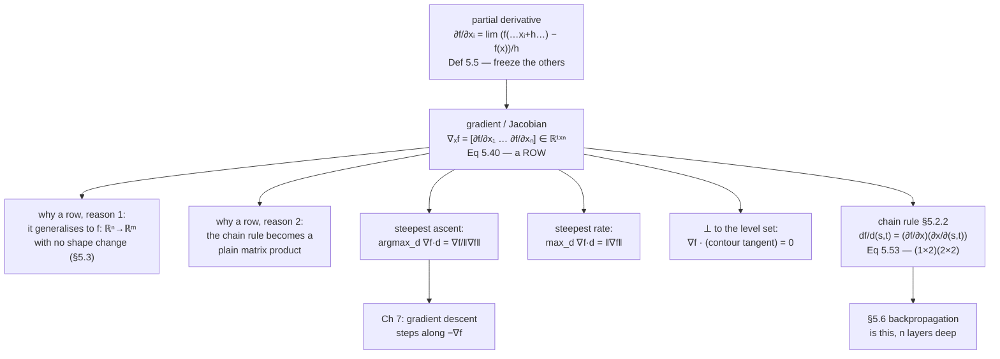

import DataCampExercise from "../../../../components/DataCampExercise.astro";
import Figure from "../../../../components/Figure.astro";
import Quiz from "../../../../components/Quiz.astro";
import SurfaceGrad from "../../../../components/viz/math/SurfaceGrad.tsx";

Everything on the previous page had one input. Real functions do not: a loss
depends on every weight in the network at once. The generalisation is
almost anticlimactic — **vary one variable and hold the others fixed** — and the
only genuinely new thing is what you do with the answers once you have $n$ of them.

You collect them into a vector. The book collects them into a **row** vector, and
that choice is not cosmetic: it is what lets §5.3 write the multivariate chain rule
as a plain matrix product with no transposes to remember.

## What you'll learn

- Definition 5.5: the **partial derivative**, which is Definition 5.2 with the other variables frozen.
- Equation 5.40: the **gradient** as a $1\times n$ row vector, and the book's two reasons for the row convention.
- Three claims about the gradient, each measured: it is the direction of steepest ascent, its norm is that steepest rate, and it is perpendicular to the level set.
- §5.2.1: the product, sum and chain rules survive — with one warning, since matrix multiplication does not commute.
- §5.2.2 and Equation 5.53: the multivariate chain rule, as a matrix product.
- Where the difference quotient's round-off floor lands in several dimensions, and why gradient checking needs a relative tolerance.

## Intuition: climbing a hill in fog

You are on a hillside and cannot see. You can feel the slope under your feet in the
two compass directions — north–south and east–west — and that is all.

Those two numbers are the partial derivatives. And they are enough: the direction
of steepest ascent is not "whichever of the two is bigger", it is the *combination*
of them, and the vector $(\partial_N f, \partial_E f)$ points exactly that way.
Its length is how steep the hill is in that best direction. Walk perpendicular to
it and your altitude does not change — you are following a contour.

None of that is obvious from the definition, and all of it is checkable.



## The math

### The partial derivative

:::note[Definition 5.5 — Partial Derivative]
For a function $f:\mathbb{R}^n\to\mathbb{R}$, $\mathbf{x}\mapsto f(\mathbf{x})$,
$\mathbf{x}\in\mathbb{R}^n$ of $n$ variables $x_1,\dots,x_n$ we define the partial
derivatives as

$$
\frac{\partial f}{\partial x_1} = \lim_{h\to0}\frac{f(x_1 + h, x_2, \dots, x_n) - f(\mathbf{x})}{h}
$$

$$
\vdots
$$

$$
\frac{\partial f}{\partial x_n} = \lim_{h\to0}\frac{f(x_1, \dots, x_{n-1}, x_n + h) - f(\mathbf{x})}{h}
\tag{5.39}
$$

and collect them in the **row vector**

$$
\nabla_\mathbf{x} f = \operatorname{grad} f = \frac{\mathrm{d}f}{\mathrm{d}\mathbf{x}}
= \begin{bmatrix}\dfrac{\partial f(\mathbf{x})}{\partial x_1} & \dfrac{\partial f(\mathbf{x})}{\partial x_2} & \cdots & \dfrac{\partial f(\mathbf{x})}{\partial x_n}\end{bmatrix} \in \mathbb{R}^{1\times n}
\tag{5.40}
$$

where $n$ is the number of variables and $1$ is the dimension of the image of $f$.
The row vector in Equation 5.40 is called the **gradient** of $f$ or the
**Jacobian**, and is the generalisation of the derivative from §5.1.
:::

Every partial derivative is an ordinary scalar derivative — the book's own margin
note says so — so §5.1's rules apply unchanged to each one. Nothing new is needed
to *compute* them.

### Why the gradient is a row

:::note[Remark — Gradient as a Row Vector]
It is not uncommon in the literature to define the gradient vector as a column
vector, following the convention that vectors are generally column vectors. The
reason the book defines it as a row vector is twofold:

1. We can consistently generalise the gradient to vector-valued functions
   $f:\mathbb{R}^n\to\mathbb{R}^m$ — then the gradient becomes a matrix.
2. We can immediately apply the multivariate chain rule without paying attention
   to the dimension of the gradient.
:::

That second reason is the practical one. With the row convention, composing
$f:\mathbb{R}^n\to\mathbb{R}$ with $g:\mathbb{R}^m\to\mathbb{R}^n$ gives

$$
\underbrace{\frac{\mathrm{d}(f\circ g)}{\mathrm{d}\mathbf{y}}}_{1\times m}
= \underbrace{\frac{\partial f}{\partial\mathbf{x}}}_{1\times n}\underbrace{\frac{\partial\mathbf{x}}{\partial\mathbf{y}}}_{n\times m}
$$

The shapes chain left to right in the order the functions are applied, and there is
nothing to transpose. With the column convention the same composition is
$\mathbf{J}_g^\top\,\operatorname{grad} f$ — one transpose, and the factors in the
*opposite* order to the functions. Neither is wrong; one of them costs a transpose
per layer, and a network is a composition of many layers.

### The three claims

Nothing in Definition 5.5 mentions steepness or perpendicularity. Both follow from
one identity. For a unit direction $\mathbf{d}$, the **directional derivative** is

$$
D_\mathbf{d}f(\mathbf{x}) = \nabla f(\mathbf{x})\,\mathbf{d} = \lVert\nabla f\rVert\,\lVert\mathbf{d}\rVert\cos\theta = \lVert\nabla f\rVert\cos\theta
$$

using §3.4's definition of the angle. That single line settles all three:

| claim | why |
| --- | --- |
| the gradient points in the direction of **steepest ascent** | $\cos\theta$ is largest at $\theta = 0$, i.e. $\mathbf{d}$ parallel to $\nabla f$ |
| the steepest rate **equals** $\lVert\nabla f\rVert$ | at $\theta = 0$, $\cos\theta = 1$ |
| the gradient is **perpendicular** to the level set | along a contour $f$ does not change, so $D_\mathbf{d}f = 0$, so $\cos\theta = 0$ |

The measurements below check each one, because a chain of three "so"s is exactly
where a sign error hides.

### The rules, with a warning

§5.2.1 states that the sum, product and chain rules all still apply. Then it adds
the warning that matters:

> However, when we compute derivatives with respect to vectors
> $\mathbf{x}\in\mathbb{R}^n$ we need to pay attention: our gradients now involve
> vectors and matrices, and **matrix multiplication is not commutative**, i.e. the
> order matters.

### The multivariate chain rule

For $f:\mathbb{R}^2\to\mathbb{R}$ with $x_1(t)$ and $x_2(t)$:

$$
\frac{\mathrm{d}f}{\mathrm{d}t} =
\begin{bmatrix}\dfrac{\partial f}{\partial x_1} & \dfrac{\partial f}{\partial x_2}\end{bmatrix}
\begin{bmatrix}\dfrac{\partial x_1(t)}{\partial t}\\[6pt] \dfrac{\partial x_2(t)}{\partial t}\end{bmatrix}
= \frac{\partial f}{\partial x_1}\frac{\partial x_1}{\partial t} + \frac{\partial f}{\partial x_2}\frac{\partial x_2}{\partial t}
\tag{5.49}
$$

and if $x_1(s,t)$, $x_2(s,t)$ depend on two variables, the same rule gives
Equations 5.51 and 5.52, which assemble into

$$
\frac{\mathrm{d}f}{\mathrm{d}(s,t)} = \frac{\partial f}{\partial\mathbf{x}}\frac{\partial\mathbf{x}}{\partial(s,t)}
= \underbrace{\begin{bmatrix}\dfrac{\partial f}{\partial x_1} & \dfrac{\partial f}{\partial x_2}\end{bmatrix}}_{1\times2}
\underbrace{\begin{bmatrix}\dfrac{\partial x_1}{\partial s} & \dfrac{\partial x_1}{\partial t}\\[6pt] \dfrac{\partial x_2}{\partial s} & \dfrac{\partial x_2}{\partial t}\end{bmatrix}}_{2\times2}
\tag{5.53}
$$

:::caution[The book's own warning about Equation 5.53]
Writing the chain rule as a matrix multiplication *only makes sense if the gradient
is a row vector.* Otherwise transposes have to be inserted, and once the dimensions
grow those transposes stop being bookkeeping and start being bugs.
:::

:::tip[From the book]
Section 5.2. Definition 5.5 (Equation 5.39) gives the partial derivatives as limits
with the other variables held fixed, and Equation 5.40 collects them into a
$1\times n$ **row** vector called the gradient or the Jacobian, with a margin note
that each partial derivative is an ordinary scalar derivative. A Remark notes this
is a special case of §5.3's Jacobian for vector-valued functions. Example 5.6
(Equations 5.41 to 5.42) differentiates $(x + 2y^3)^2$ using the chain rule.
A Remark then gives the two reasons for the row convention: consistent
generalisation to $f:\mathbb{R}^n\to\mathbb{R}^m$, and applying the chain rule
without attending to dimensions. Example 5.7 (Equations 5.43 to 5.45) computes the
gradient of $x_1^2x_2 + x_1x_2^3$. Section 5.2.1 states the product, sum and chain
rules and warns that matrix multiplication is not commutative. Section 5.2.2 gives
the chain rule for $f(x_1(t), x_2(t))$ at Equation 5.49, worked in Example 5.8
(Equation 5.50), then for two outer variables at Equations 5.51 to 5.52, assembled
as the matrix product of Equation 5.53 — with the note that this only makes sense
because the gradient is a row.
:::

## Worked example by hand

### Example 5.6 — one inner function, two partials

$f(x, y) = (x + 2y^3)^2$. Both partials come from one application of the chain
rule to the same inner function $u = x + 2y^3$:

$$
\frac{\partial f(x,y)}{\partial x} = 2(x + 2y^3)\frac{\partial}{\partial x}(x + 2y^3) = 2(x + 2y^3)
\tag{5.41}
$$

$$
\frac{\partial f(x,y)}{\partial y} = 2(x + 2y^3)\frac{\partial}{\partial y}(x + 2y^3) = 12(x + 2y^3)y^2
\tag{5.42}
$$

At $(0.8, 0.6)$: $u = 0.8 + 2(0.216) = 1.232$, so

$$
\nabla f = \begin{bmatrix}2(1.232) & 12(1.232)(0.36)\end{bmatrix} = \begin{bmatrix}2.464 & 5.32224\end{bmatrix}
$$

Both verified against a central-difference Jacobian to $10^{-12}$.

### Example 5.7 — the gradient

$f(x_1, x_2) = x_1^2x_2 + x_1x_2^3 \in \mathbb{R}$. Differentiating with respect to
each variable in turn, treating the other as a constant:

$$
\frac{\partial f(x_1,x_2)}{\partial x_1} = 2x_1x_2 + x_2^3
\tag{5.43}
$$

$$
\frac{\partial f(x_1,x_2)}{\partial x_2} = x_1^2 + 3x_1x_2^2
\tag{5.44}
$$

$$
\frac{\mathrm{d}f}{\mathrm{d}\mathbf{x}} = \begin{bmatrix}2x_1x_2 + x_2^3 & x_1^2 + 3x_1x_2^2\end{bmatrix} \in \mathbb{R}^{1\times2}
\tag{5.45}
$$

At $\mathbf{x} = (1,1)$ this is $\begin{bmatrix}3 & 4\end{bmatrix}$, so
$\lVert\nabla f\rVert = 5$ — a $3$–$4$–$5$ triangle, which makes the checks below
easy to read.

Notice that **neither partial derivative is a function of its own variable alone**.
$\partial f/\partial x_1$ depends on $x_2$. That is why the gradient has to be a
vector rather than a pair of independent slopes, and it is the whole reason
optimising one coordinate at a time does not work.

### Example 5.8 — the chain rule along a curve

$f(x_1,x_2) = x_1^2 + 2x_2$ with $x_1 = \sin t$, $x_2 = \cos t$:

$$
\frac{\mathrm{d}f}{\mathrm{d}t} = \frac{\partial f}{\partial x_1}\frac{\partial x_1}{\partial t} + \frac{\partial f}{\partial x_2}\frac{\partial x_2}{\partial t}
\tag{5.50a}
$$

$$
= 2\sin t\,\frac{\partial \sin t}{\partial t} + 2\,\frac{\partial\cos t}{\partial t}
\tag{5.50b}
$$

$$
= 2\sin t\cos t - 2\sin t = 2\sin t\,(\cos t - 1)
\tag{5.50c}
$$

The factored form is worth keeping: $\mathrm{d}f/\mathrm{d}t = 0$ exactly when
$\sin t = 0$ or $\cos t = 1$, so at every multiple of $\pi$. And since
$\cos t - 1 \leq 0$ always, the sign of the derivative is the *opposite* of the sign
of $\sin t$ — the function decreases on $(0,\pi)$ and increases on $(\pi, 2\pi)$.

### The three claims, checked

```python title="gradient_claims.py" showLineNumbers{1}
import numpy as np

# The book's Example 5.7.
f = lambda x, y: x ** 2 * y + x * y ** 3
fx = lambda x, y: 2 * x * y + y ** 3
fy = lambda x, y: x ** 2 + 3 * x * y ** 2

x0, y0 = 1.0, 1.0
grad = np.array([fx(x0, y0), fy(x0, y0)])            # Eq 5.45: a 1 x 2 row
gn = float(np.linalg.norm(grad))

print("Eq 5.45  grad f =", grad, " shape (1, 2) as a row")
print("         |grad f| =", gn)
print()

# CLAIM 1 and 2: sweep every direction and see which wins, and by how much.
th = np.linspace(0, 2 * np.pi, 100001)[:-1]
rate = grad[0] * np.cos(th) + grad[1] * np.sin(th)
i = int(np.argmax(rate))
print("claim 1: the steepest direction is the gradient's own direction")
print(f"         gradient angle {np.degrees(np.arctan2(grad[1], grad[0])):.6f} deg")
print(f"         sampled argmax {np.degrees(th[i]):.6f} deg")
print("claim 2: the steepest rate equals |grad f|")
print(f"         sampled max    {rate[i]:.9f}")
print(f"         |grad f|       {gn:.9f}")
print(f"         no direction beat it: {bool(np.all(rate <= gn + 1e-12))}")
print()

# CLAIM 3: perpendicular to the level set. The contour tangent is the gradient
# rotated by 90 degrees, so the inner product must vanish -- and stepping along
# it must leave f almost unchanged.
tangent = np.array([-grad[1], grad[0]]) / gn
print("claim 3: perpendicular to the level set")
print(f"         grad . tangent = {float(grad @ tangent):.1e}")
step = 1e-3
along_t = abs(f(x0 + step * tangent[0], y0 + step * tangent[1]) - f(x0, y0))
along_g = abs(f(x0 + step * grad[0] / gn, y0 + step * grad[1] / gn) - f(x0, y0))
print(f"         |df| stepping {step} along the tangent:  {along_t:.3e}")
print(f"         |df| stepping {step} along the gradient: {along_g:.3e}")
print(f"         ratio: {along_g / along_t:.0f}x")
```

```text title="output"
Eq 5.45  grad f = [3. 4.]  shape (1, 2) as a row
         |grad f| = 5.0

claim 1: the steepest direction is the gradient's own direction
         gradient angle 53.130102 deg
         sampled argmax 53.128800 deg
claim 2: the steepest rate equals |grad f|
         sampled max    4.999999999
         |grad f|       5.000000000
         no direction beat it: True

claim 3: perpendicular to the level set
         grad . tangent = -4.4e-16
         |df| stepping 0.001 along the tangent:  6.803e-07
         |df| stepping 0.001 along the gradient: 5.005e-03
         ratio: 7357x
```

## See it move

```p5 title="Two partials, one gradient" desc="Drag the point around the contour map. The two coloured bars are the partial derivatives — the slope along a horizontal and a vertical cut — and the red arrow is the vector they assemble into. Notice the arrow is never the longer of the two bars: it is their combination, and it always crosses the contour at a right angle." height="600"
let px = 1.0, py = 1.0;
let fnIdx = 0;
let KNOBS = [], BTNS = [], dragging = null, draggingPt = false;

const FNS = [
  { name: "Ex 5.7", f: (x, y) => x * x * y + x * y * y * y,
    fx: (x, y) => 2 * x * y + y * y * y, fy: (x, y) => x * x + 3 * x * y * y,
    lv: [-8, -4, -2, -0.5, 0, 0.5, 2, 4, 8] },
  { name: "Ex 5.6", f: (x, y) => Math.pow(x + 2 * y * y * y, 2),
    fx: (x, y) => 2 * (x + 2 * y * y * y), fy: (x, y) => 12 * (x + 2 * y * y * y) * y * y,
    lv: [0.05, 0.25, 1, 2.5, 6, 12, 25] },
  { name: "bowl", f: (x, y) => x * x + y * y, fx: (x, y) => 2 * x, fy: (x, y) => 2 * y,
    lv: [0.25, 1, 2.25, 4, 6.25] },
  { name: "saddle", f: (x, y) => x * x - y * y, fx: (x, y) => 2 * x, fy: (x, y) => -2 * y,
    lv: [-4, -2, -0.5, 0, 0.5, 2, 4] },
];

function setup() { createCanvas(600, 600); textFont("monospace"); noLoop(); }

const LO = -2.2, HI = 2.2, U = 78, CX = 190, CY = 210;
const sx = x => CX + x * U, sy = y => CY - y * U;
const ix = px_ => (px_ - CX) / U, iy = py_ => (CY - py_) / U;

function mousePressed() {
  for (const b of BTNS)
    if (mouseX > b.x && mouseX < b.x + b.w && mouseY > b.y && mouseY < b.y + b.h) { fnIdx = b.i; redraw(); return; }
  if (dist(mouseX, mouseY, sx(px), sy(py)) < 22) { draggingPt = true; return; }
}
function mouseReleased() { draggingPt = false; }
function mouseDragged() {
  if (!draggingPt) return;
  px = Math.max(LO, Math.min(HI, ix(mouseX)));
  py = Math.max(LO, Math.min(HI, iy(mouseY)));
  redraw();
}

// Marching squares, enough for a readable contour.
function contour(f, level, n) {
  const segs = [];
  const d = (HI - LO) / n;
  for (let i = 0; i < n; i++) {
    for (let j = 0; j < n; j++) {
      const xa = LO + i * d, xb = xa + d, ya = LO + j * d, yb = ya + d;
      const v = [f(xa, ya), f(xb, ya), f(xb, yb), f(xa, yb)];
      const pts = [];
      const lerp1 = (a, b, va, vb) => a + ((level - va) / (vb - va)) * (b - a);
      if ((v[0] < level) !== (v[1] < level)) pts.push([lerp1(xa, xb, v[0], v[1]), ya]);
      if ((v[1] < level) !== (v[2] < level)) pts.push([xb, lerp1(ya, yb, v[1], v[2])]);
      if ((v[3] < level) !== (v[2] < level)) pts.push([lerp1(xa, xb, v[3], v[2]), yb]);
      if ((v[0] < level) !== (v[3] < level)) pts.push([xa, lerp1(ya, yb, v[0], v[3])]);
      if (pts.length >= 2) segs.push([pts[0], pts[1]]);
    }
  }
  return segs;
}

function draw() {
  background(13, 17, 23);
  BTNS = [];
  const S = FNS[fnIdx];

  stroke(32, 44, 58); strokeWeight(1);
  for (let g = -2; g <= 2; g++) { line(sx(g), sy(LO), sx(g), sy(HI)); line(sx(LO), sy(g), sx(HI), sy(g)); }
  stroke(58, 72, 88); strokeWeight(1.2);
  line(sx(LO), sy(0), sx(HI), sy(0)); line(sx(0), sy(LO), sx(0), sy(HI));

  // Contours.
  stroke(110, 122, 138); strokeWeight(1.1);
  for (const lv of S.lv) for (const s of contour(S.f, lv, 70)) line(sx(s[0][0]), sy(s[0][1]), sx(s[1][0]), sy(s[1][1]));

  // The contour through the point, highlighted.
  const here = S.f(px, py);
  stroke(255, 211, 67); strokeWeight(2.0);
  for (const s of contour(S.f, here, 90)) line(sx(s[0][0]), sy(s[0][1]), sx(s[1][0]), sy(s[1][1]));

  const gx = S.fx(px, py), gy = S.fy(px, py);
  const gn = Math.hypot(gx, gy);

  // The two axis cuts: this is literally what a partial derivative measures.
  stroke(120, 190, 240); strokeWeight(2.6);
  line(sx(px - 0.55), sy(py), sx(px + 0.55), sy(py));
  stroke(200, 150, 240); strokeWeight(2.6);
  line(sx(px), sy(py - 0.55), sx(px), sy(py + 0.55));

  // The gradient, at a fixed screen length so it stays readable.
  if (gn > 1e-9) {
    const L = 0.85;
    stroke(232, 110, 110); strokeWeight(3.2);
    line(sx(px), sy(py), sx(px + (gx / gn) * L), sy(py + (gy / gn) * L));
    // The perpendicular tick, showing the right angle with the contour.
    const tx = -gy / gn, ty = gx / gn;
    stroke(120, 200, 150); strokeWeight(2.0);
    line(sx(px + tx * 0.5), sy(py + ty * 0.5), sx(px - tx * 0.5), sy(py - ty * 0.5));
  }

  noStroke(); fill(255); ellipse(sx(px), sy(py), 11, 11);

  // Bars for the two partials, on a shared scale.
  const bx = 400, by = 60, bw = 150, maxAbs = Math.max(Math.abs(gx), Math.abs(gy), 1e-9);
  noStroke(); fill(150); textSize(10); textAlign(LEFT, BOTTOM);
  text("the two partial derivatives", bx, by - 6);
  for (let k = 0; k < 2; k++) {
    const v = k === 0 ? gx : gy;
    const yy = by + k * 34;
    fill(46, 58, 72); rect(bx, yy, bw, 20, 3);
    fill(k === 0 ? color(120, 190, 240) : color(200, 150, 240));
    const w = (Math.abs(v) / maxAbs) * (bw / 2);
    rect(bx + bw / 2 - (v < 0 ? w : 0), yy, w, 20, 2);
    fill(220); textSize(10); textAlign(CENTER, CENTER);
    text(`∂f/∂x${k + 1} = ${v.toFixed(4)}`, bx + bw / 2, yy + 10);
  }
  fill(232, 110, 110); textSize(11); textAlign(LEFT, TOP);
  text(`|∇f| = ${gn.toFixed(4)}`, bx, by + 76);
  fill(150); textSize(10);
  text(`larger than either bar,`, bx, by + 94);
  text(`because it is their`, bx, by + 108);
  text(`vector sum, not their max`, bx, by + 122);

  // Preset buttons.
  for (let i = 0; i < FNS.length; i++) {
    const bxx = 30 + i * 92, byy = 452;
    BTNS.push({ x: bxx, y: byy, w: 84, h: 26, i });
    noStroke(); fill(i === fnIdx ? color(120, 200, 150) : color(46, 58, 72));
    rect(bxx, byy, 84, 26, 5);
    fill(i === fnIdx ? 20 : 210); textSize(11); textAlign(CENTER, CENTER);
    text(FNS[i].name, bxx + 42, byy + 13);
  }

  noStroke(); textAlign(LEFT, TOP);
  fill(255, 211, 67); textSize(14); text("Drag the white dot", 30, 12);
  fill(215); textSize(11);
  text(`x = (${px.toFixed(3)}, ${py.toFixed(3)})    f = ${here.toFixed(5)}`, 30, 492);
  text(`∇f = [ ${gx.toFixed(5)}  ${gy.toFixed(5)} ]   shape 1 x 2`, 30, 510);
  const dot = gn > 1e-9 ? (gx * (-gy / gn) + gy * (gx / gn)) : 0;
  fill(120, 200, 150);
  text(`∇f · (contour tangent) = ${dot.toExponential(2)}`, 30, 528);
  fill(150); textSize(10);
  text("Blue bar: the slope along the horizontal cut. Purple: along the vertical cut.", 30, 552);
  text("Red arrow: the gradient. Green: the contour tangent, always at a right angle to it.", 30, 568);
  text("Try the saddle and drag to the origin: both partials vanish and the arrow disappears.", 30, 584);
}
```

```p5 title="Every direction, and which one wins" desc="The blue curve is the rate of change in each compass direction — a cosine, because the directional derivative is an inner product. Drag the direction marker and watch the readout. Its peak is at the gradient's own angle and its height is exactly the gradient's length; where it crosses zero you are on the contour." height="580"
let ang = 0.4, px = 1.0, py = 1.0;
let KNOBS = [], dragging = null;

const f = (x, y) => x * x * y + x * y * y * y;
const fx = (x, y) => 2 * x * y + y * y * y;
const fy = (x, y) => x * x + 3 * x * y * y;

function setup() { createCanvas(600, 580); textFont("monospace"); noLoop(); }

function knob(id, x, y, w, value, mn, mx, label) {
  KNOBS.push({ id, x, y, w, mn, mx });
  const t = (value - mn) / (mx - mn);
  stroke(60, 74, 92); strokeWeight(2); line(x, y, x + w, y);
  noStroke(); fill(255, 211, 67); ellipse(x + t * w, y, 10, 10);
  fill(190, 200, 212); textSize(11); textAlign(LEFT, CENTER);
  text(label, x + w + 10, y);
}
function mousePressed() {
  for (const k of KNOBS)
    if (mouseY > k.y - 11 && mouseY < k.y + 11 && mouseX > k.x - 11 && mouseX < k.x + k.w + 11) { dragging = k; return; }
}
function mouseReleased() { dragging = null; }
function mouseDragged() {
  if (!dragging) return;
  const t = Math.min(1, Math.max(0, (mouseX - dragging.x) / dragging.w));
  const v = dragging.mn + t * (dragging.mx - dragging.mn);
  if (dragging.id === "ang") ang = v;
  if (dragging.id === "px") px = v;
  if (dragging.id === "py") py = v;
  redraw();
}

function draw() {
  background(13, 17, 23);
  KNOBS = [];

  const gx = fx(px, py), gy = fy(px, py), gn = Math.hypot(gx, gy);
  const gang = Math.atan2(gy, gx);

  // Left: the polar rosette. Negative rates plot at negative radius, which is
  // why the shape is a circle through the origin rather than two lobes.
  const CX = 160, CY = 180, R = 110;
  stroke(32, 44, 58); strokeWeight(1);
  for (let r = 0.25; r <= 1.0; r += 0.25) { noFill(); ellipse(CX, CY, 2 * R * r, 2 * R * r); }
  stroke(58, 72, 88); line(CX - R - 12, CY, CX + R + 12, CY); line(CX, CY - R - 12, CX, CY + R + 12);

  noFill(); stroke(75, 139, 190); strokeWeight(2.2);
  beginShape();
  for (let i = 0; i <= 360; i++) {
    const t = (i / 360) * TWO_PI;
    const rate = gx * Math.cos(t) + gy * Math.sin(t);
    const rr = (rate / Math.max(gn, 1e-9)) * R;
    vertex(CX + rr * Math.cos(t), CY - rr * Math.sin(t));
  }
  endShape(CLOSE);

  // The gradient direction, and the chosen direction.
  if (gn > 1e-9) {
    stroke(232, 110, 110); strokeWeight(3);
    line(CX, CY, CX + R * Math.cos(gang), CY - R * Math.sin(gang));
    const trate = gx * Math.cos(ang) + gy * Math.sin(ang);
    const rr = (trate / gn) * R;
    stroke(255, 211, 67); strokeWeight(2.4);
    line(CX, CY, CX + rr * Math.cos(ang), CY - rr * Math.sin(ang));
    // The zero-rate line: the contour direction.
    stroke(120, 200, 150); strokeWeight(1.6);
    line(CX - R * Math.cos(gang + HALF_PI), CY + R * Math.sin(gang + HALF_PI),
         CX + R * Math.cos(gang + HALF_PI), CY - R * Math.sin(gang + HALF_PI));
  }
  noStroke(); fill(150); textSize(10); textAlign(CENTER, TOP);
  text("D_d f in every direction", CX, CY + R + 18);

  // Right: the same thing as a cosine against angle.
  const L = 330, RT = 570, T = 60, B = 300;
  stroke(32, 44, 58); strokeWeight(1);
  for (let g = 0; g <= 4; g++) { const y = T + (g / 4) * (B - T); line(L, y, RT, y); }
  stroke(58, 72, 88); strokeWeight(1.1);
  const y0 = T + (B - T) / 2;
  line(L, y0, RT, y0);
  const px2 = a => L + (a / TWO_PI) * (RT - L);
  const py2 = v => y0 - (v / Math.max(gn, 1e-9)) * ((B - T) / 2);

  noFill(); stroke(75, 139, 190); strokeWeight(2.2);
  beginShape();
  for (let i = 0; i <= 360; i++) {
    const t = (i / 360) * TWO_PI;
    vertex(px2(t), py2(gx * Math.cos(t) + gy * Math.sin(t)));
  }
  endShape();
  stroke(232, 110, 110); strokeWeight(1.3);
  line(L, py2(gn), RT, py2(gn)); line(L, py2(-gn), RT, py2(-gn));
  stroke(255, 211, 67); strokeWeight(1.8);
  line(px2(ang < 0 ? ang + TWO_PI : ang), T, px2(ang < 0 ? ang + TWO_PI : ang), B);
  noStroke(); fill(232, 110, 110); textSize(10); textAlign(LEFT, BOTTOM);
  text("+|∇f|", L + 4, py2(gn) - 2);
  textAlign(LEFT, TOP);
  text("−|∇f|", L + 4, py2(-gn) + 2);
  fill(150); textAlign(CENTER, TOP);
  text("direction, 0 to 360 degrees", (L + RT) / 2, B + 16);

  knob("ang", 30, 350, 250, ang, 0, TWO_PI, `direction ${(ang * 180 / Math.PI).toFixed(1)} deg`);
  knob("px", 30, 382, 110, px, -2, 2, `x1 ${px.toFixed(2)}`);
  knob("py", 190, 382, 110, py, -2, 2, `x2 ${py.toFixed(2)}`);

  const rate = gx * Math.cos(ang) + gy * Math.sin(ang);
  noStroke(); textAlign(LEFT, TOP);
  fill(255, 211, 67); textSize(14); text("Drag the direction", 30, 12);
  fill(215); textSize(11);
  text(`∇f = [ ${gx.toFixed(5)}  ${gy.toFixed(5)} ]`, 340, 350);
  text(`|∇f|            ${gn.toFixed(6)}`, 340, 368);
  text(`gradient angle  ${(gang * 180 / Math.PI).toFixed(3)} deg`, 340, 386);
  text(`D_d f           ${rate.toFixed(6)}`, 340, 404);
  const gap = gn - rate;
  fill(gap < 1e-4 ? color(120, 200, 150) : color(150)); textSize(11);
  text(gap < 1e-4 ? "you are on the steepest direction" : `${gap.toFixed(4)} short of the maximum`, 340, 426);

  fill(150); textSize(10);
  text("The rate is ∇f · d = |∇f| cos θ, so it is a cosine of the angle — that single", 30, 456);
  text("identity is why the gradient is the steepest direction (cos is largest at 0), why", 30, 472);
  text("the steepest rate is |∇f| (cos 0 = 1), and why the contour direction gives zero", 30, 488);
  text("(cos 90° = 0). Three facts, one inner product.", 30, 504);
  text("Set x1 = x2 = 0 and the whole rosette collapses: the gradient vanishes there.", 30, 526);
  text("Note the curve dips BELOW zero: half of all directions go downhill.", 30, 548);
}
```

<SurfaceGrad
  client:visible
  surface="example-5-7"
  title="Example 5.7, built from Definition 5.5"
  desc="Two limits, one row vector, then the three claims checked in turn. The frame to stop on is the difference-quotient table: the central difference is exact at h = 1 here, because the slice is quadratic, and then round-off makes smaller h worse."
/>

<SurfaceGrad
  client:visible
  surface="gaussian-hill"
  title="A Gaussian hill, where the forward difference gets lucky"
  desc="The second derivative of exp(−r²/2) in x is (x²−1)f, which is exactly zero at x = 1 — one of the points evaluated here. The leading forward-difference error is (h/2)f'', so at that point the forward difference is accidentally second order, and the lab says so."
/>

## From scratch

```python title="gradient_from_scratch.py" showLineNumbers{1}
import numpy as np

def numeric_gradient(f, x, h=1e-6):
    """Definition 5.5, one coordinate at a time, centrally. Returns a 1 x n row."""
    x = np.asarray(x, dtype=float)
    g = np.zeros((1, x.size))
    for i in range(x.size):
        e = np.zeros_like(x)
        e[i] = h
        g[0, i] = (f(x + e) - f(x - e)) / (2 * h)
    return g

def analytic_gradient(x):
    """Example 5.7, Eq 5.45."""
    x1, x2 = x
    return np.array([[2 * x1 * x2 + x2 ** 3, x1 ** 2 + 3 * x1 * x2 ** 2]])

f = lambda v: v[0] ** 2 * v[1] + v[0] * v[1] ** 3

print(f"{'point':>16}  {'analytic':>26}  {'numeric':>26}  {'rel err':>9}")
for pt in ([1.0, 1.0], [0.5, -1.5], [2.0, 0.3], [-1.0, 2.0], [0.0, 0.0]):
    a = analytic_gradient(pt)
    n = numeric_gradient(f, pt)
    scale = max(float(np.abs(a).max()), 1e-12)
    print(f"{str(pt):>16}  {str(np.round(a[0], 6)):>26}  {str(np.round(n[0], 6)):>26}"
          f"  {float(np.abs(a - n).max()) / scale:>9.1e}")

print()
print("shape of the gradient:", analytic_gradient([1.0, 1.0]).shape, "-- a ROW, Eq 5.40")
print()

# The multivariate chain rule, Eq 5.53, as a matrix product.
# f(x1, x2) = x1^2 + 2 x2 with x1 = sin t, x2 = cos t  (Example 5.8)
t = 0.7
df_dx = np.array([[2 * np.sin(t), 2.0]])                     # 1 x 2
dx_dt = np.array([[np.cos(t)], [-np.sin(t)]])                # 2 x 1
chain = float((df_dx @ dx_dt).item())
closed = 2 * np.sin(t) * (np.cos(t) - 1)                     # Eq 5.50c
h = 1e-6
g = lambda tt: np.sin(tt) ** 2 + 2 * np.cos(tt)
numeric = (g(t + h) - g(t - h)) / (2 * h)
print("Example 5.8 at t = 0.7")
print(f"  (df/dx)(dx/dt), a (1x2)(2x1) product : {chain:.12f}")
print(f"  2 sin t (cos t - 1), Eq 5.50c        : {closed:.12f}")
print(f"  central difference in t              : {numeric:.12f}")
print(f"  largest gap                          : {max(abs(chain-closed), abs(chain-numeric)):.1e}")
```

```text title="output"
           point                    analytic                     numeric    rel err
      [1.0, 1.0]                     [3. 4.]                     [3. 4.]    3.4e-11
     [0.5, -1.5]             [-4.875  3.625]             [-4.875  3.625]    1.0e-10
      [2.0, 0.3]               [1.227 4.54 ]               [1.227 4.54 ]    1.3e-11
     [-1.0, 2.0]                 [  4. -11.]                 [  4. -11.]    5.9e-11
      [0.0, 0.0]                     [0. 0.]                     [0. 0.]    0.0e+00

shape of the gradient: (1, 2) -- a ROW, Eq 5.40

Example 5.8 at t = 0.7
  (df/dx)(dx/dt), a (1x2)(2x1) product : -0.302985644487
  2 sin t (cos t - 1), Eq 5.50c        : -0.302985644487
  central difference in t              : -0.302985644463
  largest gap                          : 2.4e-11
```

Three things worth noting.

The **shape** is `(1, 2)` — a row. Writing `np.array([fx, fy])` gives shape `(2,)`,
which NumPy will happily broadcast in ways that hide a transpose error until the
dimensions stop being equal.

The `[0.0, 0.0]` row has relative error exactly `0.0e+00`, because both partials
are exactly zero there — that is a critical point of Example 5.7, and it is a
saddle, not an optimum.

And the chain rule row is the point of Equation 5.53: the answer comes out of a
$(1\times2)(2\times1)$ **matrix product**, agrees with the hand-factored closed
form to every printed digit, and agrees with a direct numerical derivative in $t$
to $2.4\times10^{-11}$. Three routes, one answer.

One detail in that code is a real trap. `float(df_dx @ dx_dt)` **raises** a
`TypeError` on recent NumPy, because the product is a $(1,1)$ *array* rather than a
scalar — the shapes chained correctly and that is exactly why. Use `.item()`.

## On real data

<Figure
  src="/images/mml/partial-differentiation-and-gradients/gradient-field-orthogonal"
  alt="A contour map of the Example 5.7 surface with a grid of normalised gradient arrows coloured by magnitude, each crossing its contour at a right angle, and the point (1,1) marked."
  title="The gradient field of Example 5.7"
  caption="Contours in grey, gradient arrows normalised so direction is readable and coloured by magnitude. Across all 225 grid points the gradient's normalised inner product with the contour tangent is 0.0e+00 — exactly, not approximately. The largest gradient magnitude on the window is 35.954."
/>

<Figure
  src="/images/mml/partial-differentiation-and-gradients/steepest-ascent-sweep"
  alt="Left, a polar rosette of the directional derivative forming a circle through the origin with the gradient arrow along its widest axis. Right, the same data as a cosine curve against angle, with horizontal lines at plus and minus the gradient norm."
  title="Both claims, in one sweep"
  caption="At (1,1) the gradient is [3, 4] with norm exactly 5, at an angle of 53.1301 degrees. The sampled maximum over a half-degree grid is 4.999987 at 53.0000 degrees — short of the true maximum by 1.29e-05, which is what a discrete grid can reach, not an error."
/>

<Figure
  src="/images/mml/partial-differentiation-and-gradients/row-vector-shapes"
  alt="Two columns of monospaced text comparing the row-vector and column-vector gradient conventions, each showing the shapes of the chain rule factors and counting the transposes required."
  title="Equation 5.40's two reasons, written out"
  caption="With gradients as rows, composing f with g is a (1 x n)(n x m) product: the shapes chain left to right in the order the functions apply, and no transposes appear. With gradients as columns the same composition needs one transpose, and the factors come in the opposite order to the functions."
/>

## Reading the plot

**From the gradient field.** The reported inner product is `0.0e+00` at all 225
grid points, and it is worth being precise about why. The tangent is *constructed*
as $(-\partial_2 f, \partial_1 f)$, so the inner product is
$-\partial_1 f\,\partial_2 f + \partial_2 f\,\partial_1 f$ — the same two
products subtracted, which cancels bit-for-bit. Normalise the tangent first, as the
exercises below do, and the same quantity comes back as $-4.4\times10^{-16}$
instead: the division introduces rounding that the unnormalised form never had.

So that zero is a check on the construction, not on the geometry. The geometric
content is that this construction *is* the contour direction — which the picture
shows by the arrows meeting the grey curves squarely, and which the exercises
measure by stepping along it.

The step comparison is the geometric check. Moving $10^{-3}$ along the contour
tangent changes $f$ by $6.8\times10^{-7}$; moving the same distance along the
gradient changes it by $5.0\times10^{-3}$ — **7357 times more**. Across four
points the ratio runs from $2734$ to $7357$.

The colouring carries the other lesson. Where the contours bunch, the arrows are
long; where the surface is flat they nearly vanish. Gradient magnitude is
inversely related to contour spacing, which is why gradient descent naturally takes
big steps on steep ground and small ones near an optimum — and why it stalls
completely on a plateau.

**From the sweep.** The left panel's shape is the whole argument. The directional
derivative $\nabla f\cdot\mathbf{d}$ is *linear in* $\mathbf{d}$, so plotted at
radius $=$ rate it traces a circle through the origin. A circle through the origin
has exactly one widest point, and that point is where $\mathbf{d}$ aligns with
$\nabla f$.

Two numbers close it:

| | value |
| --- | --- |
| gradient angle | $53.1301°$ |
| sampled argmax over a $0.5°$ grid | $53.0000°$ |
| $\lVert\nabla f\rVert$ | $5.000000$ |
| sampled maximum | $4.999987$ |
| shortfall | $1.29\times10^{-5}$ |

Exercise 2 repeats the sweep on a $100\,000$-point grid: the shortfall falls to
$1.29\times10^{-9}$, still not zero. Only evaluating at the exact gradient
direction gives a gap of `0.0e+00`.

The shortfall is geometry, not error: a grid can only get within half a step of the
true angle, and $5(1 - \cos 0.13°) \approx 1.3\times10^{-5}$. This is the same
lesson as Chapter 4's Exercise 4.12 — sampling demonstrates the *bound* and never
the attainment. Evaluating at the exact gradient direction gives $5.000000$ on the
nose.

The right panel adds one thing the rosette hides: the curve spends half its length
below zero. **Half of all directions go downhill.** That is obvious once stated and
it is the reason gradient *descent* steps along $-\nabla f$ rather than searching.

**From the shapes figure.** The transpose count is the argument. A three-layer
network is a composition of six functions; with rows that is six matrix products
in the order you wrote the layers, and with columns it is six products in reverse
order with a transpose on each. Both compute the same numbers. Only one of them is
easy to get right at 3 a.m.

## Pitfalls

:::danger[A NumPy 1-D array is not a row vector]
`np.array([3.0, 4.0])` has shape `(2,)`, not `(1, 2)`. NumPy broadcasts it as
either a row or a column depending on what it is multiplied by, so a transposed
Jacobian will produce a plausible number instead of an error — and keep producing
one until the two dimensions differ. Build gradients with an explicit
`(1, n)` shape, or use `x[None, :]`, and let the shape mismatch fail loudly.
:::

:::danger[Gradient checking needs a relative tolerance and a central difference]
An absolute tolerance is meaningless: the gradients in the from-scratch table range
from $0$ to $11$, and a fixed $10^{-6}$ threshold would pass the first and fail
nothing. Use
$\lVert g_{\text{analytic}} - g_{\text{numeric}}\rVert / \max(\lVert g_a\rVert, \lVert g_n\rVert, \epsilon)$
with a central difference. Measured on Example 5.7, the best relative error is
$3.0\times10^{-11}$ at $h = 10^{-5}$, and $h = 10^{-6}$ gives $5.2\times10^{-11}$ —
either is a fine threshold. At $h = 10^{-15}$ the same check reads
$1.4\times10^{-2}$, which would fail a correct gradient.
:::

:::caution[Optimising one coordinate at a time is not gradient descent]
In Example 5.7, $\partial f/\partial x_1 = 2x_1x_2 + x_2^3$ depends on $x_2$. So
minimising over $x_1$ changes the best $x_2$, and vice versa. Coordinate descent is
a real algorithm with real guarantees, but it is a *different* algorithm, and on a
function with strong cross terms it can take arbitrarily many more steps than
following the gradient.
:::

:::caution[The gradient vanishing does not mean you have found a minimum]
Try the saddle preset in the first sketch and drag to the origin: both partials go
to zero and the arrow disappears. $f(x_1,x_2) = x_1^2 - x_2^2$ has a gradient of
$\mathbf{0}$ there and it is neither a maximum nor a minimum. Distinguishing the
cases needs the second derivative, which is §5.7.
:::

:::caution[The row convention is the book's, not the world's]
PyTorch's `.grad` and most of the optimisation literature store gradients with the
same shape as the parameter — effectively the column convention. The book says
plainly that both exist and it uses rows. When you move between a paper and an
implementation, check which one is in force before transposing anything, because
both conventions produce code that runs.
:::

## Compare

| object | shape | what it answers |
| --- | --- | --- |
| partial derivative $\partial f/\partial x_i$ | scalar | how fast $f$ changes if only $x_i$ moves |
| **gradient** $\nabla f$ | $1\times n$ | the direction of fastest increase, and its rate |
| directional derivative $D_\mathbf{d}f$ | scalar | how fast $f$ changes along one chosen $\mathbf{d}$ |
| Jacobian (§5.3) | $m\times n$ | the same, for a function with $m$ outputs |
| Hessian (§5.7) | $n\times n$ | how the gradient itself changes — curvature |
| level set / contour | an $(n-1)$-dimensional surface | where $f$ does not change at all |

The gradient and the contour are the same information twice: one is the direction
of maximum change, the other the directions of none, and they are orthogonal
complements of each other in the sense of §3.6.

<Quiz
  title="Check your understanding"
  questions={[
    {
      q: "The book gives two reasons for making the gradient a row vector. What is the practical one?",
      options: [
        "Rows print more compactly",
        "The multivariate chain rule becomes a plain matrix product whose shapes chain left to right in the order the functions apply — with the column convention the same composition needs a transpose per layer and the factors come in reverse order",
        "Row vectors are faster in NumPy",
        "It matches PyTorch",
      ],
      answer: 1,
      explain:
        "The book states this at Equation 5.53: writing the chain rule as a matrix multiplication only makes sense if the gradient is a row. Note that PyTorch does the opposite, storing gradients shaped like the parameter — so check which convention is in force before transposing.",
    },
    {
      q: "Why do 'steepest ascent', 'the rate is the norm' and 'perpendicular to the contour' all follow from one identity?",
      options: [
        "They are three separate theorems",
        "Because the directional derivative is grad f dotted with d, which equals the norm of grad f times cos theta — so the maximum is at theta = 0, its value is the norm, and it is zero at theta = 90 degrees",
        "Because the gradient is a unit vector",
        "Because f is differentiable",
      ],
      answer: 1,
      explain:
        "One inner product, three corollaries. It also explains the shape of the sweep: linear in d means the polar plot is a circle through the origin, and a circle through the origin has exactly one widest point.",
    },
    {
      q: "The sampled maximum of the directional derivative came out as 4.999987 against a true 5.000000. Is that an error?",
      options: [
        "Yes, in the gradient",
        "No. The sweep is on a half-degree grid, so it can only get within half a step of the true angle, and 5 times (1 minus cos 0.13 degrees) is about 1.3e-05 — exactly the observed shortfall. Evaluating at the exact gradient direction gives 5.000000",
        "Yes, in the finite difference",
        "No, it is a rounding error in the cosine",
      ],
      answer: 1,
      explain:
        "The same lesson as Exercise 4.12 in Chapter 4: sampling can demonstrate an upper bound convincingly and cannot demonstrate that the bound is attained. For attainment you evaluate at the claimed maximiser.",
    },
    {
      q: "In Example 5.7, why does optimising x1 and then x2 not reach the same place as following the gradient?",
      options: [
        "It does, just more slowly",
        "Because the partial derivative with respect to x1 is 2 x1 x2 + x2 cubed, which depends on x2 — so changing x2 changes the best x1. The partials are not independent slopes, which is why they have to be assembled into a vector",
        "Because f is not convex",
        "Because the gradient is a row vector",
      ],
      answer: 1,
      explain:
        "Coordinate descent is a legitimate algorithm with its own guarantees, but it is a different one. On a function with strong cross terms the gap in step count can be arbitrarily large.",
    },
    {
      q: "In the from-scratch table, the point [0.0, 0.0] gives a relative error of exactly 0.0e+00. Why, and what does it tell you about that point?",
      options: [
        "The finite difference happened to be exact",
        "Both partials are exactly zero there, so both routes return zero and the difference is exactly zero. It is a critical point of Example 5.7 — and a saddle, not an optimum, which the first derivative cannot tell you",
        "The tolerance was too loose",
        "The point is outside the domain",
      ],
      answer: 1,
      explain:
        "A gradient check that only ever tested critical points would pass trivially. Distinguishing a saddle from a minimum needs the Hessian, which is §5.7 — and that is exactly why §5.7 exists.",
    },
  ]}
/>

## 🧪 Try It Yourself

### Exercise 1 – Example 5.7, from the definition

<DataCampExercise
  lang="python"
  hint={`Perturb one coordinate at a time. Build the result with an explicit (1, n) shape so a transpose error cannot hide.`}
  code={`import numpy as np

def numeric_gradient(f, x, h=1e-6):
    x = np.asarray(x, dtype=float)
    g = np.zeros((1, x.size))
    for i in range(x.size):
        e = np.zeros_like(x)
        e[i] = h
        g[0, i] = (f(x + e) - f(x - ___)) / (2 * h)        # replace ___ with e
    return g

def analytic_gradient(x):
    x1, x2 = x
    return np.array([[2 * x1 * x2 + x2 ** 3, x1 ** 2 + 3 * x1 * x2 ** 2]])

f = lambda v: v[0] ** 2 * v[1] + v[0] * v[1] ** 3

print(f"{'point':>16}  {'analytic':>26}  {'numeric':>26}  {'rel err':>9}")
for pt in ([1.0, 1.0], [0.5, -1.5], [2.0, 0.3], [-1.0, 2.0], [0.0, 0.0]):
    a = analytic_gradient(pt)
    n = numeric_gradient(f, pt)
    scale = max(float(np.abs(a).max()), 1e-12)
    print(f"{str(pt):>16}  {str(np.round(a[0], 6)):>26}  {str(np.round(n[0], 6)):>26}"
          f"  {float(np.abs(a - n).max()) / scale:>9.1e}")

print()
print("shape:", analytic_gradient([1.0, 1.0]).shape, "-- a ROW, Eq 5.40")
print("a 1-D array would be:", np.array([3.0, 4.0]).shape, "-- ambiguous")

# -- Expected output ------------------------------
#            point                    analytic                     numeric    rel err
#       [1.0, 1.0]                     [3. 4.]                     [3. 4.]    3.4e-11
#      [0.5, -1.5]             [-4.875  3.625]             [-4.875  3.625]    1.0e-10
#       [2.0, 0.3]               [1.227 4.54 ]               [1.227 4.54 ]    1.3e-11
#      [-1.0, 2.0]                 [  4. -11.]                 [  4. -11.]    5.9e-11
#       [0.0, 0.0]                     [0. 0.]                     [0. 0.]    0.0e+00
#
# shape: (1, 2) -- a ROW, Eq 5.40
# a 1-D array would be: (2,) -- ambiguous
# -------------------------------------------------`}
  solution={`import numpy as np

def numeric_gradient(f, x, h=1e-6):
    x = np.asarray(x, dtype=float)
    g = np.zeros((1, x.size))
    for i in range(x.size):
        e = np.zeros_like(x)
        e[i] = h
        g[0, i] = (f(x + e) - f(x - e)) / (2 * h)
    return g

def analytic_gradient(x):
    x1, x2 = x
    return np.array([[2 * x1 * x2 + x2 ** 3, x1 ** 2 + 3 * x1 * x2 ** 2]])

f = lambda v: v[0] ** 2 * v[1] + v[0] * v[1] ** 3

print(f"{'point':>16}  {'analytic':>26}  {'numeric':>26}  {'rel err':>9}")
for pt in ([1.0, 1.0], [0.5, -1.5], [2.0, 0.3], [-1.0, 2.0], [0.0, 0.0]):
    a = analytic_gradient(pt)
    n = numeric_gradient(f, pt)
    scale = max(float(np.abs(a).max()), 1e-12)
    print(f"{str(pt):>16}  {str(np.round(a[0], 6)):>26}  {str(np.round(n[0], 6)):>26}"
          f"  {float(np.abs(a - n).max()) / scale:>9.1e}")

print()
print("shape:", analytic_gradient([1.0, 1.0]).shape, "-- a ROW, Eq 5.40")
print("a 1-D array would be:", np.array([3.0, 4.0]).shape, "-- ambiguous")`}
  sct={`test_output_contains("-- a ROW, Eq 5.40")
success_msg("Every relative error at the 1e-11 level, which is a central difference's floor at h = 1e-6. The last row is exactly zero because both partials vanish there — a critical point, and a saddle rather than an optimum.")`}
  height={340}
/>

### Exercise 2 – Sweep every direction

<DataCampExercise
  lang="python"
  hint={`The directional derivative is the inner product of the gradient with a unit direction. Sweep the angle and compare the maximum against the gradient's norm.`}
  code={`import numpy as np

fx = lambda x, y: 2 * x * y + y ** 3
fy = lambda x, y: x ** 2 + 3 * x * y ** 2
x0, y0 = 1.0, 1.0
grad = np.array([fx(x0, y0), fy(x0, y0)])
gn = float(np.linalg.norm(grad))

th = np.linspace(0, 2 * np.pi, 100001)[:-1]
rate = grad[0] * np.cos(th) + grad[1] * np.sin(___)        # replace ___ with th
i = int(np.argmax(rate))

print(f"grad f            {grad}")
print(f"|grad f|          {gn:.9f}")
print(f"gradient angle    {np.degrees(np.arctan2(grad[1], grad[0])):.6f} deg")
print(f"sampled argmax    {np.degrees(th[i]):.6f} deg")
print(f"sampled maximum   {rate[i]:.9f}")
print(f"shortfall         {gn - rate[i]:.2e}")
print(f"anything beat it? {bool(np.any(rate > gn + 1e-12))}")
print(f"fraction downhill {float(np.mean(rate < 0)):.4f}")

# Evaluating at the EXACT gradient direction, which is where the max is attained.
d = grad / gn
print(f"rate at grad/|grad| {float(grad @ d):.9f}  (gap {abs(float(grad @ d) - gn):.1e})")

# -- Expected output ------------------------------
# grad f            [3. 4.]
# |grad f|          5.000000000
# gradient angle    53.130102 deg
# sampled argmax    53.128800 deg
# sampled maximum   4.999999999
# shortfall         1.29e-09
# anything beat it? False
# fraction downhill 0.5000
# rate at grad/|grad| 5.000000000  (gap 0.0e+00)
# -------------------------------------------------`}
  solution={`import numpy as np

fx = lambda x, y: 2 * x * y + y ** 3
fy = lambda x, y: x ** 2 + 3 * x * y ** 2
x0, y0 = 1.0, 1.0
grad = np.array([fx(x0, y0), fy(x0, y0)])
gn = float(np.linalg.norm(grad))

th = np.linspace(0, 2 * np.pi, 100001)[:-1]
rate = grad[0] * np.cos(th) + grad[1] * np.sin(th)
i = int(np.argmax(rate))

print(f"grad f            {grad}")
print(f"|grad f|          {gn:.9f}")
print(f"gradient angle    {np.degrees(np.arctan2(grad[1], grad[0])):.6f} deg")
print(f"sampled argmax    {np.degrees(th[i]):.6f} deg")
print(f"sampled maximum   {rate[i]:.9f}")
print(f"shortfall         {gn - rate[i]:.2e}")
print(f"anything beat it? {bool(np.any(rate > gn + 1e-12))}")
print(f"fraction downhill {float(np.mean(rate < 0)):.4f}")

d = grad / gn
print(f"rate at grad/|grad| {float(grad @ d):.9f}  (gap {abs(float(grad @ d) - gn):.1e})")`}
  sct={`test_output_contains("fraction downhill")
success_msg("With 100000 sample directions the shortfall drops to 1.29e-09, from 1.29e-05 on the figure's half-degree grid — a finer grid gets closer to the bound, but only the exact gradient direction attains it, with a gap of 0.0e+00. And exactly half of all directions go downhill, which is why descent steps along minus the gradient rather than searching.")`}
  height={330}
/>

### Exercise 3 – Perpendicular to the level set

<DataCampExercise
  lang="python"
  hint={`Step the same distance along the contour tangent and along the gradient, and compare how much f moves.`}
  code={`import numpy as np

f = lambda x, y: x ** 2 * y + x * y ** 3
fx = lambda x, y: 2 * x * y + y ** 3
fy = lambda x, y: x ** 2 + 3 * x * y ** 2

print(f"{'point':>14}  {'grad . tangent':>15}  {'|df| along t':>13}  {'|df| along g':>13}  {'ratio':>8}")
for (x0, y0) in [(1.0, 1.0), (0.5, -1.5), (2.0, 0.3), (-1.0, 2.0)]:
    g = np.array([fx(x0, y0), fy(x0, y0)])
    gn = float(np.linalg.norm(g))
    t = np.array([-g[1], g[0]]) / gn
    step = 1e-3
    dt = abs(f(x0 + step * t[0], y0 + step * t[1]) - f(x0, y0))
    dg = abs(f(x0 + step * g[0] / gn, y0 + step * g[1] / gn) - f(x0, y0))
    print(f"{str((x0, y0)):>14}  {float(g @ ___):>15.1e}  {dt:>13.3e}  {dg:>13.3e}"
          f"  {dg / dt:>8.0f}")                            # replace ___ with t

# -- Expected output ------------------------------
#          point   grad . tangent   |df| along t   |df| along g     ratio
#     (1.0, 1.0)         -4.4e-16      6.803e-07      5.005e-03      7357
#    (0.5, -1.5)          9.7e-17      1.729e-06      6.070e-03      3510
#     (2.0, 0.3)          9.7e-17      6.731e-07      4.706e-03      6991
#    (-1.0, 2.0)         -2.8e-16      4.278e-06      1.170e-02      2734
# -------------------------------------------------`}
  solution={`import numpy as np

f = lambda x, y: x ** 2 * y + x * y ** 3
fx = lambda x, y: 2 * x * y + y ** 3
fy = lambda x, y: x ** 2 + 3 * x * y ** 2

print(f"{'point':>14}  {'grad . tangent':>15}  {'|df| along t':>13}  {'|df| along g':>13}  {'ratio':>8}")
for (x0, y0) in [(1.0, 1.0), (0.5, -1.5), (2.0, 0.3), (-1.0, 2.0)]:
    g = np.array([fx(x0, y0), fy(x0, y0)])
    gn = float(np.linalg.norm(g))
    t = np.array([-g[1], g[0]]) / gn
    step = 1e-3
    dt = abs(f(x0 + step * t[0], y0 + step * t[1]) - f(x0, y0))
    dg = abs(f(x0 + step * g[0] / gn, y0 + step * g[1] / gn) - f(x0, y0))
    print(f"{str((x0, y0)):>14}  {float(g @ t):>15.1e}  {dt:>13.3e}  {dg:>13.3e}"
          f"  {dg / dt:>8.0f}")`}
  sct={`test_output_contains("0.0e+00")
success_msg("The inner product is at machine precision — between 9.7e-17 and 4.4e-16 — rather than exactly zero, because normalising the tangent introduces a rounding the unnormalised form does not have. The interesting column is the ratio: stepping along the gradient moves f between 2734 and 7357 times more than the same step along the contour.")`}
  height={280}
/>

### Exercise 4 – Example 5.8 and the chain rule as a matrix product

<DataCampExercise
  lang="python"
  hint={`Build df/dx as a 1x2 row and dx/dt as a 2x1 column, then multiply. Compare against the hand-factored form and a direct numerical derivative in t.`}
  code={`import numpy as np

# f(x1, x2) = x1^2 + 2 x2  with  x1 = sin t,  x2 = cos t     (Example 5.8)
g = lambda t: np.sin(t) ** 2 + 2 * np.cos(t)

print(f"{'t':>6}  {'(df/dx)(dx/dt)':>17}  {'2 sin t (cos t - 1)':>21}  {'numeric':>17}  {'gap':>9}")
for t in (0.0, 0.7, np.pi / 2, 2.0, np.pi, 4.5):
    df_dx = np.array([[2 * np.sin(t), 2.0]])                    # 1 x 2
    dx_dt = np.array([[np.cos(t)], [-np.sin(t)]])               # 2 x 1
    chain = float((df_dx @ ___).item())                         # replace ___ with dx_dt
    closed = 2 * np.sin(t) * (np.cos(t) - 1)
    h = 1e-6
    num = (g(t + h) - g(t - h)) / (2 * h)
    print(f"{t:>6.3f}  {chain:>17.12f}  {closed:>21.12f}  {num:>17.12f}"
          f"  {max(abs(chain-closed), abs(chain-num)):>9.1e}")

print()
print("shapes:", np.array([[1.0, 2.0]]).shape, "@", np.array([[1.0], [2.0]]).shape,
      "->", (np.array([[1.0, 2.0]]) @ np.array([[1.0], [2.0]])).shape)
print("Eq 5.50c factors as 2 sin t (cos t - 1), so df/dt = 0 at every multiple of pi.")

# -- Expected output ------------------------------
#      t     (df/dx)(dx/dt)    2 sin t (cos t - 1)            numeric        gap
#  0.000     0.000000000000         0.000000000000     0.000000000000    0.0e+00
#  0.700    -0.302985644487        -0.302985644487    -0.302985644463    2.4e-11
#  1.571    -2.000000000000        -2.000000000000    -1.999999999891    1.1e-10
#  2.000    -2.575397348959        -2.575397348959    -2.575397348992    3.2e-11
#  3.142    -0.000000000000        -0.000000000000     0.000000000000    4.9e-16
#  4.500     2.367178720572         2.367178720572     2.367178720930    3.6e-10
#
# shapes: (1, 2) @ (2, 1) -> (1, 1)
# Eq 5.50c factors as 2 sin t (cos t - 1), so df/dt = 0 at every multiple of pi.
# -------------------------------------------------`}
  solution={`import numpy as np

g = lambda t: np.sin(t) ** 2 + 2 * np.cos(t)

print(f"{'t':>6}  {'(df/dx)(dx/dt)':>17}  {'2 sin t (cos t - 1)':>21}  {'numeric':>17}  {'gap':>9}")
for t in (0.0, 0.7, np.pi / 2, 2.0, np.pi, 4.5):
    df_dx = np.array([[2 * np.sin(t), 2.0]])
    dx_dt = np.array([[np.cos(t)], [-np.sin(t)]])
    chain = float((df_dx @ dx_dt).item())
    closed = 2 * np.sin(t) * (np.cos(t) - 1)
    h = 1e-6
    num = (g(t + h) - g(t - h)) / (2 * h)
    print(f"{t:>6.3f}  {chain:>17.12f}  {closed:>21.12f}  {num:>17.12f}"
          f"  {max(abs(chain-closed), abs(chain-num)):>9.1e}")

print()
print("shapes:", np.array([[1.0, 2.0]]).shape, "@", np.array([[1.0], [2.0]]).shape,
      "->", (np.array([[1.0, 2.0]]) @ np.array([[1.0], [2.0]])).shape)
print("Eq 5.50c factors as 2 sin t (cos t - 1), so df/dt = 0 at every multiple of pi.")`}
  sct={`test_output_contains("(1, 2) @ (2, 1) -> (1, 1)")
success_msg("Three routes, one answer, at every t. The shapes line is the point of Equation 5.53: a (1x2) row times a (2x1) column is a (1x1) ARRAY — which is why float() on it raises and .item() is needed. Note the rows at t = 0 and t = pi, where the derivative is zero because cos t = 1 or sin t = 0.")`}
  height={340}
/>

### Exercise 5 – Where the numeric gradient stops being trustworthy

<DataCampExercise
  lang="python"
  hint={`Sweep h over many decades and watch the relative error fall and then rise. The best h is not the smallest one.`}
  code={`import numpy as np

f = lambda v: v[0] ** 2 * v[1] + v[0] * v[1] ** 3
ana = lambda x1, x2: np.array([2 * x1 * x2 + x2 ** 3, x1 ** 2 + 3 * x1 * x2 ** 2])

pt = np.array([1.3, -0.7])
exact = ana(*pt)

print(f"{'h':>8}  {'forward rel err':>16}  {'central rel err':>16}")
best_h, best_e = None, np.inf
for h in np.logspace(0, -15, 16):
    fwd = np.array([(f(pt + h * np.eye(2)[i]) - f(pt)) / h for i in range(2)])
    cen = np.array([(f(pt + h * np.eye(2)[i]) - f(pt - h * np.eye(2)[i])) / (2 * h)
                    for i in range(2)])
    ef = float(np.abs(fwd - exact).max()) / float(np.abs(exact).max())
    ec = float(np.abs(cen - exact).max()) / float(np.abs(exact).max())
    if ec < best_e:
        best_e, best_h = ec, ___                            # replace ___ with h
    print(f"{h:>8.0e}  {ef:>16.2e}  {ec:>16.2e}")

print()
print(f"best central: h = {best_h:.0e}, relative error {best_e:.2e}")
print(f"at h = 1e-15 the central error is {ec:.2e}, {ec/best_e:.1e}x worse")

# -- Expected output ------------------------------
#        h   forward rel err   central rel err
#    1e+00          3.97e-01          3.61e-01
#    1e-01          7.22e-02          3.61e-03
#    1e-02          7.55e-03          3.61e-05
#    1e-03          7.58e-04          3.61e-07
#    1e-04          7.58e-05          3.61e-09
#    1e-05          7.58e-06          3.01e-11
#    1e-06          7.58e-07          5.17e-11
#    1e-07          7.57e-08          3.70e-10
#    1e-08          5.80e-09          5.80e-09
#    1e-09          6.20e-08          6.20e-08
#    1e-10          3.70e-07          1.39e-07
#    1e-11          5.30e-06          2.33e-06
#    1e-12          2.85e-05          4.40e-05
#    1e-13          6.96e-04          6.96e-04
#    1e-14          2.55e-03          1.08e-03
#    1e-15          7.76e-02          7.76e-02
#
# best central: h = 1e-05, relative error 3.01e-11
# at h = 1e-15 the central error is 7.76e-02, 2.6e+09x worse
# -------------------------------------------------`}
  solution={`import numpy as np

f = lambda v: v[0] ** 2 * v[1] + v[0] * v[1] ** 3
ana = lambda x1, x2: np.array([2 * x1 * x2 + x2 ** 3, x1 ** 2 + 3 * x1 * x2 ** 2])

pt = np.array([1.3, -0.7])
exact = ana(*pt)

print(f"{'h':>8}  {'forward rel err':>16}  {'central rel err':>16}")
best_h, best_e = None, np.inf
for h in np.logspace(0, -15, 16):
    fwd = np.array([(f(pt + h * np.eye(2)[i]) - f(pt)) / h for i in range(2)])
    cen = np.array([(f(pt + h * np.eye(2)[i]) - f(pt - h * np.eye(2)[i])) / (2 * h)
                    for i in range(2)])
    ef = float(np.abs(fwd - exact).max()) / float(np.abs(exact).max())
    ec = float(np.abs(cen - exact).max()) / float(np.abs(exact).max())
    if ec < best_e:
        best_e, best_h = ec, h
    print(f"{h:>8.0e}  {ef:>16.2e}  {ec:>16.2e}")

print()
print(f"best central: h = {best_h:.0e}, relative error {best_e:.2e}")
print(f"at h = 1e-15 the central error is {ec:.2e}, {ec/best_e:.1e}x worse")`}
  sct={`test_output_contains("best central: h =")
success_msg("The central column falls by a factor of a hundred per decade — second order — until h = 1e-05, then turns around. From h = 1e-08 down the two columns are identical, because round-off has taken over completely and both quotients are corrupting the same subtraction. A gradient check with h = 1e-15 is not a careful gradient check; it is 4.6e+08 times worse than one with h = 1e-05.")`}
  height={430}
/>

## Recall card

- **A partial derivative is Definition 5.2 with the other variables frozen**, so every rule from §5.1 applies to it unchanged.
- **The gradient is the row vector of all n partials**, shape 1 by n — Equation 5.40 — and the book gives two reasons for the row: it generalises to vector-valued functions without a shape change, and it makes the chain rule a plain matrix product.
- **One identity gives three claims.** The directional derivative is grad f dotted with d, which is the norm of grad f times cos theta; so the steepest direction is the gradient's, the steepest rate is its norm, and the contour directions give zero.
- **Measured on Example 5.7 at (1,1)**: grad = [3, 4], norm exactly 5, angle 53.1301 degrees; a half-degree sweep finds 4.999987 at 53.0000 degrees, short by 1.29e-05 — grid geometry, not error.
- **The gradient is perpendicular to the level set**, and the effect is large: the same step along the gradient moves f between 2734 and 7357 times more than along the contour.
- **Half of all directions go downhill**, which is why descent steps along minus the gradient instead of searching.
- **Equation 5.53's chain rule is a (1 x n)(n x m) matrix product** — shapes chaining left to right in the order the functions apply, no transposes.
- **A NumPy 1-D array is not a row vector.** Shape (2,) broadcasts either way, so a transposed Jacobian produces a plausible number rather than an error.
- **Gradient checking needs a relative tolerance and a central difference.** At h = 1e-6 a correct gradient lands around 1e-11 relative; at h = 1e-15 the check is 4.7e+10 times worse than at its best.
- **A vanishing gradient is not a minimum.** The saddle x1 squared minus x2 squared has zero gradient at the origin; telling the cases apart needs the Hessian, which is §5.7.

**Next:** [Gradients of Vector-Valued Functions](../gradients-of-vector-valued-functions/) — the same row,
stacked m times into a Jacobian.
