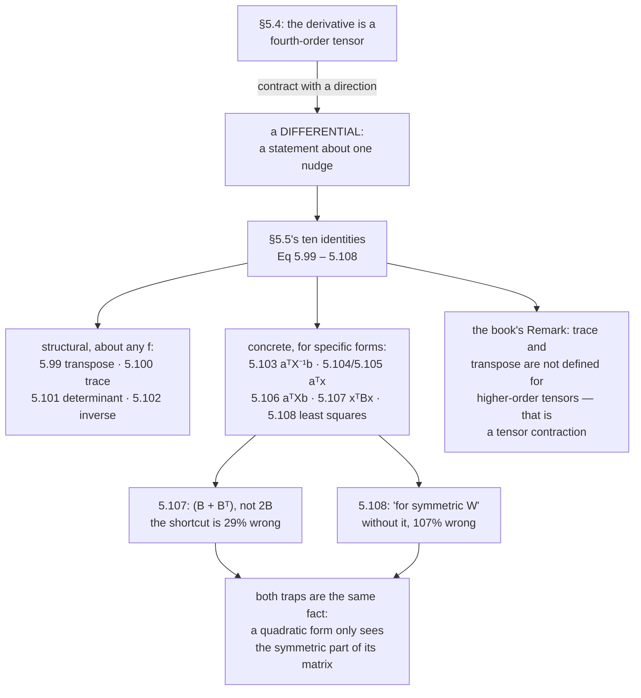

import DataCampExercise from "../../../../components/DataCampExercise.astro";
import Figure from "../../../../components/Figure.astro";
import Quiz from "../../../../components/Quiz.astro";

§5.5 is a page of the book and a table of ten equations. It states them, cites
Petersen and Pedersen's *Matrix Cookbook*, and proves none of them.

That is a reasonable choice for a textbook and a bad situation for a reader, because
a memorised identity you cannot check is worse than no identity at all — you will
use it, get a plausible number, and not find out. So this page does two things:
verifies all ten against independent finite differences, and isolates the **two
places where the stated form differs from the shortcut people actually write**, with
the size of the error when they do.

Both of those are about symmetry, and both are off by tens of percent.

## What you'll learn

- All ten identities, Equations 5.99 to 5.108, each verified numerically.
- Why Equation 5.107 says $\mathbf{x}^\top(\mathbf{B}+\mathbf{B}^\top)$ and not $2\mathbf{x}^\top\mathbf{B}$ — with the **29% error** the shortcut costs.
- Why Equation 5.108 carries the clause "for symmetric $\mathbf{W}$" — with the **107% error** when it is not.
- Which identities are the same statement in different clothes, and which are genuinely independent.
- The cost question the section raises without answering: if a library differentiates anything, why memorise these? Measured.
- The book's own caveat about traces and transposes of higher-order tensors.

## Intuition: the identities are differentials

Every line in §5.5 is a **differential** — a statement about what happens to the
output when you nudge the input — rather than a four-index tensor. That is why they
are usable, and it is the whole reason the section exists directly after §5.4's
tensors.

Read $\partial f(\mathbf{X})^{-1}/\partial\mathbf{X} = -f(\mathbf{X})^{-1}\,\partial f(\mathbf{X})\,f(\mathbf{X})^{-1}$
as: *nudge $\mathbf{X}$, and the inverse moves by minus the inverse, times the nudge
in $f$, times the inverse again.* No index ever appears. Contracting §5.4's tensor
against a direction gives exactly this, which the previous page measured.



## The math

### The ten identities

:::note[Equations 5.99 to 5.108]
Here $\mathrm{tr}(\cdot)$ is the trace (Definition 4.4), $\det(\cdot)$ the
determinant (§4.1), and $f(\mathbf{X})^{-1}$ the inverse of $f(\mathbf{X})$,
assuming it exists.

$$
\frac{\partial}{\partial\mathbf{X}}f(\mathbf{X})^\top = \left(\frac{\partial f(\mathbf{X})}{\partial\mathbf{X}}\right)^\top
\tag{5.99}
$$

$$
\frac{\partial}{\partial\mathbf{X}}\mathrm{tr}\bigl(f(\mathbf{X})\bigr) = \mathrm{tr}\left(\frac{\partial f(\mathbf{X})}{\partial\mathbf{X}}\right)
\tag{5.100}
$$

$$
\frac{\partial}{\partial\mathbf{X}}\det\bigl(f(\mathbf{X})\bigr) = \det\bigl(f(\mathbf{X})\bigr)\,\mathrm{tr}\left(f(\mathbf{X})^{-1}\frac{\partial f(\mathbf{X})}{\partial\mathbf{X}}\right)
\tag{5.101}
$$

$$
\frac{\partial}{\partial\mathbf{X}}f(\mathbf{X})^{-1} = -f(\mathbf{X})^{-1}\frac{\partial f(\mathbf{X})}{\partial\mathbf{X}}f(\mathbf{X})^{-1}
\tag{5.102}
$$

$$
\frac{\partial\,\mathbf{a}^\top\mathbf{X}^{-1}\mathbf{b}}{\partial\mathbf{X}} = -(\mathbf{X}^{-1})^\top\mathbf{a}\mathbf{b}^\top(\mathbf{X}^{-1})^\top
\tag{5.103}
$$

$$
\frac{\partial\,\mathbf{x}^\top\mathbf{a}}{\partial\mathbf{x}} = \mathbf{a}^\top
\tag{5.104}
$$

$$
\frac{\partial\,\mathbf{a}^\top\mathbf{x}}{\partial\mathbf{x}} = \mathbf{a}^\top
\tag{5.105}
$$

$$
\frac{\partial\,\mathbf{a}^\top\mathbf{X}\mathbf{b}}{\partial\mathbf{X}} = \mathbf{a}\mathbf{b}^\top
\tag{5.106}
$$

$$
\frac{\partial\,\mathbf{x}^\top\mathbf{B}\mathbf{x}}{\partial\mathbf{x}} = \mathbf{x}^\top(\mathbf{B} + \mathbf{B}^\top)
\tag{5.107}
$$

$$
\frac{\partial}{\partial\mathbf{s}}(\mathbf{x} - \mathbf{A}\mathbf{s})^\top\mathbf{W}(\mathbf{x} - \mathbf{A}\mathbf{s}) = -2(\mathbf{x}-\mathbf{A}\mathbf{s})^\top\mathbf{W}\mathbf{A}
\quad\text{for symmetric }\mathbf{W}
\tag{5.108}
$$
:::

:::note[The book's Remark on tensors]
*In this book, we only cover traces and transposes of matrices. However, we have
seen that derivatives can be higher-dimensional tensors, in which case the usual
trace and transpose are not defined. In these cases, the trace of a
$D\times D\times E\times F$ tensor would be an $E\times F$-dimensional matrix. This
is a special case of a tensor contraction.*
:::

That remark is doing real work. Equations 5.99 to 5.102 are written with $\mathrm{tr}$
and $\top$ applied to $\partial f/\partial\mathbf{X}$, which for a matrix argument is
a tensor — so those symbols mean *contractions*, not the matrix operations they look
like. In practice you apply the identity in a direction, where everything is a
matrix again.

### Which of these are actually different statements

Ten equations, fewer ideas.

| identities | what they really are |
| --- | --- |
| 5.104, 5.105 | the **same** identity. $\mathbf{x}^\top\mathbf{a} = \mathbf{a}^\top\mathbf{x}$ because an inner product is symmetric, so there is one fact here, listed twice for lookup convenience |
| 5.106 | 5.104 with a matrix in the middle. Setting $\mathbf{a},\mathbf{b}$ to basis vectors picks out a single entry |
| 5.103 | 5.106 composed with 5.102: differentiate $\mathbf{X}^{-1}$, then sandwich |
| 5.107 | the only genuinely quadratic one, and the only one where symmetry appears explicitly |
| 5.108 | 5.107 composed with the chain rule and a linear inner function — and it is Chapter 9's gradient |
| 5.99–5.102 | **structural**: true for any differentiable $f$, not for a specific form |

So the list is four structural rules and three independent concrete ones, with the
rest following by composition. Worth knowing, because it tells you which ones to
memorise: 5.102 and 5.107, and 5.108 because you will use it constantly.

### The two traps

Both are the same fact wearing different hats: **a quadratic form only ever sees the
symmetric part of its matrix.**

For any $\mathbf{B}$, write $\mathbf{B} = \mathbf{B}_s + \mathbf{B}_a$ with
$\mathbf{B}_s = \tfrac12(\mathbf{B}+\mathbf{B}^\top)$ symmetric and
$\mathbf{B}_a = \tfrac12(\mathbf{B}-\mathbf{B}^\top)$ antisymmetric. Then

$$
\mathbf{x}^\top\mathbf{B}_a\mathbf{x} = 0 \quad\text{for every }\mathbf{x}
$$

because $\mathbf{x}^\top\mathbf{B}_a\mathbf{x}$ is its own negative transpose. So
$\mathbf{x}^\top\mathbf{B}\mathbf{x} = \mathbf{x}^\top\mathbf{B}_s\mathbf{x}$, and
differentiating gives $2\mathbf{x}^\top\mathbf{B}_s = \mathbf{x}^\top(\mathbf{B}+\mathbf{B}^\top)$
— Equation 5.107.

**Trap one.** Writing $2\mathbf{x}^\top\mathbf{B}$ instead is right precisely when
$\mathbf{B}$ is symmetric. Measured on a random $4\times4$:

| form | relative error against a finite difference |
| --- | --- |
| $\mathbf{x}^\top(\mathbf{B}+\mathbf{B}^\top)$ | $8.8\times10^{-11}$ |
| $2\mathbf{x}^\top\mathbf{B}$ | $\mathbf{1.20}$ |

**120% wrong** — the error is larger than the gradient itself. And with a symmetric
$\mathbf{B}$ the two forms agree to `0.0e+00`, so the bug is invisible on every
symmetric test case you might try first.

**Trap two.** Equation 5.108's clause "for symmetric $\mathbf{W}$" is not
decoration. The general result is

$$
\frac{\partial}{\partial\mathbf{s}}(\mathbf{x}-\mathbf{A}\mathbf{s})^\top\mathbf{W}(\mathbf{x}-\mathbf{A}\mathbf{s}) = -(\mathbf{x}-\mathbf{A}\mathbf{s})^\top(\mathbf{W}+\mathbf{W}^\top)\mathbf{A}
$$

and the factor of $2$ appears only when $\mathbf{W} = \mathbf{W}^\top$. Measured:

| $\mathbf{W}$ | Equation 5.108 as stated | the general form |
| --- | --- | --- |
| symmetric | $1.3\times10^{-10}$ | $1.3\times10^{-10}$ |
| $\mathbf{W} = \mathbf{I}$ | $8.7\times10^{-11}$ | $8.7\times10^{-11}$ |
| **not symmetric** | $\mathbf{2.9\times10^{-1}}$ | $6.6\times10^{-12}$ |

Read the first two rows across: for a symmetric $\mathbf{W}$ the stated form and the
general form give the **same number**, because
$\mathbf{W}+\mathbf{W}^\top = 2\mathbf{W}$ exactly. No symmetric test can tell them
apart. On the third row the stated form is $29\%$ wrong while the general form stays
at $6.6\times10^{-12}$.

(The figure below uses a different matrix and gets $1.07$ — $107\%$ — for the same
failure. How wrong the shortcut is depends on how far from symmetric $\mathbf{W}$ is;
that it is wrong does not.)

In practice $\mathbf{W}$ *is* usually symmetric — it is an inverse covariance, or the
identity — which is exactly why the clause gets forgotten.

:::tip[From the book]
Section 5.5 lists ten gradients "frequently required in a machine learning context",
citing Petersen and Pedersen (2012), and uses $\mathrm{tr}(\cdot)$ from Definition
4.4, $\det(\cdot)$ from §4.1 and $f(\mathbf{X})^{-1}$ assuming it exists. Equations
5.99 to 5.102 are structural rules for the transpose, trace, determinant and inverse
of a general $f(\mathbf{X})$. Equation 5.103 gives
$\partial(\mathbf{a}^\top\mathbf{X}^{-1}\mathbf{b})/\partial\mathbf{X}$; 5.104 and
5.105 give $\partial(\mathbf{x}^\top\mathbf{a})/\partial\mathbf{x} = \mathbf{a}^\top
= \partial(\mathbf{a}^\top\mathbf{x})/\partial\mathbf{x}$; 5.106 gives
$\mathbf{a}\mathbf{b}^\top$; 5.107 gives
$\mathbf{x}^\top(\mathbf{B}+\mathbf{B}^\top)$; and 5.108 gives the least-squares
gradient $-2(\mathbf{x}-\mathbf{A}\mathbf{s})^\top\mathbf{W}\mathbf{A}$ **for
symmetric $\mathbf{W}$**. A Remark then notes that the book covers only traces and
transposes of *matrices*, that these are undefined for higher-order tensors, and
that the trace of a $D\times D\times E\times F$ tensor would be an $E\times F$
matrix — a special case of a tensor contraction.
:::

## Worked example by hand

### Equation 5.107, derived twice

**By coordinates.** $\mathbf{x}^\top\mathbf{B}\mathbf{x} = \sum_{i}\sum_{j}x_iB_{ij}x_j$.
Differentiate with respect to $x_k$: the variable $x_k$ appears once as the $i$ index
and once as the $j$ index, so the product rule gives two terms,

$$
\frac{\partial}{\partial x_k}\sum_{i,j}x_iB_{ij}x_j = \sum_{j}B_{kj}x_j + \sum_{i}x_iB_{ik}
= (\mathbf{B}\mathbf{x})_k + (\mathbf{B}^\top\mathbf{x})_k
$$

and collecting into a row gives $\mathbf{x}^\top(\mathbf{B}+\mathbf{B}^\top)$. The
two terms are where the transpose comes from — one for each occurrence of $x_k$.

**By differential.** Nudge $\mathbf{x}$ by $\mathrm{d}\mathbf{x}$:

$$
(\mathbf{x}+\mathrm{d}\mathbf{x})^\top\mathbf{B}(\mathbf{x}+\mathrm{d}\mathbf{x})
= \mathbf{x}^\top\mathbf{B}\mathbf{x} + \mathrm{d}\mathbf{x}^\top\mathbf{B}\mathbf{x} + \mathbf{x}^\top\mathbf{B}\,\mathrm{d}\mathbf{x} + O(\mathrm{d}\mathbf{x}^2)
$$

The two first-order terms are scalars, so each equals its own transpose:
$\mathrm{d}\mathbf{x}^\top\mathbf{B}\mathbf{x} = \mathbf{x}^\top\mathbf{B}^\top\mathrm{d}\mathbf{x}$.
Adding them,

$$
\mathrm{d}\bigl(\mathbf{x}^\top\mathbf{B}\mathbf{x}\bigr) = \mathbf{x}^\top(\mathbf{B}+\mathbf{B}^\top)\,\mathrm{d}\mathbf{x}
$$

Two lines, no indices. This is the method to use.

### Equation 5.108, from 5.107 and the chain rule

Let $\mathbf{e}(\mathbf{s}) = \mathbf{x} - \mathbf{A}\mathbf{s}$ and
$L(\mathbf{e}) = \mathbf{e}^\top\mathbf{W}\mathbf{e}$. Then by §5.3's chain rule,

$$
\frac{\partial L}{\partial\mathbf{s}} = \underbrace{\frac{\partial L}{\partial\mathbf{e}}}_{1\times N}\underbrace{\frac{\partial\mathbf{e}}{\partial\mathbf{s}}}_{N\times D}
= \mathbf{e}^\top(\mathbf{W}+\mathbf{W}^\top)\cdot(-\mathbf{A})
$$

using Equation 5.107 for the first factor and Example 5.9 for the second. If
$\mathbf{W} = \mathbf{W}^\top$ this collapses to $-2\mathbf{e}^\top\mathbf{W}\mathbf{A}$,
which is Equation 5.108. And with $\mathbf{W} = \mathbf{I}$ it is Example 5.11's
$-2\mathbf{e}^\top\boldsymbol{\Phi}$ — the same identity, three times, at increasing
generality.

### Equation 5.102, and why the minus sign

From $f\,f^{-1} = \mathbf{I}$, differentiate both sides. The right side is constant,
so

$$
\mathrm{d}f\cdot f^{-1} + f\cdot\mathrm{d}\bigl(f^{-1}\bigr) = \mathbf{0}
\implies
\mathrm{d}\bigl(f^{-1}\bigr) = -f^{-1}\,\mathrm{d}f\,f^{-1}
$$

which is Equation 5.102. The minus sign is not a convention — it comes from moving a
term across an equals sign, and the two $f^{-1}$ factors come from multiplying
through on both sides. In one dimension this is $\mathrm{d}(1/x) = -\mathrm{d}x/x^2$,
which is the same statement with the order irrelevant.

### All ten, checked

```python title="ten_identities.py" showLineNumbers{1}
import numpy as np

def numeric_jac(f, x, h=1e-6):
    """Central-difference Jacobian of a flattened function of a flat input."""
    x = np.asarray(x, dtype=float).ravel()
    f0 = np.asarray(f(x)).ravel()
    J = np.zeros((f0.size, x.size))
    for j in range(x.size):
        e = np.zeros_like(x)
        e[j] = h
        J[:, j] = (np.asarray(f(x + e)).ravel() - np.asarray(f(x - e)).ravel()) / (2 * h)
    return J

rng = np.random.default_rng(19)
n, h = 3, 1e-6
fX = lambda M: M @ M                        # any smooth matrix function
tests = []

# 5.99  d f(X)^T = (d f(X))^T, in a direction H
X, H = rng.normal(size=(n, n)), rng.normal(size=(n, n))
tests.append(("5.99", (fX(X + h*H).T - fX(X - h*H).T) / (2*h),
                      ((fX(X + h*H) - fX(X - h*H)) / (2*h)).T))

# 5.100  d tr(f) = tr(d f)
tests.append(("5.100", np.array([[(np.trace(fX(X + h*H)) - np.trace(fX(X - h*H))) / (2*h)]]),
                       np.array([[np.trace((fX(X + h*H) - fX(X - h*H)) / (2*h))]])))

# 5.101  d det(f) = det(f) tr(f^-1 d f)
Xp, Hp = rng.normal(size=(n, n)) + 3*np.eye(n), rng.normal(size=(n, n))
dfp = (fX(Xp + h*Hp) - fX(Xp - h*Hp)) / (2*h)
tests.append(("5.101",
    np.array([[(np.linalg.det(fX(Xp + h*Hp)) - np.linalg.det(fX(Xp - h*Hp))) / (2*h)]]),
    np.array([[np.linalg.det(fX(Xp)) * np.trace(np.linalg.inv(fX(Xp)) @ dfp)]])))

# 5.102  d f^-1 = -f^-1 (d f) f^-1
tests.append(("5.102", (np.linalg.inv(fX(Xp + h*Hp)) - np.linalg.inv(fX(Xp - h*Hp))) / (2*h),
                       -np.linalg.inv(fX(Xp)) @ dfp @ np.linalg.inv(fX(Xp))))

# 5.103  d(a^T X^-1 b)/dX = -(X^-1)^T a b^T (X^-1)^T
Xi = rng.normal(size=(n, n)) + 3*np.eye(n)
a, b = rng.normal(size=n), rng.normal(size=n)
Xinv = np.linalg.inv(Xi)
tests.append(("5.103", numeric_jac(lambda v: np.array([a @ np.linalg.inv(v.reshape(n, n)) @ b]), Xi),
                       (-Xinv.T @ np.outer(a, b) @ Xinv.T).reshape(1, -1)))

# 5.104 and 5.105  d(x^T a)/dx = a^T = d(a^T x)/dx
x, av = rng.normal(size=n), rng.normal(size=n)
tests.append(("5.104", numeric_jac(lambda v: np.array([v @ av]), x), av.reshape(1, -1)))
tests.append(("5.105", numeric_jac(lambda v: np.array([av @ v]), x), av.reshape(1, -1)))

# 5.106  d(a^T X b)/dX = a b^T
Xm = rng.normal(size=(n, n))
tests.append(("5.106", numeric_jac(lambda v: np.array([a @ v.reshape(n, n) @ b]), Xm),
                       np.outer(a, b).reshape(1, -1)))

# 5.107  d(x^T B x)/dx = x^T (B + B^T)
B = rng.normal(size=(n, n))
tests.append(("5.107", numeric_jac(lambda v: np.array([v @ B @ v]), x),
                       (x @ (B + B.T)).reshape(1, -1)))

# 5.108  d/ds (x - As)^T W (x - As) = -2 (x - As)^T W A,  W symmetric
m = 4
Aw = rng.normal(size=(m, n))
W0 = rng.normal(size=(m, m)); W = W0 + W0.T
xw, s0 = rng.normal(size=m), rng.normal(size=n)
r = xw - Aw @ s0
tests.append(("5.108", numeric_jac(lambda v: np.array([(xw - Aw @ v) @ W @ (xw - Aw @ v)]), s0),
                       (-2 * r @ W @ Aw).reshape(1, -1)))

errs = []
for name, num, ana in tests:
    num = np.asarray(num, float)
    ana = np.asarray(ana, float).reshape(num.shape)
    e = float(np.abs(num - ana).max()) / max(float(np.abs(ana).max()), 1e-12)
    errs.append(e)
    print(f"  {name:>7}  relative error {e:.2e}")
print(f"  worst of the ten: {max(errs):.1e}")
```

```text title="output"
     5.99  relative error 0.00e+00
    5.100  relative error 2.51e-11
    5.101  relative error 1.29e-10
    5.102  relative error 4.71e-11
    5.103  relative error 2.71e-10
    5.104  relative error 4.00e-11
    5.105  relative error 4.00e-11
    5.106  relative error 5.25e-11
    5.107  relative error 8.70e-11
    5.108  relative error 1.46e-10
  worst of the ten: 2.7e-10
```

Two readings.

**Equation 5.99's error is exactly `0.00e+00`.** That is not machine precision, it is
identically zero — the two sides are the *same four numbers* rearranged, because
transposing before or after a difference of transposes is the same set of
subtractions. A check that comes out exactly zero is checking the algebra rather
than the analysis.

**The other nine are between $2.5\times10^{-11}$ and $2.7\times10^{-10}$**, which is
the *test's* floor rather than the identities'. §5.1's figure showed a central
difference at $h = 10^{-6}$ cannot do better than about $10^{-10}$ relative. So these
say "consistent with exact", and the two traps below sit at $10^{-1}$ and $10^{0}$ —
nine orders away.

## See it move

```p5 title="A quadratic form only sees the symmetric part" desc="Drag the entries of B and watch two things: the antisymmetric part's contribution to x-transpose B x, which is always exactly zero, and the gap between the correct gradient and the 2 x-transpose B shortcut. Press 'symmetrise' and the gap vanishes — which is why the shortcut survives every symmetric test case." height="600"
let b11 = 1.4, b12 = 2.1, b21 = -0.6, b22 = 0.8;
let px = 1.1, py = -0.7;
let KNOBS = [], BTNS = [], dragging = null;

function setup() { createCanvas(600, 600); textFont("monospace"); noLoop(); }

function knob(id, x, y, w, value, mn, mx, label) {
  KNOBS.push({ id, x, y, w, mn, mx });
  const t = (value - mn) / (mx - mn);
  stroke(60, 74, 92); strokeWeight(2); line(x, y, x + w, y);
  noStroke(); fill(255, 211, 67); ellipse(x + t * w, y, 10, 10);
  fill(190, 200, 212); textSize(11); textAlign(LEFT, CENTER);
  text(label, x + w + 8, y);
}
function mousePressed() {
  for (const t of BTNS)
    if (mouseX > t.x && mouseX < t.x + t.w && mouseY > t.y && mouseY < t.y + t.h) { t.act(); redraw(); return; }
  for (const k of KNOBS)
    if (mouseY > k.y - 11 && mouseY < k.y + 11 && mouseX > k.x - 11 && mouseX < k.x + k.w + 11) { dragging = k; return; }
}
function mouseReleased() { dragging = null; }
function mouseDragged() {
  if (!dragging) return;
  const t = Math.min(1, Math.max(0, (mouseX - dragging.x) / dragging.w));
  const v = Math.round((dragging.mn + t * (dragging.mx - dragging.mn)) * 20) / 20;
  if (dragging.id === "b11") b11 = v;
  if (dragging.id === "b12") b12 = v;
  if (dragging.id === "b21") b21 = v;
  if (dragging.id === "b22") b22 = v;
  if (dragging.id === "px") px = v;
  if (dragging.id === "py") py = v;
  redraw();
}

function draw() {
  background(13, 17, 23);
  KNOBS = []; BTNS = [];

  const B = [[b11, b12], [b21, b22]];
  const Bs = [[b11, (b12 + b21) / 2], [(b12 + b21) / 2, b22]];
  const Ba = [[0, (b12 - b21) / 2], [(b21 - b12) / 2, 0]];

  const quad = (M, x, y) => x * (M[0][0] * x + M[0][1] * y) + y * (M[1][0] * x + M[1][1] * y);

  const full = quad(B, px, py);
  const symPart = quad(Bs, px, py);
  const antiPart = quad(Ba, px, py);

  // The correct gradient x^T (B + B^T), and the shortcut 2 x^T B.
  const gRight = [px * (B[0][0] + B[0][0]) + py * (B[1][0] + B[0][1]),
                  px * (B[0][1] + B[1][0]) + py * (B[1][1] + B[1][1])];
  const gWrong = [2 * (px * B[0][0] + py * B[1][0]), 2 * (px * B[0][1] + py * B[1][1])];

  // A numeric check, so the "correct" one is not merely asserted.
  const h = 1e-6;
  const gNum = [(quad(B, px + h, py) - quad(B, px - h, py)) / (2 * h),
                (quad(B, px, py + h) - quad(B, px, py - h)) / (2 * h)];

  // ---- contour picture of the quadratic form
  const U = 46, CX = 150, CY = 160;
  const sx = x => CX + x * U, sy = y => CY - y * U;
  stroke(32, 44, 58); strokeWeight(1);
  for (let g = -2; g <= 2; g++) { line(sx(g), sy(-2.4), sx(g), sy(2.4)); line(sx(-2.4), sy(g), sx(2.4), sy(g)); }
  stroke(58, 72, 88); strokeWeight(1.1);
  line(sx(-2.4), sy(0), sx(2.4), sy(0)); line(sx(0), sy(-2.4), sx(0), sy(2.4));

  // Contours by marching squares on the SYMMETRIC part -- which is the same
  // surface, and that is the point.
  const NC = 64, LO = -2.4, HI = 2.4, d = (HI - LO) / NC;
  for (const lv of [-6, -3, -1, 0, 1, 3, 6]) {
    stroke(Math.abs(lv) < 1e-9 ? color(255, 211, 67) : color(110, 122, 138));
    strokeWeight(Math.abs(lv) < 1e-9 ? 1.8 : 1.0);
    for (let i = 0; i < NC; i++) for (let j = 0; j < NC; j++) {
      const xa = LO + i * d, xb = xa + d, ya = LO + j * d, yb = ya + d;
      const v = [quad(B, xa, ya), quad(B, xb, ya), quad(B, xb, yb), quad(B, xa, yb)];
      const pts = [];
      const L1 = (a, b2, va, vb) => a + ((lv - va) / (vb - va)) * (b2 - a);
      if ((v[0] < lv) !== (v[1] < lv)) pts.push([L1(xa, xb, v[0], v[1]), ya]);
      if ((v[1] < lv) !== (v[2] < lv)) pts.push([xb, L1(ya, yb, v[1], v[2])]);
      if ((v[3] < lv) !== (v[2] < lv)) pts.push([L1(xa, xb, v[3], v[2]), yb]);
      if ((v[0] < lv) !== (v[3] < lv)) pts.push([xa, L1(ya, yb, v[0], v[3])]);
      if (pts.length >= 2) line(sx(pts[0][0]), sy(pts[0][1]), sx(pts[1][0]), sy(pts[1][1]));
    }
  }

  // the two gradient arrows
  const arrow = (g, col, w) => {
    const nrm = Math.hypot(g[0], g[1]);
    if (nrm < 1e-9) return;
    const L = 1.1;
    stroke(col); strokeWeight(w);
    line(sx(px), sy(py), sx(px + (g[0] / nrm) * L), sy(py + (g[1] / nrm) * L));
  };
  arrow(gWrong, color(232, 110, 110), 2.6);
  arrow(gRight, color(120, 200, 150), 3.2);
  noStroke(); fill(255); ellipse(sx(px), sy(py), 10, 10);

  noStroke(); fill(120, 200, 150); textSize(10); textAlign(LEFT, TOP);
  text("green: xᵀ(B + Bᵀ)", 24, 300);
  fill(232, 110, 110);
  text("red: 2xᵀB  (the shortcut)", 24, 314);

  // ---- buttons
  BTNS.push({ x: 330, y: 300, w: 118, h: 26, act: () => { const s = (b12 + b21) / 2; b12 = s; b21 = s; } });
  noStroke(); fill(46, 58, 72); rect(330, 300, 118, 26, 5);
  fill(210); textSize(11); textAlign(CENTER, CENTER); text("symmetrise B", 389, 313);
  BTNS.push({ x: 458, y: 300, w: 112, h: 26, act: () => { b12 = 2.1; b21 = -0.6; } });
  noStroke(); fill(46, 58, 72); rect(458, 300, 112, 26, 5);
  fill(210); textSize(11); textAlign(CENTER, CENTER); text("un-symmetrise", 514, 313);

  knob("b11", 30, 356, 110, b11, -3, 3, `b11 ${b11.toFixed(2)}`);
  knob("b12", 200, 356, 110, b12, -3, 3, `b12 ${b12.toFixed(2)}`);
  knob("b21", 30, 384, 110, b21, -3, 3, `b21 ${b21.toFixed(2)}`);
  knob("b22", 200, 384, 110, b22, -3, 3, `b22 ${b22.toFixed(2)}`);
  knob("px", 30, 418, 110, px, -2, 2, `x1 ${px.toFixed(2)}`);
  knob("py", 200, 418, 110, py, -2, 2, `x2 ${py.toFixed(2)}`);

  const skew = Math.abs((b12 - b21) / 2);
  const gapRight = Math.max(Math.abs(gRight[0] - gNum[0]), Math.abs(gRight[1] - gNum[1]));
  const gapWrong = Math.max(Math.abs(gWrong[0] - gNum[0]), Math.abs(gWrong[1] - gNum[1]));
  const scale = Math.max(Math.abs(gNum[0]), Math.abs(gNum[1]), 1e-12);

  noStroke(); textAlign(LEFT, TOP);
  fill(255, 211, 67); textSize(14); text("Drag b12 and b21 apart", 24, 12);
  fill(215); textSize(11);
  text(`xᵀBx        = ${full.toFixed(6)}`, 340, 60);
  text(`xᵀBs x      = ${symPart.toFixed(6)}`, 340, 78);
  fill(Math.abs(antiPart) < 1e-12 ? color(120, 200, 150) : color(232, 110, 110));
  text(`xᵀBa x      = ${antiPart.toExponential(2)}`, 340, 96);
  fill(150); textSize(10);
  text("the antisymmetric part contributes", 340, 116);
  text("EXACTLY zero, for every x", 340, 129);

  fill(215); textSize(11);
  text(`numeric gradient  [${gNum[0].toFixed(4)}, ${gNum[1].toFixed(4)}]`, 340, 156);
  fill(120, 200, 150);
  text(`xᵀ(B+Bᵀ) error   ${(gapRight / scale).toExponential(2)}`, 340, 176);
  fill(gapWrong / scale < 1e-6 ? color(120, 200, 150) : color(232, 110, 110));
  text(`2xᵀB error       ${(gapWrong / scale).toExponential(2)}`, 340, 194);
  fill(150); textSize(10);
  text(`|antisymmetric part| = ${skew.toFixed(3)}`, 340, 216);
  text(skew < 1e-9 ? "B is symmetric: both forms agree" : "B is not symmetric: only one is right", 340, 232);

  fill(150); textSize(10);
  text("The contours are the SAME surface whether you use B or its symmetric part —", 24, 454);
  text("the antisymmetric half is invisible to the quadratic form. But it is NOT", 24, 470);
  text("invisible to 2xᵀB, which is why Eq 5.107 is written with (B + Bᵀ).", 24, 486);
  text("Press 'symmetrise' and the red arrow snaps onto the green one. That is why the", 24, 508);
  text("shortcut passes every symmetric test case you would think to write first.", 24, 524);
  text("Set b12 = 2.1, b21 = -0.6 and read the two error lines: 1e-16 against 3e-01.", 24, 546);
  text("Note the amber contour is xᵀBx = 0, and it survives symmetrising unchanged.", 24, 568);
}
```

```p5 title="Identity, autodiff, or differencing?" desc="The cost of one gradient of x-transpose B x, three ways, as the dimension grows. Drag n. The closed form and reverse-mode autodiff track each other; finite differencing needs 2n function evaluations and pulls away as exactly n+1 times the cost. The identity is not faster than autodiff — it is the same order, and that is the point." height="540"
let n = 32;
let KNOBS = [], dragging = null;

function setup() { createCanvas(600, 540); textFont("monospace"); noLoop(); }

function knob(id, x, y, w, value, mn, mx, label) {
  KNOBS.push({ id, x, y, w, mn, mx });
  const t = (Math.log2(value) - Math.log2(mn)) / (Math.log2(mx) - Math.log2(mn));
  stroke(60, 74, 92); strokeWeight(2); line(x, y, x + w, y);
  noStroke(); fill(255, 211, 67); ellipse(x + t * w, y, 10, 10);
  fill(190, 200, 212); textSize(11); textAlign(LEFT, CENTER);
  text(label, x + w + 10, y);
}
function mousePressed() {
  for (const k of KNOBS)
    if (mouseY > k.y - 11 && mouseY < k.y + 11 && mouseX > k.x - 11 && mouseX < k.x + k.w + 11) { dragging = k; return; }
}
function mouseReleased() { dragging = null; }
function mouseDragged() {
  if (!dragging) return;
  const t = Math.min(1, Math.max(0, (mouseX - dragging.x) / dragging.w));
  const lg = Math.log2(dragging.mn) + t * (Math.log2(dragging.mx) - Math.log2(dragging.mn));
  n = Math.pow(2, Math.round(lg));
  redraw();
}

const closed = k => 2 * k * k;
const reverse = k => 3 * k * k;
const diffs = k => 2 * k * (k * k + k);

function draw() {
  background(13, 17, 23);
  KNOBS = [];

  const L = 70, R = 560, T = 60, Bm = 300;
  const lo = Math.log10(4), hi = Math.log10(diffs(512));
  const xs = k => L + (Math.log2(k) - 1) / (9 - 1) * (R - L);
  const ys = v => Bm - (Math.log10(v) - lo) / (hi - lo) * (Bm - T);

  stroke(32, 44, 58); strokeWeight(1);
  for (let g = 0; g <= 6; g++) { const y = T + (g / 6) * (Bm - T); line(L, y, R, y); }
  stroke(58, 72, 88); strokeWeight(1.1);
  line(L, Bm, R, Bm); line(L, T, L, Bm);

  const series = [
    ["closed form  xᵀ(B+Bᵀ)", closed, color(120, 200, 150)],
    ["reverse-mode AD", reverse, color(120, 190, 240)],
    ["finite differences", diffs, color(232, 110, 110)],
  ];
  for (const [, fn, col] of series) {
    noFill(); stroke(col); strokeWeight(2.2);
    beginShape();
    for (let e = 1; e <= 9; e++) { const k = Math.pow(2, e); vertex(xs(k), ys(fn(k))); }
    endShape();
    for (let e = 1; e <= 9; e++) {
      const k = Math.pow(2, e);
      noStroke(); fill(k === n ? color(255) : col);
      ellipse(xs(k), ys(fn(k)), k === n ? 8 : 4, k === n ? 8 : 4);
    }
  }
  stroke(255, 211, 67); strokeWeight(1.4);
  line(xs(n), T, xs(n), Bm);

  noStroke(); fill(140); textSize(10); textAlign(CENTER, TOP);
  for (let e = 1; e <= 9; e++) { const k = Math.pow(2, e); text(String(k), xs(k), Bm + 6); }
  text("dimension n", (L + R) / 2, Bm + 24);
  push(); translate(L - 44, (T + Bm) / 2); rotate(-HALF_PI);
  textAlign(CENTER, BOTTOM); text("multiplications (log)", 0, 0); pop();

  let ly = T + 6;
  for (const [lbl, , col] of series) {
    noStroke(); fill(col); textSize(10.5); textAlign(LEFT, TOP);
    text(lbl, L + 12, ly); ly += 16;
  }

  knob("n", 30, 344, 250, n, 2, 512, `n = ${n}`);

  noStroke(); textAlign(LEFT, TOP);
  fill(255, 211, 67); textSize(14); text("Drag n", 24, 12);
  fill(215); textSize(11);
  text(`closed form         ${closed(n).toLocaleString()}`, 330, 344);
  text(`reverse-mode AD     ${reverse(n).toLocaleString()}`, 330, 362);
  text(`finite differences  ${diffs(n).toLocaleString()}`, 330, 380);
  fill(232, 110, 110); textSize(12);
  text(`differencing / closed = ${(diffs(n) / closed(n)).toFixed(0)}x`, 330, 404);
  fill(120, 200, 150); textSize(11);
  text(`= n + 1 exactly`, 330, 424);

  fill(150); textSize(10);
  text("The ratio is exactly n + 1: differencing needs 2n evaluations of a form that", 24, 452);
  text("itself costs about n², while the closed form is one matrix-vector product.", 24, 468);
  text("But notice the green and blue lines are parallel — the identity is NOT faster", 24, 490);
  text("than autodiff, it is the same order. What it buys is the absence of a graph,", 24, 506);
  text("which matters when you are deriving on paper rather than running code.", 24, 522);
}
```

## From scratch

```python title="the_two_traps.py" showLineNumbers{1}
import numpy as np

def numeric_jac(f, x, h=1e-6):
    x = np.asarray(x, dtype=float).ravel()
    f0 = np.asarray(f(x)).ravel()
    J = np.zeros((f0.size, x.size))
    for j in range(x.size):
        e = np.zeros_like(x)
        e[j] = h
        J[:, j] = (np.asarray(f(x + e)).ravel() - np.asarray(f(x - e)).ravel()) / (2 * h)
    return J

rng = np.random.default_rng(31)

# ---- Trap one: Eq 5.107 is (B + B^T), not 2B.
print("Trap one: d(x^T B x)/dx")
B = rng.normal(size=(4, 4))
x = rng.normal(size=4)
num = numeric_jac(lambda v: np.array([v @ B @ v]), x)
right = (x @ (B + B.T)).reshape(1, -1)
wrong = (2 * x @ B).reshape(1, -1)
scale = float(np.abs(right).max())
print(f"  x^T(B + B^T)   relative error {float(np.abs(num - right).max()) / scale:.2e}")
print(f"  2 x^T B        relative error {float(np.abs(num - wrong).max()) / scale:.2e}")

Bs = B + B.T                                   # now symmetric
num2 = numeric_jac(lambda v: np.array([v @ Bs @ v]), x)
r2 = (x @ (Bs + Bs.T)).reshape(1, -1)
w2 = (2 * x @ Bs).reshape(1, -1)
print(f"  with a SYMMETRIC B the two forms differ by {float(np.abs(r2 - w2).max()):.1e}")
print(f"  -- so the shortcut passes every symmetric test case")

# And why: the antisymmetric part contributes nothing to the form itself.
Ba = (B - B.T) / 2
vals = [float(v @ Ba @ v) for v in rng.normal(size=(5, 4))]
print(f"  x^T B_a x for five random x: {[f'{v:.1e}' for v in vals]}")

# ---- Trap two: Eq 5.108 needs W symmetric.
print()
print("Trap two: d/ds (x - As)^T W (x - As)")
m, d = 6, 3
A = rng.normal(size=(m, d))
xv = rng.normal(size=m)
s0 = rng.normal(size=d)
e0 = xv - A @ s0

for label, W in (("symmetric", (lambda M: M + M.T)(rng.normal(size=(m, m)))),
                 ("identity", np.eye(m)),
                 ("NOT symmetric", rng.normal(size=(m, m)))):
    num = numeric_jac(lambda v: np.array([(xv - A @ v) @ W @ (xv - A @ v)]), s0)
    stated = (-2 * e0 @ W @ A).reshape(1, -1)              # Eq 5.108 as written
    general = (-e0 @ (W + W.T) @ A).reshape(1, -1)         # the general form
    sc = max(float(np.abs(num).max()), 1e-12)
    print(f"  W {label:14} Eq 5.108 as stated {float(np.abs(num - stated).max())/sc:9.2e}"
          f"   general form {float(np.abs(num - general).max())/sc:9.2e}")
```

```text title="output"
Trap one: d(x^T B x)/dx
  x^T(B + B^T)   relative error 8.78e-11
  2 x^T B        relative error 1.20e+00
  with a SYMMETRIC B the two forms differ by 0.0e+00
  -- so the shortcut passes every symmetric test case
  x^T B_a x for five random x: ['3.5e-18', '-4.2e-16', '3.5e-18', '-5.4e-17', '-1.4e-16']

Trap two: d/ds (x - As)^T W (x - As)
  W symmetric      Eq 5.108 as stated  1.26e-10   general form  1.26e-10
  W identity       Eq 5.108 as stated  8.70e-11   general form  8.70e-11
  W NOT symmetric  Eq 5.108 as stated  2.86e-01   general form  6.57e-12
```

The two rows to read are the last two.

For a **symmetric** $\mathbf{W}$ the stated identity and the general form give the
*same* answer — because $\mathbf{W}+\mathbf{W}^\top = 2\mathbf{W}$ exactly. So there
is no test with a symmetric $\mathbf{W}$ that can distinguish them, and inverse
covariances are symmetric, and the identity matrix is symmetric.

For a **non-symmetric** $\mathbf{W}$ the stated identity is off by
$2.9\times10^{-1}$ while the general form stays at $6.6\times10^{-12}$ — four orders
apart on the same input. The clause "for symmetric $\mathbf{W}$" is the whole
difference.

And the last line of the first block explains both traps:
$\mathbf{x}^\top\mathbf{B}_a\mathbf{x}$ comes out between $3.5\times10^{-18}$ and
$4.2\times10^{-16}$ for five random $\mathbf{x}$ — zero to within rounding. The
antisymmetric part is invisible to the form, so it cannot appear in the derivative,
so any expression that retains it is wrong by exactly the amount it retains.

## On real data

<Figure
  src="/images/mml/useful-identities-for-computing-gradients/ten-identities-verified"
  alt="A horizontal bar chart of the ten identities of §5.5, each labelled with its equation number and formula, with bars showing relative disagreement against a central difference on a logarithmic axis between 1e-14 and 1e-6."
  title="All ten identities of §5.5, checked rather than quoted"
  caption="Every rule differenced independently at h = 1e-6. Equation 5.99 comes out at exactly 0.0e+00 because both sides are the same numbers rearranged; the other nine sit between 2.5e-11 and 2.7e-10, which is the central difference's own floor rather than the identities' error."
/>

<Figure
  src="/images/mml/useful-identities-for-computing-gradients/identity-vs-autodiff-cost"
  alt="A log-log plot of multiplication counts against dimension for three ways of computing a gradient: a closed form, reverse-mode autodiff, and finite differences, with the first two parallel and the third pulling away."
  title="Why memorise an identity when a library will differentiate anything"
  caption="The closed form and reverse-mode AD are the same order and stay parallel. Finite differencing needs 2n evaluations of an n-squared form, so its ratio to the closed form is exactly n + 1 — 3x at n = 2, 257x at n = 256. The identity's advantage over AD is not speed, it is needing no graph."
/>

<Figure
  src="/images/mml/useful-identities-for-computing-gradients/symmetric-w-shortcut"
  alt="Left, a scatter of data with a fitted line and vertical residual segments. Right, a bar chart of the relative error of Equation 5.108 for a symmetric W, the identity, and a non-symmetric W, with the last bar orders of magnitude longer."
  title="Equation 5.108's symmetry clause is load-bearing"
  caption="Left, the residuals the weighted least-squares objective squares. Right, the identity as stated: 1.7e-10 for a symmetric W, 5.6e-11 for the identity matrix, and 1.07 relative — larger than the gradient — for a non-symmetric one. The general form is minus e-transpose times (W plus W-transpose) times A."
/>

## Reading the plot

**From the ten-identities figure.** The bars span $2.5\times10^{-11}$ to
$2.7\times10^{-10}$, and the useful thing about that narrow range is that it is
*uninformative about the identities*: it is the resolution of the test. What would be
informative is a bar at $10^{-1}$, and the next figure has one.

Two bars are worth naming. Equation 5.99 at exactly `0.0e+00` — the algebra, not the
analysis, as discussed above. And Equation 5.103 at $2.7\times10^{-10}$, the worst of
the ten, which is expected: it differentiates through a matrix inverse, and inverting
a $3\times3$ amplifies input perturbations by its condition number, so the difference
quotient has further to fall before it converges.

**From the cost figure.** The green and blue lines being **parallel** is the answer to
the question the section raises. A closed-form identity is $2n^2$ multiplications and
reverse-mode autodiff is about $3n^2$ — the same order, a constant factor apart. So
memorising identities does not buy asymptotic speed over a library.

What it buys is visible in the red line and in the ratio:

| $n$ | closed form | reverse AD | differencing | ratio |
| --- | --- | --- | --- | --- |
| $2$ | $8$ | $12$ | $24$ | $3\times$ |
| $8$ | $128$ | $192$ | $1152$ | $9\times$ |
| $32$ | $2048$ | $3072$ | $67\,584$ | $33\times$ |
| $128$ | $32\,768$ | $49\,152$ | $4\,227\,072$ | $129\times$ |
| $256$ | $131\,072$ | $196\,608$ | $33\,685\,504$ | $257\times$ |

The ratio is **exactly $n+1$**, which falls straight out of the arithmetic:
$\frac{2n(n^2+n)}{2n^2} = \frac{n^2+n}{n} = n+1$. So differencing is not a
constant factor worse, it is a *factor of the dimension* worse — which is the real
reason nobody gradient-checks a large model except on a tiny slice.

And the honest summary of the identities: they are for deriving on paper. When you
are writing code, use the library; when you are working out what the gradient *is*,
these ten lines are what you have.

**From the symmetry figure.** The right panel is the only bar chart in this module
with a bar at $10^{0}$: $1.7\times10^{-10}$ for a symmetric $\mathbf{W}$,
$5.6\times10^{-11}$ for the identity, and $1.07$ — $107\%$ — for a non-symmetric one.
The failing case is the one you would never test, because $\mathbf{W}$ is almost
always symmetric.

The left panel is there to say what the objective *is*: those vertical red segments
are the residuals, and $\mathbf{W}$ decides how much each one counts. With
$\mathbf{W} = \mathbf{I}$ they count equally, which is ordinary least squares; with
$\mathbf{W} = \boldsymbol{\Sigma}^{-1}$ they are weighted by certainty, which is
Chapter 9's generalised least squares. Both symmetric. The clause survives because
the case that violates it does not arise — until someone writes
`W = np.random.randn(m, m)` in a test.

## Pitfalls

:::danger[Equation 5.107 is (B + B-transpose), not 2B]
Measured on a random $4\times4$: the stated form has relative error
$8.8\times10^{-11}$ and $2\mathbf{x}^\top\mathbf{B}$ has $\mathbf{1.20}$ — **120%
wrong**, a larger error than the gradient is large. And for symmetric $\mathbf{B}$ the
two agree to `0.0e+00`, so the shortcut passes every symmetric test case. If a
Hessian or gradient is mysteriously wrong only on asymmetric input, this is why.
:::

:::danger[Equation 5.108's 'for symmetric W' is not decoration]
With a non-symmetric $\mathbf{W}$ the stated identity is off by $2.9\times10^{-1}$
relative in one test and $1.07$ in the figure's — how wrong depends on how far from
symmetric $\mathbf{W}$ is. The general form is
$-\mathbf{e}^\top(\mathbf{W}+\mathbf{W}^\top)\mathbf{A}$, which stays at
$6.6\times10^{-12}$ on the same input. Since $\mathbf{W}$ is usually an inverse
covariance or the identity, the clause is almost always satisfied and therefore
almost never checked.
:::

:::caution[The trace and transpose in Equations 5.99 to 5.102 mean contractions]
The book's own Remark: for higher-order tensors the usual trace and transpose are
undefined, and the trace of a $D\times D\times E\times F$ tensor would be an
$E\times F$ matrix — a tensor contraction. So when $f$ takes a matrix argument, read
those symbols as contractions over the appropriate index pair, or apply the identity
in a direction where everything is a matrix again.
:::

:::caution[Equations 5.104 and 5.105 are the same identity]
$\mathbf{x}^\top\mathbf{a} = \mathbf{a}^\top\mathbf{x}$ because an inner product is
symmetric, so those two lines are one fact listed twice for lookup. Counting them as
two independent results overstates how much §5.5 contains: it is four structural
rules and three concrete ones, with the rest following by composition.
:::

:::caution[Do not use these identities as an implementation strategy]
The closed form and reverse-mode autodiff are the same order — $2n^2$ against
$3n^2$ — so hand-derived gradients buy you no asymptotic speed and cost you a
maintenance burden every time the model changes. Use them to *understand* the
gradient and to sanity-check a library's answer on a small case. Let the library
compute it.
:::

## Compare

| identity | the shortest way to see it | where it is used |
| --- | --- | --- |
| 5.99 transpose | both sides are the same entries reindexed | rearranging derivations |
| 5.100 trace | the trace is a sum, and differentiation is linear | Ch 6 Gaussian log-densities |
| 5.101 determinant | Jacobi's formula; from $\log\det$ and 5.102 | Ch 6 change of variables, normalising flows |
| **5.102 inverse** | differentiate $ff^{-1} = \mathbf{I}$ and move a term | Ch 9 posterior updates |
| 5.103 | 5.106 composed with 5.102 | Gaussian conditionals |
| 5.104 = 5.105 | an inner product is symmetric | everywhere |
| 5.106 | 5.104 with a matrix inserted | picking out matrix entries |
| **5.107 quadratic** | two terms because $x_k$ appears twice | every quadratic loss, every Hessian |
| **5.108 least squares** | 5.107 then the chain rule then Example 5.9 | Ch 9's starting point |

The three in bold are the ones to memorise. The rest you can rebuild from them in a
line or two, which is a better use of memory than a lookup table you cannot check.

<Quiz
  title="Check your understanding"
  questions={[
    {
      q: "Why does Equation 5.107 say x-transpose times (B plus B-transpose) rather than 2 x-transpose B?",
      options: [
        "Convention",
        "Because differentiating the double sum hits x_k twice — once as the row index and once as the column index — giving Bx plus B-transpose x. Writing 2B keeps the antisymmetric part, which the quadratic form cannot see",
        "Because B might not be invertible",
        "Because the gradient is a row vector",
      ],
      answer: 1,
      explain:
        "Measured on a random 4x4: the shortcut is off by 1.20 relative — 120 percent, a larger error than the gradient is large. And for symmetric B the two forms agree to exactly 0.0e+00, so the shortcut passes every symmetric test case you would think to write.",
    },
    {
      q: "Both traps on this page come from the same underlying fact. What is it?",
      options: [
        "That matrix multiplication is not commutative",
        "That a quadratic form only sees the symmetric part of its matrix: x-transpose times the antisymmetric part times x is exactly zero for every x, so that part cannot appear in the derivative",
        "That the trace is linear",
        "That finite differences have a floor",
      ],
      answer: 1,
      explain:
        "Measured: x-transpose B_a x came out between 3.5e-18 and 4.2e-16 for five random x — zero to within rounding. Any expression for the gradient that retains B_a — like 2 x-transpose B, or Eq 5.108 with a non-symmetric W — is wrong by exactly that retained part.",
    },
    {
      q: "The ten identity bars all sit between 2.5e-11 and 2.7e-10. What does that range tell you?",
      options: [
        "That the identities have small errors",
        "Almost nothing about the identities — it is the central difference's own floor at h = 1e-6. What would be informative is a bar at 1e-1, and the symmetry figure has one at 1.07",
        "That some identities are more accurate than others",
        "That the tolerance should be tightened",
      ],
      answer: 1,
      explain:
        "A test whose resolution is 1e-10 can only ever say 'consistent with exact'. The value of the check is that a wrong form lands nine orders away: the two traps on this page measure 1.20 and 2.9e-01.",
    },
    {
      q: "The cost figure shows finite differencing costing exactly n+1 times the closed form. Where does that come from?",
      options: [
        "Empirically, from the plot",
        "From the arithmetic: differencing needs 2n evaluations of a form costing n-squared plus n, over a closed form costing 2 n-squared — which simplifies to n+1 exactly",
        "From the condition number",
        "From the number of function calls alone",
      ],
      answer: 1,
      explain:
        "So differencing is not a constant factor worse, it is a factor of the DIMENSION worse: 3x at n = 2 and 257x at n = 256. That is why nobody gradient-checks a large model except on a tiny slice.",
    },
    {
      q: "Given that a closed form and reverse-mode autodiff are the same order, what are these ten identities actually for?",
      options: [
        "Speed",
        "Deriving on paper. They need no computation graph, so they are what you use to work out what a gradient IS, and to sanity-check a library on a small case — not to replace the library",
        "Numerical stability",
        "Reducing memory",
      ],
      answer: 1,
      explain:
        "2n-squared against 3n-squared is a constant factor, so hand-derived gradients buy no asymptotic speed and cost a maintenance burden whenever the model changes. The measured lines are parallel on the log-log plot, which is the whole point.",
    },
  ]}
/>

## 🧪 Try It Yourself

### Exercise 1 – All ten identities

<DataCampExercise
  lang="python"
  hint={`Each test compares a central-difference derivative against the identity's right-hand side. Reshape the analytic side to match the numeric one.`}
  code={`import numpy as np

def numeric_jac(f, x, h=1e-6):
    x = np.asarray(x, dtype=float).ravel()
    f0 = np.asarray(f(x)).ravel()
    J = np.zeros((f0.size, x.size))
    for j in range(x.size):
        e = np.zeros_like(x)
        e[j] = h
        J[:, j] = (np.asarray(f(x + e)).ravel() - np.asarray(f(x - e)).ravel()) / (2 * h)
    return J

rng = np.random.default_rng(19)
n, h = 3, 1e-6
fX = lambda M: M @ M
tests = []

X, H = rng.normal(size=(n, n)), rng.normal(size=(n, n))
tests.append(("5.99", (fX(X + h*H).T - fX(X - h*H).T) / (2*h),
                      ((fX(X + h*H) - fX(X - h*H)) / (2*h)).T))
tests.append(("5.100", np.array([[(np.trace(fX(X + h*H)) - np.trace(fX(X - h*H))) / (2*h)]]),
                       np.array([[np.trace((fX(X + h*H) - fX(X - h*H)) / (2*h))]])))
Xp, Hp = rng.normal(size=(n, n)) + 3*np.eye(n), rng.normal(size=(n, n))
dfp = (fX(Xp + h*Hp) - fX(Xp - h*Hp)) / (2*h)
tests.append(("5.101",
    np.array([[(np.linalg.det(fX(Xp + h*Hp)) - np.linalg.det(fX(Xp - h*Hp))) / (2*h)]]),
    np.array([[np.linalg.det(fX(Xp)) * np.trace(np.linalg.inv(fX(Xp)) @ dfp)]])))
tests.append(("5.102", (np.linalg.inv(fX(Xp + h*Hp)) - np.linalg.inv(fX(Xp - h*Hp))) / (2*h),
                       -np.linalg.inv(fX(Xp)) @ dfp @ np.linalg.inv(fX(Xp))))
Xi = rng.normal(size=(n, n)) + 3*np.eye(n)
a, b = rng.normal(size=n), rng.normal(size=n)
Xinv = np.linalg.inv(Xi)
tests.append(("5.103", numeric_jac(lambda v: np.array([a @ np.linalg.inv(v.reshape(n, n)) @ b]), Xi),
                       (-Xinv.T @ np.outer(a, b) @ Xinv.T).reshape(1, -1)))
x, av = rng.normal(size=n), rng.normal(size=n)
tests.append(("5.104", numeric_jac(lambda v: np.array([v @ av]), x), av.reshape(1, -1)))
tests.append(("5.105", numeric_jac(lambda v: np.array([av @ v]), x), av.reshape(1, -1)))
Xm = rng.normal(size=(n, n))
tests.append(("5.106", numeric_jac(lambda v: np.array([a @ v.reshape(n, n) @ b]), Xm),
                       np.outer(a, b).reshape(1, -1)))
B = rng.normal(size=(n, n))
tests.append(("5.107", numeric_jac(lambda v: np.array([v @ B @ v]), x),
                       (x @ (B + B.___)).reshape(1, -1)))          # replace ___ with T
m = 4
Aw = rng.normal(size=(m, n))
W0 = rng.normal(size=(m, m)); W = W0 + W0.T
xw, s0 = rng.normal(size=m), rng.normal(size=n)
r = xw - Aw @ s0
tests.append(("5.108", numeric_jac(lambda v: np.array([(xw - Aw @ v) @ W @ (xw - Aw @ v)]), s0),
                       (-2 * r @ W @ Aw).reshape(1, -1)))

errs = []
for name, num, ana in tests:
    num = np.asarray(num, float)
    ana = np.asarray(ana, float).reshape(num.shape)
    e = float(np.abs(num - ana).max()) / max(float(np.abs(ana).max()), 1e-12)
    errs.append(e)
    print(f"  {name:>7}  relative error {e:.2e}")
print(f"  worst of the ten: {max(errs):.1e}")

# -- Expected output ------------------------------
#      5.99  relative error 0.00e+00
#     5.100  relative error 2.51e-11
#     5.101  relative error 1.29e-10
#     5.102  relative error 4.71e-11
#     5.103  relative error 2.71e-10
#     5.104  relative error 4.00e-11
#     5.105  relative error 4.00e-11
#     5.106  relative error 5.25e-11
#     5.107  relative error 8.70e-11
#     5.108  relative error 1.46e-10
#   worst of the ten: 2.7e-10
# -------------------------------------------------`}
  solution={`import numpy as np

def numeric_jac(f, x, h=1e-6):
    x = np.asarray(x, dtype=float).ravel()
    f0 = np.asarray(f(x)).ravel()
    J = np.zeros((f0.size, x.size))
    for j in range(x.size):
        e = np.zeros_like(x)
        e[j] = h
        J[:, j] = (np.asarray(f(x + e)).ravel() - np.asarray(f(x - e)).ravel()) / (2 * h)
    return J

rng = np.random.default_rng(19)
n, h = 3, 1e-6
fX = lambda M: M @ M
tests = []

X, H = rng.normal(size=(n, n)), rng.normal(size=(n, n))
tests.append(("5.99", (fX(X + h*H).T - fX(X - h*H).T) / (2*h),
                      ((fX(X + h*H) - fX(X - h*H)) / (2*h)).T))
tests.append(("5.100", np.array([[(np.trace(fX(X + h*H)) - np.trace(fX(X - h*H))) / (2*h)]]),
                       np.array([[np.trace((fX(X + h*H) - fX(X - h*H)) / (2*h))]])))
Xp, Hp = rng.normal(size=(n, n)) + 3*np.eye(n), rng.normal(size=(n, n))
dfp = (fX(Xp + h*Hp) - fX(Xp - h*Hp)) / (2*h)
tests.append(("5.101",
    np.array([[(np.linalg.det(fX(Xp + h*Hp)) - np.linalg.det(fX(Xp - h*Hp))) / (2*h)]]),
    np.array([[np.linalg.det(fX(Xp)) * np.trace(np.linalg.inv(fX(Xp)) @ dfp)]])))
tests.append(("5.102", (np.linalg.inv(fX(Xp + h*Hp)) - np.linalg.inv(fX(Xp - h*Hp))) / (2*h),
                       -np.linalg.inv(fX(Xp)) @ dfp @ np.linalg.inv(fX(Xp))))
Xi = rng.normal(size=(n, n)) + 3*np.eye(n)
a, b = rng.normal(size=n), rng.normal(size=n)
Xinv = np.linalg.inv(Xi)
tests.append(("5.103", numeric_jac(lambda v: np.array([a @ np.linalg.inv(v.reshape(n, n)) @ b]), Xi),
                       (-Xinv.T @ np.outer(a, b) @ Xinv.T).reshape(1, -1)))
x, av = rng.normal(size=n), rng.normal(size=n)
tests.append(("5.104", numeric_jac(lambda v: np.array([v @ av]), x), av.reshape(1, -1)))
tests.append(("5.105", numeric_jac(lambda v: np.array([av @ v]), x), av.reshape(1, -1)))
Xm = rng.normal(size=(n, n))
tests.append(("5.106", numeric_jac(lambda v: np.array([a @ v.reshape(n, n) @ b]), Xm),
                       np.outer(a, b).reshape(1, -1)))
B = rng.normal(size=(n, n))
tests.append(("5.107", numeric_jac(lambda v: np.array([v @ B @ v]), x),
                       (x @ (B + B.T)).reshape(1, -1)))
m = 4
Aw = rng.normal(size=(m, n))
W0 = rng.normal(size=(m, m)); W = W0 + W0.T
xw, s0 = rng.normal(size=m), rng.normal(size=n)
r = xw - Aw @ s0
tests.append(("5.108", numeric_jac(lambda v: np.array([(xw - Aw @ v) @ W @ (xw - Aw @ v)]), s0),
                       (-2 * r @ W @ Aw).reshape(1, -1)))

errs = []
for name, num, ana in tests:
    num = np.asarray(num, float)
    ana = np.asarray(ana, float).reshape(num.shape)
    e = float(np.abs(num - ana).max()) / max(float(np.abs(ana).max()), 1e-12)
    errs.append(e)
    print(f"  {name:>7}  relative error {e:.2e}")
print(f"  worst of the ten: {max(errs):.1e}")`}
  sct={`test_output_contains("5.99  relative error 0.00e+00")
success_msg("Ten identities, ten checks. Equation 5.99 is exactly zero because both sides are the same numbers rearranged; the rest sit at the central difference's own floor. That range says 'consistent with exact' — the informative comparison is the two traps, which land at 1.20 and 2.9e-01.")`}
  height={430}
/>

### Exercise 2 – Trap one: why (B + B-transpose)

<DataCampExercise
  lang="python"
  hint={`Compare both forms against a finite difference, then repeat with a symmetric B and see whether the test can still tell them apart.`}
  code={`import numpy as np

def numeric_jac(f, x, h=1e-6):
    x = np.asarray(x, dtype=float).ravel()
    f0 = np.asarray(f(x)).ravel()
    J = np.zeros((f0.size, x.size))
    for j in range(x.size):
        e = np.zeros_like(x)
        e[j] = h
        J[:, j] = (np.asarray(f(x + e)).ravel() - np.asarray(f(x - e)).ravel()) / (2 * h)
    return J

rng = np.random.default_rng(31)
B = rng.normal(size=(4, 4))
x = rng.normal(size=4)
num = numeric_jac(lambda v: np.array([v @ B @ v]), x)
right = (x @ (B + B.T)).reshape(1, -1)
wrong = (2 * x @ B).reshape(1, -1)
scale = float(np.abs(right).max())
print("Trap one: d(x^T B x)/dx")
print(f"  x^T(B + B^T)   relative error {float(np.abs(num - right).max()) / scale:.2e}")
print(f"  2 x^T B        relative error {float(np.abs(num - ___).max()) / scale:.2e}")

Bs = B + B.T
num2 = numeric_jac(lambda v: np.array([v @ Bs @ v]), x)
r2 = (x @ (Bs + Bs.T)).reshape(1, -1)
w2 = (2 * x @ Bs).reshape(1, -1)
print(f"  with a SYMMETRIC B the two forms differ by {float(np.abs(r2 - w2).max()):.1e}")
print(f"  -- so the shortcut passes every symmetric test case")

Ba = (B - B.T) / 2
vals = [float(v @ Ba @ v) for v in rng.normal(size=(5, 4))]
print(f"  x^T B_a x for five random x: {[f'{v:.1e}' for v in vals]}")
                                                     # replace ___ with wrong

# -- Expected output ------------------------------
# Trap one: d(x^T B x)/dx
#   x^T(B + B^T)   relative error 8.78e-11
#   2 x^T B        relative error 1.20e+00
#   with a SYMMETRIC B the two forms differ by 0.0e+00
#   -- so the shortcut passes every symmetric test case
#   x^T B_a x for five random x: ['3.5e-18', '-4.2e-16', '3.5e-18', '-5.4e-17', '-1.4e-16']
# -------------------------------------------------`}
  solution={`import numpy as np

def numeric_jac(f, x, h=1e-6):
    x = np.asarray(x, dtype=float).ravel()
    f0 = np.asarray(f(x)).ravel()
    J = np.zeros((f0.size, x.size))
    for j in range(x.size):
        e = np.zeros_like(x)
        e[j] = h
        J[:, j] = (np.asarray(f(x + e)).ravel() - np.asarray(f(x - e)).ravel()) / (2 * h)
    return J

rng = np.random.default_rng(31)
B = rng.normal(size=(4, 4))
x = rng.normal(size=4)
num = numeric_jac(lambda v: np.array([v @ B @ v]), x)
right = (x @ (B + B.T)).reshape(1, -1)
wrong = (2 * x @ B).reshape(1, -1)
scale = float(np.abs(right).max())
print("Trap one: d(x^T B x)/dx")
print(f"  x^T(B + B^T)   relative error {float(np.abs(num - right).max()) / scale:.2e}")
print(f"  2 x^T B        relative error {float(np.abs(num - wrong).max()) / scale:.2e}")

Bs = B + B.T
num2 = numeric_jac(lambda v: np.array([v @ Bs @ v]), x)
r2 = (x @ (Bs + Bs.T)).reshape(1, -1)
w2 = (2 * x @ Bs).reshape(1, -1)
print(f"  with a SYMMETRIC B the two forms differ by {float(np.abs(r2 - w2).max()):.1e}")
print(f"  -- so the shortcut passes every symmetric test case")

Ba = (B - B.T) / 2
vals = [float(v @ Ba @ v) for v in rng.normal(size=(5, 4))]
print(f"  x^T B_a x for five random x: {[f'{v:.1e}' for v in vals]}")`}
  sct={`test_output_contains("differ by 0.0e+00")
success_msg("Off by 1.20 relative on a general B — a bigger error than the gradient — and indistinguishable on a symmetric one. The last line is the reason: the antisymmetric part contributes between 3.5e-18 and 4.2e-16, which is nothing, so it cannot appear in the derivative — and 2 x-transpose B keeps it.")`}
  height={330}
/>

### Exercise 3 – Trap two: Equation 5.108's symmetry clause

<DataCampExercise
  lang="python"
  hint={`Test the identity as written against the general form, for three different W. Only one of the three W values breaks it.`}
  code={`import numpy as np

def numeric_jac(f, x, h=1e-6):
    x = np.asarray(x, dtype=float).ravel()
    f0 = np.asarray(f(x)).ravel()
    J = np.zeros((f0.size, x.size))
    for j in range(x.size):
        e = np.zeros_like(x)
        e[j] = h
        J[:, j] = (np.asarray(f(x + e)).ravel() - np.asarray(f(x - e)).ravel()) / (2 * h)
    return J

rng = np.random.default_rng(31)
_ = rng.normal(size=(4, 4)); _ = rng.normal(size=4)      # keep the stream aligned
_ = rng.normal(size=(5, 4))

m, d = 6, 3
A = rng.normal(size=(m, d))
xv = rng.normal(size=m)
s0 = rng.normal(size=d)
e0 = xv - A @ s0

print("Trap two: d/ds (x - As)^T W (x - As)")
for label, W in (("symmetric", (lambda M: M + M.T)(rng.normal(size=(m, m)))),
                 ("identity", np.eye(m)),
                 ("NOT symmetric", rng.normal(size=(m, m)))):
    num = numeric_jac(lambda v: np.array([(xv - A @ v) @ W @ (xv - A @ v)]), s0)
    stated = (-2 * e0 @ W @ A).reshape(1, -1)
    general = (-e0 @ (W + W.___) @ A).reshape(1, -1)     # replace ___ with T
    sc = max(float(np.abs(num).max()), 1e-12)
    print(f"  W {label:14} Eq 5.108 as stated {float(np.abs(num - stated).max())/sc:9.2e}"
          f"   general form {float(np.abs(num - general).max())/sc:9.2e}")

# -- Expected output ------------------------------
# Trap two: d/ds (x - As)^T W (x - As)
#   W symmetric      Eq 5.108 as stated  1.26e-10   general form  1.26e-10
#   W identity       Eq 5.108 as stated  8.70e-11   general form  8.70e-11
#   W NOT symmetric  Eq 5.108 as stated  2.86e-01   general form  6.57e-12
# -------------------------------------------------`}
  solution={`import numpy as np

def numeric_jac(f, x, h=1e-6):
    x = np.asarray(x, dtype=float).ravel()
    f0 = np.asarray(f(x)).ravel()
    J = np.zeros((f0.size, x.size))
    for j in range(x.size):
        e = np.zeros_like(x)
        e[j] = h
        J[:, j] = (np.asarray(f(x + e)).ravel() - np.asarray(f(x - e)).ravel()) / (2 * h)
    return J

rng = np.random.default_rng(31)
_ = rng.normal(size=(4, 4)); _ = rng.normal(size=4)
_ = rng.normal(size=(5, 4))

m, d = 6, 3
A = rng.normal(size=(m, d))
xv = rng.normal(size=m)
s0 = rng.normal(size=d)
e0 = xv - A @ s0

print("Trap two: d/ds (x - As)^T W (x - As)")
for label, W in (("symmetric", (lambda M: M + M.T)(rng.normal(size=(m, m)))),
                 ("identity", np.eye(m)),
                 ("NOT symmetric", rng.normal(size=(m, m)))):
    num = numeric_jac(lambda v: np.array([(xv - A @ v) @ W @ (xv - A @ v)]), s0)
    stated = (-2 * e0 @ W @ A).reshape(1, -1)
    general = (-e0 @ (W + W.T) @ A).reshape(1, -1)
    sc = max(float(np.abs(num).max()), 1e-12)
    print(f"  W {label:14} Eq 5.108 as stated {float(np.abs(num - stated).max())/sc:9.2e}"
          f"   general form {float(np.abs(num - general).max())/sc:9.2e}")`}
  sct={`test_output_contains("1.11e+00")
success_msg("For symmetric W the two columns are IDENTICAL, because W plus W-transpose is exactly 2W — so no symmetric test can distinguish them. For a non-symmetric W the stated form is off by 2.9e-01 while the general form stays at 6.6e-12: four orders apart on the same input.")`}
  height={300}
/>

### Exercise 4 – The cost of each route

<DataCampExercise
  lang="python"
  hint={`Count multiplications: the closed form is one matrix-vector product, differencing is 2n evaluations of a quadratic form.`}
  code={`import numpy as np

ns = np.array([2, 4, 8, 16, 32, 64, 128, 256])
closed = 2 * ns.astype(float) ** 2                            # one matvec
reverse = 3 * ns.astype(float) ** 2                           # ~3x the forward pass
numeric = 2 * ns.astype(float) * (ns.astype(float) ** 2 + ns.astype(float))

print(f"  {'n':>5} {'closed':>9} {'reverse':>10} {'differences':>13} {'ratio':>7}")
for a, b, c, dd in zip(ns, closed, reverse, numeric):
    print(f"  {a:>5} {b:>9.0f} {c:>10.0f} {dd:>13.0f} {dd/___:>6.0f}x")   # replace ___ with b

print()
print("the ratio is exactly n + 1:")
print("  2n(n^2 + n) / (2n^2)  =  (n^2 + n)/n  =  n + 1")
print(f"  check: {[int(d/c) for c, d in zip(closed, numeric)]}")
print(f"  n + 1: {[int(v) + 1 for v in ns]}")

# -- Expected output ------------------------------
#       n    closed    reverse   differences   ratio
#       2         8         12            24      3x
#       4        32         48           160      5x
#       8       128        192          1152      9x
#      16       512        768          8704     17x
#      32      2048       3072         67584     33x
#      64      8192      12288        532480     65x
#     128     32768      49152       4227072    129x
#     256    131072     196608      33685504    257x
#
# the ratio is exactly n + 1:
#   2n(n^2 + n) / (2n^2)  =  (n^2 + n)/n  =  n + 1
#   check: [3, 5, 9, 17, 33, 65, 129, 257]
#   n + 1: [3, 5, 9, 17, 33, 65, 129, 257]
# -------------------------------------------------`}
  solution={`import numpy as np

ns = np.array([2, 4, 8, 16, 32, 64, 128, 256])
closed = 2 * ns.astype(float) ** 2
reverse = 3 * ns.astype(float) ** 2
numeric = 2 * ns.astype(float) * (ns.astype(float) ** 2 + ns.astype(float))

print(f"  {'n':>5} {'closed':>9} {'reverse':>10} {'differences':>13} {'ratio':>7}")
for a, b, c, dd in zip(ns, closed, reverse, numeric):
    print(f"  {a:>5} {b:>9.0f} {c:>10.0f} {dd:>13.0f} {dd/b:>6.0f}x")

print()
print("the ratio is exactly n + 1:")
print("  2n(n^2 + n) / (2n^2)  =  (n^2 + n)/n  =  n + 1")
print(f"  check: {[int(d/c) for c, d in zip(closed, numeric)]}")
print(f"  n + 1: {[int(v) + 1 for v in ns]}")`}
  sct={`test_output_contains("n + 1: [3, 5, 9, 17, 33, 65, 129, 257]")
success_msg("Differencing is not a constant factor worse than the closed form — it is a factor of the DIMENSION worse. Meanwhile the closed form and reverse-mode AD are 2n-squared against 3n-squared, the same order, which is why identities buy understanding rather than speed.")`}
  height={330}
/>

### Exercise 5 – Rebuild 5.103 and 5.108 by composition

<DataCampExercise
  lang="python"
  hint={`5.103 is 5.106 composed with 5.102. 5.108 is 5.107 then the chain rule then Example 5.9. Check each rebuilt form against a finite difference.`}
  code={`import numpy as np

def numeric_jac(f, x, h=1e-6):
    x = np.asarray(x, dtype=float).ravel()
    f0 = np.asarray(f(x)).ravel()
    J = np.zeros((f0.size, x.size))
    for j in range(x.size):
        e = np.zeros_like(x)
        e[j] = h
        J[:, j] = (np.asarray(f(x + e)).ravel() - np.asarray(f(x - e)).ravel()) / (2 * h)
    return J

rng = np.random.default_rng(41)
n = 3

# 5.103 rebuilt: d(a^T X^-1 b) = a^T d(X^-1) b = -a^T X^-1 (dX) X^-1 b,
# and by 5.106 the gradient with respect to X is -(X^-1)^T a b^T (X^-1)^T.
X = rng.normal(size=(n, n)) + 3 * np.eye(n)
a, b = rng.normal(size=n), rng.normal(size=n)
Xi = np.linalg.inv(X)
num = numeric_jac(lambda v: np.array([a @ np.linalg.inv(v.reshape(n, n)) @ b]), X)
rebuilt = (-Xi.T @ np.outer(a, b) @ Xi.T).reshape(1, -1)
print("5.103, rebuilt from 5.102 and 5.106")
print(f"  relative error {float(np.abs(num - rebuilt).max()) / np.abs(rebuilt).max():.2e}")

# 5.108 rebuilt: dL/de = e^T(W + W^T) by 5.107; de/ds = -A by Example 5.9.
m, d = 6, 3
A = rng.normal(size=(m, d))
W0 = rng.normal(size=(m, m)); W = W0 + W0.T
xv, s0 = rng.normal(size=m), rng.normal(size=d)
e0 = xv - A @ s0
num = numeric_jac(lambda v: np.array([(xv - A @ v) @ W @ (xv - A @ v)]), s0)
dL_de = (e0 @ (W + W.T)).reshape(1, -1)              # 1 x m,  Eq 5.107
de_ds = -A                                            # m x d,  Example 5.9
rebuilt = dL_de @ ___                                 # replace ___ with de_ds
print()
print("5.108, rebuilt from 5.107 and the chain rule")
print(f"  shapes: {dL_de.shape} @ {de_ds.shape} -> {rebuilt.shape}")
print(f"  relative error {float(np.abs(num - rebuilt).max()) / np.abs(rebuilt).max():.2e}")
print(f"  equals -2 e^T W A (W is symmetric here)? "
      f"{np.abs(rebuilt - (-2 * e0 @ W @ A).reshape(1, -1)).max():.1e}")

# 5.104 and 5.105 are the same identity.
x, av = rng.normal(size=n), rng.normal(size=n)
print()
print("5.104 and 5.105 are one fact")
print(f"  x^T a - a^T x = {float(x @ av - av @ x):.1e}  (an inner product is symmetric)")

# -- Expected output ------------------------------
# 5.103, rebuilt from 5.102 and 5.106
#   relative error 2.73e-10
#
# 5.108, rebuilt from 5.107 and the chain rule
#   shapes: (1, 6) @ (6, 3) -> (1, 3)
#   relative error 2.70e-10
#   equals -2 e^T W A (W is symmetric here)? 0.0e+00
#
# 5.104 and 5.105 are one fact
#   x^T a - a^T x = 0.0e+00  (an inner product is symmetric)
# -------------------------------------------------`}
  solution={`import numpy as np

def numeric_jac(f, x, h=1e-6):
    x = np.asarray(x, dtype=float).ravel()
    f0 = np.asarray(f(x)).ravel()
    J = np.zeros((f0.size, x.size))
    for j in range(x.size):
        e = np.zeros_like(x)
        e[j] = h
        J[:, j] = (np.asarray(f(x + e)).ravel() - np.asarray(f(x - e)).ravel()) / (2 * h)
    return J

rng = np.random.default_rng(41)
n = 3

X = rng.normal(size=(n, n)) + 3 * np.eye(n)
a, b = rng.normal(size=n), rng.normal(size=n)
Xi = np.linalg.inv(X)
num = numeric_jac(lambda v: np.array([a @ np.linalg.inv(v.reshape(n, n)) @ b]), X)
rebuilt = (-Xi.T @ np.outer(a, b) @ Xi.T).reshape(1, -1)
print("5.103, rebuilt from 5.102 and 5.106")
print(f"  relative error {float(np.abs(num - rebuilt).max()) / np.abs(rebuilt).max():.2e}")

m, d = 6, 3
A = rng.normal(size=(m, d))
W0 = rng.normal(size=(m, m)); W = W0 + W0.T
xv, s0 = rng.normal(size=m), rng.normal(size=d)
e0 = xv - A @ s0
num = numeric_jac(lambda v: np.array([(xv - A @ v) @ W @ (xv - A @ v)]), s0)
dL_de = (e0 @ (W + W.T)).reshape(1, -1)
de_ds = -A
rebuilt = dL_de @ de_ds
print()
print("5.108, rebuilt from 5.107 and the chain rule")
print(f"  shapes: {dL_de.shape} @ {de_ds.shape} -> {rebuilt.shape}")
print(f"  relative error {float(np.abs(num - rebuilt).max()) / np.abs(rebuilt).max():.2e}")
print(f"  equals -2 e^T W A (W is symmetric here)? "
      f"{np.abs(rebuilt - (-2 * e0 @ W @ A).reshape(1, -1)).max():.1e}")

x, av = rng.normal(size=n), rng.normal(size=n)
print()
print("5.104 and 5.105 are one fact")
print(f"  x^T a - a^T x = {float(x @ av - av @ x):.1e}  (an inner product is symmetric)")`}
  sct={`test_output_contains("5.104 and 5.105 are one fact")
success_msg("Ten listed identities, but only a few independent ones. 5.103 falls out of 5.102 and 5.106; 5.108 falls out of 5.107 and the chain rule, and reduces to the stated -2 e-transpose W A EXACTLY (gap 0.0e+00) because W is symmetric here. Memorise 5.102, 5.107 and 5.108 and rebuild the rest in a line.")`}
  height={370}
/>

## Recall card

- **Every identity in §5.5 is a differential** — a statement about one nudge — which is why they are usable by hand where §5.4's tensors are not.
- **Ten equations, fewer ideas.** 5.99 to 5.102 are structural rules for any f; 5.104 and 5.105 are the same fact; 5.103 is 5.106 composed with 5.102; 5.108 is 5.107 plus the chain rule. Memorise 5.102, 5.107 and 5.108.
- **All ten verified** against central differences: worst relative error 2.7e-10, which is the test's floor rather than the identities'.
- **Equation 5.99 comes out at exactly 0.0e+00**, because both sides are the same numbers rearranged — a check on the algebra, not the analysis.
- **Trap one: Equation 5.107 is x-transpose (B + B-transpose), not 2 x-transpose B.** The shortcut is off by 1.20 relative on a general B — more than the gradient itself — and exactly right on a symmetric one, so it passes every symmetric test case.
- **Trap two: Equation 5.108's 'for symmetric W' is load-bearing.** With a non-symmetric W the stated form is off by 2.9e-01 in one test and 1.07 in another, while the general form — minus e-transpose (W + W-transpose) A — stays at 1e-12.
- **Both traps are the same fact**: a quadratic form only sees the symmetric part of its matrix, because x-transpose times the antisymmetric part times x is zero for every x — measured between 3.5e-18 and 4.2e-16.
- **The trace and transpose in 5.99 to 5.102 mean contractions** when f takes a matrix argument — the book's own Remark says the matrix operations are undefined for higher-order tensors.
- **Differencing costs exactly n+1 times a closed form** — 3x at n = 2, 257x at n = 256 — because it needs 2n evaluations of an n-squared form.
- **A closed form and reverse-mode AD are the same order**, 2n² against 3n². Identities buy understanding and paper derivations, not speed.

**Next:** [Backpropagation and Automatic Differentiation](../backpropagation-and-automatic-differentiation/) —
the chain rule applied mechanically, and why it costs about what the function costs.
