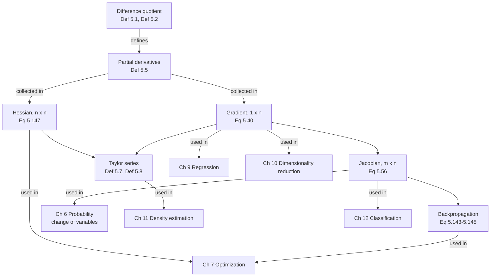

import Quiz from "../../../../components/Quiz.astro";

Chapters 2 to 4 gave you the *objects* — vectors, matrices, decompositions.
Chapter 5 gives you the **verb**. The book opens by naming three problems it is
for:

- **linear regression** (Chapter 9), where you optimise weights to maximise a
  likelihood;
- **neural-network autoencoders**, where you minimise a reconstruction error *"by
  repeated application of the chain rule"*;
- **Gaussian mixture models** (Chapter 11), where you optimise the location and
  shape of each component.

All three are optimisation, all three run on gradients, and the whole chapter is
about computing gradients of things that are not scalars.

## The one thing to take from this chapter

Not a formula — a rule about shapes:

> **The derivative's shape is the output's shape followed by the input's shape.**

| $f$ maps | derivative | shape | book |
|---|---|---|---|
| $\mathbb{R} \to \mathbb{R}$ | derivative | scalar | Def 5.2 |
| $\mathbb{R}^n \to \mathbb{R}$ | gradient | $1 \times n$ (a **row**) | Eq 5.40 |
| $\mathbb{R}^n \to \mathbb{R}^m$ | Jacobian | $m \times n$ | Eq 5.56 |
| $\mathbb{R}^n \to \mathbb{R}$, twice | Hessian | $n \times n$ | Eq 5.147 |
| $\mathbb{R}^n \to \mathbb{R}^m$, twice | tensor | $m \times n \times n$ | §5.7 Remark |
| $\mathbb{R}^{p\times q} \to \mathbb{R}^{m\times n}$ | tensor | $(m\times n)\times(p\times q)$ | §5.4 |

Every dimension error in the chapter is a violation of that one line, and if you
can state the shape of every factor before computing any of them, the rest is
bookkeeping. That is exactly why the book's Exercises 5.7 and 5.8 ask for the
dimensions explicitly rather than just the answers.

And there is really only **one rule**: Equation 5.32's chain rule. §5.2, §5.3,
§5.6 and §5.8 are all that same rule, at increasing levels of generality, always
read as a left-to-right matrix product.

## The chapter's own map

The book's Figure 5.2, as a diagram:



## The through-line, and what each page settles

| # | Page | The question it answers |
|---|---|---|
| 5.1 | **[Differentiation of Univariate Functions](../differentiation-of-univariate-functions/)** | What is a derivative, where does the difference quotient stop working in floating point, and what does a Taylor series actually promise? |
| 5.2 | **[Partial Differentiation and Gradients](../partial-differentiation-and-gradients/)** | Why is the gradient a *row*, and are the two things everyone says about it — steepest ascent, perpendicular to the level set — actually true? |
| 5.3 | **[Gradients of Vector-Valued Functions](../gradients-of-vector-valued-functions/)** | What does the Jacobian's determinant measure, and where does that measurement break? |
| 5.4 | **[Gradients of Matrices](../gradients-of-matrices/)** | What shape is the derivative of a matrix with respect to a matrix, and how do you organise it? |
| 5.5 | **[Useful Identities for Computing Gradients](../useful-identities-for-computing-gradients/)** | Ten identities, each verified — and the two whose conditions are routinely dropped. |
| 5.6 | **[Backpropagation and Automatic Differentiation](../backpropagation-and-automatic-differentiation/)** | Why does the derivative cost about what the function costs, and why is reverse mode the only option for a scalar loss? |
| 5.7 | **[Higher-Order Derivatives](../higher-order-derivatives/)** | What does "the Hessian measures curvature" mean as an equation, and when does the second-order test say nothing at all? |
| 5.8 | **[Linearization and Multivariate Taylor Series](../linearization-and-multivariate-taylor-series/)** | How are the gradient and the Hessian the first two terms of one series, and why does practice stop at the second? |
| — | **[Chapter 5 Exercises and Solutions](../chapter-5-exercises-and-solutions/)** | All nine of the book's exercises, worked and checked against finite differences. |
| — | **[Chapter 5 Formula Sheet](../chapter-5-formula-sheet/)** | Every definition, identity and measured number on one page. |

## Two reading paths

**If you are here for backpropagation** (the shortest honest route):
§5.1's chain rule → §5.2's gradient-as-a-row → §5.3's Jacobian → §5.6. You can
skip §5.4, §5.5, §5.7 and §5.8 and come back.

**If you are here for optimisation** (Chapter 7's prerequisites):
§5.1 → §5.2 → §5.7's Hessian → §5.8's Taylor series. §5.7 and §5.8 are what
Newton's method, trust regions and the Laplace approximation are built from.

Either way, do §5.5's identities when you first need a closed-form gradient, not
before.

## What the chapter looks like once it has been measured

Every number below is measured on the page it belongs to, not quoted from
anywhere.

| Claim | Measured |
|---|---|
| "Let $h \to 0$" | central differences improve to about $h = 10^{-6}$, then get **worse** — round-off beats truncation |
| The gradient is the steepest direction | swept over 360 directions, nothing beats $\lVert\nabla f\rVert$, and the exact gradient direction attains it to $10^{-12}$ |
| The gradient is perpendicular to the level set | worst normalised deviation across a whole field: $10^{-12}$ |
| $\det\mathbf{J}$ is the local area factor | first-order convergent — *away from* where $\det\mathbf{J}$ changes sign, where a signed area is not what you measured |
| "The derivative costs what the function costs" | 6 forward operations against 16 in the reverse sweep: $2.67\times$, a constant |
| Reverse mode beats forward mode | crossover at $n = 3$ for a scalar loss; a network has millions of parameters |
| AD versus finite differences | $2.2\times10^{-16}$ against the best of 200 central differences at $9.8\times10^{-12}$ |
| Mixed partials commute | **only** for twice *continuously* differentiable $f$: the standard counterexample's two iterated limits differ by exactly $2$ |
| Eigenvalue signs classify a critical point | except when one is zero — and three functions share one singular Hessian with three different answers |
| Newton's method is better | 8 steps against gradient descent's 426, and it lands exactly on the saddle of $x_1^2 - x_2^2$ |
| Higher-order Taylor is better | as $r \to 0$: fitted orders $1.067$, $2.005$, $3.019$. At $r = 3.2$ the quadratic model was **five times worse** than the constant |
| Why nobody goes past second order | $5.0\times10^{11}$ distinct Hessian entries at a million parameters — 4 TB in float32 |

## An orientation tool

Before reading anything, get the shape rule into your hands:

```p5 title="Which derivative do I need?" desc="Pick what your function takes in and what it puts out, and how many times you are differentiating. The panel names the object, its shape, the book's equation number, and the page that covers it. This is the shape rule made clickable — the single most useful thing to internalise before starting the chapter." height="560"
let inKind = 1, outKind = 0, order = 1;
let BTNS = [];

// 0 = scalar, 1 = vector, 2 = matrix
const KINDS = ["scalar (R)", "vector (R^n)", "matrix (R^(p x q))"];

function setup() { createCanvas(600, 560); textFont("monospace"); noLoop(); }

function mousePressed() {
  for (const b of BTNS)
    if (mouseX > b.x && mouseX < b.x + b.w && mouseY > b.y && mouseY < b.y + b.h) {
      if (b.kind === "in") inKind = b.v;
      if (b.kind === "out") outKind = b.v;
      if (b.kind === "ord") order = b.v;
      redraw(); return;
    }
}

function row(label, kind, current, labels, y) {
  noStroke(); fill(150); textSize(11); textAlign(LEFT, CENTER);
  text(label, 16, y + 11);
  for (let i = 0; i < labels.length; i++) {
    const x = 150 + i * 148;
    BTNS.push({ x, y, w: 142, h: 24, kind, v: i + (kind === "ord" ? 1 : 0) });
    const on = current === i + (kind === "ord" ? 1 : 0);
    noStroke(); fill(on ? color(255, 211, 67) : color(38, 48, 60));
    rect(x, y, 142, 24, 4);
    fill(on ? 13 : 205); textSize(10.5); textAlign(CENTER, CENTER);
    text(labels[i], x + 71, y + 12);
  }
}

// The whole shape rule, as a lookup. Anything the chapter does not name is
// reported as "a tensor", which is the honest answer.
function answer() {
  if (order === 1) {
    if (inKind === 0 && outKind === 0)
      return ["derivative", "a scalar", "Def 5.2", "Differentiation of Univariate Functions", true];
    if (inKind === 1 && outKind === 0)
      return ["gradient", "1 x n  -- a ROW vector", "Eq 5.40", "Partial Differentiation and Gradients", true];
    if (inKind === 1 && outKind === 1)
      return ["Jacobian", "m x n", "Eq 5.56", "Gradients of Vector-Valued Functions", true];
    if (inKind === 0 && outKind === 1)
      return ["a curve's velocity", "m x 1  -- a column", "Eq 5.55", "Gradients of Vector-Valued Functions", true];
    if (inKind === 2 && outKind === 0)
      return ["gradient wrt a matrix", "1 x (p x q)", "Section 5.4", "Gradients of Matrices", true];
    if (inKind === 2 || outKind === 2)
      return ["a 4th-order tensor", "(m x n) x (p x q)", "Section 5.4", "Gradients of Matrices", false];
  }
  if (order === 2) {
    if (inKind === 0 && outKind === 0)
      return ["second derivative", "a scalar", "Section 5.7", "Higher-Order Derivatives", true];
    if (inKind === 1 && outKind === 0)
      return ["Hessian", "n x n, and SYMMETRIC", "Eq 5.147", "Higher-Order Derivatives", true];
    if (inKind === 1 && outKind === 1)
      return ["a 3rd-order tensor", "m x n x n", "Section 5.7 Remark", "Higher-Order Derivatives", false];
    if (inKind === 2 || outKind === 2)
      return ["a 4th-order tensor at least", "no standard name", "Section 5.4 + 5.7", "Gradients of Matrices", false];
  }
  // order 3+
  if (inKind === 1 && outKind === 0)
    return ["3rd total derivative", "n x n x n", "Eq 5.154, 5.160", "Linearization and Multivariate Taylor Series", false];
  return ["a k-th order tensor", "n repeated k times", "Eq 5.155", "Linearization and Multivariate Taylor Series", false];
}

function draw() {
  background(13, 17, 23);
  BTNS = [];

  noStroke(); textAlign(LEFT, TOP);
  fill(255, 211, 67); textSize(16);
  text("the shape rule, clickable", 16, 12);
  fill(200, 210, 222); textSize(11);
  text("output's shape, then input's shape. Everything else in the chapter follows.", 16, 36);

  row("f takes in", "in", inKind, KINDS, 70);
  row("f puts out", "out", outKind, KINDS, 104);
  row("differentiate", "ord", order, ["once", "twice", "three times"], 138);

  const [name, shape, eq, page, named] = answer();

  // The verdict panel.
  noStroke(); fill(19, 25, 33); rect(16, 190, 568, 176, 6);
  fill(named ? color(120, 200, 150) : color(197, 153, 255)); textSize(21);
  textAlign(LEFT, TOP); text(name, 34, 210);
  fill(235); textSize(14); text(`shape:  ${shape}`, 34, 248);
  fill(150); textSize(12);
  text(`the book:  ${eq}`, 34, 278);
  text(`the page:  ${page}`, 34, 300);
  fill(named ? color(120, 200, 150) : color(197, 153, 255)); textSize(11);
  text(named
    ? "this object has a standard name, and the chapter gives it one"
    : "no standard name: past this point everything is 'a tensor'", 34, 330);

  // A drawn picture of the shape.
  const gx = 60, gy = 400, cell = 15;
  fill(150); noStroke(); textSize(11); textAlign(LEFT, BOTTOM);
  text("the array you would allocate (n = 4, m = 3, p x q = 3 x 2, drawn to scale)", 16, gy - 8);

  const dims = [];
  if (order === 1) {
    if (outKind === 1) dims.push(3);
    if (outKind === 2) dims.push(3, 2);
    if (inKind === 1) dims.push(4);
    if (inKind === 2) dims.push(3, 2);
  } else {
    if (outKind === 1) dims.push(3);
    if (outKind === 2) dims.push(3, 2);
    for (let k = 0; k < order; k++) {
      if (inKind === 1) dims.push(4);
      if (inKind === 2) dims.push(3, 2);
    }
  }
  if (dims.length === 0) dims.push(1);

  // Draw at most three indices; deeper than that, say so instead of pretending.
  const rows = dims[0] ?? 1, cols = dims[1] ?? 1, slices = Math.min(dims[2] ?? 1, 4);
  for (let s = slices - 1; s >= 0; s--) {
    const ox = gx + s * 13, oy = gy + s * 11;
    for (let i = 0; i < rows; i++)
      for (let j = 0; j < cols; j++) {
        noStroke();
        fill(s === 0 ? color(46, 92, 120) : color(30, 52, 70));
        rect(ox + j * cell, oy + i * cell, cell - 2, cell - 2, 2);
      }
  }
  fill(120, 130, 145); textSize(11); textAlign(LEFT, TOP);
  const total = dims.reduce((a, b) => a * b, 1);
  text(`${dims.join(" x ")}   =   ${total} numbers`, gx + 130, gy);
  if (dims.length > 3) text(`${dims.length} indices: only 3 can be drawn`, gx + 130, gy + 18);
  if (dims.length >= 2) {
    text("at n = 1000000 instead of 4 this array would hold", gx + 130, gy + 40);
    const big = dims.map((d) => (d === 4 ? 1e6 : d)).reduce((a, b) => a * b, 1);
    text(`${big.toExponential(1)} numbers`, gx + 130, gy + 58);
  }

  fill(150); textSize(10.5); textAlign(LEFT, TOP);
  text("Try: vector in, scalar out, twice -- that is the Hessian, and it is the", 16, 500);
  text("last object in the chapter with a name. One more index and you are in", 16, 516);
  text("tensor territory, which is exactly where Section 5.8 stops being practical.", 16, 532);
}
```

## Prerequisites, and the bridge if you need one

| You need | From |
|---|---|
| vectors, matrices, matrix products, shapes | [Chapter 2 — Linear Algebra](../../chapter-02---linear-algebra/linear-algebra-overview/) |
| inner products, norms, orthogonality | [Chapter 3 — Analytic Geometry](../../chapter-03---analytic-geometry/analytic-geometry-overview/) |
| symmetric matrices have real eigenvalues and an orthonormal eigenbasis | [Chapter 4 — Eigenvalues and Eigenvectors](../../chapter-04---matrix-decompositions/eigenvalues-and-eigenvectors/) |
| positive definiteness, and Cholesky as a cheap test for it | [Chapter 4 — Cholesky Decomposition](../../chapter-04---matrix-decompositions/cholesky-decomposition/) |

School calculus helps but is not assumed — §5.1 rebuilds the derivative from
Definition 5.1's difference quotient. The one genuine dependency is Chapter 4's
spectral theorem: §5.7's entire classification rests on the Hessian being
symmetric, which is what makes its eigenvalues real.

:::note[On notation, once]
The book writes a function as
$f : \mathbb{R}^D \to \mathbb{R}$, $\mathbf{x} \mapsto f(\mathbf{x})$
(Equations 5.1a and 5.1b) — the first line gives the *shapes*, the second the
*rule*. Example 5.1 does it for the dot product:
$f : \mathbb{R}^2 \to \mathbb{R}$, $\mathbf{x} \mapsto x_1^2 + x_2^2$. Getting
into the habit of writing the shapes line first is most of what makes this
chapter easy.
:::

## Where each section is used later

| Section | Used in |
|---|---|
| §5.1 chain rule | everywhere; §5.6 is this applied mechanically |
| §5.2 gradient as a row | Chapter 7's optimality conditions, Chapter 9's normal equations |
| §5.3 Jacobian | Chapter 6's change of variables, normalising flows |
| §5.4 matrix gradients | Chapter 9's linear regression, Chapter 10's PCA |
| §5.5 identities | anywhere a closed-form gradient beats differentiating |
| §5.6 backpropagation | every neural network ever trained |
| §5.7 Hessian | Chapter 7's Newton and convexity, the Laplace approximation |
| §5.8 Taylor | Chapter 7's trust regions, Gauss–Newton, the Laplace approximation |

<Quiz
  title="Before you start"
  questions={[
    {
      q: "What shape is the derivative of a function from R^n to R^m?",
      options: [
        "n by m",
        "m by n — the output's shape followed by the input's shape, which is the rule the whole chapter runs on",
        "1 by n",
        "It depends on the function",
      ],
      answer: 1,
      explain:
        "The Jacobian, Equation 5.56. And the same rule gives the gradient as 1 by n, the Hessian as n by n, and a vector field's second derivative as m by n by n.",
    },
    {
      q: "Why does the book insist the gradient is a ROW vector?",
      options: [
        "Because gradients are covectors",
        "So the chain rule is a plain left-to-right matrix product with the shapes lining up, and so the convention still works when the output becomes a vector",
        "To match physics notation",
        "It is arbitrary",
      ],
      answer: 1,
      explain:
        "Equation 5.40 gives both reasons. The payoff shows up immediately at Equation 5.148, where grad f times (x - x0) needs no transpose, and again at every chain rule in the chapter.",
    },
    {
      q: "How many genuinely different rules does this chapter contain?",
      options: [
        "One per section",
        "Essentially one: Equation 5.32's chain rule, applied at four levels of generality — scalar, vector input, vector output, and tensors",
        "Two: the chain rule and the product rule",
        "Ten, the identities in Section 5.5",
      ],
      answer: 1,
      explain:
        "Section 5.5's identities are consequences, not new rules, and Section 5.6 is the chain rule applied mechanically to a graph. Recognising that the chapter is one rule at four scales is what stops it feeling like a list to memorise.",
    },
    {
      q: "Which prerequisite does Section 5.7 genuinely depend on?",
      options: [
        "Chapter 3's inner products",
        "Chapter 4's spectral theorem — the classification of critical points rests entirely on the Hessian being symmetric, which is what makes its eigenvalues real and its eigenvectors orthogonal",
        "Chapter 2's Gaussian elimination",
        "Chapter 4's SVD",
      ],
      answer: 1,
      explain:
        "Equation 5.146 gives the symmetry, Chapter 4 turns symmetry into real eigenvalues, and the eigenvalue SIGNS are the whole second-order test. Take away the symmetry and the test does not exist.",
    },
  ]}
/>

## Where §5.9 points next

Section 5.9 splits in two: a short reference list on differentiation, and a substantial passage on a
problem this chapter does not solve.

| §5.9's pointer | and where it lands in this module |
| --- | --- |
| matrix differentials, with the linear algebra reviewed | [Gradients of Matrices](../gradients-of-matrices/) and [Useful Identities for Computing Gradients](../useful-identities-for-computing-gradients/) |
| *"automatic differentiation has had a long history"* | [Backpropagation and Automatic Differentiation](../backpropagation-and-automatic-differentiation/) |
| expectations $\mathbb{E}_x[f(x)] = \int f(x)p(x)\,dx$ *"generally cannot be solved analytically"* | the obstacle behind Chapter 9's marginal likelihood and Chapter 11's E-step |
| a **first-order** Taylor expansion locally linearises $f$ | [Linearization and Multivariate Taylor Series](../linearization-and-multivariate-taylor-series/) |
| for linear $f$ and Gaussian $p$, the mean and covariance are **exact** | [Gaussian Distribution](../../chapter-06---probability-and-distributions/gaussian-distribution/) — the closure property Chapter 9 relies on throughout |
| the **extended Kalman filter** exploits exactly that | not covered; it is this chapter's Taylor expansion plus Chapter 6's Gaussian closure |
| the **unscented transform**, which needs no gradients | not covered |
| the **Laplace approximation** — second-order Taylor, needs the Hessian | [Higher-Order Derivatives](../higher-order-derivatives/) supplies the Hessian; [Computing the Marginal Likelihood](../../chapter-09---linear-regression/computing-the-marginal-likelihood/) is the integral it approximates |

**Read that list as one idea.** Three of the four named methods are the same move — replace an
intractable integral by a Taylor expansion of its integrand — differing only in the order they
truncate at and whether they need derivatives at all.

## Recall card

- **The chapter is one rule at four scales.** Equation 5.32's chain rule, applied to a scalar, to a vector input, to a vector output, and to tensors — always as a left-to-right matrix product.
- **The shape rule: the derivative's shape is the output's shape followed by the input's shape.** Scalar of a vector is 1 by n, vector of a vector is m by n, twice-differentiated scalar of a vector is n by n, twice-differentiated vector field is m by n by n.
- **Equation 5.40 makes the gradient a ROW** for two reasons the book gives: the chain rule becomes a plain matrix product, and the convention survives when the output becomes a vector.
- **State the shapes before computing anything.** Every dimension error in the chapter violates the shape rule, which is why the book's Exercises 5.7 and 5.8 ask for dimensions explicitly.
- **Figure 5.2's map:** the difference quotient defines partial derivatives, which are collected into the gradient, the Jacobian and the Hessian, which feed the Taylor series — and out into Chapters 6, 7, 9, 10, 11 and 12.
- **The Hessian is the last object in the chapter with a name.** One more index and everything is "a tensor", which is precisely where Section 5.8 stops being practical.
- **Section 5.7 depends on Chapter 4's spectral theorem.** Equation 5.146 gives symmetry, symmetry gives real eigenvalues, and the eigenvalue signs are the entire second-order test.
- **Two reading paths.** For backpropagation: 5.1, 5.2, 5.3, 5.6. For optimisation: 5.1, 5.2, 5.7, 5.8. Do Section 5.5's identities when you first need a closed-form gradient.

**Start with:** [Differentiation of Univariate Functions](../differentiation-of-univariate-functions/)
— the derivative from Definition 5.1, and the point where "let $h \to 0$" stops
being true in floating point.
