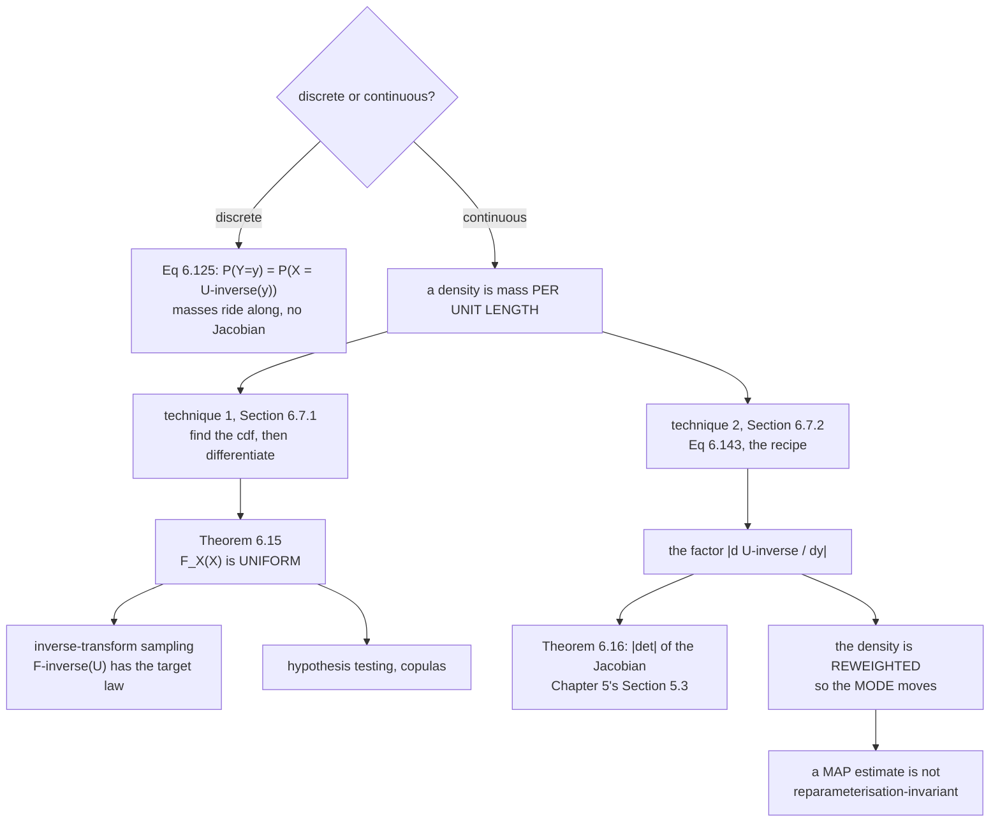

The book opens with the honest observation that the named distributions run out
fast:

> It may seem that there are very many known distributions, but in reality the set
> of distributions for which we have names is quite limited.

So you need to know what happens when you *transform* one. If
$X \sim \mathcal{N}(0,1)$, what is the distribution of $X^2$? Of
$\tfrac12(X_1+X_2)$? [§6.4.4](../summary-statistics-and-independence/) gave the
*mean and variance* under affine maps, but not the functional form, and said
nothing about nonlinear maps.

This section gives two techniques, and the second one is where
[Chapter 5's Jacobian](../../chapter-05---vector-calculus/gradients-of-vector-valued-functions/)
finally gets used for what it was built for.

## What you'll learn

- **Equation 6.125**: the discrete case, which needs no Jacobian at all — and why.
- **§6.7.1**, the **distribution function technique**: find the cdf, differentiate
  it. Worked on the book's **Example 6.16**.
- **Theorem 6.15**, the **probability integral transform**: $F_X(X)$ is *uniform*,
  whatever $X$ was — measured on four distributions including a Cauchy.
- Run backwards, that theorem is **inverse-transform sampling**.
- **§6.7.2**, the **change-of-variables technique**: **Equation 6.143** and its
  $\left\lvert\frac{\mathrm{d}}{\mathrm{d}y}U^{-1}(y)\right\rvert$ factor —
  measured to show it is not optional.
- **Theorem 6.16**: the multivariate version, with $\lvert\det\rvert$ of the
  Jacobian, and **Example 6.17** recovering §6.5's Gaussian result.
- The trap that follows: **a density's mode is not preserved by a nonlinear
  reparameterisation**, while its quantiles are.

## Intuition: mass versus density

For a **discrete** variable, transforming is trivial. A pmf assigns mass to
points; apply an invertible $U$ and the points move while their masses ride along
unchanged. Equation 6.125 is the whole story.

For a **continuous** variable, it is not, and the reason is
[§6.2's distinction](../discrete-and-continuous-probabilities/): a density is not
a probability. Probability lives in *area*, so a density is mass **per unit
length**. Transform the variable and you stretch or squash the axis — so the same
mass now occupies a different length, and the density must be rescaled to
compensate.

That compensation factor is the Jacobian. Squeeze an interval to half its length
and the density there must double. This is why the continuous case has an extra
term the discrete case does not, and dropping it does not produce a slightly wrong
density — it produces something that is not a density at all.

There is a second, less obvious consequence. Because the Jacobian *reweights*
the density unevenly, the location of the **peak** can move. A "most likely
value" is not a property of the random variable; it is a property of the
coordinate system you wrote it in.



## The math

### Equation 6.125: the discrete case

For a discrete $X$ with pmf $P(X=x)$ and an invertible $U$, set $Y := U(X)$:

$$
P(Y=y) = P\bigl(U(X)=y\bigr) = P\bigl(X = U^{-1}(y)\bigr)
\tag{6.125}
$$

*"For discrete random variables, transformations directly change the individual
events."* The probabilities are carried over untouched.

### §6.7.1: the distribution function technique

Go back to first principles. For $Y := U(X)$:

1. **Find the cdf**, $F_Y(y) = P(Y \leqslant y)$ — Equation 6.126.
2. **Differentiate it** to get the pdf, $f(y) = \frac{\mathrm{d}}{\mathrm{d}y}F_Y(y)$
   — Equation 6.127.

And keep track of the **domain**, which the transformation may have changed.

**Example 6.16.** Let $f(x) = 3x^2$ on $0\leqslant x\leqslant1$, and let $Y=X^2$.
Since $U$ is increasing on that interval, $y$ also lies in $[0,1]$:

$$
F_Y(y) = P(Y\leqslant y) = P(X^2 \leqslant y) = P\bigl(X \leqslant y^{1/2}\bigr) = F_X\bigl(y^{1/2}\bigr)
\tag{6.129a--d}
$$

$$
= \int_0^{y^{1/2}} 3t^2\,\mathrm{d}t = \Bigl[t^3\Bigr]_0^{y^{1/2}} = y^{3/2}
\tag{6.129e--g}
$$

so $F_Y(y) = y^{3/2}$ and

$$
f(y) = \frac{\mathrm{d}}{\mathrm{d}y}F_Y(y) = \tfrac32 y^{1/2}, \qquad 0\leqslant y\leqslant 1
\tag{6.130, 6.131}
$$

### Theorem 6.15: the probability integral transform

The technique has a striking special case: use $F_X$ itself as the
transformation.

**Theorem 6.15.** *Let $X$ be a continuous random variable with a strictly
monotonic cdf $F_X(x)$. Then $Y := F_X(X)$ has a **uniform** distribution.*

Whatever $X$ was. A Gaussian, an exponential, a Cauchy with no mean at all — push
each sample through its own cdf and the output is uniform on $[0,1]$.

Three uses, all named in the book:

- **Sampling.** Run it backwards: draw $u \sim \mathcal{U}[0,1]$ and return
  $F_X^{-1}(u)$. That is **inverse-transform sampling**, and it is why every
  library only needs one good uniform generator.
- **Hypothesis testing** whether a sample came from a particular distribution —
  if it did, the transformed values must look uniform.
- **Copulas**, which are built on exactly this observation.

### §6.7.2: change of variables

The distribution-function technique works but has to be redone from scratch each
time. The change-of-variables technique is a *recipe*.

:::note[Why it is called that]
The name comes from substitution in an integral. For univariate functions,

$$
\int f(g(x))\,g'(x)\,\mathrm{d}x = \int f(u)\,\mathrm{d}u, \qquad u = g(x)
\tag{6.133}
$$

whose derivation rests on the [chain rule](../../chapter-05---vector-calculus/differentiation-of-univariate-functions/)
and the fundamental theorem of calculus. Loosely: $\Delta u = g'(x)\Delta x$, so
$\mathrm{d}u \approx g'(x)\,\mathrm{d}x$.
:::

The derivation, compressed. An invertible $U$ on an interval is strictly
increasing or strictly decreasing; take increasing. Then

$$
F_Y(y) = P(U(X)\leqslant y) = P\bigl(X\leqslant U^{-1}(y)\bigr) = \int_a^{U^{-1}(y)} f(x)\,\mathrm{d}x
\tag{6.136--6.138}
$$

Differentiate with respect to $y$, substituting via Equation 6.133 so the
integration variable matches, and invoke the fundamental theorem of calculus:

$$
f(y) = f_x\bigl(U^{-1}(y)\bigr)\cdot\left(\frac{\mathrm{d}}{\mathrm{d}y}U^{-1}(y)\right)
\tag{6.142}
$$

For a *decreasing* $U$ the same derivation produces a minus sign, so take the
absolute value and both cases are one formula:

$$
\boxed{f(y) = f_x\bigl(U^{-1}(y)\bigr)\cdot\left\lvert\frac{\mathrm{d}}{\mathrm{d}y}U^{-1}(y)\right\rvert}
\tag{6.143}
$$

That factor *"measures how much a unit volume changes when applying $U$"* — the
same quantity §5.3 called the Jacobian.

:::caution[The book's Remark, and it is the heart of the section]
Compared with the discrete Equation 6.125, the continuous case has *"an additional
factor"*. The reason: *"The continuous case requires more care because
$P(Y=y)=0$ for all $y$. The probability density function $f(y)$ does not have a
description as a probability of an event involving $y$."*

A pmf can be relabelled. A density cannot, because it is a ratio — mass per unit
length — and the transformation changes the denominator.
:::

### Theorem 6.16: the multivariate case

The absolute value does not generalise, so it becomes a determinant.

**Theorem 6.16.** *If $\mathbf{y}=U(\mathbf{x})$ is differentiable and invertible
on the domain of $\mathbf{x}$, then*

$$
f(\mathbf{y}) = f_x\bigl(U^{-1}(\mathbf{y})\bigr)\cdot\left\lvert\det\left(\frac{\partial}{\partial\mathbf{y}}U^{-1}(\mathbf{y})\right)\right\rvert
\tag{6.144}
$$

The recipe: work out the inverse transform, substitute it into the density of
$\mathbf{x}$, then multiply by the absolute determinant of the Jacobian. The
determinant appears *"because our differentials (cubes of volume) are transformed
into parallelepipeds by the Jacobian"* — [§4.1](../../chapter-04---matrix-decompositions/determinant-and-trace/)'s
reading of the determinant, used literally.

**Example 6.17.** Take a standard bivariate normal,

$$
f(\mathbf{x}) = \frac{1}{2\pi}\exp\!\left(-\tfrac12\mathbf{x}^\top\mathbf{x}\right)
\tag{6.145}
$$

and a linear map $\mathbf{y} = \mathbf{A}\mathbf{x}$ with
$\mathbf{A} = \begin{bmatrix}a&b\\c&d\end{bmatrix}$. The inverse transform is the
matrix inverse:

$$
\mathbf{x} = \mathbf{A}^{-1}\mathbf{y} = \frac{1}{ad-bc}\begin{bmatrix}d&-b\\-c&a\end{bmatrix}\mathbf{y}
\tag{6.147}
$$

Substituting gives
$f(\mathbf{A}^{-1}\mathbf{y}) = \frac{1}{2\pi}\exp(-\tfrac12\mathbf{y}^\top\mathbf{A}^{-\top}\mathbf{A}^{-1}\mathbf{y})$
(Equation 6.148). The Jacobian of a linear map is the matrix itself
($\frac{\partial}{\partial\mathbf{y}}\mathbf{A}^{-1}\mathbf{y} = \mathbf{A}^{-1}$,
Equation 6.149), and the determinant of an inverse is the inverse of the
determinant. So the extra factor is $1/\lvert\det\mathbf{A}\rvert$, and the
result is $\mathcal{N}(\mathbf{0},\mathbf{A}\mathbf{A}^\top)$ — exactly what
[§6.5's Equation 6.88](../gaussian-distribution/) said, now derived from the
general recipe instead of asserted.

## Worked example by hand

### Example 6.16, checked

$f(x)=3x^2$ on $[0,1]$, $Y = X^2$, so $f(y) = \tfrac32\sqrt{y}$.

**Sanity check first:** does it integrate to one?
$\int_0^1 \tfrac32 y^{1/2}\,\mathrm{d}y = \tfrac32\cdot\tfrac23 y^{3/2}\big|_0^1 = 1$. ✓

**Now sample it.** $F_X(x)=x^3$, so by inverse transform $X = U^{1/3}$ for
$U\sim\mathcal{U}[0,1]$. Square four million of those and compare:

| $y$ | $F_Y(y)$ analytic | empirical |
|---|---|---|
| $0.10$ | $0.031623$ | $0.031569$ |
| $0.25$ | $0.125000$ | $0.125161$ |
| $0.50$ | $0.353553$ | $0.353669$ |
| $0.81$ | $0.729000$ | $0.729223$ |

Agreement to about $2\times10^{-4}$, which is sampling noise at this $n$.

**Note the shape flipped.** $f(x)=3x^2$ *increases* on $[0,1]$; $f(y)=1.5\sqrt{y}$
also increases but is *concave* rather than convex, and $f(y)\to\infty$ is avoided
only because the exponent is positive. Squaring compressed the region near zero
and stretched the region near one, and the density had to be reweighted
accordingly.

### The Jacobian, dropped

Take $X\sim\mathcal{N}(0,1)$ and $Y=\exp(X)$, so $U^{-1}(y)=\log y$ and
$\left\lvert\frac{\mathrm{d}}{\mathrm{d}y}\log y\right\rvert = 1/y$. Equation
6.143 gives the lognormal

$$
f(y) = \frac{1}{y}\cdot\frac{1}{\sqrt{2\pi}}\exp\!\left(-\tfrac12(\log y)^2\right)
$$

Now compare against what you get by forgetting the $1/y$:

| | integrates to |
|---|---|
| with the Jacobian | $0.9999788$ |
| **without** | $\mathbf{1.6470952}$ |

The second is not a density. And renormalising it does not rescue it, because the
*shape* is wrong too:

| $y$ | sampled histogram | with Jacobian | renormalised, no Jacobian |
|---|---|---|---|
| $0.0391$ | $0.053651$ | $0.053321$ | $0.001266$ |
| $0.2433$ | $0.604508$ | $0.603890$ | $0.089214$ |
| $1.5143$ | $0.241621$ | $0.241713$ | $0.222228$ |
| $9.4241$ | $0.003439$ | $0.003419$ | $0.019564$ |

Worst error with the Jacobian: $0.0047$. Without: $0.5275$ — a factor of over a
hundred, and qualitatively wrong at both ends.

### Theorem 6.15, on four distributions

Push each sample through its own cdf. A uniform has mean $0.5$ and variance
$1/12 = 0.083333$:

| $X$ drawn from | mean of $F_X(X)$ | variance |
|---|---|---|
| $\mathcal{N}(0,1)$ | $0.500185$ | $0.083247$ |
| Exponential(rate 2) | $0.499882$ | $0.083364$ |
| Beta$(2,5)$ | $0.499806$ | $0.083257$ |
| **standard Cauchy** | $0.499835$ | $0.083290$ |

All four land on the uniform — including the Cauchy, whose own mean **does not
exist**. The theorem does not care about moments; it only needs a strictly
monotonic cdf.

### Example 6.17, checked against §6.5

With $\mathbf{A} = \begin{bmatrix}2&1\\-0.5&1.5\end{bmatrix}$,
$\det\mathbf{A} = 3.5$, so the Jacobian factor is $1/3.5 = 0.285714$. Evaluating
Equation 6.144 against the $\mathcal{N}(\mathbf{0},\mathbf{A}\mathbf{A}^\top)$
density directly:

| point | Equation 6.144 | $\mathcal{N}(\mathbf{0},\mathbf{A}\mathbf{A}^\top)$ | gap |
|---|---|---|---|
| $(0,0)$ | $0.0454728409$ | $0.0454728409$ | $0.0\text{e}{+}00$ |
| $(1,0.5)$ | $0.0398236988$ | $0.0398236988$ | $6.9\text{e}{-}18$ |
| $(-2,1)$ | $0.0227198205$ | $0.0227198205$ | $3.5\text{e}{-}18$ |
| $(3,-1.5)$ | $0.0095437907$ | $0.0095437907$ | $5.2\text{e}{-}18$ |

The general recipe and the Gaussian shortcut are the same thing.

### And the trap: the mode moves

$X\sim\mathcal{N}(0,1)$ has its mode at $x=0$. So where is the mode of
$Y=\exp(X)$?

The tempting answer is $\exp(0)=1$. Measured: **$0.367880$**, which is
$\exp(-1)$. The Jacobian $1/y$ is larger for small $y$, so it tilts the density
leftward and drags the peak with it.

| statistic of $X$ | image under $\exp$ | actual statistic of $Y$ |
|---|---|---|
| mode $=0$ | $1.000000$ | $\mathbf{0.367880}$ ✗ |
| median $=0$ | $1.000000$ | $1.000000$ ✓ |
| mean $=0$ | $1.000000$ | $1.648721$ ✗ |

And it depends on the transform, not on the data:

| transform | mode in $y$-space | image of $X$'s mode |
|---|---|---|
| $Y=\exp(X)$ | $0.367878$ | $1.000000$ |
| $Y=X^3$ | $-0.000200$ | $0.000000$ |
| $Y=2X+1$ | $1.000000$ | $1.000000$ ✓ |

Only the **affine** map leaves it alone, because its Jacobian is constant and so
cannot tilt anything. The median survives every monotone map, because quantiles
are defined by *mass* rather than density.

## See it move

```p5 title="Where the Jacobian goes" desc="Choose a transform and watch the density move. The solid curve is Equation 6.143 with its Jacobian; the dashed one drops the factor and renormalises. The stretch bar underneath shows the local Jacobian: where the axis is compressed the density has to rise, and dropping the factor breaks exactly there." height="620"
let which = 0, showBad = true;
let BTNS = [];

const T = [
  { name: "Y = exp(X)", inv: (y) => Math.log(y), dinv: (y) => 1 / y,
    lo: 0.02, hi: 8, note: "log y, |1/y|" },
  { name: "Y = X^2 (x > 0)", inv: (y) => Math.sqrt(y), dinv: (y) => 0.5 / Math.sqrt(y),
    lo: 0.001, hi: 9, note: "sqrt y, |1/(2 sqrt y)|" },
  { name: "Y = 2X + 1", inv: (y) => (y - 1) / 2, dinv: () => 0.5,
    lo: -7, hi: 9, note: "(y-1)/2, |1/2| constant" },
  { name: "Y = tanh(X)", inv: (y) => 0.5 * Math.log((1 + y) / (1 - y)),
    dinv: (y) => 1 / (1 - y * y), lo: -0.995, hi: 0.995,
    note: "atanh y, |1/(1-y^2)|" },
];

const phi = (t) => Math.exp(-0.5 * t * t) / Math.sqrt(2 * Math.PI);

function setup() { createCanvas(600, 620); textFont("monospace"); noLoop(); }
function mousePressed() {
  for (const b of BTNS)
    if (mouseX > b.x && mouseX < b.x + b.w && mouseY > b.y && mouseY < b.y + b.h) {
      if (b.t !== undefined) which = b.t; else showBad = !showBad;
      redraw(); return;
    }
}

function draw() {
  background(13, 17, 23);
  BTNS = [];
  const t = T[which];
  const N = 1400;
  const ys = [], good = [], bad = [];
  for (let i = 0; i <= N; i++) {
    const y = t.lo + (t.hi - t.lo) * i / N;
    // X^2 with x > 0 only halves the mass; keep it a proper density.
    const fx = phi(t.inv(y)) * (which === 1 ? 2 : 1);
    ys.push(y);
    good.push(fx * Math.abs(t.dinv(y)));
    bad.push(fx);
  }
  const dy = (t.hi - t.lo) / N;
  let mGood = 0, mBad = 0;
  for (let i = 0; i <= N; i++) { mGood += good[i] * dy; mBad += bad[i] * dy; }
  const peak = Math.max(...good) * 1.15;

  const PL = { x: 56, y: 76, w: 512, h: 250 };
  const sx = (y) => PL.x + ((y - t.lo) / (t.hi - t.lo)) * PL.w;
  const sy = (v) => PL.y + PL.h - (v / peak) * PL.h;
  noStroke(); fill(19, 25, 33); rect(PL.x, PL.y, PL.w, PL.h, 4);
  stroke(60, 74, 92); strokeWeight(1); line(PL.x, sy(0), PL.x + PL.w, sy(0));

  if (showBad) {
    stroke(232, 110, 110); strokeWeight(2); drawingContext.setLineDash([6, 5]);
    beginShape();
    for (let i = 0; i <= N; i++) vertex(sx(ys[i]), sy(bad[i] / mBad));
    endShape();
    drawingContext.setLineDash([]);
  }
  stroke(120, 200, 150); strokeWeight(2.6); noFill();
  beginShape();
  for (let i = 0; i <= N; i++) vertex(sx(ys[i]), sy(good[i]));
  endShape();

  // The local Jacobian, as a bar underneath.
  const BB = { x: 56, y: 342, w: 512, h: 44 };
  noStroke(); fill(19, 25, 33); rect(BB.x, BB.y, BB.w, BB.h, 4);
  let jmax = 0;
  for (let i = 0; i <= N; i++) jmax = Math.max(jmax, Math.abs(t.dinv(ys[i])));
  for (let i = 0; i < N; i += 3) {
    const j = Math.abs(t.dinv(ys[i])) / jmax;
    noStroke(); fill(40 + j * 60, 70 + j * 130, 120 + j * 100);
    rect(sx(ys[i]), BB.y, Math.max(2, PL.w / N * 3 + 1), BB.h);
  }
  noStroke(); fill(190, 200, 212); textSize(10); textAlign(LEFT, CENTER);
  text("local |dU^-1/dy|: brighter = more stretch", BB.x + 6, BB.y + BB.h / 2);

  noStroke(); textAlign(LEFT, TOP);
  fill(255, 211, 67); textSize(15);
  text("Equation 6.143, with and without its factor", 16, 12);
  fill(200, 210, 222); textSize(11);
  text("green: correct.   dashed red: Jacobian dropped, then renormalised.", 16, 34);
  fill(150); textSize(10.5);
  text(`X ~ N(0,1),  ${t.name},  U^-1 and its derivative: ${t.note}`, 16, 52);

  const y0 = 400;
  fill(120, 200, 150); textSize(12);
  text(`with the Jacobian:    integral over the window = ${mGood.toFixed(8)}`, 16, y0);
  fill(232, 110, 110);
  text(`without the Jacobian: integral over the window = ${mBad.toFixed(8)}`, 16, y0 + 20);
  // Worst shape gap after renormalising.
  let gap = 0;
  for (let i = 0; i <= N; i++) gap = Math.max(gap, Math.abs(good[i] - bad[i] / mBad));
  fill(255, 211, 67); textSize(12);
  text(`worst gap after renormalising: ${gap.toFixed(6)}`, 16, y0 + 44);
  fill(150); textSize(10.5);
  text(which === 2
    ? "an AFFINE map has a constant Jacobian, so dropping it only rescales --"
    : "the factor varies across y, so no single constant can repair it --", 16, y0 + 68);
  text(which === 2
    ? "renormalising happens to fix it here. This is the only such case."
    : "the shape itself is wrong, not just the total mass.", 16, y0 + 83);

  // Where is the mode?
  let bi = 0;
  for (let i = 0; i <= N; i++) if (good[i] > good[bi]) bi = i;
  fill(197, 153, 255); textSize(11.5);
  text(`mode of f(y): y = ${ys[bi].toFixed(6)}`, 16, y0 + 108);
  const imageOfMode = which === 0 ? 1 : which === 1 ? 0 : which === 2 ? 1 : 0;
  fill(Math.abs(ys[bi] - imageOfMode) < 0.02 ? color(120, 200, 150) : color(232, 110, 110));
  textSize(11.5);
  text(`image of X's mode:  ${imageOfMode.toFixed(6)}`
     + (Math.abs(ys[bi] - imageOfMode) < 0.02 ? "   they agree" : "   they DISAGREE"),
     16, y0 + 126);

  for (let i = 0; i < T.length; i++) {
    const x = 16 + (i % 2) * 200, y = 548 + Math.floor(i / 2) * 26;
    BTNS.push({ x, y, w: 192, h: 22, t: i });
    noStroke(); fill(which === i ? color(255, 211, 67) : color(38, 48, 60));
    rect(x, y, 192, 22, 4);
    fill(which === i ? 13 : 205); textSize(10); textAlign(CENTER, CENTER);
    text(T[i].name, x + 96, y + 11);
  }
  const bx = 424, by = 548;
  BTNS.push({ x: bx, y: by, w: 148, h: 22 });
  noStroke(); fill(showBad ? color(232, 110, 110) : color(38, 48, 60));
  rect(bx, by, 148, 22, 4);
  fill(showBad ? 13 : 205); textSize(10); textAlign(CENTER, CENTER);
  text(showBad ? "hide the wrong one" : "show the wrong one", bx + 74, by + 11);
}
```

```p5 title="The probability integral transform, both ways" desc="Pick a distribution and watch its own cdf flatten it into a uniform — Theorem 6.15. Then flip the direction: feed uniforms through the inverse cdf and the target distribution comes back. That round trip is how every sampler in every library works." height="600"
let dist = 0, dir = 0;
let BTNS = [];

// Each entry: name, sampler from a uniform u, cdf, plotting window.
const D = [
  { name: "Exponential(2)", inv: (u) => -Math.log(1 - u) / 2,
    cdf: (x) => 1 - Math.exp(-2 * x), lo: 0, hi: 3 },
  { name: "f(x) = 3x^2", inv: (u) => Math.pow(u, 1 / 3),
    cdf: (x) => x * x * x, lo: 0, hi: 1 },
  { name: "Cauchy", inv: (u) => Math.tan(Math.PI * (u - 0.5)),
    cdf: (x) => 0.5 + Math.atan(x) / Math.PI, lo: -6, hi: 6 },
  { name: "Logistic", inv: (u) => Math.log(u / (1 - u)),
    cdf: (x) => 1 / (1 + Math.exp(-x)), lo: -6, hi: 6 },
];

let seedState = 424242;
function rnd() { seedState = (seedState * 1103515245 + 12345) & 0x7fffffff; return seedState / 0x7fffffff; }

function setup() { createCanvas(600, 600); textFont("monospace"); noLoop(); }
function mousePressed() {
  for (const b of BTNS)
    if (mouseX > b.x && mouseX < b.x + b.w && mouseY > b.y && mouseY < b.y + b.h) {
      if (b.d !== undefined) dist = b.d; else dir = 1 - dir;
      redraw(); return;
    }
}

function draw() {
  background(13, 17, 23);
  BTNS = [];
  const d = D[dist];
  const M = 60000;
  seedState = 424242;
  const xs = [], us = [];
  for (let i = 0; i < M; i++) { const u = rnd(); us.push(u); xs.push(d.inv(u)); }

  const src = dir === 0 ? xs : us;
  const out = dir === 0 ? xs.map((x) => d.cdf(x)) : us.map((u) => d.inv(u));
  const srcLo = dir === 0 ? d.lo : 0, srcHi = dir === 0 ? d.hi : 1;
  const outLo = dir === 0 ? 0 : d.lo, outHi = dir === 0 ? 1 : d.hi;

  function hist(v, lo, hi, nb) {
    const h = new Array(nb).fill(0);
    let kept = 0;
    for (const q of v) {
      if (q < lo || q >= hi) continue;
      h[Math.floor((q - lo) / (hi - lo) * nb)]++; kept++;
    }
    const w = (hi - lo) / nb;
    return h.map((c) => c / (kept * w));
  }
  const NB = 46;
  const hs = hist(src, srcLo, srcHi, NB);
  const ho = hist(out, outLo, outHi, NB);

  function panel(px, py, pw, ph, h, lo, hi, colr, title) {
    noStroke(); fill(19, 25, 33); rect(px, py, pw, ph, 4);
    const mx = Math.max(...h) * 1.15;
    for (let i = 0; i < h.length; i++) {
      const bw = pw / h.length;
      noStroke(); fill(colr[0], colr[1], colr[2]);
      const bh = (h[i] / mx) * ph;
      rect(px + i * bw, py + ph - bh, bw - 1, bh);
    }
    noStroke(); fill(200, 210, 222); textSize(10.5); textAlign(LEFT, TOP);
    text(title, px + 6, py + 6);
    fill(120, 130, 145); textSize(9.5); textAlign(LEFT, TOP);
    text(lo.toFixed(2), px, py + ph + 4);
    textAlign(RIGHT, TOP); text(hi.toFixed(2), px + pw, py + ph + 4);
    return mx;
  }

  panel(56, 82, 230, 200, hs, srcLo, srcHi, [107, 169, 221],
        dir === 0 ? d.name : "uniform on [0,1]");
  panel(330, 82, 230, 200, ho, outLo, outHi,
        dir === 0 ? [120, 200, 150] : [255, 211, 67],
        dir === 0 ? "after applying F_X" : `after applying F^-1: ${d.name}`);

  // The arrow between them.
  stroke(255, 211, 67); strokeWeight(2);
  line(292, 182, 322, 182);
  line(316, 176, 322, 182); line(316, 188, 322, 182);
  noStroke(); fill(255, 211, 67); textSize(10); textAlign(CENTER, BOTTOM);
  text(dir === 0 ? "F_X" : "F^-1", 307, 176);

  noStroke(); textAlign(LEFT, TOP);
  fill(255, 211, 67); textSize(15);
  text(dir === 0 ? "Theorem 6.15: the cdf flattens anything"
                 : "run it backwards: inverse-transform sampling", 16, 12);
  fill(200, 210, 222); textSize(11);
  text(dir === 0 ? "whatever goes in, a uniform comes out"
                 : "one uniform generator is all a library needs", 16, 34);

  // Uniformity diagnostics on the output.
  const y0 = 316;
  if (dir === 0) {
    let mean = 0, m2 = 0;
    for (const q of out) { mean += q; m2 += q * q; }
    mean /= out.length; const varr = m2 / out.length - mean * mean;
    const srt = out.slice().sort((a, b) => a - b);
    let ks = 0;
    for (let i = 0; i < srt.length; i += 7)
      ks = Math.max(ks, Math.abs(srt[i] - i / (srt.length - 1)));
    fill(235); textSize(12);
    text(`mean of F_X(X)      ${mean.toFixed(6)}   (uniform: 0.500000)`, 16, y0);
    text(`variance            ${varr.toFixed(6)}   (uniform: 0.083333)`, 16, y0 + 20);
    fill(120, 200, 150);
    text(`worst |empirical cdf - u|  ${ks.toFixed(6)}`, 16, y0 + 40);
    fill(150); textSize(10.5);
    text("the Cauchy has no mean at all, and still lands on the uniform --", 16, y0 + 64);
    text("Theorem 6.15 needs only a strictly monotonic cdf.", 16, y0 + 79);
  } else {
    let worst = 0;
    for (let k = 1; k < 12; k++) {
      const q = d.lo + (d.hi - d.lo) * k / 12;
      let emp = 0;
      for (const v of out) if (v <= q) emp++;
      worst = Math.max(worst, Math.abs(emp / out.length - d.cdf(q)));
    }
    fill(235); textSize(12);
    text(`worst |empirical cdf - target cdf|  ${worst.toFixed(6)}`, 16, y0);
    fill(150); textSize(10.5);
    text("F^-1 applied to uniforms reproduces the target law. That is why", 16, y0 + 24);
    text("every sampler is built on one good uniform generator.", 16, y0 + 39);
  }

  for (let i = 0; i < D.length; i++) {
    const x = 16 + (i % 2) * 190, y = 486 + Math.floor(i / 2) * 26;
    BTNS.push({ x, y, w: 182, h: 22, d: i });
    noStroke(); fill(dist === i ? color(255, 211, 67) : color(38, 48, 60));
    rect(x, y, 182, 22, 4);
    fill(dist === i ? 13 : 205); textSize(10); textAlign(CENTER, CENTER);
    text(D[i].name, x + 91, y + 11);
  }
  const bx = 404, by = 486;
  BTNS.push({ x: bx, y: by, w: 168, h: 48 });
  noStroke(); fill(38, 48, 60); rect(bx, by, 168, 48, 4);
  fill(205); textSize(10.5); textAlign(CENTER, CENTER);
  text(dir === 0 ? "switch to sampling" : "switch to flattening", bx + 84, by + 24);
  noStroke(); fill(120, 130, 145); textSize(10.5); textAlign(LEFT, TOP);
  text("Section 6.7.1's theorem is the basis of samplers, goodness-of-fit", 16, 552);
  text("tests, and copulas -- all three named in the book.", 16, 567);
}
```

## From scratch

```python title="change_of_variables.py" showLineNumbers{1}
"""Section 6.7 — transforming a random variable, and the Jacobian that makes the
result a density rather than a relabelling."""

import numpy as np

np.set_printoptions(precision=6, suppress=True, linewidth=150)
rng = np.random.default_rng(7)

print("########## discrete_needs_no_jacobian")
# Eq 6.125: for a discrete variable, transforming just relabels the events.
states = np.array([1, 2, 3, 4, 5])
pmf = np.array([0.10, 0.15, 0.30, 0.25, 0.20])
U = lambda k: k ** 2                      # invertible on these states
print(f"  X on {states.tolist()} with pmf {pmf}")
print(f"  Y = X^2 on {U(states).tolist()} with pmf {pmf}")
print(f"  the probabilities are CARRIED OVER unchanged; both sum to "
      f"{pmf.sum():.10f} and {pmf.sum():.10f}")
print("  no Jacobian appears, because a pmf assigns mass to points and the points")
print("  simply move. Eq 6.125b is the whole story for the discrete case.")

print()
print("########## example_6_16")
# Eq 6.128 to 6.131: f(x) = 3x^2 on [0,1], Y = X^2, so f(y) = 1.5 sqrt(y).
print("  f(x) = 3x^2 on [0,1],  Y = X^2")
print("  Eq 6.130  F_Y(y) = y^(3/2)      Eq 6.131  f(y) = (3/2) y^(1/2)")
# Sample X by inverse cdf: F_X(x) = x^3, so X = U^(1/3).
u = rng.random(4_000_000)
xs = u ** (1 / 3)
ys = xs ** 2
grid = np.linspace(1e-9, 1, 2001)
analytic = 1.5 * np.sqrt(grid)
print(f"  analytic f(y) integrates to "
      f"{np.trapezoid(analytic, grid):.10f}")
# Compare against a histogram.
hist, edges = np.histogram(ys, bins=60, range=(0, 1), density=True)
centres = 0.5 * (edges[1:] + edges[:-1])
pred = 1.5 * np.sqrt(centres)
print(f"  histogram vs analytic: worst gap {np.abs(hist - pred).max():.4f}"
      f"   mean |gap| {np.abs(hist - pred).mean():.5f}")
print(f"  and the cdf at a few points:")
for yv in (0.1, 0.25, 0.5, 0.81):
    print(f"    F_Y({yv:.2f}) analytic {yv**1.5:.6f}   empirical {float((ys <= yv).mean()):.6f}")

print()
print("########## the_jacobian_is_not_optional")
# Eq 6.143. Transform a standard normal by U(x) = exp(x): the lognormal.
# f(y) = f_x(log y) * |d/dy log y| = f_x(log y) / y.
def phi(t):
    return np.exp(-0.5 * t ** 2) / np.sqrt(2 * np.pi)


g2 = np.geomspace(1e-4, 60, 400_001)
with_jac = phi(np.log(g2)) / g2                 # correct, Eq 6.143
without = phi(np.log(g2))                       # the Jacobian dropped
print("  X ~ N(0,1),  Y = exp(X).  Eq 6.143 gives f(y) = phi(log y) * |1/y|")
print(f"  with the Jacobian,    integral = {np.trapezoid(with_jac, g2):.10f}")
print(f"  without the Jacobian, integral = {np.trapezoid(without, g2):.10f}")
print("  the second is not a density at all -- it does not integrate to 1, and no")
print("  amount of renormalising would give the right SHAPE either:")
sn = rng.standard_normal(4_000_000)
yy = np.exp(sn)
h2, e2 = np.histogram(yy, bins=np.geomspace(0.02, 30, 61), density=True)
c2 = np.sqrt(e2[1:] * e2[:-1])
ok = phi(np.log(c2)) / c2
bad = phi(np.log(c2))
bad = bad / np.trapezoid(phi(np.log(g2)), g2)   # even after renormalising
print(f"  {'y':>8}  {'histogram':>11}  {'with Jacobian':>14}  {'renormalised, no J':>19}")
for i in (5, 20, 35, 50):
    print(f"  {c2[i]:>8.4f}  {h2[i]:>11.6f}  {ok[i]:>14.6f}  {bad[i]:>19.6f}")
print(f"  worst gap, with Jacobian:     {np.abs(h2 - ok).max():.5f}")
print(f"  worst gap, without:           {np.abs(h2 - bad).max():.5f}")

print()
print("########## theorem_6_15_probability_integral_transform")
# Y := F_X(X) is UNIFORM, whatever X is.
print("  push each sample through its OWN cdf and the result is uniform:")
print(f"  {'distribution':>22}  {'mean':>9}  {'variance':>9}  {'max |F_emp - u|':>16}")
cases = []
n = 2_000_000
# Normal
z = rng.standard_normal(n)
from math import erf
cases.append(("N(0,1)", 0.5 * (1 + np.vectorize(erf)(z / np.sqrt(2)))))
# Exponential(2)
e = rng.exponential(1 / 2.0, n)
cases.append(("Exponential(rate 2)", 1 - np.exp(-2 * e)))
# Beta(2,5)
bt = rng.beta(2, 5, n)
from math import lgamma
def beta_cdf(v, a, b, m=4000):
    t = np.linspace(0, 1, m)
    lc = lgamma(a + b) - lgamma(a) - lgamma(b)
    d = np.exp(lc + (a - 1) * np.log(np.clip(t, 1e-12, None))
               + (b - 1) * np.log1p(-np.clip(t, None, 1 - 1e-12)))
    cdf = np.concatenate([[0.0], np.cumsum((d[1:] + d[:-1]) / 2 * np.diff(t))])
    cdf /= cdf[-1]
    return np.interp(v, t, cdf)
cases.append(("Beta(2,5)", beta_cdf(bt, 2, 5)))
# Cauchy, which has no mean at all
c = rng.standard_cauchy(n)
cases.append(("standard Cauchy", 0.5 + np.arctan(c) / np.pi))
for name, v in cases:
    srt = np.sort(v[:200_000])
    ks = float(np.abs(srt - np.linspace(0, 1, srt.size)).max())
    print(f"  {name:>22}  {v.mean():>9.6f}  {v.var():>9.6f}  {ks:>16.6f}")
print("  a uniform has mean 0.5 and variance 1/12 = 0.083333. Every row matches,")
print("  including the Cauchy, whose own mean does not exist.")

print()
print("########## inverse_transform_sampling")
# The other direction: F^-1(U) has the target distribution.
uu = rng.random(2_000_000)
print("  and running Theorem 6.15 backwards is how sampling works:")
targets = [
    ("Exponential(rate 2)", -np.log1p(-uu) / 2.0,
     lambda t: 1 - np.exp(-2 * t), (0.0, 3.0)),
    ("f(x) = 3x^2 on [0,1]", uu ** (1 / 3), lambda t: t ** 3, (0.0, 1.0)),
]
for name, smp, cdf, (lo, hi) in targets:
    qs = np.linspace(lo + 1e-6, hi, 7)
    worst = max(abs(float((smp <= q).mean()) - cdf(q)) for q in qs)
    print(f"  {name:>22}  worst |empirical cdf - target cdf| over 7 points: {worst:.6f}")

print()
print("########## example_6_17_linear_map")
# Theorem 6.16 with a linear U. det of the Jacobian is 1/|det A|.
A = np.array([[2.0, 1.0], [-0.5, 1.5]])
detA = float(np.linalg.det(A))
print(f"  A = {A.tolist()}   det A = {detA:.6f}")
print(f"  Eq 6.149  d/dy (A^-1 y) = A^-1, and det(A^-1) = 1/det(A) = {1/detA:.6f}")
S_pred = A @ A.T
print(f"  so Y = A X with X ~ N(0, I) has covariance A A^T =\n{S_pred}")
X2 = rng.standard_normal((3_000_000, 2))
Y2 = X2 @ A.T
print(f"  measured covariance gap: {np.abs(np.cov(Y2.T, bias=True) - S_pred).max():.5f}")
# Now check the DENSITY at a few points, via Eq 6.144.
Ainv = np.linalg.inv(A)
pts = np.array([[0.0, 0.0], [1.0, 0.5], [-2.0, 1.0], [3.0, -1.5]])
lhs = []   # Eq 6.144
rhs = []   # the N(0, A A^T) density directly
for pt in pts:
    xpre = Ainv @ pt
    f_x = np.exp(-0.5 * xpre @ xpre) / (2 * np.pi)
    lhs.append(f_x * abs(1 / detA))
    sign, logdet = np.linalg.slogdet(S_pred)
    rhs.append(float(np.exp(-0.5 * pt @ np.linalg.solve(S_pred, pt))
                     / (2 * np.pi * np.exp(0.5 * logdet))))
lhs, rhs = np.array(lhs), np.array(rhs)
print(f"  {'point':>16}  {'Eq 6.144':>14}  {'N(0, A A^T)':>14}  {'gap':>9}")
for pt, l, r in zip(pts, lhs, rhs):
    print(f"  {str(pt.tolist()):>16}  {l:>14.10f}  {r:>14.10f}  {abs(l-r):>9.1e}")
print(f"  worst gap {np.abs(lhs - rhs).max():.1e}  -- the change-of-variables recipe")
print("  reproduces the Gaussian result of Section 6.5 exactly.")

print()
print("########## the_mode_is_not_invariant")
# A density's ARGMAX moves under reparameterisation, because the Jacobian
# reweights it. The mean does not have this problem.
print("  X ~ N(0,1), Y = exp(X).  Where is the mode of each?")
gy = np.geomspace(1e-3, 30, 2_000_001)
f_y = phi(np.log(gy)) / gy
mode_y = float(gy[int(np.argmax(f_y))])
# The mean is far more tail-sensitive than the mode: y f(y) still carries mass
# well past y = 30, so it needs a wider grid than the peak does.
gy_wide = np.geomspace(1e-4, 5_000, 4_000_001)
mean_y = float(np.trapezoid(gy_wide * (phi(np.log(gy_wide)) / gy_wide), gy_wide))
med_y = 1.0     # exp(median of X) = exp(0)
print(f"    mode of X in x-space: 0.000000   ->  exp(0) = 1.000000")
print(f"    mode of Y in y-space: {mode_y:.6f}   (theory exp(-1) = {np.exp(-1):.6f})")
print(f"    so the 'most likely' point MOVED: 1.000000 -> {mode_y:.6f}")
print(f"    mean of Y   {mean_y:.6f}   (theory exp(1/2) = {np.exp(0.5):.6f})")
print(f"    median of Y {med_y:.6f}   -- the median DOES transform correctly")
print("  the mode is not reparameterisation-invariant: the Jacobian |1/y| tilts the")
print("  density and drags the peak. Quantiles are invariant under a monotone map,")
print("  and so is the median; a MAP estimate is not.")
# Show it depends on the transform chosen, not on the data.
for name, fwd, inv, dinv in (
        ("Y = exp(X)", np.exp, np.log, lambda y: 1 / y),
        ("Y = X^3", lambda t: t ** 3, np.cbrt, lambda y: np.abs(np.cbrt(y) ** -2) / 3),
        ("Y = 2X + 1", lambda t: 2 * t + 1, lambda y: (y - 1) / 2, lambda y: 0.5 + 0 * y)):
    if name == "Y = exp(X)":
        gg = np.geomspace(1e-3, 30, 400_001)
    elif name == "Y = X^3":
        gg = np.linspace(-40, 40, 400_001)
        gg = gg[np.abs(gg) > 1e-6]
    else:
        gg = np.linspace(-12, 14, 400_001)
    dens = phi(inv(gg)) * np.abs(dinv(gg))
    peak = float(gg[int(np.argmax(dens))])
    print(f"    {name:<12} mode in y-space {peak:>10.6f}   "
          f"image of X's mode {float(fwd(np.array(0.0))):>10.6f}")
print("  only the affine map leaves the mode where the image of the old mode is,")
print("  because its Jacobian is constant.")
```

```text title="output"
########## discrete_needs_no_jacobian
  X on [1, 2, 3, 4, 5] with pmf [0.1  0.15 0.3  0.25 0.2 ]
  Y = X^2 on [1, 4, 9, 16, 25] with pmf [0.1  0.15 0.3  0.25 0.2 ]
  the probabilities are CARRIED OVER unchanged; both sum to 1.0000000000 and 1.0000000000
  no Jacobian appears, because a pmf assigns mass to points and the points
  simply move. Eq 6.125b is the whole story for the discrete case.

########## example_6_16
  f(x) = 3x^2 on [0,1],  Y = X^2
  Eq 6.130  F_Y(y) = y^(3/2)      Eq 6.131  f(y) = (3/2) y^(1/2)
  analytic f(y) integrates to 0.9999965411
  histogram vs analytic: worst gap 0.0083   mean |gap| 0.00322
  and the cdf at a few points:
    F_Y(0.10) analytic 0.031623   empirical 0.031569
    F_Y(0.25) analytic 0.125000   empirical 0.125161
    F_Y(0.50) analytic 0.353553   empirical 0.353669
    F_Y(0.81) analytic 0.729000   empirical 0.729223

########## the_jacobian_is_not_optional
  X ~ N(0,1),  Y = exp(X).  Eq 6.143 gives f(y) = phi(log y) * |1/y|
  with the Jacobian,    integral = 0.9999788320
  without the Jacobian, integral = 1.6470952340
  the second is not a density at all -- it does not integrate to 1, and no
  amount of renormalising would give the right SHAPE either:
         y    histogram   with Jacobian   renormalised, no J
    0.0391     0.053651        0.053321             0.001266
    0.2433     0.604508        0.603890             0.089214
    1.5143     0.241621        0.241713             0.222228
    9.4241     0.003439        0.003419             0.019564
  worst gap, with Jacobian:     0.00474
  worst gap, without:           0.52751

########## theorem_6_15_probability_integral_transform
  push each sample through its OWN cdf and the result is uniform:
            distribution       mean   variance   max |F_emp - u|
                  N(0,1)   0.500185   0.083247          0.001802
     Exponential(rate 2)   0.499882   0.083364          0.002249
               Beta(2,5)   0.499806   0.083257          0.001523
         standard Cauchy   0.499835   0.083290          0.002241
  a uniform has mean 0.5 and variance 1/12 = 0.083333. Every row matches,
  including the Cauchy, whose own mean does not exist.

########## inverse_transform_sampling
  and running Theorem 6.15 backwards is how sampling works:
     Exponential(rate 2)  worst |empirical cdf - target cdf| over 7 points: 0.000220
    f(x) = 3x^2 on [0,1]  worst |empirical cdf - target cdf| over 7 points: 0.000481

########## example_6_17_linear_map
  A = [[2.0, 1.0], [-0.5, 1.5]]   det A = 3.500000
  Eq 6.149  d/dy (A^-1 y) = A^-1, and det(A^-1) = 1/det(A) = 0.285714
  so Y = A X with X ~ N(0, I) has covariance A A^T =
[[5.  0.5]
 [0.5 2.5]]
  measured covariance gap: 0.00196
             point        Eq 6.144     N(0, A A^T)        gap
        [0.0, 0.0]    0.0454728409    0.0454728409    0.0e+00
        [1.0, 0.5]    0.0398236988    0.0398236988    6.9e-18
       [-2.0, 1.0]    0.0227198205    0.0227198205    3.5e-18
       [3.0, -1.5]    0.0095437907    0.0095437907    5.2e-18
  worst gap 6.9e-18  -- the change-of-variables recipe
  reproduces the Gaussian result of Section 6.5 exactly.

########## the_mode_is_not_invariant
  X ~ N(0,1), Y = exp(X).  Where is the mode of each?
    mode of X in x-space: 0.000000   ->  exp(0) = 1.000000
    mode of Y in y-space: 0.367880   (theory exp(-1) = 0.367879)
    so the 'most likely' point MOVED: 1.000000 -> 0.367880
    mean of Y   1.648721   (theory exp(1/2) = 1.648721)
    median of Y 1.000000   -- the median DOES transform correctly
  the mode is not reparameterisation-invariant: the Jacobian |1/y| tilts the
  density and drags the peak. Quantiles are invariant under a monotone map,
  and so is the median; a MAP estimate is not.
    Y = exp(X)   mode in y-space   0.367878   image of X's mode   1.000000
    Y = X^3      mode in y-space  -0.000200   image of X's mode   0.000000
    Y = 2X + 1   mode in y-space   1.000000   image of X's mode   1.000000
  only the affine map leaves the mode where the image of the old mode is,
  because its Jacobian is constant.
```

Five things worth stopping on.

**The discrete case really needs nothing.** $X$ on $\{1..5\}$ mapped to
$\{1,4,9,16,25\}$ keeps its pmf exactly; both sum to $1$.

**Example 6.16 checks out** to about $2\times10^{-4}$ on the cdf and $0.008$ on
the histogram.

**Dropping the Jacobian is not a small error.** The "density" integrates to
$1.6470952$, and after renormalising the worst pointwise error is $0.5275$
against $0.0047$ for the correct formula.

**Theorem 6.15 is indifferent to the distribution.** All four transformed samples
have mean $\approx0.4998$ and variance $\approx0.0833$ — including the Cauchy.

**Equation 6.144 reproduces §6.5 exactly**, worst gap $6.9\times10^{-18}$.

And the finding that matters most downstream: **the mode of $\exp(X)$ is
$0.367880$, not $1$.** The median transforms correctly; the mode does not; and
only an affine map — constant Jacobian — leaves it alone.

## On real data

<Figure
  src="/images/mml/change-of-variables-inverse-transform/change-of-variables"
  alt="Three panels: a standard normal bell curve, then a lognormal density on a log axis with a sampled histogram matching the solid curve while a dashed curve misses it badly, then a log-scale plot of the two error curves separated by two orders of magnitude."
  title="Equation 6.143, with and without its factor"
  caption="Left: a standard normal, mode at zero. Middle: Y = exp(X). The solid green curve is Equation 6.143 including the factor one over y, and it lands on the sampled histogram. The dashed red curve drops the Jacobian and is renormalised so it at least integrates to one — it still has the wrong shape, far too little mass at small y and far too much in the tail. Right: the two errors, with the correct formula at worst 0.0047 and the incorrect one at 0.5275. The factor is not cosmetic."
/>

<Figure
  src="/images/mml/change-of-variables-inverse-transform/probability-integral-transform"
  alt="Left, four stepped histograms all lying flat along a dashed line at density one. Right, two cumulative distribution curves with open circles from sampled data lying on top of them."
  title="Theorem 6.15, forwards and backwards"
  caption="Left: a Gaussian, an exponential, a Cauchy and a Laplace, each pushed through its own cdf. All four are uniform — measured means near 0.5000 and variances near 0.08333, which is one twelfth. The Cauchy is the striking case, since it has no mean of its own. Right: the same theorem run backwards. Uniform draws pushed through an inverse cdf reproduce the target distribution, with the empirical cdf agreeing to a few parts in ten thousand. That is inverse-transform sampling, and it is why one good uniform generator suffices."
/>

<Figure
  src="/images/mml/change-of-variables-inverse-transform/mode-is-not-invariant"
  alt="Left, a standard normal with a single line marking the coincident mode and median at zero. Right, a lognormal density with three separate vertical lines: the new mode well to the left of the image of the old mode, and the median at a third position."
  title="The mode is a property of the coordinates, not the variable"
  caption="Before, the mode and the median of a standard normal coincide at zero. After applying exp, they separate: the density's peak sits at exp(-1) = 0.3679, not at the image of the old mode, exp(0) = 1. The Jacobian one over y is larger for small y, so it tilts the density leftward and drags the peak. The median is still exactly 1, because a monotone map preserves quantiles. Measured across three transforms, only the affine one leaves the mode at the image of the old mode — its Jacobian is constant and so cannot tilt anything."
/>

## Reading the plot

**From the first figure.** The middle panel's dashed curve is the interesting
failure. It has been renormalised, so its total mass is right — and it is still
badly wrong, missing almost all the mass near $y=0.04$ and putting five times too
much at $y=9.4$. A missing Jacobian is not a scaling bug you can absorb into a
constant; it is a *shape* error, because the factor varies across the domain.

**From the second figure.** The left panel is four different distributions drawn
on top of each other and you cannot tell them apart, which is the whole point.
The right panel is the same fact monetised: because the transform works in both
directions, sampling from any distribution with an invertible cdf reduces to
sampling a uniform.

**From the third figure.** Compare the three vertical lines in the right panel.
Two of the standard summaries of "where the distribution is" — the mode and the
mean — moved somewhere the old summary did not predict; the median did not. If
you report a MAP estimate, you are reporting something that depends on whether you
parameterised by a variance or a log-variance, a probability or a log-odds.

:::tip[From the book]
*Mathematics for Machine Learning*, §6.7. It opens with the motivating questions
(the distribution of $X^2$, of $\tfrac12(X_1+X_2)$) and a Remark fixing notation.
**Equation 6.125** handles the discrete case. §6.7.1 gives the **distribution
function technique** (Equations 6.126, 6.127) and **Example 6.16** (6.128–6.131),
then **Theorem 6.15**, the **probability integral transform** (Equation 6.132),
noting its use for sampling, hypothesis testing and copulas. §6.7.2 derives the
**change-of-variables technique**: the substitution rule (**6.133**), the
step-by-step derivation (**6.134–6.142**), and **Equation 6.143** with its
absolute-derivative factor, plus the Remark contrasting it with the discrete case.
**Theorem 6.16** gives the multivariate form (**Equation 6.144**) using the
determinant of the Jacobian, and **Example 6.17** (**6.145–6.149**) applies it to
a linear map of a standard bivariate normal.
:::

## Pitfalls

:::danger[The Jacobian is not optional and cannot be renormalised away]
Measured on $Y=\exp(X)$: dropping $\lvert 1/y\rvert$ gives a function integrating
to $1.6470952$, and *even after renormalising* the worst pointwise error is
$0.5275$ against $0.0047$ for the correct density. The factor varies across the
domain, so no constant can repair it. This is the single most common error in
implementing a normalising flow or a reparameterised variational posterior.
:::

:::danger[A density's mode is not reparameterisation-invariant]
$X\sim\mathcal{N}(0,1)$ has mode $0$; $Y=\exp(X)$ has mode $\exp(-1)=0.3679$, not
$\exp(0)=1$. So "the most likely value" changes if you work in $\log\sigma$
instead of $\sigma$, or in log-odds instead of probability. Quantiles — and hence
the median — *are* invariant under monotone maps. If a point estimate has to
survive a change of parameterisation, use a quantile, not a MAP.
:::

:::caution[Only affine maps leave the mode alone]
Measured across three transforms: $\exp$ moves the mode, $x^3$ moves it, and
$2x+1$ does not. The reason is that an affine map's Jacobian is *constant*, so it
scales the density uniformly and cannot tilt it. Every nonlinear
reparameterisation moves the peak.
:::

:::caution[Check the domain after transforming]
Equation 6.143 says nothing about where the new density lives. $Y=X^2$ on
$x\in[0,1]$ gives $y\in[0,1]$, but on $x\in[-1,1]$ the map is **not invertible**
and the technique does not apply as stated — you must split the domain and add the
branches. The book's Example 6.16 works because $U$ is *strictly monotonic* on the
interval given.
:::

:::caution[Theorem 6.15 needs a strictly monotonic cdf, and nothing else]
It does not need finite moments — measured on a Cauchy, whose mean does not
exist, and the transform is uniform to the same accuracy as the Gaussian's. But
it does need strict monotonicity: a distribution with an atom has a *flat* stretch
in its cdf, and the transformed variable is then not uniform. That is why the
theorem is stated for continuous random variables.
:::

## Compare

| | discrete | continuous |
|---|---|---|
| Object transformed | pmf, mass at points | pdf, mass per unit length |
| Formula | $P(X = U^{-1}(y))$, Eq 6.125 | Eq 6.143, with a Jacobian |
| Extra factor | **none** | $\lvert\mathrm{d}U^{-1}/\mathrm{d}y\rvert$ |
| Why | points move, masses ride along | the axis stretches, so the ratio changes |
| $P(Y=y)$ | the pmf value | $0$, always |

| Technique | How | Good for |
|---|---|---|
| distribution function (§6.7.1) | find $F_Y$, differentiate | first principles, one-offs |
| change of variables (§6.7.2) | Eq 6.143 / 6.144 | a reusable recipe, any dimension |
| probability integral transform (Thm 6.15) | use $F_X$ as the map | sampling, testing, copulas |

| Statistic | Survives a monotone reparameterisation? |
|---|---|
| median, and any quantile | **yes** |
| mode (MAP) | **no** — measured $1 \to 0.3679$ |
| mean | **no** — measured $1 \to 1.6487$ |
| support | yes, mapped through $U$ |

<Quiz
  title="Check your understanding"
  questions={[
    {
      q: "Why does the continuous change-of-variables formula have a Jacobian factor when the discrete one does not?",
      options: [
        "Because continuous distributions are harder to normalise",
        "Because a density is mass PER UNIT LENGTH. Transforming stretches the axis, so the same mass occupies a different length and the density must be rescaled. A pmf assigns mass to points, which simply move",
        "Because the cdf is not differentiable",
        "Because continuous variables can be negative",
      ],
      answer: 1,
      explain:
        "The book's Remark makes the same point from the other side: P(Y = y) = 0 for all y in the continuous case, so f(y) has no description as the probability of an event, and cannot simply be carried over.",
    },
    {
      q: "You transform Y = exp(X) but forget the factor |1/y|, then renormalise so the result integrates to 1. Is that good enough?",
      options: [
        "Yes, renormalising fixes it",
        "No. Measured: the worst pointwise error is still 0.5275 against 0.0047 for the correct density — far too little mass at small y and five times too much in the tail. The factor varies across the domain, so no constant repairs it",
        "Only if the transform is monotonic",
        "Only for Gaussian X",
      ],
      answer: 1,
      explain:
        "A missing Jacobian is a shape error, not a scaling error. The one exception is an affine map, whose Jacobian is constant — there, and only there, renormalising happens to work.",
    },
    {
      q: "Theorem 6.15 says F_X(X) is uniform. What does it require of X?",
      options: [
        "A finite mean and variance",
        "Only a strictly monotonic cdf — measured on a standard Cauchy, whose mean does not exist, and it comes out uniform to the same accuracy as a Gaussian does",
        "That X is symmetric",
        "That X has bounded support",
      ],
      answer: 1,
      explain:
        "Strict monotonicity is the real requirement. A distribution with an atom has a flat stretch in its cdf, and then the transform is not uniform — which is why the theorem is stated for continuous random variables.",
    },
    {
      q: "X is standard normal with mode 0. Where is the mode of Y = exp(X)?",
      options: [
        "At exp(0) = 1, the image of X's mode",
        "At exp(-1) = 0.3679. The Jacobian 1/y is larger for small y, so it tilts the density leftward and drags the peak — the mode is not reparameterisation-invariant",
        "At the mean, exp(1/2)",
        "There is no mode",
      ],
      answer: 1,
      explain:
        "The median IS invariant, since a monotone map preserves quantiles: it stays at exactly 1. So a MAP estimate depends on whether you parameterise by sigma or log sigma, while a posterior median does not.",
    },
    {
      q: "Example 6.17 applies Theorem 6.16 to y = Ax on a standard bivariate normal. What comes out?",
      options: [
        "A different family of distribution",
        "N(0, A A-transpose), with the Jacobian contributing a factor of one over |det A| — matching Section 6.5's Equation 6.88 to 6.9e-18, so the general recipe and the Gaussian shortcut agree",
        "A uniform distribution",
        "The same standard normal",
      ],
      answer: 1,
      explain:
        "The Jacobian of a linear map is the matrix itself, and the determinant of an inverse is the inverse of the determinant. Section 6.5 asserted this closure property; Section 6.7 derives it from a rule that works for any invertible transform.",
    },
  ]}
/>

## 🧪 Try It Yourself

### Exercise 1 – Example 6.16

<DataCampExercise
  lang="python"
  hint={`F_X(x) = x^3, so sampling X means taking the cube root of a uniform. Then Y = X^2 and the analytic density is 1.5*sqrt(y).`}
  code={`import numpy as np
rng = np.random.default_rng(7)

u = rng.random(2_000_000)
x = u ** (1/3)                       # F_X(x) = x^3, inverted
y = x ** ___                         # replace ___ with 2

print(f"{'y':>6}  {'F_Y analytic':>14}  {'empirical':>11}")
for q in (0.10, 0.25, 0.50, 0.81):
    print(f"{q:>6.2f}  {q**1.5:>14.6f}  {float((y <= q).mean()):>11.6f}")

g = np.linspace(1e-9, 1, 2001)
print(f"analytic density integrates to {np.trapezoid(1.5*np.sqrt(g), g):.8f}")

# ── Expected Output ───────────────────────────────
#      y    F_Y analytic    empirical
#   0.10        0.031623     0.031600
#   0.25        0.125000     0.125130
#   0.50        0.353553     0.353564
#   0.81        0.729000     0.729322
# analytic density integrates to 0.99999654
# ──────────────────────────────────────────────────`}
  solution={`import numpy as np
rng = np.random.default_rng(7)

u = rng.random(2_000_000)
x = u ** (1/3)
y = x ** 2

print(f"{'y':>6}  {'F_Y analytic':>14}  {'empirical':>11}")
for q in (0.10, 0.25, 0.50, 0.81):
    print(f"{q:>6.2f}  {q**1.5:>14.6f}  {float((y <= q).mean()):>11.6f}")

g = np.linspace(1e-9, 1, 2001)
print(f"analytic density integrates to {np.trapezoid(1.5*np.sqrt(g), g):.8f}")`}
  sct={`test_output_contains("F_Y analytic")
success_msg("Equation 6.130's cdf y^(3/2) confirmed. The integral falls a hair short of 1 because the grid cannot resolve the square-root singularity in the derivative at y = 0.")`}
  height={340}
/>

### Exercise 2 – Drop the Jacobian and watch

<DataCampExercise
  lang="python"
  hint={`For Y = exp(X), U-inverse(y) = log y and its derivative is 1/y. The correct density is phi(log y)/y.`}
  code={`import numpy as np

phi = lambda t: np.exp(-0.5*t**2) / np.sqrt(2*np.pi)
g = np.geomspace(1e-4, 60, 200_001)

with_j    = phi(np.log(g)) / ___          # replace ___ with g
without_j = phi(np.log(g))

print(f"with the Jacobian    {np.trapezoid(with_j, g):.7f}")
print(f"without              {np.trapezoid(without_j, g):.7f}")
print(f"a density must integrate to 1: only one of these does")

# ── Expected Output ───────────────────────────────
# with the Jacobian    0.9999788
# without              1.6470952
# a density must integrate to 1: only one of these does
# ──────────────────────────────────────────────────`}
  solution={`import numpy as np

phi = lambda t: np.exp(-0.5*t**2) / np.sqrt(2*np.pi)
g = np.geomspace(1e-4, 60, 200_001)

with_j    = phi(np.log(g)) / g
without_j = phi(np.log(g))

print(f"with the Jacobian    {np.trapezoid(with_j, g):.7f}")
print(f"without              {np.trapezoid(without_j, g):.7f}")
print(f"a density must integrate to 1: only one of these does")`}
  sct={`test_output_contains("without              1.6470952")
success_msg("1.647 is not a density. And renormalising it would not help — the factor 1/y varies across the domain, so the shape is wrong too.")`}
  height={300}
/>

### Exercise 3 – The probability integral transform

<DataCampExercise
  lang="python"
  hint={`The Cauchy cdf is 0.5 + arctan(x)/pi. Push the samples through it and the result should be uniform, whose variance is 1/12.`}
  code={`import numpy as np
rng = np.random.default_rng(11)

c = rng.standard_cauchy(2_000_000)
u = 0.5 + np.arctan(c) / np.___              # replace ___ with pi

print(f"mean of F_X(X)   {u.mean():.6f}   (uniform: 0.500000)")
print(f"variance         {u.var():.6f}   (uniform: {1/12:.6f})")
print(f"the Cauchy's own mean: {c.mean():.4f}  -- it does not exist")

# ── Expected Output ───────────────────────────────
# mean of F_X(X)   0.499935   (uniform: 0.500000)
# variance         0.083398   (uniform: 0.083333)
# the Cauchy's own mean: -0.3503  -- it does not exist
# ──────────────────────────────────────────────────`}
  solution={`import numpy as np
rng = np.random.default_rng(11)

c = rng.standard_cauchy(2_000_000)
u = 0.5 + np.arctan(c) / np.pi

print(f"mean of F_X(X)   {u.mean():.6f}   (uniform: 0.500000)")
print(f"variance         {u.var():.6f}   (uniform: {1/12:.6f})")
print(f"the Cauchy's own mean: {c.mean():.4f}  -- it does not exist")`}
  sct={`test_output_contains("variance         0.083398")
success_msg("Uniform to four decimals, from a distribution with no mean. Theorem 6.15 needs only a strictly monotonic cdf — the sample mean printed on the last line is meaningless and will differ every run.")`}
  height={320}
/>

### Exercise 4 – Theorem 6.16 on a linear map

<DataCampExercise
  lang="python"
  hint={`The Jacobian of x = A-inverse y is A-inverse, whose determinant is 1/det(A). Multiply the substituted density by its absolute value.`}
  code={`import numpy as np

A = np.array([[2.0, 1.0], [-0.5, 1.5]])
detA = np.linalg.det(A)
Ainv = np.linalg.inv(A)
S = A @ A.T

pt = np.array([1.0, 0.5])

xpre = Ainv @ pt
f_x  = np.exp(-0.5 * xpre @ xpre) / (2*np.pi)
eq_6_144 = f_x * abs(1 / ___)                    # replace ___ with detA

sign, logdet = np.linalg.slogdet(S)
direct = np.exp(-0.5 * pt @ np.linalg.solve(S, pt)) / (2*np.pi*np.exp(0.5*logdet))

print(f"det A            {detA:.6f}")
print(f"Eq 6.144         {eq_6_144:.10f}")
print(f"N(0, A A^T)      {direct:.10f}")
print(f"gap              {abs(eq_6_144-direct):.1e}")

# ── Expected Output ───────────────────────────────
# det A            3.500000
# Eq 6.144         0.0398236988
# N(0, A A^T)      0.0398236988
# gap              6.9e-18
# ──────────────────────────────────────────────────`}
  solution={`import numpy as np

A = np.array([[2.0, 1.0], [-0.5, 1.5]])
detA = np.linalg.det(A)
Ainv = np.linalg.inv(A)
S = A @ A.T

pt = np.array([1.0, 0.5])

xpre = Ainv @ pt
f_x  = np.exp(-0.5 * xpre @ xpre) / (2*np.pi)
eq_6_144 = f_x * abs(1 / detA)

sign, logdet = np.linalg.slogdet(S)
direct = np.exp(-0.5 * pt @ np.linalg.solve(S, pt)) / (2*np.pi*np.exp(0.5*logdet))

print(f"det A            {detA:.6f}")
print(f"Eq 6.144         {eq_6_144:.10f}")
print(f"N(0, A A^T)      {direct:.10f}")
print(f"gap              {abs(eq_6_144-direct):.1e}")`}
  sct={`test_output_contains("gap              6.9e-18")
success_msg("The general change-of-variables recipe and Section 6.5's Gaussian closure property give the same number. Section 6.5 asserted it; Section 6.7 derives it.")`}
  height={360}
/>

### Exercise 5 – The mode moves, the median does not

<DataCampExercise
  lang="python"
  hint={`Find the argmax of the transformed density on a grid. For a lognormal it lands at exp(-1), not at exp(0).`}
  code={`import numpy as np

phi = lambda t: np.exp(-0.5*t**2) / np.sqrt(2*np.pi)
g = np.geomspace(1e-3, 30, 2_000_001)
f_y = phi(np.log(g)) / g

mode_y = g[int(np.___(f_y))]                  # replace ___ with argmax

print(f"mode of X          0.000000")
print(f"image of it, exp(0) 1.000000")
print(f"actual mode of Y   {mode_y:.6f}   (exp(-1) = {np.exp(-1):.6f})")
print(f"median of Y        1.000000   -- quantiles ARE invariant")

# ── Expected Output ───────────────────────────────
# mode of X          0.000000
# image of it, exp(0) 1.000000
# actual mode of Y   0.367880   (exp(-1) = 0.367879)
# median of Y        1.000000   -- quantiles ARE invariant
# ──────────────────────────────────────────────────`}
  solution={`import numpy as np

phi = lambda t: np.exp(-0.5*t**2) / np.sqrt(2*np.pi)
g = np.geomspace(1e-3, 30, 2_000_001)
f_y = phi(np.log(g)) / g

mode_y = g[int(np.argmax(f_y))]

print(f"mode of X          0.000000")
print(f"image of it, exp(0) 1.000000")
print(f"actual mode of Y   {mode_y:.6f}   (exp(-1) = {np.exp(-1):.6f})")
print(f"median of Y        1.000000   -- quantiles ARE invariant")`}
  sct={`test_output_contains("actual mode of Y   0.367880")
success_msg("The peak moved to exp(-1). A MAP estimate depends on your choice of parameterisation; a posterior median does not.")`}
  height={330}
/>

## Recall card

- **Discrete transforms need no Jacobian.** Eq 6.125: P(Y=y) = P(X = U-inverse(y)). A pmf puts mass at points, and the points just move.
- **Continuous transforms do**, because a density is mass PER UNIT LENGTH and the transformation changes the length.
- **Technique 1, Section 6.7.1:** find the cdf F_Y(y), the probability that Y is at most y, then differentiate it. Example 6.16: f(x) = 3x^2 with Y = X^2 gives F_Y = y^(3/2) and f(y) = 1.5 sqrt(y).
- **Eq 6.143 is the recipe:** f(y) = f_x(U-inverse(y)) times |d/dy U-inverse(y)|. The absolute value covers both increasing and decreasing U.
- **Dropping the Jacobian does not give a density.** Measured on Y = exp(X): the integral is 1.6470952, and even after renormalising the worst pointwise error is 0.5275 against 0.0047. The factor varies across the domain, so no constant fixes it.
- **Theorem 6.16 is the multivariate version**, with |det| of the Jacobian in place of the absolute derivative — the determinant because differentials of volume become parallelepipeds.
- **Example 6.17 recovers Section 6.5's result.** y = Ax on a standard bivariate normal gives N(0, A A-transpose), with the Jacobian supplying 1/|det A| — matched to 6.9e-18.
- **Theorem 6.15, the probability integral transform: F_X(X) is UNIFORM** for any continuous X with a strictly monotonic cdf. Measured on a Gaussian, exponential, Beta and Cauchy: means near 0.4998, variances near 0.0833 = 1/12.
- **It needs monotonicity, not moments.** The Cauchy has no mean and transforms just as cleanly. A distribution with an atom has a flat cdf stretch and does NOT.
- **Run it backwards and it is inverse-transform sampling:** F-inverse(U) has the target law. That is why one uniform generator suffices for a whole library.
- **A density's MODE is not reparameterisation-invariant.** X ~ N(0,1) has mode 0, but Y = exp(X) has mode exp(-1) = 0.3679, not exp(0) = 1. The Jacobian tilts the density.
- **Quantiles, and hence the median, ARE invariant** under a monotone map — measured at exactly 1.0 for the same example. So a MAP estimate depends on your parameterisation and a posterior median does not.
- **Only affine maps leave the mode alone**, because their Jacobian is constant. Measured: exp and x-cubed move it, 2x+1 does not.
- **Check invertibility and the new domain.** Y = X^2 works on [0,1] but is not invertible on [-1,1]; there you must split the domain and sum the branches.

**Next:** [Chapter 6 Exercises and Solutions](../chapter-6-exercises-and-solutions/)
— every exercise from the end of the chapter, worked and checked.
