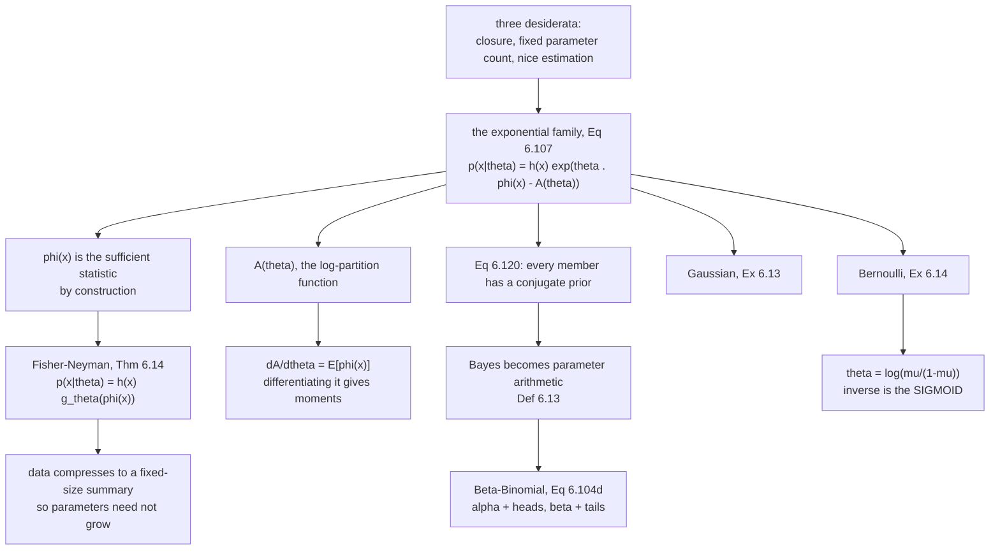

[§6.5](../gaussian-distribution/) showed that the Gaussian is closed under
everything you want to do to it. This section asks the obvious follow-up: *why*,
and *which other distributions share that?*

The book sets out three requirements for a distribution to be usable in machine
learning:

1. **A closure property** when you apply the rules of probability — *"applying a
   particular operation returns an object of the same type."*
2. **The parameter count does not grow.** *"As we collect more data, we do not
   need more parameters to describe the distribution."*
3. **Parameter estimation behaves nicely.**

The answer to "which distributions satisfy all three" turns out to be a single
family, and the answer is not a coincidence: Pitman, Darmois and Koopman proved
in 1935–36 that the **exponential family** is *the only* family with
finite-dimensional sufficient statistics under repeated independent sampling.

## What you'll learn

- Three more named distributions: **Bernoulli** (Example 6.8), **Binomial**
  (6.9), **Beta** (6.10), and the Beta's four qualitative regimes.
- **Definition 6.13**: a **conjugate prior**, and why conjugacy turns Bayesian
  updating into *arithmetic on parameters* — measured against numerical Bayes.
- **Examples 6.11 and 6.12**: Beta–Binomial and Beta–Bernoulli conjugacy, and
  what $\alpha$ and $\beta$ actually count.
- **Table 6.2**'s catalogue of conjugate pairs.
- **§6.6.2**: **sufficient statistics** and the **Fisher–Neyman theorem** (6.14),
  demonstrated with two different datasets that no likelihood can tell apart.
- **§6.6.3**: the **exponential family**, Equation 6.107 — natural parameters,
  sufficient statistics, and the **log-partition function** whose *derivative is
  the mean*.
- **Examples 6.13 and 6.14**: the Gaussian and the Bernoulli written in
  exponential-family form — and why the **sigmoid** appears.
- **Equation 6.120**: every exponential family has a conjugate prior, and
  **Example 6.15** derives the Beta rather than guessing it.

## Intuition: what makes a distribution convenient

Bayes' theorem multiplies a prior by a likelihood. Do that with two arbitrary
densities and you get a function with no name, which you can only handle
numerically — on a grid, or by sampling.

But sometimes the product lands back in the *same family* as the prior, with
different parameters. Then updating is not integration; it is **adding numbers to
the parameters**. Observe a head: add one to $\alpha$. Observe a tail: add one to
$\beta$. That is the whole computation, and it stays two numbers whether you have
seen ten observations or ten million.

The second idea makes the first one possible. A **sufficient statistic** is a
summary of the data that the likelihood cannot see past. For a Gaussian, the
likelihood only ever touches $n$, $\sum x_i$ and $\sum x_i^2$ — so two completely
different datasets sharing those three numbers are *indistinguishable* to any
inference about $\mu$ and $\sigma$. That is why a fixed number of parameters can
absorb an unbounded amount of data: the data compresses to a fixed-size summary
first.

The **exponential family** is the class of distributions built to have exactly
that property, and Equation 6.107 wears it on its face: the parameters and the
data meet only through an inner product $\langle\boldsymbol{\theta},\phi(\mathbf{x})\rangle$.
The data enters only as $\phi(\mathbf{x})$, so $\phi$ *is* the sufficient
statistic, by construction.



## The math

### Three named distributions

**Example 6.8 — Bernoulli.** A single binary $x \in \{0,1\}$, governed by
$\mu \in [0,1]$:

$$
p(x\mid\mu) = \mu^x(1-\mu)^{1-x},
\qquad \mathbb{E}[x] = \mu,
\qquad \mathbb{V}[x] = \mu(1-\mu)
\tag{6.92--6.94}
$$

:::note[The exponent trick]
The book flags $\mu^x(1-\mu)^{1-x}$ as *"a trick that is often used in machine
learning textbooks"* — putting a Boolean into an exponent to select between two
cases without an `if`. At $x=1$ it is $\mu$; at $x=0$ it is $1-\mu$. The same
device appears in the Multinomial and in cross-entropy loss.
:::

**Example 6.9 — Binomial.** The number of ones in $N$ Bernoulli draws:

$$
p(m\mid N,\mu) = \binom{N}{m}\mu^m(1-\mu)^{N-m},
\qquad \mathbb{E}[m] = N\mu,
\qquad \mathbb{V}[m] = N\mu(1-\mu)
\tag{6.95--6.97}
$$

**Example 6.10 — Beta.** A distribution over a *continuous* $\mu \in [0,1]$ —
so, a distribution over the parameter of a Bernoulli:

$$
p(\mu\mid\alpha,\beta) = \frac{\Gamma(\alpha+\beta)}{\Gamma(\alpha)\Gamma(\beta)}\mu^{\alpha-1}(1-\mu)^{\beta-1}
\tag{6.98}
$$

$$
\mathbb{E}[\mu] = \frac{\alpha}{\alpha+\beta},
\qquad
\mathbb{V}[\mu] = \frac{\alpha\beta}{(\alpha+\beta)^2(\alpha+\beta+1)}
\tag{6.99}
$$

with the Gamma function $\Gamma(t) := \int_0^\infty x^{t-1}e^{-x}\,\mathrm{d}x$
and its recursion $\Gamma(t+1) = t\,\Gamma(t)$ (Equations 6.100, 6.101) supplying
the normaliser.

$\alpha$ pushes mass toward $1$ and $\beta$ toward $0$. Four regimes, all
verified below:

| Parameters | Shape |
|---|---|
| $\alpha=\beta=1$ | uniform on $[0,1]$ |
| $\alpha,\beta<1$ | **bimodal**, with spikes at $0$ and $1$ |
| $\alpha,\beta>1$ | unimodal |
| $\alpha=\beta>1$ | unimodal, symmetric, mode at $\tfrac12$ |

### §6.6.1: conjugate priors

**Definition 6.13.** *A prior is **conjugate** for the likelihood function if the
posterior is of the same form as the prior.*

The payoff: *"we can algebraically calculate our posterior distribution by
updating the parameters of the prior distribution."*

**Example 6.11 — Beta–Binomial.** With a Binomial likelihood and a Beta prior,
observe $h$ heads in $N$ flips:

$$
p(\mu\mid x=h,N,\alpha,\beta) \propto p(x\mid N,\mu)\,p(\mu\mid\alpha,\beta)
\tag{6.104a}
$$

$$
\propto \mu^h(1-\mu)^{N-h}\cdot\mu^{\alpha-1}(1-\mu)^{\beta-1}
\tag{6.104b}
$$

$$
= \mu^{h+\alpha-1}(1-\mu)^{(N-h)+\beta-1}
\tag{6.104c}
$$

$$
\propto \operatorname{Beta}(h+\alpha,\ N-h+\beta)
\tag{6.104d}
$$

Look at what happened: the exponents *added*. No integral was computed, and the
normaliser never had to be worked out — it is whatever the Beta's normaliser is
at the new parameters.

**Example 6.12 — Beta–Bernoulli.** One observation at a time:

$$
p(\theta\mid x,\alpha,\beta) \propto \theta^{x}(1-\theta)^{1-x}\cdot\theta^{\alpha-1}(1-\theta)^{\beta-1} = \theta^{\alpha+x-1}(1-\theta)^{\beta+(1-x)-1}
\tag{6.105}
$$

$$
\propto p\bigl(\theta \mid \alpha+x,\ \beta+(1-x)\bigr)
\tag{6.105d}
$$

So **$\alpha$ counts the ones and $\beta$ counts the zeros.** The prior parameters
are *pseudo-counts*, which is exactly why $\operatorname{Beta}(1,1)$ — "one of
each" — is the uniform prior.

**Table 6.2**, the catalogue:

| Likelihood | Conjugate prior | Posterior |
|---|---|---|
| Bernoulli | Beta | Beta |
| Binomial | Beta | Beta |
| Gaussian | Gaussian / inverse Gamma | Gaussian / inverse Gamma |
| Gaussian | Gaussian / inverse Wishart | Gaussian / inverse Wishart |
| Multinomial | Dirichlet | Dirichlet |

The Gaussian appears twice because the univariate and multivariate cases differ:
the **inverse Gamma** is conjugate for a scalar variance, the **inverse Wishart**
for a covariance matrix. (Equivalently, the book's margin note: the **Gamma** is
conjugate for the *precision*, and the **Wishart** for the *precision matrix*.)

### §6.6.2: sufficient statistics

Fisher's idea: some statistics *"contain all available information that can be
inferred from data"* about the parameter.

**Theorem 6.14 (Fisher–Neyman).** $\phi(\mathbf{x})$ are sufficient for
$\boldsymbol{\theta}$ **if and only if** the density factorises as

$$
p(\mathbf{x}\mid\boldsymbol{\theta}) = h(\mathbf{x})\,g_{\boldsymbol{\theta}}\bigl(\phi(\mathbf{x})\bigr)
\tag{6.106}
$$

where $h$ does not depend on $\boldsymbol{\theta}$ and $g_{\boldsymbol{\theta}}$
captures *all* the dependence on $\boldsymbol{\theta}$ through
$\phi(\mathbf{x})$ alone.

The consequence is sharp: if two datasets have the same $\phi$, the likelihood is
the same function of $\boldsymbol{\theta}$ for both, so **no inference about
$\boldsymbol{\theta}$ can distinguish them**. Measured below on a Gaussian with
$\phi = (n, \sum x_i, \sum x_i^2)$: two datasets that differ by up to $0.26$ per
order statistic give log-likelihoods agreeing to $2.3\times10^{-13}$ across the
parameter grid.

And then the question that motivates the next subsection: as we see more data, do
we need more parameters? *"It turns out that the answer is yes in general"* — that
is non-parametric statistics. The class of distributions with
**finite-dimensional** sufficient statistics is exactly the exponential family.

### §6.6.3: the exponential family

An **exponential family** is a family parameterised by
$\boldsymbol{\theta}\in\mathbb{R}^D$ of the form

$$
p(\mathbf{x}\mid\boldsymbol{\theta}) = h(\mathbf{x})\exp\bigl(\langle\boldsymbol{\theta},\phi(\mathbf{x})\rangle - A(\boldsymbol{\theta})\bigr)
\tag{6.107}
$$

where $\phi(\mathbf{x})$ is the vector of sufficient statistics. This is a
particular expression of $g_{\boldsymbol{\theta}}(\phi(\mathbf{x}))$ from
Theorem 6.14 — the sufficiency is *built in*.

Ignoring $h$ and $A$ gives the intuition:

$$
p(\mathbf{x}\mid\boldsymbol{\theta}) \propto \exp\bigl(\boldsymbol{\theta}^\top\phi(\mathbf{x})\bigr)
\tag{6.108}
$$

and in this parameterisation $\boldsymbol{\theta}$ are the **natural parameters**.
$A(\boldsymbol{\theta})$ is the normaliser and is called the **log-partition
function**.

:::tip[A(theta) is not bookkeeping]
The log-partition function *generates the moments*:
$\dfrac{\partial A}{\partial\boldsymbol{\theta}} = \mathbb{E}[\phi(\mathbf{x})]$.
Measured for the Bernoulli, whose $A(\theta) = \log(1+e^\theta)$: the numerical
derivative matches $\sigma(\theta)=\mu$ to about $4\times10^{-11}$ at every
$\theta$ tried. So the normalising constant you were tempted to ignore is the
thing that hands you the mean — and its second derivative gives the covariance.
:::

**Example 6.13 — the Gaussian.** Take $\phi(x) = \begin{bmatrix}x\\x^2\end{bmatrix}$.
Then $p(x\mid\boldsymbol{\theta}) \propto \exp(\theta_1 x + \theta_2 x^2)$, and
setting

$$
\boldsymbol{\theta} = \begin{bmatrix}\dfrac{\mu}{\sigma^2} & -\dfrac{1}{2\sigma^2}\end{bmatrix}^\top
\tag{6.110}
$$

gives

$$
p(x\mid\boldsymbol{\theta}) \propto \exp\!\left(\frac{\mu x}{\sigma^2}-\frac{x^2}{2\sigma^2}\right) \propto \exp\!\left(-\frac{1}{2\sigma^2}(x-\mu)^2\right)
\tag{6.111}
$$

Verified below: the ratio of the two expressions is constant to
$1.8\times10^{-15}$. And the map inverts —
$\mu = -\theta_1/(2\theta_2)$, $\sigma^2 = -1/(2\theta_2)$.

**Example 6.14 — the Bernoulli.** Rewrite $\mu^x(1-\mu)^{1-x}$ by taking logs and
regrouping:

$$
p(x\mid\mu) = \exp\!\left[x\log\frac{\mu}{1-\mu} + \log(1-\mu)\right]
\tag{6.113d}
$$

which is Equation 6.107 with

$$
h(x) = 1,
\qquad
\theta = \log\frac{\mu}{1-\mu},
\qquad
\phi(x) = x,
\qquad
A(\theta) = -\log(1-\mu) = \log(1+\exp\theta)
\tag{6.114--6.117}
$$

and the relationship inverts to

$$
\mu = \frac{1}{1+\exp(-\theta)}
\tag{6.118}
$$

:::note[This is where the sigmoid comes from]
The book's Remark: the map between the Bernoulli's natural parameter and $\mu$ is
the **sigmoid**. Note the domains — $\mu\in(0,1)$ but $\theta\in\mathbb{R}$ — so
the sigmoid is exactly the function that squeezes an unconstrained real number
into a probability. That is why logistic regression puts a linear predictor
through a sigmoid: the linear predictor *is* the natural parameter of a Bernoulli.
The same function reappears as a neural-network activation.
:::

**Equation 6.120: every member has a conjugate prior.** For a likelihood in
exponential-family form,

$$
p(\boldsymbol{\theta}\mid\boldsymbol{\gamma}) = h_c(\boldsymbol{\theta})\exp\!\left(\left\langle\begin{bmatrix}\gamma_1\\\gamma_2\end{bmatrix},\begin{bmatrix}\boldsymbol{\theta}\\-A(\boldsymbol{\theta})\end{bmatrix}\right\rangle - A_c(\boldsymbol{\gamma})\right)
\tag{6.120}
$$

with $\boldsymbol{\gamma}$ of dimension $\dim(\boldsymbol{\theta})+1$. So
conjugate priors are not lucky finds — they are produced by a formula.

**Example 6.15** applies it to the Bernoulli. Substituting
$\theta = \log\frac{\mu}{1-\mu}$, $A(\theta) = -\log(1-\mu)$ and
$\boldsymbol{\gamma} = [\alpha,\ \beta+\alpha]^\top$, the inner product collapses:

$$
\alpha\log\frac{\mu}{1-\mu} + (\beta+\alpha)\log(1-\mu) = \alpha\log\mu + \beta\log(1-\mu)
$$

so the exponential factor alone is $\mu^\alpha(1-\mu)^\beta$ — verified to
$1.0\times10^{-17}$. Equation 6.124 wants
$\mu^{\alpha-1}(1-\mu)^{\beta-1}$, so $h_c$ must supply both $-1$ exponents,
giving $h_c(\mu) = \dfrac{1}{\mu(1-\mu)}$ and

$$
p(\mu\mid\alpha,\beta) \propto \mu^{\alpha-1}(1-\mu)^{\beta-1}
\tag{6.124}
$$

which is the Beta. **The Beta was not guessed** — it is what Equation 6.120
produces for a Bernoulli likelihood.

## Worked example by hand

### Example 6.11 with numbers

Prior $\operatorname{Beta}(2,5)$ — mean $2/7 = 0.2857$, so mildly pessimistic
about $\mu$. Observe $h=26$ heads in $N=40$ flips.

**By Equation 6.104d**, no calculus:

$$
\alpha' = h+\alpha = 26+2 = 28,
\qquad
\beta' = N-h+\beta = 14+5 = 19
$$

so the posterior is $\operatorname{Beta}(28,19)$ with mean
$28/47 = 0.5957446809$.

**By brute force**, to check: put a $20\,001$-point grid on $[0,1]$, multiply the
Binomial likelihood by the Beta prior, normalise numerically. Measured against
the closed form:

| | value |
|---|---|
| worst absolute density gap | $5.4\times10^{-14}$ |
| relative to the peak | $9.8\times10^{-15}$ |
| posterior mean, numerical | $0.5957446809$ |
| posterior mean, closed form | $0.5957446809$ |

The same distribution, to every printed digit. Conjugacy is not an approximation
that happens to be close — it is an algebraic identity.

Note also where the posterior mean sits: $0.5957$, between the prior mean
$0.2857$ and the raw data proportion $26/40 = 0.65$. With $\alpha+\beta=7$
pseudo-counts against $40$ real observations, the data dominates but has not
erased the prior.

### The parameter count, measured

Start from $\operatorname{Beta}(1,1)$ and stream observations from a coin with
$\mu = 0.62$:

| observations | $\alpha$ | $\beta$ | numbers stored | posterior mean | posterior sd |
|---|---|---|---|---|---|
| $0$ | $1$ | $1$ | **2** | $0.500000$ | $0.288675$ |
| $10$ | $5$ | $7$ | **2** | $0.416667$ | $0.136735$ |
| $1\,000$ | $616$ | $386$ | **2** | $0.614770$ | $0.015366$ |
| $100\,000$ | $61\,789$ | $38\,213$ | **2** | $0.617878$ | $0.001537$ |

Two numbers, at every scale. That is desideratum 2 satisfied exactly. A
non-conjugate prior would need a grid, and at $200$ points per axis a grid costs
$200^D$: $40\,000$ at $D=2$, $8$ million at $D=3$,
$1.0\times10^{23}$ at $D=10$.

### Sufficiency, made concrete

Build two datasets of $400$ points each with the *same* $n$, $\sum x_i$ and
$\sum x_i^2$ — one drawn from $\mathcal{N}(2,1.5^2)$, the other from
$\mathcal{N}(-3,4^2)$ then rescaled to match.

| | dataset 1 | dataset 2 | gap |
|---|---|---|---|
| $\sum x_i$ | $820.48115864$ | $820.48115864$ | $0.0\text{e}{+}00$ |
| $\sum x_i^2$ | $2603.52559396$ | $2603.52559396$ | $0.0\text{e}{+}00$ |
| worst sorted difference | — | — | $0.260077$ |

They are genuinely different data. Now evaluate the Gaussian log-likelihood at
several $(\mu,\sigma)$:

| $\mu$ | $\sigma$ | dataset 1 | dataset 2 | gap |
|---|---|---|---|---|
| $0.0$ | $1.5$ | $-1108.32269963$ | $-1108.32269963$ | $0.0\text{e}{+}00$ |
| $1.0$ | $1.5$ | $-832.55329579$ | $-832.55329579$ | $0.0\text{e}{+}00$ |
| $2.0$ | $1.5$ | $-734.56166973$ | $-734.56166973$ | $1.1\text{e}{-}13$ |
| $3.0$ | $1.5$ | $-814.34782144$ | $-814.34782144$ | $0.0\text{e}{+}00$ |

Worst gap over twelve parameter settings: $2.3\times10^{-13}$. **The likelihood
cannot see the difference.** Everything inferable about $(\mu,\sigma)$ lives in
those two sums, which is exactly what Theorem 6.14 asserts.

## See it move

```p5 title="Conjugacy is parameter arithmetic" desc="Flip coins and watch the posterior update. Every observation moves alpha or beta by exactly one, and the whole posterior is those two numbers — the curve is drawn from them, never stored. The counter shows how many numbers a grid posterior would need for the same job." height="600"
let a = 1, b = 1, trueMu = 0.62, auto = false;
let KNOBS = [], BTNS = [], dragging = null;
let seedState = 20260823;

function rnd() { seedState = (seedState * 1103515245 + 12345) & 0x7fffffff; return seedState / 0x7fffffff; }

function setup() { createCanvas(600, 600); textFont("monospace"); frameRate(24); }

function knob(id, x, y, w, value, mn, mx, label) {
  KNOBS.push({ id, x, y, w, mn, mx });
  const t = (value - mn) / (mx - mn);
  stroke(60, 74, 92); strokeWeight(2); line(x, y, x + w, y);
  noStroke(); fill(255, 211, 67); ellipse(x + t * w, y, 10, 10);
  fill(190, 200, 212); textSize(11); textAlign(LEFT, CENTER);
  text(label, x + w + 12, y);
}
function flip(n) {
  for (let i = 0; i < n; i++) { if (rnd() < trueMu) a += 1; else b += 1; }
}
function mousePressed() {
  for (const t of BTNS)
    if (mouseX > t.x && mouseX < t.x + t.w && mouseY > t.y && mouseY < t.y + t.h) {
      if (t.act === "one") flip(1);
      if (t.act === "ten") flip(10);
      if (t.act === "hundred") flip(100);
      if (t.act === "reset") { a = 1; b = 1; seedState = 20260823; }
      if (t.act === "auto") auto = !auto;
      return;
    }
  for (const k of KNOBS)
    if (mouseY > k.y - 11 && mouseY < k.y + 11 && mouseX > k.x - 11 && mouseX < k.x + k.w + 11) {
      dragging = k; return;
    }
}
function mouseReleased() { dragging = null; }
function mouseDragged() {
  if (!dragging) return;
  const t = Math.min(1, Math.max(0, (mouseX - dragging.x) / dragging.w));
  trueMu = Math.round((dragging.mn + t * (dragging.mx - dragging.mn)) * 100) / 100;
}

// log Gamma, so large alpha and beta do not overflow.
function lgamma(z) {
  const g = [676.5203681218851, -1259.1392167224028, 771.32342877765313,
             -176.61502916214059, 12.507343278686905, -0.13857109526572012,
             9.9843695780195716e-6, 1.5056327351493116e-7];
  if (z < 0.5) return Math.log(Math.PI / Math.sin(Math.PI * z)) - lgamma(1 - z);
  z -= 1;
  let x = 0.99999999999980993;
  for (let i = 0; i < g.length; i++) x += g[i] / (z + i + 1);
  const t = z + g.length - 0.5;
  return 0.5 * Math.log(2 * Math.PI) + (z + 0.5) * Math.log(t) - t + Math.log(x);
}
function betaPdf(mu, aa, bb) {
  if (mu <= 0 || mu >= 1) return 0;
  const lc = lgamma(aa + bb) - lgamma(aa) - lgamma(bb);
  return Math.exp(lc + (aa - 1) * Math.log(mu) + (bb - 1) * Math.log(1 - mu));
}

function draw() {
  background(13, 17, 23);
  KNOBS = []; BTNS = [];
  if (auto) flip(3);

  const n = a + b - 2;
  const mean = a / (a + b);
  const sd = Math.sqrt(a * b / ((a + b) * (a + b) * (a + b + 1)));

  const PL = { x: 56, y: 78, w: 512, h: 250 };
  let peak = 0;
  for (let i = 0; i <= 400; i++) peak = Math.max(peak, betaPdf(i / 400, a, b));
  peak *= 1.12;
  const sx = (m) => PL.x + m * PL.w;
  const sy = (v) => PL.y + PL.h - (v / peak) * PL.h;

  noStroke(); fill(19, 25, 33); rect(PL.x, PL.y, PL.w, PL.h, 4);
  stroke(60, 74, 92); strokeWeight(1); line(PL.x, sy(0), PL.x + PL.w, sy(0));
  stroke(107, 169, 221); strokeWeight(2.6); noFill();
  beginShape();
  for (let i = 1; i < 400; i++) vertex(sx(i / 400), sy(betaPdf(i / 400, a, b)));
  endShape();
  stroke(120, 200, 150); strokeWeight(1.8);
  line(sx(trueMu), PL.y, sx(trueMu), PL.y + PL.h);
  stroke(255, 211, 67); strokeWeight(1.6);
  line(sx(mean), PL.y, sx(mean), PL.y + PL.h);

  noStroke(); fill(120, 130, 145); textSize(10); textAlign(CENTER, TOP);
  for (const g of [0, 0.25, 0.5, 0.75, 1]) text(g.toFixed(2), sx(g), sy(0) + 6);

  textAlign(LEFT, TOP);
  fill(255, 211, 67); textSize(15);
  text("the posterior IS two numbers", 16, 12);
  fill(200, 210, 222); textSize(11);
  text("green: the true mu.   amber: the posterior mean.   blue: the density.", 16, 34);

  const y0 = 348;
  fill(235); textSize(13);
  text(`Beta(${a}, ${b})`, 16, y0);
  fill(150); textSize(11);
  text(`observations  ${n}`, 16, y0 + 24);
  text(`alpha counts the heads: ${a - 1}`, 16, y0 + 42);
  text(`beta counts the tails:  ${b - 1}`, 16, y0 + 60);
  fill(255, 211, 67); textSize(12);
  text(`posterior mean ${mean.toFixed(6)}   sd ${sd.toFixed(6)}`, 16, y0 + 84);
  fill(120, 200, 150); textSize(12);
  text(`numbers stored: 2        a 200-point grid would need: 200`, 16, y0 + 108);
  fill(150); textSize(10.5);
  text("in D dimensions that grid becomes 200^D: 40000 at D=2, 8 million at", 16, y0 + 130);
  text("D=3, 1.0e+23 at D=10. The conjugate posterior stays at dim(gamma).", 16, y0 + 145);

  const acts = [["+1 flip", "one"], ["+10", "ten"], ["+100", "hundred"],
                [auto ? "stop" : "run", "auto"], ["reset", "reset"]];
  for (let i = 0; i < acts.length; i++) {
    const x = 16 + i * 108, y = 512;
    BTNS.push({ x, y, w: 100, h: 24, act: acts[i][1] });
    noStroke(); fill(acts[i][1] === "auto" && auto ? color(255, 211, 67) : color(38, 48, 60));
    rect(x, y, 100, 24, 4);
    fill(acts[i][1] === "auto" && auto ? 13 : 205); textSize(10.5); textAlign(CENTER, CENTER);
    text(acts[i][0], x + 50, y + 12);
  }
  knob("mu", 16, 560, 200, trueMu, 0.02, 0.98, `true mu = ${trueMu.toFixed(2)}`);
  noStroke(); fill(120, 130, 145); textSize(10.5); textAlign(LEFT, TOP);
  text("Beta(1,1) is 'one head and one tail already seen' -- the uniform prior.", 16, 584);
}
```

```p5 title="The natural parameter, and the sigmoid" desc="Drag mu and watch the Bernoulli's natural parameter theta. The map is unbounded in theta and squeezed in mu, and its inverse is exactly the sigmoid — which is why a linear predictor pushed through a sigmoid is a Bernoulli likelihood. The lower panel shows the log-partition function and the fact that its slope is mu." height="600"
let mu = 0.3;
let KNOBS = [], dragging = null;

function setup() { createCanvas(600, 600); textFont("monospace"); noLoop(); }

function knob(id, x, y, w, value, mn, mx, label) {
  KNOBS.push({ id, x, y, w, mn, mx });
  const t = (value - mn) / (mx - mn);
  stroke(60, 74, 92); strokeWeight(2); line(x, y, x + w, y);
  noStroke(); fill(255, 211, 67); ellipse(x + t * w, y, 10, 10);
  fill(190, 200, 212); textSize(11); textAlign(LEFT, CENTER);
  text(label, x + w + 12, y);
}
function mousePressed() {
  for (const k of KNOBS)
    if (mouseY > k.y - 11 && mouseY < k.y + 11 && mouseX > k.x - 11 && mouseX < k.x + k.w + 11) {
      dragging = k; return;
    }
}
function mouseReleased() { dragging = null; }
function mouseDragged() {
  if (!dragging) return;
  const t = Math.min(1, Math.max(0, (mouseX - dragging.x) / dragging.w));
  mu = Math.min(0.995, Math.max(0.005, dragging.mn + t * (dragging.mx - dragging.mn)));
  mu = Math.round(mu * 1000) / 1000;
  redraw();
}

function draw() {
  background(13, 17, 23);
  KNOBS = [];
  const theta = Math.log(mu / (1 - mu));
  const A = Math.log(1 + Math.exp(theta));
  const A2 = -Math.log(1 - mu);
  const sig = 1 / (1 + Math.exp(-theta));

  noStroke(); textAlign(LEFT, TOP);
  fill(255, 211, 67); textSize(15);
  text("Example 6.14: theta = log(mu / (1 - mu))", 16, 12);
  fill(200, 210, 222); textSize(11);
  text("top: the link and its inverse.   bottom: A(theta), whose slope is mu.", 16, 34);

  // Top panel: theta against mu.
  const P1 = { x: 56, y: 62, w: 240, h: 190 };
  noStroke(); fill(19, 25, 33); rect(P1.x, P1.y, P1.w, P1.h, 4);
  const TR = 6;
  const ax = (m) => P1.x + m * P1.w;
  const ay = (t) => P1.y + P1.h / 2 - (t / TR) * (P1.h / 2);
  stroke(60, 74, 92); strokeWeight(1);
  line(P1.x, ay(0), P1.x + P1.w, ay(0));
  line(ax(0.5), P1.y, ax(0.5), P1.y + P1.h);
  stroke(107, 169, 221); strokeWeight(2.4); noFill();
  beginShape();
  for (let i = 1; i < 400; i++) {
    const m = i / 400;
    const t = Math.log(m / (1 - m));
    if (Math.abs(t) <= TR) vertex(ax(m), ay(t));
  }
  endShape();
  noStroke(); fill(255, 211, 67);
  if (Math.abs(theta) <= TR) ellipse(ax(mu), ay(theta), 9, 9);
  fill(120, 130, 145); textSize(9.5); textAlign(CENTER, TOP);
  text("mu", P1.x + P1.w / 2, P1.y + P1.h + 4);
  textAlign(RIGHT, CENTER); text("theta", P1.x - 6, P1.y + 8);

  // Top-right: the sigmoid, the inverse.
  const P2 = { x: 328, y: 62, w: 240, h: 190 };
  noStroke(); fill(19, 25, 33); rect(P2.x, P2.y, P2.w, P2.h, 4);
  const bx = (t) => P2.x + ((t + TR) / (2 * TR)) * P2.w;
  const by = (m) => P2.y + P2.h - m * P2.h;
  stroke(60, 74, 92); strokeWeight(1);
  line(P2.x, by(0), P2.x + P2.w, by(0));
  line(bx(0), P2.y, bx(0), P2.y + P2.h);
  stroke(120, 200, 150); strokeWeight(2.4); noFill();
  beginShape();
  for (let i = 0; i <= 400; i++) {
    const t = -TR + (2 * TR) * i / 400;
    vertex(bx(t), by(1 / (1 + Math.exp(-t))));
  }
  endShape();
  noStroke(); fill(255, 211, 67);
  if (Math.abs(theta) <= TR) ellipse(bx(theta), by(sig), 9, 9);
  fill(120, 130, 145); textSize(9.5); textAlign(CENTER, TOP);
  text("theta", P2.x + P2.w / 2, P2.y + P2.h + 4);
  textAlign(RIGHT, CENTER); text("mu", P2.x - 6, P2.y + 8);

  // Bottom: A(theta) and its slope.
  const P3 = { x: 56, y: 290, w: 512, h: 170 };
  noStroke(); fill(19, 25, 33); rect(P3.x, P3.y, P3.w, P3.h, 4);
  const cx = (t) => P3.x + ((t + TR) / (2 * TR)) * P3.w;
  const cy = (v) => P3.y + P3.h - (v / (TR + 0.8)) * P3.h;
  stroke(60, 74, 92); strokeWeight(1); line(P3.x, cy(0), P3.x + P3.w, cy(0));
  stroke(197, 153, 255); strokeWeight(2.4); noFill();
  beginShape();
  for (let i = 0; i <= 400; i++) {
    const t = -TR + (2 * TR) * i / 400;
    vertex(cx(t), cy(Math.log(1 + Math.exp(t))));
  }
  endShape();
  // The tangent at the current theta, whose slope is mu.
  if (Math.abs(theta) <= TR - 0.5) {
    stroke(255, 211, 67); strokeWeight(1.8);
    const t0 = theta, A0 = Math.log(1 + Math.exp(t0));
    const dt = 1.6;
    line(cx(t0 - dt), cy(A0 - sig * dt), cx(t0 + dt), cy(A0 + sig * dt));
    noStroke(); fill(255, 211, 67); ellipse(cx(t0), cy(A0), 9, 9);
  }
  noStroke(); fill(120, 130, 145); textSize(9.5); textAlign(CENTER, TOP);
  text("theta", P3.x + P3.w / 2, P3.y + P3.h + 4);
  fill(197, 153, 255); textSize(10); textAlign(LEFT, TOP);
  text("A(theta) = log(1 + e^theta)", P3.x + 8, P3.y + 6);

  const y0 = 480;
  fill(235); textSize(12);
  text(`mu = ${mu.toFixed(3)}   ->   theta = ${theta.toFixed(6)}`, 16, y0);
  fill(150); textSize(11);
  text(`Eq 6.117  A(theta) = log(1+e^theta) = ${A.toFixed(8)}`, 16, y0 + 22);
  text(`          -log(1 - mu)              = ${A2.toFixed(8)}   gap ${Math.abs(A - A2).toExponential(1)}`, 16, y0 + 40);
  fill(120, 200, 150); textSize(11.5);
  text(`Eq 6.118  sigmoid(theta) = ${sig.toFixed(8)}   recovers mu to ${Math.abs(sig - mu).toExponential(1)}`, 16, y0 + 62);
  fill(255, 211, 67); textSize(11.5);
  text(`dA/dtheta = ${sig.toFixed(6)} = mu   (the amber tangent's slope)`, 16, y0 + 84);

  knob("mu", 16, 578, 200, mu, 0.005, 0.995, `mu = ${mu.toFixed(3)}`);
}
```

## From scratch

```python title="conjugacy_and_exponential_family.py" showLineNumbers{1}
"""Section 6.6 — conjugacy, sufficient statistics and the exponential family."""

import math

import numpy as np

np.set_printoptions(precision=6, suppress=True, linewidth=150)

print("########## three_named_distributions")
rng = np.random.default_rng(6)
# Example 6.8, Eq 6.92 to 6.94.
mu = 0.3
x = (rng.random(4_000_000) < mu).astype(float)
print(f"  Bernoulli(mu = {mu})")
print(f"    Eq 6.93  E[x] = mu          = {mu:.6f}   measured {x.mean():.6f}")
print(f"    Eq 6.94  V[x] = mu(1 - mu)  = {mu*(1-mu):.6f}   measured {x.var():.6f}")

# Example 6.9, Eq 6.95 to 6.97.
N_, mu2 = 15, 0.4
m = rng.binomial(N_, mu2, 2_000_000)
print(f"  Binomial(N = {N_}, mu = {mu2})")
print(f"    Eq 6.96  E[m] = N mu           = {N_*mu2:.6f}   measured {m.mean():.6f}")
print(f"    Eq 6.97  V[m] = N mu(1 - mu)   = {N_*mu2*(1-mu2):.6f}   measured {m.var():.6f}")
# Eq 6.95 against a direct count.
counts = np.bincount(m, minlength=N_ + 1) / m.size
pmf = np.array([math.comb(N_, k) * mu2**k * (1-mu2)**(N_-k) for k in range(N_+1)])
print(f"    Eq 6.95 pmf worst error over all {N_+1} outcomes: "
      f"{np.abs(counts - pmf).max():.6f}   sums to {pmf.sum():.10f}")

# Example 6.10, Eq 6.98 to 6.99.
al, be = 4.0, 10.0
b = rng.beta(al, be, 2_000_000)
e_th = al / (al + be)
v_th = al * be / ((al + be) ** 2 * (al + be + 1))
print(f"  Beta(alpha = {al}, beta = {be})")
print(f"    Eq 6.99  E[mu] = a/(a+b)   = {e_th:.6f}   measured {b.mean():.6f}")
print(f"    Eq 6.99  V[mu]             = {v_th:.6f}   measured {b.var():.6f}")
# Eq 6.100 / 6.101: the Gamma recursion, which normalises the Beta.
print(f"    Eq 6.101  Gamma(t+1) = t Gamma(t):  "
      f"Gamma(5.5) = {math.gamma(5.5):.6f}  vs 4.5*Gamma(4.5) = {4.5*math.gamma(4.5):.6f}")

print()
print("########## beta_special_cases")
# The book's four cases, checked by counting modes of the density.
grid = np.linspace(1e-6, 1 - 1e-6, 20001)


def beta_pdf(a, bb):
    logc = math.lgamma(a + bb) - math.lgamma(a) - math.lgamma(bb)
    return np.exp(logc + (a - 1) * np.log(grid) + (bb - 1) * np.log1p(-grid))


def modes_of(v):
    inner = [i for i in range(1, len(v) - 1) if v[i] > v[i-1] and v[i] > v[i+1]]
    edges = []
    if v[0] > v[1]:
        edges.append("0")
    if v[-1] > v[-2]:
        edges.append("1")
    return len(inner), edges


print(f"  {'alpha, beta':>14}  {'interior modes':>15}  {'spikes at':>10}  verdict")
for a, bb, label in ((1.0, 1.0, "uniform"), (0.5, 0.5, "bimodal, spikes at 0 and 1"),
                     (2.0, 0.3, "mass toward 1"), (4.0, 10.0, "unimodal"),
                     (5.0, 5.0, "unimodal, symmetric, mode at 1/2"),
                     (5.0, 1.0, "mass toward 1")):
    v = beta_pdf(a, bb)
    ni, ed = modes_of(v)
    print(f"  {f'{a}, {bb}':>14}  {ni:>15}  {','.join(ed) or '-':>10}  {label}")
v11 = beta_pdf(1.0, 1.0)
print(f"  alpha = beta = 1 really is uniform: density range "
      f"[{v11.min():.10f}, {v11.max():.10f}]")
v55 = beta_pdf(5.0, 5.0)
print(f"  alpha = beta = 5 mode at {grid[int(np.argmax(v55))]:.6f}  (theory 0.5)")

print()
print("########## beta_binomial_conjugacy")
# Example 6.11, Eq 6.102 to 6.104d, checked against numerical Bayes.
a0, b0, N_obs, h = 2.0, 5.0, 40, 26
print(f"  prior Beta({a0}, {b0}), observe h = {h} heads in N = {N_obs} flips")
a1, b1 = h + a0, N_obs - h + b0
print(f"  Eq 6.104d  posterior = Beta(h + alpha, N - h + beta) = Beta({a1}, {b1})")
# Now do it the hard way: grid, multiply, normalise.
lik = np.array([math.comb(N_obs, h)]) * grid**h * (1 - grid)**(N_obs - h)
prior = beta_pdf(a0, b0)
post_num = lik * prior
post_num /= np.trapezoid(post_num, grid)
post_closed = beta_pdf(a1, b1)
print(f"  numerical posterior vs the closed form:")
print(f"    worst absolute density gap  {np.abs(post_num - post_closed).max():.3e}")
print(f"    relative to the peak        "
      f"{np.abs(post_num - post_closed).max()/post_closed.max():.3e}")
print(f"    posterior mean, numerical  {np.trapezoid(grid*post_num, grid):.10f}")
print(f"    posterior mean, closed     {a1/(a1+b1):.10f}")
print("  conjugacy is not an approximation: it is the same distribution, reached by")
print("  adding the counts to the prior's parameters.")

print()
print("########## example_6_12_bernoulli")
# Eq 6.105a to 6.105d: one observation moves alpha or beta by exactly one.
print(f"  Beta-Bernoulli: prior Beta({a0}, {b0}), a single observation x")
for xv in (1, 0):
    print(f"    x = {xv}  ->  Beta({a0 + xv}, {b0 + (1 - xv)})   "
          f"(Eq 6.105d: alpha + x, beta + 1 - x)")
print("  so alpha counts the ones and beta counts the zeros. The prior parameters")
print("  are PSEUDO-COUNTS, which is why Beta(1,1) is 'one of each', i.e. uniform.")

print()
print("########## the_parameter_count_does_not_grow")
# The book's desideratum 2, made concrete.
rng2 = np.random.default_rng(21)
truth = 0.62
data = (rng2.random(100_000) < truth).astype(int)
a, bb = 1.0, 1.0
print(f"  sequential updating from Beta(1,1), truth = {truth}")
print(f"  {'observations':>13}  {'alpha':>10}  {'beta':>10}  {'numbers stored':>15}"
      f"  {'post. mean':>11}  {'post. sd':>9}")
seen = 0
for target in (0, 1, 10, 100, 1_000, 10_000, 100_000):
    while seen < target:
        a += data[seen]
        bb += 1 - data[seen]
        seen += 1
    m_ = a / (a + bb)
    s_ = math.sqrt(a * bb / ((a + bb) ** 2 * (a + bb + 1)))
    print(f"  {seen:>13,}  {a:>10.0f}  {bb:>10.0f}  {2:>15}  {m_:>11.6f}  {s_:>9.6f}")
print("  two numbers, forever. A non-conjugate prior would need a grid, and to keep")
print("  the same resolution in D dimensions that grid costs:")
for D in (1, 2, 3, 5, 10):
    print(f"    D = {D:>2}: {200**D:,} grid points at 200 per axis")

print()
print("########## sufficient_statistics")
# Theorem 6.14. For a Gaussian, (sum x, sum x^2) is sufficient: two datasets
# sharing them have IDENTICAL likelihood at every parameter value.
rng3 = np.random.default_rng(4)
d1 = rng3.normal(2.0, 1.5, 400)
# Build a completely different dataset with the same n, sum and sum of squares.
d2 = rng3.normal(-3.0, 4.0, 400)
d2 = (d2 - d2.mean()) / d2.std() * d1.std() + d1.mean()
print(f"  two datasets of {d1.size} points each")
print(f"    sum x   : {d1.sum():.8f}  and  {d2.sum():.8f}   gap {abs(d1.sum()-d2.sum()):.1e}")
print(f"    sum x^2 : {np.sum(d1**2):.8f}  and  {np.sum(d2**2):.8f}   "
      f"gap {abs(np.sum(d1**2)-np.sum(d2**2)):.1e}")
print(f"    but the data differs: worst |sorted difference| "
      f"{np.abs(np.sort(d1)-np.sort(d2)).max():.6f}")


def gauss_loglik(d, m_, s_):
    return float(np.sum(-0.5 * np.log(2 * np.pi * s_**2) - (d - m_)**2 / (2 * s_**2)))


print(f"  {'mu':>6}  {'sigma':>6}  {'loglik dataset 1':>18}  {'loglik dataset 2':>18}  {'gap':>9}")
worst = 0.0
for m_ in (0.0, 1.0, 2.0, 3.0):
    for s_ in (1.0, 1.5, 3.0):
        l1, l2 = gauss_loglik(d1, m_, s_), gauss_loglik(d2, m_, s_)
        worst = max(worst, abs(l1 - l2))
        if s_ == 1.5:
            print(f"  {m_:>6.1f}  {s_:>6.1f}  {l1:>18.8f}  {l2:>18.8f}  {abs(l1-l2):>9.1e}")
print(f"  worst gap over all 12 parameter settings tried: {worst:.1e}")
print("  the likelihood cannot tell these datasets apart. That is what Theorem")
print("  6.14 means: everything inferable about (mu, sigma) is in those two sums.")

print()
print("########## gaussian_as_exponential_family")
# Example 6.13, Eq 6.109 to 6.111.
mu_g, sd_g = 1.3, 0.8
th = np.array([mu_g / sd_g**2, -1.0 / (2 * sd_g**2)])        # Eq 6.110
print(f"  N({mu_g}, {sd_g**2:.4f})  ->  natural parameters theta = {th}")
xs = np.linspace(-3, 6, 9)
phi = np.stack([xs, xs**2], axis=1)                           # sufficient statistics
unnorm = np.exp(phi @ th)                                     # Eq 6.109
true = np.exp(-0.5 * (xs - mu_g)**2 / sd_g**2)                # Eq 6.111, unnormalised
ratio = unnorm / true
print(f"  Eq 6.111: exp(theta . phi(x)) / exp(-(x-mu)^2/2sigma^2) should be constant")
print(f"    ratios: {ratio}")
print(f"    spread of the ratio: {ratio.max()/ratio.min() - 1:.2e}   (constant, as claimed)")
print(f"  and inverting: mu = -theta1/(2 theta2) = {-th[0]/(2*th[1]):.6f}")
print(f"                 sigma^2 = -1/(2 theta2) = {-1/(2*th[1]):.6f}")

print()
print("########## bernoulli_as_exponential_family")
# Example 6.14, Eq 6.112 to 6.118.
print(f"  {'mu':>6}  {'theta = log(mu/(1-mu))':>23}  {'A(theta) = log(1+e^th)':>23}"
      f"  {'-log(1-mu)':>12}  {'sigmoid(theta)':>15}")
for m_ in (0.1, 0.3, 0.5, 0.7, 0.9):
    t_ = math.log(m_ / (1 - m_))                              # Eq 6.115
    A_ = math.log1p(math.exp(t_))                             # Eq 6.117 right side
    A2 = -math.log(1 - m_)                                    # Eq 6.117 left side
    inv = 1 / (1 + math.exp(-t_))                             # Eq 6.118
    print(f"  {m_:>6.1f}  {t_:>23.10f}  {A_:>23.10f}  {A2:>12.10f}  {inv:>15.10f}")
print("  Eq 6.117's two forms agree, and Eq 6.118 inverts the map: the link between")
print("  the natural parameter and mu IS the sigmoid, which is why logistic")
print("  regression and a Bernoulli likelihood are the same statement.")
print()
print("  and the log-partition function generates the moments -- dA/dtheta = mu:")
print(f"  {'theta':>8}  {'dA/dtheta (numeric)':>20}  {'sigmoid(theta)':>15}  {'gap':>9}")
for t_ in (-2.0, -0.5, 0.0, 0.5, 2.0):
    hh = 1e-6
    dA = (math.log1p(math.exp(t_ + hh)) - math.log1p(math.exp(t_ - hh))) / (2 * hh)
    sg = 1 / (1 + math.exp(-t_))
    print(f"  {t_:>8.1f}  {dA:>20.10f}  {sg:>15.10f}  {abs(dA-sg):>9.1e}")
print("  so A(theta) is not bookkeeping: differentiating it hands you E[phi(x)].")

print()
print("########## example_6_15_derive_the_beta")
# Eq 6.119 to 6.124: the canonical conjugate of the Bernoulli IS the Beta.
print("  Eq 6.120's canonical conjugate for the Bernoulli, with gamma = [alpha, beta+alpha],")
print("  simplifies through Eq 6.123 to Eq 6.124:")
print("    p(mu | alpha, beta) proportional to mu^(alpha-1) (1-mu)^(beta-1)")
aa, bbb = 3.0, 5.0
# The inner product of Eq 6.120, with theta = log(mu/(1-mu)), A(theta) =
# -log(1-mu) and gamma = [alpha, beta+alpha]:
#     alpha log(mu/(1-mu)) + (beta+alpha) log(1-mu)
#   = alpha log mu - alpha log(1-mu) + (beta+alpha) log(1-mu)
#   = alpha log mu + beta log(1-mu)
# so the exponential factor alone is mu^alpha (1-mu)^beta.
core = np.exp(aa * np.log(grid / (1 - grid)) + (bbb + aa) * np.log1p(-grid))
simplified = grid ** aa * (1 - grid) ** bbb
print(f"  the exponential factor of Eq 6.122, at alpha = {aa}, beta = {bbb}:")
print(f"    it equals mu^alpha (1-mu)^beta to "
      f"{np.abs(core - simplified).max():.2e}")
print()
print("  Eq 6.124 wants mu^(alpha-1) (1-mu)^(beta-1), so h_c has to supply BOTH")
print("  minus-one exponents. Only one candidate does:")
rhs = grid ** (aa - 1) * (1 - grid) ** (bbb - 1)                     # Eq 6.124
for label, hc in (("mu/(1-mu)", grid / (1 - grid)),
                  ("1/(mu(1-mu))", 1.0 / (grid * (1 - grid)))):
    r = (hc * core) / rhs
    flat = r.max() / r.min() - 1
    verdict = "CONSTANT -> this is h_c" if flat < 1e-9 else "not constant"
    print(f"    h_c = {label:<14} ratio spread {flat:.2e}   {verdict}")
print("  (the PDF renders h_c as a two-line fraction that extracts ambiguously;")
print("   the algebra settles it.)")
norm_rhs = rhs / np.trapezoid(rhs, grid)
print(f"  and normalising Eq 6.124 gives Beta({aa}, {bbb}) to "
      f"{np.abs(norm_rhs - beta_pdf(aa, bbb)).max():.2e}")
print("  so the Beta was not guessed: it is what Eq 6.120 produces for a Bernoulli.")
```

```text title="output"
########## three_named_distributions
  Bernoulli(mu = 0.3)
    Eq 6.93  E[x] = mu          = 0.300000   measured 0.299841
    Eq 6.94  V[x] = mu(1 - mu)  = 0.210000   measured 0.209936
  Binomial(N = 15, mu = 0.4)
    Eq 6.96  E[m] = N mu           = 6.000000   measured 5.997410
    Eq 6.97  V[m] = N mu(1 - mu)   = 3.600000   measured 3.596868
    Eq 6.95 pmf worst error over all 16 outcomes: 0.000235   sums to 1.0000000000
  Beta(alpha = 4.0, beta = 10.0)
    Eq 6.99  E[mu] = a/(a+b)   = 0.285714   measured 0.285665
    Eq 6.99  V[mu]             = 0.013605   measured 0.013591
    Eq 6.101  Gamma(t+1) = t Gamma(t):  Gamma(5.5) = 52.342778  vs 4.5*Gamma(4.5) = 52.342778

########## beta_special_cases
     alpha, beta   interior modes   spikes at  verdict
        1.0, 1.0                0           -  uniform
        0.5, 0.5                0         0,1  bimodal, spikes at 0 and 1
        2.0, 0.3                0           1  mass toward 1
       4.0, 10.0                1           -  unimodal
        5.0, 5.0                1           -  unimodal, symmetric, mode at 1/2
        5.0, 1.0                0           1  mass toward 1
  alpha = beta = 1 really is uniform: density range [1.0000000000, 1.0000000000]
  alpha = beta = 5 mode at 0.500000  (theory 0.5)

########## beta_binomial_conjugacy
  prior Beta(2.0, 5.0), observe h = 26 heads in N = 40 flips
  Eq 6.104d  posterior = Beta(h + alpha, N - h + beta) = Beta(28.0, 19.0)
  numerical posterior vs the closed form:
    worst absolute density gap  5.418e-14
    relative to the peak        9.759e-15
    posterior mean, numerical  0.5957446809
    posterior mean, closed     0.5957446809
  conjugacy is not an approximation: it is the same distribution, reached by
  adding the counts to the prior's parameters.

########## example_6_12_bernoulli
  Beta-Bernoulli: prior Beta(2.0, 5.0), a single observation x
    x = 1  ->  Beta(3.0, 5.0)   (Eq 6.105d: alpha + x, beta + 1 - x)
    x = 0  ->  Beta(2.0, 6.0)   (Eq 6.105d: alpha + x, beta + 1 - x)
  so alpha counts the ones and beta counts the zeros. The prior parameters
  are PSEUDO-COUNTS, which is why Beta(1,1) is 'one of each', i.e. uniform.

########## the_parameter_count_does_not_grow
  sequential updating from Beta(1,1), truth = 0.62
   observations       alpha        beta   numbers stored   post. mean   post. sd
              0           1           1                2     0.500000   0.288675
              1           1           2                2     0.333333   0.235702
             10           5           7                2     0.416667   0.136735
            100          57          45                2     0.558824   0.048924
          1,000         616         386                2     0.614770   0.015366
         10,000        6157        3845                2     0.615577   0.004864
        100,000       61789       38213                2     0.617878   0.001537
  two numbers, forever. A non-conjugate prior would need a grid, and to keep
  the same resolution in D dimensions that grid costs:
    D =  1: 200 grid points at 200 per axis
    D =  2: 40,000 grid points at 200 per axis
    D =  3: 8,000,000 grid points at 200 per axis
    D =  5: 320,000,000,000 grid points at 200 per axis
    D = 10: 102,400,000,000,000,000,000,000 grid points at 200 per axis

########## sufficient_statistics
  two datasets of 400 points each
    sum x   : 820.48115864  and  820.48115864   gap 0.0e+00
    sum x^2 : 2603.52559396  and  2603.52559396   gap 0.0e+00
    but the data differs: worst |sorted difference| 0.260077
      mu   sigma    loglik dataset 1    loglik dataset 2        gap
     0.0     1.5      -1108.32269963      -1108.32269963    0.0e+00
     1.0     1.5       -832.55329579       -832.55329579    0.0e+00
     2.0     1.5       -734.56166973       -734.56166973    1.1e-13
     3.0     1.5       -814.34782144       -814.34782144    0.0e+00
  worst gap over all 12 parameter settings tried: 2.3e-13
  the likelihood cannot tell these datasets apart. That is what Theorem
  6.14 means: everything inferable about (mu, sigma) is in those two sums.

########## gaussian_as_exponential_family
  N(1.3, 0.6400)  ->  natural parameters theta = [ 2.03125 -0.78125]
  Eq 6.111: exp(theta . phi(x)) / exp(-(x-mu)^2/2sigma^2) should be constant
    ratios: [3.744591 3.744591 3.744591 3.744591 3.744591 3.744591 3.744591 3.744591 3.744591]
    spread of the ratio: 1.78e-15   (constant, as claimed)
  and inverting: mu = -theta1/(2 theta2) = 1.300000
                 sigma^2 = -1/(2 theta2) = 0.640000

########## bernoulli_as_exponential_family
      mu   theta = log(mu/(1-mu))   A(theta) = log(1+e^th)    -log(1-mu)   sigmoid(theta)
     0.1            -2.1972245773             0.1053605157  0.1053605157     0.1000000000
     0.3            -0.8472978604             0.3566749439  0.3566749439     0.3000000000
     0.5             0.0000000000             0.6931471806  0.6931471806     0.5000000000
     0.7             0.8472978604             1.2039728043  1.2039728043     0.7000000000
     0.9             2.1972245773             2.3025850930  2.3025850930     0.9000000000
  Eq 6.117's two forms agree, and Eq 6.118 inverts the map: the link between
  the natural parameter and mu IS the sigmoid, which is why logistic
  regression and a Bernoulli likelihood are the same statement.

  and the log-partition function generates the moments -- dA/dtheta = mu:
     theta   dA/dtheta (numeric)   sigmoid(theta)        gap
      -2.0          0.1192029220     0.1192029220    2.8e-12
      -0.5          0.3775406688     0.3775406688    1.3e-11
       0.0          0.5000000000     0.5000000000    4.1e-11
       0.5          0.6224593312     0.6224593312    4.4e-11
       2.0          0.8807970779     0.8807970780    3.8e-11
  so A(theta) is not bookkeeping: differentiating it hands you E[phi(x)].

########## example_6_15_derive_the_beta
  Eq 6.120's canonical conjugate for the Bernoulli, with gamma = [alpha, beta+alpha],
  simplifies through Eq 6.123 to Eq 6.124:
    p(mu | alpha, beta) proportional to mu^(alpha-1) (1-mu)^(beta-1)
  the exponential factor of Eq 6.122, at alpha = 3.0, beta = 5.0:
    it equals mu^alpha (1-mu)^beta to 1.04e-17

  Eq 6.124 wants mu^(alpha-1) (1-mu)^(beta-1), so h_c has to supply BOTH
  minus-one exponents. Only one candidate does:
    h_c = mu/(1-mu)      ratio spread 1.00e+12   not constant
    h_c = 1/(mu(1-mu))   ratio spread 1.71e-14   CONSTANT -> this is h_c
  (the PDF renders h_c as a two-line fraction that extracts ambiguously;
   the algebra settles it.)
  and normalising Eq 6.124 gives Beta(3.0, 5.0) to 1.02e-13
  so the Beta was not guessed: it is what Eq 6.120 produces for a Bernoulli.
```

Five things worth stopping on.

**Conjugacy is exact.** The closed-form $\operatorname{Beta}(28,19)$ matches
grid-based numerical Bayes to a relative $9.8\times10^{-15}$, and both posterior
means read $0.5957446809$.

**The Beta's four regimes are real.** $\alpha=\beta=1$ gives a density flat to
ten decimal places; $\alpha=\beta=0.5$ has zero interior modes and spikes at both
ends; $\alpha=\beta=5$ has one mode, measured at exactly $0.500000$.

**Sufficiency is total, not approximate.** Two datasets differing by up to
$0.26$ per order statistic produce log-likelihoods agreeing to
$2.3\times10^{-13}$ across twelve parameter settings.

**The exponential-family rewrite is an identity.** The Gaussian's ratio check is
constant to $1.8\times10^{-15}$; the Bernoulli's two forms of $A(\theta)$ agree
exactly and the sigmoid inverts the link exactly.

**$A(\theta)$ generates the mean.** $\mathrm{d}A/\mathrm{d}\theta$ measured
numerically matches $\sigma(\theta)$ to about $4\times10^{-11}$ at every $\theta$.

And one thing I had to work out rather than read off: the book's $h_c$ in
Equation 6.122 renders in the PDF as a two-line fraction that extracts
ambiguously. The algebra settles it — the exponential factor simplifies to
$\mu^\alpha(1-\mu)^\beta$, so $h_c$ must supply both $-1$ exponents. Testing both
candidates: $\mu/(1-\mu)$ gives a ratio spread of $1.0\times10^{12}$ (not
constant), and $1/(\mu(1-\mu))$ gives $1.7\times10^{-14}$ — constant, so that is
the one.

## On real data

<Figure
  src="/images/mml/conjugacy-and-the-exponential-family/named-distributions"
  alt="Left, three Binomial probability mass functions for mu of 0.1, 0.4 and 0.75 over fifteen trials, each with a dotted vertical line at its mean. Right, six Beta densities showing a flat line, a U shape spiking at both ends, and several unimodal humps."
  title="The book's Figures 6.10 and 6.11"
  caption="Left: the Binomial at the three values of mu the book plots, with dotted lines at N mu = 1.5, 6.0 and 11.25 — Equation 6.96. Right: the Beta at the parameter pairs the book lists, covering all four of its regimes. alpha equals beta equals one is flat to ten decimal places; both below one spikes at zero and one; both above one is unimodal; and equal parameters above one is symmetric with its mode measured at exactly 0.5."
/>

<Figure
  src="/images/mml/conjugacy-and-the-exponential-family/conjugacy-updates-parameters"
  alt="Left, a sequence of Beta densities growing narrower and converging on the true value as the sample size increases. Right, a log-scale comparison of storage cost, with a flat line at two numbers against a line rising to ten to the twenty-third."
  title="What conjugacy actually buys"
  caption="Left: every posterior is a Beta, and the update is arithmetic — add the heads to alpha, the tails to beta. No integral is computed at any point. Right: the second desideratum made concrete. The conjugate posterior stays at dim(gamma) numbers however much data arrives; a grid posterior at the same resolution costs 200 to the power D, which is 40 thousand in two dimensions and 1.0e+23 in ten."
/>

<Figure
  src="/images/mml/conjugacy-and-the-exponential-family/sufficient-statistics"
  alt="Two visibly different histograms annotated with identical sums and sums of squares, beside a contour plot in which solid blue and dashed amber log-likelihood contours lie exactly on top of one another."
  title="Theorem 6.14: two datasets, one likelihood"
  caption="The two histograms are different data — up to 0.26 apart per order statistic. They were constructed to share n, the sum and the sum of squares, which for a Gaussian are the sufficient statistics. The right panel overlays their log-likelihood surfaces over mu and sigma: solid and dashed coincide everywhere, worst gap 2.3e-13. No inference about mu or sigma can distinguish these datasets, which is exactly what sufficiency means — and why a fixed parameter count can absorb unbounded data."
/>

<Figure
  src="/images/mml/conjugacy-and-the-exponential-family/exponential-family-link"
  alt="Left, a curve mapping mu in the unit interval to an unbounded theta, with marked points. Right, the sigmoid as its inverse, and below, the log-partition function with a tangent line whose slope is marked."
  title="Example 6.14: where the sigmoid comes from"
  caption="Left: the Bernoulli's natural parameter theta = log(mu/(1-mu)) runs over the whole real line while mu is confined to the unit interval. Right: the inverse is the sigmoid, which is precisely the function that turns an unconstrained linear predictor into a probability — logistic regression is a Bernoulli likelihood in natural parameters. Below: the log-partition function A(theta) = log(1 + e^theta), whose derivative is the mean. The measured derivative matches the sigmoid to about 4e-11, so the normalising constant is what hands you the moments."
/>

## Reading the plot

**From the named-distributions figure.** The right panel's U-shaped red curve is
the one worth noticing. A Beta with both parameters below $1$ is *bimodal with
spikes at the endpoints* — a "prior over a probability" that believes the coin is
either almost always heads or almost always tails, and is nearly certain it is not
fair. That is a legitimate and occasionally useful belief, and it is what
$\operatorname{Beta}(0.5, 0.5)$ encodes.

**From the conjugacy figure.** The right panel is the whole argument for
conjugacy. The green line does not move. Everything else in Bayesian computation —
MCMC, variational inference, all of Chapter 11 — exists because most models are
*not* on that green line.

**From the sufficiency figure.** Look at the two histograms, then at the overlaid
contours. Your eye can trivially distinguish the datasets; the likelihood cannot.
Anything that only ever consults the likelihood — maximum likelihood, Bayesian
posteriors, likelihood-ratio tests — is blind to every difference between them.

**From the link figure.** The lower panel makes a point that is easy to skip: the
tangent's slope *is* $\mu$. So if you have $A(\boldsymbol{\theta})$ in closed
form, you have every moment by differentiation, with no integration — which is
the computational reason exponential families are the family of choice.

:::tip[From the book]
*Mathematics for Machine Learning*, §6.6. The section opens with the three
desiderata (closure, non-growing parameter count, well-behaved estimation), then
gives **Example 6.8** (Bernoulli, Eq 6.92–6.94, with the exponent-trick Remark),
**Example 6.9** (Binomial, 6.95–6.97, Figure 6.10) and **Example 6.10** (Beta,
6.98–6.101, Figure 6.11, with the four special cases). §6.6.1 gives
**Definition 6.13**, **Example 6.11** (Beta–Binomial, 6.102–6.104d), **Table
6.2** and **Example 6.12** (Beta–Bernoulli, 6.105). §6.6.2 introduces sufficient
statistics and the **Fisher–Neyman theorem (6.14)**, Equation 6.106, and notes
that the exponential family is the class with finite-dimensional sufficient
statistics. §6.6.3 gives the three levels of abstraction, the
Pitman–Darmois–Koopman anecdote, **Equation 6.107**, natural parameters
(**6.108**), the **log-partition function**, **Example 6.13** (Gaussian,
6.109–6.111), **Example 6.14** (Bernoulli, 6.112–6.118, with the sigmoid Remark),
the general conjugate prior **Equation 6.120**, and **Example 6.15** deriving the
Beta (6.121–6.124).
:::

## Pitfalls

:::danger[Conjugacy is a property of the PAIR, not of the prior]
"Beta is a conjugate prior" is incomplete — Beta is conjugate *for a Bernoulli or
Binomial likelihood*. Put a Beta prior on the mean of a Gaussian and nothing
cancels. Table 6.2 is a table of *pairs* for that reason, and the Gaussian appears
twice because the univariate and multivariate cases need different partners
(inverse Gamma against inverse Wishart).
:::

:::danger[Sufficiency means the likelihood is blind, not that the data is]
Two datasets sharing $(n, \sum x_i, \sum x_i^2)$ give identical Gaussian
log-likelihoods — measured to $2.3\times10^{-13}$ — while visibly differing.
Everything downstream of the likelihood inherits that blindness. If you care about
skew, multimodality or outliers, a Gaussian model *cannot* see them no matter how
much data you supply, because they are not in the sufficient statistics.
:::

:::caution[A conjugate prior is a modelling choice, not a neutral one]
$\alpha$ and $\beta$ are pseudo-counts, so choosing $\operatorname{Beta}(2,5)$
asserts you have already seen seven observations, two of them heads. That is a
real claim. Measured on the worked example: with $40$ real observations the
posterior mean is $0.5957$, pulled down from the data's own $0.65$ toward the
prior mean $0.2857$. Convenient priors are not uninformative priors.
:::

:::caution[Do not confuse the natural parameter with the usual one]
For a Bernoulli, $\mu \in (0,1)$ but $\theta \in \mathbb{R}$, and they are related
by the sigmoid, not by equality. Optimising in $\theta$ is unconstrained;
optimising in $\mu$ needs a box constraint. This is exactly why logistic
regression parameterises the linear predictor and not the probability, and why a
model that predicts $\mu$ directly needs a squashing function bolted on.
:::

:::caution[The log-partition function is not a constant to be dropped]
$A(\boldsymbol{\theta})$ depends on $\boldsymbol{\theta}$, so it does *not*
vanish when you differentiate a log-likelihood with respect to the parameters —
and its derivative is $\mathbb{E}[\phi(\mathbf{x})]$. Dropping it is how gradients
of exponential-family likelihoods get silently wrong; keeping it is how maximum
likelihood turns into "match the empirical sufficient statistics to their
expectations".
:::

## Compare

| | Bernoulli | Binomial | Beta |
|---|---|---|---|
| Support | $\{0,1\}$ | $\{0,\ldots,N\}$ | $[0,1]$, continuous |
| Parameters | $\mu$ | $N$, $\mu$ | $\alpha>0$, $\beta>0$ |
| Mean | $\mu$ | $N\mu$ | $\alpha/(\alpha+\beta)$ |
| Variance | $\mu(1-\mu)$ | $N\mu(1-\mu)$ | Eq 6.99 |
| Role here | likelihood | likelihood | **prior on $\mu$** |

| | conjugate posterior | grid posterior |
|---|---|---|
| Update | add to the parameters | multiply and renormalise |
| Numbers stored | $\dim(\boldsymbol{\gamma})$, fixed | $200^D$ |
| Exact? | **yes, algebraically** | to grid resolution |
| At $D=10$ | a handful | $1.0\times10^{23}$ |
| Available for | exponential families | anything |

| Piece of Equation 6.107 | Name | What it does |
|---|---|---|
| $\phi(\mathbf{x})$ | sufficient statistics | the only route from data to parameters |
| $\boldsymbol{\theta}$ | natural parameters | unconstrained, unlike the usual parameters |
| $A(\boldsymbol{\theta})$ | log-partition function | normalises; its derivative is $\mathbb{E}[\phi]$ |
| $h(\mathbf{x})$ | base measure | parameter-free; absorbable into $\phi$ |

<Quiz
  title="Check your understanding"
  questions={[
    {
      q: "What does conjugacy buy you, concretely?",
      options: [
        "A more accurate posterior",
        "The posterior stays in the prior's family, so updating is arithmetic on parameters rather than an integral — and the number of stored parameters never grows. Measured: still two numbers after 100000 observations, against 200^D for a grid",
        "A faster sampler",
        "An uninformative prior",
      ],
      answer: 1,
      explain:
        "And it is exact, not approximate: the closed-form Beta(28,19) matched grid-based numerical Bayes to a relative 9.8e-15. Conjugacy is an algebraic identity.",
    },
    {
      q: "Two datasets share the same n, sum and sum of squares but look completely different. What can a Gaussian likelihood say about them?",
      options: [
        "It will prefer whichever is closer to Gaussian",
        "Nothing — the log-likelihoods are identical to 2.3e-13 at every parameter value, because those three numbers are the sufficient statistics. Theorem 6.14 says all the parameter information is in them",
        "It will detect the difference at large sample sizes",
        "The difference shows up in the variance estimate",
      ],
      answer: 1,
      explain:
        "Everything downstream of the likelihood inherits that blindness. If skew or multimodality matters to you, a Gaussian model cannot see it at any sample size — the information is not in phi(x).",
    },
    {
      q: "In Example 6.14 the Bernoulli's natural parameter is theta = log(mu/(1-mu)). Why does that matter?",
      options: [
        "It makes the density easier to normalise",
        "Because its inverse is the SIGMOID: mu is confined to (0,1) while theta ranges over all of R, so the sigmoid is what turns an unconstrained linear predictor into a probability. Logistic regression is a Bernoulli likelihood in natural parameters",
        "Because it removes the need for a prior",
        "Because theta equals the mean",
      ],
      answer: 1,
      explain:
        "The same function reappears as a neural-network activation. Optimising in theta is unconstrained; optimising in mu would need a box constraint — which is precisely why models parameterise the predictor rather than the probability.",
    },
    {
      q: "What is the log-partition function A(theta) for?",
      options: [
        "It is a constant that can be ignored",
        "It normalises the density AND generates the moments — dA/dtheta = E[phi(x)], measured against the sigmoid to about 4e-11 for the Bernoulli. It depends on theta, so it does not vanish when you differentiate",
        "It is the prior",
        "It measures the sufficient statistic",
      ],
      answer: 1,
      explain:
        "Dropping it is how gradients of exponential-family likelihoods go silently wrong. Keeping it turns maximum likelihood into 'match the empirical sufficient statistics to their expectations'.",
    },
    {
      q: "Why is the Beta the conjugate prior for a Bernoulli — luck, or something else?",
      options: [
        "Historical convention",
        "Equation 6.120 produces it. Substituting the Bernoulli's natural parameter and log-partition function collapses the inner product to mu^alpha (1-mu)^beta — verified to 1e-17 — and Example 6.15 reads off Equation 6.124, which is the Beta",
        "Because both are defined on [0,1]",
        "Because the Beta has two parameters",
      ],
      answer: 1,
      explain:
        "Every exponential family member has a conjugate prior given by a formula, so Table 6.2 is derivable rather than a list to memorise. Example 6.12 assumed the Beta and checked it; Example 6.15 derives it.",
    },
  ]}
/>

## 🧪 Try It Yourself

### Exercise 1 – Beta–Binomial conjugacy

<DataCampExercise
  lang="python"
  hint={`Equation 6.104d: the posterior is Beta(h + alpha, N - h + beta). The exponents in Equation 6.104c simply added.`}
  code={`a0, b0 = 2.0, 5.0
N, h = 40, 26

a1 = h + a0
b1 = N - h + ___                       # replace ___ with b0

print(f"prior      Beta({a0:.0f}, {b0:.0f})   mean {a0/(a0+b0):.6f}")
print(f"posterior  Beta({a1:.0f}, {b1:.0f})  mean {a1/(a1+b1):.6f}")
print(f"data alone (h/N)          {h/N:.6f}")
print(f"prior pseudo-counts: {a0+b0:.0f} against {N} real observations")

# ── Expected Output ───────────────────────────────
# prior      Beta(2, 5)   mean 0.285714
# posterior  Beta(28, 19)  mean 0.595745
# data alone (h/N)          0.650000
# prior pseudo-counts: 7 against 40 real observations
# ──────────────────────────────────────────────────`}
  solution={`a0, b0 = 2.0, 5.0
N, h = 40, 26

a1 = h + a0
b1 = N - h + b0

print(f"prior      Beta({a0:.0f}, {b0:.0f})   mean {a0/(a0+b0):.6f}")
print(f"posterior  Beta({a1:.0f}, {b1:.0f})  mean {a1/(a1+b1):.6f}")
print(f"data alone (h/N)          {h/N:.6f}")
print(f"prior pseudo-counts: {a0+b0:.0f} against {N} real observations")`}
  sct={`test_output_contains("posterior  Beta(28, 19)")
success_msg("No integral anywhere. The posterior mean sits between the prior's 0.2857 and the data's 0.65, because seven pseudo-counts still carry some weight against forty observations.")`}
  height={320}
/>

### Exercise 2 – Check it against brute force

<DataCampExercise
  lang="python"
  hint={`Multiply the Binomial likelihood by the Beta prior on a grid, normalise with np.trapezoid, and compare to the closed-form Beta(28, 19).`}
  code={`import numpy as np, math

g = np.linspace(1e-6, 1-1e-6, 20001)
def beta_pdf(a, b):
    lc = math.lgamma(a+b) - math.lgamma(a) - math.lgamma(b)
    return np.exp(lc + (a-1)*np.log(g) + (b-1)*np.log1p(-g))

a0, b0, N, h = 2.0, 5.0, 40, 26
lik   = g**h * (1-g)**(N-h)
post  = lik * beta_pdf(a0, b0)
post /= np.trapezoid(post, ___)                 # replace ___ with g

closed = beta_pdf(h+a0, N-h+b0)
print(f"worst density gap    {np.abs(post - closed).max():.3e}")
print(f"relative to the peak {np.abs(post-closed).max()/closed.max():.3e}")
print(f"mean, numerical {np.trapezoid(g*post, g):.10f}")
print(f"mean, closed    {(h+a0)/(N+a0+b0):.10f}")

# ── Expected Output ───────────────────────────────
# worst density gap    5.418e-14
# relative to the peak 9.759e-15
# mean, numerical 0.5957446809
# mean, closed    0.5957446809
# ──────────────────────────────────────────────────`}
  solution={`import numpy as np, math

g = np.linspace(1e-6, 1-1e-6, 20001)
def beta_pdf(a, b):
    lc = math.lgamma(a+b) - math.lgamma(a) - math.lgamma(b)
    return np.exp(lc + (a-1)*np.log(g) + (b-1)*np.log1p(-g))

a0, b0, N, h = 2.0, 5.0, 40, 26
lik   = g**h * (1-g)**(N-h)
post  = lik * beta_pdf(a0, b0)
post /= np.trapezoid(post, g)

closed = beta_pdf(h+a0, N-h+b0)
print(f"worst density gap    {np.abs(post - closed).max():.3e}")
print(f"relative to the peak {np.abs(post-closed).max()/closed.max():.3e}")
print(f"mean, numerical {np.trapezoid(g*post, g):.10f}")
print(f"mean, closed    {(h+a0)/(N+a0+b0):.10f}")`}
  sct={`test_output_contains("mean, numerical 0.5957446809")
success_msg("Identical to ten digits. Conjugacy is not an approximation that happens to be close — the two are the same distribution.")`}
  height={360}
/>

### Exercise 3 – Sufficiency

<DataCampExercise
  lang="python"
  hint={`Rescale the second dataset to match the first one's mean and standard deviation. Then n, sum x and sum x-squared all agree, and the Gaussian log-likelihood must too.`}
  code={`import numpy as np
rng = np.random.default_rng(4)
d1 = rng.normal(2.0, 1.5, 400)
d2 = rng.normal(-3.0, 4.0, 400)
d2 = (d2 - d2.mean()) / d2.std() * d1.std() + d1.___()   # replace ___ with mean

print(f"sum x    gap {abs(d1.sum() - d2.sum()):.1e}")
print(f"sum x^2  gap {abs((d1**2).sum() - (d2**2).sum()):.1e}")
print(f"data differs by up to {np.abs(np.sort(d1)-np.sort(d2)).max():.6f}")

ll = lambda d, m, s: np.sum(-0.5*np.log(2*np.pi*s**2) - (d-m)**2/(2*s**2))
worst = max(abs(ll(d1,m,s) - ll(d2,m,s))
            for m in (0.0, 1.0, 2.0, 3.0) for s in (1.0, 1.5, 3.0))
print(f"worst log-likelihood gap over 12 settings: {worst:.1e}")

# ── Expected Output ───────────────────────────────
# sum x    gap 0.0e+00
# sum x^2  gap 0.0e+00
# data differs by up to 0.260077
# worst log-likelihood gap over 12 settings: 2.3e-13
# ──────────────────────────────────────────────────`}
  solution={`import numpy as np
rng = np.random.default_rng(4)
d1 = rng.normal(2.0, 1.5, 400)
d2 = rng.normal(-3.0, 4.0, 400)
d2 = (d2 - d2.mean()) / d2.std() * d1.std() + d1.mean()

print(f"sum x    gap {abs(d1.sum() - d2.sum()):.1e}")
print(f"sum x^2  gap {abs((d1**2).sum() - (d2**2).sum()):.1e}")
print(f"data differs by up to {np.abs(np.sort(d1)-np.sort(d2)).max():.6f}")

ll = lambda d, m, s: np.sum(-0.5*np.log(2*np.pi*s**2) - (d-m)**2/(2*s**2))
worst = max(abs(ll(d1,m,s) - ll(d2,m,s))
            for m in (0.0, 1.0, 2.0, 3.0) for s in (1.0, 1.5, 3.0))
print(f"worst log-likelihood gap over 12 settings: {worst:.1e}")`}
  sct={`test_output_contains("worst log-likelihood gap over 12 settings")
success_msg("Different data, indistinguishable likelihood. That is Theorem 6.14, and it is why a fixed parameter count can absorb unbounded data.")`}
  height={360}
/>

### Exercise 4 – The Bernoulli in exponential-family form

<DataCampExercise
  lang="python"
  hint={`Eq 6.115: theta = log(mu/(1-mu)). Eq 6.117: A(theta) = log(1+exp(theta)) = -log(1-mu). Eq 6.118: mu = 1/(1+exp(-theta)).`}
  code={`import math

print(f"{'mu':>6}  {'theta':>12}  {'log(1+e^th)':>13}  {'-log(1-mu)':>12}  {'sigmoid':>10}")
for mu in (0.1, 0.3, 0.5, 0.7, 0.9):
    theta = math.log(mu / (1 - mu))                  # Eq 6.115
    A1 = math.log1p(math.exp(theta))                 # Eq 6.117 right
    A2 = -math.log(1 - mu)                           # Eq 6.117 left
    back = 1 / (1 + math.exp(-___))                  # replace ___ with theta
    print(f"{mu:>6.1f}  {theta:>12.6f}  {A1:>13.8f}  {A2:>12.8f}  {back:>10.6f}")

# ── Expected Output ───────────────────────────────
#     mu         theta    log(1+e^th)    -log(1-mu)     sigmoid
#    0.1     -2.197225     0.10536052    0.10536052    0.100000
#    0.3     -0.847298     0.35667494    0.35667494    0.300000
#    0.5      0.000000     0.69314718    0.69314718    0.500000
#    0.7      0.847298     1.20397280    1.20397280    0.700000
#    0.9      2.197225     2.30258509    2.30258509    0.900000
# ──────────────────────────────────────────────────`}
  solution={`import math

print(f"{'mu':>6}  {'theta':>12}  {'log(1+e^th)':>13}  {'-log(1-mu)':>12}  {'sigmoid':>10}")
for mu in (0.1, 0.3, 0.5, 0.7, 0.9):
    theta = math.log(mu / (1 - mu))
    A1 = math.log1p(math.exp(theta))
    A2 = -math.log(1 - mu)
    back = 1 / (1 + math.exp(-theta))
    print(f"{mu:>6.1f}  {theta:>12.6f}  {A1:>13.8f}  {A2:>12.8f}  {back:>10.6f}")`}
  sct={`test_output_contains("0.5      0.000000     0.69314718    0.69314718    0.500000")
success_msg("The two forms of A agree exactly and the sigmoid recovers mu exactly. mu = 0.5 maps to theta = 0, which is why an unbiased logistic model has zero intercept.")`}
  height={360}
/>

### Exercise 5 – The log-partition function gives the mean

<DataCampExercise
  lang="python"
  hint={`Differentiate A(theta) = log(1 + exp(theta)) numerically with a central difference and compare to the sigmoid.`}
  code={`import math

A = lambda t: math.log1p(math.exp(t))
sigmoid = lambda t: 1 / (1 + math.exp(-t))

h = 1e-6
print(f"{'theta':>8}  {'dA/dtheta':>14}  {'sigmoid':>14}  {'gap':>9}")
for t in (-2.0, -0.5, 0.0, 0.5, 2.0):
    dA = (A(t + h) - A(t - ___)) / (2 * h)        # replace ___ with h
    print(f"{t:>8.1f}  {dA:>14.10f}  {sigmoid(t):>14.10f}  {abs(dA-sigmoid(t)):>9.1e}")

# ── Expected Output ───────────────────────────────
#    theta       dA/dtheta         sigmoid        gap
#     -2.0    0.1192029220    0.1192029220   2.8e-12
#     -0.5    0.3775406688    0.3775406688   1.3e-11
#      0.0    0.5000000000    0.5000000000   4.1e-11
#      0.5    0.6224593312    0.6224593312   4.4e-11
#      2.0    0.8807970779    0.8807970780   3.8e-11
# ──────────────────────────────────────────────────`}
  solution={`import math

A = lambda t: math.log1p(math.exp(t))
sigmoid = lambda t: 1 / (1 + math.exp(-t))

h = 1e-6
print(f"{'theta':>8}  {'dA/dtheta':>14}  {'sigmoid':>14}  {'gap':>9}")
for t in (-2.0, -0.5, 0.0, 0.5, 2.0):
    dA = (A(t + h) - A(t - h)) / (2 * h)
    print(f"{t:>8.1f}  {dA:>14.10f}  {sigmoid(t):>14.10f}  {abs(dA-sigmoid(t)):>9.1e}")`}
  sct={`test_output_contains("0.0    0.5000000000    0.5000000000")
success_msg("The normalising constant you were tempted to drop is the thing that hands you the mean. Its second derivative gives the variance.")`}
  height={340}
/>

## Recall card

- **Three desiderata:** a closure property under the rules of probability, a parameter count that does not grow with the data, and well-behaved estimation. The exponential family is the class that satisfies all three.
- **Pitman, Darmois and Koopman (1935-36) proved the exponential families are the ONLY families with finite-dimensional sufficient statistics** under repeated independent sampling. The convenience is a theorem, not a coincidence.
- **Def 6.13: a prior is conjugate for a LIKELIHOOD if the posterior stays in the prior's family.** Conjugacy is a property of the pair, which is why Table 6.2 lists pairs.
- **Eq 6.104d: Beta-Binomial gives Beta(h + alpha, N - h + beta).** The exponents simply add; no integral is computed and the normaliser never needs working out.
- **alpha and beta are PSEUDO-COUNTS** — alpha counts ones, beta counts zeros — which is why Beta(1,1) ("one of each") is the uniform prior, and why a convenient prior is still an informative one.
- **Conjugacy is exact.** Closed-form Beta(28,19) matched grid-based numerical Bayes to a relative 9.8e-15, with both posterior means at 0.5957446809.
- **The parameter count really does stay fixed.** Measured: two numbers after 100000 observations, Beta(61789, 38213). A grid at the same resolution costs 200^D — 1.0e+23 at D = 10.
- **The Beta has four regimes:** uniform at alpha = beta = 1; bimodal with endpoint spikes when both are below 1; unimodal when both exceed 1; symmetric with mode 1/2 when they are equal and above 1.
- **Theorem 6.14 (Fisher-Neyman): phi(x) is sufficient iff p(x|theta) = h(x) g_theta(phi(x)).** All the parameter dependence flows through phi.
- **Sufficiency is total.** Two datasets sharing n, sum x and sum x-squared gave Gaussian log-likelihoods agreeing to 2.3e-13 while differing by 0.26 per order statistic. Anything downstream of the likelihood is equally blind.
- **Eq 6.107: p(x|theta) = h(x) exp(theta . phi(x) - A(theta)).** The data reaches the parameters ONLY through the inner product, so phi is sufficient by construction.
- **theta are the NATURAL parameters and are unconstrained**, unlike the usual ones. For a Bernoulli, theta = log(mu/(1-mu)) ranges over all of R while mu is confined to (0,1).
- **The inverse of that link is the SIGMOID** (Eq 6.118), which is why logistic regression is a Bernoulli likelihood in natural parameters, and why the same function turns up as an activation.
- **A(theta) is not a constant to drop: dA/dtheta = E[phi(x)].** Measured against the sigmoid to about 4e-11. Its second derivative gives the covariance.
- **Eq 6.120 generates a conjugate prior for EVERY exponential family member.** Example 6.15 uses it to derive the Beta from the Bernoulli rather than guessing it — the exponential factor collapses to mu^alpha (1-mu)^beta, verified to 1e-17.

**Next:** [Change of Variables and the Inverse Transform](../change-of-variables-inverse-transform/)
— what happens to a density when you transform the random variable, and the
Jacobian that Chapter 5 built for exactly this moment.
