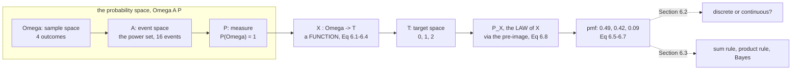

The book gives a warning at the start of §6.1 that is worth quoting in full,
because it is the reason this page exists:

> Some machine learning texts on probabilistic models use lazy notation and
> jargon, which is confusing. This text is no exception. Multiple distinct
> concepts are all referred to as "probability distribution", and the reader has
> to often disentangle the meaning from the context.

So this page does the opposite. There are **three distinct objects** here, plus a
fourth that maps between them, and the whole difficulty of §6.1 is that everyday
usage blurs all four into the word "probability". Once they are separate, nothing
in the rest of the chapter is hard.

## What you'll learn

- The three components of a **probability space** $(\Omega, \mathcal{A}, P)$ —
  and why machine learning almost never writes any of them down.
- Why a **random variable** is *"neither random nor a variable. It is a
  function."*
- **Equation 6.8**: the law $P_X$ of a random variable, defined through the
  **pre-image** — the one piece of §6.1 that is genuinely a definition rather
  than a name.
- **Example 6.1** in full, with all of Equations 6.1 to 6.7, and the reason
  $P(X=1) = 0.42$ rather than $0.21$.
- The **Cox–Jaynes** criteria, and what "probability generalises Boolean logic"
  buys you.
- **Bayesian versus frequentist**, with the frequentist limit measured rather
  than described.
- Why §6.1.3's distinction between **probability and statistics** is the
  distinction between the rest of this chapter and the rest of the book.

## Intuition: three objects, not one

You are at a funfair. A bag holds US and UK coins; you draw one, put it back,
draw again. Someone asks "what is the probability of getting one dollar coin?"

Four different things are hiding in that question.

1. **What could happen.** Four things: `$$`, `$£`, `£$`, `££`. That list is the
   **sample space** $\Omega$.
2. **What you could ask about.** "At least one dollar." "Both the same." "Nothing
   at all." Each question is a *subset* of $\Omega$, and the collection of
   permitted questions is the **event space** $\mathcal{A}$.
3. **How likely each thing is.** A number for each event. That is the
   **probability measure** $P$.
4. **What you actually care about.** Not the pair of coins — the *count* of
   dollar coins: $0$, $1$ or $2$. Turning outcomes into the number you care about
   is the **random variable** $X$, and the probabilities it inherits are its
   **law** $P_X$.

The count is where the trouble starts. Two different outcomes — `$£` and `£$` —
both give a count of $1$. The random variable *collapses* them, and $P_X$ has to
add their probabilities back together. That single fact is what Equation 6.8 is
for, and it is why $P_X$ is not $P$.



## The math

### 6.1.1 Why probability at all

The book's motivation is not "we need to count things". It is that **Boolean
logic is not enough for plausible reasoning**. Its example: you are waiting for a
friend, and consider three hypotheses — $H_1$, she is on time; $H_2$, she is
delayed by traffic; $H_3$, she has been abducted by aliens.

She is late. Logic forces you to rule out $H_1$ and says *nothing whatever* about
the other two. But you do not treat them equally, and you are right not to. That
extra move — $H_2$ became more plausible, $H_3$ stayed absurd — is not available
in classical logic.

E. T. Jaynes identified three criteria any notion of plausibility must satisfy:

1. Degrees of plausibility are represented by **real numbers**.
2. Those numbers must agree with **common sense**.
3. The reasoning must be **consistent**, in three senses: *non-contradiction*
   (the same result reached two ways gets the same value), *honesty* (all
   available data is used), and *reproducibility* (equal states of knowledge give
   equal plausibilities).

The **Cox–Jaynes theorem** then says these are *sufficient* to pin down the rules
of plausibility uniquely, up to an arbitrary monotonic transformation — and those
rules are exactly the rules of probability. Probability is not one option for
reasoning under uncertainty; it is the only one that satisfies those three
requirements.

:::note[Bayesian and frequentist, in one paragraph]
The book's Remark: the **Bayesian** interpretation uses probability to express
*degree of belief* — how uncertain a particular person is about an event. The
**frequentist** interpretation defines the probability of an event as its
*relative frequency* in the limit of infinite data. The mathematics below is
identical under both readings; they disagree about what the numbers *mean*, not
about how they combine. The [frequentist limit is measured](#on-real-data) further
down, and the phrase "in the limit" turns out to be doing a lot of work.
:::

### 6.1.2 The probability space

Three objects, in the order they have to be built.

**The sample space $\Omega$** — the set of all possible outcomes of the
experiment. For two coin tosses, $\Omega = \{hh, ht, th, tt\}$.

**The event space $\mathcal{A}$** — the space of *potential results*. A subset
$A \subseteq \Omega$ belongs to $\mathcal{A}$ if, at the end of the experiment,
you can observe whether the outcome $\omega$ is in $A$. For discrete
distributions $\mathcal{A}$ is often the **power set** of $\Omega$.

**The probability $P$** — with each event $A \in \mathcal{A}$ we associate a
number $P(A)$ measuring the probability, or degree of belief, that the event
occurs. It satisfies $P(A) \in [0,1]$ and $P(\Omega) = 1$.

Together $(\Omega, \mathcal{A}, P)$ is the **probability space**, and it is the
Kolmogorov construction.

:::caution[The power set is not an option for continuous spaces]
If $\lvert\Omega\rvert = n$ then the power set has $2^n$ elements. Measured:
$\lvert\Omega\rvert = 4$ gives $16$; $\lvert\Omega\rvert = 20$ gives $1\,048\,576$;
$\lvert\Omega\rvert = 256$ gives $1.15\times10^{77}$, more than the number of
atoms in the observable universe. For $\Omega = \mathbb{R}$ it is worse than
large — it is *impossible*: there is no way to assign a consistent probability to
every subset of the reals. This is why measure theory restricts $\mathcal{A}$ to a
**σ-algebra** of measurable sets, and it is the one place in this chapter where
the machinery is not just bureaucracy.
:::

### The random variable, and the sentence to remember

In machine learning we rarely refer to $\Omega$ at all. Instead we work with
quantities of interest in a **target space** $\mathcal{T}$, whose elements are
called **states**, and we get there through a function

$$
X : \Omega \to \mathcal{T}
$$

called a **random variable**. The book puts a warning in the margin, and it is the
single most useful sentence in §6.1:

> The name "random variable" is a great source of misunderstanding as it is
> neither random nor is it a variable. It is a function.

For a finite $\Omega$ and finite $\mathcal{T}$, that function is *literally a
lookup table*. Nothing more.

### Equation 6.8: the law, through the pre-image

Here is the definition everything rests on. For $S \subseteq \mathcal{T}$, let
$X^{-1}(S)$ be the **pre-image** of $S$ — the set of outcomes that $X$ sends into
$S$:

$$
X^{-1}(S) = \{\omega \in \Omega : X(\omega) \in S\}
$$

Then

$$
P_X(S) = P(X \in S) = P\bigl(X^{-1}(S)\bigr) = P\bigl(\{\omega \in \Omega : X(\omega) \in S\}\bigr)
\tag{6.8}
$$

Read the two ends. The left-hand side is a probability about the *thing you care
about* ("the count is 1"). The right-hand side is a probability about *outcomes*
("the draws were `$£` or `£$`"). Equation 6.8 says: to get the first, collect
every outcome that produces it and add up their measures.

$P_X$ — equivalently $P \circ X^{-1}$ — is called the **law** or **distribution**
of $X$.

:::tip[Why the pre-image, and not a formula]
Because $X$ need not be injective. If every state had exactly one outcome behind
it, $P_X$ would just be a relabelling of $P$ and nobody would need a definition.
The pre-image is there to handle the case where several outcomes collapse to the
same state — which is the normal case, and the case in Example 6.1.
:::

### 6.1.3 Probability and statistics are opposite directions

The book's framing, which is worth internalising early:

- **Probability**: the model is known. The uncertainty is captured by random
  variables, and you use the rules of probability to derive what happens.
- **Statistics**: something has *already happened*. You try to figure out the
  underlying process that explains the observation.

Chapter 6 is almost entirely the first. Chapters 8 onwards are almost entirely
the second. The measured comparison at the end of the
[from-scratch section](#from-scratch) makes the asymmetry concrete: deriving the
pmf from $p = 0.3$ is exact and instant; recovering $p$ from data is neither.

## Worked example by hand

The book's **Example 6.1**. A funfair game: draw two coins from a bag *with
replacement*. The bag holds US dollars (`$`) and UK pounds (`£`), and a draw
returns `$` with probability $0.3$.

**Step 1 — the sample space.** Two ordered draws, two possibilities each:

$$
\Omega = \bigl\{(\mathdollar,\mathdollar),\ (\mathdollar,\pounds),\ (\pounds,\mathdollar),\ (\pounds,\pounds)\bigr\}
$$

Four outcomes. Note $(\mathdollar,\pounds)$ and $(\pounds,\mathdollar)$ are *different outcomes* —
order is part of the outcome, even though we are about to throw it away.

**Step 2 — the measure on $\Omega$.** The draws are independent (we replaced the
first coin), so each outcome's probability is a product:

| $\omega$ | $P(\omega)$ | value |
|---|---|---|
| $(\mathdollar,\mathdollar)$ | $0.3 \times 0.3$ | $0.09$ |
| $(\mathdollar,\pounds)$ | $0.3 \times 0.7$ | $0.21$ |
| $(\pounds,\mathdollar)$ | $0.7 \times 0.3$ | $0.21$ |
| $(\pounds,\pounds)$ | $0.7 \times 0.7$ | $0.49$ |

Sum: $0.09 + 0.21 + 0.21 + 0.49 = 1$. Good — that is $P(\Omega) = 1$.

**Step 3 — the random variable.** We care about the number of `$` drawn, so
$\mathcal{T} = \{0,1,2\}$ and $X$ is the lookup table of Equations 6.1 to 6.4:

$$
X\bigl((\mathdollar,\mathdollar)\bigr) = 2
\tag{6.1}
$$

$$
X\bigl((\mathdollar,\pounds)\bigr) = 1
\tag{6.2}
$$

$$
X\bigl((\pounds,\mathdollar)\bigr) = 1
\tag{6.3}
$$

$$
X\bigl((\pounds,\pounds)\bigr) = 0
\tag{6.4}
$$

**Step 4 — apply Equation 6.8, one state at a time.**

$X = 2$. The pre-image is a single outcome:

$$
P(X = 2) = P\bigl((\mathdollar,\mathdollar)\bigr) = P(\mathdollar)\cdot P(\mathdollar) = 0.3 \cdot 0.3 = 0.09
\tag{6.5}
$$

$X = 1$. **The pre-image has two elements**, and they are disjoint, so the
measures add:

$$
P(X = 1) = P\bigl((\mathdollar,\pounds) \cup (\pounds,\mathdollar)\bigr) = P\bigl((\mathdollar,\pounds)\bigr) + P\bigl((\pounds,\mathdollar)\bigr) = 0.3\cdot0.7 + 0.7\cdot0.3 = 0.42
\tag{6.6}
$$

$X = 0$. One outcome again:

$$
P(X = 0) = P\bigl((\pounds,\pounds)\bigr) = 0.7 \cdot 0.7 = 0.49
\tag{6.7}
$$

**Step 5 — check.** $0.09 + 0.42 + 0.49 = 1.00$. The law of $X$ is a probability
distribution on $\mathcal{T}$, as it must be.

| state | pre-image | size | $P_X$ |
|---|---|---|---|
| $0$ | $\{(\pounds,\pounds)\}$ | 1 | $0.49$ |
| $1$ | $\{(\mathdollar,\pounds), (\pounds,\mathdollar)\}$ | **2** | $0.42$ |
| $2$ | $\{(\mathdollar,\mathdollar)\}$ | 1 | $0.09$ |

The `2` in that table is the whole lesson. Every implementation bug in this
chapter is some version of forgetting it.

:::danger[Two shortcuts, both wrong, both tempting]
**"Every state is equally likely."** That gives $\tfrac13$ each against the true
$0.49, 0.42, 0.09$ — worst error $0.243$, which is **49.7%** of the largest true
probability.

**"Every outcome in $\Omega$ is equally likely, so count outcomes."** That gives
$0.25, 0.50, 0.25$ — worst error $0.240$, or **49.0%**. This one is more dangerous
because it is *sometimes right*: measured across $p$, it is exact at $p = 0.5$
(gap $0.0000$) and wrong everywhere else (gap $0.2400$ at both $p = 0.3$ and
$p = 0.7$). A shortcut that works on your fair-coin test case and fails in
production is worse than one that never works.
:::

## See it move

```p5 title="Omega, X, and the pre-image" desc="Drag the bias p and watch the four outcome measures and the three state probabilities move together. Click a state on the right to highlight its pre-image on the left: the state's probability is always the sum of the highlighted measures, which is Equation 6.8 with the arithmetic shown. Set p to 0.5 to see the moment the outcome-counting shortcut becomes accidentally correct." height="600"
let pDollar = 0.3, picked = 1;
let KNOBS = [], BTNS = [], dragging = null;

const OMEGA = [["$", "$"], ["$", "GBP"], ["GBP", "$"], ["GBP", "GBP"]];
const XOF = [2, 1, 1, 0];
const STATES = [2, 1, 0];

function setup() { createCanvas(600, 600); textFont("monospace"); noLoop(); }

function measure(i) {
  let v = 1;
  for (const c of OMEGA[i]) v *= (c === "$" ? pDollar : 1 - pDollar);
  return v;
}
function pmf(t) {
  let s = 0;
  for (let i = 0; i < 4; i++) if (XOF[i] === t) s += measure(i);
  return s;
}

function knob(id, x, y, w, value, mn, mx, label) {
  KNOBS.push({ id, x, y, w, mn, mx });
  const t = (value - mn) / (mx - mn);
  stroke(60, 74, 92); strokeWeight(2); line(x, y, x + w, y);
  noStroke(); fill(255, 211, 67); ellipse(x + t * w, y, 10, 10);
  fill(190, 200, 212); textSize(11); textAlign(LEFT, CENTER);
  text(label, x + w + 12, y);
}

function mousePressed() {
  for (const b of BTNS)
    if (mouseX > b.x && mouseX < b.x + b.w && mouseY > b.y && mouseY < b.y + b.h) {
      picked = b.t; redraw(); return;
    }
  for (const k of KNOBS)
    if (mouseY > k.y - 11 && mouseY < k.y + 11 && mouseX > k.x - 11 && mouseX < k.x + k.w + 11) {
      dragging = k; return;
    }
}
function mouseReleased() { dragging = null; }
function mouseDragged() {
  if (!dragging) return;
  const t = Math.min(1, Math.max(0, (mouseX - dragging.x) / dragging.w));
  pDollar = Math.round((dragging.mn + t * (dragging.mx - dragging.mn)) * 100) / 100;
  redraw();
}

function draw() {
  background(13, 17, 23);
  KNOBS = []; BTNS = [];

  noStroke(); textAlign(LEFT, TOP);
  fill(255, 211, 67); textSize(15);
  text("Equation 6.8, with the arithmetic shown", 16, 12);
  fill(200, 210, 222); textSize(11);
  text("click a state on the right to highlight its pre-image on the left", 16, 34);

  fill(150); textSize(11); textAlign(LEFT, BOTTOM);
  text("Omega  (outcomes)", 40, 68);
  text("T  (states)", 400, 68);

  // Left column: the four outcomes.
  const oy = [78, 148, 218, 288];
  for (let i = 0; i < 4; i++) {
    const inPre = XOF[i] === picked;
    noStroke();
    fill(inPre ? color(30, 62, 44) : color(24, 30, 40));
    rect(40, oy[i], 210, 56, 5);
    noFill(); stroke(inPre ? color(120, 200, 150) : color(52, 64, 78));
    strokeWeight(inPre ? 2 : 1); rect(40, oy[i], 210, 56, 5);
    noStroke(); fill(inPre ? 245 : 175); textSize(13); textAlign(LEFT, CENTER);
    text(`(${OMEGA[i][0]}, ${OMEGA[i][1]})`, 54, oy[i] + 20);
    fill(inPre ? color(120, 200, 150) : color(130, 140, 155)); textSize(12);
    text(`P = ${measure(i).toFixed(4)}`, 54, oy[i] + 40);
    // the arrow
    stroke(inPre ? color(120, 200, 150) : color(60, 74, 92));
    strokeWeight(inPre ? 2.2 : 1.2);
    const ty = 100 + STATES.indexOf(XOF[i]) * 78;
    line(252, oy[i] + 28, 396, ty + 26);
  }

  // Right column: the three states.
  for (let s = 0; s < 3; s++) {
    const t = STATES[s], y = 100 + s * 78;
    const on = t === picked;
    BTNS.push({ x: 398, y, w: 168, h: 52, t });
    noStroke(); fill(on ? color(52, 44, 12) : color(24, 30, 40));
    rect(398, y, 168, 52, 5);
    noFill(); stroke(on ? color(255, 211, 67) : color(52, 64, 78));
    strokeWeight(on ? 2 : 1); rect(398, y, 168, 52, 5);
    noStroke(); fill(on ? 245 : 175); textSize(13); textAlign(LEFT, CENTER);
    text(`X = ${t}`, 412, y + 17);
    fill(on ? color(255, 211, 67) : color(130, 140, 155)); textSize(13);
    text(`P_X = ${pmf(t).toFixed(4)}`, 412, y + 36);
  }

  // The arithmetic for the picked state.
  const terms = [];
  for (let i = 0; i < 4; i++) if (XOF[i] === picked) terms.push(measure(i).toFixed(4));
  noStroke(); fill(19, 25, 33); rect(40, 356, 526, 62, 5);
  fill(120, 200, 150); textSize(12); textAlign(LEFT, TOP);
  text(`P(X = ${picked})  =  P(X^-1({${picked}}))  =  ${terms.join("  +  ")}`, 54, 368);
  fill(235); textSize(13);
  text(`=  ${pmf(picked).toFixed(6)}      (pre-image has ${terms.length} element${terms.length > 1 ? "s" : ""})`, 54, 392);

  // The two wrong shortcuts, live.
  const uniT = 1 / 3;
  let counts = [0, 0, 0];
  for (let i = 0; i < 4; i++) counts[XOF[i]]++;
  let eT = 0, eO = 0;
  for (const t of [0, 1, 2]) {
    eT = Math.max(eT, Math.abs(pmf(t) - uniT));
    eO = Math.max(eO, Math.abs(pmf(t) - counts[t] / 4));
  }
  fill(150); textSize(11); textAlign(LEFT, TOP);
  text("the two shortcuts, at this p:", 40, 432);
  fill(232, 110, 110); textSize(11.5);
  text(`"all states equally likely" (1/3 each)      worst error ${eT.toFixed(4)}`, 40, 452);
  fill(eO < 1e-9 ? color(120, 200, 150) : color(232, 110, 110)); textSize(11.5);
  text(`"count outcomes in Omega" (0.25/0.50/0.25)  worst error ${eO.toFixed(4)}`
     + (eO < 1e-9 ? "   <- exact, but only here" : ""), 40, 472);

  // Total, as a check.
  const tot = pmf(0) + pmf(1) + pmf(2);
  fill(150); textSize(11);
  text(`sum of the pmf: ${tot.toFixed(10)}`, 40, 500);

  knob("p", 40, 540, 200, pDollar, 0, 1, `p(draw returns $) = ${pDollar.toFixed(2)}`);
  fill(120, 130, 145); textSize(10.5); textAlign(LEFT, TOP);
  text("Example 6.1 uses p = 0.30. Try p = 0.50 and watch the second", 40, 566);
  text("shortcut become exact -- that is the trap.", 40, 581);
}
```

```p5 title="The frequentist limit, one draw at a time" desc="The frequentist definition of P is a limit of relative frequencies. This runs the funfair game and plots the three running frequencies against the true values. Reset with a new seed to see how differently the first hundred draws can behave — the definition says 'in the limit', and this is what the approach to it looks like." height="560"
let N = 0, seed = 1, counts = [0, 0, 0], hist = [[], [], []];
let BTNS = [], speed = 40;
const P_DOLLAR = 0.3;
const TRUE = [0.49, 0.42, 0.09];
const MAXN = 4000;

// A small deterministic generator, so a given seed always replays identically.
let state = 1;
function srand() {
  state = (state * 1103515245 + 12345) & 0x7fffffff;
  return state / 0x7fffffff;
}

function reset(s) {
  seed = s; state = s * 7919 + 1;
  N = 0; counts = [0, 0, 0]; hist = [[], [], []];
}

function setup() { createCanvas(600, 560); textFont("monospace"); reset(1); frameRate(30); }

function mousePressed() {
  for (const b of BTNS)
    if (mouseX > b.x && mouseX < b.x + b.w && mouseY > b.y && mouseY < b.y + b.h) {
      if (b.act === "seed") reset(seed + 1);
      if (b.act === "restart") reset(seed);
      if (b.act === "slow") speed = speed === 40 ? 4 : 40;
      return;
    }
}

function step() {
  const a = srand() < P_DOLLAR ? 1 : 0;
  const b = srand() < P_DOLLAR ? 1 : 0;
  counts[a + b]++; N++;
  if (N % 2 === 0 || N < 200)
    for (let t = 0; t < 3; t++) hist[t].push([N, counts[t] / N]);
}

function draw() {
  background(13, 17, 23);
  BTNS = [];
  if (N < MAXN) for (let i = 0; i < speed; i++) if (N < MAXN) step();

  const PL = { x: 60, y: 70, w: 500, h: 300 };
  noStroke(); fill(19, 25, 33); rect(PL.x, PL.y, PL.w, PL.h, 4);

  const sx = (n) => PL.x + (Math.log10(Math.max(n, 1)) / Math.log10(MAXN)) * PL.w;
  const sy = (v) => PL.y + PL.h - (v / 0.8) * PL.h;

  // True values, dotted.
  const COL = [[107, 169, 221], [120, 200, 150], [197, 153, 255]];
  stroke(60, 74, 92); strokeWeight(1);
  for (const g of [0, 0.2, 0.4, 0.6, 0.8]) line(PL.x, sy(g), PL.x + PL.w, sy(g));
  for (let t = 0; t < 3; t++) {
    stroke(COL[t][0], COL[t][1], COL[t][2], 130);
    strokeWeight(1.4); drawingContext.setLineDash([4, 4]);
    line(PL.x, sy(TRUE[t]), PL.x + PL.w, sy(TRUE[t]));
    drawingContext.setLineDash([]);
  }

  // Running frequencies.
  for (let t = 0; t < 3; t++) {
    stroke(COL[t][0], COL[t][1], COL[t][2]); strokeWeight(1.8); noFill();
    beginShape();
    for (const [n, v] of hist[t]) vertex(sx(n), sy(v));
    endShape();
  }

  noStroke(); fill(120, 130, 145); textSize(10); textAlign(CENTER, TOP);
  for (const n of [1, 10, 100, 1000, MAXN]) text(String(n), sx(n), PL.y + PL.h + 6);
  textAlign(RIGHT, CENTER);
  for (const g of [0, 0.2, 0.4, 0.6, 0.8]) text(g.toFixed(1), PL.x - 8, sy(g));

  textAlign(LEFT, TOP);
  fill(255, 211, 67); textSize(15);
  text("relative frequency -> P, on a log axis", 16, 12);
  fill(200, 210, 222); textSize(11);
  text("dotted: the true values 0.49, 0.42, 0.09. Solid: what the data says so far.", 16, 34);

  fill(235); textSize(12);
  text(`draws: ${N}`, 16, 392);
  let worst = 0;
  for (let t = 0; t < 3; t++)
    worst = Math.max(worst, Math.abs((N ? counts[t] / N : 0) - TRUE[t]));
  for (let t = 0; t < 3; t++) {
    fill(COL[t][0], COL[t][1], COL[t][2]); textSize(11.5);
    const est = N ? counts[t] / N : 0;
    text(`P(X=${t})  true ${TRUE[t].toFixed(4)}   observed ${est.toFixed(4)}`
       + `   off by ${Math.abs(est - TRUE[t]).toFixed(4)}`, 16, 414 + t * 18);
  }
  fill(255, 211, 67); textSize(12);
  text(`worst error ${worst.toFixed(4)}      1/sqrt(N) = ${N ? (1 / Math.sqrt(N)).toFixed(4) : "-"}`, 16, 474);
  fill(150); textSize(10.5);
  text("the error tracks 1/sqrt(N): a hundred times more data for one more", 16, 496);
  text("decimal place. That is the price of the frequentist limit.", 16, 511);

  const labels = [["new seed", "seed"], ["replay this seed", "restart"],
                  [speed === 40 ? "slow down" : "speed up", "slow"]];
  for (let i = 0; i < labels.length; i++) {
    const x = 16 + i * 150, y = 532;
    BTNS.push({ x, y, w: 142, h: 22, act: labels[i][1] });
    noStroke(); fill(38, 48, 60); rect(x, y, 142, 22, 4);
    fill(205); textSize(10.5); textAlign(CENTER, CENTER);
    text(labels[i][0], x + 71, y + 11);
  }
  fill(120, 130, 145); textSize(10); textAlign(LEFT, CENTER);
  text(`seed ${seed}`, 16 + 3 * 150, 543);
}
```

## From scratch

Build the whole space, verify Kolmogorov's axioms on every event, then apply
Equation 6.8. Nothing here assumes the answer.

```python title="probability_space.py" showLineNumbers{1}
"""§6.1 — the probability space, Example 6.1, and Equation 6.8's pre-image."""

import itertools
import math

import numpy as np

np.set_printoptions(precision=6, suppress=True, linewidth=140)

P_DOLLAR = 0.3

print("########## the_three_objects")
# Omega: the sample space. Two draws with replacement, so ordered pairs.
OMEGA = list(itertools.product(["$", "GBP"], repeat=2))
print(f"sample space Omega = {OMEGA}")
print(f"  |Omega| = {len(OMEGA)}")

# A: the event space. For a discrete space, the POWER SET of Omega.
EVENTS = []
for r in range(len(OMEGA) + 1):
    EVENTS.extend(itertools.combinations(OMEGA, r))
print(f"event space A = the power set, |A| = 2^{len(OMEGA)} = {len(EVENTS)}")

# P: the probability measure on Omega. Independent draws, so a product.
def p_outcome(o):
    return math.prod(P_DOLLAR if c == "$" else 1 - P_DOLLAR for c in o)


P = {o: p_outcome(o) for o in OMEGA}
for o in OMEGA:
    print(f"  P({o}) = {P[o]:.4f}")
print(f"  sum = {sum(P.values()):.10f}")

print()
print("########## kolmogorov_axioms")
# Checked on every one of the 16 events, not asserted.
def p_event(A):
    return sum(P[o] for o in A)


nonneg = all(p_event(A) >= 0 for A in EVENTS)
unit = abs(p_event(tuple(OMEGA)) - 1.0)
# Additivity: for every disjoint pair, P(A u B) = P(A) + P(B).
worst_add = 0.0
pairs = 0
for A in EVENTS:
    for B in EVENTS:
        if set(A) & set(B):
            continue
        pairs += 1
        union = tuple(sorted(set(A) | set(B)))
        worst_add = max(worst_add, abs(p_event(union) - p_event(A) - p_event(B)))
print(f"  1. P(A) >= 0 for all {len(EVENTS)} events: {nonneg}")
print(f"  2. P(Omega) = 1: off by {unit:.1e}")
print(f"  3. additive on {pairs} disjoint pairs: worst gap {worst_add:.1e}")

print()
print("########## example_6_1")
# X: Omega -> T, the random variable. A lookup table, exactly as the book says.
X = {("$", "$"): 2, ("$", "GBP"): 1, ("GBP", "$"): 1, ("GBP", "GBP"): 0}
T = sorted(set(X.values()))
print("the random variable X, as the lookup table of Eq 6.1-6.4:")
for o in OMEGA:
    print(f"  X({o}) = {X[o]}")
print(f"target space T = {T}")
print()
# Eq 6.8: P_X(S) = P(X^-1(S)). Compute it that way, not by a formula.
print("Eq 6.8, via the PRE-IMAGE:  P_X(S) = P({omega : X(omega) in S})")
pmf = {}
for t in T:
    preimage = tuple(o for o in OMEGA if X[o] == t)
    pmf[t] = p_event(preimage)
    print(f"  X^-1({{{t}}}) = {preimage}")
    print(f"    P(X = {t}) = {pmf[t]:.4f}")
print(f"  sum of the pmf = {sum(pmf.values()):.10f}")
print()
print("against the book's Eq 6.5-6.7:")
book = {2: 0.09, 1: 0.42, 0: 0.49}
for t in (2, 1, 0):
    print(f"  P(X = {t}): computed {pmf[t]:.10f}   book {book[t]:.2f}"
          f"   gap {abs(pmf[t] - book[t]):.1e}")

print()
print("########## X_is_not_injective")
counts = {t: sum(1 for o in OMEGA if X[o] == t) for t in T}
print("  outcomes mapping to each state:")
for t in T:
    print(f"    X = {t}: {counts[t]} outcome(s)")
print("  X = 1 has TWO pre-images, which is the entire reason P_X is not P.")
print("  A random variable is a function, and a function may collapse outcomes.")

print()
print("########## two_wrong_shortcuts")
# Wrong 1: assume every element of the TARGET space is equally likely.
naive_T = {t: 1 / len(T) for t in T}
# Wrong 2: assume every element of Omega is equally likely (true only at p = 0.5).
naive_O = {t: counts[t] / len(OMEGA) for t in T}
print(f"  {'state':>6}  {'correct':>10}  {'uniform on T':>13}  {'uniform on Omega':>17}")
for t in (0, 1, 2):
    print(f"  {t:>6}  {pmf[t]:>10.4f}  {naive_T[t]:>13.4f}  {naive_O[t]:>17.4f}")
e1 = max(abs(pmf[t] - naive_T[t]) for t in T)
e2 = max(abs(pmf[t] - naive_O[t]) for t in T)
print(f"  worst error, uniform on T:      {e1:.4f}  ({e1 / max(pmf.values()):.1%} of the largest true value)")
print(f"  worst error, uniform on Omega:  {e2:.4f}  ({e2 / max(pmf.values()):.1%})")
print("  'uniform on Omega' is right only when the coin is fair. Check:")
for p in (0.3, 0.5, 0.7):
    pm = {}
    for t in T:
        pm[t] = sum(math.prod(p if c == "$" else 1 - p for c in o)
                    for o in OMEGA if X[o] == t)
    gap = max(abs(pm[t] - counts[t] / len(OMEGA)) for t in T)
    print(f"    p = {p}: worst gap against uniform-on-Omega {gap:.4f}")

print()
print("########## the_frequentist_limit")
# The frequentist reading of P, made concrete: relative frequency as N grows.
rng = np.random.default_rng(6)
print("  simulate the funfair game and count. The pmf is not assumed anywhere.")
print(f"  {'draws N':>10}  {'P(X=0)':>9}  {'P(X=1)':>9}  {'P(X=2)':>9}  {'max error':>10}  {'1/sqrt(N)':>10}")
for N in (10, 100, 1_000, 10_000, 100_000, 1_000_000):
    draws = rng.random((N, 2)) < P_DOLLAR
    k = draws.sum(axis=1)
    emp = {t: float((k == t).mean()) for t in T}
    err = max(abs(emp[t] - pmf[t]) for t in T)
    print(f"  {N:>10,}  {emp[0]:>9.5f}  {emp[1]:>9.5f}  {emp[2]:>9.5f}"
          f"  {err:>10.5f}  {1 / math.sqrt(N):>10.5f}")
print("  the error tracks 1/sqrt(N), which is the rate every Monte Carlo estimate")
print("  pays and the reason 'infinite data' in the frequentist definition matters.")

print()
print("########## power_set_blows_up")
print("  the event space is the power set, so |A| = 2^|Omega|:")
print(f"  {'|Omega|':>9}  {'|A| = 2^|Omega|':>28}")
for n in (2, 4, 10, 20, 64, 256):
    v = 2 ** n
    s = str(v)
    shown = s if len(s) <= 22 else f"{s[0]}.{s[1:3]}e+{len(s) - 1}"
    print(f"  {n:>9}  {shown:>28}")
print("  at |Omega| = 256 the power set has more elements than there are atoms in")
print("  the observable universe, which is why continuous spaces do NOT use it --")
print("  they use a sigma-algebra of measurable sets instead.")

print()
print("########## probability_vs_statistics")
# The book's contrast, as a number: given data, how many draws to tell p = 0.3
# from p = 0.5? A likelihood-ratio test, measured rather than derived.
print("  PROBABILITY: p is known, derive the pmf.  Done above.")
print("  STATISTICS:  the pmf is observed, infer p.  How much data does that take?")
rng2 = np.random.default_rng(11)
TRIALS = 4000
print(f"  {'draws':>7}  {'MLE mean':>9}  {'MLE sd':>8}  {'P(prefer p=0.3 over p=0.5)':>28}")
for N in (5, 10, 25, 50, 100, 400):
    x = rng2.random((TRIALS, N)) < P_DOLLAR
    khat = x.mean(axis=1)
    # log-likelihood ratio between the two candidate values of p
    ll = lambda p: x.sum(axis=1) * np.log(p) + (N - x.sum(axis=1)) * np.log(1 - p)
    prefer = float((ll(0.3) > ll(0.5)).mean())
    print(f"  {N:>7}  {khat.mean():>9.4f}  {khat.std():>8.4f}  {prefer:>28.4f}")
print("  the MLE is unbiased at every N, but its SPREAD is what decides whether")
print("  you can tell the two hypotheses apart -- and that is a statistics question,")
print("  not a probability one.")
```

```text title="output"
########## the_three_objects
sample space Omega = [('$', '$'), ('$', 'GBP'), ('GBP', '$'), ('GBP', 'GBP')]
  |Omega| = 4
event space A = the power set, |A| = 2^4 = 16
  P(('$', '$')) = 0.0900
  P(('$', 'GBP')) = 0.2100
  P(('GBP', '$')) = 0.2100
  P(('GBP', 'GBP')) = 0.4900
  sum = 1.0000000000

########## kolmogorov_axioms
  1. P(A) >= 0 for all 16 events: True
  2. P(Omega) = 1: off by 0.0e+00
  3. additive on 81 disjoint pairs: worst gap 1.1e-16

########## example_6_1
the random variable X, as the lookup table of Eq 6.1-6.4:
  X(('$', '$')) = 2
  X(('$', 'GBP')) = 1
  X(('GBP', '$')) = 1
  X(('GBP', 'GBP')) = 0
target space T = [0, 1, 2]

Eq 6.8, via the PRE-IMAGE:  P_X(S) = P({omega : X(omega) in S})
  X^-1({0}) = (('GBP', 'GBP'),)
    P(X = 0) = 0.4900
  X^-1({1}) = (('$', 'GBP'), ('GBP', '$'))
    P(X = 1) = 0.4200
  X^-1({2}) = (('$', '$'),)
    P(X = 2) = 0.0900
  sum of the pmf = 1.0000000000

against the book's Eq 6.5-6.7:
  P(X = 2): computed 0.0900000000   book 0.09   gap 0.0e+00
  P(X = 1): computed 0.4200000000   book 0.42   gap 0.0e+00
  P(X = 0): computed 0.4900000000   book 0.49   gap 5.6e-17

########## X_is_not_injective
  outcomes mapping to each state:
    X = 0: 1 outcome(s)
    X = 1: 2 outcome(s)
    X = 2: 1 outcome(s)
  X = 1 has TWO pre-images, which is the entire reason P_X is not P.
  A random variable is a function, and a function may collapse outcomes.

########## two_wrong_shortcuts
   state     correct   uniform on T   uniform on Omega
       0      0.4900         0.3333             0.2500
       1      0.4200         0.3333             0.5000
       2      0.0900         0.3333             0.2500
  worst error, uniform on T:      0.2433  (49.7% of the largest true value)
  worst error, uniform on Omega:  0.2400  (49.0%)
  'uniform on Omega' is right only when the coin is fair. Check:
    p = 0.3: worst gap against uniform-on-Omega 0.2400
    p = 0.5: worst gap against uniform-on-Omega 0.0000
    p = 0.7: worst gap against uniform-on-Omega 0.2400

########## the_frequentist_limit
  simulate the funfair game and count. The pmf is not assumed anywhere.
     draws N     P(X=0)     P(X=1)     P(X=2)   max error   1/sqrt(N)
          10    0.60000    0.30000    0.10000     0.12000     0.31623
         100    0.47000    0.49000    0.04000     0.07000     0.10000
       1,000    0.49800    0.42000    0.08200     0.00800     0.03162
      10,000    0.48330    0.42360    0.09310     0.00670     0.01000
     100,000    0.48940    0.42100    0.08960     0.00100     0.00316
   1,000,000    0.49081    0.41936    0.08983     0.00081     0.00100
  the error tracks 1/sqrt(N), which is the rate every Monte Carlo estimate
  pays and the reason 'infinite data' in the frequentist definition matters.

########## power_set_blows_up
  the event space is the power set, so |A| = 2^|Omega|:
    |Omega|               |A| = 2^|Omega|
          2                             4
          4                            16
         10                          1024
         20                       1048576
         64          18446744073709551616
        256                      1.15e+77
  at |Omega| = 256 the power set has more elements than there are atoms in
  the observable universe, which is why continuous spaces do NOT use it --
  they use a sigma-algebra of measurable sets instead.

########## probability_vs_statistics
  PROBABILITY: p is known, derive the pmf.  Done above.
  STATISTICS:  the pmf is observed, infer p.  How much data does that take?
    draws   MLE mean    MLE sd    P(prefer p=0.3 over p=0.5)
        5     0.3068    0.2073                        0.5142
       10     0.2996    0.1457                        0.6492
       25     0.2992    0.0936                        0.8095
       50     0.2992    0.0640                        0.9197
      100     0.2995    0.0452                        0.9815
      400     0.2996    0.0229                        1.0000
  the MLE is unbiased at every N, but its SPREAD is what decides whether
  you can tell the two hypotheses apart -- and that is a statistics question,
  not a probability one.
```

Three things in that output are worth stopping on.

**The axioms are checked, not asserted.** Non-negativity on all $16$ events,
$P(\Omega) = 1$ exactly, and additivity across all $81$ disjoint pairs to
$1.1\times10^{-16}$. That is what it means for $(\Omega, \mathcal{A}, P)$ to *be*
a probability space rather than to be called one.

**The pre-image is computed.** `X^-1({1})` comes out as
`(('$', 'GBP'), ('GBP', '$'))` — the code finds the two outcomes rather than
being told there are two, and $P(X=1)$ is then their sum.

**The MLE is unbiased at every sample size but useless at small ones.** At
$N = 5$ the mean estimate of $p$ is $0.3068$ — essentially correct — yet the
probability of preferring the true $p = 0.3$ over the wrong $p = 0.5$ is
$0.5142$, barely better than guessing. Unbiasedness is about the *average* over
repetitions; what you have is *one* sample, and its spread is what decides
anything. That gap is the whole subject of statistics.

## On real data

<Figure
  src="/images/mml/construction-of-a-probability-space/probability-space-three-objects"
  alt="Left, four boxed outcomes on the left connected by arrows to three boxed states on the right, with the two arrows into the middle state highlighted. Right, a three-bar chart of the resulting probability mass function."
  title="The pre-image of Equation 6.8, drawn"
  caption="Every outcome of Omega carries a measure; every arrow is one value of the lookup table X. The middle state has TWO arrows into it, so its probability is 0.21 + 0.21 = 0.42 while each of the other states gets a single measure. That collapse is the entire content of Equation 6.8 and the reason the law of X is a different object from P."
/>

<Figure
  src="/images/mml/construction-of-a-probability-space/frequentist-convergence"
  alt="Left, a log-log plot of the worst pmf error against the number of draws with a shaded percentile band and a one-over-root-N reference line. Right, three running relative frequencies on a log x-axis converging toward dotted true values."
  title="The frequentist limit, and what it costs to approach"
  caption="Two hundred independent runs per sample size. The median error falls along the one-over-root-N reference, and the shaded band shows how much a single run can differ from it. Reaching two decimal places takes about ten thousand draws; the right panel shows a single run still wandering by several percent at a hundred. 'In the limit of infinite data' is doing real work in the frequentist definition."
/>

<Figure
  src="/images/mml/construction-of-a-probability-space/two-wrong-shortcuts"
  alt="Left, three solid curves of the true state probabilities against the coin bias with three dashed horizontal lines for the outcome-counting shortcut, crossing at one point. Right, the worst error of each shortcut plotted against the bias."
  title="Guessing the law instead of computing it"
  caption="The dashed lines are what you get by counting outcomes in Omega and ignoring the bias. They cross the true curves at exactly one place, p = 0.5, which is why that shortcut passes a fair-coin test and fails everywhere else. 'All states equally likely' is never exact — its smallest error over the whole range of p is still substantial. At Example 6.1's p = 0.3 the two shortcuts are off by 0.2400 and 0.2433."
/>

## Reading the plot

**From the first figure.** Count the arrows. Three of the four outcomes have a
box to themselves on the right; the fourth and fifth arrows both land on
$X = 1$. If you can see why that box's number is a *sum* and the others are not,
you have Equation 6.8 — and everything in §6.2 and §6.3 is bookkeeping on top of
it.

**From the second figure.** The band matters more than the line. The median error
behaves exactly as theory says, but a single run at $N = 100$ can sit anywhere in
a range several percent wide. When someone reports a probability estimated from a
hundred observations, that band is the honest error bar, and it shrinks only as
$\sqrt{N}$.

**From the third figure.** The right panel is the one to remember. The green curve
— the error of "count the outcomes" — touches zero at exactly one point. A
shortcut that is *exactly right* on the fair-coin case and *badly wrong* either
side of it is the most dangerous kind, because the fair coin is what everyone
tests with.

:::tip[From the book]
*Mathematics for Machine Learning*, §6.1. §6.1.1 covers the philosophical basis:
the friend-and-aliens example of plausible reasoning beyond Boolean logic,
Jaynes's three criteria, the **Cox–Jaynes theorem**, and the Remark contrasting
the **Bayesian** and **frequentist** interpretations. §6.1.2 gives the Kolmogorov
construction — **sample space** $\Omega$, **event space** $\mathcal{A}$,
**probability** $P$ — introduces the **target space** $\mathcal{T}$ and the
**random variable** $X : \Omega \to \mathcal{T}$ (with the margin note that it is
"neither random nor a variable; it is a function"), works **Example 6.1**
(Equations 6.1 to 6.7), and defines the **law** through the pre-image in
**Equation 6.8**. §6.1.3 contrasts probability with statistics. Figure 6.1 is the
chapter's mind map.
:::

## Pitfalls

:::danger[A random variable is a function, so it can collapse outcomes]
$\lvert\Omega\rvert = 4$ but $\lvert\mathcal{T}\rvert = 3$ in Example 6.1,
because two outcomes share a state. Any formula for $P_X$ that does not sum over
the pre-image will get $P(X=1) = 0.21$ instead of $0.42$ — half the right answer,
and the pmf will then fail to sum to $1$, which is your check.
:::

:::danger[Counting outcomes is not computing probability]
"Four outcomes, one of them is $(\mathdollar,\mathdollar)$, so $P(X=2) = \tfrac14$" is only correct
when every outcome is equally likely. Measured: exact at $p = 0.5$, off by
$0.2400$ at $p = 0.3$. The bias has to enter through the *measure*, not through
the counting.
:::

:::caution[Do not reach for the power set on a continuous space]
$\lvert\mathcal{A}\rvert = 2^{\lvert\Omega\rvert}$ grows past anything usable —
$1.15\times10^{77}$ at $\lvert\Omega\rvert = 256$ — and for $\Omega = \mathbb{R}$
a consistent probability on *every* subset does not exist at all. §6.2 quietly
switches to densities for exactly this reason; the σ-algebra is the fix, not
pedantry.
:::

:::caution[Unbiased does not mean reliable]
Measured on this game: the maximum-likelihood estimate of $p$ has mean $0.3068$
at $N = 5$ and $0.2996$ at $N = 400$ — unbiased throughout. But its standard
deviation falls only from $0.2073$ to $0.0229$, and the probability of correctly
preferring $p = 0.3$ over $p = 0.5$ goes from $0.5142$ (a coin flip) to $1.0000$.
The mean of an estimator tells you almost nothing about whether *your* estimate
is any good.
:::

:::caution[Bayesian and frequentist disagree about meaning, not arithmetic]
Every number on this page is the same under both interpretations. The
disagreement is about what $P(X=1) = 0.42$ *asserts* — a long-run frequency, or a
degree of belief. It matters when you start putting probabilities on things that
cannot be repeated ("this model's accuracy is 90%"), which is Chapter 8's
territory, not this page's.
:::

## Compare

| Object | Symbol | Lives in | What it is |
|---|---|---|---|
| sample space | $\Omega$ | — | the set of possible outcomes |
| event space | $\mathcal{A}$ | subsets of $\Omega$ | the questions you may ask |
| probability | $P$ | $\mathcal{A} \to [0,1]$ | a measure, with $P(\Omega) = 1$ |
| target space | $\mathcal{T}$ | — | the quantity you care about |
| random variable | $X$ | $\Omega \to \mathcal{T}$ | **a function**, often a lookup table |
| law / distribution | $P_X$ | $\mathcal{T} \to [0,1]$ | $P \circ X^{-1}$, Equation 6.8 |

| | Probability | Statistics |
|---|---|---|
| Given | the model | the data |
| Wanted | what the data will look like | what the model is |
| Example 6.1's version | $p = 0.3 \Rightarrow$ pmf $(0.49, 0.42, 0.09)$ | observations $\Rightarrow$ $\hat{p}$ |
| Cost | exact, immediate | error falls as $1/\sqrt{N}$ |
| This book | Chapter 6 | Chapters 8 onwards |

<Quiz
  title="Check your understanding"
  questions={[
    {
      q: "In Example 6.1, why is P(X = 1) equal to 0.42 rather than 0.21?",
      options: [
        "Because 0.42 is twice 0.21 and there are two coins",
        "Because the pre-image of the state 1 contains TWO outcomes — ($, £) and (£, $) — and Equation 6.8 defines P_X of a set as the measure of its whole pre-image, so the two measures add",
        "Because the draws are dependent",
        "Because the state 1 is more likely a priori",
      ],
      answer: 1,
      explain:
        "X is a function and it collapses those two distinct outcomes to the same state. If it never collapsed anything, P_X would be a relabelling of P and Equation 6.8 would not need to exist.",
    },
    {
      q: "The book calls the name 'random variable' a great source of misunderstanding. Why?",
      options: [
        "Because it is not always random",
        "Because it is neither random nor a variable — it is a FUNCTION from the sample space to the target space, and for finite spaces it is literally a lookup table",
        "Because it can take matrix values",
        "Because different books define it differently",
      ],
      answer: 1,
      explain:
        "Equations 6.1 to 6.4 are that lookup table written out. All the randomness lives in P on Omega; X just relabels outcomes as the quantity you care about.",
    },
    {
      q: "Someone computes P(X = 2) = 1/4 by noting that one of the four outcomes is ($,$). When are they right?",
      options: [
        "Always, that is the definition of probability",
        "Only when every outcome is equally likely, i.e. p = 0.5. Measured across p, that shortcut is exact at p = 0.5 and off by 0.2400 at both p = 0.3 and p = 0.7",
        "Never",
        "Only for independent draws",
      ],
      answer: 1,
      explain:
        "This is the dangerous shortcut precisely because it passes a fair-coin test. The bias has to enter through the measure P on Omega, not through counting the elements of Omega.",
    },
    {
      q: "Why can the event space not be the power set when the sample space is the real line?",
      options: [
        "Because the power set would be uncountable",
        "Because no consistent probability can be assigned to every subset of the reals — so the event space is restricted to a sigma-algebra of measurable sets. Even in the finite case the power set has 2^n elements, which is 1.15e77 at n = 256",
        "Because the reals have no smallest element",
        "It can, but it is slow to compute",
      ],
      answer: 1,
      explain:
        "This is the one place in Section 6.1 where the measure-theoretic machinery is doing real work rather than adding formality. Section 6.2 switches to densities for exactly this reason.",
    },
    {
      q: "At N = 5 the maximum-likelihood estimate of p has mean 0.3068 — almost exactly right. Why is that not reassuring?",
      options: [
        "Because 0.3068 is not 0.3",
        "Because unbiasedness is a statement about the average over many repetitions, and you have one sample. Its standard deviation at N = 5 is 0.2073, and the chance of correctly preferring p = 0.3 over p = 0.5 is only 0.5142 — barely better than a coin flip",
        "Because the estimator is biased at small N",
        "Because five draws is not enough to see all three states",
      ],
      answer: 1,
      explain:
        "The spread, not the mean, decides whether a single estimate is usable. Getting from 0.5142 to 1.0000 on that discrimination took 400 draws — and that asymmetry between deriving a pmf and recovering a parameter is exactly Section 6.1.3's distinction between probability and statistics.",
    },
  ]}
/>

## 🧪 Try It Yourself

### Exercise 1 – Build the measure on Omega

<DataCampExercise
  lang="python"
  hint={`The draws are independent, so each outcome's probability is a product of per-draw probabilities: p for "$", 1-p for "£".`}
  code={`import itertools, math

p = 0.3
OMEGA = list(itertools.product(["$", "GBP"], repeat=2))

def measure(o):
    return math.prod(p if c == "$" else ___ for c in o)   # replace ___ with 1 - p

for o in OMEGA:
    print(f"P({o}) = {measure(o):.4f}")
print(f"sum = {sum(measure(o) for o in OMEGA):.10f}")

# ── Expected Output ───────────────────────────────
# P(('$', '$')) = 0.0900
# P(('$', 'GBP')) = 0.2100
# P(('GBP', '$')) = 0.2100
# P(('GBP', 'GBP')) = 0.4900
# sum = 1.0000000000
# ──────────────────────────────────────────────────`}
  solution={`import itertools, math

p = 0.3
OMEGA = list(itertools.product(["$", "GBP"], repeat=2))

def measure(o):
    return math.prod(p if c == "$" else 1 - p for c in o)

for o in OMEGA:
    print(f"P({o}) = {measure(o):.4f}")
print(f"sum = {sum(measure(o) for o in OMEGA):.10f}")`}
  sct={`test_output_contains("sum = 1.0000000000")
success_msg("Four outcomes, four measures, summing to one — that is P(Omega) = 1, the axiom that makes this a probability space.")`}
  height={300}
/>

### Exercise 2 – Apply Equation 6.8

<DataCampExercise
  lang="python"
  hint={`The pre-image of a state t is every outcome o with X[o] == t. Sum the measures of those outcomes.`}
  code={`import itertools, math

p = 0.3
OMEGA = list(itertools.product(["$", "GBP"], repeat=2))
measure = lambda o: math.prod(p if c == "$" else 1-p for c in o)
X = {("$","$"): 2, ("$","GBP"): 1, ("GBP","$"): 1, ("GBP","GBP"): 0}

for t in (0, 1, 2):
    preimage = [o for o in OMEGA if X[o] == ___]        # replace ___ with t
    px = sum(measure(o) for o in preimage)
    print(f"P(X = {t}) = {px:.4f}   pre-image size {len(preimage)}")

# ── Expected Output ───────────────────────────────
# P(X = 0) = 0.4900   pre-image size 1
# P(X = 1) = 0.4200   pre-image size 2
# P(X = 2) = 0.0900   pre-image size 1
# ──────────────────────────────────────────────────`}
  solution={`import itertools, math

p = 0.3
OMEGA = list(itertools.product(["$", "GBP"], repeat=2))
measure = lambda o: math.prod(p if c == "$" else 1-p for c in o)
X = {("$","$"): 2, ("$","GBP"): 1, ("GBP","$"): 1, ("GBP","GBP"): 0}

for t in (0, 1, 2):
    preimage = [o for o in OMEGA if X[o] == t]
    px = sum(measure(o) for o in preimage)
    print(f"P(X = {t}) = {px:.4f}   pre-image size {len(preimage)}")`}
  sct={`test_output_contains("P(X = 1) = 0.4200   pre-image size 2")
success_msg("Equations 6.5 to 6.7 reproduced exactly, and the pre-image sizes explain why the middle one is different in kind from the other two.")`}
  height={310}
/>

### Exercise 3 – Check Kolmogorov's additivity

<DataCampExercise
  lang="python"
  hint={`Two events are disjoint if their sets share no element: not (set(A) & set(B)). For disjoint events P(A ∪ B) must equal P(A) + P(B).`}
  code={`import itertools, math

p = 0.3
OMEGA = list(itertools.product(["$", "GBP"], repeat=2))
measure = lambda o: math.prod(p if c == "$" else 1-p for c in o)
p_event = lambda A: sum(measure(o) for o in A)

EVENTS = [c for r in range(len(OMEGA)+1)
            for c in itertools.combinations(OMEGA, r)]
print("number of events:", len(EVENTS))

worst, pairs = 0.0, 0
for A in EVENTS:
    for B in EVENTS:
        if set(A) & set(B):
            continue                       # not disjoint, the rule does not apply
        pairs += 1
        union = tuple(sorted(set(A) | set(B)))
        worst = max(worst, abs(p_event(union) - p_event(A) - p_event(___)))  # replace ___ with B

print(f"disjoint pairs tested: {pairs}")
print(f"worst additivity gap: {worst:.1e}")

# ── Expected Output ───────────────────────────────
# number of events: 16
# disjoint pairs tested: 81
# worst additivity gap: 1.1e-16
# ──────────────────────────────────────────────────`}
  solution={`import itertools, math

p = 0.3
OMEGA = list(itertools.product(["$", "GBP"], repeat=2))
measure = lambda o: math.prod(p if c == "$" else 1-p for c in o)
p_event = lambda A: sum(measure(o) for o in A)

EVENTS = [c for r in range(len(OMEGA)+1)
            for c in itertools.combinations(OMEGA, r)]
print("number of events:", len(EVENTS))

worst, pairs = 0.0, 0
for A in EVENTS:
    for B in EVENTS:
        if set(A) & set(B):
            continue
        pairs += 1
        union = tuple(sorted(set(A) | set(B)))
        worst = max(worst, abs(p_event(union) - p_event(A) - p_event(B)))

print(f"disjoint pairs tested: {pairs}")
print(f"worst additivity gap: {worst:.1e}")`}
  sct={`test_output_contains("number of events: 16")
success_msg("16 events because the event space is the power set of a 4-element sample space. At |Omega| = 256 that count would be 1.15e77, which is why continuous spaces use a sigma-algebra instead.")`}
  height={400}
/>

### Exercise 4 – Watch the wrong shortcut be right once

<DataCampExercise
  lang="python"
  hint={`Counting outcomes gives 0.25, 0.50, 0.25. Compare against the true pmf at several p and find where the gap is zero.`}
  code={`import itertools, math

OMEGA = list(itertools.product(["$", "GBP"], repeat=2))
X = {("$","$"): 2, ("$","GBP"): 1, ("GBP","$"): 1, ("GBP","GBP"): 0}
counting = {0: 0.25, 1: 0.50, 2: 0.25}      # "all outcomes equally likely"

def pmf(p):
    out = {0: 0.0, 1: 0.0, 2: 0.0}
    for o in OMEGA:
        out[X[o]] += math.prod(p if c == "$" else 1-p for c in o)
    return out

for p in (0.1, 0.3, 0.5, 0.7, 0.9):
    t = pmf(p)
    gap = max(abs(t[k] - counting[k]) for k in (0, 1, 2))
    exact = gap < 1e-12
    print(f"p = {p}   pmf {t[0]:.4f} {t[1]:.4f} {t[2]:.4f}   gap {gap:.4f}   exact? {___}")
    # replace ___ with exact

# ── Expected Output ───────────────────────────────
# p = 0.1   pmf 0.8100 0.1800 0.0100   gap 0.5600   exact? False
# p = 0.3   pmf 0.4900 0.4200 0.0900   gap 0.2400   exact? False
# p = 0.5   pmf 0.2500 0.5000 0.2500   gap 0.0000   exact? True
# p = 0.7   pmf 0.0900 0.4200 0.4900   gap 0.2400   exact? False
# p = 0.9   pmf 0.0100 0.1800 0.8100   gap 0.5600   exact? False
# ──────────────────────────────────────────────────`}
  solution={`import itertools, math

OMEGA = list(itertools.product(["$", "GBP"], repeat=2))
X = {("$","$"): 2, ("$","GBP"): 1, ("GBP","$"): 1, ("GBP","GBP"): 0}
counting = {0: 0.25, 1: 0.50, 2: 0.25}

def pmf(p):
    out = {0: 0.0, 1: 0.0, 2: 0.0}
    for o in OMEGA:
        out[X[o]] += math.prod(p if c == "$" else 1-p for c in o)
    return out

for p in (0.1, 0.3, 0.5, 0.7, 0.9):
    t = pmf(p)
    gap = max(abs(t[k] - counting[k]) for k in (0, 1, 2))
    exact = gap < 1e-12
    print(f"p = {p}   pmf {t[0]:.4f} {t[1]:.4f} {t[2]:.4f}   gap {gap:.4f}   exact? {exact}")`}
  sct={`test_output_contains("p = 0.5   pmf 0.2500 0.5000 0.2500   gap 0.0000   exact? True")
success_msg("Exact at one value of p and wrong everywhere else. A shortcut that passes the fair-coin test and fails in production is worse than one that never works.")`}
  height={430}
/>

### Exercise 5 – Probability against statistics

<DataCampExercise
  lang="python"
  hint={`np.random.default_rng(0).random((trials, N)) < p simulates the draws. The MLE of p is the mean of the indicator.`}
  code={`import numpy as np
rng = np.random.default_rng(0)
p_true, TRIALS = 0.3, 4000

print(f"{'N':>6}  {'MLE mean':>9}  {'MLE sd':>8}")
for N in (5, 25, 100, 400):
    x = rng.random((TRIALS, N)) < p_true
    phat = x.mean(axis=___)              # replace ___ with 1 (average within each trial)
    print(f"{N:>6}  {phat.mean():>9.4f}  {phat.std():>8.4f}")

# ── Expected Output ───────────────────────────────
#      N   MLE mean    MLE sd
#      5     0.2925    0.1993
#     25     0.3009    0.0908
#    100     0.3002    0.0460
#    400     0.3000    0.0228
# ──────────────────────────────────────────────────`}
  solution={`import numpy as np
rng = np.random.default_rng(0)
p_true, TRIALS = 0.3, 4000

print(f"{'N':>6}  {'MLE mean':>9}  {'MLE sd':>8}")
for N in (5, 25, 100, 400):
    x = rng.random((TRIALS, N)) < p_true
    phat = x.mean(axis=1)
    print(f"{N:>6}  {phat.mean():>9.4f}  {phat.std():>8.4f}")`}
  sct={`test_output_contains("MLE mean")
success_msg("The mean is right at every N; only the spread changes, and it halves each time N quadruples. Probability gave us the pmf exactly; statistics has to pay 1/sqrt(N) to go back the other way.")`}
  height={330}
/>

## Recall card

- **Three objects, not one.** The probability space is (Omega, A, P): the sample space of outcomes, the event space of askable questions, and the measure with P(Omega) = 1.
- **A random variable is a FUNCTION**, X : Omega -> T, and for finite spaces literally a lookup table. The book's margin note is the thing to remember: it is neither random nor a variable.
- **Equation 6.8 defines the law through the PRE-IMAGE:** P_X(S) is the measure of the set of every outcome omega whose image X(omega) lands in S. The left side is about states, the right side about outcomes.
- **The pre-image exists because X can collapse outcomes.** In Example 6.1 two outcomes map to X = 1, so P(X=1) = 0.21 + 0.21 = 0.42 while the other two states get a single measure each.
- **Example 6.1's pmf is 0.49, 0.42, 0.09** for zero, one and two dollar coins at p = 0.3, and it sums to 1 exactly.
- **Counting outcomes is not computing probability.** "One of four outcomes, so 1/4" is exact only at p = 0.5, and off by 0.2400 at p = 0.3 — a shortcut that passes the fair-coin test and fails everywhere else.
- **"All states equally likely" is never right** — worst error 0.2433 at p = 0.3, about half the largest true probability.
- **The event space is the power set for discrete spaces, and cannot be for continuous ones.** 2^|Omega| is 16 at |Omega| = 4 and 1.15e77 at 256; on the reals no consistent probability on every subset exists at all, hence the sigma-algebra.
- **Kolmogorov's axioms are checkable.** On Example 6.1: non-negative on all 16 events, P(Omega) = 1 exactly, additive across all 81 disjoint pairs to 1.1e-16.
- **The Cox-Jaynes theorem** says three requirements — real-valued plausibilities, common sense, and consistency in the senses of non-contradiction, honesty and reproducibility — force the rules of probability, up to a monotonic transformation.
- **Bayesian and frequentist disagree about MEANING, not arithmetic.** Degree of belief versus limiting relative frequency; every number on this page is the same either way.
- **The frequentist limit costs 1/sqrt(N).** Measured on this game: worst pmf error 0.12 at N = 10 and 0.00081 at N = 1000000. A hundred times the data buys one decimal place.
- **Probability and statistics are opposite directions.** Given p, the pmf is exact and immediate; given data, recovering p is neither. At N = 5 the MLE is unbiased (mean 0.3068) yet prefers the true p over a wrong one only 51.4 percent of the time.

**Next:** [Discrete and Continuous Probabilities](../discrete-and-continuous-probabilities/)
— what changes when the target space stops being a finite list, and why a density
is not a probability.
