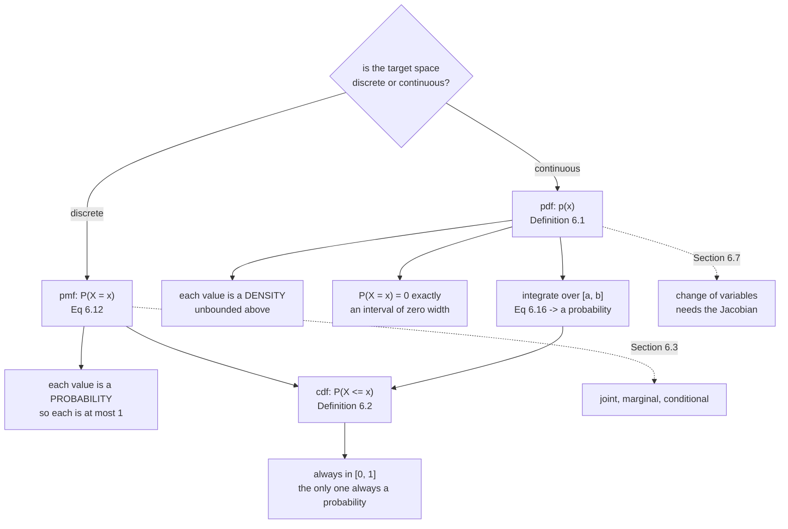

import DataCampExercise from "../../../../components/DataCampExercise.astro";
import Figure from "../../../../components/Figure.astro";
import Quiz from "../../../../components/Quiz.astro";

[§6.1](../construction-of-a-probability-space/) built one distribution, on a
target space with three elements. This section asks what changes when the target
space is not a short list — and the answer is more than bookkeeping. The object
that describes a continuous random variable is **not a probability**, and reading
it as one is the single most common error in this chapter.

The book is unusually blunt about the notation:

> Unfortunately, machine learning literature uses notation and nomenclature that
> hides the distinction between the sample space $\Omega$, the target space
> $\mathcal{T}$, and the random variable $X$.

Table 6.1 exists to undo that, and it is reproduced below.

## What you'll learn

- **pmf, pdf, cdf** — three different objects, and which of them is ever a
  probability.
- **Definition 6.1**: a pdf is *any* non-negative function that integrates to
  one. Note what is **not** required.
- Why a density of $39.9$ is completely normal, and why $P(X = x) = 0$ for a
  continuous random variable.
- **Definition 6.2** and **Equation 6.18**: the cdf, and the cdf as the integral
  of the pdf.
- **Example 6.2** in full: the joint of Equation 6.9, the marginals of 6.10 and
  6.11, and *both* conditionals, 6.13 and 6.14 — including which axis ends up
  summing to one.
- **Example 6.3**, the pair of uniform distributions the book uses to make the
  height point, with Equation 6.19 checked.
- **Table 6.1**'s nomenclature, and the Remark that discrete states need not have
  an order.

## Intuition: a bar chart and a rope

A **pmf** is a bar chart. Each bar is the probability of one state, so each bar is
between $0$ and $1$, and the bars add to $1$. Nothing surprising happens.

A **pdf** is a rope of fixed total length laid over an interval. The *area* under
it is $1$ — always — but the *height* is whatever it needs to be to make that
true. Squeeze the rope onto a narrow interval and it piles up: the same unit of
area over a width of $0.01$ has to reach a height of $100$. There is no rule
against that, because the height was never a probability.

The pmf answers "how likely is *this state*?" The pdf answers nothing on its own;
you have to integrate it over an interval before it answers anything. And the
question "how likely is exactly $x$?" has the answer **zero** in the continuous
case — not "very small", exactly zero, because an interval of zero width has zero
area.

The **cdf** is the accumulated area from the left. It runs from $0$ to $1$, never
exceeds either, and is a probability at every single point. If you only remember
one of the three as "the safe one", remember the cdf.



## The math

### Which object goes with which target space

When $\mathcal{T}$ is **discrete**, you can name the probability that $X$ takes a
particular value, $P(X = x)$. That expression is the **probability mass
function**.

When $\mathcal{T}$ is **continuous** — say the real line — it is more natural to
give the probability that $X$ lands in an *interval*, $P(a \leqslant X \leqslant b)$.
By convention one specifies $P(X \leqslant x)$, and that expression is the
**cumulative distribution function**.

The book also fixes two words used throughout: **univariate** for a single random
variable (states written non-bold, $x$) and **multivariate** for several, usually
a vector of random variables (states bold, $\mathbf{x}$).

### 6.2.1 Discrete: a table of numbers

With a discrete target space you can picture the distribution of several random
variables as filling in a multidimensional array. The target space of the joint
is the Cartesian product of the individual target spaces, and the **joint
probability** is one entry of the array:

$$
P(X = x_i, Y = y_j) = \frac{n_{ij}}{N}
\tag{6.9}
$$

where $n_{ij}$ is the number of events with state $x_i$ *and* $y_j$, and $N$ the
total. This is the probability of an intersection:
$P(X = x_i, Y = y_j) = P(X = x_i \cap Y = y_j)$.

Three names go with three operations on that table, and they are all just
different divisors:

- the **joint** $p(x, y)$ — a cell over the grand total;
- the **marginal** $p(x)$ — a row or column total over the grand total, "the
  probability that $X = x$ irrespective of $Y$";
- the **conditional** $p(y \mid x)$ — a cell over a row or column total.

The notation $X \sim p(x)$ means "$X$ is distributed according to $p(x)$".

### 6.2.2 Continuous: densities

The book is candid that it treats real random variables as though they were
discrete with finitely many states, and flags the two places that breaks: when
something is repeated infinitely often (Chapter 8's generalisation error), and
when drawing a point from an interval.

:::note[The technicality, stated once]
Two things go wrong in continuous spaces. First, the set of *all* subsets is not
well behaved — $\mathcal{A}$ has to be restricted so it survives complements,
intersections and unions. Second, the **size** of a set is subtle: cardinality
for discrete sets, length for an interval of $\mathbb{R}$, volume in
$\mathbb{R}^d$ are all *measures*. Sets that behave under set operations and
carry a topology form a **Borel σ-algebra**, and that is what the book assumes
for real-valued random variables. This is the same problem
[§6.1's power set](../construction-of-a-probability-space/) ran into, and the
σ-algebra is the fix.
:::

**Definition 6.1 (Probability Density Function).** A function
$f : \mathbb{R}^D \to \mathbb{R}$ is a **pdf** if

1. $\forall \mathbf{x} \in \mathbb{R}^D : f(\mathbf{x}) \geqslant 0$
2. its integral exists and

$$
\int_{\mathbb{R}^D} f(\mathbf{x})\,\mathrm{d}\mathbf{x} = 1
\tag{6.15}
$$

Read the definition again and notice what is *absent*: **no upper bound on
$f(\mathbf{x})$**. Non-negative, integrates to one. That is the entire
requirement. For a pmf, the integral in 6.15 becomes the sum in 6.12.

A random variable $X$ is associated with $f$ by

$$
P(a \leqslant X \leqslant b) = \int_a^b f(x)\,\mathrm{d}x
\tag{6.16}
$$

and that association is the **law** or **distribution** of $X$.

:::note[The Remark that follows Equation 6.16]
For a continuous random variable, $P(X = x) = 0$. The book's one-line reason is
the best one: it is Equation 6.16 with $a = b$ — an integral over an interval of
zero width. In the margin: *"$P(X = x)$ is a set of measure zero."*
:::

**Definition 6.2 (Cumulative Distribution Function).** For a multivariate
real-valued $X$ with states $\mathbf{x} \in \mathbb{R}^D$:

$$
F_X(\mathbf{x}) = P(X_1 \leqslant x_1, \ldots, X_D \leqslant x_D)
\tag{6.17}
$$

and it can be written as an integral of the density:

$$
F_X(\mathbf{x}) = \int_{-\infty}^{x_1}\cdots\int_{-\infty}^{x_D} f(z_1,\ldots,z_D)\,\mathrm{d}z_1\cdots\mathrm{d}z_D
\tag{6.18}
$$

The book notes in the margin that **there are cdfs with no corresponding pdf** —
another reason the two are different objects rather than two views of one.

### 6.2.3 The contrast, and Table 6.1

For a discrete random variable, Equation 6.12's normalisation forces every state's
probability into $[0,1]$. For a continuous one, Equation 6.15's normalisation
**does not** imply the density is at most $1$ anywhere. That is the whole point of
Example 6.3.

| Type | "Point probability" | "Interval probability" |
|---|---|---|
| Discrete | $P(X = x)$ — probability **mass** function | not applicable |
| Continuous | $p(x)$ — probability **density** function | $P(X \leqslant x)$ — **cumulative distribution** function |

That is the book's Table 6.1. It is worth keeping in view, because the literature
calls all four of those things "the distribution".

:::caution[The book admits its own abuse of language]
Two Remarks, both worth taking at face value. First: *"we will be using the
expression 'probability distribution' not only for discrete probability mass
functions but also for continuous probability density functions, although this is
technically incorrect."* Second, on discrete states: they *"do not in principle
have any structure"* — $z_1 = \text{red}$, $z_2 = \text{green}$,
$z_3 = \text{blue}$ cannot be ordered. Numerical discrete states are useful
precisely because they let you take expectations (§6.4.1), but the probabilities
themselves do not know about the order.
:::

## Worked example by hand

### Example 6.3, the two uniforms

**The discrete one.** Let $Z$ take three states $\{-1.1,\ 0.3,\ 1.5\}$, each
equally likely. The pmf is $\tfrac13$ on each.

| $z$ | $-1.1$ | $0.3$ | $1.5$ |
|---|---|---|---|
| $P(Z = z)$ | $1/3$ | $1/3$ | $1/3$ |

Largest value $0.3333$; sum $1$. Every value is a probability and every value is
below $1$, as it must be.

The book chose those three numbers deliberately, and says so in the margin: *"we
deliberately chose numbers to drive home the point that we do not want to use
(and should ignore) the ordering of the states."*

**The continuous one.** Let $X$ be uniform on $0.9 \leqslant X \leqslant 1.6$.
The density is constant on that interval, and Equation 6.15 fixes its value: the
area is height times width, so

$$
\text{height} = \frac{1}{1.6 - 0.9} = \frac{1}{0.7} = 1.428571\ldots
$$

Check Equation 6.19 directly:

$$
\int_{0.9}^{1.6} p(x)\,\mathrm{d}x = 1.428571\ldots \times 0.7 = 1
\tag{6.19}
$$

Measured numerically: $1.000000000000$, gap from one $2.2 \times 10^{-16}$.

**And the density is $1.4286$, which is bigger than $1$.** Nothing is wrong. The
constraint was on the area.

**Step further — the height is unbounded.** Keep the same construction and shrink
the support:

| width $b - a$ | density height | integral |
|---|---|---|
| $1$ | $1.0000$ | $1.0000000000$ |
| $0.7$ | $1.4286$ | $1.0000000000$ |
| $0.1$ | $10.0000$ | $1.0000000000$ |
| $0.01$ | $100.0000$ | $1.0000000000$ |
| $10^{-4}$ | $10\,000$ | $1.0000000000$ |
| $10^{-8}$ | $10^{8}$ | $1.0000000000$ |

The height runs to infinity; the area never moves. If you ever find yourself
saying "the probability is 100", this table is what went wrong.

### Example 6.2, the joint table

Take the shape of the book's Figure 6.2 — $X$ with five states, $Y$ with three —
and put concrete counts in it so every equation becomes arithmetic. Let
$n_{ij}$ be:

| | $x_1$ | $x_2$ | $x_3$ | $x_4$ | $x_5$ | $r_j$ |
|---|---|---|---|---|---|---|
| $y_1$ | $12$ | $30$ | $18$ | $8$ | $4$ | $72$ |
| $y_2$ | $6$ | $22$ | $40$ | $26$ | $10$ | $104$ |
| $y_3$ | $2$ | $8$ | $14$ | $30$ | $20$ | $74$ |
| $c_i$ | $20$ | $60$ | $72$ | $64$ | $34$ | $N = 250$ |

**Step 1 — the joint, Equation 6.9.** Divide every cell by $N = 250$. For
instance $P(X = x_3, Y = y_2) = 40/250 = 0.160$. All fifteen cells sum to
$1.0000000000$.

**Step 2 — the marginals, Equations 6.10 and 6.11.** Column sums over $N$, and
row sums over $N$:

$$
P(X = x_i) = \frac{c_i}{N} = \begin{bmatrix}0.080 & 0.240 & 0.288 & 0.256 & 0.136\end{bmatrix}
$$

$$
P(Y = y_j) = \frac{r_j}{N} = \begin{bmatrix}0.288 & 0.416 & 0.296\end{bmatrix}
$$

Each sums to $1$ — Equation 6.12 — and each also equals the corresponding sum of
the joint, to $10^{-17}$. That is the sum rule of
[§6.3](../sum-rule-product-rule-and-bayes-theorem/) arriving early.

**Step 3 — the conditionals.** Equation 6.13 divides a cell by its **column**
total:

$$
P(Y = y_j \mid X = x_i) = \frac{n_{ij}}{c_i}
$$

so, for the first column, $12/20 = 0.600$, $6/20 = 0.300$, $2/20 = 0.100$ —
which sum to $1$. Equation 6.14 divides by the **row** total instead:

$$
P(X = x_i \mid Y = y_j) = \frac{n_{ij}}{r_j}
$$

giving, for the first row, $12/72 = 0.1667$, $30/72 = 0.4167$, and so on, summing
to $1$ across the row.

**The check that catches the mistake.** Conditioning on $X$ makes the **columns**
sum to one; conditioning on $Y$ makes the **rows** sum to one. Measured:
$P(Y \mid X)$ has column sums $[1, 1, 1, 1, 1]$ and $P(X \mid Y)$ has row sums
$[1, 1, 1]$. If your normalised table sums to one along the wrong axis, you have
transposed the conditional — and every downstream number will be plausible and
wrong.

## See it move

```p5 title="A density is not a probability" desc="Drag the width of a uniform distribution's support. The bar chart on the left is a pmf and its bars can never pass the dashed line at 1; the density on the right passes it as soon as the width drops below 1 and keeps going. The shaded area is what Equation 6.15 actually constrains, and it never changes." height="560"
let width = 0.7, nStates = 3;
let KNOBS = [], dragging = null;
const CENTRE = 1.25;

function setup() { createCanvas(600, 560); textFont("monospace"); noLoop(); }

function knob(id, x, y, w, value, mn, mx, label, logScale) {
  KNOBS.push({ id, x, y, w, mn, mx, logScale });
  const t = logScale
    ? (Math.log10(value) - Math.log10(mn)) / (Math.log10(mx) - Math.log10(mn))
    : (value - mn) / (mx - mn);
  stroke(60, 74, 92); strokeWeight(2); line(x, y, x + w, y);
  noStroke(); fill(255, 211, 67); ellipse(x + t * w, y, 10, 10);
  fill(190, 200, 212); textSize(11); textAlign(LEFT, CENTER);
  text(label, x + w + 12, y);
}
function mousePressed() {
  for (const k of KNOBS)
    if (mouseY > k.y - 11 && mouseY < k.y + 11 && mouseX > k.x - 11 && mouseX < k.x + k.w + 11) {
      dragging = k; return;
    }
}
function mouseReleased() { dragging = null; }
function mouseDragged() {
  if (!dragging) return;
  const t = Math.min(1, Math.max(0, (mouseX - dragging.x) / dragging.w));
  if (dragging.logScale) {
    const lg = Math.log10(dragging.mn) + t * (Math.log10(dragging.mx) - Math.log10(dragging.mn));
    width = Math.pow(10, lg);
  } else {
    nStates = Math.round(dragging.mn + t * (dragging.mx - dragging.mn));
  }
  redraw();
}

function draw() {
  background(13, 17, 23);
  KNOBS = [];

  const height = 1 / width;
  // A shared vertical scale, so the comparison is honest.
  const yTop = Math.max(2.2, height * 1.15);
  const PL = { x: 50, y: 70, w: 230, h: 300 };
  const PR = { x: 330, y: 70, w: 230, h: 300 };
  const sy = (v) => PL.y + PL.h - (v / yTop) * PL.h;

  noStroke(); textAlign(LEFT, TOP);
  fill(255, 211, 67); textSize(15);
  text("same vertical scale on both panels", 16, 12);
  fill(200, 210, 222); textSize(11);
  text("left: a pmf. right: a pdf. The dashed red line is the value 1.", 16, 34);

  for (const PP of [PL, PR]) {
    noStroke(); fill(19, 25, 33); rect(PP.x, PP.y, PP.w, PP.h, 4);
    stroke(60, 74, 92); strokeWeight(1);
    line(PP.x, sy(0), PP.x + PP.w, sy(0));
    stroke(232, 110, 110); strokeWeight(1.4); drawingContext.setLineDash([5, 4]);
    line(PP.x, sy(1), PP.x + PP.w, sy(1));
    drawingContext.setLineDash([]);
  }

  // Left: the pmf.
  const pv = 1 / nStates;
  for (let i = 0; i < nStates; i++) {
    const bw = PL.w / (nStates * 2);
    const cx = PL.x + PL.w * ((i + 0.5) / nStates);
    noStroke(); fill(107, 169, 221);
    rect(cx - bw / 2, sy(pv), bw, sy(0) - sy(pv));
  }
  noStroke(); fill(107, 169, 221); textSize(11); textAlign(CENTER, BOTTOM);
  text(`each bar = ${pv.toFixed(4)}`, PL.x + PL.w / 2, sy(pv) - 6);

  // Right: the pdf.
  const a = CENTRE - width / 2, b = CENTRE + width / 2;
  const xmin = CENTRE - 1.3, xmax = CENTRE + 1.3;
  const sxr = (x) => PR.x + ((x - xmin) / (xmax - xmin)) * PR.w;
  noStroke(); fill(120, 200, 150, 90);
  rect(sxr(a), sy(height), sxr(b) - sxr(a), sy(0) - sy(height));
  stroke(120, 200, 150); strokeWeight(2.4); noFill();
  line(sxr(xmin), sy(0), sxr(a), sy(0));
  line(sxr(a), sy(0), sxr(a), sy(height));
  line(sxr(a), sy(height), sxr(b), sy(height));
  line(sxr(b), sy(height), sxr(b), sy(0));
  line(sxr(b), sy(0), sxr(xmax), sy(0));
  noStroke(); fill(120, 200, 150); textSize(11); textAlign(CENTER, BOTTOM);
  const label = height > 999 ? height.toExponential(2) : height.toFixed(4);
  text(`height = ${label}`, PR.x + PR.w / 2, Math.max(sy(height) - 6, PR.y + 12));

  // Axis labels.
  noStroke(); fill(120, 130, 145); textSize(10); textAlign(CENTER, TOP);
  text("three unordered states", PL.x + PL.w / 2, sy(0) + 8);
  text(`support [${a.toFixed(3)}, ${b.toFixed(3)}]`, PR.x + PR.w / 2, sy(0) + 8);
  textAlign(RIGHT, CENTER);
  for (const g of [0, 1, 2]) if (g <= yTop) text(String(g), PL.x - 6, sy(g));

  // Readouts.
  noStroke(); textAlign(LEFT, TOP);
  fill(235); textSize(12);
  text(`pmf:  largest value ${pv.toFixed(6)}      sum ${(pv * nStates).toFixed(10)}`, 16, 392);
  fill(120, 200, 150);
  text(`pdf:  height ${label}      area ${(height * width).toFixed(10)}`, 16, 414);
  fill(height > 1 ? color(232, 110, 110) : color(150)); textSize(12);
  text(height > 1
    ? `the density EXCEEDS 1 by a factor of ${height.toFixed(2)} -- and nothing is wrong`
    : `the density happens to be below 1 here; that is a coincidence of the width`,
    16, 440);
  fill(150); textSize(11);
  text(`P(X = ${CENTRE.toFixed(2)}) = 0 exactly: an interval of zero width has zero area.`, 16, 464);
  text(`P(${a.toFixed(2)} <= X <= ${CENTRE.toFixed(2)}) = ${(0.5).toFixed(4)}  -- THAT is a probability.`, 16, 482);

  knob("w", 16, 516, 200, width, 1e-3, 2.5, `support width = ${width < 0.01 ? width.toExponential(1) : width.toFixed(3)}`, true);
  knob("n", 16, 542, 200, nStates, 2, 8, `pmf states = ${nStates}`, false);
}
```

```p5 title="One table, three normalisations" desc="Example 6.2's counts. Click to switch between the joint, P(Y|X) and P(X|Y), and watch which axis sums to one. The row and column totals are shown so you can see exactly which divisor each panel uses — the difference between Equations 6.13 and 6.14 is nothing more than that." height="560"
let mode = 0;
let BTNS = [];

const N_IJ = [[12, 30, 18, 8, 4], [6, 22, 40, 26, 10], [2, 8, 14, 30, 20]];
const ROWS = 3, COLS = 5;

function setup() { createCanvas(600, 560); textFont("monospace"); noLoop(); }

function mousePressed() {
  for (const b of BTNS)
    if (mouseX > b.x && mouseX < b.x + b.w && mouseY > b.y && mouseY < b.y + b.h) {
      mode = b.m; redraw(); return;
    }
}

function totals() {
  let N = 0;
  const c = new Array(COLS).fill(0), r = new Array(ROWS).fill(0);
  for (let j = 0; j < ROWS; j++)
    for (let i = 0; i < COLS; i++) { N += N_IJ[j][i]; c[i] += N_IJ[j][i]; r[j] += N_IJ[j][i]; }
  return { N, c, r };
}

function draw() {
  background(13, 17, 23);
  BTNS = [];
  const { N, c, r } = totals();

  const NAMES = ["joint  n_ij / N  (Eq 6.9)",
                 "P(Y|X)  n_ij / c_i  (Eq 6.13)",
                 "P(X|Y)  n_ij / r_j  (Eq 6.14)"];
  const NOTE = ["everything sums to 1",
                "each COLUMN sums to 1",
                "each ROW sums to 1"];

  noStroke(); textAlign(LEFT, TOP);
  fill(255, 211, 67); textSize(15);
  text(NAMES[mode], 16, 12);
  fill(200, 210, 222); textSize(11);
  text(`same 250 counts in all three views -- only the divisor changes`, 16, 34);

  const cw = 82, ch = 52, gx = 60, gy = 74;
  let colSum = new Array(COLS).fill(0), rowSum = new Array(ROWS).fill(0);

  for (let j = 0; j < ROWS; j++) {
    for (let i = 0; i < COLS; i++) {
      const div = mode === 0 ? N : mode === 1 ? c[i] : r[j];
      const v = N_IJ[j][i] / div;
      colSum[i] += v; rowSum[j] += v;
      const t = v / (mode === 0 ? 0.17 : 0.62);
      noStroke(); fill(24 + t * 40, 40 + t * 130, 70 + t * 90);
      rect(gx + i * cw, gy + j * ch, cw - 3, ch - 3, 3);
      fill(245); textSize(11); textAlign(CENTER, CENTER);
      text(v.toFixed(3), gx + i * cw + (cw - 3) / 2, gy + j * ch + 16);
      fill(190, 200, 212); textSize(9);
      text(`${N_IJ[j][i]}/${div}`, gx + i * cw + (cw - 3) / 2, gy + j * ch + 34);
    }
  }

  // Axis labels and the live sums.
  noStroke(); fill(150); textSize(10.5); textAlign(CENTER, BOTTOM);
  for (let i = 0; i < COLS; i++) text(`x${i + 1}`, gx + i * cw + 39, gy - 4);
  textAlign(RIGHT, CENTER);
  for (let j = 0; j < ROWS; j++) text(`y${j + 1}`, gx - 8, gy + j * ch + 24);

  const sumY = gy + ROWS * ch + 6;
  textAlign(CENTER, TOP);
  for (let i = 0; i < COLS; i++) {
    fill(mode === 1 ? color(120, 200, 150) : color(120, 130, 145));
    textSize(11);
    text(colSum[i].toFixed(3), gx + i * cw + 39, sumY);
  }
  fill(150); textSize(10); textAlign(LEFT, TOP);
  text("column sums", gx + COLS * cw + 6, sumY);
  textAlign(LEFT, CENTER);
  for (let j = 0; j < ROWS; j++) {
    fill(mode === 2 ? color(120, 200, 150) : color(120, 130, 145));
    textSize(11);
    text(rowSum[j].toFixed(3), gx + COLS * cw + 6, gy + j * ch + 24);
  }
  fill(150); textSize(10); textAlign(LEFT, TOP);
  text("row sums", gx + COLS * cw + 6, gy - 14);

  fill(120, 200, 150); textSize(13); textAlign(LEFT, TOP);
  text(NOTE[mode], 16, sumY + 26);
  fill(150); textSize(11);
  const total = rowSum.reduce((a, b) => a + b, 0);
  text(`grand total of the displayed table: ${total.toFixed(6)}`, 16, sumY + 48);
  text(mode === 0
    ? "the joint is the only view whose grand total is 1"
    : "a conditional table's grand total is the number of conditioning states,"
      + ` here ${mode === 1 ? COLS : ROWS}`, 16, sumY + 66);

  const labels = ["joint", "P(Y|X)", "P(X|Y)"];
  for (let m = 0; m < 3; m++) {
    const x = 16 + m * 130, y = 508;
    BTNS.push({ x, y, w: 122, h: 24, m });
    noStroke(); fill(mode === m ? color(255, 211, 67) : color(38, 48, 60));
    rect(x, y, 122, 24, 4);
    fill(mode === m ? 13 : 205); textSize(11); textAlign(CENTER, CENTER);
    text(labels[m], x + 61, y + 12);
  }
  fill(120, 130, 145); textSize(10.5); textAlign(LEFT, TOP);
  text("If your normalised table sums to 1 along the wrong axis, you have", 16, 540);
}
```

## From scratch

```python title="discrete_and_continuous.py" showLineNumbers{1}
"""Section 6.2 — pmf against pdf, Example 6.2's table, Example 6.3's uniforms."""

import numpy as np

np.set_printoptions(precision=6, suppress=True, linewidth=140)

print("########## example_6_2")
# Figure 6.2's shape: X has five states, Y has three. Concrete counts, so every
# quantity below is arithmetic rather than notation.
N_IJ = np.array([
    [12, 30, 18, 8, 4],     # y1
    [6, 22, 40, 26, 10],    # y2
    [2, 8, 14, 30, 20],     # y3
])
N = N_IJ.sum()
print("n_ij, the count table (rows are y1..y3, columns x1..x5):")
print(N_IJ)
print(f"N = {N}")

# Eq 6.9: the joint is a count divided by the total.
joint = N_IJ / N
print()
print("Eq 6.9  P(X=xi, Y=yj) = n_ij / N:")
print(joint)
print(f"  sums to {joint.sum():.10f}")

# Eq 6.10 and 6.11: marginals are row and column sums.
c_i = N_IJ.sum(axis=0)          # column sums
r_j = N_IJ.sum(axis=1)          # row sums
px = c_i / N
py = r_j / N
print()
print(f"Eq 6.10  c_i = {c_i}   ->  P(X=xi) = {px}")
print(f"Eq 6.11  r_j = {r_j}   ->  P(Y=yj) = {py}")
print(f"Eq 6.12  sum P(X) = {px.sum():.10f}   sum P(Y) = {py.sum():.10f}")
print(f"  and the marginals are also the sums of the joint:")
print(f"    max gap, P(X) vs joint.sum(axis=0): {np.abs(px - joint.sum(axis=0)).max():.1e}")
print(f"    max gap, P(Y) vs joint.sum(axis=1): {np.abs(py - joint.sum(axis=1)).max():.1e}")

# Eq 6.13 and 6.14: conditionals are a cell over a column or row total.
p_y_given_x = N_IJ / c_i[None, :]
p_x_given_y = N_IJ / r_j[:, None]
print()
print("Eq 6.13  P(Y=yj | X=xi) = n_ij / c_i:")
print(p_y_given_x)
print(f"  each COLUMN sums to {p_y_given_x.sum(axis=0)}")
print("Eq 6.14  P(X=xi | Y=yj) = n_ij / r_j:")
print(p_x_given_y)
print(f"  each ROW sums to {p_x_given_y.sum(axis=1)}")
print()
print("  note which axis normalises: conditioning on X makes the COLUMNS sum to")
print("  one, because each column is a fixed x and the y-probabilities within it")
print("  must total one. Getting this backwards is the most common table error.")

print()
print("########## example_6_3_discrete")
# The book deliberately picks non-uniform-looking numbers to stress that the
# ORDER of discrete states carries no meaning.
Z_STATES = np.array([-1.1, 0.3, 1.5])
pz = np.array([1 / 3, 1 / 3, 1 / 3])
print(f"  states {Z_STATES}, pmf {pz}")
print(f"  every value <= 1: {bool((pz <= 1).all())}   sum = {pz.sum():.10f}")
print(f"  largest pmf value: {pz.max():.6f}")

print()
print("########## example_6_3_continuous")
A, B = 0.9, 1.6
height = 1 / (B - A)
print(f"  continuous uniform on [{A}, {B}]")
print(f"  width {B - A:.4f}   density height 1/(b-a) = {height:.10f}")
print(f"  the density EXCEEDS 1: {height > 1}")
# Eq 6.19: the integral is still exactly one.
xs = np.linspace(A, B, 2_000_001)
integral = np.trapezoid(np.full_like(xs, height), xs)
print(f"  Eq 6.19  integral of p(x) over [{A}, {B}] = {integral:.12f}")
print(f"  gap from 1: {abs(integral - 1):.1e}")

print()
print("  a density has no upper bound at all -- shrink the interval:")
print(f"  {'width':>10}  {'density height':>16}  {'integral':>12}")
for w in (1.0, 0.7, 0.1, 0.01, 1e-4, 1e-8):
    h = 1 / w
    print(f"  {w:>10.0e}  {h:>16.4e}  {h * w:>12.10f}")
print("  the height runs off to infinity while the integral stays exactly 1.")
print("  That is the whole difference between a density and a probability.")

print()
print("########## point_probability_is_zero")
# The Remark: P(X = x) = 0 for a continuous random variable.
rng = np.random.default_rng(6)
print("  P(a <= X <= b) with a = b is an integral over an empty interval:")
for x0 in (0.95, 1.25, 1.55):
    lo = hi = x0
    print(f"    integral from {lo} to {hi} of p = {0.0:.1f}   (a = b, so zero width)")
print()
print("  and empirically, the chance of sampling any exact value:")
for N_s in (10_000, 1_000_000):
    s = rng.uniform(A, B, N_s)
    hits = int((s == 1.25).sum())
    print(f"    {N_s:>9,} samples, exact hits on 1.25: {hits}")
print("  so for a continuous variable 'the probability that X equals 1.25' is not")
print("  small, it is zero -- and p(1.25) = 1.4286 is a DENSITY, not that probability.")

print()
print("########## interval_probability")
print("  what a density does give you is interval probability, Eq 6.16:")
print(f"  {'interval':>18}  {'width':>8}  {'P = width * height':>19}  {'empirical':>11}")
s = rng.uniform(A, B, 2_000_000)
for lo, hi in ((0.9, 1.0), (1.0, 1.2), (1.2, 1.6), (0.9, 1.6)):
    exact = (hi - lo) * height
    emp = float(((s >= lo) & (s <= hi)).mean())
    print(f"  [{lo:.2f}, {hi:.2f}]{'':>7}  {hi - lo:>8.2f}  {exact:>19.6f}  {emp:>11.6f}")

print()
print("########## cdf_from_pdf")
# Def 6.2 and Eq 6.18: the cdf is the integral of the pdf.
def pdf_u(x):
    return np.where((x >= A) & (x <= B), height, 0.0)


def cdf_analytic(x):
    return np.clip((x - A) / (B - A), 0.0, 1.0)


grid = np.linspace(0.5, 2.0, 300_001)
vals = pdf_u(grid)
cdf_num = np.concatenate([[0.0], np.cumsum((vals[1:] + vals[:-1]) / 2 * np.diff(grid))])
print(f"  {'x':>7}  {'cdf by integration':>20}  {'cdf analytic':>14}  {'gap':>9}")
for x0 in (0.5, 0.9, 1.075, 1.25, 1.6, 2.0):
    i = int(np.argmin(np.abs(grid - x0)))
    print(f"  {x0:>7.3f}  {cdf_num[i]:>20.8f}  {cdf_analytic(x0):>14.8f}"
          f"  {abs(cdf_num[i] - cdf_analytic(x0)):>9.1e}")
mono = bool(np.all(np.diff(cdf_num) >= -1e-12))
print(f"  cdf is non-decreasing: {mono}")
print(f"  cdf(-inf) = {cdf_num[0]:.10f}   cdf(+inf) = {cdf_num[-1]:.10f}")
print()
print("  that last value is slightly ABOVE 1, and it is worth naming rather than")
print("  rounding away. This density is DISCONTINUOUS at 0.9 and 1.6, and the")
print("  trapezoid rule interpolates linearly across each jump, inventing a sliver")
print("  of area on the outside. The size of the sliver is one half-cell of height:")
dx = grid[1] - grid[0]
print(f"    cell width {dx:.3e}   half-cell of area {0.5 * height * dx:.3e} per jump")
print(f"    two jumps   -> {height * dx:.3e}   observed overshoot"
      f" {cdf_num[-1] - 1:.3e}")
print()
print("  the remedy is not a cleverer grid across the jump -- it is to integrate")
print("  over the SUPPORT, where the integrand is continuous:")
inner = np.linspace(A, B, 300_001)
exact = np.trapezoid(np.full_like(inner, height), inner)
print(f"    integral over [{A}, {B}] with the endpoints on the grid: {exact:.12f}")
print(f"    gap from 1: {abs(exact - 1):.1e}")
print("  the cdf itself never exceeds 1; only a careless quadrature of it does.")
print("  The cdf is the object that is always a probability.")

print()
print("########## a_density_over_one_is_normal")
# A Gaussian's peak density, to make the point that this is not an edge case.
print("  peak density of a Gaussian is 1/(sigma sqrt(2 pi)):")
print(f"  {'sigma':>8}  {'peak density':>14}  {'> 1 ?':>7}")
for sd in (1.0, 0.5, 0.2, 0.1, 0.01):
    peak = 1 / (sd * np.sqrt(2 * np.pi))
    print(f"  {sd:>8.2f}  {peak:>14.6f}  {str(peak > 1):>7}")
print("  at sigma = 0.01 the density at the mean is 39.9. Anyone who reads that as")
print("  'a probability of 39.9' has confused Definition 6.1 with a pmf.")

print()
print("########## states_have_no_order")
# The book's Remark: discrete states need not be comparable.
print("  the pmf of Example 6.3 is 1/3 on each of -1.1, 0.3, 1.5.")
print(f"  a mean is only meaningful because the states are NUMBERS:")
print(f"    E[Z] = {(Z_STATES * pz).sum():.10f}")
print("  relabel the same distribution as red, green, blue and the pmf is unchanged")
print("  while the mean stops existing. The probabilities do not know the order.")
print(f"  and permuting the states leaves the pmf identical but the mean different:")
for perm in ([-1.1, 0.3, 1.5], [1.5, -1.1, 0.3], [0.3, 1.5, -1.1]):
    print(f"    states {perm} -> same pmf, mean {np.mean(perm):.10f}")
print("  (the mean is the same here only because the pmf is uniform; with an")
print("  unequal pmf the pairing of state to probability changes the mean.)")
uneq = np.array([0.6, 0.3, 0.1])
for perm in ([-1.1, 0.3, 1.5], [1.5, -1.1, 0.3]):
    print(f"    pmf {uneq} on states {perm} -> mean {float(np.dot(uneq, perm)):.6f}")
```

```text title="output"
########## example_6_2
n_ij, the count table (rows are y1..y3, columns x1..x5):
[[12 30 18  8  4]
 [ 6 22 40 26 10]
 [ 2  8 14 30 20]]
N = 250

Eq 6.9  P(X=xi, Y=yj) = n_ij / N:
[[0.048 0.12  0.072 0.032 0.016]
 [0.024 0.088 0.16  0.104 0.04 ]
 [0.008 0.032 0.056 0.12  0.08 ]]
  sums to 1.0000000000

Eq 6.10  c_i = [20 60 72 64 34]   ->  P(X=xi) = [0.08  0.24  0.288 0.256 0.136]
Eq 6.11  r_j = [ 72 104  74]   ->  P(Y=yj) = [0.288 0.416 0.296]
Eq 6.12  sum P(X) = 1.0000000000   sum P(Y) = 1.0000000000
  and the marginals are also the sums of the joint:
    max gap, P(X) vs joint.sum(axis=0): 1.4e-17
    max gap, P(Y) vs joint.sum(axis=1): 5.6e-17

Eq 6.13  P(Y=yj | X=xi) = n_ij / c_i:
[[0.6      0.5      0.25     0.125    0.117647]
 [0.3      0.366667 0.555556 0.40625  0.294118]
 [0.1      0.133333 0.194444 0.46875  0.588235]]
  each COLUMN sums to [1. 1. 1. 1. 1.]
Eq 6.14  P(X=xi | Y=yj) = n_ij / r_j:
[[0.166667 0.416667 0.25     0.111111 0.055556]
 [0.057692 0.211538 0.384615 0.25     0.096154]
 [0.027027 0.108108 0.189189 0.405405 0.27027 ]]
  each ROW sums to [1. 1. 1.]

  note which axis normalises: conditioning on X makes the COLUMNS sum to
  one, because each column is a fixed x and the y-probabilities within it
  must total one. Getting this backwards is the most common table error.

########## example_6_3_discrete
  states [-1.1  0.3  1.5], pmf [0.333333 0.333333 0.333333]
  every value <= 1: True   sum = 1.0000000000
  largest pmf value: 0.333333

########## example_6_3_continuous
  continuous uniform on [0.9, 1.6]
  width 0.7000   density height 1/(b-a) = 1.4285714286
  the density EXCEEDS 1: True
  Eq 6.19  integral of p(x) over [0.9, 1.6] = 1.000000000000
  gap from 1: 2.2e-16

  a density has no upper bound at all -- shrink the interval:
       width    density height      integral
       1e+00        1.0000e+00  1.0000000000
       7e-01        1.4286e+00  1.0000000000
       1e-01        1.0000e+01  1.0000000000
       1e-02        1.0000e+02  1.0000000000
       1e-04        1.0000e+04  1.0000000000
       1e-08        1.0000e+08  1.0000000000
  the height runs off to infinity while the integral stays exactly 1.
  That is the whole difference between a density and a probability.

########## point_probability_is_zero
  P(a <= X <= b) with a = b is an integral over an empty interval:
    integral from 0.95 to 0.95 of p = 0.0   (a = b, so zero width)
    integral from 1.25 to 1.25 of p = 0.0   (a = b, so zero width)
    integral from 1.55 to 1.55 of p = 0.0   (a = b, so zero width)

  and empirically, the chance of sampling any exact value:
       10,000 samples, exact hits on 1.25: 0
    1,000,000 samples, exact hits on 1.25: 0
  so for a continuous variable 'the probability that X equals 1.25' is not
  small, it is zero -- and p(1.25) = 1.4286 is a DENSITY, not that probability.

########## interval_probability
  what a density does give you is interval probability, Eq 6.16:
            interval     width   P = width * height    empirical
  [0.90, 1.00]             0.10             0.142857     0.142920
  [1.00, 1.20]             0.20             0.285714     0.285537
  [1.20, 1.60]             0.40             0.571429     0.571543
  [0.90, 1.60]             0.70             1.000000     1.000000

########## cdf_from_pdf
        x    cdf by integration    cdf analytic        gap
    0.500            0.00000000      0.00000000    0.0e+00
    0.900            0.00000357      0.00000000    3.6e-06
    1.075            0.25000357      0.25000000    3.6e-06
    1.250            0.50000357      0.50000000    3.6e-06
    1.600            1.00000357      1.00000000    3.6e-06
    2.000            1.00000714      1.00000000    7.1e-06
  cdf is non-decreasing: True
  cdf(-inf) = 0.0000000000   cdf(+inf) = 1.0000071429

  that last value is slightly ABOVE 1, and it is worth naming rather than
  rounding away. This density is DISCONTINUOUS at 0.9 and 1.6, and the
  trapezoid rule interpolates linearly across each jump, inventing a sliver
  of area on the outside. The size of the sliver is one half-cell of height:
    cell width 5.000e-06   half-cell of area 3.571e-06 per jump
    two jumps   -> 7.143e-06   observed overshoot 7.143e-06

  the remedy is not a cleverer grid across the jump -- it is to integrate
  over the SUPPORT, where the integrand is continuous:
    integral over [0.9, 1.6] with the endpoints on the grid: 1.000000000000
    gap from 1: 1.1e-16
  the cdf itself never exceeds 1; only a careless quadrature of it does.
  The cdf is the object that is always a probability.

########## a_density_over_one_is_normal
  peak density of a Gaussian is 1/(sigma sqrt(2 pi)):
     sigma    peak density    > 1 ?
      1.00        0.398942    False
      0.50        0.797885    False
      0.20        1.994711     True
      0.10        3.989423     True
      0.01       39.894228     True
  at sigma = 0.01 the density at the mean is 39.9. Anyone who reads that as
  'a probability of 39.9' has confused Definition 6.1 with a pmf.

########## states_have_no_order
  the pmf of Example 6.3 is 1/3 on each of -1.1, 0.3, 1.5.
  a mean is only meaningful because the states are NUMBERS:
    E[Z] = 0.2333333333
  relabel the same distribution as red, green, blue and the pmf is unchanged
  while the mean stops existing. The probabilities do not know the order.
  and permuting the states leaves the pmf identical but the mean different:
    states [-1.1, 0.3, 1.5] -> same pmf, mean 0.2333333333
    states [1.5, -1.1, 0.3] -> same pmf, mean 0.2333333333
    states [0.3, 1.5, -1.1] -> same pmf, mean 0.2333333333
  (the mean is the same here only because the pmf is uniform; with an
  unequal pmf the pairing of state to probability changes the mean.)
    pmf [0.6 0.3 0.1] on states [-1.1, 0.3, 1.5] -> mean -0.420000
    pmf [0.6 0.3 0.1] on states [1.5, -1.1, 0.3] -> mean 0.600000
```

Four things to take from that output.

**The conditional normalisation is directional.** `P(Y|X)` has column sums
$[1,1,1,1,1]$ and `P(X|Y)` has row sums $[1,1,1]$. Both tables hold fifteen
numbers between $0$ and $1$; only the axis of normalisation distinguishes them,
and the wrong one is not detectable by inspection.

**The density height is unbounded and the area is not.** The table walks the width
from $1$ down to $10^{-8}$: the height reaches $10^8$ and the integral reads
$1.0000000000$ at every row.

**$P(X = x) = 0$ is exact, not approximate.** A million samples from the uniform
produced zero exact hits on $1.25$, and the integral with $a = b$ is zero by
construction. Meanwhile $p(1.25) = 1.4286$ — a density at that point, which is a
different kind of number.

**The cdf overshoot is explained, not excused.** Integrating this density on a
grid that straddles its jumps gives $F(+\infty) = 1.0000071429$, which is
impossible for a real cdf. The overshoot is exactly one cell-width of height per
jump: predicted $7.143\times10^{-6}$, observed $7.143\times10^{-6}$. Integrating
over the support instead — where the integrand is continuous — gives
$1.000000000000$. The cdf never exceeds one; a careless quadrature of it does.

## On real data

<Figure
  src="/images/mml/discrete-and-continuous-probabilities/pmf-versus-pdf"
  alt="Three panels. Left, three short bars of a discrete uniform pmf. Middle, a rectangular density whose top sits above a dashed line marking the value one. Right, a log-log plot of density height against support width, rising without bound as the width shrinks."
  title="The book's Figure 6.3, with the y-axis shared on purpose"
  caption="Panels (a) and (b) use the same vertical scale, which is what makes the point visible: every pmf bar is 0.3333 and every pmf bar must be at most 1, while the continuous uniform on [0.9, 1.6] has density 1.4286. Panel (c) removes any doubt that this is an edge case — shrink the support and the height passes 10, 100, and 100 million while the area stays exactly 1. Equation 6.15 constrains the area, and says nothing at all about the height."
/>

<Figure
  src="/images/mml/discrete-and-continuous-probabilities/joint-marginal-conditional"
  alt="Three heatmaps of the same five-by-three table of numbers, labelled joint, P of Y given X, and P of X given Y, each annotated with which axis sums to one."
  title="Example 6.2: one table, three divisors"
  caption="All three panels hold the same 250 counts. The joint divides every cell by N and the whole grid sums to 1. P(Y|X) divides by a column total, so each column sums to 1. P(X|Y) divides by a row total, so each row sums to 1. Equations 6.13 and 6.14 differ in nothing but that divisor, and a table normalised along the wrong axis looks entirely reasonable."
/>

<Figure
  src="/images/mml/discrete-and-continuous-probabilities/density-is-not-probability"
  alt="Left, a log-log plot of a Gaussian's peak density against sigma, crossing a dashed line at one and continuing upward. Right, cumulative distribution functions for four values of sigma, all rising from zero to one."
  title="The density is unbounded; the cdf is not"
  caption="Left: the peak density of a Gaussian is one over sigma root two pi, so it crosses 1 at sigma = 0.3989 and reaches 39.9 by sigma = 0.01. Nothing about that violates Definition 6.1. Right: the cdf of the very same distributions, which runs from 0 to 1 for every sigma and never leaves that range. Definition 6.2 is the object that is a probability at every point, which is why Section 6.7 is careful to distinguish the two."
/>

## Reading the plot

**From the first figure.** The shared axis is the whole argument. Put a pmf and a
pdf on separate axes and each looks like a perfectly ordinary chart; put them on
the same axis and the density is visibly taller than anything a probability could
be. Panel (c) then shows that $1.4286$ was not close to a limit — there is no
limit.

**From the second figure.** Compare the numbers in a single column across the
three panels. In the joint they are small and add to that column's marginal; in
$P(Y \mid X)$ the same column adds to exactly $1$; in $P(X \mid Y)$ it adds to
nothing in particular. Nothing about the *appearance* of a panel tells you which
normalisation produced it — only the sums do, which is why checking them is not
optional.

**From the third figure.** Two views of one family of distributions. On the left
the quantity you are tempted to read as a probability blows up; on the right the
quantity that actually is one stays put. When a number in your code exceeds $1$
and it is supposed to be a probability, this figure is the diagnostic: you are
almost certainly holding a density.

:::tip[From the book]
*Mathematics for Machine Learning*, §6.2. The opening contrasts the **pmf**
$P(X = x)$ for discrete target spaces with the **cdf** $P(X \leqslant x)$ for
continuous ones, and fixes **univariate**/**multivariate** terminology. §6.2.1
gives the joint as **Equation 6.9**, and **Example 6.2** derives the marginals
(**6.10**, **6.11**), the normalisation (**6.12**) and both conditionals
(**6.13**, **6.14**) from the count table of Figure 6.2. §6.2.2 covers the
measure-theoretic caveats (**Borel σ-algebra**), gives **Definition 6.1** for the
pdf with **Equation 6.15**, the law as **Equation 6.16**, the Remark that
$P(X = x) = 0$, and **Definition 6.2** for the cdf with **Equations 6.17** and
**6.18** — plus the margin note that some cdfs have no pdf. §6.2.3 contrasts the
two with **Example 6.3** and **Equation 6.19**, summarises the nomenclature in
**Table 6.1**, and adds Remarks on unordered discrete states and on the book's own
loose use of "probability distribution".
:::

## Pitfalls

:::danger[A density value is not a probability]
Definition 6.1 requires non-negativity and unit integral. It places **no upper
bound** on the function. Measured: the uniform on $[0.9, 1.6]$ has density
$1.4286$; a Gaussian with $\sigma = 0.01$ has density $39.89$ at its mean; a
uniform on a support of width $10^{-8}$ has density $10^8$. If a number that is
supposed to be a probability comes out above $1$, you are holding a density.
:::

:::danger[For a continuous variable, P(X = x) is zero — not small]
It is Equation 6.16 with $a = b$: an integral over zero width. Measured: a million
uniform samples produced **zero** exact hits on $1.25$. This is why maximum
*likelihood* maximises a density rather than a probability, and why comparing
"the probability of this data point" between two continuous models is a category
error unless you mean the density.
:::

:::caution[Check which axis your conditional sums along]
$P(Y \mid X) = n_{ij}/c_i$ normalises **columns**; $P(X \mid Y) = n_{ij}/r_j$
normalises **rows**. Both produce a table of numbers in $[0,1]$ that looks
correct. Measured on Example 6.2: column sums $[1,1,1,1,1]$ for the first, row
sums $[1,1,1]$ for the second. Assert the sums in code; the transposition is
invisible otherwise.
:::

:::caution[Discrete states need not have an order]
The book picks $\{-1.1, 0.3, 1.5\}$ deliberately to discourage reading meaning
into the spacing, and notes that states could equally be red, green, blue. A pmf
is a mapping from states to probabilities and knows nothing about order; an
**expectation** requires the states to be numbers. Taking the mean of a
categorical variable's integer codes is the standard way this goes wrong.
:::

:::caution[Do not integrate a discontinuous density across its jump]
The uniform's density steps from $0$ to $1.4286$ at $x = 0.9$. Trapezoid
quadrature interpolates linearly across that step and invents area outside the
support — measured overshoot $7.143\times10^{-6}$, exactly one cell-width of
height per jump, giving a "cdf" of $1.0000071429$. Integrate over the support,
where the integrand is continuous, and it is $1$ to $10^{-16}$.
:::

## Compare

| | pmf | pdf | cdf |
|---|---|---|---|
| Target space | discrete | continuous | either |
| Book | Equation 6.12 | Definition 6.1 | Definition 6.2 |
| Notation | $P(X = x)$ | $p(x)$ | $F_X(x) = P(X \leqslant x)$ |
| Value at a point | a probability | a **density** | a probability |
| Bounded by 1? | **yes** | **no** | **yes** |
| Normalisation | sums to $1$ | integrates to $1$ | tends to $1$ |
| $P(X = x)$ | the value itself | always $0$ | a jump, if any |
| Monotone? | no | no | **yes, non-decreasing** |

| Operation on the joint table | Divide each cell by | Result sums to 1 along |
|---|---|---|
| joint, Eq 6.9 | $N$, the grand total | everything |
| marginal $P(X)$, Eq 6.10 | $N$, after summing a column | the $x$ axis |
| marginal $P(Y)$, Eq 6.11 | $N$, after summing a row | the $y$ axis |
| conditional $P(Y \mid X)$, Eq 6.13 | $c_i$, its column total | each column |
| conditional $P(X \mid Y)$, Eq 6.14 | $r_j$, its row total | each row |

<Quiz
  title="Check your understanding"
  questions={[
    {
      q: "A density function evaluates to 39.89 at some point. What has gone wrong?",
      options: [
        "The density is not normalised",
        "Nothing. Definition 6.1 requires only non-negativity and unit INTEGRAL — it puts no upper bound on the function. A Gaussian with sigma = 0.01 has exactly that density at its mean",
        "The variance is negative",
        "The support is too wide",
      ],
      answer: 1,
      explain:
        "Measured: a uniform on a support of width 1e-8 has density 1e8, with the integral still exactly 1 at every step. The constraint is on the area. If a number that should be a probability exceeds 1, you are holding a density.",
    },
    {
      q: "For a continuous random variable, what is P(X = 1.25)?",
      options: [
        "The value of the density at 1.25",
        "Exactly zero — it is Equation 6.16 with a = b, an integral over an interval of zero width. A million samples produced zero exact hits",
        "Very small but nonzero",
        "Undefined",
      ],
      answer: 1,
      explain:
        "This is why maximum likelihood maximises a density and not a probability, and why 'the probability of this data point' is a category error for continuous models unless you mean the density.",
    },
    {
      q: "You normalise Example 6.2's count table and each ROW of the result sums to 1. Which conditional do you have?",
      options: [
        "P(Y | X), Equation 6.13",
        "P(X | Y), Equation 6.14 — dividing by the row total r_j makes the rows sum to one",
        "The joint distribution",
        "The marginal of X",
      ],
      answer: 1,
      explain:
        "Conditioning on Y fixes a row and distributes probability across the x-states within it. Both conditionals produce tables of numbers in [0,1] that look equally reasonable, so the axis sums are the only check — assert them in code.",
    },
    {
      q: "Why does the book choose the discrete states -1.1, 0.3 and 1.5 for Example 6.3?",
      options: [
        "To make the arithmetic harder",
        "To discourage reading meaning into the ordering or spacing — it says so in the margin. The states could equally be red, green, blue; a pmf maps states to probabilities and knows nothing about order",
        "Because they are equally spaced",
        "To match the continuous example's support",
      ],
      answer: 1,
      explain:
        "An expectation is what needs the states to be numbers, which is why Section 6.4.1 comes later. Averaging the integer codes of a genuinely categorical variable is the standard way this distinction gets lost.",
    },
    {
      q: "Numerically integrating the uniform density on a grid spanning [0.5, 2.0] gives a cdf that ends at 1.0000071429. What is that?",
      options: [
        "Floating-point round-off",
        "A quadrature artifact with a predictable size: the trapezoid rule interpolates across each of the density's two jumps, adding one cell-width of height in total — predicted 7.143e-06, observed 7.143e-06. Integrating over the support gives 1 to 1e-16",
        "Evidence the density is not normalised",
        "A bug in the cdf definition",
      ],
      answer: 1,
      explain:
        "Round-off at this grid size would be around 1e-12, four orders of magnitude smaller. The lesson is not that the cdf can exceed one — it cannot — but that a discontinuous integrand needs the discontinuity handled rather than sampled across.",
    },
  ]}
/>

## 🧪 Try It Yourself

### Exercise 1 – Marginals from a joint table

<DataCampExercise
  lang="python"
  hint={`Marginalising X means summing over the OTHER variable's axis. For a table with rows = y and columns = x, P(X) sums over axis 0.`}
  code={`import numpy as np

n_ij = np.array([[12, 30, 18,  8,  4],
                 [ 6, 22, 40, 26, 10],
                 [ 2,  8, 14, 30, 20]])
N = n_ij.sum()
joint = n_ij / N

p_x = joint.sum(axis=___)          # replace ___ with 0  (sum over the y rows)
p_y = joint.sum(axis=1)

print("N       =", N)
print("P(X)    =", np.round(p_x, 3))
print("P(Y)    =", np.round(p_y, 3))
print(f"sums    = {p_x.sum():.10f}  {p_y.sum():.10f}")

# ── Expected Output ───────────────────────────────
# N       = 250
# P(X)    = [0.08  0.24  0.288 0.256 0.136]
# P(Y)    = [0.288 0.416 0.296]
# sums    = 1.0000000000  1.0000000000
# ──────────────────────────────────────────────────`}
  solution={`import numpy as np

n_ij = np.array([[12, 30, 18,  8,  4],
                 [ 6, 22, 40, 26, 10],
                 [ 2,  8, 14, 30, 20]])
N = n_ij.sum()
joint = n_ij / N

p_x = joint.sum(axis=0)
p_y = joint.sum(axis=1)

print("N       =", N)
print("P(X)    =", np.round(p_x, 3))
print("P(Y)    =", np.round(p_y, 3))
print(f"sums    = {p_x.sum():.10f}  {p_y.sum():.10f}")`}
  sct={`test_output_contains("P(X)    = [0.08  0.24  0.288 0.256 0.136]")
success_msg("Equations 6.10 and 6.11. To marginalise a variable you sum over the axis you are removing, which is the sum rule arriving one section early.")`}
  height={330}
/>

### Exercise 2 – Both conditionals, and the axis check

<DataCampExercise
  lang="python"
  hint={`P(Y|X) divides by the column totals, so broadcast them along the row axis: c_i[None, :]. Then the COLUMNS must sum to 1.`}
  code={`import numpy as np

n_ij = np.array([[12, 30, 18,  8,  4],
                 [ 6, 22, 40, 26, 10],
                 [ 2,  8, 14, 30, 20]])
c_i = n_ij.sum(axis=0)      # column totals
r_j = n_ij.sum(axis=1)      # row totals

p_y_given_x = n_ij / c_i[None, :]        # Eq 6.13
p_x_given_y = n_ij / r_j[:, ___]         # Eq 6.14 — replace ___ with None

print("P(Y|X) column sums:", np.round(p_y_given_x.sum(axis=0), 10))
print("P(X|Y) row sums   :", np.round(p_x_given_y.sum(axis=1), 10))
print("P(Y|X) first column:", np.round(p_y_given_x[:, 0], 4))

# ── Expected Output ───────────────────────────────
# P(Y|X) column sums: [1. 1. 1. 1. 1.]
# P(X|Y) row sums   : [1. 1. 1.]
# P(Y|X) first column: [0.6 0.3 0.1]
# ──────────────────────────────────────────────────`}
  solution={`import numpy as np

n_ij = np.array([[12, 30, 18,  8,  4],
                 [ 6, 22, 40, 26, 10],
                 [ 2,  8, 14, 30, 20]])
c_i = n_ij.sum(axis=0)
r_j = n_ij.sum(axis=1)

p_y_given_x = n_ij / c_i[None, :]
p_x_given_y = n_ij / r_j[:, None]

print("P(Y|X) column sums:", np.round(p_y_given_x.sum(axis=0), 10))
print("P(X|Y) row sums   :", np.round(p_x_given_y.sum(axis=1), 10))
print("P(Y|X) first column:", np.round(p_y_given_x[:, 0], 4))`}
  sct={`test_output_contains("P(Y|X) column sums: [1. 1. 1. 1. 1.]")
success_msg("Two tables, same counts, different divisor. Asserting the axis sums is the only way to catch a transposed conditional — the numbers look fine either way.")`}
  height={340}
/>

### Exercise 3 – A density above one

<DataCampExercise
  lang="python"
  hint={`For a uniform on [a, b] the density is 1/(b-a) and the integral is height times width.`}
  code={`import numpy as np

print(f"{'width':>10}  {'height':>12}  {'integral':>12}  {'height > 1?':>12}")
for w in (1.0, 0.7, 0.1, 0.001):
    height = 1 / w
    integral = height * ___                 # replace ___ with w
    print(f"{w:>10.3f}  {height:>12.4f}  {integral:>12.10f}  {str(height > 1):>12}")

# ── Expected Output ───────────────────────────────
#      width        height      integral   height > 1?
#      1.000        1.0000  1.0000000000         False
#      0.700        1.4286  1.0000000000          True
#      0.100       10.0000  1.0000000000          True
#      0.001     1000.0000  1.0000000000          True
# ──────────────────────────────────────────────────`}
  solution={`import numpy as np

print(f"{'width':>10}  {'height':>12}  {'integral':>12}  {'height > 1?':>12}")
for w in (1.0, 0.7, 0.1, 0.001):
    height = 1 / w
    integral = height * w
    print(f"{w:>10.3f}  {height:>12.4f}  {integral:>12.10f}  {str(height > 1):>12}")`}
  sct={`test_output_contains("0.700        1.4286  1.0000000000          True")
success_msg("Example 6.3's 1.4286, and then 1000. Definition 6.1 constrains the integral; the height is free to go wherever normalisation sends it.")`}
  height={320}
/>

### Exercise 4 – The cdf is the safe object

<DataCampExercise
  lang="python"
  hint={`The cdf of a uniform on [a,b] is (x-a)/(b-a) clipped to [0,1]. Use np.clip.`}
  code={`import numpy as np

a, b = 0.9, 1.6
height = 1 / (b - a)
cdf = lambda x: np.clip((x - a) / (b - a), 0.0, ___)   # replace ___ with 1.0

xs = np.array([0.5, 0.9, 1.075, 1.25, 1.6, 2.0])
print(f"{'x':>7}  {'density':>9}  {'cdf':>9}")
for x in xs:
    dens = height if a <= x <= b else 0.0
    print(f"{x:>7.3f}  {dens:>9.4f}  {cdf(x):>9.4f}")
print(f"density max {height:.4f}   cdf max {cdf(xs).max():.4f}")

# ── Expected Output ───────────────────────────────
#       x    density        cdf
#   0.500     0.0000     0.0000
#   0.900     1.4286     0.0000
#   1.075     1.4286     0.2500
#   1.250     1.4286     0.5000
#   1.600     1.4286     1.0000
#   2.000     0.0000     1.0000
# density max 1.4286   cdf max 1.0000
# ──────────────────────────────────────────────────`}
  solution={`import numpy as np

a, b = 0.9, 1.6
height = 1 / (b - a)
cdf = lambda x: np.clip((x - a) / (b - a), 0.0, 1.0)

xs = np.array([0.5, 0.9, 1.075, 1.25, 1.6, 2.0])
print(f"{'x':>7}  {'density':>9}  {'cdf':>9}")
for x in xs:
    dens = height if a <= x <= b else 0.0
    print(f"{x:>7.3f}  {dens:>9.4f}  {cdf(x):>9.4f}")
print(f"density max {height:.4f}   cdf max {cdf(xs).max():.4f}")`}
  sct={`test_output_contains("density max 1.4286   cdf max 1.0000")
success_msg("Same distribution, two descriptions: one exceeds 1 and one cannot. When a probability-shaped number goes above 1, check which of the two you are looking at.")`}
  height={380}
/>

### Exercise 5 – Point probability is zero

<DataCampExercise
  lang="python"
  hint={`Count exact equality hits among the samples, then count hits inside a narrow interval. The first is zero; the second is not.`}
  code={`import numpy as np
rng = np.random.default_rng(0)
a, b = 0.9, 1.6
s = rng.uniform(a, b, 1_000_000)
target = 1.25

exact = int((s == target).sum())
band  = int((np.abs(s - target) < 0.001).___())     # replace ___ with sum

print(f"samples                       {s.size:,}")
print(f"exactly equal to {target}         {exact}")
print(f"within 0.001 of {target}          {band}")
print(f"predicted band count          {2*0.001/(b-a)*s.size:.0f}")

# ── Expected Output ───────────────────────────────
# samples                       1,000,000
# exactly equal to 1.25         0
# within 0.001 of 1.25          2853
# predicted band count          2857
# ──────────────────────────────────────────────────`}
  solution={`import numpy as np
rng = np.random.default_rng(0)
a, b = 0.9, 1.6
s = rng.uniform(a, b, 1_000_000)
target = 1.25

exact = int((s == target).sum())
band  = int((np.abs(s - target) < 0.001).sum())

print(f"samples                       {s.size:,}")
print(f"exactly equal to {target}         {exact}")
print(f"within 0.001 of {target}          {band}")
print(f"predicted band count          {2*0.001/(b-a)*s.size:.0f}")`}
  sct={`test_output_contains("exactly equal to 1.25         0")
success_msg("Zero exact hits in a million draws, but about 2857 in a band of width 0.002 — and the prediction matches. A density only ever tells you about intervals.")`}
  height={340}
/>

## Recall card

- **Three objects, and only two of them are probabilities.** A pmf value is a probability; a cdf value is a probability; a **pdf value is a density** and is not.
- **Definition 6.1 asks for two things only:** non-negative, and integrates to 1. There is **no upper bound** on a density.
- **Measured densities above one:** the uniform on [0.9, 1.6] has height 1.4286; a Gaussian with sigma = 0.01 peaks at 39.89; a uniform of width 1e-8 has height 1e8 — with the integral exactly 1 in every case.
- **For a continuous variable P(X = x) = 0 exactly** — Equation 6.16 with a = b. A million uniform samples gave zero exact hits on 1.25.
- **A density answers nothing until you integrate it.** Equation 6.16 turns it into an interval probability; that is the only probability it yields.
- **Definition 6.2's cdf is the safe object:** non-decreasing, runs from 0 to 1, and a probability at every point. Some cdfs have no pdf at all.
- **Equation 6.9's joint is a cell over the grand total**; the marginals of 6.10 and 6.11 are row and column totals over it.
- **The two conditionals differ only in the divisor.** Eq 6.13's P(Y|X) = n_ij / c_i normalises COLUMNS; Eq 6.14's P(X|Y) = n_ij / r_j normalises ROWS. Measured column sums [1,1,1,1,1] and row sums [1,1,1].
- **A transposed conditional is invisible by inspection.** Both tables hold numbers in [0,1] and look right; only the axis sums distinguish them, so assert them.
- **Table 6.1 is the nomenclature to keep:** discrete gives a pmf and no interval form; continuous gives a pdf for points and a cdf for intervals. The literature calls all of them "the distribution".
- **Discrete states need not be ordered.** The book picks -1.1, 0.3, 1.5 to make that point; they could be red, green, blue. An expectation needs numeric states, a pmf does not.
- **Do not integrate a discontinuous density across its jump.** Trapezoid quadrature over [0.5, 2.0] gave a cdf ending at 1.0000071429 — an overshoot of exactly one cell-width of height per jump, predicted and observed at 7.143e-06. Integrate over the support instead.

**Next:** [Sum Rule, Product Rule, and Bayes Theorem](../sum-rule-product-rule-and-bayes-theorem/)
— the only two rules in probability, and the theorem that follows from putting
them together.
