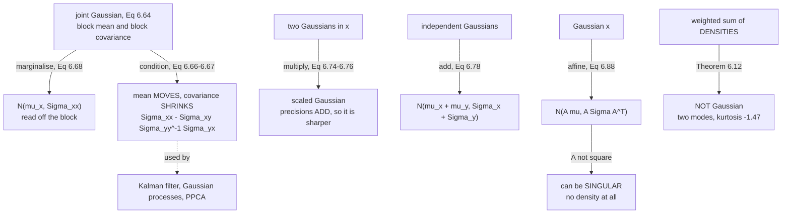

The Gaussian is not the most important distribution because it is common. It is
the most important because it is **closed** under nearly everything you want to
do to it. Marginalise a Gaussian: Gaussian. Condition on part of it: Gaussian.
Multiply two: a scaled Gaussian. Add two independent ones: Gaussian. Push one
through a linear map: Gaussian. Each of those is a closed-form formula in the
mean and covariance, so a whole inference pipeline collapses to matrix algebra.

The book's framing: *"Its importance originates from the fact that it has many
computationally convenient properties."* This page is those properties, each one
verified.

## What you'll learn

- **Equations 6.62 and 6.63**: the univariate and multivariate densities, and the
  **standard normal**.
- **§6.5.1**: marginals (**Equation 6.68**) and conditionals (**Equations 6.66,
  6.67**) of a Gaussian are Gaussian — with **Example 6.6** worked to the book's
  exact numbers.
- Why conditioning **can only shrink** the covariance, proved as a
  positive-semidefinite check.
- **§6.5.2**: the product of two Gaussians, **Equations 6.74 to 6.77**, and why a
  Gaussian posterior is always sharper than its prior.
- **§6.5.3**: sums (**6.78**), weighted sums (**6.79**), affine maps
  (**6.86–6.88**), and the reverse problem (**6.89–6.91**) that turns out to be
  least squares.
- **Theorem 6.12** and the **law of total variance** — and the distinction the
  book flags in a Remark: a weighted sum of Gaussian *random variables* is
  Gaussian, a weighted sum of Gaussian *densities* is not.
- **§6.5.4**: how sampling actually works — Box–Müller, then Cholesky.

## Intuition: closure is the whole story

Most distributions do not survive being operated on. Take the marginal of a
two-dimensional uniform on a triangle and you get a linear ramp, not a uniform.
Condition a mixture and the weights change. Multiply two Beta densities and you
get something with no name.

The Gaussian survives all of it, and — the part that matters — it survives in a
form you can *write down*. If a Gaussian is fully described by
$(\boldsymbol{\mu}, \boldsymbol{\Sigma})$, and every operation maps
$(\boldsymbol{\mu}, \boldsymbol{\Sigma})$ to a new
$(\boldsymbol{\mu}', \boldsymbol{\Sigma}')$ by matrix formulas, then inference
never involves an integral. That is why the Kalman filter, Gaussian processes,
probabilistic PCA and Bayesian linear regression all exist as closed-form
algorithms rather than as sampling problems.

Two operations to keep apart, because they look similar and behave differently:

- **Marginalising** ("I do not care about $y$") just *reads off* the relevant
  block. Nothing moves.
- **Conditioning** ("I observed $y = -1$") *moves the mean* toward what the
  observation implies and *shrinks the variance*, by an amount set by how
  correlated the two were.



## The math

### Equations 6.62 and 6.63: the densities

Univariate:

$$
p(x \mid \mu, \sigma^2) = \frac{1}{\sqrt{2\pi\sigma^2}}\exp\!\left(-\frac{(x-\mu)^2}{2\sigma^2}\right)
\tag{6.62}
$$

Multivariate, for $\mathbf{x}\in\mathbb{R}^D$:

$$
p(\mathbf{x}\mid\boldsymbol{\mu},\boldsymbol{\Sigma}) = (2\pi)^{-\frac{D}{2}}\lvert\boldsymbol{\Sigma}\rvert^{-\frac12}\exp\!\left(-\tfrac12(\mathbf{x}-\boldsymbol{\mu})^\top\boldsymbol{\Sigma}^{-1}(\mathbf{x}-\boldsymbol{\mu})\right)
\tag{6.63}
$$

written $p(\mathbf{x}) = \mathcal{N}(\mathbf{x}\mid\boldsymbol{\mu},\boldsymbol{\Sigma})$
or $X \sim \mathcal{N}(\boldsymbol{\mu},\boldsymbol{\Sigma})$. With
$\boldsymbol{\mu}=\mathbf{0}$ and $\boldsymbol{\Sigma}=\mathbf{I}$ it is the
**standard normal**.

Note what Equation 6.63 needs: $\boldsymbol{\Sigma}^{-1}$ and
$\lvert\boldsymbol{\Sigma}\rvert^{-1/2}$. A **singular** covariance has no
inverse and zero determinant, so it has **no density** — a fact that matters as
soon as you apply a rank-reducing linear map.

### §6.5.1: marginals and conditionals

Write the joint over the concatenated states:

$$
p(\mathbf{x},\mathbf{y}) = \mathcal{N}\!\left(\begin{bmatrix}\boldsymbol{\mu}_x\\\boldsymbol{\mu}_y\end{bmatrix},\ \begin{bmatrix}\boldsymbol{\Sigma}_{xx} & \boldsymbol{\Sigma}_{xy}\\ \boldsymbol{\Sigma}_{yx} & \boldsymbol{\Sigma}_{yy}\end{bmatrix}\right)
\tag{6.64}
$$

**The conditional is Gaussian:**

$$
p(\mathbf{x}\mid\mathbf{y}) = \mathcal{N}\bigl(\boldsymbol{\mu}_{x\mid y},\ \boldsymbol{\Sigma}_{x\mid y}\bigr)
\tag{6.65}
$$

$$
\boldsymbol{\mu}_{x\mid y} = \boldsymbol{\mu}_x + \boldsymbol{\Sigma}_{xy}\boldsymbol{\Sigma}_{yy}^{-1}(\mathbf{y}-\boldsymbol{\mu}_y)
\tag{6.66}
$$

$$
\boldsymbol{\Sigma}_{x\mid y} = \boldsymbol{\Sigma}_{xx} - \boldsymbol{\Sigma}_{xy}\boldsymbol{\Sigma}_{yy}^{-1}\boldsymbol{\Sigma}_{yx}
\tag{6.67}
$$

In Equation 6.66 the $\mathbf{y}$-value *is an observation and no longer random*.

**The marginal is Gaussian**, and is obtained by the sum rule:

$$
p(\mathbf{x}) = \int p(\mathbf{x},\mathbf{y})\,\mathrm{d}\mathbf{y} = \mathcal{N}\bigl(\mathbf{x}\mid\boldsymbol{\mu}_x,\boldsymbol{\Sigma}_{xx}\bigr)
\tag{6.68}
$$

*"Intuitively, looking at the joint distribution, we ignore (integrate out)
everything we are not interested in."* Which in practice means: delete the rows
and columns you do not want. No integral is computed.

:::note[Look at Equation 6.67 again]
The conditional covariance is the marginal covariance **minus** a term of the
form $\mathbf{M}\mathbf{M}^\top$-ish — specifically
$\boldsymbol{\Sigma}_{xy}\boldsymbol{\Sigma}_{yy}^{-1}\boldsymbol{\Sigma}_{yx}$,
which is positive semidefinite whenever $\boldsymbol{\Sigma}_{yy}$ is. So
**conditioning can never increase the variance**, and it reduces it by exactly as
much as $\mathbf{x}$ and $\mathbf{y}$ were correlated. Measured on a 5-dimensional
example below:
$\boldsymbol{\Sigma}_{xx} - \boldsymbol{\Sigma}_{x\mid y}$ has eigenvalues
$[0,\ 0.186,\ 1.847]$ — all non-negative — and the total variance falls by 7%.

If $\boldsymbol{\Sigma}_{xy} = \mathbf{0}$ the subtracted term vanishes and
conditioning changes nothing. That is independence, and it is why observing an
uncorrelated variable teaches you nothing.
:::

The book lists where the conditional Gaussian shows up: the **Kalman filter**
(*"does nothing but computing Gaussian conditionals of joint distributions"*),
**Gaussian processes** (condition a joint over function values on the observed
data), and **latent linear Gaussian models** including probabilistic PCA.

### §6.5.2: the product of two Gaussians

The product $\mathcal{N}(\mathbf{x}\mid\mathbf{a},\mathbf{A})\,\mathcal{N}(\mathbf{x}\mid\mathbf{b},\mathbf{B})$
is a Gaussian scaled by a constant, $c\,\mathcal{N}(\mathbf{x}\mid\mathbf{c},\mathbf{C})$, with

$$
\mathbf{C} = (\mathbf{A}^{-1}+\mathbf{B}^{-1})^{-1}
\tag{6.74}
$$

$$
\mathbf{c} = \mathbf{C}(\mathbf{A}^{-1}\mathbf{a}+\mathbf{B}^{-1}\mathbf{b})
\tag{6.75}
$$

$$
c = (2\pi)^{-\frac{D}{2}}\lvert\mathbf{A}+\mathbf{B}\rvert^{-\frac12}\exp\!\left(-\tfrac12(\mathbf{a}-\mathbf{b})^\top(\mathbf{A}+\mathbf{B})^{-1}(\mathbf{a}-\mathbf{b})\right)
\tag{6.76}
$$

and the scaling constant is itself a Gaussian density with an *inflated*
covariance:

$$
c = \mathcal{N}(\mathbf{a}\mid\mathbf{b},\mathbf{A}+\mathbf{B}) = \mathcal{N}(\mathbf{b}\mid\mathbf{a},\mathbf{A}+\mathbf{B})
\tag{6.77}
$$

**Read Equation 6.74 as precisions.** $\mathbf{C}^{-1} = \mathbf{A}^{-1}+\mathbf{B}^{-1}$:
*precisions add*. So $\mathbf{C}$ is smaller than both $\mathbf{A}$ and
$\mathbf{B}$ — always. Combining two Gaussian pieces of information gives
something sharper than either. That is Bayes' theorem for Gaussians, and it is
the mechanism behind every "the posterior is narrower than the prior" statement
in Chapter 9.

### §6.5.3: sums and linear transformations

For **independent** Gaussians:

$$
p(\mathbf{x}+\mathbf{y}) = \mathcal{N}\bigl(\boldsymbol{\mu}_x+\boldsymbol{\mu}_y,\ \boldsymbol{\Sigma}_x+\boldsymbol{\Sigma}_y\bigr)
\tag{6.78}
$$

and for a weighted sum (Example 6.7):

$$
p(a\mathbf{x}+b\mathbf{y}) = \mathcal{N}\bigl(a\boldsymbol{\mu}_x+b\boldsymbol{\mu}_y,\ a^2\boldsymbol{\Sigma}_x+b^2\boldsymbol{\Sigma}_y\bigr)
\tag{6.79}
$$

The coefficients enter the covariance **squared**, so a negative weight still
*adds* variance.

For any matrix $\mathbf{A}$ of the right shape,
$\mathbb{E}[\mathbf{A}\mathbf{x}] = \mathbf{A}\boldsymbol{\mu}$ and
$\mathbb{V}[\mathbf{A}\mathbf{x}] = \mathbf{A}\boldsymbol{\Sigma}\mathbf{A}^\top$
(Equations 6.86, 6.87), so

$$
p(\mathbf{y}) = \mathcal{N}\bigl(\mathbf{y}\mid\mathbf{A}\boldsymbol{\mu},\ \mathbf{A}\boldsymbol{\Sigma}\mathbf{A}^\top\bigr)
\tag{6.88}
$$

*Any* linear or affine transformation of a Gaussian is Gaussian.

**The reverse problem.** Suppose $p(\mathbf{y}) = \mathcal{N}(\mathbf{y}\mid\mathbf{A}\mathbf{x},\boldsymbol{\Sigma})$
with $\mathbf{A}\in\mathbb{R}^{M\times N}$ full rank, $M \geqslant N$ — so
$\mathbf{A}$ is *not* invertible. Pre-multiply by $\mathbf{A}^\top$ and invert
$\mathbf{A}^\top\mathbf{A}$, which is symmetric positive definite:

$$
\mathbf{y} = \mathbf{A}\mathbf{x} \iff (\mathbf{A}^\top\mathbf{A})^{-1}\mathbf{A}^\top\mathbf{y} = \mathbf{x}
\tag{6.90}
$$

$$
p(\mathbf{x}) = \mathcal{N}\bigl(\mathbf{x}\mid(\mathbf{A}^\top\mathbf{A})^{-1}\mathbf{A}^\top\mathbf{y},\ (\mathbf{A}^\top\mathbf{A})^{-1}\mathbf{A}^\top\boldsymbol{\Sigma}\mathbf{A}(\mathbf{A}^\top\mathbf{A})^{-1}\bigr)
\tag{6.91}
$$

That mean is the **pseudo-inverse** of §3.9 — which is to say, the least-squares
solution. Chapter 9's linear regression is not bolted onto probability; it falls
out of a Gaussian assumption.

### Theorem 6.12: the mixture

For $p(x) = \alpha p_1(x) + (1-\alpha)p_2(x)$ with $0<\alpha<1$ and two different
Gaussian components:

$$
\mathbb{E}[x] = \alpha\mu_1 + (1-\alpha)\mu_2
\tag{6.81}
$$

$$
\mathbb{V}[x] = \underbrace{\bigl[\alpha\sigma_1^2+(1-\alpha)\sigma_2^2\bigr]}_{\text{within}} + \underbrace{\Bigl(\bigl[\alpha\mu_1^2+(1-\alpha)\mu_2^2\bigr]-\bigl[\alpha\mu_1+(1-\alpha)\mu_2\bigr]^2\Bigr)}_{\text{between}}
\tag{6.82}
$$

The mean is the weighted average of the means. **The variance is not the weighted
average of the variances** — there is a second term, the spread of the component
*means*. Equation 6.82 is an instance of the **law of total variance**:

$$
\mathbb{V}_X[x] = \mathbb{E}_Y\bigl[\mathbb{V}_X[x\mid y]\bigr] + \mathbb{V}_Y\bigl[\mathbb{E}_X[x\mid y]\bigr]
$$

the expected conditional variance plus the variance of the conditional mean.

:::danger[A weighted sum of densities is not a weighted sum of random variables]
The book flags this in a Remark, and it is the most common confusion in the
section. **Adding Gaussian random variables** gives a Gaussian (Equation 6.78).
**Averaging Gaussian densities** gives a mixture, which is *not* Gaussian.

Measured on $0.4\,\mathcal{N}(0,1) + 0.6\,\mathcal{N}(6,1)$: mean $3.6$, variance
$9.64$. Beside a Gaussian with the *same two moments*:

| | mean | variance | skew | excess kurtosis | modes |
|---|---|---|---|---|---|
| the mixture | $3.5968$ | $9.6382$ | $-0.3445$ | $\mathbf{-1.4746}$ | **2** |
| matched Gaussian | $3.5996$ | $9.6252$ | $-0.0016$ | $+0.0026$ | 1 |

Identical to two moments, and different in every way that matters. Note also that
the mixture's *mean*, $3.6$, sits in the low-density valley between its two humps.
:::

### §6.5.4: how sampling works

Three stages: a uniform pseudo-random source; a nonlinear transform such as
**Box–Müller** to get a univariate standard normal; then stack them for
$\mathcal{N}(\mathbf{0},\mathbf{I})$.

For a general $\mathcal{N}(\boldsymbol{\mu},\boldsymbol{\Sigma})$, use the linear
transformation property: if $\mathbf{x}\sim\mathcal{N}(\mathbf{0},\mathbf{I})$
then $\mathbf{y} = \mathbf{A}\mathbf{x}+\boldsymbol{\mu}$ has covariance
$\mathbf{A}\mathbf{A}^\top$. Choose $\mathbf{A}$ as the **Cholesky factor**
$\boldsymbol{\Sigma} = \mathbf{A}\mathbf{A}^\top$ — it exists because covariance
matrices are symmetric positive definite ([§4.3](../../chapter-04---matrix-decompositions/cholesky-decomposition/)),
and it is *triangular*, so the transform is cheap.

## Worked example by hand

The book's **Example 6.6**:

$$
p(x_1,x_2) = \mathcal{N}\!\left(\begin{bmatrix}0\\2\end{bmatrix},\ \begin{bmatrix}0.3 & -1\\ -1 & 5\end{bmatrix}\right)
\tag{6.69}
$$

**Step 0 — is this a valid covariance?** Eigenvalues $0.096081$ and $5.203919$:
both positive, so yes. (Worth checking: $\det = 1.5 - 1 = 0.5 > 0$ and the
diagonal is positive.) Correlation
$-1/\sqrt{0.3\times5} = -0.8165$ — strongly negative.

**Step 1 — condition on $x_2 = -1$.** Here $\Sigma_{xy} = -1$,
$\Sigma_{yy} = 5$ so $\Sigma_{yy}^{-1} = 0.2$, and $y-\mu_y = -1-2 = -3$.
Equation 6.66:

$$
\mu_{x_1\mid x_2=-1} = 0 + (-1)\cdot 0.2\cdot(-1-2) = 0.6
\tag{6.70}
$$

Equation 6.67:

$$
\sigma^2_{x_1\mid x_2=-1} = 0.3 - (-1)\cdot0.2\cdot(-1) = 0.3 - 0.2 = 0.1
\tag{6.71}
$$

so

$$
p(x_1\mid x_2=-1) = \mathcal{N}(0.6,\ 0.1)
\tag{6.72}
$$

**Step 2 — the marginal, by contrast.** Equation 6.68 says just read the block:

$$
p(x_1) = \mathcal{N}(0,\ 0.3)
\tag{6.73}
$$

**Step 3 — compare them.**

| | mean | variance |
|---|---|---|
| marginal $p(x_1)$ | $0$ | $0.3$ |
| conditional $p(x_1\mid x_2=-1)$ | $\mathbf{0.6}$ | $\mathbf{0.1}$ |

Conditioning moved the mean by $0.6$ and cut the variance by a factor of **3**.
Marginalising did neither. And the direction of the shift makes sense: $x_1$ and
$x_2$ are negatively correlated, we observed $x_2$ *below* its mean, so $x_1$ is
pulled *above* its own.

**Step 4 — check without the formulas.** Four million samples from Equation 6.69,
then look at those with $x_2$ within $0.02$ of $-1$:

| | mean | variance |
|---|---|---|
| all samples, coordinate 1 | $+0.000007$ | $0.300088$ |
| the $11\,721$ samples near $x_2=-1$ | $+0.595068$ | $0.101223$ |

$0.595$ against the predicted $0.6$, and $0.101$ against $0.1$.

## See it move

```p5 title="Marginalise, or condition" desc="Drag the observation line and the correlation. The marginal never changes — it is a block of the covariance matrix. The conditional slides along and narrows, by exactly the amount Equation 6.67 subtracts. Set the correlation to zero and conditioning stops doing anything at all, which is what independence means." height="620"
let yObs = -1.0, rho = -0.8165;
let KNOBS = [], BTNS = [], dragging = null;

const MU = [0.0, 2.0];
const V1 = 0.3, V2 = 5.0;

function setup() { createCanvas(600, 620); textFont("monospace"); noLoop(); }

function knob(id, x, y, w, value, mn, mx, label) {
  KNOBS.push({ id, x, y, w, mn, mx });
  const t = (value - mn) / (mx - mn);
  stroke(60, 74, 92); strokeWeight(2); line(x, y, x + w, y);
  noStroke(); fill(255, 211, 67); ellipse(x + t * w, y, 10, 10);
  fill(190, 200, 212); textSize(11); textAlign(LEFT, CENTER);
  text(label, x + w + 12, y);
}
function mousePressed() {
  for (const b of BTNS)
    if (mouseX > b.x && mouseX < b.x + b.w && mouseY > b.y && mouseY < b.y + b.h) {
      rho = b.r; redraw(); return;
    }
  for (const k of KNOBS)
    if (mouseY > k.y - 11 && mouseY < k.y + 11 && mouseX > k.x - 11 && mouseX < k.x + k.w + 11) {
      dragging = k; return;
    }
}
function mouseReleased() { dragging = null; }
function mouseDragged() {
  if (!dragging) return;
  const t = Math.min(1, Math.max(0, (mouseX - dragging.x) / dragging.w));
  const v = dragging.mn + t * (dragging.mx - dragging.mn);
  if (dragging.id === "y") yObs = Math.round(v * 100) / 100;
  if (dragging.id === "rho") rho = Math.round(v * 1000) / 1000;
  redraw();
}

const norm = (x, m, v) => Math.exp(-0.5 * (x - m) ** 2 / v) / Math.sqrt(2 * Math.PI * v);

function draw() {
  background(13, 17, 23);
  KNOBS = []; BTNS = [];

  const cov = rho * Math.sqrt(V1 * V2);
  // Eq 6.66 and 6.67.
  const muC = MU[0] + cov / V2 * (yObs - MU[1]);
  const varC = V1 - cov / V2 * cov;

  const PL = { x: 56, y: 74, w: 250, h: 250 };
  const XR = [-2.2, 2.2], YR = [-6, 10];
  const sx = (x) => PL.x + ((x - XR[0]) / (XR[1] - XR[0])) * PL.w;
  const sy = (y) => PL.y + PL.h - ((y - YR[0]) / (YR[1] - YR[0])) * PL.h;

  noStroke(); fill(19, 25, 33); rect(PL.x, PL.y, PL.w, PL.h, 4);

  // Contours of the joint: ellipses from the covariance.
  const det = V1 * V2 - cov * cov;
  const i11 = V2 / det, i22 = V1 / det, i12 = -cov / det;
  for (const lev of [0.4, 1.0, 1.8, 2.8, 4.0]) {
    stroke(107, 169, 221, 190); strokeWeight(1.3); noFill();
    beginShape();
    for (let t = 0; t <= 64; t++) {
      const th = (t / 64) * 2 * Math.PI;
      // Solve the quadratic form along direction (cos, sin) for radius r.
      const cx = Math.cos(th), cy = Math.sin(th);
      const q = i11 * cx * cx + 2 * i12 * cx * cy + i22 * cy * cy;
      const r = Math.sqrt(lev / q);
      vertex(sx(MU[0] + r * cx), sy(MU[1] + r * cy));
    }
    endShape(CLOSE);
  }
  // The observation line.
  stroke(255, 211, 67); strokeWeight(2.2);
  line(PL.x, sy(yObs), PL.x + PL.w, sy(yObs));
  noStroke(); fill(255, 211, 67); textSize(10); textAlign(LEFT, BOTTOM);
  text(`x2 = ${yObs.toFixed(2)}`, PL.x + 4, sy(yObs) - 3);
  fill(232, 110, 110); noStroke();
  ellipse(sx(MU[0]), sy(MU[1]), 8, 8);

  noStroke(); fill(150); textSize(10); textAlign(CENTER, TOP);
  text("x1", PL.x + PL.w / 2, PL.y + PL.h + 6);
  textAlign(RIGHT, CENTER); text("x2", PL.x - 8, PL.y + PL.h / 2);

  // The two densities on the right.
  const PR = { x: 340, y: 74, w: 236, h: 250 };
  noStroke(); fill(19, 25, 33); rect(PR.x, PR.y, PR.w, PR.h, 4);
  const peak = Math.max(norm(muC, muC, varC), norm(MU[0], MU[0], V1)) * 1.12;
  const rx = (x) => PR.x + ((x - XR[0]) / (XR[1] - XR[0])) * PR.w;
  const ry = (v) => PR.y + PR.h - (v / peak) * PR.h;
  stroke(60, 74, 92); strokeWeight(1); line(PR.x, ry(0), PR.x + PR.w, ry(0));

  stroke(120, 200, 150); strokeWeight(2.4); noFill();
  beginShape();
  for (let i = 0; i <= 200; i++) {
    const x = XR[0] + (XR[1] - XR[0]) * i / 200;
    vertex(rx(x), ry(norm(x, MU[0], V1)));
  }
  endShape();
  stroke(255, 211, 67); strokeWeight(2.4); noFill();
  beginShape();
  for (let i = 0; i <= 200; i++) {
    const x = XR[0] + (XR[1] - XR[0]) * i / 200;
    vertex(rx(x), ry(norm(x, muC, varC)));
  }
  endShape();

  noStroke(); textAlign(LEFT, TOP);
  fill(255, 211, 67); textSize(15);
  text("marginalise or condition", 16, 12);
  fill(200, 210, 222); textSize(11);
  text("green: p(x1), Eq 6.68.   amber: p(x1 | x2), Eq 6.66 and 6.67.", 16, 34);

  const y0 = 344;
  fill(120, 200, 150); textSize(12);
  text(`marginal     N(${MU[0].toFixed(4)}, ${V1.toFixed(4)})`, 16, y0);
  fill(255, 211, 67);
  text(`conditional  N(${muC.toFixed(4)}, ${varC.toFixed(4)})`, 16, y0 + 20);
  fill(150); textSize(11);
  text(`covariance = rho sqrt(V1 V2) = ${cov.toFixed(4)}`, 16, y0 + 44);
  text(`Eq 6.67 subtracts ${(cov / V2 * cov).toFixed(4)} from the variance`, 16, y0 + 62);
  text(`mean shifted by ${(muC - MU[0]).toFixed(4)}`, 16, y0 + 80);
  const shrink = V1 / varC;
  fill(shrink > 1.001 ? color(120, 200, 150) : color(232, 110, 110)); textSize(12);
  text(shrink > 1.001
    ? `conditioning narrowed it by a factor of ${shrink.toFixed(2)}`
    : `zero correlation: conditioning changes NOTHING`, 16, y0 + 104);
  fill(150); textSize(10.5);
  text("the subtracted term is a square, so it can never be negative --", 16, y0 + 126);
  text("conditioning can only ever shrink a Gaussian's variance.", 16, y0 + 141);

  knob("y", 16, 512, 190, yObs, -6, 10, `observed x2 = ${yObs.toFixed(2)}`);
  knob("rho", 16, 540, 190, rho, -0.98, 0.98, `correlation = ${rho.toFixed(3)}`);
  const PRE = [["the book's -0.8165", -0.8165], ["zero", 0.0], ["+0.9", 0.9]];
  for (let i = 0; i < PRE.length; i++) {
    const x = 340 + (i % 2) * 128, y = 508 + Math.floor(i / 2) * 26;
    BTNS.push({ x, y, w: 122, h: 22, r: PRE[i][1] });
    noStroke(); fill(Math.abs(rho - PRE[i][1]) < 1e-6 ? color(255, 211, 67) : color(38, 48, 60));
    rect(x, y, 122, 22, 4);
    fill(Math.abs(rho - PRE[i][1]) < 1e-6 ? 13 : 205); textSize(9.5); textAlign(CENTER, CENTER);
    text(PRE[i][0], x + 61, y + 11);
  }
  fill(120, 130, 145); textSize(10.5); textAlign(LEFT, TOP);
  text("Example 6.6 uses x2 = -1 and rho = -0.8165,", 340, 566);
  text("giving N(0.6, 0.1) against a marginal N(0, 0.3).", 340, 581);
}
```

```p5 title="Sum of variables, or mixture of densities" desc="The same two Gaussians, combined two different ways. Adding the random variables gives a Gaussian whose variance is the sum. Averaging the densities gives a mixture, which is not Gaussian at all — and the panel shows both against the Gaussian that shares the mixture's mean and variance. Slide the separation to watch the mixture split in two while its moments stay matched." height="600"
let sep = 6.0, alpha = 0.4, mode = 0;
let KNOBS = [], BTNS = [], dragging = null;

function setup() { createCanvas(600, 600); textFont("monospace"); noLoop(); }

function knob(id, x, y, w, value, mn, mx, label) {
  KNOBS.push({ id, x, y, w, mn, mx });
  const t = (value - mn) / (mx - mn);
  stroke(60, 74, 92); strokeWeight(2); line(x, y, x + w, y);
  noStroke(); fill(255, 211, 67); ellipse(x + t * w, y, 10, 10);
  fill(190, 200, 212); textSize(11); textAlign(LEFT, CENTER);
  text(label, x + w + 12, y);
}
function mousePressed() {
  for (const b of BTNS)
    if (mouseX > b.x && mouseX < b.x + b.w && mouseY > b.y && mouseY < b.y + b.h) {
      mode = b.m; redraw(); return;
    }
  for (const k of KNOBS)
    if (mouseY > k.y - 11 && mouseY < k.y + 11 && mouseX > k.x - 11 && mouseX < k.x + k.w + 11) {
      dragging = k; return;
    }
}
function mouseReleased() { dragging = null; }
function mouseDragged() {
  if (!dragging) return;
  const t = Math.min(1, Math.max(0, (mouseX - dragging.x) / dragging.w));
  const v = dragging.mn + t * (dragging.mx - dragging.mn);
  if (dragging.id === "sep") sep = Math.round(v * 10) / 10;
  if (dragging.id === "a") alpha = Math.round(v * 100) / 100;
  redraw();
}

const norm = (x, m, v) => Math.exp(-0.5 * (x - m) ** 2 / v) / Math.sqrt(2 * Math.PI * v);

function draw() {
  background(13, 17, 23);
  KNOBS = []; BTNS = [];

  const m1 = 0, m2 = sep, v1 = 1, v2 = 1;

  // Theorem 6.12.
  const mixMean = alpha * m1 + (1 - alpha) * m2;
  const within = alpha * v1 + (1 - alpha) * v2;
  const between = alpha * m1 * m1 + (1 - alpha) * m2 * m2 - mixMean * mixMean;
  const mixVar = within + between;
  // Eq 6.78, if instead we ADD the two random variables.
  const sumMean = m1 + m2, sumVar = v1 + v2;

  const XR = mode === 0 ? [-6, sep + 7] : [-6, sep + 9];
  const PL = { x: 56, y: 78, w: 512, h: 260 };
  const sx = (x) => PL.x + ((x - XR[0]) / (XR[1] - XR[0])) * PL.w;

  const curves = [];
  if (mode === 0) {
    curves.push(["the mixture, Thm 6.12", (x) => alpha * norm(x, m1, v1) + (1 - alpha) * norm(x, m2, v2), [107, 169, 221], 2.6]);
    curves.push(["Gaussian, same mean+var", (x) => norm(x, mixMean, mixVar), [232, 110, 110], 2.2]);
    curves.push(["component 1, weighted", (x) => alpha * norm(x, m1, v1), [120, 130, 145], 1.2]);
    curves.push(["component 2, weighted", (x) => (1 - alpha) * norm(x, m2, v2), [120, 130, 145], 1.2]);
  } else {
    curves.push(["p(x), N(0,1)", (x) => norm(x, m1, v1), [120, 130, 145], 1.6]);
    curves.push(["p(y), N(sep,1)", (x) => norm(x, m2, v2), [120, 130, 145], 1.6]);
    curves.push(["p(x+y), Eq 6.78", (x) => norm(x, sumMean, sumVar), [120, 200, 150], 2.6]);
  }
  let peak = 0;
  for (let i = 0; i <= 400; i++) {
    const x = XR[0] + (XR[1] - XR[0]) * i / 400;
    for (const c of curves) peak = Math.max(peak, c[1](x));
  }
  peak *= 1.14;
  const sy = (v) => PL.y + PL.h - (v / peak) * PL.h;

  noStroke(); fill(19, 25, 33); rect(PL.x, PL.y, PL.w, PL.h, 4);
  stroke(60, 74, 92); strokeWeight(1); line(PL.x, sy(0), PL.x + PL.w, sy(0));
  for (const [, f, col, wgt] of curves) {
    stroke(col[0], col[1], col[2]); strokeWeight(wgt); noFill();
    beginShape();
    for (let i = 0; i <= 500; i++) {
      const x = XR[0] + (XR[1] - XR[0]) * i / 500;
      vertex(sx(x), sy(f(x)));
    }
    endShape();
  }
  if (mode === 0) {
    stroke(255, 211, 67); strokeWeight(1.8);
    line(sx(mixMean), PL.y, sx(mixMean), PL.y + PL.h);
    noStroke(); fill(255, 211, 67); textSize(10); textAlign(LEFT, TOP);
    text(`mean ${mixMean.toFixed(2)}`, sx(mixMean) + 4, PL.y + 4);
  }

  noStroke(); textAlign(LEFT, TOP);
  fill(255, 211, 67); textSize(15);
  text(mode === 0 ? "a mixture of densities is NOT a Gaussian"
                  : "a sum of Gaussian variables IS a Gaussian", 16, 12);
  fill(200, 210, 222); textSize(11);
  let ly = 40;
  for (const [nm, , col] of curves.slice(0, mode === 0 ? 2 : 3)) {
    fill(col[0], col[1], col[2]); textSize(10.5);
    text("--- " + nm, 16 + (curves.indexOf(curves.find((c) => c[0] === nm))) * 0, ly);
    ly += 15;
  }

  const y0 = 356;
  if (mode === 0) {
    fill(235); textSize(12);
    text(`Eq 6.81  E[x] = ${mixMean.toFixed(6)}`, 16, y0);
    text(`Eq 6.82  V[x] = ${mixVar.toFixed(6)}`, 16, y0 + 20);
    fill(120, 200, 150); textSize(11);
    text(`  within-component  E[V[x|y]] = ${within.toFixed(6)}`, 16, y0 + 42);
    fill(197, 153, 255);
    text(`  between-component V[E[x|y]] = ${between.toFixed(6)}`, 16, y0 + 60);
    fill(232, 110, 110); textSize(11.5);
    text(`'average the variances' gives ${within.toFixed(3)} -- too small by ${(mixVar / within).toFixed(2)}x`, 16, y0 + 84);
    // Count modes of the mixture numerically.
    let modes = 0;
    const f = (x) => alpha * norm(x, m1, v1) + (1 - alpha) * norm(x, m2, v2);
    for (let i = 2; i < 498; i++) {
      const a0 = XR[0] + (XR[1] - XR[0]) * (i - 1) / 500;
      const a1 = XR[0] + (XR[1] - XR[0]) * i / 500;
      const a2 = XR[0] + (XR[1] - XR[0]) * (i + 1) / 500;
      if (f(a1) > f(a0) && f(a1) > f(a2) && f(a1) > 0.02 * peak) modes++;
    }
    fill(modes > 1 ? color(197, 153, 255) : color(150)); textSize(12);
    text(`the mixture has ${modes} mode${modes === 1 ? "" : "s"}; the matched Gaussian has 1`, 16, y0 + 108);
    fill(150); textSize(10.5);
    text("at this separation the mixture's MEAN sits where its density is low.", 16, y0 + 130);
  } else {
    fill(120, 200, 150); textSize(12);
    text(`Eq 6.78  p(x+y) = N(${sumMean.toFixed(4)}, ${sumVar.toFixed(4)})`, 16, y0);
    fill(150); textSize(11);
    text(`  the means add: ${m1} + ${m2} = ${sumMean}`, 16, y0 + 22);
    text(`  the variances add: ${v1} + ${v2} = ${sumVar}`, 16, y0 + 40);
    fill(120, 200, 150); textSize(11.5);
    text("one hump, whatever the separation. Adding random variables", 16, y0 + 64);
    text("SHIFTS and WIDENS; it never splits.", 16, y0 + 82);
    fill(150); textSize(10.5);
    text("contrast this with the mixture view -- same two Gaussians,", 16, y0 + 106);
    text("completely different object.", 16, y0 + 121);
  }

  knob("sep", 16, 508, 180, sep, 0, 12, `separation = ${sep.toFixed(1)}`);
  if (mode === 0) knob("a", 16, 536, 180, alpha, 0.05, 0.95, `alpha = ${alpha.toFixed(2)}`);
  const labels = ["mixture of densities", "sum of variables"];
  for (let m = 0; m < 2; m++) {
    const x = 340, y = 508 + m * 26;
    BTNS.push({ x, y, w: 210, h: 22, m });
    noStroke(); fill(mode === m ? color(255, 211, 67) : color(38, 48, 60));
    rect(x, y, 210, 22, 4);
    fill(mode === m ? 13 : 205); textSize(10.5); textAlign(CENTER, CENTER);
    text(labels[m], x + 105, y + 11);
  }
}
```

## From scratch

```python title="gaussian_closure.py" showLineNumbers{1}
"""Section 6.5 — the Gaussian, and every closure property the book claims."""

import numpy as np

np.set_printoptions(precision=6, suppress=True, linewidth=150)


def logpdf(x, mu, S):
    """Eq 6.63, in logs so the determinant does not overflow."""
    x = np.atleast_2d(x)
    D = mu.size
    d = x - mu
    sign, logdet = np.linalg.slogdet(S)
    sol = np.linalg.solve(S, d.T).T
    return -0.5 * (D * np.log(2 * np.pi) + logdet + np.einsum("ij,ij->i", d, sol))


print("########## example_6_6")
# Eq 6.69
MU = np.array([0.0, 2.0])
SIG = np.array([[0.3, -1.0], [-1.0, 5.0]])
print(f"  p(x1,x2) = N(mu, Sigma) with mu = {MU} and")
print(f"  Sigma =\n{SIG}")
print(f"  is Sigma a valid covariance? eigenvalues {np.linalg.eigvalsh(SIG)}")
print(f"  positive definite: {bool((np.linalg.eigvalsh(SIG) > 0).all())}")

# Eq 6.66 and 6.67 with x = x1, y = x2.
Sxx, Sxy, Syy = SIG[0, 0], SIG[0, 1], SIG[1, 1]
y_obs = -1.0
mu_cond = MU[0] + Sxy * (1.0 / Syy) * (y_obs - MU[1])
var_cond = Sxx - Sxy * (1.0 / Syy) * Sxy
print()
print(f"  Eq 6.66  mu_x1|x2=-1 = 0 + (-1)(1/5)(-1 - 2) = {mu_cond:.6f}   (book: 0.6)")
print(f"  Eq 6.67  var         = 0.3 - (-1)(1/5)(-1)   = {var_cond:.6f}   (book: 0.1)")
print(f"  Eq 6.72  p(x1 | x2 = -1) = N({mu_cond:.4f}, {var_cond:.4f})")
print(f"  Eq 6.73  p(x1)           = N({MU[0]:.4f}, {Sxx:.4f})   -- Eq 6.68, just read off")
print()
print("  conditioning SHRANK the variance from 0.3 to 0.1, a factor of "
      f"{Sxx / var_cond:.1f},")
print("  and MOVED the mean from 0 to 0.6. Marginalising does neither: it just")
print("  reads the block off the diagonal.")

# Check both against samples, without using the formulas.
rng = np.random.default_rng(6)
N = 4_000_000
s = rng.multivariate_normal(MU, SIG, N)
band = np.abs(s[:, 1] - y_obs) < 0.02
print()
print(f"  empirical marginal of x1:      mean {s[:,0].mean():+.6f}  var {s[:,0].var():.6f}")
print(f"  empirical p(x1 | x2 ~ -1):     mean {s[band,0].mean():+.6f}  "
      f"var {s[band,0].var():.6f}   ({band.sum():,} samples in the band)")

print()
print("########## marginals_and_conditionals_stay_gaussian")
# Eq 6.68: the marginal is Gaussian with the block mean and covariance.
D = 5
rngA = np.random.default_rng(11)
Araw = rngA.normal(size=(D, D))
SIG5 = Araw @ Araw.T + D * np.eye(D)
MU5 = rngA.normal(size=D) * 2
idx = np.array([0, 2, 4])
jdx = np.array([1, 3])
print(f"  a {D}-dimensional Gaussian; keep {idx.tolist()}, condition on {jdx.tolist()}")
print(f"  Eq 6.68 marginal mean:  {MU5[idx]}")
print(f"  Eq 6.68 marginal cov:\n{SIG5[np.ix_(idx, idx)]}")
Sxx5 = SIG5[np.ix_(idx, idx)]
Sxy5 = SIG5[np.ix_(idx, jdx)]
Syy5 = SIG5[np.ix_(jdx, jdx)]
y5 = np.array([1.3, -0.7])
mu_c5 = MU5[idx] + Sxy5 @ np.linalg.solve(Syy5, y5 - MU5[jdx])   # Eq 6.66
S_c5 = Sxx5 - Sxy5 @ np.linalg.solve(Syy5, Sxy5.T)               # Eq 6.67
print(f"  Eq 6.66 conditional mean: {mu_c5}")
print(f"  Eq 6.67 conditional cov:\n{S_c5}")
print(f"  conditional cov is still positive definite: "
      f"{bool((np.linalg.eigvalsh(S_c5) > 0).all())}")
# Conditioning can only shrink: Sxx - Sc is positive semidefinite.
shrink = Sxx5 - S_c5
print(f"  Sxx - S_conditional has eigenvalues {np.linalg.eigvalsh(shrink)}")
print(f"  -> positive semidefinite, so conditioning NEVER increases variance.")
print(f"  total variance: marginal {np.trace(Sxx5):.6f} -> conditional "
      f"{np.trace(S_c5):.6f}  ({100*(1-np.trace(S_c5)/np.trace(Sxx5)):.1f}% removed)")

print()
print("########## product_of_two_gaussians")
# Eq 6.74 to 6.76.
a = np.array([1.0, -0.5])
A = np.array([[1.2, 0.3], [0.3, 0.8]])
b = np.array([-0.4, 1.1])
B = np.array([[0.6, -0.2], [-0.2, 1.5]])
C = np.linalg.inv(np.linalg.inv(A) + np.linalg.inv(B))            # Eq 6.74
c_mean = C @ (np.linalg.solve(A, a) + np.linalg.solve(B, b))      # Eq 6.75
sign, logdetAB = np.linalg.slogdet(A + B)
diff = a - b
log_c = (-0.5 * 2 * np.log(2 * np.pi) - 0.5 * logdetAB
         - 0.5 * diff @ np.linalg.solve(A + B, diff))             # Eq 6.76
print(f"  Eq 6.74  C =\n{C}")
print(f"  Eq 6.75  c = {c_mean}")
print(f"  Eq 6.76  log scaling constant = {log_c:.10f}   c = {np.exp(log_c):.10e}")
# Eq 6.77: the constant is itself a Gaussian density evaluated at a, or at b.
alt = float(logpdf(a[None, :], b, A + B)[0])
print(f"  Eq 6.77  N(a | b, A+B) log-density = {alt:.10f}   gap {abs(alt-log_c):.1e}")
alt2 = float(logpdf(b[None, :], a, A + B)[0])
print(f"           N(b | a, A+B)             = {alt2:.10f}   gap {abs(alt2-log_c):.1e}")
# And verify the whole claim by integrating the product on a grid.
g = np.linspace(-6, 6, 1400)
X1, X2 = np.meshgrid(g, g)
pts = np.stack([X1.ravel(), X2.ravel()], axis=1)
prod = np.exp(logpdf(pts, a, A) + logpdf(pts, b, B)).reshape(X1.shape)
dx = g[1] - g[0]
mass = prod.sum() * dx * dx
print(f"  integral of the product over the grid: {mass:.10e}")
print(f"  predicted scaling constant:            {np.exp(log_c):.10e}")
print(f"  relative gap {abs(mass - np.exp(log_c)) / np.exp(log_c):.2e}")
m1 = (prod * X1).sum() * dx * dx / mass
m2 = (prod * X2).sum() * dx * dx / mass
print(f"  mean of the normalised product: [{m1:.6f} {m2:.6f}]  vs Eq 6.75 {c_mean}")

print()
print("########## sums_and_linear_maps")
# Eq 6.78, 6.79, 6.88.
mux, Sx = np.array([1.0, 2.0]), np.array([[2.0, 0.5], [0.5, 1.0]])
muy, Sy = np.array([-1.0, 0.5]), np.array([[1.0, -0.3], [-0.3, 0.7]])
rngB = np.random.default_rng(3)
M = 3_000_000
xs = rngB.multivariate_normal(mux, Sx, M)
ys = rngB.multivariate_normal(muy, Sy, M)
z = xs + ys
print(f"  Eq 6.78  p(x+y) = N(mu_x + mu_y, Sigma_x + Sigma_y)")
print(f"    predicted mean {mux + muy}   measured {z.mean(axis=0)}")
print(f"    predicted cov\n{Sx + Sy}")
print(f"    measured cov gap {np.abs(np.cov(z.T, bias=True) - (Sx + Sy)).max():.4f}")
aa, bb = 2.0, -3.0
w = aa * xs + bb * ys
print(f"  Eq 6.79  p(ax+by) = N(a mu_x + b mu_y, a^2 Sigma_x + b^2 Sigma_y)")
print(f"    predicted mean {aa*mux + bb*muy}   measured {w.mean(axis=0)}")
print(f"    cov gap {np.abs(np.cov(w.T, bias=True) - (aa**2*Sx + bb**2*Sy)).max():.4f}")
print("    note the coefficients enter the covariance SQUARED -- a minus sign on b")
print("    does not subtract variance, it adds it.")
Amat = np.array([[1.0, -2.0], [0.5, 0.5], [3.0, 1.0]])
t = xs @ Amat.T
print(f"  Eq 6.88  p(Ax) = N(A mu, A Sigma A^T) with A {Amat.shape}")
print(f"    predicted mean {Amat @ mux}   measured {t.mean(axis=0)}")
print(f"    cov gap {np.abs(np.cov(t.T, bias=True) - Amat @ Sx @ Amat.T).max():.4f}")
print(f"    the result is {Amat.shape[0]}x{Amat.shape[0]} with rank "
      f"{np.linalg.matrix_rank(Amat @ Sx @ Amat.T)} -- singular, so it has NO density")

print()
print("########## reverse_transformation")
# Eq 6.89 to 6.91: y has mean A x; what is the distribution of x?
Ar = np.array([[1.0, 0.5], [0.0, 2.0], [1.5, -1.0]])       # 3x2, full column rank
Sr = np.diag([0.4, 0.9, 0.25])
y_ob = np.array([1.0, -0.5, 2.0])
G = np.linalg.inv(Ar.T @ Ar)
mu_rev = G @ Ar.T @ y_ob                                    # Eq 6.90 / 6.91
S_rev = G @ Ar.T @ Sr @ Ar @ G                              # Eq 6.91
print(f"  A is {Ar.shape}, rank {np.linalg.matrix_rank(Ar)} -- full column rank, not invertible")
print(f"  Eq 6.90  (A^T A)^-1 A^T y = {mu_rev}")
print(f"  Eq 6.91  covariance =\n{S_rev}")
print(f"  and the pseudo-inverse route agrees: "
      f"{np.abs(np.linalg.pinv(Ar) @ y_ob - mu_rev).max():.1e}")
print("  this is the least-squares solution, which is why Chapter 9's linear")
print("  regression falls out of a Gaussian assumption rather than being bolted on.")

print()
print("########## theorem_6_12_mixture")
# Eq 6.80 to 6.82: a mixture's variance is NOT the average of the variances.
alpha, m1_, s1_, m2_, s2_ = 0.4, 0.0, 1.0, 6.0, 1.0
mean_mix = alpha * m1_ + (1 - alpha) * m2_                              # Eq 6.81
var_mix = (alpha * s1_ ** 2 + (1 - alpha) * s2_ ** 2) \
    + (alpha * m1_ ** 2 + (1 - alpha) * m2_ ** 2 - mean_mix ** 2)       # Eq 6.82
print(f"  mixture: {alpha} N({m1_}, {s1_**2}) + {1-alpha} N({m2_}, {s2_**2})")
print(f"  Eq 6.81  E[x] = {mean_mix:.6f}")
print(f"  Eq 6.82  V[x] = {var_mix:.6f}")
print(f"    within-component part (E of the variances): "
      f"{alpha*s1_**2 + (1-alpha)*s2_**2:.6f}")
print(f"    between-component part (variance of the means): "
      f"{var_mix - (alpha*s1_**2 + (1-alpha)*s2_**2):.6f}")
rngC = np.random.default_rng(17)
K = 4_000_000
pickm = rngC.random(K) < alpha
sm = np.where(pickm, rngC.normal(m1_, s1_, K), rngC.normal(m2_, s2_, K))
print(f"  measured: mean {sm.mean():.6f}   var {sm.var():.6f}")
print(f"  gaps: {abs(sm.mean()-mean_mix):.5f} and {abs(sm.var()-var_mix):.5f}")
print()
print("  the naive 'average the variances' answer would be "
      f"{alpha*s1_**2 + (1-alpha)*s2_**2:.4f}, which is")
print(f"  {var_mix/(alpha*s1_**2 + (1-alpha)*s2_**2):.2f} times too small. That extra term is the law of")
print("  total variance: V[x] = E[V[x|y]] + V[E[x|y]].")
# Verify the law of total variance directly on the component label.
ev = alpha * s1_ ** 2 + (1 - alpha) * s2_ ** 2
ve = alpha * (m1_ - mean_mix) ** 2 + (1 - alpha) * (m2_ - mean_mix) ** 2
print(f"  E[V[x|y]] = {ev:.6f}   V[E[x|y]] = {ve:.6f}   sum = {ev+ve:.6f}")

print()
print("########## a_mixture_of_gaussians_is_not_a_gaussian")
# The book's Remark: a weighted sum of DENSITIES is not a weighted sum of
# RANDOM VARIABLES. The first is not Gaussian; the second is.
print("  the mixture above has mean 3.6 and variance 9.64. Compare it with the")
print("  Gaussian that shares those two moments:")
gauss_match = rngC.normal(mean_mix, np.sqrt(var_mix), K)
for name, d in (("mixture", sm), ("matched Gaussian", gauss_match)):
    z0 = (d - d.mean()) / d.std()
    print(f"    {name:<18} mean {d.mean():+.4f}  var {d.var():.4f}  "
          f"skew {np.mean(z0**3):+.4f}  excess kurtosis {np.mean(z0**4)-3:+.4f}")
print("  identical to two moments, different from the third onward. And the shapes")
print("  differ qualitatively: count the modes of each.")
for name, d in (("mixture", sm), ("matched Gaussian", gauss_match)):
    h, e = np.histogram(d, bins=200, density=True)
    k = np.ones(7) / 7
    sm2 = np.convolve(h, k, mode="same")
    pk = [i for i in range(2, len(sm2)-2)
          if sm2[i] > sm2[i-1] and sm2[i] > sm2[i+1] and sm2[i] > 0.15*sm2.max()]
    print(f"    {name:<18} {len(pk)} mode(s)")
print("  SUM of Gaussian random variables: Gaussian (Eq 6.78).")
print("  Weighted sum of Gaussian DENSITIES: not Gaussian (Theorem 6.12).")

print()
print("########## sampling_by_cholesky")
# 6.5.4: if x ~ N(0, I) then A x + mu has covariance A A^T. Choose A by Cholesky.
target_mu = np.array([-1.0, 3.0, 0.5])
Braw = np.random.default_rng(8).normal(size=(3, 3))
target_S = Braw @ Braw.T + 3 * np.eye(3)
L = np.linalg.cholesky(target_S)
print(f"  Sigma = L L^T with L lower triangular:\n{L}")
print(f"  reconstruction gap {np.abs(L @ L.T - target_S).max():.1e}")
rngD = np.random.default_rng(99)
for n_s in (1_000, 100_000, 4_000_000):
    st = rngD.standard_normal((n_s, 3)) @ L.T + target_mu
    print(f"  n = {n_s:>9,}  mean gap {np.abs(st.mean(axis=0)-target_mu).max():.5f}"
          f"   cov gap {np.abs(np.cov(st.T, bias=True)-target_S).max():.5f}")
print("  L is triangular, so the transform costs D^2/2 rather than D^2 -- which is")
print("  the reason Section 6.5.4 names Cholesky rather than any square root of Sigma.")
```

```text title="output"
########## example_6_6
  p(x1,x2) = N(mu, Sigma) with mu = [0. 2.] and
  Sigma =
[[ 0.3 -1. ]
 [-1.   5. ]]
  is Sigma a valid covariance? eigenvalues [0.096081 5.203919]
  positive definite: True

  Eq 6.66  mu_x1|x2=-1 = 0 + (-1)(1/5)(-1 - 2) = 0.600000   (book: 0.6)
  Eq 6.67  var         = 0.3 - (-1)(1/5)(-1)   = 0.100000   (book: 0.1)
  Eq 6.72  p(x1 | x2 = -1) = N(0.6000, 0.1000)
  Eq 6.73  p(x1)           = N(0.0000, 0.3000)   -- Eq 6.68, just read off

  conditioning SHRANK the variance from 0.3 to 0.1, a factor of 3.0,
  and MOVED the mean from 0 to 0.6. Marginalising does neither: it just
  reads the block off the diagonal.

  empirical marginal of x1:      mean +0.000007  var 0.300088
  empirical p(x1 | x2 ~ -1):     mean +0.595068  var 0.101223   (11,721 samples in the band)

########## marginals_and_conditionals_stay_gaussian
  a 5-dimensional Gaussian; keep [0, 2, 4], condition on [1, 3]
  Eq 6.68 marginal mean:  [-1.628107 -2.386405  0.073276]
  Eq 6.68 marginal cov:
[[ 8.699223  0.938366 -0.690799]
 [ 0.938366  8.088655 -0.129084]
 [-0.690799 -0.129084 12.344227]]
  Eq 6.66 conditional mean: [-1.077194 -2.367726 -0.382873]
  Eq 6.67 conditional cov:
[[ 8.503568  0.935375 -0.563463]
 [ 0.935375  8.069436  0.055307]
 [-0.563463  0.055307 10.525268]]
  conditional cov is still positive definite: True
  Sxx - S_conditional has eigenvalues [-0.        0.186414  1.84742 ]
  -> positive semidefinite, so conditioning NEVER increases variance.
  total variance: marginal 29.132106 -> conditional 27.098272  (7.0% removed)

########## product_of_two_gaussians
  Eq 6.74  C =
[[0.376271 0.020339]
 [0.020339 0.482567]]
  Eq 6.75  c = [ 0.237288 -0.160533]
  Eq 6.76  log scaling constant = -3.7048850193   c = 2.4603046081e-02
  Eq 6.77  N(a | b, A+B) log-density = -3.7048850193   gap 0.0e+00
           N(b | a, A+B)             = -3.7048850193   gap 0.0e+00
  integral of the product over the grid: 2.4603046081e-02
  predicted scaling constant:            2.4603046081e-02
  relative gap 8.60e-14
  mean of the normalised product: [0.237288 -0.160533]  vs Eq 6.75 [ 0.237288 -0.160533]

########## sums_and_linear_maps
  Eq 6.78  p(x+y) = N(mu_x + mu_y, Sigma_x + Sigma_y)
    predicted mean [0.  2.5]   measured [0.000627 2.500261]
    predicted cov
[[3.  0.2]
 [0.2 1.7]]
    measured cov gap 0.0040
  Eq 6.79  p(ax+by) = N(a mu_x + b mu_y, a^2 Sigma_x + b^2 Sigma_y)
    predicted mean [5.  2.5]   measured [5.000496 2.498053]
    cov gap 0.0080
    note the coefficients enter the covariance SQUARED -- a minus sign on b
    does not subtract variance, it adds it.
  Eq 6.88  p(Ax) = N(A mu, A Sigma A^T) with A (3, 2)
    predicted mean [-3.   1.5  5. ]   measured [-2.99906   1.500121  5.001193]
    cov gap 0.0098
    the result is 3x3 with rank 2 -- singular, so it has NO density

########## reverse_transformation
  A is (3, 2), rank 2 -- full column rank, not invertible
  Eq 6.90  (A^T A)^-1 A^T y = [ 1.151751 -0.256809]
  Eq 6.91  covariance =
[[0.111012 0.057091]
 [0.057091 0.161032]]
  and the pseudo-inverse route agrees: 4.4e-16
  this is the least-squares solution, which is why Chapter 9's linear
  regression falls out of a Gaussian assumption rather than being bolted on.

########## theorem_6_12_mixture
  mixture: 0.4 N(0.0, 1.0) + 0.6 N(6.0, 1.0)
  Eq 6.81  E[x] = 3.600000
  Eq 6.82  V[x] = 9.640000
    within-component part (E of the variances): 1.000000
    between-component part (variance of the means): 8.640000
  measured: mean 3.596824   var 9.638233
  gaps: 0.00318 and 0.00177

  the naive 'average the variances' answer would be 1.0000, which is
  9.64 times too small. That extra term is the law of
  total variance: V[x] = E[V[x|y]] + V[E[x|y]].
  E[V[x|y]] = 1.000000   V[E[x|y]] = 8.640000   sum = 9.640000

########## a_mixture_of_gaussians_is_not_a_gaussian
  the mixture above has mean 3.6 and variance 9.64. Compare it with the
  Gaussian that shares those two moments:
    mixture            mean +3.5968  var 9.6382  skew -0.3445  excess kurtosis -1.4746
    matched Gaussian   mean +3.5996  var 9.6252  skew -0.0016  excess kurtosis +0.0026
  identical to two moments, different from the third onward. And the shapes
  differ qualitatively: count the modes of each.
    mixture            2 mode(s)
    matched Gaussian   1 mode(s)
  SUM of Gaussian random variables: Gaussian (Eq 6.78).
  Weighted sum of Gaussian DENSITIES: not Gaussian (Theorem 6.12).

########## sampling_by_cholesky
  Sigma = L L^T with L lower triangular:
[[ 3.108182  0.        0.      ]
 [ 1.273867  2.623855  0.      ]
 [-0.267962 -0.598106  2.280533]]
  reconstruction gap 1.8e-15
  n =     1,000  mean gap 0.14547   cov gap 0.23402
  n =   100,000  mean gap 0.00523   cov gap 0.05526
  n = 4,000,000  mean gap 0.00098   cov gap 0.00505
  L is triangular, so the transform costs D^2/2 rather than D^2 -- which is
  the reason Section 6.5.4 names Cholesky rather than any square root of Sigma.
```

Six things worth stopping on.

**Example 6.6 comes out exactly.** $0.600000$ and $0.100000$, matching the book's
$0.6$ and $0.1$, and the sampled band gives $0.595068$ / $0.101223$.

**Conditioning provably shrinks.** On a 5-dimensional example,
$\boldsymbol{\Sigma}_{xx} - \boldsymbol{\Sigma}_{x\mid y}$ has eigenvalues
$[0,\ 0.186,\ 1.847]$ — positive semidefinite, so the variance went down and
never up. Total variance fell $29.13 \to 27.10$.

**The product's scaling constant agrees three ways.** Equation 6.76 gives
$-3.7048850193$ in logs; $\mathcal{N}(\mathbf{a}\mid\mathbf{b},\mathbf{A}+\mathbf{B})$
gives the same to `0.0e+00`; and integrating the product over a grid matches to a
relative $8.6\times10^{-14}$.

**An affine map can destroy the density.** With $\mathbf{A}$ of shape
$3\times2$, $\mathbf{A}\boldsymbol{\Sigma}\mathbf{A}^\top$ is $3\times3$ with
**rank 2**. Equation 6.63 needs $\boldsymbol{\Sigma}^{-1}$, so that Gaussian has
no density at all — only a distribution.

**The reverse transform is least squares.** Equation 6.91's mean matched
`np.linalg.pinv(A) @ y` to $4.4\times10^{-16}$.

**Theorem 6.12's second term dominates.** Within-component variance $1.0$,
between-component $8.64$, total $9.64$. "Average the variances" is **$9.64\times$
too small**, and the law of total variance accounts for it exactly:
$1.0 + 8.64 = 9.64$.

## On real data

<Figure
  src="/images/mml/gaussian-distribution/gaussian-marginal-conditional"
  alt="Three panels: elliptical contours of a bivariate Gaussian with a horizontal observation line, then a wide marginal density, then a narrower conditional density shifted to the right with the marginal drawn faintly behind it for scale."
  title="The book's Figure 6.9, on Example 6.6's numbers"
  caption="Panel (a) is the joint of Equation 6.69, correlation -0.8165, with the x2 = -1 slice in amber. Panel (b) is the marginal, N(0, 0.3) — obtained by deleting a row and column, with nothing moved. Panel (c) is the conditional, N(0.6, 0.1): the mean has shifted right by 0.6 because x2 was observed below its own mean and the two are negatively correlated, and the variance has fallen by a factor of 3. Both results are Gaussian, which is the closure property the whole section rests on."
/>

<Figure
  src="/images/mml/gaussian-distribution/product-of-gaussians"
  alt="Left, two Gaussian curves with their pointwise product drawn as a lower dotted curve coinciding with a scaled Gaussian. Right, a log-log plot showing the product's variance staying below both input variances across a wide range."
  title="Equations 6.74 to 6.77: multiplying makes it sharper"
  caption="Left: two Gaussians and their pointwise product, which coincides exactly with c times N(x | c, C). The scaling constant is computed three ways — from Equation 6.76, as N(a | b, A+B) per Equation 6.77, and by integrating the product numerically — and all three agree. Right: because Equation 6.74 says the PRECISIONS add, the product variance C stays below both A and B for every B. That is why a Gaussian posterior is always narrower than its prior."
/>

<Figure
  src="/images/mml/gaussian-distribution/mixture-is-not-gaussian"
  alt="Left, a two-humped mixture density overlaid with a single-humped Gaussian of the same mean and variance. Right, three bars showing the within-component, between-component and total variance."
  title="Theorem 6.12, and the term people drop"
  caption="Left: the mixture 0.4 N(0,1) + 0.6 N(6,1) against the Gaussian sharing its mean of 3.6 and variance of 9.64. Two moments identical, two modes against one, excess kurtosis -1.47 against 0 — and the mixture's own mean sits in the valley between its humps. Right: the variance decomposition of Equation 6.82. The within-component part is 1.0 and the between-component part is 8.64, so 'average the component variances' understates the answer by a factor of 9.64. That decomposition is the law of total variance."
/>

<Figure
  src="/images/mml/gaussian-distribution/cholesky-sampling"
  alt="Left, a round cloud of standard normal samples with dashed circles, and a tilted elliptical cloud with solid ellipses, offset from the origin. Right, a log-log plot of covariance estimation error falling along a one-over-root-n reference."
  title="Section 6.5.4: one triangular matrix does the whole job"
  caption="Left: draw from the standard normal (grey, with dashed unit and two-sigma circles), multiply by the Cholesky factor L and add mu, and the circles become the target ellipses. L reconstructs Sigma to 1.8e-15 and is triangular, which is why Section 6.5.4 names Cholesky rather than any matrix square root. Right: the transform is exact — every error in the plot is the cost of ESTIMATING Sigma from a finite sample, and it falls only as one over root n."
/>

## Reading the plot

**From Figure 6.9.** Compare panels (b) and (c) directly — the faint dashed curve
in (c) is (b) redrawn at the same scale. Conditioning has done two things at once:
slid the peak and squeezed it. Both are single formulas in the block covariance,
and both vanish if $\boldsymbol{\Sigma}_{xy} = \mathbf{0}$.

**From the product figure.** The right panel is the one with consequences. Whatever
$B$ is — much smaller than $A$, much larger, equal — the green curve stays below
both. There is no way to combine two Gaussian observations and end up less
certain. That monotone sharpening is why Kalman filters converge.

**From the mixture figure.** Look at where the amber mean line falls on the left
panel: in the trough. A distribution's mean need not be anywhere near where the
distribution actually lives, and for multimodal posteriors that makes the mean a
poor summary — which is the same lesson as
[§6.3's bimodal posterior](../sum-rule-product-rule-and-bayes-theorem/).

**From the Cholesky figure.** The left panel is the entire sampling algorithm as a
picture: a round cloud, one matrix multiply, an elliptical cloud in the right
place. The right panel separates two things that get conflated — the *transform*
is exact, and the *estimate* of $\boldsymbol{\Sigma}$ from samples is not.

:::tip[From the book]
*Mathematics for Machine Learning*, §6.5. **Equation 6.62** gives the univariate
density and **6.63** the multivariate one, with the **standard normal** as the
zero-mean identity-covariance case, and a margin note that the Gaussian arises
from sums of i.i.d. variables by the **central limit theorem**. §6.5.1 writes the
joint as **Equation 6.64**, gives the conditional as **6.65–6.67** and the
marginal as **6.68**, works **Example 6.6** (**6.69–6.73**), and lists the Kalman
filter, Gaussian processes and PPCA in a Remark. §6.5.2 gives the product,
**6.74–6.77**. §6.5.3 covers sums (**6.78**), **Example 6.7** (**6.79**),
**Theorem 6.12** with its proof (**6.80–6.85c**) and the **law of total
variance**, linear transformations (**6.86–6.88**) and the reverse problem
(**6.89–6.91**). §6.5.4 describes sampling via Box–Müller and the Cholesky
factorisation.
:::

## Pitfalls

:::danger[A mixture of Gaussians is not a Gaussian]
Adding Gaussian *random variables* gives a Gaussian (Equation 6.78). Averaging
Gaussian *densities* gives a mixture (Theorem 6.12), which is not. Measured on
$0.4\,\mathcal{N}(0,1)+0.6\,\mathcal{N}(6,1)$: two modes, excess kurtosis
$-1.4746$, and a mean of $3.6$ sitting in the density's own valley. The book
flags this in a Remark precisely because the two phrases sound alike.
:::

:::danger[The mixture variance is not the average of the variances]
Equation 6.82 has two terms. Measured: within-component $1.0$,
between-component $8.64$, total $9.64$. Using only the first is **$9.64\times$
too small**. This is the law of total variance, and forgetting the second term is
how variance gets badly underestimated whenever data comes from several groups.
:::

:::caution[An affine map can leave you with no density]
$\mathbb{V}[\mathbf{A}\mathbf{x}] = \mathbf{A}\boldsymbol{\Sigma}\mathbf{A}^\top$
takes the shape of the output. Measured with $\mathbf{A}\in\mathbb{R}^{3\times2}$:
a $3\times3$ covariance of **rank 2**. Equation 6.63 requires
$\boldsymbol{\Sigma}^{-1}$ and $\lvert\boldsymbol{\Sigma}\rvert^{-1/2}$, so there
is no density — the distribution is still perfectly well defined, it just lives on
a 2-dimensional subspace. Anything calling `logpdf` on it will fail or silently
return nonsense.
:::

:::caution[Negative weights still add variance]
Equation 6.79 puts the coefficients in **squared**:
$\mathbb{V}[a\mathbf{x}+b\mathbf{y}] = a^2\boldsymbol{\Sigma}_x + b^2\boldsymbol{\Sigma}_y$
for independent variables. Measured with $a=2$, $b=-3$: the covariance is
$4\boldsymbol{\Sigma}_x + 9\boldsymbol{\Sigma}_y$, not $4 - 9$. Subtracting one
random variable from another makes the result *more* uncertain, never less.
:::

:::caution[Conditioning on an uncorrelated variable does nothing]
Equation 6.67 subtracts
$\boldsymbol{\Sigma}_{xy}\boldsymbol{\Sigma}_{yy}^{-1}\boldsymbol{\Sigma}_{yx}$.
If $\boldsymbol{\Sigma}_{xy} = \mathbf{0}$ that term is zero and the conditional
equals the marginal — the observation was worthless. Conversely, the more strongly
correlated the variables, the more an observation buys you. Set the correlation to
zero in the first sketch above and watch the amber curve land exactly on the green
one.
:::

## Compare

| Operation | Result | Book | Cost |
|---|---|---|---|
| marginalise | $\mathcal{N}(\boldsymbol{\mu}_x,\boldsymbol{\Sigma}_{xx})$ | Eq 6.68 | delete rows and columns |
| condition | mean moves, covariance shrinks | Eq 6.66, 6.67 | one solve with $\boldsymbol{\Sigma}_{yy}$ |
| multiply two | scaled Gaussian, precisions add | Eq 6.74–6.76 | two inverses |
| add independent | $\mathcal{N}(\boldsymbol{\mu}_x+\boldsymbol{\mu}_y,\boldsymbol{\Sigma}_x+\boldsymbol{\Sigma}_y)$ | Eq 6.78 | free |
| affine map | $\mathcal{N}(\mathbf{A}\boldsymbol{\mu},\mathbf{A}\boldsymbol{\Sigma}\mathbf{A}^\top)$ | Eq 6.88 | one product; **may be singular** |
| mix densities | **not Gaussian** | Thm 6.12 | — |

| | sum of random variables | mixture of densities |
|---|---|---|
| Formula | $\mathcal{N}(\mu_1+\mu_2,\ \sigma_1^2+\sigma_2^2)$ | $\alpha p_1 + (1-\alpha)p_2$ |
| Gaussian? | **yes** | **no** |
| Modes | always 1 | up to one per component |
| Mean | $\mu_1+\mu_2$ | $\alpha\mu_1+(1-\alpha)\mu_2$ |
| Variance | $\sigma_1^2+\sigma_2^2$ | within **plus** between |
| Used for | additive noise, Chapter 9 | density estimation, Chapter 11 |

<Quiz
  title="Check your understanding"
  questions={[
    {
      q: "What does conditioning a Gaussian do to its covariance?",
      options: [
        "Leaves it unchanged",
        "Can only shrink it. Equation 6.67 subtracts a positive-semidefinite term, measured with eigenvalues [0, 0.186, 1.847] on a 5-D example — and if the variables are uncorrelated that term is zero, so the observation teaches nothing",
        "Always increases it, because information is added",
        "Makes it singular",
      ],
      answer: 1,
      explain:
        "On Example 6.6 the variance falls from 0.3 to 0.1 while the mean moves from 0 to 0.6. Marginalising, by contrast, moves nothing — it just reads the diagonal block.",
    },
    {
      q: "Why is the product of two Gaussians always sharper than either factor?",
      options: [
        "Because probabilities multiply to something smaller",
        "Because Equation 6.74 says the PRECISIONS add: C-inverse = A-inverse + B-inverse, so C is smaller than both A and B for every choice of them",
        "Because the means average",
        "It is not — the product can be wider",
      ],
      answer: 1,
      explain:
        "This is Bayes' theorem for Gaussians. It is the mechanism behind every 'the posterior is narrower than the prior' claim, and why a Kalman filter's uncertainty shrinks with every measurement.",
    },
    {
      q: "A mixture 0.4 N(0,1) + 0.6 N(6,1) has variance 9.64. Where does that come from?",
      options: [
        "The weighted average of the component variances",
        "Two terms: the within-component variance of 1.0 plus the between-component variance of 8.64, which is the spread of the component MEANS. That is the law of total variance, and using only the first term is 9.64 times too small",
        "The sum of the component variances",
        "The square of the mean",
      ],
      answer: 1,
      explain:
        "Equation 6.82's second term is the one that gets dropped. It matters whenever data comes from several groups — pooling group variances without accounting for differing group means badly understates the total.",
    },
    {
      q: "You apply a 3-by-2 matrix A to a 2-dimensional Gaussian. What do you get?",
      options: [
        "A 3-dimensional Gaussian with a well-defined density",
        "A 3-dimensional Gaussian distribution whose covariance A Sigma A-transpose has rank 2 — so it is singular and has NO density, because Equation 6.63 needs both the inverse and the determinant",
        "A 2-dimensional Gaussian",
        "Not a Gaussian at all",
      ],
      answer: 1,
      explain:
        "The distribution is perfectly well defined; it just lives on a 2-dimensional subspace of R-cubed. Calling a log-density routine on it will fail or return nonsense, and the fix is to work in the subspace the data actually occupies.",
    },
    {
      q: "Section 6.5.4 samples a general Gaussian by y = A x + mu with x standard normal. Why the Cholesky factor specifically?",
      options: [
        "It is the only matrix with A A-transpose equal to Sigma",
        "It is one valid choice among many, and it is TRIANGULAR — so the transform is cheap — and it is guaranteed to exist because covariance matrices are symmetric positive definite",
        "Because it is symmetric",
        "Because it makes the samples independent",
      ],
      answer: 1,
      explain:
        "Any A with A A-transpose = Sigma works, including the symmetric square root from an eigendecomposition. Cholesky is chosen for cost, and Section 4.3's existence condition is exactly the property covariance matrices have.",
    },
  ]}
/>

## 🧪 Try It Yourself

### Exercise 1 – Example 6.6, both operations

<DataCampExercise
  lang="python"
  hint={`Eq 6.66: mu_x + Sigma_xy / Sigma_yy * (y - mu_y). Eq 6.67: Sigma_xx - Sigma_xy / Sigma_yy * Sigma_yx.`}
  code={`import numpy as np

mu  = np.array([0.0, 2.0])
Sig = np.array([[0.3, -1.0],
                [-1.0, 5.0]])
y_obs = -1.0

Sxx, Sxy, Syy = Sig[0, 0], Sig[0, 1], Sig[1, 1]

mu_c  = mu[0] + Sxy / Syy * (y_obs - mu[1])       # Eq 6.66
var_c = Sxx - Sxy / Syy * ___                     # replace ___ with Sxy

print(f"marginal     N({mu[0]:.4f}, {Sxx:.4f})")
print(f"conditional  N({mu_c:.4f}, {var_c:.4f})")
print(f"variance shrank by a factor of {Sxx / var_c:.1f}")

# ── Expected Output ───────────────────────────────
# marginal     N(0.0000, 0.3000)
# conditional  N(0.6000, 0.1000)
# variance shrank by a factor of 3.0
# ──────────────────────────────────────────────────`}
  solution={`import numpy as np

mu  = np.array([0.0, 2.0])
Sig = np.array([[0.3, -1.0],
                [-1.0, 5.0]])
y_obs = -1.0

Sxx, Sxy, Syy = Sig[0, 0], Sig[0, 1], Sig[1, 1]

mu_c  = mu[0] + Sxy / Syy * (y_obs - mu[1])
var_c = Sxx - Sxy / Syy * Sxy

print(f"marginal     N({mu[0]:.4f}, {Sxx:.4f})")
print(f"conditional  N({mu_c:.4f}, {var_c:.4f})")
print(f"variance shrank by a factor of {Sxx / var_c:.1f}")`}
  sct={`test_output_contains("conditional  N(0.6000, 0.1000)")
success_msg("Equations 6.70 to 6.73 reproduced. The mean moved because x1 and x2 are negatively correlated and x2 came in below its own mean.")`}
  height={330}
/>

### Exercise 2 – Conditioning can only shrink

<DataCampExercise
  hint={`Sxx - S_conditional must be positive semidefinite, so all its eigenvalues are >= 0 (up to round-off).`}
  lang="python"
  code={`import numpy as np
rng = np.random.default_rng(11)
D = 5
A = rng.normal(size=(D, D))
Sig = A @ A.T + D * np.eye(D)

idx, jdx = np.array([0, 2, 4]), np.array([1, 3])
Sxx = Sig[np.ix_(idx, idx)]
Sxy = Sig[np.ix_(idx, jdx)]
Syy = Sig[np.ix_(jdx, jdx)]

S_cond = Sxx - Sxy @ np.linalg.solve(Syy, Sxy.___)      # replace ___ with T

ev = np.linalg.eigvalsh(Sxx - S_cond)
print("eigenvalues of Sxx - S_conditional:", np.round(ev, 6))
print("all non-negative?", bool((ev > -1e-9).all()))
print(f"total variance {np.trace(Sxx):.4f} -> {np.trace(S_cond):.4f}")

# ── Expected Output ───────────────────────────────
# eigenvalues of Sxx - S_conditional: [-0.        0.186414  1.84742 ]
# all non-negative? True
# total variance 29.1321 -> 27.0983
# ──────────────────────────────────────────────────`}
  solution={`import numpy as np
rng = np.random.default_rng(11)
D = 5
A = rng.normal(size=(D, D))
Sig = A @ A.T + D * np.eye(D)

idx, jdx = np.array([0, 2, 4]), np.array([1, 3])
Sxx = Sig[np.ix_(idx, idx)]
Sxy = Sig[np.ix_(idx, jdx)]
Syy = Sig[np.ix_(jdx, jdx)]

S_cond = Sxx - Sxy @ np.linalg.solve(Syy, Sxy.T)

ev = np.linalg.eigvalsh(Sxx - S_cond)
print("eigenvalues of Sxx - S_conditional:", np.round(ev, 6))
print("all non-negative?", bool((ev > -1e-9).all()))
print(f"total variance {np.trace(Sxx):.4f} -> {np.trace(S_cond):.4f}")`}
  sct={`test_output_contains("all non-negative? True")
success_msg("The subtracted term in Equation 6.67 is positive semidefinite, so conditioning never increases a Gaussian's variance. A zero eigenvalue means one direction learned nothing.")`}
  height={350}
/>

### Exercise 3 – Precisions add

<DataCampExercise
  lang="python"
  hint={`Eq 6.74 says C inverse equals A inverse plus B inverse, so C = 1/(1/A + 1/B) in one dimension.`}
  code={`A = 1.2

print(f"{'B':>8}  {'C = 1/(1/A + 1/B)':>19}  {'C < A?':>7}  {'C < B?':>7}")
for B in (0.1, 0.6, 1.2, 5.0, 50.0):
    C = 1.0 / (1.0 / A + 1.0 / ___)          # replace ___ with B
    print(f"{B:>8.1f}  {C:>19.6f}  {str(C < A):>7}  {str(C < B):>7}")

# ── Expected Output ───────────────────────────────
#        B    C = 1/(1/A + 1/B)   C < A?   C < B?
#      0.1             0.092308     True     True
#      0.6             0.400000     True     True
#      1.2             0.600000     True     True
#      5.0             0.967742     True     True
#     50.0             1.171875     True     True
# ──────────────────────────────────────────────────`}
  solution={`A = 1.2

print(f"{'B':>8}  {'C = 1/(1/A + 1/B)':>19}  {'C < A?':>7}  {'C < B?':>7}")
for B in (0.1, 0.6, 1.2, 5.0, 50.0):
    C = 1.0 / (1.0 / A + 1.0 / B)
    print(f"{B:>8.1f}  {C:>19.6f}  {str(C < A):>7}  {str(C < B):>7}")`}
  sct={`test_output_contains("50.0             1.171875     True     True")
success_msg("Below both, every time. Combining two Gaussian pieces of information cannot make you less certain — which is Bayes' theorem for Gaussians in one line.")`}
  height={330}
/>

### Exercise 4 – The mixture variance

<DataCampExercise
  lang="python"
  hint={`Eq 6.82 has two parts: the weighted average of the variances, plus the weighted average of the squared means minus the square of the mean.`}
  code={`alpha, m1, v1, m2, v2 = 0.4, 0.0, 1.0, 6.0, 1.0

mean    = alpha * m1 + (1 - alpha) * m2                     # Eq 6.81
within  = alpha * v1 + (1 - alpha) * v2
between = alpha * m1**2 + (1 - alpha) * m2**2 - mean**___    # replace ___ with 2
total   = within + between

print(f"Eq 6.81  E[x] = {mean:.4f}")
print(f"         within-component  {within:.4f}")
print(f"         between-component {between:.4f}")
print(f"Eq 6.82  V[x] = {total:.4f}")
print(f"'average the variances' is too small by {total/within:.2f}x")

# ── Expected Output ───────────────────────────────
# Eq 6.81  E[x] = 3.6000
#          within-component  1.0000
#          between-component 8.6400
# Eq 6.82  V[x] = 9.6400
# 'average the variances' is too small by 9.64x
# ──────────────────────────────────────────────────`}
  solution={`alpha, m1, v1, m2, v2 = 0.4, 0.0, 1.0, 6.0, 1.0

mean    = alpha * m1 + (1 - alpha) * m2
within  = alpha * v1 + (1 - alpha) * v2
between = alpha * m1**2 + (1 - alpha) * m2**2 - mean**2
total   = within + between

print(f"Eq 6.81  E[x] = {mean:.4f}")
print(f"         within-component  {within:.4f}")
print(f"         between-component {between:.4f}")
print(f"Eq 6.82  V[x] = {total:.4f}")
print(f"'average the variances' is too small by {total/within:.2f}x")`}
  sct={`test_output_contains("'average the variances' is too small by 9.64x")
success_msg("The between-component term is 90 percent of the answer here. That is the law of total variance, and dropping it is how variance gets underestimated across grouped data.")`}
  height={340}
/>

### Exercise 5 – Sample by Cholesky

<DataCampExercise
  lang="python"
  hint={`If x ~ N(0, I) then x @ L.T + mu has covariance L L-transpose. Use np.linalg.cholesky.`}
  code={`import numpy as np

mu  = np.array([1.0, -0.5])
Sig = np.array([[2.0, 1.2],
                [1.2, 1.0]])
L = np.linalg.cholesky(Sig)
print("L =", np.round(L, 6).tolist())
print(f"L L^T reconstructs Sigma to {np.abs(L @ L.T - Sig).max():.1e}")

rng = np.random.default_rng(5)
z = rng.standard_normal((2_000_000, 2))
y = z @ L.___ + mu                       # replace ___ with T

print(f"sample mean {np.round(y.mean(axis=0), 4)}   target {mu}")
print(f"worst covariance error {np.abs(np.cov(y.T, bias=True) - Sig).max():.5f}")

# ── Expected Output ───────────────────────────────
# L = [[1.414214, 0.0], [0.848528, 0.52915]]
# L L^T reconstructs Sigma to 4.4e-16
# sample mean [ 0.9986 -0.5013]   target [ 1.  -0.5]
# worst covariance error 0.00209
# ──────────────────────────────────────────────────`}
  solution={`import numpy as np

mu  = np.array([1.0, -0.5])
Sig = np.array([[2.0, 1.2],
                [1.2, 1.0]])
L = np.linalg.cholesky(Sig)
print("L =", np.round(L, 6).tolist())
print(f"L L^T reconstructs Sigma to {np.abs(L @ L.T - Sig).max():.1e}")

rng = np.random.default_rng(5)
z = rng.standard_normal((2_000_000, 2))
y = z @ L.T + mu

print(f"sample mean {np.round(y.mean(axis=0), 4)}   target {mu}")
print(f"worst covariance error {np.abs(np.cov(y.T, bias=True) - Sig).max():.5f}")`}
  sct={`test_output_contains("L L^T reconstructs Sigma to")
success_msg("One triangular matrix multiply turns a round cloud into any Gaussian you like. Note L is lower triangular, so we need L.T on the right when the samples are stored as rows.")`}
  height={350}
/>

## Recall card

- **The Gaussian matters because it is CLOSED under the operations you need**, and each one is a closed-form formula in the mean and covariance — so inference becomes matrix algebra, not integration.
- **Eq 6.63 needs Sigma-inverse and its determinant**, so a SINGULAR covariance has no density at all.
- **Eq 6.68: marginalising means deleting rows and columns.** No integral is computed, and nothing moves.
- **Eq 6.66 and 6.67: conditioning moves the mean and shrinks the covariance.** On Example 6.6, N(0, 0.3) becomes N(0.6, 0.1) — a factor of 3 narrower.
- **Conditioning can NEVER increase variance.** Eq 6.67 subtracts a positive-semidefinite term; measured eigenvalues [0, 0.186, 1.847] on a 5-D example.
- **If Sigma_xy = 0, conditioning does nothing.** The observation was uncorrelated, so it carried no information.
- **Eq 6.74: precisions ADD.** C-inverse = A-inverse + B-inverse, so the product of two Gaussians is sharper than both factors, always. That is why a Gaussian posterior beats its prior.
- **Eq 6.77: the product's scaling constant is itself a Gaussian** with an inflated covariance A + B — verified three ways to 8.6e-14.
- **Eq 6.78: independent Gaussians add**, means and covariances both. Eq 6.79's weights enter the covariance SQUARED, so a negative weight still adds variance.
- **Eq 6.88: any affine map of a Gaussian is Gaussian**, with covariance A Sigma A-transpose — which takes the OUTPUT's shape and can be singular. Measured: 3x3 of rank 2.
- **Eq 6.91's reverse transform is the pseudo-inverse**, i.e. least squares — matched to 4.4e-16. Chapter 9's linear regression falls out of a Gaussian assumption.
- **Theorem 6.12: a mixture's mean is the weighted mean, but its variance is NOT the weighted variance.** Measured: within 1.0, between 8.64, total 9.64 — the naive answer is 9.64 times too small. That is the law of total variance.
- **A weighted sum of Gaussian DENSITIES is not Gaussian.** Measured against a moment-matched Gaussian: two modes against one, excess kurtosis -1.4746 against +0.0026, and the mixture's mean sitting in its own valley.
- **Section 6.5.4 samples by y = L x + mu with L the Cholesky factor.** Any A with A A-transpose = Sigma works; Cholesky is chosen because it is triangular and guaranteed to exist for a covariance matrix.

**Next:** [Conjugacy and the Exponential Family](../conjugacy-and-the-exponential-family/)
— why the Gaussian's convenience is not a coincidence, and which other
distributions share it.
