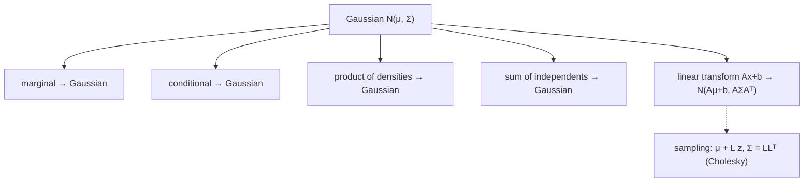

The **Gaussian** (normal) distribution is the workhorse of machine learning. It's the default
model for noise, the likelihood and prior in linear regression, the components of a mixture model,
and the limiting shape of averages (the central limit theorem). Its algebra is extraordinarily
convenient: marginals, conditionals, products, and linear transforms of Gaussians are **all
Gaussian**, giving closed-form answers where other distributions need approximation.

## A real-life example: measurement noise

Weigh the same object 100 times on a digital scale and the readings scatter around the true weight
in a symmetric bell shape — a **Gaussian**. This isn't a coincidence: the **central limit theorem**
says that a sum of many small independent errors (air currents, vibration, rounding) tends toward a
Gaussian regardless of their individual shapes. That's why "assume Gaussian noise" is the sensible
default across science and ML.

## The univariate Gaussian

A single random variable is Gaussian, $X \sim \mathcal{N}(\mu, \sigma^2)$, with density

$$
p(x \mid \mu, \sigma^2) = \frac{1}{\sqrt{2\pi\sigma^2}}\exp\!\left(-\frac{(x - \mu)^2}{2\sigma^2}\right).
$$

The **mean** $\mu$ centers the bell; the **variance** $\sigma^2$ sets its width. About 68% of mass
lies within $1\sigma$, 95% within $2\sigma$.

## The multivariate Gaussian

In $D$ dimensions, $\mathbf{x} \sim \mathcal{N}(\boldsymbol\mu, \Sigma)$ with mean vector
$\boldsymbol\mu$ and covariance matrix $\Sigma$:

$$
p(\mathbf{x} \mid \boldsymbol\mu, \Sigma) = (2\pi)^{-\frac{D}{2}}|\Sigma|^{-\frac{1}{2}}\exp\!\left(-\tfrac{1}{2}(\mathbf{x} - \boldsymbol\mu)^\top \Sigma^{-1}(\mathbf{x} - \boldsymbol\mu)\right).
$$

The covariance $\Sigma$ shapes the contours into **ellipses**: diagonal $\Sigma$ gives axis-aligned
ellipses; off-diagonal (correlation) tilts them. The special case $\boldsymbol\mu = \mathbf{0}$,
$\Sigma = I$ is the **standard normal**.

### Watch covariance shape the Gaussian

The contours of a 2-D Gaussian are ellipses. As the correlation in $\Sigma$ sweeps, the ellipse
tilts — positive correlation stretches it along the diagonal, zero makes it a circle, negative
tilts it the other way:

```p5 title="A 2-D Gaussian and its covariance" desc="Contour heatmap of a bivariate Gaussian N(0, Σ) with Σ = [[1, ρ], [ρ, 1]]. As the correlation ρ sweeps, the elliptical contours tilt — the geometry of the covariance matrix." height="380"
const U=48; let cx,cy,ph=0;
function setup(){ createCanvas(600,380); textFont("monospace"); cx=width/2; cy=height/2+6; noStroke(); }
function draw(){
  background(13,17,23);
  ph+=0.012; const rho=0.85*Math.sin(ph);
  const inv=1/(1-rho*rho);
  const dens=(x,y)=> Math.exp(-0.5*inv*(x*x - 2*rho*x*y + y*y));
  const step=12;
  for(let px=0;px<width;px+=step)for(let py=0;py<height;py+=step){
    const wx=(px-cx)/U, wy=(cy-py)/U, v=dens(wx,wy);
    fill(20+v*60, 30+v*150, 70+v*120); rect(px,py,step,step);
  }
  // axes
  stroke(90,100,114,120); strokeWeight(1); line(cx,0,cx,height); line(0,cy,width,cy); noStroke();
  fill(255,211,67); textAlign(LEFT,TOP); textSize(15); text("N(0, Σ),  Σ = [1 ρ; ρ 1]", 16, 12);
  fill(230); textSize(13); text(`ρ = ${rho.toFixed(2)}`, 16, 36);
  fill(150,160,172); textSize(12);
  text(rho>0.1?"positive corr → tilted /": rho<-0.1?"negative corr → tilted \\":"ρ≈0 → circular contours", 16, 58);
}
```

## Why Gaussians are so convenient: closure

The Gaussian's superpower is **closure** — Gaussian operations return Gaussians:

- **Marginals** of a joint Gaussian are Gaussian (just read off the relevant $\boldsymbol\mu$,
  $\Sigma$ blocks).
- **Conditionals** are Gaussian: $p(\mathbf{x}\mid\mathbf{y}) = \mathcal{N}(\boldsymbol\mu_{x\mid y},
  \Sigma_{x\mid y})$ with closed-form mean/covariance — the core of Kalman filters and Gaussian
  processes.
- **Products** of Gaussian densities are (scaled) Gaussian — used to multiply prior × likelihood.
- **Sums** of independent Gaussians are Gaussian: means and covariances add.
- **Linear/affine transforms** stay Gaussian: if $\mathbf{x} \sim \mathcal{N}(\boldsymbol\mu,
  \Sigma)$ then $A\mathbf{x} + \mathbf{b} \sim \mathcal{N}(A\boldsymbol\mu + \mathbf{b}, A\Sigma A^\top)$.



That last property gives the **sampling recipe**: to draw from $\mathcal{N}(\boldsymbol\mu, \Sigma)$,
take $\mathbf{z} \sim \mathcal{N}(\mathbf{0}, I)$ and return $\boldsymbol\mu + L\mathbf{z}$ where
$\Sigma = LL^\top$ (the [Cholesky](../../chapter-04---matrix-decompositions/cholesky-decomposition/)
factor).

## NumPy

```python title="gaussian.py" showLineNumbers{1}
import numpy as np
rng = np.random.default_rng(0)

# univariate density
def normal_pdf(x, mu, sigma):
    return np.exp(-0.5*((x-mu)/sigma)**2) / (sigma*np.sqrt(2*np.pi))
print("N(0,1) at x=0:", round(normal_pdf(0, 0, 1), 4))   # 0.3989

# sample a 2-D Gaussian via Cholesky:  mu + L z
mu = np.array([1.0, -2.0])
Sigma = np.array([[2.0, 1.2],
                  [1.2, 1.5]])
L = np.linalg.cholesky(Sigma)
z = rng.standard_normal((2, 100000))
samples = mu[:, None] + L @ z
print("empirical mean:", np.round(samples.mean(axis=1), 2))
print("empirical cov:\n", np.round(np.cov(samples), 2))

# linear transform stays Gaussian: y = A x + b
A = np.array([[0.5, 0.0], [0.0, 2.0]])
print("transformed cov = A Σ Aᵀ:\n", np.round(A @ Sigma @ A.T, 2))
```

```
N(0,1) at x=0: 0.3989
empirical mean: [ 1.  -2. ]
empirical cov:
 [[2.   1.19]
 [1.19 1.5 ]]
transformed cov = A Σ Aᵀ:
 [[0.5 1.2]
 [1.2 6. ]]
```

:::tip[From the book]
*Mathematics for Machine Learning* (Section 6.5) gives the univariate (Equation 6.62) and
**multivariate Gaussian** (6.63) densities, and the standard normal $\mathcal{N}(\mathbf{0}, I)$.
It proves the key closure properties: **marginals and conditionals of Gaussians are Gaussian**
(6.64–6.68, with the Kalman-filter connection), the **product of two Gaussians** is a scaled
Gaussian (6.74–6.76), **sums of independent Gaussians** add means and covariances (6.78), and any
**linear/affine transform** gives $\mathcal{N}(A\boldsymbol\mu + \mathbf{b}, A\Sigma A^\top)$
(6.86–6.88). It describes **sampling** via $\boldsymbol\mu + A\mathbf{z}$ with $\Sigma = AA^\top$
(Cholesky), and notes the Gaussian "arises naturally... as the central limit theorem."
:::

## Why this matters for ML

- **Linear regression** (Chapter 9) uses a Gaussian likelihood and prior; closure gives a
  closed-form Gaussian posterior.
- **Gaussian processes, Kalman filters, variational autoencoders, PPCA** all exploit Gaussian
  marginals/conditionals for tractable inference.
- **Gaussian noise** is the default assumption; the **CLT** justifies it whenever many small effects
  combine.

## 🧪 Try It Yourself

import DataCampExercise from "../../../../components/DataCampExercise.astro";

### Exercise 1 – The Gaussian density

<DataCampExercise
  lang="python"
  hint={`The peak of N(μ, σ²) is at x = μ, with height 1/√(2πσ²).`}
  code={`import numpy as np

def pdf(x, mu, sigma):
    return np.exp(-0.5*((x - mu)/sigma)**2) / (sigma*np.sqrt(2*np.pi))

peak = pdf(0.0, 0.0, ___)         # replace ___ with 1.0  (standard normal at its mean)
print("N(0,1) peak:", round(peak, 4))

# ── Expected Output ───────────────────────────────
# N(0,1) peak: 0.3989
# ──────────────────────────────────────────────────`}
  solution={`import numpy as np
def pdf(x, mu, sigma):
    return np.exp(-0.5*((x - mu)/sigma)**2) / (sigma*np.sqrt(2*np.pi))
peak = pdf(0.0, 0.0, 1.0)
print("N(0,1) peak:", round(peak, 4))`}
  sct={`test_output_contains("0.3989")
success_msg("1/√(2π) ≈ 0.3989 — the peak of the standard normal.")`}
  height={155}
/>

### Exercise 2 – Sample via Cholesky

<DataCampExercise
  lang="python"
  hint={`Draw z ~ N(0, I) and return mu + L @ z, where L = cholesky(Sigma).`}
  code={`import numpy as np
rng = np.random.default_rng(0)

mu = np.array([0.0, 0.0])
Sigma = np.array([[1.0, 0.8], [0.8, 1.0]])
L = np.linalg.cholesky(Sigma)

z = rng.standard_normal((2, 50000))
x = mu[:, None] + L @ ___          # replace ___ with z
print("recovered cov ≈ Σ:", np.allclose(np.cov(x), Sigma, atol=0.05))

# ── Expected Output ───────────────────────────────
# recovered cov ≈ Σ: True
# ──────────────────────────────────────────────────`}
  solution={`import numpy as np
rng = np.random.default_rng(0)
mu = np.array([0.0, 0.0])
Sigma = np.array([[1.0, 0.8], [0.8, 1.0]])
L = np.linalg.cholesky(Sigma)
z = rng.standard_normal((2, 50000))
x = mu[:, None] + L @ z
print("recovered cov ≈ Σ:", np.allclose(np.cov(x), Sigma, atol=0.05))`}
  sct={`test_output_contains("recovered cov ≈ Σ: True")
success_msg("μ + Lz produces the target covariance — Gaussian sampling.")`}
  height={165}
/>

### Exercise 3 – Linear transform stays Gaussian

<DataCampExercise
  lang="python"
  hint={`Cov of y = A x is A Σ Aᵀ. Compute it with matrix products.`}
  code={`import numpy as np

Sigma = np.array([[2.0, 0.0], [0.0, 3.0]])
A = np.array([[1.0, 1.0], [0.0, 1.0]])

cov_y = A @ Sigma @ A.___           # replace ___ with T  (transpose)
print("Cov(Ax) =\n", cov_y)

# ── Expected Output ───────────────────────────────
# Cov(Ax) =
#  [[5. 3.]
#  [3. 3.]]
# ──────────────────────────────────────────────────`}
  solution={`import numpy as np
Sigma = np.array([[2.0, 0.0], [0.0, 3.0]])
A = np.array([[1.0, 1.0], [0.0, 1.0]])
cov_y = A @ Sigma @ A.T
print("Cov(Ax) =\n", cov_y)`}
  sct={`test_output_contains("[[5. 3.]")
success_msg("A Σ Aᵀ — a linear transform of a Gaussian is Gaussian.")`}
  height={165}
/>

## Recap

- The **Gaussian** $\mathcal{N}(\mu, \sigma^2)$ / $\mathcal{N}(\boldsymbol\mu, \Sigma)$ is the
  bell curve; covariance shapes its elliptical contours.
- It is **closed** under marginalization, conditioning, products, sums, and linear transforms — all
  return Gaussians with closed-form parameters.
- Sample via $\boldsymbol\mu + L\mathbf{z}$ (Cholesky); the **CLT** explains its ubiquity.

**Next:** distributions that pair nicely for Bayesian updates —
**[Conjugacy and the Exponential Family](../conjugacy-and-the-exponential-family/)**.
