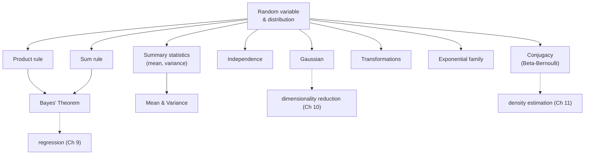

Every real dataset is noisy, every measurement is uncertain, and every model's prediction is a
*guess with a confidence*. **Probability** is the mathematics that makes uncertainty precise. It's
how a spam filter says "95% spam," how a model expresses what it *doesn't* know, and how Bayesian
methods update belief as data arrives. This chapter is the language of uncertainty that all of
probabilistic machine learning speaks.

## Why ML needs probability

Machine learning quantifies three kinds of uncertainty: noise in the **data**, uncertainty in the
**model**, and uncertainty in its **predictions**. Probability gives us the tools to represent all
three — random variables to model outcomes, distributions to describe their spread, and Bayes'
theorem to update beliefs. Without it, a model can only say "cat"; with it, a model can say "cat,
80% sure" — and know when to ask for help.

## The concept map

*(Adapted from Figure 6.1 of the book.)*

## The through-line

1. **[Construction of a Probability Space](../construction-of-a-probability-space/)** — sample
   space, events, probability, and the all-important **random variable**.
2. **[Discrete and Continuous Probabilities](../discrete-and-continuous-probabilities/)** —
   probability mass functions, density functions, and cumulative distributions.
3. **[Sum Rule, Product Rule, and Bayes' Theorem](../sum-rule-product-rule-and-bayes-theorem/)** —
   the two rules everything is built from, and how to invert them to update belief.
4. **[Summary Statistics and Independence](../summary-statistics-and-independence/)** — mean,
   variance, covariance, correlation, and what it means for variables to be independent.
5. **[Gaussian Distribution](../gaussian-distribution/)** — the bell curve, its multivariate form,
   and why it's everywhere.
6. **[Conjugacy and the Exponential Family](../conjugacy-and-the-exponential-family/)** — Bernoulli,
   Binomial, Beta, conjugate priors, and the family that unifies them.
7. **[Change of Variables / Inverse Transform](../change-of-variables-inverse-transform/)** — how a
   distribution transforms, and how to sample from any distribution.

## Where each idea shows up in ML

| Probability idea | Machine learning payoff |
|---|---|
| Random variable / distribution | Every noisy feature, label, and prediction |
| Bayes' theorem | Bayesian inference, spam filters, belief updating |
| Mean / variance / covariance | Feature statistics, PCA, uncertainty bands |
| Independence | Naive Bayes, factorized models, simpler computation |
| Gaussian | Likelihoods, priors, noise models, the CLT |
| Conjugacy | Closed-form Bayesian updates (A/B testing, bandits) |
| Change of variables | Normalizing flows, sampling, the reparameterization trick |

## Prerequisites

- **[Chapter 5 — Vector Calculus](../../chapter-05---vector-calculus/vector-calculus-overview/)** for
  integrals and the Jacobian (change of variables).
- **[Chapter 4 — Matrix Decompositions](../../chapter-04---matrix-decompositions/matrix-decompositions-overview/)**
  for covariance matrices and Cholesky (Gaussian sampling).

Start with **[Construction of a Probability Space](../construction-of-a-probability-space/)**.
