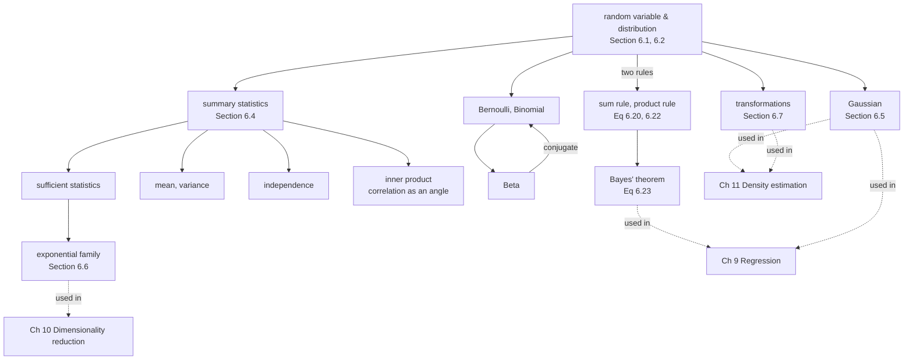

import Quiz from "../../../../components/Quiz.astro";

Chapters 2 to 5 were about objects and operations that are *certain*. A matrix has
a rank; a gradient has a value. Chapter 6 is the first one where the answer is a
**distribution** rather than a number, and that changes what "computing" means.

The book's framing, from the opening line: *"Probability, loosely speaking,
concerns the study of uncertainty."* And it is quick to say where that uncertainty
comes from in machine learning — *"uncertainty in the data, uncertainty in the
machine learning model, and uncertainty in the predictions produced by the
model."* Three different things, all handled by the same machinery.

## The one thing to take from this chapter

There are only **two rules**.

| | | |
|---|---|---|
| **sum rule** | $p(\mathbf{x}) = \sum_\mathbf{y} p(\mathbf{x},\mathbf{y})$ | Equation 6.20 |
| **product rule** | $p(\mathbf{x},\mathbf{y}) = p(\mathbf{y}\mid\mathbf{x})p(\mathbf{x})$ | Equation 6.22 |

Bayes' theorem is not a third rule — it is the product rule written in both
orderings and solved for one conditional. Every distribution, every summary
statistic, every inference procedure in Chapters 8 through 12 is built from those
two lines.

What the rest of the chapter adds is **computability**. The rules are easy to
write and expensive to evaluate: marginalising $D$ binary variables costs $2^D$
terms, which is $1.27\times10^{30}$ at $D=100$. So the chapter spends its second
half on the two structures that make the cost go away — the **Gaussian**, which is
closed under every operation you need, and the **exponential family**, which is
provably the only class whose parameter count stays fixed as data arrives.

## The chapter's own map

The book's Figure 6.1, as a diagram:

## The through-line, and what each page settles

| # | Page | The question it answers |
|---|---|---|
| 6.1 | **[Construction of a Probability Space](../construction-of-a-probability-space/)** | What are the three objects everyone conflates, and why is a random variable a *function*? |
| 6.2 | **[Discrete and Continuous Probabilities](../discrete-and-continuous-probabilities/)** | What is the difference between a pmf, a pdf and a cdf — and which of them is ever a probability? |
| 6.3 | **[Sum Rule, Product Rule, and Bayes Theorem](../sum-rule-product-rule-and-bayes-theorem/)** | The only two rules, the theorem that follows, and why the sum rule is where the cost lives. |
| 6.4 | **[Summary Statistics and Independence](../summary-statistics-and-independence/)** | What do mean, variance and covariance actually tell you — and what do they hide? |
| 6.5 | **[Gaussian Distribution](../gaussian-distribution/)** | Why is *this* density everywhere? Because it is closed under marginalising, conditioning, multiplying and affine maps. |
| 6.6 | **[Conjugacy and the Exponential Family](../conjugacy-and-the-exponential-family/)** | Is the Gaussian's convenience luck? No — and here is the family that shares it. |
| 6.7 | **[Change of Variables and the Inverse Transform](../change-of-variables-inverse-transform/)** | What happens to a density when you transform the variable, and why the Jacobian is not optional. |
| — | **[Chapter 6 Exercises and Solutions](../chapter-6-exercises-and-solutions/)** | All thirteen exercises, including the two that derive the Kalman filter and Bayesian linear regression. |
| — | **[Chapter 6 Formula Sheet](../chapter-6-formula-sheet/)** | Every definition, theorem and measured number on one page. |

## Three reading paths

**If you are here for Bayesian inference:** §6.1 → §6.3 → §6.6. That is the
probability space, the two rules with Bayes, and conjugacy. You can defer §6.4 and
§6.5.

**If you are here for the Gaussian machinery** (Chapter 9's regression, Kalman
filters, Gaussian processes): §6.2 → §6.4 → §6.5, then **Exercises 6.5 and 6.12**,
which build the Kalman filter and the Gaussian-linear-model posterior from §6.5's
closure rules alone.

**If you are here for generative models** (flows, VAEs): §6.2's density-versus-
probability distinction, then §6.7. The Jacobian in Equation 6.143 is the entire
content of a normalising flow, and Chapter 5's Exercise 5.9 gradient is the
reparameterisation trick.

## What the chapter looks like once it has been measured

Every number below is measured on the page it belongs to.

| Claim | Measured |
|---|---|
| "The probability is 40%" | Example 6.1's pmf is $0.49,\ 0.42,\ 0.09$ — and the middle one is a **sum over two outcomes**, not one |
| "Probability is a long-run frequency" | the error falls as $1/\sqrt N$: $0.12$ at $N=10$, $0.0008$ at $N=10^6$ |
| A density is a probability | the uniform on $[0.9,1.6]$ has density $1.4286$; a Gaussian at $\sigma=0.01$ peaks at $39.89$ |
| $P(X = x)$ for continuous $X$ | **exactly zero** — a million samples gave zero exact hits |
| "The test is 99% accurate" | $P(\text{disease}\mid+) = 0.0902$ at prevalence $0.001$ — overstated **$10.98\times$** |
| A prior is just a starting guess | a **zero** prior stays exactly zero after $400$ confirming observations |
| Zero covariance means unrelated | Example 6.5: $y=x^2$ exactly, covariance $\approx 10^{-4}$, total variation from independence $0.406$ |
| Variance has one formula | Equation 6.44 returns **$0$** for a variance of $4$ once the data is offset by $10^9$ |
| Per-feature statistics describe a dataset | two clouds with identical means and marginal variances, correlations $-0.8$ and $+0.8$ |
| Conditioning is just filtering | it **provably shrinks** a Gaussian's covariance — eigenvalues $[0,\ 0.186,\ 1.847]$ |
| Averaging Gaussians gives a Gaussian | a mixture has excess kurtosis $-1.47$ and **two modes** at identical first two moments |
| Bayesian updating needs integration | with a conjugate prior it is **two numbers**, still two after $100\,000$ observations |
| A model sees all of the data | two visibly different datasets, log-likelihoods equal to $2.3\times10^{-13}$ |
| Transforming a variable relabels its density | dropping the Jacobian gives a shape error of $0.5275$ that renormalising cannot fix |
| The most likely value is a property of the variable | the mode of $\exp(X)$ is $0.3679$, not $\exp(0)=1$ |

## Prerequisites

| You need | From |
|---|---|
| sums, products, set notation | [Chapter 0 — Sums, Products and Set Notation](../../chapter-00---getting-ready/sums-products-and-set-notation/) |
| integrals, and what a density integrates to | [Chapter 0 — Single-Variable Calculus Refresher](../../chapter-00---getting-ready/single-variable-calculus-refresher/) |
| matrices, inverses, determinants | [Chapter 2 — Linear Algebra](../../chapter-02---linear-algebra/linear-algebra-overview/) |
| inner products, orthogonality, norms | [Chapter 3 — Analytic Geometry](../../chapter-03---analytic-geometry/analytic-geometry-overview/) |
| symmetric positive definite matrices, Cholesky | [Chapter 4 — Cholesky Decomposition](../../chapter-04---matrix-decompositions/cholesky-decomposition/) |
| the Jacobian and its determinant | [Chapter 5 — Gradients of Vector-Valued Functions](../../chapter-05---vector-calculus/gradients-of-vector-valued-functions/) |

Two of those are load-bearing rather than background. §6.5's sampling needs
**Cholesky** to exist, which needs covariance matrices to be symmetric positive
definite — Chapter 4's result. And §6.7's change of variables *is* Chapter 5's
Jacobian determinant, used for the purpose it was built for.

:::note[On the book's own notation warning]
§6.2 says plainly that *"machine learning literature uses notation and
nomenclature that hides the distinction between the sample space $\Omega$, the
target space $\mathcal{T}$, and the random variable $X$"*, and admits the book is
*"no exception"* — it uses "probability distribution" for pmfs and pdfs alike,
*"although this is technically incorrect"*. Table 6.1 exists to undo the damage,
and it is worth keeping in view: **pmf** for point probabilities of discrete
variables, **pdf** for densities, **cdf** for interval probabilities.
:::

## Where each section is used later

| Section | Used in |
|---|---|
| §6.1 probability space | the vocabulary for the rest of the book |
| §6.2 pmf, pdf, cdf | every likelihood in Chapters 9 to 12 |
| §6.3 sum, product, Bayes | Chapter 8's probabilistic modelling and model selection |
| §6.4 mean and covariance | Chapter 10's PCA — the covariance matrix *is* the method |
| §6.5 Gaussian | Chapter 9's linear regression, Chapter 11's mixtures, Kalman filters, Gaussian processes |
| §6.6 conjugacy, exponential family | Chapter 9's Bayesian regression, Chapter 12's loss functions |
| §6.7 change of variables | normalising flows, reparameterised gradients |

<Quiz
  title="Before you start"
  questions={[
    {
      q: "How many fundamental rules does this chapter rest on?",
      options: [
        "Three: the sum rule, the product rule and Bayes' theorem",
        "Two. Bayes' theorem is the product rule written in both orderings and solved for one conditional — Equations 6.24 to 6.26 are its whole derivation",
        "One, Bayes' theorem",
        "Four, adding the chain rule",
      ],
      answer: 1,
      explain:
        "Everything else in the chapter is either a named distribution, a summary statistic, or a rule for transforming distributions. The two rules are the generative core.",
    },
    {
      q: "Why does the chapter spend so long on the Gaussian specifically?",
      options: [
        "Because it arises from the central limit theorem",
        "Because it is CLOSED under marginalising, conditioning, multiplying, adding and affine mapping — each by a closed-form formula in the mean and covariance, so whole inference pipelines become matrix algebra",
        "Because it has the fewest parameters",
        "Because real data is usually Gaussian",
      ],
      answer: 1,
      explain:
        "Exercises 6.5 and 6.12 are the payoff: between them they derive the Kalman filter and Bayesian linear regression using nothing but those closure rules, with no new mathematics.",
    },
    {
      q: "The two rules are easy to write. What makes them hard to use?",
      options: [
        "Numerical precision",
        "The sum rule. Marginalising D binary variables costs 2^D terms — 1.27e30 at D = 100 — and there is no known exact polynomial-time algorithm. That is why the chapter's second half is about structures that avoid the cost",
        "The product rule requires independence",
        "Bayes' theorem is only approximate",
      ],
      answer: 1,
      explain:
        "The book flags it in a Remark in Section 6.3. Conjugacy (Section 6.6) is the escape hatch: the posterior stays in the prior's family and the integral never has to be done.",
    },
    {
      q: "Which two earlier chapters does Chapter 6 genuinely depend on, rather than merely reference?",
      options: [
        "Chapters 2 and 3",
        "Chapter 4, because sampling a Gaussian needs the Cholesky factorisation to exist for a symmetric positive definite covariance; and Chapter 5, because Section 6.7's change of variables IS the Jacobian determinant",
        "Chapters 0 and 2",
        "Chapter 5 only",
      ],
      answer: 1,
      explain:
        "Both are load-bearing. Section 6.5.4 names Cholesky explicitly and notes the condition it needs, and Theorem 6.16 is Chapter 5's Section 5.3 applied to densities.",
    },
  ]}
/>

## Where §6.8 points next

Section 6.8 opens by conceding that *"this chapter is rather terse at times"*, and then spends most of
its length on the measure theory it deliberately skipped.

| §6.8's pointer | and where it lands in this module |
| --- | --- |
| more relaxed presentations for self-study | this module's own [Construction of a Probability Space](../construction-of-a-probability-space/) takes the slower route |
| an overview of **exponential families** | [Conjugacy and the Exponential Family](../conjugacy-and-the-exponential-family/) |
| *"how to use probability distributions to model machine learning tasks"* | [When Models Meet Data Overview](../../chapter-08---when-models-meet-data/when-models-meet-data-overview/), the whole of Chapter 8 |
| **normalizing flows** *"rely on change of variables for transforming random variables"* | [Change of Variables and the Inverse Transform](../change-of-variables-inverse-transform/) |
| **variational inference** applied to neural networks | the bound of [The Latent Variable Perspective](../../chapter-11---density-estimation-with-gmm/the-latent-variable-perspective/) is the same construction |
| measure-theoretic questions *"side stepped"* | acknowledged, not repaired — see the caution below |
| *"an alternative way to approach probability is to start with the concept of expectation"* | [Summary Statistics and Independence](../summary-statistics-and-independence/) |

:::caution[What Section 6.8 admits, and what it costs]
The passage worth reading twice is the one about conditioning. For continuous $x$ and $y$ the notation
$p(y \mid x)$ *"hides the fact that we want to specify that $X = x$"*, which is **a set of measure
zero** — an event of probability exactly zero, conditioned on as though it were not.

Nothing in Chapters 6 through 12 breaks because of it: the Gaussian conditionals of §6.5, the
posteriors of Chapter 9 and the responsibilities of Chapter 11 are all well defined by construction.
But it is the reason the chapter can be terse, and the reason a formula that looks like arithmetic on
densities is not always arithmetic on probabilities.
:::

## Recall card

- **Two rules generate the chapter.** The sum rule (Eq 6.20) and the product rule (Eq 6.22). Bayes' theorem (Eq 6.23) is those two rearranged, not a third axiom.
- **The book's Figure 6.1 map:** a random variable and its distribution feed the two rules and Bayes on one side, and summary statistics, independence and the inner-product view on the other; sufficient statistics lead to the exponential family; the Gaussian, Bernoulli, Binomial and Beta are the named examples.
- **Three objects get conflated and should not:** the sample space, the event space, and the probability measure — plus the random variable, which is a FUNCTION from the first to a target space.
- **A density is not a probability**, and for a continuous variable P(X = x) = 0 exactly. Only the cdf is a probability at every point.
- **The sum rule is the bottleneck:** 2^D terms for D binary variables, 1.27e30 at D = 100, with no known exact polynomial-time algorithm.
- **The Gaussian earns its place by CLOSURE**, not by ubiquity: marginalise, condition, multiply, add, map affinely — all closed form in the mean and covariance.
- **The exponential family is provably the only class with finite-dimensional sufficient statistics** under repeated sampling (Pitman, Darmois, Koopman, 1935-36), which is what keeps the parameter count fixed as data grows.
- **Section 6.7's change of variables is Chapter 5's Jacobian**, and Section 6.5.4's sampler is Chapter 4's Cholesky. Those two dependencies are load-bearing, not decorative.
- **Three reading paths:** 6.1-6.3-6.6 for Bayesian inference; 6.2-6.4-6.5 plus Exercises 6.5 and 6.12 for the Gaussian machinery; 6.2 and 6.7 for generative models.

**Start with:** [Construction of a Probability Space](../construction-of-a-probability-space/)
— the three objects, and the function that is neither random nor a variable.
