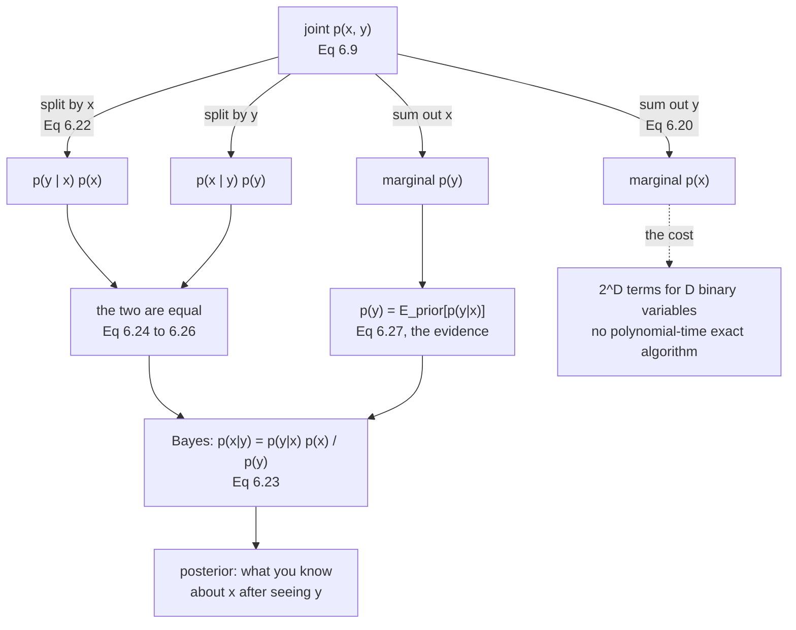

import DataCampExercise from "../../../../components/DataCampExercise.astro";
import Figure from "../../../../components/Figure.astro";
import Quiz from "../../../../components/Quiz.astro";

This is the shortest section in the chapter and the one everything else uses. The
book's claim:

> Once we have defined probability distributions corresponding to the
> uncertainties of the data and our problem, it turns out that there are only
> **two fundamental rules**, the sum rule and the product rule.

Two rules. Bayes' theorem is not a third — it is those two, rearranged in two
lines. Everything in Chapters 8 through 12 is an application.

## What you'll learn

- **Equation 6.20**, the **sum rule**, also called the marginalization
  property — and **Equation 6.21**'s general form with the "all except $i$"
  notation.
- Why the book calls the sum rule the source of *"many of the computational
  challenges of probabilistic modeling"*, with the cost measured.
- **Equation 6.22**, the **product rule**, and the fact that it holds in *both*
  orderings.
- **Bayes' theorem**, Equation 6.23, derived from the product rule in three lines
  (6.24–6.26), with all four parts named.
- Why **the likelihood is not a distribution** in the variable it is a likelihood
  *of* — measured on a table.
- **Equation 6.27**: the evidence as an integral and as an *expectation under the
  prior*.
- The **base-rate fallacy**, which is what happens when Bayes' theorem is skipped:
  measured at eleven times too confident.
- Why a **zero in the prior can never be undone**, and why the book warns about it
  explicitly.

## Intuition: two moves on a table

Everything here is one of two moves on a table of joint probabilities.

**Collapse an axis.** You have $p(x, y)$ and you stop caring about $y$. Add up
each column. What is left is $p(x)$. That is the **sum rule**, and "marginal"
is just the name for a number written in the margin of the table.

**Split a cell.** Any cell $p(x, y)$ can be written as "how likely is this column
at all" times "how likely is this row, given we are in this column" —
$p(x)\,p(y \mid x)$. That is the **product rule**.

Now: the second move can be made in either order. Split by column, or split by
row. Both give the same cell, so the two expressions are equal — and solving that
equality for one conditional gives **Bayes' theorem**. There is no third idea.

The practical content of Bayes is that it *reverses a conditional*. You know how
often a test fires when the disease is present; you want to know how often the
disease is present when the test fires. Those are different numbers, sometimes by
a factor of eleven, and the prior is what converts one into the other.



## The math

### Equation 6.20: the sum rule

$$
p(\mathbf{x}) = \begin{cases}
\displaystyle\sum_{\mathbf{y}\in\mathcal{Y}} p(\mathbf{x},\mathbf{y}) & \text{if } \mathbf{y} \text{ is discrete} \\[8pt]
\displaystyle\int_{\mathcal{Y}} p(\mathbf{x},\mathbf{y})\,\mathrm{d}\mathbf{y} & \text{if } \mathbf{y} \text{ is continuous}
\end{cases}
\tag{6.20}
$$

You **sum out** (or integrate out) the states of $Y$. The sum rule is also called
the **marginalization property**, and it relates a joint to a marginal.

With more than two variables it applies to any subset. For
$\mathbf{x} = [x_1,\ldots,x_D]^\top$:

$$
p(x_i) = \int p(x_1,\ldots,x_D)\,\mathrm{d}\mathbf{x}_{\setminus i}
\tag{6.21}
$$

where $\setminus i$ reads "all except $i$".

:::danger[This is where probabilistic modelling gets expensive]
The book's Remark, and it is not a footnote: *"Many of the computational
challenges of probabilistic modeling are due to the application of the sum
rule... Performing high-dimensional sums or integrals is generally
computationally hard, in the sense that there is no known polynomial-time
algorithm to calculate them exactly."*

Measured, for $D$ binary variables:

| $D$ | joint entries $2^D$ | terms per marginal |
|---|---|---|
| $10$ | $1\,024$ | $512$ |
| $20$ | $1\,048\,576$ | $524\,288$ |
| $30$ | $1.07\times10^{9}$ | $5.37\times10^{8}$ |
| $50$ | $1.13\times10^{15}$ | $5.63\times10^{14}$ |
| $100$ | $1.27\times10^{30}$ | $6.34\times10^{29}$ |

Writing $\int p(x_1,\ldots,x_D)\,\mathrm{d}\mathbf{x}_{\setminus i}$ costs one
line. Evaluating it is why variational inference, MCMC, and
Chapter 11's EM
exist.
:::

### Equation 6.22: the product rule

$$
p(\mathbf{x},\mathbf{y}) = p(\mathbf{y}\mid\mathbf{x})\,p(\mathbf{x})
\tag{6.22}
$$

Every joint distribution of two random variables **factorises** into the marginal
of the first and the conditional of the second given the first. And since the
ordering in $p(\mathbf{x},\mathbf{y})$ is arbitrary, the product rule equally
implies

$$
p(\mathbf{x},\mathbf{y}) = p(\mathbf{x}\mid\mathbf{y})\,p(\mathbf{y})
$$

Measured on a real table, both factorisations reproduce every one of fifteen cells
to $1.4\times10^{-17}$. The factorisation is an identity, not an approximation.

### Equations 6.24 to 6.26: Bayes in three lines

That the *same* joint has two factorisations is the entire derivation:

$$
p(\mathbf{x},\mathbf{y}) = p(\mathbf{x}\mid\mathbf{y})\,p(\mathbf{y})
\tag{6.24}
$$

$$
p(\mathbf{x},\mathbf{y}) = p(\mathbf{y}\mid\mathbf{x})\,p(\mathbf{x})
\tag{6.25}
$$

$$
p(\mathbf{x}\mid\mathbf{y})\,p(\mathbf{y}) = p(\mathbf{y}\mid\mathbf{x})\,p(\mathbf{x})
\iff
p(\mathbf{x}\mid\mathbf{y}) = \frac{p(\mathbf{y}\mid\mathbf{x})\,p(\mathbf{x})}{p(\mathbf{y})}
\tag{6.26}
$$

which is **Bayes' theorem**:

$$
\underbrace{p(\mathbf{x}\mid\mathbf{y})}_{\text{posterior}} = \frac{\overbrace{p(\mathbf{y}\mid\mathbf{x})}^{\text{likelihood}}\;\overbrace{p(\mathbf{x})}^{\text{prior}}}{\underbrace{p(\mathbf{y})}_{\text{evidence}}}
\tag{6.23}
$$

The four parts, in the book's words:

**The prior** $p(\mathbf{x})$ encapsulates subjective prior knowledge of the
unobserved variable before any data. *"We can choose any prior that makes sense to
us, but it is critical to ensure that the prior has a nonzero pdf (or pmf) on all
plausible $\mathbf{x}$, even if they are very rare."* That sentence is measured
below, and it is not optional advice.

**The likelihood** $p(\mathbf{y}\mid\mathbf{x})$ describes how $\mathbf{x}$ and
$\mathbf{y}$ are related — for discrete distributions, the probability of the data
if we knew the latent variable. And then a warning that catches almost everyone:

> Note that the likelihood is **not a distribution in $\mathbf{x}$**, but only in
> $\mathbf{y}$. We call $p(\mathbf{y}\mid\mathbf{x})$ either the "likelihood of
> $\mathbf{x}$ (given $\mathbf{y}$)" or the "probability of $\mathbf{y}$ given
> $\mathbf{x}$" but **never the likelihood of $\mathbf{y}$**.

**The posterior** $p(\mathbf{x}\mid\mathbf{y})$ is the quantity of interest: what
you know about $\mathbf{x}$ after observing $\mathbf{y}$.

**The evidence**:

$$
p(\mathbf{y}) := \int p(\mathbf{y}\mid\mathbf{x})\,p(\mathbf{x})\,\mathrm{d}\mathbf{x} = \mathbb{E}_X\bigl[p(\mathbf{y}\mid\mathbf{x})\bigr]
\tag{6.27}
$$

also called the **marginal likelihood**. Read the right-hand side: it is the
**expected likelihood under the prior**. It does not depend on $\mathbf{x}$, so
its only job in Equation 6.23 is to normalise the posterior — but it is also
central to Bayesian model selection (§8.6), and *"due to the integration, the
evidence is often hard to compute"*.

Bayes' theorem inverts the relationship the likelihood gives, which is why it is
sometimes called the **probabilistic inverse**.

:::note[On collapsing the posterior to a number]
The book's closing Remark is worth taking seriously. The posterior *"encapsulates
all available information from the prior and the data"*, and replacing it with a
statistic — its maximum, say — *"leads to loss of information"*. It cites
Deisenroth et al. (2015): in model-based reinforcement learning, using the full
posterior over plausible transition functions gives very data-efficient learning,
while *"focusing on the maximum of the posterior leads to consistent failures"*.
The [measured example below](#from-scratch) shows a posterior whose MAP sits in
the mode holding the *smaller* share of the mass.
:::

## Worked example by hand

Take §6.2's table again — $X$ with five states, $Y$ with three, $N = 250$ — and
run all three rules on it.

| | $x_1$ | $x_2$ | $x_3$ | $x_4$ | $x_5$ | $r_j$ |
|---|---|---|---|---|---|---|
| $y_1$ | $12$ | $30$ | $18$ | $8$ | $4$ | $72$ |
| $y_2$ | $6$ | $22$ | $40$ | $26$ | $10$ | $104$ |
| $y_3$ | $2$ | $8$ | $14$ | $30$ | $20$ | $74$ |
| $c_i$ | $20$ | $60$ | $72$ | $64$ | $34$ | $250$ |

**Sum rule.** Collapse the $y$ axis: $p(x_2) = (30 + 22 + 8)/250 = 60/250 = 0.24$.
Collapse the $x$ axis: $p(y_1) = 72/250 = 0.288$. Each set sums to $1$.

**Product rule.** Take the cell $(x_2, y_1)$. Its joint is $30/250 = 0.12$. Now
factorise:

$$
p(y_1 \mid x_2)\,p(x_2) = \frac{30}{60}\cdot\frac{60}{250} = 0.5 \times 0.24 = 0.12 \;\checkmark
$$

$$
p(x_2 \mid y_1)\,p(y_1) = \frac{30}{72}\cdot\frac{72}{250} = 0.41\overline{6} \times 0.288 = 0.12 \;\checkmark
$$

Both give the joint. Notice the two conditionals — $0.5$ and $0.41\overline{6}$ —
are *different numbers* for the same cell. That difference is what Bayes'
theorem accounts for.

**Bayes.** Recover $p(x_2 \mid y_1)$ from the other three, never looking at the
joint:

$$
p(x_2 \mid y_1) = \frac{p(y_1 \mid x_2)\,p(x_2)}{p(y_1)} = \frac{0.5 \times 0.24}{0.288} = \frac{0.12}{0.288} = 0.416667
$$

which matches the direct computation $30/72 = 0.416667$ exactly.

**Where the evidence comes from.** $p(y_1) = 0.288$ was a row sum, but Equation
6.27 says it is also the expected likelihood under the prior:

$$
p(y_1) = \sum_i p(y_1 \mid x_i)\,p(x_i) = 0.6(0.08) + 0.5(0.24) + 0.25(0.288) + 0.125(0.256) + 0.1176(0.136)
$$

$$
= 0.048 + 0.12 + 0.072 + 0.032 + 0.016 = 0.288 \;\checkmark
$$

Same number, and the second route never mentions the joint table.

### The likelihood is not a distribution in x

Here is the MacKay point as arithmetic. The likelihood table
$p(y_j \mid x_i) = n_{ij}/c_i$ sums to $1$ down each **column**, because each
column is one fixed $x$ and the $y$-probabilities within it must total one:

$$
\text{column sums} = \begin{bmatrix}1 & 1 & 1 & 1 & 1\end{bmatrix}
$$

Sum along the *rows* instead — that is, fix $y$ and add up the likelihood across
values of $x$ — and you get

$$
\begin{bmatrix}1.592647 & 1.922590 & 1.484763\end{bmatrix}
$$

Not one. Not close to one. Worst deviation $0.9226$. The likelihood, read as a
function of $x$, is not normalised and has no reason to be: it is not a
probability distribution over $x$. It only becomes one after multiplying by the
prior and dividing by the evidence — which is exactly what Equation 6.23 does.

## See it move

```p5 title="Bayes on a 5 by 3 table" desc="Pick a cell. The panel shows all four quantities of Equation 6.23 for it — likelihood, prior, evidence, posterior — with the arithmetic and the direct value side by side. Switch the conditioning direction to watch the same cell produce two different conditional probabilities, which is the gap Bayes' theorem bridges." height="600"
let pickI = 1, pickJ = 0, dir = 0;
let BTNS = [];

const N_IJ = [[12, 30, 18, 8, 4], [6, 22, 40, 26, 10], [2, 8, 14, 30, 20]];
const ROWS = 3, COLS = 5;

function setup() { createCanvas(600, 600); textFont("monospace"); noLoop(); }

function totals() {
  let N = 0;
  const c = new Array(COLS).fill(0), r = new Array(ROWS).fill(0);
  for (let j = 0; j < ROWS; j++)
    for (let i = 0; i < COLS; i++) { N += N_IJ[j][i]; c[i] += N_IJ[j][i]; r[j] += N_IJ[j][i]; }
  return { N, c, r };
}

function mousePressed() {
  for (const b of BTNS)
    if (mouseX > b.x && mouseX < b.x + b.w && mouseY > b.y && mouseY < b.y + b.h) {
      if (b.kind === "cell") { pickI = b.i; pickJ = b.j; }
      if (b.kind === "dir") dir = b.d;
      redraw(); return;
    }
}

function draw() {
  background(13, 17, 23);
  BTNS = [];
  const { N, c, r } = totals();
  const n = N_IJ[pickJ][pickI];

  noStroke(); textAlign(LEFT, TOP);
  fill(255, 211, 67); textSize(15);
  text("Equation 6.23, one cell at a time", 16, 12);
  fill(200, 210, 222); textSize(11);
  text("click a cell. The four named quantities are computed from the margins.", 16, 34);

  // The table.
  const cw = 88, ch = 46, gx = 70, gy = 76;
  for (let j = 0; j < ROWS; j++)
    for (let i = 0; i < COLS; i++) {
      const on = i === pickI && j === pickJ;
      const inRow = j === pickJ, inCol = i === pickI;
      BTNS.push({ x: gx + i * cw, y: gy + j * ch, w: cw - 3, h: ch - 3, kind: "cell", i, j });
      noStroke();
      if (on) fill(52, 44, 12);
      else if ((dir === 0 && inCol) || (dir === 1 && inRow)) fill(24, 44, 34);
      else fill(22, 28, 36);
      rect(gx + i * cw, gy + j * ch, cw - 3, ch - 3, 3);
      noFill(); stroke(on ? color(255, 211, 67) : color(46, 56, 68));
      strokeWeight(on ? 2 : 1);
      rect(gx + i * cw, gy + j * ch, cw - 3, ch - 3, 3);
      noStroke(); fill(on ? 250 : 190); textSize(12); textAlign(CENTER, CENTER);
      text(N_IJ[j][i], gx + i * cw + (cw - 3) / 2, gy + j * ch + 15);
      fill(on ? color(255, 211, 67) : color(120, 132, 148)); textSize(9.5);
      text((N_IJ[j][i] / N).toFixed(3), gx + i * cw + (cw - 3) / 2, gy + j * ch + 32);
    }

  // Margins.
  noStroke(); fill(150); textSize(10.5); textAlign(CENTER, BOTTOM);
  for (let i = 0; i < COLS; i++) text(`x${i + 1}`, gx + i * cw + 42, gy - 4);
  textAlign(RIGHT, CENTER);
  for (let j = 0; j < ROWS; j++) text(`y${j + 1}`, gx - 8, gy + j * ch + 22);
  textAlign(CENTER, TOP);
  fill(107, 169, 221); textSize(10);
  for (let i = 0; i < COLS; i++) text(`c=${c[i]}`, gx + i * cw + 42, gy + ROWS * ch + 4);
  textAlign(LEFT, CENTER);
  fill(120, 200, 150);
  for (let j = 0; j < ROWS; j++) text(`r=${r[j]}`, gx + COLS * cw + 6, gy + j * ch + 22);

  // The four quantities, in the chosen direction.
  const y0 = gy + ROWS * ch + 32;
  let lik, prior, evid, post, direct, names;
  if (dir === 0) {
    // infer x from y: likelihood p(y|x), prior p(x), evidence p(y)
    lik = n / c[pickI]; prior = c[pickI] / N; evid = r[pickJ] / N;
    post = lik * prior / evid; direct = n / r[pickJ];
    names = [`likelihood p(y${pickJ + 1} | x${pickI + 1}) = ${n}/${c[pickI]}`,
             `prior      p(x${pickI + 1})      = ${c[pickI]}/${N}`,
             `evidence   p(y${pickJ + 1})      = ${r[pickJ]}/${N}`,
             `posterior  p(x${pickI + 1} | y${pickJ + 1}) = ${n}/${r[pickJ]}`];
  } else {
    lik = n / r[pickJ]; prior = r[pickJ] / N; evid = c[pickI] / N;
    post = lik * prior / evid; direct = n / c[pickI];
    names = [`likelihood p(x${pickI + 1} | y${pickJ + 1}) = ${n}/${r[pickJ]}`,
             `prior      p(y${pickJ + 1})      = ${r[pickJ]}/${N}`,
             `evidence   p(x${pickI + 1})      = ${c[pickI]}/${N}`,
             `posterior  p(y${pickJ + 1} | x${pickI + 1}) = ${n}/${c[pickI]}`];
  }
  const vals = [lik, prior, evid, post];
  const cols = [[107, 169, 221], [197, 153, 255], [255, 171, 112], [120, 200, 150]];
  noStroke(); fill(19, 25, 33); rect(16, y0, 568, 112, 5);
  for (let k = 0; k < 4; k++) {
    fill(cols[k][0], cols[k][1], cols[k][2]); textSize(11.5); textAlign(LEFT, TOP);
    text(names[k], 30, y0 + 10 + k * 25);
    fill(235); textAlign(RIGHT, TOP);
    text(vals[k].toFixed(6), 570, y0 + 10 + k * 25);
  }

  const y1 = y0 + 124;
  fill(120, 200, 150); textSize(12); textAlign(LEFT, TOP);
  text(`Bayes:  ${lik.toFixed(6)} x ${prior.toFixed(6)} / ${evid.toFixed(6)} = ${post.toFixed(6)}`, 16, y1);
  fill(235); textSize(12);
  text(`direct: ${direct.toFixed(6)}      gap ${Math.abs(post - direct).toExponential(1)}`, 16, y1 + 20);

  // The two conditionals for this cell, side by side.
  const pyx = n / c[pickI], pxy = n / r[pickJ];
  fill(150); textSize(11);
  text(`the same cell gives TWO conditionals:`, 16, y1 + 46);
  fill(107, 169, 221);
  text(`p(y${pickJ + 1} | x${pickI + 1}) = ${pyx.toFixed(6)}`, 16, y1 + 64);
  fill(255, 171, 112);
  text(`p(x${pickI + 1} | y${pickJ + 1}) = ${pxy.toFixed(6)}`, 220, y1 + 64);
  fill(232, 110, 110);
  const ratio = pxy > 0 ? pyx / pxy : 0;
  text(`ratio ${ratio.toFixed(3)}`, 430, y1 + 64);

  const labels = ["infer x from y", "infer y from x"];
  for (let d = 0; d < 2; d++) {
    const x = 16 + d * 160, y = 566;
    BTNS.push({ x, y, w: 152, h: 24, kind: "dir", d });
    noStroke(); fill(dir === d ? color(255, 211, 67) : color(38, 48, 60));
    rect(x, y, 152, 24, 4);
    fill(dir === d ? 13 : 205); textSize(11); textAlign(CENTER, CENTER);
    text(labels[d], x + 76, y + 12);
  }
}
```

```p5 title="The base-rate fallacy, as bodies" desc="A test with adjustable sensitivity and specificity, applied to a population with an adjustable prevalence. The bars count true and false positives out of 100000 people. Drag the prevalence down and watch the false positives overwhelm the true ones while both test characteristics stay excellent — the posterior collapses without the test getting any worse." height="580"
let prev = 0.001, sens = 0.99, spec = 0.99;
let KNOBS = [], BTNS = [], dragging = null;
const POP = 100000;

function setup() { createCanvas(600, 580); textFont("monospace"); noLoop(); }

function knob(id, x, y, w, value, mn, mx, label, logScale) {
  KNOBS.push({ id, x, y, w, mn, mx, logScale });
  const t = logScale
    ? (Math.log10(value) - Math.log10(mn)) / (Math.log10(mx) - Math.log10(mn))
    : (value - mn) / (mx - mn);
  stroke(60, 74, 92); strokeWeight(2); line(x, y, x + w, y);
  noStroke(); fill(255, 211, 67); ellipse(x + t * w, y, 10, 10);
  fill(190, 200, 212); textSize(11); textAlign(LEFT, CENTER);
  text(label, x + w + 12, y);
}
function mousePressed() {
  for (const b of BTNS)
    if (mouseX > b.x && mouseX < b.x + b.w && mouseY > b.y && mouseY < b.y + b.h) {
      prev = b.v; redraw(); return;
    }
  for (const k of KNOBS)
    if (mouseY > k.y - 11 && mouseY < k.y + 11 && mouseX > k.x - 11 && mouseX < k.x + k.w + 11) {
      dragging = k; return;
    }
}
function mouseReleased() { dragging = null; }
function mouseDragged() {
  if (!dragging) return;
  const t = Math.min(1, Math.max(0, (mouseX - dragging.x) / dragging.w));
  if (dragging.logScale) {
    const lg = Math.log10(dragging.mn) + t * (Math.log10(dragging.mx) - Math.log10(dragging.mn));
    prev = Math.pow(10, lg);
  } else {
    const v = dragging.mn + t * (dragging.mx - dragging.mn);
    if (dragging.id === "sens") sens = Math.round(v * 1000) / 1000;
    if (dragging.id === "spec") spec = Math.round(v * 1000) / 1000;
  }
  redraw();
}

function draw() {
  background(13, 17, 23);
  KNOBS = []; BTNS = [];

  const sick = POP * prev, healthy = POP - sick;
  const tp = sick * sens, fn = sick - tp;
  const fp = healthy * (1 - spec), tn = healthy - fp;
  const post = tp + fp > 0 ? tp / (tp + fp) : 0;

  noStroke(); textAlign(LEFT, TOP);
  fill(255, 211, 67); textSize(15);
  text("P(disease | positive) is not the sensitivity", 16, 12);
  fill(200, 210, 222); textSize(11);
  text(`out of ${POP.toLocaleString()} people, on a log scale`, 16, 34);

  // Bars, log scale.
  const cats = [["true positives", tp, [120, 200, 150]],
                ["false positives", fp, [232, 110, 110]],
                ["false negatives", fn, [255, 171, 112]],
                ["true negatives", tn, [120, 130, 145]]];
  const PL = { x: 60, y: 70, w: 500, h: 230 };
  noStroke(); fill(19, 25, 33); rect(PL.x, PL.y, PL.w, PL.h, 4);
  const lo = 0.5, hi = POP;
  const sy = (v) => PL.y + PL.h - (Math.log10(Math.max(v, lo)) / Math.log10(hi)) * PL.h;
  stroke(46, 56, 68); strokeWeight(1);
  for (const g of [1, 10, 100, 1000, 10000, 100000]) line(PL.x, sy(g), PL.x + PL.w, sy(g));
  noStroke(); fill(110, 120, 135); textSize(9); textAlign(RIGHT, CENTER);
  for (const g of [1, 10, 100, 1000, 10000, 100000]) text(g.toLocaleString(), PL.x - 6, sy(g));

  for (let k = 0; k < 4; k++) {
    const [nm, v, cc] = cats[k];
    const bw = PL.w / 4 * 0.5;
    const cx = PL.x + PL.w * ((k + 0.5) / 4);
    noStroke(); fill(cc[0], cc[1], cc[2]);
    rect(cx - bw / 2, sy(v), bw, sy(0) - sy(v));
    fill(235); textSize(10.5); textAlign(CENTER, BOTTOM);
    text(v < 1 ? v.toFixed(2) : Math.round(v).toLocaleString(), cx, sy(v) - 4);
    fill(cc[0], cc[1], cc[2]); textSize(9.5); textAlign(CENTER, TOP);
    text(nm, cx, sy(0) + 6);
  }

  // Readouts.
  const y0 = 336;
  noStroke(); textAlign(LEFT, TOP);
  fill(235); textSize(13);
  text(`P(disease | positive) = ${Math.round(tp).toLocaleString()} / `
     + `${Math.round(tp + fp).toLocaleString()} = ${post.toFixed(6)}`, 16, y0);
  fill(232, 110, 110); textSize(12);
  text(`the number people quote instead (the sensitivity): ${sens.toFixed(3)}`, 16, y0 + 24);
  const factor = post > 0 ? sens / post : Infinity;
  fill(255, 211, 67); textSize(13);
  text(`overstated by a factor of ${isFinite(factor) ? factor.toFixed(2) : "-"}`, 16, y0 + 46);
  fill(150); textSize(11);
  text(`prevalence ${prev < 0.001 ? prev.toExponential(2) : prev.toFixed(4)}`
     + `   sensitivity ${sens.toFixed(3)}   specificity ${spec.toFixed(3)}`, 16, y0 + 72);
  text(`false positives outnumber true ones once prevalence < `
     + `${((1 - spec) / (sens + 1 - spec)).toFixed(5)}`, 16, y0 + 92);

  knob("prev", 16, 448, 180, prev, 1e-5, 0.9, `prevalence`, true);
  knob("sens", 16, 476, 180, sens, 0.5, 0.999, `sensitivity ${sens.toFixed(3)}`, false);
  knob("spec", 16, 504, 180, spec, 0.5, 0.999, `specificity ${spec.toFixed(3)}`, false);

  const PRE = [["common (0.5)", 0.5], ["1 in 100", 0.01], ["1 in 1000", 0.001],
               ["1 in 100000", 1e-5]];
  for (let k = 0; k < PRE.length; k++) {
    const x = 330 + (k % 2) * 130, y = 448 + Math.floor(k / 2) * 28;
    BTNS.push({ x, y, w: 124, h: 24, v: PRE[k][1] });
    noStroke(); fill(Math.abs(prev - PRE[k][1]) < 1e-9 ? color(255, 211, 67) : color(38, 48, 60));
    rect(x, y, 124, 24, 4);
    fill(Math.abs(prev - PRE[k][1]) < 1e-9 ? 13 : 205); textSize(10); textAlign(CENTER, CENTER);
    text(PRE[k][0], x + 62, y + 12);
  }
  fill(120, 130, 145); textSize(10.5); textAlign(LEFT, TOP);
  text("The test never changes. Only the population does.", 330, 508);
}
```

## From scratch

```python title="two_rules_and_bayes.py" showLineNumbers{1}
"""Section 6.3 — the two rules, Bayes, and the four ways they get misused."""

import math

import numpy as np

np.set_printoptions(precision=6, suppress=True, linewidth=150)

# The same count table as Section 6.2, so the rules can be checked on numbers
# that were already verified there.
N_IJ = np.array([
    [12, 30, 18, 8, 4],
    [6, 22, 40, 26, 10],
    [2, 8, 14, 30, 20],
])
N = N_IJ.sum()
joint = N_IJ / N                       # p(x, y), rows are y, columns are x
px = joint.sum(axis=0)                 # p(x)
py = joint.sum(axis=1)                 # p(y)
p_y_given_x = joint / px[None, :]      # p(y | x)
p_x_given_y = joint / py[:, None]      # p(x | y)

print("########## sum_rule")
print("Eq 6.20  p(x) = sum_y p(x, y)   -- marginalise by summing the OTHER axis")
print(f"  p(x) from the joint: {joint.sum(axis=0)}")
print(f"  p(y) from the joint: {joint.sum(axis=1)}")
print(f"  p(x) sums to {px.sum():.10f}   p(y) sums to {py.sum():.10f}")

print()
print("Eq 6.21  the general form: integrate out everything except x_i.")
# Three binary variables, so the marginal of any one is a sum over four cells.
rng = np.random.default_rng(3)
P3 = rng.random((2, 2, 2))
P3 /= P3.sum()
print(f"  a joint over three binary variables, shape {P3.shape}, sums to {P3.sum():.10f}")
for axis, name in ((0, "x1"), (1, "x2"), (2, "x3")):
    others = tuple(a for a in range(3) if a != axis)
    m = P3.sum(axis=others)
    print(f"    p({name}) = {m}   sums to {m.sum():.10f}   "
          f"({2 ** len(others)} terms summed per state)")

print()
print("########## the_sum_rule_is_expensive")
print("  the book's Remark: marginalising is a high-dimensional sum.")
print(f"  {'D binary vars':>14}  {'joint entries 2^D':>20}  {'terms per marginal':>20}")
for D in (3, 10, 20, 30, 50, 100):
    print(f"  {D:>14}  {2 ** D:>20,}  {2 ** (D - 1):>20,}")
print("  at D = 100 the joint has 1.3e30 entries. There is no known polynomial-time")
print("  algorithm for the exact sum, which is why Chapter 11 and variational")
print("  inference exist at all.")

print()
print("########## product_rule")
print("Eq 6.22  p(x, y) = p(y | x) p(x)   -- checked on all 15 cells")
recon1 = p_y_given_x * px[None, :]
recon2 = p_x_given_y * py[:, None]
print(f"  worst gap, p(y|x) p(x) vs the joint: {np.abs(recon1 - joint).max():.1e}")
print(f"  worst gap, p(x|y) p(y) vs the joint: {np.abs(recon2 - joint).max():.1e}")
print("  both factorisations reproduce the same joint, which is the symmetry that")
print("  makes Bayes' theorem a two-line derivation rather than a new axiom.")

print()
print("########## bayes")
print("Eq 6.23  p(x | y) = p(y | x) p(x) / p(y)")
# Recover p(x | y) from the other three, never touching the joint.
bayes = (p_y_given_x * px[None, :]) / py[:, None]
print(f"  worst gap against the directly computed p(x | y): {np.abs(bayes - p_x_given_y).max():.1e}")
print()
print("  a single cell, spelled out. Take y = y1, x = x2:")
j, i = 0, 1
print(f"    likelihood p(y1 | x2) = {p_y_given_x[j, i]:.6f}")
print(f"    prior      p(x2)      = {px[i]:.6f}")
print(f"    evidence   p(y1)      = {py[j]:.6f}")
print(f"    posterior  p(x2 | y1) = {p_y_given_x[j, i] * px[i] / py[j]:.6f}")
print(f"    direct                = {p_x_given_y[j, i]:.6f}")

print()
print("########## the_likelihood_is_not_a_distribution_in_x")
# MacKay's point, as arithmetic. p(y | x) normalises over y, never over x.
print("  p(y | x) summed over Y (the correct axis):")
print(f"    {p_y_given_x.sum(axis=0)}")
print("  p(y | x) summed over X (the WRONG axis):")
print(f"    {p_y_given_x.sum(axis=1)}")
print(f"  those do not sum to 1 -- worst deviation "
      f"{np.abs(p_y_given_x.sum(axis=1) - 1).max():.4f}")
print("  so 'the likelihood of x' is a function of x that is NOT a distribution")
print("  over x. It needs the prior and the evidence to become one. This is why the")
print("  book insists on 'likelihood of x given y' and never 'likelihood of y'.")

print()
print("########## evidence_is_an_expectation")
# Eq 6.27: p(y) = integral p(y|x) p(x) dx = E_X[p(y|x)]
print("Eq 6.27  p(y) = sum_x p(y | x) p(x) = E_X[p(y | x)]")
ev_sum = (p_y_given_x * px[None, :]).sum(axis=1)
ev_exp = np.array([float(np.dot(p_y_given_x[j], px)) for j in range(3)])
print(f"  by the sum rule:      {ev_sum}")
print(f"  as an expectation:    {ev_exp}")
print(f"  p(y) from the joint:  {py}")
print(f"  worst gap: {max(np.abs(ev_sum - py).max(), np.abs(ev_exp - py).max()):.1e}")
print("  the evidence does not depend on x -- it is what makes the posterior sum to")
print(f"  one. Check: posterior rows sum to {p_x_given_y.sum(axis=1)}")

print()
print("########## base_rate")
# The classic. A test with excellent sensitivity and specificity, a rare disease.
sens, spec = 0.99, 0.99
print(f"  a test with sensitivity {sens} and specificity {spec}")
print(f"  {'prevalence':>11}  {'P(disease | positive)':>22}  {'naive guess':>12}")
for prev in (0.5, 0.1, 0.01, 0.001, 1e-4):
    num = sens * prev
    den = sens * prev + (1 - spec) * (1 - prev)
    print(f"  {prev:>11.4f}  {num / den:>22.6f}  {sens:>12.2f}")
print("  the 'naive guess' is the sensitivity, which is what people report when they")
print("  confuse p(positive | disease) with p(disease | positive). At a prevalence of")
print("  0.001 the true posterior is 0.0902 against a naive 0.99 -- an eleven-fold")
print("  overstatement, and the whole reason Bayes' theorem is called the")
print("  probabilistic inverse.")
prev = 0.001
num = sens * prev
den = sens * prev + (1 - spec) * (1 - prev)
print(f"  ratio at prevalence {prev}: {sens / (num / den):.2f}x too confident")

print()
print("########## a_zero_prior_is_permanent")
# The book: "it is critical to ensure that the prior has a nonzero pdf on all
# plausible x, even if they are very rare."
STATES = np.array([0.1, 0.3, 0.5, 0.7, 0.9])
TRUE = 0.7
prior_ok = np.full(5, 1 / 5)
prior_bad = np.array([0.25, 0.25, 0.25, 0.0, 0.25])   # zero on the truth
rng2 = np.random.default_rng(11)
data = rng2.random(400) < TRUE
print(f"  five candidate values for a coin's bias, truth = {TRUE}")
print(f"  {'draws':>7}  {'posterior mass on 0.7, good prior':>34}  {'with a zero prior':>18}")
for n in (0, 5, 20, 100, 400):
    k = int(data[:n].sum())
    ll = np.array([b ** k * (1 - b) ** (n - k) for b in STATES])
    for name, pr in (("ok", prior_ok), ("bad", prior_bad)):
        post = pr * ll
        s = post.sum()
        post = post / s if s > 0 else post
        if name == "ok":
            good = post[3]
        else:
            bad = post[3]
    print(f"  {n:>7}  {good:>34.10f}  {bad:>18.10f}")
print("  the zero stays zero forever: the posterior is a PRODUCT with the prior, so")
print("  a state ruled out a priori can never be recovered by any amount of data.")

print()
print("########## conjugate_check")
# A continuous Bayes example where the evidence is computable in closed form, so
# the numerical integral can be scored against it.
a0, b0 = 2.0, 5.0                      # Beta prior
n, k = 40, 26                          # observed successes
print(f"  Beta({a0}, {b0}) prior, {k} successes in {n} trials")
a1, b1 = a0 + k, b0 + n - k
print(f"  posterior is Beta({a1}, {b1}) -- conjugate, so exact")
print(f"    prior mean     {a0 / (a0 + b0):.6f}")
print(f"    posterior mean {a1 / (a1 + b1):.6f}")
print(f"    MLE (k/n)      {k / n:.6f}")
# The evidence in closed form: the beta-binomial normaliser.
log_ev = (math.lgamma(a0 + b0) - math.lgamma(a0) - math.lgamma(b0)
          + math.lgamma(a1) + math.lgamma(b1) - math.lgamma(a1 + b1)
          + math.lgamma(n + 1) - math.lgamma(k + 1) - math.lgamma(n - k + 1))
print(f"  evidence p(y), closed form: {math.exp(log_ev):.10e}")
# The same thing by quadrature over the prior, which is Eq 6.27 literally.
grid = np.linspace(0, 1, 2_000_001)
prior_pdf = (grid ** (a0 - 1) * (1 - grid) ** (b0 - 1)
             / math.exp(math.lgamma(a0) + math.lgamma(b0) - math.lgamma(a0 + b0)))
lik = (math.comb(n, k) * grid ** k * (1 - grid) ** (n - k))
ev_num = np.trapezoid(lik * prior_pdf, grid)
print(f"  evidence by quadrature:     {ev_num:.10e}")
print(f"  relative gap: {abs(ev_num - math.exp(log_ev)) / math.exp(log_ev):.2e}")
print("  and Eq 6.27 read as an expectation: the same number is the average of the")
print("  likelihood under the PRIOR, not under the posterior.")

print()
print("########## posterior_versus_a_point_statistic")
# The book's Remark: collapsing the posterior to a statistic loses information.
# A bimodal posterior where the MAP is a bad summary.
xs = np.linspace(-4, 6, 200_001)
post = 0.45 * np.exp(-0.5 * ((xs - 0.0) / 0.35) ** 2) / (0.35 * np.sqrt(2 * np.pi)) \
     + 0.55 * np.exp(-0.5 * ((xs - 3.5) / 1.30) ** 2) / (1.30 * np.sqrt(2 * np.pi))
post /= np.trapezoid(post, xs)
mapx = float(xs[int(np.argmax(post))])
mean = float(np.trapezoid(xs * post, xs))
cdf = np.concatenate([[0.0], np.cumsum((post[1:] + post[:-1]) / 2 * np.diff(xs))])
median = float(xs[int(np.searchsorted(cdf, 0.5))])
print(f"  a bimodal posterior:  MAP {mapx:.4f}   mean {mean:.4f}   median {median:.4f}")
# Split at the trough between the modes, so the two masses partition the line.
band = (xs > mapx) & (xs < 3.5)
trough = float(xs[band][int(np.argmin(post[band]))])
left = float(np.trapezoid(post[xs <= trough], xs[xs <= trough]))
right = float(np.trapezoid(post[xs > trough], xs[xs > trough]))
print(f"  the trough between the modes is at x = {trough:.4f}")
print(f"    mass left of it  (contains the MAP): {left:.4f}")
print(f"    mass right of it                   : {right:.4f}")
print(f"    they partition the line: {left + right:.10f}")
print("  the MAP sits in the mode holding the MINORITY of the mass -- it is the")
print("  taller peak only because it is NARROWER. The posterior mean lands at")
print(f"  {mean:.4f}, in the gap between the two modes, where the density is low;")
print("  the median at {:.4f} is in the heavier mode. Three different 'summaries',".format(median))
print("  three different answers, and each one discards what the other two saw.")
print("  This is the loss of information the book's Remark warns about.")
```

```text title="output"
########## sum_rule
Eq 6.20  p(x) = sum_y p(x, y)   -- marginalise by summing the OTHER axis
  p(x) from the joint: [0.08  0.24  0.288 0.256 0.136]
  p(y) from the joint: [0.288 0.416 0.296]
  p(x) sums to 1.0000000000   p(y) sums to 1.0000000000

Eq 6.21  the general form: integrate out everything except x_i.
  a joint over three binary variables, shape (2, 2, 2), sums to 1.0000000000
    p(x1) = [0.593987 0.406013]   sums to 1.0000000000   (4 terms summed per state)
    p(x2) = [0.295868 0.704132]   sums to 1.0000000000   (4 terms summed per state)
    p(x3) = [0.508403 0.491597]   sums to 1.0000000000   (4 terms summed per state)

########## the_sum_rule_is_expensive
  the book's Remark: marginalising is a high-dimensional sum.
   D binary vars     joint entries 2^D    terms per marginal
               3                     8                     4
              10                 1,024                   512
              20             1,048,576               524,288
              30         1,073,741,824           536,870,912
              50  1,125,899,906,842,624   562,949,953,421,312
             100  1,267,650,600,228,229,401,496,703,205,376  633,825,300,114,114,700,748,351,602,688
  at D = 100 the joint has 1.3e30 entries. There is no known polynomial-time
  algorithm for the exact sum, which is why Chapter 11 and variational
  inference exist at all.

########## product_rule
Eq 6.22  p(x, y) = p(y | x) p(x)   -- checked on all 15 cells
  worst gap, p(y|x) p(x) vs the joint: 1.4e-17
  worst gap, p(x|y) p(y) vs the joint: 1.4e-17
  both factorisations reproduce the same joint, which is the symmetry that
  makes Bayes' theorem a two-line derivation rather than a new axiom.

########## bayes
Eq 6.23  p(x | y) = p(y | x) p(x) / p(y)
  worst gap against the directly computed p(x | y): 5.6e-17

  a single cell, spelled out. Take y = y1, x = x2:
    likelihood p(y1 | x2) = 0.500000
    prior      p(x2)      = 0.240000
    evidence   p(y1)      = 0.288000
    posterior  p(x2 | y1) = 0.416667
    direct                = 0.416667

########## the_likelihood_is_not_a_distribution_in_x
  p(y | x) summed over Y (the correct axis):
    [1. 1. 1. 1. 1.]
  p(y | x) summed over X (the WRONG axis):
    [1.592647 1.92259  1.484763]
  those do not sum to 1 -- worst deviation 0.9226
  so 'the likelihood of x' is a function of x that is NOT a distribution
  over x. It needs the prior and the evidence to become one. This is why the
  book insists on 'likelihood of x given y' and never 'likelihood of y'.

########## evidence_is_an_expectation
Eq 6.27  p(y) = sum_x p(y | x) p(x) = E_X[p(y | x)]
  by the sum rule:      [0.288 0.416 0.296]
  as an expectation:    [0.288 0.416 0.296]
  p(y) from the joint:  [0.288 0.416 0.296]
  worst gap: 5.6e-17
  the evidence does not depend on x -- it is what makes the posterior sum to
  one. Check: posterior rows sum to [1. 1. 1.]

########## base_rate
  a test with sensitivity 0.99 and specificity 0.99
   prevalence   P(disease | positive)   naive guess
       0.5000                0.990000          0.99
       0.1000                0.916667          0.99
       0.0100                0.500000          0.99
       0.0010                0.090164          0.99
       0.0001                0.009804          0.99
  the 'naive guess' is the sensitivity, which is what people report when they
  confuse p(positive | disease) with p(disease | positive). At a prevalence of
  0.001 the true posterior is 0.0902 against a naive 0.99 -- an eleven-fold
  overstatement, and the whole reason Bayes' theorem is called the
  probabilistic inverse.
  ratio at prevalence 0.001: 10.98x too confident

########## a_zero_prior_is_permanent
  five candidate values for a coin's bias, truth = 0.7
    draws   posterior mass on 0.7, good prior   with a zero prior
        0                        0.2000000000        0.0000000000
        5                        0.2121426317        0.0000000000
       20                        0.5800990294        0.0000000000
      100                        0.9998151217        0.0000000000
      400                        1.0000000000        0.0000000000
  the zero stays zero forever: the posterior is a PRODUCT with the prior, so
  a state ruled out a priori can never be recovered by any amount of data.

########## conjugate_check
  Beta(2.0, 5.0) prior, 26 successes in 40 trials
  posterior is Beta(28.0, 19.0) -- conjugate, so exact
    prior mean     0.285714
    posterior mean 0.595745
    MLE (k/n)      0.650000
  evidence p(y), closed form: 8.8204971186e-03
  evidence by quadrature:     8.8204971186e-03
  relative gap: 3.13e-14
  and Eq 6.27 read as an expectation: the same number is the average of the
  likelihood under the PRIOR, not under the posterior.

########## posterior_versus_a_point_statistic
  a bimodal posterior:  MAP 0.0023   mean 1.8555   median 1.6494
  the trough between the modes is at x = 1.0688
    mass left of it  (contains the MAP): 0.4735
    mass right of it                   : 0.5265
    they partition the line: 0.9999982635
  the MAP sits in the mode holding the MINORITY of the mass -- it is the
  taller peak only because it is NARROWER. The posterior mean lands at
  1.8555, in the gap between the two modes, where the density is low;
  the median at 1.6494 is in the heavier mode. Three different 'summaries',
  three different answers, and each one discards what the other two saw.
  This is the loss of information the book's Remark warns about.
```

Five things worth stopping on.

**The product rule is exact.** Both factorisations reproduce all fifteen joint
cells to $1.4\times10^{-17}$, and Bayes recovers the conditional to
$5.6\times10^{-17}$. These are identities; any discrepancy larger than round-off
means a table is transposed.

**The likelihood summed over the wrong axis gives $1.59$, $1.92$, $1.48$.** Worst
deviation from one: $0.9226$. It is not a distribution over $x$ and was never
supposed to be.

**The evidence is an expectation under the prior.** Equation 6.27 computed three
ways — as a row sum of the joint, as a sum-rule contraction, and as
$\mathbb{E}_X[p(y \mid x)]$ — agrees to $5.6\times10^{-17}$. On the conjugate
example the closed-form evidence $8.8204971186\times10^{-3}$ matches quadrature to
a relative $3.1\times10^{-14}$.

**The base rate dominates.** With sensitivity and specificity both $0.99$, the
posterior $P(\text{disease} \mid +)$ falls from $0.99$ at prevalence $0.5$ to
$0.0902$ at prevalence $0.001$ — while the test's characteristics never change.
Quoting the sensitivity there overstates confidence **by a factor of $10.98$**.

**A zero prior is permanent.** With mass everywhere, the posterior on the true
state climbs $0.20 \to 0.21 \to 0.58 \to 0.9998 \to 1.0000$. With a prior of
exactly zero on that state it reads `0.0000000000` at every sample size including
$400$. Equation 6.23 *multiplies* by the prior, and nothing multiplies zero back
up.

## On real data

<Figure
  src="/images/mml/sum-rule-product-rule-and-bayes-theorem/two-rules-one-table"
  alt="Left, a heatmap of a five by three joint distribution with marginal sums printed along the bottom and right edges. Right, a scatter comparing the joint probability of each of fifteen cells against the product of a conditional and a marginal, with the points coinciding."
  title="Both rules, on one table"
  caption="Left: the sum rule as an operation on the grid — add down a column to get p(x), across a row to get p(y). Right: the product rule tested cell by cell. Circles are the joint, crosses are p(y|x) p(x), and they land on top of each other; the worst gap over all fifteen cells is at the level of floating-point round-off. The other factorisation p(x|y) p(y) gives the same joint, and that coincidence is the entire derivation of Bayes' theorem."
/>

<Figure
  src="/images/mml/sum-rule-product-rule-and-bayes-theorem/base-rate-fallacy"
  alt="Left, a curve of the posterior probability of disease given a positive test against prevalence on a log axis, far below a flat dashed line marking the sensitivity. Right, a log-scale bar chart of true positives, false positives, false negatives and true negatives in a population of one hundred thousand."
  title="Bayes' theorem as the probabilistic inverse"
  caption="Sensitivity and specificity are both 0.99 everywhere in this figure. The posterior still falls to 0.0902 at a prevalence of 0.001 and to 0.0098 at 0.0001, because the prior is doing the work. The right panel counts it out: 99 true positives against 999 false ones, which is 99/1098 = 0.0902. The test is not bad at detecting disease; there are simply a thousand times more healthy people for it to misfire on."
/>

<Figure
  src="/images/mml/sum-rule-product-rule-and-bayes-theorem/prior-updating"
  alt="Left, a sequence of Beta posterior densities growing narrower and shifting toward the true value as the sample size increases. Right, two curves of posterior mass on the true state against sample size — one rising to one, the other flat at zero."
  title="The posterior moves, unless the prior forbade it"
  caption="Left: a deliberately wrong Beta(2, 5) prior with mean 0.2857 is dragged to the truth at 0.65 by the data, concentrating as it goes. Right: the same update on a discrete grid. The green curve reaches 0.9998 by a hundred observations. The red curve is a prior that assigned exactly zero mass to the true state, and it is still exactly zero after four hundred — the posterior is a product, and no likelihood can multiply zero back up."
/>

## Reading the plot

**From the first figure.** The right panel is the one to internalise. Two
completely different quantities — a joint probability and a product of a
conditional with a marginal — land on the same fifteen points. That is not a fit;
it is Equation 6.22 being an identity. And once you accept that both orderings of
the split give the same joint, Bayes' theorem is forced.

**From the second figure.** Cover the left panel and look only at the right. The
green bar is $99$ people; the red bar is $999$. Everyone in both bars got a
positive result from a test that is right $99\%$ of the time in both directions.
The posterior is a ratio of bar heights, and the prior is what set those heights.
When someone reports "the test is 99% accurate", ask which conditional they mean.

**From the third figure.** The red line is the whole point. It is not small, or
slowly rising, or noisy — it is exactly zero, at every sample size, forever. If
your model cannot represent the truth, no quantity of data will fix it, and the
failure is silent: the posterior over the states you *did* allow will look
perfectly well behaved.

:::tip[From the book]
*Mathematics for Machine Learning*, §6.3. The **sum rule** is **Equation 6.20**
(with the discrete and continuous cases written out) and its general form
**Equation 6.21**, using the $\setminus i$ notation; the accompanying Remark notes
that high-dimensional sums have no known exact polynomial-time algorithm. The
**product rule** is **Equation 6.22**, and holds in both orderings. **Bayes'
theorem** is **Equation 6.23**, derived through **6.24–6.26**, with the prior
(and the warning that it must be nonzero on all plausible states), the likelihood
(*"not a distribution in $\mathbf{x}$"*, and never called "the likelihood of
$\mathbf{y}$", citing MacKay 2003), the posterior, and the **evidence** /
**marginal likelihood** of **Equation 6.27**, which is also
$\mathbb{E}_X[p(\mathbf{y}\mid\mathbf{x})]$. Bayes' theorem is called the
**probabilistic inverse**. The closing Remark argues for carrying the full
posterior rather than a statistic of it, citing Deisenroth et al. (2015).
:::

## Pitfalls

:::danger[Do not confuse the two conditionals]
$p(y \mid x)$ and $p(x \mid y)$ are different numbers. Measured on one cell of
the table: $0.5$ and $0.416667$. Measured on the medical test: $0.99$ and
$0.0902$ — a factor of $10.98$. Bayes' theorem is precisely the conversion
between them, and the prior is the exchange rate.
:::

:::danger[A zero in the prior can never be undone]
Equation 6.23 multiplies by the prior. If $p(x) = 0$ then $p(x \mid y) = 0$ for
every possible $y$, forever. Measured: exactly `0.0000000000` after $400$
observations that all point at that state. The book's instruction — a nonzero pdf
on all plausible states, *"even if they are very rare"* — is a hard requirement,
and the failure is silent because the rest of the posterior still normalises.
:::

:::caution[The likelihood does not normalise over the latent variable]
Summing $p(y \mid x)$ over $x$ gave $1.59$, $1.92$ and $1.48$ on the worked table.
If you find yourself normalising a likelihood over $x$ to make it "a proper
distribution", you have just invented a uniform prior without saying so — which
may be fine, but should be a decision rather than an accident.
:::

:::caution[The evidence is an average under the PRIOR]
$p(y) = \mathbb{E}_X[p(y \mid x)]$ takes the expectation with respect to
$p(x)$, not the posterior. It is a property of the model and the data together,
which is what makes it usable for model comparison (§8.6) — and what makes it
expensive, since it is exactly the high-dimensional integral the sum rule Remark
warns about.
:::

:::caution[A posterior summary can be worse than no summary]
Measured on a bimodal posterior: the MAP is at $0.0023$, in the mode holding
$0.4735$ of the mass; the other mode holds $0.5265$. The posterior mean, $1.8555$,
sits in the low-density gap *between* the modes, and the median, $1.6494$, is in a
third place. Three standard summaries, three different answers, none of them
representative. This is the loss of information the book's Remark describes.
:::

## Compare

| | Sum rule | Product rule | Bayes' theorem |
|---|---|---|---|
| Book | Equation 6.20, 6.21 | Equation 6.22 | Equation 6.23 |
| Relates | joint to marginal | joint to conditional | one conditional to the other |
| Operation | collapse an axis | factorise a cell | rearrange the two factorisations |
| Also called | marginalization | — | probabilistic inverse |
| Cost | $2^D$ terms, hard in general | free | the evidence is the hard part |

| Quantity | Symbol | Normalises over | Depends on |
|---|---|---|---|
| prior | $p(x)$ | $x$ | nothing observed |
| likelihood | $p(y \mid x)$ | **$y$, not $x$** | both |
| evidence | $p(y)$ | — (a number) | $y$ only |
| posterior | $p(x \mid y)$ | $x$ | both |

<Quiz
  title="Check your understanding"
  questions={[
    {
      q: "How many fundamental rules does Section 6.3 claim probability has?",
      options: [
        "Three: the sum rule, the product rule, and Bayes' theorem",
        "Two. Bayes' theorem is not a third rule — it is the product rule written in both orderings and solved for one conditional, which is Equations 6.24 to 6.26",
        "One, the product rule",
        "Four, adding the chain rule",
      ],
      answer: 1,
      explain:
        "Because p(x,y) factorises as p(x|y)p(y) and as p(y|x)p(x), setting those equal and dividing gives Bayes in one line. Nothing new is assumed.",
    },
    {
      q: "Summing the likelihood table p(y|x) across values of x gave 1.59, 1.92 and 1.48. What does that show?",
      options: [
        "The table was computed incorrectly",
        "That the likelihood is not a distribution over x — it normalises over y only. It becomes a distribution over x only after multiplying by the prior and dividing by the evidence",
        "That the variables are dependent",
        "That the prior is improper",
      ],
      answer: 1,
      explain:
        "This is why the book insists on 'likelihood of x given y' or 'probability of y given x' and never 'likelihood of y'. Normalising a likelihood over x by hand silently imposes a uniform prior.",
    },
    {
      q: "A test has sensitivity and specificity both 0.99. At a prevalence of 0.001, what is P(disease | positive)?",
      options: [
        "0.99, the sensitivity",
        "0.0902 — in a population of 100000 there are 99 true positives against 999 false ones, so 99/1098. Quoting 0.99 overstates it by a factor of 10.98",
        "0.5",
        "0.001, the prevalence",
      ],
      answer: 1,
      explain:
        "Nothing about the test changed; the prior did. This is the base-rate fallacy, and it is the practical reason Bayes' theorem is called the probabilistic inverse.",
    },
    {
      q: "You assign a prior of exactly zero to one candidate state, and it turns out to be the true one. What happens as data accumulates?",
      options: [
        "The posterior slowly concentrates on it anyway",
        "Nothing — the posterior mass on it stays exactly zero forever, measured at 0.0000000000 after 400 confirming observations, because Equation 6.23 multiplies by the prior",
        "The posterior becomes undefined",
        "The evidence goes to zero",
      ],
      answer: 1,
      explain:
        "And the failure is silent: the posterior over the states you did allow still normalises and looks perfectly reasonable. This is why the book requires a nonzero prior on every plausible state, however rare.",
    },
    {
      q: "Why does the book warn against replacing the posterior with its maximum?",
      options: [
        "The MAP is hard to compute",
        "Because a summary discards information the posterior holds. Measured on a bimodal posterior: the MAP sits in the mode with 0.4735 of the mass while the other holds 0.5265, the mean lands in the low-density gap between them, and the median is somewhere else again",
        "The MAP is always biased",
        "Because the posterior is not normalised",
      ],
      answer: 1,
      explain:
        "The book cites Deisenroth et al. (2015): in model-based reinforcement learning the full posterior gives data-efficient learning while using the maximum leads to consistent failures. Three summaries of one posterior gave three unrepresentative answers here.",
    },
  ]}
/>

## 🧪 Try It Yourself

### Exercise 1 – The sum rule on a three-variable joint

<DataCampExercise
  lang="python"
  hint={`To marginalise x2 you sum over every OTHER axis — here axes 0 and 2. np.sum accepts a tuple of axes.`}
  code={`import numpy as np
rng = np.random.default_rng(3)
P = rng.random((2, 2, 2))
P /= P.sum()

print(f"joint sums to {P.sum():.10f}")
for axis in (0, 1, 2):
    others = tuple(a for a in range(3) if a != ___)      # replace ___ with axis
    m = P.sum(axis=others)
    print(f"p(x{axis+1}) = {np.round(m, 6)}   sums to {m.sum():.10f}")

# ── Expected Output ───────────────────────────────
# joint sums to 1.0000000000
# p(x1) = [0.593987 0.406013]   sums to 1.0000000000
# p(x2) = [0.295868 0.704132]   sums to 1.0000000000
# p(x3) = [0.508403 0.491597]   sums to 1.0000000000
# ──────────────────────────────────────────────────`}
  solution={`import numpy as np
rng = np.random.default_rng(3)
P = rng.random((2, 2, 2))
P /= P.sum()

print(f"joint sums to {P.sum():.10f}")
for axis in (0, 1, 2):
    others = tuple(a for a in range(3) if a != axis)
    m = P.sum(axis=others)
    print(f"p(x{axis+1}) = {np.round(m, 6)}   sums to {m.sum():.10f}")`}
  sct={`test_output_contains("p(x1) = [0.593987 0.406013]")
success_msg("Equation 6.21: marginalising means summing over everything except the variable you keep. Each of these marginals cost four terms; at D = 100 it would cost 6.3e29.")`}
  height={330}
/>

### Exercise 2 – The product rule, cell by cell

<DataCampExercise
  lang="python"
  hint={`p(y|x) = joint / p(x) broadcast along the row axis. Multiplying it back by p(x) must return the joint exactly.`}
  code={`import numpy as np

n_ij = np.array([[12, 30, 18,  8,  4],
                 [ 6, 22, 40, 26, 10],
                 [ 2,  8, 14, 30, 20]])
joint = n_ij / n_ij.sum()
px = joint.sum(axis=0)
py = joint.sum(axis=1)

p_y_given_x = joint / px[None, :]
p_x_given_y = joint / py[:, None]

recon1 = p_y_given_x * px[None, :]        # Eq 6.22
recon2 = p_x_given_y * py[:, ___]         # replace ___ with None

print(f"gap, p(y|x)p(x) vs joint: {np.abs(recon1 - joint).max():.1e}")
print(f"gap, p(x|y)p(y) vs joint: {np.abs(recon2 - joint).max():.1e}")
print(f"cell (y1, x2): joint {joint[0,1]:.4f} = {p_y_given_x[0,1]:.4f} x {px[1]:.4f}")

# ── Expected Output ───────────────────────────────
# gap, p(y|x)p(x) vs joint: 1.4e-17
# gap, p(x|y)p(y) vs joint: 1.4e-17
# cell (y1, x2): joint 0.1200 = 0.5000 x 0.2400
# ──────────────────────────────────────────────────`}
  solution={`import numpy as np

n_ij = np.array([[12, 30, 18,  8,  4],
                 [ 6, 22, 40, 26, 10],
                 [ 2,  8, 14, 30, 20]])
joint = n_ij / n_ij.sum()
px = joint.sum(axis=0)
py = joint.sum(axis=1)

p_y_given_x = joint / px[None, :]
p_x_given_y = joint / py[:, None]

recon1 = p_y_given_x * px[None, :]
recon2 = p_x_given_y * py[:, None]

print(f"gap, p(y|x)p(x) vs joint: {np.abs(recon1 - joint).max():.1e}")
print(f"gap, p(x|y)p(y) vs joint: {np.abs(recon2 - joint).max():.1e}")
print(f"cell (y1, x2): joint {joint[0,1]:.4f} = {p_y_given_x[0,1]:.4f} x {px[1]:.4f}")`}
  sct={`test_output_contains("cell (y1, x2): joint 0.1200 = 0.5000 x 0.2400")
success_msg("Two different factorisations of the same joint, both exact to round-off. That coincidence IS Bayes' theorem — Equations 6.24 to 6.26 are nothing more than writing it down.")`}
  height={370}
/>

### Exercise 3 – Bayes, and the base rate

<DataCampExercise
  lang="python"
  hint={`The denominator is the evidence: P(+) = sens*prev + (1-spec)*(1-prev). That is Equation 6.27 for a binary latent variable.`}
  code={`sens, spec = 0.99, 0.99

print(f"{'prevalence':>11}  {'P(disease|+)':>13}  {'sensitivity':>12}  {'factor':>7}")
for prev in (0.5, 0.1, 0.01, 0.001):
    num = sens * prev
    den = sens * prev + (1 - spec) * (1 - ___)      # replace ___ with prev
    post = num / den
    print(f"{prev:>11.4f}  {post:>13.6f}  {sens:>12.2f}  {sens/post:>7.2f}")

# ── Expected Output ───────────────────────────────
#  prevalence   P(disease|+)   sensitivity   factor
#      0.5000       0.990000          0.99     1.00
#      0.1000       0.916667          0.99     1.08
#      0.0100       0.500000          0.99     1.98
#      0.0010       0.090164          0.99    10.98
# ──────────────────────────────────────────────────`}
  solution={`sens, spec = 0.99, 0.99

print(f"{'prevalence':>11}  {'P(disease|+)':>13}  {'sensitivity':>12}  {'factor':>7}")
for prev in (0.5, 0.1, 0.01, 0.001):
    num = sens * prev
    den = sens * prev + (1 - spec) * (1 - prev)
    post = num / den
    print(f"{prev:>11.4f}  {post:>13.6f}  {sens:>12.2f}  {sens/post:>7.2f}")`}
  sct={`test_output_contains("0.0010       0.090164          0.99    10.98")
success_msg("The denominator you filled in is the evidence of Equation 6.27 — the likelihood averaged over the prior. It is the entire difference between 0.99 and 0.09.")`}
  height={340}
/>

### Exercise 4 – A zero prior never recovers

<DataCampExercise
  lang="python"
  hint={`The unnormalised posterior is prior * likelihood. If the prior entry is 0, the product is 0 whatever the likelihood is.`}
  code={`import numpy as np

states = np.array([0.1, 0.3, 0.5, 0.7, 0.9])
rng = np.random.default_rng(11)
data = rng.random(400) < 0.7               # the truth is 0.7

good = np.full(5, 1/5)
bad  = np.array([0.25, 0.25, 0.25, 0.0, 0.25])     # zero on the truth

print(f"{'draws':>7}  {'good prior':>12}  {'zero prior':>12}")
for n in (0, 20, 100, 400):
    k = int(data[:n].sum())
    lik = states**k * (1 - states)**(n - k)
    out = []
    for prior in (good, bad):
        post = prior * ___                          # replace ___ with lik
        s = post.sum()
        out.append(post[3]/s if s > 0 else 0.0)
    print(f"{n:>7}  {out[0]:>12.10f}  {out[1]:>12.10f}")

# ── Expected Output ───────────────────────────────
#   draws    good prior    zero prior
#       0  0.2000000000  0.0000000000
#      20  0.5800990294  0.0000000000
#     100  0.9998151217  0.0000000000
#     400  1.0000000000  0.0000000000
# ──────────────────────────────────────────────────`}
  solution={`import numpy as np

states = np.array([0.1, 0.3, 0.5, 0.7, 0.9])
rng = np.random.default_rng(11)
data = rng.random(400) < 0.7

good = np.full(5, 1/5)
bad  = np.array([0.25, 0.25, 0.25, 0.0, 0.25])

print(f"{'draws':>7}  {'good prior':>12}  {'zero prior':>12}")
for n in (0, 20, 100, 400):
    k = int(data[:n].sum())
    lik = states**k * (1 - states)**(n - k)
    out = []
    for prior in (good, bad):
        post = prior * lik
        s = post.sum()
        out.append(post[3]/s if s > 0 else 0.0)
    print(f"{n:>7}  {out[0]:>12.10f}  {out[1]:>12.10f}")`}
  sct={`test_output_contains("400  1.0000000000  0.0000000000")
success_msg("Exactly zero, at every sample size. The posterior is a product with the prior, and the failure is silent — the other four states still normalise perfectly.")`}
  height={400}
/>

### Exercise 5 – The evidence as an expectation

<DataCampExercise
  lang="python"
  hint={`Equation 6.27: p(y) is the likelihood row dotted with the prior. Use np.dot or the @ operator.`}
  code={`import numpy as np

n_ij = np.array([[12, 30, 18,  8,  4],
                 [ 6, 22, 40, 26, 10],
                 [ 2,  8, 14, 30, 20]])
joint = n_ij / n_ij.sum()
px = joint.sum(axis=0)                 # the prior over x
py = joint.sum(axis=1)                 # what we want to reproduce
p_y_given_x = joint / px[None, :]      # the likelihood

evidence = np.array([p_y_given_x[j] @ ___ for j in range(3)])   # replace ___ with px

print("evidence by Eq 6.27:", np.round(evidence, 6))
print("p(y) from the joint:", np.round(py, 6))
print(f"worst gap: {np.abs(evidence - py).max():.1e}")
print(f"posterior rows sum to: {np.round((joint / py[:, None]).sum(axis=1), 10)}")

# ── Expected Output ───────────────────────────────
# evidence by Eq 6.27: [0.288 0.416 0.296]
# p(y) from the joint: [0.288 0.416 0.296]
# worst gap: 5.6e-17
# posterior rows sum to: [1. 1. 1.]
# ──────────────────────────────────────────────────`}
  solution={`import numpy as np

n_ij = np.array([[12, 30, 18,  8,  4],
                 [ 6, 22, 40, 26, 10],
                 [ 2,  8, 14, 30, 20]])
joint = n_ij / n_ij.sum()
px = joint.sum(axis=0)
py = joint.sum(axis=1)
p_y_given_x = joint / px[None, :]

evidence = np.array([p_y_given_x[j] @ px for j in range(3)])

print("evidence by Eq 6.27:", np.round(evidence, 6))
print("p(y) from the joint:", np.round(py, 6))
print(f"worst gap: {np.abs(evidence - py).max():.1e}")
print(f"posterior rows sum to: {np.round((joint / py[:, None]).sum(axis=1), 10)}")`}
  sct={`test_output_contains("posterior rows sum to: [1. 1. 1.]")
success_msg("The evidence is the likelihood averaged under the PRIOR — a dot product here, a high-dimensional integral in general, and the reason Bayesian inference is hard.")`}
  height={370}
/>

## Recall card

- **There are only two rules.** The sum rule (Eq 6.20) collapses an axis of the joint; the product rule (Eq 6.22) factorises a cell. Bayes' theorem is not a third rule.
- **Bayes is two lines of algebra.** p(x,y) = p(x|y)p(y) and p(x,y) = p(y|x)p(x), so setting them equal and dividing gives Eq 6.23. Equations 6.24 to 6.26 are the whole derivation.
- **The sum rule is where the cost lives.** For D binary variables the joint has 2^D entries — 1.27e30 at D = 100 — and there is no known polynomial-time exact algorithm. That Remark is why variational inference and MCMC exist.
- **Both factorisations are exact.** Measured on a 15-cell table: worst gap 1.4e-17, and Bayes recovers the reverse conditional to 5.6e-17.
- **The likelihood is not a distribution in x.** Summed over x it gave 1.59, 1.92, 1.48 — worst deviation 0.9226. Never say "the likelihood of y".
- **The evidence (Eq 6.27) is the likelihood averaged under the PRIOR**, E_X[p(y|x)]. It does not depend on x, it normalises the posterior, and it is the hard integral.
- **p(y|x) and p(x|y) are different numbers.** On one cell: 0.5 against 0.416667. On a medical test: 0.99 against 0.0902.
- **The base-rate fallacy, measured.** With sensitivity and specificity both 0.99, P(disease|+) is 0.99 at prevalence 0.5 but 0.0902 at 0.001 — an overstatement by a factor of 10.98. In 100000 people that is 99 true positives against 999 false ones.
- **A zero in the prior is permanent.** Measured at exactly 0.0000000000 after 400 confirming observations, because Eq 6.23 multiplies by the prior. The book's requirement of a nonzero prior on every plausible state is hard, and the failure is silent.
- **Conjugacy makes the evidence checkable.** Beta(2,5) prior with 26 of 40 successes gives a Beta(28,19) posterior and an evidence of 8.8204971186e-03, matching quadrature to a relative 3.1e-14.
- **A point summary of the posterior can misrepresent it.** On a bimodal posterior the MAP was 0.0023 in the mode holding 0.4735 of the mass, the mean 1.8555 sat in the low-density gap, and the median was 1.6494. Three summaries, three answers, none representative.

**Next:** [Summary Statistics and Independence](../summary-statistics-and-independence/)
— means, variances, covariance, and the several inequivalent things "independent"
can mean.
