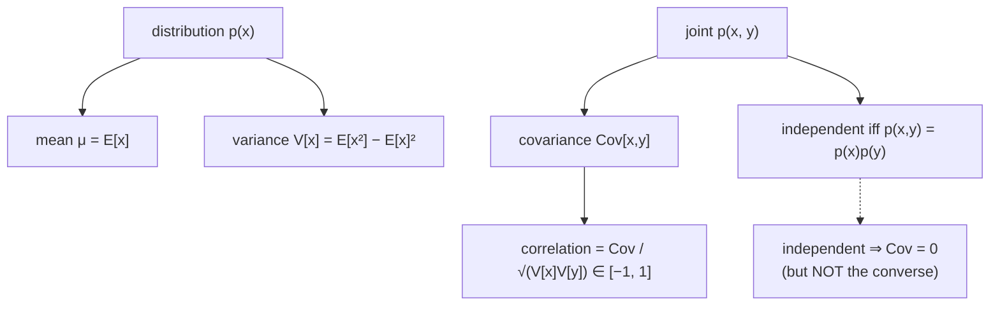

A full distribution can be complicated, so we summarize it with a few numbers: the **mean** (where
it's centered), the **variance** (how spread out), and the **covariance / correlation** (how two
variables move together). We also formalize **independence** — when knowing one variable tells you
nothing about another. These summaries drive PCA, uncertainty bands, and feature analysis.

## A real-life example: height and weight

Collect people's heights and weights. The **means** tell you the typical values; the **variances**
tell you how much they spread; and the **correlation** tells you they rise together (taller people
tend to weigh more) — a positive correlation near, say, +0.7. If two features were **independent**
(like height and a random lottery number), their correlation would be ~0 and one would tell you
nothing about the other.

## Expected value and mean

The **expected value** of a function $g$ of a random variable is its probability-weighted average:

$$
\mathbb{E}_X[g(x)] = \int_\mathcal{X} g(x)\,p(x)\,dx \quad(\text{continuous}), \qquad
\mathbb{E}_X[g(x)] = \sum_{x} g(x)\,p(x) \quad(\text{discrete}).
$$

The **mean** is the special case $g(x) = x$: $\boldsymbol\mu = \mathbb{E}_X[\mathbf{x}]$.
Expectation is **linear**: $\mathbb{E}[a\,g + b\,h] = a\,\mathbb{E}[g] + b\,\mathbb{E}[h]$. Two other
"averages" exist: the **median** (middle value, robust to outliers) and the **mode** (most likely
value / density peak).

## Variance and covariance

The **variance** measures spread — the expected squared deviation from the mean:

$$
\mathbb{V}_X[x] = \mathbb{E}_X[(x - \mu)^2] = \mathbb{E}[x^2] - (\mathbb{E}[x])^2.
$$

The **covariance** measures how two variables vary *together*:

$$
\text{Cov}[x, y] = \mathbb{E}[(x - \mathbb{E}[x])(y - \mathbb{E}[y])] = \mathbb{E}[xy] - \mathbb{E}[x]\mathbb{E}[y].
$$

For a vector $\mathbf{x}$, these assemble into the symmetric, positive-semidefinite **covariance
matrix** $\Sigma$, with variances on the diagonal and covariances off it.

## Correlation

Covariance depends on scale, so we normalize it into the **correlation**, always in $[-1, 1]$:

$$
\text{corr}[x, y] = \frac{\text{Cov}[x, y]}{\sqrt{\mathbb{V}[x]\,\mathbb{V}[y]}} \in [-1, 1].
$$

$+1$ = perfectly rising together, $-1$ = perfectly opposed, $0$ = no *linear* relationship.

### Watch correlation tilt the cloud

The same points, re-correlated. As the correlation sweeps from $-1$ to $+1$, the scatter cloud
tilts: negative → downward slope, zero → a round blob (no linear relation), positive → upward
slope:

```p5 title="Correlation from −1 to +1" desc="A cloud of points whose correlation ρ sweeps from −1 to +1. Negative ρ tilts the cloud down, ρ=0 is a round blob (uncorrelated), positive ρ tilts it up. The readout shows ρ live." height="360"
let pts=[], ph=0;
const U=42; let cx,cy;
function setup(){
  createCanvas(600,360); textFont("monospace"); cx=width/2; cy=height/2+6;
  for(let i=0;i<260;i++) pts.push([randomGaussian(), randomGaussian()]);
}
function draw(){
  background(13,17,23);
  ph+=0.012; const rho=Math.sin(ph);
  const sx=x=>cx+x*U, sy=y=>cy-y*U;
  stroke(32,44,58); strokeWeight(1);
  for(let g=-3;g<=3;g++){ line(sx(g),sy(-3),sx(g),sy(3)); line(sx(-3),sy(g),sx(3),sy(g)); }
  stroke(70,82,96); strokeWeight(1.2); line(sx(-3),sy(0),sx(3),sy(0)); line(sx(0),sy(-3),sx(0),sy(3));
  // points: y = rho*x + sqrt(1-rho^2)*z
  const s=Math.sqrt(Math.max(0,1-rho*rho));
  noStroke();
  const col = rho>0.1?color(120,200,140): rho<-0.1?color(232,110,110):color(255,211,67);
  for(const [x,z] of pts){ const y=rho*x + s*z; fill(col.levels[0],col.levels[1],col.levels[2],150); ellipse(sx(x*1.1),sy(y*1.1),6,6); }
  fill(255,211,67); textAlign(LEFT,TOP); textSize(15); text("Correlation ρ", 16, 12);
  fill(230); textSize(14); text(`ρ = ${rho.toFixed(2)}`, 16, 38);
  fill(col.levels[0],col.levels[1],col.levels[2]); textSize(13);
  text(rho>0.1?"positive: rise together": rho<-0.1?"negative: move oppositely":"≈ 0: no linear relation", 16, 60);
}
```

## Independence

Two random variables are **statistically independent** iff their joint factorizes:

$$
p(\mathbf{x}, \mathbf{y}) = p(\mathbf{x})\,p(\mathbf{y}).
$$

Then $p(\mathbf{y}\mid\mathbf{x}) = p(\mathbf{y})$ — knowing $\mathbf{x}$ tells you nothing about
$\mathbf{y}$. A crucial subtlety:

:::caution[Zero correlation ≠ independence]
Independent variables have zero covariance, but **zero covariance does not imply independence**.
Covariance only measures *linear* dependence. For $X$ with $\mathbb{E}[X]=\mathbb{E}[X^3]=0$ and
$Y = X^2$, $Y$ depends entirely on $X$ yet $\text{Cov}[X, Y] = 0$.
:::

**Conditional independence** $X \perp Y \mid Z$ means $p(\mathbf{x}, \mathbf{y} \mid \mathbf{z}) =
p(\mathbf{x}\mid\mathbf{z})\,p(\mathbf{y}\mid\mathbf{z})$ — the backbone of graphical models. In ML,
data is usually assumed **i.i.d.** (independent and identically distributed).



## NumPy

```python title="summary_stats.py" showLineNumbers{1}
import numpy as np
rng = np.random.default_rng(0)

# correlated height/weight-like data
h = rng.normal(170, 8, 5000)
w = 0.9 * (h - 170) + 65 + rng.normal(0, 4, 5000)   # weight rises with height

print("mean height:", round(h.mean(), 2))
print("std  height:", round(h.std(), 2))
print("covariance:\n", np.round(np.cov(h, w), 2))       # 2x2 covariance matrix
print("correlation:", round(np.corrcoef(h, w)[0, 1], 3))  # in [-1, 1]

# zero covariance but NOT independent: Y = X^2 with symmetric X
x = rng.normal(0, 1, 100000); y = x**2
print("Cov(X, X²) ≈", round(np.cov(x, y)[0, 1], 3), "(≈0, yet dependent!)")
```

```
mean height: 170.04
std  height: 7.98
covariance:
 [[63.7  57.3]
 [57.3 67.5]]
correlation: 0.873
Cov(X, X²) ≈ 0.006 (≈0, yet dependent!)
```

:::tip[From the book]
*Mathematics for Machine Learning* (Section 6.4) defines the **expected value** (Definition 6.3),
**mean** (6.4), **median**, and **mode**, and shows expectation is a **linear operator** (Equation
6.34). It defines **covariance** (6.36), **variance** as $\text{Cov}[x,x]$ with the **covariance
matrix** (6.38), and **correlation** (6.40) as normalized covariance in $[-1,1]$ (Figure 6.5). It
defines **statistical independence** $p(\mathbf{x},\mathbf{y}) = p(\mathbf{x})p(\mathbf{y})$
(Definition 6.10), warns that zero covariance does *not* imply independence (Example 6.5, $Y=X^2$),
and covers **conditional independence** and **i.i.d.** It even treats random variables as vectors
whose inner product is covariance, so **correlation is the cosine of the angle** between them
(Figure 6.6).
:::

## Why this matters for ML

- **Covariance matrices** are the input to **PCA** and Gaussian models; their eigenstructure is the
  data's principal directions.
- **Correlation** guides feature selection and reveals redundant/collinear features.
- **Independence assumptions** (i.i.d. data, naive Bayes, factorized posteriors) make otherwise
  intractable models computable.

## 🧪 Try It Yourself

import DataCampExercise from "../../../../components/DataCampExercise.astro";

### Exercise 1 – Mean and variance

<DataCampExercise
  lang="python"
  hint={`Use np.mean and np.var. Variance = mean of squared deviations from the mean.`}
  code={`import numpy as np

x = np.array([2.0, 4.0, 4.0, 4.0, 5.0, 5.0, 7.0, 9.0])
print("mean:", np.mean(x))
print("variance:", np.___(x))     # replace ___ with var

# ── Expected Output ───────────────────────────────
# mean: 5.0
# variance: 4.0
# ──────────────────────────────────────────────────`}
  solution={`import numpy as np
x = np.array([2.0, 4.0, 4.0, 4.0, 5.0, 5.0, 7.0, 9.0])
print("mean:", np.mean(x))
print("variance:", np.var(x))`}
  sct={`test_output_contains("variance: 4.0")
success_msg("Mean 5, variance 4 — the center and spread.")`}
  height={150}
/>

### Exercise 2 – Correlation

<DataCampExercise
  lang="python"
  hint={`np.corrcoef returns a matrix; the off-diagonal [0,1] entry is the correlation.`}
  code={`import numpy as np

x = np.array([1.0, 2.0, 3.0, 4.0, 5.0])
y = np.array([2.0, 4.0, 6.0, 8.0, 10.0])   # y = 2x, perfectly correlated

r = np.corrcoef(x, y)[0, ___]      # replace ___ with 1
print("correlation:", round(r, 3))

# ── Expected Output ───────────────────────────────
# correlation: 1.0
# ──────────────────────────────────────────────────`}
  solution={`import numpy as np
x = np.array([1.0, 2.0, 3.0, 4.0, 5.0])
y = np.array([2.0, 4.0, 6.0, 8.0, 10.0])
r = np.corrcoef(x, y)[0, 1]
print("correlation:", round(r, 3))`}
  sct={`test_output_contains("correlation: 1.0")
success_msg("y = 2x → perfect positive correlation of 1.")`}
  height={155}
/>

### Exercise 3 – Independence check

<DataCampExercise
  lang="python"
  hint={`Independent iff joint == product of marginals. Compare p(x,y) to outer(p_x, p_y).`}
  code={`import numpy as np

# a joint that factorizes -> independent
p_x = np.array([0.5, 0.5])
p_y = np.array([0.2, 0.8])
joint = np.outer(p_x, p_y)

independent = np.allclose(joint, np.outer(p_x, ___))   # replace ___ with p_y
print("independent?", independent)

# ── Expected Output ───────────────────────────────
# independent? True
# ──────────────────────────────────────────────────`}
  solution={`import numpy as np
p_x = np.array([0.5, 0.5])
p_y = np.array([0.2, 0.8])
joint = np.outer(p_x, p_y)
independent = np.allclose(joint, np.outer(p_x, p_y))
print("independent?", independent)`}
  sct={`test_output_contains("independent? True")
success_msg("Joint = product of marginals → statistically independent.")`}
  height={160}
/>

## Recap

- **Mean** (center), **variance** (spread), and **covariance/correlation** (joint variation)
  summarize distributions; expectation is **linear**.
- The **covariance matrix** is symmetric positive-semidefinite — the object PCA and Gaussians act on.
- **Independence** means the joint factorizes; **zero covariance does not imply independence** (it
  only rules out *linear* dependence).

**Next:** the most important distribution in all of ML — the **[Gaussian](../gaussian-distribution/)**.
