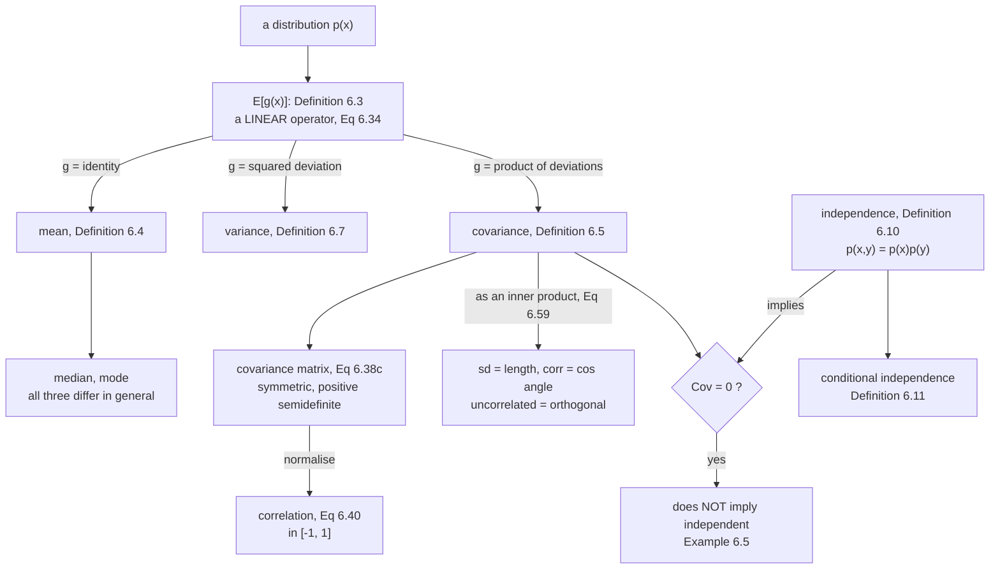

A **statistic** of a random variable is a deterministic function of it. Summary
statistics reduce a whole distribution to a few numbers — which is useful, and
also exactly where the information goes missing. This section builds the standard
set, and then spends most of its effort on the three places they mislead:

- the mean, the median and the mode can all be different, and the "2-D median" is
  not a thing;
- two datasets can agree on every mean and every per-axis variance and still be
  completely different;
- **zero covariance does not mean independent** — the book gives Example 6.5 for
  precisely this.

## What you'll learn

- **Definition 6.3**, the expected value, and the fact that it is a *linear
  operator* (Equation 6.34) — no independence required.
- **Definition 6.4** the mean, plus the median and the mode, and why the median
  does not generalise to higher dimensions.
- **Definitions 6.5 to 6.8**: covariance, the covariance matrix of Equation
  6.38c, variance, and correlation.
- **Definition 6.9**: empirical mean and covariance — and the book's margin note
  that it uses the **biased** $1/N$ form.
- **§6.4.3's three expressions for the variance** (Equations 6.43, 6.44, 6.45) —
  identical in exact arithmetic, and one of them measured losing every digit.
- **Equations 6.46 to 6.52**: sums and affine transformations, including
  $\mathbf{A}\boldsymbol{\Sigma}\mathbf{A}^\top$.
- **Definitions 6.10 and 6.11**: independence and *conditional* independence, with
  a case where conditioning removes dependence entirely.
- **§6.4.6**: covariance as an inner product — standard deviation is a length,
  correlation is the cosine of an angle, and uncorrelated means orthogonal.

## Intuition: summaries throw things away

A distribution is an infinite object. A summary statistic is a number. The whole
game is knowing what got discarded.

Start with "the average". There are three sensible meanings. The **mean** is the
balance point — where the distribution would sit on a fulcrum. The **median** is
the halfway mark — half the mass either side. The **mode** is the peak — the most
likely value. On a symmetric single-humped distribution all three coincide, which
is why they are so often confused. On the book's Example 6.4 they land in three
different places, and one of the marginals is unimodal while the joint has two
modes.

Then "spread". Variance is the average squared distance from the mean. Covariance
is the same idea for a *pair*: do they deviate together? The trap is that
covariance measures only whether the cloud *tilts*. A cloud shaped like a
perfect parabola does not tilt at all — its covariance is zero — while one
variable determines the other completely.

And the geometric picture that ties it together: treat zero-mean random variables
as **vectors**. Covariance is their inner product, standard deviation is their
length, correlation is the cosine of the angle between them, and "uncorrelated"
means "at right angles". Then $\mathbb{V}[x+y] = \mathbb{V}[x] + \mathbb{V}[y]$
for uncorrelated variables is nothing but Pythagoras.



## The math

### Definition 6.3: the expected value

For a function $g : \mathbb{R} \to \mathbb{R}$ of a univariate continuous random
variable $X \sim p(x)$:

$$
\mathbb{E}_X[g(x)] = \int_{\mathcal{X}} g(x)p(x)\,\mathrm{d}x
\tag{6.28}
$$

and for a discrete one:

$$
\mathbb{E}_X[g(x)] = \sum_{x \in \mathcal{X}} g(x)p(x)
\tag{6.29}
$$

where $\mathcal{X}$ is the target space. For multivariate $X$ the expectation is
elementwise:

$$
\mathbb{E}_X[g(\mathbf{x})] = \begin{bmatrix}\mathbb{E}_{X_1}[g(x_1)] \\ \vdots \\ \mathbb{E}_{X_D}[g(x_D)]\end{bmatrix} \in \mathbb{R}^D
\tag{6.30}
$$

:::note[The law of the unconscious statistician]
The book's margin note names Equation 6.28: the expected value of a *function* of
a random variable is sometimes called the *law of the unconscious statistician*.
The point of the name is that you integrate $g(x)$ against the density of $x$ —
you never need the density of $g(x)$ itself. That is why
$\mathbb{E}[x^2]$ is computable without ever asking what distribution $x^2$ has.
:::

**Definition 6.4 (Mean).** The special case $g = \text{identity}$:

$$
\mathbb{E}_X[\mathbf{x}] = \begin{bmatrix}\mathbb{E}_{X_1}[x_1] \\ \vdots \\ \mathbb{E}_{X_D}[x_D]\end{bmatrix} \in \mathbb{R}^D
\tag{6.31}
$$

$$
\mathbb{E}_{x_d}[x_d] := \begin{cases}\displaystyle\int_{\mathcal{X}} x_d\,p(x_d)\,\mathrm{d}x_d & \text{continuous} \\[8pt] \displaystyle\sum_{x_i \in \mathcal{X}} x_i\,p(x_d = x_i) & \text{discrete}\end{cases}
\tag{6.32}
$$

**The other two averages.** The **median** is the middle value — $50\%$ above,
$50\%$ below, or for continuous variables the point where the cdf equals $0.5$.
It is more robust to outliers than the mean and often closer to intuition for
skewed or long-tailed distributions. The **mode** is the most frequent value; for
a continuous variable, a peak of the density. A density can have many modes, and
in high dimensions finding them all is computationally hard.

:::caution[There is no median in more than one dimension]
The book is explicit: generalising the median past 1-D is non-trivial *"as there
is no obvious way to sort in more than one dimension"*. It is tempting to stack
the per-dimension medians, but that is not a median of the joint. The reason:
there is more than one way to define $<$ such that
$\begin{bmatrix}3\\0\end{bmatrix} < \begin{bmatrix}2\\3\end{bmatrix}$.
:::

### Equation 6.34: expectation is linear

For $f(\mathbf{x}) = a\,g(\mathbf{x}) + b\,h(\mathbf{x})$:

$$
\mathbb{E}_X[f(\mathbf{x})] = a\,\mathbb{E}_X[g(\mathbf{x})] + b\,\mathbb{E}_X[h(\mathbf{x})]
\tag{6.34}
$$

which follows from the integral being linear. **This needs no independence and no
assumptions about $g$ and $h$** — it is the single most reused fact in the rest of
the book.

### Definitions 6.5 to 6.8: covariance, variance, correlation

**Covariance (univariate)** — the expected product of the deviations:

$$
\operatorname{Cov}_{X,Y}[x,y] := \mathbb{E}_{X,Y}\bigl[(x - \mathbb{E}_X[x])(y - \mathbb{E}_Y[y])\bigr]
\tag{6.35}
$$

By linearity this rearranges to the form you will actually compute with:

$$
\operatorname{Cov}[x,y] = \mathbb{E}[xy] - \mathbb{E}[x]\mathbb{E}[y]
\tag{6.36}
$$

$\operatorname{Cov}[x,x]$ is the **variance** $\mathbb{V}_X[x]$; its square root
is the **standard deviation** $\sigma(x)$.

**Covariance (multivariate)** for $\mathbf{x}\in\mathbb{R}^D$,
$\mathbf{y}\in\mathbb{R}^E$:

$$
\operatorname{Cov}[\mathbf{x},\mathbf{y}] = \mathbb{E}[\mathbf{x}\mathbf{y}^\top] - \mathbb{E}[\mathbf{x}]\mathbb{E}[\mathbf{y}]^\top = \operatorname{Cov}[\mathbf{y},\mathbf{x}]^\top \in \mathbb{R}^{D\times E}
\tag{6.37}
$$

**Variance** is that with the same variable twice:

$$
\mathbb{V}_X[\mathbf{x}] = \mathbb{E}_X[(\mathbf{x}-\boldsymbol{\mu})(\mathbf{x}-\boldsymbol{\mu})^\top] = \mathbb{E}_X[\mathbf{x}\mathbf{x}^\top] - \mathbb{E}_X[\mathbf{x}]\mathbb{E}_X[\mathbf{x}]^\top
\tag{6.38b}
$$

$$
= \begin{bmatrix}
\operatorname{Cov}[x_1,x_1] & \operatorname{Cov}[x_1,x_2] & \cdots & \operatorname{Cov}[x_1,x_D]\\
\operatorname{Cov}[x_2,x_1] & \operatorname{Cov}[x_2,x_2] & \cdots & \operatorname{Cov}[x_2,x_D]\\
\vdots & \vdots & \ddots & \vdots\\
\operatorname{Cov}[x_D,x_1] & \cdots & \cdots & \operatorname{Cov}[x_D,x_D]
\end{bmatrix}
\tag{6.38c}
$$

the **covariance matrix**: symmetric and positive semidefinite, with the marginal
variances on its diagonal and the **cross-covariances** off it.

**Correlation** normalises away the scales:

$$
\operatorname{corr}[x,y] = \frac{\operatorname{Cov}[x,y]}{\sqrt{\mathbb{V}[x]\,\mathbb{V}[y]}} \in [-1,1]
\tag{6.40}
$$

The correlation matrix is the covariance matrix of the *standardised* variables
$x/\sigma(x)$.

### Definition 6.9: empirical mean and covariance

$$
\bar{\mathbf{x}} := \frac{1}{N}\sum_{n=1}^{N}\mathbf{x}_n,
\qquad
\boldsymbol{\Sigma} := \frac{1}{N}\sum_{n=1}^{N}(\mathbf{x}_n - \bar{\mathbf{x}})(\mathbf{x}_n - \bar{\mathbf{x}})^\top
\tag{6.41, 6.42}
$$

:::caution[The book uses the biased estimator, and says so]
The margin note: *"Throughout the book, we use the empirical covariance, which is
a **biased** estimate. The unbiased (sometimes called corrected) covariance has
the factor $N-1$ in the denominator instead of $N$."* Measured on a distribution
with variance $3$: the $1/N$ form averages $1.4979$ at $N=2$ and $2.9394$ at
$N=50$, while the $1/(N-1)$ form sits at $2.9958$ and $2.9994$. The bias is a
factor $(N-1)/N$ — at $N=2$ that is **half the true variance**. NumPy defaults to
$1/N$; pandas defaults to $1/(N-1)$.
:::

### §6.4.3: three expressions for the variance

**The definition** — needs two passes over the data, one for the mean and one for
the deviations:

$$
\mathbb{V}_X[x] := \mathbb{E}_X[(x-\mu)^2]
\tag{6.43}
$$

**The raw-score formula** — "the mean of the square minus the square of the
mean", computable in one pass:

$$
\mathbb{V}_X[x] = \mathbb{E}_X[x^2] - \bigl(\mathbb{E}_X[x]\bigr)^2
\tag{6.44}
$$

**The pairwise form** — the sum of all $N^2$ squared differences between
observations:

$$
\frac{1}{N^2}\sum_{i,j=1}^{N}(x_i-x_j)^2 = 2\left[\frac{1}{N}\sum_{i=1}^{N}x_i^2 - \left(\frac{1}{N}\sum_{i=1}^{N}x_i\right)^{\!2}\right]
\tag{6.45}
$$

exactly **twice** the raw-score expression. Geometrically: the pairwise distances
between points carry the same information as the distances from their centre. So
$N^2$ terms can be had from $N$.

:::danger[Equation 6.44 will destroy your answer]
The book flags it in the margin — *"if the two terms in (6.44) are huge and
approximately equal, we may suffer from an unnecessary loss of numerical
precision"* — and it is worse than "unnecessary loss". Variance is
**shift-invariant**, so adding a constant to every observation must not change it.
Measured on the same eight numbers whose variance is exactly $4$:

| constant added | Eq 6.43 two-pass | Eq 6.44 raw score |
|---|---|---|
| $0$ | $4.0000000000$ | $4.0000000000$ |
| $10^6$ | $4.0000000000$ | $4.0000000000$ |
| $10^8$ | $4.0000000000$ | $4.0000000000$ |
| $10^9$ | $4.0000000000$ | **$0.0000000000$** |
| $10^{10}$ | $4.0000000000$ | **$0.0000000000$** |

At $10^9$ the raw-score form returns **zero** for a sample that plainly varies.
Not a small error — the entire answer. Use the two-pass form, or Welford's
online algorithm; never Equation 6.44 on data with a large offset.
:::

### Equations 6.46 to 6.52: sums and affine maps

$$
\mathbb{E}[\mathbf{x}+\mathbf{y}] = \mathbb{E}[\mathbf{x}] + \mathbb{E}[\mathbf{y}],
\qquad
\mathbb{E}[\mathbf{x}-\mathbf{y}] = \mathbb{E}[\mathbf{x}] - \mathbb{E}[\mathbf{y}]
\tag{6.46, 6.47}
$$

$$
\mathbb{V}[\mathbf{x}+\mathbf{y}] = \mathbb{V}[\mathbf{x}] + \mathbb{V}[\mathbf{y}] + \operatorname{Cov}[\mathbf{x},\mathbf{y}] + \operatorname{Cov}[\mathbf{y},\mathbf{x}]
\tag{6.48}
$$

$$
\mathbb{V}[\mathbf{x}-\mathbf{y}] = \mathbb{V}[\mathbf{x}] + \mathbb{V}[\mathbf{y}] - \operatorname{Cov}[\mathbf{x},\mathbf{y}] - \operatorname{Cov}[\mathbf{y},\mathbf{x}]
\tag{6.49}
$$

The means add unconditionally; the variances need the cross terms. For an affine
map $\mathbf{y} = \mathbf{A}\mathbf{x} + \mathbf{b}$:

$$
\mathbb{E}_Y[\mathbf{y}] = \mathbf{A}\boldsymbol{\mu} + \mathbf{b},
\qquad
\mathbb{V}_Y[\mathbf{y}] = \mathbf{A}\boldsymbol{\Sigma}\mathbf{A}^\top
\tag{6.50, 6.51}
$$

Note $\mathbf{b}$ moves the mean and leaves the variance alone — shift invariance
again. And the cross-covariance between input and output:

$$
\operatorname{Cov}[\mathbf{x},\mathbf{y}] = \boldsymbol{\Sigma}\mathbf{A}^\top
\tag{6.52}
$$

### Definitions 6.10 and 6.11: independence

**Definition 6.10.** $X$ and $Y$ are **statistically independent** iff

$$
p(\mathbf{x},\mathbf{y}) = p(\mathbf{x})p(\mathbf{y})
\tag{6.53}
$$

Intuitively, knowing $\mathbf{y}$ adds no information about $\mathbf{x}$. If they
are independent then $p(\mathbf{y}\mid\mathbf{x}) = p(\mathbf{y})$,
$p(\mathbf{x}\mid\mathbf{y}) = p(\mathbf{x})$,
$\mathbb{V}[\mathbf{x}+\mathbf{y}] = \mathbb{V}[\mathbf{x}]+\mathbb{V}[\mathbf{y}]$,
and $\operatorname{Cov}[\mathbf{x},\mathbf{y}] = \mathbf{0}$.

**The converse fails.** That last implication does not reverse, because covariance
measures only *linear* dependence. **Example 6.5**: let $X$ have
$\mathbb{E}[x]=0$ and $\mathbb{E}[x^3]=0$, and set $y = x^2$ — so $Y$ is a
deterministic function of $X$. Then

$$
\operatorname{Cov}[x,y] = \mathbb{E}[xy] - \mathbb{E}[x]\mathbb{E}[y] = \mathbb{E}[x^3] = 0
\tag{6.54}
$$

**Definition 6.11.** $X$ and $Y$ are **conditionally independent** given $Z$,
written $X \perp\!\!\!\perp Y \mid Z$, iff

$$
p(\mathbf{x},\mathbf{y}\mid\mathbf{z}) = p(\mathbf{x}\mid\mathbf{z})\,p(\mathbf{y}\mid\mathbf{z}) \quad \text{for all } \mathbf{z}\in\mathcal{Z}
\tag{6.55}
$$

for **every** value of $\mathbf{z}$. Expanding the left side with the product
rule, $p(\mathbf{x},\mathbf{y}\mid\mathbf{z}) = p(\mathbf{x}\mid\mathbf{y},\mathbf{z})p(\mathbf{y}\mid\mathbf{z})$,
and comparing gives the equivalent form

$$
p(\mathbf{x}\mid\mathbf{y},\mathbf{z}) = p(\mathbf{x}\mid\mathbf{z})
\tag{6.57}
$$

read as: *given that we know $\mathbf{z}$, knowledge about $\mathbf{y}$ does not
change our knowledge of $\mathbf{x}$*. Ordinary independence is the special case
$X \perp\!\!\!\perp Y \mid \emptyset$.

### §6.4.6: random variables as vectors

For zero-mean $X, Y$, define

$$
\langle X, Y\rangle := \operatorname{Cov}[x,y]
\tag{6.59}
$$

This is a genuine inner product — symmetric, positive definite, linear in each
argument. So the induced **length** is

$$
\lVert X\rVert = \sqrt{\operatorname{Cov}[x,x]} = \sqrt{\mathbb{V}[x]} = \sigma[x]
\tag{6.60}
$$

the standard deviation: *"the longer the random variable, the more uncertain it
is; and a random variable with length 0 is deterministic."* And the **angle**:

$$
\cos\theta = \frac{\langle X,Y\rangle}{\lVert X\rVert\lVert Y\rVert} = \frac{\operatorname{Cov}[x,y]}{\sqrt{\mathbb{V}[x]\mathbb{V}[y]}}
\tag{6.61}
$$

which is exactly the correlation. So $X \perp Y \iff \operatorname{Cov}[x,y]=0$:
**uncorrelated means orthogonal**, and

$$
\mathbb{V}[x+y] = \mathbb{V}[x] + \mathbb{V}[y]
\tag{6.58}
$$

is the Pythagorean theorem with standard deviations as the side lengths — the
book's Figure 6.6.

## Worked example by hand

### Example 6.4, the three averages

$$
p(\mathbf{x}) = 0.4\,\mathcal{N}\!\left(\mathbf{x}\;\middle|\;\begin{bmatrix}10\\2\end{bmatrix},\begin{bmatrix}1&0\\0&1\end{bmatrix}\right) + 0.6\,\mathcal{N}\!\left(\mathbf{x}\;\middle|\;\begin{bmatrix}0\\0\end{bmatrix},\begin{bmatrix}8.4&2.0\\2.0&1.7\end{bmatrix}\right)
\tag{6.33}
$$

**The mean needs no simulation.** Expectation is linear (Equation 6.34), and a
mixture is a linear combination of its components, so

$$
\mathbb{E}[\mathbf{x}] = 0.4\begin{bmatrix}10\\2\end{bmatrix} + 0.6\begin{bmatrix}0\\0\end{bmatrix} = \begin{bmatrix}4.0\\0.8\end{bmatrix}
$$

exactly. Two million samples give $(3.999062,\ 0.800315)$ — gap $0.0009$, which is
sampling noise, not a discrepancy.

**The modes are the component centres**, $(10, 2)$ and $(0,0)$ — two of them, so
the joint is bimodal.

**The median is somewhere else again.** Per dimension: $(2.8022,\ 0.8687)$. So
$\text{mean} - \text{median} = (+1.1978,\ -0.0687)$ — the first coordinate differs
by more than one unit.

**And the marginals disagree about how many humps there are.** Measured by
counting peaks of a smoothed histogram:

| marginal | modes | at |
|---|---|---|
| $p(x_1)$ | **2** | $0.09$, $10.04$ |
| $p(x_2)$ | **1** | $1.30$ |

The joint has two modes; $p(x_2)$ has one. Marginalising integrated the structure
away. This is why "the distribution is unimodal" is a claim about a *specific*
marginal, not about the joint.

### The three variances, on eight numbers

Take $x = (2, 4, 4, 4, 5, 5, 7, 9)$, so $N = 8$ and $\bar{x} = 5$.

**Equation 6.43**, two passes. Deviations: $-3, -1, -1, -1, 0, 0, 2, 4$. Squares:
$9, 1, 1, 1, 0, 0, 4, 16 = 32$. So $\mathbb{V} = 32/8 = 4$.

**Equation 6.44**, one pass.
$\mathbb{E}[x^2] = (4+16+16+16+25+25+49+81)/8 = 232/8 = 29$, and
$\bar{x}^2 = 25$. So $\mathbb{V} = 29 - 25 = 4$. ✓

**Equation 6.45**, pairwise. All $64$ squared differences sum to $512$, so
$512/64 = 8$ — which is $2 \times 4$. ✓

All three agree to $0.0\text{e}{+}00$. In exact arithmetic they are the same
formula. In floating point they are not, which is the
[figure below](#on-real-data).

### Example 6.5, worked

Let $x \sim \mathcal{N}(0,1)$ — symmetric, so $\mathbb{E}[x] = 0$ and
$\mathbb{E}[x^3] = 0$ — and $y = x^2$. Then Equation 6.54 gives
$\operatorname{Cov}[x,y] = \mathbb{E}[x^3] = 0$.

Measured on four million samples: $\mathbb{E}[x] = 0.000341$,
$\mathbb{E}[x^3] = 0.000148$, $\operatorname{Cov}[x,y] = -0.000192$,
correlation $-0.000136$. Zero, to sampling accuracy.

Now check Definition 6.10 directly on a $24\times24$ grid:

$$
\max_{x,y}\bigl|p(x,y) - p(x)p(y)\bigr| = 0.048633,
\qquad
\tfrac12\sum\bigl|p(x,y)-p(x)p(y)\bigr| = 0.406123
$$

Independence fails badly. And conditioning shows why:

| | overall | given $\lvert x\rvert < 0.5$ |
|---|---|---|
| $\mathbb{E}[y]$ | $0.998384$ | $0.080544$ |
| $\mathbb{V}[y]$ | $1.992868$ | $0.005416$ |

Knowing $x$ collapses the variance of $y$ by a factor of $368$. Covariance said
nothing because covariance only ever looks for a *tilt*, and a parabola has none.

## See it move

```p5 title="Mean, median and mode pull apart" desc="A two-component mixture. Drag the separation, the weight and the width, and watch the three averages separate. At equal weights and zero separation they coincide; push them apart and the mean chases the far component while the mode stays put and the median lands in between. The panel reports all three plus the mode count." height="600"
let sep = 8, w1 = 0.4, sd1 = 1.0, sd2 = 2.9;
let KNOBS = [], dragging = null;

function setup() { createCanvas(600, 600); textFont("monospace"); noLoop(); }

function knob(id, x, y, w, value, mn, mx, label) {
  KNOBS.push({ id, x, y, w, mn, mx });
  const t = (value - mn) / (mx - mn);
  stroke(60, 74, 92); strokeWeight(2); line(x, y, x + w, y);
  noStroke(); fill(255, 211, 67); ellipse(x + t * w, y, 10, 10);
  fill(190, 200, 212); textSize(11); textAlign(LEFT, CENTER);
  text(label, x + w + 12, y);
}
function mousePressed() {
  for (const k of KNOBS)
    if (mouseY > k.y - 11 && mouseY < k.y + 11 && mouseX > k.x - 11 && mouseX < k.x + k.w + 11) {
      dragging = k; return;
    }
}
function mouseReleased() { dragging = null; }
function mouseDragged() {
  if (!dragging) return;
  const t = Math.min(1, Math.max(0, (mouseX - dragging.x) / dragging.w));
  const v = dragging.mn + t * (dragging.mx - dragging.mn);
  if (dragging.id === "sep") sep = Math.round(v * 10) / 10;
  if (dragging.id === "w1") w1 = Math.round(v * 100) / 100;
  if (dragging.id === "sd1") sd1 = Math.round(v * 10) / 10;
  if (dragging.id === "sd2") sd2 = Math.round(v * 10) / 10;
  redraw();
}

const norm = (x, m, s) => Math.exp(-0.5 * ((x - m) / s) ** 2) / (s * Math.sqrt(2 * Math.PI));

function draw() {
  background(13, 17, 23);
  KNOBS = [];

  const m1 = sep, m2 = 0;
  const dens = (x) => w1 * norm(x, m1, sd1) + (1 - w1) * norm(x, m2, sd2);

  const XR = [-12, 20], N = 3200;
  const dx = (XR[1] - XR[0]) / N;
  const xs = [], ys = [];
  for (let i = 0; i <= N; i++) { const x = XR[0] + i * dx; xs.push(x); ys.push(dens(x)); }

  // The three averages, computed from the density on the grid.
  let area = 0, mean = 0;
  for (let i = 0; i <= N; i++) { area += ys[i] * dx; mean += xs[i] * ys[i] * dx; }
  mean /= area;
  let acc = 0, median = xs[0];
  for (let i = 0; i <= N; i++) { acc += ys[i] * dx / area; if (acc >= 0.5) { median = xs[i]; break; } }
  // Modes: local maxima of the density.
  const modes = [];
  for (let i = 2; i < N - 1; i++)
    if (ys[i] > ys[i - 1] && ys[i] >= ys[i + 1] && ys[i] > 0.02 * Math.max(...ys))
      modes.push(xs[i]);

  const PL = { x: 50, y: 74, w: 510, h: 290 };
  const ymax = Math.max(...ys) * 1.15;
  const sx = (x) => PL.x + ((x - XR[0]) / (XR[1] - XR[0])) * PL.w;
  const sy = (v) => PL.y + PL.h - (v / ymax) * PL.h;

  noStroke(); fill(19, 25, 33); rect(PL.x, PL.y, PL.w, PL.h, 4);
  stroke(60, 74, 92); strokeWeight(1); line(PL.x, sy(0), PL.x + PL.w, sy(0));

  // The two components, faint, then the mixture.
  stroke(90, 100, 118); strokeWeight(1.2); noFill();
  for (const [w, m, s] of [[w1, m1, sd1], [1 - w1, m2, sd2]]) {
    beginShape();
    for (let i = 0; i <= N; i += 2) vertex(sx(xs[i]), sy(w * norm(xs[i], m, s)));
    endShape();
  }
  stroke(107, 169, 221); strokeWeight(2.4); noFill();
  beginShape();
  for (let i = 0; i <= N; i += 2) vertex(sx(xs[i]), sy(ys[i]));
  endShape();

  // Markers.
  const mark = (x, col, label, dy) => {
    stroke(col[0], col[1], col[2]); strokeWeight(2);
    line(sx(x), PL.y, sx(x), PL.y + PL.h);
    noStroke(); fill(col[0], col[1], col[2]); textSize(10.5); textAlign(LEFT, TOP);
    text(label, sx(x) + 4, PL.y + dy);
  };
  mark(mean, [255, 211, 67], "mean", 6);
  mark(median, [120, 200, 150], "median", 22);
  for (const mo of modes) mark(mo, [232, 110, 110], "mode", 38);

  noStroke(); textAlign(LEFT, TOP);
  fill(255, 211, 67); textSize(15);
  text("three averages, three answers", 16, 12);
  fill(200, 210, 222); textSize(11);
  text("faint curves are the weighted components; blue is the mixture", 16, 34);

  const y0 = 380;
  fill(235); textSize(12);
  text(`mean    ${mean.toFixed(4)}`, 16, y0);
  fill(120, 200, 150);
  text(`median  ${median.toFixed(4)}`, 16, y0 + 20);
  fill(232, 110, 110);
  text(`mode(s) ${modes.map((m) => m.toFixed(3)).join(", ")}   (${modes.length} mode${modes.length === 1 ? "" : "s"})`, 16, y0 + 40);
  fill(150); textSize(11);
  text(`mean - median = ${(mean - median).toFixed(4)}`, 16, y0 + 64);
  text(`total mass (should be 1): ${area.toFixed(8)}`, 16, y0 + 82);
  fill(modes.length > 1 ? color(197, 153, 255) : color(120, 130, 145)); textSize(11);
  text(modes.length > 1
    ? "bimodal: the mean sits between the humps, where the density is LOW"
    : "unimodal: the three averages are close, which is why they get confused",
    16, y0 + 104);

  knob("sep", 16, 496, 180, sep, 0, 16, `separation = ${sep.toFixed(1)}`);
  knob("w1", 16, 522, 180, w1, 0.02, 0.98, `weight of the far component = ${w1.toFixed(2)}`);
  knob("sd1", 16, 548, 180, sd1, 0.4, 5, `sd of the far component = ${sd1.toFixed(1)}`);
  knob("sd2", 16, 574, 180, sd2, 0.4, 5, `sd of the near component = ${sd2.toFixed(1)}`);
}
```

```p5 title="Covariance is a tilt, and only a tilt" desc="Choose a relationship between x and y. Each one is a genuine dependence, but covariance only detects the ones that tilt the cloud. The parabola and the circle have a measured correlation near zero while y is completely determined by x — Example 6.5, and its cousins." height="580"
let shape = 0, noiseAmt = 0.0;
let BTNS = [], KNOBS = [], dragging = null;

const SHAPES = ["linear", "parabola  y = x^2", "circle", "cross", "sine  y = sin(3x)"];

// A fixed pseudo-random sequence, so the picture is stable across redraws.
let seedState = 12345;
function rnd() { seedState = (seedState * 1103515245 + 12345) & 0x7fffffff; return seedState / 0x7fffffff; }
function gauss() {
  const u = Math.max(rnd(), 1e-12), v = rnd();
  return Math.sqrt(-2 * Math.log(u)) * Math.cos(2 * Math.PI * v);
}

function setup() { createCanvas(600, 580); textFont("monospace"); noLoop(); }

function knob(id, x, y, w, value, mn, mx, label) {
  KNOBS.push({ id, x, y, w, mn, mx });
  const t = (value - mn) / (mx - mn);
  stroke(60, 74, 92); strokeWeight(2); line(x, y, x + w, y);
  noStroke(); fill(255, 211, 67); ellipse(x + t * w, y, 10, 10);
  fill(190, 200, 212); textSize(11); textAlign(LEFT, CENTER);
  text(label, x + w + 12, y);
}
function mousePressed() {
  for (const b of BTNS)
    if (mouseX > b.x && mouseX < b.x + b.w && mouseY > b.y && mouseY < b.y + b.h) {
      shape = b.s; redraw(); return;
    }
  for (const k of KNOBS)
    if (mouseY > k.y - 11 && mouseY < k.y + 11 && mouseX > k.x - 11 && mouseX < k.x + k.w + 11) {
      dragging = k; return;
    }
}
function mouseReleased() { dragging = null; }
function mouseDragged() {
  if (!dragging) return;
  const t = Math.min(1, Math.max(0, (mouseX - dragging.x) / dragging.w));
  noiseAmt = Math.round((dragging.mn + t * (dragging.mx - dragging.mn)) * 100) / 100;
  redraw();
}

function build() {
  seedState = 12345;
  const P = 1400, xs = [], ys = [];
  for (let i = 0; i < P; i++) {
    let x, y;
    if (shape === 0) { x = gauss(); y = 0.8 * x; }
    else if (shape === 1) { x = gauss(); y = x * x; }
    else if (shape === 2) { const t = rnd() * 2 * Math.PI; x = 1.6 * Math.cos(t); y = 1.6 * Math.sin(t); }
    else if (shape === 3) { const t = gauss() * 1.2; if (rnd() < 0.5) { x = t; y = 0; } else { x = 0; y = t; } }
    else { x = gauss() * 1.4; y = Math.sin(3 * x); }
    xs.push(x + noiseAmt * gauss() * 0.4);
    ys.push(y + noiseAmt * gauss() * 0.4);
  }
  return [xs, ys];
}

function draw() {
  background(13, 17, 23);
  BTNS = []; KNOBS = [];
  const [xs, ys] = build();
  const n = xs.length;
  const mx = xs.reduce((a, b) => a + b, 0) / n;
  const my = ys.reduce((a, b) => a + b, 0) / n;
  let cxy = 0, vx = 0, vy = 0;
  for (let i = 0; i < n; i++) {
    cxy += (xs[i] - mx) * (ys[i] - my); vx += (xs[i] - mx) ** 2; vy += (ys[i] - my) ** 2;
  }
  cxy /= n; vx /= n; vy /= n;
  const corr = cxy / Math.sqrt(vx * vy);

  // A non-linear dependence check: does binning x change the spread of y?
  const B = 9, lo = Math.min(...xs), hi = Math.max(...xs);
  let within = 0, cnt = 0;
  for (let b = 0; b < B; b++) {
    const a0 = lo + (hi - lo) * b / B, a1 = lo + (hi - lo) * (b + 1) / B;
    const sel = [];
    for (let i = 0; i < n; i++) if (xs[i] >= a0 && xs[i] < a1) sel.push(ys[i]);
    if (sel.length < 12) continue;
    const m = sel.reduce((a, b2) => a + b2, 0) / sel.length;
    within += sel.reduce((a, b2) => a + (b2 - m) ** 2, 0) / sel.length * sel.length;
    cnt += sel.length;
  }
  const ratio = cnt ? (within / cnt) / vy : 1;

  const PL = { x: 130, y: 70, w: 340, h: 280 };
  noStroke(); fill(19, 25, 33); rect(PL.x, PL.y, PL.w, PL.h, 4);
  const R = 3.4;
  const sx = (x) => PL.x + ((x + R) / (2 * R)) * PL.w;
  const sy = (y) => PL.y + PL.h - ((y + R) / (2 * R)) * PL.h;
  stroke(52, 62, 76); strokeWeight(1);
  line(PL.x, sy(0), PL.x + PL.w, sy(0)); line(sx(0), PL.y, sx(0), PL.y + PL.h);
  noStroke(); fill(107, 169, 221, 130);
  for (let i = 0; i < n; i++) ellipse(sx(xs[i]), sy(ys[i]), 3.4, 3.4);
  // The best straight line, which is all covariance can see.
  const slope = cxy / vx, icpt = my - slope * mx;
  stroke(232, 110, 110); strokeWeight(2);
  line(sx(-R), sy(slope * -R + icpt), sx(R), sy(slope * R + icpt));

  noStroke(); textAlign(LEFT, TOP);
  fill(255, 211, 67); textSize(15);
  text("covariance sees the red line and nothing else", 16, 12);
  fill(200, 210, 222); textSize(11);
  text(`${SHAPES[shape]}`, 16, 34);

  const y0 = 366;
  fill(235); textSize(12);
  text(`Cov[x,y]     ${cxy >= 0 ? " " : ""}${cxy.toFixed(6)}`, 16, y0);
  text(`correlation  ${corr >= 0 ? " " : ""}${corr.toFixed(6)}`, 16, y0 + 20);
  fill(150); textSize(11);
  text(`best-fit slope ${slope.toFixed(6)}`, 16, y0 + 42);
  fill(120, 200, 150); textSize(11.5);
  text(`V[y | x] / V[y] = ${ratio.toFixed(4)}`, 16, y0 + 64);
  fill(150); textSize(10.5);
  text("that ratio is 1 under independence. Below 1 means knowing x", 16, y0 + 82);
  text("narrows y -- a dependence covariance may not report.", 16, y0 + 97);

  const flag = Math.abs(corr) < 0.06 && ratio < 0.7;
  fill(flag ? color(232, 110, 110) : color(120, 130, 145)); textSize(12);
  text(flag
    ? "UNCORRELATED YET DEPENDENT -- exactly Example 6.5"
    : (Math.abs(corr) >= 0.06 ? "correlated: the tilt is real" : "no dependence detected either way"),
    16, y0 + 120);

  for (let s = 0; s < SHAPES.length; s++) {
    const x = 16 + (s % 3) * 190, y = 508 + Math.floor(s / 3) * 26;
    BTNS.push({ x, y, w: 182, h: 22, s });
    noStroke(); fill(shape === s ? color(255, 211, 67) : color(38, 48, 60));
    rect(x, y, 182, 22, 4);
    fill(shape === s ? 13 : 205); textSize(10); textAlign(CENTER, CENTER);
    text(SHAPES[s], x + 91, y + 11);
  }
  knob("noise", 400, 560, 120, noiseAmt, 0, 1, `noise ${noiseAmt.toFixed(2)}`);
}
```

## From scratch

```python title="summary_statistics.py" showLineNumbers{1}
"""Section 6.4 — expectations, covariance, the three variances, and the two
places 'independent' and 'uncorrelated' come apart."""

import numpy as np

np.set_printoptions(precision=6, suppress=True, linewidth=150)

print("########## example_6_4")
# Eq 6.33: the book's two-component mixture.
W = np.array([0.4, 0.6])
MU = [np.array([10.0, 2.0]), np.array([0.0, 0.0])]
SIG = [np.array([[1.0, 0.0], [0.0, 1.0]]),
       np.array([[8.4, 2.0], [2.0, 1.7]])]

# The mean of a mixture is the weighted mean of the components -- exactly, by
# linearity of expectation (Eq 6.34).
mean_exact = W[0] * MU[0] + W[1] * MU[1]
print(f"  Eq 6.33 mixture: 0.4 N(mu1, S1) + 0.6 N(mu2, S2)")
print(f"  E[x] by linearity of expectation: {mean_exact}")

rng = np.random.default_rng(6)
N = 2_000_000
which = rng.random(N) < W[0]
s = np.empty((N, 2))
n1 = int(which.sum())
s[which] = rng.multivariate_normal(MU[0], SIG[0], n1)
s[~which] = rng.multivariate_normal(MU[1], SIG[1], N - n1)
print(f"  E[x] from {N:,} samples:            {s.mean(axis=0)}")
print(f"  gap: {np.abs(s.mean(axis=0) - mean_exact).max():.4f}")

# The median, per dimension, and the modes.
med = np.median(s, axis=0)
print(f"  median (per dimension):            {med}")
print(f"  mean minus median:                 {mean_exact - med}")
print()
# Is each marginal unimodal or bimodal? Count peaks of a smoothed histogram.
for d, name in ((0, "x1"), (1, "x2")):
    hist, edges = np.histogram(s[:, d], bins=220, density=True)
    k = np.ones(9) / 9.0
    sm = np.convolve(hist, k, mode="same")
    peaks = [i for i in range(2, len(sm) - 2)
             if sm[i] > sm[i - 1] and sm[i] > sm[i + 1] and sm[i] > 0.12 * sm.max()]
    centres = 0.5 * (edges[1:] + edges[:-1])
    print(f"  marginal p({name}): {len(peaks)} mode(s) at "
          f"{[round(float(centres[i]), 2) for i in peaks]}")
print("  the JOINT is bimodal, and yet one marginal is unimodal -- which is the")
print("  book's point in Figure 6.4: marginalising can destroy structure.")

print()
print("########## linearity_of_expectation")
# Eq 6.34: E[a g + b h] = a E[g] + b E[h], for any a, b.
g = lambda x: x[:, 0] ** 2
h = lambda x: np.sin(x[:, 1])
a, b = 2.5, -1.75
lhs = float(np.mean(a * g(s) + b * h(s)))
rhs = a * float(np.mean(g(s))) + b * float(np.mean(h(s)))
print(f"  E[a g(x) + b h(x)] = {lhs:.10f}")
print(f"  a E[g] + b E[h]    = {rhs:.10f}")
print(f"  gap {abs(lhs - rhs):.1e}   -- exact, and it needs NO independence")

print()
print("########## covariance_two_ways")
# Eq 6.35 (deviations) against Eq 6.36 (raw form).
x, y = s[:, 0], s[:, 1]
dev = float(np.mean((x - x.mean()) * (y - y.mean())))
raw = float(np.mean(x * y) - x.mean() * y.mean())
print(f"  Eq 6.35, E[(x-Ex)(y-Ey)] = {dev:.10f}")
print(f"  Eq 6.36, E[xy] - E[x]E[y] = {raw:.10f}")
print(f"  gap {abs(dev - raw):.1e}")
C = np.cov(s.T, bias=True)
print(f"  Eq 6.38c covariance matrix (biased, 1/N):\n{C}")
print(f"  symmetric to {np.abs(C - C.T).max():.1e}")
ev = np.linalg.eigvalsh(C)
print(f"  eigenvalues {ev}  -> positive semidefinite: {bool((ev >= -1e-9).all())}")
corr = C[0, 1] / np.sqrt(C[0, 0] * C[1, 1])
print(f"  Eq 6.40 correlation = {corr:.6f}   in [-1, 1]: {bool(abs(corr) <= 1)}")

print()
print("########## three_expressions_for_the_variance")
# Eq 6.43, 6.44, 6.45 on a small sample, then the numerical trap.
d1 = np.array([2.0, 4.0, 4.0, 4.0, 5.0, 5.0, 7.0, 9.0])
n = d1.size
v_def = float(np.mean((d1 - d1.mean()) ** 2))                       # Eq 6.43
v_raw = float(np.mean(d1 ** 2) - d1.mean() ** 2)                    # Eq 6.44
pair = float(np.sum((d1[:, None] - d1[None, :]) ** 2) / n ** 2)     # Eq 6.45 lhs
print(f"  data {d1}")
print(f"  Eq 6.43 two-pass, E[(x-mu)^2]      {v_def:.12f}")
print(f"  Eq 6.44 raw score, E[x^2]-E[x]^2   {v_raw:.12f}")
print(f"  Eq 6.45 pairwise / N^2             {pair:.12f}")
print(f"  Eq 6.45 is TWICE the variance:     {pair / 2:.12f}")
print(f"  worst gap among the three: "
      f"{max(abs(v_def - v_raw), abs(pair / 2 - v_def)):.1e}")
print(f"  and the pairwise form used {n**2} terms to get what {n} terms give.")

print()
print("  the raw-score formula is numerically unstable. Shift the SAME data by c:")
print(f"  {'offset c':>12}  {'Eq 6.43 two-pass':>18}  {'Eq 6.44 raw score':>19}  {'raw error':>11}")
neg = None
for c in (0.0, 1e3, 1e6, 1e8, 1e9, 1e10, 1e11):
    z = (d1 + c).astype(np.float64)
    a1 = float(np.mean((z - z.mean()) ** 2))
    a2 = float(np.mean(z ** 2) - z.mean() ** 2)
    if a2 < 0 and neg is None:
        neg = c
    print(f"  {c:>12.0e}  {a1:>18.10f}  {a2:>19.10f}  {abs(a2 - v_def):>11.2e}")
print("  variance is shift-invariant, so every row should read 4.0 exactly. The")
print("  two-pass form does. The raw-score form subtracts two nearly equal huge")
print("  numbers and loses every significant digit:")
if neg is None:
    print("  it collapses to 0 -- a value no non-constant sample can have -- rather")
    print("  than going negative at these offsets.")
else:
    print(f"  by c = {neg:.0e} it returns a NEGATIVE variance, which is impossible")
    print("  for a mean of squares.")
print("  Either way the answer is destroyed while the data never changed.")

print()
print("########## biased_or_not")
# The book's margin note: it uses 1/N, which is biased.
TRUE_VAR = 3.0
rng2 = np.random.default_rng(21)
print(f"  sampling from a distribution with variance {TRUE_VAR}")
print(f"  {'N':>5}  {'E[1/N estimate]':>17}  {'E[1/(N-1) estimate]':>21}  {'bias of 1/N':>12}")
for n_s in (2, 3, 5, 10, 50):
    d = rng2.normal(0.0, np.sqrt(TRUE_VAR), size=(200_000, n_s))
    m = d.mean(axis=1, keepdims=True)
    ss = ((d - m) ** 2).sum(axis=1)
    b = float((ss / n_s).mean())
    u = float((ss / (n_s - 1)).mean())
    print(f"  {n_s:>5}  {b:>17.6f}  {u:>21.6f}  {b - TRUE_VAR:>12.6f}")
print("  the 1/N estimator is low by a factor of (N-1)/N -- at N = 2 that is half")
print("  the true variance. The book states it uses the biased form; know which")
print("  one your library uses (numpy defaults to 1/N, pandas to 1/(N-1)).")

print()
print("########## affine_transformation")
# Eq 6.50, 6.51, 6.52.
A = np.array([[2.0, -1.0], [0.5, 3.0], [1.0, 1.0]])
bvec = np.array([1.0, -2.0, 0.5])
mu = s.mean(axis=0)
Sig = np.cov(s.T, bias=True)
t = s @ A.T + bvec
print(f"  y = A x + b with A {A.shape}, b {bvec.shape}")
print(f"  Eq 6.50 predicted E[y] = A mu + b: {A @ mu + bvec}")
print(f"          measured:                  {t.mean(axis=0)}")
print(f"          gap {np.abs(A @ mu + bvec - t.mean(axis=0)).max():.1e}")
pred = A @ Sig @ A.T
meas = np.cov(t.T, bias=True)
print(f"  Eq 6.51 predicted V[y] = A Sigma A^T, gap against measured: "
      f"{np.abs(pred - meas).max():.1e}")
print(f"          shape {pred.shape} -- note V[y] is {pred.shape[0]}x{pred.shape[0]}, "
      f"not {Sig.shape[0]}x{Sig.shape[1]}")
print(f"  and it is rank {np.linalg.matrix_rank(pred)}: a 3x3 covariance built from a "
      f"2-dimensional x is SINGULAR")
# Eq 6.52: Cov[x, y] = Sigma A^T
cross = np.cov(np.hstack([s, t]).T, bias=True)[:2, 2:]
print(f"  Eq 6.52 predicted Cov[x, y] = Sigma A^T, gap: "
      f"{np.abs(Sig @ A.T - cross).max():.1e}   shape {(Sig @ A.T).shape}")

print()
print("########## sums_of_random_variables")
# Eq 6.46 to 6.49, on the correlated pair we already have.
u_, v_ = s[:, 0], s[:, 1]
print(f"  Eq 6.46  E[x+y]: measured {np.mean(u_ + v_):.6f}  "
      f"predicted {u_.mean() + v_.mean():.6f}")
print(f"  Eq 6.47  E[x-y]: measured {np.mean(u_ - v_):.6f}  "
      f"predicted {u_.mean() - v_.mean():.6f}")
cxy = float(np.cov(u_, v_, bias=True)[0, 1])
vx, vy = float(np.var(u_)), float(np.var(v_))
print(f"  Eq 6.48  V[x+y]: measured {np.var(u_ + v_):.6f}  "
      f"predicted {vx + vy + 2 * cxy:.6f}")
print(f"  Eq 6.49  V[x-y]: measured {np.var(u_ - v_):.6f}  "
      f"predicted {vx + vy - 2 * cxy:.6f}")
print(f"  the cross terms matter: 2 Cov = {2 * cxy:.6f}. Dropping them would put")
print(f"  V[x+y] at {vx + vy:.6f}, off by {abs(2 * cxy):.6f}.")

print()
print("########## example_6_5_zero_covariance_but_dependent")
# The book's Example 6.5: y = x^2 with E[x] = 0 and E[x^3] = 0.
rng3 = np.random.default_rng(4)
xs = rng3.normal(0.0, 1.0, 4_000_000)      # symmetric, so E[x] = E[x^3] = 0
ys = xs ** 2                               # y is a DETERMINISTIC function of x
print(f"  x ~ N(0,1) and y = x^2, so y is a deterministic function of x")
print(f"  E[x]   = {xs.mean():.6f}   (theory 0)")
print(f"  E[x^3] = {np.mean(xs ** 3):.6f}   (theory 0)")
print(f"  Eq 6.54  Cov[x,y] = E[x^3] - E[x]E[y] = {np.cov(xs, ys, bias=True)[0,1]:.6f}")
print(f"  correlation = {np.corrcoef(xs, ys)[0,1]:.6f}")
print("  zero covariance, and yet y is perfectly PREDICTABLE from x. Covariance")
print("  measures LINEAR dependence only.")
# A test that does see the dependence: does knowing x change the spread of y?
lo = np.abs(xs) < 0.5
print(f"  V[y] overall                        {ys.var():.6f}")
print(f"  V[y] given |x| < 0.5                {ys[lo].var():.6f}")
print(f"  E[y] overall                        {ys.mean():.6f}")
print(f"  E[y] given |x| < 0.5                {ys[lo].mean():.6f}")
print("  conditioning on x changes the distribution of y enormously, which is what")
print("  Definition 6.10's p(x,y) = p(x)p(y) would have forbidden.")
# And check the factorisation directly on a grid.
Hj, ex, ey = np.histogram2d(xs, ys, bins=[24, 24], density=False)
Pj = Hj / Hj.sum()
Pm = Pj.sum(axis=1)[:, None] * Pj.sum(axis=0)[None, :]
print(f"  Definition 6.10 checked on a 24x24 grid:")
print(f"    worst |p(x,y) - p(x)p(y)| = {np.abs(Pj - Pm).max():.6f}")
print(f"    total variation distance  = {0.5 * np.abs(Pj - Pm).sum():.6f}")
print("  independence FAILS badly, while the covariance said nothing at all.")

print()
print("########## conditional_independence")
# Def 6.11. Build z -> x, z -> y so x and y are dependent, but independent given z.
rng4 = np.random.default_rng(9)
M = 400_000
z = rng4.integers(0, 2, M)                     # a hidden common cause
xg = (rng4.random(M) < np.where(z == 1, 0.85, 0.15)).astype(int)
yg = (rng4.random(M) < np.where(z == 1, 0.80, 0.20)).astype(int)
def joint2(u, v):
    H = np.zeros((2, 2))
    for i in (0, 1):
        for j in (0, 1):
            H[i, j] = np.mean((u == i) & (v == j))
    return H
Pxy = joint2(xg, yg)
prod = Pxy.sum(axis=1)[:, None] * Pxy.sum(axis=0)[None, :]
print("  z is a hidden common cause of x and y (both binary).")
print(f"  MARGINALLY: worst |p(x,y) - p(x)p(y)| = {np.abs(Pxy - prod).max():.6f}")
print(f"              correlation = {np.corrcoef(xg, yg)[0,1]:.6f}  -> dependent")
print("  CONDITIONALLY on each value of z (Eq 6.55):")
worst = 0.0
for zv in (0, 1):
    m = z == zv
    Pc = joint2(xg[m], yg[m])
    pc = Pc.sum(axis=1)[:, None] * Pc.sum(axis=0)[None, :]
    g = float(np.abs(Pc - pc).max())
    worst = max(worst, g)
    print(f"    z = {zv}: worst |p(x,y|z) - p(x|z)p(y|z)| = {g:.6f}   "
          f"corr = {np.corrcoef(xg[m], yg[m])[0,1]:+.6f}")
print(f"  worst over both values of z: {worst:.6f}  -> conditionally INDEPENDENT")
print("  so x and y are dependent, and independent once z is known. Conditioning")
print("  can REMOVE dependence -- and it can also create it, which is why Section")
print("  8.5's graphical models need a rule rather than an intuition.")

print()
print("########## random_variables_as_vectors")
# Eq 6.59 to 6.61: covariance as an inner product, sd as a length, correlation as
# the cosine of an angle.
rng5 = np.random.default_rng(33)
K = 200_000
p_ = rng5.normal(size=K)
q_ = 0.6 * p_ + np.sqrt(1 - 0.6 ** 2) * rng5.normal(size=K)   # corr about 0.6
p_ -= p_.mean(); q_ -= q_.mean()                              # Eq 6.59 needs zero mean
ip = float(np.mean(p_ * q_))
lp, lq = float(np.sqrt(np.mean(p_ ** 2))), float(np.sqrt(np.mean(q_ ** 2)))
print(f"  Eq 6.59  <X,Y> := Cov[x,y] = {ip:.6f}")
print(f"  Eq 6.60  ||X|| = sd(x) = {lp:.6f}   ||Y|| = {lq:.6f}")
cos = ip / (lp * lq)
print(f"  Eq 6.61  cos(theta) = <X,Y>/(||X|| ||Y||) = {cos:.6f}")
print(f"           correlation                       = {np.corrcoef(p_, q_)[0,1]:.6f}")
print(f"           angle = {np.degrees(np.arccos(cos)):.4f} degrees")
# The Pythagorean check of Eq 6.58, on an uncorrelated pair.
r_ = rng5.normal(size=K); r_ -= r_.mean()
o_ = rng5.normal(size=K); o_ -= o_.mean()
# Project o_ off r_ so the two are EXACTLY orthogonal under Eq 6.59's inner
# product. Sampling alone leaves a correlation near 1e-3, which muddies an
# identity that is meant to be exact.
o_ = o_ - (np.dot(o_, r_) / np.dot(r_, r_)) * r_
print(f"  a pair made exactly orthogonal (o projected off r): "
      f"corr = {np.corrcoef(r_, o_)[0,1]:.2e}")
print(f"  Eq 6.58  V[x+y] = {np.var(r_ + o_):.6f}   V[x] + V[y] = "
      f"{np.var(r_) + np.var(o_):.6f}")
print(f"           gap {abs(np.var(r_ + o_) - np.var(r_) - np.var(o_)):.1e}   "
      f"-- Pythagoras, with sd as the length")
print(f"  and for the CORRELATED pair the same identity fails by "
      f"{abs(np.var(p_ + q_) - np.var(p_) - np.var(q_)):.6f}, which is exactly 2 Cov = "
      f"{2 * ip:.6f}")
```

```text title="output"
########## example_6_4
  Eq 6.33 mixture: 0.4 N(mu1, S1) + 0.6 N(mu2, S2)
  E[x] by linearity of expectation: [4.  0.8]
  E[x] from 2,000,000 samples:            [3.999062 0.800315]
  gap: 0.0009
  median (per dimension):            [2.8022   0.868657]
  mean minus median:                 [ 1.1978   -0.068657]

  marginal p(x1): 2 mode(s) at [0.09, 10.04]
  marginal p(x2): 1 mode(s) at [1.3]
  the JOINT is bimodal, and yet one marginal is unimodal -- which is the
  book's point in Figure 6.4: marginalising can destroy structure.

########## linearity_of_expectation
  E[a g(x) + b h(x)] = 113.2216417079
  a E[g] + b E[h]    = 113.2216417079
  gap 0.0e+00   -- exact, and it needs NO independence

########## covariance_two_ways
  Eq 6.35, E[(x-Ex)(y-Ey)] = 6.0003334585
  Eq 6.36, E[xy] - E[x]E[y] = 6.0003334585
  gap 0.0e+00
  Eq 6.38c covariance matrix (biased, 1/N):
[[29.450851  6.000333]
 [ 6.000333  2.37943 ]]
  symmetric to 0.0e+00
  eigenvalues [ 1.109079 30.721202]  -> positive semidefinite: True
  Eq 6.40 correlation = 0.716787   in [-1, 1]: True

########## three_expressions_for_the_variance
  data [2. 4. 4. 4. 5. 5. 7. 9.]
  Eq 6.43 two-pass, E[(x-mu)^2]      4.000000000000
  Eq 6.44 raw score, E[x^2]-E[x]^2   4.000000000000
  Eq 6.45 pairwise / N^2             8.000000000000
  Eq 6.45 is TWICE the variance:     4.000000000000
  worst gap among the three: 0.0e+00
  and the pairwise form used 64 terms to get what 8 terms give.

  the raw-score formula is numerically unstable. Shift the SAME data by c:
      offset c    Eq 6.43 two-pass    Eq 6.44 raw score    raw error
         0e+00        4.0000000000         4.0000000000     0.00e+00
         1e+03        4.0000000000         4.0000000000     0.00e+00
         1e+06        4.0000000000         4.0000000000     0.00e+00
         1e+08        4.0000000000         4.0000000000     0.00e+00
         1e+09        4.0000000000         0.0000000000     4.00e+00
         1e+10        4.0000000000         0.0000000000     4.00e+00
         1e+11        4.0000000000         0.0000000000     4.00e+00
  variance is shift-invariant, so every row should read 4.0 exactly. The
  two-pass form does. The raw-score form subtracts two nearly equal huge
  numbers and loses every significant digit:
  it collapses to 0 -- a value no non-constant sample can have -- rather
  than going negative at these offsets.
  Either way the answer is destroyed while the data never changed.

########## biased_or_not
  sampling from a distribution with variance 3.0
      N    E[1/N estimate]    E[1/(N-1) estimate]   bias of 1/N
      2           1.497924               2.995849     -1.502076
      3           1.996907               2.995361     -1.003093
      5           2.401625               3.002031     -0.598375
     10           2.701792               3.001992     -0.298208
     50           2.939421               2.999409     -0.060579
  the 1/N estimator is low by a factor of (N-1)/N -- at N = 2 that is half
  the true variance. The book states it uses the biased form; know which
  one your library uses (numpy defaults to 1/N, pandas to 1/(N-1)).

########## affine_transformation
  y = A x + b with A (3, 2), b (3,)
  Eq 6.50 predicted E[y] = A mu + b: [8.197808 2.400477 5.299377]
          measured:                  [8.197808 2.400477 5.299377]
          gap 1.7e-13
  Eq 6.51 predicted V[y] = A Sigma A^T, gap against measured: 1.8e-13
          shape (3, 3) -- note V[y] is 3x3, not 2x2
  and it is rank 2: a 3x3 covariance built from a 2-dimensional x is SINGULAR
  Eq 6.52 predicted Cov[x, y] = Sigma A^T, gap: 5.0e-14   shape (2, 3)

########## sums_of_random_variables
  Eq 6.46  E[x+y]: measured 4.799377  predicted 4.799377
  Eq 6.47  E[x-y]: measured 3.198746  predicted 3.198746
  Eq 6.48  V[x+y]: measured 43.830948  predicted 43.830948
  Eq 6.49  V[x-y]: measured 19.829615  predicted 19.829615
  the cross terms matter: 2 Cov = 12.000667. Dropping them would put
  V[x+y] at 31.830282, off by 12.000667.

########## example_6_5_zero_covariance_but_dependent
  x ~ N(0,1) and y = x^2, so y is a deterministic function of x
  E[x]   = 0.000341   (theory 0)
  E[x^3] = 0.000148   (theory 0)
  Eq 6.54  Cov[x,y] = E[x^3] - E[x]E[y] = -0.000192
  correlation = -0.000136
  zero covariance, and yet y is perfectly PREDICTABLE from x. Covariance
  measures LINEAR dependence only.
  V[y] overall                        1.992868
  V[y] given |x| < 0.5                0.005416
  E[y] overall                        0.998384
  E[y] given |x| < 0.5                0.080544
  conditioning on x changes the distribution of y enormously, which is what
  Definition 6.10's p(x,y) = p(x)p(y) would have forbidden.
  Definition 6.10 checked on a 24x24 grid:
    worst |p(x,y) - p(x)p(y)| = 0.048633
    total variation distance  = 0.406123
  independence FAILS badly, while the covariance said nothing at all.

########## conditional_independence
  z is a hidden common cause of x and y (both binary).
  MARGINALLY: worst |p(x,y) - p(x)p(y)| = 0.104924
              correlation = 0.419696  -> dependent
  CONDITIONALLY on each value of z (Eq 6.55):
    z = 0: worst |p(x,y|z) - p(x|z)p(y|z)| = 0.000131   corr = +0.000914
    z = 1: worst |p(x,y|z) - p(x|z)p(y|z)| = 0.000231   corr = +0.001615
  worst over both values of z: 0.000231  -> conditionally INDEPENDENT
  so x and y are dependent, and independent once z is known. Conditioning
  can REMOVE dependence -- and it can also create it, which is why Section
  8.5's graphical models need a rule rather than an intuition.

########## random_variables_as_vectors
  Eq 6.59  <X,Y> := Cov[x,y] = 0.595855
  Eq 6.60  ||X|| = sd(x) = 0.997137   ||Y|| = 0.998513
  Eq 6.61  cos(theta) = <X,Y>/(||X|| ||Y||) = 0.598455
           correlation                       = 0.598455
           angle = 53.2407 degrees
  a pair made exactly orthogonal (o projected off r): corr = 1.26e-18
  Eq 6.58  V[x+y] = 1.996873   V[x] + V[y] = 1.996873
           gap 1.1e-16   -- Pythagoras, with sd as the length
  and for the CORRELATED pair the same identity fails by 1.191709, which is exactly 2 Cov = 1.191709
```

Six things worth stopping on.

**The mixture mean is exact by linearity**, no sampling needed:
$0.4\,\boldsymbol{\mu}_1 + 0.6\,\boldsymbol{\mu}_2 = (4.0, 0.8)$, matched by two
million samples to $0.0009$.

**One marginal loses a mode.** $p(x_1)$ has peaks at $0.09$ and $10.04$; $p(x_2)$
has one at $1.30$. Same joint.

**The raw-score variance collapses.** Adding $10^9$ to every observation leaves
the two-pass form at $4.0000000000$ and drives Equation 6.44 to
$0.0000000000$ — the answer entirely gone, on data that never changed.

**The affine variance changes shape.** With $\mathbf{A}$ of shape $3\times2$,
$\mathbb{V}[\mathbf{y}] = \mathbf{A}\boldsymbol{\Sigma}\mathbf{A}^\top$ is
$3\times3$ but has **rank 2** — a singular covariance, because three coordinates
were built from two independent sources. That is [Chapter 10's](#) whole premise
arriving early.

**Zero covariance, total dependence.** $\operatorname{Cov} = -0.000192$ while
conditioning on $\lvert x\rvert < 0.5$ cuts $\mathbb{V}[y]$ from $1.9929$ to $0.0054$.

**Conditioning can remove dependence.** With a hidden common cause $z$, $x$ and
$y$ have correlation $0.4197$ and $\max\lvert p(x,y)-p(x)p(y)\rvert = 0.1049$.
Condition on $z$ and the worst gap falls to $0.000231$, with per-stratum
correlations of $+0.0009$ and $+0.0016$. Dependent marginally, independent given
$z$.

## On real data

<Figure
  src="/images/mml/summary-statistics-and-independence/mean-median-mode"
  alt="A hexbin scatter of a two-cluster distribution with the mean, two modes and the per-axis median marked at three different locations, flanked by a bimodal marginal histogram above and a unimodal one to the right."
  title="The book's Figure 6.4: three averages, three places"
  caption="The mean at (4.000, 0.800) is exact by linearity of expectation. The modes sit at the two component centres. The per-axis median is at (2.802, 0.869), more than a unit away from the mean in the first coordinate. Note the two marginals: p(x1) above is bimodal, p(x2) at the right is unimodal — the same joint distribution, and marginalising has destroyed the structure in one direction. The square marker is a stack of one-dimensional medians, not a median of the joint, because there is no ordering of R-squared to take a median with respect to."
/>

<Figure
  src="/images/mml/summary-statistics-and-independence/same-variance-different-covariance"
  alt="Two scatter clouds, one tilted down-right and one tilted up-right, each with crosshairs at the same mean, above two pairs of overlaid marginal histograms that look the same in both panels."
  title="The book's Figure 6.5: everything that differs is off the diagonal"
  caption="Both clouds are built from the same two standardised coordinates, so they share a mean and a variance along each axis, and their marginal histograms below are identical to sampling noise. The only difference is the sign of the covariance — minus 3.8 against plus 3.8, correlations of minus 0.8 and plus 0.8. Report per-feature means and variances and these two datasets are indistinguishable; every bit of what separates them lives in the off-diagonal entries of Equation 6.38c."
/>

<Figure
  src="/images/mml/summary-statistics-and-independence/uncorrelated-is-not-independent"
  alt="Left, a parabola of points with a flat red best-fit line through it. Right, the conditional mean of y against x forming a U shape with a shaded band, far from the flat horizontal line of the unconditional mean."
  title="Example 6.5, drawn"
  caption="On the left, y equals x squared exactly, and the best straight line through it is flat — which is all covariance measures, so it reports about 1e-4. On the right, the conditional mean of y given x, which independence would have forced to be a flat line at the unconditional mean of 0.998. It is a parabola instead, and the conditional standard deviation band collapses near x = 0: conditioning on the middle of the x range cuts the variance of y from 1.993 to 0.005. Covariance measures a tilt; this shape has none."
/>

<Figure
  src="/images/mml/summary-statistics-and-independence/three-variances"
  alt="Left, three bars of equal height labelled with the three variance formulas. Right, a log-log plot of variance error against an added constant, with the two-pass curve flat along the bottom and the raw-score curve rising to meet the answer's own magnitude."
  title="Three formulas that agree, until floating point disagrees"
  caption="Left: Equations 6.43, 6.44 and 6.45 on eight numbers give 4.0000000000 three times, with a worst gap of 0.0e+00 — and the pairwise form needed 64 terms to reach what 8 deviations give. Right: the same data shifted by a constant, which cannot change a variance. The two-pass form stays exact along the bottom. The raw-score form starts shedding digits around 1e8 and by 1e9 its error equals the answer itself, meaning it returns zero. Same formula, same data, no answer."
/>

## Reading the plot

**From Figure 6.4.** Look at the two marginal panels rather than the scatter. The
one above has two humps; the one on the right has one. If someone hands you a
histogram of a single feature and it looks unimodal, that tells you nothing about
whether the joint distribution is. Clustering exists because of this figure.

**From Figure 6.5.** Cover the scatter plots and look only at the histograms
underneath. They match. Every summary you would normally report — mean, variance,
min, max, quantiles, per-feature — is the same for both datasets. Then uncover
the scatters. Anything that standardises features independently is throwing this
away.

**From the Example 6.5 figure.** The right panel is the diagnostic worth
remembering. Independence requires $\mathbb{E}[y \mid x]$ to be *flat* and
$\mathbb{V}[y\mid x]$ to be *constant*. Plot those two against $x$ and you can
see nonlinear dependence that no correlation coefficient will report.

**From the three-variances figure.** The right panel's crossing point is the
practical content. Below an offset of about $10^8$ both formulas are fine and the
one-pass version is genuinely faster. Above it, one of them stops working.
Timestamps in seconds since 1970 are around $1.7\times10^9$ — squarely in the
broken region.

:::tip[From the book]
*Mathematics for Machine Learning*, §6.4. §6.4.1 gives **Definition 6.3** (the
expected value, Equations 6.28–6.30, with the margin note on the *law of the
unconscious statistician*), **Definition 6.4** (the mean, 6.31–6.32), the median
and mode with the warning that the median does not generalise past one dimension,
**Example 6.4** and Figure 6.4, the linearity Remark (**Equation 6.34**),
**Definitions 6.5–6.8** (covariance, multivariate covariance, variance with the
covariance matrix of **Equation 6.38c**, and correlation), and Figure 6.5. §6.4.2
gives **Definition 6.9** with the margin note that the book uses the **biased**
empirical covariance. §6.4.3 derives the three variance expressions
**6.43–6.45**, flagging the numerical instability of the raw-score form. §6.4.4
covers sums and affine transformations, **6.46–6.52**. §6.4.5 gives
**Definition 6.10**, **Example 6.5** (zero covariance, dependent), i.i.d., and
**Definition 6.11** with **Equations 6.55–6.57**. §6.4.6 makes covariance an
inner product, **6.58–6.61**, illustrated in Figure 6.6.
:::

## Pitfalls

:::danger[Never use Equation 6.44 on data with a large offset]
Variance is shift-invariant, so the raw-score form must return the same number
for $x$ and for $x + c$. Measured: exact up to $c = 10^8$, then
$0.0000000000$ at $c = 10^9$ for data whose variance is $4$. The two terms are
huge and nearly equal, and the subtraction annihilates every significant digit.
Unix timestamps live at $1.7\times10^9$. Use the two-pass form or Welford's
algorithm.
:::

:::danger[Zero covariance is not independence]
Covariance detects *linear* dependence only. Example 6.5: $y = x^2$ gives
$\operatorname{Cov} = 0$ exactly, while $y$ is a deterministic function of $x$ —
total variation distance from independence $0.406$. The implication runs one way
only: independent $\Rightarrow$ uncorrelated, never the reverse. To see nonlinear
dependence, plot $\mathbb{E}[y\mid x]$ and $\mathbb{V}[y\mid x]$; independence
makes both flat.
:::

:::caution[Per-feature summaries can describe two different datasets identically]
Figure 6.5's two clouds agree on every mean and every marginal variance and differ
only in the sign of the covariance. A pipeline that reports feature-wise
statistics, or standardises each feature independently, cannot tell them apart.
The information is in the off-diagonal of Equation 6.38c.
:::

:::caution[Know which N your library divides by]
The book uses the **biased** $1/N$ empirical covariance and says so. Measured
against a true variance of $3$: the $1/N$ estimator averages $1.4979$ at $N=2$
and $2.9394$ at $N=50$; the $1/(N-1)$ version gives $2.9958$ and $2.9994$.
`numpy.var` and `numpy.cov` default to $1/N$; `pandas` defaults to $1/(N-1)$.
Mixing them silently changes your numbers at small $N$.
:::

:::caution[There is no such thing as a multivariate median]
Stacking per-dimension medians is not a median of the joint distribution, because
$\mathbb{R}^D$ has no canonical ordering — the book notes there is more than one
way to define $<$ so that $(3,0) < (2,3)$. The stack is a useful robust summary;
it is not the halfway point of anything.
:::

:::caution[An affine map can make the covariance singular]
$\mathbb{V}[\mathbf{A}\mathbf{x}+\mathbf{b}] = \mathbf{A}\boldsymbol{\Sigma}\mathbf{A}^\top$
has the shape of the *output*. Measured with $\mathbf{A} \in \mathbb{R}^{3\times2}$:
a $3\times3$ covariance of **rank 2**, so it is not invertible and has a zero
eigenvalue. Anything that needs $\boldsymbol{\Sigma}^{-1}$ — a Gaussian density,
a Mahalanobis distance — fails on it, and the fix is to work in the
2-dimensional space the data actually occupies.
:::

## Compare

| Summary | Definition | Robust to outliers? | Exists in $\mathbb{R}^D$? |
|---|---|---|---|
| mean | Definition 6.4 | no | yes, elementwise |
| median | cdf $= 0.5$ | **yes** | **no canonical version** |
| mode | peak of the density | n/a | yes, but possibly many |

| Variance formula | Book | Passes | Terms | Numerically safe? |
|---|---|---|---|---|
| $\mathbb{E}[(x-\mu)^2]$ | Eq 6.43 | 2 | $N$ | **yes** |
| $\mathbb{E}[x^2]-\mathbb{E}[x]^2$ | Eq 6.44 | 1 | $N$ | **no** — fails at large offsets |
| pairwise differences | Eq 6.45 | 1 | $N^2$ | same as 6.44, and quadratic |

| Statement | Implies | Does not imply |
|---|---|---|
| independent (Def 6.10) | uncorrelated | — |
| uncorrelated | — | **independent** (Example 6.5) |
| $X \perp\!\!\!\perp Y \mid Z$ | $p(x\mid y,z) = p(x\mid z)$ | $X \perp\!\!\!\perp Y$ |
| $X \perp\!\!\!\perp Y$ | — | $X \perp\!\!\!\perp Y \mid Z$ |

<Quiz
  title="Check your understanding"
  questions={[
    {
      q: "Two variables have a measured covariance of about 1e-4. What can you conclude?",
      options: [
        "They are independent",
        "Only that there is no LINEAR relationship. Example 6.5 has y = x squared exactly — a deterministic dependence — with covariance zero and a total variation distance from independence of 0.406",
        "They are uncorrelated and therefore unrelated",
        "One is a constant",
      ],
      answer: 1,
      explain:
        "Independent implies uncorrelated; the reverse fails. To detect nonlinear dependence, plot the conditional mean and conditional variance of y against x — independence forces both to be flat. Here conditioning on |x| < 0.5 cut V[y] from 1.993 to 0.005.",
    },
    {
      q: "Why does the raw-score variance formula, Equation 6.44, fail on data with a large offset?",
      options: [
        "It is algebraically wrong",
        "It subtracts two huge nearly-equal numbers. Variance is shift-invariant, but measured on data with variance 4, adding 1e9 to every point drives Eq 6.44 to exactly 0.0 while the two-pass form stays at 4.0",
        "It needs two passes over the data",
        "It only works for symmetric distributions",
      ],
      answer: 1,
      explain:
        "Algebraically the three expressions are identical; in floating point they are not. Unix timestamps sit at about 1.7e9, squarely in the broken region — which is why Welford's algorithm exists.",
    },
    {
      q: "The book's Figure 6.4 shows a bimodal joint distribution with a unimodal marginal. What follows?",
      options: [
        "The joint must actually be unimodal",
        "That marginalising can destroy structure — a unimodal histogram of one feature says nothing about whether the joint has one cluster or several",
        "The mean equals the median",
        "The distribution is not a valid density",
      ],
      answer: 1,
      explain:
        "Measured: p(x1) has peaks at 0.09 and 10.04 while p(x2) has one at 1.30, from the same joint. This is the reason clustering is a separate problem from inspecting feature histograms.",
    },
    {
      q: "Two datasets have identical means and identical variances along every axis. How different can they be?",
      options: [
        "Not at all — those statistics determine the distribution",
        "Arbitrarily different. Figure 6.5's two clouds differ only in the sign of their covariance, correlations of minus 0.8 and plus 0.8, and their marginal histograms match. Everything distinguishing them is off the diagonal of Equation 6.38c",
        "Only in their higher moments",
        "Only in sample size",
      ],
      answer: 1,
      explain:
        "This is why per-feature standardisation loses information, and why the covariance matrix rather than a list of variances is the object of interest in Chapters 9 and 10.",
    },
    {
      q: "In Section 6.4.6 covariance is made an inner product. What is the standard deviation, in that picture?",
      options: [
        "The angle between two random variables",
        "The LENGTH of a random variable, since ||X|| = sqrt(Cov[x,x]) = sigma[x] — so a variable of length zero is deterministic, and correlation is the cosine of the angle",
        "The projection of one variable onto another",
        "The dimension of the space",
      ],
      answer: 1,
      explain:
        "And uncorrelated means orthogonal, which makes V[x+y] = V[x] + V[y] the Pythagorean theorem. Measured on an exactly orthogonalised pair: gap 1.1e-16. On a correlated pair the identity fails by exactly 2 Cov.",
    },
  ]}
/>

## 🧪 Try It Yourself

### Exercise 1 – The mixture mean, without sampling

<DataCampExercise
  lang="python"
  hint={`Expectation is linear (Eq 6.34), so a mixture's mean is the weighted sum of its component means — no integration needed.`}
  code={`import numpy as np

w  = np.array([0.4, 0.6])
mu = np.array([[10.0, 2.0],
               [ 0.0, 0.0]])

mean = w @ ___                      # replace ___ with mu

print("E[x] exactly:", mean)

rng = np.random.default_rng(0)
n = 400_000
pick = rng.random(n) < w[0]
s = np.where(pick[:, None], mu[0], mu[1]) + rng.normal(size=(n, 2))
print("E[x] sampled:", np.round(s.mean(axis=0), 4))

# ── Expected Output ───────────────────────────────
# E[x] exactly: [4.  0.8]
# E[x] sampled: [3.9962 0.8003]
# ──────────────────────────────────────────────────`}
  solution={`import numpy as np

w  = np.array([0.4, 0.6])
mu = np.array([[10.0, 2.0],
               [ 0.0, 0.0]])

mean = w @ mu

print("E[x] exactly:", mean)

rng = np.random.default_rng(0)
n = 400_000
pick = rng.random(n) < w[0]
s = np.where(pick[:, None], mu[0], mu[1]) + rng.normal(size=(n, 2))
print("E[x] sampled:", np.round(s.mean(axis=0), 4))`}
  sct={`test_output_contains("E[x] exactly: [4.  0.8]")
success_msg("Linearity of expectation gives the mixture mean exactly, with no integral and no independence assumption. That is Equation 6.34 earning its keep.")`}
  height={330}
/>

### Exercise 2 – Break the raw-score variance

<DataCampExercise
  lang="python"
  hint={`Eq 6.43 is np.mean((z - z.mean())**2). Eq 6.44 is np.mean(z**2) - z.mean()**2. Variance cannot change when you shift the data.`}
  code={`import numpy as np

d = np.array([2.0, 4.0, 4.0, 4.0, 5.0, 5.0, 7.0, 9.0])

print(f"{'offset':>8}  {'Eq 6.43 two-pass':>18}  {'Eq 6.44 raw score':>19}")
for c in (0.0, 1e6, 1e9):
    z = d + c
    two  = np.mean((z - z.mean())**2)
    raw  = np.mean(z**2) - z.mean()**___          # replace ___ with 2
    print(f"{c:>8.0e}  {two:>18.10f}  {raw:>19.10f}")

# ── Expected Output ───────────────────────────────
#   offset    Eq 6.43 two-pass    Eq 6.44 raw score
#    0e+00        4.0000000000         4.0000000000
#    1e+06        4.0000000000         4.0000000000
#    1e+09        4.0000000000         0.0000000000
# ──────────────────────────────────────────────────`}
  solution={`import numpy as np

d = np.array([2.0, 4.0, 4.0, 4.0, 5.0, 5.0, 7.0, 9.0])

print(f"{'offset':>8}  {'Eq 6.43 two-pass':>18}  {'Eq 6.44 raw score':>19}")
for c in (0.0, 1e6, 1e9):
    z = d + c
    two  = np.mean((z - z.mean())**2)
    raw  = np.mean(z**2) - z.mean()**2
    print(f"{c:>8.0e}  {two:>18.10f}  {raw:>19.10f}")`}
  sct={`test_output_contains("1e+09        4.0000000000         0.0000000000")
success_msg("Same eight numbers, same variance of 4, and one formula returns nothing. Timestamps in seconds since 1970 are about 1.7e9.")`}
  height={330}
/>

### Exercise 3 – Identical marginals, opposite covariance

<DataCampExercise
  lang="python"
  hint={`Build both clouds from the same two orthogonal coordinates, changing only the sign of rho. Then the marginals must match.`}
  code={`import numpy as np
rng = np.random.default_rng(11)
n = 200_000
a = rng.normal(size=n)
b = rng.normal(size=n)
b = b - (b @ a) / (a @ a) * a          # make b orthogonal to a
a /= a.std(); b /= b.std()

for rho in (-0.8, +___):                # replace ___ with 0.8
    x = 1.0 + 3.0 * a
    y = 2.0 + 1.6 * (rho * a + np.sqrt(1 - rho**2) * b)
    print(f"rho {rho:+.1f}   E[x] {x.mean():.4f}  E[y] {y.mean():.4f}"
          f"  V[x] {x.var():.4f}  V[y] {y.var():.4f}"
          f"  Cov {np.cov(x, y, bias=True)[0,1]:+.4f}")

# ── Expected Output ───────────────────────────────
# rho -0.8   E[x] 0.9899  E[y] 2.0074  V[x] 9.0000  V[y] 2.5600  Cov -3.8400
# rho +0.8   E[x] 0.9899  E[y] 1.9988  V[x] 9.0000  V[y] 2.5600  Cov +3.8400
# ──────────────────────────────────────────────────`}
  solution={`import numpy as np
rng = np.random.default_rng(11)
n = 200_000
a = rng.normal(size=n)
b = rng.normal(size=n)
b = b - (b @ a) / (a @ a) * a
a /= a.std(); b /= b.std()

for rho in (-0.8, +0.8):
    x = 1.0 + 3.0 * a
    y = 2.0 + 1.6 * (rho * a + np.sqrt(1 - rho**2) * b)
    print(f"rho {rho:+.1f}   E[x] {x.mean():.4f}  E[y] {y.mean():.4f}"
          f"  V[x] {x.var():.4f}  V[y] {y.var():.4f}"
          f"  Cov {np.cov(x, y, bias=True)[0,1]:+.4f}")`}
  sct={`test_output_contains("Cov -3.8400")
success_msg("Every marginal statistic identical, the covariance opposite in sign. Anything that standardises features one at a time cannot tell these two datasets apart.")`}
  height={340}
/>

### Exercise 4 – Uncorrelated but dependent

<DataCampExercise
  lang="python"
  hint={`Independence forces V[y | x] to equal V[y]. Compare the variance of y inside a narrow band of x against the overall variance.`}
  code={`import numpy as np
rng = np.random.default_rng(4)
x = rng.normal(size=2_000_000)
y = x ** 2                             # y is determined by x

print(f"Cov[x,y]      {np.cov(x, y, bias=True)[0,1]:+.6f}")
print(f"correlation   {np.corrcoef(x, y)[0,1]:+.6f}")

band = np.abs(x) < ___                 # replace ___ with 0.5
print(f"V[y] overall              {y.var():.6f}")
print(f"V[y] given |x| < 0.5      {y[band].var():.6f}")
print(f"ratio                     {y[band].var() / y.var():.6f}")

# ── Expected Output ───────────────────────────────
# Cov[x,y]      -0.001546
# correlation   -0.001094
# V[y] overall              1.997770
# V[y] given |x| < 0.5      0.005416
# ratio                     0.002711
# ──────────────────────────────────────────────────`}
  solution={`import numpy as np
rng = np.random.default_rng(4)
x = rng.normal(size=2_000_000)
y = x ** 2

print(f"Cov[x,y]      {np.cov(x, y, bias=True)[0,1]:+.6f}")
print(f"correlation   {np.corrcoef(x, y)[0,1]:+.6f}")

band = np.abs(x) < 0.5
print(f"V[y] overall              {y.var():.6f}")
print(f"V[y] given |x| < 0.5      {y[band].var():.6f}")
print(f"ratio                     {y[band].var() / y.var():.6f}")`}
  sct={`test_output_contains("V[y] given |x| < 0.5      0.005416")
success_msg("Covariance about 1e-3, and conditioning cuts the variance of y by a factor of 368. Independence would have made that ratio 1.")`}
  height={340}
/>

### Exercise 5 – Correlation as the cosine of an angle

<DataCampExercise
  lang="python"
  hint={`With zero-mean vectors, Cov is the mean product, sd is the root mean square, and the cosine is Cov / (sd_x sd_y).`}
  code={`import numpy as np
rng = np.random.default_rng(33)
n = 200_000
p = rng.normal(size=n)
q = 0.6 * p + np.sqrt(1 - 0.36) * rng.normal(size=n)
p -= p.mean(); q -= q.mean()           # Eq 6.59 needs zero mean

ip = np.mean(p * q)                    # Eq 6.59  <X,Y>
lp = np.sqrt(np.mean(p**2))            # Eq 6.60  ||X||
lq = np.sqrt(np.mean(q**2))

cos = ip / (lp * ___)                  # replace ___ with lq

print(f"<X,Y>        {ip:.6f}")
print(f"||X|| ||Y||  {lp:.6f} {lq:.6f}")
print(f"cos(theta)   {cos:.6f}")
print(f"correlation  {np.corrcoef(p, q)[0,1]:.6f}")
print(f"angle        {np.degrees(np.arccos(cos)):.4f} degrees")

# ── Expected Output ───────────────────────────────
# <X,Y>        0.595855
# ||X|| ||Y||  0.997137 0.998513
# cos(theta)   0.598455
# correlation  0.598455
# angle        53.2407 degrees
# ──────────────────────────────────────────────────`}
  solution={`import numpy as np
rng = np.random.default_rng(33)
n = 200_000
p = rng.normal(size=n)
q = 0.6 * p + np.sqrt(1 - 0.36) * rng.normal(size=n)
p -= p.mean(); q -= q.mean()

ip = np.mean(p * q)
lp = np.sqrt(np.mean(p**2))
lq = np.sqrt(np.mean(q**2))

cos = ip / (lp * lq)

print(f"<X,Y>        {ip:.6f}")
print(f"||X|| ||Y||  {lp:.6f} {lq:.6f}")
print(f"cos(theta)   {cos:.6f}")
print(f"correlation  {np.corrcoef(p, q)[0,1]:.6f}")
print(f"angle        {np.degrees(np.arccos(cos)):.4f} degrees")`}
  sct={`test_output_contains("cos(theta)   0.598455")
success_msg("The cosine and the correlation are the same number to every printed digit. Random variables really are vectors, standard deviation really is a length, and uncorrelated really does mean perpendicular.")`}
  height={380}
/>

## Recall card

- **Definition 6.3's expectation is a LINEAR operator** (Eq 6.34) — no independence needed. A mixture's mean is the weighted sum of component means, exactly.
- **Three averages, three answers.** Mean, median and mode coincide only for symmetric unimodal densities. On Example 6.4: mean (4.000, 0.800), median (2.802, 0.869), modes at the two component centres.
- **There is no median in R^D.** No canonical ordering exists, so stacking per-dimension medians is a robust summary, not a median of the joint.
- **Marginalising can destroy structure.** Measured on Example 6.4: p(x1) has 2 modes, p(x2) has 1, from the same joint. A unimodal feature histogram says nothing about the joint.
- **Eq 6.36: Cov = E[xy] - E[x]E[y]**, and the covariance matrix of Eq 6.38c is symmetric and positive semidefinite with marginal variances on its diagonal.
- **Eq 6.40's correlation is covariance with the scales divided out**, and it lies in [-1, 1].
- **Two datasets can share every mean and every marginal variance and differ completely.** Figure 6.5: correlations of -0.8 and +0.8, identical marginals. All the difference is off the diagonal.
- **THREE expressions for the variance.** Eq 6.43 two-pass, Eq 6.44 raw score, Eq 6.45 pairwise over N-squared terms which equals twice the raw score. Identical in exact arithmetic.
- **Eq 6.44 is numerically unsafe.** Measured: exact up to an offset of 1e8, then 0.0000000000 at 1e9 for data whose variance is 4. Unix timestamps are 1.7e9.
- **The book uses the BIASED 1/N empirical covariance** and says so. At N = 2 it averages half the true variance. numpy uses 1/N, pandas uses 1/(N-1).
- **Eq 6.50 and 6.51: E[Ax+b] = A mu + b and V[Ax+b] = A Sigma A-transpose.** The shift moves the mean and leaves the variance alone, and the result has the OUTPUT's shape — measured rank 2 for a 3x3 covariance built from a 2-D x, hence singular.
- **Eq 6.48 needs the cross terms.** V[x+y] = V[x] + V[y] + 2 Cov; dropping them was off by 12.0007 on the worked pair.
- **Definition 6.10: independent means p(x,y) = p(x)p(y).** It implies zero covariance. The converse is FALSE.
- **Example 6.5 is the counterexample.** y = x-squared with symmetric x gives Cov = E[x-cubed] = 0 while y is deterministic in x — total variation distance from independence 0.406, and conditioning cuts V[y] from 1.993 to 0.005.
- **Definition 6.11's conditional independence must hold for EVERY z**, and is equivalent to p(x | y, z) = p(x | z). Measured: two variables with correlation 0.4197 marginally become independent given a hidden common cause, worst gap 0.000231.
- **Section 6.4.6: covariance is an inner product.** sd is the length (Eq 6.60), correlation is the cosine of the angle (Eq 6.61), uncorrelated means orthogonal, and V[x+y] = V[x] + V[y] is Pythagoras — verified to 1.1e-16 on an exactly orthogonalised pair.

**Next:** [Gaussian Distribution](../gaussian-distribution/) — the one density
that is closed under marginalising, conditioning, products and affine maps, and
why that makes it the workhorse of the rest of the book.
