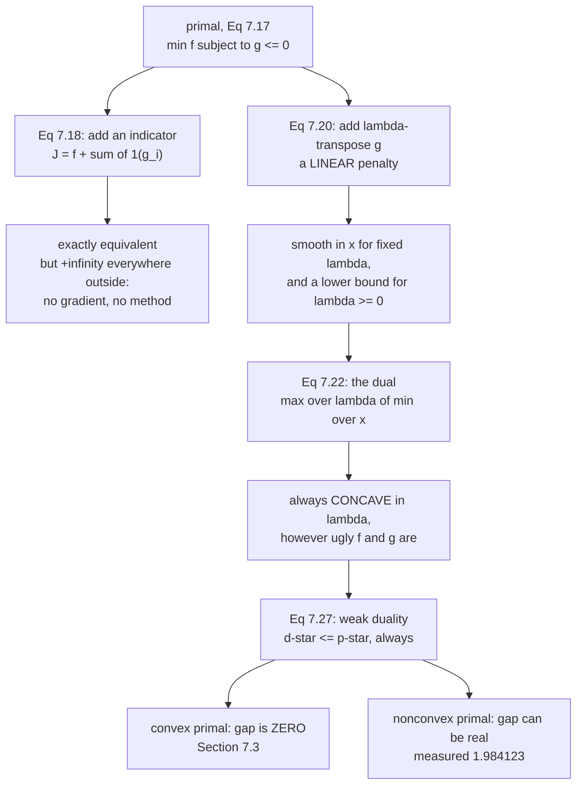

import DataCampExercise from "../../../../components/DataCampExercise.astro";
import Figure from "../../../../components/Figure.astro";
import Quiz from "../../../../components/Quiz.astro";

Everything so far assumed the answer could be anywhere. It usually cannot. A probability must stay in
$[0,1]$, a portfolio's weights must sum to one, an SVM's margin variables must stay non-negative
(Chapter 12). So:

$$
\min_{\mathbf{x}} f(\mathbf{x})
\qquad\text{subject to}\qquad
g_i(\mathbf{x}) \leq 0 \quad\text{for all } i = 1, \dots, m
$$

The trouble is that gradient descent has no idea what a constraint is. This page is the standard way
to teach it one, and the move is smaller than it looks: **replace an infinite wall with a slope.**

## What you'll learn

- Equations 7.18 and 7.19: the indicator-function reformulation, which is exactly correct and completely unoptimisable — measured, its gradient is undefined everywhere outside the feasible set.
- Equation 7.20, the **Lagrangian**, and why a linear penalty is the right relaxation.
- Definition 7.1: the **primal** problem, the **dual** problem, and $D(\boldsymbol\lambda) = \min_{\mathbf{x}} L(\mathbf{x}, \boldsymbol\lambda)$.
- The **minimax inequality** (Equation 7.23) with a worked case where the gap is exactly $1/4$, so you can see it is an inequality rather than an identity.
- **Weak duality** (Equation 7.27), and why the dual is always concave even when the primal is a mess.
- Measured on the book's Example 7.6: $\lambda^\star = 2.5$, duality gap **exactly zero**, and complementary slackness holding to machine precision.
- Measured on a nonconvex problem: a duality gap of **1.984123**, with the dual's optimum attained at $x = -2$, a point the primal forbids.
- Equation 7.28: how equality constraints fold in, and why their multipliers come out **unconstrained**.

## Intuition: a wall you can feel, or a wall you cannot

You are minimising altitude, and there is a fence.

**The naive fix** is to declare the far side of the fence infinitely high. That is honest — you will
never end up there — but it is useless to a hiker in fog. Step over the fence and everything reads
"infinitely high", in every direction. Nothing tells you which way to go back.

**The Lagrangian fix** is to charge rent instead. Crossing the fence by one metre costs $\lambda$
altitude-units. Now the far side is still discouraging, but it has a **slope**, and a slope is the one
thing a gradient method can use. Better still, you get to pick $\lambda$: too small and the optimum
sits outside the fence, too large and it hugs the fence unnecessarily. Somewhere in between is a price
at which the unconstrained optimum of the rented landscape lands exactly on the fence — and that price
is $\lambda^\star$.



## The math

### First attempt: an indicator function

Turn the constraint into a penalty that is free when satisfied and unbearable when not:

$$
J(\mathbf{x}) = f(\mathbf{x}) + \sum_{i=1}^{m}\mathbf{1}\big(g_i(\mathbf{x})\big),
\qquad
\mathbf{1}(z) = \begin{cases} 0 & \text{if } z \leq 0\\ \infty & \text{otherwise}\end{cases}
$$

Minimising $J$ over all of $\mathbb{R}^D$ gives exactly the constrained answer, because any infeasible
point scores $+\infty$. So this reformulation is **correct**. It is also, in the book's words, "equally
difficult to optimize", and it is worth being precise about why: the penalty is not merely steep, it is
*flat at infinity*. Every infeasible point looks identical to every other one, so a gradient computed
out there is undefined and carries no information about the direction of the feasible set. There is
nothing to descend.

### Second attempt: charge linearly

Introduce **Lagrange multipliers** $\lambda_i \geq 0$, one per inequality, and replace the step function
with a linear function:

$$
L(\mathbf{x}, \boldsymbol\lambda) = f(\mathbf{x}) + \sum_{i=1}^{m}\lambda_i g_i(\mathbf{x}) = f(\mathbf{x}) + \boldsymbol\lambda^\top\mathbf{g}(\mathbf{x})
$$

stacking the constraints into $\mathbf{g}(\mathbf{x})$ and the multipliers into
$\boldsymbol\lambda \in \mathbb{R}^m$.

Two properties, and everything else on this page follows from them:

- **For $\boldsymbol\lambda \geq 0$ and $\mathbf{x}$ feasible, $L(\mathbf{x}, \boldsymbol\lambda) \leq f(\mathbf{x})$.** Each $g_i(\mathbf{x}) \leq 0$ and each $\lambda_i \geq 0$, so every term in the sum is non-positive. The Lagrangian **under-estimates** the objective on the feasible set.
- **Taking the maximum over $\boldsymbol\lambda$ recovers the indicator exactly.**
  $$
  J(\mathbf{x}) = \max_{\boldsymbol\lambda \geq 0} L(\mathbf{x}, \boldsymbol\lambda)
  $$
  If $\mathbf{x}$ is feasible, the best you can do is set $\boldsymbol\lambda = \mathbf{0}$ and get $f(\mathbf{x})$. If some $g_i(\mathbf{x}) > 0$, push that $\lambda_i \to \infty$ and the supremum is $+\infty$. The infinite step function has been **reconstructed as a maximum of linear functions**, which is the actual trick.

So the original problem is

$$
\min_{\mathbf{x}\in\mathbb{R}^d} \max_{\boldsymbol\lambda \geq 0} L(\mathbf{x}, \boldsymbol\lambda)
$$

### Definition 7.1: primal and dual

The **primal problem** is the one we started with, in the variables $\mathbf{x}$. Its **Lagrangian dual
problem** is

$$
\max_{\boldsymbol\lambda\in\mathbb{R}^m} D(\boldsymbol\lambda)
\qquad\text{subject to}\qquad
\boldsymbol\lambda \geq 0,
\qquad\text{where } D(\boldsymbol\lambda) = \min_{\mathbf{x}\in\mathbb{R}^d} L(\mathbf{x}, \boldsymbol\lambda)
$$

Duality in general means converting a problem in one set of variables into a problem in another. Note
what has been traded: the primal has $d$ variables and $m$ constraints; the dual has $m$ variables and
the single requirement $\boldsymbol\lambda \geq 0$. If $m \ll d$ that is a bargain, and §7.3.1 makes
the choice explicit for linear programs.

### The minimax inequality

For **any** function of two arguments,

$$
\max_{\mathbf{y}} \min_{\mathbf{x}} \phi(\mathbf{x}, \mathbf{y}) \;\leq\; \min_{\mathbf{x}} \max_{\mathbf{y}} \phi(\mathbf{x}, \mathbf{y})
$$

*Maximin is at most minimax.* The proof is two lines. Start from the observation that for all
$\mathbf{x}, \mathbf{y}$,

$$
\min_{\mathbf{x}} \phi(\mathbf{x}, \mathbf{y}) \;\leq\; \max_{\mathbf{y}} \phi(\mathbf{x}, \mathbf{y})
$$

The left side does not depend on $\mathbf{x}$ and the right side does not depend on $\mathbf{y}$, so
take the maximum over $\mathbf{y}$ on the left — legitimate, since the inequality holds for every
$\mathbf{y}$ — and the minimum over $\mathbf{x}$ on the right. The inequality survives both, giving the
result.

The intuition worth keeping: **the player who moves second has the advantage.** On the minimax side
$\mathbf{y}$ sees $\mathbf{x}$ before choosing; on the maximin side $\mathbf{x}$ sees $\mathbf{y}$.
Whoever reacts does at least as well.

### Weak duality

Apply that to the Lagrangian:

$$
\min_{\mathbf{x}\in\mathbb{R}^d} \max_{\boldsymbol\lambda \geq 0} L(\mathbf{x}, \boldsymbol\lambda) \;\geq\; \max_{\boldsymbol\lambda \geq 0} \min_{\mathbf{x}\in\mathbb{R}^d} L(\mathbf{x}, \boldsymbol\lambda)
$$

The left side is the primal optimum $p^\star$; the right side is the dual optimum $d^\star$. So
$d^\star \leq p^\star$, **always** — that is weak duality, and it means any dual feasible
$\boldsymbol\lambda$ hands you a certified lower bound on the primal answer, for free.

:::tip[The dual is concave even when the primal is horrible]
$D(\boldsymbol\lambda) = \min_{\mathbf{x}} L(\mathbf{x}, \boldsymbol\lambda)$ is, for each fixed
$\mathbf{x}$, an **affine** function of $\boldsymbol\lambda$. A pointwise minimum of affine functions is
concave. So $D$ is concave no matter how nonconvex $f$ and the $g_i$ are — and maximising a concave
function is easy. The book makes exactly this point: "the outer problem is a maximum over a set of
affine functions, and hence is a concave function, even though $f(\cdot)$ and $g_i(\cdot)$ may be
nonconvex."

That is the real payoff of duality. You can always get a tractable lower bound. Whether it is *tight*
is a separate question, answered in §7.3.
:::

### Equality constraints

$$
\min_{\mathbf{x}} f(\mathbf{x})
\quad\text{s.t.}\quad
g_i(\mathbf{x}) \leq 0 \;\; \forall i,
\qquad
h_j(\mathbf{x}) = 0 \;\; \forall j
$$

Each equality $h_j(\mathbf{x}) = 0$ splits into the pair $h_j(\mathbf{x}) \leq 0$ and
$-h_j(\mathbf{x}) \leq 0$. Both get non-negative multipliers, say $\lambda_j^{+}$ and $\lambda_j^{-}$,
and their contribution is $\lambda_j^{+}h_j - \lambda_j^{-}h_j = (\lambda_j^{+} - \lambda_j^{-})h_j$.
The difference of two non-negative numbers is an arbitrary real number, so:

**Inequality multipliers are constrained to be non-negative; equality multipliers are unconstrained.**
That asymmetry is not a convention, it is a consequence — and it is a fast way to check that you have
written a Lagrangian correctly.

## Worked example by hand

The book's Example 7.6, which is also its Figure 7.4:

$$
\min_{\mathbf{x}\in\mathbb{R}^2} \frac{1}{2}\begin{bmatrix}x_1\\x_2\end{bmatrix}^\top\begin{bmatrix}2&1\\1&4\end{bmatrix}\begin{bmatrix}x_1\\x_2\end{bmatrix} + \begin{bmatrix}5\\3\end{bmatrix}^\top\begin{bmatrix}x_1\\x_2\end{bmatrix}
$$

subject to $-1 \leq x_1 \leq 1$ and $-1 \leq x_2 \leq 1$, written in the standard form
$\mathbf{A}\mathbf{x} \leq \mathbf{b}$ with

$$
\mathbf{A} = \begin{bmatrix}1&0\\-1&0\\0&1\\0&-1\end{bmatrix},
\qquad
\mathbf{b} = \begin{bmatrix}1\\1\\1\\1\end{bmatrix}
$$

**Step 1: ignore the constraints.** With $f = \tfrac12\mathbf{x}^\top\mathbf{Q}\mathbf{x} + \mathbf{c}^\top\mathbf{x}$
the gradient is $\mathbf{Q}\mathbf{x} + \mathbf{c}$, zero at $\mathbf{x} = -\mathbf{Q}^{-1}\mathbf{c}$.
Since $\det\mathbf{Q} = 8 - 1 = 7$,

$$
\mathbf{x}_{\text{unc}} = -\frac{1}{7}\begin{bmatrix}4&-1\\-1&2\end{bmatrix}\begin{bmatrix}5\\3\end{bmatrix} = -\frac{1}{7}\begin{bmatrix}17\\1\end{bmatrix} = \begin{bmatrix}-2.428571\\-0.142857\end{bmatrix}
$$

with $f = -6.285714$. **This point is infeasible**: $x_1 = -2.43$ violates $x_1 \geq -1$ by
$1.428571$.

**Step 2: the constraint must bind.** Since the objective is a strictly convex bowl and its centre lies
outside the box, the constrained optimum sits on the boundary — on the face nearest the centre, which
is $x_1 = -1$. Substituting:

$$
f(-1, x_2) = \tfrac12\big(2 - 2x_2 + 4x_2^2\big) - 5 + 3x_2 = 2x_2^2 + 2x_2 - 4
$$

A one-variable quadratic. Its derivative $4x_2 + 2$ vanishes at $x_2 = -\tfrac12$, comfortably inside
$[-1,1]$, giving

$$
\mathbf{x}^\star = \begin{bmatrix}-1\\-1/2\end{bmatrix},
\qquad
f(\mathbf{x}^\star) = 2\cdot\tfrac14 - 1 - 4 = -4.5
$$

So the constraint costs $-4.5 - (-6.285714) = 1.785714$ in objective value.

**Step 3: read off the multipliers.** At a constrained optimum the stationarity condition is
$\mathbf{Q}\mathbf{x}^\star + \mathbf{c} + \mathbf{A}^\top\boldsymbol\lambda^\star = \mathbf{0}$.

$$
\mathbf{Q}\mathbf{x}^\star + \mathbf{c} = \begin{bmatrix}2(-1) + 1(-\tfrac12)\\1(-1) + 4(-\tfrac12)\end{bmatrix} + \begin{bmatrix}5\\3\end{bmatrix} = \begin{bmatrix}-2.5\\-3\end{bmatrix} + \begin{bmatrix}5\\3\end{bmatrix} = \begin{bmatrix}2.5\\0\end{bmatrix}
$$

Only the second row of $\mathbf{A}$ (the constraint $-x_1 \leq 1$) is active, and
$\mathbf{A}^\top\boldsymbol\lambda = \lambda_2\begin{bmatrix}-1\\0\end{bmatrix}$. So we need
$2.5 - \lambda_2 = 0$:

$$
\boldsymbol\lambda^\star = \begin{bmatrix}0\\2.5\\0\\0\end{bmatrix}
$$

Notice that the second component of $\mathbf{Q}\mathbf{x}^\star + \mathbf{c}$ came out **exactly zero**.
That is not luck: $x_2$ is interior, so no constraint pushes on it, so $f$ must already be flat in that
direction. Constrained optimality is "flat where you are free, pushed where you are pinned".

**Step 4: complementary slackness.** For each $i$, either $g_i(\mathbf{x}^\star) = 0$ or
$\lambda_i^\star = 0$:

| $i$ | constraint | $g_i(\mathbf{x}^\star)$ | $\lambda_i^\star$ | product | status |
| --- | --- | --- | --- | --- | --- |
| 1 | $x_1 \leq 1$ | $-2$ | $0$ | $0$ | slack |
| 2 | $-x_1 \leq 1$ | $\mathbf{0}$ | $\mathbf{2.5}$ | $0$ | **active** |
| 3 | $x_2 \leq 1$ | $-1.5$ | $0$ | $0$ | slack |
| 4 | $-x_2 \leq 1$ | $-0.5$ | $0$ | $0$ | slack |

A multiplier is the **price** of a constraint. A constraint that is not binding is free.

:::caution[A note on the book's Figure 7.4 caption]
The caption states that the unconstrained problem "has a minimum on the right side". Computing Equation
7.46 exactly as printed — with $+\mathbf{c}^\top\mathbf{x}$ and $\mathbf{c} = [5,3]^\top$ — puts the
unconstrained minimum at $(-17/7, -1/7) \approx (-2.43, -0.14)$, which is on the **left**. The phrasing
matches Figure 7.9's caption, where for the linear program of Equation 7.44 the objective is
$-[5,3]^\top\mathbf{x}$ and the minimum genuinely is up and to the right. Nothing downstream depends on
this, and the mathematics of Example 7.6 is unaffected — but if you are reading the two figures side by
side, the sign is worth checking yourself.
:::

## See it move

The single most useful thing to feel here is $\lambda$ as a **price**. Drag it and watch the
unconstrained minimiser of the Lagrangian walk toward the boundary; the price at which it arrives is
$\lambda^\star$.

```p5 title="A Lagrange multiplier is a price, and lambda-star is the market rate" desc="The objective is Example 7.6 sliced at x2 = -0.5, so the picture is one-dimensional and honest. Drag lambda and watch two things: the Lagrangian tilting, and its minimiser sliding toward the constraint boundary. Below, D(lambda) is traced out, and its peak is the primal optimum." height="500"
let lam100 = 0;
let KNOBS = [], dragging = null;

const BOUND = -1.0;          // the constraint x1 >= -1
const XS = -1.0, PSTAR = -4.5;

function setup() { createCanvas(680, 500); textFont("monospace"); }

function knob(id, x, y, w, value, mn, mx, label) {
  KNOBS.push({ id, x, y, w, mn, mx });
  const t = (value - mn) / (mx - mn);
  stroke(60, 74, 92); strokeWeight(2); line(x, y, x + w, y);
  noStroke(); fill(255, 211, 67); ellipse(x + t * w, y, 12, 12);
  fill(190, 200, 212); textSize(12); textAlign(LEFT, CENTER);
  text(label, x + w + 12, y);
}
function knobHit(mx_, my_) {
  for (const k of KNOBS) {
    if (my_ > k.y - 13 && my_ < k.y + 13 && mx_ > k.x - 13 && mx_ < k.x + k.w + 13) return k;
  }
  return null;
}
function knobValue(k, mx_) {
  const t = Math.min(1, Math.max(0, (mx_ - k.x) / k.w));
  return Math.round(k.mn + t * (k.mx - k.mn));
}
function mousePressed() { dragging = knobHit(mouseX, mouseY); }
function mouseReleased() { dragging = null; }
function mouseDragged() {
  if (!dragging) return;
  lam100 = knobValue(dragging, mouseX);
  if (!isLooping()) redraw();
}

// f sliced at x2 = -0.5:  x^2 + x*(-0.5) + 2*0.25 + 5x + 3*(-0.5)
function fslice(x) { return x * x - 0.5 * x + 0.5 + 5 * x - 1.5; }
// g(x) = -x - 1 <= 0  is the constraint x >= -1
function gslice(x) { return -x - 1; }
function Lval(x, lam) { return fslice(x) + lam * gslice(x); }

// argmin of a quadratic in closed form: L = x^2 + (4.5 - lam)x + (-1 - lam)
function argminL(lam) { return -(4.5 - lam) / 2; }
function Dval(lam) { const xm = argminL(lam); return Lval(xm, lam); }

const OX = 52, OY = 44, W = 380, H = 200;
const XLO = -3.2, XHI = 1.4, YLO = -13, YHI = 14;
function px(x) { return OX + ((x - XLO) / (XHI - XLO)) * W; }
function py(y) { return OY + H - ((y - YLO) / (YHI - YLO)) * H; }

const DX = 52, DY = 300, DW = 380, DH = 120;
const LLO = 0, LHI = 6, DLO = -13, DHI = -3.5;
function dpx(l) { return DX + ((l - LLO) / (LHI - LLO)) * DW; }
function dpy(v) { return DY + DH - ((v - DLO) / (DHI - DLO)) * DH; }

function draw() {
  background(13, 17, 23);
  KNOBS = [];
  const lam = lam100 / 100;

  // infeasible shading
  noStroke(); fill(232, 110, 110, 22);
  rect(px(XLO), OY, px(BOUND) - px(XLO), H);

  // axes
  stroke(64, 78, 94); strokeWeight(1.2);
  line(OX, py(0), OX + W, py(0));
  stroke(232, 110, 110); strokeWeight(1.8);
  line(px(BOUND), OY, px(BOUND), OY + H);

  // f, dashed
  stroke(120, 132, 148); strokeWeight(1.4); noFill();
  beginShape();
  for (let i = 0; i <= 200; i++) {
    const x = XLO + (i / 200) * (XHI - XLO);
    const v = fslice(x);
    if (v > YLO && v < YHI) vertex(px(x), py(v));
  }
  endShape();

  // L(x, lambda)
  stroke(120, 200, 140); strokeWeight(2.4); noFill();
  beginShape();
  for (let i = 0; i <= 200; i++) {
    const x = XLO + (i / 200) * (XHI - XLO);
    const v = Lval(x, lam);
    if (v > YLO && v < YHI) vertex(px(x), py(v));
  }
  endShape();

  const xm = argminL(lam);
  noStroke(); fill(255, 211, 67);
  if (xm > XLO && xm < XHI) ellipse(px(xm), py(Lval(xm, lam)), 11, 11);

  // the true constrained optimum
  fill(107, 169, 221); ellipse(px(XS), py(PSTAR), 9, 9);

  noStroke(); textAlign(LEFT, TOP);
  fill(150); textSize(11);
  text("f(x), unpenalised", 452, 52);
  fill(120, 200, 140); textSize(12);
  text("L(x, lambda) = f + lambda*g", 452, 70);
  fill(255, 211, 67);
  text("argmin of L", 452, 90);
  fill(107, 169, 221);
  text("the true optimum", 452, 108);
  fill(232, 110, 110); textSize(11);
  text("x < -1 is infeasible", 452, 130);

  fill(255, 211, 67); textSize(16);
  text("lambda = " + lam.toFixed(2), 452, 158);
  fill(210); textSize(12);
  text("argmin L  = " + xm.toFixed(4), 452, 182);
  text("D(lambda) = " + Dval(lam).toFixed(4), 452, 200);
  fill(150); textSize(11);
  text("p* = " + PSTAR.toFixed(4), 452, 220);
  text("gap = " + (PSTAR - Dval(lam)).toFixed(4), 452, 236);

  // the dual curve
  stroke(70, 86, 104); strokeWeight(1); noFill();
  rect(DX, DY, DW, DH);
  stroke(120, 200, 140); strokeWeight(2.2); noFill();
  beginShape();
  for (let i = 0; i <= 240; i++) {
    const l = LLO + (i / 240) * (LHI - LLO);
    vertex(dpx(l), dpy(Dval(l)));
  }
  endShape();
  stroke(107, 169, 221); strokeWeight(1.6);
  line(DX, dpy(PSTAR), DX + DW, dpy(PSTAR));
  noStroke(); fill(255, 211, 67);
  ellipse(dpx(lam), dpy(Dval(lam)), 10, 10);
  fill(150); textSize(11); textAlign(LEFT, TOP);
  text("D(lambda), concave. Blue line is p*.", DX, DY + DH + 6);
  text("Peak touches it at lambda* = 2.50.", DX, DY + DH + 20);
  fill(120); textAlign(RIGHT, TOP);
  text("lambda = 6", DX + DW, DY + DH + 6);

  // verdict
  let msg, sub, col;
  if (lam < 0.02) {
    col = color(232, 110, 110);
    msg = "price zero: the constraint is ignored";
    sub = "L is just f, and its minimiser sits outside the feasible region.";
  } else if (Math.abs(lam - 2.5) < 0.06) {
    col = color(120, 200, 140);
    msg = "lambda* = 2.50, the market rate";
    sub = "the minimiser of L has landed exactly on the boundary, and D(lambda) = p*.";
  } else if (xm < BOUND) {
    col = color(255, 211, 67);
    msg = "price too low";
    sub = "argmin L = " + xm.toFixed(3) + ", still infeasible. Raise lambda.";
  } else {
    col = color(197, 153, 255);
    msg = "price too high";
    sub = "argmin L = " + xm.toFixed(3) + ", pushed strictly inside. D has fallen below p*.";
  }
  stroke(col); strokeWeight(1.6); fill(red(col), green(col), blue(col), 26);
  rect(52, 404, 576, 58, 6);
  noStroke(); fill(col); textSize(16); textAlign(LEFT, TOP);
  text(msg, 68, 412);
  fill(215); textSize(11);
  text(sub, 68, 436);

  knob("l", 68, 484, 300, lam100, 0, 600, "lambda = " + lam.toFixed(2));
  const lx = 68 + (250 / 600) * 300;
  stroke(120, 200, 140); strokeWeight(2); line(lx, 474, lx, 494);
  noStroke(); fill(120, 200, 140); textSize(10); textAlign(CENTER, TOP);
  text("2.5", lx, 496);
}
```

A second sketch, for the fact that surprises people: the dual of a **nonconvex** problem is still
concave and still gives a bound, but the bound need not be tight.

```p5 title="Where the duality gap comes from" desc="A nonconvex objective with one constraint. Drag lambda and watch the Lagrangian's minimiser jump between two wells rather than sliding. The dual can only ever see the lower envelope, so it never reports the primal answer — the shortfall is the duality gap." height="470"
let lam100 = 100;
let KNOBS = [], dragging = null;

const PSTAR = -14.015877, XP = 1.968, DSTAR = -16.0, LSTAR = 1.0;

function setup() { createCanvas(680, 470); textFont("monospace"); }

function knob(id, x, y, w, value, mn, mx, label) {
  KNOBS.push({ id, x, y, w, mn, mx });
  const t = (value - mn) / (mx - mn);
  stroke(60, 74, 92); strokeWeight(2); line(x, y, x + w, y);
  noStroke(); fill(255, 211, 67); ellipse(x + t * w, y, 12, 12);
  fill(190, 200, 212); textSize(12); textAlign(LEFT, CENTER);
  text(label, x + w + 12, y);
}
function knobHit(mx_, my_) {
  for (const k of KNOBS) {
    if (my_ > k.y - 13 && my_ < k.y + 13 && mx_ > k.x - 13 && mx_ < k.x + k.w + 13) return k;
  }
  return null;
}
function knobValue(k, mx_) {
  const t = Math.min(1, Math.max(0, (mx_ - k.x) / k.w));
  return Math.round(k.mn + t * (k.mx - k.mn));
}
function mousePressed() { dragging = knobHit(mouseX, mouseY); }
function mouseReleased() { dragging = null; }
function mouseDragged() {
  if (!dragging) return;
  lam100 = knobValue(dragging, mouseX);
  if (!isLooping()) redraw();
}

function fv(x) { return x * x * x * x - 8 * x * x + x; }
function gv(x) { return -x; }                 // the constraint x >= 0
function Lv(x, lam) { return fv(x) + lam * gv(x); }

function argminL(lam) {
  let bx = -3.2, bv = Infinity;
  for (let i = 0; i <= 3200; i++) {
    const x = -3.2 + (i / 3200) * 6.4;
    const v = Lv(x, lam);
    if (v < bv) { bv = v; bx = x; }
  }
  return { x: bx, v: bv };
}

const OX = 52, OY = 44, W = 380, H = 250;
const XLO = -3.2, XHI = 3.2, YLO = -22, YHI = 20;
function px(x) { return OX + ((x - XLO) / (XHI - XLO)) * W; }
function py(y) { return OY + H - ((y - YLO) / (YHI - YLO)) * H; }

function draw() {
  background(13, 17, 23);
  KNOBS = [];
  const lam = lam100 / 100;

  noStroke(); fill(232, 110, 110, 22);
  rect(px(XLO), OY, px(0) - px(XLO), H);
  stroke(64, 78, 94); strokeWeight(1.2); line(OX, py(0), OX + W, py(0));
  stroke(232, 110, 110); strokeWeight(1.8); line(px(0), OY, px(0), OY + H);

  stroke(120, 132, 148); strokeWeight(1.4); noFill();
  beginShape();
  for (let i = 0; i <= 320; i++) {
    const x = XLO + (i / 320) * (XHI - XLO);
    const v = fv(x);
    if (v > YLO && v < YHI) vertex(px(x), py(v));
  }
  endShape();

  stroke(120, 200, 140); strokeWeight(2.4); noFill();
  beginShape();
  for (let i = 0; i <= 320; i++) {
    const x = XLO + (i / 320) * (XHI - XLO);
    const v = Lv(x, lam);
    if (v > YLO && v < YHI) vertex(px(x), py(v));
  }
  endShape();

  const m = argminL(lam);
  noStroke();
  fill(m.x >= 0 ? color(120, 200, 140) : color(232, 110, 110));
  ellipse(px(m.x), py(m.v), 11, 11);
  fill(107, 169, 221); ellipse(px(XP), py(PSTAR), 10, 10);

  textAlign(LEFT, TOP); noStroke();
  fill(150); textSize(11); text("f(x) = x^4 - 8x^2 + x", 452, 52);
  fill(120, 200, 140); textSize(12); text("L(x, lambda)", 452, 70);
  fill(107, 169, 221); text("p* (feasible)", 452, 90);
  fill(232, 110, 110); textSize(11); text("x < 0 infeasible", 452, 112);

  fill(255, 211, 67); textSize(16); text("lambda = " + lam.toFixed(2), 452, 142);
  fill(210); textSize(12);
  text("argmin L = " + m.x.toFixed(3), 452, 166);
  text("D(lambda) = " + m.v.toFixed(4), 452, 184);
  fill(m.x >= 0 ? color(120, 200, 140) : color(232, 110, 110)); textSize(11);
  text(m.x >= 0 ? "that x IS feasible" : "that x is INFEASIBLE", 452, 204);
  fill(150); textSize(11);
  text("p*   = " + PSTAR.toFixed(4), 452, 226);
  text("d*   = " + DSTAR.toFixed(4), 452, 242);
  text("gap  = " + (PSTAR - DSTAR).toFixed(6), 452, 258);

  let msg, sub, col;
  if (Math.abs(lam - LSTAR) < 0.04) {
    col = color(197, 153, 255);
    msg = "lambda* = 1.00, the best the dual can do";
    sub = "the linear term cancels exactly, both wells tie at -16, and the dual picks x = -2.";
  } else if (m.x < 0) {
    col = color(232, 110, 110);
    msg = "the dual's minimiser is infeasible";
    sub = "no price makes the left well disappear; raising lambda only tilts it.";
  } else {
    col = color(255, 211, 67);
    msg = "the minimiser has jumped to the right well";
    sub = "note it JUMPED rather than slid: that discontinuity is the nonconvexity.";
  }
  stroke(col); strokeWeight(1.6); fill(red(col), green(col), blue(col), 26);
  rect(52, 322, 576, 62, 6);
  noStroke(); fill(col); textSize(16); textAlign(LEFT, TOP); text(msg, 68, 330);
  fill(215); textSize(11); text(sub, 68, 356);

  knob("l", 68, 412, 300, lam100, 0, 400, "lambda = " + lam.toFixed(2));
  const lx = 68 + (100 / 400) * 300;
  stroke(197, 153, 255); strokeWeight(2); line(lx, 402, lx, 422);
  noStroke(); fill(197, 153, 255); textSize(10); textAlign(CENTER, TOP);
  text("1.0", lx, 424);
  fill(120); textSize(11); textAlign(LEFT, TOP);
  text("Sweep lambda across the whole range: D never reaches p*. The shortfall is 1.984123.", 68, 446);
}
```

## From scratch

```python title="lagrange.py" showLineNumbers{1}
import numpy as np

# The book's Example 7.6, which is also its Figure 7.4.
Q = np.array([[2.0, 1.0], [1.0, 4.0]])
c = np.array([5.0, 3.0])
A = np.array([[1.0, 0.0], [-1.0, 0.0], [0.0, 1.0], [0.0, -1.0]])
b = np.ones(4)                      # the box -1 <= x_i <= 1

def f(x):
    return 0.5 * x @ Q @ x + c @ x

def g(x):
    return A @ x - b                # feasible means every entry <= 0

# --- Equation 7.18: correct, and impossible to descend ---------------------
def J(x):
    return f(x) if np.all(g(x) <= 0) else np.inf

x_unc = np.linalg.solve(Q, -c)
print(f"unconstrained minimiser (-17/7, -1/7) = "
      f"[{x_unc[0]:.6f}, {x_unc[1]:.6f}]   f = {f(x_unc):.6f}")
print(f"feasible? {np.all(g(x_unc) <= 0)}   worst violation "
      f"{g(x_unc).max():+.6f}")
print(f"J at that point = {J(x_unc)}")

h = 1e-6
for probe in (np.array([-1.5, -0.5]), np.array([-3.0, -0.5])):
    fd = []
    for d in range(2):
        e = np.zeros(2); e[d] = h
        num = J(probe + e) - J(probe - e)
        fd.append("undefined" if not np.isfinite(num) else f"{num / (2*h):+.4f}")
    print(f"  finite-difference grad of J at {probe.tolist()}: ({fd[0]}, {fd[1]})")
print("  -> outside the box every direction looks identical. No slope to follow.")

# --- Equation 7.20: the Lagrangian ---------------------------------------
def L(x, lam):
    return f(x) + lam @ g(x)

def D(lam):
    """min over x of L. For a positive definite Q this is closed form."""
    v = c + A.T @ lam
    xs = np.linalg.solve(Q, -v)
    return 0.5 * xs @ Q @ xs + v @ xs - lam @ b, xs

x_con = np.array([-1.0, -0.5])      # solved by hand on the x1 = -1 edge
print(f"\nconstrained optimum [{x_con[0]}, {x_con[1]}]   f = {f(x_con):.6f}")
print(f"the constraint costs {f(x_con) - f(x_unc):.6f}")

print("\nfor lambda >= 0 the Lagrangian is a LOWER BOUND at any feasible x:")
for lam in (np.zeros(4), np.array([0.0, 1.0, 0.0, 0.0]), np.full(4, 0.5)):
    print(f"  lambda = {lam.tolist()}   L = {L(x_con, lam):+.6f}   "
          f"<= f = {f(x_con):+.6f}: {L(x_con, lam) <= f(x_con) + 1e-12}")

# --- the dual, maximised over the one coordinate that matters ------------
ts = np.linspace(0.0, 6.0, 60001)
dv = np.array([D(np.array([0.0, t, 0.0, 0.0]))[0] for t in ts])
k = int(np.argmax(dv))
lam_star = np.array([0.0, ts[k], 0.0, 0.0])
dstar, x_from_dual = D(lam_star)
print(f"\nlambda* = {np.round(lam_star, 6).tolist()}")
print(f"d* = {dstar:.9f}    p* = {f(x_con):.9f}    gap = {f(x_con) - dstar:.3e}")
print(f"x recovered from the dual = "
      f"[{x_from_dual[0]:.6f}, {x_from_dual[1]:.6f}]")

print("\ncomplementary slackness:")
for i, (l, gi) in enumerate(zip(lam_star, g(x_con))):
    print(f"  i={i}  lambda={l:8.5f}  g={gi:+8.5f}  product={l * gi:+.1e}   "
          f"{'ACTIVE' if abs(gi) < 1e-9 else 'slack'}")
print("stationarity ||Qx + c + A^T lambda|| =",
      f"{np.linalg.norm(Q @ x_con + c + A.T @ lam_star):.2e}")

# --- weak duality only, on a nonconvex primal ---------------------------
print("\n--- a nonconvex primal keeps a real gap -------------------------")
xs = np.linspace(-4.0, 4.0, 40001)
fn = xs ** 4 - 8.0 * xs ** 2 + xs
gn = -xs                             # the constraint x >= 0
p_star = fn[gn <= 0].min()
x_p = xs[gn <= 0][int(np.argmin(fn[gn <= 0]))]
lams = np.linspace(0.0, 6.0, 1201)
dn = np.array([(fn + t * gn).min() for t in lams])
kb = int(np.argmax(dn))
x_d = xs[int(np.argmin(fn + lams[kb] * gn))]
print(f"min x^4 - 8x^2 + x  subject to  x >= 0")
print(f"  p* = {p_star:.6f} at x = {x_p:.6f}")
print(f"  d* = {dn[kb]:.6f} at lambda = {lams[kb]:.4f}, attained at x = {x_d:.4f}")
print(f"  that x is feasible: {x_d >= 0}")
print(f"  duality GAP = {p_star - dn[kb]:.6f}")
```

```
unconstrained minimiser (-17/7, -1/7) = [-2.428571, -0.142857]   f = -6.285714
feasible? False   worst violation +1.428571
J at that point = inf
  finite-difference grad of J at [-1.5, -0.5]: (undefined, undefined)
  finite-difference grad of J at [-3.0, -0.5]: (undefined, undefined)
  -> outside the box every direction looks identical. No slope to follow.

constrained optimum [-1.0, -0.5]   f = -4.500000
the constraint costs 1.785714

for lambda >= 0 the Lagrangian is a LOWER BOUND at any feasible x:
  lambda = [0.0, 0.0, 0.0, 0.0]   L = -4.500000   <= f = -4.500000: True
  lambda = [0.0, 1.0, 0.0, 0.0]   L = -4.500000   <= f = -4.500000: True
  lambda = [0.5, 0.5, 0.5, 0.5]   L = -6.500000   <= f = -4.500000: True

lambda* = [0.0, 2.5, 0.0, 0.0]
d* = -4.500000000    p* = -4.500000000    gap = 0.000e+00
x recovered from the dual = [-1.000000, -0.500000]

complementary slackness:
  i=0  lambda= 0.00000  g=-2.00000  product=-0.0e+00   slack
  i=1  lambda= 2.50000  g=+0.00000  product=+0.0e+00   ACTIVE
  i=2  lambda= 0.00000  g=-1.50000  product=-0.0e+00   slack
  i=3  lambda= 0.00000  g=-0.50000  product=-0.0e+00   slack
stationarity ||Qx + c + A^T lambda|| = 0.00e+00

--- a nonconvex primal keeps a real gap -------------------------
min x^4 - 8x^2 + x  subject to  x >= 0
  p* = -14.015877 at x = 1.968000
  d* = -16.000000 at lambda = 1.0000, attained at x = -2.0000
  that x is feasible: False
  duality GAP = 1.984123
```

## On real data

<Figure
  src="/images/mml/constrained-optimization-and-lagrange-multipliers/the-wall-and-the-slope"
  alt="Three panels. Left, a one-dimensional slice showing f as a dashed curve and J as a solid curve that jumps vertically to infinity at the constraint boundary, with the infeasible region shaded and labelled as having no usable gradient. Middle, the Lagrangian for four values of lambda, each a smooth curve whose minimiser sits further right as lambda grows. Right, the dual function D of lambda, concave, peaking exactly on the dashed line marking the primal optimum."
  title="Replace an infinite step with a linear penalty"
  caption="The indicator reformulation is exactly correct and has no gradient to follow outside the feasible set. The Lagrangian is smooth for every lambda, and its minimiser reaches the boundary at exactly lambda star = 2.5, where D of lambda touches the primal optimum."
/>

<Figure
  src="/images/mml/constrained-optimization-and-lagrange-multipliers/example-7-6-box-constrained-qp"
  alt="Two panels. Left, elliptical contours of the quadratic with a shaded box from minus one to one, a red circle at the infeasible unconstrained minimiser at minus 2.43 comma minus 0.14, and a green star at the constrained optimum on the left face of the box. Right, a table of the four constraints showing their values, multipliers and products, with only the second constraint active and carrying a multiplier of 2.5."
  title="Example 7.6, computed rather than sketched"
  caption="The unconstrained minimiser violates the box by 1.428571, so the optimum is pinned on the x1 = minus 1 face at minus 1 comma minus one half. Only that constraint gets a nonzero multiplier, and the stationarity residual is exactly zero."
/>

<Figure
  src="/images/mml/constrained-optimization-and-lagrange-multipliers/weak-and-strong-duality"
  alt="Three panels. Left, the inner maximum and inner minimum of the function x minus y squared on the unit square, separated by a shaded band labelled gap equals 0.25. Middle, the dual of the convex quadratic program rising to touch the dashed primal optimum line. Right, a nonconvex quartic with its Lagrangian at the optimal lambda, a blue star at the feasible primal optimum and an amber dot at the dual's minimiser in the forbidden region."
  title="Weak duality always; strong duality only for convex problems"
  caption="Swapping a min and a max costs exactly one quarter in the left example. For the convex quadratic program the dual closes the gap to zero. For the nonconvex quartic it leaves 1.984123 on the table, and its best guess sits at x = minus 2, which the primal forbids."
/>

## Reading the plot

**The first figure is the argument of the whole page in three steps.** The left panel is Equation 7.18
drawn honestly. Inside the feasible region, $J$ *is* $f$ — same curve, same gradient — and note which
way that gradient points: **out through the wall**, toward the unconstrained minimum at $-2.43$. So a
gradient method started anywhere feasible walks straight at the boundary and then leaves. One step past
it, the value is $+\infty$ and the measured finite-difference gradient is `undefined` in both
coordinates. Not large. Not steep. *Undefined*, and identically so at $x_1 = -1.5$ and at $x_1 = -3.0$.
The penalty knows you have broken the rule and cannot tell you how badly.

The middle panel is the repair. Each curve is $L(x,\lambda)$ for a fixed price, and every one of them is
a smooth quadratic — differentiable everywhere, no wall anywhere. Watch the marked minimisers move
right as $\lambda$ grows: at $\lambda = 0$ the minimiser is the unconstrained one, and by
$\lambda = 2.5$ it has arrived exactly at the boundary. The constraint has been converted from a
prohibition into an incentive.

The right panel closes it. $D(\lambda)$ rises, peaks, and falls, and its peak *touches* the dashed line
$p^\star = -4.5$ — the measured gap at the peak is $9\times10^{-8}$, which is my $\lambda$ grid
resolution rather than a real shortfall. This is strong duality, and §7.3 explains why we were entitled
to it: the problem is convex.

**The second figure is where constrained optimality stops resembling unconstrained optimality.** The
red circle is where $\nabla f = \mathbf{0}$, and it is *not* the answer — it lies outside the box by
$1.428571$. The green star is the answer, and at the green star the gradient is emphatically **not**
zero: $\mathbf{Q}\mathbf{x}^\star + \mathbf{c} = [2.5, 0]^\top$. It points straight out through the
left wall with magnitude $2.5$, and the wall pushes back with force $\lambda_2^\star = 2.5$. The
condition is a balance of forces, not a vanishing derivative.

The table earns its place through the second component of that gradient: **exactly $0$**. The variable
$x_2$ is interior — nothing is pinning it — so $f$ must already be flat along it. That is the general
shape of a constrained optimum: *flat in the directions you are free to move, pushed in the directions
you are pinned.* And complementary slackness is the bookkeeping for that: three of four constraints are
slack and carry multiplier zero, one is active and carries $2.5$. A multiplier is a price, and unbinding
constraints are free.

**The third figure is the one to be careful with, because two of its panels look similar and mean
opposite things.** The left panel makes the minimax inequality concrete. With
$\phi(x,y) = (x-y)^2$ on the unit square: for a fixed $x$, the adversary picks the far corner, so
$\max_y \phi = \max(x^2, (1-x)^2)$, minimised at $x = 1/2$ giving $1/4$. Going the other way, for a
fixed $y$ the minimiser just picks $x = y$ and scores $0$, so $\max_y \min_x = 0$. **Gap exactly
$1/4$.** The order of the min and the max is not a formality.

The middle and right panels are the same machinery on two problems, and the difference is convexity.
The convex quadratic program's dual rises to touch $p^\star$ — gap $0.000\text{e}{+}00$, and the
$\mathbf{x}$ recovered from $\boldsymbol\lambda^\star$ is $[-1, -0.5]$, the primal answer exactly. Solve
either problem and you have solved the other.

The right panel is the same procedure on $f(x) = x^4 - 8x^2 + x$ subject to $x \geq 0$, and it fails
instructively. The primal answer is $p^\star = -14.015877$ at $x = 1.968$, in the right-hand well. The
dual's best is $d^\star = -16$ at $\lambda^\star = 1$ — and look where it is attained: $x = -2$, in the
**forbidden** left well. At $\lambda = 1$ the penalty term $\lambda \cdot (-x)$ cancels the objective's
$+x$ term exactly, the two wells become symmetric at depth $-16$, and the minimisation picks the
infeasible one. No price fixes this. Raising $\lambda$ tilts the landscape but cannot delete a well;
the minimiser **jumps** between wells rather than sliding, and it is precisely that discontinuity that
the concave $D$ cannot represent. The gap is $1.984123$, and it is structural: the dual only ever sees
the convex envelope of the problem.

:::tip[From the book]
This page covers **§7.2** of *Mathematics for Machine Learning* by Deisenroth, Faisal and Ong (draft of
2019-12-11). Equation **7.17** is the constrained problem, **7.18** the indicator reformulation and
**7.19** the infinite step function. Equations **7.20a** and **7.20b** define the Lagrangian.
**Definition 7.1** names the primal problem and the Lagrangian dual problem
$\max_{\boldsymbol\lambda} D(\boldsymbol\lambda)$ with
$D(\boldsymbol\lambda) = \min_{\mathbf{x}} L(\mathbf{x},\boldsymbol\lambda)$. Equation **7.23** is the
minimax inequality with its proof at **7.24**; **7.25** is
$J(\mathbf{x}) = \max_{\boldsymbol\lambda \geq 0} L$, **7.26** the min-max form, and **7.27** weak
duality. Equation **7.28** adds equality constraints and the accompanying remark establishes that their
multipliers are unconstrained. **Example 7.6** and **Figure 7.4** are the box-constrained quadratic
program. The Lagrangian treatment follows Boyd and Vandenberghe (2004, chapter 4). The specific
multiplier $\lambda^\star = 2.5$, the complementary-slackness table, the strict minimax gap of $1/4$,
and the nonconvex duality gap of $1.984123$ are this module's additions.
:::

## Pitfalls

:::danger[Reporting an unconstrained optimum without checking feasibility]
Example 7.6's unconstrained minimiser is $(-2.428571, -0.142857)$ with $f = -6.285714$, which beats the
true constrained answer of $-4.5$. It is also outside the box by $1.428571$. An objective value that
looks *better* than the optimum is the signature of this bug, so treat any suspiciously good result as a
feasibility check waiting to happen.
:::

:::danger[Expecting the gradient to vanish at a constrained optimum]
At Example 7.6's answer, $\nabla f = [2.5, 0]^\top$, not $\mathbf{0}$. "Gradient is zero" is the
*unconstrained* condition. The constrained condition is
$\nabla f + \mathbf{A}^\top\boldsymbol\lambda = \mathbf{0}$: the gradient is balanced by the constraint
forces. A solver-convergence test written as `norm(grad) < tol` will never fire on a problem with an
active constraint.
:::

:::caution[Assuming the dual optimum gives you the primal answer]
It does when the problem is convex — measured on Example 7.6, the $\mathbf{x}$ recovered from
$\boldsymbol\lambda^\star$ was $[-1, -0.5]$ exactly. On the nonconvex quartic the dual's minimiser is
$x = -2$, which **violates the constraint**. Recovering a primal point from a dual solution is only
valid under strong duality, and it can hand you an infeasible answer with no warning.
:::

:::caution[Treating the minimax inequality as an equality]
$\max_y\min_x \phi \leq \min_x\max_y \phi$, and the gap is real: for $\phi = (x-y)^2$ on $[0,1]^2$ it is
exactly $1/4$, or $0$ versus $0.25$. Swapping the order of a min and a max is the single step that turns
the primal into the dual, and it is the step that can lose you something.
:::

:::caution[Giving an equality constraint a non-negative multiplier]
Splitting $h_j = 0$ into $h_j \leq 0$ and $-h_j \leq 0$ gives two non-negative multipliers whose
*difference* appears in the Lagrangian, and a difference of non-negatives is an arbitrary real. So
equality multipliers must be left unconstrained. Clamping them to be non-negative silently converts your
equality into a one-sided inequality.
:::

:::caution[Reading a large multiplier as a large constraint violation]
$\lambda_i^\star$ is a **price**: the rate at which the optimal objective would improve if constraint
$i$ were relaxed. At the optimum every constraint is satisfied, so a big multiplier means an
*expensive* constraint, not a broken one. In Example 7.6, $\lambda_2^\star = 2.5$ while
$g_2(\mathbf{x}^\star) = 0$ exactly.
:::

## Compare

| | indicator, Eq 7.18 | Lagrangian, Eq 7.20 |
| --- | --- | --- |
| equivalent to the primal | exactly | only after $\max_{\boldsymbol\lambda\geq 0}$ |
| value on an infeasible point | $+\infty$ | finite |
| differentiable in $\mathbf{x}$ | no | yes, wherever $f$ and $g$ are |
| gradient outside the feasible set | undefined, and uninformative | points back toward feasibility |
| extra variables | none | $m$ multipliers |
| usable by a gradient method | **no** | yes |

| | primal | dual |
| --- | --- | --- |
| variables | $\mathbf{x} \in \mathbb{R}^d$ | $\boldsymbol\lambda \in \mathbb{R}^m$ |
| direction | minimise | maximise |
| constraints | $m$ of them, $g_i \leq 0$ | just $\boldsymbol\lambda \geq 0$ |
| shape | whatever $f$ and $g_i$ are | **always concave** |
| optimum | $p^\star$ | $d^\star \leq p^\star$ |
| cheaper when | $d \ll m$ | $m \ll d$ |
| gap on Example 7.6 | — | $0.000\text{e}{+}00$ |
| gap on the nonconvex quartic | — | $1.984123$ |

<Quiz
  title="Do you know what a multiplier is doing?"
  questions={[
    {
      q: "Equation 7.18 replaces the constraints with an infinite step function. Why is that not a solution?",
      options: [
        "Because it changes the location of the optimum",
        "Because the penalty is +infinity on the whole infeasible region, so a gradient there is undefined and identical everywhere — there is nothing to descend",
        "Because infinity cannot be represented in floating point",
        "Because it requires the constraints to be linear",
      ],
      answer: 1,
      explain:
        "The reformulation is exactly correct — that is what makes it tempting. The problem is that it is flat at infinity: measured finite-difference gradients of J came back undefined in both coordinates at x1 = -1.5 and, identically, at x1 = -3.0. The penalty knows you broke the rule and cannot say how badly.",
    },
    {
      q: "At the constrained optimum of Example 7.6, what is the gradient of f?",
      options: [
        "Zero, as at any optimum",
        "[2.5, 0], pointing out through the active wall and balanced by lambda-2 = 2.5",
        "Undefined, because the point is on a boundary",
        "[0, 2.5], since x2 is the constrained coordinate",
      ],
      answer: 1,
      explain:
        "Constrained optimality is a balance of forces, not a vanishing derivative: grad f + A-transpose lambda = 0. The second component being exactly zero is the tell that x2 is interior — free directions must be flat, pinned directions are pushed.",
    },
    {
      q: "Why is the dual function D always concave, even for a horrible nonconvex primal?",
      options: [
        "Because f is assumed convex",
        "Because for each fixed x, L is affine in lambda, and a pointwise minimum of affine functions is concave",
        "Because lambda is constrained to be non-negative",
        "It is not always concave; that requires strong duality",
      ],
      answer: 1,
      explain:
        "This is the structural payoff of duality. D is a minimum over x of functions that are each affine in lambda, so concavity is automatic and maximising D is always tractable. Whether the resulting bound is tight is the separate question that convexity answers.",
    },
    {
      q: "For the nonconvex problem min x^4 - 8x^2 + x subject to x >= 0, the dual optimum is -16 at lambda = 1. Where is it attained?",
      options: [
        "At x = 1.968, the primal optimum",
        "At x = -2, which violates the constraint — the dual picks the infeasible left well",
        "At x = 0, on the boundary",
        "It is not attained; the minimum is approached as x grows",
      ],
      answer: 1,
      explain:
        "At lambda = 1 the penalty exactly cancels the objective's +x term, the two wells tie at -16, and the minimisation takes the forbidden one. No price deletes a well, so the minimiser jumps between wells rather than sliding — and that discontinuity is what the concave dual cannot represent. Gap 1.984123.",
    },
    {
      q: "How do equality constraints h(x) = 0 fit into this framework?",
      options: [
        "They need a separate theory; Lagrangian duality handles only inequalities",
        "Each splits into h <= 0 and -h <= 0, and the difference of their two non-negative multipliers makes the equality multiplier unconstrained",
        "They get non-negative multipliers like the inequalities",
        "They must be eliminated by substitution first",
      ],
      answer: 1,
      explain:
        "The two non-negative multipliers appear only through their difference, and a difference of non-negative numbers is an arbitrary real. So the sign constraint on inequality multipliers is a consequence rather than a convention — and clamping an equality multiplier to be non-negative silently converts the equality into a one-sided inequality.",
    },
  ]}
/>

## 🧪 Try It Yourself

### Exercise 1 – Check feasibility before you trust an optimum

<DataCampExercise
  lang="python"
  hint={`The gradient of 1/2 x^T Q x + c^T x is Qx + c, so the stationary point solves Qx = -c.`}
  code={`import numpy as np

Q = np.array([[2.0, 1.0], [1.0, 4.0]])
c = np.array([5.0, 3.0])
A = np.array([[1.0, 0.0], [-1.0, 0.0], [0.0, 1.0], [0.0, -1.0]])
b = np.ones(4)

def f(x):
    return 0.5 * x @ Q @ x + c @ x

def g(x):
    return A @ x - b

# Task: the unconstrained stationary point solves Qx = -c.
x_unc = np.linalg.solve(Q, ___)

print(f"unconstrained minimiser = [{x_unc[0]:.6f}, {x_unc[1]:.6f}]")
print(f"f there                 = {f(x_unc):.6f}")
print(f"constraint values g(x)  = {np.round(g(x_unc), 6).tolist()}")
print(f"feasible                = {bool(np.all(g(x_unc) <= 0))}")
print(f"worst violation         = {g(x_unc).max():+.6f}")

# -- Expected output ------------------------------
# unconstrained minimiser = [-2.428571, -0.142857]
# f there                 = -6.285714
# constraint values g(x)  = [-3.428571, 1.428571, -1.142857, -0.857143]
# feasible                = False
# worst violation         = +1.428571
# -------------------------------------------------`}
  solution={`import numpy as np
Q = np.array([[2.0, 1.0], [1.0, 4.0]])
c = np.array([5.0, 3.0])
A = np.array([[1.0, 0.0], [-1.0, 0.0], [0.0, 1.0], [0.0, -1.0]])
b = np.ones(4)
def f(x):
    return 0.5 * x @ Q @ x + c @ x
def g(x):
    return A @ x - b
x_unc = np.linalg.solve(Q, -c)
print(f"unconstrained minimiser = [{x_unc[0]:.6f}, {x_unc[1]:.6f}]")
print(f"f there                 = {f(x_unc):.6f}")
print(f"constraint values g(x)  = {np.round(g(x_unc), 6).tolist()}")
print(f"feasible                = {bool(np.all(g(x_unc) <= 0))}")
print(f"worst violation         = {g(x_unc).max():+.6f}")`}
  sct={`test_output_contains("[-2.428571, -0.142857]")
test_output_contains("worst violation         = +1.428571")
success_msg("f = -6.285714 is BETTER than the true constrained optimum of -4.5, which is exactly why an unexpectedly good objective value should trigger a feasibility check rather than celebration. Only one of the four constraints is violated, and by 1.428571.")`}
  height={280}
/>

### Exercise 2 – Equation 7.19 has nothing to descend

<DataCampExercise
  lang="python"
  hint={`J is f inside the feasible set and np.inf outside it. Use np.all(g(x) <= 0) as the test.`}
  code={`import numpy as np

Q = np.array([[2.0, 1.0], [1.0, 4.0]])
c = np.array([5.0, 3.0])
A = np.array([[1.0, 0.0], [-1.0, 0.0], [0.0, 1.0], [0.0, -1.0]])
b = np.ones(4)

def f(x):
    return 0.5 * x @ Q @ x + c @ x

def g(x):
    return A @ x - b

# Task: Equation 7.18 with the infinite step of Equation 7.19.
def J(x):
    return f(x) if np.all(g(x) <= 0) else ___

h = 1e-6
for probe in (np.array([0.0, 0.0]), np.array([-1.5, -0.5])):
    fd = []
    for d in range(2):
        e = np.zeros(2); e[d] = h
        num = J(probe + e) - J(probe - e)
        fd.append("undefined" if not np.isfinite(num) else f"{num / (2*h):+.4f}")
    inside = np.all(g(probe) <= 0)
    print(f"  at {str(probe.tolist()):16} inside={str(bool(inside)):5} "
          f"grad=({fd[0]}, {fd[1]})")

# -- Expected output ------------------------------
#   at [0.0, 0.0]       inside=True  grad=(+5.0000, +3.0000)
#   at [-1.5, -0.5]     inside=False grad=(undefined, undefined)
# -------------------------------------------------`}
  solution={`import numpy as np
Q = np.array([[2.0, 1.0], [1.0, 4.0]])
c = np.array([5.0, 3.0])
A = np.array([[1.0, 0.0], [-1.0, 0.0], [0.0, 1.0], [0.0, -1.0]])
b = np.ones(4)
def f(x):
    return 0.5 * x @ Q @ x + c @ x
def g(x):
    return A @ x - b
def J(x):
    return f(x) if np.all(g(x) <= 0) else np.inf
h = 1e-6
for probe in (np.array([0.0, 0.0]), np.array([-1.5, -0.5])):
    fd = []
    for d in range(2):
        e = np.zeros(2); e[d] = h
        num = J(probe + e) - J(probe - e)
        fd.append("undefined" if not np.isfinite(num) else f"{num / (2*h):+.4f}")
    inside = np.all(g(probe) <= 0)
    print(f"  at {str(probe.tolist()):16} inside={str(bool(inside)):5} "
          f"grad=({fd[0]}, {fd[1]})")`}
  sct={`test_output_contains("inside=True  grad=(+5.0000, +3.0000)")
test_output_contains("inside=False grad=(undefined, undefined)")
success_msg("Inside the box the gradient is f's own, and note that it points toward positive x — i.e. AWAY from the unconstrained minimum, because the origin is on the far side of it. Outside, both components are undefined, and they are equally undefined however far out you go. That is the flat-at-infinity problem.")`}
  height={290}
/>

### Exercise 3 – The Lagrangian bounds the primal from below

<DataCampExercise
  lang="python"
  hint={`L is f plus the dot product of lambda with g. Every term lambda_i * g_i is non-positive at a feasible x.`}
  code={`import numpy as np

Q = np.array([[2.0, 1.0], [1.0, 4.0]])
c = np.array([5.0, 3.0])
A = np.array([[1.0, 0.0], [-1.0, 0.0], [0.0, 1.0], [0.0, -1.0]])
b = np.ones(4)

def f(x):
    return 0.5 * x @ Q @ x + c @ x

def g(x):
    return A @ x - b

# Task: Equation 7.20b.
def L(x, lam):
    return f(x) + ___

x_con = np.array([-1.0, -0.5])
print(f"f(x_con) = {f(x_con):.6f}")
for lam in (np.zeros(4), np.array([0.0, 2.5, 0.0, 0.0]), np.full(4, 1.0)):
    v = L(x_con, lam)
    print(f"  lambda={str(np.round(lam,2).tolist()):26} L={v:+.6f}   "
          f"L <= f: {v <= f(x_con) + 1e-12}")
print("this holds for EVERY lambda >= 0, because each lambda_i * g_i <= 0")

# -- Expected output ------------------------------
# f(x_con) = -4.500000
#   lambda=[0.0, 0.0, 0.0, 0.0]       L=-4.500000   L <= f: True
#   lambda=[0.0, 2.5, 0.0, 0.0]       L=-4.500000   L <= f: True
#   lambda=[1.0, 1.0, 1.0, 1.0]       L=-8.500000   L <= f: True
# this holds for EVERY lambda >= 0, because each lambda_i * g_i <= 0
# -------------------------------------------------`}
  solution={`import numpy as np
Q = np.array([[2.0, 1.0], [1.0, 4.0]])
c = np.array([5.0, 3.0])
A = np.array([[1.0, 0.0], [-1.0, 0.0], [0.0, 1.0], [0.0, -1.0]])
b = np.ones(4)
def f(x):
    return 0.5 * x @ Q @ x + c @ x
def g(x):
    return A @ x - b
def L(x, lam):
    return f(x) + lam @ g(x)
x_con = np.array([-1.0, -0.5])
print(f"f(x_con) = {f(x_con):.6f}")
for lam in (np.zeros(4), np.array([0.0, 2.5, 0.0, 0.0]), np.full(4, 1.0)):
    v = L(x_con, lam)
    print(f"  lambda={str(np.round(lam,2).tolist()):26} L={v:+.6f}   "
          f"L <= f: {v <= f(x_con) + 1e-12}")
print("this holds for EVERY lambda >= 0, because each lambda_i * g_i <= 0")`}
  sct={`test_output_contains("lambda=[0.0, 2.5, 0.0, 0.0]       L=-4.500000")
test_output_contains("lambda=[1.0, 1.0, 1.0, 1.0]       L=-8.500000")
success_msg("Notice the middle row: at lambda-star the Lagrangian equals f exactly, because the only nonzero multiplier multiplies the only constraint whose g is zero. That is complementary slackness showing up as an equality rather than a strict inequality.")`}
  height={290}
/>

### Exercise 4 – Solve the dual and read off the multiplier

<DataCampExercise
  lang="python"
  hint={`For a positive definite Q the inner minimisation is closed form: with v = c + A^T lambda, the minimiser is x = -Q^-1 v.`}
  code={`import numpy as np

Q = np.array([[2.0, 1.0], [1.0, 4.0]])
c = np.array([5.0, 3.0])
A = np.array([[1.0, 0.0], [-1.0, 0.0], [0.0, 1.0], [0.0, -1.0]])
b = np.ones(4)

def f(x):
    return 0.5 * x @ Q @ x + c @ x

def g(x):
    return A @ x - b

def D(lam):
    # Task: L = 1/2 x^T Q x + v^T x - lam^T b with v = c + A^T lam.
    v = c + ___
    xs = np.linalg.solve(Q, -v)
    return 0.5 * xs @ Q @ xs + v @ xs - lam @ b, xs

x_con = np.array([-1.0, -0.5])
ts = np.linspace(0.0, 6.0, 60001)
dv = np.array([D(np.array([0.0, t, 0.0, 0.0]))[0] for t in ts])
k = int(np.argmax(dv))
lam_star = np.array([0.0, ts[k], 0.0, 0.0])
dstar, xd = D(lam_star)

print(f"lambda* = {np.round(lam_star, 6).tolist()}")
print(f"d* = {dstar:.9f}   p* = {f(x_con):.9f}   gap = {f(x_con) - dstar:.3e}")
print(f"x from the dual = [{xd[0]:.6f}, {xd[1]:.6f}]")
print("complementary slackness, lambda_i * g_i:")
for i, (l, gi) in enumerate(zip(lam_star, g(x_con))):
    print(f"  i={i} {l * gi:+.1e}  {'ACTIVE' if abs(gi) < 1e-9 else 'slack'}")

# -- Expected output ------------------------------
# lambda* = [0.0, 2.5, 0.0, 0.0]
# d* = -4.500000000   p* = -4.500000000   gap = 0.000e+00
# x from the dual = [-1.000000, -0.500000]
# complementary slackness, lambda_i * g_i:
#   i=0 -0.0e+00  slack
#   i=1 +0.0e+00  ACTIVE
#   i=2 -0.0e+00  slack
#   i=3 -0.0e+00  slack
# -------------------------------------------------`}
  solution={`import numpy as np
Q = np.array([[2.0, 1.0], [1.0, 4.0]])
c = np.array([5.0, 3.0])
A = np.array([[1.0, 0.0], [-1.0, 0.0], [0.0, 1.0], [0.0, -1.0]])
b = np.ones(4)
def f(x):
    return 0.5 * x @ Q @ x + c @ x
def g(x):
    return A @ x - b
def D(lam):
    v = c + A.T @ lam
    xs = np.linalg.solve(Q, -v)
    return 0.5 * xs @ Q @ xs + v @ xs - lam @ b, xs
x_con = np.array([-1.0, -0.5])
ts = np.linspace(0.0, 6.0, 60001)
dv = np.array([D(np.array([0.0, t, 0.0, 0.0]))[0] for t in ts])
k = int(np.argmax(dv))
lam_star = np.array([0.0, ts[k], 0.0, 0.0])
dstar, xd = D(lam_star)
print(f"lambda* = {np.round(lam_star, 6).tolist()}")
print(f"d* = {dstar:.9f}   p* = {f(x_con):.9f}   gap = {f(x_con) - dstar:.3e}")
print(f"x from the dual = [{xd[0]:.6f}, {xd[1]:.6f}]")
print("complementary slackness, lambda_i * g_i:")
for i, (l, gi) in enumerate(zip(lam_star, g(x_con))):
    print(f"  i={i} {l * gi:+.1e}  {'ACTIVE' if abs(gi) < 1e-9 else 'slack'}")`}
  sct={`test_output_contains("lambda* = [0.0, 2.5, 0.0, 0.0]")
test_output_contains("gap = 0.000e+00")
success_msg("The gap is exactly zero and the x recovered from the dual is the primal answer to six decimals. That is strong duality, and it is a property of this problem being convex — the next exercise shows what happens without it.")`}
  height={330}
/>

### Exercise 5 – Weak duality always, strong duality only sometimes

<DataCampExercise
  lang="python"
  hint={`D(lambda) is the minimum over x of f + lambda*g. Sweep lambda and take the largest value.`}
  code={`import numpy as np

xs = np.linspace(-4.0, 4.0, 40001)
fn = xs ** 4 - 8.0 * xs ** 2 + xs
gn = -xs                              # the constraint x >= 0

p_star = fn[gn <= 0].min()
lams = np.linspace(0.0, 6.0, 1201)
# Task: D(lambda) is the minimum over x of the Lagrangian.
dn = np.array([(fn + t * gn).___ for t in lams])
kb = int(np.argmax(dn))
x_d = xs[int(np.argmin(fn + lams[kb] * gn))]

print("min x^4 - 8x^2 + x   subject to   x >= 0")
print(f"  p* = {p_star:.6f}")
print(f"  d* = {dn[kb]:.6f} at lambda = {lams[kb]:.4f}")
print(f"  the dual's minimiser is x = {x_d:.4f}, feasible: {x_d >= 0}")
print(f"  gap = {p_star - dn[kb]:.6f}")
print(f"  weak duality p* >= d*: {p_star >= dn[kb]}")
print(f"  D is concave in lambda: "
      f"{bool(np.all(np.diff(dn, 2) <= 1e-9))}")

# -- Expected output ------------------------------
# min x^4 - 8x^2 + x   subject to   x >= 0
#   p* = -14.015877
#   d* = -16.000000 at lambda = 1.0000
#   the dual's minimiser is x = -2.0000, feasible: False
#   gap = 1.984123
#   weak duality p* >= d*: True
#   D is concave in lambda: True
# -------------------------------------------------`}
  solution={`import numpy as np
xs = np.linspace(-4.0, 4.0, 40001)
fn = xs ** 4 - 8.0 * xs ** 2 + xs
gn = -xs
p_star = fn[gn <= 0].min()
lams = np.linspace(0.0, 6.0, 1201)
dn = np.array([(fn + t * gn).min() for t in lams])
kb = int(np.argmax(dn))
x_d = xs[int(np.argmin(fn + lams[kb] * gn))]
print("min x^4 - 8x^2 + x   subject to   x >= 0")
print(f"  p* = {p_star:.6f}")
print(f"  d* = {dn[kb]:.6f} at lambda = {lams[kb]:.4f}")
print(f"  the dual's minimiser is x = {x_d:.4f}, feasible: {x_d >= 0}")
print(f"  gap = {p_star - dn[kb]:.6f}")
print(f"  weak duality p* >= d*: {p_star >= dn[kb]}")
print(f"  D is concave in lambda: "
      f"{bool(np.all(np.diff(dn, 2) <= 1e-9))}")`}
  sct={`test_output_contains("gap = 1.984123")
test_output_contains("feasible: False")
success_msg("Three facts at once: weak duality holds (the dual is below the primal), D is still concave despite the quartic being nonconvex, and yet the bound is 1.984123 short. The dual's answer sits at x = -2, which the primal forbids — so recovering a primal point from a dual solution is only safe under strong duality.")`}
  height={330}
/>

## Recall card

- **Equation 7.18 is right and useless.** The indicator reformulation gives the correct answer and is +infinity on the whole infeasible region, so its measured gradient is undefined — identically at x1 = -1.5 and at x1 = -3.0. Flat at infinity means nothing to descend.
- **Equation 7.20 is the whole idea:** replace the infinite step with lambda-transpose g, a linear penalty. Smooth in x for every fixed lambda.
- **Two facts do all the work.** For non-negative lambda and feasible x, L is at most f, because every term is non-positive. And J(x) is the maximum over non-negative lambda of L, which rebuilds the infinite step as a maximum of linear functions.
- **Definition 7.1:** the dual is max over lambda >= 0 of D(lambda), where D(lambda) = min over x of L. The primal has d variables and m constraints; the dual has m variables and one sign condition.
- **The minimax inequality is strict in general.** For phi = (x-y)^2 on the unit square, maximin = 0 and minimax = 1/4. Whoever moves second has the advantage.
- **Weak duality, always: the dual optimum never exceeds the primal optimum.** Any dual-feasible lambda is a certified lower bound on the primal answer, for free.
- **D is always concave**, because it is a pointwise minimum of functions affine in lambda — however nonconvex f and the g_i are. That is duality's structural payoff; tightness is a separate question.
- **Example 7.6 measured:** unconstrained minimiser (-17/7, -1/7) with f = -6.285714, infeasible by 1.428571. Constrained optimum (-1, -1/2) with f = -4.5, so the constraint costs 1.785714. lambda-star = 2.5 on the single active face, gap exactly zero.
- **The gradient does NOT vanish at a constrained optimum.** There it is [2.5, 0]: pushed in the pinned direction, flat in the free one. The condition is grad f + A-transpose lambda = 0.
- **Complementary slackness:** for each i, either g_i = 0 or lambda_i = 0. A multiplier is the PRICE of a constraint, so a slack constraint is free and a big multiplier means expensive, not violated.
- **A nonconvex primal keeps a real gap.** On min x^4 - 8x^2 + x subject to x >= 0: p* = -14.015877, d* = -16 at lambda = 1, gap 1.984123 — and the dual's minimiser is x = -2, which the primal forbids. The minimiser JUMPS between wells rather than sliding, and the concave dual cannot represent that.
- **Equality multipliers are unconstrained**, because h = 0 splits into two inequalities whose two non-negative multipliers enter only as a difference. The sign condition on inequality multipliers is a consequence, not a convention.

**Next:** the class of problems where the gap is guaranteed to be zero. **[Convex Sets and Convex Functions](../convex-sets-and-convex-functions/)**
