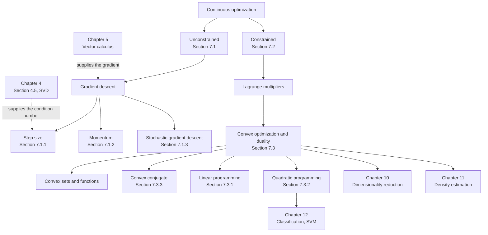

Chapters 2 through 6 built the objects: vectors, geometry, decompositions, gradients, distributions.
Chapter 7 is where they get **used**. Machine learning algorithms run on computers, so every model in
Part II reduces to the same task — find a good set of parameters — and "good" means the minimum of some
objective function.

This chapter is the numerical machinery for doing that. It has two branches and one guarantee.

## The chapter in one diagram

The book's Figure 7.1 is a mind map, and it is worth reading before anything else because it says which
ideas are load-bearing.

Two things the book states plainly and this module measures:

- **The problems here are *continuous*.** Data and models live in $\mathbb{R}^D$, so the variables are real-valued — as opposed to combinatorial optimization over discrete variables, which is a different subject.
- **Everything assumes differentiability.** That is what gives you a gradient at every point, and §7.4 is where you go when it fails.

## The one idea, and its two failures

By convention machine learning **minimises**. Gradients point uphill, so you move the other way, and the
whole of §7.1 is one line — Equation 7.6. Finding the best value is like finding the valleys of a
landscape.

That line has exactly two failures, and the chapter is organised around them.

**Failure one: it finds a valley, not *the* valley.** The book's opening example is
$\ell(x) = x^4 + 7x^3 + 5x^2 - 17x + 3$, which has two minima. Solved exactly, they sit at
$x = -4.480268$ with $\ell = -47.074790$ and at $x = 0.662381$ with $\ell = -3.839903$ — a difference of
**$43.23$**. Which one you get is decided entirely by where you start, and nothing in the gradient warns
you. §7.3 is the answer: for **convex** functions all local minima are global, and much of machine
learning is designed to be convex for exactly this reason.

**Failure two: it is slow, and how slow depends on geometry you never look at.** The relevant number is
the condition number $\kappa$ from §4.5. At $\kappa = 1000$, gradient descent was still $84\%$ wrong
after **one hundred thousand iterations** on a least-squares problem `lstsq` closes exactly. Momentum
(§7.1.2) attacks this by changing the iteration count from $O(\kappa)$ to $O(\sqrt{\kappa})$ — a measured
$71\times$ improvement at $\kappa = 10^4$.

Then there is a cost problem rather than a correctness problem: one exact gradient step needs a pass over
every training example. §7.1.3 replaces it with a cheap noisy estimate, and the only property that
matters is **unbiasedness**.

## What each page does

| page | what it settles | the measurement to remember |
| --- | --- | --- |
| [Optimization Using Gradient Descent](../optimization-using-gradient-descent/) | Eq 7.6, step-size limits, conditioning | iterations against step size is a **U**: $104$ at the optimum, $39113$ at $0.0997$, divergence at $0.0998$ |
| [Momentum and Stochastic Gradient Descent](../momentum-and-stochastic-gradient-descent/) | Eq 7.11–7.15 | momentum's step size is $16.3\%$ **above** the ceiling where plain descent diverges |
| [Constrained Optimization and Lagrange Multipliers](../constrained-optimization-and-lagrange-multipliers/) | Eq 7.17–7.28, weak duality | a nonconvex duality gap of **$1.984123$**, with the dual optimum at an infeasible point |
| [Convex Sets and Convex Functions](../convex-sets-and-convex-functions/) | Def 7.2, 7.3, Eq 7.31, 7.38 | a non-convex function passing $99.7\%$ of random chord tests |
| [Linear and Quadratic Programming](../linear-and-quadratic-programming/) | Eq 7.39–7.52 | an LP answer **jumps** between corners: $5$ switches over $360°$ |
| [Legendre-Fenchel Transform and Convex Conjugate](../legendre-fenchel-transform-and-convex-conjugate/) | Def 7.4, Eq 7.53–7.68 | $f^{**}$ is the convex envelope, and that loss **is** the duality gap |
| [Chapter 7 Exercises and Solutions](../chapter-7-exercises-and-solutions/) | all eleven book exercises | Exercise 7.5's program is **unbounded** as printed |
| [Chapter 7 Formula Sheet](../chapter-7-formula-sheet/) | every equation in one place | — |

## The route through

**If you are here for training loops**, read §7.1 and stop. Equation 7.6, the $2/L$ ceiling, momentum,
and mini-batching are the whole practical story, and the first two pages cover them.

**If you are here for Chapter 12's SVM**, you need §7.2 and §7.3.2 — the Lagrangian, the dual, and the
quadratic program. Exercise 7.8 is the SVM with a single data point, and it is a good place to check
whether the machinery has landed.

**If you are here for Chapter 11's EM algorithm**, the piece you need is Jensen's inequality, which is
Equation 7.30 read as a statement about expectations.

**Read the whole thing** if you want the punchline, which is not in any one section: §7.2's duality gap
and §7.3.3's convex envelope are the **same fact**. The Lagrangian dual is always concave, a concave
function can only represent a convex envelope, and so whatever the envelope flattens is exactly what the
gap loses. Convexity closes the gap because there is nothing left to flatten. Two sections, one idea —
and the module measures both sides of it.

## What this chapter does not do

Worth knowing the boundaries, all of which §7.4 marks:

- **Non-differentiable objectives.** Gradient methods are undefined at a kink. Subgradient methods exist (Shor, 1985); §7.3.3's smoothing is the alternative this chapter demonstrates, and Exercise 7.11 shows it costs exactly $\gamma/2$ in accuracy.
- **Second-order methods in earnest.** Newton's method appears on this module's §5.7 page; quasi-Newton methods like L-BFGS get a mention and no more.
- **Global optimisation of nonconvex problems.** The chapter's honest position is that you get a local minimum, and convexity is how you make that acceptable rather than how you avoid it.
- **Discrete variables.** Combinatorial optimization is explicitly out of scope.

:::tip[From the book]
This page covers the opening of **Chapter 7** and **§7.4** of *Mathematics for Machine Learning* by
Deisenroth, Faisal and Ong (draft of 2019-12-11). Figure **7.1** is the mind map; Equation **7.1** is the
quartic whose two minima open the chapter, with derivatives at **7.2** and **7.3**, plotted in Figure
**7.2**. The remark that these are continuous rather than combinatorial problems, the convention that
objectives are minimised, and the observation that "for convex functions all local minima are global
minimum" are all the book's. §7.4's further-reading pointers are reproduced on the formula sheet. The
exact stationary points, the $43.23$ gap between the two minima, and every other measured constant on
these pages are this module's additions.
:::

## Self-check

<Quiz
  questions={[
  {
    "q": "You want to maximise a score function. What is the machine learning convention?",
    "options": [
      "Negate it and minimise",
      "Use constrained methods",
      "Convert it to a linear program",
      "Use gradient ascent only"
    ],
    "answer": 0,
    "explain": "Training always minimises an objective, so anything you want to maximise is negated first."
  },
  {
    "q": "Gradient descent (Equation 7.6) has two failures. Which pair is right?",
    "options": [
      "It needs a Hessian, and it needs a dataset",
      "It finds a valley rather than the deepest one, and it is slow in a way set by the condition number",
      "It cannot handle constraints, and it cannot handle noise",
      "It diverges always, and it cannot start"
    ],
    "answer": 1,
    "explain": "Convexity answers the first failure. Momentum answers the second."
  },
  {
    "q": "What extra guarantee does a convex objective give?",
    "options": [
      "A closed-form solution",
      "A faster step size",
      "Every local minimum is global",
      "No need for a gradient"
    ],
    "answer": 2,
    "explain": "Section 7.3 is the class of problems where a local answer is provably global."
  },
  {
    "q": "Which is explicitly out of scope for this chapter?",
    "options": [
      "Lagrange multipliers",
      "Convexity",
      "Gradient descent",
      "Non-differentiable objectives and global optimisation of nonconvex problems"
    ],
    "answer": 3,
    "explain": "The chapter assumes differentiability, which supplies a gradient everywhere."
  }
]}
/>

## Recall card

- **Chapter 7 is where the rest of Part I gets used.** Training a model means minimising an objective, and by convention machine learning always minimises — negate anything you want to maximise.
- **Two branches:** unconstrained (Section 7.1) and constrained (Section 7.2), plus one special class (Section 7.3) where a local answer is provably global.
- **Everything assumes differentiability**, which is what supplies a gradient everywhere. Section 7.4 is where to go when that fails.
- **Equation 7.6 has exactly two failures.** It finds a valley rather than the deepest one — the opening example's two minima differ by 43.23 — and it is slow in a way governed by the condition number from Section 4.5.
- **Convexity answers the first failure**, momentum and stochastic gradients answer the second and the cost respectively.
- **The chapter's real punchline spans two sections:** the Lagrangian duality gap and the convex envelope of the conjugate are the same phenomenon, because a concave dual can only ever represent a convex envelope.
- **Out of scope, deliberately:** non-differentiable objectives, serious second-order methods, global optimisation of nonconvex problems, and anything discrete.

**Next:** start at the update rule everything else repairs. **[Optimization Using Gradient Descent](../optimization-using-gradient-descent/)**
