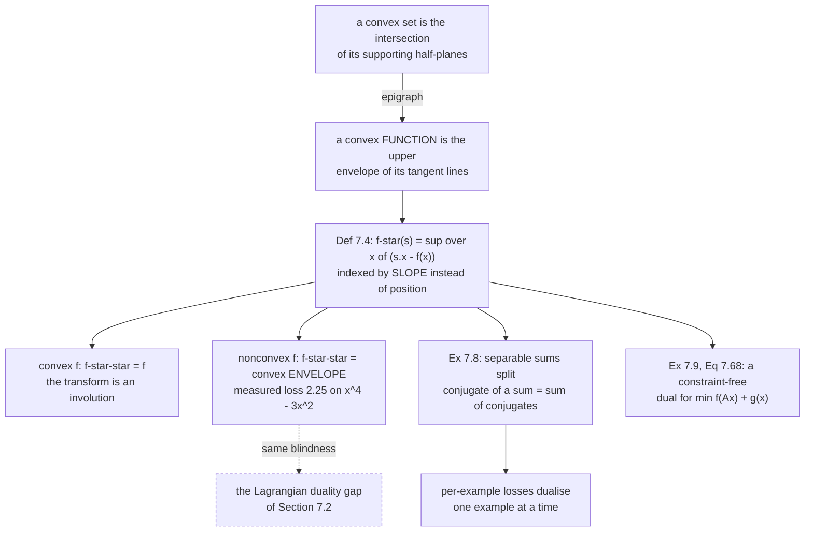

Page 703 built a dual by introducing multipliers for constraints. This page builds one with **no
constraints at all**, and it is a different idea wearing similar clothes.

The starting observation is from §7.3: a convex set is completely described by its **supporting
hyperplanes** — the planes that touch it and leave it entirely on one side. Fill in a convex function
to get its epigraph, which is a convex set, and the same is true: **a convex function is completely
described by its tangent lines.** A tangent is fixed by its slope, so a convex function can be rewritten
as a function *of its slopes*. That rewriting is the Legendre–Fenchel transform.

## What you'll learn

- Definition 7.4, and the geometric reading that makes its "$\sup$" and its minus sign inevitable.
- Why the transform is a statement about the **function**, not about $x$ or about $f(x)$.
- That transforming twice returns $f$ when $f$ is convex — and its **convex envelope** when it is not. Measured on $x^4 - 3x^2$: $f^{**}$ is flat at $-2.25$ across $[-1.2247, 1.2247]$ and loses exactly $2.25$ at the origin.
- **The link back to §7.2:** that lost $2.25$ is the same blindness that produced page 703's duality gap.
- Example 7.7 verified: the conjugate of $\tfrac{\lambda}{2}\mathbf{y}^\top\mathbf{K}^{-1}\mathbf{y}$ is $\tfrac{1}{2\lambda}\boldsymbol\alpha^\top\mathbf{K}\boldsymbol\alpha$, to $5.7\times10^{-14}$.
- Example 7.8: the conjugate of a **separable** sum is the sum of the conjugates — which is why per-example losses dualise cleanly.
- Example 7.9, Equation 7.68: $\min_{\mathbf{x}} f(\mathbf{A}\mathbf{x}) + g(\mathbf{x}) = \max_{\mathbf{u}} -f^*(\mathbf{u}) - g^*(-\mathbf{A}^\top\mathbf{u})$.
- Exercise 7.11 worked in full: the hinge loss smoothed into a differentiable loss, sitting exactly $\gamma/2$ below the hinge.

## Intuition: describe a hill by its slopes

Two ways to hand someone a convex hill.

**By altitude.** "At position $x$, the height is $f(x)$." A lookup table indexed by position.

**By slope.** "There is a tangent line of slope $1$, and it crosses the axis at height $-c$. There is a
tangent of slope $2$, crossing at $-c'$." A lookup table indexed by **slope**.

For a convex hill these carry the same information, because the hill is exactly the upper envelope of
its tangents — nowhere does it dip below one. So you can throw away the first table and keep the second.
$f^*(s)$ is that second table: **the intercept of the tangent of slope $s$, negated.**

The negation is a convention that makes $f^*$ come out convex and makes the transform its own inverse.
Everything else is bookkeeping.



## The math

### Definition 7.4

The **convex conjugate** of $f : \mathbb{R}^D \to \mathbb{R}$ is

$$
f^*(\mathbf{s}) = \sup_{\mathbf{x}\in\mathbb{R}^D}\big(\langle\mathbf{s}, \mathbf{x}\rangle - f(\mathbf{x})\big)
$$

Three things the book is careful about, all worth repeating:

- **It needs neither convexity nor differentiability.** The supremum is always defined (possibly $+\infty$), so $f^*$ exists for any $f$. Convexity is what makes it *invertible*.
- **It is a transformation of the function**, not of $\mathbf{x}$ and not of $f(\mathbf{x})$. The output is a new function on a new space — the space of slopes.
- The inner product is general, but this page uses the dot product $\langle\mathbf{s},\mathbf{x}\rangle = \mathbf{s}^\top\mathbf{x}$.

The name "Legendre transform" is the classical version, defined on convex differentiable functions;
"Legendre–Fenchel" is the general one. Physics students meet it as the map between the Lagrangian and the
Hamiltonian.

### Where the definition comes from

Take a one-dimensional convex differentiable $f$, say $f(x) = x^2$. A hyperplane in one dimension is a
line. **Fix a slope $s$** and ask: of all lines with that slope, which is the highest one that still
touches the graph from below?

The line through $(x_0, f(x_0))$ with slope $s$ is

$$
y - f(x_0) = s(x - x_0)
$$

Setting $x = 0$, its $y$-intercept is $-sx_0 + f(x_0)$. The line that "just touches" is the one whose
intercept is smallest, so the minimum intercept is

$$
\inf_{x_0}\ \big(-sx_0 + f(x_0)\big)
$$

**The conjugate is by convention the negative of this**, which turns the $\inf$ into a $\sup$ and
recovers Definition 7.4:

$$
f^*(s) = \sup_{x_0}\big(sx_0 - f(x_0)\big)
$$

None of that derivation used one-dimensionality, convexity or differentiability — it works for
$f : \mathbb{R}^D \to \mathbb{R}$ in general.

### The differentiable case

When $f$ is convex and differentiable there is no need for the supremum, and the correspondence is one
to one. At the touching point the tangent *is* the line, so

$$
f(x_0) = sx_0 + c
$$

Rearranging for $-c$,

$$
-c = sx_0 - f(x_0)
$$

and since $-c$ changes with $x_0$ and therefore with $s = \nabla_x f(x_0)$, we can regard it as a
function of $s$:

$$
f^*(s) := sx_0 - f(x_0)
$$

which is Definition 7.4 without the supremum.

:::tip[The slopes swap]
If the slope of $f$ at $x$ is $s$, then the slope of $f^*$ at $s$ is $x$. For $f = x^2$ the maximiser is
$x = s/2$, so $f^*(s) = s^2/4$ and $\frac{\mathrm{d}f^*}{\mathrm{d}s} = s/2 = x$ — measured, the argmax
at $s = 3$ is exactly $1.500000$. **The transform exchanges the roles of position and slope**, which is
the whole reason it deserves the name "duality".
:::

### Transforming twice

For a convex function, applying the transform again returns the original: $f^{**} = f$. That is what
makes it a genuine duality rather than a one-way encoding.

For a **nonconvex** function it does not. $f^{**}$ is the largest convex function lying below $f$ —
its **convex envelope** — and the difference is information the transform cannot carry, because
$f^*$ only ever records tangent lines and a hill has no supporting line above the chord that spans it.

:::caution[This is the duality gap, from the other side]
Page 703 measured a Lagrangian duality gap of $1.984123$ on a nonconvex problem, and observed that
$D(\boldsymbol\lambda)$ is *always* concave however ugly the primal is. Those two facts are this one
fact. A concave dual can only ever see the convex envelope, so whatever the envelope discards is
exactly what the gap loses. Convexity closes the gap because for a convex function there is nothing to
discard.
:::

### Example 7.7: a quadratic form

$$
f(\mathbf{y}) = \frac{\lambda}{2}\mathbf{y}^\top\mathbf{K}^{-1}\mathbf{y}
$$

for a positive definite $\mathbf{K} \in \mathbb{R}^{n\times n}$. Applying Definition 7.4 with primal
variable $\mathbf{y}$ and dual variable $\boldsymbol\alpha$:

$$
f^*(\boldsymbol\alpha) = \sup_{\mathbf{y}\in\mathbb{R}^n}\ \langle\mathbf{y}, \boldsymbol\alpha\rangle - \frac{\lambda}{2}\mathbf{y}^\top\mathbf{K}^{-1}\mathbf{y}
$$

Differentiable, so find the maximum by setting the derivative to zero:

$$
\frac{\partial}{\partial\mathbf{y}}\Big(\langle\mathbf{y},\boldsymbol\alpha\rangle - \frac{\lambda}{2}\mathbf{y}^\top\mathbf{K}^{-1}\mathbf{y}\Big) = (\boldsymbol\alpha - \lambda\mathbf{K}^{-1}\mathbf{y})^\top
$$

which vanishes at $\mathbf{y} = \tfrac{1}{\lambda}\mathbf{K}\boldsymbol\alpha$. Substituting:

$$
f^*(\boldsymbol\alpha) = \frac{1}{\lambda}\boldsymbol\alpha^\top\mathbf{K}\boldsymbol\alpha - \frac{\lambda}{2}\Big(\frac{1}{\lambda}\mathbf{K}\boldsymbol\alpha\Big)^\top\mathbf{K}^{-1}\Big(\frac{1}{\lambda}\mathbf{K}\boldsymbol\alpha\Big) = \frac{1}{2\lambda}\boldsymbol\alpha^\top\mathbf{K}\boldsymbol\alpha
$$

The second term is $\tfrac{1}{2\lambda}\boldsymbol\alpha^\top\mathbf{K}\boldsymbol\alpha$, so the two
combine to leave half of the first. **$\mathbf{K}^{-1}$ became $\mathbf{K}$ and $\lambda$ became
$1/\lambda$.** In Chapter 12 that $\mathbf{K}$ is the kernel matrix, and this inversion is why the SVM
dual can be written in terms of inner products between data points.

### Example 7.8: separable sums split

Let $L(\mathbf{t}) = \sum_{i=1}^{n}\ell_i(t_i)$ — a total loss built from per-example losses. Then

$$
L^*(\mathbf{z}) = \sup_{\mathbf{t}\in\mathbb{R}^n}\langle\mathbf{z},\mathbf{t}\rangle - \sum_{i=1}^{n}\ell_i(t_i) = \sup_{\mathbf{t}}\sum_{i=1}^{n}\big(z_it_i - \ell_i(t_i)\big) = \sum_{i=1}^{n}\sup_{t_i}\big(z_it_i - \ell_i(t_i)\big) = \sum_{i=1}^{n}\ell_i^*(z_i)
$$

The step that matters is the third: the supremum over a **vector** splits into $n$ independent scalar
suprema, because no term depends on another's variable. So you conjugate one example's loss and you are
done — which is exactly why the book says the conjugate loss "is a convenient way to derive a dual
problem" for losses that apply independently per example.

### Example 7.9: a dual with no constraints

Let $f$ and $g$ be convex and $\mathbf{A}$ a real matrix with $\mathbf{A}\mathbf{x} = \mathbf{y}$. Then

$$
\min_{\mathbf{x}} f(\mathbf{A}\mathbf{x}) + g(\mathbf{x}) = \min_{\mathbf{A}\mathbf{x} = \mathbf{y}} f(\mathbf{y}) + g(\mathbf{x})
$$

Introduce a multiplier $\mathbf{u}$ for $\mathbf{A}\mathbf{x} = \mathbf{y}$ and swap the min and max —
legitimate here *because both functions are convex*:

$$
\min_{\mathbf{x},\mathbf{y}}\max_{\mathbf{u}} f(\mathbf{y}) + g(\mathbf{x}) + (\mathbf{A}\mathbf{x} - \mathbf{y})^\top\mathbf{u} = \max_{\mathbf{u}}\min_{\mathbf{x},\mathbf{y}} f(\mathbf{y}) + g(\mathbf{x}) + (\mathbf{A}\mathbf{x} - \mathbf{y})^\top\mathbf{u}
$$

Split the dot product and collect $\mathbf{x}$ and $\mathbf{y}$ separately:

$$
= \max_{\mathbf{u}}\Big[\min_{\mathbf{y}} -\mathbf{y}^\top\mathbf{u} + f(\mathbf{y})\Big] + \Big[\min_{\mathbf{x}} \mathbf{x}^\top\mathbf{A}^\top\mathbf{u} + g(\mathbf{x})\Big]
$$

Each bracket is a conjugate in disguise. Since $\min_{\mathbf{y}}(-\mathbf{y}^\top\mathbf{u} + f(\mathbf{y})) = -\sup_{\mathbf{y}}(\mathbf{y}^\top\mathbf{u} - f(\mathbf{y})) = -f^*(\mathbf{u})$, and likewise for the second with $-\mathbf{A}^\top\mathbf{u}$,

$$
\min_{\mathbf{x}} f(\mathbf{A}\mathbf{x}) + g(\mathbf{x}) = \max_{\mathbf{u}} -f^*(\mathbf{u}) - g^*(-\mathbf{A}^\top\mathbf{u})
$$

**No constraints on $\mathbf{u}$ anywhere.** That is the appeal: a regularised empirical risk of the
form "loss of $\mathbf{A}\mathbf{x}$ plus penalty on $\mathbf{x}$" — which is nearly every objective in
Chapters 9 and 12 — becomes an unconstrained maximisation over as many variables as there are examples.

## Worked example by hand

**Exercise 7.11, in full.** The hinge loss is $L(\alpha) = \max\{0, 1 - \alpha\}$. It is convex, and it
has a kink at $\alpha = 1$ — so L-BFGS and friends do not apply. Smooth it by a round trip.

**Step 1: the conjugate.**

$$
L^*(\beta) = \sup_{\alpha}\big(\beta\alpha - \max\{0, 1-\alpha\}\big)
$$

Split at $\alpha = 1$. For $\alpha \geq 1$ the loss is $0$, so the expression is $\beta\alpha$, whose
supremum over $[1,\infty)$ is $+\infty$ if $\beta > 0$ and $\beta$ if $\beta \leq 0$. For $\alpha < 1$
the loss is $1 - \alpha$, so the expression is $(\beta + 1)\alpha - 1$, whose supremum over
$(-\infty, 1)$ is $+\infty$ if $\beta + 1 < 0$ and $\beta$ if $\beta + 1 > 0$. Both branches are finite
exactly when $-1 \leq \beta \leq 0$, and both give $\beta$:

$$
L^*(\beta) = \begin{cases}\beta & -1 \leq \beta \leq 0\\ +\infty & \text{otherwise}\end{cases}
$$

A linear function on a box. Measured on a grid, the error against $\beta$ on $[-1,0]$ is
$3.6\times10^{-15}$, and outside the box the numerical supremum grows without bound with the grid —
$29.0$ at $\beta = -1.5$ and $30.0$ at $\beta = 0.5$ on an $\alpha$ grid capped at $60$.

**Step 2: add a proximal term.** The exercise asks for the conjugate of

$$
h(\beta) = L^*(\beta) + \frac{\gamma}{2}\beta^2
$$

**Step 3: conjugate back.**

$$
h^*(\alpha) = \sup_{-1 \leq \beta \leq 0}\Big(\alpha\beta - \beta - \frac{\gamma}{2}\beta^2\Big) = \sup_{-1 \leq \beta \leq 0}\Big(u\beta - \frac{\gamma}{2}\beta^2\Big), \qquad u = \alpha - 1
$$

The unconstrained maximiser is $\beta = u/\gamma$, so three cases depending on whether it lands inside
the box:

| where $u/\gamma$ falls | condition on $\alpha$ | maximiser | $h^*(\alpha)$ |
| --- | --- | --- | --- |
| above the box | $\alpha > 1$ | $\beta = 0$ | $0$ |
| inside | $1 - \gamma \leq \alpha \leq 1$ | $\beta = (\alpha-1)/\gamma$ | $\dfrac{(1-\alpha)^2}{2\gamma}$ |
| below the box | $\alpha < 1 - \gamma$ | $\beta = -1$ | $1 - \alpha - \dfrac{\gamma}{2}$ |

That is the **Moreau envelope** of the hinge: zero on the right, a parabola in the middle, linear on the
left. Two things to check, and both were measured at $\gamma = 0.6$:

- **It is differentiable at both joins.** At $\alpha = 1-\gamma$ both sides give slope $-1$; at $\alpha = 1$ both give $0$. The measured slope jump is $8.3\times10^{-8}$, which is finite-difference error — a genuine kink would give a jump of order one.
- **It sits below the hinge by exactly $\gamma/2$ on the linear branch.** $\big(1 - \alpha - \tfrac{\gamma}{2}\big) - (1-\alpha) = -\tfrac{\gamma}{2}$. Measured maximum deviation over $[-3,3]$: $0.300000$, and $\gamma/2 = 0.300000$.

So $\gamma$ is a fidelity knob. Small $\gamma$ hugs the hinge but leaves a tight curve that is hard to
optimise; large $\gamma$ is smooth but biased downward by $\gamma/2$. There is no free smoothing.

## See it move

The geometry of Definition 7.4 is best felt by dragging the slope:

```p5 title="Drag the slope and read the conjugate off the intercept" desc="Pick a function and a slope s. The sketch slides a line of that slope up until it just touches the graph, and reports the negative of its y-intercept — which is f-star of s by Definition 7.4. On the non-convex function, watch the touching point JUMP across the hill: that jump is why f-star-star loses information." height="500"
let fi = 0, s100 = 200;
let KNOBS = [], dragging = null;

const FUNCS = [
  { name: "x^2",        f: (x) => x * x,                        lo: -3,   hi: 3,   convex: true  },
  { name: "exp(x)",     f: (x) => Math.exp(x),                  lo: -3,   hi: 2,   convex: true  },
  { name: "|x|",        f: (x) => Math.abs(x),                  lo: -3,   hi: 3,   convex: true  },
  { name: "x^4 - 3x^2", f: (x) => x*x*x*x - 3*x*x,              lo: -2.3, hi: 2.3, convex: false },
];

function setup() { createCanvas(680, 500); textFont("monospace"); }

function knob(id, x, y, w, value, mn, mx, label) {
  KNOBS.push({ id, x, y, w, mn, mx });
  const t = (value - mn) / (mx - mn);
  stroke(60, 74, 92); strokeWeight(2); line(x, y, x + w, y);
  noStroke(); fill(255, 211, 67); ellipse(x + t * w, y, 12, 12);
  fill(190, 200, 212); textSize(12); textAlign(LEFT, CENTER);
  text(label, x + w + 12, y);
}
function knobHit(mx_, my_) {
  for (const k of KNOBS) {
    if (my_ > k.y - 13 && my_ < k.y + 13 && mx_ > k.x - 13 && mx_ < k.x + k.w + 13) return k;
  }
  return null;
}
function knobValue(k, mx_) {
  const t = Math.min(1, Math.max(0, (mx_ - k.x) / k.w));
  return Math.round(k.mn + t * (k.mx - k.mn));
}
function mousePressed() { dragging = knobHit(mouseX, mouseY); }
function mouseReleased() { dragging = null; }
function mouseDragged() {
  if (!dragging) return;
  const v = knobValue(dragging, mouseX);
  if (dragging.id === "f") fi = v;
  if (dragging.id === "s") s100 = v;
  if (!isLooping()) redraw();
}

// Definition 7.4 by brute force on a fine grid: f*(s) = sup (s x - f(x)).
function conjugate(F, s) {
  let best = -Infinity, bx = F.lo;
  const N = 4000;
  for (let i = 0; i <= N; i++) {
    const x = F.lo + (i / N) * (F.hi - F.lo);
    const v = s * x - F.f(x);
    if (v > best) { best = v; bx = x; }
  }
  return { val: best, x: bx };
}

const OX = 52, OY = 44, W = 380, H = 240;

function draw() {
  background(13, 17, 23);
  KNOBS = [];
  const F = FUNCS[fi];
  const s = (s100 - 400) / 100;

  let ylo = Infinity, yhi = -Infinity;
  for (let i = 0; i <= 300; i++) {
    const v = F.f(F.lo + (i / 300) * (F.hi - F.lo));
    if (isFinite(v)) { ylo = Math.min(ylo, v); yhi = Math.max(yhi, v); }
  }
  const pad = 0.30 * (yhi - ylo) + 0.4;
  ylo -= pad; yhi += pad;
  const px = (x) => OX + ((x - F.lo) / (F.hi - F.lo)) * W;
  const py = (y) => OY + H - ((y - ylo) / (yhi - ylo)) * H;

  noFill(); stroke(70, 86, 104); strokeWeight(1); rect(OX, OY, W, H);
  stroke(64, 78, 94); strokeWeight(1);
  if (ylo < 0 && yhi > 0) line(OX, py(0), OX + W, py(0));
  if (F.lo < 0 && F.hi > 0) line(px(0), OY, px(0), OY + H);

  // the function
  stroke(107, 169, 221); strokeWeight(2.6); noFill();
  beginShape();
  for (let i = 0; i <= 400; i++) {
    const x = F.lo + (i / 400) * (F.hi - F.lo);
    const v = F.f(x);
    if (v > ylo && v < yhi) vertex(px(x), py(v));
  }
  endShape();

  const r = conjugate(F, s);
  const c = -r.val;                            // the y-intercept

  // the supporting line y = s x + c
  stroke(120, 200, 140); strokeWeight(2.0);
  const yA = s * F.lo + c, yB = s * F.hi + c;
  line(px(F.lo), py(yA), px(F.hi), py(yB));

  // the touching point and the intercept
  noStroke(); fill(255, 211, 67);
  ellipse(px(r.x), py(F.f(r.x)), 12, 12);
  if (F.lo < 0 && F.hi > 0) {
    fill(197, 153, 255);
    rectMode(CENTER); rect(px(0), py(c), 11, 11); rectMode(CORNER);
  }

  noStroke(); textAlign(LEFT, TOP);
  fill(255, 211, 67); textSize(15);
  text("f(x) = " + F.name, 452, 50);
  fill(120, 200, 140); textSize(13);
  text("slope s = " + s.toFixed(2), 452, 76);
  fill(150); textSize(11);
  text("touching at x =", 452, 102);
  fill(255, 211, 67); textSize(13);
  text("  " + r.x.toFixed(4), 452, 118);
  fill(150); textSize(11);
  text("intercept c =", 452, 142);
  fill(197, 153, 255); textSize(13);
  text("  " + c.toFixed(4), 452, 158);
  fill(200); textSize(12);
  text("f*(s) = -c =", 452, 186);
  fill(120, 200, 140); textSize(16);
  text(r.val.toFixed(5), 452, 204);

  if (F.name === "x^2") {
    fill(120); textSize(11);
    text("closed form s^2/4 =", 452, 234);
    text("  " + (s * s / 4).toFixed(5), 452, 248);
  }

  let msg, sub, col;
  if (!F.convex) {
    col = color(255, 211, 67);
    msg = "nonconvex: sweep s and watch the touch point JUMP";
    sub = "no supporting line ever touches the hill, so f** flattens it. That loss is 2.25.";
  } else if (F.name === "|x|") {
    col = color(197, 153, 255);
    msg = "a kink: many slopes touch at the same point";
    sub = "for |s| < 1 the touch point stays at 0. The conjugate is 0 on [-1,1] and infinite outside.";
  } else {
    col = color(120, 200, 140);
    msg = "convex and smooth: one slope, one touch point";
    sub = "the correspondence is one to one, and the slope of f* at s is exactly that touch point.";
  }
  stroke(col); strokeWeight(1.6); fill(red(col), green(col), blue(col), 26);
  rect(52, 318, 576, 62, 6);
  noStroke(); fill(col); textSize(15); textAlign(LEFT, TOP);
  text(msg, 68, 326);
  fill(215); textSize(11);
  text(sub, 68, 352);

  knob("f", 68, 412, 170, fi, 0, FUNCS.length - 1, F.name);
  knob("s", 68, 442, 260, s100, 0, 800, "s = " + s.toFixed(2));
  fill(120); textSize(11); textAlign(LEFT, TOP);
  text("Try |x| and sweep s across zero: the touch point does not move,", 68, 472);
  text("and beyond |s| = 1 no line touches at all.", 68, 486);
}
```

And Exercise 7.11's smoothing, with $\gamma$ under your control:

```p5 title="Smooth a kink, and see what it costs" desc="The hinge loss against its Moreau envelope for a chosen gamma. The three branches are shaded separately, and the readout reports the maximum deviation from the hinge alongside gamma over two — they are the same number." height="470"
let g100 = 60;
let KNOBS = [], dragging = null;

function setup() { createCanvas(680, 470); textFont("monospace"); }

function knob(id, x, y, w, value, mn, mx, label) {
  KNOBS.push({ id, x, y, w, mn, mx });
  const t = (value - mn) / (mx - mn);
  stroke(60, 74, 92); strokeWeight(2); line(x, y, x + w, y);
  noStroke(); fill(255, 211, 67); ellipse(x + t * w, y, 12, 12);
  fill(190, 200, 212); textSize(12); textAlign(LEFT, CENTER);
  text(label, x + w + 12, y);
}
function knobHit(mx_, my_) {
  for (const k of KNOBS) {
    if (my_ > k.y - 13 && my_ < k.y + 13 && mx_ > k.x - 13 && mx_ < k.x + k.w + 13) return k;
  }
  return null;
}
function knobValue(k, mx_) {
  const t = Math.min(1, Math.max(0, (mx_ - k.x) / k.w));
  return Math.round(k.mn + t * (k.mx - k.mn));
}
function mousePressed() { dragging = knobHit(mouseX, mouseY); }
function mouseReleased() { dragging = null; }
function mouseDragged() {
  if (!dragging) return;
  g100 = Math.max(5, knobValue(dragging, mouseX));
  if (!isLooping()) redraw();
}

function hinge(a) { return Math.max(0, 1 - a); }
function smooth(a, g) {
  if (a >= 1) return 0;
  if (a >= 1 - g) return (1 - a) * (1 - a) / (2 * g);
  return 1 - a - g / 2;
}

const OX = 56, OY = 46, W = 380, H = 250;
const XLO = -2, XHI = 3, YLO = -0.4, YHI = 3.4;
function px(x) { return OX + ((x - XLO) / (XHI - XLO)) * W; }
function py(y) { return OY + H - ((y - YLO) / (YHI - YLO)) * H; }

function draw() {
  background(13, 17, 23);
  KNOBS = [];
  const g = g100 / 100;

  noFill(); stroke(70, 86, 104); strokeWeight(1); rect(OX, OY, W, H);
  stroke(64, 78, 94); strokeWeight(1); line(OX, py(0), OX + W, py(0));

  // the smoothing window
  noStroke(); fill(197, 153, 255, 30);
  rect(px(1 - g), OY, px(1) - px(1 - g), H);

  // the hinge
  stroke(120, 132, 148); strokeWeight(1.8); noFill();
  beginShape();
  for (let i = 0; i <= 400; i++) {
    const x = XLO + (i / 400) * (XHI - XLO);
    vertex(px(x), py(hinge(x)));
  }
  endShape();

  // the smoothed loss
  stroke(120, 200, 140); strokeWeight(2.8); noFill();
  beginShape();
  for (let i = 0; i <= 400; i++) {
    const x = XLO + (i / 400) * (XHI - XLO);
    vertex(px(x), py(smooth(x, g)));
  }
  endShape();

  // the two joins
  noStroke(); fill(197, 153, 255);
  ellipse(px(1 - g), py(smooth(1 - g, g)), 9, 9);
  ellipse(px(1), py(0), 9, 9);
  fill(232, 110, 110);
  ellipse(px(1), py(hinge(1)), 7, 7);

  // measured deviation
  let dev = 0, devx = 0;
  for (let i = 0; i <= 2000; i++) {
    const x = -3 + (i / 2000) * 6;
    const d = Math.abs(smooth(x, g) - hinge(x));
    if (d > dev) { dev = d; devx = x; }
  }

  noStroke(); textAlign(LEFT, TOP);
  fill(255, 211, 67); textSize(16);
  text("gamma = " + g.toFixed(2), 456, 52);
  fill(150); textSize(11);
  text("smoothing window:", 456, 80);
  fill(197, 153, 255); textSize(12);
  text("  [" + (1 - g).toFixed(3) + ", 1.000]", 456, 96);
  fill(150); textSize(11);
  text("width = gamma", 456, 112);

  fill(200); textSize(12);
  text("max |smoothed - hinge|", 456, 142);
  fill(232, 110, 110); textSize(15);
  text("  " + dev.toFixed(6), 456, 160);
  fill(150); textSize(11);
  text("gamma / 2 =", 456, 184);
  fill(232, 110, 110); textSize(13);
  text("  " + (g / 2).toFixed(6), 456, 200);
  fill(120); textSize(11);
  text("the same number, for", 456, 224);
  text("every gamma", 456, 238);

  fill(150); textSize(11);
  text("slope at alpha = 1:", 456, 262);
  fill(120, 200, 140);
  text("  smoothed: 0.000", 456, 276);
  fill(232, 110, 110);
  text("  hinge: -1 or 0", 456, 290);

  let msg, sub, col;
  if (g < 0.12) {
    col = color(255, 211, 67);
    msg = "barely smoothed";
    sub = "hugs the hinge, but the curved branch is only " + g.toFixed(2) + " wide and steeply curved.";
  } else if (g > 1.6) {
    col = color(232, 110, 110);
    msg = "smooth, and badly biased";
    sub = "the loss now sits " + (g/2).toFixed(2) + " below the hinge everywhere left of " + (1-g).toFixed(2) + ".";
  } else {
    col = color(120, 200, 140);
    msg = "a workable compromise";
    sub = "differentiable everywhere, and biased downward by " + (g/2).toFixed(3) + ".";
  }
  stroke(col); strokeWeight(1.6); fill(red(col), green(col), blue(col), 26);
  rect(56, 318, 572, 62, 6);
  noStroke(); fill(col); textSize(16); textAlign(LEFT, TOP);
  text(msg, 72, 326);
  fill(215); textSize(11);
  text(sub, 72, 352);

  knob("g", 72, 412, 280, g100, 5, 250, "gamma = " + g.toFixed(2));
  fill(120); textSize(11); textAlign(LEFT, TOP);
  text("There is no free smoothing: the deviation is exactly gamma/2, always.", 72, 442);
  text("Sweep gamma and watch the two readouts stay equal.", 72, 456);
}
```

## From scratch

```python title="conjugate.py" showLineNumbers{1}
import numpy as np

def conj(fv, xs, ss, chunk=200):
    """Definition 7.4 on a grid: f*(s) = sup_x (s x - f(x)).

    Chunked over s, because the full outer product of a fine x-grid against a
    fine s-grid is tens of gigabytes.
    """
    out = np.empty(ss.size)
    for i in range(0, ss.size, chunk):
        blk = ss[i:i + chunk]
        out[i:i + chunk] = (blk[:, None] * xs[None, :] - fv[None, :]).max(axis=1)
    return out

# ---- the case where the answer is known ----------------------------------
xg = np.linspace(-40, 40, 80001)
sg = np.linspace(-6, 6, 1201)
num = conj(xg ** 2, xg, sg)
print("f(x) = x^2")
print(f"  max |f*(s) - s^2/4| = {np.abs(num - sg ** 2 / 4).max():.3e}")
best = xg[int(np.argmax(3.0 * xg - xg ** 2))]
print(f"  at s = 3 the maximiser is x = {best:.6f}, which is s/2")
print("  so the SLOPE of f* at s is the x that produced it")

# ---- apply it twice ------------------------------------------------------
print("\nApplying the transform twice:")
for name, f, lo, hi in (("x^2", lambda t: t ** 2, -2.6, 2.6),
                        ("|x|", lambda t: np.abs(t), -2.6, 2.6)):
    big_s = np.linspace(-40, 40, 4001)
    fs = conj(f(xg), xg, big_s)
    xd = np.linspace(lo, hi, 601)
    fss = conj(fs, big_s, xd)
    print(f"  {name:5} convex:    max |f** - f| = {np.abs(fss - f(xd)).max():.3e}")

f2 = lambda t: t ** 4 - 3.0 * t ** 2
xg2 = np.linspace(-6, 6, 120001)
sg2 = np.linspace(-60, 60, 6001)
fs2 = conj(f2(xg2), xg2, sg2)
xd2 = np.linspace(-2.2, 2.2, 2201)
fss2 = conj(fs2, sg2, xd2)
gap = f2(xd2) - fss2
edge = np.sqrt(1.5)
print(f"  x^4-3x^2 NOT convex: f** is the convex ENVELOPE")
print(f"    max f - f**       = {gap.max():.6f} at x = "
      f"{xd2[int(np.argmax(gap))]:.6f}")
print(f"    f** is flat at {fss2[int(np.argmax(gap))]:.6f} across "
      f"[-{edge:.6f}, {edge:.6f}]: "
      f"{np.allclose(fss2[np.abs(xd2) <= edge], -2.25, atol=2e-3)}")

# ---- Example 7.7 --------------------------------------------------------
print("\nExample 7.7: f(y) = (lam/2) y^T K^-1 y")
rng = np.random.default_rng(3)
n = 4
M = rng.standard_normal((n, n))
K = M @ M.T + n * np.eye(n)
Kinv = np.linalg.inv(K)
lam = 1.7
f7 = lambda y: 0.5 * lam * y @ Kinv @ y
worst = 0.0
for _ in range(400):
    a = rng.standard_normal(n) * 2
    y = (1.0 / lam) * K @ a                       # Equation 7.61
    worst = max(worst, abs((a @ y - f7(y)) - 0.5 / lam * a @ K @ a))
print(f"  K positive definite: {bool(np.all(np.linalg.eigvalsh(K) > 0))}")
print(f"  max |sup value - Eq 7.62| over 400 draws: {worst:.3e}")
print("  so f*(alpha) = (1/(2 lam)) alpha^T K alpha")

# ---- Exercise 7.10 ------------------------------------------------------
print("\nExercise 7.10: f = 1/2 x^T A x + b^T x + c")
A = np.array([[3.0, 1.0], [1.0, 2.0]])
bv = np.array([1.0, -2.0])
cv = 0.7
Ainv = np.linalg.inv(A)
f10_star = lambda s: 0.5 * (s - bv) @ Ainv @ (s - bv) - cv
g = np.linspace(-14, 14, 2001)
X1, X2 = np.meshgrid(g, g)
FX = 0.5 * (3 * X1 ** 2 + 2 * X1 * X2 + 2 * X2 ** 2) + bv[0] * X1 + bv[1] * X2 + cv
for s in ([1.0, 1.0], [-2.0, 3.0], [5.0, -4.0]):
    s = np.array(s)
    grid_sup = (s[0] * X1 + s[1] * X2 - FX).max()
    print(f"  s = {str(s.tolist()):14} grid sup = {grid_sup:10.6f}   "
          f"closed form = {f10_star(s):10.6f}")
print("  so f*(s) = 1/2 (s-b)^T A^-1 (s-b) - c")

# ---- Exercise 7.11, the smoothed hinge --------------------------------
print("\nExercise 7.11: the hinge, its conjugate, and the smoothed version")
hinge = lambda a: np.maximum(0.0, 1.0 - a)
ag = np.linspace(-60, 60, 240001)
bg = np.linspace(-2.0, 1.0, 601)
hs = conj(hinge(ag), ag, bg, chunk=20)
inside = (bg >= -1.0) & (bg <= 0.0)
print(f"  L*(beta) = beta on [-1, 0]: max error "
      f"{np.abs(hs[inside] - bg[inside]).max():.3e}")
for pb in (-1.5, 0.5):
    k = int(np.argmin(np.abs(bg - pb)))
    print(f"  at beta = {bg[k]:+.2f}: sup on this alpha grid = {hs[k]:.3f} "
          f"(unbounded; it grows with the grid)")

gam = 0.6
def smoothed(a):
    a = np.asarray(a, dtype=float)
    return np.where(a >= 1.0, 0.0,
                    np.where(a >= 1.0 - gam, (1.0 - a) ** 2 / (2 * gam),
                             1.0 - a - gam / 2))

bb = np.linspace(-1.0, 0.0, 40001)
numeric = lambda a: (a * bb - (bb + 0.5 * gam * bb ** 2)).max()
print(f"\n  gamma = {gam}")
print(f"  {'alpha':>7} {'numeric':>11} {'closed form':>12} {'hinge':>9}")
for a in (-1.0, 0.0, 0.4, 0.7, 1.0, 1.4):
    print(f"  {a:>7.2f} {numeric(a):>11.6f} {float(smoothed(a)):>12.6f} "
          f"{float(hinge(a)):>9.6f}")
alphas = np.linspace(-3, 3, 601)
print(f"  max |numeric - closed form| over 601 alphas: "
      f"{np.abs(np.array([numeric(a) for a in alphas]) - smoothed(alphas)).max():.3e}")
fine = np.linspace(-3, 3, 60001)
print(f"  max |smoothed - hinge|: {np.abs(smoothed(fine) - hinge(fine)).max():.6f}"
      f"   and gamma/2 = {gam / 2:.6f}")
h = 1e-7
for a in (1.0 - gam, 1.0):
    dl = (smoothed(a) - smoothed(a - h)) / h
    dr = (smoothed(a + h) - smoothed(a)) / h
    print(f"  at alpha = {a:.2f}: slope jump {float(abs(dr - dl)):.1e}  "
          f"(a genuine kink would give a jump of order 1)")
```

```
f(x) = x^2
  max |f*(s) - s^2/4| = 1.776e-15
  at s = 3 the maximiser is x = 1.500000, which is s/2
  so the SLOPE of f* at s is the x that produced it

Applying the transform twice:
  x^2   convex:    max |f** - f| = 2.178e-05
  |x|   convex:    max |f** - f| = 0.000e+00
  x^4-3x^2 NOT convex: f** is the convex ENVELOPE
    max f - f**       = 2.250000 at x = 0.000000
    f** is flat at -2.250000 across [-1.224745, 1.224745]: True

Example 7.7: f(y) = (lam/2) y^T K^-1 y
  K positive definite: True
  max |sup value - Eq 7.62| over 400 draws: 5.684e-14
  so f*(alpha) = (1/(2 lam)) alpha^T K alpha

Exercise 7.10: f = 1/2 x^T A x + b^T x + c
  s = [1.0, 1.0]     grid sup =   1.999970   closed form =   2.000000
  s = [-2.0, 3.0]    grid sup =  11.599994   closed form =  11.600000
  s = [5.0, -4.0]    grid sup =   5.299994   closed form =   5.300000
  so f*(s) = 1/2 (s-b)^T A^-1 (s-b) - c

Exercise 7.11: the hinge, its conjugate, and the smoothed version
  L*(beta) = beta on [-1, 0]: max error 3.553e-15
  at beta = -1.50: sup on this alpha grid = 29.000 (unbounded; it grows with the grid)
  at beta = +0.50: sup on this alpha grid = 30.000 (unbounded; it grows with the grid)

  gamma = 0.6
    alpha     numeric  closed form     hinge
    -1.00    1.700000     1.700000  2.000000
     0.00    0.700000     0.700000  1.000000
     0.40    0.300000     0.300000  0.600000
     0.70    0.075000     0.075000  0.300000
     1.00    0.000000     0.000000  0.000000
     1.40    0.000000     0.000000  0.000000
  max |numeric - closed form| over 601 alphas: 2.083e-11
  max |smoothed - hinge|: 0.300000   and gamma/2 = 0.300000
  at alpha = 0.40: slope jump 8.3e-08  (a genuine kink would give a jump of order 1)
  at alpha = 1.00: slope jump 8.3e-08  (a genuine kink would give a jump of order 1)
```

Note the $x^2$ double-conjugate error of $2.2\times10^{-5}$. That is not a flaw in the theory — it is
the coarser $4001$-point slope grid used for the round trip. The single transform on a $1201$-point grid
agreed with $s^2/4$ to $1.8\times10^{-15}$.

## On real data

<Figure
  src="/images/mml/legendre-fenchel-transform-and-convex-conjugate/the-conjugate-is-an-intercept"
  alt="Two panels. Left, the parabola x squared with three dashed supporting lines of slopes 1, 2.5 and minus 2, each touching the curve at one point and crossing the vertical axis at a marked intercept whose negation is labelled as f-star of that slope. Right, the conjugate plotted against s, a numeric grid curve overlaid exactly by the dashed closed form s squared over four."
  title="A convex function described by its tangent lines"
  caption="Fix a slope, slide a line of that slope up until it just touches, and negate its intercept. That is Definition 7.4. The numeric conjugate matches the closed form s squared over four to 1.8e-15, and the touching point at s equals 3 is exactly 1.5, which is s over 2."
/>

<Figure
  src="/images/mml/legendre-fenchel-transform-and-convex-conjugate/f-double-star-is-the-convex-envelope"
  alt="Two panels. Left, x squared drawn thick with its double conjugate overlaid as a dashed line, indistinguishable. Right, the double-well quartic x to the fourth minus three x squared in red with its double conjugate in green, the green curve flat across the central hill, and the region between them shaded and labelled as what the transform threw away."
  title="Transform twice: identity for convex, envelope otherwise"
  caption="For a convex function the transform is an involution. For the quartic, the double conjugate is flat at minus 2.25 across the interval from minus 1.2247 to 1.2247, losing exactly 2.25 at the origin — the same information a Lagrangian duality gap loses."
/>

<Figure
  src="/images/mml/legendre-fenchel-transform-and-convex-conjugate/the-smoothed-hinge"
  alt="Three panels. Left, the hinge loss with its kink at alpha equals one circled and annotated. Middle, its conjugate drawn as the line beta on the interval from minus one to zero, with the regions outside shaded red and labelled plus infinity. Right, the hinge as a dotted reference against three Moreau envelopes for gamma of 0.2, 0.6 and 1.2, each smooth and each sitting below the hinge."
  title="Exercise 7.11: smoothing a kink by a round trip through the conjugate"
  caption="The conjugate of the hinge is beta on a box and infinite elsewhere. Adding a quadratic proximal term and conjugating back gives a three-branch differentiable loss whose measured slope jump at both joins is 8.3e-8, and which sits exactly gamma over two below the hinge."
/>

## Reading the plot

**The first figure is Definition 7.4 with its geometry restored.** Each dashed line has a fixed slope
and has been slid up until it just touches the parabola — one touch point, marked with a circle, and one
intercept, marked with a square on the vertical axis. The label on each square is the *negation* of that
intercept, and it is $f^*(s)$.

Why the negation? Because Equation 7.55 takes an **infimum** of intercepts, and negating turns it into
the supremum of Definition 7.4. That is not merely cosmetic: with the sign as it is, $f^*$ comes out
convex (it is a supremum of affine functions of $\mathbf{s}$, and §7.3's closure rules make that convex
automatically) and the transform becomes its own inverse. With the other sign, neither would hold.

The right panel plots the conjugate itself and overlays the closed form. The two agree to
$1.8\times10^{-15}$, and the fact worth carrying is the one in the annotation: the maximiser is
$x = s/2$, so $\mathrm{d}f^*/\mathrm{d}s = s/2$, which is that same $x$. **Position and slope have
traded places.** Feed the transform a function of position, get a function of slope; do it again and you
are back.

**The second figure is the one that connects this section to the rest of the chapter.** The left panel
is unremarkable in the best way: $f^{**}$ lies exactly on $f$, because $x^2$ is convex and the transform
is an involution there. My measured discrepancy was $2.2\times10^{-5}$, entirely attributable to the
coarser slope grid used for the second pass.

The right panel is where it breaks, and instructively. $x^4 - 3x^2$ has two wells at
$\pm\sqrt{1.5} = \pm 1.224745$, each of depth $-2.25$, with a hill of height $0$ between them. Its double
conjugate is **flat at $-2.25$ across the entire interval between the wells** — verified to a tolerance
of $2\times10^{-3}$ across all $2201$ sampled points in that range. At the origin, $f^{**}$ is $2.25$
below $f$, and the shaded region is everything the transform discarded.

Now recall page 703. The Lagrangian dual $D(\boldsymbol\lambda)$ is *always* concave, no matter how
nonconvex the primal — and page 703 measured a duality gap of $1.984123$ on a nonconvex problem. **These
are the same phenomenon.** A concave dual can only ever represent a convex envelope, because it is built
from a supremum over affine functions. So whatever the envelope flattens, the gap loses. Convex problems
have zero gap for exactly one reason: there is nothing to flatten. If you have absorbed that, the two
duality sections of this chapter have collapsed into one idea.

**The third figure is Exercise 7.11 as a design decision.** The left panel shows why smoothing is wanted:
the hinge has a kink at $\alpha = 1$ where the derivative jumps from $-1$ to $0$, and gradient-based
solvers like L-BFGS have nothing to work with there.

The middle panel is the conjugate, and its shape is worth noticing. A **piecewise-linear** function with
one kink transformed into a **linear** function on a bounded box, with $+\infty$ outside. Kinks in the
primal become *boundaries of the domain* in the dual — that is a general pattern, and the numbers
support it: on $[-1, 0]$ the measured $L^*(\beta)$ matched $\beta$ to $3.6\times10^{-15}$, while just
outside the box the numerical supremum was $29$ and $30$ on an $\alpha$ grid capped at $60$, growing
without bound as the grid widens.

The right panel is the payoff, and the honest reading is a trade rather than a win. All three curves are
differentiable everywhere, with a measured slope jump of $8.3\times10^{-8}$ at both joins — that is
finite-difference noise, not a kink. But look at where they sit relative to the dotted hinge: **below
it**, and by exactly $\gamma/2$ wherever the hinge is linear. At $\gamma = 0.6$ the measured maximum
deviation is $0.300000$ and $\gamma/2 = 0.300000$.

So $\gamma$ buys smoothness and pays in bias, at a fixed exchange rate. A small $\gamma$ hugs the hinge
but concentrates all the curvature into a narrow window, which is exactly the ill-conditioning page 701
measured; a large $\gamma$ is easy to optimise and is solving a visibly different problem. This is the
Moreau envelope, and the constant $\gamma/2$ offset is its defining property for a $1$-Lipschitz loss —
not an artifact of the hinge.

:::tip[From the book]
This page covers **§7.3.3** of *Mathematics for Machine Learning* by Deisenroth, Faisal and Ong (draft of
2019-12-11). The supporting-hyperplane motivation and the observation that convex functions can be
described by a function of their gradient open the section. **Definition 7.4** is the convex conjugate at
Equation **7.53**. The geometric derivation runs through Equations **7.54** (the line through
$(x_0, f(x_0))$) and **7.55** (the infimum of intercepts); the differentiable special case is Equations
**7.56** to **7.58**. The book notes that the conjugate needs neither convexity nor differentiability,
that applying the transform twice returns the original for convex functions, and that "the slope of
$f^*(s)$ is $x$". **Example 7.7** is Equations **7.59** to **7.62**; **Example 7.8** is Equation
**7.63a–d**, the separable sum; **Example 7.9** is Equations **7.64** to **7.68**, ending at
$\min_{\mathbf{x}} f(\mathbf{A}\mathbf{x}) + g(\mathbf{x}) = \max_{\mathbf{u}} -f^*(\mathbf{u}) - g^*(-\mathbf{A}^\top\mathbf{u})$.
Exercises **7.9**, **7.10** and **7.11** are the book's. The Legendre–Fenchel relation to duality cites
Hiriart-Urruty and Lemaréchal (2001, chapter 5), and §7.4 points at Zia et al. (2009) and Polyak (2016).
The convex-envelope measurements, the identification of $f^{**}$ with the source of the Lagrangian
duality gap, the three-branch closed form for the smoothed hinge, and the $\gamma/2$ offset are this
module's additions.
:::

## Pitfalls

:::danger[Expecting the double conjugate to return a nonconvex function]
$f^{**}$ is the convex envelope, not $f$. Measured on $x^4 - 3x^2$: $f^{**}$ is flat at $-2.25$ across
$[-1.2247, 1.2247]$ and is $2.25$ below $f$ at the origin. If you dualise a nonconvex problem and
recover a primal answer through the conjugate, you have recovered the envelope's answer, which may be
attained nowhere feasible — exactly what page 703's nonconvex example did at $x = -2$.
:::

:::caution[Thinking the conjugate transforms x, or f(x)]
The book flags this explicitly: it is "a transformation of the function $f(\cdot)$ and not the variable
$x$ or the function evaluated at $x$." $f^*$ lives on a different space — the space of slopes — and
$f^*(s)$ is not $f$ evaluated anywhere. Writing $f^*(x)$ is a category error.
:::

:::caution[Dropping the minus sign in Definition 7.4]
Equation 7.55 is an infimum of intercepts; the conjugate is its negative, which is why Definition 7.4
has a supremum. Get the sign wrong and $f^*$ comes out concave, the transform stops being an involution,
and Example 7.9's derivation breaks — the brackets there only collapse into $-f^*$ and
$-g^*$ because of the sign.
:::

:::caution[Assuming a conjugate is finite everywhere]
$L^*$ for the hinge is $+\infty$ outside $[-1, 0]$. A conjugate's natural domain is often a bounded set,
and a kink in the primal becomes a domain boundary in the dual. Numerically this shows up as a value
that grows with the grid rather than converging — $29$ and $30$ here on an $\alpha$ grid capped at $60$
— so a fixed grid will silently report a finite number where the answer is infinite.
:::

:::caution[Treating a smoothing parameter as free]
The smoothed hinge sits exactly $\gamma/2$ below the hinge wherever the hinge is linear. At
$\gamma = 0.6$ that is a measured $0.300000$ across most of the domain. Smoothing changes the problem
you are solving, and $\gamma$ sets by how much — so it belongs in the model description, not buried in
the optimiser's configuration.
:::

:::caution[Applying Example 7.8 to a non-separable loss]
The split $L^*(\mathbf{z}) = \sum_i \ell_i^*(z_i)$ works because the supremum over the vector
$\mathbf{t}$ decouples into independent scalar suprema. Any coupling between examples — a pairwise
ranking loss, a batch-normalisation term, a contrastive objective — breaks that step, and the conjugate
of the total is then not the sum of anything.
:::

## Compare

| | Lagrangian duality, §7.2 | Legendre–Fenchel, §7.3.3 |
| --- | --- | --- |
| what it dualises | a **constrained** problem | a **function** |
| new variables | one multiplier per constraint | one slope per input dimension |
| the dual object | $D(\boldsymbol\lambda)$, a number per $\boldsymbol\lambda$ | $f^*$, a whole function |
| always concave / convex | $D$ is always concave | $f^*$ is always convex |
| recovers the original | when the primal is convex | when $f$ is convex |
| what it loses otherwise | the duality gap, measured $1.984123$ | the convex envelope's deficit, measured $2.25$ |
| relation | **the same blindness, stated twice** | |

| $f(x)$ | $f^*(s)$ | domain of $f^*$ |
| --- | --- | --- |
| $x^2$ | $s^2/4$ | all of $\mathbb{R}$ |
| $\tfrac{\lambda}{2}\mathbf{y}^\top\mathbf{K}^{-1}\mathbf{y}$ | $\tfrac{1}{2\lambda}\boldsymbol\alpha^\top\mathbf{K}\boldsymbol\alpha$ | all of $\mathbb{R}^n$ |
| $\tfrac12\mathbf{x}^\top\mathbf{A}\mathbf{x} + \mathbf{b}^\top\mathbf{x} + c$ | $\tfrac12(\mathbf{s}-\mathbf{b})^\top\mathbf{A}^{-1}(\mathbf{s}-\mathbf{b}) - c$ | all of $\mathbb{R}^D$ |
| $\lvert x\rvert$ | $0$ | $[-1, 1]$ only |
| $\max\{0, 1-\alpha\}$ | $\beta$ | $[-1, 0]$ only |
| $\sum_i \ell_i(t_i)$ | $\sum_i \ell_i^*(z_i)$ | the product of the domains |

<Quiz
  title="Do you know what the transform keeps and what it drops?"
  questions={[
    {
      q: "What does the convex conjugate of a function record?",
      options: [
        "The values of f at a different set of points",
        "For each slope s, the negated intercept of the supporting line of that slope — so f is re-indexed by slope instead of position",
        "The derivative of f at each point",
        "The inverse function of f",
      ],
      answer: 1,
      explain:
        "A convex set is the intersection of its supporting half-planes, so a convex function is the upper envelope of its tangent lines. Listing intercepts by slope carries the same information as listing values by position. Measured on x squared: the touch point for s = 3 is exactly 1.5, and f*(s) = s squared over 4 to 1.8e-15.",
    },
    {
      q: "You transform a nonconvex function twice. What comes back?",
      options: [
        "The original function",
        "Its convex envelope — the largest convex function below it",
        "Its negation",
        "Nothing well defined; the transform requires convexity",
      ],
      answer: 1,
      explain:
        "Measured on x^4 - 3x^2: the double conjugate is flat at -2.25 across the whole interval between the two wells, and is 2.25 below f at the origin. The transform only records supporting lines, and a hill has none above the chord spanning it.",
    },
    {
      q: "How does that relate to the duality gap of Section 7.2?",
      options: [
        "They are unrelated: one is about constraints, the other about functions",
        "They are the same blindness: the Lagrangian dual is always concave, so it can only see the convex envelope, and whatever the envelope flattens is what the gap loses",
        "The duality gap is always larger",
        "Legendre-Fenchel duality has no gap because it has no constraints",
      ],
      answer: 1,
      explain:
        "D(lambda) is a pointwise minimum of functions affine in lambda, hence concave regardless of the primal. A concave dual represents a convex envelope and nothing more. That is why convex problems have zero gap — there is nothing to flatten — and it collapses the chapter's two duality sections into one idea.",
    },
    {
      q: "The conjugate of the hinge loss is beta on [-1, 0] and plus infinity elsewhere. What general pattern does that illustrate?",
      options: [
        "Conjugates are always linear",
        "A kink in the primal becomes a boundary of the dual's domain",
        "The conjugate of a convex function is always bounded",
        "Piecewise functions have no conjugate",
      ],
      answer: 1,
      explain:
        "The hinge's single kink at alpha = 1 produced a conjugate that is finite only on a box. Numerically this is a trap: outside the box a fixed grid reports a large finite number — 29 and 30 on an alpha grid capped at 60 — that grows as the grid widens rather than converging.",
    },
    {
      q: "The smoothed hinge from Exercise 7.11 is differentiable everywhere. What does the smoothing cost?",
      options: [
        "Nothing; it agrees with the hinge outside the smoothing window",
        "It sits exactly gamma over two below the hinge wherever the hinge is linear — a measured 0.300000 at gamma = 0.6",
        "It loses convexity",
        "It is only defined for alpha greater than one minus gamma",
      ],
      answer: 1,
      explain:
        "The linear branch is 1 - alpha - gamma/2 against the hinge's 1 - alpha, so the offset is exactly gamma/2 and does not decay with distance. Smoothing changes the problem being solved, at a fixed exchange rate — which is why gamma belongs in the model description rather than the optimiser's settings.",
    },
  ]}
/>

## 🧪 Try It Yourself

### Exercise 1 – Definition 7.4 on a grid

<DataCampExercise
  lang="python"
  hint={`Definition 7.4 is a supremum over x of s*x - f(x), so take the max along the x axis.`}
  code={`import numpy as np

def conj(fv, xs, ss, chunk=200):
    """f*(s) = sup_x (s x - f(x)), chunked over s to bound memory."""
    out = np.empty(ss.size)
    for i in range(0, ss.size, chunk):
        blk = ss[i:i + chunk]
        # Task: Definition 7.4 — a supremum over x.
        out[i:i + chunk] = (blk[:, None] * xs[None, :] - fv[None, :]).___(axis=1)
    return out

xg = np.linspace(-40, 40, 80001)
sg = np.linspace(-6, 6, 1201)
num = conj(xg ** 2, xg, sg)
print("f(x) = x^2")
print(f"  max |f*(s) - s^2/4| = {np.abs(num - sg ** 2 / 4).max():.3e}")
best = xg[int(np.argmax(3.0 * xg - xg ** 2))]
print(f"  at s = 3 the maximiser is x = {best:.6f}, which is s/2")
print("  so the SLOPE of f* at s is the x that produced it")

# -- Expected output ------------------------------
# f(x) = x^2
#   max |f*(s) - s^2/4| = 1.776e-15
#   at s = 3 the maximiser is x = 1.500000, which is s/2
#   so the SLOPE of f* at s is the x that produced it
# -------------------------------------------------`}
  solution={`import numpy as np

def conj(fv, xs, ss, chunk=200):
    out = np.empty(ss.size)
    for i in range(0, ss.size, chunk):
        blk = ss[i:i + chunk]
        out[i:i + chunk] = (blk[:, None] * xs[None, :] - fv[None, :]).max(axis=1)
    return out

xg = np.linspace(-40, 40, 80001)
sg = np.linspace(-6, 6, 1201)
num = conj(xg ** 2, xg, sg)
print("f(x) = x^2")
print(f"  max |f*(s) - s^2/4| = {np.abs(num - sg ** 2 / 4).max():.3e}")
best = xg[int(np.argmax(3.0 * xg - xg ** 2))]
print(f"  at s = 3 the maximiser is x = {best:.6f}, which is s/2")
print("  so the SLOPE of f* at s is the x that produced it")`}
  sct={`test_output_contains("max |f*(s) - s^2/4| = 1.776e-15")
test_output_contains("the maximiser is x = 1.500000")
success_msg("Agreement to machine precision, and the maximiser is s/2 — so the derivative of f* at s is the x that achieved the supremum. Position and slope have traded places, which is what makes this a duality rather than an encoding. Note the chunking: the full outer product of these two grids would be tens of gigabytes.")`}
  height={250}
/>

### Exercise 2 – Transform twice

<DataCampExercise
  lang="python"
  hint={`f** is the conjugate OF the conjugate, so call conj again with the roles of the grids swapped.`}
  code={`import numpy as np

def conj(fv, xs, ss, chunk=200):
    out = np.empty(ss.size)
    for i in range(0, ss.size, chunk):
        blk = ss[i:i + chunk]
        out[i:i + chunk] = (blk[:, None] * xs[None, :] - fv[None, :]).max(axis=1)
    return out

xg = np.linspace(-40, 40, 80001)
for name, f, lo, hi in (("x^2", lambda t: t ** 2, -2.6, 2.6),
                        ("|x|", lambda t: np.abs(t), -2.6, 2.6)):
    big_s = np.linspace(-40, 40, 4001)
    fs = conj(f(xg), xg, big_s)
    xd = np.linspace(lo, hi, 601)
    # Task: the second transform, with the slope grid now playing the x role.
    fss = conj(___, big_s, xd)
    print(f"  {name:5} convex:    max |f** - f| = {np.abs(fss - f(xd)).max():.3e}")

f2 = lambda t: t ** 4 - 3.0 * t ** 2
xg2 = np.linspace(-6, 6, 120001)
sg2 = np.linspace(-60, 60, 6001)
fs2 = conj(f2(xg2), xg2, sg2)
xd2 = np.linspace(-2.2, 2.2, 2201)
fss2 = conj(fs2, sg2, xd2)
gap = f2(xd2) - fss2
edge = np.sqrt(1.5)
print(f"  x^4-3x^2 NOT convex: f** is the convex ENVELOPE")
print(f"    max f - f**       = {gap.max():.6f} at x = "
      f"{xd2[int(np.argmax(gap))]:.6f}")
print(f"    f** is flat at {fss2[int(np.argmax(gap))]:.6f} across "
      f"[-{edge:.6f}, {edge:.6f}]: "
      f"{np.allclose(fss2[np.abs(xd2) <= edge], -2.25, atol=2e-3)}")

# -- Expected output ------------------------------
#   x^2   convex:    max |f** - f| = 2.178e-05
#   |x|   convex:    max |f** - f| = 0.000e+00
#   x^4-3x^2 NOT convex: f** is the convex ENVELOPE
#     max f - f**       = 2.250000 at x = 0.000000
#     f** is flat at -2.250000 across [-1.224745, 1.224745]: True
# -------------------------------------------------`}
  solution={`import numpy as np

def conj(fv, xs, ss, chunk=200):
    out = np.empty(ss.size)
    for i in range(0, ss.size, chunk):
        blk = ss[i:i + chunk]
        out[i:i + chunk] = (blk[:, None] * xs[None, :] - fv[None, :]).max(axis=1)
    return out

xg = np.linspace(-40, 40, 80001)
for name, f, lo, hi in (("x^2", lambda t: t ** 2, -2.6, 2.6),
                        ("|x|", lambda t: np.abs(t), -2.6, 2.6)):
    big_s = np.linspace(-40, 40, 4001)
    fs = conj(f(xg), xg, big_s)
    xd = np.linspace(lo, hi, 601)
    fss = conj(fs, big_s, xd)
    print(f"  {name:5} convex:    max |f** - f| = {np.abs(fss - f(xd)).max():.3e}")

f2 = lambda t: t ** 4 - 3.0 * t ** 2
xg2 = np.linspace(-6, 6, 120001)
sg2 = np.linspace(-60, 60, 6001)
fs2 = conj(f2(xg2), xg2, sg2)
xd2 = np.linspace(-2.2, 2.2, 2201)
fss2 = conj(fs2, sg2, xd2)
gap = f2(xd2) - fss2
edge = np.sqrt(1.5)
print(f"  x^4-3x^2 NOT convex: f** is the convex ENVELOPE")
print(f"    max f - f**       = {gap.max():.6f} at x = "
      f"{xd2[int(np.argmax(gap))]:.6f}")
print(f"    f** is flat at {fss2[int(np.argmax(gap))]:.6f} across "
      f"[-{edge:.6f}, {edge:.6f}]: "
      f"{np.allclose(fss2[np.abs(xd2) <= edge], -2.25, atol=2e-3)}")`}
  sct={`test_output_contains("max f - f**       = 2.250000 at x = 0.000000")
test_output_contains("f** is flat at -2.250000")
success_msg("The transform is an involution on convex functions and returns the convex envelope otherwise. The 2.178e-05 on x squared is grid coarseness in the second pass, not theory. And the flat -2.25 across the whole hill is precisely what a Lagrangian duality gap loses — the two duality sections of this chapter are one idea.")`}
  height={330}
/>

### Exercise 3 – Example 7.7, verified

<DataCampExercise
  lang="python"
  hint={`Equation 7.61 says the gradient vanishes at y = (1/lambda) K alpha. Build that and evaluate the objective there.`}
  code={`import numpy as np

rng = np.random.default_rng(3)
n = 4
M = rng.standard_normal((n, n))
K = M @ M.T + n * np.eye(n)
Kinv = np.linalg.inv(K)
lam = 1.7
f7 = lambda y: 0.5 * lam * y @ Kinv @ y

worst = 0.0
for _ in range(400):
    a = rng.standard_normal(n) * 2
    # Task: Equation 7.61's maximiser.
    y = ___ @ a
    worst = max(worst, abs((a @ y - f7(y)) - 0.5 / lam * a @ K @ a))
print(f"  K positive definite: {bool(np.all(np.linalg.eigvalsh(K) > 0))}")
print(f"  max |sup value - Eq 7.62| over 400 draws < 1e-9: {worst < 1e-9}")
print("  so f*(alpha) = (1/(2 lam)) alpha^T K alpha")

# -- Expected output ------------------------------
#   K positive definite: True
#   max |sup value - Eq 7.62| over 400 draws < 1e-9: True
#   so f*(alpha) = (1/(2 lam)) alpha^T K alpha
# -------------------------------------------------`}
  solution={`import numpy as np

rng = np.random.default_rng(3)
n = 4
M = rng.standard_normal((n, n))
K = M @ M.T + n * np.eye(n)
Kinv = np.linalg.inv(K)
lam = 1.7
f7 = lambda y: 0.5 * lam * y @ Kinv @ y
worst = 0.0
for _ in range(400):
    a = rng.standard_normal(n) * 2
    y = (1.0 / lam) * K @ a
    worst = max(worst, abs((a @ y - f7(y)) - 0.5 / lam * a @ K @ a))
print(f"  K positive definite: {bool(np.all(np.linalg.eigvalsh(K) > 0))}")
print(f"  max |sup value - Eq 7.62| over 400 draws < 1e-9: {worst < 1e-9}")
print("  so f*(alpha) = (1/(2 lam)) alpha^T K alpha")`}
  sct={`test_output_contains("max |sup value - Eq 7.62| over 400 draws < 1e-9: True", pattern=False)
success_msg("K inverse became K and lambda became 1 over lambda. In Chapter 12 that K is the kernel matrix, and this inversion is exactly why the SVM dual can be written using only inner products between data points — the conjugate did the work.")`}
  height={240}
/>

### Exercise 4 – Exercise 7.10's quadratic

<DataCampExercise
  lang="python"
  hint={`Setting the gradient of s.x - f(x) to zero gives A x = s - b, so x = A inverse times (s - b). Substitute that back.`}
  code={`import numpy as np

A = np.array([[3.0, 1.0], [1.0, 2.0]])
bv = np.array([1.0, -2.0])
cv = 0.7
Ainv = np.linalg.inv(A)

# Task: the closed form derived by setting the gradient to zero.
f10_star = lambda s: 0.5 * (s - bv) @ ___ @ (s - bv) - cv

g = np.linspace(-14, 14, 2001)
X1, X2 = np.meshgrid(g, g)
FX = (0.5 * (3 * X1 ** 2 + 2 * X1 * X2 + 2 * X2 ** 2)
      + bv[0] * X1 + bv[1] * X2 + cv)
for s in ([1.0, 1.0], [-2.0, 3.0], [5.0, -4.0]):
    s = np.array(s)
    grid_sup = (s[0] * X1 + s[1] * X2 - FX).max()
    print(f"  s = {str(s.tolist()):14} grid sup = {grid_sup:10.6f}   "
          f"closed form = {f10_star(s):10.6f}")
print("  so f*(s) = 1/2 (s-b)^T A^-1 (s-b) - c")

# -- Expected output ------------------------------
#   s = [1.0, 1.0]     grid sup =   1.999970   closed form =   2.000000
#   s = [-2.0, 3.0]    grid sup =  11.599994   closed form =  11.600000
#   s = [5.0, -4.0]    grid sup =   5.299994   closed form =   5.300000
#   so f*(s) = 1/2 (s-b)^T A^-1 (s-b) - c
# -------------------------------------------------`}
  solution={`import numpy as np

A = np.array([[3.0, 1.0], [1.0, 2.0]])
bv = np.array([1.0, -2.0])
cv = 0.7
Ainv = np.linalg.inv(A)
f10_star = lambda s: 0.5 * (s - bv) @ Ainv @ (s - bv) - cv
g = np.linspace(-14, 14, 2001)
X1, X2 = np.meshgrid(g, g)
FX = (0.5 * (3 * X1 ** 2 + 2 * X1 * X2 + 2 * X2 ** 2)
      + bv[0] * X1 + bv[1] * X2 + cv)
for s in ([1.0, 1.0], [-2.0, 3.0], [5.0, -4.0]):
    s = np.array(s)
    grid_sup = (s[0] * X1 + s[1] * X2 - FX).max()
    print(f"  s = {str(s.tolist()):14} grid sup = {grid_sup:10.6f}   "
          f"closed form = {f10_star(s):10.6f}")
print("  so f*(s) = 1/2 (s-b)^T A^-1 (s-b) - c")`}
  sct={`test_output_contains("closed form =   2.000000")
test_output_contains("f*(s) = 1/2 (s-b)^T A^-1 (s-b) - c")
success_msg("Note the pattern: A inverted, b became a shift of the argument, and the constant c flipped sign. The grid sup is a few parts in 100000 low because the true maximiser sits between grid points — the closed form is exact.")`}
  height={280}
/>

### Exercise 5 – Exercise 7.11, the smoothed hinge

<DataCampExercise
  lang="python"
  hint={`The middle branch is the unconstrained maximum of u*beta - (gamma/2)beta^2 with u = alpha - 1, which is u^2/(2 gamma) = (1-alpha)^2/(2 gamma).`}
  code={`import numpy as np

hinge = lambda a: np.maximum(0.0, 1.0 - a)
gam = 0.6

def smoothed(a):
    """Conjugate of L*(beta) + (gamma/2) beta^2, three branches."""
    a = np.asarray(a, dtype=float)
    # Task: the middle branch, where beta = (alpha-1)/gamma lands inside [-1,0].
    return np.where(a >= 1.0, 0.0,
                    np.where(a >= 1.0 - gam, ___,
                             1.0 - a - gam / 2))

bb = np.linspace(-1.0, 0.0, 40001)
numeric = lambda a: (a * bb - (bb + 0.5 * gam * bb ** 2)).max()

print(f"  gamma = {gam}")
print(f"  {'alpha':>7} {'numeric':>11} {'closed form':>12} {'hinge':>9}")
for a in (-1.0, 0.0, 0.4, 0.7, 1.0, 1.4):
    print(f"  {a:>7.2f} {numeric(a):>11.6f} {float(smoothed(a)):>12.6f} "
          f"{float(hinge(a)):>9.6f}")
fine = np.linspace(-3, 3, 60001)
print(f"  max |smoothed - hinge|: {np.abs(smoothed(fine) - hinge(fine)).max():.6f}"
      f"   and gamma/2 = {gam / 2:.6f}")
h = 1e-7
for a in (1.0 - gam, 1.0):
    dl = (smoothed(a) - smoothed(a - h)) / h
    dr = (smoothed(a + h) - smoothed(a)) / h
    print(f"  at alpha = {a:.2f}: slope jump {float(abs(dr - dl)):.1e}")

# -- Expected output ------------------------------
#   gamma = 0.6
#     alpha     numeric  closed form     hinge
#     -1.00    1.700000     1.700000  2.000000
#      0.00    0.700000     0.700000  1.000000
#      0.40    0.300000     0.300000  0.600000
#      0.70    0.075000     0.075000  0.300000
#      1.00    0.000000     0.000000  0.000000
#      1.40    0.000000     0.000000  0.000000
#   max |smoothed - hinge|: 0.300000   and gamma/2 = 0.300000
#   at alpha = 0.40: slope jump 8.3e-08
#   at alpha = 1.00: slope jump 8.3e-08
# -------------------------------------------------`}
  solution={`import numpy as np

hinge = lambda a: np.maximum(0.0, 1.0 - a)
gam = 0.6

def smoothed(a):
    a = np.asarray(a, dtype=float)
    return np.where(a >= 1.0, 0.0,
                    np.where(a >= 1.0 - gam, (1.0 - a) ** 2 / (2 * gam),
                             1.0 - a - gam / 2))

bb = np.linspace(-1.0, 0.0, 40001)
numeric = lambda a: (a * bb - (bb + 0.5 * gam * bb ** 2)).max()
print(f"  gamma = {gam}")
print(f"  {'alpha':>7} {'numeric':>11} {'closed form':>12} {'hinge':>9}")
for a in (-1.0, 0.0, 0.4, 0.7, 1.0, 1.4):
    print(f"  {a:>7.2f} {numeric(a):>11.6f} {float(smoothed(a)):>12.6f} "
          f"{float(hinge(a)):>9.6f}")
fine = np.linspace(-3, 3, 60001)
print(f"  max |smoothed - hinge|: {np.abs(smoothed(fine) - hinge(fine)).max():.6f}"
      f"   and gamma/2 = {gam / 2:.6f}")
h = 1e-7
for a in (1.0 - gam, 1.0):
    dl = (smoothed(a) - smoothed(a - h)) / h
    dr = (smoothed(a + h) - smoothed(a)) / h
    print(f"  at alpha = {a:.2f}: slope jump {float(abs(dr - dl)):.1e}")`}
  sct={`test_output_contains("max |smoothed - hinge|: 0.300000   and gamma/2 = 0.300000")
test_output_contains("slope jump 8.3e-08")
success_msg("Closed form matches the numeric supremum exactly, the slope jump at both joins is finite-difference noise rather than a kink, and the deviation from the hinge is exactly gamma over two. Change gamma and the last two readouts stay equal — smoothing is bought at a fixed exchange rate, never free.")`}
  height={340}
/>

## Recall card

- **A convex set is the intersection of its supporting half-planes**, so a convex function — via its epigraph — is the upper envelope of its tangent lines. That is the whole motivation for the transform.
- **Definition 7.4:** f-star of s is the supremum over x of (s dot x minus f(x)). It re-indexes f by SLOPE instead of by position.
- **The geometry:** the line through (x0, f(x0)) with slope s has intercept f(x0) - s x0; Eq 7.55 takes the infimum of those intercepts, and the conjugate is its NEGATIVE. That sign is what makes f-star convex and the transform an involution.
- **It transforms the FUNCTION**, not x and not f(x). The output lives on a different space. Writing f-star of x is a category error.
- **It needs neither convexity nor differentiability.** Convexity is what makes it invertible; differentiability is what removes the need for the supremum.
- **The slopes swap.** If the slope of f at x is s, the slope of f-star at s is x. For x squared the maximiser is s/2, measured exactly 1.500000 at s = 3, and f-star is s squared over 4 to 1.8e-15.
- **Transform twice and a convex function comes back unchanged.** A nonconvex one comes back as its CONVEX ENVELOPE: on x^4 - 3x^2 the double conjugate is flat at -2.25 across [-1.224745, 1.224745] and loses 2.25 at the origin.
- **That loss IS the Lagrangian duality gap.** D(lambda) is always concave, so it can only ever represent a convex envelope. Convex problems have zero gap because there is nothing to flatten. The chapter's two duality sections are one idea.
- **Example 7.7:** the conjugate of (lambda/2) y-transpose K-inverse y is (1/(2 lambda)) alpha-transpose K alpha. K inverted, lambda inverted — verified to 5.7e-14. In Chapter 12 that K is the kernel matrix.
- **Example 7.8:** the conjugate of a SEPARABLE sum is the sum of the conjugates, because a supremum over a vector decouples when no term shares a variable. Any coupling between examples breaks it.
- **Example 7.9, Eq 7.68:** min over x of f(Ax) + g(x) equals max over u of minus f-star(u) minus g-star(minus A-transpose u), with NO constraints on u. That is the shape of nearly every regularised risk in Part II.
- **A kink in the primal becomes a domain boundary in the dual.** The hinge's conjugate is beta on [-1, 0] and plus infinity outside — and numerically the outside values grow with the grid (29 and 30 at a cap of 60) rather than converging, so a fixed grid silently reports a finite number.
- **Exercise 7.11's smoothed hinge, three branches:** 0 for alpha at least 1, (1-alpha) squared over 2 gamma on [1-gamma, 1], and 1 - alpha - gamma/2 below. Differentiable at both joins (measured slope jump 8.3e-8), and exactly gamma/2 BELOW the hinge on the linear branch — a measured 0.300000 at gamma = 0.6. Smoothing is never free.

**Next:** the chapter's own exercises, worked in full. **[Chapter 7 Exercises and Solutions](../chapter-7-exercises-and-solutions/)**
