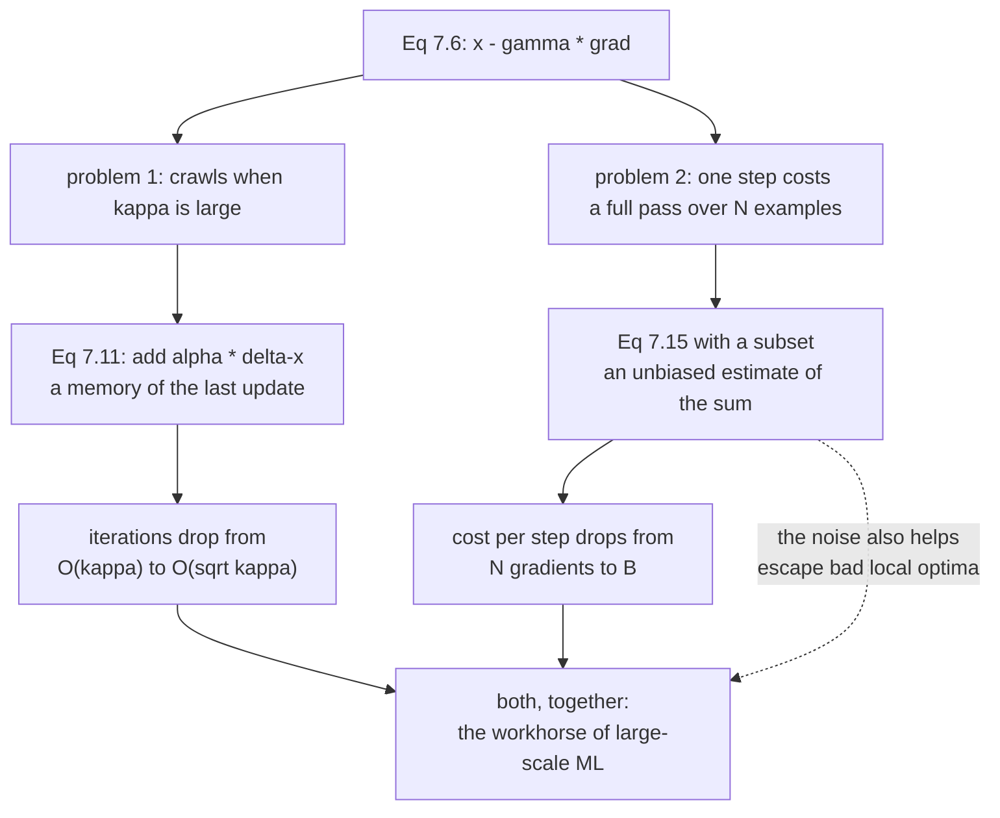

import DataCampExercise from "../../../../components/DataCampExercise.astro";
import Figure from "../../../../components/Figure.astro";
import Quiz from "../../../../components/Quiz.astro";
import DescentLab from "../../../../components/viz/math/DescentLab.tsx";

Page 701 left gradient descent with two specific injuries. It **crawls** when the problem is badly
conditioned — at $\kappa = 1000$ it was still $84\%$ wrong after a hundred thousand iterations. And it
is **expensive**, because Equation 7.15 sums a gradient over every training example before taking one
step.

This page is the two standard repairs. They are unrelated fixes to unrelated problems, and both are
one extra term.

## What you'll learn

- Equations 7.11 and 7.12, the momentum update, and why the book calls it "a gradient update with memory".
- That momentum is not a tweak: it changes the iteration count from $O(\kappa)$ to $O(\sqrt{\kappa})$ — measured at **71× fewer iterations** at $\kappa = 10^4$.
- The heavy-ball parameters a quadratic hands you for free, and the surprise that the resulting step size sits **16.3% above** the $2/L$ where plain descent diverges.
- That momentum has *two* failure modes at a fixed step size: too little diverges, too much oscillates.
- Equations 7.13–7.15 and the one property SGD actually needs: the mini-batch gradient must be **unbiased**, not accurate.
- Measured: at $B = 1$ a single-example gradient has a typical error **2.34× the norm of the true gradient** — and its mean over 3000 draws is right to $5 \times 10^{-2}$.
- Why the noise falls as $1/\sqrt{B}$ only once you include the finite-population correction, and why that forces it to hit **exactly zero** at $B = N$.

## Intuition: a heavy ball, and a cheap compass

**Momentum.** Roll a marble down the ravine of page 701 and it does what gradient descent does: hits a
wall, bounces back, hits the other wall. Now roll a **bowling ball**. It is reluctant to change
direction, so the sideways bounces partly cancel while the consistent downhill component accumulates.
The oscillation is averaged away and the useful signal survives. That is the whole idea, and the book
states it exactly this way — a heavy ball, and a moving average.

**Stochastic gradients.** You are still in fog, but now measuring the slope precisely means polling a
million sensors. Instead you poll thirty-two of them at random. The reading is noisy — genuinely, badly
noisy — but it is *not systematically wrong*, and it costs one thirty-thousandth as much. Take thirty
thousand cheap noisy steps instead of one careful step and you are further downhill.



The dashed edge is the accidental benefit. SGD's noise was introduced to save money, and it turned out
to help the optimisation escape shallow bad minima. The book is careful to present this as an observed
advantage rather than the design goal.

## §7.1.2 Momentum

### The update

$$
\mathbf{x}_{i+1} = \mathbf{x}_i - \gamma_i\big((\nabla f)(\mathbf{x}_i)\big)^\top + \alpha\,\Delta\mathbf{x}_i
$$

$$
\Delta\mathbf{x}_i = \mathbf{x}_i - \mathbf{x}_{i-1} = \alpha\,\Delta\mathbf{x}_{i-1} - \gamma_{i-1}\big((\nabla f)(\mathbf{x}_{i-1})\big)^\top
$$

with $\alpha \in [0, 1]$. Read the second line carefully, because it is where the memory lives:
$\Delta\mathbf{x}_i$ is literally the previous step taken, and it is itself built from the step before
that. Unrolling gives

$$
\Delta\mathbf{x}_i = -\gamma\sum_{j=0}^{i-1}\alpha^{\,j}\big((\nabla f)(\mathbf{x}_{i-1-j})\big)^\top
$$

an **exponentially weighted moving average** of every gradient seen so far, most recent weighted
heaviest. At $\alpha = 0$ the sum collapses to the current gradient and you are back to Equation 7.6.
At $\alpha = 0.9$ the effective averaging window is about $1/(1 - \alpha) = 10$ gradients.

Two things follow immediately:

- **Consistent directions accumulate.** If the gradient keeps pointing the same way, the geometric sum multiplies the effective step by up to $1/(1-\alpha)$.
- **Alternating directions cancel.** If the gradient flips sign every step — exactly the zigzag of page 701 — consecutive terms subtract.

So momentum does not damp everything equally. It damps *oscillation* and amplifies *drift*, which is
precisely the decomposition the eigendirections of a quadratic hand you.

### What it costs and what it buys

On a quadratic with eigenvalues in $[\mu, L]$ the optimal heavy-ball parameters are closed-form:

$$
\gamma^{\star} = \frac{4}{(\sqrt{\mu} + \sqrt{L})^2},
\qquad
\alpha^{\star} = \left(\frac{\sqrt{L} - \sqrt{\mu}}{\sqrt{L} + \sqrt{\mu}}\right)^{2}
$$

giving a convergence rate of $\dfrac{\sqrt{\kappa} - 1}{\sqrt{\kappa} + 1}$ against gradient descent's
$\dfrac{\kappa - 1}{\kappa + 1}$. **The $\kappa$ became a $\sqrt{\kappa}$.** That is the entire value
proposition, and on a problem with $\kappa = 10^4$ it is the difference between $93{,}837$ iterations
and $1{,}315$.

For Example 7.1's matrix, $\mu = 1.944615$ and $L = 20.055385$, so
$\gamma^{\star} = 0.115976$ and $\alpha^{\star} = 0.275732$.

:::caution[That step size is illegal for plain gradient descent]
$\gamma^{\star} = 0.115976$ is **$16.3\%$ larger** than the $2/L = 0.099724$ ceiling of page 701. Run
plain gradient descent at that step size and it diverges. Momentum does not merely tolerate a bigger
step — it *requires* one, and the memory term is what keeps the resulting overshoot bounded. Measured:
at $\gamma = 0.115976$, plain descent diverges, $\alpha = 0.165$ converges in $3900$ iterations, and
$\alpha = 0.28$ converges in $33$.
:::

This also means momentum has a **lower** stability bound, which is not how it is usually taught. At a
fixed step size above $2/L$, too *little* momentum diverges.

## §7.1.3 Stochastic Gradient Descent

### The objective is a sum

In machine learning the loss is almost always a sum over examples:

$$
L(\boldsymbol\theta) = \sum_{n=1}^{N} L_n(\boldsymbol\theta)
$$

The canonical instance is a negative log-likelihood, where independence across examples turns a product
into a sum (§0.3 — this is the same identity, doing real work):

$$
L(\boldsymbol\theta) = -\sum_{n=1}^{N}\log p(y_n \mid \mathbf{x}_n, \boldsymbol\theta)
$$

so the batch update is

$$
\boldsymbol\theta_{i+1} = \boldsymbol\theta_i - \gamma_i\big(\nabla L(\boldsymbol\theta_i)\big)^\top = \boldsymbol\theta_i - \gamma_i\sum_{n=1}^{N}\big(\nabla L_n(\boldsymbol\theta_i)\big)^\top
$$

Every single step requires $N$ gradient evaluations. At $N = 10^6$ that is a poor deal, since the step
you buy is no better than a step bought with $N = 32$.

### The one property that matters

Here is the book's key insight, and it is worth stating precisely because it is narrower than people
assume:

> for gradient descent to converge, we only require that the gradient is an **unbiased estimate** of the
> true gradient.

The sum $\sum_n \nabla L_n(\boldsymbol\theta_i)$ is itself an empirical estimate of an expectation
(§6.4.1). **Any** other unbiased estimate of that expectation will do — including one computed from a
random subset. Scaled correctly,

$$
\hat{\mathbf{g}}_B = \frac{N}{|B|}\sum_{n \in B}\big(\nabla L_n(\boldsymbol\theta)\big)^\top,
\qquad
\mathbb{E}[\hat{\mathbf{g}}_B] = \big(\nabla L(\boldsymbol\theta)\big)^\top
$$

Note what is **not** required: that $\hat{\mathbf{g}}_B$ be close to $\nabla L$. It can be enormously
wrong on any given draw. Bias breaks convergence; variance only slows it down. That asymmetry is the
whole design space of mini-batching.

:::tip[The N over |B| factor is not cosmetic]
Drop it and you are minimising $\frac{|B|}{N}L(\boldsymbol\theta)$ instead of $L(\boldsymbol\theta)$.
That has the same minimiser, so the fit still converges — but your step size is now silently scaled by
$|B|/N$, so changing the batch size changes the effective learning rate. Every "I changed the batch
size and it stopped training" bug is this factor.
:::

### Batch size, honestly

The book lays out both directions and neither dominates:

| | large mini-batch | small mini-batch |
| --- | --- | --- |
| gradient accuracy | high, low variance in the update | low, noisy |
| convergence | more stable | noisier |
| cost per step | higher | cheap |
| hardware | exploits vectorised matrix operations | leaves the GPU idle |
| bad local optima | can get stuck | **noise can escape them** |
| memory | may not fit in CPU/GPU | fits |

And the framing the book adds, which is the one worth remembering: **the goal is generalisation
(Chapter 8), not a precise minimum of the training objective.** If you do not need the exact
minimiser, paying for an exact gradient is waste.

:::tip[Convergence is still guaranteed]
With the learning rate decreased at an appropriate rate and mild assumptions, SGD converges **almost
surely** to a local minimum (Bottou, 1998). "Appropriate rate" is the classical Robbins–Monro
condition: the step sizes must sum to infinity so you can still travel any distance, while their
squares must sum to something finite so the noise is eventually damped.
:::

## Worked example by hand

Take Example 7.1's quadratic and run three momentum steps at $\gamma = 0.085$, $\alpha = 0.5$, from
$\mathbf{x}_0 = [-3, -1]^\top$. The gradient is $\mathbf{A}\mathbf{x} - \mathbf{b}$ as before.

**Step 1.** $\Delta\mathbf{x}_0 = \mathbf{0}$, since there is no previous step. So

$$
\Delta\mathbf{x}_1 = 0.5\cdot\mathbf{0} - 0.085\begin{bmatrix}-12\\-26\end{bmatrix} = \begin{bmatrix}1.02\\2.21\end{bmatrix},
\qquad
\mathbf{x}_1 = \begin{bmatrix}-1.98\\1.21\end{bmatrix}
$$

Identical to plain gradient descent. **The first momentum step is always the plain step**, because
there is nothing to remember yet. Useful as a sanity check on any implementation.

**Step 2.** The gradient at $\mathbf{x}_1$ is $[-7.75, 19.22]^\top$ from page 701. Now the memory
contributes:

$$
\Delta\mathbf{x}_2 = 0.5\begin{bmatrix}1.02\\2.21\end{bmatrix} - 0.085\begin{bmatrix}-7.75\\19.22\end{bmatrix} = \begin{bmatrix}0.51 + 0.65875\\1.105 - 1.6337\end{bmatrix} = \begin{bmatrix}1.16875\\-0.5287\end{bmatrix}
$$

$$
\mathbf{x}_2 = \begin{bmatrix}-1.98\\1.21\end{bmatrix} + \begin{bmatrix}1.16875\\-0.5287\end{bmatrix} = \begin{bmatrix}-0.81125\\0.6813\end{bmatrix}
$$

Compare against plain descent's $\mathbf{x}_2 = [-1.32125, -0.4237]^\top$. Two differences, both
diagnostic:

- **In $x_1$** — the direction that needs to travel far — momentum has moved to $-0.81$ where plain descent reached only $-1.32$. The consistent component was amplified.
- **In $x_2$** — the oscillating direction — momentum sits at $+0.68$ where plain descent overshot to $-0.42$. The memory of the previous $+2.21$ partially cancelled this step's $-1.63$, so the crossing was damped rather than completed.

That is the mechanism in two numbers: **amplify the drift, damp the oscillation.**

## See it move

Plain descent first, as the baseline, on the badly conditioned surface:

<DescentLab
  client:visible
  surface="ill-conditioned"
  method="gd"
  title="The baseline: no memory"
  desc="The iterates hop between the walls and creep along the floor. This is the run momentum is trying to beat."
/>

Now the same surface with a memory term:

<DescentLab
  client:visible
  surface="ill-conditioned"
  method="momentum"
  title="The same ravine, with momentum"
  desc="Watch the velocity readout rather than the position. The sideways component keeps reversing sign and averages toward zero; the along-the-valley component keeps its sign and accumulates."
/>

And the stochastic version, where the gradient itself is unreliable:

<DescentLab
  client:visible
  surface="quadratic"
  method="sgd"
  title="Descending on a noisy gradient"
  desc="Each step uses a corrupted gradient, so the path wanders and never quite settles. It still gets there, because the corruption has mean zero — that is the only property the convergence argument uses."
/>

The trade-off between the two knobs is worth playing with directly. In the sketch below, both the step
size and the momentum have their own stability limits, and the interesting region is where they
interact:

```p5 title="Two knobs, two stability limits" desc="Drag the step size and the momentum. The sketch runs Equation 7.11 on Example 7.1's quadratic and reports iterations to tolerance. The plain-descent ceiling and the heavy-ball optimum are both marked, and the region where momentum is REQUIRED rather than merely helpful is called out." height="480"
let g1000 = 116, a100 = 28;
let KNOBS = [], dragging = null;

const A11 = 2, A12 = 1, A22 = 20, B1 = 5, B2 = 3;
const MU = 1.944615, LMAX = 20.055385;
const CEIL = 2 / LMAX;
const GHB = 4 / Math.pow(Math.sqrt(MU) + Math.sqrt(LMAX), 2);
const AHB = Math.pow((Math.sqrt(LMAX) - Math.sqrt(MU)) / (Math.sqrt(LMAX) + Math.sqrt(MU)), 2);
const XS1 = 97 / 39, XS2 = 1 / 39;

function setup() { createCanvas(680, 480); textFont("monospace"); }

function knob(id, x, y, w, value, mn, mx, label) {
  KNOBS.push({ id, x, y, w, mn, mx });
  const t = (value - mn) / (mx - mn);
  stroke(60, 74, 92); strokeWeight(2); line(x, y, x + w, y);
  noStroke(); fill(255, 211, 67); ellipse(x + t * w, y, 12, 12);
  fill(190, 200, 212); textSize(12); textAlign(LEFT, CENTER);
  text(label, x + w + 12, y);
}
function knobHit(mx_, my_) {
  for (const k of KNOBS) {
    if (my_ > k.y - 13 && my_ < k.y + 13 && mx_ > k.x - 13 && mx_ < k.x + k.w + 13) return k;
  }
  return null;
}
function knobValue(k, mx_) {
  const t = Math.min(1, Math.max(0, (mx_ - k.x) / k.w));
  return Math.round(k.mn + t * (k.mx - k.mn));
}
function mousePressed() { dragging = knobHit(mouseX, mouseY); }
function mouseReleased() { dragging = null; }
function mouseDragged() {
  if (!dragging) return;
  const v = knobValue(dragging, mouseX);
  if (dragging.id === "g") g1000 = v;
  if (dragging.id === "a") a100 = v;
  if (!isLooping()) redraw();
}

function fval(x1, x2) { return x1 * x1 + x1 * x2 + 10 * x2 * x2 - 5 * x1 - 3 * x2; }

// Equations 7.11 and 7.12, returned as a path plus an iteration count.
function heavy(gamma, alpha, cap) {
  let x1 = -3, x2 = -1, d1 = 0, d2 = 0;
  const pts = [[x1, x2]];
  let hit = -1;
  for (let k = 1; k <= cap; k++) {
    d1 = alpha * d1 - gamma * (A11 * x1 + A12 * x2 - B1);
    d2 = alpha * d2 - gamma * (A12 * x1 + A22 * x2 - B2);
    x1 += d1; x2 += d2;
    if (!isFinite(x1) || !isFinite(x2) || Math.abs(x1) > 1e8) return { pts, k: -1 };
    if (pts.length < 260) pts.push([x1, x2]);
    if (hit < 0 && Math.hypot(x1 - XS1, x2 - XS2) < 1e-8) { hit = k; break; }
  }
  return { pts, k: hit };
}

const OX = 36, OY = 40, W = 400, H = 236;
const XLO = -4.4, XHI = 4.4, YLO = -2.5, YHI = 2.5;
function px(x) { return OX + ((x - XLO) / (XHI - XLO)) * W; }
function py(y) { return OY + H - ((y - YLO) / (YHI - YLO)) * H; }

function draw() {
  background(13, 17, 23);
  KNOBS = [];
  const gamma = g1000 / 1000, alpha = a100 / 100;

  noStroke();
  const nx = 80, ny = 47;
  for (let i = 0; i < nx; i++) {
    for (let j = 0; j < ny; j++) {
      const x = XLO + ((i + 0.5) / nx) * (XHI - XLO);
      const y = YLO + ((j + 0.5) / ny) * (YHI - YLO);
      const t = Math.min(1, Math.sqrt(Math.max(0, fval(x, y) + 6.25641)) / 11);
      fill(18 + 40 * t, 24 + 30 * t, 34 + 46 * t);
      rect(OX + (i / nx) * W, OY + H - ((j + 1) / ny) * H, W / nx + 1, H / ny + 1);
    }
  }
  noFill(); stroke(70, 86, 104); strokeWeight(1); rect(OX, OY, W, H);
  noStroke(); fill(120, 200, 140); ellipse(px(XS1), py(XS2), 11, 11);

  const res = heavy(gamma, alpha, 200000);
  stroke(res.k < 0 ? color(232, 110, 110) : color(255, 211, 67));
  strokeWeight(1.4); noFill();
  beginShape();
  for (const q of res.pts) {
    if (q[0] > XLO && q[0] < XHI && q[1] > YLO && q[1] < YHI) vertex(px(q[0]), py(q[1]));
  }
  endShape();

  // reference: plain descent at its own best step size
  const ref = heavy(2 / (MU + LMAX), 0, 200000);

  noStroke(); textAlign(LEFT, TOP);
  fill(255, 211, 67); textSize(15);
  text("gamma = " + gamma.toFixed(3) + "   alpha = " + alpha.toFixed(2), 452, 44);
  fill(150); textSize(11);
  text("plain ceiling 2/L  = " + CEIL.toFixed(6), 452, 70);
  text("heavy-ball gamma   = " + GHB.toFixed(6), 452, 86);
  text("heavy-ball alpha   = " + AHB.toFixed(6), 452, 102);
  fill(120);
  text("baseline: plain descent at", 452, 124);
  text("its own best step takes " + ref.k, 452, 138);

  fill(200); textSize(13);
  text("iterations to 1e-8:", 452, 168);
  fill(res.k < 0 ? color(232, 110, 110) : color(120, 200, 140)); textSize(20);
  text(res.k < 0 ? "diverged" : res.k, 452, 188);
  if (res.k > 0 && ref.k > 0) {
    fill(150); textSize(11);
    const r = ref.k / res.k;
    text(r >= 1 ? (r.toFixed(2) + "x faster than baseline")
                : ((1 / r).toFixed(2) + "x slower than baseline"), 452, 214);
  }

  let msg, sub, col;
  if (res.k < 0 && gamma > CEIL && alpha < 0.16) {
    col = color(232, 110, 110);
    msg = "too little momentum";
    sub = "this step size is past 2/L, so alpha must carry it. Raise alpha.";
  } else if (res.k < 0) {
    col = color(232, 110, 110);
    msg = "diverged";
    sub = gamma > CEIL ? "step past the plain ceiling and alpha cannot save it"
                       : "alpha at or above 1 never converges";
  } else if (gamma > CEIL) {
    col = color(197, 153, 255);
    msg = "converging on an ILLEGAL step size";
    sub = "plain descent diverges here. The memory term is doing the work.";
  } else if (alpha < 0.02) {
    col = color(150, 162, 176);
    msg = "no memory: this is Equation 7.6";
    sub = "the baseline. Everything else on this page is measured against it.";
  } else if (alpha > 0.85) {
    col = color(255, 211, 67);
    msg = "too much memory";
    sub = "the ball is so heavy it sails past and takes a long time to settle.";
  } else {
    col = color(120, 200, 140);
    msg = "converging";
    sub = "somewhere in the useful band";
  }
  stroke(col); strokeWeight(1.6); fill(red(col), green(col), blue(col), 26);
  rect(36, 300, 608, 68, 6);
  noStroke(); fill(col); textSize(18); textAlign(LEFT, TOP);
  text(msg, 52, 310);
  fill(215); textSize(12);
  text(sub, 52, 338);

  knob("g", 52, 398, 280, g1000, 5, 200, "gamma = " + gamma.toFixed(3));
  knob("a", 52, 426, 280, a100, 0, 99, "alpha = " + alpha.toFixed(2));
  const gx = (v) => 52 + ((v * 1000 - 5) / 195) * 280;
  stroke(232, 110, 110); strokeWeight(2); line(gx(CEIL), 388, gx(CEIL), 408);
  stroke(120, 200, 140); line(gx(GHB), 388, gx(GHB), 408);
  noStroke(); fill(232, 110, 110); textSize(10); textAlign(CENTER, BOTTOM);
  text("2/L", gx(CEIL), 388);
  fill(120, 200, 140);
  text("heavy ball", gx(GHB), 376);
  fill(120); textSize(11); textAlign(LEFT, TOP);
  text("try gamma = 0.116 with alpha = 0 (diverges), then raise alpha past 0.17.", 52, 452);
}
```

## From scratch

```python title="momentum.py" showLineNumbers{1}
import numpy as np

# Example 7.1's quadratic again, so momentum can be compared against page 701.
A = np.array([[2.0, 1.0], [1.0, 20.0]])
b = np.array([5.0, 3.0])
xstar = np.linalg.solve(A, b)
mu, L = np.linalg.eigvalsh(A)
x0 = np.array([-3.0, -1.0])

def grad(x):
    return A @ x - b

def run(gamma, alpha, tol=1e-8, cap=200_000):
    """Equations 7.11 and 7.12. alpha = 0 is plain gradient descent."""
    x, dx = x0.copy(), np.zeros_like(x0)
    for k in range(cap):
        if np.linalg.norm(x - xstar) < tol:
            return k
        dx = alpha * dx - gamma * grad(x)      # the remembered update
        x = x + dx
        if not np.all(np.isfinite(x)) or np.linalg.norm(x) > 1e12:
            return -1
    return cap

# --- the heavy-ball parameters a quadratic hands you -----------------------
g_hb = 4 / (np.sqrt(mu) + np.sqrt(L)) ** 2
a_hb = ((np.sqrt(L) - np.sqrt(mu)) / (np.sqrt(L) + np.sqrt(mu))) ** 2
print(f"kappa       = {L / mu:.6f}   sqrt(kappa) = {np.sqrt(L / mu):.6f}")
print(f"2/L ceiling = {2 / L:.6f}   <- plain descent dies above this")
print(f"heavy-ball  gamma = {g_hb:.6f}  alpha = {a_hb:.6f}")
print(f"that gamma is {100 * (g_hb / (2 / L) - 1):.1f}% ABOVE the plain ceiling")

print(f"\nplain descent at its own best step 2/(mu+L) = {2 / (mu + L):.6f}: "
      f"{run(2 / (mu + L), 0.0)} steps")
print(f"plain descent at the heavy-ball step        : "
      f"{'DIVERGES' if run(g_hb, 0.0) < 0 else run(g_hb, 0.0)}")
print(f"heavy ball  at the heavy-ball step          : {run(g_hb, a_hb)} steps")

# --- so how much momentum is right? ---------------------------------------
print("\n alpha     steps")
for alpha in (0.0, 0.10, 0.1650, 0.28, a_hb, 0.5, 0.9, 0.99, 1.0):
    k = run(g_hb, alpha)
    print(f" {alpha:.4f}   {'diverged' if k < 0 else k}")

# --- the scaling law, which is the real point ------------------------------
print("\n kappa       GD      HB    ratio   sqrt(kappa)")
for kappa in (10.0, 100.0, 1000.0, 10000.0):
    Ak, bk = np.diag([1.0, kappa]), np.zeros(2)
    zk, sk = np.zeros(2), np.array([1.0, 1.0])

    def go(gamma, alpha):
        x, dx = sk.copy(), np.zeros(2)
        for k in range(200_000):
            if np.linalg.norm(x - zk) < 1e-8:
                return k
            dx = alpha * dx - gamma * (Ak @ x - bk)
            x = x + dx
        return 200_000

    gk = 4 / (1.0 + np.sqrt(kappa)) ** 2
    ak = ((np.sqrt(kappa) - 1) / (np.sqrt(kappa) + 1)) ** 2
    n1, n2 = go(2 / (1 + kappa), 0.0), go(gk, ak)
    print(f" {kappa:>7.0f}  {n1:>7}  {n2:>6}  {n1 / n2:>7.2f}   {np.sqrt(kappa):>8.2f}")
```

```
kappa       = 10.313294   sqrt(kappa) = 3.211432
2/L ceiling = 0.099724   <- plain descent dies above this
heavy-ball  gamma = 0.115976  alpha = 0.275732
that gamma is 16.3% ABOVE the plain ceiling

plain descent at its own best step 2/(mu+L) = 0.090909: 104 steps
plain descent at the heavy-ball step        : DIVERGES
heavy ball  at the heavy-ball step          : 37 steps

 alpha     steps
 0.0000   diverged
 0.1000   diverged
 0.1650   3900
 0.2800   33
 0.2757   37
 0.5000   59
 0.9000   343
 0.9900   3421
 1.0000   200000

 kappa       GD      HB    ratio   sqrt(kappa)
      10       94      35     2.69       3.16
     100      939     119     7.89      10.00
    1000     9384     397    23.64      31.62
   10000    93837    1315    71.36      100.00
```

## On real data

<Figure
  src="/images/mml/momentum-and-stochastic-gradient-descent/momentum-beats-conditioning"
  alt="Two panels. Left, a log-log plot of iterations to tolerance against condition number for gradient descent and heavy ball, with dotted reference lines of slope kappa and slope root kappa that each curve follows. Right, the measured speedup factor against condition number, rising from about 1.7 at kappa equals 3 to 71 at kappa equals ten thousand, tracked by a dotted root kappa line."
  title="Momentum changes the complexity, not the constant"
  caption="Gradient descent needs iterations proportional to kappa; heavy ball needs root kappa. At kappa equals ten thousand that is 93837 iterations against 1315, a factor of 71. The reference lines are pure slopes anchored at the leftmost point, so the agreement is in the exponent."
/>

<Figure
  src="/images/mml/momentum-and-stochastic-gradient-descent/what-momentum-does-to-the-path"
  alt="Three panels. Left, the plain gradient descent path over elliptical contours taking 104 iterations. Middle, the heavy-ball path taking 37, annotated that its step size is 16.3 percent above 2 over L. Right, iterations against the momentum coefficient on a log scale, with a red band at low alpha marked as diverging and a minimum near 0.28."
  title="One extra term, and the step-size ceiling moves"
  caption="Momentum cuts 104 iterations to 37, and does it at a step size where plain descent diverges. At that step size too little momentum also diverges: the useful band runs from about 0.17 to 0.85 and its optimum is 0.28, not the popular default of 0.9."
/>

<Figure
  src="/images/mml/momentum-and-stochastic-gradient-descent/minibatch-noise"
  alt="Two panels. Left, the root-mean-square error of a mini-batch gradient against batch size on log-log axes, following a curve that combines one over root B with a finite-population factor and dropping to exactly zero at B equals N. Right, the bias of the mean over 3000 draws plotted against the spread of a single draw, the bias orders of magnitude smaller at every batch size."
  title="Unbiased is not the same as accurate"
  caption="At a batch size of one, a single gradient estimate has a typical error 2.34 times the norm of the true gradient, while the mean of 3000 such estimates is within 4.8 percent of it. Convergence needs the second property, not the first."
/>

## Reading the plot

**The first figure is the argument for momentum, and it is an argument about exponents.** Both curves
are straight on log-log axes, which means both are power laws in $\kappa$, and the dotted reference
lines are pure slopes $\kappa$ and $\sqrt{\kappa}$ anchored at the leftmost measured point. Neither
line is fitted. Gradient descent tracks the first, heavy ball the second, across four decades.

The right panel converts that into the number you would care about in practice. The speedup is a
modest $1.65\times$ at $\kappa = 3$ — momentum is nearly pointless on a well-conditioned problem — and
grows to $71\times$ at $\kappa = 10^4$. So momentum is not a general accelerator. **It is a
conditioning fix**, and its value is precisely proportional to how badly conditioned your problem is.
That is the honest way to decide whether to reach for it.

**The second figure has the fact I did not expect.** The middle panel's step size, $0.115976$, is
$16.3\%$ *above* the $2/L = 0.099724$ that page 701 established as the hard ceiling for plain gradient
descent. Plain descent diverges there — measured, not asserted. Yet with $\alpha = 0.275732$ the same
step size converges in $37$ iterations.

The reason is that the heavy-ball recursion has a different characteristic polynomial. For plain
descent, mode $\lambda$ contracts by $|1 - \gamma\lambda|$, a single factor that must be under one. For
momentum the mode satisfies a **second-order** recursion whose two roots multiply to $\alpha$, and when
they are complex their common modulus is exactly $\sqrt{\alpha}$ — independent of $\lambda$. So the
whole spectrum contracts at one rate, and $\gamma$ is free to be large enough to push every mode into
the complex regime. That is what "the memory keeps the overshoot bounded" means mechanically: the
overshoot is still there, it is just rotating rather than growing.

The right panel is the consequence, and it is the part usually taught backwards. At that step size,
momentum has a **lower** bound as well as an upper one: below $\alpha \approx 0.17$ the run diverges,
because without enough memory the too-large step is simply a too-large step. Above $\alpha \approx
0.85$ it converges but slowly — $343$ iterations at $0.9$, $3421$ at $0.99$ — because the ball is now
so heavy it takes hundreds of steps to stop. The optimum is $0.28$. **The default $\alpha = 0.9$ that
everyone reaches for is $10\times$ worse than the optimum on this problem**, and it is $10\times$
better than $0.99$; it is a reasonable compromise for problems whose $\kappa$ you do not know, not a
good value for one you do.

**The third figure is the load-bearing claim of SGD, isolated.** Look at $B = 1$ on the right panel and
read the two curves against each other. The red point says the typical error of a single-example
gradient is $2.342$ times the *norm of the entire true gradient* — the estimate is not slightly noisy,
it points a substantially different direction with a substantially different length. The green point
says that averaging $3000$ of those estimates lands within $4.8\%$, and the residual is sampling error
in my $3000$ draws, not bias. **These two facts coexist, and only the second one is required.**

The left panel shows how the noise falls, and it needed a correction I initially got wrong. A naive
$1/\sqrt{B}$ line does not fit: at $B = 1024$ out of $N = 2000$ the measured spread is $45\times$
smaller than at $B = 1$, where $1/\sqrt{B}$ predicts only $32\times$. The dashed curve includes the
finite-population factor $\sqrt{(N - B)/(N - 1)}$, which arises because sampling is **without
replacement**, and it fits. That factor is also what makes the endpoint sensible: at $B = N$ the noise
is exactly $0.000$, not merely small, because a full batch is not a very good sample of the population —
it *is* the population. Any account of mini-batch noise that predicts small-but-nonzero error at
$B = N$ has the wrong sampling model.

:::tip[From the book]
This page covers **§7.1.2** and **§7.1.3** of *Mathematics for Machine Learning* by Deisenroth, Faisal
and Ong (draft of 2019-12-11). Equations **7.11** and **7.12** are the momentum update and the
remembered increment $\Delta\mathbf{x}_i$, with $\alpha \in [0,1]$; momentum is credited to Rumelhart
et al. (1986), and the book points at Goh (2017) for an intuitive treatment. Equation **7.13** is the
loss as a sum over examples, **7.14** the negative log-likelihood instance, and **7.15** the batch
parameter update. The unbiasedness argument refers back to §6.4.1 on expected values; almost-sure
convergence under a decreasing learning rate is Bottou (1998). The mini-batch size trade-offs, the
"noise can escape bad local optima" observation, and the framing that machine learning does not need a
precise minimum are all the book's, as is the list of large-scale applications (Dean et al., 2012;
Hoffman et al., 2013; Mnih et al., 2015; Hensman et al., 2013; Gal et al., 2014; Bottou et al., 2018).
The heavy-ball formulas $\gamma^\star$ and $\alpha^\star$, the $\sqrt{\kappa}$ rate, the measurement
that $\gamma^\star$ exceeds $2/L$, the momentum lower bound, and the finite-population correction are
this module's additions.
:::

## Pitfalls

:::danger[Assuming momentum only ever helps]
At a step size above $2/L$, **too little momentum diverges**. Measured at $\gamma = 0.115976$:
$\alpha = 0.10$ diverges, $\alpha = 0.165$ converges in $3900$ iterations, $\alpha = 0.28$ in $33$.
Momentum has a stability *interval*, not just an upper limit, and "turn momentum down until it is
stable" is exactly the wrong debugging move in that regime.
:::

:::caution[Using alpha = 0.9 because everyone does]
On Example 7.1 the optimum is $\alpha = 0.28$, taking $33$ iterations. $\alpha = 0.9$ takes $343$ — a
factor of $10$. The right $\alpha$ depends on $\kappa$ through
$\big((\sqrt{L}-\sqrt{\mu})/(\sqrt{L}+\sqrt{\mu})\big)^2$, so a well-conditioned problem wants *low*
momentum. $0.9$ is a reasonable hedge when you do not know $\kappa$, not a good value when you do.
:::

:::danger[Dropping the N over |B| scaling in a mini-batch gradient]
Without it you are minimising $\frac{|B|}{N}L(\boldsymbol\theta)$. The minimiser is unchanged, so the
run still converges and nothing looks broken — but the effective learning rate is now tied to the
batch size. Change the batch size and you have silently changed the step size, which is why this bug
presents as "training worked at batch 32 and diverged at batch 256".
:::

:::caution[Expecting mini-batch noise to keep shrinking as B approaches N]
It does not shrink smoothly to something small; it hits **exactly zero** at $B = N$. Sampling without
replacement carries the factor $\sqrt{(N-B)/(N-1)}$, so the last few batch sizes lose noise much faster
than $1/\sqrt{B}$ suggests. At $B = 1024$ of $N = 2000$ the measured improvement over $B = 1$ was
$45\times$, where $1/\sqrt{B}$ alone predicts $32\times$.
:::

:::caution[Confusing "unbiased" with "accurate"]
At $B = 1$ the typical single-example gradient is $2.34\times$ the size of the true gradient and points
elsewhere. That is fine. Bias is what breaks convergence; variance only slows it. Conversely, a
low-variance but *biased* estimator — a fixed subset of the data, say, or a gradient with a
systematically clipped component — will converge smoothly to the wrong answer, which is far harder to
notice than noise.
:::

:::caution[Reading momentum as a bigger learning rate]
The unrolled form multiplies a *consistent* gradient by up to $1/(1-\alpha)$, which does look like a
step-size increase. But it multiplies an *alternating* gradient by less than one. Replacing
$(\gamma, \alpha)$ with $(\gamma/(1-\alpha), 0)$ keeps the first behaviour and loses the second, and on
Example 7.1 at the heavy-ball parameters that substitution gives a step size of $0.160$ — well past
$2/L$, and it diverges.
:::

## Compare

| | plain descent | momentum | stochastic descent |
| --- | --- | --- | --- |
| equation | 7.6 | 7.11 and 7.12 | 7.15 with a subset |
| extra state | none | one vector, $\Delta\mathbf{x}$ | none |
| extra hyperparameter | none | $\alpha$ | batch size $\lvert B\rvert$ |
| fixes | — | slow convergence when $\kappa$ is large | cost per step |
| iterations on a quadratic | $O(\kappa)$ | $O(\sqrt{\kappa})$ | $O(\kappa)$, but cheap ones |
| gradient per step | exact, $N$ evaluations | exact, $N$ evaluations | noisy, $\lvert B\rvert$ evaluations |
| step-size limit | $\gamma < 2/L$ | can exceed $2/L$ | needs $\gamma_i \to 0$ |
| can escape a bad local minimum | no | rarely | **sometimes**, via the noise |

| $\alpha$ at $\gamma = 0.115976$ | iterations | reading |
| --- | --- | --- |
| $0.00$ | diverges | this is plain descent above its ceiling |
| $0.10$ | diverges | not enough memory to bound the overshoot |
| $0.165$ | $3900$ | just inside the lower stability bound |
| $\mathbf{0.28}$ | $\mathbf{33}$ | measured optimum |
| $0.2757$ | $37$ | the closed-form $\alpha^\star$ |
| $0.50$ | $59$ | still fine |
| $0.90$ | $343$ | the popular default, $10\times$ off here |
| $0.99$ | $3421$ | far too heavy |
| $1.00$ | never | $\alpha$ must be strictly below $1$ |

<Quiz
  title="Do you know what each extra term is for?"
  questions={[
    {
      q: "What does momentum change about gradient descent's convergence on a quadratic?",
      options: [
        "The constant factor, giving a modest speedup at every condition number",
        "The exponent: iterations go from proportional to kappa to proportional to the square root of kappa",
        "It guarantees the global minimum rather than a local one",
        "It removes the need to choose a step size",
      ],
      answer: 1,
      explain:
        "Measured across four decades: at kappa = 3 the speedup is only 1.65 times, at kappa = 10000 it is 71 times. Momentum is a conditioning fix, and its value is proportional to how badly conditioned the problem is — which is also why it is nearly pointless on a well-conditioned one.",
    },
    {
      q: "The heavy-ball step size for Example 7.1 is 0.115976, which is above the 2/L = 0.099724 ceiling from page 701. What happens?",
      options: [
        "It diverges, since 2/L is a hard limit for any first-order method",
        "It converges in 37 iterations, because the momentum recursion has a different stability condition",
        "It converges only because the objective is a quadratic",
        "The ceiling formula 2/L was wrong",
      ],
      answer: 1,
      explain:
        "Plain descent does diverge at that step size — measured. Momentum's modes satisfy a second-order recursion whose two roots multiply to alpha, so when they go complex their modulus is root alpha regardless of the eigenvalue. The overshoot is still there; it rotates instead of growing.",
    },
    {
      q: "At gamma = 0.115976, what happens if you set alpha = 0.10?",
      options: [
        "It converges slowly, since less momentum is always safer",
        "It diverges: below about 0.17 there is not enough memory to bound the overshoot at that step size",
        "It behaves identically to alpha = 0.28",
        "It converges faster, because less momentum means less overshoot",
      ],
      answer: 1,
      explain:
        "Momentum has a stability interval at a fixed step size, not just an upper bound. This makes 'turn momentum down until it stabilises' precisely the wrong move above 2/L, which is the regime momentum exists to let you use.",
    },
    {
      q: "What property must a mini-batch gradient have for SGD to converge?",
      options: [
        "It must be close to the true gradient",
        "It must be an unbiased estimate of the true gradient; accuracy is not required",
        "It must have variance below a fixed threshold",
        "It must use at least the square root of N examples",
      ],
      answer: 1,
      explain:
        "At a batch size of one, the measured typical error is 2.34 times the norm of the whole true gradient — the estimate is badly wrong on any given draw — while its mean over 3000 draws is within 4.8 percent. Bias breaks convergence; variance only slows it. A low-variance biased estimator is the more dangerous failure, since it converges smoothly to the wrong answer.",
    },
    {
      q: "Why does mini-batch gradient noise reach exactly zero at B = N rather than merely getting small?",
      options: [
        "Floating-point rounding happens to cancel at full batch",
        "Because sampling is without replacement, so the finite-population factor root of (N-B)/(N-1) is zero there",
        "Because the 1/root-B law breaks down for large B",
        "It does not; the noise is small but nonzero at B = N",
      ],
      answer: 1,
      explain:
        "A full batch is not a very good sample of the population, it IS the population, so there is nothing left to be uncertain about. The same factor explains why the measured improvement at B = 1024 of N = 2000 was 45 times rather than the 32 times that 1/root-B alone predicts.",
    },
  ]}
/>

## 🧪 Try It Yourself

### Exercise 1 – Equations 7.11 and 7.12, from scratch

<DataCampExercise
  lang="python"
  hint={`The remembered increment is dx = alpha * dx - gamma * grad(x), and then x = x + dx. Note dx starts at zero.`}
  code={`import numpy as np

A = np.array([[2.0, 1.0], [1.0, 20.0]])
b = np.array([5.0, 3.0])
x0 = np.array([-3.0, -1.0])
gamma = 0.085

for alpha in (0.0, 0.5, 0.9):
    x, dx = x0.copy(), np.zeros(2)
    pts = [x.copy()]
    for _ in range(3):
        # Task: Equation 7.12, the remembered increment.
        dx = ___ * dx - gamma * (A @ x - b)
        x = x + dx
        pts.append(x.copy())
    flat = ", ".join(f"[{q[0]:+.4f}, {q[1]:+.4f}]" for q in pts)
    print(f"alpha = {alpha:<4} {flat}")
print("alpha = 0 must reproduce page 701's x1 = [-1.9800, +1.2100]")

# -- Expected output ------------------------------
# alpha = 0.0  [-3.0000, -1.0000], [-1.9800, +1.2100], [-1.3213, -0.4237], [-0.6356, +0.6639]
# alpha = 0.5  [-3.0000, -1.0000], [-1.9800, +1.2100], [-0.8112, +0.6813], [+0.2781, -0.4173]
# alpha = 0.9  [-3.0000, -1.0000], [-1.9800, +1.2100], [-0.4032, +1.5653], [+1.3763, -0.4867]
# alpha = 0 must reproduce page 701's x1 = [-1.9800, +1.2100]
# -------------------------------------------------`}
  solution={`import numpy as np
A = np.array([[2.0, 1.0], [1.0, 20.0]])
b = np.array([5.0, 3.0])
x0 = np.array([-3.0, -1.0])
gamma = 0.085
for alpha in (0.0, 0.5, 0.9):
    x, dx = x0.copy(), np.zeros(2)
    pts = [x.copy()]
    for _ in range(3):
        dx = alpha * dx - gamma * (A @ x - b)
        x = x + dx
        pts.append(x.copy())
    flat = ", ".join(f"[{q[0]:+.4f}, {q[1]:+.4f}]" for q in pts)
    print(f"alpha = {alpha:<4} {flat}")
print("alpha = 0 must reproduce page 701's x1 = [-1.9800, +1.2100]")`}
  sct={`test_output_contains("alpha = 0.0  [-3.0000, -1.0000], [-1.9800, +1.2100]")
test_output_contains("alpha = 0.9  [-3.0000, -1.0000], [-1.9800, +1.2100], [-0.4032, +1.5653]")
success_msg("Every row starts identically: the FIRST momentum step is always the plain step, because there is nothing remembered yet. That is the cheapest sanity check there is on a momentum implementation. From the second step on, notice the x1 component travelling further as alpha grows while the x2 component stops crossing zero.")`}
  height={250}
/>

### Exercise 2 – The parameters a quadratic hands you

<DataCampExercise
  lang="python"
  hint={`gamma is 4 over (sqrt(mu) + sqrt(L)) squared. Both roots, then square the sum.`}
  code={`import numpy as np

A = np.array([[2.0, 1.0], [1.0, 20.0]])
b = np.array([5.0, 3.0])
xstar = np.linalg.solve(A, b)
mu, L = np.linalg.eigvalsh(A)
x0 = np.array([-3.0, -1.0])

def run(gamma, alpha, tol=1e-8, cap=200_000):
    x, dx = x0.copy(), np.zeros(2)
    for k in range(cap):
        if np.linalg.norm(x - xstar) < tol:
            return k
        dx = alpha * dx - gamma * (A @ x - b)
        x = x + dx
        if not np.all(np.isfinite(x)) or np.linalg.norm(x) > 1e12:
            return -1
    return cap

# Task: the heavy-ball step size.
g_hb = ___
a_hb = ((np.sqrt(L) - np.sqrt(mu)) / (np.sqrt(L) + np.sqrt(mu))) ** 2

print(f"mu = {mu:.6f}   L = {L:.6f}")
print(f"gamma = 4/(sqrt(mu)+sqrt(L))^2 = {g_hb:.6f}")
print(f"alpha = ((sqrt(L)-sqrt(mu))/(sqrt(L)+sqrt(mu)))^2 = {a_hb:.6f}")
print(f"plain ceiling 2/L = {2 / L:.6f}")
print(f"heavy-ball gamma exceeds it by {100 * (g_hb / (2 / L) - 1):.1f} percent")
print(f"plain descent there: {'diverges' if run(g_hb, 0.0) < 0 else 'converges'}")
print(f"heavy ball there   : {run(g_hb, a_hb)} steps")

# -- Expected output ------------------------------
# mu = 1.944615   L = 20.055385
# gamma = 4/(sqrt(mu)+sqrt(L))^2 = 0.115976
# alpha = ((sqrt(L)-sqrt(mu))/(sqrt(L)+sqrt(mu)))^2 = 0.275732
# plain ceiling 2/L = 0.099724
# heavy-ball gamma exceeds it by 16.3 percent
# plain descent there: diverges
# heavy ball there   : 37 steps
# -------------------------------------------------`}
  solution={`import numpy as np
A = np.array([[2.0, 1.0], [1.0, 20.0]])
b = np.array([5.0, 3.0])
xstar = np.linalg.solve(A, b)
mu, L = np.linalg.eigvalsh(A)
x0 = np.array([-3.0, -1.0])
def run(gamma, alpha, tol=1e-8, cap=200_000):
    x, dx = x0.copy(), np.zeros(2)
    for k in range(cap):
        if np.linalg.norm(x - xstar) < tol:
            return k
        dx = alpha * dx - gamma * (A @ x - b)
        x = x + dx
        if not np.all(np.isfinite(x)) or np.linalg.norm(x) > 1e12:
            return -1
    return cap
g_hb = 4 / (np.sqrt(mu) + np.sqrt(L)) ** 2
a_hb = ((np.sqrt(L) - np.sqrt(mu)) / (np.sqrt(L) + np.sqrt(mu))) ** 2
print(f"mu = {mu:.6f}   L = {L:.6f}")
print(f"gamma = 4/(sqrt(mu)+sqrt(L))^2 = {g_hb:.6f}")
print(f"alpha = ((sqrt(L)-sqrt(mu))/(sqrt(L)+sqrt(mu)))^2 = {a_hb:.6f}")
print(f"plain ceiling 2/L = {2 / L:.6f}")
print(f"heavy-ball gamma exceeds it by {100 * (g_hb / (2 / L) - 1):.1f} percent")
print(f"plain descent there: {'diverges' if run(g_hb, 0.0) < 0 else 'converges'}")
print(f"heavy ball there   : {run(g_hb, a_hb)} steps")`}
  sct={`test_output_contains("gamma = 4/(sqrt(mu)+sqrt(L))^2 = 0.115976")
test_output_contains("heavy-ball gamma exceeds it by 16.3 percent")
success_msg("The heavy-ball step size is 16.3 percent past the ceiling where plain descent blows up, and momentum converges there in 37 iterations against plain descent's best of 104. Momentum does not merely tolerate a bigger step — it needs one.")`}
  height={310}
/>

### Exercise 3 – Too little momentum is also fatal

<DataCampExercise
  hint={`Reuse the run() function. The point is that the diverging values are the SMALL ones, not the large ones.`}
  lang="python"
  code={`import numpy as np

A = np.array([[2.0, 1.0], [1.0, 20.0]])
b = np.array([5.0, 3.0])
xstar = np.linalg.solve(A, b)
mu, L = np.linalg.eigvalsh(A)
x0 = np.array([-3.0, -1.0])
g_hb = 4 / (np.sqrt(mu) + np.sqrt(L)) ** 2

def run(gamma, alpha, tol=1e-8, cap=200_000):
    x, dx = x0.copy(), np.zeros(2)
    for k in range(cap):
        if np.linalg.norm(x - xstar) < tol:
            return k
        # Task: the momentum term remembers the PREVIOUS increment.
        dx = alpha * ___ - gamma * (A @ x - b)
        x = x + dx
        if not np.all(np.isfinite(x)) or np.linalg.norm(x) > 1e12:
            return -1
    return cap

print(" alpha      steps")
for alpha in (0.05, 0.15, 0.165, 0.28, 0.6, 0.99, 1.0):
    k = run(g_hb, alpha)
    print(f" {alpha:<7.3f}  {'diverged' if k < 0 else k}")

# -- Expected output ------------------------------
#  alpha      steps
#  0.050    diverged
#  0.150    diverged
#  0.165    3900
#  0.280    33
#  0.600    76
#  0.990    3421
#  1.000    200000
# -------------------------------------------------`}
  solution={`import numpy as np
A = np.array([[2.0, 1.0], [1.0, 20.0]])
b = np.array([5.0, 3.0])
xstar = np.linalg.solve(A, b)
mu, L = np.linalg.eigvalsh(A)
x0 = np.array([-3.0, -1.0])
g_hb = 4 / (np.sqrt(mu) + np.sqrt(L)) ** 2
def run(gamma, alpha, tol=1e-8, cap=200_000):
    x, dx = x0.copy(), np.zeros(2)
    for k in range(cap):
        if np.linalg.norm(x - xstar) < tol:
            return k
        dx = alpha * dx - gamma * (A @ x - b)
        x = x + dx
        if not np.all(np.isfinite(x)) or np.linalg.norm(x) > 1e12:
            return -1
    return cap
print(" alpha      steps")
for alpha in (0.05, 0.15, 0.165, 0.28, 0.6, 0.99, 1.0):
    k = run(g_hb, alpha)
    print(f" {alpha:<7.3f}  {'diverged' if k < 0 else k}")`}
  sct={`test_output_contains("0.150    diverged")
test_output_contains("0.280    33")
success_msg("Read the table shape: diverges below 0.165, optimal at 0.28, degrades to 3421 by 0.99, and never converges at 1.0. Momentum has a stability INTERVAL at a fixed step size. So 'reduce momentum until it stabilises' is the wrong instinct in exactly the regime momentum exists for.")`}
  height={280}
/>

### Exercise 4 – Unbiased, and yet enormous

<DataCampExercise
  lang="python"
  hint={`The scaling factor is N over the batch size, so the estimate targets the SUM over all N examples rather than the mean.`}
  code={`import numpy as np

rng = np.random.default_rng(0)
N, D = 2000, 5
X = rng.standard_normal((N, D))
w = rng.standard_normal(D)
y = X @ w + 0.5 * rng.standard_normal(N)
theta = rng.standard_normal(D)
g_full = 2 * X.T @ (X @ theta - y)
print(f"||full gradient|| = {np.linalg.norm(g_full):.2f}")

print(f"\\n{'B':>6} {'sd/||g||':>10} {'bias/||g||':>12}")
for bsz in (1, 16, 256, 2000):
    trials = 3000
    acc, sq = np.zeros(D), 0.0
    for _ in range(trials):
        idx = rng.choice(N, bsz, replace=False)
        # Task: rescale so this estimates the SUM over all N, not the subset sum.
        gb = 2 * (___) * X[idx].T @ (X[idx] @ theta - y[idx])
        acc += gb
        sq += np.linalg.norm(gb - g_full) ** 2
    sd = np.sqrt(sq / trials)
    bias = np.linalg.norm(acc / trials - g_full)
    print(f"{bsz:>6} {sd / np.linalg.norm(g_full):>10.3f} "
          f"{bias / np.linalg.norm(g_full):>12.2e}")

# -- Expected output ------------------------------
# ||full gradient|| = 14884.88
#
#      B   sd/||g||   bias/||g||
#      1      2.342     4.77e-02
#     16      0.600     8.62e-03
#    256      0.143     2.46e-03
#   2000      0.000     4.90e-14
# -------------------------------------------------`}
  solution={`import numpy as np
rng = np.random.default_rng(0)
N, D = 2000, 5
X = rng.standard_normal((N, D))
w = rng.standard_normal(D)
y = X @ w + 0.5 * rng.standard_normal(N)
theta = rng.standard_normal(D)
g_full = 2 * X.T @ (X @ theta - y)
print(f"||full gradient|| = {np.linalg.norm(g_full):.2f}")
print(f"\\n{'B':>6} {'sd/||g||':>10} {'bias/||g||':>12}")
for bsz in (1, 16, 256, 2000):
    trials = 3000
    acc, sq = np.zeros(D), 0.0
    for _ in range(trials):
        idx = rng.choice(N, bsz, replace=False)
        gb = 2 * (N / bsz) * X[idx].T @ (X[idx] @ theta - y[idx])
        acc += gb
        sq += np.linalg.norm(gb - g_full) ** 2
    sd = np.sqrt(sq / trials)
    bias = np.linalg.norm(acc / trials - g_full)
    print(f"{bsz:>6} {sd / np.linalg.norm(g_full):>10.3f} "
          f"{bias / np.linalg.norm(g_full):>12.2e}")`}
  sct={`test_output_contains("1      2.342")
test_output_contains("2000      0.000")
success_msg("At B = 1 a single gradient is 2.34 times the size of the entire true gradient and points somewhere else — and the average of 3000 of them is right to 4.8 percent. That gap is why SGD works. Note also the last row: at B = N the spread is exactly zero, because sampling without replacement at full size returns the population itself.")`}
  height={330}
/>

### Exercise 5 – O(kappa) against O(root kappa)

<DataCampExercise
  lang="python"
  hint={`For the diagonal matrix diag(1, kappa) the eigenvalues are 1 and kappa, so mu = 1 and L = kappa. Substitute into the two closed forms.`}
  code={`import numpy as np

print(f"{'kappa':>7} {'GD':>8} {'HB':>7} {'ratio':>7} {'sqrt(kappa)':>12}")
for kappa in (10.0, 100.0, 1000.0):
    Ak, zk, sk = np.diag([1.0, kappa]), np.zeros(2), np.array([1.0, 1.0])

    def go(g, a):
        x, dx = sk.copy(), np.zeros(2)
        for k in range(200_000):
            if np.linalg.norm(x - zk) < 1e-8:
                return k
            dx = a * dx - g * (Ak @ x)
            x = x + dx
        return 200_000

    # Task: mu = 1 here, so fill in the heavy-ball momentum coefficient.
    gk = 4 / (1.0 + np.sqrt(kappa)) ** 2
    ak = ___
    n1, n2 = go(2 / (1 + kappa), 0.0), go(gk, ak)
    print(f"{kappa:>7.0f} {n1:>8} {n2:>7} {n1 / n2:>7.2f} {np.sqrt(kappa):>12.2f}")

# -- Expected output ------------------------------
#   kappa       GD      HB   ratio  sqrt(kappa)
#      10       94      35    2.69         3.16
#     100      939     119    7.89        10.00
#    1000     9384     397   23.64        31.62
# -------------------------------------------------`}
  solution={`import numpy as np
print(f"{'kappa':>7} {'GD':>8} {'HB':>7} {'ratio':>7} {'sqrt(kappa)':>12}")
for kappa in (10.0, 100.0, 1000.0):
    Ak, zk, sk = np.diag([1.0, kappa]), np.zeros(2), np.array([1.0, 1.0])
    def go(g, a):
        x, dx = sk.copy(), np.zeros(2)
        for k in range(200_000):
            if np.linalg.norm(x - zk) < 1e-8:
                return k
            dx = a * dx - g * (Ak @ x)
            x = x + dx
        return 200_000
    gk = 4 / (1.0 + np.sqrt(kappa)) ** 2
    ak = ((np.sqrt(kappa) - 1) / (np.sqrt(kappa) + 1)) ** 2
    n1, n2 = go(2 / (1 + kappa), 0.0), go(gk, ak)
    print(f"{kappa:>7.0f} {n1:>8} {n2:>7} {n1 / n2:>7.2f} {np.sqrt(kappa):>12.2f}")`}
  sct={`test_output_contains("1000     9384     397")
success_msg("Each tenfold rise in kappa multiplies the gradient descent count by ten and the heavy-ball count by about three — which is the square root. The ratio column tracks the last column, and that agreement across decades is the whole claim.")`}
  height={280}
/>

## Recall card

- **Equation 7.11 adds one term:** plus alpha times the previous increment. Equation 7.12 says that increment is itself alpha times the one before, minus gamma times the old gradient — so it is an exponentially weighted moving average of every gradient so far.
- **The first momentum step is always the plain step**, since there is nothing remembered yet. Cheapest possible sanity check on an implementation.
- **Momentum amplifies drift and damps oscillation.** A consistent gradient gets multiplied by up to 1/(1-alpha); an alternating one partly cancels. It is not a uniform step-size increase.
- **The complexity changes, not the constant:** O(kappa) becomes O(sqrt kappa). Measured speedup 1.65x at kappa = 3, 71x at kappa = 10000. Momentum is a conditioning fix, worth reaching for exactly in proportion to how bad kappa is.
- **Closed forms on a quadratic:** gamma = 4/(sqrt(mu)+sqrt(L))^2 and alpha = ((sqrt(L)-sqrt(mu))/(sqrt(L)+sqrt(mu)))^2, giving rate (sqrt(kappa)-1)/(sqrt(kappa)+1).
- **That gamma is ILLEGAL for plain descent.** On Example 7.1 it is 0.115976, which is 16.3 percent above 2/L = 0.099724, where plain descent diverges. Momentum needs the bigger step, it does not merely survive it.
- **Momentum has a lower stability bound too.** At that gamma, alpha = 0.10 diverges, 0.165 takes 3900 iterations, 0.28 takes 33, 0.9 takes 343, and alpha = 1 never converges. "Turn momentum down to stabilise" is backwards above 2/L.
- **alpha = 0.9 is a hedge, not an optimum.** On Example 7.1 the best is 0.28 and 0.9 is ten times worse. The right value depends on kappa.
- **SGD needs UNBIASED, not accurate.** At B = 1 the typical single gradient is 2.34 times the norm of the true gradient; its mean over 3000 draws is right to 4.8 percent. Bias breaks convergence, variance only slows it.
- **Keep the N/|B| scaling.** Without it you minimise |B|/N times the loss: same minimiser, but the effective step size is now tied to the batch size, which is why changing the batch size appears to break training.
- **Mini-batch noise falls as 1/sqrt(B) times sqrt((N-B)/(N-1)).** The second factor is why noise hits exactly zero at B = N, and why the measured gain at B = 1024 of 2000 was 45x rather than 32x.
- **Small batches have a bonus and a cost:** the noise can escape shallow bad optima, and it leaves vectorised hardware idle. The book's framing is that generalisation, not a precise training minimum, is the goal — so an exact gradient is often waste.

**Next:** constraints. What changes when the answer is not allowed to be anywhere it likes. **[Constrained Optimization and Lagrange Multipliers](../constrained-optimization-and-lagrange-multipliers/)**
