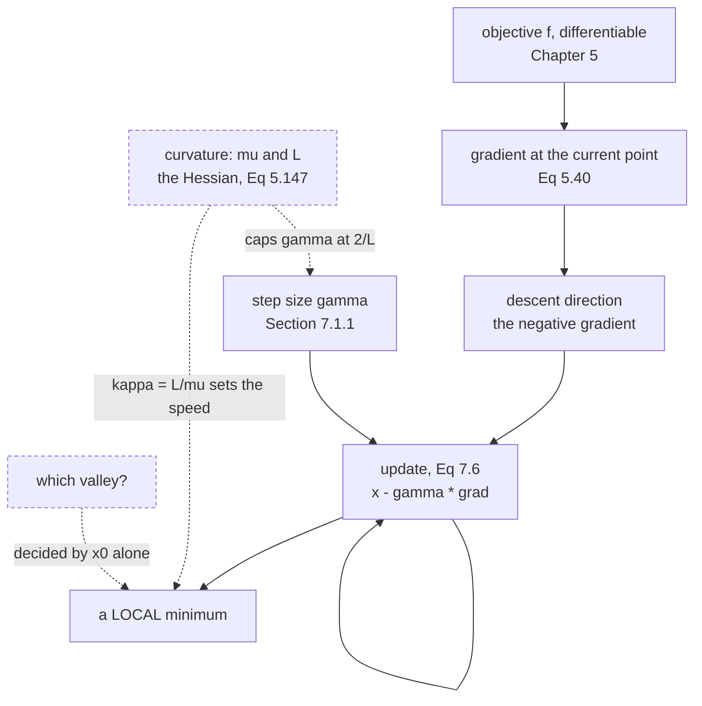

Every training loop in the second half of this book is a variation on one line:

$$
\mathbf{x}_{i+1} = \mathbf{x}_i - \gamma_i\big((\nabla f)(\mathbf{x}_i)\big)^\top
$$

That is it. Chapter 5 built the $\nabla f$; this page is about the $\gamma_i$, and about what
the line can and cannot promise. The short version: it always goes downhill, it never tells you which
valley you are in, and there are two ways to choose $\gamma$ badly for every one way to choose it well.

## What you'll learn

- Why setting the derivative to zero is the *definition* of a stationary point but almost never a usable **method** (§7.1, and the Abel–Ruffini theorem).
- Equation 7.6, the gradient descent update, and why it carries a transpose.
- Example 7.1 reproduced to the digit — including why the book's $\mathbf{x}_1 = [-1.98, 1.21]^\top$ is exactly right.
- The **step-size ceiling** $\gamma < 2/L$ and the **fastest** step size $2/(\mu + L)$, both measured against a sweep of 136 values.
- Why a step size a hair *past* the ceiling can look like it is working for 30,000 iterations before it visibly fails.
- The condition number $\kappa = \sigma_{\max}/\sigma_{\min}$ (§4.5), and why it — not the step size — is the thing that makes gradient descent hopeless.
- That the famous "zigzag" is a **transient**: successive steps start almost reversed and end almost parallel.

## Intuition: a ball, a hill, and no map

You are somewhere on a landscape in fog. You can feel the slope under your feet — that is the
gradient — and nothing else. You cannot see the horizon, you do not know how many valleys there are,
and you have no idea how far away the bottom is.

Two decisions follow, and they are the whole of this page:

- **Which way?** Downhill. The gradient points uphill (§5.2), so you go the other way. This decision is free and always correct.
- **How far?** Nobody tells you. Step too short and you are still walking at sunset. Step too long and you cross the valley and land higher up than you started.

The first decision is a one-liner. The second is a research field.



The two dashed inputs are the honest part of the diagram. Curvature governs both the largest step you
may take and how fast you converge, but the algorithm never looks at it. And the starting point alone
decides which minimum you end up in, with nothing in the gradient to warn you.

## The math

### The problem

$$
\min_{\mathbf{x}} f(\mathbf{x})
$$

for a differentiable $f : \mathbb{R}^d \to \mathbb{R}$. By convention, machine learning **minimises** —
if you have something to maximise, negate it. The book is explicit that this chapter assumes
differentiability so that a gradient exists everywhere; §7.4 points at subgradient methods for when
that fails.

### Why not just set the derivative to zero?

Because you usually cannot solve the resulting equation. Take the book's opening example:

$$
\ell(x) = x^4 + 7x^3 + 5x^2 - 17x + 3
$$

$$
\frac{\mathrm{d}\ell(x)}{\mathrm{d}x} = 4x^3 + 21x^2 + 10x - 17
$$

This is a cubic, so it has three real roots here and they are findable. Go one degree higher and you
are stuck: **by the Abel–Ruffini theorem there is no general algebraic solution for polynomials of
degree five or more.** And a neural network's stationarity condition is not a polynomial at all.

So: stationary points are the *definition* of where an optimum can be, and root-finding is not a
general method for locating them. That gap is why the rest of the chapter exists.

### Classifying what you find

$$
\frac{\mathrm{d}^2\ell(x)}{\mathrm{d}x^2} = 12x^2 + 42x + 10
$$

Positive at a stationary point means a minimum, negative means a maximum. Solving
$\ell'(x) = 0$ exactly rather than reading the plot gives

| $x$ | $\ell(x)$ | $\ell''(x)$ | verdict |
| --- | --- | --- | --- |
| $-4.480268$ | $-47.074790$ | $+62.7024$ | **global** minimum |
| $-1.432112$ | $+21.246724$ | $-25.5374$ | maximum |
| $+0.662381$ | $-3.839903$ | $+43.0850$ | local minimum |

The book quotes the visual estimates $-4.5$, $-1.4$, $0.7$ and a minimum value of "approximately
$-47$". Those are good reads: the exact values are $-4.4803$, $-1.4321$, $0.6624$ and $-47.0748$.

### The update

Gradient descent is a **first-order** method: it uses $f$ and $\nabla f$, nothing else. Starting from
$\mathbf{x}_0$,

$$
\mathbf{x}_1 = \mathbf{x}_0 - \gamma\big((\nabla f)(\mathbf{x}_0)\big)^\top
$$

and in general

$$
\mathbf{x}_{i+1} = \mathbf{x}_i - \gamma_i\big((\nabla f)(\mathbf{x}_i)\big)^\top
$$

**Why the transpose.** This module follows the book's convention that a gradient is a **row** vector
(§5.2, Equation 5.40). $\mathbf{x}_i$ is a column. You cannot subtract a $1 \times d$ row from a
$d \times 1$ column, so the gradient is transposed back into a column first. It is a bookkeeping
detail with no mathematical content, and it is exactly the kind of thing the typeface convention of
§0.2 exists to catch.

For a small enough $\gamma \geq 0$ we get $f(\mathbf{x}_1) \leq f(\mathbf{x}_0)$, and the sequence
$f(\mathbf{x}_0) \geq f(\mathbf{x}_1) \geq \dots$ converges to a local minimum. Note what is
*not* claimed: not the global minimum, and not quickly.

### Contour lines

A useful second picture. The set where $f(\mathbf{x}) = c$ is a **contour line**, and the gradient is
everywhere **orthogonal** to it. So the descent direction always crosses the contours at right angles.
On a circular bowl that points straight at the centre. On a long thin valley it points at the *near
wall*, not at the bottom — which is the entire reason gradient descent zigzags, and the subject of the
next page.

## Worked example by hand

This is the book's Example 7.1, done in full. The objective is a quadratic in two variables:

$$
f\!\begin{bmatrix}x_1\\x_2\end{bmatrix} = \frac{1}{2}\begin{bmatrix}x_1\\x_2\end{bmatrix}^\top\begin{bmatrix}2&1\\1&20\end{bmatrix}\begin{bmatrix}x_1\\x_2\end{bmatrix} - \begin{bmatrix}5\\3\end{bmatrix}^\top\begin{bmatrix}x_1\\x_2\end{bmatrix}
$$

with gradient

$$
\nabla f\!\begin{bmatrix}x_1\\x_2\end{bmatrix} = \begin{bmatrix}x_1\\x_2\end{bmatrix}^\top\begin{bmatrix}2&1\\1&20\end{bmatrix} - \begin{bmatrix}5\\3\end{bmatrix}^\top
$$

Write $\mathbf{A}$ for the matrix and $\mathbf{b}$ for the vector, so
$f(\mathbf{x}) = \tfrac{1}{2}\mathbf{x}^\top\mathbf{A}\mathbf{x} - \mathbf{b}^\top\mathbf{x}$ and,
transposed into a column, $\nabla f(\mathbf{x})^\top = \mathbf{A}\mathbf{x} - \mathbf{b}$.

**Step 0.** Start at $\mathbf{x}_0 = [-3, -1]^\top$ with $\gamma = 0.085$.

$$
\mathbf{A}\mathbf{x}_0 = \begin{bmatrix}2&1\\1&20\end{bmatrix}\begin{bmatrix}-3\\-1\end{bmatrix} = \begin{bmatrix}-6-1\\-3-20\end{bmatrix} = \begin{bmatrix}-7\\-23\end{bmatrix}
$$

$$
\nabla f(\mathbf{x}_0)^\top = \begin{bmatrix}-7\\-23\end{bmatrix} - \begin{bmatrix}5\\3\end{bmatrix} = \begin{bmatrix}-12\\-26\end{bmatrix}
$$

Both components are negative, so the negative gradient points **north and east** — exactly as the book
says.

**Step 1.**

$$
\mathbf{x}_1 = \begin{bmatrix}-3\\-1\end{bmatrix} - 0.085\begin{bmatrix}-12\\-26\end{bmatrix} = \begin{bmatrix}-3 + 1.02\\-1 + 2.21\end{bmatrix} = \begin{bmatrix}-1.98\\1.21\end{bmatrix}
$$

Matching the book exactly, and note it is exact rather than rounded: $0.085 \times 12 = 1.02$ and
$0.085 \times 26 = 2.21$.

**Step 2.** Repeat at $\mathbf{x}_1$:

$$
\mathbf{A}\mathbf{x}_1 = \begin{bmatrix}-3.96+1.21\\-1.98+24.20\end{bmatrix} = \begin{bmatrix}-2.75\\22.22\end{bmatrix},
\qquad
\nabla f(\mathbf{x}_1)^\top = \begin{bmatrix}-7.75\\19.22\end{bmatrix}
$$

$$
\mathbf{x}_2 = \begin{bmatrix}-1.98\\1.21\end{bmatrix} - 0.085\begin{bmatrix}-7.75\\19.22\end{bmatrix} = \begin{bmatrix}-1.321250\\-0.423700\end{bmatrix}
$$

which rounds to the book's $[-1.32, -0.42]^\top$. Notice that $x_2$ has swung from $+1.21$ to $-0.42$
in a single step: the iterate crossed the valley. That is the zigzag, visible after two steps.

**Where it is going.** This particular objective *can* be solved exactly, by setting the gradient to
zero:

$$
\mathbf{A}\mathbf{x}^* = \mathbf{b} \quad\Longrightarrow\quad \mathbf{x}^* = \mathbf{A}^{-1}\mathbf{b} = \frac{1}{39}\begin{bmatrix}20&-1\\-1&2\end{bmatrix}\begin{bmatrix}5\\3\end{bmatrix} = \frac{1}{39}\begin{bmatrix}97\\1\end{bmatrix}
$$

using $\det\mathbf{A} = 40 - 1 = 39$. So $\mathbf{x}^* = [2.487179, 0.025641]^\top$ and
$f(\mathbf{x}^*) = -6.256410$. After three gradient steps we are at $f = 5.576$, still more than
$11$ above the answer.

**The two numbers that decide the speed.** The eigenvalues of $\mathbf{A}$ satisfy
$\lambda^2 - 22\lambda + 39 = 0$, so

$$
\lambda = \frac{22 \pm \sqrt{484 - 156}}{2} = \frac{22 \pm \sqrt{328}}{2}
$$

giving $\mu = 1.944615$ and $L = 20.055385$, hence $\kappa = L/\mu = 10.313294$. Everything on the
rest of this page is a consequence of those two numbers.

## See it move

Start with the book's own configuration. The trajectory below is Example 7.1, and the frames step
through the same arithmetic you just did by hand.

<DescentLab
  client:visible
  surface="quadratic"
  method="gd"
  title="Example 7.1, one step at a time"
  desc="Frames 1 to 3 are the hand calculation above. Watch the second component swing from positive to negative: that is the iterate crossing the valley, and it is what the condition number of 10.3 buys you."
/>

Now the pathological case. Same algorithm, same step-size rule, a surface whose curvature ratio is far
worse:

<DescentLab
  client:visible
  surface="ill-conditioned"
  method="gd"
  title="The same method on a ravine"
  desc="The gradient is nearly orthogonal to the direction of the minimum for almost the whole run, so the iterates hop between the walls and creep along the floor. Nothing is wrong with the step size; the geometry is the problem."
/>

And the case that gradient descent cannot detect at all:

<DescentLab
  client:visible
  surface="saddle"
  method="gd"
  title="A stationary point that is not a minimum"
  desc="The gradient vanishes at the origin, so the update stalls there even though the point is a maximum in one direction. First-order information cannot distinguish this from a minimum — that takes the Hessian, from Section 5.7."
/>

The step-size question deserves a sketch of its own. Below, the ceiling is a real number you can walk
up to:

```p5 title="Walk the step size up to the ceiling and over it" desc="Drag the step-size knob. The sketch runs gradient descent on Example 7.1's quadratic from the book's starting point and draws the path over the contours. The ceiling 2/L is marked on the knob track; the interesting part is what happens just below and just above it." height="470"
let g100 = 85;            // step size in units of 0.001
let KNOBS = [], dragging = null;

const A11 = 2, A12 = 1, A22 = 20, B1 = 5, B2 = 3;
const MU = 1.944615, LMAX = 20.055385;
const CEIL = 2 / LMAX;    // 0.099724
const BEST = 2 / (MU + LMAX);
const XS1 = 97 / 39, XS2 = 1 / 39;

function setup() { createCanvas(660, 470); textFont("monospace"); }

function knob(id, x, y, w, value, mn, mx, label) {
  KNOBS.push({ id, x, y, w, mn, mx });
  const t = (value - mn) / (mx - mn);
  stroke(60, 74, 92); strokeWeight(2); line(x, y, x + w, y);
  noStroke(); fill(255, 211, 67); ellipse(x + t * w, y, 12, 12);
  fill(190, 200, 212); textSize(12); textAlign(LEFT, CENTER);
  text(label, x + w + 12, y);
}
function knobHit(mx_, my_) {
  for (const k of KNOBS) {
    if (my_ > k.y - 13 && my_ < k.y + 13 && mx_ > k.x - 13 && mx_ < k.x + k.w + 13) return k;
  }
  return null;
}
function knobValue(k, mx_) {
  const t = Math.min(1, Math.max(0, (mx_ - k.x) / k.w));
  return Math.round(k.mn + t * (k.mx - k.mn));
}
function mousePressed() { dragging = knobHit(mouseX, mouseY); }
function mouseReleased() { dragging = null; }
function mouseDragged() {
  if (!dragging) return;
  g100 = knobValue(dragging, mouseX);
  if (!isLooping()) redraw();
}

function fval(x1, x2) { return x1 * x1 + x1 * x2 + 10 * x2 * x2 - 5 * x1 - 3 * x2; }
function grad(x1, x2) { return [A11 * x1 + A12 * x2 - B1, A12 * x1 + A22 * x2 - B2]; }

const OX = 40, OY = 40, W = 420, H = 250;
const XLO = -4.5, XHI = 4.5, YLO = -2.6, YHI = 2.6;
function px(x) { return OX + ((x - XLO) / (XHI - XLO)) * W; }
function py(y) { return OY + H - ((y - YLO) / (YHI - YLO)) * H; }

function draw() {
  background(13, 17, 23);
  KNOBS = [];
  const gamma = g100 / 1000;

  // contours as a coarse heat grid: cheap, and enough to read the valley
  noStroke();
  const nx = 84, ny = 50;
  for (let i = 0; i < nx; i++) {
    for (let j = 0; j < ny; j++) {
      const x = XLO + ((i + 0.5) / nx) * (XHI - XLO);
      const y = YLO + ((j + 0.5) / ny) * (YHI - YLO);
      const v = fval(x, y) + 6.25641;              // shift so the minimum is 0
      const t = Math.min(1, Math.sqrt(Math.max(0, v)) / 11);
      fill(18 + 40 * t, 24 + 30 * t, 34 + 46 * t);
      rect(OX + (i / nx) * W, OY + H - ((j + 1) / ny) * H, W / nx + 1, H / ny + 1);
    }
  }
  noFill(); stroke(70, 86, 104); strokeWeight(1); rect(OX, OY, W, H);

  // the exact minimiser
  noStroke(); fill(120, 200, 140);
  ellipse(px(XS1), py(XS2), 11, 11);

  // the path
  let x1 = -3, x2 = -1, diverged = false, best = 1e9, kbest = 0;
  const N = 220;
  stroke(255, 211, 67); strokeWeight(1.4); noFill();
  beginShape();
  for (let k = 0; k <= N; k++) {
    if (!isFinite(x1) || !isFinite(x2) || Math.abs(x1) > 1e6 || Math.abs(x2) > 1e6) { diverged = true; break; }
    const e = Math.hypot(x1 - XS1, x2 - XS2);
    if (e < best) { best = e; kbest = k; }
    if (x1 > XLO && x1 < XHI && x2 > YLO && x2 < YHI) vertex(px(x1), py(x2));
    const gr = grad(x1, x2);
    x1 = x1 - gamma * gr[0];
    x2 = x2 - gamma * gr[1];
  }
  endShape();

  const finalErr = (isFinite(x1) && isFinite(x2)) ? Math.hypot(x1 - XS1, x2 - XS2) : Infinity;
  const startErr = Math.hypot(-3 - XS1, -1 - XS2);

  noStroke(); fill(255, 211, 67); textSize(15); textAlign(LEFT, TOP);
  text("gamma = " + gamma.toFixed(3), 480, 46);
  fill(150); textSize(11);
  text("ceiling 2/L  = " + CEIL.toFixed(6), 480, 70);
  text("fastest      = " + BEST.toFixed(6), 480, 86);
  text("|1 - gamma*L| = " + Math.abs(1 - gamma * LMAX).toFixed(6), 480, 106);

  const grows = Math.abs(1 - gamma * LMAX) > 1;
  fill(grows ? color(232, 110, 110) : color(120, 200, 140)); textSize(12);
  text(grows ? "fast mode GROWS" : "fast mode shrinks", 480, 128);
  fill(150); textSize(11);
  text("after " + N + " steps:", 480, 152);
  fill(220);
  text(diverged ? "overflowed" : "err " + finalErr.toExponential(2), 480, 168);
  fill(120);
  text("started at err " + startErr.toFixed(3), 480, 184);
  text("closest approach was", 480, 204);
  text("  " + best.toExponential(2) + " at step " + kbest, 480, 218);

  // verdict box
  let msg, col, sub;
  if (gamma >= CEIL) {
    col = color(232, 110, 110);
    msg = "past the ceiling";
    sub = kbest > 5
      ? "it still improved for " + kbest + " steps before turning around"
      : "diverging from the start";
  } else if (gamma > CEIL * 0.98) {
    col = color(255, 211, 67);
    msg = "just inside the ceiling";
    sub = "converging, but far slower than at the optimum";
  } else if (Math.abs(gamma - BEST) < 0.004) {
    col = color(120, 200, 140);
    msg = "near the fastest step size";
    sub = "this is 2/(mu+L), and nothing does better";
  } else if (gamma < 0.02) {
    col = color(150, 162, 176);
    msg = "safe but slow";
    sub = "every step is a descent step; there are just too many of them";
  } else {
    col = color(120, 200, 140);
    msg = "converging";
    sub = "somewhere on the flat of the U";
  }
  stroke(col); strokeWeight(1.6); fill(red(col), green(col), blue(col), 26);
  rect(40, 316, 580, 66, 6);
  noStroke(); fill(col); textSize(18); textAlign(LEFT, TOP);
  text(msg, 56, 326);
  fill(215); textSize(12);
  text(sub, 56, 354);

  knob("g", 56, 412, 300, g100, 1, 130, "gamma = " + gamma.toFixed(3));
  // mark the two landmarks on the knob track
  const kx = (v) => 56 + ((v * 1000 - 1) / (130 - 1)) * 300;
  stroke(232, 110, 110); strokeWeight(2); line(kx(CEIL), 402, kx(CEIL), 422);
  stroke(120, 200, 140); line(kx(BEST), 402, kx(BEST), 422);
  noStroke(); fill(232, 110, 110); textSize(10); textAlign(CENTER, TOP);
  text("2/L", kx(CEIL), 425);
  fill(120, 200, 140);
  text("2/(mu+L)", kx(BEST), 425);
  fill(120); textSize(11); textAlign(LEFT, TOP);
  text("drag the amber handle. Green dot is the exact minimiser (97/39, 1/39).", 56, 448);
}
```

## From scratch

Twenty lines of NumPy, no optimiser library, reproducing every number claimed above.

```python title="gradient_descent.py" showLineNumbers{1}
import numpy as np

# Example 7.1's quadratic: f(x) = 1/2 x^T A x - b^T x
A = np.array([[2.0, 1.0], [1.0, 20.0]])
b = np.array([5.0, 3.0])

def f(x):
    return 0.5 * x @ A @ x - b @ x

def grad(x):
    # Equation 7.8. The book writes the gradient as a ROW; NumPy hands back a
    # flat array, which we treat as the column that Equation 7.6 subtracts.
    return A @ x - b

def descend(x0, gamma, steps):
    x = np.asarray(x0, dtype=float)
    path = [x.copy()]
    for _ in range(steps):
        x = x - gamma * grad(x)
        path.append(x.copy())
    return np.array(path)

# --- the book's own iterates, Example 7.1 -----------------------------------
path = descend([-3.0, -1.0], gamma=0.085, steps=3)
for i, x in enumerate(path):
    print(f"x{i} = [{x[0]:+.4f}, {x[1]:+.4f}]   f = {f(x):+.6f}")

# --- where it is heading ----------------------------------------------------
xstar = np.linalg.solve(A, b)          # setting the gradient to zero
print(f"\nx* = [{xstar[0]:.6f}, {xstar[1]:.6f}]   f(x*) = {f(xstar):.6f}")
print("gradient at x* is zero:", np.allclose(grad(xstar), 0))

# --- the two numbers that govern everything --------------------------------
mu, L = np.linalg.eigvalsh(A)
print(f"\nmu = {mu:.6f}   L = {L:.6f}   kappa = {L / mu:.6f}")
print(f"divergence threshold  2/L      = {2 / L:.6f}")
print(f"fastest step size     2/(mu+L) = {2 / (mu + L):.6f}")

# --- so does the step size actually matter? --------------------------------
def steps_to_tolerance(gamma, tol=1e-8, cap=200_000):
    x = np.array([-3.0, -1.0])
    for k in range(cap):
        if np.linalg.norm(x - xstar) < tol:
            return k
        x = x - gamma * grad(x)
        if not np.all(np.isfinite(x)) or np.linalg.norm(x) > 1e12:
            return -1
    return cap

print("\n gamma      steps to 1e-8")
for gamma in (0.0100, 0.0850, 0.0909, 0.0990, 0.0997, 0.0998, 0.1050):
    k = steps_to_tolerance(gamma)
    print(f" {gamma:.4f}   {'diverged' if k < 0 else k}")
```

```
x0 = [-3.0000, -1.0000]   f = +40.000000
x1 = [-1.9800, +1.2100]   f = +22.435600
x2 = [-1.3213, -0.4237]   f = +11.978082
x3 = [-0.6356, +0.6639]   f = +5.576037

x* = [2.487179, 0.025641]   f(x*) = -6.256410
gradient at x* is zero: True

mu = 1.944615   L = 20.055385   kappa = 10.313294
divergence threshold  2/L      = 0.099724
fastest step size     2/(mu+L) = 0.090909

 gamma      steps to 1e-8
 0.0100   1025
 0.0850   112
 0.0909   104
 0.0990   1280
 0.0997   39113
 0.0998   diverged
 0.1050   diverged
```

Read the last block carefully, because it is the point of the page. Going from $\gamma = 0.0909$ to
$\gamma = 0.0997$ — a $9.7\%$ increase — makes the method **376 times slower**. One more nudge and it
does not converge at all.

## §7.1.1 Step-size

The book's framing: the step size, also called the **learning rate**, is a genuine design choice, and
both failure modes are real.

- **Too small:** every step is a descent step, so nothing goes wrong. It is simply slow, and "slow" here can mean thousands of iterations for a two-variable problem.
- **Too large:** gradient descent overshoots, fails to converge, or diverges outright.

For the quadratic $f(\mathbf{x}) = \tfrac12\mathbf{x}^\top\mathbf{A}\mathbf{x} - \mathbf{b}^\top\mathbf{x}$
the threshold is exact and worth knowing. Along the eigendirection with eigenvalue $\lambda$, one step
multiplies the error by $|1 - \gamma\lambda|$. Every mode must contract, so we need
$|1 - \gamma\lambda| < 1$ for all $\lambda$, which gives

$$
0 < \gamma < \frac{2}{L}, \qquad L = \lambda_{\max}
$$

and the choice that makes the worst mode contract fastest balances the extremes:

$$
\gamma^{\star} = \frac{2}{\mu + L}, \qquad \text{giving a rate of } \frac{\kappa - 1}{\kappa + 1}
$$

For Example 7.1 that is $2/22 = 0.090909$ with a rate of $0.823217$. The measured best over $136$
sampled step sizes is $104$ iterations, at exactly that value.

### Adaptive step sizes

Rather than guessing, rescale $\gamma$ as you go. The book gives two heuristics (Toussaint, 2012):

1. **If the function value increased after a step, the step was too large.** Undo the step and decrease $\gamma$.
2. **If the function value decreased, the step could have been bigger.** Increase $\gamma$.

:::tip[Why the "undo" is not wasted work]
Throwing away a computed step looks wasteful. It buys something specific: **monotonic convergence.**
With the undo in place, $f$ never increases, so the run cannot wander off and you can use "did $f$ go
up?" as a correctness check. Without it, a single overlarge step can move you to a worse region that
takes hundreds of steps to escape. Cheap insurance against an expensive failure.
:::

## Example 7.2: solving a linear system by descent

Given $\mathbf{A}\mathbf{x} = \mathbf{b}$, minimise the squared error

$$
\lVert\mathbf{A}\mathbf{x} - \mathbf{b}\rVert^2 = (\mathbf{A}\mathbf{x} - \mathbf{b})^\top(\mathbf{A}\mathbf{x} - \mathbf{b})
$$

whose gradient with respect to $\mathbf{x}$ is

$$
\nabla_{\mathbf{x}} = 2(\mathbf{A}\mathbf{x} - \mathbf{b})^\top\mathbf{A}
$$

Feed that straight into Equation 7.6 and you have an iterative linear solver. **For this particular
problem you should not**: setting the gradient to zero gives the normal equations, which `lstsq`
solves exactly in one call. Chapter 9 develops that properly. The example is here because it is the
smallest honest instance of the pattern, and because it exposes the real bottleneck.

### The condition number is the bottleneck

$$
\kappa = \frac{\sigma(\mathbf{A})_{\max}}{\sigma(\mathbf{A})_{\min}}
$$

the ratio of largest to smallest singular value (§4.5). The book's reading of it is the one to keep:
$\kappa$ **measures the ratio of the most curved direction to the least curved one.** A large $\kappa$
*is* a long thin valley — steep across, nearly flat along.

The fix is **preconditioning**: instead of $\mathbf{A}\mathbf{x} - \mathbf{b} = \mathbf{0}$, solve

$$
\mathbf{P}^{-1}(\mathbf{A}\mathbf{x} - \mathbf{b}) = \mathbf{0}
$$

choosing $\mathbf{P}$ so that $\mathbf{P}^{-1}\mathbf{A}$ has a better condition number while
$\mathbf{P}^{-1}$ stays cheap to apply. Those two goals pull against each other — $\mathbf{P} = \mathbf{A}$
gives $\kappa = 1$ and is exactly as hard as the original problem — and navigating that trade-off is
its own literature.

## On real data

<Figure
  src="/images/mml/optimization-using-gradient-descent/stationary-points-and-basins"
  alt="Two panels. Left, the quartic of Equation 7.1 with its three stationary points marked at minus 4.480268, minus 1.432112 and 0.662381, and the two basins of attraction shaded green and amber either side of the maximum. Right, a scatter of 321 starting points against where gradient descent ended up, split cleanly at the maximum, with a dotted line at minus 1 marking the book's looser claim."
  title="A gradient never tells you which valley you are in"
  caption="The two minima differ by 43.23 in objective value. The basin boundary is exactly the maximum at minus 1.432112; the book's statement that the right minimum wins for x greater than minus 1 is true but not tight."
/>

<Figure
  src="/images/mml/optimization-using-gradient-descent/step-size-decides-everything"
  alt="Two panels. Left, a log-log plot of iterations to tolerance against step size, forming a U with its minimum at 2 over mu plus L and a steep rise to a divergence cliff at 2 over L. Right, the error against iteration for four step sizes, showing the too-small, optimal, near-ceiling and divergent cases."
  title="Two ways to be slow and one way to fail"
  caption="The optimum 0.090909 reaches tolerance in 104 iterations. At 0.0997, which is 0.03 percent below the divergence threshold, it takes 39113 — a factor of 376 for a 9.7 percent change in step size."
/>

<Figure
  src="/images/mml/optimization-using-gradient-descent/zigzag-and-conditioning"
  alt="Three panels. Left, Example 7.1's trajectory over elliptical contours converging on the star at the minimiser. Middle, the angle between successive steps falling from 133 degrees through 90 to near zero. Right, a log-log plot of relative error against iteration count for condition numbers 1, 10, 100 and 1000."
  title="Why it crawls near a minimum, and what makes it crawl slower"
  caption="Successive steps begin almost reversed at 133.26 degrees and end almost parallel at 3.31 degrees: the zigzag is the opening phase, not the asymptotic behaviour. At a condition number of 1000, gradient descent is still 84 percent wrong after 100000 iterations."
/>

## Reading the plot

**The first figure separates two things the word "minimum" runs together.** In the left panel the
exact stationary points sit where the calculus puts them, and the shading is the measured basin of
attraction: descend from anywhere green and you land on $-47.0748$; descend from anywhere amber and
you stop at $-3.8399$, which is $43.23$ higher. The right panel makes the boundary explicit by
running gradient descent from $321$ starting points and recording where each ends up. The split is
perfectly clean and it falls at the **maximum**, $x = -1.432112$.

That is worth comparing against the book, which says the negative gradient leads to the right-hand
minimum "for $x > -1$". True — but conservative. The real watershed is $-1.432112$, so the interval
$(-1.432, -1)$ is a strip the book gives away: start at $-1.4$ and you do reach the global minimum.
Nothing hinges on it, but it is the kind of statement worth checking rather than absorbing, and the
sharp version has a reason behind it: a watershed between two basins must be a stationary point, since
the gradient has to change sign there.

**The second figure is the step-size story and its shape is the surprise.** The instinct is that step
size trades safety for speed monotonically — bigger is faster until it breaks. It is not. The curve is
a **U**. Iteration count falls as $\gamma$ grows, bottoms out at $104$ iterations at
$2/(\mu+L) = 0.090909$, and then *climbs again*, steeply, before the cliff at $2/L = 0.099724$. At
$\gamma = 0.0997$ the method needs $39{,}113$ iterations. So the region just below the ceiling is
almost as bad as a step size ten times too small, and it is the region a "keep increasing it while it
still converges" search walks straight into.

The right panel shows why. Past the optimum the fast eigendirection is being *overshot* every step —
its error factor $|1 - \gamma L|$ is heading back up toward $1$ from below — so it stops contracting
while the slow direction is still crawling. Both modes must contract, and the binding constraint
switches from the slow mode to the fast one exactly at $2/(\mu+L)$.

**The third figure corrects a piece of received wisdom.** Everyone learns that gradient descent
zigzags in a valley, and the left panel shows it doing so. But the middle panel measures the angle
between successive steps, and it *decays*: $133.26°$ between the first two steps (nearly a reversal),
crossing $90°$ around the sixth, and averaging $3.31°$ over the last twenty. The steps end up almost
**parallel**.

Both facts are real and they describe different phases. Early on, the error has a large component in
the steep direction, that component is what the gradient mostly sees, and overshooting it flips the
step — zigzag. That component dies quickly, at rate $|1 - \gamma L|$ per step. What survives is the
error along the *flattest* direction, which contracts at only $|1 - \gamma\mu|$, and there the steps
all point the same way. So the correct summary is: **gradient descent zigzags briefly, then crawls.**
The crawl is the expensive part, and it is what momentum on the next page attacks.

The right panel prices conditioning. At $\kappa = 1$ the answer is exact after $100$ iterations. At
$\kappa = 10$ it is exact by $10{,}000$. At $\kappa = 1000$, after **one hundred thousand** iterations
the relative error is still $0.84$ — the method has barely started, on a problem `lstsq` closes
exactly and instantly. That gap is the motivation for everything in §7.4: momentum, conjugate
gradients, quasi-Newton methods, and preconditioning all exist to break the dependence on $\kappa$.

:::tip[From the book]
This page covers **§7.1** and **§7.1.1** of *Mathematics for Machine Learning* by Deisenroth, Faisal
and Ong (draft of 2019-12-11). Equation 7.1 is the quartic objective, 7.2 and 7.3 its first two
derivatives; Equation 7.4 is the minimisation problem, 7.5 the single step and **7.6 the gradient
descent update**. **Example 7.1** is the two-dimensional quadratic with $\gamma = 0.085$ and iterates
$[-1.98, 1.21]^\top$ and $[-1.32, -0.42]^\top$, illustrated in Figure 7.3. Equations 7.9 and 7.10 are
**Example 7.2**, least squares by descent. The two adaptive step-size heuristics are attributed to
Toussaint (2012); the condition number discussion and the preconditioner $\mathbf{P}$ follow Boyd and
Vandenberghe (2004, chapter 9). Figure 7.2 is the plot of Equation 7.1 and Figure 7.1 is the chapter's
mind map. The Abel–Ruffini remark cites Abel (1826). The exact stationary points, the $2/L$ and
$2/(\mu+L)$ formulas, the iteration counts and the conditioning sweep are this module's additions.
:::

## Pitfalls

:::danger[Reading a converged run as a global minimum]
Gradient descent returns a point where the gradient is zero. Nothing about that point tells you
whether a better one exists. In the opening example the two minima differ by $43.23$, and a run that
started at $x_0 = 0$ reports $-3.8399$ with complete confidence. **The only defences are knowing your
function is convex (§7.3) or restarting from many initial points.**
:::

:::caution[Assuming a bigger step size is faster right up to the cliff]
Measured on Example 7.1: $\gamma = 0.0909$ takes $104$ iterations, $\gamma = 0.0997$ takes $39{,}113$.
Both converge. The U-shape means a tuning loop that increases $\gamma$ while convergence still happens
lands in the worst converging regime rather than the best one. Tune on **iterations to tolerance**, not
on whether it converged.
:::

:::danger[Believing a run that is quietly diverging]
At $\gamma = 0.09973$ — just $0.006\%$ past the ceiling — the error *improves* for the first $24$
iterations, reaching $1.332$, and then takes **30,262 more iterations** to grow to ten times its
starting value. A run that looks healthy for its first few hundred steps can be diverging. The
reliable check is the growth factor $|1 - \gamma L|$, which is $1.000124$ here: greater than one, so
the fast mode grows, so the run is doomed however good the first few steps look.
:::

:::caution[Forgetting the transpose in Equation 7.6]
The book's gradients are rows and the iterates are columns. In NumPy both are flat arrays, so the
transpose is invisible and the code runs either way — which is precisely why the mistake survives into
code that reshapes. The moment you introduce an explicit $(d, 1)$ column, `x - gamma * grad` silently
broadcasts to a $(d, d)$ matrix. §0.2's shape-checking habit catches it; NumPy does not.
:::

:::caution[Treating a stationary point as a minimum without checking the second derivative]
$\nabla f = \mathbf{0}$ holds at minima, maxima **and** saddle points. In the opening example one of
the three stationary points is a maximum; the `saddle` surface in the lab above stalls at a point that
is a maximum in one direction. First-order information cannot tell these apart — that needs the
Hessian, from §5.7.
:::

:::caution[Using gradient descent where a direct solver exists]
Example 7.2 is a linear least-squares problem, and `np.linalg.lstsq` solves it exactly, in one call,
at any condition number. At $\kappa = 200$ gradient descent was still $8.1\%$ wrong after $100{,}000$
iterations. Iterative methods earn their place when the problem is too large to factorise or has no
closed form — not by default.
:::

## Compare

| | gradient descent | Newton's method (§5.7) | direct solve |
| --- | --- | --- | --- |
| information used | $f$, $\nabla f$ | $f$, $\nabla f$, $\nabla^2 f$ | the whole problem structure |
| cost per step | one gradient | a gradient, a Hessian, a linear solve | one factorisation |
| step size | must be chosen, $\gamma < 2/L$ | none needed | not applicable |
| on a quadratic | $O(\kappa \log\frac{1}{\epsilon})$ steps | **one** step, exactly | exact |
| sensitive to $\kappa$ | yes, severely | no | via numerical stability only |
| scales to millions of parameters | yes | no, the Hessian is $d \times d$ | rarely |

| step size | behaviour on Example 7.1 | iterations to $10^{-8}$ |
| --- | --- | --- |
| $0.0100$ | safe, every step descends | $1025$ |
| $0.0850$ | the book's choice | $112$ |
| $0.0909$ | $2/(\mu+L)$, provably fastest | $\mathbf{104}$ |
| $0.0990$ | past the optimum, fast mode overshooting | $1280$ |
| $0.0997$ | just inside the ceiling | $39113$ |
| $0.0998$ | past $2/L$ | diverges |
| $0.1050$ | well past | diverges |

<Quiz
  title="Do you know what the step size can and cannot do?"
  questions={[
    {
      q: "Gradient descent converges and reports a point where the gradient is zero. What have you learned?",
      options: [
        "That the point is the global minimum of f",
        "That the point is a stationary point, and without more information not even that it is a minimum",
        "That f is convex",
        "That the step size was chosen correctly",
      ],
      answer: 1,
      explain:
        "A zero gradient holds at minima, maxima and saddle points alike. Distinguishing them needs the second derivative, and ruling out a better minimum elsewhere needs either convexity or many restarts. In the chapter's opening example one of the three stationary points is a maximum and one of the two minima is 43.23 worse than the other.",
    },
    {
      q: "On Example 7.1's quadratic, the fastest step size is 0.090909 and the divergence threshold is 0.099724. What happens at 0.0997?",
      options: [
        "It diverges, since it is essentially at the threshold",
        "It converges in roughly 104 iterations, since it is below the threshold",
        "It converges, but takes 39113 iterations — hundreds of times slower than the optimum",
        "It converges faster than 0.090909, because the step is larger",
      ],
      answer: 2,
      explain:
        "Iteration count against step size is a U, not a slide. Past 2/(mu+L) the fast eigendirection is overshot and stops contracting, so the count climbs steeply well before the cliff. Converging and converging usefully are different questions.",
    },
    {
      q: "Why does gradient descent slow down as it approaches a minimum in a long thin valley?",
      options: [
        "The gradient magnitude shrinks, so the steps get shorter",
        "The steep error component dies quickly, leaving the flattest direction, which contracts at only |1 - gamma*mu| per step",
        "The step size automatically decreases near the optimum",
        "Floating-point error dominates near the minimum",
      ],
      answer: 1,
      explain:
        "Each eigendirection contracts by its own factor |1 - gamma*lambda|. The steep ones vanish fast, so what remains is the flattest, contracting at the rate set by the smallest eigenvalue. The measured angle between successive steps falls from 133 degrees to about 3 degrees, confirming the iterates end up crawling in one direction rather than zigzagging.",
    },
    {
      q: "A run uses gamma = 0.09973 on Example 7.1, just past the 0.099724 ceiling. What does it look like?",
      options: [
        "It overflows within a few iterations",
        "It improves for about 24 iterations, then takes tens of thousands more to visibly blow up",
        "It converges, because the excess over the ceiling is negligible",
        "It oscillates forever at a fixed distance from the minimum",
      ],
      answer: 1,
      explain:
        "The growth factor is |1 - gamma*L| = 1.000124: greater than one, so the fast mode grows, but only by 0.012 percent a step. Meanwhile the slow mode still contracts, so the total error falls at first. It took 30262 iterations after the turn to reach ten times the starting error. A healthy-looking first few hundred steps prove nothing.",
    },
    {
      q: "What does the condition number kappa tell you about a gradient descent problem?",
      options: [
        "The largest safe step size",
        "The ratio of the most curved direction to the least curved one, which sets how many iterations you need",
        "Whether the objective has more than one minimum",
        "Whether the gradient is a row or a column vector",
      ],
      answer: 1,
      explain:
        "kappa is the ratio of largest to smallest singular value, and geometrically it is exactly the aspect ratio of the valley. The ceiling 2/L depends on L alone; the iteration count depends on the ratio. At kappa = 1000 gradient descent was still 84 percent wrong after 100000 iterations on a problem lstsq solves exactly.",
    },
  ]}
/>

## 🧪 Try It Yourself

### Exercise 1 – Find and classify the stationary points

<DataCampExercise
  lang="python"
  hint={`np.polynomial.Polynomial takes coefficients in INCREASING order of degree, so the constant comes first. Use .deriv(1) and .deriv(2).`}
  code={`import numpy as np

# Equation 7.1: l(x) = x^4 + 7x^3 + 5x^2 - 17x + 3
# Task: coefficients go in INCREASING degree order.
ell = np.polynomial.Polynomial([___, -17.0, 5.0, 7.0, 1.0])
d1, d2 = ell.deriv(1), ell.deriv(2)

for r in np.sort(d1.roots().real):
    kind = "minimum" if d2(r) > 0 else "maximum"
    print(f"x = {r:+.6f}   l = {ell(r):+.6f}   l'' = {d2(r):+.4f}   {kind}")

# -- Expected output ------------------------------
# x = -4.480268   l = -47.074790   l'' = +62.7024   minimum
# x = -1.432112   l = +21.246724   l'' = -25.5374   maximum
# x = +0.662381   l = -3.839903   l'' = +43.0850   minimum
# -------------------------------------------------`}
  solution={`import numpy as np
ell = np.polynomial.Polynomial([3.0, -17.0, 5.0, 7.0, 1.0])
d1, d2 = ell.deriv(1), ell.deriv(2)
for r in np.sort(d1.roots().real):
    kind = "minimum" if d2(r) > 0 else "maximum"
    print(f"x = {r:+.6f}   l = {ell(r):+.6f}   l'' = {d2(r):+.4f}   {kind}")`}
  sct={`test_output_contains("x = -4.480268")
test_output_contains("l'' = -25.5374   maximum")
success_msg("The two minima differ by 43.23 in objective value, and the maximum between them is exactly the watershed. A gradient at either minimum gives you no hint that the other exists.")`}
  height={230}
/>

### Exercise 2 – One gradient step, reproducing the book

<DataCampExercise
  lang="python"
  hint={`The gradient of 1/2 x^T A x - b^T x, transposed into a column, is A @ x - b. Then subtract gamma times it.`}
  code={`import numpy as np

A = np.array([[2.0, 1.0], [1.0, 20.0]])
b = np.array([5.0, 3.0])
x0 = np.array([-3.0, -1.0])

# Task: Equation 7.8, transposed into a column.
g = ___
x1 = x0 - 0.085 * g

print("gradient at x0 :", g.tolist())
print("x1             :", np.round(x1, 4).tolist())
print("book says      : [-1.98, 1.21]")
print("matches        :", np.allclose(np.round(x1, 2), [-1.98, 1.21]))

# -- Expected output ------------------------------
# gradient at x0 : [-12.0, -26.0]
# x1             : [-1.98, 1.21]
# book says      : [-1.98, 1.21]
# matches        : True
# -------------------------------------------------`}
  solution={`import numpy as np
A = np.array([[2.0, 1.0], [1.0, 20.0]])
b = np.array([5.0, 3.0])
x0 = np.array([-3.0, -1.0])
g = A @ x0 - b
x1 = x0 - 0.085 * g
print("gradient at x0 :", g.tolist())
print("x1             :", np.round(x1, 4).tolist())
print("book says      : [-1.98, 1.21]")
print("matches        :", np.allclose(np.round(x1, 2), [-1.98, 1.21]))`}
  sct={`test_output_contains("gradient at x0 : [-12.0, -26.0]")
test_output_contains("matches        : True")
success_msg("Both gradient components are negative, so the negative gradient points north and east, exactly as the book describes. And the arithmetic is exact rather than rounded: 0.085 times 12 is 1.02 and 0.085 times 26 is 2.21.")`}
  height={230}
/>

### Exercise 3 – The ceiling is 2/L and nothing else

<DataCampExercise
  lang="python"
  hint={`eigvalsh returns eigenvalues in ascending order, so L is the last one. The ceiling is 2 divided by it.`}
  code={`import numpy as np

A = np.array([[2.0, 1.0], [1.0, 20.0]])
b = np.array([5.0, 3.0])
x0 = np.array([-3.0, -1.0])
xstar = np.linalg.solve(A, b)

mu, L = np.linalg.eigvalsh(A)
# Task: the step-size ceiling for a quadratic.
print(f"L = {L:.6f}   2/L = {___:.6f}")

for gamma in (0.099, 0.0997, 0.09973, 0.1, 0.11):
    x = x0.copy()
    first = np.linalg.norm(x - xstar)
    # Divergence shows up as the error GROWING, which an absolute size cap can
    # miss: at gamma = 0.1 the growth factor per step is only 1.0055.
    for _ in range(400):
        x = x - gamma * (A @ x - b)
    ratio = np.linalg.norm(x - xstar) / first
    print(f"  gamma = {gamma:<8} error x{ratio:>10.3e} over 400 steps   "
          f"{'shrinking' if ratio < 1 else 'GROWING'}   below 2/L: {gamma < 2 / L}")

# -- Expected output ------------------------------
# L = 20.055385   2/L = 0.099724
#   gamma = 0.099    error x 6.853e-04 over 400 steps   shrinking   below 2/L: True
#   gamma = 0.0997   error x 1.964e-01 over 400 steps   shrinking   below 2/L: True
#   gamma = 0.09973  error x 2.499e-01 over 400 steps   shrinking   below 2/L: False
#   gamma = 0.1      error x 2.166e+00 over 400 steps   GROWING   below 2/L: False
#   gamma = 0.11     error x 8.481e+31 over 400 steps   GROWING   below 2/L: False
# -------------------------------------------------`}
  solution={`import numpy as np
A = np.array([[2.0, 1.0], [1.0, 20.0]])
b = np.array([5.0, 3.0])
x0 = np.array([-3.0, -1.0])
xstar = np.linalg.solve(A, b)
mu, L = np.linalg.eigvalsh(A)
print(f"L = {L:.6f}   2/L = {2 / L:.6f}")
for gamma in (0.099, 0.0997, 0.09973, 0.1, 0.11):
    x = x0.copy()
    first = np.linalg.norm(x - xstar)
    for _ in range(400):
        x = x - gamma * (A @ x - b)
    ratio = np.linalg.norm(x - xstar) / first
    print(f"  gamma = {gamma:<8} error x{ratio:>10.3e} over 400 steps   "
          f"{'shrinking' if ratio < 1 else 'GROWING'}   below 2/L: {gamma < 2 / L}")`}
  sct={`test_output_contains("2/L = 0.099724")
test_output_contains("gamma = 0.11     error x 8.481e+31")
success_msg("Look at gamma = 0.09973: it is ABOVE the ceiling yet the error still shrank over 400 steps. The fast mode grows at only 1.000124 per step while the slow mode is still collapsing, so the total error falls first. It needs 30262 more steps to visibly diverge — which is why an absolute size cap is the wrong divergence test.")`}
  height={310}
/>

### Exercise 4 – Does f actually decrease every step?

<DataCampExercise
  lang="python"
  hint={`np.diff gives consecutive differences. Count how many are positive, meaning f went up.`}
  code={`import numpy as np

A = np.array([[2.0, 1.0], [1.0, 20.0]])
b = np.array([5.0, 3.0])
x0 = np.array([-3.0, -1.0])

for gamma in (0.05, 0.09, 0.12):
    x = x0.copy()
    fs = [0.5 * x @ A @ x - b @ x]
    for _ in range(12):
        x = x - gamma * (A @ x - b)
        fs.append(0.5 * x @ A @ x - b @ x)
    fs = np.array(fs)
    # Task: count the steps on which f went UP.
    rose = int((np.diff(fs) ___ 0).sum())
    print(f"  gamma = {gamma:<6} f rose on {rose} of 12 steps   "
          f"first f = {fs[0]:.3f}  last f = {fs[-1]:.3f}")

# -- Expected output ------------------------------
#   gamma = 0.05   f rose on 0 of 12 steps   first f = 40.000  last f = -3.802
#   gamma = 0.09   f rose on 0 of 12 steps   first f = 40.000  last f = -5.877
#   gamma = 0.12   f rose on 12 of 12 steps   first f = 40.000  last f = 63631.842
# -------------------------------------------------`}
  solution={`import numpy as np
A = np.array([[2.0, 1.0], [1.0, 20.0]])
b = np.array([5.0, 3.0])
x0 = np.array([-3.0, -1.0])
for gamma in (0.05, 0.09, 0.12):
    x = x0.copy()
    fs = [0.5 * x @ A @ x - b @ x]
    for _ in range(12):
        x = x - gamma * (A @ x - b)
        fs.append(0.5 * x @ A @ x - b @ x)
    fs = np.array(fs)
    rose = int((np.diff(fs) > 0).sum())
    print(f"  gamma = {gamma:<6} f rose on {rose} of 12 steps   "
          f"first f = {fs[0]:.3f}  last f = {fs[-1]:.3f}")`}
  sct={`test_output_contains("gamma = 0.12   f rose on 12 of 12 steps")
test_output_contains("last f = 63631.842")
success_msg("This is the first adaptive heuristic of Section 7.1.1 as a measurement: f rising is the signal that gamma is too large. At 0.12 it rises on every single step and reaches 63631 within twelve of them, from a starting value of 40.")`}
  height={280}
/>

### Exercise 5 – Gradient descent against a direct solver

<DataCampExercise
  lang="python"
  hint={`np.linalg.cond(M) gives the condition number. The point is to compare it against how fast the loop closes.`}
  code={`import numpy as np

rng = np.random.default_rng(3)
for kappa_target in (2.0, 200.0):
    m, n = 30, 5
    U, _ = np.linalg.qr(rng.standard_normal((m, n)))
    V, _ = np.linalg.qr(rng.standard_normal((n, n)))
    M = U @ np.diag(np.geomspace(1.0, 1.0 / kappa_target, n)) @ V.T
    rhs = rng.standard_normal(m)
    exact = np.linalg.lstsq(M, rhs, rcond=None)[0]
    lr = 1.0 / (2 * np.linalg.eigvalsh(M.T @ M)[-1])
    x = np.zeros(n)
    # Task: report the condition number of M.
    print(f"  kappa = {___:8.2f}")
    prev = 0
    for k in (100, 1000, 10000, 100000):
        for _ in range(k - prev):
            x = x - lr * 2 * (M.T @ (M @ x - rhs))
        prev = k
        err = np.linalg.norm(x - exact) / np.linalg.norm(exact)
        print(f"    after {k:>6} steps   relative error {err:.3e}")
print("  lstsq returned the exact answer for both, in one call.")

# -- Expected output ------------------------------
#   kappa =     2.00
#     after    100 steps   relative error 1.467e-13
#     after   1000 steps   relative error 9.927e-16
#     after  10000 steps   relative error 9.927e-16
#     after 100000 steps   relative error 9.927e-16
#   kappa =   200.00
#     after    100 steps   relative error 9.939e-01
#     after   1000 steps   relative error 9.679e-01
#     after  10000 steps   relative error 7.708e-01
#     after 100000 steps   relative error 8.124e-02
#   lstsq returned the exact answer for both, in one call.
# -------------------------------------------------`}
  solution={`import numpy as np
rng = np.random.default_rng(3)
for kappa_target in (2.0, 200.0):
    m, n = 30, 5
    U, _ = np.linalg.qr(rng.standard_normal((m, n)))
    V, _ = np.linalg.qr(rng.standard_normal((n, n)))
    M = U @ np.diag(np.geomspace(1.0, 1.0 / kappa_target, n)) @ V.T
    rhs = rng.standard_normal(m)
    exact = np.linalg.lstsq(M, rhs, rcond=None)[0]
    lr = 1.0 / (2 * np.linalg.eigvalsh(M.T @ M)[-1])
    x = np.zeros(n)
    print(f"  kappa = {np.linalg.cond(M):8.2f}")
    prev = 0
    for k in (100, 1000, 10000, 100000):
        for _ in range(k - prev):
            x = x - lr * 2 * (M.T @ (M @ x - rhs))
        prev = k
        err = np.linalg.norm(x - exact) / np.linalg.norm(exact)
        print(f"    after {k:>6} steps   relative error {err:.3e}")
print("  lstsq returned the exact answer for both, in one call.")`}
  sct={`test_output_contains("kappa =     2.00")
test_output_contains("after 100000 steps   relative error 8.124e-02")
success_msg("A hundred-fold worse conditioning turns a problem solved to machine precision in 100 iterations into one that is still 8 percent wrong after 100000. Nothing about the step size was tuned badly — 1/(2L) is a sound choice in both runs. The geometry is the whole difference.")`}
  height={330}
/>

## Recall card

- **Equation 7.6 is the whole algorithm:** x minus gamma times the gradient, transposed. Everything else in this chapter is a repair to it.
- **The transpose is bookkeeping, not mathematics.** Gradients are rows in this book, iterates are columns, and in NumPy the distinction is invisible until you reshape — at which point the subtraction silently broadcasts.
- **Setting the derivative to zero is a definition, not a method.** By Abel-Ruffini there is no general algebraic root for degree five or more, and a neural network's stationarity condition is not even a polynomial.
- **Example 7.1 exactly:** A is [[2,1],[1,20]], b is [5,3], gamma is 0.085 from x0 = [-3,-1]. Then x1 = [-1.98, 1.21] and x2 = [-1.32, -0.42], and the exact minimiser is (97/39, 1/39) = [2.487179, 0.025641].
- **Two numbers govern everything:** mu = 1.944615 and L = 20.055385, so kappa = 10.313294. The ceiling is 2/L = 0.099724 and the fastest step is 2/(mu+L) = 0.090909.
- **Iteration count against step size is a U, not a slide.** 104 steps at the optimum, 39113 at 0.0997, divergence at 0.0998. Tune on iterations to tolerance, never on "did it converge".
- **A step past the ceiling can look healthy for a long time.** At gamma = 0.09973 the error improves for 24 steps and needs 30262 more to grow tenfold. The reliable test is the growth factor |1 - gamma*L| against 1.
- **The zigzag is a transient.** The angle between successive steps falls from 133.26 degrees to a mean of 3.31 over the last twenty: gradient descent zigzags briefly, then crawls along the flattest eigendirection.
- **The basin boundary is a stationary point.** In Equation 7.1 it is the maximum at -1.432112, and the two minima differ by 43.23. The gradient never reveals which basin you are in.
- **Conditioning, not step size, is the wall.** At kappa = 1000 gradient descent is still 84 percent wrong after 100000 iterations of a problem lstsq closes exactly. Momentum, conjugate gradients and preconditioning all exist to break that dependence.
- **Adaptive step sizes, two rules:** if f went up the step was too large, so undo it and shrink gamma; if f went down, try a bigger one. The undo is what buys monotonic convergence.

**Next:** the first repair to Equation 7.6 — give it a memory. **[Momentum and Stochastic Gradient Descent](../momentum-and-stochastic-gradient-descent/)**
