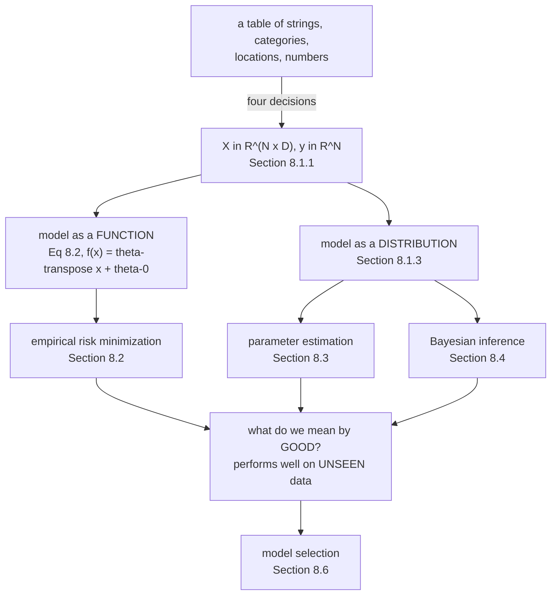

Part I built the mathematics. This chapter is the vocabulary you need before any of it can be pointed at
a dataset — and the book is unusually careful here, because three of the words involved mean more than
one thing.

The chapter's own framing: there are three components of a machine learning system — **data**, **models**
and **learning** — and the guiding question is *"what do we mean by good models?"* The answer the book
commits to is that **good models perform well on unseen data**, which sounds obvious and turns out to
drive everything in §8.2 onward.

## What you'll learn

- Why "data as vectors" is a sequence of **modelling decisions**, not a formatting step — reconstructed from the book's Tables 8.1 and 8.2.
- Measured: latitude and salary in Table 8.2 differ in spread by a factor of **297,010**, which is why the book's advice to standardise every column exists.
- Equation 8.2, a model as a **function**, and the trick of Equations 8.4–8.5 that turns an affine model into a linear one.
- Section 8.1.3, a model as a **distribution**, and precisely what extra question that lets you ask.
- The book's own running example fitted: $\theta = (8.807355,\ 2.122453)$, $f(60) = 136.154562$ with a residual scale of $25.603199$.
- Section 8.1.4's **three algorithmic phases**, and the naming collision the book explicitly warns about.
- Which chapter answers which phase, so the rest of Part II has a map.

## Intuition: three problems wearing one word

**"Data"** sounds like something you are given. It is not. Between the spreadsheet a domain expert hands
you and the matrix $\mathbf{X} \in \mathbb{R}^{N\times D}$ that an algorithm consumes, somebody makes
half a dozen irreversible choices. Table 8.1 to Table 8.2 in the book is exactly that transition, and
this page counts the choices.

**"Model"** means two different things, and the book is explicit that it will "revisit it multiple times".
A model can be a **function** — feed it features, get a number — or a **distribution**, which describes
how likely each answer is. Both appear in this chapter; the first drives §8.2, the second §8.3 and §8.4.

**"Learning"** means three different things, depending on which phase you are in. Predicting is not
training and training is not model selection, and they consume different slices of your data.



## §8.1.1 Data as vectors

The book's assumption is that data is **tabular** and **tidy** (Wickham, 2014; Codd, 1990): each row is
an example, each column is a feature. It also states plainly what it is not going to cover — identifying
good features, which "depend on domain expertise and require careful engineering".

But even given a tidy table, getting to numbers takes decisions. Here is Table 8.1 as the book prints it:

| Name | Gender | Degree | Postcode | Age | Annual salary |
| --- | --- | --- | --- | --- | --- |
| Aditya | M | MSc | W21BG | 36 | 89563 |
| Bob | M | PhD | EC1A1BA | 47 | 123543 |
| Chloé | F | BEcon | SW1A1BH | 26 | 23989 |
| Daisuke | M | BSc | SE207AT | 68 | 138769 |
| Elisabeth | F | MBA | SE10AA | 33 | 113888 |

and here is Table 8.2, the numerical version:

| Gender ID | Degree | Latitude | Longitude | Age | Annual Salary (thousands) |
| --- | --- | --- | --- | --- | --- |
| $-1$ | 2 | 51.5073 | 0.1290 | 36 | 89.563 |
| $-1$ | 3 | 51.5074 | 0.1275 | 47 | 123.543 |
| $+1$ | 1 | 51.5071 | 0.1278 | 26 | 23.989 |
| $-1$ | 1 | 51.5075 | 0.1281 | 68 | 138.769 |
| $+1$ | 2 | 51.5074 | 0.1278 | 33 | 113.888 |

**Four decisions happened.** Each is defensible and each is a claim about the world:

1. **The Name column was dropped.** The book gives two reasons: it is not expected to be informative, and dropping it anonymises the row. Note these are different kinds of reason — one is about prediction, the other about ethics, and they happen to agree here.
2. **Gender became $-1$ / $+1$.** The book explicitly notes $0$ / $1$ would also do. That choice is invisible to an unregularised linear model and *not* invisible to a regularised one, since it changes what "a large coefficient" means.
3. **Degree became $1$ / $2$ / $3$.** This asserts an **order** — bachelor's, master's, PhD — and simultaneously asserts that BEcon $=$ BSc and MBA $=$ MSc. Both are domain claims, and the encoding also asserts that the step from $1$ to $2$ equals the step from $2$ to $3$.
4. **Postcode became a latitude and longitude.** This one needs actual knowledge: that "SE10AA" is not a string but a place in London.

:::caution[The advice about scaling is not cosmetic]
The book says: *"Without additional information, one should shift and scale all columns of the dataset
such that they have an empirical mean of 0 and an empirical variance of 1."*

Measured on Table 8.2: the latitude column has standard deviation $0.000136$ and the salary column
$40.288419$ — a ratio of **297,010**. A penalty term $\lVert\boldsymbol\theta\rVert^2$ (§8.2.3) treats
all coefficients as comparable, so without scaling it would essentially forbid the model from using
latitude at all, while barely constraining the salary coefficient. Standardisation is what makes the
regulariser mean the same thing in every direction.
:::

### The notation for the rest of Part II

- $N$ examples, indexed $n = 1, \dots, N$. Each example $\mathbf{x}_n$ is a $D$-dimensional vector.
- $D$ features, indexed $d = 1, \dots, D$.
- **Supervised** learning means each example carries a **label** $y_n$ — also called a target, response variable, or annotation.
- The dataset is $\{(\mathbf{x}_1, y_1), \dots, (\mathbf{x}_N, y_N)\}$, and the examples stack into $\mathbf{X} \in \mathbb{R}^{N\times D}$.

The book flags that this row-per-example orientation "originates from the database community", and that
Chapter 10 will find it more convenient to treat examples as **columns**. Worth knowing before you hit a
transpose that looks wrong.

## §8.1.2 Models as functions

A **predictor** is a function that takes a feature vector and returns an output. Taking the output to be
a real scalar:

$$
f : \mathbb{R}^D \to \mathbb{R}
$$

The book restricts to **linear** functions, and says why: it strikes "a good balance between the
generality of the problems that can be solved and the amount of background mathematics that is needed".
So:

$$
f(\mathbf{x}) = \boldsymbol\theta^\top\mathbf{x} + \theta_0
$$

for unknown $\boldsymbol\theta$ and $\theta_0$. Chapters 2 and 3 are enough to state this precisely — no
functional analysis required.

:::tip[The unit-feature trick, Equations 8.4 and 8.5]
That $\theta_0$ is a nuisance: it makes the model **affine** rather than linear, so it does not fit the
matrix machinery cleanly. The fix is to append a constant feature:

$$
\mathbf{x}_n = [1,\ x_n^{(1)},\ x_n^{(2)},\ \dots,\ x_n^{(D)}]^\top,
\qquad
\boldsymbol\theta = [\theta_0,\ \theta_1,\ \dots,\ \theta_D]^\top
$$

and then

$$
f(\mathbf{x}_n, \boldsymbol\theta) = \boldsymbol\theta^\top\mathbf{x}_n
\qquad\text{is identical to}\qquad
f(\mathbf{x}_n, \boldsymbol\theta) = \theta_0 + \sum_{d=1}^{D}\theta_d x_n^{(d)}
$$

The predictor now maps $\mathbb{R}^{D+1} \to \mathbb{R}$. **The intercept has become an ordinary
coefficient**, which is convenient for the algebra and a genuine trap for regularisation: a penalty
$\lVert\boldsymbol\theta\rVert^2$ now shrinks the intercept too, and there is usually no reason to want
that. The book's own margin note is that "affine functions are often referred to as linear functions in
machine learning", which is the same conflation seen from the vocabulary side.
:::

## §8.1.3 Models as probability distributions

The motivation is one sentence: data is usually **noisy observations of some true underlying effect**, and
we would like predictors that "express some sort of uncertainty". Chapter 6 is the language for that.

So instead of a single function, consider a **distribution over possible outputs**. The book restricts to
distributions with finite-dimensional parameters, which is what lets it avoid stochastic processes and
random measures, and notes that even this "already allow[s] for a rich class of models".

The practical difference is exactly one question. With a function you can ask *"what is the prediction at
$x = 60$?"* With a distribution you can also ask *"how confident is that?"* — and get an answer that is
a number rather than a feeling.

## §8.1.4 Learning is finding parameters

The goal: find a model **and** its parameters such that the resulting predictor does well on unseen data.
Three conceptually distinct phases:

1. **Prediction** or **inference** — apply a trained predictor to new data. Model and parameters are fixed.
2. **Training** or **parameter estimation** — adjust the model using training data.
3. **Hyperparameter tuning** or **model selection** — choose among models.

For training there are two strategies, and this split organises the rest of the chapter:

- **Find a point estimate.** One best parameter vector. Works for both kinds of predictor. §8.2 (empirical risk minimization) and §8.3 (maximum likelihood, MAP).
- **Bayesian inference.** Keep a whole distribution over parameters. Needs a probabilistic model. §8.4.

:::caution[The book's own warning about "inference"]
Verbatim: *"there is no agreed upon naming for the different algorithmic phases. The word 'inference' is
sometimes also used to mean parameter estimation of a probabilistic model, and less often may be also
used to mean prediction for non-probabilistic models."*

So "inference" can mean phase 1 or phase 2 depending on who is speaking. In this module it means
**prediction with a probabilistic model**, matching the book's primary usage — but when reading anything
else, check.
:::

## Worked example by hand

Fit the book's own data. Table 8.2's two rightmost columns are age and salary:

$$
x = (36,\ 47,\ 26,\ 68,\ 33), \qquad y = (89.563,\ 123.543,\ 23.989,\ 138.769,\ 113.888)
$$

**Step 1: build the design matrix.** Using the unit-feature trick with $D = 1$:

$$
\boldsymbol\Phi = \begin{bmatrix}1 & 36\\ 1 & 47\\ 1 & 26\\ 1 & 68\\ 1 & 33\end{bmatrix}
$$

**Step 2: the normal equations.** The least-squares solution satisfies
$\boldsymbol\Phi^\top\boldsymbol\Phi\,\boldsymbol\theta = \boldsymbol\Phi^\top\mathbf{y}$. With $N = 5$,
$\sum x_n = 210$ so $\bar{x} = 42$, and $\sum x_n^2 = 1296 + 2209 + 676 + 4624 + 1089 = 9894$:

$$
\boldsymbol\Phi^\top\boldsymbol\Phi = \begin{bmatrix}5 & 210\\ 210 & 9894\end{bmatrix}
$$

The determinant is $5 \times 9894 - 210^2 = 49470 - 44100 = 5370$. And
$\sum y_n = 489.752$, $\sum x_n y_n = 22703.093$, so

$$
\boldsymbol\theta = \frac{1}{5370}\begin{bmatrix}9894 & -210\\ -210 & 5\end{bmatrix}\begin{bmatrix}489.752\\ 22703.093\end{bmatrix} = \begin{bmatrix}8.807355\\ 2.122453\end{bmatrix}
$$

**Step 3: read it.** The slope is $2.122453$ thousand per year of age, and the intercept is $8.807355$
thousand — a notional salary at age zero, which is why intercepts are usually not worth interpreting.

**Step 4: predict at 60.**

$$
f(60) = 8.807355 + 2.122453 \times 60 = 136.154562
$$

**Step 5: the same fit as a distribution.** The residuals are

$$
\mathbf{y} - \boldsymbol\Phi\boldsymbol\theta, \qquad \text{empirical risk} = \frac1N\sum_n r_n^2 = 655.523816
$$

so the residual standard deviation is $\sqrt{655.523816} = 25.603199$. The distributional answer at age
$60$ is $\mathcal{N}(136.1546,\ 25.6032^2)$, giving a one-standard-deviation interval of
$[110.551,\ 161.758]$ and a two-standard-deviation interval of $[84.948,\ 187.361]$.

**That interval is enormous** — nearly $\pm 40\%$ — and it should be, from five data points. The function
view returns $136.154562$ and says nothing. That difference is the entire content of §8.1.3.

:::caution[Figure 8.2's line is not this fit]
The book's Figure 8.2 caption says the drawn function gives $f(60) = 100$. The least-squares fit to
Table 8.2's five points gives $136.154562$. There is no contradiction: Figure 8.2's caption calls it an
*"example function"* — it is illustrative, drawn to show what a predictor looks like, not fitted. Figure
8.5 is the one that shows the actual maximum likelihood fit. Worth checking rather than assuming, since
the two figures share axes and look similar.
:::

## See it move

The four encoding decisions are easier to feel than to read about. Change one and watch what the model
can and cannot then express:

```p5 title="Four decisions, and what each one costs you" desc="Step through the four encoding decisions that turn Table 8.1 into Table 8.2. Each panel shows what the column looked like before, what it becomes, and what information is now unrecoverable. The last knob toggles column standardisation and reports the spread ratio it fixes." height="490"
let step = 0, scaled = 0;
let KNOBS = [], dragging = null;

const DECISIONS = [
  { name: "1. drop the Name column",
    before: "Aditya, Bob, Chloe, Daisuke, Elisabeth",
    after:  "(gone)",
    why:    "not expected to be informative, and it anonymises the row",
    lost:   "nothing predictive -- but the two reasons given are different kinds of reason",
    col: [232, 110, 110] },
  { name: "2. Gender to -1 / +1",
    before: "M, M, F, M, F",
    after:  "-1, -1, +1, -1, +1",
    why:    "any two distinct numbers would do; the book notes 0 / 1 as the alternative",
    lost:   "nothing -- but the CHOICE is visible to a regulariser, invisible without one",
    col: [255, 211, 67] },
  { name: "3. Degree to 1 / 2 / 3",
    before: "MSc, PhD, BEcon, BSc, MBA",
    after:  "2, 3, 1, 1, 2",
    why:    "degrees progress bachelor -> master -> doctorate",
    lost:   "that BEcon is not BSc, that MBA is not MSc, and that the gaps may be unequal",
    col: [197, 153, 255] },
  { name: "4. Postcode to lat / long",
    before: "W21BG, EC1A1BA, SW1A1BH, ...",
    after:  "(51.5073, 0.1290), ...",
    why:    "a postcode encodes a place, and distance between places is meaningful",
    lost:   "the postcode itself -- nothing downstream can recover it",
    col: [120, 200, 140] },
];

// Table 8.2's six columns, for the standardisation readout.
const COLS = [
  { n: "gender",    v: [-1, -1, 1, -1, 1] },
  { n: "degree",    v: [2, 3, 1, 1, 2] },
  { n: "latitude",  v: [51.5073, 51.5074, 51.5071, 51.5075, 51.5074] },
  { n: "longitude", v: [0.1290, 0.1275, 0.1278, 0.1281, 0.1278] },
  { n: "age",       v: [36, 47, 26, 68, 33] },
  { n: "salary",    v: [89.563, 123.543, 23.989, 138.769, 113.888] },
];

function setup() { createCanvas(680, 490); textFont("monospace"); }

function knob(id, x, y, w, value, mn, mx, label) {
  KNOBS.push({ id, x, y, w, mn, mx });
  const t = (value - mn) / (mx - mn);
  stroke(60, 74, 92); strokeWeight(2); line(x, y, x + w, y);
  noStroke(); fill(255, 211, 67); ellipse(x + t * w, y, 12, 12);
  fill(190, 200, 212); textSize(12); textAlign(LEFT, CENTER);
  text(label, x + w + 12, y);
}
function knobHit(mx_, my_) {
  for (const k of KNOBS) {
    if (my_ > k.y - 13 && my_ < k.y + 13 && mx_ > k.x - 13 && mx_ < k.x + k.w + 13) return k;
  }
  return null;
}
function knobValue(k, mx_) {
  const t = Math.min(1, Math.max(0, (mx_ - k.x) / k.w));
  return Math.round(k.mn + t * (k.mx - k.mn));
}
function mousePressed() { dragging = knobHit(mouseX, mouseY); }
function mouseReleased() { dragging = null; }
function mouseDragged() {
  if (!dragging) return;
  const v = knobValue(dragging, mouseX);
  if (dragging.id === "s") step = v;
  if (dragging.id === "z") scaled = v;
  if (!isLooping()) redraw();
}

function sd(a) {
  const m = a.reduce((s, v) => s + v, 0) / a.length;
  return Math.sqrt(a.reduce((s, v) => s + (v - m) * (v - m), 0) / a.length);
}

function draw() {
  background(13, 17, 23);
  KNOBS = [];
  const D = DECISIONS[step];
  const c = color(D.col[0], D.col[1], D.col[2]);

  noStroke(); fill(255, 211, 67); textSize(16); textAlign(LEFT, TOP);
  text("Table 8.1  ->  Table 8.2", 24, 18);
  fill(140); textSize(11);
  text("decision " + (step + 1) + " of 4", 24, 42);

  // the decision card
  stroke(c); strokeWeight(1.8); fill(red(c), green(c), blue(c), 22);
  rect(24, 66, 632, 176, 6);
  noStroke(); fill(c); textSize(17); textAlign(LEFT, TOP);
  text(D.name, 42, 78);

  fill(150); textSize(11);
  text("before:", 42, 112);
  fill(220); textSize(12);
  text(D.before, 118, 112);
  fill(150); textSize(11);
  text("after:", 42, 136);
  fill(c); textSize(12);
  text(D.after, 118, 136);

  fill(150); textSize(11);
  text("why:", 42, 168);
  fill(200); textSize(11);
  text(D.why, 118, 168);
  fill(232, 110, 110); textSize(11);
  text("lost:", 42, 196);
  fill(232, 130, 130);
  text(D.lost, 118, 196);

  // the standardisation panel
  const ratio = Math.max(...COLS.map(q => sd(q.v))) / Math.min(...COLS.map(q => sd(q.v)));
  stroke(scaled ? color(120, 200, 140) : color(232, 110, 110));
  strokeWeight(1.6);
  fill(scaled ? color(120, 200, 140, 22) : color(232, 110, 110, 22));
  rect(24, 258, 632, 148, 6);
  noStroke();
  fill(scaled ? color(120, 200, 140) : color(232, 110, 110)); textSize(15);
  textAlign(LEFT, TOP);
  text(scaled ? "columns standardised to mean 0, variance 1"
              : "columns as they come, unscaled", 42, 268);

  fill(150); textSize(11);
  text("column", 42, 298);
  text(scaled ? "std dev after" : "std dev", 190, 298);
  text("what a penalty on theta would do", 320, 298);
  for (let i = 0; i < COLS.length; i++) {
    const s = sd(COLS[i].v);
    const y = 316 + i * 14;
    fill(180); textSize(10);
    text(COLS[i].n, 42, y);
    fill(scaled ? color(120, 200, 140) : 220);
    text(scaled ? "1.000000" : s.toFixed(6), 190, y);
    if (!scaled) {
      const rel = s / Math.max(...COLS.map(q => sd(q.v)));
      fill(rel < 1e-4 ? color(232, 110, 110) : (rel < 0.1 ? color(255, 211, 67) : 150));
      text(rel < 1e-4 ? "effectively forbidden" : (rel < 0.1 ? "heavily penalised" : "barely constrained"), 320, y);
    } else {
      fill(120, 200, 140);
      text("treated the same as every other column", 320, y);
    }
  }
  fill(scaled ? 140 : color(232, 110, 110)); textSize(11);
  text(scaled ? "spread ratio is now 1" :
       ("widest / narrowest spread = " + ratio.toFixed(0)), 42, 316 + 6 * 14 + 4);

  knob("s", 42, 436, 240, step, 0, 3, "decision " + (step + 1));
  knob("z", 42, 466, 90, scaled, 0, 1, scaled ? "standardised" : "raw columns");
  fill(120); textSize(11); textAlign(LEFT, TOP);
  text("Toggle the second knob: latitude's spread is 0.000136 and salary's is", 380, 452);
  text("40.288419, a ratio of 297010. That is what standardisation removes.", 380, 466);
}
```

## From scratch

```python title="data_models_learning.py" showLineNumbers{1}
import numpy as np

# Table 8.1, exactly as the book prints it.
RAW = [
    ("Aditya",    "M", "MSc",   "W21BG",   36,  89563),
    ("Bob",       "M", "PhD",   "EC1A1BA", 47, 123543),
    ("Chloe",     "F", "BEcon", "SW1A1BH", 26,  23989),
    ("Daisuke",   "M", "BSc",   "SE207AT", 68, 138769),
    ("Elisabeth", "F", "MBA",   "SE10AA",  33, 113888),
]

# The four decisions that produce Table 8.2.
GENDER = {"M": -1, "F": +1}                      # decision 2
DEGREE = {"BSc": 1, "BEcon": 1, "MSc": 2, "MBA": 2, "PhD": 3}   # decision 3
POSTCODE = {                                     # decision 4, domain knowledge
    "W21BG":   (51.5073, 0.1290),
    "EC1A1BA": (51.5074, 0.1275),
    "SW1A1BH": (51.5071, 0.1278),
    "SE207AT": (51.5075, 0.1281),
    "SE10AA":  (51.5074, 0.1278),
}

rows = []
for name, g, deg, pc, age, salary in RAW:      # decision 1: drop the name
    lat, lon = POSTCODE[pc]
    rows.append([GENDER[g], DEGREE[deg], lat, lon, age, salary / 1000.0])
X_full = np.array(rows)
print("Table 8.2 reconstructed, shape", X_full.shape)
for r in X_full:
    print("  [%+d, %d, %.4f, %.4f, %d, %.3f]"
          % (r[0], r[1], r[2], r[3], r[4], r[5]))

# --- N and D, and the supervised split ------------------------------------
N, D = X_full.shape[0], X_full.shape[1] - 1
print(f"\nN = {N} examples, D = {D} features (salary is the label y)")
x = X_full[:, 4]                                  # age
y = X_full[:, 5]                                  # salary in thousands

# --- Equation 8.2: a predictor as a function ------------------------------
# Concatenate a unit feature so the affine model is a linear one (Eq 8.4/8.5).
Phi = np.column_stack([np.ones(N), x])
theta = np.linalg.lstsq(Phi, y, rcond=None)[0]
print(f"\ntheta = [{theta[0]:.6f}, {theta[1]:.6f}]   "
      f"(intercept, slope per year)")
pred60 = theta @ np.array([1.0, 60.0])
print(f"f(60) = {pred60:.6f}")
resid = y - Phi @ theta
print(f"empirical risk (Eq 8.6, squared loss) = {np.mean(resid ** 2):.6f}")
print(f"residual standard deviation           = "
      f"{np.sqrt(resid @ resid / N):.6f}")

# --- Section 8.1.3: the same predictor as a distribution -----------------
sigma = np.sqrt(resid @ resid / N)
print(f"\nas a distribution: p(y | x=60) = N({pred60:.4f}, {sigma:.4f}^2)")
for k in (1, 2):
    print(f"  {k} sd interval: [{pred60 - k * sigma:8.3f}, "
          f"{pred60 + k * sigma:8.3f}]")
print("with five data points the honest interval is very wide, which is")
print("exactly the information the function view discards.")

# --- the book's own advice: standardise every column ---------------------
print("\nSection 8.1.1's advice, applied to all six columns:")
mu, sd = X_full.mean(axis=0), X_full.std(axis=0)
Z = (X_full - mu) / sd
names = ["gender", "degree", "latitude", "longitude", "age", "salary"]
print(f"{'column':>10} {'raw mean':>12} {'raw sd':>12} "
      f"{'scaled mean':>13} {'scaled sd':>11}")
for k, nm in enumerate(names):
    print(f"{nm:>10} {mu[k]:>12.6f} {sd[k]:>12.6f} "
          f"{Z[:, k].mean():>13.2e} {Z[:, k].std():>11.6f}")
print("\nlatitude had a spread of %.6f and salary %.4f -- a ratio of %.0f."
      % (sd[2], sd[5], sd[5] / sd[2]))
print("Any penalty on the size of theta treats those two as comparable")
print("unless the columns are scaled first, which is why the advice exists.")
```

```
Table 8.2 reconstructed, shape (5, 6)
  [-1, 2, 51.5073, 0.1290, 36, 89.563]
  [-1, 3, 51.5074, 0.1275, 47, 123.543]
  [+1, 1, 51.5071, 0.1278, 26, 23.989]
  [-1, 1, 51.5075, 0.1281, 68, 138.769]
  [+1, 2, 51.5074, 0.1278, 33, 113.888]

N = 5 examples, D = 5 features (salary is the label y)

theta = [8.807355, 2.122453]   (intercept, slope per year)
f(60) = 136.154562
empirical risk (Eq 8.6, squared loss) = 655.523816
residual standard deviation           = 25.603199

as a distribution: p(y | x=60) = N(136.1546, 25.6032^2)
  1 sd interval: [ 110.551,  161.758]
  2 sd interval: [  84.948,  187.361]
with five data points the honest interval is very wide, which is
exactly the information the function view discards.

Section 8.1.1's advice, applied to all six columns:
    column     raw mean       raw sd   scaled mean   scaled sd
    gender    -0.200000     0.979796     -4.44e-17    1.000000
    degree     1.800000     0.748331     -8.88e-17    1.000000
  latitude    51.507340     0.000136      1.11e-17    1.000000
 longitude     0.128040     0.000516      2.15e-14    1.000000
       age    42.000000    14.656057      2.22e-17    1.000000
    salary    97.950400    40.288419     -2.89e-16    1.000000

latitude had a spread of 0.000136 and salary 40.2884 -- a ratio of 297010.
Any penalty on the size of theta treats those two as comparable
unless the columns are scaled first, which is why the advice exists.
```

## On real data

<Figure
  src="/images/mml/data-models-and-learning/tables-8-1-to-8-2"
  alt="Two stacked tables. Above, Table 8.1 with string and categorical columns, annotated that none of it is directly usable. Below, Table 8.2 in numerical form, with the four encoding decisions listed alongside: name dropped, gender to minus one and plus one, degree to an ordinal, postcode to latitude and longitude."
  title="Turning a table into vectors is a sequence of modelling decisions"
  caption="Each of the four decisions is a claim about the world, and each is irreversible downstream. Nothing later can recover the postcode from a latitude, or learn that an MBA is not an MSc."
/>

<Figure
  src="/images/mml/data-models-and-learning/function-versus-distribution"
  alt="Two panels sharing the same five data points and the same fitted line. Left, an amber square marks the single prediction 136.15 at age 60. Right, a Gaussian density drawn sideways at age 60 with its one and two standard deviation marks, spanning roughly 85 to 187."
  title="One fit, two kinds of answer"
  caption="The function view returns 136.154562 and stops. The distribution view returns the same mean with a standard deviation of 25.603199, so its two-sigma interval spans 84.9 to 187.4 — which is the honest answer from five points."
/>

<Figure
  src="/images/mml/data-models-and-learning/three-algorithmic-phases"
  alt="Three stacked boxes, innermost at the bottom. Prediction, with everything fixed. Training, with the model class fixed and the parameters free. Model selection, with the model class itself free. Each box lists its alternative name, what it needs, and which chapter covers it."
  title="Section 8.1.4's three phases, and what is fixed in each"
  caption="The three phases consume different slices of the data and are all called learning. The book warns explicitly that the word inference is used for at least two of them."
/>

## Reading the plot

**The first figure counts what a data-loading script actually does.** Look at the "lost" column of the
four decisions rather than the "why" column. Decision 1 loses nothing predictive. Decision 2 loses
nothing at all — until a regulariser appears, at which point the choice between $\{-1, +1\}$ and
$\{0, 1\}$ changes the geometry of the penalty. Decision 3 loses the most: it asserts a total order on
degrees *and* an equal spacing *and* two specific equalities (BEcon $=$ BSc, MBA $=$ MSc), and none of
those is recoverable later. Decision 4 loses the postcode, and could only be made by someone who knew
what a postcode is.

The point is not that any of these is wrong. It is that they are **decisions**, and a table of numbers
carries no record of having been decided. By the time the data reaches §8.2 it looks like a given.

**The second figure is §8.1.2 against §8.1.3 on identical numbers.** Same five points, same line,
$\boldsymbol\theta = (8.807355,\ 2.122453)$. On the left the answer at age $60$ is $136.154562$ — a
number with no error bar and no way to attach one, because a function has no vocabulary for doubt.

On the right the answer is a Gaussian with the same mean and standard deviation $25.603199$. Look at how
wide that is: the two-sigma interval runs from $84.948$ to $187.361$, more than a factor of two from
bottom to top. **That is not a defect of the distributional view — it is the truth about a fit to five
points**, and the function view's crisp $136.154562$ was hiding it. Which of the two you want depends
entirely on whether anything downstream is going to make a decision with the number.

One honest note on the residual scale: I computed it as $\sqrt{\sum r_n^2 / N}$ with $N = 5$, the
maximum likelihood estimate that §8.3.1 will derive. It is biased low, because it divides by $N$ rather
than by $N - 2$ for the two fitted parameters. Using $N - 2$ gives $33.053588$, an even wider interval. The
point stands either way, and gets stronger.

**The third figure is the map for the rest of Part II.** Read it from the bottom up, because that is the
order of increasing freedom: at prediction time everything is fixed; at training time the parameters move
but the model class does not; at model-selection time the class itself moves. Each layer wraps the one
below, which is exactly why §8.6.1's nested cross-validation has two loops — one per layer of freedom.

The naming note in the caption is not pedantry. If a paper says "inference took 4 ms", that is phase 1.
If it says "variational inference", that is phase 2. The book's own remark that there is "no agreed upon
naming" is the safest thing to carry.

:::tip[From the book]
This page covers **§8.1** of *Mathematics for Machine Learning* by Deisenroth, Faisal and Ong (draft of
2019-12-11), including **§8.1.1** (data as vectors), **§8.1.2** (models as functions), **§8.1.3** (models
as probability distributions) and **§8.1.4** (learning is finding parameters). **Table 8.1** and **Table
8.2** are reproduced verbatim; the tidy-data reference is Wickham (2014) and Codd (1990), and the
data-science pointers are Stray (2016) and Adhikari and DeNero (2018). Equation **8.1** is
$f : \mathbb{R}^D \to \mathbb{R}$ and **8.2** is the affine predictor. Figures **8.1**, **8.2** and
**8.3** are the toy dataset, the example function with $f(60) = 100$, and the same function with
predictive uncertainty drawn as a Gaussian. The three algorithmic phases and the remark that "there is no
agreed upon naming" are from §8.1.4. The advice to shift and scale every column to zero mean and unit
variance is the book's. The reconstruction of Table 8.2 from Table 8.1, the fitted
$\boldsymbol\theta = (8.807355, 2.122453)$, the value $f(60) = 136.154562$, the residual scale
$25.603199$ and the $297{,}010$ spread ratio are this module's additions.
:::

## Pitfalls

:::danger[Treating the numerical table as the data]
Table 8.2 looks like a fact and is the output of four decisions. The one with the most content is the
degree encoding: $1/2/3$ asserts an order, equal spacing, and that BEcon $=$ BSc and MBA $=$ MSc. None of
that is recoverable from the numbers, and no diagnostic will flag it — the model will simply behave as
though those claims are true.
:::

:::caution[Regularising without standardising]
Measured on Table 8.2: latitude has spread $0.000136$, salary has spread $40.288419$, a ratio of
$297{,}010$. A penalty $\lVert\boldsymbol\theta\rVert^2$ treats all coefficients as comparable, so
without scaling it effectively forbids the model from using latitude while barely touching the salary
coefficient. The book's advice to standardise every column is what makes the penalty isotropic.
:::

:::caution[Letting the unit-feature trick regularise your intercept]
Equations 8.4 and 8.5 absorb $\theta_0$ into $\boldsymbol\theta$, which is exactly what you want for the
algebra. It also means $\lVert\boldsymbol\theta\rVert^2$ now includes $\theta_0^2$, shrinking the
intercept toward zero — and there is rarely a reason to prefer a model whose prediction at the origin is
small. In practice the intercept is excluded from the penalty; nothing in the notation reminds you.
:::

:::caution[Reading an intercept as a quantity]
The fitted intercept here is $8.807355$ thousand, nominally a salary at age zero. It is not a prediction
about newborns; it is where the line happens to cross an axis far outside the data, which ran from $26$
to $68$. Intercepts are usually reparameterisation artifacts, and centring the inputs turns this one into
the mean salary instead.
:::

:::caution[Saying "inference" without saying which phase]
The book states there is no agreed convention. "Inference" most often means prediction with a
probabilistic model, sometimes means parameter estimation, and occasionally means prediction with a
non-probabilistic model. Three phases, one word — and the ambiguity survives into library APIs.
:::

:::caution[Assuming row-per-example everywhere]
§8.1.1 stacks examples as rows, $\mathbf{X} \in \mathbb{R}^{N\times D}$, following database convention.
The book notes Chapter 10 finds columns more convenient. A transpose that looks like a bug is often this
convention change.
:::

## Compare

| | model as a **function** | model as a **distribution** |
| --- | --- | --- |
| the object | $f : \mathbb{R}^D \to \mathbb{R}$ | $p(y \mid \mathbf{x}, \boldsymbol\theta)$ |
| the book | §8.1.2, Eq 8.2 | §8.1.3 |
| answer at $x = 60$ | $136.154562$ | $\mathcal{N}(136.1546,\ 25.6032^2)$ |
| can express uncertainty | **no** | yes |
| trained by | empirical risk minimization, §8.2 | maximum likelihood or Bayes, §8.3, §8.4 |
| regularisation appears as | a penalty term, §8.2.3 | a prior, §8.3.2 |
| needs a noise model | no | yes |
| prediction is called | prediction | **inference** |

| phase | what is fixed | what is free | data it consumes | where |
| --- | --- | --- | --- | --- |
| prediction / inference | model **and** parameters | the input only | one unseen point | Ch 9–12 |
| training / parameter estimation | the model class | the parameters | the training set | §8.2, §8.3, §8.4 |
| model selection | nothing | the class and hyperparameters | training + validation | §8.6 |

<Quiz
  title="Do you know what the vocabulary is hiding?"
  questions={[
    {
      q: "Table 8.2 encodes Degree as 1, 2, 3. What does that assert?",
      options: [
        "Nothing; it is just a label for each category",
        "An order on degrees, an equal spacing between consecutive levels, and that BEcon equals BSc and MBA equals MSc",
        "That degree is the most important feature",
        "That there are exactly three degree types in the world",
      ],
      answer: 1,
      explain:
        "An ordinal encoding is three claims at once and all of them are domain claims. None is recoverable from the numbers afterwards, and nothing will flag them — a linear model will simply behave as though the step from bachelor to master equals the step from master to doctorate.",
    },
    {
      q: "Why does the book advise standardising every column to zero mean and unit variance?",
      options: [
        "To make gradient descent converge, which is the only reason",
        "Because a penalty on the size of theta treats all coefficients as comparable, and Table 8.2's column spreads differ by a factor of 297010",
        "Because probability distributions require standardised inputs",
        "To remove outliers from the data",
      ],
      answer: 1,
      explain:
        "Latitude has standard deviation 0.000136 and salary 40.288419. An isotropic penalty on theta would effectively forbid the model from using latitude while barely constraining salary. Conditioning also improves, but the regularisation argument is the one that changes the answer rather than the speed.",
    },
    {
      q: "What exactly does the unit-feature trick of Equations 8.4 and 8.5 buy, and what does it cost?",
      options: [
        "It buys nothing; it is purely notational",
        "It turns an affine model into a linear one so matrix algebra applies — at the cost that a norm penalty on theta now shrinks the intercept too",
        "It removes the need for an intercept entirely",
        "It makes the model nonlinear",
      ],
      answer: 1,
      explain:
        "Appending a constant feature makes theta-transpose x identical to the affine form, which is what lets the whole of Chapters 2 and 3 apply. The side effect is that theta-0 is now an ordinary coefficient, so the L2 penalty of Section 8.2.3 shrinks it — and there is rarely a reason to prefer a small intercept.",
    },
    {
      q: "The fit to Table 8.2 gives f(60) = 136.154562 with residual standard deviation 25.603199. What is the honest reading?",
      options: [
        "The salary at age 60 is 136.15 thousand",
        "The point prediction is 136.15 but the two-sigma interval spans 84.9 to 187.4, so the estimate is barely informative",
        "The model is wrong, since the interval is so wide",
        "The residual standard deviation is irrelevant to prediction",
      ],
      answer: 1,
      explain:
        "The width is not a defect, it is the truth about a two-parameter fit to five points — and dividing by N minus 2 rather than N makes it wider still, at 33.054. The function view's crisp 136.154562 was concealing exactly this.",
    },
    {
      q: "In the book's terminology, what does 'inference' most often mean?",
      options: [
        "Parameter estimation, always",
        "Prediction with a probabilistic model — but the book warns there is no agreed convention and it is also used for parameter estimation",
        "Model selection",
        "The training phase of any model",
      ],
      answer: 1,
      explain:
        "Section 8.1.4 states verbatim that there is no agreed naming: inference usually means prediction with a probabilistic model, is sometimes used for parameter estimation, and occasionally for prediction with a non-probabilistic one. Three phases share the word, and the ambiguity survives into library APIs.",
    },
  ]}
/>

## 🧪 Try It Yourself

### Exercise 1 – Reconstruct Table 8.2

<DataCampExercise
  lang="python"
  hint={`Decision 3 puts BSc and BEcon at 1, MSc and MBA at 2, and PhD at 3 — the book's ordinal encoding of degree level.`}
  code={`import numpy as np

RAW = [
    ("Aditya",    "M", "MSc",   "W21BG",   36,  89563),
    ("Bob",       "M", "PhD",   "EC1A1BA", 47, 123543),
    ("Chloe",     "F", "BEcon", "SW1A1BH", 26,  23989),
    ("Daisuke",   "M", "BSc",   "SE207AT", 68, 138769),
    ("Elisabeth", "F", "MBA",   "SE10AA",  33, 113888),
]
GENDER = {"M": -1, "F": +1}
# Task: the ordinal encoding. Bachelor's level 1, master's 2, doctorate 3.
DEGREE = {"BSc": 1, "BEcon": 1, "MSc": 2, "MBA": ___, "PhD": 3}
POSTCODE = {
    "W21BG":   (51.5073, 0.1290), "EC1A1BA": (51.5074, 0.1275),
    "SW1A1BH": (51.5071, 0.1278), "SE207AT": (51.5075, 0.1281),
    "SE10AA":  (51.5074, 0.1278),
}

rows = []
for name, g, deg, pc, age, salary in RAW:
    lat, lon = POSTCODE[pc]
    rows.append([GENDER[g], DEGREE[deg], lat, lon, age, salary / 1000.0])
X = np.array(rows)
print("Table 8.2 reconstructed, shape", X.shape)
for r in X:
    print("  [%+d, %d, %.4f, %.4f, %d, %.3f]"
          % (r[0], r[1], r[2], r[3], r[4], r[5]))
print(f"\\nN = {X.shape[0]} examples, D = {X.shape[1] - 1} features")

# -- Expected output ------------------------------
# Table 8.2 reconstructed, shape (5, 6)
#   [-1, 2, 51.5073, 0.1290, 36, 89.563]
#   [-1, 3, 51.5074, 0.1275, 47, 123.543]
#   [+1, 1, 51.5071, 0.1278, 26, 23.989]
#   [-1, 1, 51.5075, 0.1281, 68, 138.769]
#   [+1, 2, 51.5074, 0.1278, 33, 113.888]
#
# N = 5 examples, D = 5 features
# -------------------------------------------------`}
  solution={`import numpy as np
RAW = [
    ("Aditya",    "M", "MSc",   "W21BG",   36,  89563),
    ("Bob",       "M", "PhD",   "EC1A1BA", 47, 123543),
    ("Chloe",     "F", "BEcon", "SW1A1BH", 26,  23989),
    ("Daisuke",   "M", "BSc",   "SE207AT", 68, 138769),
    ("Elisabeth", "F", "MBA",   "SE10AA",  33, 113888),
]
GENDER = {"M": -1, "F": +1}
DEGREE = {"BSc": 1, "BEcon": 1, "MSc": 2, "MBA": 2, "PhD": 3}
POSTCODE = {
    "W21BG":   (51.5073, 0.1290), "EC1A1BA": (51.5074, 0.1275),
    "SW1A1BH": (51.5071, 0.1278), "SE207AT": (51.5075, 0.1281),
    "SE10AA":  (51.5074, 0.1278),
}
rows = []
for name, g, deg, pc, age, salary in RAW:
    lat, lon = POSTCODE[pc]
    rows.append([GENDER[g], DEGREE[deg], lat, lon, age, salary / 1000.0])
X = np.array(rows)
print("Table 8.2 reconstructed, shape", X.shape)
for r in X:
    print("  [%+d, %d, %.4f, %.4f, %d, %.3f]"
          % (r[0], r[1], r[2], r[3], r[4], r[5]))
print(f"\\nN = {X.shape[0]} examples, D = {X.shape[1] - 1} features")`}
  sct={`test_output_contains("[-1, 2, 51.5073, 0.1290, 36, 89.563]")
test_output_contains("N = 5 examples, D = 5 features")
success_msg("Five rows of strings became five vectors, and the Name column vanished. Note that MBA and MSc collapse to the same number and BEcon and BSc to the same number — two domain claims that the table now records as fact.")`}
  height={300}
/>

### Exercise 2 – Fit the book's own example

<DataCampExercise
  lang="python"
  hint={`Equations 8.4 and 8.5: append a column of ones so the affine model becomes a linear one.`}
  code={`import numpy as np

x = np.array([36.0, 47.0, 26.0, 68.0, 33.0])              # age
y = np.array([89.563, 123.543, 23.989, 138.769, 113.888])  # salary, thousands
N = len(y)

# Task: the unit-feature trick of Equations 8.4 and 8.5.
Phi = np.column_stack([___, x])
theta = np.linalg.lstsq(Phi, y, rcond=None)[0]
print(f"theta = [{theta[0]:.6f}, {theta[1]:.6f}]")
pred60 = theta @ np.array([1.0, 60.0])
print(f"f(60) = {pred60:.6f}")
resid = y - Phi @ theta
print(f"empirical risk = {np.mean(resid ** 2):.6f}")
print(f"residual sd    = {np.sqrt(resid @ resid / N):.6f}")
print(f"unbiased sd (divide by N - 2) = {np.sqrt(resid @ resid / (N - 2)):.6f}")

# -- Expected output ------------------------------
# theta = [8.807355, 2.122453]
# f(60) = 136.154562
# empirical risk = 655.523816
# residual sd    = 25.603199
# unbiased sd (divide by N - 2) = 33.053588
# -------------------------------------------------`}
  solution={`import numpy as np
x = np.array([36.0, 47.0, 26.0, 68.0, 33.0])
y = np.array([89.563, 123.543, 23.989, 138.769, 113.888])
N = len(y)
Phi = np.column_stack([np.ones(N), x])
theta = np.linalg.lstsq(Phi, y, rcond=None)[0]
print(f"theta = [{theta[0]:.6f}, {theta[1]:.6f}]")
pred60 = theta @ np.array([1.0, 60.0])
print(f"f(60) = {pred60:.6f}")
resid = y - Phi @ theta
print(f"empirical risk = {np.mean(resid ** 2):.6f}")
print(f"residual sd    = {np.sqrt(resid @ resid / N):.6f}")
print(f"unbiased sd (divide by N - 2) = {np.sqrt(resid @ resid / (N - 2)):.6f}")`}
  sct={`test_output_contains("theta = [8.807355, 2.122453]")
test_output_contains("f(60) = 136.154562")
success_msg("The slope is 2.12 thousand per year of age. Note the two residual scales: dividing by N gives 25.60 and by N minus 2 gives 33.05, because two parameters were fitted from five points. Either way the interval at age 60 is very wide, which is the honest answer.")`}
  height={240}
/>

### Exercise 3 – Why standardisation matters

<DataCampExercise
  lang="python"
  hint={`Divide the largest column standard deviation by the smallest to get the ratio a penalty term would see.`}
  code={`import numpy as np

X = np.array([
    [-1, 2, 51.5073, 0.1290, 36,  89.563],
    [-1, 3, 51.5074, 0.1275, 47, 123.543],
    [+1, 1, 51.5071, 0.1278, 26,  23.989],
    [-1, 1, 51.5075, 0.1281, 68, 138.769],
    [+1, 2, 51.5074, 0.1278, 33, 113.888],
])
names = ["gender", "degree", "latitude", "longitude", "age", "salary"]
mu, sd = X.mean(axis=0), X.std(axis=0)
Z = (X - mu) / sd

print(f"{'column':>10} {'raw sd':>12} {'scaled mean':>13} {'scaled sd':>11}")
for k, nm in enumerate(names):
    print(f"{nm:>10} {sd[k]:>12.6f} {Z[:, k].mean():>13.2e} "
          f"{Z[:, k].std():>11.6f}")

# Task: the ratio a penalty on theta would see across columns.
print(f"\\nwidest / narrowest spread = {___:.0f}")

# -- Expected output ------------------------------
#     column       raw sd   scaled mean   scaled sd
#     gender     0.979796     -4.44e-17    1.000000
#     degree     0.748331     -8.88e-17    1.000000
#   latitude     0.000136      1.11e-17    1.000000
#  longitude     0.000516      2.15e-14    1.000000
#        age    14.656057      2.22e-17    1.000000
#     salary    40.288419     -2.89e-16    1.000000
#
# widest / narrowest spread = 297010
# -------------------------------------------------`}
  solution={`import numpy as np
X = np.array([
    [-1, 2, 51.5073, 0.1290, 36,  89.563],
    [-1, 3, 51.5074, 0.1275, 47, 123.543],
    [+1, 1, 51.5071, 0.1278, 26,  23.989],
    [-1, 1, 51.5075, 0.1281, 68, 138.769],
    [+1, 2, 51.5074, 0.1278, 33, 113.888],
])
names = ["gender", "degree", "latitude", "longitude", "age", "salary"]
mu, sd = X.mean(axis=0), X.std(axis=0)
Z = (X - mu) / sd
print(f"{'column':>10} {'raw sd':>12} {'scaled mean':>13} {'scaled sd':>11}")
for k, nm in enumerate(names):
    print(f"{nm:>10} {sd[k]:>12.6f} {Z[:, k].mean():>13.2e} "
          f"{Z[:, k].std():>11.6f}")
print(f"\\nwidest / narrowest spread = {sd.max() / sd.min():.0f}")`}
  sct={`test_output_contains("widest / narrowest spread = 297010")
test_output_contains("latitude     0.000136")
success_msg("A factor of 297010 between the widest and narrowest column. An isotropic penalty on theta would effectively forbid the model from using latitude at all. Note also that the scaled means are at the 1e-14 level or better — standardisation is exact, not approximate.")`}
  height={300}
/>

### Exercise 4 – A function cannot express doubt

<DataCampExercise
  lang="python"
  hint={`The k-sigma interval is the prediction plus and minus k times the residual standard deviation.`}
  code={`import numpy as np

x = np.array([36.0, 47.0, 26.0, 68.0, 33.0])
y = np.array([89.563, 123.543, 23.989, 138.769, 113.888])
N = len(y)
Phi = np.column_stack([np.ones(N), x])
theta = np.linalg.lstsq(Phi, y, rcond=None)[0]
pred60 = theta @ np.array([1.0, 60.0])
resid = y - Phi @ theta
sigma = np.sqrt(resid @ resid / N)

print(f"function view      : f(60) = {pred60:.6f}")
print(f"distribution view  : N({pred60:.4f}, {sigma:.4f}^2)")
for k in (1, 2):
    # Task: the k-sigma interval around the prediction.
    lo, hi = pred60 - k * sigma, ___
    print(f"  {k} sd interval: [{lo:8.3f}, {hi:8.3f}]   "
          f"width {hi - lo:8.3f}")
print(f"\\nthe 2 sd width is {4 * sigma / pred60 * 100:.1f}% of the prediction")

# -- Expected output ------------------------------
# function view      : f(60) = 136.154562
# distribution view  : N(136.1546, 25.6032^2)
#   1 sd interval: [ 110.551,  161.758]   width   51.206
#   2 sd interval: [  84.948,  187.361]   width  102.413
#
# the 2 sd width is 75.2% of the prediction
# -------------------------------------------------`}
  solution={`import numpy as np
x = np.array([36.0, 47.0, 26.0, 68.0, 33.0])
y = np.array([89.563, 123.543, 23.989, 138.769, 113.888])
N = len(y)
Phi = np.column_stack([np.ones(N), x])
theta = np.linalg.lstsq(Phi, y, rcond=None)[0]
pred60 = theta @ np.array([1.0, 60.0])
resid = y - Phi @ theta
sigma = np.sqrt(resid @ resid / N)
print(f"function view      : f(60) = {pred60:.6f}")
print(f"distribution view  : N({pred60:.4f}, {sigma:.4f}^2)")
for k in (1, 2):
    lo, hi = pred60 - k * sigma, pred60 + k * sigma
    print(f"  {k} sd interval: [{lo:8.3f}, {hi:8.3f}]   "
          f"width {hi - lo:8.3f}")
print(f"\\nthe 2 sd width is {4 * sigma / pred60 * 100:.1f}% of the prediction")`}
  sct={`test_output_contains("2 sd interval: [  84.948,  187.361]")
test_output_contains("75.2% of the prediction")
success_msg("The two-sigma interval is 75 percent as wide as the prediction itself. Same fit, same numbers — the only difference is whether the model has a vocabulary for saying so. And this uses the biased residual estimate; the N minus 2 version is wider still.")`}
  height={260}
/>

### Exercise 5 – The intercept is not a quantity

<DataCampExercise
  lang="python"
  hint={`Centring means subtracting the mean of x before fitting, so the intercept is evaluated at the average age rather than at zero.`}
  code={`import numpy as np

x = np.array([36.0, 47.0, 26.0, 68.0, 33.0])
y = np.array([89.563, 123.543, 23.989, 138.769, 113.888])
N = len(y)

raw = np.linalg.lstsq(np.column_stack([np.ones(N), x]), y, rcond=None)[0]
# Task: centre the input so the intercept sits at the mean age, not at zero.
xc = x - ___
cen = np.linalg.lstsq(np.column_stack([np.ones(N), xc]), y, rcond=None)[0]

print(f"raw      : intercept {raw[0]:10.6f}   slope {raw[1]:.6f}")
print(f"centred  : intercept {cen[0]:10.6f}   slope {cen[1]:.6f}")
print(f"mean of y                     = {y.mean():.6f}")
print(f"slopes agree: {np.isclose(raw[1], cen[1])}")
print(f"predictions at age 60 agree: "
      f"{np.isclose(raw @ [1, 60.0], cen @ [1, 60.0 - x.mean()])}")
print(f"\\nage ranged from {x.min():.0f} to {x.max():.0f}, so the raw intercept")
print("is an extrapolation to age 0 -- far outside the data.")

# -- Expected output ------------------------------
# raw      : intercept   8.807355   slope 2.122453
# centred  : intercept  97.950400   slope 2.122453
# mean of y                     = 97.950400
# slopes agree: True
# predictions at age 60 agree: True
#
# age ranged from 26 to 68, so the raw intercept
# is an extrapolation to age 0 -- far outside the data.
# -------------------------------------------------`}
  solution={`import numpy as np
x = np.array([36.0, 47.0, 26.0, 68.0, 33.0])
y = np.array([89.563, 123.543, 23.989, 138.769, 113.888])
N = len(y)
raw = np.linalg.lstsq(np.column_stack([np.ones(N), x]), y, rcond=None)[0]
xc = x - x.mean()
cen = np.linalg.lstsq(np.column_stack([np.ones(N), xc]), y, rcond=None)[0]
print(f"raw      : intercept {raw[0]:10.6f}   slope {raw[1]:.6f}")
print(f"centred  : intercept {cen[0]:10.6f}   slope {cen[1]:.6f}")
print(f"mean of y                     = {y.mean():.6f}")
print(f"slopes agree: {np.isclose(raw[1], cen[1])}")
print(f"predictions at age 60 agree: "
      f"{np.isclose(raw @ [1, 60.0], cen @ [1, 60.0 - x.mean()])}")
print(f"\\nage ranged from {x.min():.0f} to {x.max():.0f}, so the raw intercept")
print("is an extrapolation to age 0 -- far outside the data.")`}
  sct={`test_output_contains("centred  : intercept  97.950400")
test_output_contains("slopes agree: True")
success_msg("Centring turns the intercept from 8.807355 — a meaningless extrapolation to age zero — into 97.950400, which is exactly the mean salary. Same model, same slope, same predictions; only the parameter's interpretation changed. This is also why centring before regularising is standard: shrinking 97.95 toward zero is obviously wrong, while shrinking 8.81 looks harmless.")`}
  height={280}
/>

## Recall card

- **Three components:** data, models, learning. The guiding question is "what do we mean by good models?", and the book's answer is that good models perform well on UNSEEN data.
- **Data as vectors is a sequence of decisions, not a format conversion.** Table 8.1 to Table 8.2 takes four: drop the name, encode gender as minus one and plus one, encode degree as an ordinal 1 / 2 / 3, and turn a postcode into a latitude and longitude.
- **The degree encoding carries the most content**: it asserts an order, an equal spacing, and that BEcon equals BSc and MBA equals MSc. None of that is recoverable from the numbers.
- **Standardise every column**, because a penalty on the size of theta treats all coefficients as comparable. Measured on Table 8.2, the widest and narrowest column spreads differ by a factor of 297010.
- **N examples indexed by n, D features indexed by d**, examples stacked as ROWS in X. Chapter 10 switches to columns, so a surprising transpose is often just that.
- **Equation 8.2 is a model as a function**, restricted to linear ones because that keeps the required mathematics inside Chapters 2 and 3.
- **The unit-feature trick, Equations 8.4 and 8.5**, appends a constant feature so the affine model becomes linear. The cost: the intercept is now an ordinary coefficient and an L2 penalty shrinks it, which you almost never want.
- **Section 8.1.3 is a model as a distribution**, and it buys exactly one thing: the question "how confident are you?" becomes answerable.
- **The book's own example fitted:** theta is (8.807355, 2.122453), f(60) is 136.154562, and the residual scale is 25.603199 — so the two-sigma interval at age 60 spans 84.9 to 187.4, or 75 percent of the prediction. Figure 8.2's line is illustrative, not this fit.
- **An intercept is not a quantity.** Centring the input turns 8.807355 into 97.950400, which is the mean salary — same model, same slope, same predictions.
- **Three algorithmic phases:** prediction (everything fixed), training (parameters free), model selection (the class free). They consume different slices of the data and Section 8.6.1's nested cross-validation has one loop per layer.
- **Two training strategies:** find a point estimate (Sections 8.2, 8.3) or do Bayesian inference (Section 8.4). Only the second needs a probabilistic model.
- **"Inference" is ambiguous and the book says so.** It usually means prediction with a probabilistic model, sometimes parameter estimation, occasionally prediction with a non-probabilistic model.

**Next:** the first of the two frameworks — learning without ever writing down a probability. **[Empirical Risk Minimization](../empirical-risk-minimization/)**
