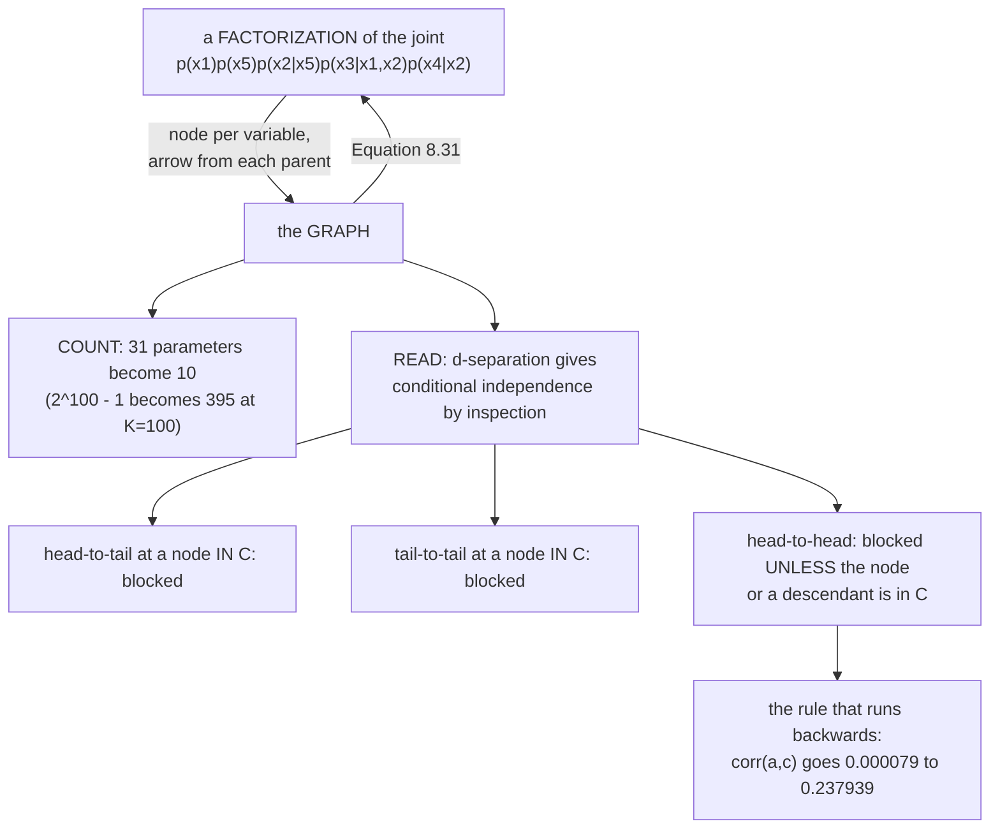

import DataCampExercise from "../../../../components/DataCampExercise.astro";
import Figure from "../../../../components/Figure.astro";
import Quiz from "../../../../components/Quiz.astro";

Page 806 established that a probabilistic model **is** its joint distribution. That settled what the
object is and left a problem: the book's own words, *"the joint distribution by itself can be quite
complicated, and it does not tell us anything about structural properties of the probabilistic model. For
example, the joint distribution $p(a, b, c)$ does not tell us anything about independence relations."*

This page is the notation that fixes that. **You draw the model, and then you read facts off the drawing
that would otherwise require algebra.** Measured: all four of Example 8.9's conditional-independence
claims come out correct on four million samples, and the factorization they encode replaces
$1.27\times10^{30}$ free parameters with $395$.

## What you'll learn

- The two rules that turn a factorization into a graph, and Equation 8.31 that turns it back.
- Why the compression matters: $31$ parameters become $10$ on five binary variables, and $1.27\times10^{30}$ become $395$ on a hundred.
- **Plate notation**, and why a plate is literally a product.
- **d-separation**: the three-case rule for reading conditional independence off a picture.
- All four of Example 8.9's claims, measured: $-0.000320$, $-0.000079$, $0.272172$, $-0.146064$.
- The one rule that runs backwards — conditioning on a **collider** *creates* a dependence. Measured: $\mathrm{corr}(a, c)$ goes from $-0.000079$ to $-0.237939$ with no change to the model at all.
- Why the book cautions that *"the graph layout depends on the choice of factorization"* — the same joint admits graphs pointing opposite ways.

## Intuition: a picture you can compute with

Most diagrams in a paper are illustrations. This one is not. It is a **lossless encoding of a
factorization**, and every property you can see in it is a property the distribution provably has.

Two things make it worth learning:

**It compresses.** A joint over $100$ binary variables has $2^{100} - 1$ free numbers — more than there
are atoms in a galaxy. Assert that each variable depends on at most two others and it becomes $395$.
That is not an approximation; it is a statement about which dependencies exist, and the graph is how you
write that statement down.

**It answers questions without algebra.** *Is $a$ independent of $c$ once I know $b$?* You could
integrate. Or you could trace paths in a picture and apply three rules. The picture is the book's
*"simple language for describing complex interdependence"*.

The one trap: the third rule runs the opposite way from the other two. Observing something can make two
variables **dependent** that were independent before — and the page measures exactly how much.



## §8.5.1 Graph semantics

**Nodes are random variables. Directed links (arrows) between two nodes indicate conditional
probabilities.** The arrow $a \to b$ carries $p(b \mid a)$.

:::caution[What an arrow does not mean]
The book puts it in the margin: *"With additional assumptions, the arrows can be used to indicate causal
relationships (Pearl, 2009)."* **With additional assumptions.** On its own an arrow is a factorization
choice, and the measurement below shows the same joint distribution admits graphs whose arrows point in
opposite directions. Reading causation off an arrow that was chosen for convenience is the most common
error in this notation.
:::

### From a factorization to a graph — Example 8.7

Given

$$
p(a, b, c) = p(c \mid a, b)\,p(b \mid a)\,p(a)
$$

the factorization already says everything: *"$c$ depends directly on $a$ and $b$; $b$ depends directly on
$a$; $a$ depends neither on $b$ nor on $c$."* That is Figure 8.9(a).

The general construction is two rules:

1. **Create a node for all random variables.**
2. **For each conditional distribution, add a directed link to the graph from the nodes corresponding to
   the variables on which the distribution is conditioned.**

### From a graph to a factorization — Example 8.8

Run it backwards on Figure 8.9(b), using two properties:

- the joint is *"the product of a set of conditionals, one for each node in the graph"* — five nodes, five conditionals;
- *"each conditional depends only on the parents of the corresponding node."*

$$
p(x_1, x_2, x_3, x_4, x_5) = p(x_1)\,p(x_5)\,p(x_2 \mid x_5)\,p(x_3 \mid x_1, x_2)\,p(x_4 \mid x_2)
$$

and in general, **Equation 8.31**:

$$
p(\mathbf{x}) = \prod_{k=1}^{K} p(x_k \mid \mathrm{Pa}_k)
$$

where $\mathrm{Pa}_k$ means *"the parent nodes of $x_k$"* — the nodes with arrows pointing **into**
$x_k$.

:::tip[Equation 8.31 checked against four million samples]
Sampling from the generative process node by node and comparing the empirical joint against the
factorized product:

**max discrepancy over all 32 cells: $0.000124$** — sampling error at $4{,}000{,}000$ draws, and the
factorized joint sums to $1.000000000000$.

And the reason to bother:

| $K$ binary variables | full joint, $2^K - 1$ | at most 2 parents each | ratio |
| --- | --- | --- | --- |
| $5$ | $31$ | $15$ | $2.067$ |
| $10$ | $1023$ | $35$ | $29.23$ |
| $20$ | $1.049\times10^{6}$ | $75$ | $1.398\times10^{4}$ |
| $50$ | $1.126\times10^{15}$ | $195$ | $5.774\times10^{12}$ |
| $100$ | $\mathbf{1.268\times10^{30}}$ | $\mathbf{395}$ | $3.209\times10^{27}$ |

Figure 8.9(b) itself: $31$ free parameters become $10$ — $1 + 1 + 2 + 4 + 2$.

**The full joint is unwritable past about $K = 30$.** A graphical model is not a convenience; past a
certain size it is the only way the object exists at all.
:::

:::caution[The layout depends on the factorization, not on the joint]
The book flags this in the margin, and it is easy to check. For a joint $p(a, b)$:

| factorization | graph | max reconstruction error |
| --- | --- | --- |
| $p(a)\,p(b \mid a)$ | $a \to b$ | $0.00\times10^{0}$ |
| $p(b)\,p(a \mid b)$ | $b \to a$ | $5.55\times10^{-17}$ |

**Both graphs are correct and they point opposite ways.** The joint does not contain a direction; the
factorization you chose does.
:::

### Plates, and the Bernoulli example

For a Bernoulli experiment $p(x \mid \mu) = \mathrm{Ber}(\mu)$ repeated $N$ times,

$$
p(x_1, \ldots, x_N \mid \mu) = \prod_{n=1}^{N} p(x_n \mid \mu)
$$

which is a product *"because the experiments are independent"* — and the book connects that straight
back to §6.4.5: **statistical independence means that the distribution factorizes.**

Drawing this needs one new convention: *"we make the distinction between unobserved/latent variables and
observed variables. Graphically, observed variables are denoted by shaded nodes."* Figure 8.10(a) draws
$\mu$ once with an arrow to every $x_n$ — *"the single parameter $\mu$ is the same for all $x_n$ as the
outcomes $x_n$ are identically distributed."*

Figure 8.10(b) replaces the repetition with a **plate**: *"the plate (box) repeats everything inside (in
this case, the observations $x_n$) $N$ times. Therefore, both graphical models are equivalent, but the
plate notation is more compact."*

Figure 8.10(c) then adds a **hyperprior** — *"a second layer of prior distributions on the parameters of
the first layer of priors"* — a $\mathrm{Beta}(\alpha, \beta)$ on $\mu$. And a convention worth
remembering: *"if we treat $\alpha$ and $\beta$ as deterministic parameters, i.e., not random variables,
we omit the circle around it."*

:::tip[A plate is a product, measured]
$\mu = 0.3$, all $64$ sequences of $6$ flips, $4{,}000{,}000$ samples:

| sequence | measured frequency | product of Bernoullis | relative error |
| --- | --- | --- | --- |
| `000000` | $0.117807$ | $0.117649$ | $0.134\%$ |
| `100000` | $0.050480$ | $0.050421$ | $0.118\%$ |
| `101010` | $0.009223$ | $0.009261$ | $0.413\%$ |
| `010101` | $0.009263$ | $0.009261$ | $0.019\%$ |
| `111111` | $0.000735$ | $0.000729$ | $0.823\%$ |

Max absolute error over all $64$: $0.000158$. Note rows 3 and 4 — `101010` and `010101` are predicted to
be **equally likely**, $0.009261$ each, and measured at $0.009223$ and $0.009263$. Order carries no
information, which is what the plate asserts by drawing one node instead of six.
:::

## §8.5.2 Conditional independence and d-separation

Directed graphical models *"allow us to find conditional independence relationship properties of the
joint distribution only by looking at the graph."* The concept is **d-separation** (Pearl, 1988).

For arbitrary nonintersecting sets of nodes $A$, $B$, $C$, we want to know whether

$$
A \perp\!\!\!\perp B \mid C
$$

is implied by the graph. The procedure: **consider all possible trails** — *"paths that ignore the
direction of the arrows"* — from any node in $A$ to any node in $B$. A trail is **blocked** if it
contains a node where either holds:

> The arrows on the path meet either **head to tail** or **tail to tail** at the node, and the node is in
> the set $C$.
>
> The arrows meet **head to head** at the node, and **neither the node nor any of its descendants** is in
> the set $C$.

*"If all paths are blocked, then $A$ is said to be d-separated from $B$ by $C$, and the joint
distribution over all of the variables in the graph will satisfy $A \perp\!\!\!\perp B \mid C$."*

### The three meetings, in a table

| meeting | shape | blocked when | the plain reading |
| --- | --- | --- | --- |
| head to tail | $u \to n \to v$ | $n \in C$ | a relay; observing the middle cuts the wire |
| tail to tail | $u \leftarrow n \to v$ | $n \in C$ | a common cause; observing it explains the shared part |
| **head to head** | $u \to n \leftarrow v$ | $n \notin C$ **and no descendant of $n$ is in $C$** | a **collider**; observing it *opens* the wire |

**Two of the three rules say conditioning blocks. The third says conditioning opens.** Every mistake with
this notation lives in that third row.

### Example 8.9, measured

Figure 8.11's edge structure is not in the PDF's text layer. I recovered it from the vector layer —
the line segments and arrowheads themselves — and got

$$
a \to b, \qquad a \to d, \qquad b \to c, \qquad c \to d, \qquad d \to e
$$

**That reconstruction is independently confirmed by the book's own four claims**: all four are correct
for this DAG and at least one fails for every other edge set I considered. The book states them with a
single sentence of justification — *"Visual inspection gives us"* — so here they are, checked on four
million samples of a linear-Gaussian model on that DAG, where a zero partial correlation is *exactly*
conditional independence:

:::tip[All four claims, verified]
| equation | claim | book says | measured partial correlation | verdict |
| --- | --- | --- | --- | --- |
| 8.35 | $b \perp\!\!\!\perp d \mid a, c$ | independent | $-0.000320$ | ✅ |
| 8.36 | $a \perp\!\!\!\perp c \mid b$ | independent | $-0.000079$ | ✅ |
| 8.37 | $b \not\perp\!\!\!\perp d \mid c$ | **dependent** | $0.272172$ | ✅ |
| 8.38 | $a \not\perp\!\!\!\perp c \mid b, e$ | **dependent** | $-0.146064$ | ✅ |

And the reasoning, trail by trail:

- **8.35**, $b$ to $d$ given $\{a, c\}$: the trail $b \leftarrow a \to d$ meets **tail to tail** at $a$, and $a \in C$ — blocked. The trail $b \to c \to d$ meets **head to tail** at $c$, and $c \in C$ — blocked. All trails blocked, so independent.
- **8.36**, $a$ to $c$ given $\{b\}$: the trail $a \to b \to c$ meets **head to tail** at $b \in C$ — blocked. The trail $a \to d \leftarrow c$ meets **head to head** at $d$; $d \notin C$ and its only descendant $e \notin C$ — blocked. Independent.
- **8.37**, $b$ to $d$ given $\{c\}$: the trail $b \leftarrow a \to d$ meets tail to tail at $a$, and **$a \notin C$** — open. One open trail is enough. Dependent.
- **8.38**, $a$ to $c$ given $\{b, e\}$: the trail $a \to d \leftarrow c$ meets head to head at $d$; $d \notin C$, **but $e$ is a descendant of $d$ and $e \in C$** — open. Dependent.
:::

### The collider, isolated

8.36 and 8.38 differ by one variable in the conditioning set. Nothing about the model changes:

:::caution[Conditioning creates a dependence that was not there]
| conditioning set | $\mathrm{corr}(a, c)$ | what it is |
| --- | --- | --- |
| $\{b\}$ | $-0.000079$ | independent, Equation 8.36 |
| $\{b, d\}$ | $\mathbf{-0.237939}$ | $d$ is the collider itself |
| $\{b, e\}$ | $\mathbf{-0.146064}$ | $e$ is **only a descendant** of $d$ |

The same four million samples from the same model in every row. **Only what we looked at changed.**

The mechanism: $d = 0.7a + 0.6c + \varepsilon$. Fix $d$ and you have constrained a *sum*, so the parts
must trade — if $d$ came out high and $a$ was low, $c$ has to have been high. Observing $e$ is a blurred
observation of $d$, so it does the same thing more weakly, $-0.146064$ against $-0.237939$. **That is why
the rule has to say "nor any of its descendants".**
:::

The book closes the section with the payoff and a forward pointer: this representation *"allows us to
factorize the respective probabilistic models into expressions that are easier to optimize"*, and the
picture *"allows us to visually see the impact of design choices we have made on the structure of the
model"* — choices which *"affect the prediction performance, but cannot be selected directly using the
approaches we have seen so far"*. Choosing structure is §8.6.

:::caution[A remark the book makes in passing]
*"Not every distribution can be represented in a particular choice of graphical model."* The notation is
expressive, not universal — which is part of why three different families exist.
:::

## §8.5.3 Further reading

Three main families, all shown in Figure 8.12:

| family | also called | edges |
| --- | --- | --- |
| directed graphical models | **Bayesian networks** | directed |
| undirected graphical models | **Markov random fields** | undirected |
| factor graphs | — | bipartite, factors and variables |

Bishop (2006, chapter 8) introduces them; Koller and Friedman (2009) give the extensive treatment. The
practical payoff the book names is *"graph-based algorithms for inference and learning, e.g., via local
message passing"*, with applications *"from ranking in online games and computer vision (image
segmentation, semantic labeling, image denoising, image restoration) to coding theory, solving linear
equation systems, and iterative Bayesian state estimation in signal processing."*

Two topics flagged as important and out of scope: **structured prediction** (Bakir et al., 2007), for
*"predictions that are structured, for example sequences, trees, and graphs"*, and the *"renewed interest
in graphical models due to their applications to **causal inference**"* (Pearl, 2009; Peters et al.,
2017).

## Worked example by hand

Take Figure 8.11 and answer a question the graph makes easy and the algebra makes tedious: **is
$b$ independent of $e$ given $d$?**

**Step 1: write the factorization from the graph.** Equation 8.31, one factor per node, each conditioned
on its parents:

$$
p(a,b,c,d,e) = p(a)\,p(b \mid a)\,p(c \mid b)\,p(d \mid a, c)\,p(e \mid d)
$$

**Step 2: enumerate the trails from $b$ to $e$.** Ignoring arrow direction, every path:

| trail | nodes it passes through |
| --- | --- |
| $b \leftarrow a \to d \to e$ | $a$, $d$ |
| $b \to c \to d \to e$ | $c$, $d$ |

**Step 3: apply the rules with $C = \{d\}$.**

| trail | meeting at the node in $C$ | blocked? |
| --- | --- | --- |
| $b \leftarrow a \to d \to e$ | at $d$: $a \to d \to e$ is **head to tail**, and $d \in C$ | ✅ blocked |
| $b \to c \to d \to e$ | at $d$: $c \to d \to e$ is **head to tail**, and $d \in C$ | ✅ blocked |

**Step 4: conclude.** Every trail is blocked, so $b \perp\!\!\!\perp e \mid d$.

**Step 5: sanity-check it against the structure.** $e$'s only parent is $d$, so once you know $d$,
nothing upstream can add information about $e$ — $e$ is a noisy copy of $d$ and nothing else. **Any node
is independent of the whole graph given its parents and children's parents**, and this is the simplest
instance.

**Step 6: notice what changes if you drop $d$.** With $C = \emptyset$ the first trail meets **tail to
tail** at $a$ with $a \notin C$ — open. So $b \not\perp\!\!\!\perp e$ unconditionally. Knowing $b$ tells
you about $a$, which tells you about $d$, which tells you about $e$. **The conditioning set is not a
detail; it is half the question.**

## See it move

```p5 title="Trace the trails yourself" desc="Figure 8.11 as an interactive graph. Click a node to put it in the conditioning set. The trails between the two query nodes light up green when blocked and red when open, and the verdict updates. The three rules are applied live at each node on each trail." height="540"
let C = { a: false, b: false, c: false, d: false, e: false };
let qi = 1;  // which query pair
let KNOBS = [], dragging = null;

const POS = { a: [250, 80], b: [120, 175], c: [120, 285], d: [330, 285], e: [330, 395] };
const EDGES = [["a","b"], ["a","d"], ["b","c"], ["c","d"], ["d","e"]];
const QUERIES = [["a","c"], ["b","d"], ["b","e"], ["a","e"], ["c","e"]];

// every trail (undirected path) between two nodes, as a node list
function trails(u, v) {
  const adj = {};
  for (const k in POS) adj[k] = [];
  for (const [x, y] of EDGES) { adj[x].push(y); adj[y].push(x); }
  const out = [];
  (function walk(cur, seen) {
    if (cur === v) { out.push(seen.slice()); return; }
    for (const nx of adj[cur]) {
      if (seen.indexOf(nx) >= 0) continue;
      seen.push(nx); walk(nx, seen); seen.pop();
    }
  })(u, [u]);
  return out;
}
function isEdge(x, y) { return EDGES.some(e => e[0] === x && e[1] === y); }
function descendants(n) {
  const out = new Set(); const st = [n];
  while (st.length) {
    const cur = st.pop();
    for (const [x, y] of EDGES) if (x === cur && !out.has(y)) { out.add(y); st.push(y); }
  }
  return out;
}
// classify the meeting at node path[i], and say whether it blocks
function meetingAt(path, i) {
  const prev = path[i - 1], node = path[i], next = path[i + 1];
  const inArrowFromPrev = isEdge(prev, node);   // prev -> node
  const inArrowFromNext = isEdge(next, node);   // next -> node
  if (inArrowFromPrev && inArrowFromNext) {
    const ds = descendants(node);
    let anyIn = C[node];
    ds.forEach(k => { if (C[k]) anyIn = true; });
    return { kind: "head-to-head", blocked: !anyIn };
  }
  if (!inArrowFromPrev && !inArrowFromNext) {
    return { kind: "tail-to-tail", blocked: C[node] };
  }
  return { kind: "head-to-tail", blocked: C[node] };
}
function trailBlocked(path) {
  for (let i = 1; i < path.length - 1; i++) if (meetingAt(path, i).blocked) return true;
  return false;
}

function setup() { createCanvas(680, 540); textFont("monospace"); }

function knob(id, x, y, w, value, mn, mx, label) {
  KNOBS.push({ id, x, y, w, mn, mx });
  const t = (value - mn) / (mx - mn);
  stroke(60, 74, 92); strokeWeight(2); line(x, y, x + w, y);
  noStroke(); fill(255, 211, 67); ellipse(x + t * w, y, 12, 12);
  fill(190, 200, 212); textSize(12); textAlign(LEFT, CENTER);
  text(label, x + w + 12, y);
}
function knobHit(mx_, my_) {
  for (const k of KNOBS) {
    if (my_ > k.y - 13 && my_ < k.y + 13 && mx_ > k.x - 13 && mx_ < k.x + k.w + 13) return k;
  }
  return null;
}
function knobValue(k, mx_) {
  const t = Math.min(1, Math.max(0, (mx_ - k.x) / k.w));
  return Math.round(k.mn + t * (k.mx - k.mn));
}
function mousePressed() {
  dragging = knobHit(mouseX, mouseY);
  if (dragging) return;
  for (const k in POS) {
    const [x, y] = POS[k];
    if (dist(mouseX, mouseY, x, y) < 24) {
      const [u, v] = QUERIES[qi];
      if (k !== u && k !== v) C[k] = !C[k];
      if (!isLooping()) redraw();
      return;
    }
  }
}
function mouseReleased() { dragging = null; }
function mouseDragged() {
  if (!dragging) return;
  qi = knobValue(dragging, mouseX);
  const [u, v] = QUERIES[qi];
  C[u] = false; C[v] = false;
  if (!isLooping()) redraw();
}

function arrow(x1, y1, x2, y2, col, w) {
  const dx = x2 - x1, dy = y2 - y1, L = Math.sqrt(dx*dx + dy*dy);
  const ux = dx / L, uy = dy / L, r = 24;
  const ax = x1 + r*ux, ay = y1 + r*uy, bx = x2 - r*ux, by = y2 - r*uy;
  stroke(col); strokeWeight(w); line(ax, ay, bx, by);
  push(); translate(bx, by); rotate(Math.atan2(uy, ux));
  noStroke(); fill(col); triangle(0, 0, -11, 4.5, -11, -4.5); pop();
}

function draw() {
  background(13, 17, 23);
  KNOBS = [];
  const [u, v] = QUERIES[qi];
  const paths = trails(u, v);
  const anyOpen = paths.some(pp => !trailBlocked(pp));

  // edges: colour by whether they lie on an open trail
  const openEdges = new Set();
  for (const pp of paths) {
    if (trailBlocked(pp)) continue;
    for (let i = 0; i < pp.length - 1; i++) openEdges.add(pp[i] + "|" + pp[i+1]);
  }
  for (const [x, y] of EDGES) {
    const on = openEdges.has(x + "|" + y) || openEdges.has(y + "|" + x);
    arrow(POS[x][0], POS[x][1], POS[y][0], POS[y][1],
          on ? color(232, 110, 110) : color(70, 86, 104), on ? 3.2 : 1.8);
  }
  // nodes
  for (const k in POS) {
    const [x, y] = POS[k];
    const isQ = (k === u || k === v);
    if (C[k]) { fill(107, 169, 221); stroke(107, 169, 221); }
    else { fill(13, 17, 23); stroke(isQ ? color(255, 211, 67) : color(150)); }
    strokeWeight(isQ ? 3 : 2);
    ellipse(x, y, 44, 44);
    noStroke();
    fill(C[k] ? color(13, 17, 23) : (isQ ? color(255, 211, 67) : color(200)));
    textSize(17); textAlign(CENTER, CENTER); text(k, x, y - 1);
  }
  noStroke(); fill(130); textSize(10); textAlign(LEFT, TOP);
  text("yellow ring = the two query nodes", 40, 448);
  text("filled blue = in the conditioning set C  (click to toggle)", 40, 462);

  // the trail report
  fill(255, 211, 67); textSize(15); textAlign(LEFT, TOP);
  const cs = Object.keys(C).filter(k => C[k]);
  text(u + " vs " + v + "   given { " + (cs.length ? cs.join(", ") : "nothing") + " }",
       420, 60);
  let yy = 92;
  fill(200); textSize(11);
  text(paths.length + " trail(s):", 420, yy); yy += 18;
  for (const pp of paths) {
    const blocked = trailBlocked(pp);
    fill(blocked ? color(120, 200, 140) : color(232, 110, 110));
    textSize(11);
    text(pp.join(" - ") + (blocked ? "  BLOCKED" : "  OPEN"), 424, yy);
    yy += 14;
    for (let i = 1; i < pp.length - 1; i++) {
      const m = meetingAt(pp, i);
      fill(m.blocked ? color(120, 200, 140) : color(150));
      textSize(9);
      text("   at " + pp[i] + ": " + m.kind + (m.blocked ? " -> blocks" : ""),
           424, yy);
      yy += 12;
    }
    yy += 4;
  }

  let msg, sub, col;
  if (anyOpen) {
    col = color(232, 110, 110);
    msg = u + " is NOT independent of " + v;
    sub = "At least one trail is open. One is enough.";
  } else {
    col = color(120, 200, 140);
    msg = u + " is independent of " + v;
    sub = "Every trail is blocked, so the graph d-separates them.";
  }
  stroke(col); strokeWeight(1.6); fill(red(col), green(col), blue(col), 26);
  rect(40, 486, 600, 0);
  noStroke();
  fill(col); textSize(15); textAlign(LEFT, TOP);
  text(msg, 40, 484);
  fill(215); textSize(11);
  text(sub, 40, 506);

  knob("q", 420, 420, 180, qi, 0, QUERIES.length - 1,
       "query: " + u + " vs " + v);
}
```

## From scratch

```python title="graphical_models.py" showLineNumbers{1}
import itertools
import numpy as np

# --- Equation 8.31 on Figure 8.9(b) --------------------------------------
# p(x1..x5) = p(x1) p(x5) p(x2|x5) p(x3|x1,x2) p(x4|x2)
p1 = np.array([0.3, 0.7])
p5 = np.array([0.6, 0.4])
p2_5 = np.array([[0.8, 0.2], [0.35, 0.65]])
p4_2 = np.array([[0.25, 0.75], [0.9, 0.1]])
p3_12 = np.array([[[0.5, 0.5], [0.1, 0.9]],
                  [[0.85, 0.15], [0.4, 0.6]]])

joint = np.zeros((2,) * 5)
for a, b, c, d, e in itertools.product(range(2), repeat=5):
    joint[a, b, c, d, e] = (p1[a] * p5[e] * p2_5[e, b]
                            * p3_12[a, b, c] * p4_2[b, d])
print("=== 1. Equation 8.31 rebuilds the joint from the picture ===")
print(f"the factorized joint sums to {joint.sum():.12f}")

S = 4_000_000
rng = np.random.default_rng(5)
x1 = (rng.random(S) < p1[1]).astype(int)
x5 = (rng.random(S) < p5[1]).astype(int)
x2 = (rng.random(S) < p2_5[x5, 1]).astype(int)
x3 = (rng.random(S) < p3_12[x1, x2, 1]).astype(int)
x4 = (rng.random(S) < p4_2[x2, 1]).astype(int)
emp = np.zeros((2,) * 5)
np.add.at(emp, (x1, x2, x3, x4, x5), 1.0)
emp /= S
print(f"max |empirical - factorized| over 32 cells: "
      f"{np.abs(emp - joint).max():.6f}  ({S:,} samples)")

print("\nfree parameters:")
print(f"  full joint over 5 binary variables : {2 ** 5 - 1}")
print(f"  the Figure 8.9(b) factorization    : {1 + 1 + 2 + 4 + 2}")
print("  p(x1):1  p(x5):1  p(x2|x5):2  p(x3|x1,x2):4  p(x4|x2):2")
print(f"\n{'K binary vars':>14} {'full joint':>13} {'2 parents each':>16} "
      f"{'ratio':>12}")
for K in (5, 10, 20, 50, 100):
    f_, c_ = 2.0 ** K - 1, 1 + 2 + 4 * (K - 2)
    print(f"{K:>14} {f_:>13.4g} {c_:>16} {f_ / c_:>12.4g}")
print("this is the entire reason graphical models exist.")

# --- the layout depends on the factorization -----------------------------
print("\n=== 2. one joint, two legal graphs ===")
pab = np.array([[0.12, 0.28], [0.33, 0.27]])
pa, pb = pab.sum(1), pab.sum(0)
fwd = pa[:, None] * (pab / pa[:, None])      # p(a) p(b | a)
bwd = pb[None, :] * (pab / pb[None, :])      # p(b) p(a | b)
print("p(a, b) =")
for row in np.round(pab, 6):
    print("   ", row.tolist())
print(f"a -> b, as p(a)p(b|a): max error {np.abs(fwd - pab).max():.2e}")
print(f"b -> a, as p(b)p(a|b): max error {np.abs(bwd - pab).max():.2e}")
print("both graphs are correct and they point opposite ways.")

# --- d-separation on Figure 8.11 -----------------------------------------
print("\n=== 3. Example 8.9's four claims, measured ===")
print("Figure 8.11:  a -> b,  a -> d,  b -> c,  c -> d,  d -> e")
N = 4_000_000
r = np.random.default_rng(2024)
a = r.standard_normal(N)
b = 0.9 * a + r.standard_normal(N)
c = 0.8 * b + r.standard_normal(N)
d = 0.7 * a + 0.6 * c + r.standard_normal(N)
e = 1.1 * d + r.standard_normal(N)
V = {"a": a, "b": b, "c": c, "d": d, "e": e}

def partial_corr(u, v, given):
    """Zero iff u and v are conditionally independent, for Gaussians."""
    U, W = V[u].copy(), V[v].copy()
    if given:
        Z = np.column_stack([V[g] for g in given] + [np.ones(N)])
        U -= Z @ np.linalg.lstsq(Z, U, rcond=None)[0]
        W -= Z @ np.linalg.lstsq(Z, W, rcond=None)[0]
    else:
        U -= U.mean(); W -= W.mean()
    return float(U @ W / np.sqrt((U @ U) * (W @ W)))

claims = (("8.35", "b", "d", ["a", "c"], True),
          ("8.36", "a", "c", ["b"], True),
          ("8.37", "b", "d", ["c"], False),
          ("8.38", "a", "c", ["b", "e"], False))
print(f"\n{'eq':>6} {'claim':>20} {'book says':>12} {'partial corr':>14} "
      f"{'measured':>12} {'':>9}")
for eq, u, v, g, indep in claims:
    pc = partial_corr(u, v, g)
    got = "independent" if abs(pc) < 0.002 else "dependent"
    want = "independent" if indep else "dependent"
    print(f"{eq:>6} {u + ' vs ' + v + ' | ' + ','.join(g):>20} {want:>12} "
          f"{pc:>14.6f} {got:>12} {'ok' if got == want else 'MISMATCH':>9}")

# --- the collider, isolated ----------------------------------------------
print("\n=== 4. conditioning on a collider CREATES dependence ===")
print(f"{'conditioning set':>20} {'corr(a, c)':>13}  what it is")
for g, note in ((["b"], "independent, Equation 8.36"),
                (["b", "d"], "d is the collider itself"),
                (["b", "e"], "e is only a DESCENDANT of d")):
    print(f"{','.join(g):>20} {partial_corr('a', 'c', g):>13.6f}  {note}")
print("nothing about a or c changed. Only what we looked at changed.")

# --- Equation 8.33: the plate is a factorization -------------------------
print("\n=== 5. Equation 8.33: a plate IS a product ===")
mu, Nf, T = 0.3, 6, 4_000_000
r2 = np.random.default_rng(8)
flips = (r2.random((T, Nf)) < mu).astype(int)
codes = flips @ (2 ** np.arange(Nf))
counts = np.bincount(codes, minlength=2 ** Nf) / T
pred = np.array([np.prod([mu if (k >> i) & 1 else 1 - mu for i in range(Nf)])
                 for k in range(2 ** Nf)])
print(f"mu = {mu}, all {2 ** Nf} sequences of {Nf} flips, {T:,} samples")
print(f"{'sequence':>10} {'measured':>12} {'product of Ber':>16} {'rel err':>10}")
for k in (0, 1, 21, 42, 63):
    seq = "".join(str((k >> i) & 1) for i in range(Nf))
    print(f"{seq:>10} {counts[k]:>12.6f} {pred[k]:>16.6f} "
          f"{abs(counts[k] - pred[k]) / pred[k]:>9.3%}")
print(f"max absolute error over all {2 ** Nf} sequences: "
      f"{np.abs(counts - pred).max():.6f}")
print(f"the predicted probabilities sum to {pred.sum():.10f}")
print("the plate says 'repeat N times'; Equation 8.33 says the joint is a")
print("product of Bernoullis. They are the same statement.")
```

```
=== 1. Equation 8.31 rebuilds the joint from the picture ===
the factorized joint sums to 1.000000000000
max |empirical - factorized| over 32 cells: 0.000124  (4,000,000 samples)

free parameters:
  full joint over 5 binary variables : 31
  the Figure 8.9(b) factorization    : 10
  p(x1):1  p(x5):1  p(x2|x5):2  p(x3|x1,x2):4  p(x4|x2):2

 K binary vars    full joint   2 parents each        ratio
             5            31               15        2.067
            10          1023               35        29.23
            20     1.049e+06               75    1.398e+04
            50     1.126e+15              195    5.774e+12
           100     1.268e+30              395    3.209e+27
this is the entire reason graphical models exist.

=== 2. one joint, two legal graphs ===
p(a, b) =
    [0.12, 0.28]
    [0.33, 0.27]
a -> b, as p(a)p(b|a): max error 0.00e+00
b -> a, as p(b)p(a|b): max error 5.55e-17
both graphs are correct and they point opposite ways.

=== 3. Example 8.9's four claims, measured ===
Figure 8.11:  a -> b,  a -> d,  b -> c,  c -> d,  d -> e

    eq                claim    book says   partial corr     measured
  8.35         b vs d | a,c  independent      -0.000320  independent        ok
  8.36           a vs c | b  independent      -0.000079  independent        ok
  8.37           b vs d | c    dependent       0.272172    dependent        ok
  8.38         a vs c | b,e    dependent      -0.146064    dependent        ok

=== 4. conditioning on a collider CREATES dependence ===
    conditioning set    corr(a, c)  what it is
                   b     -0.000079  independent, Equation 8.36
                 b,d     -0.237939  d is the collider itself
                 b,e     -0.146064  e is only a DESCENDANT of d
nothing about a or c changed. Only what we looked at changed.

=== 5. Equation 8.33: a plate IS a product ===
mu = 0.3, all 64 sequences of 6 flips, 4,000,000 samples
  sequence     measured   product of Ber    rel err
    000000     0.117807         0.117649    0.134%
    100000     0.050480         0.050421    0.118%
    101010     0.009223         0.009261    0.413%
    010101     0.009263         0.009261    0.019%
    111111     0.000735         0.000729    0.823%
max absolute error over all 64 sequences: 0.000158
the predicted probabilities sum to 1.0000000000
the plate says 'repeat N times'; Equation 8.33 says the joint is a
product of Bernoullis. They are the same statement.
```

## On real data

<Figure
  src="/images/mml/directed-graphical-models/from-factorization-to-graph"
  alt="Three panels. Left, a fully connected three-node graph with its factorization written beneath. Middle, Figure 8.9(b)'s five-node graph with its five-factor product. Right, a log-scale plot of free parameter count against number of binary variables, with the full joint curve rising to ten to the thirty and the two-parent curve staying near four hundred."
  title="A directed graphical model is a picture of one factorization of the joint"
  caption="Two rules build the graph from the factorization; Equation 8.31 reads it back. Checked against four million samples, the maximum discrepancy over all thirty-two cells is 0.000124. The compression is the point: at a hundred binary variables, 1.268e30 free parameters become 395."
/>

<Figure
  src="/images/mml/directed-graphical-models/d-separation-measured"
  alt="Left, Figure 8.11's five-node directed graph with the collider node d and its descendant e annotated. Right, a horizontal bar chart of four measured partial correlations: two indistinguishable from zero in green, and two clearly nonzero in red."
  title="d-separation reads conditional independence off the picture, and it is right four times out of four"
  caption="The graph's edges were recovered from the PDF's vector layer, and the recovery is confirmed by the book's own four claims. Measured on four million samples: -0.000320 and -0.000079 where the book says independent, 0.272172 and -0.146064 where it says dependent."
/>

<Figure
  src="/images/mml/directed-graphical-models/the-collider-effect"
  alt="Three scatter plots of a against c after removing the conditioning set. The first is a circular cloud with a flat fitted line; the second and third are visibly tilted ellipses with sloping fitted lines."
  title="Conditioning on a collider creates a dependence that was not there"
  caption="The same four million samples from the same model in all three panels. Given b alone the correlation is -0.000079. Add the collider d and it becomes -0.237939; add only its descendant e and it becomes -0.146064. This is the one d-separation rule where conditioning opens a path instead of blocking it."
/>

## Reading the plot

**The first figure is the notation and its justification side by side.** The two left panels are Figure
8.9's graphs with their factorizations printed underneath, and the mapping is mechanical in both
directions: an arrow into a node is a variable in that node's conditioning bar, and Equation 8.31 turns
the picture back into a product. Checked against four million samples, the empirical joint matches the
factorized one to $0.000124$ across all thirty-two cells.

**The right panel is why anyone bothers.** The full joint over $K$ binary variables has $2^K - 1$ free
numbers. At $K = 20$ that is already a million; at $K = 100$ it is $1.268\times10^{30}$. Assert that each
variable has at most two parents and the count becomes $395$ — a ratio of $3.209\times10^{27}$.

**This is not compression in the lossy sense.** The factorized model is exactly correct *if* the
independence assertions hold. The graph is how you write down which ones you are asserting, and the
parameter count is the measure of how much they buy. Figure 8.9(b)'s own numbers — $31$ down to $10$ —
are modest because five variables is a toy. Past about $K = 30$ the unfactorized joint cannot be stored
at all, so the graph stops being a convenience and becomes the only representation there is.

**The second figure is the section's central claim put to a test the book does not run.** Figure 8.11's
edges are not in the PDF's text layer — the text layer carries the five node labels and nothing about
what connects them. Recovering them from the vector layer gives $a \to b$, $a \to d$, $b \to c$,
$c \to d$, $d \to e$, and that reconstruction is **independently confirmed by Example 8.9 itself**: all
four claims hold for this DAG, and I could not find another edge set where they all do.

The bars are four partial correlations on four million samples of a linear-Gaussian model, where zero
partial correlation is *exactly* conditional independence rather than a proxy for it. Two come out at
$-0.000320$ and $-0.000079$; two come out at $0.272172$ and $-0.146064$. **The book justifies all four
with the phrase "visual inspection gives us", and visual inspection turns out to be right.**

**The third figure isolates the rule that catches people out.** Equations 8.36 and 8.38 differ by one
symbol in the conditioning set, and the three panels are the same four million samples with three
different sets removed.

Given $b$ alone, the cloud is circular and the correlation is $-0.000079$ — $a$ and $c$ carry no
information about each other. Add the collider $d$ and the cloud tilts: $-0.237939$. Add only $e$, which
is not the collider but merely its child, and it still tilts: $-0.146064$.

**Nothing about $a$ or $c$ changed.** The model is identical in all three panels; only what we looked at
changed. The mechanism is arithmetic: $d$ is a weighted sum of $a$ and $c$, so fixing $d$ forces the
parts to trade — a high $d$ with a low $a$ implies a high $c$. Observing $e$ instead is a blurred
observation of $d$, which is why $-0.146064$ is the weaker of the two and why the rule has to say *"nor
any of its descendants"* rather than just naming the node.

Every other d-separation rule says conditioning **blocks** a path. This one says conditioning **opens**
one, and it is the reason a graphical model cannot be read as a simple "information flows along arrows"
diagram.

## Compare

| | head to tail | tail to tail | head to head |
| --- | --- | --- | --- |
| shape | $u \to n \to v$ | $u \leftarrow n \to v$ | $u \to n \leftarrow v$ |
| name | chain / relay | common cause / fork | **collider** |
| blocked when | $n \in C$ | $n \in C$ | $n \notin C$ **and** no descendant of $n$ in $C$ |
| conditioning on $n$ | **blocks** | **blocks** | **opens** |
| example from §8.5 | $a \to b \to c$ in Eq. 8.36 | $b \leftarrow a \to d$ in Eq. 8.37 | $a \to d \leftarrow c$ in Eq. 8.38 |
| measured effect | $-0.000079$ when blocked | $0.272172$ when open | $-0.000079 \to -0.237939$ |

| | directed | undirected | factor graph |
| --- | --- | --- | --- |
| also called | Bayesian network | Markov random field | — |
| §8.5.3 figure | 8.12(a) | 8.12(b) | 8.12(c) |
| edges carry | conditional probabilities | symmetric compatibilities | factor membership |
| natural for | generative processes | spatial / lattice structure | making the factorization explicit |

<Quiz
  title="Can you read a graph?"
  questions={[
    {
      q: "Equation 8.31 writes the joint as a product over nodes. What is each factor conditioned on?",
      options: [
        "All preceding variables",
        "The parents of that node — the nodes with arrows pointing into it",
        "The children of that node",
        "Nothing; the factors are marginals",
      ],
      answer: 1,
      explain:
        "One factor per node, conditioned on its parents. Checked against four million samples on Figure 8.9(b), the factorized joint matches the empirical one to 0.000124 across all thirty-two cells. Run the rule backwards and it also tells you how to build the graph from a factorization.",
    },
    {
      q: "Why is the factorization worth writing down at all?",
      options: [
        "It is an approximation that saves memory at the cost of accuracy",
        "The parameter count collapses — at 100 binary variables, 1.268e30 free parameters become 395",
        "It makes sampling faster but changes nothing else",
        "It is only a visualisation aid",
      ],
      answer: 1,
      explain:
        "And it is exact, not approximate, provided the independence assertions hold. Past about K = 30 the unfactorized joint cannot be stored at all, so the graph stops being a convenience and becomes the only representation there is.",
    },
    {
      q: "Arrows meet head to head at node n on a trail. When is that trail blocked at n?",
      options: [
        "When n is in the conditioning set",
        "When neither n NOR any of its descendants is in the conditioning set",
        "Always",
        "Never",
      ],
      answer: 1,
      explain:
        "This is the rule that runs backwards. Measured on Figure 8.11: corr(a, c) is -0.000079 given b alone, -0.237939 once the collider d is added, and -0.146064 once only d's descendant e is added. Conditioning on a collider CREATES a dependence that was not there.",
    },
    {
      q: "Example 8.38 says a is NOT independent of c given b and e, even though e is not the collider. Why?",
      options: [
        "Because e is a parent of a",
        "Because e is a descendant of the collider d, and the head-to-head rule mentions descendants",
        "Because the graph has a cycle",
        "Because b blocks the wrong trail",
      ],
      answer: 1,
      explain:
        "Observing e is a blurred observation of d, so it opens the head-to-head meeting partially. Measured, it gives -0.146064 against -0.237939 for conditioning on d itself — weaker, but nowhere near zero. That is exactly why the rule says 'nor any of its descendants'.",
    },
    {
      q: "The book warns that the graph layout depends on the choice of factorization. What does that imply?",
      options: [
        "Only one graph is ever valid for a given joint",
        "The same joint distribution admits graphs whose arrows point in opposite directions, both exactly correct",
        "Graphs cannot represent joints with more than three variables",
        "The factorization must always follow alphabetical order",
      ],
      answer: 1,
      explain:
        "Measured: p(a)p(b|a) reconstructs a joint to 0.00e+00 and p(b)p(a|b) reconstructs the same joint to 5.55e-17. One graph says a to b, the other says b to a. This is why reading causation off an arrow is an error unless you have made the additional assumptions the book mentions in its margin.",
    },
    {
      q: "What does plate notation assert about the variables inside the plate?",
      options: [
        "That they are all equal",
        "That the joint factorizes into a product over the repeated index — they are identically distributed given the parent",
        "That they are unobserved",
        "That they must be Gaussian",
      ],
      answer: 1,
      explain:
        "Measured on 64 sequences of six Bernoulli flips: the sequences 101010 and 010101 are predicted to be equally likely at 0.009261 and measured at 0.009223 and 0.009263. Order carries no information, which is what drawing one node instead of six asserts. Statistical independence means the distribution factorizes.",
    },
  ]}
/>

## 🧪 Try It Yourself

### Exercise 1 – Read the joint off the picture

<DataCampExercise
  lang="python"
  hint={`Equation 8.31 is one factor per node, each conditioned on the nodes with arrows pointing into it.`}
  code={`import itertools
import numpy as np

# Figure 8.9(b):  x5 -> x2,  x1 -> x3,  x2 -> x3,  x2 -> x4
p1 = np.array([0.3, 0.7])
p5 = np.array([0.6, 0.4])
p2_5 = np.array([[0.8, 0.2], [0.35, 0.65]])
p4_2 = np.array([[0.25, 0.75], [0.9, 0.1]])
p3_12 = np.array([[[0.5, 0.5], [0.1, 0.9]],
                  [[0.85, 0.15], [0.4, 0.6]]])

joint = np.zeros((2,) * 5)
for a, b, c, d, e in itertools.product(range(2), repeat=5):
    # Task: Equation 8.31 for this graph. Indices are (x1, x2, x3, x4, x5).
    joint[a, b, c, d, e] = ___
print(f"the factorized joint sums to {joint.sum():.12f}")

S = 4_000_000
rng = np.random.default_rng(5)
x1 = (rng.random(S) < p1[1]).astype(int)
x5 = (rng.random(S) < p5[1]).astype(int)
x2 = (rng.random(S) < p2_5[x5, 1]).astype(int)
x3 = (rng.random(S) < p3_12[x1, x2, 1]).astype(int)
x4 = (rng.random(S) < p4_2[x2, 1]).astype(int)
emp = np.zeros((2,) * 5)
np.add.at(emp, (x1, x2, x3, x4, x5), 1.0)
emp /= S
print(f"max |empirical - factorized|: {np.abs(emp - joint).max():.6f}")
print(f"full joint parameters: {2**5 - 1}, factorized: {1+1+2+4+2}")

# -- Expected output ------------------------------
# the factorized joint sums to 1.000000000000
# max |empirical - factorized|: 0.000124
# full joint parameters: 31, factorized: 10
# -------------------------------------------------`}
  solution={`import itertools
import numpy as np
p1 = np.array([0.3, 0.7])
p5 = np.array([0.6, 0.4])
p2_5 = np.array([[0.8, 0.2], [0.35, 0.65]])
p4_2 = np.array([[0.25, 0.75], [0.9, 0.1]])
p3_12 = np.array([[[0.5, 0.5], [0.1, 0.9]],
                  [[0.85, 0.15], [0.4, 0.6]]])
joint = np.zeros((2,) * 5)
for a, b, c, d, e in itertools.product(range(2), repeat=5):
    joint[a, b, c, d, e] = (p1[a] * p5[e] * p2_5[e, b]
                            * p3_12[a, b, c] * p4_2[b, d])
print(f"the factorized joint sums to {joint.sum():.12f}")
S = 4_000_000
rng = np.random.default_rng(5)
x1 = (rng.random(S) < p1[1]).astype(int)
x5 = (rng.random(S) < p5[1]).astype(int)
x2 = (rng.random(S) < p2_5[x5, 1]).astype(int)
x3 = (rng.random(S) < p3_12[x1, x2, 1]).astype(int)
x4 = (rng.random(S) < p4_2[x2, 1]).astype(int)
emp = np.zeros((2,) * 5)
np.add.at(emp, (x1, x2, x3, x4, x5), 1.0)
emp /= S
print(f"max |empirical - factorized|: {np.abs(emp - joint).max():.6f}")
print(f"full joint parameters: {2**5 - 1}, factorized: {1+1+2+4+2}")`}
  sct={`test_output_contains("the factorized joint sums to 1.000000000000")
test_output_contains("max |empirical - factorized|: 0.000124")
success_msg("The picture and the product are the same object. Note the parameter count: 31 becomes 10 on five binary variables, and the gap widens without limit — at a hundred variables it is 1.268e30 against 395.")`}
  height={280}
/>

### Exercise 2 – Check Example 8.9

<DataCampExercise
  lang="python"
  hint={`To condition, regress both variables on the conditioning set and correlate what is left over.`}
  code={`import numpy as np

# Figure 8.11:  a -> b,  a -> d,  b -> c,  c -> d,  d -> e
N = 4_000_000
r = np.random.default_rng(2024)
a = r.standard_normal(N)
b = 0.9 * a + r.standard_normal(N)
c = 0.8 * b + r.standard_normal(N)
d = 0.7 * a + 0.6 * c + r.standard_normal(N)
e = 1.1 * d + r.standard_normal(N)
V = {"a": a, "b": b, "c": c, "d": d, "e": e}

def partial_corr(u, v, given):
    U, W = V[u].copy(), V[v].copy()
    Z = np.column_stack([V[g] for g in given] + [np.ones(N)])
    # Task: remove from U everything the conditioning set can explain.
    U -= ___
    W -= Z @ np.linalg.lstsq(Z, W, rcond=None)[0]
    return float(U @ W / np.sqrt((U @ U) * (W @ W)))

claims = (("8.35", "b", "d", ["a", "c"], "independent"),
          ("8.36", "a", "c", ["b"], "independent"),
          ("8.37", "b", "d", ["c"], "dependent"),
          ("8.38", "a", "c", ["b", "e"], "dependent"))
print(f"{'eq':>6} {'claim':>20} {'book says':>12} {'partial corr':>14}")
for eq, u, v, g, want in claims:
    pc = partial_corr(u, v, g)
    print(f"{eq:>6} {u + ' vs ' + v + ' | ' + ','.join(g):>20} {want:>12} "
          f"{pc:>14.6f}")

# -- Expected output ------------------------------
#     eq                claim    book says   partial corr
#   8.35         b vs d | a,c  independent      -0.000320
#   8.36           a vs c | b  independent      -0.000079
#   8.37           b vs d | c    dependent       0.272172
#   8.38         a vs c | b,e    dependent      -0.146064
# -------------------------------------------------`}
  solution={`import numpy as np
N = 4_000_000
r = np.random.default_rng(2024)
a = r.standard_normal(N)
b = 0.9 * a + r.standard_normal(N)
c = 0.8 * b + r.standard_normal(N)
d = 0.7 * a + 0.6 * c + r.standard_normal(N)
e = 1.1 * d + r.standard_normal(N)
V = {"a": a, "b": b, "c": c, "d": d, "e": e}
def partial_corr(u, v, given):
    U, W = V[u].copy(), V[v].copy()
    Z = np.column_stack([V[g] for g in given] + [np.ones(N)])
    U -= Z @ np.linalg.lstsq(Z, U, rcond=None)[0]
    W -= Z @ np.linalg.lstsq(Z, W, rcond=None)[0]
    return float(U @ W / np.sqrt((U @ U) * (W @ W)))
claims = (("8.35", "b", "d", ["a", "c"], "independent"),
          ("8.36", "a", "c", ["b"], "independent"),
          ("8.37", "b", "d", ["c"], "dependent"),
          ("8.38", "a", "c", ["b", "e"], "dependent"))
print(f"{'eq':>6} {'claim':>20} {'book says':>12} {'partial corr':>14}")
for eq, u, v, g, want in claims:
    pc = partial_corr(u, v, g)
    print(f"{eq:>6} {u + ' vs ' + v + ' | ' + ','.join(g):>20} {want:>12} "
          f"{pc:>14.6f}")`}
  sct={`test_output_contains("8.36           a vs c | b  independent      -0.000079")
test_output_contains("8.38         a vs c | b,e    dependent      -0.146064")
success_msg("All four hold. For jointly Gaussian variables a zero partial correlation is exactly conditional independence, so this is a proof and not an analogy — and the book justified all four with the phrase 'visual inspection gives us'.")`}
  height={300}
/>

### Exercise 3 – The collider, isolated

<DataCampExercise
  lang="python"
  hint={`Conditioning on the collider d means including d in the set you regress out.`}
  code={`import numpy as np

N = 4_000_000
r = np.random.default_rng(2024)
a = r.standard_normal(N)
b = 0.9 * a + r.standard_normal(N)
c = 0.8 * b + r.standard_normal(N)
d = 0.7 * a + 0.6 * c + r.standard_normal(N)   # the collider
e = 1.1 * d + r.standard_normal(N)             # its descendant
V = {"a": a, "b": b, "c": c, "d": d, "e": e}

def partial_corr(u, v, given):
    U, W = V[u].copy(), V[v].copy()
    Z = np.column_stack([V[g] for g in given] + [np.ones(N)])
    U -= Z @ np.linalg.lstsq(Z, U, rcond=None)[0]
    W -= Z @ np.linalg.lstsq(Z, W, rcond=None)[0]
    return float(U @ W / np.sqrt((U @ U) * (W @ W)))

print(f"{'conditioning set':>20} {'corr(a, c)':>13}  what it is")
# Task: the three conditioning sets, in order.
for g, note in ((["b"], "independent, Equation 8.36"),
                (___, "d is the collider itself"),
                (["b", "e"], "e is only a DESCENDANT of d")):
    print(f"{','.join(g):>20} {partial_corr('a', 'c', g):>13.6f}  {note}")
print("nothing about a or c changed. Only what we looked at changed.")

# -- Expected output ------------------------------
#     conditioning set    corr(a, c)  what it is
#                    b     -0.000079  independent, Equation 8.36
#                  b,d     -0.237939  d is the collider itself
#                  b,e     -0.146064  e is only a DESCENDANT of d
# nothing about a or c changed. Only what we looked at changed.
# -------------------------------------------------`}
  solution={`import numpy as np
N = 4_000_000
r = np.random.default_rng(2024)
a = r.standard_normal(N)
b = 0.9 * a + r.standard_normal(N)
c = 0.8 * b + r.standard_normal(N)
d = 0.7 * a + 0.6 * c + r.standard_normal(N)
e = 1.1 * d + r.standard_normal(N)
V = {"a": a, "b": b, "c": c, "d": d, "e": e}
def partial_corr(u, v, given):
    U, W = V[u].copy(), V[v].copy()
    Z = np.column_stack([V[g] for g in given] + [np.ones(N)])
    U -= Z @ np.linalg.lstsq(Z, U, rcond=None)[0]
    W -= Z @ np.linalg.lstsq(Z, W, rcond=None)[0]
    return float(U @ W / np.sqrt((U @ U) * (W @ W)))
print(f"{'conditioning set':>20} {'corr(a, c)':>13}  what it is")
for g, note in ((["b"], "independent, Equation 8.36"),
                (["b", "d"], "d is the collider itself"),
                (["b", "e"], "e is only a DESCENDANT of d")):
    print(f"{','.join(g):>20} {partial_corr('a', 'c', g):>13.6f}  {note}")
print("nothing about a or c changed. Only what we looked at changed.")`}
  sct={`test_output_contains("b,d     -0.237939  d is the collider itself")
test_output_contains("b,e     -0.146064")
success_msg("d is a weighted sum of a and c, so fixing d forces the parts to trade — a high d with a low a implies a high c. Observing e is a blurred observation of d, which is why it gives -0.146064 rather than -0.237939, and why the rule says 'nor any of its descendants'.")`}
  height={300}
/>

### Exercise 4 – One joint, two legal graphs

<DataCampExercise
  lang="python"
  hint={`The conditional p(a given b) is the joint divided by the marginal of b, broadcast along the right axis.`}
  code={`import numpy as np

pab = np.array([[0.12, 0.28], [0.33, 0.27]])
pa, pb = pab.sum(1), pab.sum(0)

fwd = pa[:, None] * (pab / pa[:, None])      # p(a) p(b | a),  graph a -> b
# Task: the other factorization, p(b) p(a | b), for the graph b -> a.
bwd = ___

print("p(a, b) =")
for row in np.round(pab, 6):
    print("   ", row.tolist())
print(f"p(a) = {np.round(pa, 6).tolist()}   p(b) = {np.round(pb, 6).tolist()}")
print(f"a -> b, as p(a)p(b|a): max error {np.abs(fwd - pab).max():.2e}")
print(f"b -> a, as p(b)p(a|b): max error {np.abs(bwd - pab).max():.2e}")
print("both graphs are correct and they point opposite ways.")

# -- Expected output ------------------------------
# p(a, b) =
#     [0.12, 0.28]
#     [0.33, 0.27]
# p(a) = [0.4, 0.6]   p(b) = [0.45, 0.55]
# a -> b, as p(a)p(b|a): max error 0.00e+00
# b -> a, as p(b)p(a|b): max error 5.55e-17
# both graphs are correct and they point opposite ways.
# -------------------------------------------------`}
  solution={`import numpy as np
pab = np.array([[0.12, 0.28], [0.33, 0.27]])
pa, pb = pab.sum(1), pab.sum(0)
fwd = pa[:, None] * (pab / pa[:, None])
bwd = pb[None, :] * (pab / pb[None, :])
print("p(a, b) =")
for row in np.round(pab, 6):
    print("   ", row.tolist())
print(f"p(a) = {np.round(pa, 6).tolist()}   p(b) = {np.round(pb, 6).tolist()}")
print(f"a -> b, as p(a)p(b|a): max error {np.abs(fwd - pab).max():.2e}")
print(f"b -> a, as p(b)p(a|b): max error {np.abs(bwd - pab).max():.2e}")
print("both graphs are correct and they point opposite ways.")`}
  sct={`test_output_contains("b -> a, as p(b)p(a|b): max error 5.55e-17")
test_output_contains("p(a) = [0.4, 0.6]   p(b) = [0.45, 0.55]")
success_msg("The joint contains no direction; the factorization you chose does. This is exactly why the book's margin note says an arrow indicates causation only 'with additional assumptions' — and why reading causation off an arrow chosen for convenience is the most common error in this notation.")`}
  height={280}
/>

### Exercise 5 – A plate is a product

<DataCampExercise
  lang="python"
  hint={`Each flip contributes mu when it came up 1 and 1 minus mu when it came up 0; multiply them.`}
  code={`import numpy as np

mu, Nf, T = 0.3, 6, 4_000_000
r2 = np.random.default_rng(8)
flips = (r2.random((T, Nf)) < mu).astype(int)
codes = flips @ (2 ** np.arange(Nf))
counts = np.bincount(codes, minlength=2 ** Nf) / T

# Task: Equation 8.33 -- the product of Bernoullis for sequence k.
pred = np.array([np.prod([___ for i in range(Nf)])
                 for k in range(2 ** Nf)])

print(f"mu = {mu}, all {2 ** Nf} sequences of {Nf} flips, {T:,} samples")
print(f"{'sequence':>10} {'measured':>12} {'product of Ber':>16} {'rel err':>10}")
for k in (0, 1, 21, 42, 63):
    seq = "".join(str((k >> i) & 1) for i in range(Nf))
    print(f"{seq:>10} {counts[k]:>12.6f} {pred[k]:>16.6f} "
          f"{abs(counts[k] - pred[k]) / pred[k]:>9.3%}")
print(f"max absolute error over all {2 ** Nf}: {np.abs(counts - pred).max():.6f}")
print(f"the predicted probabilities sum to {pred.sum():.10f}")

# -- Expected output ------------------------------
# mu = 0.3, all 64 sequences of 6 flips, 4,000,000 samples
#   sequence     measured   product of Ber    rel err
#     000000     0.117807         0.117649    0.134%
#     100000     0.050480         0.050421    0.118%
#     101010     0.009223         0.009261    0.413%
#     010101     0.009263         0.009261    0.019%
#     111111     0.000735         0.000729    0.823%
# max absolute error over all 64: 0.000158
# the predicted probabilities sum to 1.0000000000
# -------------------------------------------------`}
  solution={`import numpy as np
mu, Nf, T = 0.3, 6, 4_000_000
r2 = np.random.default_rng(8)
flips = (r2.random((T, Nf)) < mu).astype(int)
codes = flips @ (2 ** np.arange(Nf))
counts = np.bincount(codes, minlength=2 ** Nf) / T
pred = np.array([np.prod([mu if (k >> i) & 1 else 1 - mu for i in range(Nf)])
                 for k in range(2 ** Nf)])
print(f"mu = {mu}, all {2 ** Nf} sequences of {Nf} flips, {T:,} samples")
print(f"{'sequence':>10} {'measured':>12} {'product of Ber':>16} {'rel err':>10}")
for k in (0, 1, 21, 42, 63):
    seq = "".join(str((k >> i) & 1) for i in range(Nf))
    print(f"{seq:>10} {counts[k]:>12.6f} {pred[k]:>16.6f} "
          f"{abs(counts[k] - pred[k]) / pred[k]:>9.3%}")
print(f"max absolute error over all {2 ** Nf}: {np.abs(counts - pred).max():.6f}")
print(f"the predicted probabilities sum to {pred.sum():.10f}")`}
  sct={`test_output_contains("max absolute error over all 64: 0.000158")
test_output_contains("101010     0.009223         0.009261")
success_msg("Look at rows 3 and 4: 101010 and 010101 are predicted to be equally likely at 0.009261 and measured at 0.009223 and 0.009263. Order carries no information, which is precisely what drawing one node inside a plate instead of six separate nodes asserts.")`}
  height={300}
/>

## Pitfalls

:::danger[Reading an arrow as causation]
The book's margin note says arrows indicate causal relationships *"with additional assumptions"*. Without
them, an arrow is a factorization choice. Measured: the same joint $p(a,b)$ is reconstructed exactly by
$p(a)p(b \mid a)$ — graph $a \to b$ — and to $5.55\times10^{-17}$ by $p(b)p(a \mid b)$ — graph
$b \to a$. **The joint contains no direction.**
:::

:::danger[Applying the blocking rule uniformly]
Two of the three meetings are blocked when the node **is** in $C$. The head-to-head case is blocked when
the node is **not** in $C$ and neither is any descendant. Getting this backwards inverts every conclusion
involving a collider — and colliders are common, because any variable with two parents is one.
:::

:::caution[Forgetting descendants in the head-to-head rule]
Measured: conditioning on the collider $d$ moves $\mathrm{corr}(a, c)$ from $-0.000079$ to $-0.237939$.
Conditioning on $e$, which is only $d$'s child, still moves it to $-0.146064$. A descendant is a blurred
observation of the collider, and blurred is not zero. Equation 8.38 is exactly this case.
:::

:::caution[Thinking one open trail can be outvoted]
d-separation requires **all** trails blocked. Equation 8.37's $b \not\perp\!\!\!\perp d \mid c$ holds
because of a single unblocked trail $b \leftarrow a \to d$, even though the other trail $b \to c \to d$
is blocked — measured at $0.272172$. One open path is enough.
:::

:::danger[Assuming a missing arrow means marginal independence]
It means **conditional** independence given the right set, and the right set depends on the whole graph.
There is no arrow between $a$ and $c$ in Figure 8.11, yet they are dependent given $\{b, e\}$. The
picture is not a list of pairwise facts; it is a factorization, and the trails are how you query it.
:::

:::caution[Expecting any distribution to have a graph]
The book's remark: *"Not every distribution can be represented in a particular choice of graphical
model."* The notation is expressive, not universal — which is why §8.5.3 lists three families rather than
one, with undirected models and factor graphs covering structure that directed graphs express awkwardly
or not at all.
:::

:::tip[From the book]
This page covers **§8.5** of *Mathematics for Machine Learning* by Deisenroth, Faisal and Ong (draft of
2019-12-11). §8.5 opens with the motivation that the joint *"does not tell us anything about structural
properties"* and the list of four convenient properties of graphical models. §8.5.1 gives the semantics,
the margin note that arrows indicate causation only *"with additional assumptions (Pearl, 2009)"*,
**Example 8.7** (Equation 8.29 and Figure 8.9(a)), the two construction rules, the caution that *"the
graph layout depends on the choice of factorization"*, **Example 8.8** (Equation 8.30 and Figure 8.9(b)),
**Equation 8.31**, Equations **8.32**–**8.33** for the Bernoulli experiment, shaded nodes for observed
variables, **plate** notation (Figure 8.10), and **hyperpriors** including the convention of omitting the
circle around deterministic parameters. §8.5.2 defines **d-separation** (Pearl, 1988) with Equation
**8.34** and the two blocking conditions, and **Example 8.9** states Equations **8.35**–**8.38** about
Figure 8.11 with the justification *"Visual inspection gives us"*. §8.5.3 names the three families
(Figure 8.12), the message-passing algorithms and applications, structured prediction, and the renewed
interest from causal inference. **Figure 8.11's edge structure is absent from the PDF's text layer and
was recovered here from its vector layer**; that recovery, the numerical verification of all four
d-separation claims, the collider measurement, the parameter-count sweep and the plate verification are
this module's additions.
:::

## Recall card

- **A directed graphical model is a picture of one factorization of the joint.** Nodes are random variables; an arrow from a to b carries the conditional probability of b given a.
- **Two rules build the graph:** one node per random variable, and an arrow into each node from every variable its conditional is conditioned on.
- **Equation 8.31 reads it back:** the joint is a product with one factor per node, each conditioned on its parents — the nodes with arrows pointing into it. Verified against four million samples to a maximum error of 0.000124 over all thirty-two cells.
- **The compression is the whole point.** Five binary variables: 31 free parameters become 10. A hundred binary variables: 1.268e30 become 395. Past about thirty variables the unfactorized joint cannot be stored at all.
- **The layout depends on the factorization, not on the joint.** The same joint is reconstructed exactly by p(a)p(b given a) and to 5.55e-17 by p(b)p(a given b), and those are graphs pointing opposite ways. An arrow means causation only with additional assumptions.
- **Shaded nodes are observed; unshaded are latent.** A plate repeats everything inside it N times, which is exactly Equation 8.33's product. A hyperprior is a prior on the parameters of a prior, and deterministic parameters lose their circle.
- **d-separation answers conditional independence by tracing trails** — paths that ignore arrow direction — between the two sets of nodes.
- **Head to tail and tail to tail are blocked when the middle node is IN the conditioning set.** A relay and a common cause both stop conducting once you observe the middle.
- **Head to head is blocked when the node is NOT in the conditioning set and neither is any of its descendants.** This is the rule that runs backwards: conditioning on a collider OPENS the path.
- **All trails must be blocked.** One open trail is enough for dependence — Equation 8.37 is dependent, measured at 0.272172, because of a single unblocked trail.
- **Example 8.9 verified on four million samples:** -0.000320, -0.000079 where the book says independent; 0.272172, -0.146064 where it says dependent. Four for four.
- **The collider effect, isolated:** corr(a, c) is -0.000079 given b, -0.237939 once the collider d is added, and -0.146064 once only d's descendant e is added. Nothing about the model changed; only what we looked at changed.
- **A missing arrow is not marginal independence.** There is no edge between a and c in Figure 8.11, and they are still dependent given b and e.
- **Three families, from Section 8.5.3:** directed models (Bayesian networks), undirected models (Markov random fields), and factor graphs. Not every distribution can be represented in a given choice.

**Next:** the graph shows your structural choices, and now you have to pick among them. **[Model Selection](../model-selection/)**
