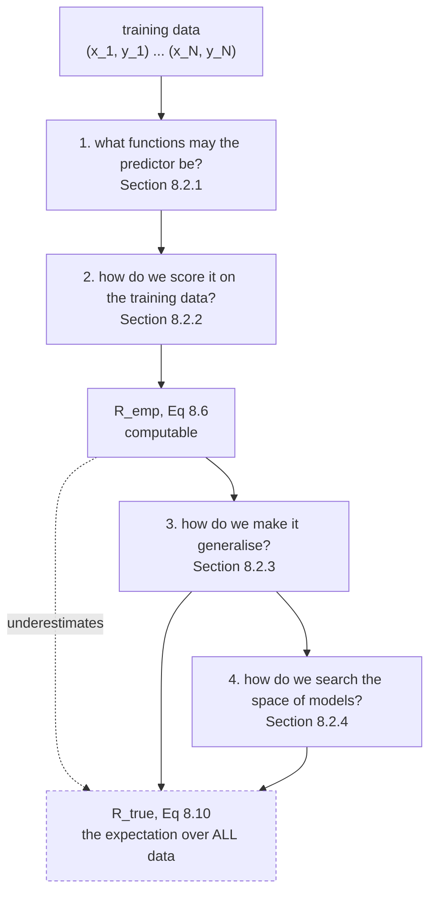

import DataCampExercise from "../../../../components/DataCampExercise.astro";
import Figure from "../../../../components/Figure.astro";
import Quiz from "../../../../components/Quiz.astro";

The book's framing for this section is blunt: *"the 'learning' part of machine learning boils down to
estimating parameters based on training data."* This page is one way to do that, and its distinguishing
feature is that **no probability distribution ever gets written down**.

Empirical risk minimization was popularised by the support vector machine (Chapter 12), but the book is
careful that its principles are general — they *"allow us to ask the question of what is learning without
explicitly constructing probabilistic models."*

## What you'll learn

- The **four design choices** of §8.2, and which section answers each.
- §8.2.1: the **hypothesis class**, and why enlarging it can never raise the training risk. Measured: **0 increases in 15 steps**.
- §8.2.2: the **loss function**, the **empirical risk** of Equation 8.6, and the i.i.d. assumption that licenses using an empirical mean at all.
- Equation 8.9, the least-squares problem in matrix form, and why it has a closed-form answer.
- Equation 8.10, the **expected risk** — the thing you actually want and can never compute.
- Measured: the training risk falls monotonically to $0.046494$ while the expected risk climbs to $40.077320$, a ratio of **862**.
- The book's closing remark that **the loss you optimise is not the measure you are judged on** — with two predictors whose ranking reverses between squared and absolute loss.

## Intuition: grading yourself on the practice exam

You want a student who does well on the **final**. You only have the **practice questions**.

So you grade on the practice questions and hope. That is empirical risk minimization: minimise the
average error on the data you have, because the average error on data you do not have is unavailable by
definition.

The failure mode is immediate and it is the subject of §8.2.3 and §8.2.4. A student allowed to memorise
the practice answers scores perfectly and learns nothing. And you cannot detect this by looking at the
practice score — a memoriser and a genius have identical practice scores. **The whole problem is that the
quantity you can measure and the quantity you care about are different quantities.**



The dashed node is the point of the whole section. $R_{\text{true}}$ is what "good" means, it is defined
as an expectation over an infinite population, and it is not available. Everything else is machinery for
coping with that.

## §8.2.1 The hypothesis class

Given $N$ examples $\mathbf{x}_n \in \mathbb{R}^D$ with scalar labels $y_n \in \mathbb{R}$, we want a
predictor $f(\cdot, \boldsymbol\theta) : \mathbb{R}^D \to \mathbb{R}$ and a good parameter
$\boldsymbol\theta^*$ such that

$$
f(\mathbf{x}_n, \boldsymbol\theta^*) \approx y_n \quad \text{for all } n = 1, \dots, N
$$

Write $\hat{y}_n = f(\mathbf{x}_n, \boldsymbol\theta^*)$ for the predictor's output.

**Example 8.1** picks the class: affine functions. Using the unit-feature trick from §8.1,

$$
f(\mathbf{x}_n, \boldsymbol\theta) = \boldsymbol\theta^\top\mathbf{x}_n
\qquad\text{which is}\qquad
f(\mathbf{x}_n, \boldsymbol\theta) = \theta_0 + \sum_{d=1}^{D}\theta_d x_n^{(d)}
$$

so $f : \mathbb{R}^{D+1} \to \mathbb{R}$. Every straight-line predictor in the chapter's figures is this.

:::caution[A bigger class can never fit the training data worse]
This is worth stating precisely because it is what makes training risk useless for choosing a class. A
degree-$d$ polynomial **is** a degree-$(d+1)$ polynomial with its top coefficient set to zero. So the
degree-$(d+1)$ class *contains* the degree-$d$ class, and its best member is at least as good.

Measured over degrees $0$ to $15$: the training risk decreased at **every one of the 15 steps**, from
$0.993663$ to $0.046494$. Not once did it rise. That monotonicity is not a property of this dataset — it
is a property of nested classes, and it holds for any data.
:::

## §8.2.2 The loss function, and the empirical risk

A **loss function** $\ell(y_n, \hat{y}_n)$ takes a label and a prediction and returns a non-negative
number. The book notes "error" is often used to mean loss.

Then comes the assumption that makes the whole framework work:

> One assumption that is commonly made in machine learning is that the set of examples
> $(\mathbf{x}_1, y_1), \dots, (\mathbf{x}_N, y_N)$ is **independent and identically distributed**.

**Independence** (§6.4.5) means two data points do not statistically depend on each other, which means
"the empirical mean is a good estimate of the population mean" (§6.4.1). *That* is what licenses
averaging the loss over the training set rather than doing something more careful.

Stacking examples into $\mathbf{X} := [\mathbf{x}_1, \dots, \mathbf{x}_N]^\top \in \mathbb{R}^{N\times D}$
and labels into $\mathbf{y} := [y_1, \dots, y_N]^\top \in \mathbb{R}^N$:

$$
R_{\text{emp}}(f, \mathbf{X}, \mathbf{y}) = \frac{1}{N}\sum_{n=1}^{N}\ell(y_n, \hat{y}_n)
$$

This is the **empirical risk**, and minimising it is **empirical risk minimization**. Note it depends on
three things — the predictor *and* the data — which is what makes the notation $R_{\text{emp}}(f, \mathbf{X}, \mathbf{y})$
worth carrying: the same $f$ has a different empirical risk on a different dataset, and §8.2.4 exploits
exactly that.

### Example 8.2: least squares

Take the squared loss $\ell(y_n, \hat{y}_n) = (y_n - \hat{y}_n)^2$. Then

$$
\min_{\boldsymbol\theta\in\mathbb{R}^D} \frac{1}{N}\sum_{n=1}^{N}\big(y_n - f(\mathbf{x}_n, \boldsymbol\theta)\big)^2
$$

and with the linear predictor $f(\mathbf{x}_n, \boldsymbol\theta) = \boldsymbol\theta^\top\mathbf{x}_n$,

$$
\min_{\boldsymbol\theta\in\mathbb{R}^D} \frac{1}{N}\sum_{n=1}^{N}\big(y_n - \boldsymbol\theta^\top\mathbf{x}_n\big)^2
\qquad\text{equivalently}\qquad
\min_{\boldsymbol\theta\in\mathbb{R}^D} \frac{1}{N}\lVert\mathbf{y} - \mathbf{X}\boldsymbol\theta\rVert^2
$$

This is the **least-squares problem**, and it has a closed-form solution via the normal equations —
developed properly in §9.2. Measured on degree-3 features: both forms of Equation 8.9 give
$0.146372862$, as they must.

## Equation 8.10: the expected risk

Here is what we actually want:

$$
R_{\text{true}}(f) = \mathbb{E}_{\mathbf{x}, y}\big[\ell(y, f(\mathbf{x}))\big]
$$

The expectation is over the **infinite** set of all possible data and labels. The book's own note is that
this is also called the **population risk**.

Two things follow, and they are §8.2.3 and §8.2.4:

- **How should we change training so that it generalises well?** → regularisation.
- **How do we estimate the expected risk from finite data?** → cross-validation.

:::danger[The loss you optimise is not the measure you are judged on]
The book's remark, near-verbatim: *"in principle, the design of the loss function for empirical risk
minimization should correspond directly to the performance measure specified by the machine learning
task. In practice, there is often a mismatch"* — for reasons of implementation ease or optimisation
efficiency.

That mismatch is not a rounding error. Take two predictors of a target that is identically zero:

- **A** is off by $0.55$ on all $200$ points.
- **B** is exact on $188$ points and off by $3.4$ on $12$.

| measure | A | B | winner |
| --- | --- | --- | --- |
| squared, $(y - \hat y)^2$ | $0.3025$ | $0.6936$ | **A**, by $2.29\times$ |
| absolute, $\lvert y - \hat y\rvert$ | $0.5500$ | $0.2040$ | **B**, by $2.70\times$ |
| tolerance, $\mathbf{1}[\lvert y - \hat y\rvert > 1]$ | $0.0000$ | $0.0600$ | **A**, outright |

**The ranking reverses.** Squared loss hates the twelve large errors; absolute loss hates being wrong on
all $200$ points. If you optimise squared loss and are graded on mean absolute error, you have optimised
the wrong thing and every number in your training log will look fine.
:::

## Worked example by hand

Take four points and fit the affine class by hand, then check what a richer class does.

$$
x = (-1,\ 0,\ 1,\ 2), \qquad y = (1,\ 0,\ 1,\ 4)
$$

**Step 1: the affine fit.** With the unit feature, $\boldsymbol\Phi = [\mathbf{1}\ \ \mathbf{x}]$. Then
$N = 4$, $\sum x_n = 2$, $\sum x_n^2 = 1 + 0 + 1 + 4 = 6$, $\sum y_n = 6$, $\sum x_n y_n = -1 + 0 + 1 + 8 = 8$:

$$
\boldsymbol\Phi^\top\boldsymbol\Phi = \begin{bmatrix}4 & 2\\ 2 & 6\end{bmatrix}, \qquad \det = 24 - 4 = 20
$$

$$
\boldsymbol\theta = \frac{1}{20}\begin{bmatrix}6 & -2\\ -2 & 4\end{bmatrix}\begin{bmatrix}6\\ 8\end{bmatrix} = \frac{1}{20}\begin{bmatrix}20\\ 20\end{bmatrix} = \begin{bmatrix}1\\ 1\end{bmatrix}
$$

So $\hat y = 1 + x$, giving predictions $(0, 1, 2, 3)$ and residuals $(1, -1, -1, 1)$.

**Step 2: the empirical risk.**

$$
R_{\text{emp}} = \frac{1}{4}\big(1 + 1 + 1 + 1\big) = 1
$$

**Step 3: what a quadratic does.** Add an $x^2$ column. The data was generated by $y = x^2$ exactly —
check: $(-1)^2 = 1$, $0^2 = 0$, $1^2 = 1$, $2^2 = 4$. So the quadratic class contains a member with
$R_{\text{emp}} = 0$, and least squares will find it: $\boldsymbol\theta = (0, 0, 1)$.

**Step 4: what that proves and what it does not.** The quadratic beat the affine model $0$ to $1$ on
training risk. It happens to be right here — but the *reason* it won is only that it had three parameters
for four points. A cubic would also achieve $0$, and so would every higher degree. **Training risk cannot
distinguish "correct" from "flexible enough to interpolate".** With four points a degree-3 polynomial
achieves exactly zero on any data whatsoever, and that is the trap.

## See it move

The four design choices interact. Change the class and watch both risks move in opposite directions:

```p5 title="Two risks, one knob" desc="Drag the polynomial degree and watch the empirical risk of Equation 8.6 against the expected risk of Equation 8.10, estimated on 4000 held-out points. The fit is drawn above. Note that the training risk never rises, so nothing on the training side ever tells you to stop." height="500"
let deg = 6;
let KNOBS = [], dragging = null;

// Precomputed on the same data as the page's figures: 25 training points,
// 4000 held-out points, y = sin(1.4 x) + 0.3 x + noise.
const REMP = [0.993663,0.599241,0.565048,0.146373,0.129272,0.100580,0.100253,
              0.100134,0.099982,0.090056,0.087573,0.084463,0.066555,0.051236,
              0.051216,0.046494];
const RTRUE = [0.961461,0.555955,0.600537,0.186855,0.211295,0.152753,0.151857,
               0.154089,0.153867,0.244194,0.271401,0.220716,0.670332,3.894409,
               4.084932,40.077320];
const NORM = [0.0701,1.1256,1.3082,5.4910,6.2030,11.2386,11.8253,10.4195,
              14.7397,158.3732,260.7562,762.6160,4200.4882,12569.5246,
              12095.5872,81050.6045];
const BEST = 6;

let XT = [], YT = [];
function setup() {
  createCanvas(680, 500);
  textFont("monospace");
  // regenerate the 25 training points deterministically enough to draw
  randomSeed(3);
  for (let i = 0; i < 25; i++) {
    const x = -3 + 6 * (i + 0.5) / 25 + (random() - 0.5) * 0.18;
    XT.push(x);
    YT.push(Math.sin(1.4 * x) + 0.3 * x + (random() - 0.5) * 0.9);
  }
}

function knob(id, x, y, w, value, mn, mx, label) {
  KNOBS.push({ id, x, y, w, mn, mx });
  const t = (value - mn) / (mx - mn);
  stroke(60, 74, 92); strokeWeight(2); line(x, y, x + w, y);
  noStroke(); fill(255, 211, 67); ellipse(x + t * w, y, 12, 12);
  fill(190, 200, 212); textSize(12); textAlign(LEFT, CENTER);
  text(label, x + w + 12, y);
}
function knobHit(mx_, my_) {
  for (const k of KNOBS) {
    if (my_ > k.y - 13 && my_ < k.y + 13 && mx_ > k.x - 13 && mx_ < k.x + k.w + 13) return k;
  }
  return null;
}
function knobValue(k, mx_) {
  const t = Math.min(1, Math.max(0, (mx_ - k.x) / k.w));
  return Math.round(k.mn + t * (k.mx - k.mn));
}
function mousePressed() { dragging = knobHit(mouseX, mouseY); }
function mouseReleased() { dragging = null; }
function mouseDragged() {
  if (!dragging) return;
  deg = knobValue(dragging, mouseX);
  if (!isLooping()) redraw();
}

// least squares on the drawn points, so the curve matches the chosen degree
function fitPoly(d) {
  const m = d + 1;
  const A = [], b = [];
  for (let i = 0; i < m; i++) {
    A.push(new Array(m).fill(0));
    b.push(0);
  }
  for (let k = 0; k < XT.length; k++) {
    const t = XT[k] / 3;
    const pow = [];
    let v = 1;
    for (let i = 0; i < m; i++) { pow.push(v); v *= t; }
    for (let i = 0; i < m; i++) {
      for (let j = 0; j < m; j++) A[i][j] += pow[i] * pow[j];
      b[i] += pow[i] * YT[k];
    }
  }
  for (let i = 0; i < m; i++) A[i][i] += 1e-9;      // keep it solvable
  // Gaussian elimination
  for (let i = 0; i < m; i++) {
    let piv = i;
    for (let r = i + 1; r < m; r++) if (Math.abs(A[r][i]) > Math.abs(A[piv][i])) piv = r;
    [A[i], A[piv]] = [A[piv], A[i]]; [b[i], b[piv]] = [b[piv], b[i]];
    for (let r = i + 1; r < m; r++) {
      const f = A[r][i] / A[i][i];
      for (let c = i; c < m; c++) A[r][c] -= f * A[i][c];
      b[r] -= f * b[i];
    }
  }
  const th = new Array(m).fill(0);
  for (let i = m - 1; i >= 0; i--) {
    let s = b[i];
    for (let j = i + 1; j < m; j++) s -= A[i][j] * th[j];
    th[i] = s / A[i][i];
  }
  return th;
}
function evalPoly(th, x) {
  const t = x / 3;
  let v = 0, pw = 1;
  for (let i = 0; i < th.length; i++) { v += th[i] * pw; pw *= t; }
  return v;
}

const OX = 40, OY = 40, W = 300, H = 180;
const PX = 400, PW = 250;
function px(x) { return OX + ((x + 3.2) / 6.4) * W; }
function py(y) { return OY + H - ((y + 2.8) / 5.6) * H; }

function draw() {
  background(13, 17, 23);
  KNOBS = [];
  const th = fitPoly(deg);

  // the fit
  noFill(); stroke(70, 86, 104); strokeWeight(1); rect(OX, OY, W, H);
  stroke(120, 200, 140); strokeWeight(2.2); noFill();
  beginShape();
  for (let i = 0; i <= 300; i++) {
    const x = -3.2 + (i / 300) * 6.4;
    const v = evalPoly(th, x);
    if (v > -2.8 && v < 2.8) vertex(px(x), py(v));
  }
  endShape();
  noStroke(); fill(190, 200, 212);
  for (let k = 0; k < XT.length; k++) ellipse(px(XT[k]), py(YT[k]), 5, 5);
  fill(150); textSize(10); textAlign(LEFT, TOP);
  text("degree " + deg + " fit to 25 points", OX + 4, OY + 4);

  // the two risk curves
  const RY = 250, RH = 150;
  const rx = (d) => PX - 360 + (d / 15) * 300;
  const lo = Math.log(0.03), hi = Math.log(60);
  const ry = (v) => RY + RH - ((Math.log(Math.max(v, 0.03)) - lo) / (hi - lo)) * RH;
  noFill(); stroke(70, 86, 104); strokeWeight(1);
  rect(rx(0), RY, 300, RH);
  stroke(107, 169, 221); strokeWeight(2); noFill();
  beginShape(); for (let d = 0; d <= 15; d++) vertex(rx(d), ry(REMP[d])); endShape();
  stroke(232, 110, 110); strokeWeight(2); noFill();
  beginShape(); for (let d = 0; d <= 15; d++) vertex(rx(d), ry(RTRUE[d])); endShape();
  stroke(120, 200, 140); strokeWeight(1.4);
  line(rx(BEST), RY, rx(BEST), RY + RH);
  noStroke(); fill(255, 211, 67);
  ellipse(rx(deg), ry(REMP[deg]), 9, 9);
  ellipse(rx(deg), ry(RTRUE[deg]), 9, 9);
  fill(107, 169, 221); textSize(10); textAlign(LEFT, TOP);
  text("R_emp, Eq 8.6", rx(0) + 6, RY + 4);
  fill(232, 110, 110);
  text("R_true, Eq 8.10", rx(0) + 6, RY + 18);
  fill(120, 200, 140);
  text("best degree " + BEST, rx(BEST) + 4, RY + RH - 16);

  // readout
  noStroke(); textAlign(LEFT, TOP);
  fill(255, 211, 67); textSize(16);
  text("degree " + deg, PX + 20, 46);
  fill(107, 169, 221); textSize(12);
  text("R_emp  = " + REMP[deg].toFixed(6), PX + 20, 76);
  fill(232, 110, 110);
  text("R_true = " + RTRUE[deg].toFixed(6), PX + 20, 94);
  fill(200);
  text("ratio  = " + (RTRUE[deg] / REMP[deg]).toFixed(2) + "x", PX + 20, 116);
  fill(197, 153, 255);
  text("||theta|| = " + NORM[deg].toFixed(2), PX + 20, 138);

  fill(140); textSize(11);
  text("R_emp at degree 0: " + REMP[0].toFixed(4), PX + 20, 168);
  text("R_emp at degree 15: " + REMP[15].toFixed(4), PX + 20, 182);
  fill(120, 200, 140);
  text("it never rises, at any step", PX + 20, 200);

  let msg, sub, col;
  if (deg <= 2) {
    col = color(255, 211, 67);
    msg = "underfitting";
    sub = "the class is too small: no theta in it can bend enough. Both risks are high.";
  } else if (deg <= 8) {
    col = color(120, 200, 140);
    msg = "about right";
    sub = "R_true is near its minimum, and the gap to R_emp is modest.";
  } else if (deg <= 12) {
    col = color(255, 211, 67);
    msg = "starting to overfit";
    sub = "R_emp still falling, R_true rising. ||theta|| is now " + NORM[deg].toFixed(0) + ".";
  } else {
    col = color(232, 110, 110);
    msg = "overfitting badly";
    sub = "R_true is " + (RTRUE[deg] / REMP[deg]).toFixed(0) + "x R_emp, and nothing on the training side says so.";
  }
  stroke(col); strokeWeight(1.6); fill(red(col), green(col), blue(col), 26);
  rect(40, 420, 600, 46, 6);
  noStroke(); fill(col); textSize(15); textAlign(LEFT, TOP);
  text(msg, 56, 426);
  fill(215); textSize(11);
  text(sub, 56, 448);

  knob("d", 56, 486, 280, deg, 0, 15, "degree " + deg);
  fill(120); textSize(11); textAlign(LEFT, TOP);
  text("Sweep to 15: R_emp reaches 0.0465 and R_true reaches 40.08.", 380, 480);
  text("The blue curve gives you no signal at all.", 380, 494);
}
```

## From scratch

```python title="erm.py" showLineNumbers{1}
import numpy as np

def make(n, seed, noise=0.35):
    rng = np.random.default_rng(seed)
    x = np.sort(rng.uniform(-3, 3, n))
    return x, np.sin(1.4 * x) + 0.3 * x + noise * rng.standard_normal(n)

def design(x, deg):
    """The hypothesis class of Section 8.2.1: unit feature first, Eq 8.5."""
    return np.vander(x / 3.0, deg + 1, increasing=True)

def empirical_risk(y, yhat):
    """Equation 8.6 with the squared loss of Example 8.2."""
    return float(np.mean((y - yhat) ** 2))

xtr, ytr = make(25, seed=3)         # the training set
xte, yte = make(4000, seed=99)      # a stand-in for the infinite population

# --- Example 8.2 in matrix form, Eq 8.9 ----------------------------------
A = design(xtr, 3)
theta = np.linalg.lstsq(A, ytr, rcond=None)[0]
N = len(ytr)
print("Equation 8.9 written two ways, degree 3:")
print(f"  (1/N) ||y - X theta||^2 = "
      f"{np.linalg.norm(ytr - A @ theta) ** 2 / N:.9f}")
print(f"  (1/N) sum (y_n - theta.x_n)^2 = {empirical_risk(ytr, A @ theta):.9f}")

# --- Eq 8.6 against Eq 8.10 ---------------------------------------------
print(f"\n{'degree':>7} {'R_emp (Eq 8.6)':>16} {'R_true (Eq 8.10)':>18} "
      f"{'ratio':>8} {'||theta||':>13}")
rows = []
for d in range(0, 16):
    Ad = design(xtr, d)
    th = np.linalg.lstsq(Ad, ytr, rcond=None)[0]
    remp = empirical_risk(ytr, Ad @ th)
    rtrue = empirical_risk(yte, design(xte, d) @ th)
    rows.append((d, remp, rtrue, float(np.linalg.norm(th))))
    print(f"{d:>7} {remp:>16.6f} {rtrue:>18.6f} {rtrue / remp:>8.2f} "
          f"{np.linalg.norm(th):>13.4f}")

best = min(rows, key=lambda r: r[2])
worst = rows[-1]
print(f"\nlowest expected risk at degree {best[0]}: {best[2]:.6f}")
print(f"R_emp never increases: "
      f"{int(sum(1 for a, b in zip(rows, rows[1:]) if b[1] > a[1] + 1e-12))} "
      f"increases in 15 steps")
print(f"at degree 15 the ratio is {worst[2] / worst[1]:.0f}x and "
      f"||theta|| is {worst[3]:.1f}")
print(f"  which is {worst[3] / best[3]:.0f} times its value at degree {best[0]}")

# --- Section 8.2.2's closing remark: loss is not the measure -------------
print("\nTwo predictors, three measures (Section 8.2.2's remark):")
rng = np.random.default_rng(5)
n = 200
truth = np.zeros(n)
A_pred = 0.55 * np.ones(n)          # wrong everywhere, but only a little
B_pred = np.zeros(n)
B_pred[:12] = 3.4                   # exact on 188 points, badly wrong on 12

measures = {
    "squared":   lambda r: (r ** 2).mean(),
    "absolute":  lambda r: np.abs(r).mean(),
    "tolerance": lambda r: (np.abs(r) > 1.0).mean(),
}
print(f"{'measure':>11} {'A':>12} {'B':>12}   winner")
for name, fn in measures.items():
    va, vb = fn(truth - A_pred), fn(truth - B_pred)
    print(f"{name:>11} {va:>12.4f} {vb:>12.4f}   "
          f"{'A' if va < vb else 'B'}")
print("A is wrong on all 200 points by 0.55; B is exact on 188 and off by 3.4")
print("on 12. Squared loss and the tolerance measure prefer A; absolute loss")
print("prefers B. Optimising one of these does not optimise another.")
```

```
Equation 8.9 written two ways, degree 3:
  (1/N) ||y - X theta||^2 = 0.146372862
  (1/N) sum (y_n - theta.x_n)^2 = 0.146372862

 degree   R_emp (Eq 8.6)   R_true (Eq 8.10)    ratio     ||theta||
      0         0.993663           0.961461     0.97        0.0701
      1         0.599241           0.555955     0.93        1.1256
      2         0.565048           0.600537     1.06        1.3082
      3         0.146373           0.186855     1.28        5.4910
      4         0.129272           0.211295     1.63        6.2030
      5         0.100580           0.152753     1.52       11.2386
      6         0.100253           0.151857     1.51       11.8253
      7         0.100134           0.154089     1.54       10.4195
      8         0.099982           0.153867     1.54       14.7397
      9         0.090056           0.244194     2.71      158.3732
     10         0.087573           0.271401     3.10      260.7562
     11         0.084463           0.220716     2.61      762.6160
     12         0.066555           0.670332    10.07     4200.4882
     13         0.051236           3.894409    76.01    12569.5246
     14         0.051216           4.084932    79.76    12095.5872
     15         0.046494          40.077320   862.00    81050.6045

lowest expected risk at degree 6: 0.151857
R_emp never increases: 0 increases in 15 steps
at degree 15 the ratio is 862x and ||theta|| is 81050.6
  which is 6854 times its value at degree 6

Two predictors, three measures (Section 8.2.2's remark):
    measure            A            B   winner
    squared       0.3025       0.6936   A
   absolute       0.5500       0.2040   B
  tolerance       0.0000       0.0600   A
A is wrong on all 200 points by 0.55; B is exact on 188 and off by 3.4
on 12. Squared loss and the tolerance measure prefer A; absolute loss
prefers B. Optimising one of these does not optimise another.
```

## On real data

<Figure
  src="/images/mml/empirical-risk-minimization/empirical-versus-expected-risk"
  alt="Two panels. Left, log-scale curves of empirical risk and expected risk against polynomial degree from 0 to 15: the empirical curve falls monotonically while the expected curve turns at degree 6 and rises steeply, with the region between them shaded as the generalisation gap. Right, the norm of the fitted parameter vector on a log scale, rising from 0.07 to over 81000."
  title="Equation 8.6 is what you can compute; Equation 8.10 is what you want"
  caption="The empirical risk decreased at every one of the fifteen steps. The expected risk bottoms at degree 6 and reaches 40.08 by degree 15, a ratio of 862 — and the parameter norm grows by a factor of 6854 over the same range."
/>

<Figure
  src="/images/mml/empirical-risk-minimization/the-hypothesis-class"
  alt="Two panels. Left, twenty-five data points with three fits overlaid: a straight line that cannot follow the curve, a degree-3 fit, and a degree-6 fit, each labelled with its empirical risk. Right, the empirical risk against degree, decreasing at every step, annotated that zero of fifteen steps increased."
  title="Section 8.2.1: a bigger class can never fit the training data worse"
  caption="The affine class cannot bend, so no optimisation recovers the curve — that is a property of the class, not the search. And because a degree-d polynomial is a degree-(d+1) one with a zero top coefficient, enlarging the class can only lower the training risk."
/>

<Figure
  src="/images/mml/empirical-risk-minimization/loss-is-not-the-performance-measure"
  alt="Two panels. Left, a grouped bar chart of three loss measures for two predictors A and B, showing A lower on squared and tolerance loss but higher on absolute loss. Right, a table restating each comparison with the winner and the margin, noting that A wins squared by 2.29 times, B wins absolute by 2.70 times, and A wins the tolerance measure outright."
  title="The loss you optimise and the measure you are judged on are two different choices"
  caption="Predictor A is off by 0.55 everywhere; B is exact on 188 of 200 points and off by 3.4 on twelve. Squared loss prefers A, absolute loss prefers B. The ranking reverses, so optimising one does not optimise the other."
/>

## Reading the plot

**The first figure is the section's whole argument in two curves.** The blue curve is $R_{\text{emp}}$,
Equation 8.6 — the thing you can compute. It falls at every single step, from $0.993663$ at degree $0$ to
$0.046494$ at degree $15$. There is no kink, no elbow, and no signal in its shape that says *stop here*.

The red curve is $R_{\text{true}}$, Equation 8.10 — estimated on $4000$ points the model never saw. It
turns at degree $6$ with a value of $0.151857$, and then climbs to $40.077320$. **The ratio between them
reaches $862$.** The shaded band is the generalisation gap, and the book's definition of overfitting is
exactly that the training risk *underestimates* the expected risk: measured here, the ratio exceeds $1$
from degree $2$ onward and never returns.

The right panel is worth pairing with the left because it shows the *symptom* rather than the disease.
The book's remark, citing Bishop (2006), is that *"the magnitude of the parameter values becomes
relatively large if we run into overfitting"*. Measured: $\lVert\boldsymbol\theta\rVert$ goes from
$11.8253$ at the best degree to $81{,}050.6$ at degree $15$ — a factor of **$6854$**. That is a signal
you *can* compute from training data alone, and it is precisely what §8.2.3's penalty term attacks.

**The second figure separates two kinds of failure.** The left panel's red line is the affine class of
Equation 8.4, and its problem is not that the optimiser did badly — it is that **no member of the class
can bend**. That is underfitting, and it is a property of the class you chose, not of the search you ran.
More iterations, a better step size, a different initialisation: none of it helps.

The right panel is the fact that makes model selection necessary. Enlarging the class raised the training
risk **zero times in fifteen attempts**, and that is not a property of this dataset. A degree-$d$
polynomial is a degree-$(d+1)$ polynomial with the top coefficient set to zero, so the larger class
literally contains the smaller one's best answer. **Any criterion that only looks at training risk will
always choose the largest class available.** Given that, §8.2.3 and §8.2.4 are not refinements; they are
the only things standing between you and degree $15$.

**The third figure is the one people skip and shouldn't.** Predictor A is mediocre everywhere; predictor
B is excellent almost everywhere and terrible occasionally. Which is better? The honest answer is *it
depends what you are going to do with it* — and the three measures disagree.

Squared loss puts A ahead by $2.29\times$, because squaring turns twelve errors of $3.4$ into a large
number. Absolute loss puts B ahead by $2.70\times$, because it counts A's two hundred small errors at
face value. The tolerance measure — does the prediction land within $1$? — scores A at exactly $0.0000$,
a perfect record, because $0.55 < 1$.

So the same two predictors are ranked in two different orders by three reasonable measures. The book's
point is that the loss you *optimise* is chosen for optimisation convenience (squared loss is smooth and
has a closed form; the tolerance measure has zero gradient almost everywhere), while the measure you are
*judged* on comes from the application. When those differ, a training log full of falling squared loss
tells you nothing about the number you will be evaluated on.

:::tip[From the book]
This page covers **§8.2**, **§8.2.1** and **§8.2.2** of *Mathematics for Machine Learning* by Deisenroth,
Faisal and Ong (draft of 2019-12-11). The four design choices are listed at the head of §8.2. Equation
**8.3** is the fitting goal, **8.4** and **8.5** are **Example 8.1**'s linear and affine forms.
Equation **8.6** defines the **empirical risk** and the term **empirical risk minimization**; the i.i.d.
assumption and its justification via §6.4.5 and §6.4.1 are the book's. **Example 8.2** gives the squared
loss and Equations **8.7**, **8.8** and **8.9**, with the closed-form solution deferred to §9.2. Equation
**8.10** is the **expected risk**, also called the population risk. The closing remark that the loss
function and the performance measure often mismatch "due to issues such as ease of implementation or
efficiency of optimization" is the book's, as is the attribution of empirical risk minimization to the
support vector machine and the Bishop (2006) remark about parameter magnitudes. The degree sweep, the
$862\times$ ratio, the $6854\times$ parameter growth, and the three-measure reversal are this module's
additions.
:::

## Pitfalls

:::danger[Choosing a model class by training risk]
Measured: enlarging the class lowered the training risk at **all fifteen** steps and raised it at none.
That is structural, since nested classes contain each other's best answers — so any selection rule based
on training risk alone will always pick the largest class on offer. At degree $15$ that means an expected
risk $862\times$ the training figure.
:::

:::caution[Reading a low training risk as a good model]
$R_{\text{emp}}$ at degree $15$ is $0.046494$, the best in the table. $R_{\text{true}}$ there is
$40.077320$, the worst by a factor of $150$ over the next-worst. The two numbers are computed from the
same predictor, and one of them is a fantasy.
:::

:::danger[Optimising a loss that is not your performance measure]
Squared loss ranks predictor A above B; absolute loss ranks B above A, by comparable margins in opposite
directions. If your report is graded on mean absolute error and your optimiser minimises squared error,
every number in your training log can improve while the reported metric gets worse. The book flags this
as common practice rather than an error, which makes it worth checking explicitly.
:::

:::caution[Forgetting that the i.i.d. assumption is doing work]
Equation 8.6 averages the loss. The justification is that independence makes the empirical mean a good
estimate of the population mean (§6.4.1). With time series, repeated measurements on the same subject, or
data collected in batches, that assumption fails — and then the average training loss is not estimating
what you think, before any question of overfitting arises.
:::

:::caution[Treating the empirical risk as a function of the predictor alone]
The book writes $R_{\text{emp}}(f, \mathbf{X}, \mathbf{y})$ with three arguments deliberately. The same
$f$ has a different empirical risk on different data, and §8.2.4's cross-validation is entirely built on
evaluating one $f$ against several different $\mathbf{X}, \mathbf{y}$. Notation that hides the data makes
that step look like a trick.
:::

:::caution[Assuming a zero training risk means the model is right]
With $N$ points, any polynomial of degree $N-1$ achieves exactly zero training risk on **any** data. In
the worked example above the quadratic reaching zero happened to be correct, but a cubic would reach zero
too. Interpolation and correctness are indistinguishable from the training risk.
:::

## Compare

| | empirical risk, Eq 8.6 | expected risk, Eq 8.10 |
| --- | --- | --- |
| what it averages over | your $N$ training points | the **infinite** population |
| computable | yes | **no**, ever |
| notation | $R_{\text{emp}}(f, \mathbf{X}, \mathbf{y})$ | $R_{\text{true}}(f)$ |
| depends on the data | yes, explicitly | no — the data is integrated out |
| behaviour as the class grows | never increases | turns |
| measured at degree 6 | $0.100253$ | $0.151857$ |
| measured at degree 15 | $0.046494$ | $40.077320$ |
| estimated by | — | a test set, or §8.2.4's cross-validation |

| design choice | question | section |
| --- | --- | --- |
| hypothesis class | what functions may $f$ be? | §8.2.1 |
| loss function | how well does $f$ do on the training data? | §8.2.2 |
| regularisation | how do we build predictors that generalise? | §8.2.3 |
| search procedure | how do we explore the space of models? | §8.2.4 |

<Quiz
  title="Do you know which risk is which?"
  questions={[
    {
      q: "Why can the training risk never increase when you enlarge the hypothesis class?",
      options: [
        "Because the optimiser gets better with more parameters",
        "Because a degree-d polynomial IS a degree-(d+1) one with the top coefficient zero, so the larger class contains the smaller one's best answer",
        "It can increase; that is what overfitting means",
        "Because the squared loss is convex",
      ],
      answer: 1,
      explain:
        "Nested classes contain each other's optima, so this is structural rather than empirical — measured, zero of fifteen steps raised the training risk. The consequence is the important part: any criterion based on training risk alone will always choose the largest class available.",
    },
    {
      q: "What does the book define overfitting as, precisely?",
      options: [
        "A model with too many parameters",
        "The training risk UNDERESTIMATING the expected risk for a given predictor",
        "A training risk of zero",
        "A model that fails on the validation set",
      ],
      answer: 1,
      explain:
        "The definition is a relation between two numbers for one fixed predictor, not a property of the parameter count. Measured on the sweep, the ratio exceeds one from degree 2 onward and reaches 862 by degree 15 — while the training risk kept falling.",
    },
    {
      q: "Predictor A is off by 0.55 on all 200 points; B is exact on 188 and off by 3.4 on twelve. Which is better?",
      options: [
        "A, since squared loss gives 0.3025 against 0.6936",
        "B, since absolute loss gives 0.2040 against 0.5500",
        "It depends on the measure: squared and tolerance prefer A, absolute prefers B, and the ranking genuinely reverses",
        "They are equivalent",
      ],
      answer: 2,
      explain:
        "Three reasonable measures, two different winners. The book's remark is that the loss you optimise is usually chosen for optimisation convenience while the measure you are judged on comes from the application — so a training log of falling squared loss says nothing about a reported mean absolute error.",
    },
    {
      q: "What role does the i.i.d. assumption play in Equation 8.6?",
      options: [
        "It makes the loss function convex",
        "Independence makes the empirical mean a good estimate of the population mean, which is what licenses averaging the loss at all",
        "It guarantees the model will generalise",
        "It is needed only for the closed-form least-squares solution",
      ],
      answer: 1,
      explain:
        "Section 8.2.2 gives exactly this justification, pointing at Sections 6.4.5 and 6.4.1. With time series or repeated measures the assumption fails and the average training loss is no longer estimating what you think — a problem that arrives before any question of overfitting.",
    },
    {
      q: "You fit a degree-(N-1) polynomial to N points and get exactly zero training risk. What have you learned?",
      options: [
        "That the model is correct",
        "Nothing: any degree-(N-1) polynomial interpolates any N points, so zero training risk is guaranteed regardless of the data",
        "That the data is noise-free",
        "That the hypothesis class is too small",
      ],
      answer: 1,
      explain:
        "Interpolation and correctness are indistinguishable from the training risk. In the worked example the quadratic that reached zero happened to be right, but a cubic would also reach zero on the same four points — and the training risk cannot tell them apart.",
    },
  ]}
/>

## 🧪 Try It Yourself

### Exercise 1 – Equation 8.9, two ways

<DataCampExercise
  lang="python"
  hint={`Equation 8.9 is (1/N) times the squared Euclidean norm of the residual vector y minus X theta.`}
  code={`import numpy as np

rng = np.random.default_rng(3)
x = np.sort(rng.uniform(-3, 3, 25))
y = np.sin(1.4 * x) + 0.3 * x + 0.35 * rng.standard_normal(25)
A = np.vander(x / 3.0, 4, increasing=True)      # degree 3, unit feature first
theta = np.linalg.lstsq(A, y, rcond=None)[0]
N = len(y)

# Task: Equation 8.9, the matrix form of the empirical risk.
matrix_form = ___ / N
sum_form = np.mean((y - A @ theta) ** 2)

print("Equation 8.9 written two ways, degree 3:")
print(f"  (1/N) ||y - X theta||^2       = {matrix_form:.9f}")
print(f"  (1/N) sum (y_n - theta.x_n)^2 = {sum_form:.9f}")
print(f"  identical: {np.isclose(matrix_form, sum_form)}")

# -- Expected output ------------------------------
# Equation 8.9 written two ways, degree 3:
#   (1/N) ||y - X theta||^2       = 0.146372862
#   (1/N) sum (y_n - theta.x_n)^2 = 0.146372862
#   identical: True
# -------------------------------------------------`}
  solution={`import numpy as np
rng = np.random.default_rng(3)
x = np.sort(rng.uniform(-3, 3, 25))
y = np.sin(1.4 * x) + 0.3 * x + 0.35 * rng.standard_normal(25)
A = np.vander(x / 3.0, 4, increasing=True)
theta = np.linalg.lstsq(A, y, rcond=None)[0]
N = len(y)
matrix_form = np.linalg.norm(y - A @ theta) ** 2 / N
sum_form = np.mean((y - A @ theta) ** 2)
print("Equation 8.9 written two ways, degree 3:")
print(f"  (1/N) ||y - X theta||^2       = {matrix_form:.9f}")
print(f"  (1/N) sum (y_n - theta.x_n)^2 = {sum_form:.9f}")
print(f"  identical: {np.isclose(matrix_form, sum_form)}")`}
  sct={`test_output_contains("0.146372862")
test_output_contains("identical: True")
success_msg("The sum form of Equation 8.8 and the matrix form of Equation 8.9 are the same expression. The matrix form is the one that leads to the normal equations of Section 9.2, which is why the book bothers to write it down.")`}
  height={230}
/>

### Exercise 2 – The training risk never rises

<DataCampExercise
  lang="python"
  hint={`Count how many consecutive differences in the empirical risk are positive. Structurally there should be none.`}
  code={`import numpy as np

rng = np.random.default_rng(3)
x = np.sort(rng.uniform(-3, 3, 25))
y = np.sin(1.4 * x) + 0.3 * x + 0.35 * rng.standard_normal(25)

remp = []
for d in range(0, 16):
    A = np.vander(x / 3.0, d + 1, increasing=True)
    th = np.linalg.lstsq(A, y, rcond=None)[0]
    remp.append(float(np.mean((y - A @ th) ** 2)))
remp = np.array(remp)

for d in (0, 3, 6, 12, 15):
    print(f"  degree {d:>2}: R_emp = {remp[d]:.6f}")
# Task: how many steps INCREASED the empirical risk?
rises = int((np.diff(remp) > ___).sum())
print(f"\\nsteps that increased R_emp: {rises} of {len(remp) - 1}")
print(f"R_emp fell from {remp[0]:.6f} to {remp[-1]:.6f}")

# -- Expected output ------------------------------
#   degree  0: R_emp = 0.993663
#   degree  3: R_emp = 0.146373
#   degree  6: R_emp = 0.100253
#   degree 12: R_emp = 0.066555
#   degree 15: R_emp = 0.046494
#
# steps that increased R_emp: 0 of 15
# R_emp fell from 0.993663 to 0.046494
# -------------------------------------------------`}
  solution={`import numpy as np
rng = np.random.default_rng(3)
x = np.sort(rng.uniform(-3, 3, 25))
y = np.sin(1.4 * x) + 0.3 * x + 0.35 * rng.standard_normal(25)
remp = []
for d in range(0, 16):
    A = np.vander(x / 3.0, d + 1, increasing=True)
    th = np.linalg.lstsq(A, y, rcond=None)[0]
    remp.append(float(np.mean((y - A @ th) ** 2)))
remp = np.array(remp)
for d in (0, 3, 6, 12, 15):
    print(f"  degree {d:>2}: R_emp = {remp[d]:.6f}")
rises = int((np.diff(remp) > 1e-12).sum())
print(f"\\nsteps that increased R_emp: {rises} of {len(remp) - 1}")
print(f"R_emp fell from {remp[0]:.6f} to {remp[-1]:.6f}")`}
  sct={`test_output_contains("steps that increased R_emp: 0 of 15")
test_output_contains("R_emp fell from 0.993663 to 0.046494")
success_msg("Zero increases in fifteen steps, and that is structural rather than lucky: a degree-d polynomial is a degree-(d+1) one with a zero top coefficient. So the training risk can only ever endorse a bigger class, which is exactly why Sections 8.2.3 and 8.2.4 exist.")`}
  height={260}
/>

### Exercise 3 – The generalisation gap

<DataCampExercise
  lang="python"
  hint={`The expected risk is estimated by evaluating the SAME theta on data the fit never saw — so build the test design matrix with the same degree.`}
  code={`import numpy as np

def make(n, seed):
    rng = np.random.default_rng(seed)
    xx = np.sort(rng.uniform(-3, 3, n))
    return xx, np.sin(1.4 * xx) + 0.3 * xx + 0.35 * rng.standard_normal(n)

xtr, ytr = make(25, 3)
xte, yte = make(4000, 99)

print(f"{'degree':>7} {'R_emp':>12} {'R_true':>13} {'ratio':>8}")
rows = []
for d in (0, 3, 6, 12, 15):
    A = np.vander(xtr / 3.0, d + 1, increasing=True)
    th = np.linalg.lstsq(A, ytr, rcond=None)[0]
    remp = np.mean((ytr - A @ th) ** 2)
    # Task: apply the SAME theta to the held-out inputs.
    rtrue = np.mean((yte - ___ @ th) ** 2)
    rows.append((d, remp, rtrue))
    print(f"{d:>7} {remp:>12.6f} {rtrue:>13.6f} {rtrue / remp:>8.2f}")
print(f"\\nat degree 15 the expected risk is {rows[-1][2] / rows[-1][1]:.0f}x "
      f"the training risk")

# -- Expected output ------------------------------
#  degree        R_emp        R_true    ratio
#       0     0.993663      0.961461     0.97
#       3     0.146373      0.186855     1.28
#       6     0.100253      0.151857     1.51
#      12     0.066555      0.670332    10.07
#      15     0.046494     40.077320   862.00
#
# at degree 15 the expected risk is 862x the training risk
# -------------------------------------------------`}
  solution={`import numpy as np
def make(n, seed):
    rng = np.random.default_rng(seed)
    xx = np.sort(rng.uniform(-3, 3, n))
    return xx, np.sin(1.4 * xx) + 0.3 * xx + 0.35 * rng.standard_normal(n)
xtr, ytr = make(25, 3)
xte, yte = make(4000, 99)
print(f"{'degree':>7} {'R_emp':>12} {'R_true':>13} {'ratio':>8}")
rows = []
for d in (0, 3, 6, 12, 15):
    A = np.vander(xtr / 3.0, d + 1, increasing=True)
    th = np.linalg.lstsq(A, ytr, rcond=None)[0]
    remp = np.mean((ytr - A @ th) ** 2)
    rtrue = np.mean((yte - np.vander(xte / 3.0, d + 1, increasing=True) @ th) ** 2)
    rows.append((d, remp, rtrue))
    print(f"{d:>7} {remp:>12.6f} {rtrue:>13.6f} {rtrue / remp:>8.2f}")
print(f"\\nat degree 15 the expected risk is {rows[-1][2] / rows[-1][1]:.0f}x "
      f"the training risk")`}
  sct={`test_output_contains("15     0.046494     40.077320   862.00")
test_output_contains("862x the training risk")
success_msg("Note the ratio at degree 0 is BELOW one — with a model that flexible-free, the training set happened to be slightly harder than the population. The gap only becomes systematic once the class is rich enough to chase noise, and by degree 15 it is a factor of 862.")`}
  height={280}
/>

### Exercise 4 – The parameter norm is the symptom

<DataCampExercise
  lang="python"
  hint={`np.linalg.norm of the fitted coefficient vector. The book's remark, citing Bishop 2006, is that this grows when a model overfits.`}
  code={`import numpy as np

rng = np.random.default_rng(3)
x = np.sort(rng.uniform(-3, 3, 25))
y = np.sin(1.4 * x) + 0.3 * x + 0.35 * rng.standard_normal(25)

print(f"{'degree':>7} {'||theta||':>14}")
norms = []
for d in range(0, 16):
    A = np.vander(x / 3.0, d + 1, increasing=True)
    th = np.linalg.lstsq(A, y, rcond=None)[0]
    # Task: the magnitude of the fitted parameter vector.
    norms.append(float(___))
    if d in (0, 3, 6, 9, 12, 15):
        print(f"{d:>7} {norms[-1]:>14.4f}")
print(f"\\nfrom degree 6 to 15 the norm grows by a factor of "
      f"{norms[15] / norms[6]:.0f}")
print("this is computable from TRAINING data alone, unlike the expected risk")

# -- Expected output ------------------------------
#  degree      ||theta||
#       0         0.0701
#       3         5.4910
#       6        11.8253
#       9       158.3732
#      12      4200.4882
#      15     81050.6045
#
# from degree 6 to 15 the norm grows by a factor of 6854
# this is computable from TRAINING data alone, unlike the expected risk
# -------------------------------------------------`}
  solution={`import numpy as np
rng = np.random.default_rng(3)
x = np.sort(rng.uniform(-3, 3, 25))
y = np.sin(1.4 * x) + 0.3 * x + 0.35 * rng.standard_normal(25)
print(f"{'degree':>7} {'||theta||':>14}")
norms = []
for d in range(0, 16):
    A = np.vander(x / 3.0, d + 1, increasing=True)
    th = np.linalg.lstsq(A, y, rcond=None)[0]
    norms.append(float(np.linalg.norm(th)))
    if d in (0, 3, 6, 9, 12, 15):
        print(f"{d:>7} {norms[-1]:>14.4f}")
print(f"\\nfrom degree 6 to 15 the norm grows by a factor of "
      f"{norms[15] / norms[6]:.0f}")
print("this is computable from TRAINING data alone, unlike the expected risk")`}
  sct={`test_output_contains("15     81050.6045")
test_output_contains("factor of 6854")
success_msg("A factor of 6854. This is the key practical point: the expected risk is not computable, but the parameter norm is — from training data alone. That is exactly what Section 8.2.3's penalty term attacks, and why the fix works without ever seeing a test set.")`}
  height={280}
/>

### Exercise 5 – Three measures, two winners

<DataCampExercise
  lang="python"
  hint={`The tolerance measure counts the FRACTION of predictions whose absolute error exceeds one, so take the mean of a boolean array.`}
  code={`import numpy as np

n = 200
truth = np.zeros(n)
A_pred = 0.55 * np.ones(n)          # wrong everywhere, but only a little
B_pred = np.zeros(n)
B_pred[:12] = 3.4                   # exact on 188 points, badly wrong on 12

measures = {
    "squared":   lambda r: (r ** 2).mean(),
    "absolute":  lambda r: np.abs(r).mean(),
    # Task: the fraction of predictions whose error exceeds 1.
    "tolerance": lambda r: ___,
}
print(f"{'measure':>11} {'A':>12} {'B':>12}   winner")
for name, fn in measures.items():
    va, vb = fn(truth - A_pred), fn(truth - B_pred)
    print(f"{name:>11} {va:>12.4f} {vb:>12.4f}   {'A' if va < vb else 'B'}")
print("\\nthe ranking is not consistent across measures")

# -- Expected output ------------------------------
#     measure            A            B   winner
#     squared       0.3025       0.6936   A
#    absolute       0.5500       0.2040   B
#   tolerance       0.0000       0.0600   A
#
# the ranking is not consistent across measures
# -------------------------------------------------`}
  solution={`import numpy as np
n = 200
truth = np.zeros(n)
A_pred = 0.55 * np.ones(n)
B_pred = np.zeros(n)
B_pred[:12] = 3.4
measures = {
    "squared":   lambda r: (r ** 2).mean(),
    "absolute":  lambda r: np.abs(r).mean(),
    "tolerance": lambda r: (np.abs(r) > 1.0).mean(),
}
print(f"{'measure':>11} {'A':>12} {'B':>12}   winner")
for name, fn in measures.items():
    va, vb = fn(truth - A_pred), fn(truth - B_pred)
    print(f"{name:>11} {va:>12.4f} {vb:>12.4f}   {'A' if va < vb else 'B'}")
print("\\nthe ranking is not consistent across measures")`}
  sct={`test_output_contains("squared       0.3025       0.6936   A")
test_output_contains("absolute       0.5500       0.2040   B")
success_msg("Squared loss prefers A by 2.29 times; absolute loss prefers B by 2.70 times. Note also why the tolerance measure is never optimised directly: it is a step function of the error, so its gradient is zero almost everywhere and undefined at the threshold. That is exactly the implementation-convenience mismatch the book describes.")`}
  height={260}
/>

## Recall card

- **Four design choices**, and the book numbers them: the hypothesis class (8.2.1), the loss function (8.2.2), regularisation (8.2.3), and the search procedure (8.2.4).
- **Equation 8.6, the empirical risk**, is the average loss over your N training points. Note it takes THREE arguments — the predictor and the data — because the same f scores differently on different data, which is what cross-validation exploits.
- **The i.i.d. assumption is load-bearing.** Independence is what makes the empirical mean a good estimate of the population mean, and therefore what licenses averaging the loss at all. Time series and repeated measures break it.
- **Equation 8.10, the expected risk**, is an expectation over the infinite population. It is what "good" means and it is never computable.
- **Overfitting is defined as a relation between the two**: the training risk UNDERESTIMATING the expected risk for a fixed predictor. It is not a statement about parameter counts.
- **A bigger class can never fit the training data worse**, because a degree-d polynomial is a degree-(d+1) one with a zero top coefficient. Measured: zero increases in fifteen steps. So training risk alone always endorses the largest class available.
- **Measured sweep:** training risk falls from 0.993663 to 0.046494 while the expected risk turns at degree 6 (0.151857) and reaches 40.077320 at degree 15 — a ratio of 862.
- **The symptom you CAN compute is the parameter norm.** It goes from 11.8253 at the best degree to 81050.6045 at degree 15, a factor of 6854 — which is the book's Bishop (2006) remark, and exactly what Section 8.2.3 penalises.
- **Underfitting is a property of the class, not the search.** The affine class cannot bend; no step size or initialisation fixes that.
- **Zero training risk proves nothing.** Any degree-(N-1) polynomial interpolates any N points, so interpolation and correctness are indistinguishable from the training risk.
- **The loss you optimise is not the measure you are judged on.** Measured: predictor A beats B on squared loss (0.3025 to 0.6936) and loses on absolute loss (0.5500 to 0.2040). The ranking reverses, and the book notes the mismatch is usual rather than exceptional.
- **Example 8.2's least-squares problem has a closed form**, via the normal equations of Section 9.2 — one of the few places in the chapter where the optimisation is free.

**Next:** the two repairs — bias the search, and estimate the risk you cannot compute. **[Regularization and Cross-Validation](../regularization-and-cross-validation/)**
