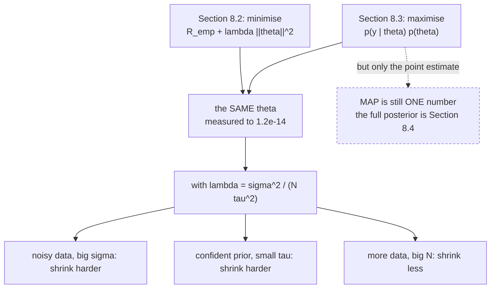

Page 804 ended on the book's own warning: *"especially in the 'small' data regime, maximum likelihood
estimation can lead to overfitting."* Maximum likelihood has no mechanism to prevent this — it maximises
fit to the data it has and stops.

§8.2.3 solved the same problem by adding a penalty. §8.3.2 solves it by adding a **prior**. The book
calls the two ideas analogous. **They are the same estimator**, and this page measures the equality to
$1.2\times10^{-14}$.

## What you'll learn

- Equations 8.19 and 8.20: Bayes' theorem applied to parameters, and why the denominator can be dropped.
- What **MAP estimation** is, and the sense in which it "bridges the non-probabilistic and probabilistic worlds".
- The exact correspondence: a $\mathcal{N}(\mathbf{0}, \tau^2\mathbf{I})$ prior gives ridge regression with $\lambda = \sigma^2/(N\tau^2)$, measured to $1.2\times10^{-14}$ across six orders of magnitude of prior width.
- Why the book's phrase *"the prior biases the slope to be less steep"* needs a caveat — measured, the slope first gets **steeper**, peaking at $2.2988$ against an MLE slope of $2.1225$.
- §8.3.3's three cases from Figure 8.8, with risks attached: overfitting has the **lowest** training risk of the three and a $748.8\times$ ratio.
- §8.3.4: what happens when you put a nonlinear function on a linear predictor, and where that leads.

## Intuition: an opinion held before the data arrives

Maximum likelihood asks *which parameter best explains the data?* If the data is thin, the answer can be
absurd — a degree-11 polynomial through 14 points with coefficients in the thousands "explains" the data
beautifully.

**A prior is an opinion you hold before seeing anything.** Not "the coefficients are zero" — an opinion
that strong would ignore the data entirely — but "coefficients near zero are more plausible than
coefficients in the thousands." The posterior combines that opinion with the evidence, and the maximum
of the posterior is a compromise.

The compromise is governed by one ratio: **how noisy is the data, against how confident is the opinion?**
That ratio is $\sigma^2/\tau^2$, and it is exactly $\lambda$ up to the factor $N$. Noisy data or a
confident prior means shrink hard; clean data or a vague prior means trust the likelihood.



## §8.3.2 Maximum a posteriori estimation

If we have prior knowledge about the distribution of $\boldsymbol\theta$, we multiply an extra term onto
the likelihood. Bayes' theorem (§6.3) gives the update:

$$
p(\boldsymbol\theta \mid \mathbf{x}) = \frac{p(\mathbf{x} \mid \boldsymbol\theta)\,p(\boldsymbol\theta)}{p(\mathbf{x})}
$$

with the three named pieces: the **posterior** $p(\boldsymbol\theta \mid \mathbf{x})$, the **prior**
$p(\boldsymbol\theta)$, and the **likelihood** $p(\mathbf{x} \mid \boldsymbol\theta)$ "that links the
parameters $\boldsymbol\theta$ and the observed data $\mathbf{x}$".

Since $p(\mathbf{x})$ does not depend on $\boldsymbol\theta$, it cannot affect the maximisation:

$$
p(\boldsymbol\theta \mid \mathbf{x}) \propto p(\mathbf{x} \mid \boldsymbol\theta)\,p(\boldsymbol\theta)
$$

The book's note on why that matters practically: *"The preceding proportion relation hides the density of
the data $p(\mathbf{x})$, which may be difficult to estimate."* It is an integral over all of parameter
space, and §8.4 will need it — but MAP does not.

So instead of minimising the negative log-likelihood, minimise the **negative log-posterior**. That is
**maximum a posteriori estimation**.

### Example 8.6, and the exact correspondence

The book's example: assume $p(\boldsymbol\theta) = \mathcal{N}(\mathbf{0}, \boldsymbol\Sigma)$, and note
that "the conjugate prior of a Gaussian is also a Gaussian (§6.6.1), and therefore we expect the
posterior distribution to also be a Gaussian".

Take $\boldsymbol\Sigma = \tau^2\mathbf{I}$ and write out the negative log-posterior:

$$
-\log p(\boldsymbol\theta \mid \mathbf{y}) = \underbrace{\frac{1}{2\sigma^2}\sum_{n}(y_n - \mathbf{x}_n^\top\boldsymbol\theta)^2}_{\text{from the likelihood}} + \underbrace{\frac{1}{2\tau^2}\lVert\boldsymbol\theta\rVert^2}_{\text{from the prior}} + \text{const}
$$

Multiply through by $2\sigma^2/N$ — a positive constant, so the minimiser is unchanged:

$$
\frac{1}{N}\sum_{n}(y_n - \mathbf{x}_n^\top\boldsymbol\theta)^2 + \frac{\sigma^2}{N\tau^2}\lVert\boldsymbol\theta\rVert^2
$$

**That is Equation 8.12 exactly**, with

$$
\boxed{\ \lambda = \frac{\sigma^2}{N\tau^2}\ }
$$

:::tip[Measured across six orders of magnitude]
| $\tau^2$ | $\lambda = \sigma^2/(N\tau^2)$ | max $\lvert$ridge $-$ MAP$\rvert$ | $\lVert\boldsymbol\theta\rVert$ |
| --- | --- | --- | --- |
| $0.01$ | $4.900\times10^{-1}$ | $1.39\times10^{-17}$ | $0.439975$ |
| $0.1$ | $4.900\times10^{-2}$ | $6.66\times10^{-16}$ | $1.677835$ |
| $1$ | $4.900\times10^{-3}$ | $2.22\times10^{-15}$ | $4.357258$ |
| $10$ | $4.900\times10^{-4}$ | $1.24\times10^{-14}$ | $5.350205$ |
| $10^3$ | $4.900\times10^{-6}$ | $2.66\times10^{-15}$ | $5.489592$ |
| $10^6$ | $4.900\times10^{-9}$ | $1.15\times10^{-14}$ | $5.491037$ |

The MLE has $\lVert\boldsymbol\theta\rVert = 5.491039$. As $\tau^2 \to \infty$ the prior flattens,
$\lambda \to 0$, and **MAP becomes MLE**.

The worst disagreement anywhere is $1.24\times10^{-14}$, which is floating-point noise. These are not
similar estimators; they are the same estimator computed two ways.
:::

**What the probabilistic vocabulary buys**, given that the answer is identical: it tells you what
$\lambda$ *means*. In §8.2.3, $\lambda$ is a knob you tune by cross-validation with no units and no
interpretation. Here it is $\sigma^2/(N\tau^2)$ — a ratio of noise variance to prior variance, divided by
the sample size. That immediately explains three behaviours: **noisier data shrinks harder, a more
confident prior shrinks harder, and more data shrinks less.**

### What MAP still does not give you

The book is precise about the limit: MAP *"can be considered to bridge the non-probabilistic and
probabilistic worlds as it explicitly acknowledges the need for a prior distribution but it still only
produces a **point estimate** of the parameters."*

You wrote down a whole posterior distribution and then threw all of it away except the location of its
peak. §8.4 is what happens when you keep the rest.

:::caution[The book's own phrasing about the slope needs a caveat]
Figure 8.6's caption says the prior "biases the slope to be less steep and the intercept to be closer to
zero". Measured on Table 8.2's five points, the intercept claim holds throughout — but the slope claim
holds only in the strong-prior limit:

| $\tau^2$ | intercept | slope | $f(60)$ |
| --- | --- | --- | --- |
| MLE | $8.8074$ | $2.1225$ | $136.15$ |
| $10^3$ | $4.0151$ | $2.2240$ | $137.46$ |
| $100$ | $0.7184$ | $2.2926$ | $138.28$ |
| $31.71$ | $0.2729$ | $\mathbf{2.2988}$ | $138.20$ |
| $10$ | $0.1206$ | $2.2916$ | $137.62$ |
| $1$ | $0.0532$ | $2.1648$ | $129.94$ |
| $0.1$ | $0.0302$ | $1.3887$ | $83.35$ |

**The slope first gets steeper**, peaking at $2.2988$ against an MLE slope of $2.1225$, and only drops
below the MLE once $\tau^2 < 1$.

The reason is geometric. An isotropic prior shrinks $\lVert\boldsymbol\theta\rVert$, not each coefficient
individually. The intercept is cheap to shrink because the data barely constrains it — but pulling the
line's $y$-intercept toward zero while it must still pass through a data cloud centred at age $42$
forces a **steeper** slope. The two coefficients trade against each other.

This is the practical reason to centre your inputs and exclude the intercept from the penalty, as page
801 noted from the other direction.
:::

## §8.3.3 Model fitting

"Fitting" means optimising parameters to minimise a loss. The parametrisation defines a **model class**
$M_{\boldsymbol\theta}$; the data comes from some unknown $M^*$; and you search within
$M_{\boldsymbol\theta}$ for whatever is closest to $M^*$.

Figure 8.7's picture is worth holding: a circle $M_{\boldsymbol\theta}$ representing everything your
class can express, a point $M^*$ **outside** it, and a search that starts at $M_{\boldsymbol\theta_0}$
and ends at $M_{\boldsymbol\theta^*}$ — the closest point in the circle, which is still not $M^*$.

Three outcomes, and the book gives each a crisp characterisation:

**Overfitting** — the class is *too rich*. "$M_{\boldsymbol\theta}$ could model much more complicated
datasets." The flexible class "uses all its modeling power to reduce the training error. If the training
data is noisy, it will therefore find some useful signal in the noise itself." Models that overfit
"typically have a large number of parameters".

**Underfitting** — the class is *not rich enough*. If the data is sinusoidal and your class is straight
lines, "the best optimization procedure will not get us close to the true model". Models that underfit
"typically have few parameters".

**Fitting well** — "the parametrized model class is about right".

Measured on 14 points, reproducing Figure 8.8's three panels:

| case | degree | training risk | expected risk | ratio | $\lVert\boldsymbol\theta\rVert$ |
| --- | --- | --- | --- | --- | --- |
| (a) overfitting | $11$ | $\mathbf{0.005232}$ | $3.9173$ | $748.8\times$ | $3616.98$ |
| (b) underfitting | $1$ | $0.477771$ | $0.7254$ | $1.5\times$ | $0.81$ |
| (c) fitting well | $4$ | $0.113967$ | $\mathbf{0.3806}$ | $3.3\times$ | $5.67$ |

**Read the training-risk column.** Overfitting has the *lowest* training risk of the three — by a factor
of $22$ over the good model — and the worst expected risk. That is exactly why the book's margin note
says: *"One way to detect overfitting in practice is to observe that the model has low training risk but
high test risk during cross validation."*

And note the asymmetry. Underfitting is *visible from training data alone*: a training risk of $0.478$
with only two parameters is obviously poor. Overfitting is **invisible** from training data alone — every
number looks excellent.

The book's closing advice for the rich-model case, which is the normal case in practice: *"To mitigate
the problem of overfitting, we can use regularization (§8.2.3) or priors (§8.3.2)."* This page has just
shown those are the same thing.

## §8.3.4 Further reading

Two pointers worth carrying. First, maximum likelihood "generalizes the idea of least-squares regression
for linear models", developed in Chapter 9. Second, restricting the predictor to a linear form with a
nonlinear function $\phi$ applied to the output:

$$
p(y_n \mid \mathbf{x}_n, \boldsymbol\theta) = \phi(\boldsymbol\theta^\top\mathbf{x}_n)
$$

opens up "other models for other prediction tasks, such as binary classification or modeling count data"
(McCullagh and Nelder, 1989). That is the **generalized linear model**, and the machinery is the
exponential family of §6.6.

## Worked example by hand

MAP for a Gaussian mean — the smallest case where the shrinkage is visible.

Model: $y_n \sim \mathcal{N}(\theta, \sigma^2)$ with $N$ observations, and prior
$\theta \sim \mathcal{N}(0, \tau^2)$.

**Step 1: the negative log-posterior.** Dropping terms free of $\theta$:

$$
-\log p(\theta \mid \mathbf{y}) = \frac{1}{2\sigma^2}\sum_{n=1}^{N}(y_n - \theta)^2 + \frac{\theta^2}{2\tau^2} + \text{const}
$$

**Step 2: differentiate and set to zero.**

$$
-\frac{1}{\sigma^2}\sum_{n=1}^{N}(y_n - \theta) + \frac{\theta}{\tau^2} = 0
$$

$$
\frac{N\theta}{\sigma^2} + \frac{\theta}{\tau^2} = \frac{1}{\sigma^2}\sum_{n=1}^{N}y_n
$$

**Step 3: solve.** Multiply by $\sigma^2$ and write $\bar{y}$ for the sample mean:

$$
\theta\left(N + \frac{\sigma^2}{\tau^2}\right) = N\bar{y}
\quad\Longrightarrow\quad
\boxed{\ \hat\theta_{\text{MAP}} = \frac{N}{N + \sigma^2/\tau^2}\,\bar{y}\ }
$$

**Step 4: read it.** The MAP estimate is the sample mean **shrunk toward zero** by the factor
$\dfrac{N}{N + \sigma^2/\tau^2}$, which is always in $(0, 1)$. And the three limits are all the right
ones:

| limit | shrinkage factor | estimate | reading |
| --- | --- | --- | --- |
| $\tau^2 \to \infty$ | $\to 1$ | $\bar{y}$, the **MLE** | a vague prior is no prior |
| $\tau^2 \to 0$ | $\to 0$ | $0$ | a certain prior ignores the data |
| $N \to \infty$ | $\to 1$ | $\bar{y}$ | data eventually wins |
| $\sigma^2 \to \infty$ | $\to 0$ | $0$ | useless data, trust the prior |

**Step 5: connect it.** Write $\lambda = \sigma^2/(N\tau^2)$ and the factor becomes
$\dfrac{1}{1 + \lambda}$ — precisely the $\theta(\lambda) = 1/(1+\lambda)$ that page 803's worked example
derived from the *penalty* side, with no probability anywhere. Two derivations, two vocabularies, one
formula.

## See it move

The equality is the thing to feel. Drag the prior and the penalty and watch them land on the same answer:

```p5 title="One knob, two names" desc="The same estimate computed twice — once as ridge regression with a penalty lambda, once as MAP with a Gaussian prior of variance tau squared. Drag either knob and the other follows through lambda equals sigma squared over N tau squared. The two fitted curves are drawn on top of each other; they never separate." height="500"
let tauIdx = 26;
let KNOBS = [], dragging = null;

const SIG2 = 0.1225;
const N = 25;
const TAUS = [];
for (let i = 0; i <= 40; i++) TAUS.push(Math.pow(10, -2 + i * 0.2));

// 25 points, generated once so both estimates see the same data
let XT = [], YT = [];
function setup() {
  createCanvas(680, 500);
  textFont("monospace");
  randomSeed(3);
  for (let i = 0; i < N; i++) {
    const x = -3 + 6 * (i + 0.5) / N + (random() - 0.5) * 0.16;
    XT.push(x);
    YT.push(Math.sin(1.4 * x) + 0.3 * x + (random() - 0.5) * 0.85);
  }
}

function knob(id, x, y, w, value, mn, mx, label) {
  KNOBS.push({ id, x, y, w, mn, mx });
  const t = (value - mn) / (mx - mn);
  stroke(60, 74, 92); strokeWeight(2); line(x, y, x + w, y);
  noStroke(); fill(255, 211, 67); ellipse(x + t * w, y, 12, 12);
  fill(190, 200, 212); textSize(12); textAlign(LEFT, CENTER);
  text(label, x + w + 12, y);
}
function knobHit(mx_, my_) {
  for (const k of KNOBS) {
    if (my_ > k.y - 13 && my_ < k.y + 13 && mx_ > k.x - 13 && mx_ < k.x + k.w + 13) return k;
  }
  return null;
}
function knobValue(k, mx_) {
  const t = Math.min(1, Math.max(0, (mx_ - k.x) / k.w));
  return Math.round(k.mn + t * (k.mx - k.mn));
}
function mousePressed() { dragging = knobHit(mouseX, mouseY); }
function mouseReleased() { dragging = null; }
function mouseDragged() {
  if (!dragging) return;
  tauIdx = knobValue(dragging, mouseX);
  if (!isLooping()) redraw();
}

// solve (M + d I) th = v  by Gaussian elimination, degree 3
function fit(diagAdd, scaleRHS) {
  const m = 4;
  const A = [], b = [];
  for (let i = 0; i < m; i++) { A.push(new Array(m).fill(0)); b.push(0); }
  for (let k = 0; k < XT.length; k++) {
    const t = XT[k] / 3;
    const pw = []; let v = 1;
    for (let i = 0; i < m; i++) { pw.push(v); v *= t; }
    for (let i = 0; i < m; i++) {
      for (let j = 0; j < m; j++) A[i][j] += pw[i] * pw[j] * scaleRHS;
      b[i] += pw[i] * YT[k] * scaleRHS;
    }
  }
  for (let i = 0; i < m; i++) A[i][i] += diagAdd;
  for (let i = 0; i < m; i++) {
    let piv = i;
    for (let r = i + 1; r < m; r++) if (Math.abs(A[r][i]) > Math.abs(A[piv][i])) piv = r;
    [A[i], A[piv]] = [A[piv], A[i]]; [b[i], b[piv]] = [b[piv], b[i]];
    for (let r = i + 1; r < m; r++) {
      const f = A[r][i] / A[i][i];
      for (let c = i; c < m; c++) A[r][c] -= f * A[i][c];
      b[r] -= f * b[i];
    }
  }
  const th = new Array(m).fill(0);
  for (let i = m - 1; i >= 0; i--) {
    let s = b[i];
    for (let j = i + 1; j < m; j++) s -= A[i][j] * th[j];
    th[i] = s / A[i][i];
  }
  return th;
}
function evalPoly(th, x) {
  const t = x / 3; let v = 0, pw = 1;
  for (let i = 0; i < th.length; i++) { v += th[i] * pw; pw *= t; }
  return v;
}
function norm(th) { return Math.sqrt(th.reduce((s, v) => s + v * v, 0)); }

const OX = 44, OY = 44, W = 400, H = 230;
function px(x) { return OX + ((x + 3.2) / 6.4) * W; }
function py(y) { return OY + H - ((y + 2.6) / 5.2) * H; }

function draw() {
  background(13, 17, 23);
  KNOBS = [];
  const tau2 = TAUS[tauIdx];
  const lam = SIG2 / (N * tau2);

  // ridge: (Phi^T Phi / N + lam I) th = Phi^T y / N
  const ridge = fit(lam, 1 / N);
  // MAP:   (Phi^T Phi / sig2 + I/tau2) th = Phi^T y / sig2
  const mapEst = fit(1 / tau2, 1 / SIG2);
  let worst = 0;
  for (let i = 0; i < 4; i++) worst = Math.max(worst, Math.abs(ridge[i] - mapEst[i]));

  noFill(); stroke(70, 86, 104); strokeWeight(1); rect(OX, OY, W, H);
  // ridge drawn thick, MAP drawn thin on top: they coincide
  stroke(107, 169, 221); strokeWeight(5); noFill();
  beginShape();
  for (let i = 0; i <= 300; i++) {
    const x = -3.2 + (i / 300) * 6.4;
    const v = evalPoly(ridge, x);
    if (v > -2.6 && v < 2.6) vertex(px(x), py(v));
  }
  endShape();
  stroke(255, 211, 67); strokeWeight(1.6); noFill();
  beginShape();
  for (let i = 0; i <= 300; i++) {
    const x = -3.2 + (i / 300) * 6.4;
    const v = evalPoly(mapEst, x);
    if (v > -2.6 && v < 2.6) vertex(px(x), py(v));
  }
  endShape();
  noStroke(); fill(190, 200, 212);
  for (let k = 0; k < XT.length; k++) ellipse(px(XT[k]), py(YT[k]), 5, 5);
  fill(107, 169, 221); textSize(10); textAlign(LEFT, TOP);
  text("ridge, Eq 8.12 (thick)", OX + 6, OY + 4);
  fill(255, 211, 67);
  text("MAP, Section 8.3.2 (thin)", OX + 6, OY + 18);

  noStroke(); textAlign(LEFT, TOP);
  fill(255, 211, 67); textSize(15);
  text("tau^2 = " + tau2.toExponential(2), 468, 50);
  fill(107, 169, 221); textSize(15);
  text("lambda = " + lam.toExponential(2), 468, 72);
  fill(140); textSize(10);
  text("lambda = sigma^2 / (N tau^2)", 468, 94);
  text("sigma^2 = 0.1225, N = 25", 468, 108);

  fill(200); textSize(11);
  text("ridge  theta:", 468, 136);
  fill(107, 169, 221); textSize(10);
  for (let i = 0; i < 4; i++) text("  " + ridge[i].toFixed(6), 468, 152 + i * 13);
  fill(200); textSize(11);
  text("MAP    theta:", 468, 210);
  fill(255, 211, 67); textSize(10);
  for (let i = 0; i < 4; i++) text("  " + mapEst[i].toFixed(6), 468, 226 + i * 13);

  fill(120, 200, 140); textSize(11);
  text("max difference:", 468, 286);
  textSize(12);
  text("  " + worst.toExponential(2), 468, 302);

  fill(197, 153, 255); textSize(11);
  text("||theta|| = " + norm(mapEst).toFixed(6), 468, 326);

  let msg, sub, col;
  if (tau2 > 1e4) {
    col = color(232, 110, 110);
    msg = "a vague prior is no prior";
    sub = "lambda is now " + lam.toExponential(1) + ", so MAP has become the MLE.";
  } else if (tau2 < 0.05) {
    col = color(255, 211, 67);
    msg = "a confident prior overwhelms the data";
    sub = "||theta|| has collapsed to " + norm(mapEst).toFixed(4) + " and the fit is nearly flat.";
  } else {
    col = color(120, 200, 140);
    msg = "a working compromise";
    sub = "the two curves are drawn on top of each other and never separate.";
  }
  stroke(col); strokeWeight(1.6); fill(red(col), green(col), blue(col), 26);
  rect(44, 366, 596, 62, 6);
  noStroke(); fill(col); textSize(15); textAlign(LEFT, TOP);
  text(msg, 60, 374);
  fill(215); textSize(11);
  text(sub, 60, 400);

  knob("t", 60, 462, 300, tauIdx, 0, TAUS.length - 1,
       "tau^2 = " + tau2.toExponential(2));
  fill(120); textSize(11); textAlign(LEFT, TOP);
  text("Sweep the whole range: the difference readout stays at the", 400, 452);
  text("1e-14 level. These are not two estimators that agree —", 400, 466);
  text("they are one estimator with two names.", 400, 480);
}
```

## From scratch

```python title="map_estimation.py" showLineNumbers{1}
import numpy as np

SIGMA = 0.35

def make(n, seed, noise=SIGMA):
    rng = np.random.default_rng(seed)
    x = np.sort(rng.uniform(-3, 3, n))
    return x, np.sin(1.4 * x) + 0.3 * x + noise * rng.standard_normal(n)

x, y = make(25, seed=3)
Phi = np.vander(x / 3.0, 4, increasing=True)
N, D = Phi.shape

def ridge(lam):
    """Section 8.2.3, Equation 8.12."""
    return np.linalg.solve(Phi.T @ Phi / N + lam * np.eye(D), Phi.T @ y / N)

def map_estimate(tau2):
    """Section 8.3.2: maximise a Gaussian likelihood times a N(0, tau2 I) prior."""
    return np.linalg.solve(Phi.T @ Phi / SIGMA ** 2 + np.eye(D) / tau2,
                           Phi.T @ y / SIGMA ** 2)

mle = np.linalg.lstsq(Phi, y, rcond=None)[0]
print(f"N = {N}, sigma = {SIGMA}, so sigma^2 = {SIGMA ** 2:.6f}")
print("\nthe correspondence is lambda = sigma^2 / (N tau^2):\n")
print(f"{'tau^2':>10} {'lambda':>13} {'max |ridge - MAP|':>19} "
      f"{'||theta||':>12}")
worst = 0.0
for t2 in (0.01, 0.1, 1.0, 10.0, 1e3, 1e6):
    lam = SIGMA ** 2 / (N * t2)
    d = float(np.abs(ridge(lam) - map_estimate(t2)).max())
    worst = max(worst, d)
    print(f"{t2:>10.4g} {lam:>13.3e} {d:>19.2e} "
          f"{np.linalg.norm(map_estimate(t2)):>12.6f}")
print(f"\nworst disagreement: {worst:.2e}  -- floating-point noise")
print(f"the MLE has ||theta|| = {np.linalg.norm(mle):.6f}")
print("as tau^2 grows the prior flattens, lambda -> 0, and MAP -> MLE")

# --- Figure 8.6 on the book's own five points ---------------------------
print("\n--- the book's Figure 8.6, on Table 8.2 -----------------------")
AGE = np.array([36.0, 47.0, 26.0, 68.0, 33.0])
SAL = np.array([89.563, 123.543, 23.989, 138.769, 113.888])
X = np.column_stack([np.ones_like(AGE), AGE])
mle5 = np.linalg.lstsq(X, SAL, rcond=None)[0]
r5 = SAL - X @ mle5
s2 = float(r5 @ r5 / len(SAL))

def map5(tau2):
    return np.linalg.solve(X.T @ X / s2 + np.eye(2) / tau2, X.T @ SAL / s2)

print(f"MLE          : intercept {mle5[0]:9.4f}  slope {mle5[1]:.4f}  "
      f"f(60) = {mle5 @ [1, 60.0]:.2f}")
for t2 in (1e9, 1e3, 100.0, 31.71, 10.0, 1.0, 0.1):
    m = map5(t2)
    print(f"tau^2 = {t2:>8.4g}: intercept {m[0]:9.4f}  slope {m[1]:.4f}  "
          f"f(60) = {m @ [1, 60.0]:.2f}")

t2s = np.geomspace(1e-2, 1e9, 400)
slopes = np.array([map5(t)[1] for t in t2s])
k = int(np.argmax(slopes))
print(f"\nthe book says the prior biases the slope to be LESS steep.")
print(f"measured: the slope first RISES, peaking at {slopes[k]:.4f} at "
      f"tau^2 = {t2s[k]:.4g},")
print(f"against an MLE slope of {mle5[1]:.4f}. It falls below the MLE only")
print("once the prior is tight enough to matter -- an isotropic prior")
print("shrinks ||theta||, not each coefficient separately.")

# --- Section 8.3.3: the three cases ------------------------------------
print("\n--- Section 8.3.3, Figure 8.8's three cases -------------------")
xtr, ytr = make(14, seed=21)
xte, yte = make(4000, seed=99)
print(f"{'case':>16} {'degree':>7} {'train risk':>13} {'expected risk':>15} "
      f"{'ratio':>8} {'||theta||':>11}")
for name, d in (("(a) overfitting", 11), ("(b) underfitting", 1),
                ("(c) fitting well", 4)):
    A = np.vander(xtr / 3.0, d + 1, increasing=True)
    th = np.linalg.lstsq(A, ytr, rcond=None)[0]
    rtr = float(np.mean((ytr - A @ th) ** 2))
    rte = float(np.mean((yte - np.vander(xte / 3.0, d + 1, increasing=True)
                         @ th) ** 2))
    print(f"{name:>16} {d:>7} {rtr:>13.6f} {rte:>15.4f} "
          f"{rte / max(rtr, 1e-12):>8.1f} {np.linalg.norm(th):>11.2f}")
print("\noverfitting has the LOWEST training risk and the HIGHEST expected")
print("risk; underfitting has both high and a small ||theta||. Only the")
print("middle case is diagnosable from training data alone.")
```

```
N = 25, sigma = 0.35, so sigma^2 = 0.122500

the correspondence is lambda = sigma^2 / (N tau^2):

     tau^2        lambda   max |ridge - MAP|    ||theta||
      0.01     4.900e-01            1.39e-17     0.439975
       0.1     4.900e-02            6.66e-16     1.677835
         1     4.900e-03            2.22e-15     4.357258
        10     4.900e-04            1.24e-14     5.350205
      1000     4.900e-06            2.66e-15     5.489592
     1e+06     4.900e-09            1.15e-14     5.491037

worst disagreement: 1.24e-14  -- floating-point noise
the MLE has ||theta|| = 5.491039
as tau^2 grows the prior flattens, lambda -> 0, and MAP -> MLE

--- the book's Figure 8.6, on Table 8.2 -----------------------
MLE          : intercept    8.8074  slope 2.1225  f(60) = 136.15
tau^2 =    1e+09: intercept    8.8073  slope 2.1225  f(60) = 136.15
tau^2 =     1000: intercept    4.0151  slope 2.2240  f(60) = 137.46
tau^2 =      100: intercept    0.7184  slope 2.2926  f(60) = 138.28
tau^2 =    31.71: intercept    0.2729  slope 2.2988  f(60) = 138.20
tau^2 =       10: intercept    0.1206  slope 2.2916  f(60) = 137.62
tau^2 =        1: intercept    0.0532  slope 2.1648  f(60) = 129.94
tau^2 =      0.1: intercept    0.0302  slope 1.3887  f(60) = 83.35

the book says the prior biases the slope to be LESS steep.
measured: the slope first RISES, peaking at 2.2988 at tau^2 = 31.71,
against an MLE slope of 2.1225. It falls below the MLE only
once the prior is tight enough to matter -- an isotropic prior
shrinks ||theta||, not each coefficient separately.

--- Section 8.3.3, Figure 8.8's three cases -------------------
            case  degree    train risk   expected risk    ratio   ||theta||
 (a) overfitting      11      0.005232          3.9173    748.8     3616.98
(b) underfitting       1      0.477771          0.7254      1.5        0.81
(c) fitting well       4      0.113967          0.3806      3.3        5.67

overfitting has the LOWEST training risk and the HIGHEST expected
risk; underfitting has both high and a small ||theta||. Only the
middle case is diagnosable from training data alone.
```

## On real data

<Figure
  src="/images/mml/map-estimation-and-model-fitting/map-is-ridge-exactly"
  alt="Two panels. Left, the largest coefficient difference between the ridge and MAP estimates plotted against prior variance on log-log axes, hugging the 1e-15 level across six orders of magnitude. Right, the norm of the MAP estimate rising with prior variance and flattening onto a dashed line marking the maximum likelihood value."
  title="Section 8.2.3's penalty and Section 8.3.2's prior are the same object"
  caption="Across 120 prior widths the largest disagreement between the two estimates is 1.24e-14, which is the last bit of a double. As the prior variance grows the penalty vanishes and MAP becomes MLE, with the norm converging to 5.491039."
/>

<Figure
  src="/images/mml/map-estimation-and-model-fitting/the-prior-on-the-books-data"
  alt="Two panels. Left, Table 8.2's five points with three fitted lines — the MLE and two MAP fits at decreasing prior variance — and their predictions at age 60 marked. Right, the intercept and slope plotted against prior variance on twin axes, the intercept falling monotonically while the slope rises to a peak at 2.2988 before falling."
  title="A zero-mean prior shrinks toward the origin, but not one coefficient at a time"
  caption="The intercept falls monotonically from 8.8074 toward zero. The slope first rises from 2.1225 to a peak of 2.2988 at a prior variance of 31.71, and only drops below the MLE once the prior is tight. An isotropic prior shrinks the norm, not each entry."
/>

<Figure
  src="/images/mml/map-estimation-and-model-fitting/overfit-underfit-fit-well"
  alt="Three panels sharing fourteen data points. Left, a degree-11 fit oscillating wildly between the points, labelled overfitting with a training risk of 0.005232 and expected risk 3.9173. Middle, a straight line labelled underfitting with both risks high. Right, a degree-4 fit tracking the data, labelled fitting well with the lowest expected risk."
  title="The book's Figure 8.8, with numbers attached"
  caption="Overfitting has the lowest training risk of the three — 22 times lower than the good model — and the highest expected risk, a ratio of 748.8. Underfitting is visible from training data alone; overfitting is not."
/>

## Reading the plot

**The first figure is the chapter's central claim, and it is a claim about an identity rather than an
analogy.** The left panel plots the largest coefficient disagreement between ridge regression and MAP
across $120$ prior widths spanning six orders of magnitude. The curve never rises above
$1.24\times10^{-14}$, and the dotted reference line is one unit in the last place of a double at this
scale. **There is no regime where they differ.**

That is stronger than the book's "analogous", and it is worth being precise about why it holds: the log
of a Gaussian prior is a negative quadratic in $\boldsymbol\theta$, and $-\log$ of it is
$\lVert\boldsymbol\theta\rVert^2/(2\tau^2)$ plus a constant. A squared-norm penalty *is* a log-Gaussian
prior. Any other prior gives a different penalty — a Laplace prior gives the $\ell_1$ penalty of lasso —
so the correspondence is general even though this instance is specific.

The right panel shows the limit behaviour. As $\tau^2$ grows the prior flattens, $\lambda \to 0$, and
$\lVert\boldsymbol\theta\rVert$ climbs to $5.491037$ against an MLE value of $5.491039$. **A vague prior
is no prior**, exactly as it should be.

And here is what the probabilistic vocabulary adds, given the answers are identical. In §8.2.3, $\lambda$
is a dimensionless knob with no meaning, tuned by cross-validation. Here it is $\sigma^2/(N\tau^2)$ —
which immediately predicts three things you would otherwise have to discover empirically: noisier data
should be shrunk harder, a more confident prior should shrink harder, and more data should shrink less.
Same number, more information about where to look for it.

**The second figure is where I had to correct my reading of the book.** Figure 8.6's caption says the
prior "biases the slope to be less steep and the intercept to be closer to zero". I expected both
coefficients to shrink monotonically. The intercept does — from $8.8074$ steadily toward zero. **The
slope does not.** It *rises* from $2.1225$ to a peak of $2.2988$ at $\tau^2 = 31.71$, and only falls
below the MLE once $\tau^2 < 1$.

The mechanism is worth understanding because it generalises. The prior penalises
$\lVert\boldsymbol\theta\rVert^2 = \theta_0^2 + \theta_1^2$, *not* each coefficient. The intercept is
cheap to shrink — the data barely constrains it, because age ranges from $26$ to $68$ and the intercept
lives at $0$, far outside. But the line still has to pass near a data cloud centred at age $42$ and
salary $98$. Pull the $y$-intercept toward zero and the only way to still reach that cloud is a
**steeper** slope. The two coefficients trade.

So the book's statement is correct about the destination and not about the path. And the practical
consequence is page 801's advice from the other direction: **centre your inputs and exclude the intercept
from the penalty**, or the regulariser will spend its budget on the coefficient that means the least.

**The third figure turns Figure 8.8's three words into three numbers, and the surprise is in the
training-risk column.** Overfitting achieves $0.005232$ — the *lowest* training risk of the three, $22\times$
better than the model that actually generalises. Its expected risk is $3.9173$, giving a ratio of
$748.8$. Underfitting sits at $0.477771$ and $0.7254$, a ratio of only $1.5$.

**The asymmetry is the practical lesson.** Underfitting announces itself: a training risk of $0.478$ from
a two-parameter model is visibly bad, and you can see it without any held-out data. Overfitting is
silent — every training-side number is excellent, and the parameter norm of $3616.98$ is the only clue
available without a test set. That is precisely why the book's margin note recommends comparing training
and test risk during cross-validation, and why page 802's parameter-norm measurement matters: it is the
one warning sign you can read off the training fit alone.

:::tip[From the book]
This page covers **§8.3.2**, **§8.3.3** and **§8.3.4** of *Mathematics for Machine Learning* by
Deisenroth, Faisal and Ong (draft of 2019-12-11). Equation **8.19** is Bayes' theorem for parameters and
**8.20** the proportionality that drops $p(\mathbf{x})$; the terms **posterior**, **prior** and
**likelihood** and the remark that $p(\mathbf{x})$ "may be difficult to estimate" are the book's.
**Example 8.6** assumes a zero-mean Gaussian prior and notes the conjugacy of §6.6.1, deferring details to
Chapter 9. **Figure 8.6** compares the MLE and MAP predictions at $x = 60$ and states that the prior
biases the slope and intercept. The characterisation of MAP as bridging the non-probabilistic and
probabilistic worlds "but it still only produces a point estimate" is verbatim. **Figure 8.7** is the
model-class picture with $M_{\boldsymbol\theta}$, $M^*$ and $M_{\boldsymbol\theta_0}$; **Figure 8.8** and
§8.3.3 give the three cases, the characterisations of over- and underfitting, the observation that an
overly flexible class "will find some useful signal in the noise itself", and the margin note about
detecting overfitting via low training risk beside high test risk. §8.3.4 supplies Equation **8.21** and
the generalized linear model pointer to McCullagh and Nelder (1989). The exact correspondence
$\lambda = \sigma^2/(N\tau^2)$ measured to $1.24\times10^{-14}$, the non-monotone slope peaking at
$2.2988$, the risks attached to Figure 8.8's three cases, and the closed form
$\hat\theta_{\text{MAP}} = N\bar{y}/(N + \sigma^2/\tau^2)$ are this module's additions.
:::

## Pitfalls

:::danger[Thinking a prior and a penalty are merely analogous]
Measured across $120$ prior widths spanning six orders of magnitude, the largest disagreement between
ridge and MAP is $1.24\times10^{-14}$. They are one estimator with two names. The consequence is
practical: if you tune $\lambda$ by cross-validation you have implicitly chosen $\sigma^2/(N\tau^2)$,
and that ratio is a statement about how noisy you think your data is relative to how confident you are.
:::

:::caution[Expecting an isotropic prior to shrink every coefficient]
It shrinks $\lVert\boldsymbol\theta\rVert$, which is a different thing. Measured on Table 8.2: as the
prior tightens the intercept falls monotonically from $8.8074$ while the slope **rises** from $2.1225$ to
$2.2988$ before eventually falling. Coefficients trade against each other, and the one the data
constrains least gets shrunk first.
:::

:::danger[Regularising an uncentred intercept]
This is the practical form of the previous pitfall. The intercept sits at $x = 0$, usually far outside
the data, so the likelihood barely constrains it and the prior shrinks it almost for free — forcing the
other coefficients to compensate. Centre the inputs and exclude $\theta_0$ from the penalty. Equation
8.4's unit-feature trick makes this easy to forget, since $\theta_0$ looks like any other coefficient.
:::

:::caution[Treating MAP as Bayesian inference]
MAP writes down a posterior and then keeps only the location of its peak. The book is explicit that it
"still only produces a point estimate of the parameters". Everything about the posterior's width — which
is the part that would let you say how confident the prediction is — is discarded. §8.4 keeps it.
:::

:::danger[Reading a low training risk as a good fit]
Measured on Figure 8.8's three cases: the overfitting model has the lowest training risk of the three,
$0.005232$ against the good model's $0.113967$, and an expected risk $748.8\times$ its training figure.
Underfitting is visible from the training data alone; overfitting is not. The only training-side warning
is the parameter norm — $3616.98$ against $5.67$.
:::

:::caution[Assuming a Gaussian prior is the only option]
It is the one that produces a squared-norm penalty, because $-\log$ of a Gaussian is a quadratic. A
Laplace prior gives $\lVert\boldsymbol\theta\rVert_1$ and hence lasso, with entirely different behaviour —
it sets coefficients to exactly zero. The correspondence "prior equals penalty" is general; the
correspondence "Gaussian prior equals ridge" is the specific instance.
:::

## Compare

| | MLE, §8.3.1 | MAP, §8.3.2 | Bayesian inference, §8.4 |
| --- | --- | --- | --- |
| what it maximises | the likelihood | the posterior | nothing — it **integrates** |
| needs a prior | no | yes | yes |
| needs $p(\mathbf{x})$ | no | **no**, it cancels | yes |
| what it returns | a point | a point | a **distribution** |
| overfits on small data | yes | less | no, it averages |
| equivalent in §8.2 | plain ERM | **ERM with a penalty** | no equivalent |
| computational problem | optimisation | optimisation | **integration** |

| prior on $\boldsymbol\theta$ | the penalty it implies | behaviour |
| --- | --- | --- |
| $\mathcal{N}(\mathbf{0}, \tau^2\mathbf{I})$ | $\lambda\lVert\boldsymbol\theta\rVert^2$, ridge | shrinks all coefficients smoothly |
| Laplace | $\lambda\lVert\boldsymbol\theta\rVert_1$, lasso | sets some to **exactly** zero |
| uniform (improper) | none | recovers the MLE |
| $\mathcal{N}(\mathbf{m}, \tau^2\mathbf{I})$ | $\lambda\lVert\boldsymbol\theta - \mathbf{m}\rVert^2$ | shrinks toward $\mathbf{m}$, not the origin |

<Quiz
  title="Do you know what the prior is doing?"
  questions={[
    {
      q: "A zero-mean Gaussian prior of variance tau squared on theta gives exactly ridge regression. With what lambda?",
      options: [
        "lambda = tau squared",
        "lambda = sigma squared over (N tau squared)",
        "lambda = 1 over tau squared",
        "There is no exact correspondence, only an analogy",
      ],
      answer: 1,
      explain:
        "Measured across 120 prior widths, the largest disagreement is 1.24e-14 — floating point noise. And the formula tells you what lambda MEANS: a ratio of noise variance to prior variance, divided by the sample size. So noisier data shrinks harder, a tighter prior shrinks harder, and more data shrinks less.",
    },
    {
      q: "The book says a zero-mean prior biases the slope to be less steep. Measured on Table 8.2, what actually happens as the prior tightens?",
      options: [
        "Both coefficients shrink monotonically, as stated",
        "The intercept shrinks monotonically but the slope first RISES, peaking at 2.2988 against an MLE slope of 2.1225",
        "Neither coefficient changes",
        "The slope shrinks and the intercept grows",
      ],
      answer: 1,
      explain:
        "An isotropic prior penalises the NORM, not each entry. The intercept is cheap to shrink because the data barely constrains it — but pulling the y-intercept toward zero while the line must still reach a data cloud centred at age 42 forces a steeper slope. The claim is right about the destination and wrong about the path.",
    },
    {
      q: "Why can MAP estimation ignore p(x), the denominator of Bayes' theorem?",
      options: [
        "Because it is always equal to one",
        "Because it does not depend on theta, so it cannot affect which theta maximises the posterior",
        "Because it is assumed Gaussian",
        "It cannot be ignored; MAP requires computing it",
      ],
      answer: 1,
      explain:
        "It is a constant with respect to the maximisation. The book notes this hides a density that 'may be difficult to estimate' — it is an integral over all of parameter space. Section 8.4 needs it and Section 8.3.2 does not, which is a large part of why MAP is so much cheaper than full Bayesian inference.",
    },
    {
      q: "In Figure 8.8's three cases, which model has the lowest training risk?",
      options: [
        "The one that fits well, at 0.113967",
        "The overfitting one, at 0.005232 — 22 times lower than the model that actually generalises",
        "The underfitting one",
        "They are all approximately equal",
      ],
      answer: 1,
      explain:
        "And its expected risk is 3.9173, a ratio of 748.8. That asymmetry is the practical lesson: underfitting is visible from training data alone, since a training risk of 0.478 from two parameters is obviously bad, while overfitting produces excellent training numbers. The only training-side clue is the parameter norm — 3616.98 against 5.67.",
    },
    {
      q: "What does MAP estimation still not give you?",
      options: [
        "A way to incorporate prior knowledge",
        "Anything about the posterior beyond the location of its peak — it is still a point estimate",
        "A regularised solution",
        "Protection against overfitting",
      ],
      answer: 1,
      explain:
        "The book's phrasing is that MAP bridges the two worlds because it acknowledges the need for a prior 'but it still only produces a point estimate of the parameters'. You write down a whole distribution and keep one number from it. The width — the part that would tell you how confident to be — is discarded, and Section 8.4 is what happens when you keep it.",
    },
  ]}
/>

## 🧪 Try It Yourself

### Exercise 1 – A prior is a penalty

<DataCampExercise
  lang="python"
  hint={`The MAP normal equations put the identity over tau squared next to Phi-transpose Phi over sigma squared.`}
  code={`import numpy as np

SIGMA = 0.35
rng = np.random.default_rng(3)
x = np.sort(rng.uniform(-3, 3, 25))
y = np.sin(1.4 * x) + 0.3 * x + SIGMA * rng.standard_normal(25)
Phi = np.vander(x / 3.0, 4, increasing=True)
N, D = Phi.shape

def ridge(lam):
    return np.linalg.solve(Phi.T @ Phi / N + lam * np.eye(D), Phi.T @ y / N)

def map_estimate(tau2):
    # Task: the prior contributes the identity divided by the prior variance.
    return np.linalg.solve(Phi.T @ Phi / SIGMA ** 2 + ___,
                           Phi.T @ y / SIGMA ** 2)

print(f"{'tau^2':>10} {'lambda':>13} {'ridge = MAP?':>19}")
worst = 0.0
for t2 in (0.01, 0.1, 1.0, 10.0, 1e3, 1e6):
    lam = SIGMA ** 2 / (N * t2)
    d = float(np.abs(ridge(lam) - map_estimate(t2)).max())
    worst = max(worst, d)
    print(f"{t2:>10.4g} {lam:>13.3e} {str(bool(d < 1e-9)):>19}")
print(f"\\nworst disagreement < 1e-9: {bool(worst < 1e-9)}")

# -- Expected output ------------------------------
#      tau^2        lambda        ridge = MAP?
#       0.01     4.900e-01                True
#        0.1     4.900e-02                True
#          1     4.900e-03                True
#         10     4.900e-04                True
#       1000     4.900e-06                True
#      1e+06     4.900e-09                True
#
# worst disagreement < 1e-9: True
# -------------------------------------------------`}
  solution={`import numpy as np
SIGMA = 0.35
rng = np.random.default_rng(3)
x = np.sort(rng.uniform(-3, 3, 25))
y = np.sin(1.4 * x) + 0.3 * x + SIGMA * rng.standard_normal(25)
Phi = np.vander(x / 3.0, 4, increasing=True)
N, D = Phi.shape
def ridge(lam):
    return np.linalg.solve(Phi.T @ Phi / N + lam * np.eye(D), Phi.T @ y / N)
def map_estimate(tau2):
    return np.linalg.solve(Phi.T @ Phi / SIGMA ** 2 + np.eye(D) / tau2,
                           Phi.T @ y / SIGMA ** 2)
print(f"{'tau^2':>10} {'lambda':>13} {'ridge = MAP?':>19}")
worst = 0.0
for t2 in (0.01, 0.1, 1.0, 10.0, 1e3, 1e6):
    lam = SIGMA ** 2 / (N * t2)
    d = float(np.abs(ridge(lam) - map_estimate(t2)).max())
    worst = max(worst, d)
    print(f"{t2:>10.4g} {lam:>13.3e} {str(bool(d < 1e-9)):>19}")
print(f"\\nworst disagreement < 1e-9: {bool(worst < 1e-9)}")`}
  sct={`test_output_contains("worst disagreement < 1e-9: True", pattern=False)
test_output_contains("4.900e-01                True", pattern=False)
success_msg("Six orders of magnitude of prior width and the two estimates never separate beyond the last bit of a double. Note how lambda and tau squared move in opposite directions: a tighter prior means a bigger penalty, which is exactly what lambda = sigma squared over N tau squared says.")`}
  height={280}
/>

### Exercise 2 – The closed form for a Gaussian mean

<DataCampExercise
  lang="python"
  hint={`Setting the derivative of the negative log-posterior to zero gives theta times (N + sigma squared over tau squared) equal to N times the sample mean.`}
  code={`import numpy as np

y = np.array([1.2, 2.1, 1.7])
N = len(y)
sigma2, ybar = 0.64, y.mean()

def map_mean(tau2):
    # Task: the shrinkage formula derived by hand.
    return ___ * ybar

print(f"sample mean (the MLE): {ybar:.6f}")
print(f"\\n{'tau^2':>10} {'shrinkage':>12} {'MAP estimate':>14}")
for t2 in (1e9, 10.0, 1.0, 0.1, 0.01, 1e-6):
    f = N / (N + sigma2 / t2)
    print(f"{t2:>10.4g} {f:>12.6f} {map_mean(t2):>14.6f}")
print("\\nlambda = sigma^2/(N tau^2), so the factor is 1/(1+lambda):")
for t2 in (1.0, 0.1):
    lam = sigma2 / (N * t2)
    print(f"  tau^2={t2}: lambda={lam:.6f}  1/(1+lambda)={1/(1+lam):.6f}  "
          f"factor={N/(N+sigma2/t2):.6f}")

# -- Expected output ------------------------------
# sample mean (the MLE): 1.666667
#
#      tau^2    shrinkage   MAP estimate
#      1e+09     1.000000       1.666667
#         10     0.979112       1.631854
#          1     0.824176       1.373626
#        0.1     0.319149       0.531915
#       0.01     0.044776       0.074627
#      1e-06     0.000005       0.000008
#
# lambda = sigma^2/(N tau^2), so the factor is 1/(1+lambda):
#   tau^2=1.0: lambda=0.213333  1/(1+lambda)=0.824176  factor=0.824176
#   tau^2=0.1: lambda=2.133333  1/(1+lambda)=0.319149  factor=0.319149
# -------------------------------------------------`}
  solution={`import numpy as np
y = np.array([1.2, 2.1, 1.7])
N = len(y)
sigma2, ybar = 0.64, y.mean()
def map_mean(tau2):
    return N / (N + sigma2 / tau2) * ybar
print(f"sample mean (the MLE): {ybar:.6f}")
print(f"\\n{'tau^2':>10} {'shrinkage':>12} {'MAP estimate':>14}")
for t2 in (1e9, 10.0, 1.0, 0.1, 0.01, 1e-6):
    f = N / (N + sigma2 / t2)
    print(f"{t2:>10.4g} {f:>12.6f} {map_mean(t2):>14.6f}")
print("\\nlambda = sigma^2/(N tau^2), so the factor is 1/(1+lambda):")
for t2 in (1.0, 0.1):
    lam = sigma2 / (N * t2)
    print(f"  tau^2={t2}: lambda={lam:.6f}  1/(1+lambda)={1/(1+lam):.6f}  "
          f"factor={N/(N+sigma2/t2):.6f}")`}
  sct={`test_output_contains("1     0.824176       1.373626")
test_output_contains("1/(1+lambda)=0.824176  factor=0.824176")
success_msg("The shrinkage factor is exactly 1/(1+lambda), which is the same formula page 803 derived from the penalty side with no probability anywhere. Two vocabularies, two derivations, one expression — and the limits are all sensible: a vague prior gives the MLE, a certain one gives zero.")`}
  height={300}
/>

### Exercise 3 – The slope does not shrink monotonically

<DataCampExercise
  lang="python"
  hint={`np.argmax finds the index of the largest slope across the prior-variance sweep.`}
  code={`import numpy as np

AGE = np.array([36.0, 47.0, 26.0, 68.0, 33.0])
SAL = np.array([89.563, 123.543, 23.989, 138.769, 113.888])
X = np.column_stack([np.ones_like(AGE), AGE])
mle = np.linalg.lstsq(X, SAL, rcond=None)[0]
r = SAL - X @ mle
s2 = float(r @ r / len(SAL))

def map5(tau2):
    return np.linalg.solve(X.T @ X / s2 + np.eye(2) / tau2, X.T @ SAL / s2)

print(f"MLE      : intercept {mle[0]:9.4f}  slope {mle[1]:.4f}")
for t2 in (1e9, 1e3, 100.0, 10.0, 1.0, 0.1):
    m = map5(t2)
    print(f"tau^2={t2:>8.4g}: intercept {m[0]:9.4f}  slope {m[1]:.4f}")

t2s = np.geomspace(1e-2, 1e9, 400)
slopes = np.array([map5(t)[1] for t in t2s])
# Task: where does the slope reach its LARGEST value?
k = int(np.___(slopes))
print(f"\\nslope peaks at {slopes[k]:.4f} when tau^2 = {t2s[k]:.4g}")
print(f"the MLE slope is {mle[1]:.4f}, so the prior first makes it STEEPER")

# -- Expected output ------------------------------
# MLE      : intercept    8.8074  slope 2.1225
# tau^2=   1e+09: intercept    8.8073  slope 2.1225
# tau^2=    1000: intercept    4.0151  slope 2.2240
# tau^2=     100: intercept    0.7184  slope 2.2926
# tau^2=      10: intercept    0.1206  slope 2.2916
# tau^2=       1: intercept    0.0532  slope 2.1648
# tau^2=     0.1: intercept    0.0302  slope 1.3887
#
# slope peaks at 2.2988 when tau^2 = 31.71
# the MLE slope is 2.1225, so the prior first makes it STEEPER
# -------------------------------------------------`}
  solution={`import numpy as np
AGE = np.array([36.0, 47.0, 26.0, 68.0, 33.0])
SAL = np.array([89.563, 123.543, 23.989, 138.769, 113.888])
X = np.column_stack([np.ones_like(AGE), AGE])
mle = np.linalg.lstsq(X, SAL, rcond=None)[0]
r = SAL - X @ mle
s2 = float(r @ r / len(SAL))
def map5(tau2):
    return np.linalg.solve(X.T @ X / s2 + np.eye(2) / tau2, X.T @ SAL / s2)
print(f"MLE      : intercept {mle[0]:9.4f}  slope {mle[1]:.4f}")
for t2 in (1e9, 1e3, 100.0, 10.0, 1.0, 0.1):
    m = map5(t2)
    print(f"tau^2={t2:>8.4g}: intercept {m[0]:9.4f}  slope {m[1]:.4f}")
t2s = np.geomspace(1e-2, 1e9, 400)
slopes = np.array([map5(t)[1] for t in t2s])
k = int(np.argmax(slopes))
print(f"\\nslope peaks at {slopes[k]:.4f} when tau^2 = {t2s[k]:.4g}")
print(f"the MLE slope is {mle[1]:.4f}, so the prior first makes it STEEPER")`}
  sct={`test_output_contains("slope peaks at 2.2988 when tau^2 = 31.71")
test_output_contains("tau^2=     100: intercept    0.7184  slope 2.2926")
success_msg("The intercept falls from 8.8074 toward zero monotonically; the slope climbs to 2.2988 first. The prior penalises the NORM, and the two coefficients trade: pulling the y-intercept to zero while the line must still reach a data cloud centred at age 42 requires a steeper slope. This is why you centre inputs before regularising.")`}
  height={300}
/>

### Exercise 4 – Figure 8.8's three cases

<DataCampExercise
  lang="python"
  hint={`The expected risk applies the SAME theta to held-out data, so build the test design matrix at the same degree.`}
  code={`import numpy as np

def make(n, seed):
    rng = np.random.default_rng(seed)
    xx = np.sort(rng.uniform(-3, 3, n))
    return xx, np.sin(1.4 * xx) + 0.3 * xx + 0.35 * rng.standard_normal(n)

xtr, ytr = make(14, 21)
xte, yte = make(4000, 99)

print(f"{'case':>16} {'degree':>7} {'train risk':>13} {'expected risk':>15} "
      f"{'ratio':>8} {'||theta||':>11}")
for name, d in (("(a) overfitting", 11), ("(b) underfitting", 1),
                ("(c) fitting well", 4)):
    A = np.vander(xtr / 3.0, d + 1, increasing=True)
    th = np.linalg.lstsq(A, ytr, rcond=None)[0]
    rtr = float(np.mean((ytr - A @ th) ** 2))
    # Task: the same theta, applied to held-out inputs.
    B = np.vander(___, d + 1, increasing=True)
    rte = float(np.mean((yte - B @ th) ** 2))
    print(f"{name:>16} {d:>7} {rtr:>13.6f} {rte:>15.4f} "
          f"{rte / max(rtr, 1e-12):>8.1f} {np.linalg.norm(th):>11.2f}")

# -- Expected output ------------------------------
#             case  degree    train risk   expected risk    ratio   ||theta||
#  (a) overfitting      11      0.005232          3.9173    748.8     3616.98
# (b) underfitting       1      0.477771          0.7254      1.5        0.81
# (c) fitting well       4      0.113967          0.3806      3.3        5.67
# -------------------------------------------------`}
  solution={`import numpy as np
def make(n, seed):
    rng = np.random.default_rng(seed)
    xx = np.sort(rng.uniform(-3, 3, n))
    return xx, np.sin(1.4 * xx) + 0.3 * xx + 0.35 * rng.standard_normal(n)
xtr, ytr = make(14, 21)
xte, yte = make(4000, 99)
print(f"{'case':>16} {'degree':>7} {'train risk':>13} {'expected risk':>15} "
      f"{'ratio':>8} {'||theta||':>11}")
for name, d in (("(a) overfitting", 11), ("(b) underfitting", 1),
                ("(c) fitting well", 4)):
    A = np.vander(xtr / 3.0, d + 1, increasing=True)
    th = np.linalg.lstsq(A, ytr, rcond=None)[0]
    rtr = float(np.mean((ytr - A @ th) ** 2))
    B = np.vander(xte / 3.0, d + 1, increasing=True)
    rte = float(np.mean((yte - B @ th) ** 2))
    print(f"{name:>16} {d:>7} {rtr:>13.6f} {rte:>15.4f} "
          f"{rte / max(rtr, 1e-12):>8.1f} {np.linalg.norm(th):>11.2f}")`}
  sct={`test_output_contains("(a) overfitting      11      0.005232          3.9173    748.8     3616.98")
test_output_contains("(c) fitting well       4      0.113967          0.3806")
success_msg("The overfitting model has the LOWEST training risk of the three — 22 times lower than the one that generalises — and the highest expected risk. Underfitting announces itself from the training data alone; overfitting does not. The parameter norm of 3616.98 against 5.67 is the only training-side warning available.")`}
  height={270}
/>

### Exercise 5 – A vague prior is no prior

<DataCampExercise
  lang="python"
  hint={`As the prior variance grows the penalty vanishes, so the MAP estimate should approach the unregularised least-squares answer.`}
  code={`import numpy as np

SIGMA = 0.35
rng = np.random.default_rng(3)
x = np.sort(rng.uniform(-3, 3, 25))
y = np.sin(1.4 * x) + 0.3 * x + SIGMA * rng.standard_normal(25)
Phi = np.vander(x / 3.0, 4, increasing=True)
N, D = Phi.shape

def map_estimate(tau2):
    return np.linalg.solve(Phi.T @ Phi / SIGMA ** 2 + np.eye(D) / tau2,
                           Phi.T @ y / SIGMA ** 2)

# Task: the unregularised estimate the MAP should converge to.
mle = ___

print(f"{'tau^2':>10} {'||theta_MAP||':>15} {'max |MAP - MLE|':>17}")
for t2 in (0.01, 1.0, 100.0, 1e4, 1e6, 1e9):
    m = map_estimate(t2)
    print(f"{t2:>10.4g} {np.linalg.norm(m):>15.6f} "
          f"{np.abs(m - mle).max():>17.2e}")
print(f"\\nthe MLE has ||theta|| = {np.linalg.norm(mle):.6f}")
print("a vague prior is no prior: lambda goes to zero and MAP becomes MLE")

# -- Expected output ------------------------------
#      tau^2   ||theta_MAP||   max |MAP - MLE|
#       0.01        0.439975          4.13e+00
#          1        4.357258          9.64e-01
#        100        5.476607          1.22e-02
#      1e+04        5.490894          1.23e-04
#      1e+06        5.491037          1.23e-06
#      1e+09        5.491039          1.23e-09
#
# the MLE has ||theta|| = 5.491039
# a vague prior is no prior: lambda goes to zero and MAP becomes MLE
# -------------------------------------------------`}
  solution={`import numpy as np
SIGMA = 0.35
rng = np.random.default_rng(3)
x = np.sort(rng.uniform(-3, 3, 25))
y = np.sin(1.4 * x) + 0.3 * x + SIGMA * rng.standard_normal(25)
Phi = np.vander(x / 3.0, 4, increasing=True)
N, D = Phi.shape
def map_estimate(tau2):
    return np.linalg.solve(Phi.T @ Phi / SIGMA ** 2 + np.eye(D) / tau2,
                           Phi.T @ y / SIGMA ** 2)
mle = np.linalg.lstsq(Phi, y, rcond=None)[0]
print(f"{'tau^2':>10} {'||theta_MAP||':>15} {'max |MAP - MLE|':>17}")
for t2 in (0.01, 1.0, 100.0, 1e4, 1e6, 1e9):
    m = map_estimate(t2)
    print(f"{t2:>10.4g} {np.linalg.norm(m):>15.6f} "
          f"{np.abs(m - mle).max():>17.2e}")
print(f"\\nthe MLE has ||theta|| = {np.linalg.norm(mle):.6f}")
print("a vague prior is no prior: lambda goes to zero and MAP becomes MLE")`}
  sct={`test_output_contains("the MLE has ||theta|| = 5.491039")
test_output_contains("1e+09        5.491039")
success_msg("The gap to the MLE falls by a factor of 100 for every factor of 100 in the prior variance — a clean 1/tau-squared convergence, which is what lambda = sigma squared over N tau squared predicts. The limit is exactly right: an opinion with infinite variance is no opinion at all.")`}
  height={280}
/>

## Recall card

- **Equation 8.19 is Bayes' theorem for parameters**, and Equation 8.20 drops the denominator because p(x) does not depend on theta. That denominator is an integral over all of parameter space, and Section 8.4 will need it.
- **MAP minimises the negative log-POSTERIOR** instead of the negative log-likelihood — one extra term, from the prior.
- **A zero-mean Gaussian prior of variance tau squared IS the ridge penalty**, with lambda = sigma squared over (N tau squared). Measured across 120 prior widths spanning six orders of magnitude, the worst disagreement is 1.24e-14.
- **What the probabilistic vocabulary buys, given the answers match:** it tells you what lambda MEANS. Noisier data shrinks harder, a tighter prior shrinks harder, more data shrinks less — all read straight off the formula.
- **The correspondence is general, the instance is specific.** Minus the log of a Gaussian is a quadratic, hence the squared norm. A Laplace prior gives the L1 penalty of lasso, which sets coefficients to exactly zero.
- **An isotropic prior shrinks the NORM, not each coefficient.** Measured on Table 8.2: the intercept falls monotonically from 8.8074 while the slope RISES from 2.1225 to a peak of 2.2988 at tau squared = 31.71. Coefficients trade, and the one the data constrains least gets shrunk first.
- **So centre your inputs and exclude the intercept from the penalty.** The intercept lives at x = 0, usually far outside the data, so it is cheap to shrink and shrinking it forces the others to compensate.
- **Closed form for a Gaussian mean:** theta-MAP is the sample mean times N over (N + sigma squared over tau squared) — which equals 1/(1+lambda), the same expression page 803 derived from the penalty side with no probability in sight.
- **MAP is still a point estimate.** The book's phrasing: it bridges the two worlds because it acknowledges the prior, "but it still only produces a point estimate". You write down a posterior and keep its peak.
- **Section 8.3.3's three cases, measured on 14 points:** overfitting (degree 11) has training risk 0.005232, expected risk 3.9173, ratio 748.8, norm 3616.98. Underfitting (degree 1) has 0.477771 and 0.7254. Fitting well (degree 4) has 0.113967 and 0.3806.
- **Overfitting has the LOWEST training risk of the three** — 22 times lower than the good model. Underfitting is visible from training data alone; overfitting is not, and the parameter norm is the only training-side warning.
- **Section 8.3.4:** putting a nonlinear function on a linear predictor, p(y | x, theta) = phi(theta-transpose x), gives the generalized linear model — binary classification, count data, and the exponential family of Section 6.6.

**Next:** stop throwing the posterior away. **[Probabilistic Modeling and Inference](../probabilistic-modeling-and-inference/)**
