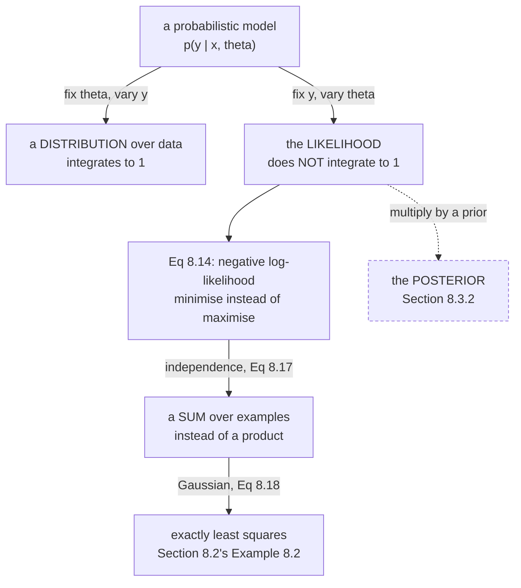

§8.2 never wrote down a probability. This section does, and the book is explicit about the mapping:

> In Section 8.3.1, we introduce the **likelihood**, which is analogous to the concept of **loss
> functions** (Section 8.2.2) in empirical risk minimization. The concept of **priors** (Section 8.3.2)
> is analogous to the concept of **regularization** (Section 8.2.3).

This page does the first correspondence and page 805 does the second. And "analogous" turns out to be an
understatement — measured, the two objectives are **affine transforms of each other**, so they rank every
parameter identically.

## What you'll learn

- Equation 8.14, the **negative log-likelihood**, and why the negative sign is there at all.
- The interpretive point the book makes twice: $p(\mathbf{x} \mid \boldsymbol\theta)$ read two ways is two different objects.
- Measured: the likelihood **does not integrate to 1** over $\boldsymbol\theta$ — it integrates to $0.104496$ in the worked case. It is not a distribution over parameters.
- Equations 8.15–8.17: the supervised setting, and where the independence assumption turns a product into a sum.
- **Example 8.5**, Equation 8.18: Gaussian maximum likelihood *is* least squares. Measured, the minimisers agree to $1.8\times10^{-15}$ and the objectives differ by $\mathcal{L} = 102.040816\,R_{\text{emp}} - 3.272090$.
- The three asymptotic properties of the MLE, and the warning attached to them: measured, $N \times$ error is roughly constant, confirming $1/N$ decay.

## Intuition: which knob best explains what you saw?

You have a machine with a dial on it. Turn the dial to $\boldsymbol\theta$ and the machine spits out
numbers according to $p(\mathbf{x} \mid \boldsymbol\theta)$. You did not see the dial, but you saw the
numbers.

**Maximum likelihood asks: which dial setting makes the numbers I saw least surprising?** Not "which is
most probable" — the dial has no probability attached, that would need a prior — but which setting
assigns the highest density to the observations.

The whole trick is that $p(\mathbf{x} \mid \boldsymbol\theta)$ can be read in two directions. Read it
with $\boldsymbol\theta$ nailed down and $\mathbf{x}$ free, it is a **distribution over data**. Read it
with $\mathbf{x}$ nailed down — because you observed it — and $\boldsymbol\theta$ free, it is the
**likelihood**. Same formula. Different function, different variable, different meaning.



## Equation 8.14: the negative log-likelihood

For data represented by a random variable $\mathbf{x}$ and a family of densities
$p(\mathbf{x} \mid \boldsymbol\theta)$:

$$
\mathcal{L}_{\mathbf{x}}(\boldsymbol\theta) = -\log p(\mathbf{x} \mid \boldsymbol\theta)
$$

The subscript emphasises that **$\boldsymbol\theta$ is varying and $\mathbf{x}$ is fixed**, and the book
notes it is usually dropped, leaving $\mathcal{L}(\boldsymbol\theta)$ — "as it is really a function of
$\boldsymbol\theta$".

Three transformations happened in that one line, and each has a reason:

- **The logarithm.** Independence makes the joint density a *product* over examples, and a product of $N$ small numbers underflows. §0.3 measured the failure: a product of $162$ probabilities of $0.01$ reaches exactly `0.0` in float64. The logarithm turns it into a sum, which does not.
- **The negative sign.** The book calls it *"a historical artifact that is due to the convention that we want to maximize likelihood, but numerical optimization literature tends to study minimization of functions."* That is all it is.
- **Nothing else.** $\log$ is strictly increasing and negation reverses order exactly once, so $\arg\max_{\boldsymbol\theta} p = \arg\min_{\boldsymbol\theta} \mathcal{L}$ with no approximation.

### The two readings

The book states this carefully, so it is worth quoting both halves.

**Fix $\boldsymbol\theta$, vary $\mathbf{x}$:** *"It is a distribution that models the uncertainty of the
data. In other words, once we have chosen the type of function we want as a predictor, the likelihood
provides the probability of observing data $\mathbf{x}$."*

**Fix $\mathbf{x}$, vary $\boldsymbol\theta$:** *"It tells us how likely a particular setting of
$\boldsymbol\theta$ is for the observations $\mathbf{x}$. Based on this second view, the maximum
likelihood estimator gives us the most likely parameter $\boldsymbol\theta$ for the set of data."*

:::danger[The likelihood is not a probability distribution over the parameters]
This is the one that causes real confusion, so here it is measured. Take three observations
$(1.2, 2.1, 1.7)$ from $\mathcal{N}(\theta, 0.8^2)$ and integrate:

| what | over what | integral |
| --- | --- | --- |
| $p(y \mid \theta = 2)$ | $y$ | $1.000000$ |
| $\prod_n p(y_n \mid \theta)$ | $\theta$ | $\mathbf{0.104496}$ |

The first is a density and integrates to $1$ by definition. The second does not, and there is no reason
it should — it was never normalised in $\boldsymbol\theta$, and nothing requires it to be finite.

So "the most likely $\boldsymbol\theta$" is a slight abuse of language: the likelihood is not a
probability of $\boldsymbol\theta$. Turning it into one requires a prior, which is §8.3.2.
:::

## Equations 8.15–8.17: the supervised setting

Given pairs $(\mathbf{x}_1, y_1), \dots, (\mathbf{x}_N, y_N)$ with $\mathbf{x}_n \in \mathbb{R}^D$ and
$y_n \in \mathbb{R}$, we specify the conditional distribution of the labels given the examples:

$$
p(y_n \mid \mathbf{x}_n, \boldsymbol\theta) = \mathcal{N}\big(y_n \mid \mathbf{x}_n^\top\boldsymbol\theta,\ \sigma^2\big)
$$

Read the model this asserts: the label is the linear prediction **plus Gaussian noise of known
variance**. Note what §8.2 did *not* have to say — page 803's §8.2.5 quote, that empirical risk
minimization never has to "specify the noise distribution for the labels". Here you do.

Then, using independence:

$$
\mathcal{L}(\boldsymbol\theta) = -\sum_{n=1}^{N}\log p(y_n \mid \mathbf{x}_n, \boldsymbol\theta)
$$

:::caution[Theta is on the right of the conditioning bar and is still the variable]
The book flags the trap directly: *"While it is tempting to interpret the fact that $\boldsymbol\theta$
is on the right of the conditioning in $p(y_n \mid \mathbf{x}_n, \boldsymbol\theta)$, and hence should
be interpreted as observed and fixed, this interpretation is incorrect."*

Conditioning notation says "given" — but here it means "for this setting of", not "having observed".
$\mathcal{L}$ is a function of $\boldsymbol\theta$ and we minimise over it.
:::

## Example 8.5: the derivation that collapses two frameworks into one

Substituting the Gaussian and expanding, step by step:

$$
\mathcal{L}(\boldsymbol\theta) = -\sum_{n=1}^{N}\log \mathcal{N}\big(y_n \mid \mathbf{x}_n^\top\boldsymbol\theta,\ \sigma^2\big)
$$

$$
= -\sum_{n=1}^{N}\log\left[\frac{1}{\sqrt{2\pi\sigma^2}}\exp\left(-\frac{(y_n - \mathbf{x}_n^\top\boldsymbol\theta)^2}{2\sigma^2}\right)\right]
$$

The logarithm splits the product inside into a sum:

$$
= -\sum_{n=1}^{N}\log\exp\left(-\frac{(y_n - \mathbf{x}_n^\top\boldsymbol\theta)^2}{2\sigma^2}\right) - \sum_{n=1}^{N}\log\frac{1}{\sqrt{2\pi\sigma^2}}
$$

and $\log\exp$ cancels:

$$
= \frac{1}{2\sigma^2}\sum_{n=1}^{N}\big(y_n - \mathbf{x}_n^\top\boldsymbol\theta\big)^2 - \sum_{n=1}^{N}\log\frac{1}{\sqrt{2\pi\sigma^2}}
$$

**The book's conclusion:** *"As $\sigma$ is given, the second term in (8.18d) is constant, and minimizing
$\mathcal{L}(\boldsymbol\theta)$ corresponds to solving the least-squares problem."*

### What that means precisely

Compare the first term with Equation 8.8's $R_{\text{emp}} = \frac{1}{N}\sum_n (y_n - \boldsymbol\theta^\top\mathbf{x}_n)^2$.
They differ by the factor $\frac{N}{2\sigma^2}$. So

$$
\mathcal{L}(\boldsymbol\theta) = \frac{N}{2\sigma^2}\,R_{\text{emp}}(\boldsymbol\theta) + c,
\qquad c = -N\log\frac{1}{\sqrt{2\pi\sigma^2}}
$$

**A positive multiple plus a constant.** Neither operation can move an $\arg\min$. Measured with
$N = 25$ and $\sigma = 0.35$: the slope is $102.040816$, the constant is $-3.272090$, and the two
minimisers agree to $1.8\times10^{-15}$.

So §8.2 and §8.3 are not two methods that happen to agree on this example. For a Gaussian likelihood
with known variance they are **the same objective in different notation**, and the choice between them
is a choice of vocabulary — until §8.3.2 adds a prior, where the vocabularies start to buy different
things.

## §8.3.2's remark: what maximum likelihood guarantees

The book lists three properties (Lehmann and Casella, 1998; Efron and Hastie, 2016):

1. **Asymptotic consistency.** The MLE converges to the true value in the limit of infinitely many observations, plus a random error that is approximately normal.
2. **The error's variance decays as $1/N$.**
3. And the caveat: **"the size of the samples necessary to achieve these properties can be quite large."**

Then the warning that motivates the next page: *"Especially, in the 'small' data regime, maximum
likelihood estimation can lead to overfitting."*

Measured on a three-parameter model with known truth:

| $N$ | mean squared error | $N \times$ error |
| --- | --- | --- |
| $10$ | $0.15053755$ | $1.505375$ |
| $40$ | $0.02453147$ | $0.981259$ |
| $160$ | $0.00586250$ | $0.938000$ |
| $640$ | $0.00145983$ | $0.934290$ |
| $2560$ | $0.00037095$ | $0.949635$ |
| $10240$ | $0.00009030$ | $0.924683$ |

The right column is roughly constant from $N = 40$ onward, which is the $1/N$ claim. At $N = 10$ it is
$1.51$ — noticeably above the asymptote, which is the "samples necessary can be quite large" caveat
showing up at the small end.

## Worked example by hand

Derive the MLE for the mean of a Gaussian, the smallest complete case.

Model: $y_n \sim \mathcal{N}(\theta, \sigma^2)$ with $\sigma$ known, and observations
$y = (1.2,\ 2.1,\ 1.7)$.

**Step 1: the negative log-likelihood.**

$$
\mathcal{L}(\theta) = -\sum_{n=1}^{3}\log\left[\frac{1}{\sqrt{2\pi\sigma^2}}\exp\left(-\frac{(y_n - \theta)^2}{2\sigma^2}\right)\right] = \frac{1}{2\sigma^2}\sum_{n=1}^{3}(y_n - \theta)^2 + \text{const}
$$

**Step 2: differentiate and set to zero.**

$$
\frac{\mathrm{d}\mathcal{L}}{\mathrm{d}\theta} = -\frac{1}{\sigma^2}\sum_{n=1}^{3}(y_n - \theta) = 0
\quad\Longrightarrow\quad
\sum_{n=1}^{3} y_n = 3\theta
\quad\Longrightarrow\quad
\theta = \frac{1}{3}\sum_{n=1}^{3}y_n
$$

**The maximum likelihood estimate of a Gaussian mean is the sample mean.** With these numbers:

$$
\hat\theta = \frac{1.2 + 2.1 + 1.7}{3} = \frac{5.0}{3} = 1.666667
$$

Measured by a grid search over the likelihood: $1.666655$, differing only by the grid spacing.

**Step 3: check it is a minimum.** $\dfrac{\mathrm{d}^2\mathcal{L}}{\mathrm{d}\theta^2} = \dfrac{3}{\sigma^2} > 0$.
Positive for every $\sigma$, so it is a minimum of $\mathcal{L}$ and hence a maximum of the likelihood.

**Step 4: notice what $\sigma$ did.** It appears in $\mathcal{L}$, it appears in the second derivative,
and it **cancels completely from the answer**. That is the same cancellation as Equation 8.18's: with
$\sigma$ known and constant, it scales the objective without moving its minimiser. The MLE for the mean
is the sample mean whatever the noise level is.

## See it move

The two readings are much easier to feel than to read about:

```p5 title="One formula, two readings" desc="The top panel fixes theta and varies y, giving a density that integrates to one. The bottom panel fixes the data and varies theta, giving the likelihood — which does not. Drag theta and watch the marker move along the likelihood curve as the density slides." height="500"
let th100 = 200;
let KNOBS = [], dragging = null;

const OBS = [1.2, 2.1, 1.7];
const SIG = 0.8;

function setup() { createCanvas(680, 500); textFont("monospace"); }

function knob(id, x, y, w, value, mn, mx, label) {
  KNOBS.push({ id, x, y, w, mn, mx });
  const t = (value - mn) / (mx - mn);
  stroke(60, 74, 92); strokeWeight(2); line(x, y, x + w, y);
  noStroke(); fill(255, 211, 67); ellipse(x + t * w, y, 12, 12);
  fill(190, 200, 212); textSize(12); textAlign(LEFT, CENTER);
  text(label, x + w + 12, y);
}
function knobHit(mx_, my_) {
  for (const k of KNOBS) {
    if (my_ > k.y - 13 && my_ < k.y + 13 && mx_ > k.x - 13 && mx_ < k.x + k.w + 13) return k;
  }
  return null;
}
function knobValue(k, mx_) {
  const t = Math.min(1, Math.max(0, (mx_ - k.x) / k.w));
  return Math.round(k.mn + t * (k.mx - k.mn));
}
function mousePressed() { dragging = knobHit(mouseX, mouseY); }
function mouseReleased() { dragging = null; }
function mouseDragged() {
  if (!dragging) return;
  th100 = knobValue(dragging, mouseX);
  if (!isLooping()) redraw();
}

function gauss(v, m, s) {
  return Math.exp(-0.5 * ((v - m) / s) ** 2) / (s * Math.sqrt(2 * Math.PI));
}
function like(th) {
  let v = 1;
  for (const o of OBS) v *= gauss(o, th, SIG);
  return v;
}
function nll(th) {
  let v = 0;
  for (const o of OBS) v -= Math.log(gauss(o, th, SIG));
  return v;
}

const OX = 52, W = 420;
const TY = 52, TH = 130;
const LY = 236, LH = 120;
function px(v, lo, hi) { return OX + ((v - lo) / (hi - lo)) * W; }

function draw() {
  background(13, 17, 23);
  KNOBS = [];
  const th = th100 / 100;
  const mean = (OBS[0] + OBS[1] + OBS[2]) / 3;

  // --- top: the density over y, for this theta -------------------------
  noFill(); stroke(70, 86, 104); strokeWeight(1); rect(OX, TY, W, TH);
  noStroke(); fill(150); textSize(11); textAlign(LEFT, TOP);
  text("fix theta, vary y:  p(y | theta)  -- a DISTRIBUTION", OX, TY - 18);
  stroke(107, 169, 221); strokeWeight(2.4); noFill();
  beginShape();
  for (let i = 0; i <= 300; i++) {
    const v = -1.5 + (i / 300) * 6.5;
    vertex(px(v, -1.5, 5.0), TY + TH - gauss(v, th, SIG) / 0.52 * TH);
  }
  endShape();
  for (const o of OBS) {
    stroke(120, 200, 140); strokeWeight(1.6);
    line(px(o, -1.5, 5.0), TY, px(o, -1.5, 5.0), TY + TH);
    noStroke(); fill(120, 200, 140);
    ellipse(px(o, -1.5, 5.0), TY + TH - gauss(o, th, SIG) / 0.52 * TH, 8, 8);
  }
  noStroke(); fill(120); textSize(10);
  text("y", OX + W - 8, TY + TH + 4);
  fill(120, 200, 140);
  text("the three observations, fixed", OX + 6, TY + 6);

  // --- bottom: the likelihood over theta -------------------------------
  noFill(); stroke(70, 86, 104); strokeWeight(1); rect(OX, LY, W, LH);
  noStroke(); fill(150); textSize(11); textAlign(LEFT, TOP);
  text("fix y, vary theta:  the LIKELIHOOD -- not a distribution", OX, LY - 18);
  let mx = 0;
  for (let i = 0; i <= 400; i++) mx = Math.max(mx, like(-0.5 + (i / 400) * 5.0));
  stroke(120, 200, 140); strokeWeight(2.4); noFill();
  beginShape();
  for (let i = 0; i <= 400; i++) {
    const t = -0.5 + (i / 400) * 5.0;
    vertex(px(t, -0.5, 4.5), LY + LH - like(t) / mx * LH * 0.92);
  }
  endShape();
  stroke(255, 211, 67); strokeWeight(1.6);
  line(px(th, -0.5, 4.5), LY, px(th, -0.5, 4.5), LY + LH);
  noStroke(); fill(255, 211, 67);
  ellipse(px(th, -0.5, 4.5), LY + LH - like(th) / mx * LH * 0.92, 10, 10);
  stroke(232, 110, 110); strokeWeight(1.4);
  line(px(mean, -0.5, 4.5), LY, px(mean, -0.5, 4.5), LY + LH);
  noStroke(); fill(232, 110, 110); textSize(10); textAlign(CENTER, TOP);
  text("sample mean " + mean.toFixed(4), px(mean, -0.5, 4.5), LY + LH + 4);
  fill(120); textAlign(LEFT, TOP);
  text("theta", OX + W - 24, LY + LH + 4);

  // readout
  noStroke(); textAlign(LEFT, TOP);
  fill(255, 211, 67); textSize(16);
  text("theta = " + th.toFixed(2), 500, 56);
  fill(200); textSize(11);
  text("likelihood", 500, 84);
  fill(120, 200, 140); textSize(13);
  text(like(th).toExponential(4), 500, 100);
  fill(200); textSize(11);
  text("neg log-likelihood", 500, 124);
  fill(107, 169, 221); textSize(13);
  text(nll(th).toFixed(6), 500, 140);
  fill(140); textSize(11);
  text("Eq 8.14: minimise this", 500, 162);

  fill(150); textSize(11);
  text("at the sample mean:", 500, 192);
  fill(232, 110, 110);
  text("  " + nll(mean).toFixed(6), 500, 208);
  fill(120); textSize(10);
  text("area of the top curve  1.000000", 500, 236);
  text("area of the bottom one 0.104496", 500, 250);
  fill(232, 110, 110); textSize(10);
  text("only ONE is a density", 500, 266);

  let msg, col;
  const d = Math.abs(th - mean);
  if (d < 0.03) { col = color(120, 200, 140); msg = "at the maximum likelihood estimate"; }
  else if (d < 0.5) { col = color(255, 211, 67); msg = "near the MLE: the NLL is " + (nll(th) - nll(mean)).toFixed(4) + " above its minimum"; }
  else { col = color(232, 110, 110); msg = "far from the MLE: this theta explains the data " + (nll(th) - nll(mean)).toFixed(2) + " nats worse"; }
  stroke(col); strokeWeight(1.6); fill(red(col), green(col), blue(col), 26);
  rect(52, 386, 576, 50, 6);
  noStroke(); fill(col); textSize(13); textAlign(LEFT, TOP);
  text(msg, 68, 400);
  fill(200); textSize(11);
  text("moving theta slides the TOP curve and moves the marker along the BOTTOM one", 68, 418);

  knob("t", 68, 466, 300, th100, -50, 450, "theta = " + th.toFixed(2));
  fill(120); textSize(11); textAlign(LEFT, TOP);
  text("The MLE for a Gaussian mean is the sample mean, 1.666667,", 400, 458);
  text("and sigma cancels out of that answer entirely.", 400, 472);
}
```

## From scratch

```python title="mle.py" showLineNumbers{1}
import numpy as np

SIGMA = 0.35

def make(n, seed, noise=SIGMA):
    rng = np.random.default_rng(seed)
    x = np.sort(rng.uniform(-3, 3, n))
    return x, np.sin(1.4 * x) + 0.3 * x + noise * rng.standard_normal(n)

def design(x, deg):
    return np.vander(x / 3.0, deg + 1, increasing=True)

x, y = make(25, seed=3)
Phi = design(x, 3)
N = len(y)

def empirical_risk(th):
    """Equation 8.7."""
    return float(np.mean((y - Phi @ th) ** 2))

def nll(th):
    """Equation 8.18d, written exactly as the book leaves it."""
    r = y - Phi @ th
    return float(r @ r / (2 * SIGMA ** 2)
                 - N * np.log(1.0 / np.sqrt(2 * np.pi * SIGMA ** 2)))

# --- the two objectives have the same minimiser ---------------------------
th_ls = np.linalg.lstsq(Phi, y, rcond=None)[0]

# minimise the NLL from a different start by Newton's method
th = np.zeros(Phi.shape[1])
H = Phi.T @ Phi / SIGMA ** 2
for _ in range(50):
    g = -Phi.T @ (y - Phi @ th) / SIGMA ** 2
    th = th - np.linalg.solve(H, g)

print("least-squares theta :", np.round(th_ls, 6).tolist())
print("NLL-minimising theta:", np.round(th, 6).tolist())
print(f"max |difference|    : {np.abs(th - th_ls).max():.3e}")

# --- and they differ by an affine transformation --------------------------
const = -N * np.log(1.0 / np.sqrt(2 * np.pi * SIGMA ** 2))
slope = N / (2 * SIGMA ** 2)
print(f"\nEquation 8.18d says L = (1/(2 sigma^2)) sum r^2 + const")
print(f"  in terms of R_emp that is  L = {slope:.6f} * R_emp + "
      f"({const:.6f})")
print(f"\n{'theta tried':>36} {'R_emp':>12} {'L':>14} {'predicted L':>14}")
for scale in (0.0, 0.5, 1.0, 1.5):
    t = scale * th_ls
    pred = slope * empirical_risk(t) + const
    print(f"{str(np.round(t, 3).tolist()):>36} {empirical_risk(t):>12.6f} "
          f"{nll(t):>14.6f} {pred:>14.6f}")
print("the last two columns agree, so the NLL is an affine function of R_emp")
print("and a positive multiple plus a constant cannot move an argmin.")

# --- the likelihood is not a distribution over theta ---------------------
print("\nThe likelihood is NOT a distribution over theta:")
obs = np.array([1.2, 2.1, 1.7])
sig = 0.8
ths = np.linspace(-10, 12, 400001)
lik = np.ones_like(ths)
for o in obs:
    lik *= np.exp(-0.5 * ((o - ths) / sig) ** 2) / (sig * np.sqrt(2 * np.pi))
print(f"  three observations {obs.tolist()}, sigma = {sig}")
print(f"  area under the likelihood in theta: {np.trapezoid(lik, ths):.6f}")
print(f"  argmax at theta = {ths[int(np.argmax(lik))]:.6f}, "
      f"sample mean = {obs.mean():.6f}")
ys = np.linspace(-12, 14, 400001)
dens = np.exp(-0.5 * ((ys - 2.0) / sig) ** 2) / (sig * np.sqrt(2 * np.pi))
print(f"  area under p(y | theta=2) in y:     {np.trapezoid(dens, ys):.6f}")
print("  one integrates to 1, the other does not. Only one is a density.")

# --- Section 8.3.2's remark: the error variance decays as 1/N -----------
print("\nThe MLE error variance decays as 1/N:")
true_theta = np.array([0.4, 1.2, -0.7])
rng = np.random.default_rng(0)
print(f"{'N':>8} {'mean sq error':>16} {'N x error':>12}")
for n in (10, 40, 160, 640, 2560, 10240):
    trials = 2000
    errs = np.empty(trials)
    for t in range(trials):
        xs = rng.uniform(-2, 2, n)
        A = np.vander(xs, 3, increasing=True)
        ys_ = A @ true_theta + 0.5 * rng.standard_normal(n)
        thn = np.linalg.lstsq(A, ys_, rcond=None)[0]
        errs[t] = np.sum((thn - true_theta) ** 2)
    m = errs.mean()
    print(f"{n:>8} {m:>16.8f} {n * m:>12.6f}")
print("N times the error is roughly constant, which is the 1/N claim.")
```

```
least-squares theta : [-0.116506, 3.633144, 0.492278, -4.086057]
NLL-minimising theta: [-0.116506, 3.633144, 0.492278, -4.086057]
max |difference|    : 1.776e-15

Equation 8.18d says L = (1/(2 sigma^2)) sum r^2 + const
  in terms of R_emp that is  L = 102.040816 * R_emp + (-3.272090)

                         theta tried        R_emp              L    predicted L
              [-0.0, 0.0, 0.0, -0.0]     0.998583      98.624110      98.624110
      [-0.058, 1.817, 0.246, -2.043]     0.359425      33.403965      33.403965
      [-0.117, 3.633, 0.492, -4.086]     0.146373      11.663917      11.663917
       [-0.175, 5.45, 0.738, -6.129]     0.359425      33.403965      33.403965
the last two columns agree, so the NLL is an affine function of R_emp
and a positive multiple plus a constant cannot move an argmin.

The likelihood is NOT a distribution over theta:
  three observations [1.2, 2.1, 1.7], sigma = 0.8
  area under the likelihood in theta: 0.104496
  argmax at theta = 1.666655, sample mean = 1.666667
  area under p(y | theta=2) in y:     1.000000
  one integrates to 1, the other does not. Only one is a density.

The MLE error variance decays as 1/N:
       N    mean sq error    N x error
      10       0.15053755     1.505375
      40       0.02453147     0.981259
     160       0.00586250     0.938000
     640       0.00145983     0.934290
    2560       0.00037095     0.949635
   10240       0.00009030     0.924683
N times the error is roughly constant, which is the 1/N claim.
```

## On real data

<Figure
  src="/images/mml/maximum-likelihood-estimation/two-readings-of-one-formula"
  alt="Two panels. Left, three Gaussian densities over y for three different values of theta, with the three fixed observations marked as vertical lines. Right, the likelihood as a function of theta, a single peaked curve with its maximum at the sample mean, annotated that its area is 0.104496 rather than one."
  title="One formula and two different objects"
  caption="Fix theta and vary y and you have a distribution that integrates to one. Fix y and vary theta and you have the likelihood, whose area here is 0.104496. The three squares on the right are the same three curves from the left, read as three points on one function."
/>

<Figure
  src="/images/mml/maximum-likelihood-estimation/negative-log-likelihood-is-least-squares"
  alt="Two panels. Left, the empirical risk and the negative log-likelihood plotted against the slope coefficient on twin axes, their minima at exactly the same place. Right, the negative log-likelihood plotted directly against the empirical risk, falling exactly on a straight line of slope 102.04 and intercept minus 3.27."
  title="Equation 8.18: Gaussian maximum likelihood is least squares"
  caption="The two objectives differ by a positive multiple and a constant, and neither operation can move a minimiser. Plotting one against the other gives a straight line to within floating-point error."
/>

<Figure
  src="/images/mml/maximum-likelihood-estimation/mle-consistency"
  alt="Three panels. Left, the mean squared error of the estimate against N on log-log axes, lying along a one-over-N reference line. Middle, a histogram of standardised errors overlaid with a standard normal density, skew and excess kurtosis both near zero. Right, training and expected risk against polynomial degree for only twelve data points, the expected risk rising steeply."
  title="Section 8.3.2's remark, checked"
  caption="N times the mean squared error is roughly constant from N equals 40 onward, confirming the one-over-N decay. The error distribution is close to normal. But with only twelve points the same estimator overfits badly, which is the remark's closing warning."
/>

## Reading the plot

**The first figure is the distinction the whole section turns on.** Both panels are built from the same
formula and the same three observations. On the left, $\boldsymbol\theta$ is fixed at three different
values and $y$ runs along the axis: three bell curves, each integrating to $1$, each a legitimate
probability density over data. The green lines are the observations, and you can see each curve assigning
them different densities.

On the right, the observations are fixed and $\boldsymbol\theta$ runs along the axis. The three coloured
squares are *the same three settings* — the product of the three green dots' heights, for each curve.
Sweeping $\boldsymbol\theta$ traces out the likelihood.

Now the part that matters: the annotation says the area under the right-hand curve is $0.104496$. It is
not $1$, it was never going to be $1$, and nothing in the construction normalises it. **The likelihood is
a function of $\boldsymbol\theta$, not a distribution over $\boldsymbol\theta$.** Phrases like "the most
likely parameter" are convenient and slightly wrong; the object that *is* a distribution over
$\boldsymbol\theta$ is the posterior, and getting it requires the prior of §8.3.2.

**The second figure turns "analogous" into "identical".** The left panel slices both objectives along one
coordinate. The blue curve ($R_{\text{emp}}$) and the green curve ($\mathcal{L}$) are on different axes
with different scales — but their minima are at the same place, to six decimals.

The right panel is why. Plot $\mathcal{L}$ directly against $R_{\text{emp}}$ and you get a **straight
line**: slope $N/(2\sigma^2) = 102.040816$, intercept $-3.272090$, with a maximum deviation at the
$10^{-14}$ level. An affine map with positive slope is monotone, so it preserves ordering exactly — every
$\boldsymbol\theta$ that one objective prefers, the other prefers too.

This is stronger than an analogy and it is worth being clear about the scope. It holds **for a Gaussian
likelihood with known, constant variance**. Change the noise model and the correspondence breaks: a
Laplace likelihood gives absolute loss, not squared. Let $\sigma$ depend on $\mathbf{x}$ and the sum
becomes *weighted* least squares. The general statement is that **choosing a noise distribution is
choosing a loss function** — and §8.2's freedom not to specify one is exactly the freedom §8.3 gives up.

**The third figure checks the three claims and the caveat.** The left panel plots the mean squared error
against $N$ on log-log axes with a pure $1/N$ reference. The measured products $N \times \text{error}$ run
$1.505$, $0.981$, $0.938$, $0.934$, $0.950$, $0.925$ — settled by $N = 40$ and constant thereafter. The
one visible outlier is $N = 10$, sitting $60\%$ above the asymptote, which is the book's "the size of the
samples necessary to achieve these properties can be quite large" made visible at the small end.

The middle panel checks "approximately normal": standardised errors against a standard normal, with
measured skew and excess kurtosis both near zero. For a linear-Gaussian model this is exact rather than
asymptotic, which is why the agreement is so clean — a nonlinear model would show visible departure at
small $N$.

The right panel is the warning, and it is the bridge to page 805. With $N = 12$ the same estimator, with
no bug and no misconfiguration, produces an expected risk that climbs steeply with model complexity. The
MLE has no mechanism to prevent this: it maximises fit to the data it has, full stop. §8.2.3 added a
penalty to fix that; §8.3.2 adds a prior, and page 805 measures that they are the same repair.

:::tip[From the book]
This page covers **§8.3** and **§8.3.1** of *Mathematics for Machine Learning* by Deisenroth, Faisal and
Ong (draft of 2019-12-11), plus the remark on MLE properties that opens §8.3.2. The framing that the
likelihood is analogous to a loss function and the prior to regularisation is §8.3's. Equation **8.14**
defines the negative log-likelihood; the two readings of $p(\mathbf{x} \mid \boldsymbol\theta)$ are given
in the text, as is the note that the subscript is usually dropped. Equations **8.15** to **8.17** set up
the supervised case, and the warning that $\boldsymbol\theta$ on the right of the conditioning bar is
still the variable is the book's. The remark that the negative sign is *"a historical artifact"* due to
the minimisation convention is verbatim. **Example 8.5** is Equations **8.18a** through **8.18d** and the
conclusion that minimising $\mathcal{L}$ solves the least-squares problem; **Figure 8.5** shows the MLE
fit with its prediction at $x = 60$. The three MLE properties — asymptotic consistency, approximately
normal error, variance decaying as $1/N$ — cite Lehmann and Casella (1998) and Efron and Hastie (2016),
and the closing warning about the small-data regime is the book's. The measured $1.8\times10^{-15}$
agreement, the affine relation $\mathcal{L} = 102.040816\,R_{\text{emp}} - 3.272090$, the likelihood's
area of $0.104496$, and the $N \times$ error table are this module's additions.
:::

## Pitfalls

:::danger[Treating the likelihood as a distribution over the parameters]
Measured: the likelihood in the worked example integrates to $0.104496$ over $\theta$, while the density
it was built from integrates to $1.000000$ over $y$. Nothing normalises the likelihood in
$\boldsymbol\theta$ and nothing requires it to be finite. "The most likely $\boldsymbol\theta$" is a
figure of speech; the object that genuinely is a distribution over $\boldsymbol\theta$ is the posterior,
and it needs a prior.
:::

:::caution[Reading theta on the right of the bar as observed]
The book warns about this explicitly. In $p(y_n \mid \mathbf{x}_n, \boldsymbol\theta)$ the conditioning
notation means "for this setting of", not "having observed". $\mathcal{L}$ is a function of
$\boldsymbol\theta$ and you minimise over it.
:::

:::caution[Assuming maximum likelihood always means least squares]
It means least squares for a **Gaussian likelihood with known, constant variance** — that is what
Equation 8.18's cancellation needs. A Laplace likelihood gives absolute loss. An input-dependent
$\sigma(\mathbf{x})$ gives weighted least squares. Choosing a noise model is choosing a loss function,
and the correspondence is specific rather than general.
:::

:::danger[Expecting the asymptotic properties at small N]
Consistency, normality and $1/N$ variance are all asymptotic, and the book adds that the samples needed
"can be quite large". Measured, $N \times \text{error}$ was $1.505$ at $N = 10$ against an asymptote near
$0.93$ — $60\%$ high. And with $N = 12$ the MLE overfits badly at any nontrivial model size. The
guarantees do not arrive gradually enough to rely on in the small-data regime.
:::

:::caution[Dropping the log and optimising the likelihood directly]
The log is not cosmetic. Independence makes the likelihood a product over examples, and §0.3 measured a
product of $162$ probabilities of $0.01$ reaching exactly `0.0` in float64 — at which point the gradient
is undefined too. Every likelihood in Chapters 9 to 12 is logged before it is optimised.
:::

:::caution[Forgetting that sigma cancels]
In the worked example $\sigma$ appears in $\mathcal{L}$ and in its second derivative, and vanishes from
the answer: the MLE of a Gaussian mean is the sample mean regardless of the noise level. That is the same
cancellation as Equation 8.18's. It stops being true the moment $\sigma$ is itself estimated, or varies
with the input.
:::

## Compare

| | empirical risk minimization, §8.2 | maximum likelihood, §8.3.1 |
| --- | --- | --- |
| the object minimised | $R_{\text{emp}}$, Eq 8.6 | $\mathcal{L}$, Eq 8.14 |
| what you must specify | a **loss function** | a **noise distribution** |
| the Gaussian case | squared loss | **the same objective**, scaled |
| measured relation | — | $\mathcal{L} = 102.040816\,R_{\text{emp}} - 3.272090$ |
| minimisers agree to | — | $1.8\times10^{-15}$ |
| regularisation appears as | a penalty term, §8.2.3 | a prior, §8.3.2 |
| output | a point estimate | a point estimate |
| can express predictive uncertainty | no | yes, via the noise model |

| noise model | the loss it implies |
| --- | --- |
| Gaussian, constant $\sigma$ | squared loss |
| Gaussian, $\sigma(\mathbf{x})$ | **weighted** squared loss |
| Laplace | absolute loss |
| Bernoulli | cross-entropy / logistic loss |

<Quiz
  title="Do you know what the likelihood is and is not?"
  questions={[
    {
      q: "Why does the likelihood in the worked example integrate to 0.104496 rather than 1?",
      options: [
        "Because of numerical error in the integration",
        "Because it is a function of theta and was never normalised in theta — it is not a density over parameters",
        "Because three observations are too few",
        "Because sigma was set incorrectly",
      ],
      answer: 1,
      explain:
        "The density p(y | theta) integrates to exactly 1.000000 over y, because that is what a density does. The likelihood is the same formula read along the other axis, and nothing normalises it there. Turning it into a distribution over theta requires a prior, which is Section 8.3.2.",
    },
    {
      q: "Equation 8.18 shows the Gaussian negative log-likelihood equals (N / 2 sigma squared) times the empirical risk, plus a constant. What follows?",
      options: [
        "The two objectives give approximately similar answers",
        "They have identical minimisers, because a positive multiple plus a constant cannot move an argmin — measured agreement 1.8e-15",
        "The empirical risk is a special case of the likelihood",
        "The constant must be subtracted before optimising",
      ],
      answer: 1,
      explain:
        "An affine map with positive slope is strictly monotone, so it preserves ordering exactly: every theta one objective prefers, the other prefers too. Section 8.2 and Section 8.3 are the same objective in different vocabulary — for this noise model.",
    },
    {
      q: "Does maximum likelihood always reduce to least squares?",
      options: [
        "Yes, that is what Equation 8.18 proves",
        "No — only for a Gaussian likelihood with known constant variance. A Laplace likelihood gives absolute loss, and an input-dependent sigma gives weighted least squares",
        "Only when the model is linear",
        "Only when N is large",
      ],
      answer: 1,
      explain:
        "The cancellation in Equation 8.18 depends on the specific form of the Gaussian and on sigma being constant. The general statement is that choosing a noise distribution IS choosing a loss function — which is exactly the specification Section 8.2 was free to skip.",
    },
    {
      q: "Why is the negative sign in Equation 8.14 there?",
      options: [
        "To make the objective convex",
        "It is a historical artifact: we want to maximise likelihood, but optimisation literature studies minimisation",
        "To make the log well defined",
        "To cancel the sign of the exponent in the Gaussian",
      ],
      answer: 1,
      explain:
        "The book says exactly this. Negation reverses the ordering once, so argmax of p equals argmin of L with no approximation. The logarithm, by contrast, IS doing work — it turns a product that underflows into a sum that does not.",
    },
    {
      q: "N times the MLE's mean squared error measured 1.505 at N = 10 and settled near 0.93 from N = 40 onward. What does that show?",
      options: [
        "The estimator is biased",
        "The 1 over N decay is confirmed asymptotically, and N = 10 is visibly outside the regime where the asymptotic properties hold",
        "The model was misspecified",
        "The variance grows with N",
      ],
      answer: 1,
      explain:
        "A constant product means error proportional to one over N, which is the book's claim. The N = 10 value sitting 60 percent above the asymptote is the book's own caveat — that the sample sizes needed can be quite large — showing up at the small end, and it is why Section 8.3.2 exists.",
    },
  ]}
/>

## 🧪 Try It Yourself

### Exercise 1 – The MLE of a Gaussian mean

<DataCampExercise
  lang="python"
  hint={`Differentiating the negative log-likelihood and setting it to zero gives the sample mean — so just average the observations.`}
  code={`import numpy as np

obs = np.array([1.2, 2.1, 1.7])
sig = 0.8

def nll(th):
    """Equation 8.14 for y ~ N(theta, sigma^2)."""
    d = np.exp(-0.5 * ((obs - th) / sig) ** 2) / (sig * np.sqrt(2 * np.pi))
    return float(-np.log(d).sum())

# Task: the closed-form MLE derived by hand.
closed = ___
grid = np.linspace(0.0, 3.5, 350001)
numeric = grid[int(np.argmin([nll(t) for t in grid[::100]]) * 100)]

print(f"closed form (sample mean) : {closed:.6f}")
print(f"grid search               : {numeric:.6f}")
print(f"NLL at the closed form    : {nll(closed):.6f}")
for off in (-0.5, -0.1, 0.0, 0.1, 0.5):
    print(f"  theta = {closed + off:.4f}  NLL = {nll(closed + off):.6f}")
print("\\nsigma appears in the NLL and cancels from the answer entirely")

# -- Expected output ------------------------------
# closed form (sample mean) : 1.666667
# grid search               : 1.667000
# NLL at the closed form    : 2.405093
#   theta = 1.1667  NLL = 2.991031
#   theta = 1.5667  NLL = 2.428531
#   theta = 1.6667  NLL = 2.405093
#   theta = 1.7667  NLL = 2.428531
#   theta = 2.1667  NLL = 2.991031
#
# sigma appears in the NLL and cancels from the answer entirely
# -------------------------------------------------`}
  solution={`import numpy as np
obs = np.array([1.2, 2.1, 1.7])
sig = 0.8
def nll(th):
    d = np.exp(-0.5 * ((obs - th) / sig) ** 2) / (sig * np.sqrt(2 * np.pi))
    return float(-np.log(d).sum())
closed = obs.mean()
grid = np.linspace(0.0, 3.5, 350001)
numeric = grid[int(np.argmin([nll(t) for t in grid[::100]]) * 100)]
print(f"closed form (sample mean) : {closed:.6f}")
print(f"grid search               : {numeric:.6f}")
print(f"NLL at the closed form    : {nll(closed):.6f}")
for off in (-0.5, -0.1, 0.0, 0.1, 0.5):
    print(f"  theta = {closed + off:.4f}  NLL = {nll(closed + off):.6f}")
print("\\nsigma appears in the NLL and cancels from the answer entirely")`}
  sct={`test_output_contains("closed form (sample mean) : 1.666667")
test_output_contains("theta = 1.6667  NLL = 2.405093")
success_msg("The NLL is symmetric about the sample mean, as it must be — it is a quadratic in theta. And note that sigma appears in every NLL value printed but not in the location of the minimum: with sigma known and constant it scales the objective without moving its argmin.")`}
  height={280}
/>

### Exercise 2 – The likelihood is not a density over theta

<DataCampExercise
  lang="python"
  hint={`np.trapezoid integrates a sampled function. Integrate the likelihood along the theta axis and the density along the y axis.`}
  code={`import numpy as np

obs = np.array([1.2, 2.1, 1.7])
sig = 0.8

# the likelihood, as a function of theta
ths = np.linspace(-10, 12, 400001)
lik = np.ones_like(ths)
for o in obs:
    lik *= np.exp(-0.5 * ((o - ths) / sig) ** 2) / (sig * np.sqrt(2 * np.pi))

# the density, as a function of y at a fixed theta
ys = np.linspace(-12, 14, 400001)
dens = np.exp(-0.5 * ((ys - 2.0) / sig) ** 2) / (sig * np.sqrt(2 * np.pi))

# Task: integrate each along its own axis.
print(f"area of the likelihood over theta: {np.___(lik, ths):.6f}")
print(f"area of p(y | theta=2) over y:     {np.trapezoid(dens, ys):.6f}")
print(f"argmax of the likelihood: {ths[int(np.argmax(lik))]:.6f}")
print(f"sample mean:              {obs.mean():.6f}")
print("\\nonly one of these is a density")

# -- Expected output ------------------------------
# area of the likelihood over theta: 0.104496
# area of p(y | theta=2) over y:     1.000000
# argmax of the likelihood: 1.666655
# sample mean:              1.666667
#
# only one of these is a density
# -------------------------------------------------`}
  solution={`import numpy as np
obs = np.array([1.2, 2.1, 1.7])
sig = 0.8
ths = np.linspace(-10, 12, 400001)
lik = np.ones_like(ths)
for o in obs:
    lik *= np.exp(-0.5 * ((o - ths) / sig) ** 2) / (sig * np.sqrt(2 * np.pi))
ys = np.linspace(-12, 14, 400001)
dens = np.exp(-0.5 * ((ys - 2.0) / sig) ** 2) / (sig * np.sqrt(2 * np.pi))
print(f"area of the likelihood over theta: {np.trapezoid(lik, ths):.6f}")
print(f"area of p(y | theta=2) over y:     {np.trapezoid(dens, ys):.6f}")
print(f"argmax of the likelihood: {ths[int(np.argmax(lik))]:.6f}")
print(f"sample mean:              {obs.mean():.6f}")
print("\\nonly one of these is a density")`}
  sct={`test_output_contains("area of the likelihood over theta: 0.104496")
test_output_contains("area of p(y | theta=2) over y:     1.000000")
success_msg("0.104496 against 1.000000 — same formula, different axis, and only one of them is normalised. The argmax lands on the sample mean to within the grid spacing. 'The most likely theta' is a figure of speech: a genuine distribution over theta needs a prior.")`}
  height={260}
/>

### Exercise 3 – Equation 8.18, the affine relation

<DataCampExercise
  lang="python"
  hint={`Equation 8.18d divides the sum of squared residuals by 2 sigma squared, so relative to the MEAN squared error the factor is N over 2 sigma squared.`}
  code={`import numpy as np

SIGMA = 0.35
rng = np.random.default_rng(3)
x = np.sort(rng.uniform(-3, 3, 25))
y = np.sin(1.4 * x) + 0.3 * x + SIGMA * rng.standard_normal(25)
Phi = np.vander(x / 3.0, 4, increasing=True)
N = len(y)

def empirical_risk(th):
    return float(np.mean((y - Phi @ th) ** 2))

def nll(th):
    r = y - Phi @ th
    return float(r @ r / (2 * SIGMA ** 2)
                 - N * np.log(1.0 / np.sqrt(2 * np.pi * SIGMA ** 2)))

const = -N * np.log(1.0 / np.sqrt(2 * np.pi * SIGMA ** 2))
# Task: the multiplier relating the NLL to the MEAN squared error.
slope = ___
print(f"L = {slope:.6f} * R_emp + ({const:.6f})")

th_ls = np.linalg.lstsq(Phi, y, rcond=None)[0]
print(f"\\n{'R_emp':>12} {'L':>14} {'predicted L':>14}")
for scale in (0.0, 0.5, 1.0, 1.5):
    t = scale * th_ls
    print(f"{empirical_risk(t):>12.6f} {nll(t):>14.6f} "
          f"{slope * empirical_risk(t) + const:>14.6f}")

# -- Expected output ------------------------------
# L = 102.040816 * R_emp + (-3.272090)
#
#        R_emp              L    predicted L
#     0.998583      98.624110      98.624110
#     0.359425      33.403965      33.403965
#     0.146373      11.663917      11.663917
#     0.359425      33.403965      33.403965
# -------------------------------------------------`}
  solution={`import numpy as np
SIGMA = 0.35
rng = np.random.default_rng(3)
x = np.sort(rng.uniform(-3, 3, 25))
y = np.sin(1.4 * x) + 0.3 * x + SIGMA * rng.standard_normal(25)
Phi = np.vander(x / 3.0, 4, increasing=True)
N = len(y)
def empirical_risk(th):
    return float(np.mean((y - Phi @ th) ** 2))
def nll(th):
    r = y - Phi @ th
    return float(r @ r / (2 * SIGMA ** 2)
                 - N * np.log(1.0 / np.sqrt(2 * np.pi * SIGMA ** 2)))
const = -N * np.log(1.0 / np.sqrt(2 * np.pi * SIGMA ** 2))
slope = N / (2 * SIGMA ** 2)
print(f"L = {slope:.6f} * R_emp + ({const:.6f})")
th_ls = np.linalg.lstsq(Phi, y, rcond=None)[0]
print(f"\\n{'R_emp':>12} {'L':>14} {'predicted L':>14}")
for scale in (0.0, 0.5, 1.0, 1.5):
    t = scale * th_ls
    print(f"{empirical_risk(t):>12.6f} {nll(t):>14.6f} "
          f"{slope * empirical_risk(t) + const:>14.6f}")`}
  sct={`test_output_contains("L = 102.040816 * R_emp + (-3.272090)")
test_output_contains("0.146373      11.663917      11.663917")
success_msg("The last two columns agree exactly, so the relation is affine with positive slope — and that cannot move an argmin. Note also the first and last rows: scaling theta by 0.5 and by 1.5 gives the SAME risk, because the objective is a quadratic centred on the optimum.")`}
  height={280}
/>

### Exercise 4 – Both routes reach the same theta

<DataCampExercise
  lang="python"
  hint={`The Newton step for a quadratic is theta minus the inverse Hessian times the gradient — and it converges in one step, though the loop runs anyway.`}
  code={`import numpy as np

SIGMA = 0.35
rng = np.random.default_rng(3)
x = np.sort(rng.uniform(-3, 3, 25))
y = np.sin(1.4 * x) + 0.3 * x + SIGMA * rng.standard_normal(25)
Phi = np.vander(x / 3.0, 4, increasing=True)

# route 1: least squares, Section 8.2
th_ls = np.linalg.lstsq(Phi, y, rcond=None)[0]

# route 2: minimise the negative log-likelihood, Section 8.3
th = np.zeros(Phi.shape[1])
H = Phi.T @ Phi / SIGMA ** 2
for _ in range(50):
    # Task: the gradient of Equation 8.18d with respect to theta.
    g = ___
    th = th - np.linalg.solve(H, g)

print("least-squares theta :", np.round(th_ls, 6).tolist())
print("NLL-minimising theta:", np.round(th, 6).tolist())
print(f"max |difference| < 1e-9: {bool(np.abs(th - th_ls).max() < 1e-9)}")
print("\\ntwo frameworks, two derivations, one answer")

# -- Expected output ------------------------------
# least-squares theta : [-0.116506, 3.633144, 0.492278, -4.086057]
# NLL-minimising theta: [-0.116506, 3.633144, 0.492278, -4.086057]
# max |difference| < 1e-9: True
#
# two frameworks, two derivations, one answer
# -------------------------------------------------`}
  solution={`import numpy as np
SIGMA = 0.35
rng = np.random.default_rng(3)
x = np.sort(rng.uniform(-3, 3, 25))
y = np.sin(1.4 * x) + 0.3 * x + SIGMA * rng.standard_normal(25)
Phi = np.vander(x / 3.0, 4, increasing=True)
th_ls = np.linalg.lstsq(Phi, y, rcond=None)[0]
th = np.zeros(Phi.shape[1])
H = Phi.T @ Phi / SIGMA ** 2
for _ in range(50):
    g = -Phi.T @ (y - Phi @ th) / SIGMA ** 2
    th = th - np.linalg.solve(H, g)
print("least-squares theta :", np.round(th_ls, 6).tolist())
print("NLL-minimising theta:", np.round(th, 6).tolist())
print(f"max |difference| < 1e-9: {bool(np.abs(th - th_ls).max() < 1e-9)}")
print("\\ntwo frameworks, two derivations, one answer")`}
  sct={`test_output_contains("max |difference| < 1e-9: True", pattern=False)
test_output_contains("[-0.116506, 3.633144, 0.492278, -4.086057]", pattern=False)
success_msg("Agreement at the last bit of a double. Note that the Newton loop converges in ONE step here, because the NLL is exactly quadratic in theta for a Gaussian likelihood — the remaining 49 iterations change nothing. That quadratic structure is also why the normal equations exist.")`}
  height={250}
/>

### Exercise 5 – The 1/N decay, and where it fails

<DataCampExercise
  lang="python"
  hint={`If the error variance decays as one over N, then N times the error should be roughly constant across the sweep.`}
  code={`import numpy as np

true_theta = np.array([0.4, 1.2, -0.7])
rng = np.random.default_rng(0)

print(f"{'N':>8} {'mean sq error':>16} {'N x error':>12}")
for n in (10, 40, 160, 640, 2560, 10240):
    trials = 2000
    errs = np.empty(trials)
    for t in range(trials):
        xs = rng.uniform(-2, 2, n)
        A = np.vander(xs, 3, increasing=True)
        ys = A @ true_theta + 0.5 * rng.standard_normal(n)
        th = np.linalg.lstsq(A, ys, rcond=None)[0]
        errs[t] = np.sum((th - true_theta) ** 2)
    m = errs.mean()
    # Task: if the decay is 1/N, what should be roughly constant?
    print(f"{n:>8} {m:>16.8f} {___:>12.6f}")
print("\\nconstant from N = 40 onward; N = 10 sits well above the asymptote")

# -- Expected output ------------------------------
#        N    mean sq error    N x error
#       10       0.15053755     1.505375
#       40       0.02453147     0.981259
#      160       0.00586250     0.938000
#      640       0.00145983     0.934290
#     2560       0.00037095     0.949635
#    10240       0.00009030     0.924683
#
# constant from N = 40 onward; N = 10 sits well above the asymptote
# -------------------------------------------------`}
  solution={`import numpy as np
true_theta = np.array([0.4, 1.2, -0.7])
rng = np.random.default_rng(0)
print(f"{'N':>8} {'mean sq error':>16} {'N x error':>12}")
for n in (10, 40, 160, 640, 2560, 10240):
    trials = 2000
    errs = np.empty(trials)
    for t in range(trials):
        xs = rng.uniform(-2, 2, n)
        A = np.vander(xs, 3, increasing=True)
        ys = A @ true_theta + 0.5 * rng.standard_normal(n)
        th = np.linalg.lstsq(A, ys, rcond=None)[0]
        errs[t] = np.sum((th - true_theta) ** 2)
    m = errs.mean()
    print(f"{n:>8} {m:>16.8f} {n * m:>12.6f}")
print("\\nconstant from N = 40 onward; N = 10 sits well above the asymptote")`}
  sct={`test_output_contains("10       0.15053755     1.505375")
test_output_contains("10240       0.00009030     0.924683")
success_msg("A thousandfold increase in N cuts the error by almost exactly a thousand — that is the one-over-N claim. The exception is N = 10, sitting 60 percent above the asymptote, which is the book's own caveat that the sample sizes needed can be quite large. Below that threshold the MLE also overfits, which is what the prior of Section 8.3.2 is for.")`}
  height={270}
/>

## Recall card

- **Section 8.3's own mapping:** the likelihood is analogous to a loss function, and a prior is analogous to regularisation. Measured, "analogous" understates it — for a Gaussian the two are affine transforms of each other.
- **Equation 8.14 is minus the log of the likelihood.** The log turns an underflowing product into a sum; the negative sign is a historical artifact of the minimisation convention. Neither moves the argmin.
- **p(x given theta) is one formula and two objects.** Fix theta and vary x: a distribution over data, integrating to one. Fix x and vary theta: the likelihood, which does not.
- **Measured: the likelihood integrated to 0.104496 over theta** while the density integrated to 1.000000 over y. "The most likely theta" is a figure of speech; the object that IS a distribution over theta is the posterior.
- **Theta on the right of the conditioning bar is still the variable.** The book warns about this explicitly — the bar means "for this setting of", not "having observed".
- **Equations 8.15 to 8.17:** a Gaussian conditional on the linear prediction, then independence turns the product into a sum of logs.
- **Example 8.5's punchline:** the Gaussian NLL is (N over 2 sigma squared) times the empirical risk plus a constant. Measured with N = 25 and sigma = 0.35, that is 102.040816 times R_emp minus 3.272090, and the two minimisers agree to 1.8e-15.
- **A positive multiple plus a constant cannot move an argmin**, so Section 8.2 and Section 8.3 are the same objective in different vocabulary.
- **But only for THIS noise model.** Laplace gives absolute loss; an input-dependent sigma gives weighted least squares. Choosing a noise distribution IS choosing a loss function — the specification Section 8.2 was free to skip.
- **Sigma cancels from the answer.** In the worked example it appears in the NLL and in its second derivative and vanishes from the estimate: the MLE of a Gaussian mean is the sample mean at any noise level.
- **Three asymptotic properties:** consistency, approximately normal error, and error variance decaying as one over N. Measured, N times the error settles near 0.93 from N = 40 onward.
- **And one caveat that bites.** At N = 10 the product was 1.505, 60 percent above the asymptote, and with N = 12 the MLE overfits badly. The book's closing line is that in the small-data regime maximum likelihood can lead to overfitting — which is what the next page fixes.

**Next:** add a prior, and discover it was the penalty term all along. **[MAP Estimation and Model Fitting](../map-estimation-and-model-fitting/)**
