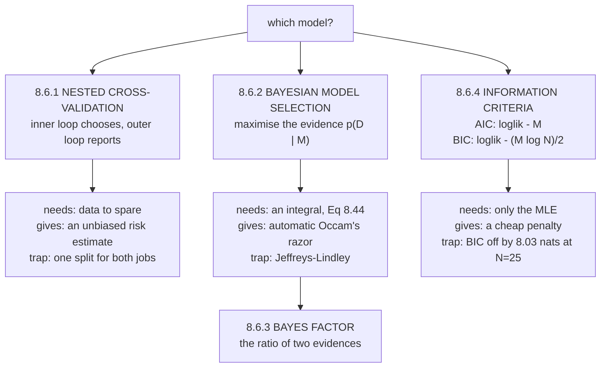

import DataCampExercise from "../../../../components/DataCampExercise.astro";
import Figure from "../../../../components/Figure.astro";
import Quiz from "../../../../components/Quiz.astro";

Every page of this chapter has deferred the same question. Page 803 tuned $\lambda$ by cross-validation
and asked what tunes the tuner. Page 805 set the degree by hand. Page 806 computed a marginal likelihood
and said *"§8.6 uses exactly this"*. Page 807 drew structural choices as a picture and noted they
*"cannot be selected directly using the approaches we have seen so far"*.

This is §8.6, and it answers all four. The book's framing: *"at training time we can only use the
training set to evaluate the performance of the model and learn its parameters. However, the performance
on the training set is not really what we are interested in."*

## What you'll learn

- Why the loops are **nested**, measured: flat cross-validation reports $13.5\%$ **better than chance** on data with no signal at all, while the truth is $25.4\%$ **worse**.
- Equation 8.39, and the standard error $\sigma/\sqrt{K}$ the book defines beside it — measured, $4$ of $10$ models sit inside one standard error of the winner.
- Why the Occam's razor is **automatic**: no prior over models is needed. Measured as $\mathrm{KL}(M_1 \Vert M_2) = 3.4062$ and $\mathrm{KL}(M_2 \Vert M_1) = 50.7124$ nats.
- Figure 8.14's **region $C$**, located exactly — the crossover is at $w = 0.571273$.
- Equations 8.40–8.45, Bayesian model selection as a hierarchical generative process.
- Bayes factors on Jeffreys' scale, and the **Jeffreys–Lindley paradox** measured across sixteen orders of magnitude: the log Bayes factor bottoms out at $\tau^2 = 10.22$, crosses zero at $3.71\times10^{6}$, and keeps climbing — with the data never changing.
- **AIC** and **BIC**, and what all five criteria pick on the same 25 points. Maximum likelihood picks degree $11$; AIC and BIC pick $5$; the exact evidence picks $6$.

## Intuition: you cannot grade your own exam

Cross-validation works because the validation fold was not used for fitting. The moment you use that
validation score to *choose* something, it stops being held out — it has now influenced the model, and
the score it reports is the score you selected for.

**The bias is proportional to how hard you searched.** Try two models and it is negligible. Try sixty and
the best of sixty random numbers is not a random number any more. Measured below on data containing
literally no signal: the winner's cross-validation score looks $13.5\%$ better than chance, and its true
risk is $25.4\%$ worse.

So you nest. **The inner loop chooses; the outer loop reports**, on a split the choosing never touched.

The Bayesian route sidesteps the split entirely. The marginal likelihood $p(\mathcal{D} \mid M)$ is a
probability distribution *over datasets*, so it must integrate to one — and a model flexible enough to
predict many datasets has less probability left for any particular one. **The penalty for complexity is
not added; it is a consequence of normalisation.**



## §8.6.1 Nested cross-validation

Apply §8.2.4's cross-validation *"one more time, i.e., for each split, we can perform another round of
cross-validation."* Two levels:

| level | job | the set is called |
| --- | --- | --- |
| **inner** | *"estimate the performance of a particular choice of model or hyperparameter"* | the **validation set** |
| **outer** | *"estimate generalization performance for the best choice of model chosen by the inner loop"* | the **test set** |

The inner loop approximates the expected generalization error by the empirical error on the validation
set — **Equation 8.39**:

$$
\mathbb{E}_{\mathcal{V}}[R(\mathcal{V} \mid M)] \approx \frac{1}{K}\sum_{k=1}^{K} R(\mathcal{V}^{(k)} \mid M)
$$

*"We repeat this procedure for all models and choose the model that performs best."*

And the book's margin note, which is the part usually skipped: cross-validation *"not only gives us the
expected generalization error, but we can also obtain high-order statistics, e.g., the standard error, an
estimate of how uncertain the mean estimate is"* — defined as $\sigma/\sqrt{K}$, with $K$ the number of
experiments and $\sigma$ the standard deviation of the risk across them.

:::tip[Equation 8.39 with its standard error, on 60 points]
| degree | mean risk | std error | gap to best | within 1 s.e.? |
| --- | --- | --- | --- | --- |
| $0$ | $1.216228$ | $0.077274$ | $1.033839$ | no |
| $1$ | $0.629337$ | $0.065304$ | $0.446947$ | no |
| $2$ | $0.663119$ | $0.078650$ | $0.480730$ | no |
| $3$ | $0.203973$ | $0.038493$ | $0.021584$ | no |
| $4$ | $0.210169$ | $0.045726$ | $0.027779$ | no |
| $5$ | $0.197626$ | $0.021689$ | $0.015237$ | **yes** |
| $6$ | $0.183682$ | $0.019171$ | $0.001293$ | **yes** |
| $7$ | $0.230754$ | $0.029861$ | $0.048364$ | no |
| $8$ | $\mathbf{0.182390}$ | $0.016568$ | $0.000000$ | **yes** |
| $9$ | $0.182454$ | $0.014795$ | $0.000065$ | **yes** |

The winner is degree $8$ at $0.182390 \pm 0.016568$. **Degree 9 is behind by $0.000065$ — four hundred
times smaller than the standard error.** Four of ten models sit inside one standard error.

This is why the book mentions the standard error at all: **the ranking below it is not information.**
:::

### Why the loops must be nested

The book's construction separates the two jobs, and the reason is measurable. Take $60$ candidate
features, **none of which has any relationship to the target**, $30$ data points, and pick the one with
the best 5-fold cross-validation score:

:::danger[600 trials on data with no signal at all]
| quantity | value |
| --- | --- |
| flat CV score of the winner | $0.865343$ |
| its true risk on fresh data | $1.254179$ |
| chance, since there is no signal | $1.000000$ |

**Flat cross-validation reports $13.5\%$ better than chance on data that contains nothing.** The truth is
$25.4\%$ *worse* than chance — because the feature it picked was fitted to noise.

Nothing is wrong with cross-validation here. What is wrong is using one split to *choose* and then
quoting that same number as a *result*. The winning score measures how hard you searched.
:::

:::caution[When flat cross-validation is nearly fine]
Honesty about scope: with only $10$ candidate degrees and $60$ points, the same experiment gives a flat-CV
optimism of about $0.5\%$ — negligible. **The bias scales with the number of candidates relative to the
data**, not with the mere fact of reusing a split. Ten hyperparameter values is harmless; a grid search
over hundreds of configurations on a few hundred points is not.
:::

## §8.6.2 Bayesian model selection

All model-selection approaches *"attempt to trade off model complexity and data fit. We assume that
simpler models are less prone to overfitting than complex models, and hence the objective of model
selection is to find the simplest model that explains the data reasonably well."* That is **Occam's
razor**, and the book's remark adds the hypothesis-testing reading: *"we are looking for the simplest
hypothesis that is consistent with the data."*

The key claim of the section:

> One may consider placing a prior on models that favors simpler models. However, **it is not necessary
> to do this**: An "automatic Occam's Razor" is quantitatively embodied in the application of Bayesian
> probability.

### Figure 8.14, and why it works

Think of the horizontal axis as *"the space of all possible datasets $\mathcal{D}$"*. With a uniform
prior over models, Bayes' theorem *"rewards models in proportion to how much they predicted the data that
occurred"*. That prediction, $p(\mathcal{D} \mid M_i)$, is the **evidence** for $M_i$.

A simple model $M_1$ *"can only predict a small number of datasets"*. A more powerful $M_2$ *"is able to
predict a greater variety of datasets. This means, however, that $M_2$ does not predict the datasets in
region $C$ as well as $M_1$."* With equal prior probabilities, **if the dataset falls into region $C$,
the less powerful model is the more probable one.**

The whole argument rests on the book's margin note: *"These predictions are quantified by a normalized
probability distribution on $\mathcal{D}$, i.e., it needs to integrate/sum to 1."* **A fixed budget of
probability spread over more datasets means less for each.**

:::tip[The normalisation argument, measured]
Draw $200{,}000$ datasets from each model and score them under both:

| datasets drawn from | avg $\log p(\mathcal{D} \mid M_1)$ | avg $\log p(\mathcal{D} \mid M_2)$ | winner |
| --- | --- | --- | --- |
| $M_1$, degree 1 | $\mathbf{-14.0601}$ | $-17.4663$ | $M_1$ |
| $M_2$, degree 9 | $-69.8293$ | $\mathbf{-19.1169}$ | $M_2$ |

$$
\mathrm{KL}(M_1 \Vert M_2) = 3.4062 \text{ nats}, \qquad \mathrm{KL}(M_2 \Vert M_1) = 50.7124 \text{ nats}
$$

**Both positive — necessarily, since a KL divergence cannot be negative.** Each model scores higher on
its own data than its rival does. Neither can win everywhere, which is exactly the shape of Figure 8.14,
and it follows from normalisation alone.

Note the asymmetry: $50.71$ against $3.41$. The flexible model is *far* worse at predicting simple
datasets than the simple model is at predicting flexible ones — because $M_1$'s datasets are a subset of
what $M_2$ can produce, while the reverse is not true.
:::

:::tip[Region C, located]
Sweeping a one-parameter family of datasets, $w$ controlling how much structure they contain:

| $w$ | $\log p(\mathcal{D} \mid M_1)$ | $\log p(\mathcal{D} \mid M_2)$ | log Bayes factor | prefers |
| --- | --- | --- | --- | --- |
| $0.00$ | $-16.5638$ | $-19.9748$ | $+3.4110$ | $M_1$ |
| $0.25$ | $-22.4949$ | $-25.1017$ | $+2.6068$ | $M_1$ |
| $0.50$ | $-34.4012$ | $-35.1323$ | $+0.7310$ | $M_1$ |
| $0.75$ | $-52.2827$ | $-50.0665$ | $-2.2162$ | $M_2$ |
| $1.00$ | $-76.1394$ | $-69.9044$ | $-6.2350$ | $M_2$ |
| $1.50$ | $-141.7783$ | $-124.2912$ | $-17.4871$ | $M_2$ |
| $2.50$ | $-344.7582$ | $-291.9086$ | $-52.8496$ | $M_2$ |

**The crossover is at $w = 0.571273$.** Below it the simple model is more probable; above it the flexible
one is. That boundary is region $C$'s edge, and no prior over models was used to produce it.
:::

### The hierarchical generative process

For a finite set $\mathcal{M} = \{M_1, \ldots, M_K\}$, each with parameters $\boldsymbol\theta_k$, place a
prior $p(M)$ on the models. Equations 8.40–8.42:

$$
M_k \sim p(M), \qquad \boldsymbol\theta_k \sim p(\boldsymbol\theta \mid M_k), \qquad \mathcal{D} \sim p(\mathcal{D} \mid \boldsymbol\theta_k)
$$

That is Figure 8.15, and it is page 807's notation doing work: a three-node chain $M \to \boldsymbol\theta
\to \mathcal{D}$. The posterior over models, **Equation 8.43**:

$$
p(M_k \mid \mathcal{D}) \propto p(M_k)\,p(\mathcal{D} \mid M_k)
$$

*"Note that this posterior no longer depends on the model parameters $\boldsymbol\theta_k$ because they
have been integrated out"* — **Equation 8.44**:

$$
p(\mathcal{D} \mid M_k) = \int p(\mathcal{D} \mid \boldsymbol\theta_k)\,p(\boldsymbol\theta_k \mid M_k)\,d\boldsymbol\theta_k
$$

the **model evidence** or **marginal likelihood**. The choice is then **Equation 8.45**:

$$
M^* = \arg\max_{M_k}\ p(M_k \mid \mathcal{D})
$$

and *"with a uniform prior $p(M_k) = 1/K$ ... determining the MAP estimate over models amounts to picking
the model that maximizes the model evidence."*

:::caution[Likelihood against marginal likelihood — the book's remark]
> While the **likelihood is prone to overfitting**, the **marginal likelihood is typically not**, as the
> model parameters have been marginalized out (i.e., we no longer have to fit the parameters).
> Furthermore, the marginal likelihood automatically embodies a trade-off between model complexity and
> data fit.

Measured on 25 points: the maximum log-likelihood rises monotonically with degree — $-98.12$, $-57.87$,
$-54.39$, …, $-5.35$ — and therefore picks **degree 11**, the largest model on offer. The evidence peaks
at **degree 6**. Same data, same family; one has been marginalised and one has been fitted.
:::

## §8.6.3 Bayes factors for model comparison

Taking the ratio of two posteriors gives **Equation 8.46**:

$$
\underbrace{\frac{p(M_1 \mid \mathcal{D})}{p(M_2 \mid \mathcal{D})}}_{\text{posterior odds}} = \underbrace{\frac{p(M_1)}{p(M_2)}}_{\text{prior odds}}\ \underbrace{\frac{p(\mathcal{D} \mid M_1)}{p(\mathcal{D} \mid M_2)}}_{\text{Bayes factor}}
$$

The **prior odds** *"measures how much our prior (initial) beliefs favor $M_1$ over $M_2$"*; the **Bayes
factor** *"measures how well the data $\mathcal{D}$ is predicted by $M_1$ compared to $M_2$"*. With a
uniform prior over models the prior odds is $1$, and **Equation 8.47** reduces the decision to the Bayes
factor alone: *"If the Bayes factor is greater than 1, we choose model $M_1$, otherwise model $M_2$."*

The book notes that *"there are guidelines on the size of the ratio that one should consider before
'significance' of the result (Jeffreys, 1961)"*.

:::tip[The chapter's own data, on Jeffreys' scale]
| degree | $\log p(\mathcal{D} \mid M)$ | log Bayes factor | Bayes factor | Jeffreys (1961) |
| --- | --- | --- | --- | --- |
| $0$ | $-100.7863$ | $70.8251$ | $0.000000$ | decisive |
| $1$ | $-63.2439$ | $33.2827$ | $0.000000$ | decisive |
| $2$ | $-61.4607$ | $31.4995$ | $0.000000$ | decisive |
| $3$ | $-30.7910$ | $0.8298$ | $0.436151$ | barely worth mentioning |
| $5$ | $-30.0952$ | $0.1340$ | $0.874617$ | barely worth mentioning |
| $\mathbf{6}$ | $\mathbf{-29.9612}$ | $0.0000$ | $1.000000$ | — |
| $9$ | $-30.2674$ | $0.3062$ | $0.736258$ | barely worth mentioning |
| $11$ | $-30.2178$ | $0.2566$ | $0.773657$ | barely worth mentioning |

The evidence rules out degrees $0$–$2$ **decisively**. It then declines to distinguish $3$ through $11$
at all: every one of them is *"barely worth mentioning"* against the best. **The evidence is a sharp
detector of underfitting and a blunt one for overfitting.**
:::

### The Jeffreys–Lindley paradox

The book's warning, quoting Murphy (2012): the Bayes factor *"always favors the simpler model since the
probability of the data under a complex model with a diffuse prior will be very small"*, where a diffuse
prior *"does not favor specific models, i.e., many models are a priori plausible under this prior."*

:::danger[Measured across sixteen orders of magnitude, with the data held fixed]
| $\tau^2$ | $\log p(\mathcal{D} \mid \text{deg }1)$ | $\log p(\mathcal{D} \mid \text{deg }9)$ | log Bayes factor | prefers |
| --- | --- | --- | --- | --- |
| $0.1$ | $-65.8785$ | $-53.3201$ | $-12.5583$ | degree 9 |
| $1$ | $-63.2439$ | $-30.2674$ | $-32.9765$ | degree 9 |
| $10$ | $-64.9769$ | $-25.5141$ | $\mathbf{-39.4628}$ | degree 9 |
| $10^2$ | $-67.2216$ | $-30.9851$ | $-36.2365$ | degree 9 |
| $10^4$ | $-71.8204$ | $-49.2231$ | $-22.5973$ | degree 9 |
| $10^6$ | $-76.4255$ | $-71.1914$ | $-5.2341$ | degree 9 |
| $10^{10}$ | $-85.6361$ | $-117.2229$ | $+31.5868$ | **degree 1** |
| $10^{14}$ | $-117.7920$ | $-163.9792$ | $+46.1873$ | **degree 1** |

The log Bayes factor bottoms out at $\tau^2 = 10.22$ with $-39.4634$, **crosses zero at
$\tau^2 = 3.71412\times10^{6}$**, and keeps climbing without limit.

**The data is identical in every row.** The verdict flips from "decisively degree 9" to "decisively
degree 1" purely by widening a prior that was meant to express *no* opinion.

The practical consequence: **a Bayes factor quoted without its prior is not a reproducible number.** An
uninformative-looking prior is a strong statement about model comparison even when it says almost nothing
about parameters.
:::

:::caution[Computing the marginal likelihood — the book's remark]
Equation 8.44's integral *"is generally analytically intractable, and we will have to resort to
approximation techniques, e.g., numerical integration, stochastic approximations using Monte Carlo, or
Bayesian Monte Carlo techniques."*

*"However, there are special cases in which we can solve it. ... If we choose a conjugate parameter prior
$p(\boldsymbol\theta)$, we can compute the marginal likelihood in closed form. In Chapter 9, we will do
exactly this in the context of linear regression."*

Every closed-form evidence on this page exists for that reason and no other.
:::

## §8.6.4 Further reading

The high-level choices §8.6 is about, in the book's own list:

| choice | where it appears |
| --- | --- |
| the degree of a polynomial in regression | this chapter, Chapter 9 |
| the number of components in a mixture model | Chapter 11 |
| the network architecture of a deep neural network | — |
| the type of kernel in a support vector machine | Chapter 12 |
| the dimensionality of the latent space in PCA | Chapter 10 |
| the learning rate (schedule) in an optimization algorithm | Chapter 7 |

A result worth carrying: Rasmussen and Ghahramani (2001) *"showed that the automatic Occam's razor does
not necessarily penalize the number of parameters in a model, but it is active in terms of the complexity
of functions."* It also holds *"for Bayesian nonparametric models with many parameters, e.g., Gaussian
processes"* — which have infinitely many and do not overfit for that reason.

### Information criteria

For the maximum-likelihood setting, *"there exist a number of heuristics for model selection that
discourage overfitting. They are called information criteria, and we choose the model with the largest
value."*

**Equation 8.48**, the Akaike information criterion (Akaike, 1974):

$$
\log p(\mathbf{x} \mid \boldsymbol\theta) - M
$$

*"corrects for the bias of the maximum likelihood estimator by addition of a penalty term to compensate
for the overfitting of more complex models with lots of parameters"*, with $M$ the number of parameters.

**Equation 8.49**, the Bayesian information criterion (Schwarz, 1978):

$$
\log p(\mathbf{x}) = \log \int p(\mathbf{x} \mid \boldsymbol\theta)p(\boldsymbol\theta)\,d\boldsymbol\theta \approx \log p(\mathbf{x} \mid \boldsymbol\theta) - \tfrac{1}{2}M \log N
$$

*"BIC penalizes model complexity more heavily than AIC."* — and it must, since $\tfrac{1}{2}\log N > 1$
whenever $N > e^2 \approx 7.39$.

:::tip[All five criteria on the same 25 points]
| degree | $M$ | max log lik | AIC | BIC | exact $\log p(\mathcal{D})$ |
| --- | --- | --- | --- | --- | --- |
| $0$ | $1$ | $-98.1221$ | $-99.1221$ | $-99.7316$ | $-100.7863$ |
| $1$ | $2$ | $-57.8749$ | $-59.8749$ | $-61.0938$ | $-63.2439$ |
| $2$ | $3$ | $-54.3858$ | $-57.3858$ | $-59.2142$ | $-61.4607$ |
| $3$ | $4$ | $-11.6639$ | $-15.6639$ | $-18.1017$ | $-30.7910$ |
| $4$ | $5$ | $-9.9190$ | $-14.9190$ | $-17.9662$ | $-31.0573$ |
| $5$ | $6$ | $-6.9912$ | $\mathbf{-12.9912}$ | $\mathbf{-16.6478}$ | $-30.0952$ |
| $6$ | $7$ | $-6.9578$ | $-13.9578$ | $-18.2239$ | $\mathbf{-29.9612}$ |
| $7$ | $8$ | $-6.9457$ | $-14.9457$ | $-19.8212$ | $-30.2679$ |
| $8$ | $9$ | $-6.9302$ | $-15.9302$ | $-21.4151$ | $-30.1686$ |
| $9$ | $10$ | $-5.9173$ | $-15.9173$ | $-22.0117$ | $-30.2674$ |
| $10$ | $11$ | $-5.6640$ | $-16.6640$ | $-23.3678$ | $-30.2657$ |
| $11$ | $12$ | $\mathbf{-5.3466}$ | $-17.3466$ | $-24.6598$ | $-30.2178$ |

| criterion | picks |
| --- | --- |
| maximum likelihood | degree $\mathbf{11}$ |
| AIC, Eq. 8.48 | degree $5$ |
| BIC, Eq. 8.49 | degree $5$ |
| exact evidence, Eq. 8.44 | degree $6$ |

**Maximum likelihood picks the largest model available, every time.** It has no penalty term and never
will. The other three land on $5$ or $6$.

And a caveat on BIC: as an approximation to $\log p(\mathcal{D})$ its **mean absolute error is $8.0274$
nats, worst $13.4474$**. It is a large-$N$ approximation and $N = 25$ here. The *ranking* is usable; the
*value* is not.
:::

## Worked example by hand

Derive BIC's penalty — where $\tfrac{1}{2}M\log N$ comes from, in four steps.

**Step 1: write the integral.** With $\mathcal{L}(\boldsymbol\theta) = \log p(\mathbf{x} \mid \boldsymbol\theta)$,

$$
p(\mathbf{x}) = \int e^{\mathcal{L}(\boldsymbol\theta)}\,p(\boldsymbol\theta)\,d\boldsymbol\theta
$$

**Step 2: expand around the maximum.** At the MLE $\hat{\boldsymbol\theta}$ the gradient vanishes, so to
second order

$$
\mathcal{L}(\boldsymbol\theta) \approx \mathcal{L}(\hat{\boldsymbol\theta}) - \tfrac{1}{2}(\boldsymbol\theta - \hat{\boldsymbol\theta})^\top \mathbf{H} (\boldsymbol\theta - \hat{\boldsymbol\theta})
$$

with $\mathbf{H}$ the negative Hessian — the observed information.

**Step 3: do the Gaussian integral.** Treating $p(\boldsymbol\theta)$ as roughly constant near the peak,
the standard $M$-dimensional result gives

$$
\log p(\mathbf{x}) \approx \mathcal{L}(\hat{\boldsymbol\theta}) + \tfrac{M}{2}\log(2\pi) - \tfrac{1}{2}\log\lvert\mathbf{H}\rvert + \log p(\hat{\boldsymbol\theta})
$$

**Step 4: keep only what grows with $N$.** For $N$ i.i.d. observations $\mathbf{H} = N\bar{\mathbf{H}}$
for a per-datapoint average, so $\log\lvert\mathbf{H}\rvert = M\log N + \log\lvert\bar{\mathbf{H}}\rvert$.
Dropping every term that stays bounded as $N \to \infty$:

$$
\boxed{\ \log p(\mathbf{x}) \approx \mathcal{L}(\hat{\boldsymbol\theta}) - \tfrac{1}{2}M \log N\ }
$$

**Step 5: read what was thrown away.** The prior $p(\hat{\boldsymbol\theta})$, the curvature
$\lvert\bar{\mathbf{H}}\rvert$, and $\tfrac{M}{2}\log 2\pi$ are all gone. **BIC does not depend on the
prior at all** — which is why it is immune to the Jeffreys–Lindley paradox, and also why it is not the
evidence. Measured above: $8.0274$ nats of mean error at $N = 25$.

**Step 6: compare with AIC.** AIC's penalty is $M$, BIC's is $\tfrac{M}{2}\log N$, so

$$
\frac{\text{BIC penalty}}{\text{AIC penalty}} = \frac{\log N}{2}
$$

which exceeds $1$ once $N > e^2 \approx 7.39$. At $N = 25$ it is $1.609$; at $N = 10^6$ it is $6.9$.
**BIC's extra severity grows with the sample size**, which is the sense in which it is consistent and AIC
is not.

## See it move

```p5 title="Occam's razor, without a prior on models" desc="Two models' evidence over a one-dimensional space of datasets. Drag the dataset knob and watch which model assigns it more probability; drag the flexibility knob and watch the wide model's curve flatten and spread. Both curves always enclose the same area, which is the whole mechanism." height="520"
let dIdx = 18, flexIdx = 22;
let KNOBS = [], dragging = null;

const DS = [];
for (let i = 0; i <= 60; i++) DS.push(-3 + i * 0.1);
const FLEX = [];
for (let i = 0; i <= 40; i++) FLEX.push(0.6 + i * 0.16);

function setup() { createCanvas(680, 520); textFont("monospace"); }

function knob(id, x, y, w, value, mn, mx, label) {
  KNOBS.push({ id, x, y, w, mn, mx });
  const t = (value - mn) / (mx - mn);
  stroke(60, 74, 92); strokeWeight(2); line(x, y, x + w, y);
  noStroke(); fill(255, 211, 67); ellipse(x + t * w, y, 12, 12);
  fill(190, 200, 212); textSize(12); textAlign(LEFT, CENTER);
  text(label, x + w + 12, y);
}
function knobHit(mx_, my_) {
  for (const k of KNOBS) {
    if (my_ > k.y - 13 && my_ < k.y + 13 && mx_ > k.x - 13 && mx_ < k.x + k.w + 13) return k;
  }
  return null;
}
function knobValue(k, mx_) {
  const t = Math.min(1, Math.max(0, (mx_ - k.x) / k.w));
  return Math.round(k.mn + t * (k.mx - k.mn));
}
function mousePressed() { dragging = knobHit(mouseX, mouseY); }
function mouseReleased() { dragging = null; }
function mouseDragged() {
  if (!dragging) return;
  if (dragging.id === "d") dIdx = knobValue(dragging, mouseX);
  else flexIdx = knobValue(dragging, mouseX);
  if (!isLooping()) redraw();
}

function gauss(v, sd) {
  return Math.exp(-0.5 * (v / sd) ** 2) / (sd * Math.sqrt(2 * Math.PI));
}

const OX = 46, OY = 60, W = 400, H = 240;
function px(v) { return OX + ((v + 6) / 12) * W; }

function draw() {
  background(13, 17, 23);
  KNOBS = [];
  const D = DS[dIdx], s2 = FLEX[flexIdx], s1 = 0.9;
  const p1 = gauss(D, s1), p2 = gauss(D, s2);
  const bf = p1 / p2;

  // find the crossover |D| where the two densities are equal
  let cross = NaN;
  if (s2 > s1) {
    const num = 2 * Math.log(s2 / s1);
    cross = Math.sqrt(num / (1 / (s1 * s1) - 1 / (s2 * s2)));
  }

  noFill(); stroke(70, 86, 104); strokeWeight(1); rect(OX, OY, W, H);
  const peak = gauss(0, s1);
  // region C shading
  if (!isNaN(cross)) {
    noStroke(); fill(107, 169, 221, 26);
    rect(px(-cross), OY, px(cross) - px(-cross), H);
    stroke(255, 211, 67); strokeWeight(1.2);
    line(px(cross), OY, px(cross), OY + H);
    line(px(-cross), OY, px(-cross), OY + H);
  }
  stroke(107, 169, 221); strokeWeight(2.6); noFill();
  beginShape();
  for (let i = 0; i <= 400; i++) {
    const v = -6 + (i / 400) * 12;
    vertex(px(v), OY + H - (gauss(v, s1) / peak) * (H - 14));
  }
  endShape();
  stroke(232, 110, 110); strokeWeight(2.6); noFill();
  beginShape();
  for (let i = 0; i <= 400; i++) {
    const v = -6 + (i / 400) * 12;
    vertex(px(v), OY + H - (gauss(v, s2) / peak) * (H - 14));
  }
  endShape();
  // the observed dataset
  stroke(255, 211, 67); strokeWeight(2.4);
  line(px(D), OY, px(D), OY + H);
  noStroke(); fill(255, 211, 67);
  ellipse(px(D), OY + H - (p1 / peak) * (H - 14), 8, 8);
  ellipse(px(D), OY + H - (p2 / peak) * (H - 14), 8, 8);

  textSize(10); textAlign(LEFT, TOP);
  fill(107, 169, 221); text("p(D | M1), the simple model", OX + 6, OY + 5);
  fill(232, 110, 110); text("p(D | M2), the flexible model", OX + 6, OY + 19);
  fill(140); textAlign(CENTER, TOP);
  text("the space of all possible datasets D", OX + W / 2, OY + H + 6);
  if (!isNaN(cross)) {
    fill(107, 169, 221); textSize(9);
    text("region C", OX + W / 2, OY + H - 14);
  }

  noStroke(); textAlign(LEFT, TOP);
  fill(255, 211, 67); textSize(14);
  text("D = " + D.toFixed(2), 466, 64);
  fill(232, 110, 110);
  text("M2 width = " + s2.toFixed(2), 466, 86);
  fill(140); textSize(10);
  text("M1 width fixed at 0.90", 466, 108);

  fill(107, 169, 221); textSize(11);
  text("p(D | M1) = " + p1.toFixed(6), 466, 138);
  fill(232, 110, 110);
  text("p(D | M2) = " + p2.toFixed(6), 466, 156);
  fill(197, 153, 255); textSize(12);
  text("Bayes factor", 466, 182);
  text("  " + bf.toFixed(6), 466, 198);
  fill(140); textSize(9);
  text("log BF = " + Math.log(bf).toFixed(4), 466, 216);

  fill(120, 200, 140); textSize(10);
  text("both curves enclose", 466, 244);
  text("area 1, always. That", 466, 257);
  text("is the whole mechanism:", 466, 270);
  text("no prior over models is", 466, 283);
  text("needed for the penalty.", 466, 296);
  if (!isNaN(cross)) {
    fill(255, 211, 67); textSize(10);
    text("region C: |D| < " + cross.toFixed(4), 466, 318);
  }

  let msg, sub, col;
  if (bf > 1.05) {
    col = color(107, 169, 221);
    msg = "the SIMPLE model is more probable";
    sub = "D falls inside region C. M2 could have produced many other datasets, so it spends less here.";
  } else if (bf < 0.95) {
    col = color(232, 110, 110);
    msg = "the FLEXIBLE model is more probable";
    sub = "D is too structured for M1 to have plausibly produced it. The extra capacity has earned its keep.";
  } else {
    col = color(255, 211, 67);
    msg = "you are standing on the boundary of region C";
    sub = "Bayes factor " + bf.toFixed(6) + ": the data cannot tell these two models apart.";
  }
  stroke(col); strokeWeight(1.6); fill(red(col), green(col), blue(col), 26);
  rect(46, 356, 596, 62, 6);
  noStroke(); fill(col); textSize(15); textAlign(LEFT, TOP);
  text(msg, 62, 364);
  fill(215); textSize(10.5);
  text(sub, 62, 390);

  knob("d", 62, 454, 300, dIdx, 0, DS.length - 1, "dataset D = " + D.toFixed(2));
  knob("f", 62, 490, 300, flexIdx, 0, FLEX.length - 1,
       "M2 flexibility = " + s2.toFixed(2));
  fill(120); textSize(10); textAlign(LEFT, TOP);
  text("Widen M2 and its curve flattens: it can now", 420, 444);
  text("explain more datasets, and every one of them", 420, 458);
  text("less well. Region C grows to match.", 420, 472);
}
```

## From scratch

```python title="model_selection.py" showLineNumbers{1}
import numpy as np

SIGMA, TAU2 = 0.35, 1.0

def make(n, seed):
    rng = np.random.default_rng(seed)
    x = np.sort(rng.uniform(-3, 3, n))
    return x, np.sin(1.4 * x) + 0.3 * x + SIGMA * rng.standard_normal(n)

def design(x, deg):
    return np.vander(np.asarray(x, float) / 3.0, deg + 1, increasing=True)

def log_evidence(x, y, deg, tau2=TAU2):
    """Equation 8.44 in closed form, because the prior is conjugate."""
    P = design(x, deg)
    n = len(y)
    C = SIGMA ** 2 * np.eye(n) + tau2 * (P @ P.T)
    _, ld = np.linalg.slogdet(C)
    return float(-0.5 * (y @ np.linalg.solve(C, y) + ld + n*np.log(2*np.pi)))

# --- 1. Figure 8.14: each model wins on its own data --------------------
print("=== 1. the automatic Occam's razor, Figure 8.14 ===")
xg = np.linspace(-3, 3, 25)
n = len(xg)
P1, P9 = design(xg, 1), design(xg, 9)
C1 = SIGMA ** 2 * np.eye(n) + TAU2 * (P1 @ P1.T)
C9 = SIGMA ** 2 * np.eye(n) + TAU2 * (P9 @ P9.T)

def logpdf(Y, C):
    _, ld = np.linalg.slogdet(C)
    quad = np.einsum("ij,ji->i", Y, np.linalg.solve(C, Y.T))
    return -0.5 * (quad + ld + n * np.log(2 * np.pi))

rng = np.random.default_rng(31)
T = 200_000
Y1 = rng.standard_normal((T, n)) @ np.linalg.cholesky(C1).T
Y9 = rng.standard_normal((T, n)) @ np.linalg.cholesky(C9).T
print(f"{'datasets drawn from':>22} {'avg log p(D|M1)':>17} "
      f"{'avg log p(D|M2)':>17} {'winner':>8}")
for name, Y in (("M1, degree 1", Y1), ("M2, degree 9", Y9)):
    a, b = logpdf(Y, C1).mean(), logpdf(Y, C9).mean()
    print(f"{name:>22} {a:>17.4f} {b:>17.4f} {('M1' if a > b else 'M2'):>8}")
print(f"\nKL(M1 || M2) = {(logpdf(Y1,C1)-logpdf(Y1,C9)).mean():.4f} nats")
print(f"KL(M2 || M1) = {(logpdf(Y9,C9)-logpdf(Y9,C1)).mean():.4f} nats")
print("both positive. p(D | M) integrates to 1, so spreading probability")
print("over more datasets costs probability on each one.")

print("\n--- region C, located ---")
wig, base = np.cos(2.6 * xg), 0.4 * xg
noise = SIGMA * np.random.default_rng(4).standard_normal(n)
print(f"{'wiggle w':>9} {'log p(D|M1)':>13} {'log p(D|M2)':>13} "
      f"{'log Bayes factor':>18} {'prefers':>8}")
for w in (0.0, 0.25, 0.5, 0.75, 1.0, 1.5, 2.5):
    Y = base + w * wig + noise
    a, b = float(logpdf(Y[None, :], C1)[0]), float(logpdf(Y[None, :], C9)[0])
    print(f"{w:>9.2f} {a:>13.4f} {b:>13.4f} {a-b:>18.4f} "
          f"{('M1' if a > b else 'M2'):>8}")
lo, hi = 0.0, 3.0
for _ in range(80):
    mid = 0.5 * (lo + hi)
    Y = base + mid * wig + noise
    if float(logpdf(Y[None, :], C1)[0]) > float(logpdf(Y[None, :], C9)[0]):
        lo = mid
    else:
        hi = mid
print(f"the crossover is at w = {0.5*(lo+hi):.6f}. That IS region C.")

# --- 2. Bayes factors, Equation 8.47 ------------------------------------
print("\n=== 2. Bayes factors with Jeffreys' (1961) scale ===")
x, y = make(25, seed=3)
evs = {d: log_evidence(x, y, d) for d in range(12)}
best = max(evs, key=evs.get)

def jeffreys(lb):
    b = abs(lb)
    for t, name in ((3.0, "barely worth mentioning"), (10.0, "substantial"),
                    (30.0, "strong"), (100.0, "very strong")):
        if b < np.log(t):
            return name
    return "decisive"

print(f"best model: degree {best}, log p(D|M) = {evs[best]:.4f}")
print(f"{'degree':>7} {'log p(D|M)':>12} {'log Bayes factor':>18} "
      f"{'Bayes factor':>14}  Jeffreys (1961)")
for d in (0, 1, 2, 3, 5, 6, 9, 11):
    lb = evs[best] - evs[d]
    print(f"{d:>7} {evs[d]:>12.4f} {lb:>18.4f} {np.exp(-lb):>14.6f}  "
          f"{jeffreys(lb)}")

# --- 3. the Jeffreys-Lindley paradox ------------------------------------
print("\n=== 3. the Jeffreys-Lindley paradox: the data never changes ===")
print(f"{'tau^2':>10} {'log p(D | deg 1)':>18} {'log p(D | deg 9)':>18} "
      f"{'log BF (1 / 9)':>16} {'prefers':>8}")
for t2 in (0.1, 1.0, 10.0, 1e2, 1e4, 1e6, 1e10, 1e14):
    a, b = log_evidence(x, y, 1, t2), log_evidence(x, y, 9, t2)
    print(f"{t2:>10.4g} {a:>18.4f} {b:>18.4f} {a-b:>16.4f} "
          f"{('deg 1' if a > b else 'deg 9'):>8}")
ts = np.geomspace(1e-2, 1e14, 2000)
lbf = np.array([log_evidence(x, y, 1, t) - log_evidence(x, y, 9, t)
                for t in ts])
k = int(np.argmin(lbf))
print(f"\ndeepest at tau^2 = {ts[k]:.4g}, log BF = {lbf[k]:.4f}")
lo, hi = 1e2, 1e14
for _ in range(90):
    mid = np.sqrt(lo * hi)
    if log_evidence(x, y, 1, mid) - log_evidence(x, y, 9, mid) < 0:
        lo = mid
    else:
        hi = mid
print(f"crosses zero at tau^2 = {np.sqrt(lo*hi):.6g}; beyond it the SIMPLER")
print("model wins, and it keeps winning by more, without limit.")

# --- 4. AIC and BIC against the exact evidence --------------------------
print("\n=== 4. Equations 8.48 and 8.49 against the exact evidence ===")
N = len(y)
def max_loglik(deg):
    P = design(x, deg)
    th = np.linalg.lstsq(P, y, rcond=None)[0]
    r = y - P @ th
    return float(-(r @ r) / (2 * SIGMA ** 2)
                 - N * np.log(SIGMA * np.sqrt(2 * np.pi)))
print(f"{'degree':>7} {'M':>4} {'max log lik':>13} {'AIC':>11} {'BIC':>11} "
      f"{'exact log p(D)':>16}")
rows = []
for d in range(12):
    M = d + 1
    ll = max_loglik(d)
    rows.append((d, ll, ll - M, ll - 0.5 * M * np.log(N), evs[d]))
    print(f"{d:>7} {M:>4} {ll:>13.4f} {ll-M:>11.4f} "
          f"{ll-0.5*M*np.log(N):>11.4f} {evs[d]:>16.4f}")
print("\nwhat each criterion picks:")
for name, i in (("max likelihood", 1), ("AIC  (Eq. 8.48)", 2),
                ("BIC  (Eq. 8.49)", 3), ("exact evidence", 4)):
    print(f"  {name:>16}: degree {max(rows, key=lambda r: r[i])[0]}")
print("max likelihood picks the most complex model on offer, every time.")
err = [abs(r[3] - r[4]) for r in rows]
print(f"\nBIC vs log p(D): mean abs error {np.mean(err):.4f} nats, "
      f"worst {max(err):.4f}")
print(f"BIC is a large-N approximation and N = {N} here.")

# --- 5. Equation 8.39 and its standard error ----------------------------
print("\n=== 5. Equation 8.39 with the standard error sigma/sqrt(K) ===")
K, DEGS = 5, list(range(10))
def cv(xx, yy, seed, k=K):
    r = np.random.default_rng(seed)
    idx = r.permutation(len(yy))
    folds = np.array_split(idx, k)
    out = {}
    for d in DEGS:
        errs = []
        for f in folds:
            tr = np.setdiff1d(idx, f)
            th = np.linalg.lstsq(design(xx[tr], d), yy[tr], rcond=None)[0]
            errs.append(float(np.mean((yy[f] - design(xx[f], d) @ th) ** 2)))
        out[d] = (float(np.mean(errs)), float(np.std(errs) / np.sqrt(k)))
    return out
xd, yd = make(60, seed=3)
sc = cv(xd, yd, 3)
b = min(sc, key=lambda d: sc[d][0])
print(f"{'degree':>7} {'mean risk':>12} {'std error':>11} {'gap to best':>12} "
      f"{'within 1 se?':>13}")
for d in DEGS:
    m, se = sc[d]
    print(f"{d:>7} {m:>12.6f} {se:>11.6f} {m-sc[b][0]:>12.6f} "
          f"{('yes' if m-sc[b][0] <= sc[b][1] else 'no'):>13}")
inside = [d for d in DEGS if sc[d][0] - sc[b][0] <= sc[b][1]]
print(f"the winner is degree {b} at {sc[b][0]:.6f} +/- {sc[b][1]:.6f}")
print(f"{len(inside)} of {len(DEGS)} models sit within one standard error: "
      f"{inside}")
print("the ranking below the standard error is not information.")

# --- 6. why the loops are nested ----------------------------------------
print("\n=== 6. why Section 8.6.1 nests the cross-validation ===")
CAND, T2, nn = 60, 600, 30
fs, ft = [], []
rs = np.random.default_rng(101)
for _ in range(T2):
    s = int(rs.integers(0, 10 ** 6))
    r = np.random.default_rng(s)
    X = r.standard_normal((nn, CAND))   # 60 candidate features,
    yv = r.standard_normal(nn)          # none of them related to y at all
    Xe, ye = r.standard_normal((4000, CAND)), r.standard_normal(4000)
    idx = np.random.default_rng(s + 7).permutation(nn)
    folds = np.array_split(idx, K)
    score = []
    for j in range(CAND):
        errs = []
        for f in folds:
            tr = np.setdiff1d(idx, f)
            A = np.column_stack([X[tr, j], np.ones(len(tr))])
            th = np.linalg.lstsq(A, yv[tr], rcond=None)[0]
            B = np.column_stack([X[f, j], np.ones(len(f))])
            errs.append(float(np.mean((yv[f] - B @ th) ** 2)))
        score.append(float(np.mean(errs)))
    j1 = int(np.argmin(score))
    fs.append(score[j1])
    A = np.column_stack([X[:, j1], np.ones(nn)])
    th = np.linalg.lstsq(A, yv, rcond=None)[0]
    Be = np.column_stack([Xe[:, j1], np.ones(4000)])
    ft.append(float(np.mean((ye - Be @ th) ** 2)))
print(f"{T2} trials, {CAND} candidate features, none predictive, n = {nn}")
print(f"{'flat CV score of the winner':>34} {np.mean(fs):>11.6f}")
print(f"{'its true risk on fresh data':>34} {np.mean(ft):>11.6f}")
print(f"{'chance, since there is no signal':>34} {1.0:>11.6f}")
print(f"\nflat CV reports {100*(1-np.mean(fs)):.1f}% better than chance on data")
print(f"with NO signal; the truth is {100*(np.mean(ft)-1):+.1f}% versus chance.")
print("The winning score measures how hard you searched. The inner loop")
print("chooses; the outer loop reports. They must not be the same split.")
```

```
=== 1. the automatic Occam's razor, Figure 8.14 ===
   datasets drawn from   avg log p(D|M1)   avg log p(D|M2)   winner
          M1, degree 1          -14.0601          -17.4663       M1
          M2, degree 9          -69.8293          -19.1169       M2

KL(M1 || M2) = 3.4062 nats
KL(M2 || M1) = 50.7124 nats
both positive. p(D | M) integrates to 1, so spreading probability
over more datasets costs probability on each one.

--- region C, located ---
 wiggle w   log p(D|M1)   log p(D|M2)   log Bayes factor  prefers
     0.00      -16.5638      -19.9748             3.4110       M1
     0.25      -22.4949      -25.1017             2.6068       M1
     0.50      -34.4012      -35.1323             0.7310       M1
     0.75      -52.2827      -50.0665            -2.2162       M2
     1.00      -76.1394      -69.9044            -6.2350       M2
     1.50     -141.7783     -124.2912           -17.4871       M2
     2.50     -344.7582     -291.9086           -52.8496       M2
the crossover is at w = 0.571273. That IS region C.

=== 2. Bayes factors with Jeffreys' (1961) scale ===
best model: degree 6, log p(D|M) = -29.9612
 degree   log p(D|M)   log Bayes factor   Bayes factor  Jeffreys (1961)
      0    -100.7863            70.8251       0.000000  decisive
      1     -63.2439            33.2827       0.000000  decisive
      2     -61.4607            31.4995       0.000000  decisive
      3     -30.7910             0.8298       0.436151  barely worth mentioning
      5     -30.0952             0.1340       0.874617  barely worth mentioning
      6     -29.9612             0.0000       1.000000  barely worth mentioning
      9     -30.2674             0.3062       0.736258  barely worth mentioning
     11     -30.2178             0.2566       0.773657  barely worth mentioning

=== 3. the Jeffreys-Lindley paradox: the data never changes ===
     tau^2   log p(D | deg 1)   log p(D | deg 9)   log BF (1 / 9)  prefers
       0.1           -65.8785           -53.3201         -12.5583    deg 9
         1           -63.2439           -30.2674         -32.9765    deg 9
        10           -64.9769           -25.5141         -39.4628    deg 9
       100           -67.2216           -30.9851         -36.2365    deg 9
     1e+04           -71.8204           -49.2231         -22.5973    deg 9
     1e+06           -76.4255           -71.1914          -5.2341    deg 9
     1e+10           -85.6361          -117.2229          31.5868    deg 1
     1e+14          -117.7920          -163.9792          46.1873    deg 1

deepest at tau^2 = 10.22, log BF = -39.4634
crosses zero at tau^2 = 3.71412e+06; beyond it the SIMPLER
model wins, and it keeps winning by more, without limit.

=== 4. Equations 8.48 and 8.49 against the exact evidence ===
 degree    M   max log lik         AIC         BIC   exact log p(D)
      0    1      -98.1221    -99.1221    -99.7316        -100.7863
      1    2      -57.8749    -59.8749    -61.0938         -63.2439
      2    3      -54.3858    -57.3858    -59.2142         -61.4607
      3    4      -11.6639    -15.6639    -18.1017         -30.7910
      4    5       -9.9190    -14.9190    -17.9662         -31.0573
      5    6       -6.9912    -12.9912    -16.6478         -30.0952
      6    7       -6.9578    -13.9578    -18.2239         -29.9612
      7    8       -6.9457    -14.9457    -19.8212         -30.2679
      8    9       -6.9302    -15.9302    -21.4151         -30.1686
      9   10       -5.9173    -15.9173    -22.0117         -30.2674
     10   11       -5.6640    -16.6640    -23.3678         -30.2657
     11   12       -5.3466    -17.3466    -24.6598         -30.2178

what each criterion picks:
    max likelihood: degree 11
   AIC  (Eq. 8.48): degree 5
   BIC  (Eq. 8.49): degree 5
    exact evidence: degree 6
max likelihood picks the most complex model on offer, every time.

BIC vs log p(D): mean abs error 8.0274 nats, worst 13.4474
BIC is a large-N approximation and N = 25 here.

=== 5. Equation 8.39 with the standard error sigma/sqrt(K) ===
 degree    mean risk   std error  gap to best  within 1 se?
      0     1.216228    0.077274     1.033839            no
      1     0.629337    0.065304     0.446947            no
      2     0.663119    0.078650     0.480730            no
      3     0.203973    0.038493     0.021584            no
      4     0.210169    0.045726     0.027779            no
      5     0.197626    0.021689     0.015237           yes
      6     0.183682    0.019171     0.001293           yes
      7     0.230754    0.029861     0.048364            no
      8     0.182390    0.016568     0.000000           yes
      9     0.182454    0.014795     0.000065           yes
the winner is degree 8 at 0.182390 +/- 0.016568
4 of 10 models sit within one standard error: [5, 6, 8, 9]
the ranking below the standard error is not information.

=== 6. why Section 8.6.1 nests the cross-validation ===
600 trials, 60 candidate features, none predictive, n = 30
       flat CV score of the winner    0.865343
       its true risk on fresh data    1.254179
  chance, since there is no signal    1.000000

flat CV reports 13.5% better than chance on data
with NO signal; the truth is +25.4% versus chance.
The winning score measures how hard you searched. The inner loop
chooses; the outer loop reports. They must not be the same split.
```

## On real data

<Figure
  src="/images/mml/model-selection/occams-razor-is-automatic"
  alt="Two panels. Left, two evidence curves plotted against a dataset-structure axis: a tall narrow curve for the simple model and a lower broader one for the flexible model, crossing at a marked point with the region to its left shaded. Right, a grouped horizontal bar chart showing each model scoring higher on its own datasets than its rival does."
  title="The Occam's razor is automatic — no prior over models is needed to get it"
  caption="Region C's edge is at w = 0.571273. The right panel is the mechanism: because p(D | M) integrates to one, each model necessarily beats the other on its own data, by 3.4062 and 50.7124 nats. The flexible model pays for its reach on every dataset it did not need it for."
/>

<Figure
  src="/images/mml/model-selection/bayes-factors-and-lindley"
  alt="Left, log Bayes factor against polynomial degree on a symmetric log scale with horizontal bands labelled by Jeffreys' categories; degrees zero to two sit in the decisive band and everything from three up sits in the lowest band. Right, log Bayes factor against prior variance on a log axis, dipping to a minimum then rising through zero and continuing upward."
  title="The Bayes factor compares two models, and is sensitive to a choice that is not the data"
  caption="On the left, the evidence rules out degrees 0 to 2 decisively and then declines to distinguish 3 through 11 at all. On the right, the same twenty-five points at every value: the log Bayes factor bottoms out at tau squared 10.22, crosses zero at 3.71e6, and reaches +46.19 by 1e14."
/>

<Figure
  src="/images/mml/model-selection/criteria-disagree"
  alt="Three panels. Left, four scoring curves against polynomial degree with each one's maximum circled at a different degree. Middle, the gap between BIC and the exact log evidence plotted against degree, running to more than thirteen nats. Right, three bars comparing a flat cross-validation score, its true risk, and the chance level."
  title="Five ways to choose a model, and the one number none of them may be evaluated on"
  caption="Maximum likelihood picks degree 11, the largest on offer; AIC and BIC pick 5; the exact evidence picks 6. BIC's mean absolute error against the true log evidence is 8.0274 nats at N = 25. The right panel is 600 trials on data with no signal: flat CV reports 0.865343 where the truth is 1.254179."
/>

## Reading the plot

**The first figure rebuilds Figure 8.14 out of real marginal likelihoods rather than sketching it.** The
left panel sweeps a one-parameter family of datasets — $w$ controls how much structure they contain — and
plots both models' evidence along it. The shape the book draws by hand appears on its own: the simple
model's curve is taller and narrower, the flexible model's is lower and broader, and they cross. **The
crossover is at $w = 0.571273$, and the shaded region to its left is region $C$.**

**The right panel is the part that makes it a theorem rather than a picture.** Draw $200{,}000$ datasets
from each model, score them under both, and each model comes out ahead on its own: $-14.0601$ against
$-17.4663$, and $-19.1169$ against $-69.8293$. Those gaps are KL divergences — $3.4062$ and $50.7124$
nats — and a KL divergence is **never negative**. So this is not a property of these two models; **no
model can beat a rival on that rival's own data**, and therefore no model can win everywhere.

That is the whole content of "automatic". You do not add a complexity penalty, and you do not put a prior
favouring simple models. The penalty is what normalisation *is*: a fixed unit of probability spread over
more datasets is less probability on each.

The asymmetry is worth a second look — $50.71$ against $3.41$. The flexible model is far worse at
predicting simple datasets than the simple model is at predicting flexible ones. **Extra capacity is not
symmetric insurance.** It is bought with probability taken from the datasets you were most likely to see.

**The second figure has good news on the left and a warning on the right.** On Jeffreys' scale the
evidence eliminates degrees $0$, $1$ and $2$ **decisively** — log Bayes factors of $70.83$, $33.28$,
$31.50$. Then it stops: everything from degree $3$ to degree $11$ lands in the lowest band, *"barely
worth mentioning"*, with Bayes factors between $0.436$ and $1.0$. **The evidence is a sharp detector of
underfitting and a blunt one for overfitting.** If you wanted it to tell you that degree 11 is wasteful,
it declines — mildly disfavouring it and nothing more.

**The right panel is the Jeffreys–Lindley paradox, and it is the most important warning on this page.**
Every point on that axis uses **the same twenty-five observations**. Only $\tau^2$ moves. The log Bayes
factor starts at $-12.56$, deepens to $-39.4634$ at $\tau^2 = 10.22$, then reverses, crosses zero at
$\tau^2 = 3.71412\times10^{6}$, and reaches $+46.19$ by $10^{14}$ — still climbing.

At one end the verdict is "decisively degree 9". At the other it is "decisively degree 1". **The data
never spoke.** The mechanism is Murphy's: a diffuse prior spreads the complex model's probability over an
enormous space of parameter vectors, almost all of which explain the data terribly, so the *average* — and
the evidence is an average — collapses. The simple model has fewer directions to spread into and suffers
less.

The consequence is practical and strict: **a Bayes factor reported without its prior is not a reproducible
number.** A prior chosen to be uninformative about parameters is a loud statement about models.

**The third figure puts all five criteria side by side.** The maximum log-likelihood curve rises
monotonically and its maximum is circled at degree $11$ — **maximum likelihood picks the largest model on
offer, and always will**, because nothing in it opposes complexity. AIC and BIC both land on degree $5$,
the exact evidence on degree $6$.

**The middle panel checks BIC honestly.** Equation 8.49 is a large-$N$ approximation to the log evidence,
and its gap runs to $13.4474$ nats with a mean of $8.0274$. At $N = 25$ that is not a small error. But
notice the shape: the gap is *systematic*, growing with degree, so the **ranking** survives even though
the **values** do not. BIC is usable for choosing and not for reporting — and, since the derivation drops
the prior entirely, it is immune to the paradox in the previous figure. That immunity is the same fact as
its inaccuracy.

**The right panel is why §8.6.1 nests the loops.** Sixty candidate features, none of them related to the
target, thirty data points, $600$ trials. Flat cross-validation reports $0.865343$ — **$13.5\%$ better
than chance on data that contains nothing at all** — and the true risk of the feature it picked is
$1.254179$, $25.4\%$ *worse* than chance.

The cross-validation was not broken. Every fold was genuinely held out during fitting. The failure is
that the *minimum over sixty candidates* is not an unbiased estimate of anything, and using it as a
reported result grades the exam with the answer key. **The inner loop chooses; the outer loop reports.**

And the honest scope: with only ten candidate degrees on sixty points the same optimism is about $0.5\%$.
**The bias tracks how hard you searched**, not the mere fact of reusing a split.

## Compare

| | nested CV, §8.6.1 | Bayesian selection, §8.6.2 | AIC, Eq. 8.48 | BIC, Eq. 8.49 |
| --- | --- | --- | --- | --- |
| what it needs | data to spare | the integral of Eq. 8.44 | just the MLE | just the MLE |
| needs a prior | no | **yes** | no | no |
| complexity penalty | implicit, via held-out data | **automatic**, from normalisation | $M$ | $\tfrac{1}{2}M\log N$ |
| picks, on this data | degree 8 ($\pm$ 3 ties) | degree 6 | degree 5 | degree 5 |
| cost | $K \times K$ refits | one integral per model | negligible | negligible |
| main failure mode | reusing one split for both jobs | Jeffreys–Lindley | under-penalises | $8.0274$ nats off at $N=25$ |

| | likelihood | marginal likelihood (evidence) |
| --- | --- | --- |
| parameters | fitted | **integrated out**, Eq. 8.44 |
| overfits | **yes** — picks degree 11 here | typically not — picks degree 6 |
| complexity trade-off | none | **built in** |
| depends on the prior | no | **yes**, and strongly |
| closed form | usually | only with a conjugate prior |

<Quiz
  title="Can you pick a model honestly?"
  questions={[
    {
      q: "Why does Section 8.6.1 nest two levels of cross-validation?",
      options: [
        "To make the estimate converge faster",
        "Because a score used to CHOOSE a model is no longer an unbiased estimate of that model's risk",
        "Because K-fold requires an even number of folds",
        "To allow different loss functions at each level",
      ],
      answer: 1,
      explain:
        "Measured over 600 trials on 60 candidate features with NO relationship to the target: flat CV reports 0.865343, which is 13.5 percent better than chance on data containing nothing, while the true risk of the winner is 1.254179 — 25.4 percent worse than chance. The inner loop chooses; the outer loop reports.",
    },
    {
      q: "The book says the Occam's razor in Bayesian model selection is 'automatic'. What makes it automatic?",
      options: [
        "A prior over models that favours simpler ones",
        "That p(D | M) is a normalized distribution over datasets, so predicting more of them means predicting each one less well",
        "The explicit penalty term in Equation 8.44",
        "The uniform prior over parameters",
      ],
      answer: 1,
      explain:
        "The book is explicit that placing a prior favouring simple models is 'not necessary'. Measured: KL(M1 || M2) = 3.4062 nats and KL(M2 || M1) = 50.7124 nats. Both are positive necessarily, so each model beats the other on its own data and neither can win everywhere. That is Figure 8.14's shape, derived rather than drawn.",
    },
    {
      q: "The Jeffreys-Lindley paradox was measured here across sixteen orders of magnitude of prior width. What happened?",
      options: [
        "The Bayes factor stayed essentially constant",
        "With the data fixed, the log Bayes factor bottomed out at tau squared 10.22, crossed zero at 3.71e6, and kept rising — flipping the verdict entirely",
        "The complex model won by more and more",
        "Both evidences went to zero at the same rate",
      ],
      answer: 1,
      explain:
        "Not one observation changed. A diffuse prior spreads the complex model's probability over a huge space of parameter vectors, almost all of which explain the data terribly, and the evidence is an average over that space. The practical rule: a Bayes factor quoted without its prior is not a reproducible number.",
    },
    {
      q: "On the same 25 points, which criterion picks the largest model on offer?",
      options: [
        "AIC, at degree 5",
        "Maximum likelihood, at degree 11",
        "The exact evidence, at degree 6",
        "BIC, at degree 5",
      ],
      answer: 1,
      explain:
        "And it always will, since the maximum log-likelihood rises monotonically with capacity and has no penalty term opposing it. AIC and BIC both land on degree 5 and the exact evidence on degree 6. The book's remark is exactly this: the likelihood is prone to overfitting, the marginal likelihood typically is not, because the parameters have been integrated out.",
    },
    {
      q: "BIC approximates the log evidence. How good was that approximation here?",
      options: [
        "Exact, to machine precision",
        "Mean absolute error 8.0274 nats, worst 13.4474 — but the ranking survives because the error is systematic",
        "Off by less than 0.01 nats",
        "It diverged and could not be computed",
      ],
      answer: 1,
      explain:
        "BIC is a large-N approximation and N = 25 here. The derivation drops the prior, the curvature and a constant — which is why it is unreliable as a value, usable as a ranking, and immune to the Jeffreys-Lindley paradox. That immunity and that inaccuracy are the same fact.",
    },
    {
      q: "Cross-validation gave degree 8 a risk of 0.182390 with standard error 0.016568, and degree 9 got 0.182454. What should you conclude?",
      options: [
        "Degree 8 is the better model, since its score is lower",
        "The gap of 0.000065 is four hundred times smaller than the standard error, so the ranking between them carries no information",
        "Degree 9 must be overfitting",
        "The cross-validation is broken",
      ],
      answer: 1,
      explain:
        "Four of the ten models sit within one standard error of the winner. This is exactly why the book defines the standard error as sigma over root K alongside Equation 8.39: cross-validation gives you the expected generalization error AND an estimate of how uncertain that mean is, and the ranking below that uncertainty is not information.",
    },
  ]}
/>

## 🧪 Try It Yourself

### Exercise 1 – The evidence, in closed form

<DataCampExercise
  lang="python"
  hint={`Marginalising a Gaussian prior through the design matrix gives y ~ N(0, sigma squared I + tau squared Phi Phi-transpose).`}
  code={`import numpy as np

SIGMA, TAU2 = 0.35, 1.0
rng = np.random.default_rng(3)
x = np.sort(rng.uniform(-3, 3, 25))
y = np.sin(1.4 * x) + 0.3 * x + SIGMA * rng.standard_normal(25)
N = len(y)

def log_evidence(deg, tau2=TAU2):
    """Equation 8.44 in closed form, because the prior is conjugate."""
    P = np.vander(x / 3.0, deg + 1, increasing=True)
    # Task: the covariance of y once theta has been integrated out.
    C = ___
    _, ld = np.linalg.slogdet(C)
    return float(-0.5 * (y @ np.linalg.solve(C, y) + ld
                         + N * np.log(2 * np.pi)))

evs = {d: log_evidence(d) for d in range(12)}
best = max(evs, key=evs.get)

def jeffreys(lb):
    b = abs(lb)
    for t, name in ((3.0, "barely worth mentioning"), (10.0, "substantial"),
                    (30.0, "strong"), (100.0, "very strong")):
        if b < np.log(t):
            return name
    return "decisive"

print(f"best model: degree {best}, log p(D|M) = {evs[best]:.4f}")
print(f"{'degree':>7} {'log p(D|M)':>12} {'Bayes factor':>14}  Jeffreys (1961)")
for d in (0, 1, 2, 3, 6, 11):
    lb = evs[best] - evs[d]
    print(f"{d:>7} {evs[d]:>12.4f} {np.exp(-lb):>14.6f}  {jeffreys(lb)}")

# -- Expected output ------------------------------
# best model: degree 6, log p(D|M) = -29.9612
#  degree   log p(D|M)   Bayes factor  Jeffreys (1961)
#       0    -100.7863       0.000000  decisive
#       1     -63.2439       0.000000  decisive
#       2     -61.4607       0.000000  decisive
#       3     -30.7910       0.436151  barely worth mentioning
#       6     -29.9612       1.000000  barely worth mentioning
#      11     -30.2178       0.773657  barely worth mentioning
# -------------------------------------------------`}
  solution={`import numpy as np
SIGMA, TAU2 = 0.35, 1.0
rng = np.random.default_rng(3)
x = np.sort(rng.uniform(-3, 3, 25))
y = np.sin(1.4 * x) + 0.3 * x + SIGMA * rng.standard_normal(25)
N = len(y)
def log_evidence(deg, tau2=TAU2):
    P = np.vander(x / 3.0, deg + 1, increasing=True)
    C = SIGMA ** 2 * np.eye(N) + tau2 * (P @ P.T)
    _, ld = np.linalg.slogdet(C)
    return float(-0.5 * (y @ np.linalg.solve(C, y) + ld
                         + N * np.log(2 * np.pi)))
evs = {d: log_evidence(d) for d in range(12)}
best = max(evs, key=evs.get)
def jeffreys(lb):
    b = abs(lb)
    for t, name in ((3.0, "barely worth mentioning"), (10.0, "substantial"),
                    (30.0, "strong"), (100.0, "very strong")):
        if b < np.log(t):
            return name
    return "decisive"
print(f"best model: degree {best}, log p(D|M) = {evs[best]:.4f}")
print(f"{'degree':>7} {'log p(D|M)':>12} {'Bayes factor':>14}  Jeffreys (1961)")
for d in (0, 1, 2, 3, 6, 11):
    lb = evs[best] - evs[d]
    print(f"{d:>7} {evs[d]:>12.4f} {np.exp(-lb):>14.6f}  {jeffreys(lb)}")`}
  sct={`test_output_contains("best model: degree 6, log p(D|M) = -29.9612")
test_output_contains("11     -30.2178       0.773657  barely worth mentioning")
success_msg("The evidence rules out degrees 0 to 2 decisively and then declines to distinguish 3 through 11 at all. It is a sharp detector of underfitting and a blunt one for overfitting — worth knowing before you ask it to justify a small model.")`}
  height={320}
/>

### Exercise 2 – The Jeffreys-Lindley paradox

<DataCampExercise
  lang="python"
  hint={`The log Bayes factor of Equation 8.47 is the difference of the two log evidences, both computed at the same prior variance.`}
  code={`import numpy as np

SIGMA = 0.35
rng = np.random.default_rng(3)
x = np.sort(rng.uniform(-3, 3, 25))
y = np.sin(1.4 * x) + 0.3 * x + SIGMA * rng.standard_normal(25)
N = len(y)

def log_evidence(deg, tau2):
    P = np.vander(x / 3.0, deg + 1, increasing=True)
    C = SIGMA ** 2 * np.eye(N) + tau2 * (P @ P.T)
    _, ld = np.linalg.slogdet(C)
    return float(-0.5 * (y @ np.linalg.solve(C, y) + ld
                         + N * np.log(2 * np.pi)))

print("the data never changes. Only the prior gets more diffuse.")
print(f"{'tau^2':>10} {'log p(D|deg 1)':>16} {'log p(D|deg 9)':>16} "
      f"{'log BF':>10} {'prefers':>8}")
for t2 in (0.1, 1.0, 10.0, 1e2, 1e4, 1e6, 1e10, 1e14):
    a, b = log_evidence(1, t2), log_evidence(9, t2)
    # Task: Equation 8.47, on the log scale.
    lbf = ___
    print(f"{t2:>10.4g} {a:>16.4f} {b:>16.4f} {lbf:>10.4f} "
          f"{('deg 1' if lbf > 0 else 'deg 9'):>8}")

# -- Expected output ------------------------------
#      tau^2   log p(D|deg 1)   log p(D|deg 9)     log BF  prefers
#        0.1         -65.8785         -53.3201   -12.5583    deg 9
#          1         -63.2439         -30.2674   -32.9765    deg 9
#         10         -64.9769         -25.5141   -39.4628    deg 9
#        100         -67.2216         -30.9851   -36.2365    deg 9
#      1e+04         -71.8204         -49.2231   -22.5973    deg 9
#      1e+06         -76.4255         -71.1914    -5.2341    deg 9
#      1e+10         -85.6361        -117.2229    31.5868    deg 1
#      1e+14        -117.7920        -163.9792    46.1873    deg 1
# -------------------------------------------------`}
  solution={`import numpy as np
SIGMA = 0.35
rng = np.random.default_rng(3)
x = np.sort(rng.uniform(-3, 3, 25))
y = np.sin(1.4 * x) + 0.3 * x + SIGMA * rng.standard_normal(25)
N = len(y)
def log_evidence(deg, tau2):
    P = np.vander(x / 3.0, deg + 1, increasing=True)
    C = SIGMA ** 2 * np.eye(N) + tau2 * (P @ P.T)
    _, ld = np.linalg.slogdet(C)
    return float(-0.5 * (y @ np.linalg.solve(C, y) + ld
                         + N * np.log(2 * np.pi)))
print("the data never changes. Only the prior gets more diffuse.")
print(f"{'tau^2':>10} {'log p(D|deg 1)':>16} {'log p(D|deg 9)':>16} "
      f"{'log BF':>10} {'prefers':>8}")
for t2 in (0.1, 1.0, 10.0, 1e2, 1e4, 1e6, 1e10, 1e14):
    a, b = log_evidence(1, t2), log_evidence(9, t2)
    lbf = a - b
    print(f"{t2:>10.4g} {a:>16.4f} {b:>16.4f} {lbf:>10.4f} "
          f"{('deg 1' if lbf > 0 else 'deg 9'):>8}")`}
  sct={`test_output_contains("10         -64.9769         -25.5141   -39.4628    deg 9")
test_output_contains("1e+14        -117.7920        -163.9792    46.1873    deg 1")
success_msg("Not one observation changed across those sixteen orders of magnitude, and the verdict went from decisively degree 9 to decisively degree 1. A prior chosen to be uninformative about parameters is a loud statement about models — so a Bayes factor reported without its prior is not a reproducible number.")`}
  height={320}
/>

### Exercise 3 – AIC, BIC, and what each one picks

<DataCampExercise
  lang="python"
  hint={`Equation 8.49 subtracts half the parameter count times the log of the sample size.`}
  code={`import numpy as np

SIGMA, TAU2 = 0.35, 1.0
rng = np.random.default_rng(3)
x = np.sort(rng.uniform(-3, 3, 25))
y = np.sin(1.4 * x) + 0.3 * x + SIGMA * rng.standard_normal(25)
N = len(y)

def design(deg):
    return np.vander(x / 3.0, deg + 1, increasing=True)

def max_loglik(deg):
    P = design(deg)
    th = np.linalg.lstsq(P, y, rcond=None)[0]
    r = y - P @ th
    return float(-(r @ r) / (2 * SIGMA ** 2)
                 - N * np.log(SIGMA * np.sqrt(2 * np.pi)))

def log_evidence(deg):
    P = design(deg)
    C = SIGMA ** 2 * np.eye(N) + TAU2 * (P @ P.T)
    _, ld = np.linalg.slogdet(C)
    return float(-0.5 * (y @ np.linalg.solve(C, y) + ld
                         + N * np.log(2 * np.pi)))

rows = []
print(f"{'degree':>7} {'M':>4} {'max log lik':>13} {'AIC':>11} {'BIC':>11} "
      f"{'exact log p(D)':>16}")
for d in range(12):
    M = d + 1
    ll = max_loglik(d)
    aic = ll - M                    # Equation 8.48
    # Task: Equation 8.49's penalty.
    bic = ll - ___
    rows.append((d, ll, aic, bic, log_evidence(d)))
    print(f"{d:>7} {M:>4} {ll:>13.4f} {aic:>11.4f} {bic:>11.4f} "
          f"{rows[-1][4]:>16.4f}")

print("\\nwhat each criterion picks:")
for name, i in (("max likelihood", 1), ("AIC  (Eq. 8.48)", 2),
                ("BIC  (Eq. 8.49)", 3), ("exact evidence", 4)):
    print(f"  {name:>16}: degree {max(rows, key=lambda r: r[i])[0]}")
err = [abs(r[3] - r[4]) for r in rows]
print(f"\\nBIC vs log p(D): mean abs error {np.mean(err):.4f} nats, "
      f"worst {max(err):.4f}")

# -- Expected output ------------------------------
#  degree    M   max log lik         AIC         BIC   exact log p(D)
#       0    1      -98.1221    -99.1221    -99.7316        -100.7863
#       1    2      -57.8749    -59.8749    -61.0938         -63.2439
#       2    3      -54.3858    -57.3858    -59.2142         -61.4607
#       3    4      -11.6639    -15.6639    -18.1017         -30.7910
#       4    5       -9.9190    -14.9190    -17.9662         -31.0573
#       5    6       -6.9912    -12.9912    -16.6478         -30.0952
#       6    7       -6.9578    -13.9578    -18.2239         -29.9612
#       7    8       -6.9457    -14.9457    -19.8212         -30.2679
#       8    9       -6.9302    -15.9302    -21.4151         -30.1686
#       9   10       -5.9173    -15.9173    -22.0117         -30.2674
#      10   11       -5.6640    -16.6640    -23.3678         -30.2657
#      11   12       -5.3466    -17.3466    -24.6598         -30.2178
#
# what each criterion picks:
#     max likelihood: degree 11
#    AIC  (Eq. 8.48): degree 5
#    BIC  (Eq. 8.49): degree 5
#     exact evidence: degree 6
#
# BIC vs log p(D): mean abs error 8.0274 nats, worst 13.4474
# -------------------------------------------------`}
  solution={`import numpy as np
SIGMA, TAU2 = 0.35, 1.0
rng = np.random.default_rng(3)
x = np.sort(rng.uniform(-3, 3, 25))
y = np.sin(1.4 * x) + 0.3 * x + SIGMA * rng.standard_normal(25)
N = len(y)
def design(deg):
    return np.vander(x / 3.0, deg + 1, increasing=True)
def max_loglik(deg):
    P = design(deg)
    th = np.linalg.lstsq(P, y, rcond=None)[0]
    r = y - P @ th
    return float(-(r @ r) / (2 * SIGMA ** 2)
                 - N * np.log(SIGMA * np.sqrt(2 * np.pi)))
def log_evidence(deg):
    P = design(deg)
    C = SIGMA ** 2 * np.eye(N) + TAU2 * (P @ P.T)
    _, ld = np.linalg.slogdet(C)
    return float(-0.5 * (y @ np.linalg.solve(C, y) + ld
                         + N * np.log(2 * np.pi)))
rows = []
print(f"{'degree':>7} {'M':>4} {'max log lik':>13} {'AIC':>11} {'BIC':>11} "
      f"{'exact log p(D)':>16}")
for d in range(12):
    M = d + 1
    ll = max_loglik(d)
    aic = ll - M
    bic = ll - 0.5 * M * np.log(N)
    rows.append((d, ll, aic, bic, log_evidence(d)))
    print(f"{d:>7} {M:>4} {ll:>13.4f} {aic:>11.4f} {bic:>11.4f} "
          f"{rows[-1][4]:>16.4f}")
print("\\nwhat each criterion picks:")
for name, i in (("max likelihood", 1), ("AIC  (Eq. 8.48)", 2),
                ("BIC  (Eq. 8.49)", 3), ("exact evidence", 4)):
    print(f"  {name:>16}: degree {max(rows, key=lambda r: r[i])[0]}")
err = [abs(r[3] - r[4]) for r in rows]
print(f"\\nBIC vs log p(D): mean abs error {np.mean(err):.4f} nats, "
      f"worst {max(err):.4f}")`}
  sct={`test_output_contains("max likelihood: degree 11")
test_output_contains("BIC vs log p(D): mean abs error 8.0274 nats, worst 13.4474")
success_msg("Maximum likelihood picks the largest model on offer and always will — nothing in it opposes complexity. Note BIC's 8.0274-nat mean error: it is a large-N approximation and N = 25 here, so the ranking is usable and the value is not. Dropping the prior is also what makes it immune to the Jeffreys-Lindley paradox.")`}
  height={380}
/>

### Exercise 4 – Equation 8.39 and its standard error

<DataCampExercise
  lang="python"
  hint={`The book defines the standard error as sigma over the square root of K, where sigma is the spread of the per-fold risks.`}
  code={`import numpy as np

SIGMA = 0.35
rng = np.random.default_rng(3)
x = np.sort(rng.uniform(-3, 3, 60))
y = np.sin(1.4 * x) + 0.3 * x + SIGMA * rng.standard_normal(60)

def design(xx, deg):
    return np.vander(np.asarray(xx, float) / 3.0, deg + 1, increasing=True)

K, DEGS = 5, list(range(10))
idx = np.random.default_rng(3).permutation(len(y))
folds = np.array_split(idx, K)

sc = {}
for d in DEGS:
    errs = []
    for f in folds:
        tr = np.setdiff1d(idx, f)
        th = np.linalg.lstsq(design(x[tr], d), y[tr], rcond=None)[0]
        errs.append(float(np.mean((y[f] - design(x[f], d) @ th) ** 2)))
    # Task: Equation 8.39's mean, and the standard error the book defines.
    sc[d] = (float(np.mean(errs)), float(___))

b = min(sc, key=lambda d: sc[d][0])
print(f"{'degree':>7} {'mean risk':>12} {'std error':>11} {'gap to best':>12} "
      f"{'within 1 se?':>13}")
for d in DEGS:
    m, se = sc[d]
    print(f"{d:>7} {m:>12.6f} {se:>11.6f} {m-sc[b][0]:>12.6f} "
          f"{('yes' if m-sc[b][0] <= sc[b][1] else 'no'):>13}")
inside = [d for d in DEGS if sc[d][0] - sc[b][0] <= sc[b][1]]
print(f"the winner is degree {b} at {sc[b][0]:.6f} +/- {sc[b][1]:.6f}")
print(f"{len(inside)} of {len(DEGS)} within one standard error: {inside}")

# -- Expected output ------------------------------
#  degree    mean risk   std error  gap to best  within 1 se?
#       0     1.216228    0.077274     1.033839            no
#       1     0.629337    0.065304     0.446947            no
#       2     0.663119    0.078650     0.480730            no
#       3     0.203973    0.038493     0.021584            no
#       4     0.210169    0.045726     0.027779            no
#       5     0.197626    0.021689     0.015237           yes
#       6     0.183682    0.019171     0.001293           yes
#       7     0.230754    0.029861     0.048364            no
#       8     0.182390    0.016568     0.000000           yes
#       9     0.182454    0.014795     0.000065           yes
# the winner is degree 8 at 0.182390 +/- 0.016568
# 4 of 10 within one standard error: [5, 6, 8, 9]
# -------------------------------------------------`}
  solution={`import numpy as np
SIGMA = 0.35
rng = np.random.default_rng(3)
x = np.sort(rng.uniform(-3, 3, 60))
y = np.sin(1.4 * x) + 0.3 * x + SIGMA * rng.standard_normal(60)
def design(xx, deg):
    return np.vander(np.asarray(xx, float) / 3.0, deg + 1, increasing=True)
K, DEGS = 5, list(range(10))
idx = np.random.default_rng(3).permutation(len(y))
folds = np.array_split(idx, K)
sc = {}
for d in DEGS:
    errs = []
    for f in folds:
        tr = np.setdiff1d(idx, f)
        th = np.linalg.lstsq(design(x[tr], d), y[tr], rcond=None)[0]
        errs.append(float(np.mean((y[f] - design(x[f], d) @ th) ** 2)))
    sc[d] = (float(np.mean(errs)), float(np.std(errs) / np.sqrt(K)))
b = min(sc, key=lambda d: sc[d][0])
print(f"{'degree':>7} {'mean risk':>12} {'std error':>11} {'gap to best':>12} "
      f"{'within 1 se?':>13}")
for d in DEGS:
    m, se = sc[d]
    print(f"{d:>7} {m:>12.6f} {se:>11.6f} {m-sc[b][0]:>12.6f} "
          f"{('yes' if m-sc[b][0] <= sc[b][1] else 'no'):>13}")
inside = [d for d in DEGS if sc[d][0] - sc[b][0] <= sc[b][1]]
print(f"the winner is degree {b} at {sc[b][0]:.6f} +/- {sc[b][1]:.6f}")
print(f"{len(inside)} of {len(DEGS)} within one standard error: {inside}")`}
  sct={`test_output_contains("the winner is degree 8 at 0.182390 +/- 0.016568")
test_output_contains("4 of 10 within one standard error: [5, 6, 8, 9]")
success_msg("Degree 9 is behind by 0.000065 — four hundred times smaller than the standard error. The book defines sigma over root K alongside Equation 8.39 for exactly this reason: cross-validation gives you a mean AND an uncertainty, and the ranking below that uncertainty is not information.")`}
  height={360}
/>

### Exercise 5 – Why the loops are nested

<DataCampExercise
  lang="python"
  hint={`The selected feature's honest score is its error on data that played no part in selecting it.`}
  code={`import numpy as np

CAND, TRIALS, n, K = 60, 200, 30, 5
flat, true = [], []
rs = np.random.default_rng(101)

for _ in range(TRIALS):
    s = int(rs.integers(0, 10 ** 6))
    r = np.random.default_rng(s)
    X = r.standard_normal((n, CAND))    # 60 candidate features,
    y = r.standard_normal(n)            # none related to y at all
    Xe, ye = r.standard_normal((4000, CAND)), r.standard_normal(4000)
    idx = np.random.default_rng(s + 7).permutation(n)
    folds = np.array_split(idx, K)
    score = []
    for j in range(CAND):
        errs = []
        for f in folds:
            tr = np.setdiff1d(idx, f)
            A = np.column_stack([X[tr, j], np.ones(len(tr))])
            th = np.linalg.lstsq(A, y[tr], rcond=None)[0]
            B = np.column_stack([X[f, j], np.ones(len(f))])
            errs.append(float(np.mean((y[f] - B @ th) ** 2)))
        score.append(float(np.mean(errs)))
    # Task: the flat procedure picks the BEST cross-validation score.
    j1 = int(___)
    flat.append(score[j1])
    A = np.column_stack([X[:, j1], np.ones(n)])
    th = np.linalg.lstsq(A, y, rcond=None)[0]
    Be = np.column_stack([Xe[:, j1], np.ones(4000)])
    true.append(float(np.mean((ye - Be @ th) ** 2)))

print(f"{TRIALS} trials, {CAND} candidates, none predictive, n = {n}")
print(f"{'flat CV score of the winner':>34} {np.mean(flat):>11.6f}")
print(f"{'its true risk on fresh data':>34} {np.mean(true):>11.6f}")
print(f"{'chance, since there is no signal':>34} {1.0:>11.6f}")
print(f"flat CV looks {100*(1-np.mean(flat)):.1f}% better than chance; "
      f"the truth is {100*(np.mean(true)-1):+.1f}%")

# -- Expected output ------------------------------
# 200 trials, 60 candidates, none predictive, n = 30
#        flat CV score of the winner    0.890729
#        its true risk on fresh data    1.254940
#   chance, since there is no signal    1.000000
# flat CV looks 10.9% better than chance; the truth is +25.5%
# -------------------------------------------------`}
  solution={`import numpy as np
CAND, TRIALS, n, K = 60, 200, 30, 5
flat, true = [], []
rs = np.random.default_rng(101)
for _ in range(TRIALS):
    s = int(rs.integers(0, 10 ** 6))
    r = np.random.default_rng(s)
    X = r.standard_normal((n, CAND))
    y = r.standard_normal(n)
    Xe, ye = r.standard_normal((4000, CAND)), r.standard_normal(4000)
    idx = np.random.default_rng(s + 7).permutation(n)
    folds = np.array_split(idx, K)
    score = []
    for j in range(CAND):
        errs = []
        for f in folds:
            tr = np.setdiff1d(idx, f)
            A = np.column_stack([X[tr, j], np.ones(len(tr))])
            th = np.linalg.lstsq(A, y[tr], rcond=None)[0]
            B = np.column_stack([X[f, j], np.ones(len(f))])
            errs.append(float(np.mean((y[f] - B @ th) ** 2)))
        score.append(float(np.mean(errs)))
    j1 = int(np.argmin(score))
    flat.append(score[j1])
    A = np.column_stack([X[:, j1], np.ones(n)])
    th = np.linalg.lstsq(A, y, rcond=None)[0]
    Be = np.column_stack([Xe[:, j1], np.ones(4000)])
    true.append(float(np.mean((ye - Be @ th) ** 2)))
print(f"{TRIALS} trials, {CAND} candidates, none predictive, n = {n}")
print(f"{'flat CV score of the winner':>34} {np.mean(flat):>11.6f}")
print(f"{'its true risk on fresh data':>34} {np.mean(true):>11.6f}")
print(f"{'chance, since there is no signal':>34} {1.0:>11.6f}")
print(f"flat CV looks {100*(1-np.mean(flat)):.1f}% better than chance; "
      f"the truth is {100*(np.mean(true)-1):+.1f}%")`}
  sct={`test_output_contains("flat CV score of the winner    0.890729")
test_output_contains("flat CV looks 10.9% better than chance; the truth is +25.5%")
success_msg("There was no signal to find. Every fold was genuinely held out during fitting, and the procedure still reported a result better than chance — because the minimum over sixty candidates is not an unbiased estimate of anything. The inner loop chooses; the outer loop reports, on a split the choosing never touched.")`}
  height={360}
/>

## Pitfalls

:::danger[Reporting the cross-validation score you selected on]
Measured over $600$ trials with $60$ candidate features and **no signal whatsoever**: flat CV reports
$0.865343$, which is $13.5\%$ better than chance, and the true risk of the winner is $1.254179$ —
$25.4\%$ worse. The folds were all genuinely held out during *fitting*; the bias comes from taking a
**minimum over candidates**. Nest the loops.
:::

:::caution[Ranking models inside the noise]
Measured: the CV winner is degree $8$ at $0.182390 \pm 0.016568$, and degree $9$ trails by $0.000065$ —
four hundred times smaller than the standard error, with four of ten models inside one. The book defines
$\sigma/\sqrt{K}$ for exactly this reason. **Below the standard error, the ordering is not information.**
:::

:::danger[Quoting a Bayes factor without its prior]
Measured with the data held fixed across sixteen orders of magnitude: the log Bayes factor runs from
$-39.4634$ at $\tau^2 = 10.22$ through zero at $\tau^2 = 3.71412\times10^{6}$ to $+46.1873$ at
$10^{14}$ — flipping the verdict from "decisively degree 9" to "decisively degree 1". A prior that says
almost nothing about parameters is a loud statement about models.
:::

:::caution[Choosing by maximum likelihood]
It picks degree $11$ here, the largest model on offer, and it always will. The maximum log-likelihood
rises monotonically with capacity: $-98.12$, $-57.87$, …, $-5.35$. **There is no penalty term in it to
prevent this.** AIC, BIC, the evidence and cross-validation all exist to supply one.
:::

:::danger[Reading BIC as a value rather than a ranking]
Its mean absolute error against the true $\log p(\mathcal{D})$ is $8.0274$ nats here, worst $13.4474$,
because Equation 8.49 is a large-$N$ approximation and $N = 25$. The error is systematic so the ranking
survives, but a BIC difference is not a log Bayes factor and should not be exponentiated into one.
:::

:::caution[Expecting the evidence to condemn an over-large model]
Measured: degrees $0$–$2$ are eliminated **decisively** on Jeffreys' scale, and degrees $3$ through $11$
are all *"barely worth mentioning"* against the best, with Bayes factors between $0.436$ and $1.0$.
**The evidence detects underfitting sharply and overfitting bluntly.** If you need a firm answer about
excess capacity, cross-validation on held-out data will give a clearer one.
:::

:::danger[Assuming the marginal likelihood is computable]
Every closed form here exists because the prior is conjugate. The book: Equation 8.44's integral *"is
generally analytically intractable"*, leaving numerical integration, Monte Carlo, or Bayesian Monte
Carlo. Budget for that before designing a model-selection procedure around the evidence.
:::

:::caution[Equating parameter count with complexity]
Rasmussen and Ghahramani (2001) showed the automatic Occam's razor *"does not necessarily penalize the
number of parameters in a model, but it is active in terms of the complexity of functions"*, and that it
holds for Bayesian nonparametric models with **infinitely many** parameters, such as Gaussian processes.
AIC and BIC both penalise $M$ directly; the evidence does not.
:::

:::tip[From the book]
This page covers **§8.6** of *Mathematics for Machine Learning* by Deisenroth, Faisal and Ong (draft of
2019-12-11). §8.6 opens with the observation that training performance *"is not really what we are
interested in"* and the polynomial expressivity example in the margin. §8.6.1 introduces **nested
cross-validation** (Figure 8.13), the **test set** / **validation set** distinction, **Equation 8.39**,
and the margin definition of the standard error as $\sigma/\sqrt{K}$. §8.6.2 gives **Occam's razor**, the
hypothesis-testing remark, the claim that a prior favouring simple models is *"not necessary"*, **Figure
8.14** adapted from MacKay (2003) with **region $C$** and the margin note that the predictions form a
normalized distribution on $\mathcal{D}$, the hierarchical generative process **8.40**–**8.42** (Figure
8.15), Equations **8.43**–**8.45**, the terms **evidence** and **marginal likelihood**, and the remark
contrasting likelihood with marginal likelihood. §8.6.3 gives Equations **8.46**–**8.47**, **posterior
odds**, **prior odds**, the **Bayes factor**, Jeffreys (1961) on significance, the **Jeffreys–Lindley
paradox** quoted from Murphy (2012), and the remark on computing the marginal likelihood. §8.6.4 lists
the high-level modeling choices, the Rasmussen and Ghahramani (2001) result, and Equations **8.48**
(**AIC**) and **8.49** (**BIC**). The coverage of region $C$ at $w = 0.571273$, the KL measurement of the
normalisation argument, the Jeffreys-scale table, the Jeffreys–Lindley sweep and its crossover at
$3.71412\times10^{6}$, the five-criteria comparison, BIC's $8.0274$-nat error, and the flat-versus-nested
cross-validation experiment are this module's additions.
:::

## Recall card

- **Section 8.6.1 nests two loops:** the inner one chooses the model or hyperparameter on the validation set; the outer one reports generalization performance on the test set, which the choosing never touched.
- **Equation 8.39 is the K-fold average risk**, and the book defines a standard error of sigma over root K beside it. Measured on 60 points: the winner is degree 8 at 0.182390 plus or minus 0.016568, and degree 9 trails by 0.000065. Four of ten models sit within one standard error.
- **Why nesting matters, measured:** 60 candidate features with NO relationship to the target, 30 points, 600 trials. Flat cross-validation reports 0.865343 — 13.5 percent better than chance — while the true risk of its pick is 1.254179, 25.4 percent worse.
- **The bias tracks how hard you searched.** With only ten candidate degrees on sixty points the optimism is about half a percent. Ten hyperparameter values is harmless; a grid search over hundreds on a few hundred points is not.
- **Section 8.6.2's key claim: the Occam's razor is automatic.** A prior favouring simple models is not necessary, because p(D given M) is a normalized distribution over datasets — a fixed unit of probability spread over more datasets is less probability on each.
- **Measured as KL divergences:** 3.4062 nats and 50.7124 nats. Both positive necessarily, so each model beats the other on its own data and none can win everywhere. That is Figure 8.14's shape, derived rather than drawn.
- **Region C located:** the crossover is at w equals 0.571273 on a one-parameter family of datasets. Below it the simple model is more probable; above it the flexible one is.
- **Equations 8.40 to 8.42 are a three-node chain:** model, then parameters, then data. Equation 8.43's posterior over models does not mention the parameters, because Equation 8.44 integrated them out. That integral is the model evidence, or marginal likelihood.
- **With a uniform prior over models, Equation 8.45 reduces to maximising the evidence.**
- **The book's remark:** the likelihood overfits and the marginal likelihood typically does not, because the parameters were marginalised rather than fitted. Measured, the maximum likelihood picks degree 11 and the evidence picks degree 6.
- **Equation 8.46 splits the posterior odds into prior odds times the Bayes factor.** With a uniform model prior, Equation 8.47 leaves the Bayes factor alone: above 1 choose the first model, below it the second.
- **The evidence detects underfitting sharply and overfitting bluntly.** Degrees 0 to 2 are eliminated decisively on Jeffreys' scale; degrees 3 through 11 are all barely worth mentioning against the best.
- **The Jeffreys-Lindley paradox, measured across sixteen orders of magnitude with the data fixed:** the log Bayes factor bottoms out at tau squared 10.22, crosses zero at 3.71412e6, and reaches plus 46.19 by 1e14. A Bayes factor quoted without its prior is not a reproducible number.
- **AIC is the max log likelihood minus M; BIC is the max log likelihood minus half M log N.** BIC penalises more heavily whenever N exceeds about 7.39, and its severity grows with the sample size.
- **BIC's mean absolute error against the true log evidence is 8.0274 nats at N equals 25**, worst 13.4474. The error is systematic so the ranking survives; the value does not. Its derivation drops the prior, which is also why it is immune to the Jeffreys-Lindley paradox.
- **All five criteria on the same 25 points:** maximum likelihood picks degree 11, AIC and BIC pick 5, the exact evidence picks 6, cross-validation picks 8 with three statistical ties.
- **Every closed-form evidence here exists because the prior is conjugate.** In general Equation 8.44 is analytically intractable and needs numerical integration or Monte Carlo.

**Next:** the chapter's claims, worked as problems. **[Chapter 8 Worked Problems](../chapter-8-worked-problems/)**
