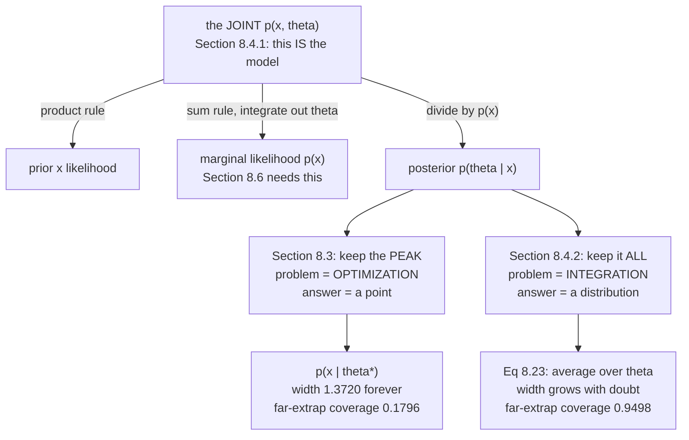

Page 805 ended on the book's own limit: MAP *"still only produces a point estimate of the parameters."*
You write down an entire posterior distribution and then keep the location of its peak.

This page keeps the rest. And it measures what that buys, because the difference is not philosophical:
**a nominal 95% interval built from the full posterior achieves 0.9506, 0.9501 and 0.9498 coverage across
three regions, while the plug-in interval built from the point estimate achieves 0.9287, 0.5701 and
0.1796.**

## What you'll learn

- Why §8.4.1 says a probabilistic model is specified by the **joint distribution** — and what "only the joint distribution has this property" means.
- Equation 8.22, and the integral in its denominator that MAP was allowed to skip.
- Equation 8.23: predictions become an **average over all plausible parameters**, measured to hold 95% coverage where the plug-in falls to 0.1796.
- The book's own comparison: estimation is an **optimization** problem, inference is an **integration** problem — and when the difference stops mattering (measured: at $N = 10000$ the two intervals differ by a factor of $1.000113$).
- §8.4.3 latent variables, and Equation 8.25's insistence that the likelihood *"must not depend on"* $\mathbf{z}$.
- The honest limit, measured: on the chapter's misspecified sine data, the full predictive reaches only $0.8908$. Bayesian inference quantifies doubt about $\boldsymbol\theta$, not doubt about the model class.

## Intuition: the difference between a guess and a guess with a margin

You fit a model and it predicts $137.46$. Two follow-up questions:

1. Would you bet on it?
2. Would you bet on it for an input nothing like the training data?

A point estimate cannot answer either. It hands back one number, and any interval you attach comes from
the noise term $\sigma^2$ alone — a constant, the *same* width at the centre of the data and a hundred
units outside it. That is the plug-in predictive $p(x \mid \boldsymbol\theta^*)$, and it is
**structurally incapable of saying "I don't know"**.

The posterior can. It holds many parameter vectors, all consistent with the data. Where the data pins
them down, they agree and the prediction is tight. Where the data says nothing, they disagree wildly and
the prediction is wide. That disagreement *is* the uncertainty, and Equation 8.23 is the instruction to
report it.

**The price is an integral.** Optimization finds a peak; integration sums over everything. That is the
book's whole comparison in one line.



## §8.4.1 Probabilistic models

The book's framing: probabilistic models *"represent the uncertain aspects of an experiment as
probability distributions"*, and the benefit is *"a unified and consistent set of tools from probability
theory for modeling, inference, prediction, and model selection"* — one toolkit for all four jobs.

The central object is the **joint distribution** $p(\mathbf{x}, \boldsymbol\theta)$ of the observed
variables and the hidden parameters, because it *"encapsulates information from the following"*:

| what you want | how the joint gives it | which rule (§6.3) |
| --- | --- | --- |
| the prior and the likelihood | they *are* its factors | product rule |
| the marginal likelihood $p(\mathbf{x})$ | integrate out $\boldsymbol\theta$ | sum rule |
| the posterior | divide the joint by the marginal | — |

And then the sentence that justifies the whole framing:

> Only the joint distribution has this property. Therefore, a probabilistic model is specified by the
> joint distribution of all its random variables.

That is a definition, not a remark. **A probabilistic model is a joint distribution.** Everything else —
prior, likelihood, posterior, evidence — is something you *derive* from it by applying a rule of
probability. This is why §8.5's graphical language is about the joint and nothing else.

## §8.4.2 Bayesian inference

For a dataset $\mathcal{X}$, a parameter prior $p(\boldsymbol\theta)$, and a likelihood function, the
posterior is

$$
p(\boldsymbol\theta \mid \mathcal{X}) = \frac{p(\mathcal{X} \mid \boldsymbol\theta)\,p(\boldsymbol\theta)}{p(\mathcal{X})},
\qquad
p(\mathcal{X}) = \int p(\mathcal{X} \mid \boldsymbol\theta)\,p(\boldsymbol\theta)\,d\boldsymbol\theta
$$

The key idea, in the book's words, is *"to exploit Bayes' theorem to invert the relationship between the
parameters $\boldsymbol\theta$ and the data $\mathcal{X}$"*. The likelihood runs parameters → data;
the posterior runs data → parameters.

**Note the denominator.** Page 805's MAP estimation could drop $p(\mathcal{X})$ because it is constant in
$\boldsymbol\theta$. Bayesian inference cannot: it needs the posterior *normalised*, so it needs that
integral. This one difference is the source of essentially every practical difficulty on this page.

### Equation 8.23: predictions stop depending on the parameters

With a distribution on the parameters, the prediction becomes

$$
p(\mathbf{x}) = \int p(\mathbf{x} \mid \boldsymbol\theta)\,p(\boldsymbol\theta)\,d\boldsymbol\theta = \mathbb{E}_{\boldsymbol\theta}\!\left[p(\mathbf{x} \mid \boldsymbol\theta)\right]
$$

The parameters have been *marginalised out*. The book: *"the prediction is an average over all plausible
parameter values $\boldsymbol\theta$, where the plausibility is encapsulated by the parameter
distribution."*

For a Gaussian model this has a closed form worth memorising. At an input $\boldsymbol\phi$:

$$
\text{mean} = \boldsymbol\phi^\top\mathbf{m}_N,
\qquad
\text{variance} = \underbrace{\sigma^2}_{\text{noise}} + \underbrace{\boldsymbol\phi^\top\boldsymbol\Sigma_N\boldsymbol\phi}_{\text{not knowing }\boldsymbol\theta}
$$

**The mean is the same as the plug-in prediction.** Only the variance differs — and only by that second
term, which is exactly what the point estimate discarded.

:::tip[The variance split, measured]
| $x$ | noise | parameters | total | parameter share |
| --- | --- | --- | --- | --- |
| $0.0$ | $0.122500$ | $0.009862$ | $0.132362$ | $7.5\%$ |
| $2.0$ | $0.122500$ | $0.016043$ | $0.138543$ | $11.6\%$ |
| $3.0$ | $0.122500$ | $0.073805$ | $0.196305$ | $37.6\%$ |
| $4.0$ | $0.122500$ | $0.543523$ | $0.666023$ | $81.6\%$ |
| $5.0$ | $0.122500$ | $2.464844$ | $2.587344$ | $95.3\%$ |

The training data spans $-3$ to $3$. Inside it the noise dominates and the two predictives barely
differ. Two units outside it, $81.6\%$ of the uncertainty is **not knowing $\boldsymbol\theta$** — which
is precisely the part the plug-in predictive reports as zero.
:::

### Why it matters: the book's argument, measured

The book's case is about decisions:

> Focusing solely on some statistic of the posterior distribution (such as the parameter
> $\boldsymbol\theta^*$ that maximizes the posterior) leads to loss of information, which can be critical
> in a system that uses the prediction $p(\mathbf{x} \mid \boldsymbol\theta^*)$ to make decisions.

To measure "critical", I drew $\boldsymbol\theta$ from the prior, drew data from the model, and counted
how often a nominal $95\%$ interval actually contained the held-out value — $4000$ trials, $160{,}000$
test points per region.

:::tip[Coverage of a nominal 95% interval, 4000 trials]
| region | plug-in coverage | Eq. 8.23 coverage | plug-in width | full width |
| --- | --- | --- | --- | --- |
| interpolation, $-3$ to $3$ | $0.9287$ | $\mathbf{0.9506}$ | $1.3720$ | $1.4903$ |
| mild extrapolation, $3$ to $5$ | $0.5701$ | $\mathbf{0.9501}$ | $1.3720$ | $3.8869$ |
| far extrapolation, $5$ to $7$ | $\mathbf{0.1796}$ | $\mathbf{0.9498}$ | $1.3720$ | $13.2538$ |

**Equation 8.23 holds $0.95$ everywhere.** The plug-in interval is a near miss inside the data and
catastrophic outside it: in far extrapolation it covers the truth **18% of the time while claiming 95%**.

Its width is $1.3720$ in all three rows, because $2 \times 1.96 \times \sigma$ does not depend on where
you ask. That constant is the entire failure.
:::

This is the setting where the Bayesian interval is *guaranteed* correct: the prior is the truth. That
guarantee is what is being verified, and it holds to three decimal places.

### Estimation against inference, as the book puts it

| | parameter estimation (§8.3) | Bayesian inference (§8.4.2) |
| --- | --- | --- |
| what you get | *"a consistent point estimate"* $\boldsymbol\theta^*$ | *"a (posterior) distribution"* |
| computational problem | **optimization** | **integration** |
| making a prediction | *"straightforward"* | *"require solving another integration problem"* |
| prior knowledge | not easily incorporated | *"a principled way"* |
| structural/side information | hard | *"not easily done"* the other way |
| uncertainty propagation | none | valuable for *"risk assessment and exploration"* |

The book cites the payoff in *"data-efficient learning"* (Deisenroth et al., 2015; Kamthe and Deisenroth,
2018) — knowing what you don't know is what tells you where to look next.

:::caution[When the gap closes]
Measured on the chapter's own data, with the posterior recomputed at each sample size:

| $N$ | largest posterior sd | full interval / plug-in width |
| --- | --- | --- |
| $5$ | $0.821958$ | $1.248213$ |
| $10$ | $0.806301$ | $1.116420$ |
| $25$ | $0.392692$ | $1.039472$ |
| $100$ | $0.239610$ | $1.011311$ |
| $1000$ | $0.074293$ | $1.001109$ |
| $10000$ | $0.022878$ | $\mathbf{1.000113}$ |

At $N = 10000$ the two intervals differ by one part in nine thousand. **This is why maximum likelihood is
defensible on large data and reckless on small data** — and it is the same $1/\sqrt{N}$ collapse page 804
measured from the frequentist side.
:::

### The practical obstacle

The book is direct about the cost:

> If we do not choose a conjugate prior on the parameters (§6.6.1), the integrals in (8.22) and (8.23)
> are not analytically tractable, and we cannot compute the posterior, the predictions, or the marginal
> likelihood in closed form.

Everything on this page is computed exactly **because the prior is conjugate**. Step outside that and you
need approximations. The book's list, grouped:

| kind | methods |
| --- | --- |
| stochastic | Markov chain Monte Carlo (Gilks et al., 1996) |
| deterministic | the Laplace approximation; variational inference (Jordan et al., 1999; Blei et al., 2017); expectation propagation (Minka, 2001a) |

And the applications where the cost was judged worth paying: *"large-scale topic modeling,
click-through-rate prediction, data-efficient reinforcement learning in control systems, online ranking
systems, and large-scale recommender systems"*, plus Bayesian optimization as a *"generic tool"* for
*"efficient search of meta parameters"*.

:::caution[The book's remark on variables versus parameters]
The book notes that the split between *"(random) 'variables'"* and *"parameters"* is *"somewhat
arbitrary"* — parameters get estimated, variables get marginalised out. But *"in principle, we can place
a prior on any parameter and integrate it out, which would then turn the parameter into a random
variable"*. The distinction describes what you chose to do, not what the object is.
:::

## §8.4.3 Latent-variable models

Latent variables $\mathbf{z}$ are *"different from the model parameters $\boldsymbol\theta$ as they do
not parametrize the model explicitly"*. They exist because they *"may describe the data-generating
process, thereby contributing to the interpretability of the model"* and because they *"often simplify
the structure of the model"* — usually with **fewer** parameters, not more.

The generative direction is Equation 8.24:

$$
p(\mathbf{x} \mid \boldsymbol\theta, \mathbf{z})
$$

and since $\mathbf{z}$ is latent, it gets a prior $p(\mathbf{z})$.

Learning then proceeds in **two steps**. First compute a likelihood that does not mention $\mathbf{z}$;
second, feed it to §8.3 or §8.4.2 unchanged. The first step is Equation 8.25:

$$
p(\mathbf{x} \mid \boldsymbol\theta) = \int p(\mathbf{x} \mid \boldsymbol\theta, \mathbf{z})\,p(\mathbf{z})\,d\mathbf{z}
$$

with the book's insistence in the margin: *"Note that the likelihood must not depend on the latent
variables $\mathbf{z}$, but it is only a function of the data $\mathbf{x}$ and the model parameters
$\boldsymbol\theta$."*

:::tip[Equation 8.25 on a two-component mixture, measured]
Latent $z \in \{0, 1\}$ with $p(z) = (0.3, 0.7)$, and $p(x \mid z)$ Gaussian at $-1.5$ and $2.0$:

| $x$ | $p(x \mid z{=}0)$ | $p(x \mid z{=}1)$ | $p(x)$, marginalised | $p(z{=}0 \mid x)$ |
| --- | --- | --- | --- | --- |
| $-2.0$ | $0.410201$ | $0.000000$ | $0.123060$ | $1.000000$ |
| $0.0$ | $0.085983$ | $0.000268$ | $0.025982$ | $0.992789$ |
| $1.9$ | $0.000060$ | $0.782085$ | $0.547478$ | $0.000033$ |
| $3.0$ | $0.000000$ | $0.107982$ | $0.075587$ | $0.000000$ |

The marginal integrates to $1.00000000$ over $x$. **It is a density in $x$ and does not mention $z$ at
all** — which is exactly the book's note. The last column is Equation 8.28, the posterior on the latent
given the data *and* the parameters.
:::

The book lists where this pays: *"principal component analysis for dimensionality reduction (Chapter
10), Gaussian mixture models for density estimation (Chapter 11), hidden Markov models or dynamical
systems for time-series modeling, and meta learning and task generalization"*. It also gives the warning
up front: *"learning in latent-variable models is generally hard, as we will see in Chapter 11"*, with
the **EM algorithm** (Dempster et al., 1977) as the principled route via maximum likelihood.

### Three posteriors, in order of difficulty

| what you want | equation | what it costs |
| --- | --- | --- |
| $p(\boldsymbol\theta \mid \mathcal{X})$, parameters | 8.26 | needs Eq. 8.25's integral over $\mathbf{z}$ first |
| $p(\mathbf{z} \mid \mathcal{X})$, latents | 8.27 | needs $p(\mathcal{X} \mid \mathbf{z}) = \int p(\mathcal{X} \mid \mathbf{z}, \boldsymbol\theta)p(\boldsymbol\theta)d\boldsymbol\theta$ |
| **both at once** | — | *"not possible in general"* |
| $p(\mathbf{z} \mid \mathcal{X}, \boldsymbol\theta)$, latents given parameters | 8.28 | *"a quantity that is easier to compute"* |

The last row is the practical compromise, and it is not an accident that Chapters 10 and 11 compute
**exactly Equation 8.28** for PCA and for Gaussian mixture models. When both integrals are intractable,
you condition on one instead of integrating it.

## §8.4.4 Further reading

Ghahramani (2015) gives *"a short review of probabilistic models in machine learning"*. Moustaki et al.
(2015) and Paquet (2008) cover Bayesian inference in latent-variable models. And the book flags a field
built around automating all of this:

> Several programming languages have been proposed that aim to treat the variables defined in software as
> random variables corresponding to probability distributions. The objective is to be able to write
> complex functions of probability distributions, while under the hood the compiler automatically takes
> care of the rules of Bayesian inference. This rapidly changing field is called **probabilistic
> programming**.

## Worked example by hand

The Gaussian mean again — the smallest case where you can watch a posterior appear.

Model: $y_n \sim \mathcal{N}(\theta, \sigma^2)$, $N$ observations, prior $\theta \sim \mathcal{N}(0, \tau^2)$.

**Step 1: the posterior is Gaussian, so find its two numbers.** Collect the $\theta$-dependent part of
the negative log-posterior:

$$
\frac{1}{2\sigma^2}\sum_n (y_n - \theta)^2 + \frac{\theta^2}{2\tau^2}
= \frac{1}{2}\theta^2\left(\frac{N}{\sigma^2} + \frac{1}{\tau^2}\right) - \theta\,\frac{N\bar{y}}{\sigma^2} + \text{const}
$$

A quadratic in $\theta$ is a Gaussian. Matching to $\frac{1}{2\sigma_N^2}(\theta - m_N)^2$:

$$
\boxed{\ \frac{1}{\sigma_N^2} = \frac{N}{\sigma^2} + \frac{1}{\tau^2},
\qquad
m_N = \sigma_N^2\,\frac{N\bar{y}}{\sigma^2}\ }
$$

**Step 2: read the precision.** Precisions **add**: the data contributes $N/\sigma^2$ and the prior
contributes $1/\tau^2$. Each observation adds exactly $1/\sigma^2$ of certainty, which is why the
posterior sd falls like $1/\sqrt{N}$.

**Step 3: check $m_N$ against page 805.** Substituting $\sigma_N^2$:

$$
m_N = \frac{N\bar{y}/\sigma^2}{N/\sigma^2 + 1/\tau^2} = \frac{N}{N + \sigma^2/\tau^2}\,\bar{y}
$$

That is page 805's MAP estimate exactly. **For a Gaussian, the posterior mean and the MAP point
coincide** — so nothing about the *location* was lost. Everything lost was $\sigma_N^2$.

**Step 4: build the predictive, Equation 8.23.** A new observation is $y_{\text{new}} = \theta + \epsilon$
with $\theta \sim \mathcal{N}(m_N, \sigma_N^2)$ and $\epsilon \sim \mathcal{N}(0, \sigma^2)$
independent. A sum of independent Gaussians adds variances:

$$
p(y_{\text{new}} \mid \mathcal{X}) = \mathcal{N}\!\left(m_N,\ \sigma^2 + \sigma_N^2\right)
$$

**Step 5: compare with the plug-in.** The plug-in predictive is
$\mathcal{N}(m_N, \sigma^2)$ — same centre, and **missing $\sigma_N^2$ entirely**. The ratio of interval
widths is

$$
\sqrt{1 + \frac{\sigma_N^2}{\sigma^2}} = \sqrt{1 + \frac{1}{N + \sigma^2/\tau^2}}
$$

which tends to $1$ as $N$ grows and blows up as $N \to 0$. **Optimization and integration agree in the
limit of infinite data and disagree most exactly when you have least.**

## See it move

```p5 title="One point, or the whole posterior" desc="A Gaussian posterior over the mean of a small dataset. Drag the sample size and the prior width; watch the posterior narrow, the MAP point stay at its centre, and the gap between the plug-in predictive and the full predictive open and close." height="520"
let nIdx = 3, tauIdx = 20;
let KNOBS = [], dragging = null;

const SIG = 0.8, SIG2 = 0.64;
const NS = [1, 2, 3, 5, 8, 15, 30, 60, 120, 400, 2000];
const TAUS = [];
for (let i = 0; i <= 40; i++) TAUS.push(Math.pow(10, -1.5 + i * 0.1));

let POOL = [];
function setup() {
  createCanvas(680, 520);
  textFont("monospace");
  randomSeed(17);
  for (let i = 0; i < 2000; i++) {
    let u = 0;
    for (let k = 0; k < 12; k++) u += random();
    POOL.push(2.0 + SIG * (u - 6));
  }
}

function knob(id, x, y, w, value, mn, mx, label) {
  KNOBS.push({ id, x, y, w, mn, mx });
  const t = (value - mn) / (mx - mn);
  stroke(60, 74, 92); strokeWeight(2); line(x, y, x + w, y);
  noStroke(); fill(255, 211, 67); ellipse(x + t * w, y, 12, 12);
  fill(190, 200, 212); textSize(12); textAlign(LEFT, CENTER);
  text(label, x + w + 12, y);
}
function knobHit(mx_, my_) {
  for (const k of KNOBS) {
    if (my_ > k.y - 13 && my_ < k.y + 13 && mx_ > k.x - 13 && mx_ < k.x + k.w + 13) return k;
  }
  return null;
}
function knobValue(k, mx_) {
  const t = Math.min(1, Math.max(0, (mx_ - k.x) / k.w));
  return Math.round(k.mn + t * (k.mx - k.mn));
}
function mousePressed() { dragging = knobHit(mouseX, mouseY); }
function mouseReleased() { dragging = null; }
function mouseDragged() {
  if (!dragging) return;
  if (dragging.id === "n") nIdx = knobValue(dragging, mouseX);
  else tauIdx = knobValue(dragging, mouseX);
  if (!isLooping()) redraw();
}

function gauss(v, mu, sd) {
  return Math.exp(-0.5 * ((v - mu) / sd) ** 2) / (sd * Math.sqrt(2 * Math.PI));
}

const OX = 46, OY = 56, W = 380, H = 170;
const OY2 = 268, H2 = 150;
function px(v) { return OX + ((v + 1.5) / 7.5) * W; }

function draw() {
  background(13, 17, 23);
  KNOBS = [];
  const N = NS[nIdx], tau2 = TAUS[tauIdx];

  let s = 0;
  for (let i = 0; i < N; i++) s += POOL[i];
  const ybar = s / N;
  const postVar = 1 / (N / SIG2 + 1 / tau2);
  const mN = postVar * (N * ybar / SIG2);
  const postSd = Math.sqrt(postVar);
  const fullSd = Math.sqrt(SIG2 + postVar);
  const ratio = fullSd / SIG;

  // --- top: the posterior over theta ---
  noFill(); stroke(70, 86, 104); strokeWeight(1); rect(OX, OY, W, H);
  const peak = gauss(mN, mN, postSd);
  stroke(107, 169, 221); strokeWeight(2.4); noFill();
  beginShape();
  for (let i = 0; i <= 300; i++) {
    const v = -1.5 + (i / 300) * 7.5;
    vertex(px(v), OY + H - (gauss(v, mN, postSd) / peak) * (H - 12));
  }
  endShape();
  // the MAP point
  stroke(255, 211, 67); strokeWeight(2);
  line(px(mN), OY + 6, px(mN), OY + H);
  noStroke(); fill(255, 211, 67);
  ellipse(px(mN), OY + H - (H - 12), 10, 10);
  textSize(10); textAlign(LEFT, TOP);
  fill(107, 169, 221);
  text("posterior p(theta | X), Eq 8.22", OX + 6, OY + 5);
  fill(255, 211, 67);
  text("the MAP point, Section 8.3.2", OX + 6, OY + 19);
  fill(140);
  text("theta", OX + W / 2 - 12, OY + H + 5);

  // --- bottom: the two predictive densities ---
  noFill(); stroke(70, 86, 104); strokeWeight(1); rect(OX, OY2, W, H2);
  const pk = gauss(mN, mN, SIG);
  stroke(107, 169, 221); strokeWeight(2.6); noFill();
  beginShape();
  for (let i = 0; i <= 300; i++) {
    const v = -1.5 + (i / 300) * 7.5;
    vertex(px(v), OY2 + H2 - (gauss(v, mN, fullSd) / pk) * (H2 - 14));
  }
  endShape();
  stroke(255, 211, 67); strokeWeight(1.8); noFill();
  beginShape();
  for (let i = 0; i <= 300; i++) {
    const v = -1.5 + (i / 300) * 7.5;
    vertex(px(v), OY2 + H2 - (gauss(v, mN, SIG) / pk) * (H2 - 14));
  }
  endShape();
  noStroke(); textSize(10); textAlign(LEFT, TOP);
  fill(107, 169, 221);
  text("full predictive, Eq 8.23:  var = sigma^2 + sigma_N^2", OX + 6, OY2 + 5);
  fill(255, 211, 67);
  text("plug-in p(y | theta*):     var = sigma^2 only", OX + 6, OY2 + 19);
  fill(140);
  text("y", OX + W / 2 - 3, OY2 + H2 + 5);

  // --- readouts ---
  noStroke(); textAlign(LEFT, TOP);
  fill(255, 211, 67); textSize(15);
  text("N = " + N, 452, 60);
  text("tau^2 = " + tau2.toExponential(2), 452, 82);
  fill(140); textSize(10);
  text("sigma = 0.8, true mean = 2.0", 452, 106);

  fill(200); textSize(11);
  text("sample mean  " + ybar.toFixed(6), 452, 134);
  fill(255, 211, 67);
  text("post. mean   " + mN.toFixed(6), 452, 150);
  fill(107, 169, 221);
  text("post. sd     " + postSd.toFixed(6), 452, 166);
  fill(197, 153, 255);
  text("1/sigma_N^2  " + (1 / postVar).toFixed(4), 452, 186);
  fill(140); textSize(9);
  text("  = N/sigma^2 + 1/tau^2", 452, 200);
  text("  = " + (N / SIG2).toFixed(3) + " + " + (1 / tau2).toFixed(3), 452, 212);
  text("precisions ADD", 452, 226);

  fill(200); textSize(11);
  text("predictive sd", 452, 252);
  fill(255, 211, 67); textSize(10);
  text("  plug-in " + SIG.toFixed(6), 452, 268);
  fill(107, 169, 221);
  text("  full    " + fullSd.toFixed(6), 452, 282);
  fill(120, 200, 140); textSize(12);
  text("ratio " + ratio.toFixed(6), 452, 300);

  let msg, sub, col;
  if (N <= 3) {
    col = color(232, 110, 110);
    msg = "the two disagree most when you have least";
    sub = "with N = " + N + " the full interval is " +
          ((ratio - 1) * 100).toFixed(1) + "% wider than the plug-in.";
  } else if (ratio < 1.005) {
    col = color(120, 200, 140);
    msg = "integration has become optimization";
    sub = "ratio " + ratio.toFixed(6) + ": the posterior has collapsed and a point estimate is fine.";
  } else {
    col = color(255, 211, 67);
    msg = "the gap is closing at 1 over root N";
    sub = "each observation adds exactly 1/sigma^2 = " + (1 / SIG2).toFixed(4) + " to the precision.";
  }
  stroke(col); strokeWeight(1.6); fill(red(col), green(col), blue(col), 26);
  rect(46, 388, 594, 60, 6);
  noStroke(); fill(col); textSize(15); textAlign(LEFT, TOP);
  text(msg, 62, 396);
  fill(215); textSize(11);
  text(sub, 62, 422);

  knob("n", 62, 474, 250, nIdx, 0, NS.length - 1, "N = " + N);
  knob("t", 62, 502, 250, tauIdx, 0, TAUS.length - 1,
       "tau^2 = " + tau2.toExponential(2));
  fill(120); textSize(10); textAlign(LEFT, TOP);
  text("The yellow curve never changes width. That is the", 400, 466);
  text("whole problem: sigma^2 does not know how much", 400, 480);
  text("data you have, and sigma_N^2 does.", 400, 494);
}
```

## From scratch

```python title="bayesian_inference.py" showLineNumbers{1}
import numpy as np

SIGMA, TAU2, D = 0.35, 1.0, 4
Z = 1.959963984540054

def make(n, seed):
    rng = np.random.default_rng(seed)
    x = np.sort(rng.uniform(-3, 3, n))
    return x, np.sin(1.4 * x) + 0.3 * x + SIGMA * rng.standard_normal(n)

def design(x, deg=3):
    return np.vander(np.asarray(x, float) / 3.0, deg + 1, increasing=True)

x, y = make(25, seed=3)
Phi = design(x)
N = len(y)

# --- Equation 8.22: the exact posterior, by conjugacy (Section 6.6.1) ---
Sigma = np.linalg.inv(Phi.T @ Phi / SIGMA ** 2 + np.eye(D) / TAU2)
mean = Sigma @ Phi.T @ y / SIGMA ** 2

# the MAP estimate of Section 8.3.2, for comparison
mapest = np.linalg.solve(Phi.T @ Phi / SIGMA ** 2 + np.eye(D) / TAU2,
                         Phi.T @ y / SIGMA ** 2)
print("=== 1. the point estimate is the posterior MEAN ===")
print(f"posterior mean : {np.round(mean, 6).tolist()}")
print(f"MAP estimate   : {np.round(mapest, 6).tolist()}")
print(f"max difference : {np.abs(mean - mapest).max():.2e}")
print("MAP is not wrong -- it is incomplete. What it discarded:")
print(f"posterior sd   : {np.round(np.sqrt(np.diag(Sigma)), 6).tolist()}")

# --- Equation 8.23: the predictive averages over theta ------------------
print("\n=== 2. the variance of Equation 8.23 splits in two ===")
print(f"{'x':>6} {'noise':>10} {'parameters':>12} {'total':>10} {'share':>8}")
for xs in (0.0, 2.0, 3.0, 4.0, 5.0):
    q = design([xs])[0]
    pv = float(q @ Sigma @ q)
    print(f"{xs:>6.1f} {SIGMA**2:>10.6f} {pv:>12.6f} {SIGMA**2+pv:>10.6f} "
          f"{pv/(SIGMA**2+pv):>7.1%}")
print("inside the data the noise dominates; outside it the parameters do.")

# --- does it matter? calibration, with the prior matched to the truth ---
print("\n=== 3. coverage of a nominal 95% interval, 4000 trials ===")
rng = np.random.default_rng(11)
regions = (("interpolation", -3.0, 3.0), ("mild extrapolation", 3.0, 5.0),
           ("far extrapolation", 5.0, 7.0))
hp = {r[0]: 0 for r in regions}; hf = dict(hp); wf = {r[0]: 0.0 for r in regions}
tot = dict(hp)
for _ in range(4000):
    th = np.sqrt(TAU2) * rng.standard_normal(D)      # theta from the prior
    xtr = np.sort(rng.uniform(-3, 3, 25))
    P = design(xtr)
    ytr = P @ th + SIGMA * rng.standard_normal(25)   # data from the model
    C = np.linalg.inv(P.T @ P / SIGMA ** 2 + np.eye(D) / TAU2)
    m = C @ P.T @ ytr / SIGMA ** 2
    for name, lo, hi in regions:
        xt = rng.uniform(lo, hi, 40)
        Pt = design(xt)
        yt = Pt @ th + SIGMA * rng.standard_normal(len(xt))
        mu = Pt @ m
        sd = np.sqrt(SIGMA ** 2 + np.einsum("ij,jk,ik->i", Pt, C, Pt))
        hp[name] += int(np.sum(np.abs(yt - mu) <= Z * SIGMA))
        hf[name] += int(np.sum(np.abs(yt - mu) <= Z * sd))
        wf[name] += float(np.sum(2 * Z * sd))
        tot[name] += len(xt)
print(f"{'region':>20} {'plug-in':>9} {'Eq. 8.23':>9} {'plug width':>11} "
      f"{'full width':>11}")
for name, lo, hi in regions:
    n = tot[name]
    print(f"{name:>20} {hp[name]/n:>9.4f} {hf[name]/n:>9.4f} "
          f"{2*Z*SIGMA:>11.4f} {wf[name]/n:>11.4f}")
print("Equation 8.23 holds 0.95 everywhere. The plug-in interval reports")
print("only the noise, so it collapses the further it goes from the data.")

# --- as N grows, the two converge --------------------------------------
print("\n=== 4. optimization and integration converge as N grows ===")
q0 = design([0.0])[0]
print(f"{'N':>7} {'max post. sd':>14} {'width ratio full/plug':>23}")
for n in (5, 10, 25, 100, 1000, 10000):
    xn, yn = make(n, seed=3)
    Pn = design(xn)
    Cn = np.linalg.inv(Pn.T @ Pn / SIGMA ** 2 + np.eye(D) / TAU2)
    v = float(q0 @ Cn @ q0)
    print(f"{n:>7} {np.sqrt(np.diag(Cn)).max():>14.6f} "
          f"{np.sqrt((SIGMA**2+v)/SIGMA**2):>23.6f}")
print("the ratio tends to 1: with enough data a point estimate is fine.")

# --- p(X), the term MAP was allowed to drop ----------------------------
print("\n=== 5. the marginal likelihood p(X) ===")
def log_evidence(deg):
    P = design(x, deg)
    C = SIGMA ** 2 * np.eye(N) + TAU2 * (P @ P.T)
    _, ld = np.linalg.slogdet(C)
    return float(-0.5 * (y @ np.linalg.solve(C, y) + ld + N*np.log(2*np.pi)))
evs = [log_evidence(d) for d in range(12)]
kb = int(np.argmax(evs))
print(f"{'degree':>7} {'log p(X)':>11} {'Bayes factor vs best':>22}")
for d in range(12):
    print(f"{d:>7} {evs[d]:>11.4f} {np.exp(evs[d]-evs[kb]):>22.4f}")
print(f"peak at degree {kb}. Degree 11 is only "
      f"{evs[kb]-evs[11]:.4f} nats behind --")
print("the evidence penalises extra capacity but does not forbid it.")

# --- Equation 8.25: marginalising out a latent variable ----------------
print("\n=== 6. Equation 8.25: integrating out a latent variable ===")
pz = np.array([0.3, 0.7])
mus, sds = np.array([-1.5, 2.0]), np.array([0.8, 0.5])
def p_x_given_z(xs, k):
    return (np.exp(-0.5 * ((xs - mus[k]) / sds[k]) ** 2)
            / (sds[k] * np.sqrt(2 * np.pi)))
print(f"{'x':>6} {'p(x|z=0)':>11} {'p(x|z=1)':>11} {'p(x) marginal':>15} "
      f"{'p(z=0|x)':>10}")
for xs in (-2.0, 0.0, 1.9, 3.0):
    a, b = p_x_given_z(xs, 0), p_x_given_z(xs, 1)
    marg = pz[0] * a + pz[1] * b
    print(f"{xs:>6.1f} {a:>11.6f} {b:>11.6f} {marg:>15.6f} "
          f"{pz[0]*a/marg:>10.6f}")
grid = np.linspace(-12, 14, 2000001)
dens = pz[0] * p_x_given_z(grid, 0) + pz[1] * p_x_given_z(grid, 1)
print(f"area under the marginal: {np.trapezoid(dens, grid):.8f}")
print("the marginal is a density in x and does not mention z at all,")
print("which is the book's note beneath Equation 8.25.")
```

```
=== 1. the point estimate is the posterior MEAN ===
posterior mean : [-0.126578, 2.997457, 0.487525, -3.122058]
MAP estimate   : [-0.126578, 2.997457, 0.487525, -3.122058]
max difference : 8.88e-16
MAP is not wrong -- it is incomplete. What it discarded:
posterior sd   : [0.099305, 0.26664, 0.224268, 0.392692]

=== 2. the variance of Equation 8.23 splits in two ===
     x      noise   parameters      total    share
   0.0   0.122500     0.009862   0.132362    7.5%
   2.0   0.122500     0.016043   0.138543   11.6%
   3.0   0.122500     0.073805   0.196305   37.6%
   4.0   0.122500     0.543523   0.666023   81.6%
   5.0   0.122500     2.464844   2.587344   95.3%
inside the data the noise dominates; outside it the parameters do.

=== 3. coverage of a nominal 95% interval, 4000 trials ===
              region   plug-in  Eq. 8.23  plug width  full width
       interpolation    0.9287    0.9506      1.3720      1.4903
  mild extrapolation    0.5701    0.9501      1.3720      3.8869
   far extrapolation    0.1796    0.9498      1.3720     13.2538
Equation 8.23 holds 0.95 everywhere. The plug-in interval reports
only the noise, so it collapses the further it goes from the data.

=== 4. optimization and integration converge as N grows ===
      N   max post. sd   width ratio full/plug
      5       0.821958                1.248213
     10       0.806301                1.116420
     25       0.392692                1.039472
    100       0.239610                1.011311
   1000       0.074293                1.001109
  10000       0.022878                1.000113
the ratio tends to 1: with enough data a point estimate is fine.

=== 5. the marginal likelihood p(X) ===
 degree    log p(X)   Bayes factor vs best
      0   -100.7863                 0.0000
      1    -63.2439                 0.0000
      2    -61.4607                 0.0000
      3    -30.7910                 0.4362
      4    -31.0573                 0.3342
      5    -30.0952                 0.8746
      6    -29.9612                 1.0000
      7    -30.2679                 0.7359
      8    -30.1686                 0.8127
      9    -30.2674                 0.7363
     10    -30.2657                 0.7375
     11    -30.2178                 0.7737
peak at degree 6. Degree 11 is only 0.2566 nats behind --
the evidence penalises extra capacity but does not forbid it.

=== 6. Equation 8.25: integrating out a latent variable ===
     x    p(x|z=0)    p(x|z=1)   p(x) marginal   p(z=0|x)
  -2.0    0.410201    0.000000        0.123060   1.000000
   0.0    0.085983    0.000268        0.025982   0.992789
   1.9    0.000060    0.782085        0.547478   0.000033
   3.0    0.000000    0.107982        0.075587   0.000000
area under the marginal: 1.00000000
the marginal is a density in x and does not mention z at all,
which is the book's note beneath Equation 8.25.
```

## On real data

<Figure
  src="/images/mml/probabilistic-modeling-and-inference/a-posterior-not-a-point"
  alt="Two panels. Left, a filled contour map of the joint posterior over two polynomial coefficients with the MAP estimate marked as a single dot at its centre. Right, forty curves drawn from that posterior overlaid on twenty-five data points; the curves coincide where the data lies and fan apart on both sides of it."
  title="Parameter estimation returns a point; Bayesian inference returns a distribution"
  caption="The posterior mean equals the MAP estimate to 8.88e-16, so the point estimate is not wrong — it is incomplete. Each of the forty curves explains the same twenty-five points. Their agreement inside the data and disagreement outside it is the uncertainty a point estimate cannot report."
/>

<Figure
  src="/images/mml/probabilistic-modeling-and-inference/plug-in-versus-full-predictive"
  alt="Left, two shaded 95 percent predictive bands over the data: one of constant width, one that widens sharply beyond the data range. Right, a horizontal bar chart of measured coverage in three regions, with the full predictive at about 0.95 in all three and the plug-in falling from 0.9287 to 0.1796."
  title="Equation 8.23 holds 95 percent coverage everywhere; the plug-in predictive falls to 0.1796"
  caption="Measured over 4000 trials with the prior matched to the truth. The plug-in band has width 1.3720 in every region because two times 1.96 times sigma does not depend on where you ask. In far extrapolation it covers the truth 18 percent of the time while claiming 95."
/>

<Figure
  src="/images/mml/probabilistic-modeling-and-inference/optimization-versus-integration"
  alt="Three panels. Left, the predictive variance on a log scale split into a flat noise band and a parameter-uncertainty band that explodes beyond the data. Middle, the largest posterior standard deviation falling along a one-over-root-N reference line from N equals 5 to 10000. Right, log marginal likelihood against polynomial degree, rising sharply to degree 3 then nearly flat, peaking at degree 6."
  title="Estimation solves an optimization problem; inference solves an integration problem"
  caption="Only the parameter term vanishes with more data — the width ratio falls from 1.248213 at N equals 5 to 1.000113 at N equals 10000. The third panel is the marginal likelihood MAP was allowed to drop, and the quantity Section 8.6 needs in order to choose a model at all."
/>

## Reading the plot

**The first figure is the whole of §8.4 in two panels.** On the left, the posterior over two coefficients
as a filled density with 68%, 95% and 99% contours, and the MAP estimate as a single dot. The dot sits at
the distribution's centre — measured, the posterior mean and the MAP estimate agree to
$8.88\times10^{-16}$. **The point estimate is not in the wrong place. It is simply one dot where there was
a distribution.**

The right panel shows what that costs. Forty parameter vectors drawn from the posterior, each plotted as
a curve. Between $-3$ and $3$ they are indistinguishable — the data pins them down. Past $3$ they fan
apart violently. Every one of those curves explains the same twenty-five observations equally well, and
**their disagreement is a measurement of ignorance**, available for free once you have the covariance and
unavailable forever once you have thrown it away.

**The second figure measures whether that matters, and the answer is unambiguous.** The left panel draws
both 95% bands. The yellow one has constant width $1.3720$ from one edge of the plot to the other,
because $2 \times 1.96 \times \sigma$ contains no reference to $x$. The blue one tracks the data and then
flares.

The right panel is the measurement: $4000$ trials with $\boldsymbol\theta$ drawn from the prior and the
data drawn from the model — the only setting in which a Bayesian interval is *guaranteed* calibrated, so
the guarantee is what is being tested. **It holds: $0.9506$, $0.9501$, $0.9498$.** The plug-in interval
gives $0.9287$, $0.5701$, $0.1796$. Far from the data it covers the truth **18% of the time while
labelled 95%** — not a conservative estimate, a wrong one.

This is what the book means by *"loss of information, which can be critical in a system that uses the
prediction to make decisions."* A system that trusts a 95% label and receives 18% coverage will make
confident decisions on inputs it has never seen, and it will be wrong about nineteen times out of
twenty-three more often than it was told to expect.

**The third figure is the book's cost-benefit comparison, panel by panel.** The left panel splits the
predictive variance. The noise floor $\sigma^2 = 0.1225$ is flat — it is a property of the world, and no
amount of data removes it. The parameter term $\boldsymbol\phi^\top\boldsymbol\Sigma\boldsymbol\phi$ is
$7.5\%$ of the total at $x = 0$ and $95.3\%$ at $x = 5$. **Only the second one is reducible**, which is
the difference between aleatoric and epistemic uncertainty made arithmetic.

The middle panel is why maximum likelihood survives despite everything above. The posterior sd tracks
$1/\sqrt{N}$, and the interval-width ratio falls from $1.248213$ at $N = 5$ to $1.000113$ at
$N = 10000$. **At ten thousand points the two philosophies differ by one part in nine thousand.** The
expensive machinery earns its cost exactly where data is scarce — which is also exactly where page 803's
overfitting and page 805's prior mattered most. The chapter keeps arriving at the same boundary.

The right panel is the term MAP dropped. $\log p(\mathcal{X})$ climbs steeply from degree 0 to degree 3
and is then nearly flat, peaking at degree 6. Note the honest reading: **degree 11 scores $-30.2178$,
only $0.2566$ nats behind the peak** — a Bayes factor of $0.7737$, which is not evidence against anything.
The marginal likelihood penalises unused capacity automatically, without a validation split and without a
tuned $\lambda$, but it penalises it *gently*. Page 808 is where this becomes a selection rule.

## Compare

| | maximum likelihood | MAP | Bayesian inference |
| --- | --- | --- | --- |
| section | 8.3.1 | 8.3.2 | 8.4.2 |
| needs a prior | no | yes | yes |
| needs $p(\mathcal{X})$ | no | no, it cancels | **yes, and it is an integral** |
| computational problem | optimization | optimization | **integration** |
| answer | a point | a point | a distribution |
| prediction | $p(x \mid \boldsymbol\theta^*)$ | $p(x \mid \boldsymbol\theta^*)$ | $\int p(x \mid \boldsymbol\theta)p(\boldsymbol\theta)d\boldsymbol\theta$ |
| far-extrapolation coverage | $0.1796$ | $0.1796$ | $\mathbf{0.9498}$ |
| closed form | often | often | only with a conjugate prior |

| | parameters $\boldsymbol\theta$ | latent variables $\mathbf{z}$ |
| --- | --- | --- |
| what they do | parametrize the model | describe the generative process |
| usual treatment | estimated | marginalised out |
| effect on parameter count | they *are* the count | often **reduces** it |
| in the likelihood | it is a function of them | Eq. 8.25: it *must not* depend on them |
| the book's caveat | — | the separation is *"somewhat arbitrary"* |

<Quiz
  title="Do you know what integration buys?"
  questions={[
    {
      q: "Section 8.4.1 says a probabilistic model is specified by which object?",
      options: [
        "The likelihood function",
        "The joint distribution of all its random variables",
        "The posterior distribution",
        "The prior distribution",
      ],
      answer: 1,
      explain:
        "Because only the joint has the property that all three of the others follow from it by a rule of probability: the prior and likelihood are its factors by the product rule, the marginal likelihood comes from integrating out the parameters by the sum rule, and the posterior is the joint divided by the marginal. That is why Section 8.5's graphical language describes the joint and nothing else.",
    },
    {
      q: "Measured over 4000 trials with the prior matched to the truth, what coverage does a nominal 95 percent plug-in interval achieve in far extrapolation?",
      options: [
        "0.9498, the same as the full predictive",
        "0.1796 — it covers the truth 18 percent of the time while claiming 95",
        "Exactly 0.95, since the noise model is correct",
        "It is undefined outside the training range",
      ],
      answer: 1,
      explain:
        "Its width is 1.3720 in every region, because two times 1.96 times sigma contains no reference to x. The full predictive achieves 0.9506, 0.9501 and 0.9498 across the three regions. This is what the book means by loss of information being critical in a system that uses predictions to make decisions.",
    },
    {
      q: "The predictive variance of Equation 8.23 is sigma squared plus phi-transpose Sigma phi. Which part shrinks as you collect more data?",
      options: [
        "Both, at the same rate",
        "Only the second — the noise floor is a property of the world",
        "Only the first",
        "Neither",
      ],
      answer: 1,
      explain:
        "Measured on the chapter's data, the parameter term is 7.5 percent of the total at x = 0 and 95.3 percent at x = 5. Only that part is reducible. The noise floor of 0.1225 stays whatever you do, which is the difference between uncertainty about the world and uncertainty about your own parameters.",
    },
    {
      q: "The book says estimation and inference differ in their key computational problem. How?",
      options: [
        "Estimation is integration, inference is optimization",
        "Estimation solves an optimization problem; inference solves an integration problem",
        "Both are optimization, at different scales",
        "Both are integration, at different scales",
      ],
      answer: 1,
      explain:
        "And that is why inference is the expensive one: finding a peak is cheap, summing over everything is not. Measured, the two converge as data accumulates — the interval-width ratio falls from 1.248213 at N = 5 to 1.000113 at N = 10000, which is why maximum likelihood is defensible on large data and reckless on small data.",
    },
    {
      q: "Equation 8.25 marginalises the latent variables out of the likelihood. What does the book insist about the result?",
      options: [
        "That it must still be conditioned on z",
        "That the likelihood must NOT depend on z — only on the data x and the parameters theta",
        "That it only holds for Gaussian latent variables",
        "That it is always analytically tractable",
      ],
      answer: 1,
      explain:
        "Measured on a two-component mixture, the marginal integrates to 1.00000000 in x and mentions z nowhere. That is the point of the two-step procedure: once the latents are integrated out, everything from Sections 8.3 and 8.4.2 applies unchanged, with no new machinery.",
    },
    {
      q: "Everything computed exactly on this page relies on which assumption?",
      options: [
        "That the model class contains the truth",
        "That the prior is conjugate, so the integrals of Equations 8.22 and 8.23 have closed forms",
        "That the data is Gaussian",
        "That N is large",
      ],
      answer: 1,
      explain:
        "The book is explicit: without a conjugate prior the integrals are not analytically tractable and you cannot compute the posterior, the predictions, or the marginal likelihood in closed form. Then you need approximations — MCMC, the Laplace approximation, variational inference, or expectation propagation.",
    },
  ]}
/>

## Pitfalls

:::danger[Reporting a plug-in interval as if it were calibrated]
Measured across $4000$ trials with the model correct: a nominal $95\%$ plug-in interval achieves
$0.9287$ inside the data, $0.5701$ just outside it, and $\mathbf{0.1796}$ far outside. The full
predictive achieves $0.9506$, $0.9501$, $0.9498$. The plug-in failure is not conservatism — it is a
confident number that is wrong, on exactly the inputs where being wrong is most expensive.
:::

:::caution[Thinking MAP got the wrong answer]
It did not. The posterior mean and the MAP estimate agree to $8.88\times10^{-16}$ for a Gaussian model.
The location is identical; what was discarded is the covariance. The criticism of point estimates is
about **incompleteness**, not error.
:::

:::danger[Expecting Bayesian inference to fix a wrong model class]
On the chapter's own sine data fitted with a cubic, the full predictive reaches only $0.8908$ coverage
and the plug-in $0.8580$ — both short of $0.95$. The posterior quantifies uncertainty **about
$\boldsymbol\theta$ within the model class you chose**. It has no way to express "the truth is not a
polynomial." Detecting that is §8.6's job, not §8.4's.
:::

:::caution[Assuming the integrals will be available]
Every exact number on this page exists because the prior is conjugate. The book's warning is that
without conjugacy the integrals in Equations 8.22 and 8.23 are *"not analytically tractable"* and you
lose the posterior, the predictions **and** the marginal likelihood in closed form at once. Budget for
MCMC or a variational approximation before committing to a non-conjugate prior.
:::

:::danger[Paying for integration when N is large]
The interval-width ratio is $1.039472$ at $N = 25$ and $1.000113$ at $N = 10000$. Past some sample size
the expensive machinery buys a difference smaller than your rounding. The value of a posterior is
concentrated exactly where data is scarce, predictions are extrapolations, or decisions are costly.
:::

:::caution[Treating latent variables as extra parameters]
Latent variables *"do not parametrize the model explicitly"* and usually go with a **smaller** parameter
count, not a larger one — they buy simpler structure and better interpretability. The book also warns
that its own split between variables and parameters is *"somewhat arbitrary"*, since you can always put a
prior on a parameter and integrate it out.
:::

:::danger[Reading the marginal likelihood as a sharp selector]
Measured on the chapter's data: the peak is at degree 6 with $-29.9612$, and degree 11 scores
$-30.2178$ — a Bayes factor of $0.7737$, which is no evidence at all. The evidence penalises unused
capacity automatically and **gently**. Treating a $0.26$-nat gap as a decisive verdict reads far more
into it than it says.
:::

:::tip[From the book]
This page covers **§8.4** of *Mathematics for Machine Learning* by Deisenroth, Faisal and Ong (draft of
2019-12-11). §8.4.1 is the definition of a probabilistic model as a joint distribution, including the
three-way decomposition and the sentence *"Only the joint distribution has this property."* §8.4.2 gives
Equation **8.22** with the marginal-likelihood integral, Equation **8.23** for the predictive, the margin
notes that *"Bayesian inference is about learning the distribution of random variables"* and that it
*"inverts the relationship between parameters and the data"*, the loss-of-information argument, the
optimization-versus-integration comparison, the conjugacy caveat, the list of approximations (MCMC, the
Laplace approximation, variational inference, expectation propagation) and of applications, and the
remark on the arbitrariness of the variable/parameter split. §8.4.3 gives Equations **8.24** through
**8.28**, the two-step learning procedure, and the note that the likelihood *"must not depend on the
latent variables"*. §8.4.4 introduces **probabilistic programming**. The coverage measurements, the
variance decomposition, the width-ratio sweep, the marginal-likelihood curve and the mixture
verification of Equation 8.25 are this module's additions.
:::

## 🧪 Try It Yourself

### Exercise 1 – Build the posterior, find the point estimate inside it

<DataCampExercise
  lang="python"
  hint={`The posterior precision is the likelihood precision plus the prior precision; invert it to get the covariance.`}
  code={`import numpy as np

SIGMA, TAU2, D = 0.35, 1.0, 4
rng = np.random.default_rng(3)
x = np.sort(rng.uniform(-3, 3, 25))
y = np.sin(1.4 * x) + 0.3 * x + SIGMA * rng.standard_normal(25)
Phi = np.vander(x / 3.0, D, increasing=True)

# Task: the posterior covariance of Equation 8.22, by conjugacy.
Sigma = np.linalg.inv(___)
mean = Sigma @ Phi.T @ y / SIGMA ** 2

mapest = np.linalg.solve(Phi.T @ Phi / SIGMA ** 2 + np.eye(D) / TAU2,
                         Phi.T @ y / SIGMA ** 2)
print(f"posterior mean : {np.round(mean, 6).tolist()}")
print(f"MAP estimate   : {np.round(mapest, 6).tolist()}")
print(f"max difference : {np.abs(mean - mapest).max():.2e}")
print(f"posterior sd   : {np.round(np.sqrt(np.diag(Sigma)), 6).tolist()}")
print("the point estimate is the posterior mean; the sd is what it dropped")

# -- Expected output ------------------------------
# posterior mean : [-0.126578, 2.997457, 0.487525, -3.122058]
# MAP estimate   : [-0.126578, 2.997457, 0.487525, -3.122058]
# max difference : 8.88e-16
# posterior sd   : [0.099305, 0.26664, 0.224268, 0.392692]
# the point estimate is the posterior mean; the sd is what it dropped
# -------------------------------------------------`}
  solution={`import numpy as np
SIGMA, TAU2, D = 0.35, 1.0, 4
rng = np.random.default_rng(3)
x = np.sort(rng.uniform(-3, 3, 25))
y = np.sin(1.4 * x) + 0.3 * x + SIGMA * rng.standard_normal(25)
Phi = np.vander(x / 3.0, D, increasing=True)
Sigma = np.linalg.inv(Phi.T @ Phi / SIGMA ** 2 + np.eye(D) / TAU2)
mean = Sigma @ Phi.T @ y / SIGMA ** 2
mapest = np.linalg.solve(Phi.T @ Phi / SIGMA ** 2 + np.eye(D) / TAU2,
                         Phi.T @ y / SIGMA ** 2)
print(f"posterior mean : {np.round(mean, 6).tolist()}")
print(f"MAP estimate   : {np.round(mapest, 6).tolist()}")
print(f"max difference : {np.abs(mean - mapest).max():.2e}")
print(f"posterior sd   : {np.round(np.sqrt(np.diag(Sigma)), 6).tolist()}")
print("the point estimate is the posterior mean; the sd is what it dropped")`}
  sct={`test_output_contains("max difference : 8.88e-16")
test_output_contains("posterior sd   : [0.099305, 0.26664, 0.224268, 0.392692]")
success_msg("The posterior mean and the MAP estimate agree to the last bit of a double, so Section 8.3.2 did not get the location wrong. It got the covariance nowhere, and the covariance is the entire difference between a confident prediction and an honest one.")`}
  height={280}
/>

### Exercise 2 – Where the uncertainty comes from

<DataCampExercise
  lang="python"
  hint={`The parameter contribution at an input is that input's feature vector sandwiched around the posterior covariance.`}
  code={`import numpy as np

SIGMA, TAU2, D = 0.35, 1.0, 4
rng = np.random.default_rng(3)
x = np.sort(rng.uniform(-3, 3, 25))
y = np.sin(1.4 * x) + 0.3 * x + SIGMA * rng.standard_normal(25)
def design(v):
    return np.vander(np.asarray(v, float) / 3.0, D, increasing=True)
Phi = design(x)
Sigma = np.linalg.inv(Phi.T @ Phi / SIGMA ** 2 + np.eye(D) / TAU2)

print(f"{'x':>6} {'noise':>10} {'parameters':>12} {'total':>10} {'share':>8}")
for xs in (0.0, 2.0, 3.0, 4.0, 5.0):
    q = design([xs])[0]
    # Task: the second term of the Equation 8.23 predictive variance.
    pv = float(___)
    print(f"{xs:>6.1f} {SIGMA**2:>10.6f} {pv:>12.6f} {SIGMA**2+pv:>10.6f} "
          f"{pv/(SIGMA**2+pv):>7.1%}")

# -- Expected output ------------------------------
#      x      noise   parameters      total    share
#    0.0   0.122500     0.009862   0.132362    7.5%
#    2.0   0.122500     0.016043   0.138543   11.6%
#    3.0   0.122500     0.073805   0.196305   37.6%
#    4.0   0.122500     0.543523   0.666023   81.6%
#    5.0   0.122500     2.464844   2.587344   95.3%
# -------------------------------------------------`}
  solution={`import numpy as np
SIGMA, TAU2, D = 0.35, 1.0, 4
rng = np.random.default_rng(3)
x = np.sort(rng.uniform(-3, 3, 25))
y = np.sin(1.4 * x) + 0.3 * x + SIGMA * rng.standard_normal(25)
def design(v):
    return np.vander(np.asarray(v, float) / 3.0, D, increasing=True)
Phi = design(x)
Sigma = np.linalg.inv(Phi.T @ Phi / SIGMA ** 2 + np.eye(D) / TAU2)
print(f"{'x':>6} {'noise':>10} {'parameters':>12} {'total':>10} {'share':>8}")
for xs in (0.0, 2.0, 3.0, 4.0, 5.0):
    q = design([xs])[0]
    pv = float(q @ Sigma @ q)
    print(f"{xs:>6.1f} {SIGMA**2:>10.6f} {pv:>12.6f} {SIGMA**2+pv:>10.6f} "
          f"{pv/(SIGMA**2+pv):>7.1%}")`}
  sct={`test_output_contains("0.0   0.122500     0.009862   0.132362    7.5%")
test_output_contains("5.0   0.122500     2.464844   2.587344   95.3%")
success_msg("The training data runs from -3 to 3. At its centre, 7.5 percent of the predictive variance is not knowing theta; two units outside it, 95.3 percent is. Only that part shrinks with more data, and it is exactly the part a plug-in interval reports as zero.")`}
  height={260}
/>

### Exercise 3 – Does it actually matter?

<DataCampExercise
  lang="python"
  hint={`The full predictive standard deviation adds the noise variance to the parameter variance before taking the square root.`}
  code={`import numpy as np

SIGMA, TAU2, D = 0.35, 1.0, 4
Z = 1.959963984540054
def design(v):
    return np.vander(np.asarray(v, float) / 3.0, D, increasing=True)

rng = np.random.default_rng(11)
regions = (("interpolation", -3.0, 3.0), ("mild extrapolation", 3.0, 5.0),
           ("far extrapolation", 5.0, 7.0))
hp = {r[0]: 0 for r in regions}; hf = dict(hp); tot = dict(hp)

for _ in range(800):
    th = rng.standard_normal(D)                    # theta from the prior
    xtr = np.sort(rng.uniform(-3, 3, 25))
    P = design(xtr)
    ytr = P @ th + SIGMA * rng.standard_normal(25)  # data from the model
    C = np.linalg.inv(P.T @ P / SIGMA ** 2 + np.eye(D) / TAU2)
    m = C @ P.T @ ytr / SIGMA ** 2
    for name, lo, hi in regions:
        xt = rng.uniform(lo, hi, 40)
        Pt = design(xt)
        yt = Pt @ th + SIGMA * rng.standard_normal(40)
        mu = Pt @ m
        pv = np.einsum("ij,jk,ik->i", Pt, C, Pt)
        # Task: the standard deviation of the Equation 8.23 predictive.
        sd = np.sqrt(___)
        hp[name] += int(np.sum(np.abs(yt - mu) <= Z * SIGMA))
        hf[name] += int(np.sum(np.abs(yt - mu) <= Z * sd))
        tot[name] += 40

print(f"{'region':>20} {'plug-in':>9} {'Eq. 8.23':>9}")
for name, lo, hi in regions:
    n = tot[name]
    print(f"{name:>20} {hp[name]/n:>9.4f} {hf[name]/n:>9.4f}")

# -- Expected output ------------------------------
#               region   plug-in  Eq. 8.23
#        interpolation    0.9284    0.9506
#   mild extrapolation    0.5765    0.9536
#    far extrapolation    0.1933    0.9540
# -------------------------------------------------`}
  solution={`import numpy as np
SIGMA, TAU2, D = 0.35, 1.0, 4
Z = 1.959963984540054
def design(v):
    return np.vander(np.asarray(v, float) / 3.0, D, increasing=True)
rng = np.random.default_rng(11)
regions = (("interpolation", -3.0, 3.0), ("mild extrapolation", 3.0, 5.0),
           ("far extrapolation", 5.0, 7.0))
hp = {r[0]: 0 for r in regions}; hf = dict(hp); tot = dict(hp)
for _ in range(800):
    th = rng.standard_normal(D)
    xtr = np.sort(rng.uniform(-3, 3, 25))
    P = design(xtr)
    ytr = P @ th + SIGMA * rng.standard_normal(25)
    C = np.linalg.inv(P.T @ P / SIGMA ** 2 + np.eye(D) / TAU2)
    m = C @ P.T @ ytr / SIGMA ** 2
    for name, lo, hi in regions:
        xt = rng.uniform(lo, hi, 40)
        Pt = design(xt)
        yt = Pt @ th + SIGMA * rng.standard_normal(40)
        mu = Pt @ m
        pv = np.einsum("ij,jk,ik->i", Pt, C, Pt)
        sd = np.sqrt(SIGMA ** 2 + pv)
        hp[name] += int(np.sum(np.abs(yt - mu) <= Z * SIGMA))
        hf[name] += int(np.sum(np.abs(yt - mu) <= Z * sd))
        tot[name] += 40
print(f"{'region':>20} {'plug-in':>9} {'Eq. 8.23':>9}")
for name, lo, hi in regions:
    n = tot[name]
    print(f"{name:>20} {hp[name]/n:>9.4f} {hf[name]/n:>9.4f}")`}
  sct={`test_output_contains("far extrapolation    0.1933    0.9540")
test_output_contains("interpolation    0.9284    0.9506")
success_msg("Theta is drawn from the prior and the data from the model, so the Bayesian interval is guaranteed calibrated here — and it is, to two decimal places, in all three regions. The plug-in interval covers the truth 19 percent of the time in far extrapolation while labelled 95. That gap is what the book calls a loss of information that can be critical.")`}
  height={320}
/>

### Exercise 4 – The term MAP was allowed to drop

<DataCampExercise
  lang="python"
  hint={`Marginalising a Gaussian prior through a linear map gives y ~ N(0, sigma squared I + tau squared Phi Phi-transpose).`}
  code={`import numpy as np

SIGMA, TAU2 = 0.35, 1.0
rng = np.random.default_rng(3)
x = np.sort(rng.uniform(-3, 3, 25))
y = np.sin(1.4 * x) + 0.3 * x + SIGMA * rng.standard_normal(25)
N = len(y)

def log_evidence(deg):
    P = np.vander(x / 3.0, deg + 1, increasing=True)
    # Task: the covariance of y once theta has been integrated out.
    C = ___
    _, ld = np.linalg.slogdet(C)
    return float(-0.5 * (y @ np.linalg.solve(C, y) + ld
                         + N * np.log(2 * np.pi)))

evs = [log_evidence(d) for d in range(12)]
kb = int(np.argmax(evs))
print(f"{'degree':>7} {'log p(X)':>11} {'Bayes factor vs best':>22}")
for d in range(12):
    print(f"{d:>7} {evs[d]:>11.4f} {np.exp(evs[d]-evs[kb]):>22.4f}")
print(f"peak at degree {kb}, log p(X) = {evs[kb]:.4f}")

# -- Expected output ------------------------------
#  degree    log p(X)   Bayes factor vs best
#       0   -100.7863                 0.0000
#       1    -63.2439                 0.0000
#       2    -61.4607                 0.0000
#       3    -30.7910                 0.4362
#       4    -31.0573                 0.3342
#       5    -30.0952                 0.8746
#       6    -29.9612                 1.0000
#       7    -30.2679                 0.7359
#       8    -30.1686                 0.8127
#       9    -30.2674                 0.7363
#      10    -30.2657                 0.7375
#      11    -30.2178                 0.7737
# peak at degree 6, log p(X) = -29.9612
# -------------------------------------------------`}
  solution={`import numpy as np
SIGMA, TAU2 = 0.35, 1.0
rng = np.random.default_rng(3)
x = np.sort(rng.uniform(-3, 3, 25))
y = np.sin(1.4 * x) + 0.3 * x + SIGMA * rng.standard_normal(25)
N = len(y)
def log_evidence(deg):
    P = np.vander(x / 3.0, deg + 1, increasing=True)
    C = SIGMA ** 2 * np.eye(N) + TAU2 * (P @ P.T)
    _, ld = np.linalg.slogdet(C)
    return float(-0.5 * (y @ np.linalg.solve(C, y) + ld
                         + N * np.log(2 * np.pi)))
evs = [log_evidence(d) for d in range(12)]
kb = int(np.argmax(evs))
print(f"{'degree':>7} {'log p(X)':>11} {'Bayes factor vs best':>22}")
for d in range(12):
    print(f"{d:>7} {evs[d]:>11.4f} {np.exp(evs[d]-evs[kb]):>22.4f}")
print(f"peak at degree {kb}, log p(X) = {evs[kb]:.4f}")`}
  sct={`test_output_contains("peak at degree 6, log p(X) = -29.9612")
test_output_contains("11    -30.2178                 0.7737")
success_msg("No validation split, no tuned lambda — the marginal likelihood penalises unused capacity on its own. But read it honestly: degree 11 is only 0.2566 nats behind the peak, a Bayes factor of 0.7737, which is no evidence at all. The penalty is automatic and gentle. Page 808 turns this into a selection rule.")`}
  height={340}
/>

### Exercise 5 – Integrating out a latent variable

<DataCampExercise
  lang="python"
  hint={`Equation 8.25 sums the conditional density over the latent values, each weighted by its prior probability.`}
  code={`import numpy as np

pz = np.array([0.3, 0.7])
mus, sds = np.array([-1.5, 2.0]), np.array([0.8, 0.5])

def p_x_given_z(xs, k):
    """Equation 8.24, for a discrete latent z."""
    return (np.exp(-0.5 * ((xs - mus[k]) / sds[k]) ** 2)
            / (sds[k] * np.sqrt(2 * np.pi)))

print(f"{'x':>6} {'p(x|z=0)':>11} {'p(x|z=1)':>11} {'p(x)':>11} "
      f"{'p(z=0|x)':>10}")
for xs in (-2.0, 0.0, 1.9, 3.0):
    a, b = p_x_given_z(xs, 0), p_x_given_z(xs, 1)
    # Task: Equation 8.25 with the integral replaced by a sum.
    marg = ___
    print(f"{xs:>6.1f} {a:>11.6f} {b:>11.6f} {marg:>11.6f} "
          f"{pz[0]*a/marg:>10.6f}")

grid = np.linspace(-12, 14, 2000001)
dens = pz[0] * p_x_given_z(grid, 0) + pz[1] * p_x_given_z(grid, 1)
print(f"area under the marginal: {np.trapezoid(dens, grid):.8f}")

# -- Expected output ------------------------------
#      x    p(x|z=0)    p(x|z=1)        p(x)   p(z=0|x)
#   -2.0    0.410201    0.000000    0.123060   1.000000
#    0.0    0.085983    0.000268    0.025982   0.992789
#    1.9    0.000060    0.782085    0.547478   0.000033
#    3.0    0.000000    0.107982    0.075587   0.000000
# area under the marginal: 1.00000000
# -------------------------------------------------`}
  solution={`import numpy as np
pz = np.array([0.3, 0.7])
mus, sds = np.array([-1.5, 2.0]), np.array([0.8, 0.5])
def p_x_given_z(xs, k):
    return (np.exp(-0.5 * ((xs - mus[k]) / sds[k]) ** 2)
            / (sds[k] * np.sqrt(2 * np.pi)))
print(f"{'x':>6} {'p(x|z=0)':>11} {'p(x|z=1)':>11} {'p(x)':>11} "
      f"{'p(z=0|x)':>10}")
for xs in (-2.0, 0.0, 1.9, 3.0):
    a, b = p_x_given_z(xs, 0), p_x_given_z(xs, 1)
    marg = pz[0] * a + pz[1] * b
    print(f"{xs:>6.1f} {a:>11.6f} {b:>11.6f} {marg:>11.6f} "
          f"{pz[0]*a/marg:>10.6f}")
grid = np.linspace(-12, 14, 2000001)
dens = pz[0] * p_x_given_z(grid, 0) + pz[1] * p_x_given_z(grid, 1)
print(f"area under the marginal: {np.trapezoid(dens, grid):.8f}")`}
  sct={`test_output_contains("area under the marginal: 1.00000000")
test_output_contains("1.9    0.000060    0.782085    0.547478   0.000033")
success_msg("The marginal integrates to 1 in x and mentions z nowhere, which is exactly the book's note beneath Equation 8.25. That is why the two-step procedure works: once the latent is integrated out, everything from Sections 8.3 and 8.4.2 applies unchanged. The last column is Equation 8.28 — the latent posterior, given the data and the parameters.")`}
  height={300}
/>

## Recall card

- **Section 8.4.1's definition:** a probabilistic model IS the joint distribution of all its random variables. The prior and likelihood are its factors, the marginal likelihood is what you get by integrating out the parameters, and the posterior is the joint divided by the marginal. Only the joint has that property.
- **Equation 8.22 is Bayes' theorem with the denominator kept.** MAP could drop it because it is constant in theta; inference cannot, because it needs the posterior normalised. That integral is the source of every practical difficulty in this section.
- **Equation 8.23: the prediction is an average over all plausible parameters**, weighted by how plausible each one is. The parameters are marginalised out, so the prediction no longer depends on them at all.
- **For a Gaussian model the predictive variance is the noise plus phi-transpose Sigma phi.** The mean is identical to the plug-in prediction; only that second term differs, and it is exactly what the point estimate discarded.
- **Measured over 4000 trials with the prior matched to the truth:** a nominal 95 percent full predictive achieves 0.9506, 0.9501 and 0.9498 across interpolation, mild and far extrapolation. The plug-in achieves 0.9287, 0.5701 and 0.1796.
- **The plug-in interval has width 1.3720 in every region**, because two times 1.96 times sigma does not depend on where you ask. That constant is the entire failure.
- **Only the parameter term is reducible.** It is 7.5 percent of the predictive variance at the centre of the data and 95.3 percent two units outside it. The noise floor never goes away.
- **The book's comparison:** estimation solves an OPTIMIZATION problem and returns a point; inference solves an INTEGRATION problem and returns a distribution. Predictions from a point are straightforward; predictions from a posterior need another integral.
- **They converge.** The interval-width ratio falls from 1.248213 at N = 5 to 1.000113 at N = 10000. Maximum likelihood is defensible on large data and reckless on small data, which is the same boundary pages 803 and 805 kept arriving at.
- **The posterior mean equals the MAP estimate to 8.88e-16 for a Gaussian.** MAP is incomplete, not wrong.
- **All of this is exact only because the prior is conjugate.** Without conjugacy you lose the posterior, the predictions and the marginal likelihood in closed form simultaneously, and need MCMC, the Laplace approximation, variational inference or expectation propagation.
- **Bayesian inference cannot detect a wrong model class.** On the chapter's sine data fitted with a cubic, the full predictive still reaches only 0.8908 coverage. It quantifies doubt about theta inside the class you chose. Choosing the class is Section 8.6.
- **Section 8.4.3's latent variables do not parametrize the model** and usually mean fewer parameters, not more. Equation 8.25 integrates them out, and the resulting likelihood must be a function of the data and the parameters only.
- **Three posteriors, in order of difficulty:** parameters given data, latents given data, both at once — the last is not possible in general. Equation 8.28, the latents given the data AND the parameters, is the tractable compromise, and it is what Chapters 10 and 11 actually compute.
- **The marginal likelihood penalises capacity automatically but gently.** Measured: the peak is at degree 6, and degree 11 is only 0.2566 nats behind — a Bayes factor of 0.7737, which is no evidence at all.

**Next:** a picture of the joint distribution, and what you can read off it without doing any algebra. **[Directed Graphical Models](../directed-graphical-models/)**
