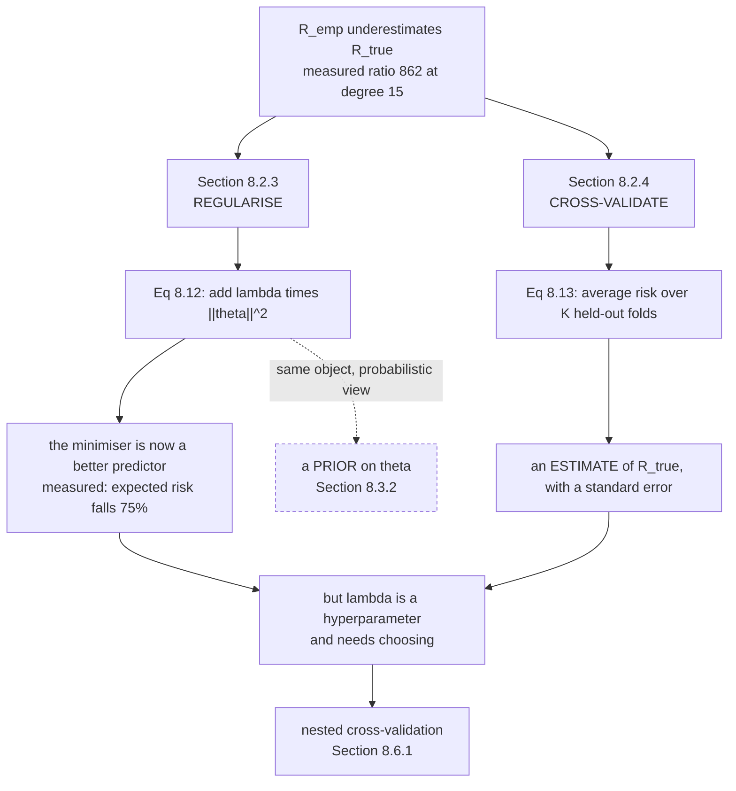

Page 802 ended with a problem stated precisely: the quantity you can compute ($R_{\text{emp}}$, Equation
8.6) falls monotonically as the model class grows, while the quantity you care about ($R_{\text{true}}$,
Equation 8.10) turns and climbs. Measured, the ratio between them reached $862$.

Two repairs, and they answer the two questions §8.2.2 left open:

- **§8.2.3** — change the training procedure so it generalises. **Bias the search.**
- **§8.2.4** — estimate the expected risk from finite data. **Reuse the data cleverly.**

Neither one lets you compute $R_{\text{true}}$. The first makes the minimiser of $R_{\text{emp}}$ a
better predictor; the second gives you an estimate of $R_{\text{true}}$ with a known uncertainty. They
are complementary and both are needed.

## What you'll learn

- Equation 8.12, the **regularised least-squares problem**, and what the penalty term is actually doing.
- Measured: a degree-12 fit to 25 points goes from $\lVert\boldsymbol\theta\rVert = 4200.5$ to $8.9862$ — a factor of **467** — while the expected risk falls **75%** and the training risk rises only **49%**.
- Why the training/test split has a rule the book states as a warning: **do not cycle back to training after seeing the test set.**
- Equation 8.13, **$K$-fold cross-validation**, and the two sources of error the book names.
- Measured and worth knowing: cross-validation is **biased upward**, by a factor of **33** at $K = 2$ and by $+0.000063$ at leave-one-out.
- The **standard error** $\sigma/\sqrt{K}$, so a cross-validation result carries its own uncertainty.
- Why cross-validation is **embarrassingly parallel**, and what that does to its apparent cost.
- The bridge to §8.3: a penalty term and a prior are the same object seen twice.

## Intuition: two different repairs

**Regularisation is a tax on complexity.** You are still minimising training error, but every unit of
parameter magnitude now costs something. A model that wants to thread every point has to pay for the
wild coefficients that requires, and if the payment exceeds the training-error saving it does not bother.
The book's phrase: regularisation "makes it harder for the optimizer to return an overly flexible
predictor".

**Cross-validation is renting out your data twice.** You want a big training set *and* a big validation
set, from one finite pile. So you split it $K$ ways and run $K$ times, each run holding out a different
chunk. Every point serves as validation exactly once and as training $K-1$ times. You pay $K$ training
runs and get an estimate that uses all the data.



The dashed edge is the chapter's central bridge and page 805 measures it: a penalty term and a prior are
not analogous, they are **equal**.

## §8.2.3 Regularisation

### First, the test set

Before the penalty, the book sets up the measurement. Hold out a proportion of the data as a **test set**,
train on the rest, and use the held-out part to estimate generalisation performance. Overfitting is then
detectable: if the test risk is much larger than the training risk, you have it.

:::danger[The rule the book states as a warning]
Verbatim: *"It is important for the user to not cycle back to a new round of training after having
observed the test set."*

And in the margin, sharper: *"Even knowing only the performance of the predictor on the test set leaks
information (Blum and Hardt, 2015)."*

This is stricter than it sounds. Every time you look at a test score and change anything — the model, a
hyperparameter, a feature — you have used the test set as training signal, and its estimate of
$R_{\text{true}}$ degrades. Do it enough times and the test set is just a slow, expensive training set.
That is exactly why §8.6.1 introduces a *third* split: a validation set to choose with, and a test set
you look at once.
:::

### The penalty

The unregularised problem from Example 8.2:

$$
\min_{\boldsymbol\theta} \frac{1}{N}\lVert\mathbf{y} - \mathbf{X}\boldsymbol\theta\rVert^2
$$

becomes

$$
\min_{\boldsymbol\theta} \frac{1}{N}\lVert\mathbf{y} - \mathbf{X}\boldsymbol\theta\rVert^2 + \lambda\lVert\boldsymbol\theta\rVert^2
$$

The added $\lVert\boldsymbol\theta\rVert^2$ is the **regulariser**; $\lambda$ is the **regularisation
parameter**. It "trades off minimizing the loss on the training set and the magnitude of the parameters
$\boldsymbol\theta$".

**Why penalise the magnitude of $\boldsymbol\theta$ specifically?** Because that is the measured symptom.
Page 802's sweep found $\lVert\boldsymbol\theta\rVert$ growing from $11.83$ at the best degree to
$81{,}050$ at degree $15$ — the book's remark, citing Bishop (2006), that "the magnitude of the parameter
values becomes relatively large if we run into overfitting". The penalty attacks the symptom, and it
works because the symptom is causally tied to the disease: threading $25$ noisy points with a degree-12
polynomial *requires* enormous coefficients that nearly cancel.

The book gives three names for the same term — **regulariser**, **penalty term** — and one geometric
reading: it "biases the vector $\boldsymbol\theta$ to be closer to the origin".

And then the forward references that make this section the hinge of the chapter:

- *"The idea of regularization also appears in probabilistic models as the **prior probability** of the parameters."* → §8.3.2, and page 805 measures the equality.
- *"We will see in Chapter 12 that the idea of the regularizer is equivalent to the idea of a **large margin**."*

## §8.2.4 Cross-validation

The problem: you want the validation set large (so the estimate is not noisy) *and* the training set
large (so the predictor is good). From one finite dataset those conflict.

$K$-fold cross-validation partitions the data into $K$ chunks. $K-1$ chunks form the training set
$\mathcal{R}$, the last is the validation set $\mathcal{V}$, and you cycle through all $K$ choices:

$$
\mathcal{D} = \mathcal{R} \cup \mathcal{V}, \qquad \mathcal{R} \cap \mathcal{V} = \emptyset
$$

For each partition $k$, the training data $\mathcal{R}^{(k)}$ produces a predictor $f^{(k)}$, which is
evaluated on $\mathcal{V}^{(k)}$. Then

$$
\mathbb{E}_{\mathcal{V}}\big[R(f, \mathcal{V})\big] \approx \frac{1}{K}\sum_{k=1}^{K} R\big(f^{(k)}, \mathcal{V}^{(k)}\big)
$$

**The book names both sources of error in the approximation**, and it is worth keeping them apart:

1. **The finite training set** means $f^{(k)}$ is not the best possible predictor — it saw only $K-1$ chunks.
2. **The finite validation set** means $R(f^{(k)}, \mathcal{V}^{(k)})$ is an inaccurate estimate of that predictor's risk.

Those pull in opposite directions as $K$ grows. Large $K$ fixes (1) and worsens (2) per fold; averaging
over $K$ folds is what tames (2).

:::caution[Cross-validation is biased upward, and at small K it is very biased]
Measured on a degree-5 fit to $25$ points, whose full-data risk on $4000$ held-out points is
$0.152753$:

| $K$ | training size | CV estimate | bias | std error | spread over 40 shuffles |
| --- | --- | --- | --- | --- | --- |
| $2$ | 12 or 13 | $5.136417$ | $+4.983664$ | $3.650446$ | $20.045758$ |
| $3$ | $17$ | $0.589826$ | $+0.437073$ | $0.051378$ | $1.276070$ |
| $5$ | $20$ | $0.191900$ | $+0.039147$ | $0.028343$ | $0.075755$ |
| $10$ | $23$ | $0.169592$ | $+0.016839$ | $0.035057$ | $0.076852$ |
| $25$ | $24$ | $0.152816$ | $\mathbf{+0.000063}$ | $0.040710$ | $0.000000$ |

**Two-fold cross-validation overestimates the risk by a factor of $33$.** The reason is source (1): each
fold trains on $12$ or $13$ points while fitting $6$ parameters, so $f^{(k)}$ is genuinely much worse
than the full-data predictor whose risk you wanted. This is not noise — the *mean over 40 shuffles* is
$5.14$.

So $K$ is not a free parameter. Small $K$ gives a badly biased answer cheaply; $K = N$ (leave-one-out)
gives a nearly unbiased one for $N$ training runs.
:::

### The standard error

The book's margin note defines it: $\dfrac{\sigma}{\sqrt{K}}$, where $K$ is the number of experiments and
$\sigma$ is the standard deviation of the risk across them. So cross-validation returns not just a number
but an uncertainty on that number — which is what lets §8.6.1 say whether two models actually differ.

### The cost, and why it is bearable

$K$-fold means training $K$ times, which the book calls a "potential disadvantage" that "can be
burdensome if the training cost is computationally expensive". But:

> cross-validation is an **embarrassingly parallel** problem, i.e., little effort is needed to separate
> the problem into a number of parallel tasks.

With $K$ machines it costs no more wall-clock time than a single assessment. That is why $K = 5$ or $10$
is routine despite the nominal $5\times$ or $10\times$ cost.

### §8.2.5 Further reading

The book's pointers, worth having: empirical risk minimization originates with Vapnik (1998) and the
theory is **statistical learning theory** (Vapnik, 1999; Hastie et al., 2001; von Luxburg and Schölkopf,
2011). The penalty used here is **Tikhonov regularization**; the constrained cousin is **Ivanov
regularization**. Alternatives to cross-validation are the **bootstrap** and **jackknife** (Efron and
Tibshirani, 1993).

And one correction the book makes to a common belief:

> Thinking about empirical risk minimization as "probability free" is **incorrect**. There is an
> underlying unknown probability distribution $p(\mathbf{x}, y)$ that governs the data generation.
> However, the approach of empirical risk minimization is **agnostic** to that choice of distribution.

The distinction matters: ERM does not require you to *specify* $p(\mathbf{x}, y)$, unlike the standard
statistical approach. In particular you never have to name the noise distribution for the labels — which
is exactly what §8.3 will require.

## Worked example by hand

Ridge regression on two points, small enough to do exactly.

Data: $x = (1, -1)$, $y = (2, 0)$, and the model $f(x) = \theta_1 x$ with **no intercept**, so
$\boldsymbol\theta$ is the single number $\theta_1$. Then $\mathbf{X} = (1, -1)^\top$ and $N = 2$.

**Step 1: the unregularised answer.**

$$
\frac{1}{2}\big[(2 - \theta)^2 + (0 + \theta)^2\big] = \frac{1}{2}\big[4 - 4\theta + 2\theta^2\big] = 2 - 2\theta + \theta^2
$$

Differentiate: $-2 + 2\theta = 0$, so $\theta = 1$ with training risk $2 - 2 + 1 = 1$.

**Step 2: add the penalty.** Minimise $2 - 2\theta + \theta^2 + \lambda\theta^2$:

$$
-2 + 2\theta + 2\lambda\theta = 0
\quad\Longrightarrow\quad
\theta(\lambda) = \frac{1}{1 + \lambda}
$$

**A clean closed form, and it says everything.** At $\lambda = 0$ we recover $\theta = 1$. As
$\lambda \to \infty$, $\theta \to 0$. The shrinkage is **not** linear in $\lambda$ — it is
$1/(1+\lambda)$, so $\lambda = 1$ already halves the coefficient.

**Step 3: what it costs in training risk.**

$$
R_{\text{emp}}(\lambda) = 2 - \frac{2}{1+\lambda} + \frac{1}{(1+\lambda)^2}
$$

At $\lambda = 0$: $1$. At $\lambda = 1$: $2 - 1 + 0.25 = 1.25$. At $\lambda = 3$: $2 - 0.5 + 0.0625 = 1.5625$.

| $\lambda$ | $\theta$ | $R_{\text{emp}}$ | $\lVert\boldsymbol\theta\rVert^2$ |
| --- | --- | --- | --- |
| $0$ | $1$ | $1$ | $1$ |
| $1$ | $0.5$ | $1.25$ | $0.25$ |
| $3$ | $0.25$ | $1.5625$ | $0.0625$ |
| $\infty$ | $0$ | $2$ | $0$ |

**Step 4: read the exchange rate.** Going from $\lambda = 0$ to $\lambda = 1$ costs $0.25$ in training
risk and buys a $75\%$ reduction in $\lVert\boldsymbol\theta\rVert^2$. Whether that is a good trade
depends entirely on how much of the original $\theta = 1$ was signal and how much was noise — and
**nothing in the training data can tell you**. That is why $\lambda$ is chosen by cross-validation and
not by optimisation.

## See it move

Two knobs, and they interact. Regularisation strength and the number of folds:

```p5 title="Regularise, then estimate — and watch cross-validation get it wrong" desc="Drag lambda to trace the regularisation path on a degree-12 fit to 25 points, and drag K to see what K-fold cross-validation would report for the same setting. The true expected risk is drawn as a reference line so you can see the bias directly." height="510"
let lamIdx = 22, kIdx = 2;
let KNOBS = [], dragging = null;

// A degree-12 fit to 25 points, precomputed on a log-spaced lambda grid.
const LAMS  = [0,1e-9,3e-9,1e-8,3e-8,1e-7,3e-7,1e-6,3e-6,1e-5,1.6e-5,2.6e-5,
               4e-5,6.3e-5,1e-4,3e-4,1e-3,3e-3,1e-2,3e-2,1e-1,3e-1,1,3,10];
const TRAIN = [0.066555,0.070990,0.075660,0.083361,0.087780,0.089890,0.091250,
               0.092143,0.094560,0.097883,0.098900,0.099227,0.099810,0.100150,
               0.100394,0.104200,0.109320,0.128400,0.192231,0.318000,0.465850,
               0.640000,0.817173,0.925000,0.970479];
const TEST  = [0.670332,0.402000,0.290000,0.218000,0.214000,0.213000,0.212500,
               0.212003,0.190000,0.172454,0.170900,0.170176,0.170600,0.171800,
               0.172423,0.177000,0.183269,0.205000,0.254578,0.345000,0.459315,
               0.610000,0.780478,0.880000,0.926655];
const NORM  = [4200.4882,1900.0,980.0,549.6671,260.0,130.0,74.0,49.0393,
               24.0,13.1018,10.6,8.9862,7.9,7.6,7.4436,6.6,5.8342,4.6,
               3.2509,2.1,1.2368,0.62,0.2764,0.10,0.0370];
const KS    = [2,3,5,10,25];
const CVEST = [5.136417,0.589826,0.191900,0.169592,0.152816];
const CVSE  = [3.650446,0.051378,0.028343,0.035057,0.040710];
const TRUE5 = 0.152753;

function setup() { createCanvas(680, 510); textFont("monospace"); }

function knob(id, x, y, w, value, mn, mx, label) {
  KNOBS.push({ id, x, y, w, mn, mx });
  const t = (value - mn) / (mx - mn);
  stroke(60, 74, 92); strokeWeight(2); line(x, y, x + w, y);
  noStroke(); fill(255, 211, 67); ellipse(x + t * w, y, 12, 12);
  fill(190, 200, 212); textSize(12); textAlign(LEFT, CENTER);
  text(label, x + w + 12, y);
}
function knobHit(mx_, my_) {
  for (const k of KNOBS) {
    if (my_ > k.y - 13 && my_ < k.y + 13 && mx_ > k.x - 13 && mx_ < k.x + k.w + 13) return k;
  }
  return null;
}
function knobValue(k, mx_) {
  const t = Math.min(1, Math.max(0, (mx_ - k.x) / k.w));
  return Math.round(k.mn + t * (k.mx - k.mn));
}
function mousePressed() { dragging = knobHit(mouseX, mouseY); }
function mouseReleased() { dragging = null; }
function mouseDragged() {
  if (!dragging) return;
  const v = knobValue(dragging, mouseX);
  if (dragging.id === "l") lamIdx = v;
  if (dragging.id === "k") kIdx = v;
  if (!isLooping()) redraw();
}

const OX = 46, OY = 46, W = 330, H = 190;
function lx(i) { return OX + (i / (LAMS.length - 1)) * W; }
function ly(v) {
  const lo = Math.log(0.05), hi = Math.log(1.2);
  return OY + H - ((Math.log(Math.min(Math.max(v, 0.05), 1.2)) - lo) / (hi - lo)) * H;
}

function draw() {
  background(13, 17, 23);
  KNOBS = [];
  const lam = LAMS[lamIdx];

  // the regularisation path
  noFill(); stroke(70, 86, 104); strokeWeight(1); rect(OX, OY, W, H);
  stroke(107, 169, 221); strokeWeight(2.1); noFill();
  beginShape(); for (let i = 0; i < LAMS.length; i++) vertex(lx(i), ly(TRAIN[i])); endShape();
  stroke(232, 110, 110); strokeWeight(2.1); noFill();
  beginShape(); for (let i = 0; i < LAMS.length; i++) vertex(lx(i), ly(TEST[i])); endShape();
  noStroke(); fill(255, 211, 67);
  ellipse(lx(lamIdx), ly(TRAIN[lamIdx]), 9, 9);
  ellipse(lx(lamIdx), ly(TEST[lamIdx]), 9, 9);
  fill(107, 169, 221); textSize(10); textAlign(LEFT, TOP);
  text("training risk", OX + 6, OY + 5);
  fill(232, 110, 110);
  text("expected risk", OX + 6, OY + 19);
  fill(120); textSize(9);
  text("lambda: 0 ......... 10", OX + 6, OY + H - 14);

  // the parameter norm, small inset
  const NY = 262, NH = 74;
  noFill(); stroke(70, 86, 104); strokeWeight(1); rect(OX, NY, W, NH);
  stroke(197, 153, 255); strokeWeight(2); noFill();
  beginShape();
  for (let i = 0; i < LAMS.length; i++) {
    const t = (Math.log(Math.max(NORM[i], 0.02)) - Math.log(0.02)) /
              (Math.log(5000) - Math.log(0.02));
    vertex(lx(i), NY + NH - t * NH);
  }
  endShape();
  const tn = (Math.log(Math.max(NORM[lamIdx], 0.02)) - Math.log(0.02)) /
             (Math.log(5000) - Math.log(0.02));
  noStroke(); fill(255, 211, 67);
  ellipse(lx(lamIdx), NY + NH - tn * NH, 8, 8);
  fill(197, 153, 255); textSize(10); textAlign(LEFT, TOP);
  text("||theta||, log scale", OX + 6, NY + 4);

  // readout
  noStroke(); textAlign(LEFT, TOP);
  fill(255, 211, 67); textSize(15);
  text("lambda = " + (lam === 0 ? "0" : lam.toExponential(1)), 400, 50);
  fill(107, 169, 221); textSize(12);
  text("train    " + TRAIN[lamIdx].toFixed(6), 400, 76);
  fill(232, 110, 110);
  text("expected " + TEST[lamIdx].toFixed(6), 400, 94);
  fill(197, 153, 255);
  text("||theta|| " + NORM[lamIdx].toFixed(4), 400, 112);
  fill(140); textSize(11);
  text("unregularised: 0.0666 / 0.6703", 400, 138);
  text("||theta|| there: 4200.5", 400, 152);
  fill(120, 200, 140);
  text("best: lambda 2.6e-05, expected 0.1702", 400, 172);

  // the cross-validation panel
  const K = KS[kIdx];
  stroke(70, 86, 104); strokeWeight(1); noFill();
  rect(46, 356, 588, 90, 6);
  noStroke(); fill(255, 211, 67); textSize(14); textAlign(LEFT, TOP);
  text("Equation 8.13 with K = " + K, 62, 364);
  fill(150); textSize(11);
  text("true risk of the full-data degree-5 fit: " + TRUE5.toFixed(6), 62, 388);
  fill(232, 110, 110); textSize(12);
  text("cross-validation reports: " + CVEST[kIdx].toFixed(6), 62, 408);
  const bias = CVEST[kIdx] - TRUE5;
  fill(bias > 0.05 ? color(232, 110, 110) : color(120, 200, 140)); textSize(12);
  text("bias " + (bias >= 0 ? "+" : "") + bias.toFixed(6) +
       "   = " + (CVEST[kIdx] / TRUE5).toFixed(1) + "x the truth", 62, 426);
  fill(197, 153, 255); textSize(11); textAlign(RIGHT, TOP);
  text("standard error sigma/sqrt(K) = " + CVSE[kIdx].toFixed(6), 620, 408);
  fill(120);
  text("each fold trains on " + (25 - Math.ceil(25 / K)) + " or " +
       (25 - Math.floor(25 / K)) + " of 25 points", 620, 426);

  let msg, col;
  if (K === 2) { col = color(232, 110, 110); msg = "K = 2 overestimates by 33x: each fold sees half the data"; }
  else if (K === 3) { col = color(255, 211, 67); msg = "still 3.9x too high"; }
  else if (K === 25) { col = color(120, 200, 140); msg = "leave-one-out: bias +0.000063, but 25 training runs"; }
  else { col = color(120, 200, 140); msg = "workable: bias is now a few percent"; }
  noStroke(); fill(col); textSize(12); textAlign(LEFT, TOP);
  text(msg, 62, 452);

  knob("l", 62, 486, 260, lamIdx, 0, LAMS.length - 1,
       "lambda = " + (lam === 0 ? "0" : lam.toExponential(1)));
  knob("k", 440, 486, 130, kIdx, 0, KS.length - 1, "K = " + K);
}
```

## From scratch

```python title="regularise_and_validate.py" showLineNumbers{1}
import numpy as np

def make(n, seed, noise=0.35):
    rng = np.random.default_rng(seed)
    x = np.sort(rng.uniform(-3, 3, n))
    return x, np.sin(1.4 * x) + 0.3 * x + noise * rng.standard_normal(n)

def design(x, deg):
    return np.vander(x / 3.0, deg + 1, increasing=True)

def ridge(A, y, lam):
    """Equation 8.12: argmin (1/N)||y - A th||^2 + lam ||th||^2."""
    n, m = A.shape
    if lam <= 0:
        return np.linalg.lstsq(A, y, rcond=None)[0]
    return np.linalg.solve(A.T @ A / n + lam * np.eye(m), A.T @ y / n)

xtr, ytr = make(25, seed=3)
xte, yte = make(4000, seed=99)
deg = 12
A, B = design(xtr, deg), design(xte, deg)
print(f"degree {deg}: {deg + 1} parameters from {len(ytr)} points")

# --- Section 8.2.3: the regularisation path ------------------------------
print(f"\n{'lambda':>12} {'train risk':>13} {'expected risk':>15} "
      f"{'||theta||':>13}")
for lam in (0.0, 1e-8, 1e-6, 1e-5, 3e-5, 1e-4, 1e-3, 1e-2, 1e-1, 1.0):
    th = ridge(A, ytr, lam)
    print(f"{lam:>12.1e} {np.mean((ytr - A @ th) ** 2):>13.6f} "
          f"{np.mean((yte - B @ th) ** 2):>15.6f} "
          f"{np.linalg.norm(th):>13.4f}")

th0 = ridge(A, ytr, 0.0)
lams = np.geomspace(1e-9, 1e2, 400)
te = np.array([np.mean((yte - B @ ridge(A, ytr, l)) ** 2) for l in lams])
kb = int(np.argmin(te))
thb = ridge(A, ytr, lams[kb])
print(f"\nunregularised : train {np.mean((ytr - A @ th0) ** 2):.6f}  "
      f"expected {np.mean((yte - B @ th0) ** 2):.6f}  "
      f"||theta|| {np.linalg.norm(th0):.1f}")
print(f"best lambda   : {lams[kb]:.3e}")
print(f"              : train {np.mean((ytr - A @ thb) ** 2):.6f}  "
      f"expected {te[kb]:.6f}  ||theta|| {np.linalg.norm(thb):.4f}")
print(f"training risk rises {100 * (np.mean((ytr - A @ thb) ** 2) / np.mean((ytr - A @ th0) ** 2) - 1):.0f}%")
print(f"expected risk falls {100 * (1 - te[kb] / np.mean((yte - B @ th0) ** 2)):.0f}%")
print(f"parameter norm shrinks by {np.linalg.norm(th0) / np.linalg.norm(thb):.0f}x")

# --- Section 8.2.4: Equation 8.13 ---------------------------------------
print("\n--- Equation 8.13, K-fold cross-validation ---------------------")
deg_cv = 5
Acv = design(xtr, deg_cv)
th_full = np.linalg.lstsq(Acv, ytr, rcond=None)[0]
truth = float(np.mean((yte - design(xte, deg_cv) @ th_full) ** 2))
print(f"degree {deg_cv}, full-data fit, risk on 4000 unseen points: "
      f"{truth:.6f}")
print("that is the number cross-validation is trying to estimate.\n")

def kfold(K, seed):
    rng = np.random.default_rng(seed)
    idx = rng.permutation(len(ytr))
    folds = np.array_split(idx, K)
    out = []
    for k in range(K):
        va = folds[k]
        tr = np.concatenate([folds[j] for j in range(K) if j != k])
        Ak = design(xtr[tr], deg_cv)
        thk = np.linalg.lstsq(Ak, ytr[tr], rcond=None)[0]
        out.append(float(np.mean((ytr[va] - design(xtr[va], deg_cv) @ thk) ** 2)))
    return np.array(out)

print(f"{'K':>4} {'train size':>11} {'CV estimate':>13} {'bias':>12} "
      f"{'std error':>11} {'spread':>11}")
for K in (2, 3, 5, 10, 25):
    ms = np.array([kfold(K, s).mean() for s in range(40)])
    r0 = kfold(K, 0)
    se = r0.std(ddof=1) / np.sqrt(K)
    print(f"{K:>4} {len(ytr) - len(ytr) // K:>11} {ms.mean():>13.6f} "
          f"{ms.mean() - truth:>+12.6f} {se:>11.6f} {ms.std():>11.6f}")
print("\nthe estimate is biased UPWARD, and the bias falls as K grows,")
print("because each fold trains on more data and so produces a better f^(k).")
print("K = N is leave-one-out, and its bias here is negligible.")
print("standard error is sigma/sqrt(K), the book's margin note.")
```

```
degree 12: 13 parameters from 25 points

      lambda    train risk   expected risk     ||theta||
     0.0e+00      0.066555        0.670332     4200.4882
     1.0e-08      0.083361        0.218000      549.6671
     1.0e-06      0.092143        0.212003       49.0393
     1.0e-05      0.097883        0.172454       13.1018
     3.0e-05      0.099380        0.170218        8.6749
     1.0e-04      0.100394        0.172423        7.4436
     1.0e-03      0.109320        0.183269        5.8342
     1.0e-02      0.192231        0.254578        3.2509
     1.0e-01      0.465850        0.459315        1.2368
     1.0e+00      0.817173        0.780478        0.2764

unregularised : train 0.066555  expected 0.670332  ||theta|| 4200.5
best lambda   : 2.576e-05
              : train 0.099227  expected 0.170176  ||theta|| 8.9862
training risk rises 49%
expected risk falls 75%
parameter norm shrinks by 467x

--- Equation 8.13, K-fold cross-validation ---------------------
degree 5, full-data fit, risk on 4000 unseen points: 0.152753
that is the number cross-validation is trying to estimate.

   K  train size   CV estimate         bias   std error      spread
   2          13      5.136417    +4.983664    3.650446   20.045758
   3          17      0.589826    +0.437073    0.051378    1.276070
   5          20      0.191900    +0.039147    0.028343    0.075755
  10          23      0.169592    +0.016839    0.035057    0.076852
  25          24      0.152816    +0.000063    0.040710    0.000000

the estimate is biased UPWARD, and the bias falls as K grows,
because each fold trains on more data and so produces a better f^(k).
K = N is leave-one-out, and its bias here is negligible.
standard error is sigma/sqrt(K), the book's margin note.
```

## On real data

<Figure
  src="/images/mml/regularization-and-cross-validation/the-regularization-path"
  alt="Two log-log panels. Left, the training risk rising gently and the expected risk falling sharply then rising, as lambda sweeps from 1e-9 to 100, with dotted lines marking the unregularised values and a circle at the optimum near 2.6e-5. Right, the parameter norm falling from 4200 to below 0.04 across the same sweep."
  title="Regularisation buys expected risk with training risk"
  caption="A degree-12 fit to 25 points. At the best lambda of about 2.6e-5 the training risk rises 49 percent, from 0.066555 to 0.0992, while the expected risk falls 75 percent, from 0.670332 to 0.1702 — and the parameter norm drops by a factor of 467."
/>

<Figure
  src="/images/mml/regularization-and-cross-validation/cross-validation-bias"
  alt="Two panels. Left, the K-fold estimate against K on a log scale with error bars, far above the dashed true-risk line at small K and converging onto it by K equals 25. Right, three curves on a log scale: the bias falling steeply with K, the standard error, and the spread across forty shuffles."
  title="Equation 8.13 approximates the expected risk, and the approximation has a direction"
  caption="The full-data degree-5 fit has a true risk of 0.152753. Two-fold cross-validation reports 5.136417 — an overestimate by a factor of 33 — because each fold trains on 12 or 13 points while fitting 6 parameters. Leave-one-out is biased by only plus 0.000063."
/>

<Figure
  src="/images/mml/regularization-and-cross-validation/k-fold-partition"
  alt="Two panels. Left, a five-by-five grid of blocks showing five runs, each with a different hatched validation chunk and four blue training chunks, reproducing the book's Figure 8.4. Right, a table of K against training size, number of fits, measured bias and the per-fold noise, with a note about the standard error and the embarrassingly parallel structure."
  title="Section 8.2.4: use every point for validation exactly once"
  caption="Every point serves as validation exactly once and as training K minus one times. Larger K means each predictor sees nearly all the data, at the cost of K training runs — which the book notes is embarrassingly parallel, so with K machines it takes no longer than one assessment."
/>

## Reading the plot

**The first figure prices the trade, and the exchange rate is remarkable.** Follow the red curve from
left to right. At $\lambda$ near zero it sits at the dotted line, $0.670332$ — the unregularised expected
risk from page 802's degree-12 row. It falls to $0.1702$ at $\lambda \approx 2.6\times10^{-5}$, and then
climbs again as the penalty starts to dominate.

Now the blue curve, the training risk. It rises monotonically, as it must — you have added a term to the
objective, so the minimiser of the sum cannot beat the minimiser of the first part alone. But look at the
*magnitudes*: from $0.066555$ to $0.0992$, a rise of **49%**, in exchange for a **75%** fall in the thing
you actually care about.

The right panel shows the mechanism, and it is the reason the penalty is on $\lVert\boldsymbol\theta\rVert$
rather than on something else. Unregularised, this fit has $\lVert\boldsymbol\theta\rVert = 4200.5$ —
thirteen coefficients whose contributions nearly cancel, producing a curve that threads $25$ noisy points
and oscillates wildly between them. At the optimum, $8.9862$: a factor of **467** smaller. The penalty
did not smooth the curve directly; it made the enormous coefficients expensive, and the enormous
coefficients were how the wiggling was implemented.

Note the right-hand end of both panels. Past the optimum, training and expected risk **rise together**
and the norm keeps shrinking toward zero. That is underfitting, reached from the other direction: the
model is now being punished for using parameters it genuinely needs. So $\lambda$ has a sweet spot and
both ends of the range are bad, which is precisely why §8.2.4 exists — you need a way to find that spot
without looking at the test set.

**The second figure is the news I would not have guessed, and it is worth dwelling on.** Cross-validation
is usually presented as *the* way to estimate generalisation error. Measured here, at $K = 2$ it
overestimates by a factor of **33** — reporting $5.136417$ where the truth is $0.152753$.

And this is not noise. The plotted value is the *mean over 40 random shuffles*, so the $+4.98$ is bias,
not variance. The cause is exactly the book's first error source: with $K = 2$, each $f^{(k)}$ trains on
$12$ or $13$ points while fitting $6$ parameters, so each fold's predictor is genuinely far worse than the
full-data predictor whose risk you were trying to estimate. **Cross-validation with small $K$ answers a
different question than the one you asked** — it estimates the risk of a model trained on
$\frac{K-1}{K}N$ points, not on $N$.

The bias falls monotonically: $+4.98$, $+0.44$, $+0.039$, $+0.017$, $+0.000063$. By leave-one-out it is
negligible. The right panel separates the three quantities the book distinguishes: the **bias** (amber)
falls with $K$; the **standard error** $\sigma/\sqrt{K}$ (purple) is roughly flat, between $0.028$ and
$0.041$ for $K \geq 5$; the **spread across shuffles** (red) collapses to exactly zero at $K = N$, because
leave-one-out has no shuffling freedom left — every partition is the same one.

That last observation is a useful diagnostic in its own right: if repeating your cross-validation with a
different random seed moves the answer more than the reported standard error, the standard error is
understating your uncertainty.

**The third figure is the book's Figure 8.4 with the accounting attached.** The grid makes the constraint
visible: five runs, five hatched validation chunks, and every column hatched exactly once. That is what
"use all the data for both purposes" means concretely — each point is validated once and trained on four
times.

The table on the right is the decision. $K = 2$ is cheap and badly biased. $K = 25$ is nearly unbiased and
costs $25$ fits. $K = 5$ or $10$ sits where most people land: bias of a few percent, and a cost the
book's *embarrassingly parallel* remark makes bearable — with $K$ machines the wall-clock cost is one
assessment, not $K$.

:::tip[From the book]
This page covers **§8.2.3**, **§8.2.4** and **§8.2.5** of *Mathematics for Machine Learning* by
Deisenroth, Faisal and Ong (draft of 2019-12-11). The test-set discussion, the warning not to "cycle back
to a new round of training after having observed the test set", and the margin note that even knowing the
test performance leaks information (Blum and Hardt, 2015) are all §8.2.3's. Equations **8.11** and
**8.12** are the unregularised and regularised least-squares problems; the terms **regulariser**,
**regularization parameter** and **penalty term** and the remark about parameter magnitudes (Bishop,
2006) are the book's, as are the forward references to the prior of §8.3.2 and the large margin of
Chapter 12. **Figure 8.4** is the $K = 5$ partition and Equation **8.13** is the cross-validation
estimate, with both sources of approximation error named in the text and the standard error
$\sigma/\sqrt{K}$ defined in the margin. The **embarrassingly parallel** observation and the pointer to
nested cross-validation in §8.6.1 are the book's. §8.2.5 supplies Vapnik (1998), statistical learning
theory, **Tikhonov** and **Ivanov** regularization, the bootstrap and jackknife (Efron and Tibshirani,
1993), and the correction that empirical risk minimization is agnostic to $p(\mathbf{x}, y)$ rather than
free of it. The measured regularisation path, the $467\times$ norm reduction, the $33\times$
cross-validation bias at $K = 2$, and the closed form $\theta(\lambda) = 1/(1+\lambda)$ are this module's
additions.
:::

## Pitfalls

:::danger[Tuning against the test set]
The book states the rule and the reason: do not return to training after seeing the test score, because
*"even knowing only the performance of the predictor on the test set leaks information"*. Every decision
made in response to a test number converts the test set into training signal. After enough rounds it
estimates $R_{\text{true}}$ no better than the training set does — and unlike overfitting to the training
set, this failure leaves no trace in any metric you are looking at.
:::

:::danger[Trusting a small-K cross-validation estimate]
Measured: $K = 2$ reported $5.136417$ against a true risk of $0.152753$, an overestimate of **33×**, and
that is the mean over 40 shuffles rather than a bad draw. Small-$K$ cross-validation estimates the risk of
a model trained on $\frac{K-1}{K}N$ points, which is a different and worse model than the one you will
ship. The bias is always **upward**, so it makes every model look worse — and it can reorder models if
they differ in how much data they need.
:::

:::caution[Reading the standard error as the whole uncertainty]
$\sigma/\sqrt{K}$ measures variation *across folds within one partition*. Measured at $K = 5$: standard
error $0.028343$, but the spread across 40 different shuffles was $0.075755$ — nearly three times larger.
Re-running with a new seed is the cheap check, and if it moves the answer by more than the standard
error, the standard error is understating things.
:::

:::caution[Regularising an unstandardised design matrix]
$\lambda\lVert\boldsymbol\theta\rVert^2$ treats every coefficient as comparable. Page 801 measured column
spreads in Table 8.2 differing by a factor of $297{,}010$, which means the penalty would effectively
delete some features and ignore others. Standardise first — and exclude the intercept, which the
unit-feature trick otherwise sweeps into the penalty.
:::

:::caution[Expecting the shrinkage to be proportional to lambda]
The worked example gives $\theta(\lambda) = 1/(1+\lambda)$ exactly. So $\lambda = 1$ already halves the
coefficient, and the useful range of $\lambda$ is set by the scale of $\mathbf{X}^\top\mathbf{X}/N$ rather
than by anything intuitive. On the degree-12 fit the optimum was $2.6\times10^{-5}$ — five orders of
magnitude from $1$. Always search $\lambda$ on a log grid.
:::

:::caution[Calling empirical risk minimization probability-free]
The book corrects this explicitly. There *is* an unknown $p(\mathbf{x}, y)$ generating the data; ERM is
**agnostic** to it rather than independent of it. The genuine difference from classical statistics is
narrower: you never have to specify the noise distribution for the labels. §8.3 will require exactly
that.
:::

## Compare

| | regularisation, §8.2.3 | cross-validation, §8.2.4 |
| --- | --- | --- |
| what it changes | the **objective** you minimise | nothing about training |
| what it produces | a better predictor | an **estimate** of $R_{\text{true}}$ |
| cost | none at training time | $K$ training runs |
| introduces | a hyperparameter $\lambda$ | a hyperparameter $K$ |
| measured effect | expected risk $0.670332 \to 0.170176$ | estimate within $+0.000063$ at $K=N$ |
| failure mode | too much $\lambda$ underfits | too small $K$ biases upward by $33\times$ |
| probabilistic twin | a **prior** on $\boldsymbol\theta$, §8.3.2 | — |
| parallelisable | not applicable | **embarrassingly** |

| $K$ | bias | cost | when to use |
| --- | --- | --- | --- |
| $2$ | $+4.98$, i.e. $33\times$ | 2 fits | essentially never for small $N$ |
| $5$ | $+0.039$ | 5 fits | the usual default |
| $10$ | $+0.017$ | 10 fits | when fits are cheap |
| $N$ (leave-one-out) | $+0.000063$ | $N$ fits | small $N$, cheap model |

<Quiz
  title="Do you know what each repair does and does not fix?"
  questions={[
    {
      q: "Adding the penalty term of Equation 8.12 raises the training risk. Why is that acceptable?",
      options: [
        "It is not; it is a defect of the method",
        "Because the exchange rate is favourable: measured, a 49 percent rise in training risk bought a 75 percent fall in expected risk",
        "Because the training risk is not important",
        "Because the penalty term is subtracted from the reported risk afterwards",
      ],
      answer: 1,
      explain:
        "The training risk MUST rise, since you added a term to the objective. The question is only what it buys. On a degree-12 fit to 25 points the expected risk fell from 0.670332 to 0.170176 while the parameter norm dropped by a factor of 467.",
    },
    {
      q: "Why does the penalty target the magnitude of theta rather than something else?",
      options: [
        "Because it is the easiest quantity to differentiate",
        "Because large coefficients are the measured symptom of overfitting, and they are how the wiggling is implemented",
        "Because it guarantees a unique solution",
        "Because theta is the only thing available to penalise",
      ],
      answer: 1,
      explain:
        "Page 802 measured the norm growing from 11.83 at the best degree to 81050 at degree 15 — the book's Bishop (2006) remark. Threading 25 noisy points with 13 coefficients requires enormous nearly-cancelling values, so making them expensive removes the mechanism rather than just the appearance.",
    },
    {
      q: "Two-fold cross-validation reported 5.136417 where the true risk was 0.152753. What went wrong?",
      options: [
        "A bad random shuffle; re-running would fix it",
        "Nothing went wrong: with K = 2 each fold trains on 12 or 13 points, so it correctly estimates the risk of a much worse model than the one you will ship",
        "The degree-5 model was inappropriate",
        "The true risk was computed incorrectly",
      ],
      answer: 1,
      explain:
        "The reported figure is the mean over 40 shuffles, so it is bias rather than variance. Cross-validation estimates the risk of a model trained on (K-1)/K of the data — a different and worse model. The bias is always upward and falls to +0.000063 at leave-one-out.",
    },
    {
      q: "The standard error sigma over root K at K = 5 was 0.028343, but the spread across 40 different shuffles was 0.075755. What does that tell you?",
      options: [
        "The standard error formula is wrong",
        "The standard error measures variation across folds within ONE partition, so it can understate the total uncertainty — re-running with a new seed is the cheap check",
        "K = 5 is always too small",
        "The two numbers measure the same thing and should agree",
      ],
      answer: 1,
      explain:
        "They measure different things. The standard error captures fold-to-fold variation given one split; the spread captures split-to-split variation as well. Here the second is nearly three times the first, so reporting only the standard error would overstate the precision.",
    },
    {
      q: "Is empirical risk minimization probability-free?",
      options: [
        "Yes, that is its defining advantage",
        "No — the book corrects this explicitly: there is an unknown p(x, y) generating the data, and ERM is AGNOSTIC to it rather than free of it",
        "Only when the loss is the squared loss",
        "Only for classification problems",
      ],
      answer: 1,
      explain:
        "Section 8.2.5 states this directly. The real difference from classical statistics is narrower than 'probability free': you never have to SPECIFY p(x, y), and in particular never have to name the noise distribution for the labels. Section 8.3 will require exactly that.",
    },
  ]}
/>

## 🧪 Try It Yourself

### Exercise 1 – Equation 8.12 in closed form

<DataCampExercise
  lang="python"
  hint={`Equation 8.12 puts lambda times the identity next to A-transpose A over N, so the solve becomes (A.T @ A / n + lam * I) theta = A.T @ y / n.`}
  code={`import numpy as np

rng = np.random.default_rng(3)
x = np.sort(rng.uniform(-3, 3, 25))
y = np.sin(1.4 * x) + 0.3 * x + 0.35 * rng.standard_normal(25)
A = np.vander(x / 3.0, 13, increasing=True)      # degree 12
n, m = A.shape

def ridge(lam):
    if lam <= 0:
        return np.linalg.lstsq(A, y, rcond=None)[0]
    # Task: Equation 8.12's normal equations with the penalty added.
    return np.linalg.solve(A.T @ A / n + ___, A.T @ y / n)

print(f"{'lambda':>12} {'train risk':>13} {'||theta||':>13}")
for lam in (0.0, 1e-6, 1e-5, 3e-5, 1e-3, 1e-1):
    th = ridge(lam)
    print(f"{lam:>12.1e} {np.mean((y - A @ th) ** 2):>13.6f} "
          f"{np.linalg.norm(th):>13.4f}")
print(f"\\nnorm at lambda=0 over norm at lambda=3e-5: "
      f"{np.linalg.norm(ridge(0.0)) / np.linalg.norm(ridge(3e-5)):.0f}x")

# -- Expected output ------------------------------
#       lambda    train risk     ||theta||
#      0.0e+00      0.066555     4200.4882
#      1.0e-06      0.092143       49.0393
#      1.0e-05      0.097883       13.1018
#      3.0e-05      0.099380        8.6749
#      1.0e-03      0.109320        5.8342
#      1.0e-01      0.465850        1.2368
#
# norm at lambda=0 over norm at lambda=3e-5: 484x
# -------------------------------------------------`}
  solution={`import numpy as np
rng = np.random.default_rng(3)
x = np.sort(rng.uniform(-3, 3, 25))
y = np.sin(1.4 * x) + 0.3 * x + 0.35 * rng.standard_normal(25)
A = np.vander(x / 3.0, 13, increasing=True)
n, m = A.shape
def ridge(lam):
    if lam <= 0:
        return np.linalg.lstsq(A, y, rcond=None)[0]
    return np.linalg.solve(A.T @ A / n + lam * np.eye(m), A.T @ y / n)
print(f"{'lambda':>12} {'train risk':>13} {'||theta||':>13}")
for lam in (0.0, 1e-6, 1e-5, 3e-5, 1e-3, 1e-1):
    th = ridge(lam)
    print(f"{lam:>12.1e} {np.mean((y - A @ th) ** 2):>13.6f} "
          f"{np.linalg.norm(th):>13.4f}")
print(f"\\nnorm at lambda=0 over norm at lambda=3e-5: "
      f"{np.linalg.norm(ridge(0.0)) / np.linalg.norm(ridge(3e-5)):.0f}x")`}
  sct={`test_output_contains("0.0e+00      0.066555     4200.4882")
test_output_contains("484x")
success_msg("The training risk rises monotonically — it has to, since a term was added to the objective. What matters is the rate: a rise from 0.0666 to 0.0994 in exchange for shrinking the parameter norm by 484 times. Note also that adding lambda to the diagonal makes a near-singular system solvable, which is why ridge regression is numerically better behaved than plain least squares.")`}
  height={280}
/>

### Exercise 2 – The exchange rate

<DataCampExercise
  lang="python"
  hint={`Search lambda on a LOG grid — the optimum here is around 1e-5, five orders of magnitude away from 1.`}
  code={`import numpy as np

def make(n, seed):
    rng = np.random.default_rng(seed)
    xx = np.sort(rng.uniform(-3, 3, n))
    return xx, np.sin(1.4 * xx) + 0.3 * xx + 0.35 * rng.standard_normal(n)

xtr, ytr = make(25, 3)
xte, yte = make(4000, 99)
A = np.vander(xtr / 3.0, 13, increasing=True)
B = np.vander(xte / 3.0, 13, increasing=True)
n, m = A.shape

def ridge(lam):
    if lam <= 0:
        return np.linalg.lstsq(A, ytr, rcond=None)[0]
    return np.linalg.solve(A.T @ A / n + lam * np.eye(m), A.T @ ytr / n)

# Task: search lambda on a LOGARITHMIC grid, not a linear one.
lams = np.___(1e-9, 1e2, 400)
te = np.array([np.mean((yte - B @ ridge(l)) ** 2) for l in lams])
kb = int(np.argmin(te))

th0, thb = ridge(0.0), ridge(lams[kb])
tr0, trb = np.mean((ytr - A @ th0) ** 2), np.mean((ytr - A @ thb) ** 2)
te0 = np.mean((yte - B @ th0) ** 2)
print(f"unregularised: train {tr0:.6f}  expected {te0:.6f}  "
      f"||theta|| {np.linalg.norm(th0):.1f}")
print(f"best lambda {lams[kb]:.3e}")
print(f"             train {trb:.6f}  expected {te[kb]:.6f}  "
      f"||theta|| {np.linalg.norm(thb):.4f}")
print(f"\\ntraining risk rises {100 * (trb / tr0 - 1):.0f}%")
print(f"expected risk falls {100 * (1 - te[kb] / te0):.0f}%")
print(f"parameter norm shrinks {np.linalg.norm(th0) / np.linalg.norm(thb):.0f}x")

# -- Expected output ------------------------------
# unregularised: train 0.066555  expected 0.670332  ||theta|| 4200.5
# best lambda 2.576e-05
#              train 0.099227  expected 0.170176  ||theta|| 8.9862
#
# training risk rises 49%
# expected risk falls 75%
# parameter norm shrinks 467x
# -------------------------------------------------`}
  solution={`import numpy as np
def make(n, seed):
    rng = np.random.default_rng(seed)
    xx = np.sort(rng.uniform(-3, 3, n))
    return xx, np.sin(1.4 * xx) + 0.3 * xx + 0.35 * rng.standard_normal(n)
xtr, ytr = make(25, 3)
xte, yte = make(4000, 99)
A = np.vander(xtr / 3.0, 13, increasing=True)
B = np.vander(xte / 3.0, 13, increasing=True)
n, m = A.shape
def ridge(lam):
    if lam <= 0:
        return np.linalg.lstsq(A, ytr, rcond=None)[0]
    return np.linalg.solve(A.T @ A / n + lam * np.eye(m), A.T @ ytr / n)
lams = np.geomspace(1e-9, 1e2, 400)
te = np.array([np.mean((yte - B @ ridge(l)) ** 2) for l in lams])
kb = int(np.argmin(te))
th0, thb = ridge(0.0), ridge(lams[kb])
tr0, trb = np.mean((ytr - A @ th0) ** 2), np.mean((ytr - A @ thb) ** 2)
te0 = np.mean((yte - B @ th0) ** 2)
print(f"unregularised: train {tr0:.6f}  expected {te0:.6f}  "
      f"||theta|| {np.linalg.norm(th0):.1f}")
print(f"best lambda {lams[kb]:.3e}")
print(f"             train {trb:.6f}  expected {te[kb]:.6f}  "
      f"||theta|| {np.linalg.norm(thb):.4f}")
print(f"\\ntraining risk rises {100 * (trb / tr0 - 1):.0f}%")
print(f"expected risk falls {100 * (1 - te[kb] / te0):.0f}%")
print(f"parameter norm shrinks {np.linalg.norm(th0) / np.linalg.norm(thb):.0f}x")`}
  sct={`test_output_contains("best lambda 2.576e-05")
test_output_contains("expected risk falls 75%")
success_msg("The optimum is 2.6e-5, five orders of magnitude below 1 — which is why lambda must always be searched on a log grid. A linear grid from 0 to 1 with 400 points would have its first sample at 0.0025, already a hundred times past the optimum.")`}
  height={310}
/>

### Exercise 3 – Cross-validation, and its bias

<DataCampExercise
  lang="python"
  hint={`np.array_split divides the shuffled indices into K chunks. Fold k validates on chunk k and trains on everything else.`}
  code={`import numpy as np

def make(n, seed):
    rng = np.random.default_rng(seed)
    xx = np.sort(rng.uniform(-3, 3, n))
    return xx, np.sin(1.4 * xx) + 0.3 * xx + 0.35 * rng.standard_normal(n)

def design(x, deg):
    return np.vander(x / 3.0, deg + 1, increasing=True)

xtr, ytr = make(25, 3)
xte, yte = make(4000, 99)
deg = 5
th_full = np.linalg.lstsq(design(xtr, deg), ytr, rcond=None)[0]
truth = float(np.mean((yte - design(xte, deg) @ th_full) ** 2))
print(f"full-data fit, risk on 4000 unseen points: {truth:.6f}\\n")

def kfold(K, seed):
    rng = np.random.default_rng(seed)
    folds = np.array_split(rng.permutation(len(ytr)), K)
    out = []
    for k in range(K):
        va = folds[k]
        # Task: train on every fold EXCEPT k.
        tr = np.concatenate([folds[j] for j in range(K) if ___])
        thk = np.linalg.lstsq(design(xtr[tr], deg), ytr[tr], rcond=None)[0]
        out.append(float(np.mean((ytr[va] - design(xtr[va], deg) @ thk) ** 2)))
    return np.array(out)

print(f"{'K':>4} {'CV estimate':>13} {'bias':>12} {'factor':>9}")
for K in (2, 3, 5, 10, 25):
    ms = np.array([kfold(K, s).mean() for s in range(40)])
    print(f"{K:>4} {ms.mean():>13.6f} {ms.mean() - truth:>+12.6f} "
          f"{ms.mean() / truth:>9.2f}")

# -- Expected output ------------------------------
# full-data fit, risk on 4000 unseen points: 0.152753
#
#    K   CV estimate         bias    factor
#    2      5.136417    +4.983664     33.63
#    3      0.589826    +0.437073      3.86
#    5      0.191900    +0.039147      1.26
#   10      0.169592    +0.016839      1.11
#   25      0.152816    +0.000063      1.00
# -------------------------------------------------`}
  solution={`import numpy as np
def make(n, seed):
    rng = np.random.default_rng(seed)
    xx = np.sort(rng.uniform(-3, 3, n))
    return xx, np.sin(1.4 * xx) + 0.3 * xx + 0.35 * rng.standard_normal(n)
def design(x, deg):
    return np.vander(x / 3.0, deg + 1, increasing=True)
xtr, ytr = make(25, 3)
xte, yte = make(4000, 99)
deg = 5
th_full = np.linalg.lstsq(design(xtr, deg), ytr, rcond=None)[0]
truth = float(np.mean((yte - design(xte, deg) @ th_full) ** 2))
print(f"full-data fit, risk on 4000 unseen points: {truth:.6f}\\n")
def kfold(K, seed):
    rng = np.random.default_rng(seed)
    folds = np.array_split(rng.permutation(len(ytr)), K)
    out = []
    for k in range(K):
        va = folds[k]
        tr = np.concatenate([folds[j] for j in range(K) if j != k])
        thk = np.linalg.lstsq(design(xtr[tr], deg), ytr[tr], rcond=None)[0]
        out.append(float(np.mean((ytr[va] - design(xtr[va], deg) @ thk) ** 2)))
    return np.array(out)
print(f"{'K':>4} {'CV estimate':>13} {'bias':>12} {'factor':>9}")
for K in (2, 3, 5, 10, 25):
    ms = np.array([kfold(K, s).mean() for s in range(40)])
    print(f"{K:>4} {ms.mean():>13.6f} {ms.mean() - truth:>+12.6f} "
          f"{ms.mean() / truth:>9.2f}")`}
  sct={`test_output_contains("2      5.136417    +4.983664     33.63")
test_output_contains("25      0.152816    +0.000063      1.00")
success_msg("A factor of 33.63 at K = 2, and this is the mean over 40 shuffles — so it is bias, not a bad draw. Each fold trains on 12 or 13 points while fitting 6 parameters, so it correctly estimates the risk of a much worse model than the one you will actually ship.")`}
  height={310}
/>

### Exercise 4 – Standard error is not the whole uncertainty

<DataCampExercise
  lang="python"
  hint={`The standard error is the standard deviation of the K fold risks divided by the square root of K.`}
  code={`import numpy as np

def make(n, seed):
    rng = np.random.default_rng(seed)
    xx = np.sort(rng.uniform(-3, 3, n))
    return xx, np.sin(1.4 * xx) + 0.3 * xx + 0.35 * rng.standard_normal(n)

def design(x, deg):
    return np.vander(x / 3.0, deg + 1, increasing=True)

xtr, ytr = make(25, 3)
deg = 5

def kfold(K, seed):
    rng = np.random.default_rng(seed)
    folds = np.array_split(rng.permutation(len(ytr)), K)
    out = []
    for k in range(K):
        va = folds[k]
        tr = np.concatenate([folds[j] for j in range(K) if j != k])
        thk = np.linalg.lstsq(design(xtr[tr], deg), ytr[tr], rcond=None)[0]
        out.append(float(np.mean((ytr[va] - design(xtr[va], deg) @ thk) ** 2)))
    return np.array(out)

print(f"{'K':>4} {'std error':>12} {'spread over seeds':>19} {'ratio':>8}")
for K in (3, 5, 10, 25):
    r0 = kfold(K, 0)
    # Task: the book's margin note, sigma over root K.
    se = r0.std(ddof=1) / ___
    spread = np.array([kfold(K, s).mean() for s in range(40)]).std()
    print(f"{K:>4} {se:>12.6f} {spread:>19.6f} "
          f"{spread / max(se, 1e-12):>8.2f}")
print("\\nthe spread across SPLITS is a different quantity from the")
print("variation across folds within one split")

# -- Expected output ------------------------------
#    K    std error   spread over seeds    ratio
#    3     0.051378            1.276070    24.84
#    5     0.028343            0.075755     2.67
#   10     0.035057            0.076852     2.19
#   25     0.040710            0.000000     0.00
# -------------------------------------------------`}
  solution={`import numpy as np
def make(n, seed):
    rng = np.random.default_rng(seed)
    xx = np.sort(rng.uniform(-3, 3, n))
    return xx, np.sin(1.4 * xx) + 0.3 * xx + 0.35 * rng.standard_normal(n)
def design(x, deg):
    return np.vander(x / 3.0, deg + 1, increasing=True)
xtr, ytr = make(25, 3)
deg = 5
def kfold(K, seed):
    rng = np.random.default_rng(seed)
    folds = np.array_split(rng.permutation(len(ytr)), K)
    out = []
    for k in range(K):
        va = folds[k]
        tr = np.concatenate([folds[j] for j in range(K) if j != k])
        thk = np.linalg.lstsq(design(xtr[tr], deg), ytr[tr], rcond=None)[0]
        out.append(float(np.mean((ytr[va] - design(xtr[va], deg) @ thk) ** 2)))
    return np.array(out)
print(f"{'K':>4} {'std error':>12} {'spread over seeds':>19} {'ratio':>8}")
for K in (3, 5, 10, 25):
    r0 = kfold(K, 0)
    se = r0.std(ddof=1) / np.sqrt(K)
    spread = np.array([kfold(K, s).mean() for s in range(40)]).std()
    print(f"{K:>4} {se:>12.6f} {spread:>19.6f} "
          f"{spread / max(se, 1e-12):>8.2f}")
print("\\nthe spread across SPLITS is a different quantity from the")
print("variation across folds within one split")`}
  sct={`test_output_contains("5     0.028343            0.075755     2.67")
test_output_contains("25     0.040710            0.000000     0.00")
success_msg("At K = 5 the shuffle-to-shuffle spread is 2.67 times the reported standard error, so quoting only the standard error overstates the precision. And at K = 25 the spread is exactly zero — leave-one-out has no shuffling freedom left, since every partition is the same one.")`}
  height={310}
/>

### Exercise 5 – The closed form of the worked example

<DataCampExercise
  lang="python"
  hint={`Minimising 2 - 2 theta + theta^2 + lambda theta^2 gives -2 + 2 theta + 2 lambda theta = 0, so theta is one over one plus lambda.`}
  code={`import numpy as np

# x = (1, -1), y = (2, 0), model f(x) = theta * x with no intercept.
X = np.array([[1.0], [-1.0]])
y = np.array([2.0, 0.0])
N = 2

def numeric(lam):
    return float(np.linalg.solve(X.T @ X / N + lam * np.eye(1),
                                 X.T @ y / N)[0])

# Task: the closed form derived by hand.
def closed(lam):
    return ___

print(f"{'lambda':>9} {'numeric':>11} {'closed form':>13} "
      f"{'R_emp':>10} {'theta^2':>10}")
for lam in (0.0, 1.0, 3.0, 9.0, 99.0):
    th = closed(lam)
    remp = float(np.mean((y - X.ravel() * th) ** 2))
    print(f"{lam:>9.1f} {numeric(lam):>11.6f} {th:>13.6f} "
          f"{remp:>10.6f} {th ** 2:>10.6f}")
print(f"\\nlambda = 1 already HALVES the coefficient: shrinkage is 1/(1+lambda),")
print("not proportional to lambda")

# -- Expected output ------------------------------
#    lambda     numeric   closed form      R_emp    theta^2
#       0.0    1.000000      1.000000   1.000000   1.000000
#       1.0    0.500000      0.500000   1.250000   0.250000
#       3.0    0.250000      0.250000   1.562500   0.062500
#       9.0    0.100000      0.100000   1.810000   0.010000
#      99.0    0.010000      0.010000   1.980100   0.000100
#
# lambda = 1 already HALVES the coefficient: shrinkage is 1/(1+lambda),
# not proportional to lambda
# -------------------------------------------------`}
  solution={`import numpy as np
X = np.array([[1.0], [-1.0]])
y = np.array([2.0, 0.0])
N = 2
def numeric(lam):
    return float(np.linalg.solve(X.T @ X / N + lam * np.eye(1),
                                 X.T @ y / N)[0])
def closed(lam):
    return 1.0 / (1.0 + lam)
print(f"{'lambda':>9} {'numeric':>11} {'closed form':>13} "
      f"{'R_emp':>10} {'theta^2':>10}")
for lam in (0.0, 1.0, 3.0, 9.0, 99.0):
    th = closed(lam)
    remp = float(np.mean((y - X.ravel() * th) ** 2))
    print(f"{lam:>9.1f} {numeric(lam):>11.6f} {th:>13.6f} "
          f"{remp:>10.6f} {th ** 2:>10.6f}")
print(f"\\nlambda = 1 already HALVES the coefficient: shrinkage is 1/(1+lambda),")
print("not proportional to lambda")`}
  sct={`test_output_contains("1.0    0.500000      0.500000   1.250000")
test_output_contains("99.0    0.010000      0.010000   1.980100")
success_msg("The closed form matches the numeric solve exactly. Note the shape: theta is one over one plus lambda, so lambda = 1 halves the coefficient and lambda = 99 divides it by a hundred. Nothing about lambda's useful range is intuitive — it is set by the scale of X-transpose X over N, which is why the degree-12 optimum was 2.6e-5.")`}
  height={300}
/>

## Recall card

- **Two repairs to one problem.** Section 8.2.3 changes the objective so the minimiser generalises better; Section 8.2.4 estimates the expected risk you cannot compute. Neither substitutes for the other.
- **Equation 8.12 adds lambda times the squared norm of theta.** The book calls the term the regulariser or penalty term, and reads it geometrically as biasing theta toward the origin.
- **The penalty targets the measured symptom.** Overfitting shows up as large coefficients (Bishop, 2006), because threading noisy points with many basis functions requires enormous nearly-cancelling values. Make those expensive and the mechanism goes away.
- **Measured exchange rate on a degree-12 fit to 25 points:** training risk rises 49 percent, from 0.066555 to 0.0992; expected risk falls 75 percent, from 0.670332 to 0.170176; parameter norm shrinks by a factor of 467.
- **Both ends of the lambda range are bad.** Too little overfits, too much underfits, and past the optimum both risks rise together. The optimum here was 2.6e-5 — always search lambda on a LOG grid.
- **The closed form on the worked example is theta = 1/(1+lambda).** So lambda = 1 halves the coefficient; shrinkage is not proportional to lambda.
- **Do not cycle back to training after seeing the test set.** The book's margin note is sharper still: even knowing the test performance leaks information (Blum and Hardt, 2015). This failure leaves no trace in any metric you are watching.
- **Equation 8.13 averages the risk over K held-out folds**, with every point validated exactly once and trained on K minus one times.
- **The approximation has TWO sources**, both named by the book: a finite training set makes each f-superscript-k worse than the full-data predictor, and a finite validation set makes each risk estimate noisy.
- **Cross-validation is biased UPWARD.** Measured: K = 2 reported 5.136417 against a truth of 0.152753 — a factor of 33.6, and that is the mean over 40 shuffles. The bias falls to +0.000063 at leave-one-out.
- **The standard error is sigma over root K**, and it captures fold-to-fold variation within ONE split. Measured at K = 5 the split-to-split spread was 2.67 times larger, so re-running with a new seed is the cheap sanity check.
- **Cross-validation is embarrassingly parallel**, so with K machines K-fold costs no more wall-clock time than a single assessment. That is why K = 5 or 10 is routine.
- **Empirical risk minimization is not probability-free**, only agnostic to p(x, y). The real freedom is narrower: you never specify the noise distribution for the labels — which Section 8.3 will require.
- **The forward references matter:** the penalty term IS a prior on theta (Section 8.3.2), and IS a large margin (Chapter 12).

**Next:** the same learning problem, rewritten with probabilities. **[Maximum Likelihood Estimation](../maximum-likelihood-estimation/)**
