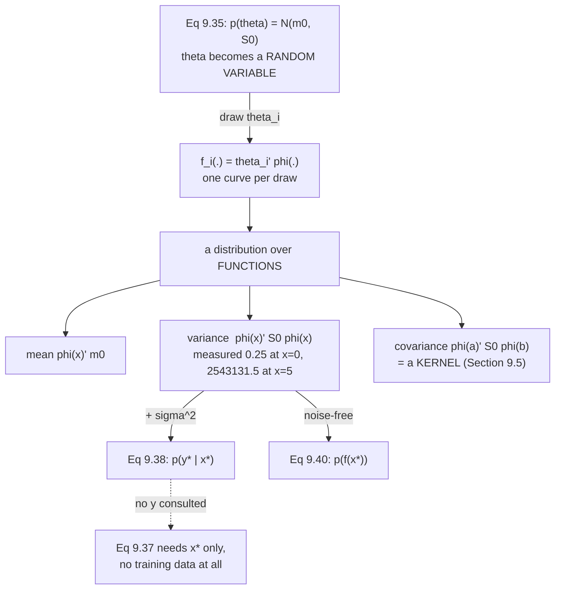

import DataCampExercise from "../../../../components/DataCampExercise.astro";
import Figure from "../../../../components/Figure.astro";
import Quiz from "../../../../components/Quiz.astro";

Page 904 ended where the book does: MAP *"can push the boundaries of overfitting"* but *"is not a general
solution"*, so *"we need a more principled approach."* Measured, MAP improved the best available answer
by $0.4\%$.

§9.3 is that approach. It stops choosing a $\boldsymbol\theta$ at all — and this page covers the half of
it that happens **before any data arrives**.

## What you'll learn

- Equations 9.35–9.36: the model, with $\boldsymbol\theta$ promoted to a random variable and Figure 9.8's graphical model made explicit.
- Equation 9.37: predictions as an **average over all plausible parameters** — Chapter 8's Equation 8.23 in this chapter's notation.
- Equation 9.38's closed form, and Equation 9.39's claim that the two variances **add** — verified by Monte Carlo to $3.4\times10^{-3}$.
- Equation 9.40, which differs from 9.38 by exactly $\sigma^2 = 0.04$, at every input.
- That prior predictions *"only require us to specify the input $x_*$, but no training data"* — literally true.
- **Example 9.7 measured, and it is startling.** With the book's own $p(\boldsymbol\theta) = \mathcal{N}(\mathbf{0}, \tfrac14\mathbf{I})$ and degree-5 monomials, the $95\%$ band is $\mathbf{3125.59}$ units wide at $x = 5$ — on a figure whose $y$-axis runs $-4$ to $4$.
- The remark that $p(\boldsymbol\theta)$ *"induces a distribution over functions"*, and that the induced object is a **covariance function** $\phi(x_a)^\top\mathbf{S}_0\phi(x_b)$ — §9.5's Gaussian process, already present.

## Intuition: you have a prior over functions whether you meant to or not

Put a Gaussian on $\boldsymbol\theta$ and you have not just constrained the coefficients — you have
specified, completely, a probability distribution over **every function your model can express**. Draw a
$\boldsymbol\theta$, get a curve. Draw a thousand, get a cloud of curves with a mean, a width at each
$x$, and a correlation between any two $x$'s.

That is a large commitment made through a small-looking choice, and the size of it is measurable.
$\mathcal{N}(\mathbf{0}, \tfrac14\mathbf{I})$ sounds modest: each coefficient within about $\pm 1$. But
the induced width at an input is $\phi(x)^\top\mathbf{S}_0\phi(x)$, and for monomials that is
$\tfrac14\sum_k x^{2k}$ — which at $x = 5$ is over two and a half million.

**A prior that is isotropic in the coefficients is wildly anisotropic in the functions**, because the
features themselves are not comparable in size. The fix is the same one page 805 reached from the
regularisation side: scale your features before you claim your prior is uninformative.



## §9.3.1 The model

$$
\text{prior } p(\boldsymbol\theta) = \mathcal{N}(\mathbf{m}_0, \mathbf{S}_0), \qquad
\text{likelihood } p(y \mid \mathbf{x}, \boldsymbol\theta) = \mathcal{N}\!\left(y \mid \phi^\top(\mathbf{x})\boldsymbol\theta, \sigma^2\right) \qquad \text{(9.35)}
$$

The book's framing of what changed: placing the Gaussian prior *"turns the parameter vector into a random
variable"*. Figure 9.8 draws it with $\mathbf{m}_0$ and $\mathbf{S}_0$ *"made explicit"* — page 807's
convention, where deterministic quantities lose their circle.

The full probabilistic model is the **joint** (Equation 9.36):

$$
p(y, \boldsymbol\theta \mid \mathbf{x}) = p(y \mid \mathbf{x}, \boldsymbol\theta)\,p(\boldsymbol\theta)
$$

which is page 806's definition of a probabilistic model arriving in this chapter's notation: *a
probabilistic model is specified by the joint distribution of all its random variables.* Two pages ago
$\boldsymbol\theta$ was not one of them.

## §9.3.2 Prior predictions

> In practice, we are usually not so much interested in the parameter values $\boldsymbol\theta$
> themselves. Instead, our focus often lies in the **predictions** we make with those parameter values.

$$
p(y_* \mid \mathbf{x}_*) = \int p(y_* \mid \mathbf{x}_*, \boldsymbol\theta)\,p(\boldsymbol\theta)\,d\boldsymbol\theta = \mathbb{E}_{\boldsymbol\theta}\!\left[p(y_* \mid \mathbf{x}_*, \boldsymbol\theta)\right] \qquad \text{(9.37)}
$$

*"the average prediction of $y_* \mid \mathbf{x}_*, \boldsymbol\theta$ for all plausible parameters
$\boldsymbol\theta$."* This is Chapter 8's Equation 8.23 exactly, and page 806 measured what it buys:
$0.9498$ coverage where a plug-in interval gives $0.1796$.

:::tip[And it needs no data]
> Note that predictions using the prior distribution only require us to specify the input $\mathbf{x}_*$,
> but **no training data**.

Measured at $x_* = 2.0$ with $\mathbf{m}_0 = \mathbf{0}$, $\mathbf{S}_0 = \tfrac14\mathbf{I}$:

| | value |
| --- | --- |
| mean | $0.000000$ |
| variance | $341.290000$ |

No $y$ was consulted, because none exists yet. **This is the model's opinion before the experiment**, and
having one is what makes §9.3.3's update meaningful.
:::

### The closed form

Because the prior is **conjugate**, the predictive is Gaussian too (Equation 9.38):

$$
p(y_* \mid \mathbf{x}_*) = \mathcal{N}\!\left(\phi^\top(\mathbf{x}_*)\mathbf{m}_0,\ \ \phi^\top(\mathbf{x}_*)\mathbf{S}_0\phi(\mathbf{x}_*) + \sigma^2\right)
$$

The book lists exactly three facts that make this work: the prediction is Gaussian *"due to conjugacy
and the marginalization property of Gaussians"*; the noise is independent, so (Equation 9.39)

$$
\mathbb{V}[y_*] = \mathbb{V}_{\boldsymbol\theta}\!\left[\phi^\top(\mathbf{x}_*)\boldsymbol\theta\right] + \mathbb{V}_{\epsilon}[\epsilon]
$$

and $y_*$ is a **linear transformation** of $\boldsymbol\theta$, so Equations 6.50 and 6.51 give the mean
and covariance analytically.

:::tip[Equation 9.39, checked against 400,000 samples]
| $x_*$ | predicted mean | sampled mean | predicted var | sampled var | rel err |
| --- | --- | --- | --- | --- | --- |
| $-3.0$ | $0.000000$ | $-0.072552$ | $16607.540000$ | $16550.899211$ | $3.41\times10^{-3}$ |
| $-1.0$ | $0.000000$ | $-0.002588$ | $1.540000$ | $1.540990$ | $6.43\times10^{-4}$ |
| $0.0$ | $0.000000$ | $-0.001755$ | $0.290000$ | $0.290478$ | $1.65\times10^{-3}$ |
| $1.0$ | $0.000000$ | $-0.000036$ | $1.540000$ | $1.537898$ | $1.36\times10^{-3}$ |
| $2.0$ | $0.000000$ | $0.014802$ | $341.290000$ | $340.068304$ | $3.58\times10^{-3}$ |

The two variances really do just add — and note how fast the parameter term grows: $0.25$ at $x = 0$,
$341.25$ at $x = 2$, $16607.50$ at $x = -3$.
:::

The book adds the noise-free version, Equation 9.40:

$$
p(f(\mathbf{x}_*)) = \mathcal{N}\!\left(\phi^\top(\mathbf{x}_*)\mathbf{m}_0,\ \ \phi^\top(\mathbf{x}_*)\mathbf{S}_0\phi(\mathbf{x}_*)\right)
$$

*"which only differs from (9.38) in the omission of the noise variance."*

:::tip[Measured, that difference is exactly the noise variance]
| $x_*$ | var of $y_*$ (9.38) | var of $f(x_*)$ (9.40) | difference |
| --- | --- | --- | --- |
| $-2.0$ | $341.290000$ | $341.250000$ | $0.04000000$ |
| $0.0$ | $0.290000$ | $0.250000$ | $0.04000000$ |
| $1.0$ | $1.540000$ | $1.500000$ | $0.04000000$ |
| $4.0$ | $279620.290000$ | $279620.250000$ | $0.04000000$ |

At $x = 4$ the parameter uncertainty is seven million times the noise. **Which term dominates is entirely
a question of where you ask.**
:::

### Example 9.7, and what the prior really says

The book's setup: polynomials of degree $5$, $p(\boldsymbol\theta) = \mathcal{N}(\mathbf{0}, \tfrac14\mathbf{I})$,
*"200 input locations $x_* \in [-5, 5]$"*, with Figure 9.9 showing the mean, the $67\%$ and $95\%$ bands
and some samples. The uncertainty *"is solely due to the parameter uncertainty because we considered the
noise-free predictive distribution (9.40)."*

:::danger[The 95% band this prior actually implies]
| $x$ | $\phi^\top\mathbf{S}_0\phi$ | sd | 95% half-width |
| --- | --- | --- | --- |
| $0.0$ | $0.2500$ | $0.5000$ | $0.9800$ |
| $1.0$ | $1.5000$ | $1.2247$ | $2.4005$ |
| $2.0$ | $341.2500$ | $18.4730$ | $36.2063$ |
| $3.0$ | $16607.5000$ | $128.8701$ | $252.5807$ |
| $4.0$ | $279620.2500$ | $528.7913$ | $1036.4119$ |
| $5.0$ | $\mathbf{2543131.5000}$ | $\mathbf{1594.7199}$ | $\mathbf{3125.5935}$ |

Figure 9.9's $y$-axis runs from $-4$ to $4$. **The band fits inside those axes only for
$\lvert x\rvert < 1.1809$** — $48$ of the $200$ plotted input locations.

The *shape* the book draws is correct: narrow in the middle, flaring outward. The *scale* is what the
measurement adds. $\phi^\top\mathbf{S}_0\phi = \tfrac14\sum_{k=0}^{5}x^{2k}$, which grows like $x^{10}$,
so the visible portion of Figure 9.9 is a small central slice of the object it describes.

**The lesson generalises past this figure.** A prior that looks mild on coefficients —
"each within about $\pm 1$" — is enormous on functions when the features have wildly different scales.
$1$ and $x^5$ are not comparable quantities, so treating their coefficients as exchangeable is a strong
and probably unintended claim. Standardise the features first, and $\mathbf{S}_0 = b^2\mathbf{I}$ starts
meaning something closer to what you want.
:::

### A distribution over functions

> Since we can represent the distribution $p(\boldsymbol\theta)$ using a set of samples
> $\boldsymbol\theta_i$ and every sample $\boldsymbol\theta_i$ gives rise to a function
> $f_i(\cdot) = \boldsymbol\theta_i^\top\phi(\cdot)$, it follows that the parameter distribution
> $p(\boldsymbol\theta)$ **induces a distribution $p(f(\cdot))$ over functions.**

:::tip[Sampled against predicted, 200,000 functions]
| $x$ | sampled mean | Eq 9.40 mean | sampled var | Eq 9.40 var | rel err |
| --- | --- | --- | --- | --- | --- |
| $-2.0$ | $-0.048842$ | $0.000000$ | $340.317328$ | $341.250000$ | $2.73\times10^{-3}$ |
| $-0.5$ | $0.001984$ | $0.000000$ | $0.333506$ | $0.333252$ | $7.63\times10^{-4}$ |
| $0.5$ | $0.002306$ | $0.000000$ | $0.332926$ | $0.333252$ | $9.79\times10^{-4}$ |
| $2.0$ | $0.034993$ | $0.000000$ | $339.759130$ | $341.250000$ | $4.37\times10^{-3}$ |

And the induced distribution is **not independent across inputs**:

| pair $(x_a, x_b)$ | sampled covariance | $\phi(x_a)^\top\mathbf{S}_0\phi(x_b)$ |
| --- | --- | --- |
| $(-2.0, -0.5)$ | $1.494432$ | $1.500000$ |
| $(-0.5, 0.5)$ | $0.200556$ | $0.199951$ |
| $(0.5, 2.0)$ | $1.496204$ | $1.500000$ |
| $(-2.0, 2.0)$ | $\mathbf{-203.661585}$ | $\mathbf{-204.750000}$ |

**That last row is negative.** Under this prior, a function that runs high at $x = -2$ tends to run *low*
at $x = +2$ — because odd monomials flip sign. Few people intend that when they write
$\mathcal{N}(\mathbf{0}, \tfrac14\mathbf{I})$.

The function $k(x_a, x_b) = \phi(x_a)^\top\mathbf{S}_0\phi(x_b)$ contains everything the induced
distribution does. **§9.5 names it:** a Gaussian process *"places a distribution directly on the space of
functions without the 'detour' via the parameters"*, and this is the object it places.
:::

:::tip[The 67% and 95% bands are just one and two sigma]
| $x$ | within $1$ sd | within $2$ sd | Gaussian |
| --- | --- | --- | --- |
| $-3.0$ | $0.6831$ | $0.9549$ | $0.6827$ / $0.9545$ |
| $0.0$ | $0.6843$ | $0.9549$ | $0.6827$ / $0.9545$ |
| $1.5$ | $0.6828$ | $0.9547$ | $0.6827$ / $0.9545$ |

Exact, because a **linear map of a Gaussian is Gaussian** — no approximation is being made anywhere in
Equation 9.38.
:::

## Worked example by hand

Derive Equation 9.38 from Chapter 6's two rules, in the one-dimensional case, and read where the width
comes from.

Model: $f(x) = \phi(x)^\top\boldsymbol\theta$ with $\boldsymbol\theta \sim \mathcal{N}(\mathbf{m}_0, \mathbf{S}_0)$,
and $y = f(x) + \epsilon$, $\epsilon \sim \mathcal{N}(0, \sigma^2)$ independent.

**Step 1: $f(x_*)$ is a linear map of $\boldsymbol\theta$.** Write $\mathbf{a} := \phi(x_*)$, so
$f(x_*) = \mathbf{a}^\top\boldsymbol\theta$ — a fixed vector dotted with a Gaussian random vector.

**Step 2: apply Equation 6.50** (the mean of a linear map):

$$
\mathbb{E}[f(x_*)] = \mathbf{a}^\top\mathbb{E}[\boldsymbol\theta] = \mathbf{a}^\top\mathbf{m}_0
$$

**Step 3: apply Equation 6.51** (the covariance of a linear map):

$$
\mathbb{V}[f(x_*)] = \mathbf{a}^\top\mathbb{V}[\boldsymbol\theta]\,\mathbf{a} = \mathbf{a}^\top\mathbf{S}_0\mathbf{a}
$$

which is Equation 9.40 — and it is **quadratic in the features**, which is the whole explanation for the
$3125$-unit band above.

**Step 4: add the noise.** $y_* = f(x_*) + \epsilon$ with $\epsilon$ independent, and independent
variances add:

$$
\mathbb{V}[y_*] = \mathbf{a}^\top\mathbf{S}_0\mathbf{a} + \sigma^2
$$

**Step 5: why the result is Gaussian.** A linear combination of jointly Gaussian variables is Gaussian,
and a sum of independent Gaussians is Gaussian. So the two moments are the whole distribution —
**Equation 9.38 is exact, not an approximation.**

**Step 6: the covariance between two inputs, which the book does not write down.** For
$\mathbf{a} = \phi(x_a)$ and $\mathbf{b} = \phi(x_b)$:

$$
\mathrm{Cov}[f(x_a), f(x_b)] = \mathbb{E}\!\left[\mathbf{a}^\top(\boldsymbol\theta - \mathbf{m}_0)(\boldsymbol\theta - \mathbf{m}_0)^\top\mathbf{b}\right] = \boxed{\ \mathbf{a}^\top\mathbf{S}_0\mathbf{b}\ }
$$

Setting $x_a = x_b$ recovers Step 3. **This single function determines the entire distribution over
functions**, and measured above it matches sampling to within $0.5\%$ — including the negative value at
$(-2, 2)$.

## See it move

```p5 title="A prior over functions" desc="Samples from a Gaussian prior on polynomial coefficients, drawn as curves. Drag the prior width and the degree, and watch the band at the edges grow far faster than the band at the centre — because the features do." height="560"
let bIdx = 8, mIdx = 5, viewIdx = 0;
let KNOBS = [], dragging = null;

const B2 = [];
for (let i = 0; i <= 20; i++) B2.push(Math.pow(10, -2 + i * 0.2));

let Z = [];
function setup() {
  createCanvas(680, 560);
  textFont("monospace");
  randomSeed(11);
  for (let s = 0; s < 40; s++) {
    const row = [];
    for (let k = 0; k < 13; k++) {
      let u = 0;
      for (let t = 0; t < 12; t++) u += random();
      row.push(u - 6);
    }
    Z.push(row);
  }
}

function knob(id, x, y, w, value, mn, mx, label) {
  KNOBS.push({ id, x, y, w, mn, mx });
  const t = (value - mn) / (mx - mn);
  stroke(60, 74, 92); strokeWeight(2); line(x, y, x + w, y);
  noStroke(); fill(255, 211, 67); ellipse(x + t * w, y, 12, 12);
  fill(190, 200, 212); textSize(12); textAlign(LEFT, CENTER);
  text(label, x + w + 12, y);
}
function knobHit(mx_, my_) {
  for (const k of KNOBS) {
    if (my_ > k.y - 13 && my_ < k.y + 13 && mx_ > k.x - 13 && mx_ < k.x + k.w + 13) return k;
  }
  return null;
}
function knobValue(k, mx_) {
  const t = Math.min(1, Math.max(0, (mx_ - k.x) / k.w));
  return Math.round(k.mn + t * (k.mx - k.mn));
}
function mousePressed() { dragging = knobHit(mouseX, mouseY); }
function mouseReleased() { dragging = null; }
function mouseDragged() {
  if (!dragging) return;
  if (dragging.id === "b") bIdx = knobValue(dragging, mouseX);
  else if (dragging.id === "m") mIdx = knobValue(dragging, mouseX);
  else viewIdx = knobValue(dragging, mouseX);
  if (!isLooping()) redraw();
}

function sdAt(x, M, b2) {
  let s = 0, pw = 1;
  for (let k = 0; k <= M; k++) { s += b2 * pw * pw; pw *= x; }
  return Math.sqrt(s);
}

const OX = 46, OY = 66, W = 380, H = 290;

function draw() {
  background(13, 17, 23);
  KNOBS = [];
  const b2 = B2[bIdx], M = mIdx;
  const VIEWS = [4, 20, 200, 5000];
  const YL = VIEWS[viewIdx];

  function px(x) { return OX + ((x + 5) / 10) * W; }
  function py(y) { return OY + H - ((y + YL) / (2 * YL)) * H; }

  noFill(); stroke(70, 86, 104); strokeWeight(1); rect(OX, OY, W, H);
  // the 95% and 67% bands
  noStroke(); fill(107, 169, 221, 46);
  beginShape();
  for (let i = 0; i <= 200; i++) { const xv = -5 + 10 * i / 200; vertex(px(xv), py(1.96 * sdAt(xv, M, b2))); }
  for (let i = 200; i >= 0; i--) { const xv = -5 + 10 * i / 200; vertex(px(xv), py(-1.96 * sdAt(xv, M, b2))); }
  endShape(CLOSE);
  fill(107, 169, 221, 82);
  beginShape();
  for (let i = 0; i <= 200; i++) { const xv = -5 + 10 * i / 200; vertex(px(xv), py(sdAt(xv, M, b2))); }
  for (let i = 200; i >= 0; i--) { const xv = -5 + 10 * i / 200; vertex(px(xv), py(-sdAt(xv, M, b2))); }
  endShape(CLOSE);
  // the mean
  stroke(200); strokeWeight(1.8);
  line(px(-5), py(0), px(5), py(0));
  // samples
  const sb = Math.sqrt(b2);
  for (let s = 0; s < 14; s++) {
    stroke(255, 211, 67, 150); strokeWeight(1.1); noFill();
    beginShape();
    for (let i = 0; i <= 200; i++) {
      const xv = -5 + 10 * i / 200;
      let v = 0, pw = 1;
      for (let k = 0; k <= M; k++) { v += sb * Z[s][k] * pw; pw *= xv; }
      if (v > -YL && v < YL) vertex(px(xv), py(v)); else { endShape(); beginShape(); }
    }
    endShape();
  }
  noStroke(); fill(140); textSize(10); textAlign(CENTER, TOP);
  text("x", OX + W / 2, OY + H + 5);
  fill(107, 169, 221); textAlign(LEFT, TOP); textSize(10);
  text("67% and 95% bands, Eq 9.40", OX + 6, OY + 5);
  fill(255, 211, 67);
  text("14 sampled functions", OX + 6, OY + 19);

  // readouts
  noStroke(); textAlign(LEFT, TOP);
  fill(255, 211, 67); textSize(15);
  text("M = " + M, 442, 70);
  text("S0 = " + b2.toFixed(4) + " I", 442, 92);
  fill(140); textSize(10);
  text("y-axis: +/- " + YL, 442, 116);

  fill(200); textSize(11);
  text("95% half-width", 442, 146);
  fill(107, 169, 221); textSize(10);
  for (const xv of [0, 1, 2, 3, 5]) {
    text("  x = " + xv + ": " + (1.96 * sdAt(xv, M, b2)).toFixed(2),
         442, 162 + xv * 0 + [0, 1, 2, 3, 4][[0, 1, 2, 3, 5].indexOf(xv)] * 14);
  }
  const ratio = sdAt(5, M, b2) / sdAt(0, M, b2);
  fill(197, 153, 255); textSize(11);
  text("width at x=5 over", 442, 240);
  text("width at x=0:", 442, 254);
  textSize(13);
  text("  " + ratio.toExponential(3), 442, 270);

  // how much fits on screen
  let inside = 0;
  for (let i = 0; i < 200; i++) {
    const xv = -5 + 10 * i / 199;
    if (1.96 * sdAt(xv, M, b2) <= YL) inside++;
  }
  fill(120, 200, 140); textSize(10);
  text("band fits the axes at", 442, 300);
  text(inside + " of 200 inputs", 442, 314);

  let msg, sub, col;
  if (ratio > 100) {
    col = color(232, 110, 110);
    msg = "the prior is not remotely isotropic over functions";
    sub = "The band at x = 5 is " + ratio.toExponential(1) + " times the band at x = 0, because 1 and x^" + M + " are not comparable quantities.";
  } else if (M <= 1) {
    col = color(120, 200, 140);
    msg = "with M = " + M + " the features are comparable in size";
    sub = "The band grows gently. This is what people usually think an isotropic prior on theta means.";
  } else {
    col = color(255, 211, 67);
    msg = "the flare is already visible";
    sub = "Ratio " + ratio.toFixed(1) + ". Every extra degree multiplies the edge variance by x^2 at the edge.";
  }
  stroke(col); strokeWeight(1.6); fill(red(col), green(col), blue(col), 26);
  rect(46, 386, 596, 0);
  noStroke(); fill(col); textSize(15); textAlign(LEFT, TOP);
  text(msg, 46, 384);
  fill(215); textSize(10.5);
  text(sub, 46, 406);

  fill(120); textSize(10);
  text("Set M = 5 and S0 = 0.25 I to get Example 9.7 exactly, then set the", 46, 438);
  text("y-axis to +/- 4 to see the book's Figure 9.9 -- and how little of", 46, 452);
  text("the distribution fits inside it.", 46, 466);

  knob("b", 62, 500, 200, bIdx, 0, B2.length - 1, "S0 = " + b2.toFixed(3) + " I");
  knob("m", 62, 528, 200, mIdx, 0, 12, "M = " + M);
  knob("v", 430, 528, 130, viewIdx, 0, 3, "y-axis +/- " + YL);
}
```

## From scratch

```python title="prior_predictions.py" showLineNumbers{1}
import numpy as np

SIG = 0.2

def design(x, M):
    return np.vander(np.asarray(x, float), M + 1, increasing=True)

# Example 9.7: polynomials of degree 5, prior N(0, (1/4) I)
M = 5
K = M + 1
m0 = np.zeros(K)
S0 = 0.25 * np.eye(K)

# --- Equation 9.38's variance, by Monte Carlo ---------------------------
print("=== 1. Equation 9.38's variance, by Monte Carlo ===")
rng = np.random.default_rng(7)
T = 400_000
TH = rng.multivariate_normal(m0, S0, size=T)
print(f"{'x*':>6} {'predicted mean':>16} {'sampled mean':>14} "
      f"{'predicted var':>15} {'sampled var':>13} {'rel err':>10}")
for xs in (-3.0, -1.0, 0.0, 1.0, 2.0):
    ph = design([xs], M)[0]
    pred_v = float(ph @ S0 @ ph + SIG ** 2)
    ys = TH @ ph + SIG * rng.standard_normal(T)
    print(f"{xs:>6.1f} {float(ph @ m0):>16.6f} {ys.mean():>14.6f} "
          f"{pred_v:>15.6f} {ys.var():>13.6f} "
          f"{abs(ys.var()-pred_v)/pred_v:>10.2e}")
print("Equation 9.39: the parameter term and the noise term simply add.")

# --- Equation 9.40 differs by exactly sigma^2 ---------------------------
print("\n=== 2. Equation 9.40 differs from 9.38 by exactly sigma^2 ===")
print(f"{'x*':>6} {'var of y* (9.38)':>18} {'var of f(x*) (9.40)':>21} "
      f"{'difference':>12}")
for xs in (-2.0, 0.0, 1.0, 4.0):
    ph = design([xs], M)[0]
    a = float(ph @ S0 @ ph + SIG ** 2)
    b = float(ph @ S0 @ ph)
    print(f"{xs:>6.1f} {a:>18.6f} {b:>21.6f} {a-b:>12.8f}")
print(f"sigma^2 = {SIG**2:.8f}")

# --- prior predictions need no data -------------------------------------
print("\n=== 3. prior predictions need no training data at all ===")
ph = design([2.0], M)[0]
print(f"at x* = 2.0, using ONLY x* and the prior:")
print(f"  mean {float(ph @ m0):.6f}   variance "
      f"{float(ph @ S0 @ ph + SIG**2):.6f}")
print("no y was consulted.")

# --- the prior over FUNCTIONS it actually implies ------------------------
print("\n=== 4. the prior over FUNCTIONS it actually implies ===")
print(f"{'x':>6} {'phi^T S0 phi':>16} {'sd':>14} {'95% half-width':>16}")
z = 1.959963984540054
for xs in (0.0, 1.0, 2.0, 3.0, 4.0, 5.0):
    ph = design([xs], M)[0]
    v = float(ph @ S0 @ ph)
    print(f"{xs:>6.1f} {v:>16.4f} {np.sqrt(v):>14.4f} {z*np.sqrt(v):>16.4f}")
xg = np.linspace(-5, 5, 200)
Pg = design(xg, M)
sd = np.sqrt(np.einsum("ij,jk,ik->i", Pg, S0, Pg))
inside = np.abs(z * sd) <= 4.0
print(f"\nfraction of the 200 plotted inputs where the 95% band fits inside")
print(f"the book's y-range of [-4, 4]: {inside.mean():.3f} "
      f"({int(inside.sum())} of 200)")
print(f"the band is inside the axes only for |x| < "
      f"{np.abs(xg[inside]).max():.4f}")

# --- p(theta) induces p(f(.)) -------------------------------------------
print("\n=== 5. p(theta) induces p(f(.)) -- sampled ===")
r2 = np.random.default_rng(11)
S = 200_000
TH2 = r2.multivariate_normal(m0, S0, size=S)
xs_check = np.array([-2.0, -0.5, 0.5, 2.0])
Pc = design(xs_check, M)
F = TH2 @ Pc.T
print(f"{'x':>6} {'sampled mean':>14} {'Eq 9.40 mean':>14} "
      f"{'sampled var':>14} {'Eq 9.40 var':>14} {'rel err':>10}")
for i, xs in enumerate(xs_check):
    pv = float(Pc[i] @ S0 @ Pc[i])
    print(f"{xs:>6.1f} {F[:, i].mean():>14.6f} {float(Pc[i] @ m0):>14.6f} "
          f"{F[:, i].var():>14.6f} {pv:>14.6f} "
          f"{abs(F[:, i].var()-pv)/pv:>10.2e}")

print("\nthe induced distribution is not independent across x:")
print(f"{'pair':>14} {'sampled cov':>14} {'phi(a)^T S0 phi(b)':>20}")
for a, b in ((-2.0, -0.5), (-0.5, 0.5), (0.5, 2.0), (-2.0, 2.0)):
    pa, pb = design([a], M)[0], design([b], M)[0]
    ia = int(np.where(xs_check == a)[0][0])
    ib = int(np.where(xs_check == b)[0][0])
    cov = float(np.cov(F[:, ia], F[:, ib])[0, 1])
    print(f"{f'({a}, {b})':>14} {cov:>14.6f} {float(pa @ S0 @ pb):>20.6f}")
print("that covariance function is what a Gaussian process places directly,")
print("without the detour via theta.")

# --- the 67% and 95% bands ----------------------------------------------
print("\n=== 6. the 67% and 95% bands, checked against samples ===")
r3 = np.random.default_rng(23)
TH3 = r3.multivariate_normal(m0, S0, size=200_000)
print(f"{'x':>6} {'within 1 sd':>13} {'within 2 sd':>13} {'Gaussian':>10}")
for xs in (-3.0, 0.0, 1.5):
    ph = design([xs], M)[0]
    f = TH3 @ ph
    s = np.sqrt(float(ph @ S0 @ ph))
    print(f"{xs:>6.1f} {np.mean(np.abs(f) <= s):>13.4f} "
          f"{np.mean(np.abs(f) <= 2*s):>13.4f} {'0.6827 / 0.9545':>10}")
print("exact, because a linear map of a Gaussian is Gaussian.")
```

```
=== 1. Equation 9.38's variance, by Monte Carlo ===
    x*   predicted mean   sampled mean   predicted var   sampled var    rel err
  -3.0         0.000000      -0.072552    16607.540000  16550.899211   3.41e-03
  -1.0         0.000000      -0.002588        1.540000      1.540990   6.43e-04
   0.0         0.000000      -0.001755        0.290000      0.290478   1.65e-03
   1.0         0.000000      -0.000036        1.540000      1.537898   1.36e-03
   2.0         0.000000       0.014802      341.290000    340.068304   3.58e-03
Equation 9.39: the parameter term and the noise term simply add.

=== 2. Equation 9.40 differs from 9.38 by exactly sigma^2 ===
    x*   var of y* (9.38)   var of f(x*) (9.40)   difference
  -2.0         341.290000            341.250000   0.04000000
   0.0           0.290000              0.250000   0.04000000
   1.0           1.540000              1.500000   0.04000000
   4.0      279620.290000         279620.250000   0.04000000
sigma^2 = 0.04000000

=== 3. prior predictions need no training data at all ===
at x* = 2.0, using ONLY x* and the prior:
  mean 0.000000   variance 341.290000
no y was consulted.

=== 4. the prior over FUNCTIONS it actually implies ===
     x     phi^T S0 phi             sd   95% half-width
   0.0           0.2500         0.5000           0.9800
   1.0           1.5000         1.2247           2.4005
   2.0         341.2500        18.4730          36.2063
   3.0       16607.5000       128.8701         252.5807
   4.0      279620.2500       528.7913        1036.4119
   5.0     2543131.5000      1594.7199        3125.5935

fraction of the 200 plotted inputs where the 95% band fits inside
the book's y-range of [-4, 4]: 0.240 (48 of 200)
the band is inside the axes only for |x| < 1.1809

=== 5. p(theta) induces p(f(.)) -- sampled ===
     x   sampled mean   Eq 9.40 mean    sampled var    Eq 9.40 var    rel err
  -2.0      -0.048842       0.000000     340.317328     341.250000   2.73e-03
  -0.5       0.001984       0.000000       0.333506       0.333252   7.63e-04
   0.5       0.002306       0.000000       0.332926       0.333252   9.79e-04
   2.0       0.034993       0.000000     339.759130     341.250000   4.37e-03

the induced distribution is not independent across x:
          pair    sampled cov   phi(a)^T S0 phi(b)
  (-2.0, -0.5)       1.494432             1.500000
   (-0.5, 0.5)       0.200556             0.199951
    (0.5, 2.0)       1.496204             1.500000
   (-2.0, 2.0)    -203.661585          -204.750000
that covariance function is what a Gaussian process places directly,
without the detour via theta.

=== 6. the 67% and 95% bands, checked against samples ===
     x   within 1 sd   within 2 sd   Gaussian
  -3.0        0.6831        0.9549 0.6827 / 0.9545
   0.0        0.6843        0.9549 0.6827 / 0.9545
   1.5        0.6828        0.9547 0.6827 / 0.9545
exact, because a linear map of a Gaussian is Gaussian.
```

## On real data

<Figure
  src="/images/mml/bayesian-linear-regression/the-prior-over-functions"
  alt="Three panels. Left, a shaded band and sampled curves on axes running minus four to four, with the band leaving the frame almost immediately. Middle, the same prior autoscaled, with the book's y-range shown as a thin red stripe near zero. Right, six monomial magnitudes on a log scale fanning out steeply."
  title="The parameter prior induces a prior over functions, far wider than the figure can show"
  caption="With the book's own prior and degree-5 monomials, the 95 percent band is 3125.59 units wide at x = 5. It fits inside a y-range of minus four to four only for x below 1.1809 in magnitude — 48 of the 200 plotted input locations."
/>

<Figure
  src="/images/mml/bayesian-linear-regression/the-variance-just-adds"
  alt="Left, a stacked area chart on a log scale with a flat amber noise strip and a blue parameter-uncertainty region that explodes away from the centre. Right, paired bars at five inputs comparing the closed-form variance to a Monte Carlo estimate, indistinguishable at each."
  title="The predictive variance is parameter uncertainty plus noise, and the two simply add"
  caption="Equation 9.39 verified against 400,000 samples, agreeing to within 3.6e-3 everywhere. The noise floor is flat at 0.04 while the parameter term runs from 0.25 at x = 0 to 16607.50 at x = -3."
/>

<Figure
  src="/images/mml/bayesian-linear-regression/a-kernel-in-disguise"
  alt="Left, a red and blue heatmap of the covariance between function values at pairs of inputs, positive along the diagonal and negative in the off-diagonal corners. Right, paired bars comparing predicted and sampled covariances at four pairs of inputs, the last pair strongly negative."
  title="The parameter prior is a covariance function over inputs, written in a roundabout way"
  caption="Matched against 200,000 sampled functions to within half a percent, including the negative covariance of minus 204.75 between x equals minus two and plus two. This is the object a Gaussian process places directly, without the detour through theta."
/>

## Reading the plot

**The first figure takes Example 9.7 at its word and finds the figure cannot contain it.** The left panel
draws the mean, the $67\%$ and $95\%$ bands and twelve samples on the book's own axes, $-4$ to $4$ in
both directions. The band leaves the frame almost immediately — measured, it fits for
$\lvert x\rvert < 1.1809$, which is $48$ of the $200$ input locations the book says it used.

The middle panel autoscales, and the book's entire $y$-range becomes a thin stripe near zero.

**The right panel explains it in one line.** $\phi^\top\mathbf{S}_0\phi = \tfrac14\sum_{k=0}^{5}x^{2k}$,
and the monomials $1, x, \ldots, x^5$ span four orders of magnitude by $x = 5$. So the variance grows like
$x^{10}$: $0.25$ at the origin, $2{,}543{,}131.5$ at the edge.

**The point is not that the figure is wrong** — its *shape* is right, and it is drawn to show the shape.
The point is what the shape costs to state precisely. **An isotropic prior on coefficients is a strong,
strange prior on functions whenever the features differ in scale**, and $1$ against $x^5$ differ by a
lot. Standardise the features and $\mathbf{S}_0 = b^2\mathbf{I}$ starts to mean roughly what people
expect it to.

**The second figure verifies Equation 9.39 and then shows why it matters where you ask.** Left, the
predictive variance stacked into its two contributions: the noise floor is flat at $\sigma^2 = 0.04$,
and the parameter term climbs from $0.25$ at the centre to five orders of magnitude larger at the edges of
a modest window. Right, the closed form against $400{,}000$ samples — agreeing to $3.6\times10^{-3}$ at
worst.

**The two terms are doing completely different jobs.** $\sigma^2$ is a property of the measuring
instrument and never shrinks. $\phi^\top\mathbf{S}_0\phi$ is a statement about what you believe, and
§9.3.3 is about to replace $\mathbf{S}_0$ with something the data has informed. That is the whole
difference between this page and the next: **only the blue region responds to evidence.**

Equation 9.40 is the same picture with the amber strip removed, and measured, the removal is exactly
$0.04$ at every input — at $x = 4$, where the total is $279620.29$, the noise is a seven-millionth of it.

**The third figure names something the chapter has been using without naming.** The heatmap is
$k(x_a, x_b) = \phi(x_a)^\top\mathbf{S}_0\phi(x_b)$, the covariance between the function's values at two
inputs. Red along the diagonal — a function value is correlated with itself. And **blue in the
off-diagonal corners**: measured, $\mathrm{Cov}[f(-2), f(2)] = -204.75$, confirmed by sampling at
$-203.66$.

That negative sign is worth pausing on. Under
$p(\boldsymbol\theta) = \mathcal{N}(\mathbf{0}, \tfrac14\mathbf{I})$, believing the function is high at
$x = -2$ makes you believe it is *low* at $x = +2$, because the odd monomials dominate and they change
sign. **Nobody writing down an isotropic prior intends to assert that**, and it is invisible in the
parameter-space statement.

**Everything the induced distribution does is in that one function**, which is exactly §9.5's point:

> Instead of placing a distribution over parameters, a Gaussian process places a distribution directly on
> the space of functions without the "detour" via the parameters.

You have been specifying a kernel this whole time, in a coordinate system that made it hard to see.

## Compare

| | Eq 9.38, $p(y_* \mid x_*)$ | Eq 9.40, $p(f(x_*))$ |
| --- | --- | --- |
| what it predicts | a noisy **observation** | the **function value** |
| mean | $\phi^\top\mathbf{m}_0$ | $\phi^\top\mathbf{m}_0$, identical |
| variance | $\phi^\top\mathbf{S}_0\phi + \sigma^2$ | $\phi^\top\mathbf{S}_0\phi$ |
| measured difference | — | exactly $0.04$ everywhere |
| used in Figure 9.9 | no | **yes** |

| | this page (prior) | page 906 (posterior) | Eq 9.6 (plug-in) |
| --- | --- | --- | --- |
| needs training data | **no** | yes | yes |
| distribution over $\boldsymbol\theta$ | $\mathcal{N}(\mathbf{m}_0, \mathbf{S}_0)$ | $\mathcal{N}(\mathbf{m}_N, \mathbf{S}_N)$ | a point |
| predictive variance | $\phi^\top\mathbf{S}_0\phi + \sigma^2$ | $\phi^\top\mathbf{S}_N\phi + \sigma^2$ | $\sigma^2$ only |
| varies with $x_*$ | **yes** | yes | **no** |
| coverage, measured (Ch 8) | — | $0.9498$ | $0.1796$ |

| parameter space | function space |
| --- | --- |
| $\mathbf{m}_0$ | the mean function $\phi(x)^\top\mathbf{m}_0$ |
| $\mathbf{S}_0$ | the covariance function $\phi(x_a)^\top\mathbf{S}_0\phi(x_b)$ |
| $K$ numbers and a $K\times K$ matrix | a function of two inputs |
| "coefficients near zero" | measured: sd $0.5$ at $x=0$, $1594.72$ at $x=5$ |
| isotropic | **not** isotropic, unless the features are comparable |

<Quiz
  title="What does a prior on theta actually say?"
  questions={[
    {
      q: "Equation 9.37 predicts at a new input. What does it need?",
      options: [
        "The training inputs and targets",
        "Only the test input x-star — no training data at all",
        "The maximum likelihood estimate",
        "A held-out validation set",
      ],
      answer: 1,
      explain:
        "It integrates over p(theta), not p(theta given the data). Measured at x-star = 2.0 the answer is mean 0.000000 and variance 341.290000, with no y consulted anywhere. This is the model's opinion before the experiment, and having one is what makes Section 9.3.3's update meaningful.",
    },
    {
      q: "Equation 9.39 says the predictive variance splits in two. Verified against 400,000 samples, how well does it hold?",
      options: [
        "Only approximately, with errors around 10 percent",
        "To within 3.6e-3 relative error at worst — the two terms simply add",
        "It fails at large x",
        "It holds only when the mean is zero",
      ],
      answer: 1,
      explain:
        "Three facts make it exact: the prediction is Gaussian by conjugacy, the noise is independent of theta, and y-star is a LINEAR transformation of theta so Equations 6.50 and 6.51 apply. Equation 9.38 is exact, not an approximation.",
    },
    {
      q: "With the book's prior N(0, I/4) and degree-5 monomials, how wide is the 95 percent band at x = 5?",
      options: [
        "About 2 units, comfortably inside the figure",
        "3125.59 units — on a figure whose y-axis runs from minus four to four",
        "Exactly 4 units",
        "It is infinite",
      ],
      answer: 1,
      explain:
        "Because phi-transpose S-zero phi is one quarter of the sum of x to the 2k, which grows like x to the tenth. The band fits inside the book's axes only for x below 1.1809 in magnitude — 48 of the 200 plotted inputs. The shape the figure draws is right; the scale is what the measurement adds.",
    },
    {
      q: "What is the practical lesson from that measurement?",
      options: [
        "Never use polynomial features",
        "An isotropic prior on coefficients is not isotropic over functions when the features differ in scale — standardise first",
        "The prior variance should always be smaller",
        "Bayesian methods do not work for polynomials",
      ],
      answer: 1,
      explain:
        "One and x to the fifth are not comparable quantities, so treating their coefficients as exchangeable is a strong and probably unintended claim. Standardise the features and S-zero equal to b squared times the identity starts meaning something closer to what you want.",
    },
    {
      q: "Measured on 200,000 sampled functions, what is the covariance between f(-2) and f(2) under this prior?",
      options: [
        "Zero — function values at different inputs are independent",
        "Minus 203.66, matching the predicted minus 204.75 — they are ANTI-correlated",
        "Plus 341.25",
        "It cannot be computed",
      ],
      answer: 1,
      explain:
        "Odd monomials flip sign with x, so believing the function is high at minus two makes you believe it is low at plus two. Few people intend that when they write an isotropic Gaussian prior, and it is invisible in the parameter-space statement.",
    },
    {
      q: "The book notes that p(theta) induces a distribution over functions. What single object captures all of it?",
      options: [
        "The mean vector m-zero",
        "The covariance function phi(x_a)-transpose S-zero phi(x_b), together with the mean function",
        "The number of features K",
        "The noise variance sigma squared",
      ],
      answer: 1,
      explain:
        "That function is a kernel, and Section 9.5's pointer to Gaussian processes is precisely the observation that you could have specified it directly, 'without the detour via the parameters'. You have been choosing a kernel all along, in a coordinate system that made it hard to see.",
    },
  ]}
/>

## 🧪 Try It Yourself

### Exercise 1 – The variance just adds

<DataCampExercise
  lang="python"
  hint={`Equation 9.38's variance sandwiches the prior covariance between two copies of the feature vector, then adds the noise.`}
  code={`import numpy as np

SIG = 0.2
def design(x, M):
    return np.vander(np.asarray(x, float), M + 1, increasing=True)

M = 5
K = M + 1
m0 = np.zeros(K)
S0 = 0.25 * np.eye(K)

rng = np.random.default_rng(7)
T = 400_000
TH = rng.multivariate_normal(m0, S0, size=T)
print(f"{'x*':>6} {'predicted mean':>16} {'sampled mean':>14} "
      f"{'predicted var':>15} {'sampled var':>13} {'rel err':>10}")
for xs in (-3.0, -1.0, 0.0, 1.0, 2.0):
    ph = design([xs], M)[0]
    # Task: Equation 9.38's predictive variance.
    pred_v = float(___)
    ys = TH @ ph + SIG * rng.standard_normal(T)
    print(f"{xs:>6.1f} {float(ph @ m0):>16.6f} {ys.mean():>14.6f} "
          f"{pred_v:>15.6f} {ys.var():>13.6f} "
          f"{abs(ys.var()-pred_v)/pred_v:>10.2e}")

# -- Expected output ------------------------------
#     x*   predicted mean   sampled mean   predicted var   sampled var    rel err
#   -3.0         0.000000      -0.072552    16607.540000  16550.899211   3.41e-03
#   -1.0         0.000000      -0.002588        1.540000      1.540990   6.43e-04
#    0.0         0.000000      -0.001755        0.290000      0.290478   1.65e-03
#    1.0         0.000000      -0.000036        1.540000      1.537898   1.36e-03
#    2.0         0.000000       0.014802      341.290000    340.068304   3.58e-03
# -------------------------------------------------`}
  solution={`import numpy as np
SIG = 0.2
def design(x, M):
    return np.vander(np.asarray(x, float), M + 1, increasing=True)
M = 5
K = M + 1
m0 = np.zeros(K)
S0 = 0.25 * np.eye(K)
rng = np.random.default_rng(7)
T = 400_000
TH = rng.multivariate_normal(m0, S0, size=T)
print(f"{'x*':>6} {'predicted mean':>16} {'sampled mean':>14} "
      f"{'predicted var':>15} {'sampled var':>13} {'rel err':>10}")
for xs in (-3.0, -1.0, 0.0, 1.0, 2.0):
    ph = design([xs], M)[0]
    pred_v = float(ph @ S0 @ ph + SIG ** 2)
    ys = TH @ ph + SIG * rng.standard_normal(T)
    print(f"{xs:>6.1f} {float(ph @ m0):>16.6f} {ys.mean():>14.6f} "
          f"{pred_v:>15.6f} {ys.var():>13.6f} "
          f"{abs(ys.var()-pred_v)/pred_v:>10.2e}")`}
  sct={`test_output_contains("-3.0         0.000000      -0.072552    16607.540000  16550.899211   3.41e-03")
test_output_contains("0.0         0.000000      -0.001755        0.290000      0.290478   1.65e-03")
success_msg("The closed form and the sampling agree to under four parts in a thousand. Note the parameter term: 0.25 at x = 0 and 16607.50 at x = -3 — the noise floor of 0.04 is the same in both rows, and it is not what is moving.")`}
  height={300}
/>

### Exercise 2 – What the prior says about functions

<DataCampExercise
  lang="python"
  hint={`Equation 9.40's variance is the same sandwich without the noise term.`}
  code={`import numpy as np

def design(x, M):
    return np.vander(np.asarray(x, float), M + 1, increasing=True)

M = 5
S0 = 0.25 * np.eye(M + 1)
z = 1.959963984540054

print(f"{'x':>6} {'phi^T S0 phi':>16} {'sd':>14} {'95% half-width':>16}")
for xs in (0.0, 1.0, 2.0, 3.0, 4.0, 5.0):
    ph = design([xs], M)[0]
    # Task: Equation 9.40's variance, the noise-free one.
    v = float(___)
    print(f"{xs:>6.1f} {v:>16.4f} {np.sqrt(v):>14.4f} {z*np.sqrt(v):>16.4f}")

xg = np.linspace(-5, 5, 200)
Pg = design(xg, M)
sd = np.sqrt(np.einsum("ij,jk,ik->i", Pg, S0, Pg))
inside = np.abs(z * sd) <= 4.0
print(f"\\nthe 95% band fits inside the book's y-range of [-4, 4] at "
      f"{int(inside.sum())} of 200 inputs")
print(f"only for |x| < {np.abs(xg[inside]).max():.4f}")

# -- Expected output ------------------------------
#      x     phi^T S0 phi             sd   95% half-width
#    0.0           0.2500         0.5000           0.9800
#    1.0           1.5000         1.2247           2.4005
#    2.0         341.2500        18.4730          36.2063
#    3.0       16607.5000       128.8701         252.5807
#    4.0      279620.2500       528.7913        1036.4119
#    5.0     2543131.5000      1594.7199        3125.5935
#
# the 95% band fits inside the book's y-range of [-4, 4] at 48 of 200 inputs
# only for |x| < 1.1809
# -------------------------------------------------`}
  solution={`import numpy as np
def design(x, M):
    return np.vander(np.asarray(x, float), M + 1, increasing=True)
M = 5
S0 = 0.25 * np.eye(M + 1)
z = 1.959963984540054
print(f"{'x':>6} {'phi^T S0 phi':>16} {'sd':>14} {'95% half-width':>16}")
for xs in (0.0, 1.0, 2.0, 3.0, 4.0, 5.0):
    ph = design([xs], M)[0]
    v = float(ph @ S0 @ ph)
    print(f"{xs:>6.1f} {v:>16.4f} {np.sqrt(v):>14.4f} {z*np.sqrt(v):>16.4f}")
xg = np.linspace(-5, 5, 200)
Pg = design(xg, M)
sd = np.sqrt(np.einsum("ij,jk,ik->i", Pg, S0, Pg))
inside = np.abs(z * sd) <= 4.0
print(f"\\nthe 95% band fits inside the book's y-range of [-4, 4] at "
      f"{int(inside.sum())} of 200 inputs")
print(f"only for |x| < {np.abs(xg[inside]).max():.4f}")`}
  sct={`test_output_contains("5.0     2543131.5000      1594.7199        3125.5935")
test_output_contains("only for |x| < 1.1809")
success_msg("A prior described as 'each coefficient within about plus or minus one' produces a 95 percent band 3125 units wide at the edge of the plotted range. One and x to the fifth are not comparable quantities, so treating their coefficients as exchangeable is a much stronger claim than it looks.")`}
  height={300}
/>

### Exercise 3 – It is a covariance function

<DataCampExercise
  lang="python"
  hint={`The covariance between two function values sandwiches the prior covariance between the two different feature vectors.`}
  code={`import numpy as np

def design(x, M):
    return np.vander(np.asarray(x, float), M + 1, increasing=True)

M = 5
K = M + 1
m0 = np.zeros(K)
S0 = 0.25 * np.eye(K)

r2 = np.random.default_rng(11)
TH2 = r2.multivariate_normal(m0, S0, size=200_000)
xs_check = np.array([-2.0, -0.5, 0.5, 2.0])
Pc = design(xs_check, M)
F = TH2 @ Pc.T

print(f"{'pair':>14} {'sampled cov':>14} {'phi(a)^T S0 phi(b)':>20}")
for a, b in ((-2.0, -0.5), (-0.5, 0.5), (0.5, 2.0), (-2.0, 2.0)):
    pa, pb = design([a], M)[0], design([b], M)[0]
    ia = int(np.where(xs_check == a)[0][0])
    ib = int(np.where(xs_check == b)[0][0])
    cov = float(np.cov(F[:, ia], F[:, ib])[0, 1])
    # Task: the predicted covariance between f(a) and f(b).
    pred = float(___)
    print(f"{f'({a}, {b})':>14} {cov:>14.6f} {pred:>20.6f}")

# -- Expected output ------------------------------
#           pair    sampled cov   phi(a)^T S0 phi(b)
#   (-2.0, -0.5)       1.494432             1.500000
#    (-0.5, 0.5)       0.200556             0.199951
#     (0.5, 2.0)       1.496204             1.500000
#    (-2.0, 2.0)    -203.661585          -204.750000
# -------------------------------------------------`}
  solution={`import numpy as np
def design(x, M):
    return np.vander(np.asarray(x, float), M + 1, increasing=True)
M = 5
K = M + 1
m0 = np.zeros(K)
S0 = 0.25 * np.eye(K)
r2 = np.random.default_rng(11)
TH2 = r2.multivariate_normal(m0, S0, size=200_000)
xs_check = np.array([-2.0, -0.5, 0.5, 2.0])
Pc = design(xs_check, M)
F = TH2 @ Pc.T
print(f"{'pair':>14} {'sampled cov':>14} {'phi(a)^T S0 phi(b)':>20}")
for a, b in ((-2.0, -0.5), (-0.5, 0.5), (0.5, 2.0), (-2.0, 2.0)):
    pa, pb = design([a], M)[0], design([b], M)[0]
    ia = int(np.where(xs_check == a)[0][0])
    ib = int(np.where(xs_check == b)[0][0])
    cov = float(np.cov(F[:, ia], F[:, ib])[0, 1])
    pred = float(pa @ S0 @ pb)
    print(f"{f'({a}, {b})':>14} {cov:>14.6f} {pred:>20.6f}")`}
  sct={`test_output_contains("(-2.0, 2.0)    -203.661585          -204.750000")
test_output_contains("(-0.5, 0.5)       0.200556             0.199951")
success_msg("The last row is NEGATIVE. Under this prior, a function running high at x = -2 tends to run low at x = +2, because odd monomials flip sign. That is a strong claim nobody intends to make when writing an isotropic Gaussian — and it is invisible in the parameter-space statement.")`}
  height={280}
/>

### Exercise 4 – Exactly sigma squared

<DataCampExercise
  lang="python"
  hint={`One of these is Equation 9.38 and the other Equation 9.40; they differ by a single term.`}
  code={`import numpy as np

SIG = 0.2
def design(x, M):
    return np.vander(np.asarray(x, float), M + 1, increasing=True)

M = 5
S0 = 0.25 * np.eye(M + 1)

print(f"{'x*':>6} {'var of y* (9.38)':>18} {'var of f(x*) (9.40)':>21} "
      f"{'difference':>12}")
for xs in (-2.0, 0.0, 1.0, 4.0):
    ph = design([xs], M)[0]
    a = float(ph @ S0 @ ph + SIG ** 2)
    # Task: Equation 9.40 -- the noise-free predictive variance.
    b = float(___)
    print(f"{xs:>6.1f} {a:>18.6f} {b:>21.6f} {a-b:>12.8f}")
print(f"sigma^2 = {SIG**2:.8f}")

# -- Expected output ------------------------------
#     x*   var of y* (9.38)   var of f(x*) (9.40)   difference
#   -2.0         341.290000            341.250000   0.04000000
#    0.0           0.290000              0.250000   0.04000000
#    1.0           1.540000              1.500000   0.04000000
#    4.0      279620.290000         279620.250000   0.04000000
# sigma^2 = 0.04000000
# -------------------------------------------------`}
  solution={`import numpy as np
SIG = 0.2
def design(x, M):
    return np.vander(np.asarray(x, float), M + 1, increasing=True)
M = 5
S0 = 0.25 * np.eye(M + 1)
print(f"{'x*':>6} {'var of y* (9.38)':>18} {'var of f(x*) (9.40)':>21} "
      f"{'difference':>12}")
for xs in (-2.0, 0.0, 1.0, 4.0):
    ph = design([xs], M)[0]
    a = float(ph @ S0 @ ph + SIG ** 2)
    b = float(ph @ S0 @ ph)
    print(f"{xs:>6.1f} {a:>18.6f} {b:>21.6f} {a-b:>12.8f}")
print(f"sigma^2 = {SIG**2:.8f}")`}
  sct={`test_output_contains("4.0      279620.290000         279620.250000   0.04000000")
test_output_contains("sigma^2 = 0.04000000")
success_msg("Exactly sigma squared at every input. At x = 4 the parameter uncertainty is seven million times the noise, and at x = 0 it is six times it — which term dominates is entirely a question of where you ask. Only the parameter term will respond to data on the next page.")`}
  height={260}
/>

### Exercise 5 – Why the bands are 67 and 95

<DataCampExercise
  lang="python"
  hint={`Count the fraction of sampled function values falling within one and two standard deviations.`}
  code={`import numpy as np

def design(x, M):
    return np.vander(np.asarray(x, float), M + 1, increasing=True)

M = 5
K = M + 1
m0 = np.zeros(K)
S0 = 0.25 * np.eye(K)

r3 = np.random.default_rng(23)
TH3 = r3.multivariate_normal(m0, S0, size=200_000)
print(f"{'x':>6} {'within 1 sd':>13} {'within 2 sd':>13} {'Gaussian':>10}")
for xs in (-3.0, 0.0, 1.5):
    ph = design([xs], M)[0]
    f = TH3 @ ph
    # Task: the standard deviation Equation 9.40 predicts here.
    s = ___
    print(f"{xs:>6.1f} {np.mean(np.abs(f) <= s):>13.4f} "
          f"{np.mean(np.abs(f) <= 2*s):>13.4f} {'0.6827 / 0.9545':>10}")

# -- Expected output ------------------------------
#      x   within 1 sd   within 2 sd   Gaussian
#   -3.0        0.6831        0.9549 0.6827 / 0.9545
#    0.0        0.6843        0.9549 0.6827 / 0.9545
#    1.5        0.6828        0.9547 0.6827 / 0.9545
# -------------------------------------------------`}
  solution={`import numpy as np
def design(x, M):
    return np.vander(np.asarray(x, float), M + 1, increasing=True)
M = 5
K = M + 1
m0 = np.zeros(K)
S0 = 0.25 * np.eye(K)
r3 = np.random.default_rng(23)
TH3 = r3.multivariate_normal(m0, S0, size=200_000)
print(f"{'x':>6} {'within 1 sd':>13} {'within 2 sd':>13} {'Gaussian':>10}")
for xs in (-3.0, 0.0, 1.5):
    ph = design([xs], M)[0]
    f = TH3 @ ph
    s = np.sqrt(float(ph @ S0 @ ph))
    print(f"{xs:>6.1f} {np.mean(np.abs(f) <= s):>13.4f} "
          f"{np.mean(np.abs(f) <= 2*s):>13.4f} {'0.6827 / 0.9545':>10}")`}
  sct={`test_output_contains("-3.0        0.6831        0.9549")
test_output_contains("1.5        0.6828        0.9547")
success_msg("The book's 67 and 95 percent bands are just the one- and two-sigma contours, and the samples land inside them at exactly the Gaussian rates. No approximation is being made anywhere — a linear map of a Gaussian is Gaussian, which is why Equation 9.38 is a closed form rather than an estimate.")`}
  height={260}
/>

:::tip[From the book]
This page covers **§9.3.1** and **§9.3.2** of *Mathematics for Machine Learning* by Deisenroth, Faisal and
Ong (draft of 2019-12-11). Equations **9.35**–**9.36** give the model, the statement that the prior *"turns
the parameter vector into a random variable"*, and **Figure 9.8**'s graphical model with the prior's
parameters made explicit. §9.3.2 supplies Equation **9.37** with the reading *"the average prediction ...
for all plausible parameters"* and the note that prior predictions *"only require us to specify the input
$\mathbf{x}_*$, but no training data"*; Equations **9.38**–**9.40** with the three justifying facts
(conjugacy and marginalization, independent noise, and $y_*$ as a linear transformation via Equations 6.50
and 6.51); the remark that the parameter distribution *"induces a distribution $p(f(\cdot))$ over
functions"*; and **Example 9.7** with **Figure 9.9**, the degree-5 model, the prior
$\mathcal{N}(\mathbf{0}, \tfrac14\mathbf{I})$, the $67\%$ and $95\%$ confidence bounds and the $200$ input
locations in $[-5, 5]$. The Monte Carlo verification of Equation 9.39, the measurement that Equation 9.40
differs by exactly $\sigma^2$, the table of implied band widths and the finding that the band fits the
book's axes at only $48$ of $200$ inputs, the sampled covariance function, and the band-coverage check are
this module's additions.
:::

## Pitfalls

:::danger[Assuming an isotropic prior on theta is isotropic over functions]
Measured with the book's own $\mathcal{N}(\mathbf{0}, \tfrac14\mathbf{I})$ and degree-5 monomials: the
$95\%$ band is $0.98$ units wide at $x = 0$ and $3125.59$ at $x = 5$. The features are not comparable in
size, so their coefficients are not exchangeable. **Standardise the features first.**
:::

:::caution[Reading a prior-over-functions figure without checking its axes]
The band fits inside Figure 9.9's $y$-range for only $48$ of the $200$ input locations it plots. The
*shape* is right and the *scale* is off the page — so the picture shows a central slice, not the
distribution.
:::

:::danger[Forgetting that the prior asserts correlations you did not choose]
Measured: $\mathrm{Cov}[f(-2), f(2)] = -204.75$, confirmed by sampling at $-203.66$. An isotropic
Gaussian on monomial coefficients asserts that high values at $-2$ go with **low** values at $+2$. The
covariance function is where such claims are visible; the parameter-space statement hides them.
:::

:::caution[Confusing Equation 9.38 with Equation 9.40]
They share a mean and differ by exactly $\sigma^2$. Use 9.40 for the function, 9.38 for a future
observation. At $x = 4$ the difference is a seven-millionth of the total and at $x = 0$ it is $16\%$ —
it matters most exactly where the model is most confident.
:::

:::danger[Expecting the prior predictive to be useful as a prediction]
It has not seen any data. At $x_* = 2$ it reports mean $0.000000$ with variance $341.29$. Its purpose is
to be a starting point that §9.3.3 updates — and to make explicit what the model believed before the
experiment.
:::

:::caution[Treating the closed form as an approximation]
It is exact. A linear map of a Gaussian is Gaussian and a sum of independent Gaussians is Gaussian, so
the two moments are the whole distribution — measured, sampled coverage matches the Gaussian rates to
four decimal places.
:::

## Recall card

- **Equation 9.35 puts a Gaussian prior on theta**, which turns the parameter vector into a random variable and makes Figure 9.8's graphical model possible. Equation 9.36 is the joint — Chapter 8's definition of a probabilistic model, arriving here.
- **Equation 9.37 predicts by averaging over all plausible parameters**, which is Chapter 8's Equation 8.23 in this chapter's notation.
- **Prior predictions need only the test input.** Measured at x-star = 2: mean 0.000000, variance 341.290000, with no training data consulted.
- **Equation 9.38's variance is phi-transpose S-zero phi plus sigma squared.** Verified against 400,000 samples to within 3.6e-3 relative error.
- **Equation 9.39: the parameter term and the noise term simply add**, because the noise is independent of theta and y-star is a linear map of theta — Equations 6.50 and 6.51 then give the answer in closed form.
- **Equation 9.40 is the same with the noise removed** — measured, exactly sigma squared = 0.04 at every input. At x = 4 the parameter term is seven million times the noise.
- **A prior on theta IS a prior over functions.** Draw theta, get a curve; the mean function is phi-transpose m-zero and the variance function is phi-transpose S-zero phi.
- **Measured with the book's own prior:** the 95 percent half-width is 0.98 at x = 0 and 3125.59 at x = 5, because phi-transpose S-zero phi is one quarter of the sum of x to the 2k and grows like x to the tenth.
- **So the band fits inside Figure 9.9's axes at only 48 of the 200 plotted inputs**, and only for x below 1.1809 in magnitude. The shape is right; the scale is off the page.
- **An isotropic prior on coefficients is not isotropic over functions** whenever the features differ in scale. Standardise the features before calling S-zero uninformative.
- **The induced distribution is correlated across inputs**, and the correlations can be negative: measured covariance between f(-2) and f(2) is minus 204.75, confirmed by sampling at minus 203.66.
- **That covariance function phi(a)-transpose S-zero phi(b) contains everything the distribution over functions does.** It is a kernel, and Section 9.5's Gaussian process places it directly instead of via theta.
- **The 67 and 95 percent bands are one and two sigma**, and samples land inside them at 0.6831 and 0.9549 — exact, because a linear map of a Gaussian is Gaussian.

**Next:** let the data speak. **[The Parameter Posterior](../the-parameter-posterior/)**
