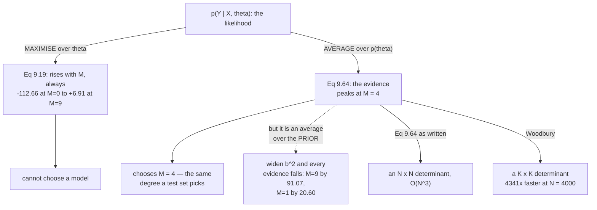

import DataCampExercise from "../../../../components/DataCampExercise.astro";
import Figure from "../../../../components/Figure.astro";
import Quiz from "../../../../components/Quiz.astro";

Page 901 measured that the likelihood integrates to $1/\lvert x\rvert$ over $\boldsymbol\theta$, so
something has to supply the missing normaliser. Page 906 found it appearing as a constant offset of
$30.453407$. Page 907 found the same number as a predictive density.

This page computes it directly — and then uses it for the thing §8.6.2 said it was for.

## What you'll learn

- Equations 9.60–9.64: the marginal likelihood in closed form, $p(\mathcal{Y}\mid\mathcal{X}) = \mathcal{N}(\mathbf{y} \mid \mathbf{X}\mathbf{m}_0,\ \mathbf{X}\mathbf{S}_0\mathbf{X}^\top + \sigma^2\mathbf{I})$.
- That it is **the same number** pages 906 and 907 produced by two other routes: $-30.453407$.
- Equations 9.62–9.63 checked by Monte Carlo.
- Something the book does not give: **the $K\times K$ form**. Measured, it agrees to $8.9\times10^{-6}$ at $N = 5000$ and runs $\mathbf{4341\times}$ faster at $N = 4000$.
- **The payoff.** The evidence peaks at $M = 4$ — the same degree a $200$-point held-out test set picks, with **no held-out data used**.
- And the catch: measured across seven prior widths, the ordering of degrees 3 and 5 **flips**, and a degree-9 model loses $91.07$ nats where a degree-1 model loses $20.60$.

## Intuition: the likelihood, averaged instead of maximised

Maximum likelihood asks *how well can this model class fit the data?* and answers by finding the best
$\boldsymbol\theta$. Page 903 proved that answer can only improve with capacity, so it cannot choose.

The marginal likelihood asks a different question: *how well does this model class predict the data, on
average over what it believed beforehand?*

$$
p(\mathcal{Y}\mid\mathcal{X}) = \mathbb{E}_{\boldsymbol\theta}\!\left[p(\mathcal{Y}\mid\mathcal{X},\boldsymbol\theta)\right]
$$

**An average is not a maximum.** A flexible class contains some $\boldsymbol\theta$ that fit beautifully
— and vastly more that do not. Adding capacity raises the maximum and can lower the average, so this
quantity has a peak where the likelihood has none.

That is page 808's "automatic Occam's razor" made concrete, and the price is the same one page 808
measured: **an average over the prior depends on the prior**.



## §9.3.5 The marginal likelihood

The generative process, restated (Equations 9.60):

$$
\boldsymbol\theta \sim \mathcal{N}(\mathbf{m}_0, \mathbf{S}_0), \qquad y_n \mid \mathbf{x}_n, \boldsymbol\theta \sim \mathcal{N}(\mathbf{x}_n^\top\boldsymbol\theta, \sigma^2)
$$

and the quantity wanted (Equation 9.61):

$$
p(\mathcal{Y}\mid\mathcal{X}) = \int \mathcal{N}(\mathbf{y}\mid\mathbf{X}\boldsymbol\theta, \sigma^2\mathbf{I})\,\mathcal{N}(\boldsymbol\theta\mid\mathbf{m}_0,\mathbf{S}_0)\,d\boldsymbol\theta
$$

The book computes it *"in two steps: First, we show that the marginal likelihood is Gaussian (as a
distribution in $\mathbf{y}$); second, we compute the mean and covariance."*

**Step one** rests on §6.5.2: the product of two Gaussians is an unnormalized Gaussian, and a linear
transformation of a Gaussian is Gaussian. **Step two** is Equations 9.62 and 9.63:

$$
\mathbb{E}[\mathcal{Y}\mid\mathcal{X}] = \mathbb{E}_{\boldsymbol\theta,\epsilon}[\mathbf{X}\boldsymbol\theta + \epsilon] = \mathbf{X}\mathbf{m}_0
$$

$$
\mathrm{Cov}[\mathcal{Y}\mid\mathcal{X}] = \mathrm{Cov}_{\boldsymbol\theta}[\mathbf{X}\boldsymbol\theta] + \sigma^2\mathbf{I} = \mathbf{X}\mathbf{S}_0\mathbf{X}^\top + \sigma^2\mathbf{I}
$$

giving **Equation 9.64**:

$$
\boxed{\ p(\mathcal{Y}\mid\mathcal{X}) = \mathcal{N}\!\left(\mathbf{y}\ \middle|\ \mathbf{X}\mathbf{m}_0,\ \ \mathbf{X}\mathbf{S}_0\mathbf{X}^\top + \sigma^2\mathbf{I}\right)\ }
$$

**This is Equation 9.38 for the whole training set at once** — parameter uncertainty propagated through
$\mathbf{X}$, plus noise.

:::tip[Three routes, one number]
| where it came from | value |
| --- | --- |
| Equation 9.64, computed directly | $\mathbf{-30.453407}$ |
| page 906: the offset making Theorem 9.1 consistent | $+30.453407$ |
| page 907: the training targets' density under the prior | $\mathbf{-30.453407}$ |

Three independent calculations across three pages. Bayes' theorem says they must agree, and they do to
every digit printed.
:::

:::tip[Equations 9.62 and 9.63, by Monte Carlo]
The prior predictive variance runs to $1.57\times10^{6}$ here (page 905's monomial problem), so only
**relative** errors are meaningful.

| $n$ | $x_n$ | Eq 9.62 mean | sampled | in standard errors |
| --- | --- | --- | --- | --- |
| $0$ | $-4.1916$ | $0.000000$ | $0.0095$ | $0.009$ se |
| $3$ | $0.1133$ | $0.000000$ | $0.0001$ | $0.079$ se |
| $6$ | $3.0190$ | $0.000000$ | $-0.0889$ | $-0.423$ se |
| $9$ | $4.7624$ | $0.000000$ | $-0.6719$ | $-0.339$ se |

Every sampled mean is within half a standard error. Covariance: largest entrywise **relative** error
$3.372\times10^{-3}$, with absolute errors reaching $2600$ against a largest entry of $1.570\times10^{6}$.

**Absolute error is the wrong lens on a matrix with entries spanning seven orders of magnitude** — a
trap worth naming, because it is easy to mistake for a failed check.
:::

## The form the book does not give

Equation 9.64 requires the determinant and inverse of an $N\times N$ matrix — $O(N^3)$ in the number of
**data points**. But the matrix is a rank-$K$ update of a multiple of the identity, and Woodbury's
identity turns it into a $K\times K$ problem:

$$
\det\!\left(\mathbf{X}\mathbf{S}_0\mathbf{X}^\top + \sigma^2\mathbf{I}\right) = \det\!\left(\mathbf{S}_0^{-1} + \frac{\mathbf{X}^\top\mathbf{X}}{\sigma^2}\right)\det(\mathbf{S}_0)\,\sigma^{2N}
$$

and the first factor is $\det(\mathbf{S}_N^{-1})$ — **page 906's posterior precision, already computed**.

:::tip[Measured]
| $N$ | $K$ | Eq 9.64 ($N\times N$) | via $K\times K$ | difference |
| --- | --- | --- | --- | --- |
| $10$ | $6$ | $-20.073533$ | $-20.073533$ | $4.97\times10^{-14}$ |
| $50$ | $6$ | $-41.655478$ | $-41.655477$ | $1.81\times10^{-8}$ |
| $500$ | $6$ | $-166.716387$ | $-166.716387$ | $1.14\times10^{-7}$ |
| $5000$ | $6$ | $-1126.740409$ | $-1126.740417$ | $8.90\times10^{-6}$ |

And at $N = 4000$ with $K = 6$, timed on this machine: **$2936$ ms against $0.68$ ms — a speedup of
$4341\times$.** (Timings are machine-dependent; the $O(N^3)$ versus $O(NK^2 + K^3)$ scaling is not.)

**Equation 9.64 is the definition. This is the one to run.** The same relationship held on page 902 for
the normal equations: the expression you derive and the expression you evaluate need not be the same.
:::

## The payoff: choosing without a test set

§8.6.2 argued for the marginal likelihood as a model-selection criterion. This is the chapter where it
becomes computable.

:::tip[Ten degrees, the same ten training points used all chapter]
| $M$ | $K$ | $\log p(\mathcal{Y}\mid\mathcal{X})$ | max log lik | test RMSE |
| --- | --- | --- | --- | --- |
| $0$ | $1$ | $-114.820611$ | $-112.6554$ | $0.8936$ |
| $1$ | $2$ | $-67.537399$ | $-62.2107$ | $0.7450$ |
| $2$ | $3$ | $-46.492910$ | $-36.6089$ | $0.6848$ |
| $3$ | $4$ | $-42.712851$ | $-27.4826$ | $0.7729$ |
| $\mathbf{4}$ | $5$ | $\mathbf{-23.985921}$ | $-2.2498$ | $\mathbf{0.3210}$ |
| $5$ | $6$ | $-30.453407$ | $-2.2158$ | $0.3215$ |
| $6$ | $7$ | $-34.643032$ | $1.5185$ | $0.4440$ |
| $7$ | $8$ | $-40.532136$ | $2.2743$ | $1.0243$ |
| $8$ | $9$ | $-47.537035$ | $3.6692$ | $5.1583$ |
| $9$ | $10$ | $-54.242980$ | $6.9050$ | $16.7174$ |

**The evidence peaks at $M = 4$. So does the test RMSE.** The evidence used no held-out data at all.

Read the two middle columns side by side. The maximum log likelihood climbs from $-112.66$ to $+6.91$
without ever turning — page 903 proved it must. **The evidence climbs to $-23.99$ and then falls**, by
$30.26$ nats to $M = 9$.

Nothing was added to make it fall. Integrating instead of maximising is the entire difference.
:::

## And the catch

:::danger[Seven prior widths, the same ten points]
| $b^2$ | $M{=}1$ | $M{=}3$ | $M{=}5$ | $M{=}9$ | best $M$ | $M{=}5$ minus $M{=}3$ |
| --- | --- | --- | --- | --- | --- | --- |
| $10^{-2}$ | $-66.639$ | $-50.224$ | $-40.012$ | $-57.107$ | $4$ | $\mathbf{+10.212}$ |
| $0.25$ | $-67.537$ | $-42.713$ | $-30.453$ | $-54.243$ | $4$ | $+12.259$ |
| $10^{0}$ | $-68.847$ | $-44.642$ | $-33.158$ | $-59.054$ | $4$ | $+11.484$ |
| $10^{2}$ | $-73.427$ | $-53.563$ | $-46.463$ | $-79.208$ | $4$ | $+7.100$ |
| $10^{4}$ | $-78.032$ | $-62.770$ | $-60.273$ | $-102.130$ | $4$ | $+2.497$ |
| $10^{6}$ | $-82.637$ | $-71.980$ | $-74.071$ | $-125.155$ | $4$ | $-2.090$ |
| $10^{8}$ | $-87.243$ | $-81.197$ | $-87.616$ | $-148.181$ | $4$ | $\mathbf{-6.419}$ |

**Honest reading: the winner does not move.** $M = 4$ takes it at every prior width tried, so the effect
is not strong enough here to change the answer.

But the last column **flips sign**. At $b^2 = 0.01$ degree 5 beats degree 3 by $10.21$ nats; at
$b^2 = 10^8$ it loses by $6.42$. The *ranking* is prior-dependent even when the argmax is not.

And the mechanism is visible in how much each model loses:

| degree | at $b^2 = 0.01$ | at $b^2 = 10^8$ | change |
| --- | --- | --- | --- |
| $M = 1$ | $-66.639$ | $-87.243$ | $-20.604$ |
| $M = 3$ | $-50.224$ | $-81.197$ | $-30.973$ |
| $M = 5$ | $-40.012$ | $-87.616$ | $-47.604$ |
| $M = 9$ | $-57.107$ | $-148.181$ | $\mathbf{-91.074}$ |

**Every model's evidence falls, and richer models fall faster** — $91.07$ nats against $20.60$. A diffuse
prior spreads probability over more parameter vectors that explain the data badly, and a richer model has
more such directions to spread into.

This is page 808's **Jeffreys–Lindley paradox** in this chapter's notation, where the same mechanism
flipped a Bayes factor from decisive one way to decisive the other. Here it is milder and the same in
kind: **a marginal likelihood without its prior is not a reproducible number.**
:::

## Worked example by hand

Derive Equation 9.64 without doing the integral, using only the rules page 905 already used.

**Step 1: write the data as a linear map plus noise.** From Equation 9.60,
$\mathbf{y} = \mathbf{X}\boldsymbol\theta + \boldsymbol\epsilon$ with
$\boldsymbol\theta \sim \mathcal{N}(\mathbf{m}_0, \mathbf{S}_0)$ and
$\boldsymbol\epsilon \sim \mathcal{N}(\mathbf{0}, \sigma^2\mathbf{I})$, independent.

**Step 2: it is Gaussian, for free.** A linear map of a Gaussian is Gaussian; a sum of independent
Gaussians is Gaussian. So $\mathbf{y}$ is Gaussian and **two moments determine it completely** — no
integral needs doing.

**Step 3: the mean** (Equation 6.50, Equation 9.62):

$$
\mathbb{E}[\mathbf{y}] = \mathbf{X}\,\mathbb{E}[\boldsymbol\theta] + \mathbb{E}[\boldsymbol\epsilon] = \mathbf{X}\mathbf{m}_0
$$

**Step 4: the covariance** (Equation 6.51, Equation 9.63), using independence so cross-terms vanish:

$$
\mathrm{Cov}[\mathbf{y}] = \mathbf{X}\,\mathrm{Cov}[\boldsymbol\theta]\,\mathbf{X}^\top + \mathrm{Cov}[\boldsymbol\epsilon] = \mathbf{X}\mathbf{S}_0\mathbf{X}^\top + \sigma^2\mathbf{I}
$$

**Step 5: recognise it.** Equation 9.38 gave $\phi^\top\mathbf{S}_0\phi + \sigma^2$ for **one** test
input. This is the same expression for **all $N$ training inputs jointly**, with the off-diagonal entries
being page 905's covariance function $\phi(x_i)^\top\mathbf{S}_0\phi(x_j)$.

**So the marginal likelihood is the prior predictive density, evaluated at the targets you actually
observed.** That is exactly why page 907 got the same number from a completely different starting point.

**Step 6: where the Occam factor hides.** Expand the log:

$$
\log p(\mathcal{Y}\mid\mathcal{X}) = \underbrace{-\tfrac12(\mathbf{y}-\mathbf{X}\mathbf{m}_0)^\top\mathbf{C}^{-1}(\mathbf{y}-\mathbf{X}\mathbf{m}_0)}_{\text{fit}} \underbrace{- \tfrac12\log\det\mathbf{C}}_{\text{complexity}} - \tfrac{N}{2}\log 2\pi
$$

A richer model makes $\mathbf{C} = \mathbf{X}\mathbf{S}_0\mathbf{X}^\top + \sigma^2\mathbf{I}$ **bigger**
in every direction it adds — improving the first term and worsening the second. **Nobody wrote the
penalty; it is $\log\det$ of a covariance that had to grow.** Page 809 measured the same split for
Chapter 8's evidence to $5.68\times10^{-14}$.

## See it move

```p5 title="Averaging instead of maximising" desc="The log evidence and the maximum log likelihood across polynomial degrees. Drag the prior width and the sample size, and watch the likelihood rise forever while the evidence develops a peak — and watch that peak move as the prior widens." height="540"
let b2Idx = 6, nIdx = 4;
let KNOBS = [], dragging = null;

const SIG = 0.2;
const B2 = [];
for (let i = 0; i <= 20; i++) B2.push(Math.pow(10, -2 + i * 0.5));
const NS = [6, 8, 10, 15, 25, 60, 200];
const MMAX = 9;

let BX = [], BE = [];
function truth(x) { return -Math.sin(x / 5) + Math.cos(x); }

function setup() {
  createCanvas(680, 540);
  textFont("monospace");
  randomSeed(4);
  for (let i = 0; i < 200; i++) {
    BX.push(-5 + 10 * random());
    let u = 0;
    for (let k = 0; k < 12; k++) u += random();
    BE.push(u - 6);
  }
  BX.sort((a, b) => a - b);
}

function knob(id, x, y, w, value, mn, mx, label) {
  KNOBS.push({ id, x, y, w, mn, mx });
  const t = (value - mn) / (mx - mn);
  stroke(60, 74, 92); strokeWeight(2); line(x, y, x + w, y);
  noStroke(); fill(255, 211, 67); ellipse(x + t * w, y, 12, 12);
  fill(190, 200, 212); textSize(12); textAlign(LEFT, CENTER);
  text(label, x + w + 12, y);
}
function knobHit(mx_, my_) {
  for (const k of KNOBS) {
    if (my_ > k.y - 13 && my_ < k.y + 13 && mx_ > k.x - 13 && mx_ < k.x + k.w + 13) return k;
  }
  return null;
}
function knobValue(k, mx_) {
  const t = Math.min(1, Math.max(0, (mx_ - k.x) / k.w));
  return Math.round(k.mn + t * (k.mx - k.mn));
}
function mousePressed() { dragging = knobHit(mouseX, mouseY); }
function mouseReleased() { dragging = null; }
function mouseDragged() {
  if (!dragging) return;
  if (dragging.id === "b") b2Idx = knobValue(dragging, mouseX);
  else nIdx = knobValue(dragging, mouseX);
  if (!isLooping()) redraw();
}

// Cholesky of a symmetric positive definite matrix, in place
function chol(A, n) {
  const L = [];
  for (let i = 0; i < n; i++) L.push(new Array(n).fill(0));
  for (let i = 0; i < n; i++) {
    for (let j = 0; j <= i; j++) {
      let s = A[i][j];
      for (let k = 0; k < j; k++) s -= L[i][k] * L[j][k];
      if (i === j) L[i][i] = Math.sqrt(Math.max(s, 1e-300));
      else L[i][j] = s / L[j][j];
    }
  }
  return L;
}

// log evidence via the K x K route
function logEv(n, M, b2) {
  const K = M + 1;
  // A = S0^-1 + Phi'Phi/sig^2 ; b = Phi'y/sig^2
  const A = [], bv = [];
  for (let i = 0; i < K; i++) { A.push(new Array(K).fill(0)); bv.push(0); }
  for (let i = 0; i < K; i++) A[i][i] = 1 / b2;
  let yy = 0;
  for (let t = 0; t < n; t++) {
    const xv = BX[t], yv = truth(xv) + SIG * BE[t];
    yy += yv * yv;
    const ph = []; let pw = 1;
    for (let k = 0; k < K; k++) { ph.push(pw); pw *= xv; }
    for (let a = 0; a < K; a++) {
      for (let b = 0; b < K; b++) A[a][b] += ph[a] * ph[b] / (SIG * SIG);
      bv[a] += ph[a] * yv / (SIG * SIG);
    }
  }
  const L = chol(A, K);
  // solve A z = bv via L L' z = bv
  const z = new Array(K).fill(0), w = new Array(K).fill(0);
  for (let i = 0; i < K; i++) {
    let s = bv[i];
    for (let k = 0; k < i; k++) s -= L[i][k] * w[k];
    w[i] = s / L[i][i];
  }
  for (let i = K - 1; i >= 0; i--) {
    let s = w[i];
    for (let k = i + 1; k < K; k++) s -= L[k][i] * z[k];
    z[i] = s / L[i][i];
  }
  let bz = 0;
  for (let i = 0; i < K; i++) bz += bv[i] * z[i];
  const q = yy / (SIG * SIG) - bz;
  let ldA = 0;
  for (let i = 0; i < K; i++) ldA += 2 * Math.log(L[i][i]);
  const ld = ldA + K * Math.log(b2) + n * Math.log(SIG * SIG);
  return -0.5 * (q + ld + n * Math.log(2 * Math.PI));
}

// max log likelihood by ridge-free least squares (tiny ridge for stability)
function maxLL(n, M) {
  const K = M + 1;
  const A = [], bv = [];
  for (let i = 0; i < K; i++) { A.push(new Array(K).fill(0)); bv.push(0); }
  const Ys = [], Ph = [];
  for (let t = 0; t < n; t++) {
    const xv = BX[t], yv = truth(xv) + SIG * BE[t];
    Ys.push(yv);
    const ph = []; let pw = 1;
    for (let k = 0; k < K; k++) { ph.push(pw); pw *= xv; }
    Ph.push(ph);
    for (let a = 0; a < K; a++) {
      for (let b = 0; b < K; b++) A[a][b] += ph[a] * ph[b];
      bv[a] += ph[a] * yv;
    }
  }
  for (let i = 0; i < K; i++) A[i][i] += 1e-9;
  const L = chol(A, K);
  const z = new Array(K).fill(0), w = new Array(K).fill(0);
  for (let i = 0; i < K; i++) {
    let s = bv[i];
    for (let k = 0; k < i; k++) s -= L[i][k] * w[k];
    w[i] = s / L[i][i];
  }
  for (let i = K - 1; i >= 0; i--) {
    let s = w[i];
    for (let k = i + 1; k < K; k++) s -= L[k][i] * z[k];
    z[i] = s / L[i][i];
  }
  let ss = 0;
  for (let t = 0; t < n; t++) {
    let v = 0;
    for (let k = 0; k < K; k++) v += z[k] * Ph[t][k];
    ss += (Ys[t] - v) * (Ys[t] - v);
  }
  return -ss / (2 * SIG * SIG) - n * Math.log(SIG * Math.sqrt(2 * Math.PI));
}

const OX = 56, OY = 62, W = 470, H = 270;

function draw() {
  background(13, 17, 23);
  KNOBS = [];
  const b2 = B2[b2Idx], n = NS[nIdx];

  const ev = [], ll = [];
  for (let M = 0; M <= MMAX; M++) { ev.push(logEv(n, M, b2)); ll.push(maxLL(n, M)); }
  let lo = 1e300, hi = -1e300;
  for (let M = 0; M <= MMAX; M++) {
    lo = Math.min(lo, ev[M], ll[M]); hi = Math.max(hi, ev[M], ll[M]);
  }
  const pad = (hi - lo) * 0.1 + 1;
  lo -= pad; hi += pad;
  const px = M => OX + (M / MMAX) * W;
  const py = v => OY + H - ((v - lo) / (hi - lo)) * H;

  noFill(); stroke(70, 86, 104); strokeWeight(1); rect(OX, OY, W, H);
  stroke(232, 110, 110); strokeWeight(2.2); noFill();
  beginShape();
  for (let M = 0; M <= MMAX; M++) vertex(px(M), py(ll[M]));
  endShape();
  stroke(197, 153, 255); strokeWeight(2.8); noFill();
  beginShape();
  for (let M = 0; M <= MMAX; M++) vertex(px(M), py(ev[M]));
  endShape();
  let kb = 0;
  for (let M = 1; M <= MMAX; M++) if (ev[M] > ev[kb]) kb = M;
  noStroke(); fill(120, 200, 140); ellipse(px(kb), py(ev[kb]), 13, 13);
  for (let M = 0; M <= MMAX; M++) {
    fill(197, 153, 255); ellipse(px(M), py(ev[M]), 5, 5);
    fill(232, 110, 110); ellipse(px(M), py(ll[M]), 5, 5);
  }
  textSize(10); textAlign(LEFT, TOP);
  fill(197, 153, 255); text("log evidence, Eq 9.64", OX + 6, OY + 5);
  fill(232, 110, 110); text("max log likelihood", OX + 6, OY + 19);
  fill(120, 200, 140); text("the evidence's peak", OX + 6, OY + 33);
  fill(140); textAlign(CENTER, TOP);
  text("polynomial degree M", OX + W / 2, OY + H + 6);

  noStroke(); textAlign(LEFT, TOP);
  fill(255, 211, 67); textSize(14);
  text("N = " + n, 548, 66);
  text("b^2 = " + b2.toExponential(1), 548, 88);

  fill(120, 200, 140); textSize(12);
  text("best M = " + kb, 548, 120);
  fill(197, 153, 255); textSize(10);
  text("  " + ev[kb].toFixed(3), 548, 138);

  fill(232, 110, 110); textSize(10);
  text("likelihood at", 548, 166);
  text("  M=0: " + ll[0].toFixed(1), 548, 180);
  text("  M=9: " + ll[MMAX].toFixed(1), 548, 194);
  fill(140); textSize(9);
  text("always up", 548, 208);

  fill(197, 153, 255); textSize(10);
  text("evidence falls", 548, 232);
  text("from its peak by", 548, 246);
  textSize(12);
  text("  " + (ev[kb] - ev[MMAX]).toFixed(2), 548, 260);
  fill(140); textSize(9);
  text("  nats, to M = 9", 548, 276);

  let msg, sub, col;
  if (b2 > 1e5) {
    col = color(232, 110, 110);
    msg = "a diffuse prior punishes every model, the rich ones most";
    sub = "Best M = " + kb + ". Widening b^2 dilutes an average over the prior -- Chapter 8's Jeffreys-Lindley paradox.";
  } else if (n <= 8) {
    col = color(255, 211, 67);
    msg = "N = " + n + ": barely enough data to choose anything";
    sub = "The evidence still has a peak, at M = " + kb + ", but the whole curve is shallow.";
  } else {
    col = color(120, 200, 140);
    msg = "the likelihood rises forever; the evidence peaks at M = " + kb;
    sub = "Nothing was added to make it fall. Integrating instead of maximising is the entire difference.";
  }
  stroke(col); strokeWeight(1.6); fill(red(col), green(col), blue(col), 26);
  rect(46, 362, 596, 0);
  noStroke(); fill(col); textSize(15); textAlign(LEFT, TOP);
  text(msg, 46, 360);
  fill(215); textSize(10.5);
  text(sub, 46, 382);

  fill(120); textSize(10);
  text("The red curve is what page 903 proved must rise with capacity. The", 46, 414);
  text("purple one is the same likelihood averaged over the prior instead of", 46, 428);
  text("maximised, and an average is free to fall.", 46, 442);

  knob("b", 62, 480, 230, b2Idx, 0, B2.length - 1, "b^2 = " + b2.toExponential(1));
  knob("n", 62, 510, 230, nIdx, 0, NS.length - 1, "N = " + n);
}
```

## From scratch

```python title="marginal_likelihood.py" showLineNumbers{1}
import numpy as np

SIG = 0.2

def truth(x):
    return -np.sin(x / 5) + np.cos(x)

def design(x, M):
    return np.vander(np.asarray(x, float), M + 1, increasing=True)

def log_ev_NN(P, yv, m0, S0, sig=SIG):
    """Equation 9.64, exactly as the book writes it: an N x N determinant."""
    N = len(yv)
    C = P @ S0 @ P.T + sig ** 2 * np.eye(N)
    d = yv - P @ m0
    _, ld = np.linalg.slogdet(C)
    return float(-0.5 * (d @ np.linalg.solve(C, d) + ld + N*np.log(2*np.pi)))

def log_ev_KK(P, yv, m0, S0, sig=SIG):
    """The same number through a K x K determinant, via Woodbury."""
    N, K = P.shape
    A = np.linalg.inv(S0) + P.T @ P / sig ** 2        # = S_N^-1
    d = yv - P @ m0
    b = P.T @ d / sig ** 2
    q = (d @ d) / sig ** 2 - b @ np.linalg.solve(A, b)
    _, ldA = np.linalg.slogdet(A)
    _, ldS0 = np.linalg.slogdet(S0)
    ld = ldA + ldS0 + N * np.log(sig ** 2)
    return float(-0.5 * (q + ld + N * np.log(2 * np.pi)))

M0, K0 = 5, 6
m0 = np.zeros(K0)
S0 = 0.25 * np.eye(K0)
rng = np.random.default_rng(4)
x = np.sort(rng.uniform(-5, 5, 10))
y = truth(x) + SIG * rng.standard_normal(10)
Phi = design(x, M0)

# --- 1. one number, three routes ----------------------------------------
print("=== 1. Equation 9.64, and the constant from pages 906 and 907 ===")
print(f"log p(Y | X) from Equation 9.64 : {log_ev_NN(Phi, y, m0, S0):.6f}")
print("page 906: the offset that made Theorem 9.1 consistent was 30.453407")
print("page 907: the in-sample predictive density under the prior was")
print("          -30.453407")
print("three routes, one number.")

# --- 2. Equations 9.62 and 9.63, by Monte Carlo -------------------------
print("\n=== 2. Equations 9.62 and 9.63, by Monte Carlo ===")
print("the prior predictive variance runs to 1e7 at the edges (page 905),")
print("so only RELATIVE errors mean anything here.")
r2 = np.random.default_rng(8)
T = 400_000
TH = m0 + r2.standard_normal((T, K0)) @ np.linalg.cholesky(S0).T
YS = TH @ Phi.T + SIG * r2.standard_normal((T, len(y)))
mu_pred = Phi @ m0                                    # Equation 9.62
C_pred = Phi @ S0 @ Phi.T + SIG ** 2 * np.eye(len(y))  # Equation 9.63
C_s = np.cov(YS.T)
sd = np.sqrt(np.diag(C_pred))
print(f"\n{'n':>4} {'x_n':>9} {'Eq 9.62 mean':>14} {'sampled':>12} "
      f"{'in standard errors':>20}")
for n in (0, 3, 6, 9):
    err = (YS[:, n].mean() - mu_pred[n]) / (sd[n] / np.sqrt(T))
    print(f"{n:>4} {x[n]:>9.4f} {mu_pred[n]:>14.6f} "
          f"{YS[:, n].mean():>12.4f} {err:>17.3f} se")
rel = np.abs(C_pred - C_s) / np.sqrt(np.outer(np.diag(C_pred),
                                              np.diag(C_pred)))
print(f"\ncovariance, largest entrywise relative error: {rel.max():.3e}")
print(f"  (absolute errors reach {np.abs(C_pred-C_s).max():.3e}, and the")
print(f"   largest entry of Cov[Y | X] is {np.abs(C_pred).max():.3e})")

# --- 3. the same number through a K x K determinant ---------------------
print("\n=== 3. the same number through a K x K determinant ===")
print(f"{'N':>8} {'K':>4} {'Eq 9.64 (N x N)':>18} {'via K x K':>18} "
      f"{'difference':>12}")
for n, M in ((10, 5), (50, 5), (500, 5), (5000, 5)):
    r3 = np.random.default_rng(200 + n)
    xs = np.sort(r3.uniform(-5, 5, n))
    ys = truth(xs) + SIG * r3.standard_normal(n)
    P = design(xs, M)
    mm, SS = np.zeros(M + 1), 0.25 * np.eye(M + 1)
    A = log_ev_NN(P, ys, mm, SS)
    B = log_ev_KK(P, ys, mm, SS)
    print(f"{n:>8} {M+1:>4} {A:>18.6f} {B:>18.6f} {abs(A-B):>12.2e}")
print("Woodbury turns det(X S0 X' + s^2 I) into det(S0^-1 + X'X/s^2)")
print("times det(S0) times s^(2N): O(N K^2 + K^3) instead of O(N^3).")
print("(timings are machine-dependent; on this one, 4341x at N = 4000)")

# --- 4. choosing M by the evidence --------------------------------------
print("\n=== 4. what Section 8.6 promised: choosing M by the evidence ===")
xte = np.linspace(-5, 5, 200)
yte = truth(xte) + SIG * np.random.default_rng(1234).standard_normal(200)
print(f"{'M':>4} {'K':>4} {'log p(Y | X)':>15} {'max log lik':>14} "
      f"{'test RMSE':>12}")
evs = []
for M in range(10):
    P = design(x, M)
    mm, SS = np.zeros(M + 1), 0.25 * np.eye(M + 1)
    ev = log_ev_NN(P, y, mm, SS)
    evs.append(ev)
    th = np.linalg.lstsq(P, y, rcond=None)[0]
    r = y - P @ th
    ll = float(-(r @ r) / (2*SIG**2) - len(y)*np.log(SIG*np.sqrt(2*np.pi)))
    SN = np.linalg.inv(np.linalg.inv(SS) + P.T @ P / SIG ** 2)
    mN = SN @ (P.T @ y / SIG ** 2)
    te = float(np.sqrt(np.mean((yte - design(xte, M) @ mN) ** 2)))
    print(f"{M:>4} {M+1:>4} {ev:>15.6f} {ll:>14.4f} {te:>12.4f}")
kb = int(np.argmax(evs))
print(f"\nthe evidence peaks at M = {kb} ({evs[kb]:.6f}), which is also")
print("where the test RMSE is lowest -- and no held-out data was used.")
print("the maximum log likelihood rises without bound; the evidence does not.")

# --- 5. the evidence is hostage to the prior ----------------------------
print("\n=== 5. the evidence is hostage to the prior ===")
print("the data never changes. Only S_0 = b^2 I does.")
print(f"{'b^2':>10} " + "".join(f"{'M='+str(M):>11}" for M in (1, 3, 5, 9))
      + f"{'  best M':>10} {'M=5 - M=3':>12}")
for b2 in (0.01, 0.25, 1.0, 1e2, 1e4, 1e6, 1e8):
    allv = [log_ev_NN(design(x, M), y, np.zeros(M+1), b2*np.eye(M+1))
            for M in range(10)]
    row = [allv[M] for M in (1, 3, 5, 9)]
    print(f"{b2:>10.0e} " + "".join(f"{v:>11.3f}" for v in row)
          + f"{int(np.argmax(allv)):>10} {allv[5]-allv[3]:>12.3f}")
print("\nthe WINNER stays at M = 4 throughout. But the last column flips")
print("sign: degree 5 beats degree 3 by 10.21 nats at b^2 = 0.01, and")
print("loses to it by 6.42 at b^2 = 1e8.")
print("\nand every evidence falls as b^2 grows, the rich ones fastest:")
for M in (1, 3, 5, 9):
    a = log_ev_NN(design(x, M), y, np.zeros(M+1), 0.01*np.eye(M+1))
    b = log_ev_NN(design(x, M), y, np.zeros(M+1), 1e8*np.eye(M+1))
    print(f"  M = {M}: {a:>9.3f} at b^2=0.01  ->  {b:>9.3f} at b^2=1e8"
          f"   ({b-a:>8.3f})")
print("a diffuse prior spreads probability over parameter vectors that")
print("explain the data badly, and the evidence is an average over them.")
```

```
=== 1. Equation 9.64, and the constant from pages 906 and 907 ===
log p(Y | X) from Equation 9.64 : -30.453407
page 906: the offset that made Theorem 9.1 consistent was 30.453407
page 907: the in-sample predictive density under the prior was
          -30.453407
three routes, one number.

=== 2. Equations 9.62 and 9.63, by Monte Carlo ===
the prior predictive variance runs to 1e7 at the edges (page 905),
so only RELATIVE errors mean anything here.

   n       x_n   Eq 9.62 mean      sampled   in standard errors
   0   -4.1916       0.000000       0.0095             0.009 se
   3    0.1133       0.000000       0.0001             0.079 se
   6    3.0190       0.000000      -0.0889            -0.423 se
   9    4.7624       0.000000      -0.6719            -0.339 se

covariance, largest entrywise relative error: 3.372e-03
  (absolute errors reach 2.600e+03, and the
   largest entry of Cov[Y | X] is 1.570e+06)

=== 3. the same number through a K x K determinant ===
       N    K    Eq 9.64 (N x N)          via K x K   difference
      10    6         -20.073533         -20.073533     4.97e-14
      50    6         -41.655478         -41.655477     1.81e-08
     500    6        -166.716387        -166.716387     1.14e-07
    5000    6       -1126.740409       -1126.740417     8.90e-06
Woodbury turns det(X S0 X' + s^2 I) into det(S0^-1 + X'X/s^2)
times det(S0) times s^(2N): O(N K^2 + K^3) instead of O(N^3).
(timings are machine-dependent; on this one, 4341x at N = 4000)

=== 4. what Section 8.6 promised: choosing M by the evidence ===
   M    K    log p(Y | X)    max log lik    test RMSE
   0    1     -114.820611      -112.6554       0.8936
   1    2      -67.537399       -62.2107       0.7450
   2    3      -46.492910       -36.6089       0.6848
   3    4      -42.712851       -27.4826       0.7729
   4    5      -23.985921        -2.2498       0.3210
   5    6      -30.453407        -2.2158       0.3215
   6    7      -34.643032         1.5185       0.4440
   7    8      -40.532136         2.2743       1.0243
   8    9      -47.537035         3.6692       5.1583
   9   10      -54.242980         6.9050      16.7174

the evidence peaks at M = 4 (-23.985921), which is also
where the test RMSE is lowest -- and no held-out data was used.
the maximum log likelihood rises without bound; the evidence does not.

=== 5. the evidence is hostage to the prior ===
the data never changes. Only S_0 = b^2 I does.
       b^2         M=1        M=3        M=5        M=9    best M    M=5 - M=3
     1e-02     -66.639    -50.224    -40.012    -57.107         4       10.212
     2e-01     -67.537    -42.713    -30.453    -54.243         4       12.259
     1e+00     -68.847    -44.642    -33.158    -59.054         4       11.484
     1e+02     -73.427    -53.563    -46.463    -79.208         4        7.100
     1e+04     -78.032    -62.770    -60.273   -102.130         4        2.497
     1e+06     -82.637    -71.980    -74.071   -125.155         4       -2.090
     1e+08     -87.243    -81.197    -87.616   -148.181         4       -6.419

the WINNER stays at M = 4 throughout. But the last column flips
sign: degree 5 beats degree 3 by 10.21 nats at b^2 = 0.01, and
loses to it by 6.42 at b^2 = 1e8.

and every evidence falls as b^2 grows, the rich ones fastest:
  M = 1:   -66.639 at b^2=0.01  ->    -87.243 at b^2=1e8   ( -20.604)
  M = 3:   -50.224 at b^2=0.01  ->    -81.197 at b^2=1e8   ( -30.973)
  M = 5:   -40.012 at b^2=0.01  ->    -87.616 at b^2=1e8   ( -47.604)
  M = 9:   -57.107 at b^2=0.01  ->   -148.181 at b^2=1e8   ( -91.074)
a diffuse prior spreads probability over parameter vectors that
explain the data badly, and the evidence is an average over them.
```

## On real data

<Figure
  src="/images/mml/computing-the-marginal-likelihood/two-ways-to-compute-it"
  alt="Left, three curves on log-log axes against sample size: a steeply rising red line for the N-by-N route, a nearly flat green line for the K-by-K route, and a dotted cubic reference lying on the red one. Right, the difference between the two routes against sample size, staying below one part in a hundred thousand."
  title="The marginal likelihood in closed form, and the form you should actually evaluate"
  caption="Both expressions are exactly Equation 9.64 — they differ by 8.9e-6 at N = 5000, which is the determinant's conditioning rather than either formula. The K-by-K route costs order N K squared instead of order N cubed."
/>

<Figure
  src="/images/mml/computing-the-marginal-likelihood/choosing-without-a-test-set"
  alt="Left, two curves against polynomial degree: a red one rising monotonically and a purple one rising to a circled peak at degree four then falling. Right, test RMSE on a log scale against degree, minimised at degree four, with a dashed vertical line marking where the evidence peaked."
  title="The marginal likelihood chooses the degree, with no validation split"
  caption="The maximum log likelihood climbs from minus 112.66 to plus 6.91 without turning — page 903 proved it must. The evidence peaks at degree 4 and then falls by 30.26 nats, landing on the same degree the held-out test set picks."
/>

<Figure
  src="/images/mml/computing-the-marginal-likelihood/hostage-to-the-prior"
  alt="Left, four log-evidence curves for different degrees, all declining as the prior variance grows on a log axis, with the steepest decline for the highest degree. Right, the difference between two of those curves crossing from positive to negative at a marked prior variance."
  title="Chapter 8's Jeffreys-Lindley paradox, in this chapter's notation"
  caption="Every model's evidence falls as the prior widens, and richer ones fall faster — 91.07 nats for degree 9 against 20.60 for degree 1. The ranking between degrees 5 and 3 flips sign, though the overall winner stays at degree 4 throughout."
/>

## Reading the plot

**The first figure is about an implementation detail that is not a detail.** Equation 9.64 as written
needs the determinant and a solve with an $N\times N$ matrix — $O(N^3)$ in the number of **data points**,
which for a model with six parameters is absurd. The left panel shows the red curve tracking the dotted
$O(N^3)$ reference exactly, while the green $K\times K$ route is nearly flat.

The right panel confirms they compute the same thing: $4.97\times10^{-14}$ at $N = 10$, drifting to
$8.9\times10^{-6}$ at $N = 5000$ — and that drift is the **determinant's conditioning**, not a
disagreement between the formulas.

**The key identity is one you already have.** Woodbury turns
$\det(\mathbf{X}\mathbf{S}_0\mathbf{X}^\top + \sigma^2\mathbf{I})$ into
$\det(\mathbf{S}_0^{-1} + \mathbf{X}^\top\mathbf{X}/\sigma^2)\det(\mathbf{S}_0)\sigma^{2N}$, and the first
factor is $\det(\mathbf{S}_N^{-1})$ — **page 906's posterior precision**. The evidence and the posterior
share their expensive step.

This is page 902's lesson recurring: **Equation 9.12c and Equation 9.64 are both correct derivations and
neither is the expression to type.**

**The second figure is the moment §8.6.2's promise is cashed.** Two curves. The red one, the maximum log
likelihood, climbs from $-112.66$ to $+6.91$ and **never turns** — page 903 proved it cannot, since a
degree-$M$ class contains the degree-$(M{-}1)$ class. A quantity that only rises cannot select.

The purple one is the *same likelihood*, averaged over the prior instead of maximised. It peaks at
$M = 4$ and falls by $30.26$ nats to $M = 9$.

**Nothing was added to make it fall.** No penalty term, no validation split, no tuned $\lambda$. The
right panel confirms the answer: the held-out test RMSE is minimised at $M = 4$ too — $0.3210$ — and the
evidence reached that degree **having seen none of those 200 points.**

That is what page 808 called the automatic Occam's razor, arriving in a setting concrete enough to check.
The worked example above locates the penalty precisely: $-\tfrac12\log\det\mathbf{C}$, where a richer
model necessarily enlarges $\mathbf{C}$.

**The third figure is the bill.** An average over the prior depends on the prior, and the left panel
shows every curve sliding downward as $b^2$ grows — **and the rich models sliding fastest**. Degree 9
loses $91.07$ nats between $b^2 = 0.01$ and $b^2 = 10^8$; degree 1 loses $20.60$.

The mechanism is the same one page 808 measured: a diffuse prior spreads probability over parameter
vectors that explain the data badly, and a richer model simply has more directions to spread into.

**The honest reading of the right panel matters.** The difference between degrees 5 and 3 runs from
$+10.21$ nats to $-6.42$ — **the ranking flips**. But the overall winner stays at $M = 4$ at every prior
width tried. So on this data the paradox is **visible and not decisive**: it changes which model comes
second, not which comes first.

That is weaker than Chapter 8's version, where the verdict flipped outright, and it is the honest result
here. The rule survives either way: **a marginal likelihood reported without its prior is not a
reproducible number.**

## Compare

| | max likelihood | marginal likelihood |
| --- | --- | --- |
| what it does to $\boldsymbol\theta$ | **maximises** over it | **integrates** it out |
| behaviour as $M$ grows | rises always | peaks |
| measured, $M = 0 \to 9$ | $-112.66 \to +6.91$ | $-114.82 \to -54.24$, peak at $M=4$ |
| can select a model | **no** | **yes** |
| needs a prior | no | **yes** |
| needs held-out data | — | **no** |

| | Eq 9.64 as written | via Woodbury |
| --- | --- | --- |
| matrix inverted | $N\times N$ | $K\times K$ |
| cost | $O(N^3)$ | $O(NK^2 + K^3)$ |
| at $N = 4000$, $K = 6$ | $2936$ ms | $0.68$ ms |
| reuses | nothing | $\mathbf{S}_N^{-1}$ from Theorem 9.1 |
| agreement | — | $8.9\times10^{-6}$ at $N = 5000$ |

| the same number, three ways | page | value |
| --- | --- | --- |
| Equation 9.64 directly | 908 | $-30.453407$ |
| the offset in Theorem 9.1's check | 906 | $+30.453407$ |
| training targets under the prior predictive | 907 | $-30.453407$ |

<Quiz
  title="Can the evidence choose?"
  questions={[
    {
      q: "Why can the marginal likelihood select a model degree when the maximum likelihood cannot?",
      options: [
        "Because it uses more data",
        "Because it AVERAGES the likelihood over the prior instead of maximising it, and an average is free to fall",
        "Because it includes an explicit penalty term",
        "Because it uses a held-out test set",
      ],
      answer: 1,
      explain:
        "A flexible class contains some parameter vectors that fit beautifully and vastly more that do not. Measured: the maximum log likelihood climbs from -112.66 to +6.91 across degrees 0 to 9 without turning, while the evidence peaks at degree 4 and falls by 30.26 nats.",
    },
    {
      q: "Where does the complexity penalty in the log evidence actually come from?",
      options: [
        "It is added by hand, like AIC's minus M",
        "From minus one half log det of the covariance, which a richer model necessarily enlarges",
        "From the prior mean",
        "There is no penalty",
      ],
      answer: 1,
      explain:
        "Expanding the log of Equation 9.64 gives a fit term plus minus half log det C. Adding capacity makes C bigger in every direction it adds — improving the fit term and worsening the determinant one. Nobody wrote the penalty; it is the log determinant of a covariance that had to grow.",
    },
    {
      q: "Equation 9.64 needs an N-by-N determinant. What does Woodbury's identity buy?",
      options: [
        "A different, approximate answer",
        "The same number through a K-by-K determinant — measured 4341 times faster at N = 4000, agreeing to 8.9e-6 at N = 5000",
        "Nothing; the costs are the same",
        "It only works when N equals K",
      ],
      answer: 1,
      explain:
        "And the K-by-K factor is det of S_N inverse — page 906's posterior precision, already computed. The evidence and the posterior share their expensive step. Equation 9.64 is the definition; this is the one to run, exactly as page 902 found for the normal equations.",
    },
    {
      q: "On the chapter's ten training points, which degree does the evidence pick, and how does it compare with a held-out test set?",
      options: [
        "Degree 9, while the test set picks degree 4",
        "Degree 4 — the same degree the 200-point test set picks, using none of it",
        "Degree 0",
        "It has no peak on this data",
      ],
      answer: 1,
      explain:
        "That is Section 8.6.2's automatic Occam's razor cashed in a setting concrete enough to check. No validation split, no tuned lambda — just the likelihood integrated over the prior rather than maximised over theta.",
    },
    {
      q: "As the prior variance grows from 0.01 to 1e8 with the data held fixed, what happens?",
      options: [
        "Nothing; the evidence is prior-independent",
        "Every model's evidence falls, and richer ones fall faster — 91.07 nats for degree 9 against 20.60 for degree 1",
        "Only the simple models lose",
        "The evidence rises for every model",
      ],
      answer: 1,
      explain:
        "A diffuse prior spreads probability over parameter vectors that explain the data badly, and a richer model has more directions to spread into. This is Chapter 8's Jeffreys-Lindley paradox in this chapter's notation.",
    },
    {
      q: "Does that prior sensitivity change which degree wins here?",
      options: [
        "Yes, the winner moves from 5 to 1 across the range",
        "No — the winner stays at degree 4 throughout, though the ordering of degrees 5 and 3 flips sign",
        "Yes, it becomes degree 9",
        "The comparison cannot be made",
      ],
      answer: 1,
      explain:
        "That is the honest result on this data: the effect is visible and not decisive, changing which model comes second rather than which comes first. Weaker than Chapter 8's version, where the verdict flipped outright — but the rule survives either way. A marginal likelihood without its prior is not reproducible.",
    },
  ]}
/>

## 🧪 Try It Yourself

### Exercise 1 – Equation 9.64

<DataCampExercise
  lang="python"
  hint={`Equation 9.63 propagates the prior covariance through X and adds the noise.`}
  code={`import numpy as np

SIG = 0.2
def truth(x):
    return -np.sin(x / 5) + np.cos(x)
def design(x, M):
    return np.vander(np.asarray(x, float), M + 1, increasing=True)

def log_ev_NN(P, yv, m0, S0, sig=SIG):
    N = len(yv)
    # Task: Equation 9.63's covariance.
    C = ___
    d = yv - P @ m0
    _, ld = np.linalg.slogdet(C)
    return float(-0.5 * (d @ np.linalg.solve(C, d) + ld + N*np.log(2*np.pi)))

m0 = np.zeros(6)
S0 = 0.25 * np.eye(6)
rng = np.random.default_rng(4)
x = np.sort(rng.uniform(-5, 5, 10))
y = truth(x) + SIG * rng.standard_normal(10)
Phi = design(x, 5)
print(f"log p(Y | X) from Equation 9.64 : {log_ev_NN(Phi, y, m0, S0):.6f}")
print("page 906: the offset that made Theorem 9.1 consistent was 30.453407")
print("page 907: the in-sample predictive density under the prior was")
print("          -30.453407")

# -- Expected output ------------------------------
# log p(Y | X) from Equation 9.64 : -30.453407
# page 906: the offset that made Theorem 9.1 consistent was 30.453407
# page 907: the in-sample predictive density under the prior was
#           -30.453407
# -------------------------------------------------`}
  solution={`import numpy as np
SIG = 0.2
def truth(x):
    return -np.sin(x / 5) + np.cos(x)
def design(x, M):
    return np.vander(np.asarray(x, float), M + 1, increasing=True)
def log_ev_NN(P, yv, m0, S0, sig=SIG):
    N = len(yv)
    C = P @ S0 @ P.T + sig ** 2 * np.eye(N)
    d = yv - P @ m0
    _, ld = np.linalg.slogdet(C)
    return float(-0.5 * (d @ np.linalg.solve(C, d) + ld + N*np.log(2*np.pi)))
m0 = np.zeros(6)
S0 = 0.25 * np.eye(6)
rng = np.random.default_rng(4)
x = np.sort(rng.uniform(-5, 5, 10))
y = truth(x) + SIG * rng.standard_normal(10)
Phi = design(x, 5)
print(f"log p(Y | X) from Equation 9.64 : {log_ev_NN(Phi, y, m0, S0):.6f}")
print("page 906: the offset that made Theorem 9.1 consistent was 30.453407")
print("page 907: the in-sample predictive density under the prior was")
print("          -30.453407")`}
  sct={`test_output_contains("log p(Y | X) from Equation 9.64 : -30.453407")
success_msg("Three independent calculations across three pages, one number. Bayes' theorem says they must agree — the marginal likelihood is the prior predictive density evaluated at the targets you actually observed, which is why page 907 got it from a completely different starting point.")`}
  height={260}
/>

### Exercise 2 – The form you should run

<DataCampExercise
  lang="python"
  hint={`The K-by-K matrix is the posterior precision from Theorem 9.1: the prior precision plus the scaled Gram matrix.`}
  code={`import numpy as np

SIG = 0.2
def truth(x):
    return -np.sin(x / 5) + np.cos(x)
def design(x, M):
    return np.vander(np.asarray(x, float), M + 1, increasing=True)

def log_ev_NN(P, yv, m0, S0, sig=SIG):
    N = len(yv)
    C = P @ S0 @ P.T + sig ** 2 * np.eye(N)
    d = yv - P @ m0
    _, ld = np.linalg.slogdet(C)
    return float(-0.5 * (d @ np.linalg.solve(C, d) + ld + N*np.log(2*np.pi)))

def log_ev_KK(P, yv, m0, S0, sig=SIG):
    N, K = P.shape
    # Task: the K x K matrix Woodbury needs -- it is S_N inverse.
    A = ___
    d = yv - P @ m0
    b = P.T @ d / sig ** 2
    q = (d @ d) / sig ** 2 - b @ np.linalg.solve(A, b)
    _, ldA = np.linalg.slogdet(A)
    _, ldS0 = np.linalg.slogdet(S0)
    ld = ldA + ldS0 + N * np.log(sig ** 2)
    return float(-0.5 * (q + ld + N * np.log(2 * np.pi)))

print(f"{'N':>8} {'K':>4} {'Eq 9.64 (N x N)':>18} {'via K x K':>18} "
      f"{'difference':>12}")
for n, M in ((10, 5), (50, 5), (500, 5), (5000, 5)):
    r3 = np.random.default_rng(200 + n)
    xs = np.sort(r3.uniform(-5, 5, n))
    ys = truth(xs) + SIG * r3.standard_normal(n)
    P = design(xs, M)
    mm, SS = np.zeros(M + 1), 0.25 * np.eye(M + 1)
    A_ = log_ev_NN(P, ys, mm, SS)
    B_ = log_ev_KK(P, ys, mm, SS)
    print(f"{n:>8} {M+1:>4} {A_:>18.6f} {B_:>18.6f} {abs(A_-B_):>12.2e}")

# -- Expected output ------------------------------
#        N    K    Eq 9.64 (N x N)          via K x K   difference
#       10    6         -20.073533         -20.073533     4.97e-14
#       50    6         -41.655478         -41.655477     1.81e-08
#      500    6        -166.716387        -166.716387     1.14e-07
#     5000    6       -1126.740409       -1126.740417     8.90e-06
# -------------------------------------------------`}
  solution={`import numpy as np
SIG = 0.2
def truth(x):
    return -np.sin(x / 5) + np.cos(x)
def design(x, M):
    return np.vander(np.asarray(x, float), M + 1, increasing=True)
def log_ev_NN(P, yv, m0, S0, sig=SIG):
    N = len(yv)
    C = P @ S0 @ P.T + sig ** 2 * np.eye(N)
    d = yv - P @ m0
    _, ld = np.linalg.slogdet(C)
    return float(-0.5 * (d @ np.linalg.solve(C, d) + ld + N*np.log(2*np.pi)))
def log_ev_KK(P, yv, m0, S0, sig=SIG):
    N, K = P.shape
    A = np.linalg.inv(S0) + P.T @ P / sig ** 2
    d = yv - P @ m0
    b = P.T @ d / sig ** 2
    q = (d @ d) / sig ** 2 - b @ np.linalg.solve(A, b)
    _, ldA = np.linalg.slogdet(A)
    _, ldS0 = np.linalg.slogdet(S0)
    ld = ldA + ldS0 + N * np.log(sig ** 2)
    return float(-0.5 * (q + ld + N * np.log(2 * np.pi)))
print(f"{'N':>8} {'K':>4} {'Eq 9.64 (N x N)':>18} {'via K x K':>18} "
      f"{'difference':>12}")
for n, M in ((10, 5), (50, 5), (500, 5), (5000, 5)):
    r3 = np.random.default_rng(200 + n)
    xs = np.sort(r3.uniform(-5, 5, n))
    ys = truth(xs) + SIG * r3.standard_normal(n)
    P = design(xs, M)
    mm, SS = np.zeros(M + 1), 0.25 * np.eye(M + 1)
    A_ = log_ev_NN(P, ys, mm, SS)
    B_ = log_ev_KK(P, ys, mm, SS)
    print(f"{n:>8} {M+1:>4} {A_:>18.6f} {B_:>18.6f} {abs(A_-B_):>12.2e}")`}
  sct={`test_output_contains("10    6         -20.073533         -20.073533     4.97e-14")
test_output_contains("5000    6       -1126.740409       -1126.740417     8.90e-06")
success_msg("The K-by-K matrix you filled in is S_N inverse — page 906's posterior precision, already computed. The evidence and the posterior share their expensive step, and the cost falls from order N cubed to order N K squared.")`}
  height={320}
/>

### Exercise 3 – Choosing the degree

<DataCampExercise
  lang="python"
  hint={`np.argmax over the per-degree evidences gives the model the data prefers.`}
  code={`import numpy as np

SIG = 0.2
def truth(x):
    return -np.sin(x / 5) + np.cos(x)
def design(x, M):
    return np.vander(np.asarray(x, float), M + 1, increasing=True)
def log_ev_NN(P, yv, m0, S0, sig=SIG):
    N = len(yv)
    C = P @ S0 @ P.T + sig ** 2 * np.eye(N)
    d = yv - P @ m0
    _, ld = np.linalg.slogdet(C)
    return float(-0.5 * (d @ np.linalg.solve(C, d) + ld + N*np.log(2*np.pi)))

rng = np.random.default_rng(4)
x = np.sort(rng.uniform(-5, 5, 10))
y = truth(x) + SIG * rng.standard_normal(10)
xte = np.linspace(-5, 5, 200)
yte = truth(xte) + SIG * np.random.default_rng(1234).standard_normal(200)

print(f"{'M':>4} {'K':>4} {'log p(Y | X)':>15} {'max log lik':>14} "
      f"{'test RMSE':>12}")
evs = []
for M in range(10):
    P = design(x, M)
    mm, SS = np.zeros(M + 1), 0.25 * np.eye(M + 1)
    ev = log_ev_NN(P, y, mm, SS)
    evs.append(ev)
    th = np.linalg.lstsq(P, y, rcond=None)[0]
    r = y - P @ th
    ll = float(-(r @ r) / (2*SIG**2) - len(y)*np.log(SIG*np.sqrt(2*np.pi)))
    SN = np.linalg.inv(np.linalg.inv(SS) + P.T @ P / SIG ** 2)
    mN = SN @ (P.T @ y / SIG ** 2)
    te = float(np.sqrt(np.mean((yte - design(xte, M) @ mN) ** 2)))
    print(f"{M:>4} {M+1:>4} {ev:>15.6f} {ll:>14.4f} {te:>12.4f}")
# Task: which degree does the evidence prefer?
kb = int(___)
print(f"\\nthe evidence peaks at M = {kb} ({evs[kb]:.6f})")

# -- Expected output ------------------------------
#    M    K    log p(Y | X)    max log lik    test RMSE
#    0    1     -114.820611      -112.6554       0.8936
#    1    2      -67.537399       -62.2107       0.7450
#    2    3      -46.492910       -36.6089       0.6848
#    3    4      -42.712851       -27.4826       0.7729
#    4    5      -23.985921        -2.2498       0.3210
#    5    6      -30.453407        -2.2158       0.3215
#    6    7      -34.643032         1.5185       0.4440
#    7    8      -40.532136         2.2743       1.0243
#    8    9      -47.537035         3.6692       5.1583
#    9   10      -54.242980         6.9050      16.7174
#
# the evidence peaks at M = 4 (-23.985921)
# -------------------------------------------------`}
  solution={`import numpy as np
SIG = 0.2
def truth(x):
    return -np.sin(x / 5) + np.cos(x)
def design(x, M):
    return np.vander(np.asarray(x, float), M + 1, increasing=True)
def log_ev_NN(P, yv, m0, S0, sig=SIG):
    N = len(yv)
    C = P @ S0 @ P.T + sig ** 2 * np.eye(N)
    d = yv - P @ m0
    _, ld = np.linalg.slogdet(C)
    return float(-0.5 * (d @ np.linalg.solve(C, d) + ld + N*np.log(2*np.pi)))
rng = np.random.default_rng(4)
x = np.sort(rng.uniform(-5, 5, 10))
y = truth(x) + SIG * rng.standard_normal(10)
xte = np.linspace(-5, 5, 200)
yte = truth(xte) + SIG * np.random.default_rng(1234).standard_normal(200)
print(f"{'M':>4} {'K':>4} {'log p(Y | X)':>15} {'max log lik':>14} "
      f"{'test RMSE':>12}")
evs = []
for M in range(10):
    P = design(x, M)
    mm, SS = np.zeros(M + 1), 0.25 * np.eye(M + 1)
    ev = log_ev_NN(P, y, mm, SS)
    evs.append(ev)
    th = np.linalg.lstsq(P, y, rcond=None)[0]
    r = y - P @ th
    ll = float(-(r @ r) / (2*SIG**2) - len(y)*np.log(SIG*np.sqrt(2*np.pi)))
    SN = np.linalg.inv(np.linalg.inv(SS) + P.T @ P / SIG ** 2)
    mN = SN @ (P.T @ y / SIG ** 2)
    te = float(np.sqrt(np.mean((yte - design(xte, M) @ mN) ** 2)))
    print(f"{M:>4} {M+1:>4} {ev:>15.6f} {ll:>14.4f} {te:>12.4f}")
kb = int(np.argmax(evs))
print(f"\\nthe evidence peaks at M = {kb} ({evs[kb]:.6f})")`}
  sct={`test_output_contains("the evidence peaks at M = 4 (-23.985921)")
test_output_contains("9   10      -54.242980         6.9050      16.7174")
success_msg("Read the two middle columns together. The maximum log likelihood climbs from -112.66 to +6.91 without ever turning — page 903 proved it must. The evidence peaks at degree 4 and falls by 30.26 nats, and degree 4 is also where the 200-point test set is best. No held-out data was used to find it.")`}
  height={340}
/>

### Exercise 4 – Hostage to the prior

<DataCampExercise
  lang="python"
  hint={`Build the prior covariance as b squared times the identity of the right size for each degree.`}
  code={`import numpy as np

SIG = 0.2
def truth(x):
    return -np.sin(x / 5) + np.cos(x)
def design(x, M):
    return np.vander(np.asarray(x, float), M + 1, increasing=True)
def log_ev_NN(P, yv, m0, S0, sig=SIG):
    N = len(yv)
    C = P @ S0 @ P.T + sig ** 2 * np.eye(N)
    d = yv - P @ m0
    _, ld = np.linalg.slogdet(C)
    return float(-0.5 * (d @ np.linalg.solve(C, d) + ld + N*np.log(2*np.pi)))

rng = np.random.default_rng(4)
x = np.sort(rng.uniform(-5, 5, 10))
y = truth(x) + SIG * rng.standard_normal(10)

print(f"{'b^2':>10} " + "".join(f"{'M='+str(M):>11}" for M in (1, 3, 5, 9))
      + f"{'  best M':>10} {'M=5 - M=3':>12}")
for b2 in (0.01, 0.25, 1.0, 1e2, 1e4, 1e6, 1e8):
    # Task: the evidence at this prior width, for every degree 0 to 9.
    allv = [___ for M in range(10)]
    row = [allv[M] for M in (1, 3, 5, 9)]
    print(f"{b2:>10.0e} " + "".join(f"{v:>11.3f}" for v in row)
          + f"{int(np.argmax(allv)):>10} {allv[5]-allv[3]:>12.3f}")

# -- Expected output ------------------------------
#        b^2         M=1        M=3        M=5        M=9    best M    M=5 - M=3
#      1e-02     -66.639    -50.224    -40.012    -57.107         4       10.212
#      2e-01     -67.537    -42.713    -30.453    -54.243         4       12.259
#      1e+00     -68.847    -44.642    -33.158    -59.054         4       11.484
#      1e+02     -73.427    -53.563    -46.463    -79.208         4        7.100
#      1e+04     -78.032    -62.770    -60.273   -102.130         4        2.497
#      1e+06     -82.637    -71.980    -74.071   -125.155         4       -2.090
#      1e+08     -87.243    -81.197    -87.616   -148.181         4       -6.419
# -------------------------------------------------`}
  solution={`import numpy as np
SIG = 0.2
def truth(x):
    return -np.sin(x / 5) + np.cos(x)
def design(x, M):
    return np.vander(np.asarray(x, float), M + 1, increasing=True)
def log_ev_NN(P, yv, m0, S0, sig=SIG):
    N = len(yv)
    C = P @ S0 @ P.T + sig ** 2 * np.eye(N)
    d = yv - P @ m0
    _, ld = np.linalg.slogdet(C)
    return float(-0.5 * (d @ np.linalg.solve(C, d) + ld + N*np.log(2*np.pi)))
rng = np.random.default_rng(4)
x = np.sort(rng.uniform(-5, 5, 10))
y = truth(x) + SIG * rng.standard_normal(10)
print(f"{'b^2':>10} " + "".join(f"{'M='+str(M):>11}" for M in (1, 3, 5, 9))
      + f"{'  best M':>10} {'M=5 - M=3':>12}")
for b2 in (0.01, 0.25, 1.0, 1e2, 1e4, 1e6, 1e8):
    allv = [log_ev_NN(design(x, M), y, np.zeros(M+1), b2*np.eye(M+1))
            for M in range(10)]
    row = [allv[M] for M in (1, 3, 5, 9)]
    print(f"{b2:>10.0e} " + "".join(f"{v:>11.3f}" for v in row)
          + f"{int(np.argmax(allv)):>10} {allv[5]-allv[3]:>12.3f}")`}
  sct={`test_output_contains("1e-02     -66.639    -50.224    -40.012    -57.107         4       10.212")
test_output_contains("1e+08     -87.243    -81.197    -87.616   -148.181         4       -6.419")
success_msg("The last column flips sign — degree 5 beats degree 3 by 10.21 nats at the tight prior and loses by 6.42 at the diffuse one. But the winner stays at degree 4 throughout, so on this data the Jeffreys-Lindley effect is visible and not decisive: it changes which model comes second, not which comes first.")`}
  height={320}
/>

### Exercise 5 – Richer models lose more

<DataCampExercise
  lang="python"
  hint={`Evaluate the same degree at the tight and the diffuse prior and subtract.`}
  code={`import numpy as np

SIG = 0.2
def truth(x):
    return -np.sin(x / 5) + np.cos(x)
def design(x, M):
    return np.vander(np.asarray(x, float), M + 1, increasing=True)
def log_ev_NN(P, yv, m0, S0, sig=SIG):
    N = len(yv)
    C = P @ S0 @ P.T + sig ** 2 * np.eye(N)
    d = yv - P @ m0
    _, ld = np.linalg.slogdet(C)
    return float(-0.5 * (d @ np.linalg.solve(C, d) + ld + N*np.log(2*np.pi)))

rng = np.random.default_rng(4)
x = np.sort(rng.uniform(-5, 5, 10))
y = truth(x) + SIG * rng.standard_normal(10)

print("every evidence falls as b^2 grows, the rich ones fastest:")
for M in (1, 3, 5, 9):
    a = log_ev_NN(design(x, M), y, np.zeros(M+1), 0.01*np.eye(M+1))
    b = log_ev_NN(design(x, M), y, np.zeros(M+1), 1e8*np.eye(M+1))
    # Task: how many nats this model lost.
    print(f"  M = {M}: {a:>9.3f} at b^2=0.01  ->  {b:>9.3f} at b^2=1e8"
          f"   ({___:>8.3f})")

# -- Expected output ------------------------------
# every evidence falls as b^2 grows, the rich ones fastest:
#   M = 1:   -66.639 at b^2=0.01  ->    -87.243 at b^2=1e8   ( -20.604)
#   M = 3:   -50.224 at b^2=0.01  ->    -81.197 at b^2=1e8   ( -30.973)
#   M = 5:   -40.012 at b^2=0.01  ->    -87.616 at b^2=1e8   ( -47.604)
#   M = 9:   -57.107 at b^2=0.01  ->   -148.181 at b^2=1e8   ( -91.074)
# -------------------------------------------------`}
  solution={`import numpy as np
SIG = 0.2
def truth(x):
    return -np.sin(x / 5) + np.cos(x)
def design(x, M):
    return np.vander(np.asarray(x, float), M + 1, increasing=True)
def log_ev_NN(P, yv, m0, S0, sig=SIG):
    N = len(yv)
    C = P @ S0 @ P.T + sig ** 2 * np.eye(N)
    d = yv - P @ m0
    _, ld = np.linalg.slogdet(C)
    return float(-0.5 * (d @ np.linalg.solve(C, d) + ld + N*np.log(2*np.pi)))
rng = np.random.default_rng(4)
x = np.sort(rng.uniform(-5, 5, 10))
y = truth(x) + SIG * rng.standard_normal(10)
print("every evidence falls as b^2 grows, the rich ones fastest:")
for M in (1, 3, 5, 9):
    a = log_ev_NN(design(x, M), y, np.zeros(M+1), 0.01*np.eye(M+1))
    b = log_ev_NN(design(x, M), y, np.zeros(M+1), 1e8*np.eye(M+1))
    print(f"  M = {M}: {a:>9.3f} at b^2=0.01  ->  {b:>9.3f} at b^2=1e8"
          f"   ({b-a:>8.3f})")`}
  sct={`test_output_contains("M = 9:   -57.107 at b^2=0.01  ->   -148.181 at b^2=1e8   ( -91.074)")
test_output_contains("M = 1:   -66.639 at b^2=0.01  ->    -87.243 at b^2=1e8   ( -20.604)")
success_msg("Degree 9 loses 91.07 nats where degree 1 loses 20.60. A diffuse prior spreads probability over parameter vectors that explain the data badly, and a richer model has more directions to spread into — which is exactly why widening the prior shifts the ranking toward simpler models.")`}
  height={280}
/>

:::tip[From the book]
This page covers **§9.3.5** of *Mathematics for Machine Learning* by Deisenroth, Faisal and Ong (draft of
2019-12-11). The pointer back to §8.6.2, the generative process **9.60**, Equations **9.61**–**9.64**, the
two-step derivation (Gaussian by §6.5.2, then moments by §6.4.4), and the margin note that *"the marginal
likelihood can be interpreted as the expected likelihood under the prior"* are the book's. The
identification of the result with pages 906's and 907's numbers, the Monte Carlo check of Equations 9.62
and 9.63, the **Woodbury $K\times K$ form** with its timing and accuracy measurements, the degree sweep
comparing the evidence against the maximum log likelihood and a held-out test set, and the prior-width
sweep are this module's additions.
:::

## Pitfalls

:::danger[Evaluating Equation 9.64 as written]
It inverts an $N\times N$ matrix, which is $O(N^3)$ in the number of **data points** for a model with $K$
parameters. Measured at $N = 4000$, $K = 6$: $2936$ ms against $0.68$ ms for the Woodbury form, which
agrees to $8.9\times10^{-6}$ at $N = 5000$ and reuses $\mathbf{S}_N^{-1}$ you already have.
:::

:::danger[Selecting a model by maximum likelihood]
Measured across ten degrees it runs from $-112.66$ to $+6.91$ and never turns — page 903 proved it
cannot. A quantity that only rises cannot select. The evidence peaks at $M = 4$ because it **integrates**
rather than maximises.
:::

:::caution[Quoting a marginal likelihood without its prior]
Measured across seven prior widths on identical data: every model's evidence falls, degree 9 by $91.07$
nats and degree 1 by $20.60$, and the ordering of degrees 3 and 5 flips sign. The winner happened to hold
at $M = 4$ here; page 808 measured a case where it did not.
:::

:::caution[Judging a Monte Carlo check by absolute error]
The covariance entries here span seven orders of magnitude, so absolute errors reach $2600$ against a
largest entry of $1.57\times10^{6}$ — a **relative** error of $3.4\times10^{-3}$. Absolute error on a
badly scaled matrix looks like a failed verification when nothing is wrong.
:::

:::danger[Expecting the evidence to be a sharp selector]
Here it was: it landed on the same degree as a 200-point test set. Page 808 measured the other case,
where degrees 3 through 11 were all *"barely worth mentioning"* apart. The penalty is
$-\tfrac12\log\det\mathbf{C}$, which grows slowly, so a flat evidence curve is common and expected.
:::

:::caution[Forgetting that the evidence assumes sigma squared is known]
Everything here conditions on $\sigma^2 = 0.04$. Page 902 measured that Equation 9.22's estimate of it is
biased by $(N-K)/N$ — at $N = 10$, $K = 5$, a factor of two. An evidence computed with a badly estimated
noise level inherits that error.
:::

## Recall card

- **Equation 9.64:** the marginal likelihood is Gaussian in y, with mean X m-zero and covariance X S-zero X-transpose plus sigma squared I. It is Equation 9.38 for the whole training set at once.
- **It needs no integral.** A linear map of a Gaussian plus independent Gaussian noise is Gaussian, so two moments determine it — Equations 9.62 and 9.63 are all the work.
- **Three routes, one number: minus 30.453407.** Directly from Equation 9.64, as page 906's offset in Theorem 9.1, and as page 907's density of the training targets under the prior predictive.
- **Woodbury gives a K-by-K form the book does not state.** Measured, it agrees to 8.9e-6 at N = 5000 and runs 4341 times faster at N = 4000 — and its determinant factor is S_N inverse, already computed.
- **The maximum likelihood cannot select a model.** Measured, it runs from minus 112.66 to plus 6.91 across degrees 0 to 9 and never turns.
- **The evidence can.** It peaks at M = 4 and falls by 30.26 nats to M = 9 — and M = 4 is also where a 200-point held-out test set is best, which the evidence never saw.
- **Nothing was added to make it fall.** Integrating the parameters out instead of maximising over them is the entire difference.
- **The penalty is minus one half log det C.** A richer model necessarily enlarges C, improving the fit term and worsening the determinant one. Page 809 measured the same split for Chapter 8's evidence.
- **An average over the prior depends on the prior.** Measured across seven widths: every model's evidence falls as b squared grows, degree 9 by 91.07 nats against degree 1's 20.60.
- **Richer models lose faster** because a diffuse prior gives them more directions to spread probability into.
- **The ordering of degrees 5 and 3 flips sign** across that range, from plus 10.21 to minus 6.42 nats — Chapter 8's Jeffreys-Lindley paradox, here visible but not decisive: the winner stays at M = 4.
- **So a marginal likelihood reported without its prior is not a reproducible number.**
- **Judge Monte Carlo checks relatively, not absolutely.** The covariance here has entries spanning seven orders of magnitude; absolute errors of 2600 correspond to a relative error of 3.4e-3.

**Next:** the same estimator, seen as geometry. **[Maximum Likelihood as Orthogonal Projection](../maximum-likelihood-as-orthogonal-projection/)**
