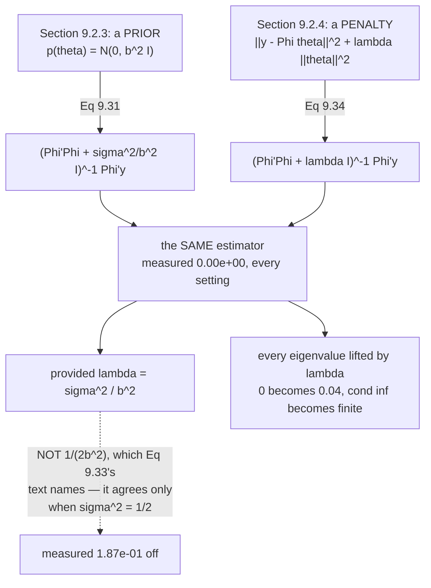

import DataCampExercise from "../../../../components/DataCampExercise.astro";
import Figure from "../../../../components/Figure.astro";
import Quiz from "../../../../components/Quiz.astro";

Page 903 ended on the one symptom of overfitting visible without a test set: *"the magnitude of the
parameter values becomes relatively large."* This page acts on it, twice — once as a **prior** (§9.2.3)
and once as a **penalty** (§9.2.4) — and then shows they are the same estimator.

Chapter 8's page 805 measured that equivalence in its own notation. Here it arrives with the chapter's
own algebra, and with a wrinkle: **the book gives two different values of $\lambda$ in adjacent
paragraphs**, and only one of them is the one you want.

## What you'll learn

- Equations 9.24–9.31: Bayes on the parameters, and the closed form $\boldsymbol\theta_{\text{MAP}} = (\boldsymbol\Phi^\top\boldsymbol\Phi + \tfrac{\sigma^2}{b^2}\mathbf{I})^{-1}\boldsymbol\Phi^\top\mathbf{y}$.
- Why the extra term rescues a **singular** problem: measured, it turns a smallest eigenvalue of exactly $0$ into $0.04$, and makes the estimate exist at $M = 12 > N = 10$.
- Equations 9.32–9.34: regularized least squares, the **data-fit** and **regularizer** terms.
- **The two-$\lambda$ discrepancy.** Eq 9.33's text says $\lambda = 1/(2b^2)$; Eq 9.34's says $\lambda = \sigma^2/b^2$. Measured across five settings, only the second reproduces Equation 9.31 — the first agrees in one accidental case.
- Example 9.6 reproduced: at $M = 9$ the prior cuts test RMSE from $100.8506$ to $29.9717$ and $\lVert\boldsymbol\theta\rVert$ from $4.2030$ to $1.2062$.
- The book's caveat, measured: MAP *"is not a general solution"* — at $M = 7$ it is **worse** than MLE, and its best is no better than choosing the right degree.
- The $p$-norm remark: measured, ridge sets **zero** coefficients to exactly zero at every $\lambda$; LASSO sets $17$, then $27$ of $30$.

## Intuition: an opinion about the directions the data cannot see

Page 903 found that at $M \geqslant N$ the design matrix has a null space, and every parameter vector
differing by a null direction fits the training data identically. The likelihood is **flat** along those
directions — it has no opinion at all.

A prior does. $\mathcal{N}(\mathbf{0}, b^2\mathbf{I})$ says "closer to zero is more plausible," which is a
complete ordering of that flat subspace. So the estimate becomes unique — not because more data arrived,
but because you supplied the missing preference.

Algebraically that is one line: **add $\sigma^2/b^2$ to every eigenvalue of
$\boldsymbol\Phi^\top\boldsymbol\Phi$.** A zero eigenvalue is exactly a direction the data cannot see, and
after the shift there are none.

The ratio $\sigma^2/b^2$ is the whole story: **noisy data or a confident prior means shrink harder**.
That is page 805's reading of $\lambda$, arriving through different algebra.



## §9.2.3 Maximum a posteriori estimation

The motivation, in the book's own words: *"we often observe that the magnitude of the parameter values
becomes relatively large if we run into overfitting."* So place a prior *"that explicitly encodes what
parameter values are plausible (before having seen any data)"* — and the book's calibration is worth
keeping: a prior $\mathcal{N}(0, 1)$ on a single parameter *"encodes that parameter values are expected
[to] lie in the interval $[-2, 2]$."*

Bayes' theorem gives the posterior, Equation 9.24:

$$
p(\boldsymbol\theta \mid \mathcal{X}, \mathcal{Y}) = \frac{p(\mathcal{Y} \mid \mathcal{X}, \boldsymbol\theta)\,p(\boldsymbol\theta)}{p(\mathcal{Y} \mid \mathcal{X})}
$$

and taking logs gives Equation 9.25:

$$
\log p(\boldsymbol\theta \mid \mathcal{X}, \mathcal{Y}) = \log p(\mathcal{Y} \mid \mathcal{X}, \boldsymbol\theta) + \log p(\boldsymbol\theta) + \text{const}
$$

*"the log-posterior ... is the sum of the log-likelihood and the log-prior so that the MAP estimate will
be a 'compromise' between the prior ... and the data-dependent likelihood."*

So the objective (Equation 9.26) is to minimise $-\log p(\mathcal{Y} \mid \mathcal{X}, \boldsymbol\theta) - \log p(\boldsymbol\theta)$,
and its gradient (Equation 9.27) is just the sum of two gradients — the first being Equation 9.11c from
page 902, unchanged.

### The closed form

With $p(\boldsymbol\theta) = \mathcal{N}(\mathbf{0}, b^2\mathbf{I})$, Equation 9.28 is

$$
-\log p(\boldsymbol\theta \mid \mathcal{X}, \mathcal{Y}) = \frac{1}{2\sigma^2}(\mathbf{y} - \boldsymbol\Phi\boldsymbol\theta)^\top(\mathbf{y} - \boldsymbol\Phi\boldsymbol\theta) + \frac{1}{2b^2}\boldsymbol\theta^\top\boldsymbol\theta + \text{const}
$$

Setting the gradient (9.29) to zero and working through 9.30 gives **Equation 9.31**:

$$
\boxed{\ \boldsymbol\theta_{\text{MAP}} = \left(\boldsymbol\Phi^\top\boldsymbol\Phi + \frac{\sigma^2}{b^2}\mathbf{I}\right)^{-1}\boldsymbol\Phi^\top\mathbf{y}\ }
$$

> Comparing the MAP estimate in (9.31) with the maximum likelihood estimate in (9.19), we see that the
> only difference between both solutions is the **additional term $\frac{\sigma^2}{b^2}\mathbf{I}$** in
> the inverse matrix.

:::tip[Why that term matters, measured]
The book's margin note: *"$\boldsymbol\Phi^\top\boldsymbol\Phi$ is symmetric, positive semi definite. The
additional term in (9.31) is strictly positive definite so that the inverse exists."*

| $M$ | $\mathrm{rk}(\boldsymbol\Phi)$ | $K$ | min eig $\boldsymbol\Phi^\top\boldsymbol\Phi$ | $+\ \sigma^2/b^2$ | cond before | cond after |
| --- | --- | --- | --- | --- | --- | --- |
| $4$ | $5$ | $5$ | $3.170370\times10^{0}$ | $3.210370\times10^{0}$ | $1.817\times10^{5}$ | $1.794\times10^{5}$ |
| $9$ | $10$ | $10$ | $1.057570\times10^{-2}$ | $5.057570\times10^{-2}$ | $2.155\times10^{14}$ | $4.506\times10^{13}$ |
| $10$ | $10$ | $11$ | $\mathbf{0.000000}$ | $4.000000\times10^{-2}$ | $\infty$ | $1.234\times10^{15}$ |
| $12$ | $10$ | $13$ | $\mathbf{0.000000}$ | $4.000000\times10^{-2}$ | $\infty$ | $5.910\times10^{17}$ |

**Every eigenvalue is lifted by the same amount**, so a smallest eigenvalue of exactly $0$ becomes
$\sigma^2/b^2 = 0.04$. Page 903 measured what the zero costs: a null space and infinitely many tied
estimators. Here it is removed.

And the estimate really is unique. At $M = 12$, perturbing along what used to be a null direction:

| | MAP objective |
| --- | --- |
| at $\boldsymbol\theta_{\text{MAP}}$ | $\mathbf{1.487441}$ |
| $+\ 0.1 \times$ old null vector | $1.492440$ |
| $+\ 1.0 \times$ old null vector | $1.987435$ |
| $+\ 10 \times$ old null vector | $51.487388$ |

**Under the likelihood these were exactly tied. Under the posterior, one wins.**
:::

## §9.2.4 MAP estimation as regularization

The same effect *"without placing a prior distribution"* — penalise the amplitude directly. **Regularized
least squares**, Equation 9.32:

$$
\lVert\mathbf{y} - \boldsymbol\Phi\boldsymbol\theta\rVert^2 + \lambda\lVert\boldsymbol\theta\rVert_2^2
$$

The first term is the **data-fit term** (also *"misfit term"*), *"proportional to the negative
log-likelihood"*. The second is the **regularizer**, and $\lambda \geqslant 0$ is the **regularization
parameter**, which *"controls the 'strictness' of the regularization."*

Minimising it gives **Equation 9.34**:

$$
\boldsymbol\theta_{\text{RLS}} = (\boldsymbol\Phi^\top\boldsymbol\Phi + \lambda\mathbf{I})^{-1}\boldsymbol\Phi^\top\mathbf{y}
$$

### The two-lambda problem

The book connects the two in consecutive paragraphs, and names **two different** $\lambda$:

> With a Gaussian prior $p(\boldsymbol\theta) = \mathcal{N}(\mathbf{0}, b^2\mathbf{I})$, we obtain the
> negative log-Gaussian prior $-\log p(\boldsymbol\theta) = \frac{1}{2b^2}\lVert\boldsymbol\theta\rVert_2^2 + \text{const}$
> (9.33) so that **for $\lambda = \frac{1}{2b^2}$** the regularization term and the negative log-Gaussian
> prior are identical.

> [Equation 9.34] **is identical to the MAP estimate in (9.31) for $\lambda = \frac{\sigma^2}{b^2}$**,
> where $\sigma^2$ is the noise variance and $b^2$ the variance of the isotropic Gaussian prior.

:::danger[Only one of them gives you Equation 9.31 — measured]
| $\sigma$ | $b^2$ | $\sigma^2/b^2$ | $1/(2b^2)$ | $\lvert\boldsymbol\theta_{\text{RLS}} - \boldsymbol\theta_{\text{MAP}}\rvert$ at $\sigma^2/b^2$ | at $1/(2b^2)$ |
| --- | --- | --- | --- | --- | --- |
| $0.2000$ | $1.00$ | $0.040000$ | $0.500000$ | $\mathbf{0.00\times10^{0}}$ | $1.87\times10^{-1}$ |
| $0.2000$ | $4.00$ | $0.010000$ | $0.125000$ | $\mathbf{0.00\times10^{0}}$ | $5.60\times10^{-2}$ |
| $1.0000$ | $1.00$ | $1.000000$ | $0.500000$ | $\mathbf{0.00\times10^{0}}$ | $1.38\times10^{-1}$ |
| $0.7071$ | $1.00$ | $0.500000$ | $0.500000$ | $\mathbf{0.00\times10^{0}}$ | $\mathbf{0.00\times10^{0}}$ |
| $0.5000$ | $0.25$ | $1.000000$ | $2.000000$ | $\mathbf{0.00\times10^{0}}$ | $1.73\times10^{-1}$ |

$\lambda = \sigma^2/b^2$ gives **exactly zero** in every row. $\lambda = 1/(2b^2)$ agrees only in row 4,
where $\sigma^2 = 1/2$ makes the two coincide by accident.

**Both statements are true about different comparisons.** Equation 9.33's matches the two **penalty
terms** — $\lambda\lVert\boldsymbol\theta\rVert^2$ against $\frac{1}{2b^2}\lVert\boldsymbol\theta\rVert^2$.
Equation 9.34's matches the two **estimators**.

**The reconciliation is a factor of $2\sigma^2$.** Equation 9.32's data-fit term has no $1/(2\sigma^2)$
in front of it, so matching it against the MAP objective 9.28 requires scaling 9.28 by $2\sigma^2$ —
which turns the prior's $\frac{1}{2b^2}$ into $\frac{\sigma^2}{b^2}$. Comparing the penalty terms alone,
without rescaling the data-fit term, gives the other number.

**If you want $\boldsymbol\theta_{\text{RLS}} = \boldsymbol\theta_{\text{MAP}}$, use $\lambda = \sigma^2/b^2$.**
:::

:::caution[And a third value, from Chapter 8]
Page 805 measured $\lambda = \dfrac{\sigma^2}{N\tau^2}$. Same idea, different normalisation: Equation
8.12's data-fit term carried a $\frac{1}{N}$ that Equation 9.32's does not. **The $\lambda$ you report is
meaningless without the objective it belongs to** — which is why page 808's measurement of the
Jeffreys–Lindley paradox insisted on quoting the prior alongside the Bayes factor.
:::

## Example 9.6, reproduced

The book places $p(\boldsymbol\theta) = \mathcal{N}(\mathbf{0}, \mathbf{I})$, so $b^2 = 1$ and
$\sigma^2/b^2 = 0.04$.

:::tip[MLE against MAP at six degrees]
| $M$ | $\lVert\boldsymbol\theta_{\text{ML}}\rVert$ | $\lVert\boldsymbol\theta_{\text{MAP}}\rVert$ | train MLE | train MAP | test MLE | test MAP |
| --- | --- | --- | --- | --- | --- | --- |
| $0$ | $0.2135$ | $0.2126$ | $0.9780$ | $0.9780$ | $0.8937$ | $0.8937$ |
| $2$ | $0.5211$ | $0.5167$ | $0.5900$ | $0.5900$ | $0.6885$ | $0.6875$ |
| $4$ | $0.9904$ | $0.9786$ | $0.2706$ | $0.2707$ | $0.3249$ | $\mathbf{0.3237}$ |
| $6$ | $1.1985$ | $1.1747$ | $0.2076$ | $0.2079$ | $0.4734$ | $0.4652$ |
| $8$ | $1.1314$ | $1.0674$ | $0.1609$ | $0.1617$ | $7.4206$ | $6.5830$ |
| $9$ | $\mathbf{4.2030}$ | $\mathbf{1.2062}$ | $0.0000$ | $0.1060$ | $\mathbf{100.8506}$ | $\mathbf{29.9717}$ |

**Read the $M = 9$ row.** The MLE interpolates ($0.0000$ training RMSE) with a norm of $4.2030$ and a test
RMSE of $100.85$. MAP declines to interpolate — training RMSE $0.1060$ — keeps the norm at $1.2062$, and
cuts the test error by a factor of $3.4$.
:::

The book's description holds in both halves:

> The prior (regularizer) **does not play a significant role for the low-degree polynomial**, but keeps
> the function relatively smooth for higher-degree polynomials.

:::tip[How far the prior actually moves the estimate]
| $M$ | $\max\lvert\boldsymbol\theta_{\text{ML}} - \boldsymbol\theta_{\text{MAP}}\rvert$ | relative to $\lVert\boldsymbol\theta_{\text{ML}}\rVert$ |
| --- | --- | --- |
| $0$ | $8.505\times10^{-4}$ | $0.003984$ |
| $1$ | $8.703\times10^{-5}$ | $0.000405$ |
| $4$ | $1.180\times10^{-2}$ | $0.011915$ |
| $6$ | $2.041\times10^{-2}$ | $0.017028$ |
| $8$ | $7.580\times10^{-2}$ | $0.066998$ |
| $9$ | $\mathbf{2.292865}$ | $\mathbf{0.545531}$ |

At $M = 1$ the prior moves the estimate by four parts in ten thousand. At $M = 9$ it moves it by over
half its own norm. **A prior only bites when the likelihood wants large coefficients** — which is exactly
the regime page 903 identified as overfitting.
:::

> Although the MAP estimate **can push the boundaries of overfitting, it is not a general solution** to
> this problem, so we need a more principled approach.

:::caution[The caveat, measured across all ten degrees]
| $M$ | test MLE | test MAP | MAP / MLE |
| --- | --- | --- | --- |
| $0$ | $0.8937$ | $0.8937$ | $1.0000$ |
| $2$ | $0.6885$ | $0.6875$ | $0.9986$ |
| $4$ | $0.3249$ | $0.3237$ | $0.9963$ |
| $6$ | $0.4734$ | $0.4652$ | $0.9826$ |
| $7$ | $0.6645$ | $0.7743$ | $\mathbf{1.1652}$ |
| $8$ | $7.4206$ | $6.5830$ | $0.8871$ |
| $9$ | $100.8506$ | $29.9717$ | $\mathbf{0.2972}$ |

Best MLE: $M = 4$ at $0.324947$. Best MAP: $M = 4$ at $0.323740$.

Three honest readings. MAP helps most where the damage is worst ($3.4\times$ at $M = 9$). **It is
actively worse at $M = 7$**, by $1.1652\times$ — shrinking is not free. And the best MAP result is
$0.3237$ against the best MLE's $0.3249$: **an improvement of $0.4\%$**. The prior rescues bad choices; it
does not replace a good one. §9.3 is the *"more principled approach"*.
:::

## The p-norm remark

> Instead of the Euclidean norm $\lVert\cdot\rVert_2$, we can choose any $p$-norm $\lVert\cdot\rVert_p$
> in (9.32). In practice, **smaller values for $p$ lead to sparser solutions.** ... For $p = 1$, the
> regularizer is called **LASSO** (least absolute shrinkage and selection operator).

:::tip[Measured on 30 candidate features, 3 of them real]
$n = 60$, $d = 30$, only coefficients $0$, $5$ and $11$ nonzero:

| penalty | $\lambda$ | coefficients set to **exactly** zero | test RMSE |
| --- | --- | --- | --- |
| $p = 2$ (ridge) | $2.0$ | $\mathbf{0}$ | $0.443029$ |
| $p = 2$ (ridge) | $8.0$ | $\mathbf{0}$ | $0.744189$ |
| $p = 2$ (ridge) | $20.0$ | $\mathbf{0}$ | $1.066952$ |
| $p = 1$ (LASSO) | $2.0$ | $\mathbf{17}$ | $\mathbf{0.331454}$ |
| $p = 1$ (LASSO) | $8.0$ | $\mathbf{27}$ | $0.389052$ |
| $p = 1$ (LASSO) | $20.0$ | $\mathbf{27}$ | $0.616809$ |

**Ridge sets nothing to exactly zero at any $\lambda$.** It shrinks everything and zeroes nothing,
because a quadratic penalty has zero gradient at the origin — there is no force holding a coefficient
*at* zero. The $\ell_1$ penalty has a kink there, and a kink is exactly a reason to stop.

At $\lambda = 8$ LASSO finds $27$ zeros, and the truth has $27$. Its test RMSE beats ridge's best at
every $\lambda$ here — **because the truth really is sparse**, which is the assumption $p = 1$ encodes.
:::

## Worked example by hand

Derive Equation 9.31 in one dimension and read the shrinkage directly.

Model: $y_n = x_n\theta + \epsilon$, $\epsilon \sim \mathcal{N}(0, \sigma^2)$, prior
$\theta \sim \mathcal{N}(0, b^2)$.

**Step 1: the negative log-posterior** (Equation 9.28 with $K = 1$):

$$
-\log p(\theta \mid \mathcal{X}, \mathcal{Y}) = \frac{1}{2\sigma^2}\sum_{n}(y_n - x_n\theta)^2 + \frac{\theta^2}{2b^2} + \text{const}
$$

**Step 2: differentiate and set to zero** (Equation 9.29 → 9.30):

$$
-\frac{1}{\sigma^2}\sum_n x_n(y_n - x_n\theta) + \frac{\theta}{b^2} = 0
$$

**Step 3: collect $\theta$.**

$$
\theta\left(\frac{\sum_n x_n^2}{\sigma^2} + \frac{1}{b^2}\right) = \frac{\sum_n x_n y_n}{\sigma^2}
\quad\Longrightarrow\quad
\boxed{\ \theta_{\text{MAP}} = \frac{\sum_n x_n y_n}{\sum_n x_n^2 + \sigma^2/b^2}\ }
$$

which is Equation 9.31 with $\boldsymbol\Phi^\top\boldsymbol\Phi = \sum x_n^2$ and
$\boldsymbol\Phi^\top\mathbf{y} = \sum x_n y_n$.

**Step 4: compare with the MLE.** Page 901's worked example gave
$\theta_{\text{ML}} = \sum x_n y_n / \sum x_n^2$, so

$$
\frac{\theta_{\text{MAP}}}{\theta_{\text{ML}}} = \frac{\sum_n x_n^2}{\sum_n x_n^2 + \sigma^2/b^2}
$$

**always in $(0,1)$** — the estimate is the MLE **shrunk toward zero**, never past it and never away.

**Step 5: read the three limits.**

| limit | shrinkage factor | estimate | meaning |
| --- | --- | --- | --- |
| $b^2 \to \infty$ | $\to 1$ | the MLE | a vague prior is no prior |
| $b^2 \to 0$ | $\to 0$ | $0$ | a certain prior ignores the data |
| $\sum x_n^2 \to \infty$ | $\to 1$ | the MLE | enough data outvotes any prior |
| $\sigma^2 \to \infty$ | $\to 0$ | $0$ | useless data, keep the prior |

**Step 6: the degenerate case.** If $\sum x_n^2 = 0$ — every input is zero, so the data says nothing
about $\theta$ — then $\theta_{\text{ML}} = 0/0$ is undefined, while

$$
\theta_{\text{MAP}} = \frac{0}{0 + \sigma^2/b^2} = 0
$$

**perfectly well defined.** That is the one-dimensional version of the null-space rescue: where the
likelihood is flat, the prior decides, and it decides on zero.

## See it move

```p5 title="Shrinkage, from both directions" desc="A polynomial fit with a Gaussian prior. Drag the prior width and the degree; watch the same slider read as a prior variance and as a regularization parameter, and watch the parameter norm and the test error respond." height="560"
let bIdx = 22, mIdx = 9;
let KNOBS = [], dragging = null;

const B2 = [];
for (let i = 0; i <= 32; i++) B2.push(Math.pow(10, -3 + i * 0.25));
const SIG = 0.2, NTR = 10;

let X = [], Y = [];
function truth(x) { return -Math.sin(x / 5) + Math.cos(x); }

function setup() {
  createCanvas(680, 560);
  textFont("monospace");
  randomSeed(4);
  for (let i = 0; i < NTR; i++) {
    X.push(-5 + 10 * (i + 0.5) / NTR + (random() - 0.5) * 0.8);
    let u = 0;
    for (let k = 0; k < 12; k++) u += random();
    Y.push(truth(X[X.length - 1]) + SIG * (u - 6));
  }
}

function knob(id, x, y, w, value, mn, mx, label) {
  KNOBS.push({ id, x, y, w, mn, mx });
  const t = (value - mn) / (mx - mn);
  stroke(60, 74, 92); strokeWeight(2); line(x, y, x + w, y);
  noStroke(); fill(255, 211, 67); ellipse(x + t * w, y, 12, 12);
  fill(190, 200, 212); textSize(12); textAlign(LEFT, CENTER);
  text(label, x + w + 12, y);
}
function knobHit(mx_, my_) {
  for (const k of KNOBS) {
    if (my_ > k.y - 13 && my_ < k.y + 13 && mx_ > k.x - 13 && mx_ < k.x + k.w + 13) return k;
  }
  return null;
}
function knobValue(k, mx_) {
  const t = Math.min(1, Math.max(0, (mx_ - k.x) / k.w));
  return Math.round(k.mn + t * (k.mx - k.mn));
}
function mousePressed() { dragging = knobHit(mouseX, mouseY); }
function mouseReleased() { dragging = null; }
function mouseDragged() {
  if (!dragging) return;
  if (dragging.id === "b") bIdx = knobValue(dragging, mouseX);
  else mIdx = knobValue(dragging, mouseX);
  if (!isLooping()) redraw();
}

// solve (Phi'Phi + lam I) th = Phi'y
function fit(M, lam) {
  const K = M + 1;
  const A = [], b = [];
  for (let i = 0; i < K; i++) { A.push(new Array(K).fill(0)); b.push(0); }
  for (let n = 0; n < X.length; n++) {
    const pw = []; let v = 1;
    for (let i = 0; i < K; i++) { pw.push(v); v *= X[n]; }
    for (let i = 0; i < K; i++) {
      for (let j = 0; j < K; j++) A[i][j] += pw[i] * pw[j];
      b[i] += pw[i] * Y[n];
    }
  }
  for (let i = 0; i < K; i++) A[i][i] += lam;
  for (let i = 0; i < K; i++) {
    let piv = i;
    for (let r = i + 1; r < K; r++) if (Math.abs(A[r][i]) > Math.abs(A[piv][i])) piv = r;
    [A[i], A[piv]] = [A[piv], A[i]]; [b[i], b[piv]] = [b[piv], b[i]];
    for (let r = i + 1; r < K; r++) {
      const f = A[r][i] / A[i][i];
      for (let c = i; c < K; c++) A[r][c] -= f * A[i][c];
      b[r] -= f * b[i];
    }
  }
  const th = new Array(K).fill(0);
  for (let i = K - 1; i >= 0; i--) {
    let s = b[i];
    for (let j = i + 1; j < K; j++) s -= A[i][j] * th[j];
    th[i] = s / A[i][i];
  }
  return th;
}
function ev(th, x) { let v = 0, pw = 1; for (let i = 0; i < th.length; i++) { v += th[i] * pw; pw *= x; } return v; }

const OX = 46, OY = 60, W = 380, H = 250;
function px(x) { return OX + ((x + 5) / 10) * W; }
function py(y) { return OY + H - ((y + 4) / 8) * H; }

function draw() {
  background(13, 17, 23);
  KNOBS = [];
  const b2 = B2[bIdx], M = mIdx;
  const lam = SIG * SIG / b2;
  const th = fit(M, lam);
  const thML = fit(M, 1e-12);

  let s1 = 0, s2 = 0;
  for (let i = 0; i < NTR; i++) { const d = Y[i] - ev(th, X[i]); s1 += d * d; }
  for (let i = 0; i < 200; i++) { const xv = -5 + 10 * i / 199; const d = truth(xv) - ev(th, xv); s2 += d * d; }
  const trR = Math.sqrt(s1 / NTR), teR = Math.sqrt(s2 / 200);
  let n1 = 0, n2 = 0;
  for (const t of th) n1 += t * t;
  for (const t of thML) n2 += t * t;
  n1 = Math.sqrt(n1); n2 = Math.sqrt(n2);

  noFill(); stroke(70, 86, 104); strokeWeight(1); rect(OX, OY, W, H);
  stroke(110); strokeWeight(1.4); noFill();
  beginShape();
  for (let i = 0; i <= 300; i++) { const xv = -5 + 10 * i / 300; vertex(px(xv), py(truth(xv))); }
  endShape();
  // the MLE for reference
  stroke(232, 110, 110); strokeWeight(1.4); noFill();
  beginShape();
  for (let i = 0; i <= 400; i++) {
    const xv = -5 + 10 * i / 400; const v = ev(thML, xv);
    if (v > -4 && v < 4) vertex(px(xv), py(v)); else { endShape(); beginShape(); }
  }
  endShape();
  stroke(120, 200, 140); strokeWeight(2.8); noFill();
  beginShape();
  for (let i = 0; i <= 400; i++) {
    const xv = -5 + 10 * i / 400; const v = ev(th, xv);
    if (v > -4 && v < 4) vertex(px(xv), py(v)); else { endShape(); beginShape(); }
  }
  endShape();
  noStroke(); fill(107, 169, 221);
  for (let i = 0; i < NTR; i++) ellipse(px(X[i]), py(Y[i]), 7, 7);
  textSize(10); textAlign(LEFT, TOP);
  fill(232, 110, 110); text("MLE (Eq 9.19)", OX + 6, OY + 5);
  fill(120, 200, 140); text("MAP (Eq 9.31)", OX + 6, OY + 19);
  fill(140); text("grey = the function behind the data", OX + 6, OY + 33);

  // readouts: the same number, two names
  noStroke(); textAlign(LEFT, TOP);
  fill(255, 211, 67); textSize(15);
  text("M = " + M, 442, 64);
  fill(140); textSize(10);
  text("sigma = 0.2, so sigma^2 = 0.04", 442, 90);

  fill(197, 153, 255); textSize(13);
  text("as a PRIOR", 442, 118);
  textSize(11);
  text("  b^2 = " + b2.toExponential(3), 442, 136);
  fill(107, 169, 221); textSize(13);
  text("as a PENALTY", 442, 162);
  textSize(11);
  text("  lambda = " + lam.toExponential(3), 442, 180);
  fill(120, 200, 140); textSize(9);
  text("  lambda = sigma^2 / b^2", 442, 196);
  text("  the SAME estimator", 442, 208);

  fill(200); textSize(11);
  text("||theta_MAP|| " + n1.toFixed(4), 442, 236);
  fill(232, 110, 110);
  text("||theta_ML||  " + n2.toFixed(4), 442, 252);
  fill(120, 200, 140); textSize(10);
  text("shrunk to " + (n1 / Math.max(n2, 1e-12) * 100).toFixed(1) + "%", 442, 268);

  fill(107, 169, 221); textSize(11);
  text("train RMSE " + trR.toFixed(4), 442, 294);
  fill(255, 211, 67);
  text("test RMSE  " + teR.toFixed(4), 442, 310);

  let msg, sub, col;
  if (b2 > 1e4) {
    col = color(232, 110, 110);
    msg = "a vague prior is no prior";
    sub = "lambda = " + lam.toExponential(1) + ". The green curve has landed on the red one -- MAP has become MLE.";
  } else if (b2 < 1e-2) {
    col = color(255, 211, 67);
    msg = "a certain prior ignores the data";
    sub = "||theta|| has collapsed to " + n1.toFixed(4) + " and the fit is nearly flat, whatever the data says.";
  } else {
    col = color(120, 200, 140);
    msg = "a compromise between prior and likelihood";
    sub = "The book's word for the MAP estimate. Norm shrunk to " + (n1 / Math.max(n2, 1e-12) * 100).toFixed(0) + "% of the MLE's.";
  }
  stroke(col); strokeWeight(1.6); fill(red(col), green(col), blue(col), 26);
  rect(46, 352, 596, 0);
  noStroke(); fill(col); textSize(15); textAlign(LEFT, TOP);
  text(msg, 46, 350);
  fill(215); textSize(10.5);
  text(sub, 46, 372);

  fill(120); textSize(10);
  text("Set M = 10 or higher: the MLE has no unique answer there at all,", 46, 404);
  text("and the MAP estimate still does. A zero eigenvalue is a direction", 46, 418);
  text("the data cannot see, and the prior is an opinion about exactly", 46, 432);
  text("those directions.", 46, 446);

  knob("b", 62, 492, 250, bIdx, 0, B2.length - 1, "b^2 = " + b2.toExponential(2));
  knob("m", 62, 524, 250, mIdx, 0, 12, "M = " + M);
}
```

## From scratch

```python title="map_and_regularization.py" showLineNumbers{1}
import numpy as np

SIG, NTR = 0.2, 10

def truth(x):
    return -np.sin(x / 5) + np.cos(x)

def design(x, M):
    return np.vander(np.asarray(x, float), M + 1, increasing=True)

rng = np.random.default_rng(4)
x = np.sort(rng.uniform(-5, 5, NTR))
y = truth(x) + SIG * rng.standard_normal(NTR)
xte = np.linspace(-5, 5, 200)
yte = truth(xte) + SIG * np.random.default_rng(1234).standard_normal(200)

def rmse(a, b):
    return float(np.sqrt(np.mean((a - b) ** 2)))

def map_est(P, b2, sig=SIG):
    """Equation 9.31."""
    return np.linalg.solve(P.T @ P + (sig ** 2 / b2) * np.eye(P.shape[1]),
                           P.T @ y)

def rls(P, lam):
    """Equation 9.34."""
    return np.linalg.solve(P.T @ P + lam * np.eye(P.shape[1]), P.T @ y)

# --- 1. the book names two lambdas; only one works ----------------------
print("=== 1. the book names TWO lambdas. Only one of them works. ===")
P = design(x, 6)
print(f"{'sigma':>7} {'b^2':>7} {'sigma^2/b^2':>13} {'1/(2b^2)':>11} "
      f"{'|RLS-MAP| at s2/b2':>20} {'at 1/(2b2)':>13}")
for sig, b2 in ((0.2, 1.0), (0.2, 4.0), (1.0, 1.0),
                (np.sqrt(0.5), 1.0), (0.5, 0.25)):
    m = np.linalg.solve(P.T @ P + (sig**2 / b2) * np.eye(P.shape[1]),
                        P.T @ y)
    a = float(np.abs(rls(P, sig**2 / b2) - m).max())
    c = float(np.abs(rls(P, 1.0 / (2*b2)) - m).max())
    print(f"{sig:>7.4f} {b2:>7.2f} {sig**2/b2:>13.6f} {1/(2*b2):>11.6f} "
          f"{a:>20.2e} {c:>13.2e}")
print("\nlambda = sigma^2/b^2 reproduces Eq 9.31 EXACTLY, every row.")
print("lambda = 1/(2b^2) agrees only in row 4, where sigma^2 = 1/2.")

# --- 2. why the extra term rescues a singular problem -------------------
print("\n=== 2. the extra term lifts every eigenvalue ===")
print(f"{'M':>4} {'rk(Phi)':>8} {'K':>4} {'min eig(Phi^T Phi)':>20} "
      f"{'+ sigma^2/b^2':>15} {'cond before':>13} {'cond after':>12}")
for M in (4, 9, 10, 12):
    Pm = design(x, M)
    Km = Pm.shape[1]
    s = np.linalg.svd(Pm, compute_uv=False)
    ev = np.zeros(Km)
    ev[:len(s)] = s ** 2            # eigenvalues of Phi^T Phi, never negative
    ev = np.sort(ev)
    ev2 = ev + SIG ** 2
    cb = (ev.max() / ev.min()) if ev.min() > 0 else float("inf")
    print(f"{M:>4} {int(np.linalg.matrix_rank(Pm)):>8} {Km:>4} "
          f"{ev.min():>20.6e} {ev2.min():>15.6e} {cb:>13.3e} "
          f"{ev2.max()/ev2.min():>12.3e}")
print("at M >= 10 the smallest eigenvalue is exactly 0 and the condition")
print("number is infinite. Adding sigma^2/b^2 makes it sigma^2/b^2.")

P12 = design(x, 12)
tm = map_est(P12, 1.0)
ns = np.linalg.svd(P12)[2][int(np.linalg.matrix_rank(P12)):]
def map_obj(t):
    r = y - P12 @ t
    return float(r @ r / (2 * SIG ** 2) + (t @ t) / 2.0)
print(f"\nat M = 12 (K = 13 > N = 10): ||theta_MAP|| = "
      f"{np.linalg.norm(tm):.6f}")
print(f"  MAP objective at theta_MAP        : {map_obj(tm):.6f}")
for c in (0.1, 1.0, 10.0):
    print(f"  ... + {c:>4} x old null vector    : "
          f"{map_obj(tm + c * ns[0]):.6f}")
print("  every perturbation raises it. Under maximum likelihood these were")
print("  all tied; under MAP exactly one wins.")

# --- 3. Example 9.6 -----------------------------------------------------
print("\n=== 3. Example 9.6: MLE against MAP, prior N(0, I) so b^2 = 1 ===")
print(f"{'M':>4} {'||theta_ML||':>14} {'||theta_MAP||':>15} "
      f"{'train MLE':>11} {'train MAP':>11} {'test MLE':>12} {'test MAP':>11}")
for M in (0, 2, 4, 6, 8, 9):
    Pm = design(x, M)
    tl = np.linalg.lstsq(Pm, y, rcond=None)[0]
    tmm = map_est(Pm, 1.0)
    print(f"{M:>4} {np.linalg.norm(tl):>14.4f} {np.linalg.norm(tmm):>15.4f} "
          f"{rmse(y, Pm @ tl):>11.4f} {rmse(y, Pm @ tmm):>11.4f} "
          f"{rmse(yte, design(xte, M) @ tl):>12.4f} "
          f"{rmse(yte, design(xte, M) @ tmm):>11.4f}")

# --- 4. the prior barely moves a low-degree fit -------------------------
print("\n=== 4. how much the prior actually moves the estimate ===")
print(f"{'M':>4} {'max |theta_ML - theta_MAP|':>28} "
      f"{'relative to ||theta_ML||':>26}")
for M in range(10):
    Pm = design(x, M)
    tl = np.linalg.lstsq(Pm, y, rcond=None)[0]
    d = float(np.abs(tl - map_est(Pm, 1.0)).max())
    print(f"{M:>4} {d:>28.6e} {d/np.linalg.norm(tl):>26.6f}")
print("tiny at low degree, large at high degree -- the prior only bites")
print("when the likelihood wants large coefficients.")

# --- 5. 'not a general solution' ---------------------------------------
print("\n=== 5. test RMSE, MLE against MAP, all degrees ===")
print(f"{'M':>4} {'test MLE':>13} {'test MAP':>13} {'MAP / MLE':>12}")
tl_, tm_ = [], []
for M in range(10):
    Pm = design(x, M)
    a = rmse(yte, design(xte, M) @ np.linalg.lstsq(Pm, y, rcond=None)[0])
    b = rmse(yte, design(xte, M) @ map_est(Pm, 1.0))
    tl_.append(a); tm_.append(b)
    print(f"{M:>4} {a:>13.4f} {b:>13.4f} {b/a:>12.4f}")
tl_, tm_ = np.array(tl_), np.array(tm_)
print(f"\nbest MLE: M = {int(np.argmin(tl_))} at {tl_.min():.6f}")
print(f"best MAP: M = {int(np.argmin(tm_))} at {tm_.min():.6f}")
print(f"at M = 9, MAP is {tl_[9]/tm_[9]:.1f}x better than MLE -- and still")
print(f"{tm_[9]/tm_.min():.0f}x worse than its own best. At M = 7 MAP is")
print(f"WORSE than MLE, by {tm_[7]/tl_[7]:.4f}x.")
print("The book: 'it is not a general solution to this problem'.")

# --- 6. the p-norm remark -----------------------------------------------
print("\n=== 6. smaller p gives sparser solutions ===")
r5 = np.random.default_rng(21)
n, d = 60, 30
A = r5.standard_normal((n, d))
th_true = np.zeros(d)
th_true[[0, 5, 11]] = [2.0, -1.5, 1.0]      # only 3 of 30 matter
yy = A @ th_true + 0.3 * r5.standard_normal(n)
Ate = r5.standard_normal((4000, d))
yte2 = Ate @ th_true + 0.3 * r5.standard_normal(4000)

def lasso(A, yv, lam, iters=6000):
    """coordinate descent for 0.5||y - A t||^2 + lam ||t||_1"""
    t = np.zeros(A.shape[1])
    col = (A ** 2).sum(0)
    r = yv - A @ t
    for _ in range(iters):
        for j in range(A.shape[1]):
            r += A[:, j] * t[j]
            rho = A[:, j] @ r
            t[j] = np.sign(rho) * max(abs(rho) - lam, 0.0) / col[j]
            r -= A[:, j] * t[j]
    return t

print(f"the truth has {int(np.sum(th_true != 0))} nonzero coefficients of {d}")
print(f"\n{'penalty':>14} {'lambda':>8} {'exact zeros':>13} {'test RMSE':>12}")
for lam in (2.0, 8.0, 20.0):
    t2 = np.linalg.solve(A.T @ A + lam * np.eye(d), A.T @ yy)
    print(f"{'p = 2 (ridge)':>14} {lam:>8.1f} "
          f"{int(np.sum(t2 == 0.0)):>13} {rmse(yte2, Ate @ t2):>12.6f}")
for lam in (2.0, 8.0, 20.0):
    t1 = lasso(A, yy, lam)
    print(f"{'p = 1 (LASSO)':>14} {lam:>8.1f} "
          f"{int(np.sum(t1 == 0.0)):>13} {rmse(yte2, Ate @ t1):>12.6f}")
print("\nridge sets NOTHING to exactly zero at any lambda; LASSO does.")
print("That is the 'variable selection' the book mentions.")
```

```
=== 1. the book names TWO lambdas. Only one of them works. ===
  sigma     b^2   sigma^2/b^2    1/(2b^2)   |RLS-MAP| at s2/b2    at 1/(2b2)
 0.2000    1.00      0.040000    0.500000             0.00e+00      1.87e-01
 0.2000    4.00      0.010000    0.125000             0.00e+00      5.60e-02
 1.0000    1.00      1.000000    0.500000             0.00e+00      1.38e-01
 0.7071    1.00      0.500000    0.500000             0.00e+00      0.00e+00
 0.5000    0.25      1.000000    2.000000             0.00e+00      1.73e-01

lambda = sigma^2/b^2 reproduces Eq 9.31 EXACTLY, every row.
lambda = 1/(2b^2) agrees only in row 4, where sigma^2 = 1/2.

=== 2. the extra term lifts every eigenvalue ===
   M  rk(Phi)    K   min eig(Phi^T Phi)   + sigma^2/b^2   cond before   cond after
   4        5    5         3.170370e+00    3.210370e+00     1.817e+05    1.794e+05
   9       10   10         1.057570e-02    5.057570e-02     2.155e+14    4.506e+13
  10       10   11         0.000000e+00    4.000000e-02           inf    1.234e+15
  12       10   13         0.000000e+00    4.000000e-02           inf    5.910e+17
at M >= 10 the smallest eigenvalue is exactly 0 and the condition
number is infinite. Adding sigma^2/b^2 makes it sigma^2/b^2.

at M = 12 (K = 13 > N = 10): ||theta_MAP|| = 1.298908
  MAP objective at theta_MAP        : 1.487441
  ... +  0.1 x old null vector    : 1.492440
  ... +  1.0 x old null vector    : 1.987435
  ... + 10.0 x old null vector    : 51.487388
  every perturbation raises it. Under maximum likelihood these were
  all tied; under MAP exactly one wins.

=== 3. Example 9.6: MLE against MAP, prior N(0, I) so b^2 = 1 ===
   M   ||theta_ML||   ||theta_MAP||   train MLE   train MAP     test MLE    test MAP
   0         0.2135          0.2126      0.9780      0.9780       0.8937      0.8937
   2         0.5211          0.5167      0.5900      0.5900       0.6885      0.6875
   4         0.9904          0.9786      0.2706      0.2707       0.3249      0.3237
   6         1.1985          1.1747      0.2076      0.2079       0.4734      0.4652
   8         1.1314          1.0674      0.1609      0.1617       7.4206      6.5830
   9         4.2030          1.2062      0.0000      0.1060     100.8506     29.9717

=== 4. how much the prior actually moves the estimate ===
   M   max |theta_ML - theta_MAP|   relative to ||theta_ML||
   0                 8.505296e-04                   0.003984
   1                 8.703216e-05                   0.000405
   2                 4.673534e-03                   0.008968
   3                 6.974884e-03                   0.009197
   4                 1.180136e-02                   0.011915
   5                 1.409246e-02                   0.013995
   6                 2.040807e-02                   0.017028
   7                 3.402187e-02                   0.034825
   8                 7.580307e-02                   0.066998
   9                 2.292865e+00                   0.545531
tiny at low degree, large at high degree -- the prior only bites
when the likelihood wants large coefficients.

=== 5. test RMSE, MLE against MAP, all degrees ===
   M      test MLE      test MAP    MAP / MLE
   0        0.8937        0.8937       1.0000
   1        0.7451        0.7451       1.0000
   2        0.6885        0.6875       0.9986
   3        0.7854        0.7821       0.9958
   4        0.3249        0.3237       0.9963
   5        0.3331        0.3295       0.9892
   6        0.4734        0.4652       0.9826
   7        0.6645        0.7743       1.1652
   8        7.4206        6.5830       0.8871
   9      100.8506       29.9717       0.2972

best MLE: M = 4 at 0.324947
best MAP: M = 4 at 0.323740
at M = 9, MAP is 3.4x better than MLE -- and still
93x worse than its own best. At M = 7 MAP is
WORSE than MLE, by 1.1652x.
The book: 'it is not a general solution to this problem'.

=== 6. smaller p gives sparser solutions ===
the truth has 3 nonzero coefficients of 30

       penalty   lambda   exact zeros    test RMSE
 p = 2 (ridge)      2.0             0     0.443029
 p = 2 (ridge)      8.0             0     0.744189
 p = 2 (ridge)     20.0             0     1.066952
 p = 1 (LASSO)      2.0            17     0.331454
 p = 1 (LASSO)      8.0            27     0.389052
 p = 1 (LASSO)     20.0            27     0.616809

ridge sets NOTHING to exactly zero at any lambda; LASSO does.
That is the 'variable selection' the book mentions.
```

## On real data

<Figure
  src="/images/mml/map-estimation-and-regularization/two-lambdas-one-estimator"
  alt="Left, three curves on log-log axes showing the discrepancy between two estimators against the regularization parameter, each plunging to zero at its own dotted vertical line, with a red dashed line at a different position entirely. Right, a monospace table of five settings with a column of zeros and a column of nonzero errors."
  title="The chapter names two regularization parameters for the same correspondence"
  caption="Each curve touches zero at sigma squared over b squared. The red dashed line is the other value the book names, and it misses two of the three curves entirely — agreeing only when sigma squared happens to equal one half."
/>

<Figure
  src="/images/mml/map-estimation-and-regularization/the-prior-fills-the-null-space"
  alt="Left, eigenvalue spectra on a log scale for two model sizes, with solid lines dropping off the bottom of the plot and dashed lines flattening onto a horizontal reference. Right, two curves along a null direction: a flat red line and a green parabola with a single marked minimum."
  title="The extra term of Equation 9.31 is what makes the estimate exist, and unique"
  caption="At M = 12 the three smallest eigenvalues are exactly zero, so the condition number is infinite and maximum likelihood has infinitely many tied answers. Adding sigma squared over b squared lifts every eigenvalue by 0.04, and the posterior has exactly one minimum."
/>

<Figure
  src="/images/mml/map-estimation-and-regularization/example-9-6-and-the-limits"
  alt="Three panels. Left and middle, degree-6 and degree-8 fits with the MLE and MAP curves drawn together over ten points. Right, test RMSE on a log scale against degree for both estimators, with the MAP curve below the MLE one except at degree seven."
  title="The prior barely moves a low-degree fit and rescues a high-degree one, without removing the need to choose"
  caption="At M = 9 the prior cuts the parameter norm from 4.2030 to 1.2062 and the test RMSE from 100.8506 to 29.9717. But the best MAP result is 0.323740 against the best MLE's 0.324947 — an improvement of 0.4 percent — and at M = 7 MAP is actively worse."
/>

<Figure
  src="/images/mml/map-estimation-and-regularization/ridge-against-lasso"
  alt="Left, paired stem plots of thirty coefficients under two penalties with the three true nonzero values marked by crosses; one set of stems is nonzero everywhere and the other is flat at zero almost everywhere. Right, counts of exactly-zero coefficients against the regularization parameter, one line flat at zero and one climbing to twenty-seven."
  title="The choice of norm decides whether you get shrinkage or selection"
  caption="Ridge sets exactly zero coefficients to zero at every lambda tried. LASSO reaches 27 of 30, which is the number the truth has. The blue line sitting flat on the axis is the point: a quadratic penalty has zero gradient at the origin and so never has a reason to stop exactly there."
/>

## Reading the plot

**The first figure is about a discrepancy in the text, and the left panel settles it.** Each curve is
$\max\lvert\boldsymbol\theta_{\text{RLS}} - \boldsymbol\theta_{\text{MAP}}\rvert$ as $\lambda$ sweeps, for
three different $(\sigma, b^2)$ settings. Each **plunges to machine zero at its own dotted line**, and
each dotted line sits at $\sigma^2/b^2$. The red dashed line is $1/(2b^2)$ — a single position, since
$b^2 = 1$ in two of the three cases — and it misses.

**Both of the book's sentences are correct; they are answering different questions.** Equation 9.33's
compares the two **penalty terms** in isolation: $\lambda\lVert\boldsymbol\theta\rVert^2$ against
$\frac{1}{2b^2}\lVert\boldsymbol\theta\rVert^2$, which of course matches at $\lambda = 1/(2b^2)$.
Equation 9.34's compares the two **estimators**, which requires the data-fit terms to have been put on the
same footing first — and Equation 9.32's has no $1/(2\sigma^2)$, so the whole MAP objective must be scaled
by $2\sigma^2$, turning $\frac{1}{2b^2}$ into $\frac{\sigma^2}{b^2}$.

A reader who takes the first sentence as the recipe gets an estimate that is off by $1.87\times10^{-1}$ on
this data. **The rule worth keeping: a $\lambda$ is meaningless without the objective it belongs to** —
which is also why Chapter 8's page 805 reported $\sigma^2/(N\tau^2)$ for the same idea, differing again
by the $1/N$ in Equation 8.12.

**The second figure shows what the extra term is for, and it is not conditioning.** The left panel plots
the eigenvalue spectrum of $\boldsymbol\Phi^\top\boldsymbol\Phi$ before and after the shift. At $M = 12$
the three smallest eigenvalues are **exactly zero** — $K = 13$ columns, rank $10$ — so the condition
number is infinite and Equation 9.19 has no unique answer at all. After the shift the smallest is
$0.04 = \sigma^2/b^2$.

Note what the shift does *not* do. At $M = 4$ the condition number goes from $1.817\times10^{5}$ to
$1.794\times10^{5}$ — essentially unchanged. **The prior is not a numerical preconditioner**; it is a
statement that gets applied uniformly to every direction and matters only where the data supplied nothing.

The right panel makes that concrete. Along an old null direction, the negative log-likelihood is **flat**
— every point on that line explains the training data identically well, which is page 903's
"infinitely many estimators" seen edge-on. The negative log-posterior is a parabola with one minimum.
Measured: $1.487441$ at the optimum, rising to $51.487388$ ten steps out. **The prior did not add
information about the data; it added a preference among answers the data could not distinguish.**

**The third figure is Example 9.6, and its three panels sort the book's claim into its two halves.** At
degree 6 the MLE and MAP curves are nearly on top of each other — measured, the parameters differ by
$1.7\%$ of the norm. At degree 8 they separate. At degree 9 (right panel, off the end) the MLE reaches a
test RMSE of $100.85$ and MAP $29.97$.

**The right panel is where the honesty lives.** MAP is below MLE at almost every degree — and **above it
at $M = 7$**, by $1.1652\times$. Shrinkage is a bet that the truth is small, and at $M = 7$ on this draw
the bet loses. More importantly, the two minima are $0.323740$ and $0.324947$: **the prior improves the
best available answer by $0.4\%$.**

That is the precise content of *"it is not a general solution to this problem."* A prior converts a
catastrophic choice into a survivable one — a $3.4\times$ improvement at $M = 9$ — while leaving the good
choice essentially untouched. **You still have to choose**, and §9.3's marginal likelihood is what
finally does the choosing without a held-out set.

**The fourth figure is the $p$-norm remark, and the blue line flat on zero is the whole result.** Ridge
sets **no** coefficient to exactly zero, at $\lambda = 2$, $8$ or $20$. It shrinks all thirty toward the
origin and stops short of it every time.

The reason is calculus. $\frac{d}{d\theta}\theta^2 = 2\theta$, which is **zero at the origin** — a
quadratic penalty exerts no force on a coefficient that is already tiny, so there is nothing to push it
the last step. $\frac{d}{d\theta}\lvert\theta\rvert = \pm 1$: a constant force, right up to the kink. That
kink is a reason to stop exactly at zero, and it is why LASSO produces the *"variable selection"* the book
names.

Measured, LASSO finds $27$ zeros at $\lambda = 8$ and the truth has $27$. Its test RMSE at $\lambda = 2$ is
$0.331454$ against ridge's best of $0.443029$ — **better at every $\lambda$ tried here**, because the
truth genuinely is sparse and $p = 1$ is the assumption that says so. On a dense truth the ranking would
reverse, and the book's *"in practice"* is doing real work in that sentence.

## Compare

| | MLE, Eq 9.19 | MAP, Eq 9.31 | RLS, Eq 9.34 |
| --- | --- | --- | --- |
| matrix inverted | $\boldsymbol\Phi^\top\boldsymbol\Phi$ | $\boldsymbol\Phi^\top\boldsymbol\Phi + \frac{\sigma^2}{b^2}\mathbf{I}$ | $\boldsymbol\Phi^\top\boldsymbol\Phi + \lambda\mathbf{I}$ |
| exists when $K > N$ | **no** | **yes** | yes |
| unique | only if $\mathrm{rk} = K$ | **always** | always |
| needs $\sigma^2$ | no | **yes** | no |
| derived from | a likelihood | a posterior | a penalised loss |
| identical to MAP when | $b^2 \to \infty$ | — | $\lambda = \sigma^2/b^2$ |
| measured at $M=9$, test | $100.8506$ | $29.9717$ | same as MAP |

| where the $\lambda$ comes from | objective | $\lambda$ |
| --- | --- | --- |
| Eq 9.33, penalty terms alone | $-\log p(\boldsymbol\theta)$ vs $\lambda\lVert\boldsymbol\theta\rVert^2$ | $1/(2b^2)$ |
| **Eq 9.34, the estimators** | $\lVert\mathbf{y}-\boldsymbol\Phi\boldsymbol\theta\rVert^2 + \lambda\lVert\boldsymbol\theta\rVert^2$ | $\boldsymbol\sigma^2/b^2$ |
| Chapter 8, Eq 8.12 | $\frac{1}{N}\lVert\cdot\rVert^2 + \lambda\lVert\boldsymbol\theta\rVert^2$ | $\sigma^2/(N\tau^2)$ |

| | $p = 2$, ridge | $p = 1$, LASSO |
| --- | --- | --- |
| penalty gradient at $0$ | $0$ | $\pm 1$ (a kink) |
| exact zeros produced | **none, at any $\lambda$** | $17$, then $27$ of $30$ |
| prior it corresponds to | Gaussian | Laplace |
| closed form | **yes**, Eq 9.34 | no — needs an iterative solve |
| best when | the truth is dense | **the truth is sparse** |
| measured test RMSE here | $0.443029$ best | $\mathbf{0.331454}$ best |

<Quiz
  title="Prior or penalty?"
  questions={[
    {
      q: "The book gives lambda = 1/(2b squared) near Equation 9.33 and lambda = sigma squared over b squared near Equation 9.34. Which one makes theta-RLS equal theta-MAP?",
      options: [
        "1/(2b squared)",
        "sigma squared over b squared — measured at exactly 0.00e+00 in all five settings tried",
        "Both, they are algebraically identical",
        "Neither; the two estimators never coincide",
      ],
      answer: 1,
      explain:
        "Both statements are true about different comparisons. Equation 9.33's matches the two penalty TERMS in isolation; Equation 9.34's matches the two ESTIMATORS, which requires first putting the data-fit terms on the same footing — and Equation 9.32's has no 1/(2 sigma squared), so the whole MAP objective must be scaled by 2 sigma squared.",
    },
    {
      q: "What does the extra term in Equation 9.31 actually do to the spectrum of Phi-transpose-Phi?",
      options: [
        "It rescales every eigenvalue by a constant factor",
        "It adds sigma squared over b squared to every eigenvalue, so a smallest eigenvalue of exactly 0 becomes 0.04",
        "It removes the smallest eigenvalue",
        "It leaves the spectrum unchanged and only affects the right-hand side",
      ],
      answer: 1,
      explain:
        "That is why the book's margin note says the inverse exists: a zero eigenvalue is a direction the data cannot see, and after the shift there are none. Measured at M = 12 with K = 13 and rank 10, the three smallest eigenvalues are exactly zero and the condition number is infinite before the shift.",
    },
    {
      q: "At M = 12 with N = 10, maximum likelihood has infinitely many tied answers. What does the MAP objective do along one of those tied directions?",
      options: [
        "It is flat too, so MAP is equally ambiguous",
        "It is a parabola with exactly one minimum — measured 1.487441 at the optimum, rising to 51.487388 ten steps out",
        "It is undefined",
        "It decreases without bound",
      ],
      answer: 1,
      explain:
        "The prior did not add information about the data — the likelihood really is flat there. It added a preference among answers the data could not distinguish, and 'closer to zero is more plausible' is a complete ordering of that flat subspace.",
    },
    {
      q: "The book says MAP 'is not a general solution to this problem'. What does the measurement show?",
      options: [
        "MAP is worse than MLE at every degree",
        "MAP improves M = 9 by 3.4x but its best is only 0.4 percent better than MLE's best, and at M = 7 it is actively worse",
        "MAP removes the need to choose a degree entirely",
        "MAP and MLE are identical everywhere",
      ],
      answer: 1,
      explain:
        "Best MAP is 0.323740 against best MLE's 0.324947. A prior converts a catastrophic choice into a survivable one while leaving a good choice essentially untouched — so you still have to choose. Section 9.3's marginal likelihood is what finally does the choosing without a held-out set.",
    },
    {
      q: "Measured on 30 candidate features with 3 real ones, how many coefficients does ridge set to exactly zero?",
      options: [
        "27, matching the truth",
        "Zero, at every lambda tried — it shrinks everything and zeroes nothing",
        "All 30 at large lambda",
        "17 at lambda = 2",
      ],
      answer: 1,
      explain:
        "A quadratic penalty has derivative 2 theta, which is zero at the origin — so it exerts no force on a coefficient that is already tiny and never pushes it the last step. The absolute-value penalty has derivative plus or minus one right up to the kink, and that kink is a reason to stop exactly at zero. LASSO found 27 zeros at lambda = 8.",
    },
    {
      q: "How much does the prior move the estimate at degree 1 versus degree 9?",
      options: [
        "Equally at both — the prior is applied uniformly",
        "By 0.04 percent of the norm at degree 1 and 54.6 percent at degree 9",
        "More at degree 1, since there are fewer parameters to constrain",
        "Not at all at either degree",
      ],
      answer: 1,
      explain:
        "The prior is applied uniformly to every direction but only bites where the likelihood wants large coefficients — which is exactly the overfitting regime page 903 identified. That is the book's 'the prior does not play a significant role for the low-degree polynomial', measured.",
    },
  ]}
/>

## 🧪 Try It Yourself

### Exercise 1 – Which lambda?

<DataCampExercise
  lang="python"
  hint={`Equation 9.31 adds sigma squared over b squared to the diagonal; Equation 9.34 adds lambda.`}
  code={`import numpy as np

SIG = 0.2
def truth(x):
    return -np.sin(x / 5) + np.cos(x)
def design(x, M):
    return np.vander(np.asarray(x, float), M + 1, increasing=True)

rng = np.random.default_rng(4)
x = np.sort(rng.uniform(-5, 5, 10))
y = truth(x) + SIG * rng.standard_normal(10)
P = design(x, 6)

def rls(lam):
    return np.linalg.solve(P.T @ P + lam * np.eye(P.shape[1]), P.T @ y)

print(f"{'sigma':>7} {'b^2':>7} {'sigma^2/b^2':>13} {'1/(2b^2)':>11} "
      f"{'|RLS-MAP| at s2/b2':>20} {'at 1/(2b2)':>13}")
for sig, b2 in ((0.2, 1.0), (0.2, 4.0), (1.0, 1.0),
                (np.sqrt(0.5), 1.0), (0.5, 0.25)):
    # Task: Equation 9.31 -- the MAP estimate for this sigma and b squared.
    m = np.linalg.solve(P.T @ P + ___ * np.eye(P.shape[1]), P.T @ y)
    a = float(np.abs(rls(sig**2 / b2) - m).max())
    c = float(np.abs(rls(1.0 / (2*b2)) - m).max())
    print(f"{sig:>7.4f} {b2:>7.2f} {sig**2/b2:>13.6f} {1/(2*b2):>11.6f} "
          f"{a:>20.2e} {c:>13.2e}")

# -- Expected output ------------------------------
#   sigma     b^2   sigma^2/b^2    1/(2b^2)   |RLS-MAP| at s2/b2    at 1/(2b2)
#  0.2000    1.00      0.040000    0.500000             0.00e+00      1.87e-01
#  0.2000    4.00      0.010000    0.125000             0.00e+00      5.60e-02
#  1.0000    1.00      1.000000    0.500000             0.00e+00      1.38e-01
#  0.7071    1.00      0.500000    0.500000             0.00e+00      0.00e+00
#  0.5000    0.25      1.000000    2.000000             0.00e+00      1.73e-01
# -------------------------------------------------`}
  solution={`import numpy as np
SIG = 0.2
def truth(x):
    return -np.sin(x / 5) + np.cos(x)
def design(x, M):
    return np.vander(np.asarray(x, float), M + 1, increasing=True)
rng = np.random.default_rng(4)
x = np.sort(rng.uniform(-5, 5, 10))
y = truth(x) + SIG * rng.standard_normal(10)
P = design(x, 6)
def rls(lam):
    return np.linalg.solve(P.T @ P + lam * np.eye(P.shape[1]), P.T @ y)
print(f"{'sigma':>7} {'b^2':>7} {'sigma^2/b^2':>13} {'1/(2b^2)':>11} "
      f"{'|RLS-MAP| at s2/b2':>20} {'at 1/(2b2)':>13}")
for sig, b2 in ((0.2, 1.0), (0.2, 4.0), (1.0, 1.0),
                (np.sqrt(0.5), 1.0), (0.5, 0.25)):
    m = np.linalg.solve(P.T @ P + (sig**2 / b2) * np.eye(P.shape[1]),
                        P.T @ y)
    a = float(np.abs(rls(sig**2 / b2) - m).max())
    c = float(np.abs(rls(1.0 / (2*b2)) - m).max())
    print(f"{sig:>7.4f} {b2:>7.2f} {sig**2/b2:>13.6f} {1/(2*b2):>11.6f} "
          f"{a:>20.2e} {c:>13.2e}")`}
  sct={`test_output_contains("0.2000    1.00      0.040000    0.500000             0.00e+00      1.87e-01")
test_output_contains("0.7071    1.00      0.500000    0.500000             0.00e+00      0.00e+00")
success_msg("Column five is zero in every row; column six is zero only in row four, where sigma squared happens to equal one half. Both of the book's sentences are true about different comparisons — 9.33 matches the penalty terms, 9.34 matches the estimators — and only 9.34's lambda is the one to use.")`}
  height={300}
/>

### Exercise 2 – The prior fills the null space

<DataCampExercise
  lang="python"
  hint={`The eigenvalues of Phi-transpose-Phi are the squared singular values of Phi, padded with zeros for the null directions.`}
  code={`import numpy as np

SIG = 0.2
def truth(x):
    return -np.sin(x / 5) + np.cos(x)
def design(x, M):
    return np.vander(np.asarray(x, float), M + 1, increasing=True)

rng = np.random.default_rng(4)
x = np.sort(rng.uniform(-5, 5, 10))
y = truth(x) + SIG * rng.standard_normal(10)

print(f"{'M':>4} {'rk(Phi)':>8} {'K':>4} {'min eig(Phi^T Phi)':>20} "
      f"{'+ sigma^2/b^2':>15} {'cond before':>13} {'cond after':>12}")
for M in (4, 9, 10, 12):
    Pm = design(x, M)
    Km = Pm.shape[1]
    s = np.linalg.svd(Pm, compute_uv=False)
    ev = np.zeros(Km)
    # Task: the eigenvalues of the Gram matrix, from the singular values.
    ev[:len(s)] = ___
    ev = np.sort(ev)
    ev2 = ev + SIG ** 2
    cb = (ev.max() / ev.min()) if ev.min() > 0 else float("inf")
    print(f"{M:>4} {int(np.linalg.matrix_rank(Pm)):>8} {Km:>4} "
          f"{ev.min():>20.6e} {ev2.min():>15.6e} {cb:>13.3e} "
          f"{ev2.max()/ev2.min():>12.3e}")

# -- Expected output ------------------------------
#    M  rk(Phi)    K   min eig(Phi^T Phi)   + sigma^2/b^2   cond before   cond after
#    4        5    5         3.170370e+00    3.210370e+00     1.817e+05    1.794e+05
#    9       10   10         1.057570e-02    5.057570e-02     2.155e+14    4.506e+13
#   10       10   11         0.000000e+00    4.000000e-02           inf    1.234e+15
#   12       10   13         0.000000e+00    4.000000e-02           inf    5.910e+17
# -------------------------------------------------`}
  solution={`import numpy as np
SIG = 0.2
def truth(x):
    return -np.sin(x / 5) + np.cos(x)
def design(x, M):
    return np.vander(np.asarray(x, float), M + 1, increasing=True)
rng = np.random.default_rng(4)
x = np.sort(rng.uniform(-5, 5, 10))
y = truth(x) + SIG * rng.standard_normal(10)
print(f"{'M':>4} {'rk(Phi)':>8} {'K':>4} {'min eig(Phi^T Phi)':>20} "
      f"{'+ sigma^2/b^2':>15} {'cond before':>13} {'cond after':>12}")
for M in (4, 9, 10, 12):
    Pm = design(x, M)
    Km = Pm.shape[1]
    s = np.linalg.svd(Pm, compute_uv=False)
    ev = np.zeros(Km)
    ev[:len(s)] = s ** 2
    ev = np.sort(ev)
    ev2 = ev + SIG ** 2
    cb = (ev.max() / ev.min()) if ev.min() > 0 else float("inf")
    print(f"{M:>4} {int(np.linalg.matrix_rank(Pm)):>8} {Km:>4} "
          f"{ev.min():>20.6e} {ev2.min():>15.6e} {cb:>13.3e} "
          f"{ev2.max()/ev2.min():>12.3e}")`}
  sct={`test_output_contains("10       10   11         0.000000e+00    4.000000e-02           inf    1.234e+15")
test_output_contains("4        5    5         3.170370e+00    3.210370e+00     1.817e+05    1.794e+05")
success_msg("At M = 10 and 12 the smallest eigenvalue is exactly zero and the condition number is infinite — maximum likelihood has no unique answer there. After the shift the smallest is 0.04 = sigma squared over b squared. Note row one: at M = 4 the condition number barely moves. The prior is not a preconditioner; it matters only where the data supplied nothing.")`}
  height={300}
/>

### Exercise 3 – Example 9.6

<DataCampExercise
  lang="python"
  hint={`Equation 9.31 with b squared equal to one, so the added diagonal is just sigma squared.`}
  code={`import numpy as np

SIG = 0.2
def truth(x):
    return -np.sin(x / 5) + np.cos(x)
def design(x, M):
    return np.vander(np.asarray(x, float), M + 1, increasing=True)
def rmse(a, b):
    return float(np.sqrt(np.mean((a - b) ** 2)))

rng = np.random.default_rng(4)
x = np.sort(rng.uniform(-5, 5, 10))
y = truth(x) + SIG * rng.standard_normal(10)
xte = np.linspace(-5, 5, 200)
yte = truth(xte) + SIG * np.random.default_rng(1234).standard_normal(200)

def map_est(P, b2):
    # Task: Equation 9.31.
    return np.linalg.solve(___, P.T @ y)

print(f"{'M':>4} {'||theta_ML||':>14} {'||theta_MAP||':>15} "
      f"{'train MLE':>11} {'train MAP':>11} {'test MLE':>12} {'test MAP':>11}")
for M in (0, 2, 4, 6, 8, 9):
    Pm = design(x, M)
    tl = np.linalg.lstsq(Pm, y, rcond=None)[0]
    tmm = map_est(Pm, 1.0)
    print(f"{M:>4} {np.linalg.norm(tl):>14.4f} {np.linalg.norm(tmm):>15.4f} "
          f"{rmse(y, Pm @ tl):>11.4f} {rmse(y, Pm @ tmm):>11.4f} "
          f"{rmse(yte, design(xte, M) @ tl):>12.4f} "
          f"{rmse(yte, design(xte, M) @ tmm):>11.4f}")

# -- Expected output ------------------------------
#    M   ||theta_ML||   ||theta_MAP||   train MLE   train MAP     test MLE    test MAP
#    0         0.2135          0.2126      0.9780      0.9780       0.8937      0.8937
#    2         0.5211          0.5167      0.5900      0.5900       0.6885      0.6875
#    4         0.9904          0.9786      0.2706      0.2707       0.3249      0.3237
#    6         1.1985          1.1747      0.2076      0.2079       0.4734      0.4652
#    8         1.1314          1.0674      0.1609      0.1617       7.4206      6.5830
#    9         4.2030          1.2062      0.0000      0.1060     100.8506     29.9717
# -------------------------------------------------`}
  solution={`import numpy as np
SIG = 0.2
def truth(x):
    return -np.sin(x / 5) + np.cos(x)
def design(x, M):
    return np.vander(np.asarray(x, float), M + 1, increasing=True)
def rmse(a, b):
    return float(np.sqrt(np.mean((a - b) ** 2)))
rng = np.random.default_rng(4)
x = np.sort(rng.uniform(-5, 5, 10))
y = truth(x) + SIG * rng.standard_normal(10)
xte = np.linspace(-5, 5, 200)
yte = truth(xte) + SIG * np.random.default_rng(1234).standard_normal(200)
def map_est(P, b2):
    return np.linalg.solve(P.T @ P + (SIG ** 2 / b2) * np.eye(P.shape[1]),
                           P.T @ y)
print(f"{'M':>4} {'||theta_ML||':>14} {'||theta_MAP||':>15} "
      f"{'train MLE':>11} {'train MAP':>11} {'test MLE':>12} {'test MAP':>11}")
for M in (0, 2, 4, 6, 8, 9):
    Pm = design(x, M)
    tl = np.linalg.lstsq(Pm, y, rcond=None)[0]
    tmm = map_est(Pm, 1.0)
    print(f"{M:>4} {np.linalg.norm(tl):>14.4f} {np.linalg.norm(tmm):>15.4f} "
          f"{rmse(y, Pm @ tl):>11.4f} {rmse(y, Pm @ tmm):>11.4f} "
          f"{rmse(yte, design(xte, M) @ tl):>12.4f} "
          f"{rmse(yte, design(xte, M) @ tmm):>11.4f}")`}
  sct={`test_output_contains("9         4.2030          1.2062      0.0000      0.1060     100.8506     29.9717")
test_output_contains("0         0.2135          0.2126      0.9780      0.9780       0.8937      0.8937")
success_msg("Read the last row. The MLE interpolates with a norm of 4.2030 and a test RMSE of 100.85; MAP declines to interpolate, keeps the norm at 1.2062, and cuts the test error by 3.4x. Then read the first row: at degree 0 the two agree to four decimals. The prior only bites where the likelihood wants large coefficients.")`}
  height={300}
/>

### Exercise 4 – MAP is not a general solution

<DataCampExercise
  lang="python"
  hint={`Compare the two test errors degree by degree, and look for a ratio above one.`}
  code={`import numpy as np

SIG = 0.2
def truth(x):
    return -np.sin(x / 5) + np.cos(x)
def design(x, M):
    return np.vander(np.asarray(x, float), M + 1, increasing=True)
def rmse(a, b):
    return float(np.sqrt(np.mean((a - b) ** 2)))

rng = np.random.default_rng(4)
x = np.sort(rng.uniform(-5, 5, 10))
y = truth(x) + SIG * rng.standard_normal(10)
xte = np.linspace(-5, 5, 200)
yte = truth(xte) + SIG * np.random.default_rng(1234).standard_normal(200)

def map_est(P, b2):
    return np.linalg.solve(P.T @ P + (SIG ** 2 / b2) * np.eye(P.shape[1]),
                           P.T @ y)

print(f"{'M':>4} {'test MLE':>13} {'test MAP':>13} {'MAP / MLE':>12}")
tl_, tm_ = [], []
for M in range(10):
    Pm = design(x, M)
    a = rmse(yte, design(xte, M) @ np.linalg.lstsq(Pm, y, rcond=None)[0])
    b = rmse(yte, design(xte, M) @ map_est(Pm, 1.0))
    tl_.append(a); tm_.append(b)
    # Task: the ratio that shows where MAP actually helps.
    print(f"{M:>4} {a:>13.4f} {b:>13.4f} {___:>12.4f}")
tl_, tm_ = np.array(tl_), np.array(tm_)
print(f"\\nbest MLE: M = {int(np.argmin(tl_))} at {tl_.min():.6f}")
print(f"best MAP: M = {int(np.argmin(tm_))} at {tm_.min():.6f}")

# -- Expected output ------------------------------
#    M      test MLE      test MAP    MAP / MLE
#    0        0.8937        0.8937       1.0000
#    1        0.7451        0.7451       1.0000
#    2        0.6885        0.6875       0.9986
#    3        0.7854        0.7821       0.9958
#    4        0.3249        0.3237       0.9963
#    5        0.3331        0.3295       0.9892
#    6        0.4734        0.4652       0.9826
#    7        0.6645        0.7743       1.1652
#    8        7.4206        6.5830       0.8871
#    9      100.8506       29.9717       0.2972
#
# best MLE: M = 4 at 0.324947
# best MAP: M = 4 at 0.323740
# -------------------------------------------------`}
  solution={`import numpy as np
SIG = 0.2
def truth(x):
    return -np.sin(x / 5) + np.cos(x)
def design(x, M):
    return np.vander(np.asarray(x, float), M + 1, increasing=True)
def rmse(a, b):
    return float(np.sqrt(np.mean((a - b) ** 2)))
rng = np.random.default_rng(4)
x = np.sort(rng.uniform(-5, 5, 10))
y = truth(x) + SIG * rng.standard_normal(10)
xte = np.linspace(-5, 5, 200)
yte = truth(xte) + SIG * np.random.default_rng(1234).standard_normal(200)
def map_est(P, b2):
    return np.linalg.solve(P.T @ P + (SIG ** 2 / b2) * np.eye(P.shape[1]),
                           P.T @ y)
print(f"{'M':>4} {'test MLE':>13} {'test MAP':>13} {'MAP / MLE':>12}")
tl_, tm_ = [], []
for M in range(10):
    Pm = design(x, M)
    a = rmse(yte, design(xte, M) @ np.linalg.lstsq(Pm, y, rcond=None)[0])
    b = rmse(yte, design(xte, M) @ map_est(Pm, 1.0))
    tl_.append(a); tm_.append(b)
    print(f"{M:>4} {a:>13.4f} {b:>13.4f} {b/a:>12.4f}")
tl_, tm_ = np.array(tl_), np.array(tm_)
print(f"\\nbest MLE: M = {int(np.argmin(tl_))} at {tl_.min():.6f}")
print(f"best MAP: M = {int(np.argmin(tm_))} at {tm_.min():.6f}")`}
  sct={`test_output_contains("7        0.6645        0.7743       1.1652")
test_output_contains("best MAP: M = 4 at 0.323740")
success_msg("Look at M = 7: a ratio above one, so MAP is actively WORSE there. Shrinkage is a bet that the truth is small and on this draw that bet loses. And the two best results are 0.323740 against 0.324947 — a 0.4 percent improvement. The prior rescues bad choices; it does not replace a good one.")`}
  height={320}
/>

### Exercise 5 – Shrinkage or selection

<DataCampExercise
  lang="python"
  hint={`Count the coefficients that are exactly equal to zero, not merely small.`}
  code={`import numpy as np

def rmse(a, b):
    return float(np.sqrt(np.mean((a - b) ** 2)))

r5 = np.random.default_rng(21)
n, d = 60, 30
A = r5.standard_normal((n, d))
th_true = np.zeros(d)
th_true[[0, 5, 11]] = [2.0, -1.5, 1.0]      # only 3 of 30 matter
yy = A @ th_true + 0.3 * r5.standard_normal(n)
Ate = r5.standard_normal((4000, d))
yte2 = Ate @ th_true + 0.3 * r5.standard_normal(4000)

def lasso(A, yv, lam, iters=6000):
    """coordinate descent for 0.5||y - A t||^2 + lam ||t||_1"""
    t = np.zeros(A.shape[1])
    col = (A ** 2).sum(0)
    r = yv - A @ t
    for _ in range(iters):
        for j in range(A.shape[1]):
            r += A[:, j] * t[j]
            rho = A[:, j] @ r
            # Task: the soft-threshold that makes LASSO produce exact zeros.
            t[j] = np.sign(rho) * ___ / col[j]
            r -= A[:, j] * t[j]
    return t

print(f"the truth has {int(np.sum(th_true != 0))} nonzero coefficients of {d}")
print(f"\\n{'penalty':>14} {'lambda':>8} {'exact zeros':>13} {'test RMSE':>12}")
for lam in (2.0, 8.0, 20.0):
    t2 = np.linalg.solve(A.T @ A + lam * np.eye(d), A.T @ yy)
    print(f"{'p = 2 (ridge)':>14} {lam:>8.1f} "
          f"{int(np.sum(t2 == 0.0)):>13} {rmse(yte2, Ate @ t2):>12.6f}")
for lam in (2.0, 8.0, 20.0):
    t1 = lasso(A, yy, lam)
    print(f"{'p = 1 (LASSO)':>14} {lam:>8.1f} "
          f"{int(np.sum(t1 == 0.0)):>13} {rmse(yte2, Ate @ t1):>12.6f}")

# -- Expected output ------------------------------
# the truth has 3 nonzero coefficients of 30
#
#        penalty   lambda   exact zeros    test RMSE
#  p = 2 (ridge)      2.0             0     0.443029
#  p = 2 (ridge)      8.0             0     0.744189
#  p = 2 (ridge)     20.0             0     1.066952
#  p = 1 (LASSO)      2.0            17     0.331454
#  p = 1 (LASSO)      8.0            27     0.389052
#  p = 1 (LASSO)     20.0            27     0.616809
# -------------------------------------------------`}
  solution={`import numpy as np
def rmse(a, b):
    return float(np.sqrt(np.mean((a - b) ** 2)))
r5 = np.random.default_rng(21)
n, d = 60, 30
A = r5.standard_normal((n, d))
th_true = np.zeros(d)
th_true[[0, 5, 11]] = [2.0, -1.5, 1.0]
yy = A @ th_true + 0.3 * r5.standard_normal(n)
Ate = r5.standard_normal((4000, d))
yte2 = Ate @ th_true + 0.3 * r5.standard_normal(4000)
def lasso(A, yv, lam, iters=6000):
    t = np.zeros(A.shape[1])
    col = (A ** 2).sum(0)
    r = yv - A @ t
    for _ in range(iters):
        for j in range(A.shape[1]):
            r += A[:, j] * t[j]
            rho = A[:, j] @ r
            t[j] = np.sign(rho) * max(abs(rho) - lam, 0.0) / col[j]
            r -= A[:, j] * t[j]
    return t
print(f"the truth has {int(np.sum(th_true != 0))} nonzero coefficients of {d}")
print(f"\\n{'penalty':>14} {'lambda':>8} {'exact zeros':>13} {'test RMSE':>12}")
for lam in (2.0, 8.0, 20.0):
    t2 = np.linalg.solve(A.T @ A + lam * np.eye(d), A.T @ yy)
    print(f"{'p = 2 (ridge)':>14} {lam:>8.1f} "
          f"{int(np.sum(t2 == 0.0)):>13} {rmse(yte2, Ate @ t2):>12.6f}")
for lam in (2.0, 8.0, 20.0):
    t1 = lasso(A, yy, lam)
    print(f"{'p = 1 (LASSO)':>14} {lam:>8.1f} "
          f"{int(np.sum(t1 == 0.0)):>13} {rmse(yte2, Ate @ t1):>12.6f}")`}
  sct={`test_output_contains("p = 2 (ridge)     20.0             0     1.066952")
test_output_contains("p = 1 (LASSO)      8.0            27     0.389052")
success_msg("Ridge sets exactly zero coefficients to zero at every lambda — it shrinks all thirty and stops short of the origin each time, because a quadratic penalty has zero gradient there. The soft threshold you filled in is the kink: a constant force right up to zero, and a reason to stop exactly on it.")`}
  height={320}
/>

:::tip[From the book]
This page covers **§9.2.3** and **§9.2.4** of *Mathematics for Machine Learning* by Deisenroth, Faisal and
Ong (draft of 2019-12-11). The motivation that *"the magnitude of the parameter values becomes relatively
large if we run into overfitting"*, the $\mathcal{N}(0,1)$-implies-$[-2,2]$ calibration, Equations
**9.24**–**9.27** with the description of the MAP estimate as a *"compromise"*, Equations **9.28**–**9.31**
for the Gaussian prior, and the margin note that the additional term is *"strictly positive definite so
that the inverse exists"* are the book's. **Example 9.6** and **Figure 9.7** give the degree-6 and degree-8
comparison with the statements that the prior *"does not play a significant role for the low-degree
polynomial"* and that *"it is not a general solution to this problem"*. §9.2.4 supplies Equation **9.32**
with the terms **regularization**, **regularized least squares**, **data-fit term**, **misfit term**,
**regularizer** and **regularization parameter**; the $p$-norm remark including *"smaller values for $p$
lead to sparser solutions"*, **variable selection** and **LASSO** (Tibshirani, 1996); and Equations
**9.33**–**9.34** with both of the $\lambda$ statements quoted above. The measurement that only
$\lambda = \sigma^2/b^2$ reproduces Equation 9.31, the eigenvalue-shift table, the uniqueness check along
a null direction, the MLE-versus-MAP tables across all degrees, and the ridge-versus-LASSO sparsity
comparison are this module's additions.
:::

## Pitfalls

:::danger[Using lambda = 1/(2b squared) to reproduce the MAP estimate]
Measured across five settings, it is wrong by up to $1.87\times10^{-1}$ and correct only when
$\sigma^2 = 1/2$. Equation 9.33's statement compares the two **penalty terms**; Equation 9.34's compares
the two **estimators**. For $\boldsymbol\theta_{\text{RLS}} = \boldsymbol\theta_{\text{MAP}}$ use
$\lambda = \sigma^2/b^2$.
:::

:::caution[Quoting a lambda without its objective]
Three different values appear for the same idea: $\sigma^2/b^2$ here, $1/(2b^2)$ two paragraphs earlier,
and $\sigma^2/(N\tau^2)$ in Chapter 8 — all correct for their own normalisation of the data-fit term. A
regularization parameter is only meaningful alongside the loss it penalises.
:::

:::danger[Expecting ridge to perform variable selection]
Measured on 30 features with 3 real ones: ridge produced **zero** exactly-zero coefficients at
$\lambda = 2$, $8$ and $20$. A quadratic penalty has zero gradient at the origin, so it shrinks toward
zero forever and arrives never. If you want selection you need the $\ell_1$ kink.
:::

:::caution[Treating MAP as a substitute for choosing the degree]
Measured: best MAP $0.323740$ against best MLE $0.324947$ — $0.4\%$. The prior improves catastrophic
choices by $3.4\times$ at $M = 9$ and is actively **worse** at $M = 7$ by $1.1652\times$. The book's own
sentence is that it *"is not a general solution to this problem"*.
:::

:::danger[Assuming a prior always helps]
It is a bet that the truth is near zero. At $M = 7$ on this draw the bet loses. Shrinkage trades variance
for bias, and when the coefficients genuinely are large the trade is bad.
:::

:::caution[Thinking the extra term is a numerical fix]
At $M = 4$ it changes the condition number from $1.817\times10^{5}$ to $1.794\times10^{5}$ — essentially
nothing. It is not a preconditioner. What it does is supply a preference along directions where the
likelihood is exactly flat, which is why it rescues $M \geqslant N$ and barely touches $M \ll N$.
:::

## Recall card

- **Equation 9.25:** the log-posterior is the log-likelihood plus the log-prior, so the MAP estimate is a compromise between them. Its gradient, Equation 9.27, is just the sum of two gradients.
- **Equation 9.31:** theta-MAP is the Gram matrix plus sigma squared over b squared times the identity, inverted, times Phi-transpose y. The only difference from Equation 9.19 is that added term.
- **The added term lifts every eigenvalue of the Gram matrix by the same amount.** Measured at M = 12: a smallest eigenvalue of exactly 0 becomes 0.04, and an infinite condition number becomes finite.
- **So the MAP estimate exists and is unique where maximum likelihood is not.** Along an old null direction the likelihood is flat and the posterior is a parabola — measured 1.487441 at the optimum, 51.487388 ten steps out.
- **The prior does not add information about the data.** It adds a preference among answers the data could not distinguish.
- **Equation 9.32 is regularized least squares:** a data-fit term plus lambda times the squared norm. Equation 9.34 solves it, and it equals Equation 9.31 when lambda = sigma squared over b squared.
- **The book names a second lambda, 1/(2b squared), two paragraphs earlier.** Measured, it reproduces Equation 9.31 only when sigma squared equals one half. The difference is a factor of 2 sigma squared, because Equation 9.32's data-fit term carries no 1/(2 sigma squared).
- **Chapter 8 gives a third: sigma squared over N tau squared**, because Equation 8.12 normalises the data-fit term by N. A lambda is meaningless without its objective.
- **Example 9.6 measured:** at M = 9 the prior cuts the parameter norm from 4.2030 to 1.2062 and the test RMSE from 100.8506 to 29.9717, a factor of 3.4.
- **The prior barely moves a low-degree fit.** Measured: 0.04 percent of the norm at M = 1, 54.6 percent at M = 9. It only bites when the likelihood wants large coefficients.
- **But it is not a general solution.** Best MAP is 0.323740 against best MLE's 0.324947 — 0.4 percent — and at M = 7 MAP is worse by a factor of 1.1652. Shrinkage is a bet that can lose.
- **Smaller p gives sparser solutions.** Measured on 30 features with 3 real ones: ridge produces zero exact zeros at every lambda; LASSO produces 17 then 27, and the truth has 27.
- **The reason is the gradient at the origin.** A quadratic penalty has derivative zero there and never pushes a small coefficient the last step; the absolute value has a kink, which is a reason to stop exactly at zero.
- **In one dimension the MAP estimate is the MLE times the sum of x squared over that sum plus sigma squared over b squared** — always in the open interval from zero to one, so shrinkage toward zero and never past it.

**Next:** stop keeping only the peak. **[Bayesian Linear Regression](../bayesian-linear-regression/)**
