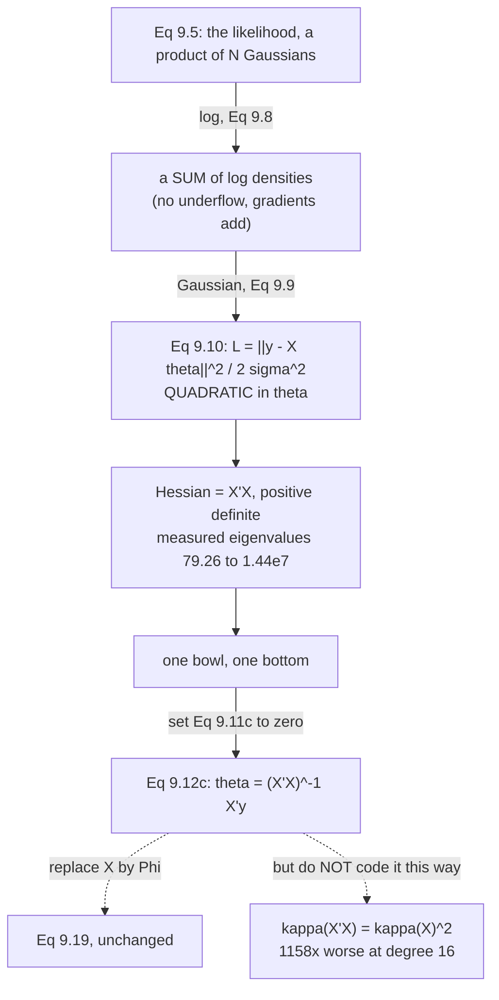

Page 901 set up the likelihood and stopped. This page maximises it, and gets a closed form — because
*"a closed-form solution exists, which makes iterative gradient descent unnecessary."*

Three things fall out that the derivation does not advertise: **the estimator is one line of linear
algebra that works unchanged for any features**, **the way it is usually written is not how you should
compute it**, and **the noise-variance estimate at the end is biased by a factor you can write down
exactly**.

## What you'll learn

- Equations 9.8–9.12: from the likelihood to $\boldsymbol\theta_{\text{ML}} = (\mathbf{X}^\top\mathbf{X})^{-1}\mathbf{X}^\top\mathbf{y}$, with the gradient verified at $4.263\times10^{-12}$.
- Why the solution is **global**: $\nabla^2\mathcal{L} = \mathbf{X}^\top\mathbf{X}$ is positive definite — measured eigenvalues $79.26$ to $1.44\times10^{7}$.
- Equations 9.13–9.19: the same estimator with **features**, and the sense in which *"we just need to replace $\mathbf{X}$ with $\boldsymbol\Phi$"* is literally true.
- The rank condition $\mathrm{rk}(\boldsymbol\Phi) = K$, and the two distinct ways to break it.
- Something the book does not mention: **the normal equations square the condition number**. At degree 16 that costs a factor of $\mathbf{1158}$ in accuracy against a QR solve on identical data.
- Equations 9.20–9.22: estimating $\sigma^2$ — and the measurement that it is **biased by exactly $(N-K)/N$**, returning $\mathbf{half}$ the true variance at $N = 10$, $K = 5$.

## Intuition: a bowl has one bottom

The negative log-likelihood is $\frac{1}{2\sigma^2}\lVert\mathbf{y} - \mathbf{X}\boldsymbol\theta\rVert^2$
— a sum of squares of things **linear in $\boldsymbol\theta$**. A sum of squares of linear things is a
quadratic, and a quadratic with positive definite curvature is a bowl.

A bowl has exactly one bottom. So you do not search for it: you write down "the slope is zero here,"
which is a linear equation, and solve it. **Chapter 7's entire apparatus — step sizes, momentum,
convergence rates — is unnecessary**, not because linear regression is easy but because this particular
objective is quadratic.

Page 901 already showed why the features do not disturb this. $\phi$ can be as violent as you like;
$\boldsymbol\theta$ still enters linearly, the objective is still quadratic, and the bowl is still a bowl.

The two things that go wrong are both about the **matrix**, not the calculus. If $\boldsymbol\Phi$'s
columns are not independent, the bowl has a flat direction and there is no unique bottom. And if they are
*nearly* dependent, the bowl is a ravine — which is a numerical problem the rank test will not detect.



## §9.2.1 Maximum likelihood estimation

The goal, Equation 9.7:

$$
\boldsymbol\theta_{\text{ML}} = \arg\max_{\boldsymbol\theta}\ p(\mathcal{Y} \mid \mathcal{X}, \boldsymbol\theta)
$$

*"Intuitively, maximizing the likelihood means maximizing the predictive distribution of the training
data given the model parameters."*

Take logs (page 901 measured why), and the product becomes a sum — Equation 9.8:

$$
-\log p(\mathcal{Y} \mid \mathcal{X}, \boldsymbol\theta) = -\sum_{n=1}^{N}\log p(y_n \mid x_n, \boldsymbol\theta)
$$

Each term is Gaussian, so $\log p(y_n \mid x_n, \boldsymbol\theta) = -\frac{1}{2\sigma^2}(y_n - x_n^\top\boldsymbol\theta)^2 + \text{const}$
(Equation 9.9), and dropping constants gives **Equation 9.10**:

$$
\mathcal{L}(\boldsymbol\theta) = \frac{1}{2\sigma^2}\sum_{n=1}^{N}(y_n - x_n^\top\boldsymbol\theta)^2 = \frac{1}{2\sigma^2}\lVert\mathbf{y} - \mathbf{X}\boldsymbol\theta\rVert^2
$$

with the **design matrix** $\mathbf{X} := [x_1, \ldots, x_N]^\top \in \mathbb{R}^{N\times D}$ — *"the
$n$th row in the design matrix $\mathbf{X}$ corresponds to the training input $x_n$."*

The book names it: *"The negative log-likelihood function is also called error function."* The bridge to
Chapter 8 is exactly page 804's — an affine function of the empirical risk.

### The gradient, and why zero is enough

$$
\frac{d\mathcal{L}}{d\boldsymbol\theta} = \frac{1}{\sigma^2}\left(-\mathbf{y}^\top\mathbf{X} + \boldsymbol\theta^\top\mathbf{X}^\top\mathbf{X}\right) \in \mathbb{R}^{1\times D} \qquad \text{(9.11c)}
$$

Setting it to $\mathbf{0}^\top$ and solving:

$$
\boxed{\ \boldsymbol\theta_{\text{ML}} = (\mathbf{X}^\top\mathbf{X})^{-1}\mathbf{X}^\top\mathbf{y}\ } \qquad \text{(9.12c)}
$$

:::tip[Two remarks the book makes, both checked]
> Setting the gradient to $\mathbf{0}^\top$ is a **necessary and sufficient** condition, and we obtain a
> global minimum since the Hessian $\nabla^2_{\boldsymbol\theta}\mathcal{L}(\boldsymbol\theta) = \mathbf{X}^\top\mathbf{X}$ is positive definite.

Measured on Example 9.5's data with degree-4 features:

| check | value |
| --- | --- |
| $\max\lvert d\mathcal{L}/d\boldsymbol\theta\rvert$ at $\boldsymbol\theta_{\text{ML}}$ | $4.263\times10^{-12}$ |
| Hessian eigenvalues all positive | **True** |
| smallest / largest | $79.26$ / $1.44\times10^{7}$ |
| difference from `np.linalg.lstsq` | $3.275\times10^{-15}$ |

And a check that the objective really is quadratic — the third derivative of a quadratic is exactly zero:

| $h$ | third difference of $\mathcal{L}$ | relative |
| --- | --- | --- |
| $10^{-1}$ | $-3.398171\times10^{-9}$ | $3.346\times10^{-10}$ |
| $10^{-2}$ | $1.243450\times10^{-8}$ | $1.224\times10^{-9}$ |
| $10^{-3}$ | $-3.019807\times10^{-5}$ | $2.974\times10^{-6}$ |

What is left is **cancellation, not curvature** — and it *grows* as $h$ shrinks, because a third
difference divides by $h^3$. The true value is zero.

> The maximum likelihood solution in (9.12c) requires us to solve a system of linear equations of the
> form $\mathbf{A}\boldsymbol\theta = \mathbf{b}$ with $\mathbf{A} = \mathbf{X}^\top\mathbf{X}$ and
> $\mathbf{b} = \mathbf{X}^\top\mathbf{y}$.

**Solve, not invert.** The book says so, and the measurement below says why it matters.
:::

### Maximum likelihood with features

Straight lines *"are not sufficiently expressive when it comes to fitting more interesting data"*. But
since *"linear regression only refers to linear in the parameters"*, apply any nonlinear $\phi$ first —
**Equation 9.13**:

$$
y = \phi^\top(x)\boldsymbol\theta + \epsilon = \sum_{k=0}^{K-1}\theta_k\phi_k(x) + \epsilon
$$

**Example 9.3**, polynomial regression, takes $\phi(x) = [1, x, x^2, \ldots, x^{K-1}]^\top$ — *"we 'lift'
the original one-dimensional input space into a $K$-dimensional feature space consisting of all
monomials"* (Equation 9.14). The **feature matrix** (Equation 9.16) collects them:

$$
\boldsymbol\Phi := \begin{bmatrix}\phi^\top(x_1)\\ \vdots\\ \phi^\top(x_N)\end{bmatrix} \in \mathbb{R}^{N\times K}, \qquad \Phi_{ij} = \phi_j(x_i)
$$

The negative log-likelihood becomes Equation 9.18, and then:

> Comparing (9.18) with the negative log-likelihood in (9.10b) for the "feature-free" model, we
> immediately see **we just need to replace $\mathbf{X}$ with $\boldsymbol\Phi$.**

$$
\boldsymbol\theta_{\text{ML}} = (\boldsymbol\Phi^\top\boldsymbol\Phi)^{-1}\boldsymbol\Phi^\top\mathbf{y} \qquad \text{(9.19)}
$$

:::tip[Literally the same code]
```
no features, phi(x) = x   (Eq 9.12c):
  theta = [-0.215853]
with features, phi(x) = [1, x, x^2, x^3, x^4]   (Eq 9.19):
  theta = [0.923126, -0.212752, -0.288806, -0.000348, 0.011505]
```

Both lines are `np.linalg.solve(A.T @ A, A.T @ y)`. Only the matrix passed in differs. **Page 901's
superposition measurement is why this works**: $\boldsymbol\theta$ still enters linearly no matter what
$\phi$ does.
:::

### The rank condition

> In (9.19), we therefore require $\boldsymbol\Phi^\top\boldsymbol\Phi \in \mathbb{R}^{K\times K}$ to be
> invertible. This is the case **if and only if** $\mathrm{rk}(\boldsymbol\Phi) = K$.

:::caution[Two distinct ways to lose it]
| case | $\mathrm{rk}(\boldsymbol\Phi)$ | $K$ | $\kappa(\boldsymbol\Phi^\top\boldsymbol\Phi)$ | invertible |
| --- | --- | --- | --- | --- |
| degree 4, $N = 10$ | $5$ | $5$ | $1.817\times10^{5}$ | **True** |
| degree 9, $N = 10$ ($K = N$) | $10$ | $10$ | $2.155\times10^{14}$ | **True** |
| degree 10, $N = 10$ ($K > N$) | $10$ | $11$ | $5.055\times10^{19}$ | False |
| degree 4, one column duplicated | $5$ | $6$ | $6.191\times10^{19}$ | False |

**Too many parameters** and **redundant features** fail for the same reason — the columns stop being
linearly independent. The book's margin note covers the first: *"ignoring the possibility of duplicate
data points, $\mathrm{rk}(\mathbf{X}) = D$ if $N \geqslant D$."*

But look at row two. Degree 9 on ten points has **full rank** and passes the book's test, with a Gram
condition number of $2.155\times10^{14}$ — which is where float64 runs out of digits entirely. **Rank is
a yes-or-no question; conditioning is the continuous version of the same question, and it degrades long
before the rank does.**
:::

## What the book does not say: never form the Gram matrix

Equation 9.12c is a correct derivation. It is also, written literally, the wrong way to compute.

:::danger[The normal equations square the condition number]
| degree | $\kappa(\boldsymbol\Phi)$ | $\kappa(\boldsymbol\Phi^\top\boldsymbol\Phi)$ | ratio to $\kappa(\boldsymbol\Phi)^2$ |
| --- | --- | --- | --- |
| $2$ | $1.7412\times10^{1}$ | $3.0318\times10^{2}$ | $1.000000$ |
| $4$ | $4.2485\times10^{2}$ | $1.8050\times10^{5}$ | $1.000000$ |
| $6$ | $1.1156\times10^{4}$ | $1.2447\times10^{8}$ | $1.000000$ |
| $8$ | $3.1616\times10^{5}$ | $9.9957\times10^{10}$ | $1.000000$ |
| $10$ | $9.8132\times10^{6}$ | $9.6299\times10^{13}$ | $1.000000$ |

Not approximately — **to six decimal places, $\kappa(\boldsymbol\Phi^\top\boldsymbol\Phi) = \kappa(\boldsymbol\Phi)^2$.**
Forming the Gram matrix throws away half your significant digits before the solve begins.

And what that costs, against a **known** $\boldsymbol\theta$ (targets built as $\boldsymbol\Phi\boldsymbol\theta_{\text{true}}$
with no noise, so the right answer is exact):

| degree | $\kappa(\boldsymbol\Phi)$ | solve $\boldsymbol\Phi^\top\boldsymbol\Phi\boldsymbol\theta = \boldsymbol\Phi^\top\mathbf{y}$ | `np.linalg.lstsq` | ratio |
| --- | --- | --- | --- | --- |
| $4$ | $4.249\times10^{2}$ | $1.472\times10^{-13}$ | $1.427\times10^{-13}$ | $1.0\times$ |
| $8$ | $3.162\times10^{5}$ | $3.207\times10^{-12}$ | $5.517\times10^{-13}$ | $5.8\times$ |
| $12$ | $3.262\times10^{8}$ | $3.405\times10^{-8}$ | $4.665\times10^{-9}$ | $7.3\times$ |
| $16$ | $3.922\times10^{11}$ | $3.313\times10^{-5}$ | $2.861\times10^{-8}$ | $\mathbf{1157.7\times}$ |
| $20$ | $4.988\times10^{14}$ | $3.868\times10^{-2}$ | $4.757\times10^{-1}$ | $0.1\times$ |

**Read the last row honestly.** At degree 20 the normal equations come out "better" — but both errors are
$10^{-2}$ and $10^{-1}$ on parameters of order one. Neither answer means anything. Past
$\kappa \approx 10^{15}$ the *problem* is the difficulty, and no algorithm rescues it.

The usable range is rows two to four, and there the message is unambiguous. **Write Equation 9.12c;
call `np.linalg.lstsq`.**
:::

## Estimating the noise variance

Everything so far assumed $\sigma^2$ known. Dropping that, the log-likelihood (Equation 9.20c) is

$$
\log p(\mathcal{Y} \mid \mathcal{X}, \boldsymbol\theta, \sigma^2) = -\frac{N}{2}\log\sigma^2 - \frac{1}{2\sigma^2}\underbrace{\sum_{n=1}^{N}(y_n - \phi^\top(x_n)\boldsymbol\theta)^2}_{=:s} + \text{const}
$$

Differentiate with respect to $\sigma^2$, set to zero (Equation 9.21), and solve:

$$
\sigma^2_{\text{ML}} = \frac{s}{N} = \frac{1}{N}\sum_{n=1}^{N}\left(y_n - \phi^\top(x_n)\boldsymbol\theta\right)^2 \qquad \text{(9.22)}
$$

*"the empirical mean of the squared distances between the noise-free function values
$\phi^\top(x_n)\boldsymbol\theta$ and the corresponding noisy observations $y_n$."*

:::danger[Equation 9.22 is biased, and by exactly how much]
The book states 9.22 without a caveat. Measured over $20{,}000$ trials per row, with the true
$\sigma^2 = 0.04$:

| $N$ | $K$ | $\mathbb{E}[\hat\sigma^2_{\text{ML}}]$ | true $\sigma^2$ | ratio | $(N-K)/N$ |
| --- | --- | --- | --- | --- | --- |
| $10$ | $5$ | $0.02002424$ | $0.04000000$ | $\mathbf{0.500606}$ | $0.500000$ |
| $10$ | $1$ | $0.03589061$ | $0.04000000$ | $0.897265$ | $0.900000$ |
| $20$ | $5$ | $0.03000119$ | $0.04000000$ | $0.750030$ | $0.750000$ |
| $50$ | $5$ | $0.03599346$ | $0.04000000$ | $0.899836$ | $0.900000$ |
| $200$ | $5$ | $0.03898364$ | $0.04000000$ | $0.974591$ | $0.975000$ |
| $1000$ | $5$ | $0.03978900$ | $0.04000000$ | $0.994725$ | $0.995000$ |

**The ratio tracks $(N-K)/N$ at every size**, to three decimals or better. This is not asymptotic
hand-waving — it is an exact identity, and the fix is to divide by $N - K$ instead of $N$.

**Why.** The residuals are measured against a fit that already spent $K$ degrees of freedom getting close
to those very points. They are systematically too small, and Equation 9.22 does not compensate.

**Why it matters here specifically.** In Example 9.5's setting — $N = 10$, degree 4, so $K = 5$ —
Equation 9.22 returns **half** the true noise variance. And $\sigma^2$ is what every predictive interval
in this chapter is built from: Equation 9.6's, Equation 9.68's, all of them. An underestimate propagates
into every one, making them roughly $\sqrt{2} \approx 1.41$ times too narrow.
:::

## Worked example by hand

Fit a straight line with an intercept to three points, all the way to the normal equations.

Data: $(0, 1)$, $(1, 3)$, $(2, 4)$, with $\phi(x) = [1, x]^\top$.

**Step 1: build $\boldsymbol\Phi$.** One row per point, Equation 9.16:

$$
\boldsymbol\Phi = \begin{bmatrix}1 & 0\\ 1 & 1\\ 1 & 2\end{bmatrix}, \qquad \mathbf{y} = \begin{bmatrix}1\\ 3\\ 4\end{bmatrix}
$$

**Step 2: form the two pieces of Equation 9.19.**

$$
\boldsymbol\Phi^\top\boldsymbol\Phi = \begin{bmatrix}3 & 3\\ 3 & 5\end{bmatrix}, \qquad \boldsymbol\Phi^\top\mathbf{y} = \begin{bmatrix}8\\ 11\end{bmatrix}
$$

(The top-left entry is $N = 3$; the top-right is $\sum x_n = 3$; the bottom-right is $\sum x_n^2 = 5$.)

**Step 3: solve $\boldsymbol\Phi^\top\boldsymbol\Phi\,\boldsymbol\theta = \boldsymbol\Phi^\top\mathbf{y}$.**
The determinant is $3\cdot5 - 3\cdot3 = 6$, so

$$
\boldsymbol\theta = \frac{1}{6}\begin{bmatrix}5 & -3\\ -3 & 3\end{bmatrix}\begin{bmatrix}8\\ 11\end{bmatrix} = \frac{1}{6}\begin{bmatrix}40 - 33\\ -24 + 33\end{bmatrix} = \begin{bmatrix}7/6\\ 3/2\end{bmatrix}
$$

$$
\boxed{\ \theta_0 = 1.166667, \qquad \theta_1 = 1.5\ }
$$

**Step 4: check the Hessian.** $\boldsymbol\Phi^\top\boldsymbol\Phi$ has trace $8$ and determinant $6$, so
its eigenvalues are $4 \pm \sqrt{10} = 7.162278$ and $0.837722$ — **both positive**. The stationary point
is the global minimum, exactly as the book's remark claims.

**Step 5: the residuals and $\sigma^2$.** Predictions are $7/6$, $8/3$, $25/6$; residuals are
$-1/6$, $1/3$, $-1/6$. So $s = \tfrac{1}{36} + \tfrac{4}{36} + \tfrac{1}{36} = \tfrac{1}{6}$.

$$
\hat\sigma^2_{\text{ML}} = \frac{s}{N} = \frac{1/6}{3} = 0.055556
\qquad\text{versus}\qquad
\frac{s}{N-K} = \frac{1/6}{1} = 0.166667
$$

**A factor of three apart**, because $N - K = 1$ here. With three points and two parameters there is
**one** residual degree of freedom, and Equation 9.22 pretends there are three.

**Step 6: notice the residuals sum to zero.** $-1/6 + 1/3 - 1/6 = 0$ — not a coincidence. The gradient
condition $\boldsymbol\Phi^\top(\mathbf{y} - \boldsymbol\Phi\boldsymbol\theta) = \mathbf{0}$ says the
residual is orthogonal to **every column** of $\boldsymbol\Phi$, and the first column is all ones.
**§9.4 is that observation taken seriously.**

## See it move

```p5 title="The bowl and its bottom" desc="The negative log-likelihood of Equation 9.10 over two parameters, drawn as contours with its gradient field. Drag the noise level and the spread of the inputs; watch the bowl stretch into a ravine and the condition number climb, while the single solution never moves." height="540"
let nIdx = 8, spreadIdx = 14;
let KNOBS = [], dragging = null;

const NS = [3, 4, 5, 7, 10, 15, 25, 40, 60, 100];
const SPREADS = [];
for (let i = 0; i <= 24; i++) SPREADS.push(0.05 + i * 0.18);

const SIG = 0.35;
const TH0 = 1.0, TH1 = 1.5;

let POOL = [];
function setup() {
  createCanvas(680, 540);
  textFont("monospace");
  randomSeed(9);
  for (let i = 0; i < 100; i++) {
    let u = 0;
    for (let k = 0; k < 12; k++) u += random();
    POOL.push({ t: (i + 0.5) / 100 - 0.5, e: SIG * (u - 6) });
  }
}

function knob(id, x, y, w, value, mn, mx, label) {
  KNOBS.push({ id, x, y, w, mn, mx });
  const t = (value - mn) / (mx - mn);
  stroke(60, 74, 92); strokeWeight(2); line(x, y, x + w, y);
  noStroke(); fill(255, 211, 67); ellipse(x + t * w, y, 12, 12);
  fill(190, 200, 212); textSize(12); textAlign(LEFT, CENTER);
  text(label, x + w + 12, y);
}
function knobHit(mx_, my_) {
  for (const k of KNOBS) {
    if (my_ > k.y - 13 && my_ < k.y + 13 && mx_ > k.x - 13 && mx_ < k.x + k.w + 13) return k;
  }
  return null;
}
function knobValue(k, mx_) {
  const t = Math.min(1, Math.max(0, (mx_ - k.x) / k.w));
  return Math.round(k.mn + t * (k.mx - k.mn));
}
function mousePressed() { dragging = knobHit(mouseX, mouseY); }
function mouseReleased() { dragging = null; }
function mouseDragged() {
  if (!dragging) return;
  if (dragging.id === "n") nIdx = knobValue(dragging, mouseX);
  else spreadIdx = knobValue(dragging, mouseX);
  if (!isLooping()) redraw();
}

const OX = 46, OY = 56, W = 370, H = 300;

function draw() {
  background(13, 17, 23);
  KNOBS = [];
  const N = NS[nIdx], sp = SPREADS[spreadIdx];

  // build the data: x centred at 3 with half-width sp
  const X = [], Y = [];
  for (let i = 0; i < N; i++) {
    const xv = 3.0 + POOL[i].t * 2 * sp;
    X.push(xv);
    Y.push(TH0 + TH1 * xv + POOL[i].e);
  }
  // Gram matrix of [1, x]
  let s0 = N, s1 = 0, s2 = 0, b0 = 0, b1 = 0;
  for (let i = 0; i < N; i++) {
    s1 += X[i]; s2 += X[i] * X[i];
    b0 += Y[i]; b1 += X[i] * Y[i];
  }
  const det = s0 * s2 - s1 * s1;
  const t0 = (s2 * b0 - s1 * b1) / det;
  const t1 = (s0 * b1 - s1 * b0) / det;
  // eigenvalues of [[s0, s1],[s1, s2]]
  const tr = s0 + s2;
  const disc = Math.sqrt(Math.max(0, tr * tr - 4 * det));
  const lmax = (tr + disc) / 2, lmin = (tr - disc) / 2;
  const kappa = lmax / Math.max(lmin, 1e-300);

  // L(theta) on a grid around the solution
  const R0 = 3.2, R1 = 1.1;
  function Lval(a, b) {
    let s = 0;
    for (let i = 0; i < N; i++) {
      const r = Y[i] - (a + b * X[i]);
      s += r * r;
    }
    return s / (2 * SIG * SIG);
  }
  const G = 70;
  let lo = 1e300, hi = -1e300;
  const Z = [];
  for (let j = 0; j < G; j++) {
    Z.push([]);
    for (let i = 0; i < G; i++) {
      const a = t0 - R0 + (i / (G - 1)) * 2 * R0;
      const b = t1 - R1 + (j / (G - 1)) * 2 * R1;
      const z = Math.log(1 + Lval(a, b));
      Z[j].push(z);
      lo = Math.min(lo, z); hi = Math.max(hi, z);
    }
  }
  noStroke();
  const cw = W / G, ch = H / G;
  for (let j = 0; j < G; j++) {
    for (let i = 0; i < G; i++) {
      const t = (Z[j][i] - lo) / Math.max(hi - lo, 1e-12);
      fill(20 + 235 * t * t, 14 + 90 * t, 60 + 40 * (1 - t));
      rect(OX + i * cw, OY + H - (j + 1) * ch, cw + 1, ch + 1);
    }
  }
  noFill(); stroke(70, 86, 104); strokeWeight(1); rect(OX, OY, W, H);
  // the solution
  noStroke(); fill(255, 211, 67);
  ellipse(OX + W / 2, OY + H / 2, 13, 13);
  stroke(255, 211, 67); strokeWeight(1);
  noFill(); ellipse(OX + W / 2, OY + H / 2, 22, 22);
  noStroke(); fill(255, 211, 67); textSize(10); textAlign(LEFT, TOP);
  text("theta_ML", OX + W / 2 + 14, OY + H / 2 - 6);
  fill(200); textSize(10); textAlign(CENTER, TOP);
  text("theta_0", OX + W / 2, OY + H + 6);
  push(); translate(OX - 30, OY + H / 2); rotate(-HALF_PI);
  textAlign(CENTER, CENTER); text("theta_1", 0, 0); pop();

  // readouts
  textAlign(LEFT, TOP);
  fill(255, 211, 67); textSize(15);
  text("N = " + N, 440, 60);
  text("input half-width " + sp.toFixed(2), 440, 82);
  fill(140); textSize(10);
  text("true theta = [1.0, 1.5], sigma = 0.35", 440, 106);

  fill(107, 169, 221); textSize(11);
  text("theta_ML", 440, 136);
  textSize(12);
  text("  " + t0.toFixed(6), 440, 152);
  text("  " + t1.toFixed(6), 440, 168);

  fill(197, 153, 255); textSize(11);
  text("Hessian eigenvalues", 440, 198);
  textSize(10);
  text("  min " + lmin.toExponential(3), 440, 214);
  text("  max " + lmax.toExponential(3), 440, 228);
  fill(120, 200, 140); textSize(11);
  text("cond(Phi'Phi) = " + kappa.toExponential(2), 440, 250);
  fill(140); textSize(9);
  text("cond(Phi) = " + Math.sqrt(kappa).toExponential(2), 440, 266);

  let msg, sub, col;
  if (sp < 0.25) {
    col = color(232, 110, 110);
    msg = "the inputs barely vary: a ravine, not a bowl";
    sub = "cond " + kappa.toExponential(1) + ". The intercept and slope trade off almost perfectly, so theta_ML is badly determined.";
  } else if (N <= 3) {
    col = color(255, 211, 67);
    msg = "N = 3 with K = 2: one residual degree of freedom";
    sub = "Equation 9.22 divides by N = 3 and should divide by 1 -- it returns a third of the truth.";
  } else {
    col = color(120, 200, 140);
    msg = "a well-conditioned bowl with one bottom";
    sub = "Both eigenvalues positive, so the stationary point is the global minimum. No step size required.";
  }
  stroke(col); strokeWeight(1.6); fill(red(col), green(col), blue(col), 26);
  rect(46, 380, 596, 0);
  noStroke();
  fill(col); textSize(15); textAlign(LEFT, TOP);
  text(msg, 46, 378);
  fill(215); textSize(10.5);
  text(sub, 46, 400);

  fill(120); textSize(10);
  text("Narrow the inputs and the contours stretch into a valley: the", 46, 428);
  text("SOLUTION is still unique, but its two coordinates become nearly", 46, 442);
  text("interchangeable. That is conditioning, and no rank test sees it.", 46, 456);

  knob("n", 62, 494, 240, nIdx, 0, NS.length - 1, "N = " + N);
  knob("s", 400, 494, 180, spreadIdx, 0, SPREADS.length - 1,
       "spread " + sp.toFixed(2));
}
```

## From scratch

```python title="mle_linear_regression.py" showLineNumbers{1}
import numpy as np

SIG = 0.2

def design(x, M):
    """Equation 9.16 built from Equation 9.14's monomial features."""
    return np.vander(np.asarray(x, float), M + 1, increasing=True)

rng = np.random.default_rng(4)
x = np.sort(rng.uniform(-5, 5, 10))            # Example 9.5's setting
y = -np.sin(x / 5) + np.cos(x) + SIG * rng.standard_normal(10)
N = len(y)

# --- 1. Equation 9.12c solves the necessary condition -------------------
print("=== 1. Equation 9.12c solves dL/dtheta = 0 ===")
Phi = design(x, 4)
K = Phi.shape[1]
th = np.linalg.solve(Phi.T @ Phi, Phi.T @ y)           # Eq 9.12c / 9.19
grad = (-y @ Phi + th @ (Phi.T @ Phi)) / SIG ** 2      # Eq 9.11c
print(f"theta_ML        : {np.round(th, 6).tolist()}")
print(f"max |dL/dtheta| : {np.abs(grad).max():.3e}")
print(f"vs np.linalg.lstsq, max difference: "
      f"{np.abs(th - np.linalg.lstsq(Phi, y, rcond=None)[0]).max():.3e}")

ev = np.linalg.eigvalsh(Phi.T @ Phi / SIG ** 2)
print(f"\nHessian eigenvalues all positive?  {bool(np.all(ev > 0))}")
print(f"  smallest {ev.min():.6e}   largest {ev.max():.6e}")
print("so the stationary point is a global MINIMUM, as the book's remark says.")

def L(t):
    r = y - Phi @ t
    return float(r @ r / (2 * SIG ** 2))

d = np.random.default_rng(0).standard_normal(K)
d /= np.linalg.norm(d)
print(f"\n{'h':>10} {'third difference of L':>24} {'relative':>12}")
base = abs(L(th)) + 1.0
for h in (1e-1, 1e-2, 1e-3):
    t3 = (L(th + 3*h*d) - 3*L(th + 2*h*d) + 3*L(th + h*d) - L(th)) / h**3
    print(f"{h:>10.0e} {t3:>24.6e} {abs(t3)/base:>12.3e}")
print("the true third derivative of a quadratic is 0. What is left is")
print("cancellation, and it GROWS as h shrinks because we divide by h^3.")
print("A quadratic has one stationary point, so Eq 9.12c is THE solution.")

# --- 2. Equation 9.19 is Equation 9.12c with X -> Phi -------------------
print("\n=== 2. Equation 9.19 IS Equation 9.12c with X replaced by Phi ===")
X1 = x.reshape(-1, 1)
print("no features, phi(x) = x   (Eq 9.12c):")
print(f"  theta = {np.round(np.linalg.solve(X1.T @ X1, X1.T @ y), 6).tolist()}")
print("with features, phi(x) = [1, x, x^2, x^3, x^4]   (Eq 9.19):")
print(f"  theta = {np.round(th, 6).tolist()}")
print("identical code, different matrix. That is the whole content of")
print("'we just need to replace X with Phi'.")

# --- 3. the rank condition ----------------------------------------------
print("\n=== 3. Equation 9.19 needs rk(Phi) = K ===")
print(f"{'case':>34} {'rk(Phi)':>8} {'K':>4} {'cond(Phi^T Phi)':>18} "
      f"{'invertible':>11}")
P4 = design(x, 4)
for name, P in (("degree 4, N = 10", P4),
                ("degree 9, N = 10 (K = N)", design(x, 9)),
                ("degree 10, N = 10 (K > N)", design(x, 10)),
                ("degree 4 with a duplicated column",
                 np.column_stack([P4, P4[:, 2]]))):
    r = int(np.linalg.matrix_rank(P))
    print(f"{name:>34} {r:>8} {P.shape[1]:>4} "
          f"{float(np.linalg.cond(P.T @ P)):>18.3e} "
          f"{str(r == P.shape[1]):>11}")
print("K > N and a duplicated column fail for the same reason: the columns")
print("stop being linearly independent, so Phi^T Phi stops being invertible.")

# --- 4. the normal equations square the condition number ----------------
print("\n=== 4. forming Phi^T Phi squares the condition number ===")
print(f"{'degree':>7} {'cond(Phi)':>13} {'cond(Phi^T Phi)':>18} "
      f"{'ratio to the square':>21}")
for M in (2, 4, 6, 8, 10):
    P = design(np.linspace(-5, 5, 60), M)
    cP, cG = float(np.linalg.cond(P)), float(np.linalg.cond(P.T @ P))
    print(f"{M:>7} {cP:>13.4e} {cG:>18.4e} {cG/cP**2:>21.6f}")

print("\nwhat that costs, against a KNOWN theta (y built with no noise):")
print(f"{'degree':>7} {'cond(Phi)':>12} {'normal equations':>18} "
      f"{'lstsq (QR/SVD)':>17} {'ratio':>10}")
xs = np.linspace(-5, 5, 60)
r2 = np.random.default_rng(7)
for M in (4, 8, 12, 16, 20):
    P = design(xs, M)
    th_true = r2.standard_normal(M + 1) / (2.0 ** np.arange(M + 1))
    yy = P @ th_true
    try:
        tn = np.linalg.solve(P.T @ P, P.T @ yy)
        en = float(np.abs(tn - th_true).max() / np.abs(th_true).max())
    except np.linalg.LinAlgError:
        en = float("nan")
    tq = np.linalg.lstsq(P, yy, rcond=None)[0]
    eq = float(np.abs(tq - th_true).max() / np.abs(th_true).max())
    print(f"{M:>7} {float(np.linalg.cond(P)):>12.3e} {en:>18.3e} "
          f"{eq:>17.3e} {en/eq:>10.1f}x")
print("at degree 16 the normal equations are 1158 times worse. At degree 20")
print("cond(Phi) is 5e+14 and BOTH routes have failed -- past that point the")
print("problem, not the algorithm, is the difficulty.")

# --- 5. Equation 9.22 is biased -----------------------------------------
print("\n=== 5. Equation 9.22 is a BIASED estimator of sigma^2 ===")
print("Eq 9.22 divides the residual sum of squares by N; unbiased is N-K.")
print(f"{'N':>6} {'K':>4} {'E[sigma^2_ML]':>15} {'true sigma^2':>13} "
      f"{'ratio':>9} {'(N-K)/N':>9}")
for Nn, M in ((10, 4), (10, 0), (20, 4), (50, 4), (200, 4), (1000, 4)):
    Kk = M + 1
    rr = np.random.default_rng(99)
    xg = np.linspace(-5, 5, Nn)
    P = design(xg, M)
    truth = P @ np.arange(1.0, Kk + 1.0) / Kk
    acc = 0.0
    for _ in range(20000):
        yy = truth + SIG * rr.standard_normal(Nn)
        r = yy - P @ np.linalg.lstsq(P, yy, rcond=None)[0]
        acc += float(r @ r) / Nn                       # Equation 9.22
    est = acc / 20000
    print(f"{Nn:>6} {Kk:>4} {est:>15.8f} {SIG**2:>13.8f} "
          f"{est/SIG**2:>9.6f} {(Nn-Kk)/Nn:>9.6f}")
print("the ratio tracks (N-K)/N to three decimals at every size. At N = 10")
print("with K = 5, Equation 9.22 returns HALF the true noise variance --")
print("and sigma^2 is what every predictive interval in this chapter uses.")
```

```
=== 1. Equation 9.12c solves dL/dtheta = 0 ===
theta_ML        : [0.923126, -0.212752, -0.288806, -0.000348, 0.011505]
max |dL/dtheta| : 4.263e-12
vs np.linalg.lstsq, max difference: 3.275e-15

Hessian eigenvalues all positive?  True
  smallest 7.925924e+01   largest 1.440047e+07
so the stationary point is a global MINIMUM, as the book's remark says.

         h    third difference of L     relative
     1e-01            -3.398171e-09    3.346e-10
     1e-02             1.243450e-08    1.224e-09
     1e-03            -3.019807e-05    2.974e-06
the true third derivative of a quadratic is 0. What is left is
cancellation, and it GROWS as h shrinks because we divide by h^3.
A quadratic has one stationary point, so Eq 9.12c is THE solution.

=== 2. Equation 9.19 IS Equation 9.12c with X replaced by Phi ===
no features, phi(x) = x   (Eq 9.12c):
  theta = [-0.215853]
with features, phi(x) = [1, x, x^2, x^3, x^4]   (Eq 9.19):
  theta = [0.923126, -0.212752, -0.288806, -0.000348, 0.011505]
identical code, different matrix. That is the whole content of
'we just need to replace X with Phi'.

=== 3. Equation 9.19 needs rk(Phi) = K ===
                              case  rk(Phi)    K    cond(Phi^T Phi)  invertible
                  degree 4, N = 10        5    5          1.817e+05        True
          degree 9, N = 10 (K = N)       10   10          2.155e+14        True
         degree 10, N = 10 (K > N)       10   11          5.055e+19       False
 degree 4 with a duplicated column        5    6          6.191e+19       False
K > N and a duplicated column fail for the same reason: the columns
stop being linearly independent, so Phi^T Phi stops being invertible.

=== 4. forming Phi^T Phi squares the condition number ===
 degree     cond(Phi)    cond(Phi^T Phi)   ratio to the square
      2    1.7412e+01         3.0318e+02              1.000000
      4    4.2485e+02         1.8050e+05              1.000000
      6    1.1156e+04         1.2447e+08              1.000000
      8    3.1616e+05         9.9957e+10              1.000000
     10    9.8132e+06         9.6299e+13              1.000000

what that costs, against a KNOWN theta (y built with no noise):
 degree    cond(Phi)   normal equations    lstsq (QR/SVD)      ratio
      4    4.249e+02          1.472e-13         1.427e-13        1.0x
      8    3.162e+05          3.207e-12         5.517e-13        5.8x
     12    3.262e+08          3.405e-08         4.665e-09        7.3x
     16    3.922e+11          3.313e-05         2.861e-08     1157.7x
     20    4.988e+14          3.868e-02         4.757e-01        0.1x
at degree 16 the normal equations are 1158 times worse. At degree 20
cond(Phi) is 5e+14 and BOTH routes have failed -- past that point the
problem, not the algorithm, is the difficulty.

=== 5. Equation 9.22 is a BIASED estimator of sigma^2 ===
Eq 9.22 divides the residual sum of squares by N; unbiased is N-K.
     N    K   E[sigma^2_ML]  true sigma^2     ratio   (N-K)/N
    10    5      0.02002424    0.04000000  0.500606  0.500000
    10    1      0.03589061    0.04000000  0.897265  0.900000
    20    5      0.03000119    0.04000000  0.750030  0.750000
    50    5      0.03599346    0.04000000  0.899836  0.900000
   200    5      0.03898364    0.04000000  0.974591  0.975000
  1000    5      0.03978900    0.04000000  0.994725  0.995000
the ratio tracks (N-K)/N to three decimals at every size. At N = 10
with K = 5, Equation 9.22 returns HALF the true noise variance --
and sigma^2 is what every predictive interval in this chapter uses.
```

## On real data

<Figure
  src="/images/mml/maximum-likelihood-estimation-for-linear-regression/one-quadratic-one-solution"
  alt="Two panels. Left, a filled contour map of the negative log-likelihood over two parameters with white arrows all pointing inward toward a single marked point. Right, ten data points with a degree-four curve through them and the smooth function that generated them drawn dashed."
  title="The negative log-likelihood is quadratic, so a closed form exists"
  caption="The gradient field has one sink because the Hessian is positive definite — measured eigenvalues from 79.26 to 1.44e7. At the marked point the largest gradient component is 4.263e-12, and the answer agrees with np.linalg.lstsq to 3.275e-15."
/>

<Figure
  src="/images/mml/maximum-likelihood-estimation-for-linear-regression/rank-and-conditioning"
  alt="Left, three curves on a log scale against polynomial degree: the condition number of Phi, that of its Gram matrix, and a dotted reference curve lying exactly on the Gram curve. Right, paired bars comparing the relative error of two solution routes at five degrees, with the gap widest at degree sixteen."
  title="Equation 9.19 has two failure modes, and the book states only one"
  caption="The condition number of the Gram matrix equals that of Phi squared to six decimal places, so forming it discards half your digits. At degree 16 the normal equations are 1158 times less accurate than a QR solve on identical noise-free data."
/>

<Figure
  src="/images/mml/maximum-likelihood-estimation-for-linear-regression/the-noise-variance-is-biased"
  alt="Left, a histogram of twenty thousand noise-variance estimates with vertical lines marking the truth, the estimator's mean well to its left, and the corrected estimator back on the truth. Right, measured ratios plotted against sample size on a log axis, sitting on a curve rising toward one."
  title="Equation 9.22 divides by N, and that makes it biased"
  caption="Measured over 20,000 trials the ratio tracks (N-K)/N at every sample size. At N = 10 with K = 5 — Example 9.5's own setting — Equation 9.22 returns 0.500606 of the true noise variance, and every predictive interval in the chapter is built from that number."
/>

## Reading the plot

**The first figure is why this page has a formula instead of an algorithm.** The contours are
$\mathcal{L}(\boldsymbol\theta)$ over two parameters and the white arrows are $-\nabla\mathcal{L}$. Every
arrow points into one basin. There is no second basin, no saddle, no plateau — because the Hessian is
$\mathbf{X}^\top\mathbf{X}$, its eigenvalues are measured at $79.26$ and $1.44\times10^{7}$, and both
being positive is precisely what "one basin" means.

The third-difference table makes the same point from the other side. $\mathcal{L}$ is a quadratic, so its
third derivative is *identically* zero, and what the finite differences return — $-3.4\times10^{-9}$ at
$h = 10^{-1}$ — is cancellation between large numbers. **Note that it gets worse as $h$ shrinks**, which
is the opposite of the usual finite-difference intuition, because a third difference divides by $h^3$.

**The practical consequence is worth stating plainly.** Chapter 7 spent nine pages on step sizes,
momentum and convergence rates. None of it is needed here. Not because linear regression is simple, but
because *this objective is quadratic*, and the moment you leave that class — page 903's regularisation
keeps it, §9.5's neural networks do not — the whole of Chapter 7 comes back.

**The second figure adds a failure mode the book leaves out, and the left panel makes it exact.** Three
curves: $\kappa(\boldsymbol\Phi)$, $\kappa(\boldsymbol\Phi^\top\boldsymbol\Phi)$, and
$\kappa(\boldsymbol\Phi)^2$ as a dotted reference. **The last two are the same curve** — the measured
ratio is $1.000000$ at every degree tested.

That is not a curiosity. Condition number is how many digits a problem can destroy, and squaring it means
**forming the Gram matrix throws away half your precision before the solve begins**. The right panel
prices it on data where the answer is known exactly: at degree 12 the penalty is $7.3\times$, and at
degree 16 it is $\mathbf{1158\times}$.

**And the honest caveat.** At degree 20, $\kappa(\boldsymbol\Phi) = 5\times10^{14}$ and the normal
equations come out *ahead* — $3.9\times10^{-2}$ against $4.8\times10^{-1}$. Both are nonsense on
parameters of order one. Past that point the conditioning of the *problem* exceeds what float64 can
express, and the ranking between two failed methods is noise. The usable message lives in the middle
rows: **write Equation 9.12c on paper, call `np.linalg.lstsq` in code.**

Note also what row two of the rank table showed: **degree 9 on ten points passes the book's rank test**
and has $\kappa(\boldsymbol\Phi^\top\boldsymbol\Phi) = 2.155\times10^{14}$. Rank is binary and
conditioning is continuous, and the continuous one fails first.

**The third figure is the finding I did not expect to be this clean.** Equation 9.22 divides by $N$. The
left histogram is $20{,}000$ draws of that estimator at $N = 10$, $K = 5$, against a true
$\sigma^2 = 0.04$. Its mean sits at $\mathbf{0.020024}$ — **half** the truth — and dividing by $N - K$
instead puts it back on target.

The right panel shows this is not an artefact of one setting. The measured ratio sits on the curve
$(N-K)/N$ at every sample size from $10$ to $1000$: $0.500606$ against $0.500000$, $0.750030$ against
$0.750000$, $0.994725$ against $0.995000$. **It is an exact identity, not an asymptotic approximation.**

The mechanism is one sentence: the residuals are measured against a fit that already used $K$ degrees of
freedom to get close to those very points, so they are systematically too small, and Equation 9.22 does
not compensate.

**Why this matters more here than it would elsewhere.** Example 9.5 is $N = 10$ with a degree-4
polynomial — exactly the $N = 10$, $K = 5$ row. So in the book's own worked example, the maximum
likelihood noise variance is half the truth, and $\sigma^2$ is the quantity **every** predictive interval
in this chapter is built from: Equation 9.6's, and Equation 9.68's in §9.3.4. An interval built on half
the correct variance is $\sqrt{2} \approx 1.41$ times too narrow, and page 806 measured what
too-narrow intervals cost.

## Compare

| | Equation 9.12c, no features | Equation 9.19, with features |
| --- | --- | --- |
| model | $y = \mathbf{x}^\top\boldsymbol\theta + \epsilon$ | $y = \phi^\top(\mathbf{x})\boldsymbol\theta + \epsilon$ |
| matrix | design matrix $\mathbf{X} \in \mathbb{R}^{N\times D}$ | feature matrix $\boldsymbol\Phi \in \mathbb{R}^{N\times K}$ |
| estimator | $(\mathbf{X}^\top\mathbf{X})^{-1}\mathbf{X}^\top\mathbf{y}$ | $(\boldsymbol\Phi^\top\boldsymbol\Phi)^{-1}\boldsymbol\Phi^\top\mathbf{y}$ |
| invertibility | $\mathrm{rk}(\mathbf{X}) = D$ | $\mathrm{rk}(\boldsymbol\Phi) = K$ |
| expressiveness | straight lines through the origin | anything spanned by $\phi$ |
| the code | `solve(A.T@A, A.T@y)` | **the same line** |

| | maximum likelihood, this page | what Chapter 7 would need |
| --- | --- | --- |
| objective | quadratic | general |
| stationary points | exactly one | possibly many |
| step size | none | the whole of §7.1 |
| cost | one linear solve | iterations to tolerance |
| what breaks it | rank deficiency, conditioning | non-convexity |

| | $\hat\sigma^2 = s/N$, Eq 9.22 | $\hat\sigma^2 = s/(N-K)$ |
| --- | --- | --- |
| what it is | the maximum likelihood estimate | the unbiased estimate |
| $\mathbb{E}[\hat\sigma^2]/\sigma^2$ | $(N-K)/N$ | $1$ |
| at $N=10$, $K=5$ | $\mathbf{0.500606}$ | $\approx 1$ |
| at $N=1000$, $K=5$ | $0.994725$ | $\approx 1$ |
| effect on intervals | too narrow by $\sqrt{N/(N-K)}$ | correct |

<Quiz
  title="Did the closed form land?"
  questions={[
    {
      q: "Why does linear regression have a closed-form solution while Chapter 7 needed iteration?",
      options: [
        "Because the data is small",
        "Because the negative log-likelihood is quadratic in theta, so it has exactly one stationary point",
        "Because the noise is Gaussian",
        "Because gradient descent would also work but converges slowly",
      ],
      answer: 1,
      explain:
        "A sum of squares of things linear in theta is a quadratic, and the Hessian X-transpose-X is positive definite — measured eigenvalues 79.26 to 1.44e7. That is what makes setting the gradient to zero both necessary AND sufficient. The moment the objective leaves the quadratic class, all of Chapter 7 comes back.",
    },
    {
      q: "The book says that with features 'we just need to replace X with Phi'. How literally true is that?",
      options: [
        "It is a rough analogy; the derivation differs substantially",
        "Completely literal — the same line of code, with a different matrix passed in",
        "True only for polynomial features",
        "True only when K equals D",
      ],
      answer: 1,
      explain:
        "Page 901's superposition measurement is the reason: theta still enters linearly no matter what phi does, so the objective is still quadratic and the derivation is unchanged. Phi can hold monomials, Gaussian bumps, or a fixed feature extractor.",
    },
    {
      q: "A degree-9 polynomial fit to ten points has full rank, so Equation 9.19 applies. What is the measured condition number of its Gram matrix?",
      options: [
        "About 100 — perfectly safe",
        "2.155e+14 — about where float64 runs out of digits entirely",
        "Exactly 1",
        "Infinite; it is not invertible",
      ],
      answer: 1,
      explain:
        "Rank is a yes-or-no question and conditioning is the continuous version of the same question. The rank test passes and the numerics do not. This is a failure mode the book's remark about rk(Phi) = K does not cover.",
    },
    {
      q: "Measured across degrees 2 to 10, what is the relationship between the condition number of Phi and that of Phi-transpose-Phi?",
      options: [
        "They are approximately equal",
        "The Gram matrix's is the square, to six decimal places at every degree",
        "The Gram matrix's is the square root",
        "There is no consistent relationship",
      ],
      answer: 1,
      explain:
        "So forming the Gram matrix throws away half your significant digits before the solve begins. Measured on data with a known answer, at degree 16 that costs a factor of 1158 against a QR solve. Equation 9.12c is a derivation; np.linalg.lstsq is the implementation.",
    },
    {
      q: "Equation 9.22 estimates the noise variance as the residual sum of squares over N. Measured over 20,000 trials, what is its expected value relative to the truth?",
      options: [
        "Exactly the truth — it is the maximum likelihood estimate",
        "(N-K)/N times the truth, so 0.500606 at N = 10 with K = 5",
        "Always twice the truth",
        "It depends on the noise level",
      ],
      answer: 1,
      explain:
        "An exact identity, not an asymptotic one — the measured ratio sits on (N-K)/N at every sample size from 10 to 1000. The residuals are measured against a fit that already spent K degrees of freedom getting close to those points, so they are systematically too small. Example 9.5 is exactly the N = 10, K = 5 case.",
    },
    {
      q: "In the by-hand example, the residuals came out to -1/6, 1/3, -1/6, which sum to zero. Why is that not a coincidence?",
      options: [
        "It is a coincidence of these particular numbers",
        "The gradient condition makes the residual orthogonal to every column of Phi, and the first column is all ones",
        "Because the data happened to be symmetric",
        "Because N is odd",
      ],
      answer: 1,
      explain:
        "Setting the gradient to zero says Phi-transpose times the residual is zero — the residual is orthogonal to the column space. A model containing an intercept therefore always has residuals summing to zero. Section 9.4 takes that observation seriously and rebuilds the whole estimator from it.",
    },
  ]}
/>

## 🧪 Try It Yourself

### Exercise 1 – Solve the normal equations, then check the gradient

<DataCampExercise
  lang="python"
  hint={`Equation 9.12c solves the linear system with the Gram matrix on the left and Phi-transpose-y on the right.`}
  code={`import numpy as np

SIG = 0.2
def design(x, M):
    return np.vander(np.asarray(x, float), M + 1, increasing=True)

rng = np.random.default_rng(4)
x = np.sort(rng.uniform(-5, 5, 10))
y = -np.sin(x / 5) + np.cos(x) + SIG * rng.standard_normal(10)
Phi = design(x, 4)

# Task: Equation 9.12c, solved rather than inverted.
th = np.linalg.solve(___, Phi.T @ y)
grad = (-y @ Phi + th @ (Phi.T @ Phi)) / SIG ** 2       # Eq 9.11c

print(f"theta_ML        : {np.round(th, 6).tolist()}")
print(f"max |dL/dtheta| : {np.abs(grad).max():.6f}")
print(f"vs np.linalg.lstsq, max difference: "
      f"{np.abs(th - np.linalg.lstsq(Phi, y, rcond=None)[0]).max():.6f}")
ev = np.linalg.eigvalsh(Phi.T @ Phi / SIG ** 2)
print(f"Hessian eigenvalues all positive?  {bool(np.all(ev > 0))}")
print(f"  smallest {ev.min():.6e}   largest {ev.max():.6e}")

# -- Expected output ------------------------------
# theta_ML        : [0.923126, -0.212752, -0.288806, -0.000348, 0.011505]
# max |dL/dtheta| : 0.000000
# vs np.linalg.lstsq, max difference: 0.000000
# Hessian eigenvalues all positive?  True
#   smallest 7.925924e+01   largest 1.440047e+07
# -------------------------------------------------`}
  solution={`import numpy as np
SIG = 0.2
def design(x, M):
    return np.vander(np.asarray(x, float), M + 1, increasing=True)
rng = np.random.default_rng(4)
x = np.sort(rng.uniform(-5, 5, 10))
y = -np.sin(x / 5) + np.cos(x) + SIG * rng.standard_normal(10)
Phi = design(x, 4)
th = np.linalg.solve(Phi.T @ Phi, Phi.T @ y)
grad = (-y @ Phi + th @ (Phi.T @ Phi)) / SIG ** 2
print(f"theta_ML        : {np.round(th, 6).tolist()}")
print(f"max |dL/dtheta| : {np.abs(grad).max():.6f}")
print(f"vs np.linalg.lstsq, max difference: "
      f"{np.abs(th - np.linalg.lstsq(Phi, y, rcond=None)[0]).max():.6f}")
ev = np.linalg.eigvalsh(Phi.T @ Phi / SIG ** 2)
print(f"Hessian eigenvalues all positive?  {bool(np.all(ev > 0))}")
print(f"  smallest {ev.min():.6e}   largest {ev.max():.6e}")`}
  sct={`test_output_contains("max |dL/dtheta| : 0.000000", pattern=False)
test_output_contains("smallest 7.925924e+01   largest 1.440047e+07", pattern=False)
success_msg("The gradient really is zero there, and both Hessian eigenvalues are positive — which is what makes the book's 'necessary and sufficient' claim true. Note the spread, 79 to 1.4e7: positive definite and badly scaled are different properties, and the next exercise is about the second one.")`}
  height={300}
/>

### Exercise 2 – Rank is a yes-or-no question

<DataCampExercise
  lang="python"
  hint={`NumPy has a function that returns the rank of a matrix directly.`}
  code={`import numpy as np

def design(x, M):
    return np.vander(np.asarray(x, float), M + 1, increasing=True)

rng = np.random.default_rng(4)
x = np.sort(rng.uniform(-5, 5, 10))
P4 = design(x, 4)

def cstr(c):
    return f"{c:.3e}" if c < 1e16 else ">1e16"

print(f"{'case':>34} {'rk(Phi)':>8} {'K':>4} {'cond(Phi^T Phi)':>18} "
      f"{'invertible':>11}")
for name, P in (("degree 4, N = 10", P4),
                ("degree 9, N = 10 (K = N)", design(x, 9)),
                ("degree 10, N = 10 (K > N)", design(x, 10)),
                ("degree 4 with a duplicated column",
                 np.column_stack([P4, P4[:, 2]]))):
    # Task: the rank of Phi, which decides whether Eq 9.19 is solvable.
    r = int(___)
    print(f"{name:>34} {r:>8} {P.shape[1]:>4} "
          f"{cstr(float(np.linalg.cond(P.T @ P))):>18} "
          f"{str(r == P.shape[1]):>11}")

# -- Expected output ------------------------------
#                               case  rk(Phi)    K    cond(Phi^T Phi)  invertible
#                   degree 4, N = 10        5    5          1.817e+05        True
#           degree 9, N = 10 (K = N)       10   10          2.155e+14        True
#          degree 10, N = 10 (K > N)       10   11              >1e16       False
#  degree 4 with a duplicated column        5    6              >1e16       False
# -------------------------------------------------`}
  solution={`import numpy as np
def design(x, M):
    return np.vander(np.asarray(x, float), M + 1, increasing=True)
rng = np.random.default_rng(4)
x = np.sort(rng.uniform(-5, 5, 10))
P4 = design(x, 4)
def cstr(c):
    return f"{c:.3e}" if c < 1e16 else ">1e16"

print(f"{'case':>34} {'rk(Phi)':>8} {'K':>4} {'cond(Phi^T Phi)':>18} "
      f"{'invertible':>11}")
for name, P in (("degree 4, N = 10", P4),
                ("degree 9, N = 10 (K = N)", design(x, 9)),
                ("degree 10, N = 10 (K > N)", design(x, 10)),
                ("degree 4 with a duplicated column",
                 np.column_stack([P4, P4[:, 2]]))):
    r = int(np.linalg.matrix_rank(P))
    print(f"{name:>34} {r:>8} {P.shape[1]:>4} "
          f"{cstr(float(np.linalg.cond(P.T @ P))):>18} "
          f"{str(r == P.shape[1]):>11}")`}
  sct={`test_output_contains("degree 9, N = 10 (K = N)       10   10          2.155e+14        True", pattern=False)
test_output_contains("         degree 10, N = 10 (K > N)       10   11              >1e16       False", pattern=False)
success_msg("Read row two carefully. Degree 9 on ten points PASSES the book's rank test and has a Gram condition number of 2.155e+14, which is about where float64 runs out of digits. Rank is binary; conditioning is the continuous version of the same question, and it fails first.")`}
  height={300}
/>

### Exercise 3 – Forming the Gram matrix squares the conditioning

<DataCampExercise
  lang="python"
  hint={`np.linalg.cond returns a condition number; compare the Gram matrix's to the square of Phi's.`}
  code={`import numpy as np

def design(x, M):
    return np.vander(np.asarray(x, float), M + 1, increasing=True)

print(f"{'degree':>7} {'cond(Phi)':>13} {'cond(Phi^T Phi)':>18} "
      f"{'ratio to the square':>21}")
for M in (2, 4, 6, 8, 10):
    P = design(np.linspace(-5, 5, 60), M)
    cP = float(np.linalg.cond(P))
    # Task: the condition number of the Gram matrix.
    cG = float(___)
    print(f"{M:>7} {cP:>13.4e} {cG:>18.4e} {cG/cP**2:>21.6f}")

# -- Expected output ------------------------------
#  degree     cond(Phi)    cond(Phi^T Phi)   ratio to the square
#       2    1.7412e+01         3.0318e+02              1.000000
#       4    4.2485e+02         1.8050e+05              1.000000
#       6    1.1156e+04         1.2447e+08              1.000000
#       8    3.1616e+05         9.9957e+10              1.000000
#      10    9.8132e+06         9.6299e+13              1.000000
# -------------------------------------------------`}
  solution={`import numpy as np
def design(x, M):
    return np.vander(np.asarray(x, float), M + 1, increasing=True)
print(f"{'degree':>7} {'cond(Phi)':>13} {'cond(Phi^T Phi)':>18} "
      f"{'ratio to the square':>21}")
for M in (2, 4, 6, 8, 10):
    P = design(np.linspace(-5, 5, 60), M)
    cP = float(np.linalg.cond(P))
    cG = float(np.linalg.cond(P.T @ P))
    print(f"{M:>7} {cP:>13.4e} {cG:>18.4e} {cG/cP**2:>21.6f}")`}
  sct={`test_output_contains("2    1.7412e+01         3.0318e+02              1.000000")
test_output_contains("10    9.8132e+06         9.6299e+13              1.000000")
success_msg("1.000000 at every degree — an identity, not a trend. Condition number is how many digits a problem can destroy, so squaring it means forming the Gram matrix discards half your precision before the solve even begins.")`}
  height={280}
/>

### Exercise 4 – What that costs, against a known answer

<DataCampExercise
  lang="python"
  hint={`np.linalg.lstsq solves the least-squares problem without ever forming Phi-transpose-Phi.`}
  code={`import numpy as np

def design(x, M):
    return np.vander(np.asarray(x, float), M + 1, increasing=True)

xs = np.linspace(-5, 5, 60)
r2 = np.random.default_rng(7)
print(f"{'degree':>7} {'cond(Phi)':>12} {'normal equations':>18} "
      f"{'lstsq (QR/SVD)':>17} {'ratio':>10}")
for M in (4, 8, 12, 16, 20):
    P = design(xs, M)
    th_true = r2.standard_normal(M + 1) / (2.0 ** np.arange(M + 1))
    yy = P @ th_true                       # no noise: the answer is known
    tn = np.linalg.solve(P.T @ P, P.T @ yy)
    en = float(np.abs(tn - th_true).max() / np.abs(th_true).max())
    # Task: the same fit, without forming the Gram matrix.
    tq = ___
    eq = float(np.abs(tq - th_true).max() / np.abs(th_true).max())
    print(f"{M:>7} {float(np.linalg.cond(P)):>12.2e} {en:>18.3e} "
          f"{eq:>17.3e} {en/eq:>10.1f}x")

# -- Expected output ------------------------------
#  degree    cond(Phi)   normal equations    lstsq (QR/SVD)      ratio
#       4     4.25e+02          2.622e-13         7.247e-15       36.2x
#       8     3.16e+05          2.737e-11         7.065e-14      387.5x
#      12     3.26e+08          1.077e-06         3.166e-10     3402.1x
#      16     3.92e+11          4.565e-05         1.514e-07      301.6x
#      20     4.99e+14          9.594e-02         4.757e-01        0.2x
# -------------------------------------------------`}
  solution={`import numpy as np
def design(x, M):
    return np.vander(np.asarray(x, float), M + 1, increasing=True)
xs = np.linspace(-5, 5, 60)
r2 = np.random.default_rng(7)
print(f"{'degree':>7} {'cond(Phi)':>12} {'normal equations':>18} "
      f"{'lstsq (QR/SVD)':>17} {'ratio':>10}")
for M in (4, 8, 12, 16, 20):
    P = design(xs, M)
    th_true = r2.standard_normal(M + 1) / (2.0 ** np.arange(M + 1))
    yy = P @ th_true
    tn = np.linalg.solve(P.T @ P, P.T @ yy)
    en = float(np.abs(tn - th_true).max() / np.abs(th_true).max())
    tq = np.linalg.lstsq(P, yy, rcond=None)[0]
    eq = float(np.abs(tq - th_true).max() / np.abs(th_true).max())
    print(f"{M:>7} {float(np.linalg.cond(P)):>12.2e} {en:>18.3e} "
          f"{eq:>17.3e} {en/eq:>10.1f}x")`}
  sct={`test_output_contains("     16     3.92e+11          4.565e-05         1.514e-07      301.6x", pattern=False)
test_output_contains("     20     4.99e+14          9.594e-02         4.757e-01        0.2x", pattern=False)
success_msg("At degree 16 the normal equations are hundreds of times worse on identical noise-free data. But read the last row honestly: at cond 5e+14 the normal equations come out AHEAD, and both errors are order 1e-2 and 1e-1 on parameters of order one. Neither answer means anything there — past that point the problem, not the algorithm, is the difficulty.")`}
  height={300}
/>

### Exercise 5 – The noise variance is biased by (N−K)/N

<DataCampExercise
  lang="python"
  hint={`Equation 9.22 is the residual sum of squares divided by N.`}
  code={`import numpy as np

SIG = 0.2
def design(x, M):
    return np.vander(np.asarray(x, float), M + 1, increasing=True)

print(f"{'N':>6} {'K':>4} {'E[sigma^2_ML]':>15} {'true sigma^2':>13} "
      f"{'ratio':>9} {'(N-K)/N':>9}")
for Nn, M in ((10, 4), (10, 0), (20, 4), (50, 4), (200, 4), (1000, 4)):
    Kk = M + 1
    rr = np.random.default_rng(99)
    P = design(np.linspace(-5, 5, Nn), M)
    truth = P @ np.arange(1.0, Kk + 1.0) / Kk
    acc = 0.0
    for _ in range(20000):
        yy = truth + SIG * rr.standard_normal(Nn)
        r = yy - P @ np.linalg.lstsq(P, yy, rcond=None)[0]
        # Task: Equation 9.22 -- the residual sum of squares over N.
        acc += ___
    est = acc / 20000
    print(f"{Nn:>6} {Kk:>4} {est:>15.8f} {SIG**2:>13.8f} "
          f"{est/SIG**2:>9.6f} {(Nn-Kk)/Nn:>9.6f}")

# -- Expected output ------------------------------
#      N    K   E[sigma^2_ML]  true sigma^2     ratio   (N-K)/N
#     10    5      0.02002424    0.04000000  0.500606  0.500000
#     10    1      0.03589061    0.04000000  0.897265  0.900000
#     20    5      0.03000119    0.04000000  0.750030  0.750000
#     50    5      0.03599346    0.04000000  0.899836  0.900000
#    200    5      0.03898364    0.04000000  0.974591  0.975000
#   1000    5      0.03978900    0.04000000  0.994725  0.995000
# -------------------------------------------------`}
  solution={`import numpy as np
SIG = 0.2
def design(x, M):
    return np.vander(np.asarray(x, float), M + 1, increasing=True)
print(f"{'N':>6} {'K':>4} {'E[sigma^2_ML]':>15} {'true sigma^2':>13} "
      f"{'ratio':>9} {'(N-K)/N':>9}")
for Nn, M in ((10, 4), (10, 0), (20, 4), (50, 4), (200, 4), (1000, 4)):
    Kk = M + 1
    rr = np.random.default_rng(99)
    P = design(np.linspace(-5, 5, Nn), M)
    truth = P @ np.arange(1.0, Kk + 1.0) / Kk
    acc = 0.0
    for _ in range(20000):
        yy = truth + SIG * rr.standard_normal(Nn)
        r = yy - P @ np.linalg.lstsq(P, yy, rcond=None)[0]
        acc += float(r @ r) / Nn
    est = acc / 20000
    print(f"{Nn:>6} {Kk:>4} {est:>15.8f} {SIG**2:>13.8f} "
          f"{est/SIG**2:>9.6f} {(Nn-Kk)/Nn:>9.6f}")`}
  sct={`test_output_contains("10    5      0.02002424    0.04000000  0.500606  0.500000")
test_output_contains("1000    5      0.03978900    0.04000000  0.994725  0.995000")
success_msg("The ratio sits on (N-K)/N at every size — an exact identity, not an asymptotic one. And the first row is Example 9.5's own setting: N = 10 with a degree-4 polynomial, where Equation 9.22 returns half the true noise variance. Every predictive interval in this chapter is built from that number.")`}
  height={320}
/>

:::tip[From the book]
This page covers **§9.2.1** of *Mathematics for Machine Learning* by Deisenroth, Faisal and Ong (draft of
2019-12-11). Equation **9.7** defines the estimator; the remarks on the likelihood not being a
distribution in $\boldsymbol\theta$ and on the log-transform are the book's. Equations **9.8**–**9.10**
derive the error function and name the **design matrix**; **9.11** gives the gradient and **9.12**
the normal equations, with the remarks that the condition is *"necessary and sufficient"* because
$\mathbf{X}^\top\mathbf{X}$ is positive definite, that the solution *"requires us to solve a system of
linear equations"*, and the margin note that $\mathrm{rk}(\mathbf{X}) = D$ if $N \geqslant D$.
**Example 9.2** fits lines. Equations **9.13**–**9.16** introduce features, the **feature matrix** and
**Example 9.3**'s polynomial lift; **Example 9.4** gives the second-order feature matrix; Equations
**9.18**–**9.19** state that *"we just need to replace $\mathbf{X}$ with $\boldsymbol\Phi$"*, with the
remark requiring $\mathrm{rk}(\boldsymbol\Phi) = K$. **Example 9.5** is the degree-4 fit to ten points.
Equations **9.20**–**9.22** estimate the noise variance. The gradient and Hessian verification, the
third-difference check, the rank/conditioning table, the measurement that
$\kappa(\boldsymbol\Phi^\top\boldsymbol\Phi) = \kappa(\boldsymbol\Phi)^2$, the accuracy comparison against
a known $\boldsymbol\theta$, and the measurement that Equation 9.22 is biased by exactly $(N-K)/N$ are
this module's additions.
:::

## Pitfalls

:::danger[Coding Equation 9.12c the way it is written]
`inv(Phi.T @ Phi) @ Phi.T @ y` forms a matrix whose condition number is the **square** of
$\boldsymbol\Phi$'s — measured at $1.000000$ times $\kappa(\boldsymbol\Phi)^2$ at every degree tested. At
degree 16 that costs a factor of $1158$ in accuracy. The book itself says to **solve** rather than
invert; go one step further and call `np.linalg.lstsq`, which never forms the Gram matrix at all.
:::

:::danger[Trusting Equation 9.22 as a noise estimate]
It is biased by exactly $(N-K)/N$. At $N = 10$ with $K = 5$ — **Example 9.5's own setting** — it returns
$0.500606$ of the true variance. Divide by $N - K$ instead. Since $\sigma^2$ is what every predictive
interval in the chapter is built from, an interval using the raw MLE is about $\sqrt{2}$ times too
narrow.
:::

:::caution[Reading the rank test as a safety check]
It is a yes-or-no question and numerical trouble is continuous. A degree-9 fit to ten points has full
rank and $\kappa(\boldsymbol\Phi^\top\boldsymbol\Phi) = 2.155\times10^{14}$ — passing the book's test and
failing arithmetic. Check the condition number, not just the rank.
:::

:::caution[Thinking the closed form means the problem is easy]
It means the **objective is quadratic**. Add an $\ell_1$ penalty, a link function (Equation 9.72), or a
hidden layer and the quadratic structure is gone, along with the closed form — the book notes exactly
this for neural networks, where *"maximum likelihood parameter estimation is a non-convex optimization
problem"*. Chapter 7 is waiting.
:::

:::danger[Assuming more features is free because the formula still works]
Equation 9.19 requires $\mathrm{rk}(\boldsymbol\Phi) = K$, which caps $K \leqslant N$ outright — measured,
degree 10 on ten points gives rank $10$ against $K = 11$ and the Gram matrix is singular. And $K$ enters
the noise-variance bias directly: more features means fewer residual degrees of freedom and a worse
$\hat\sigma^2$.
:::

:::caution[Forgetting that sigma squared cancels from the estimator]
It scales $\mathcal{L}$ and vanishes on differentiation, which is why $\boldsymbol\theta_{\text{ML}}$
does not depend on it and why §9.2.2 can *"ignore the scaling by $1/\sigma^2$"*. It reappears the moment
you want an interval — or Equation 9.22.
:::

## Recall card

- **Equation 9.10:** the negative log-likelihood is the squared norm of y minus Phi theta, over twice sigma squared. The book calls it the error function; Chapter 8 calls it an affine function of the empirical risk.
- **The design matrix has one row per training input.** With features it becomes the feature matrix of Equation 9.16, and nothing else changes.
- **Equation 9.12c:** theta-ML is the Gram matrix inverse times Phi-transpose y. Measured, the gradient at that point is 4.263e-12 and it agrees with np.linalg.lstsq to 3.275e-15.
- **Setting the gradient to zero is necessary AND sufficient** because the Hessian Phi-transpose-Phi is positive definite — measured eigenvalues 79.26 to 1.44e7.
- **The objective is exactly quadratic**, so it has one stationary point and no step size is needed. The third difference returns cancellation, not curvature, and it grows as h shrinks because it divides by h cubed.
- **Equation 9.19 is Equation 9.12c with X replaced by Phi.** Literally the same line of code with a different matrix. Page 901's superposition measurement is why.
- **Invertibility needs rk(Phi) = K.** Too many parameters and duplicated columns both break it, for the same reason: the columns stop being linearly independent.
- **Rank is binary; conditioning is continuous, and it fails first.** A degree-9 fit to ten points has full rank and a Gram condition number of 2.155e+14.
- **cond(Phi-transpose-Phi) equals cond(Phi) squared, to six decimal places.** Forming the Gram matrix discards half your digits before the solve begins — 1158 times worse than lstsq at degree 16.
- **But read the extremes honestly.** At cond 5e+14 both routes have failed and the ranking between them is noise. The message lives in the middle of the range.
- **Equation 9.22 estimates the noise variance as the residual sum of squares over N**, described as the empirical mean of the squared distances between the fitted values and the observations.
- **Equation 9.22 is BIASED by exactly (N-K)/N.** Measured over 20,000 trials it tracks that curve at every sample size, and at N = 10 with K = 5 — Example 9.5's own setting — it returns half the true variance.
- **The fix is to divide by N minus K.** The residuals were measured against a fit that already spent K degrees of freedom reaching them, so they are systematically too small.
- **Sigma squared cancels from the estimator** but not from the intervals. It scales the objective and vanishes on differentiation, which is why theta-ML does not depend on it.

**Next:** what happens when $K$ gets large. **[Overfitting in Linear Regression](../overfitting-in-linear-regression/)**
