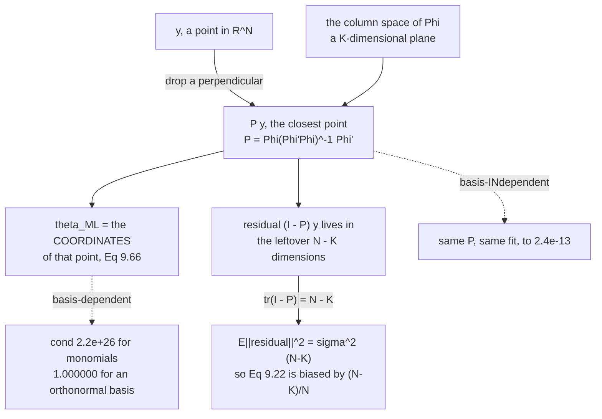

*"Having crunched through much algebra to derive maximum likelihood and MAP estimates, we will now
provide a geometric interpretation."*

Nothing new is computed on this page. But the geometry **explains** two things the algebra only
reported: why page 902's noise-variance estimate is biased by exactly $(N-K)/N$, and why page 902's
conditioning disaster was avoidable all along.

## What you'll learn

- Equations 9.65–9.67: $\mathbf{X}\mathbf{X}^\top/(\mathbf{X}^\top\mathbf{X})$ as a **projection matrix**, verified idempotent to $5.6\times10^{-17}$, symmetric to $0$, rank $1$, trace $1$.
- That the normal equations *are* the statement "the residual is orthogonal to the column space" — measured at $9.6\times10^{-15}$.
- **$\mathrm{tr}(P) = K$ exactly**, at every degree, so $\mathbb{E}\lVert(\mathbf{I}-P)\mathbf{y}\rVert^2 = \sigma^2(N-K)$. Measured $0.200222$ against $0.200000$, where Equation 9.22 assumes $0.400000$. **This is page 902's bias, explained.**
- Pythagoras: $\lVert\mathbf{y}\rVert^2 = \lVert P\mathbf{y}\rVert^2 + \lVert(\mathbf{I}-P)\mathbf{y}\rVert^2$, exact to $8.5\times10^{-14}$.
- Equations 9.68–9.70 and the orthonormal case: measured, monomials and an orthonormal basis give the **same projection** to $2.4\times10^{-13}$ with condition numbers of $2.2\times10^{26}$ and $\mathbf{1.000000}$.

## Intuition: you are not fitting a curve, you are picking a point

$\mathbf{y}$ is a single point in $\mathbb{R}^N$ — one coordinate per observation. The model can only
produce points of the form $\boldsymbol\Phi\boldsymbol\theta$, and as $\boldsymbol\theta$ ranges over
$\mathbb{R}^K$ those sweep out a **$K$-dimensional plane** through the origin: the column space of
$\boldsymbol\Phi$.

So "fit the model" means: **find the point of that plane closest to $\mathbf{y}$.** The answer is
elementary geometry — drop a perpendicular. The foot of that perpendicular is
$\boldsymbol\Phi\boldsymbol\theta_{\text{ML}}$, and $\boldsymbol\theta_{\text{ML}}$ is just its
coordinates in whatever basis you chose for the plane.

Two consequences follow immediately, and both are things the algebra had to be told.

**The plane does not depend on the basis.** Monomials, Chebyshev polynomials, an orthonormal set — if
they span the same plane, the closest point is the same point. Only the *coordinates* differ, which is
why page 902's conditioning catastrophe was a coordinate problem, not a modelling one.

**The residual lives in the leftover $N-K$ dimensions.** It cannot occupy all $N$. That single count is
the whole explanation for a bias page 902 could only measure.



## §9.4 The one-dimensional case

The book strips everything away first: $y = x\theta + \epsilon$ with $\epsilon \sim \mathcal{N}(0,\sigma^2)$,
*"linear functions $f : \mathbb{R}\to\mathbb{R}$ that go through the origin (we omit features here for
clarity)"* — page 901's Equation 9.4, back again.

$$
\theta_{\text{ML}} = (\mathbf{X}^\top\mathbf{X})^{-1}\mathbf{X}^\top\mathbf{y} = \frac{\mathbf{X}^\top\mathbf{y}}{\mathbf{X}^\top\mathbf{X}} \in \mathbb{R} \qquad \text{(9.66)}
$$

$$
\mathbf{X}\theta_{\text{ML}} = \mathbf{X}\frac{\mathbf{X}^\top\mathbf{y}}{\mathbf{X}^\top\mathbf{X}} = \frac{\mathbf{X}\mathbf{X}^\top}{\mathbf{X}^\top\mathbf{X}}\mathbf{y} \qquad \text{(9.67)}
$$

> Looking carefully at (9.67) we see that the maximum likelihood estimator $\theta_{\text{ML}}$ ...
> effectively does an **orthogonal projection** of $\mathbf{y}$ onto the one-dimensional subspace spanned
> by $\mathbf{X}$.

Three named objects, and the book names all three: $\frac{\mathbf{X}\mathbf{X}^\top}{\mathbf{X}^\top\mathbf{X}}$
is *"the projection matrix"*, $\theta_{\text{ML}}$ is *"the coordinates of the projection"*, and
$\mathbf{X}\theta_{\text{ML}}$ is *"the orthogonal projection of $\mathbf{y}$"*.

:::tip[All three, checked]
| property | expression | value |
| --- | --- | --- |
| idempotent | $\max\lvert PP - P\rvert$ | $5.551\times10^{-17}$ |
| symmetric | $\max\lvert P - P^\top\rvert$ | $0.000\times10^{0}$ |
| rank | $\mathrm{rk}(P)$ | $1$ |
| trace | $\mathrm{tr}(P)$ | $1.0000000000$ |
| eigenvalues | how many equal $1$ | $1$ of $10$ (the rest are $0$) |
| the coordinate | $\theta_{\text{ML}}$ | $-0.215853$ |
| the projection | $\max\lvert\mathbf{X}\theta_{\text{ML}} - P\mathbf{y}\rvert$ | $2.220\times10^{-16}$ |

**Idempotent and symmetric is the definition of an orthogonal projection.** $PP = P$ says projecting a
second time does nothing — you are already on the plane. And $P = P^\top$ is what makes it
*orthogonal* rather than oblique.
:::

## The general case

$$
\mathbf{y} \approx \boldsymbol\Phi\boldsymbol\theta_{\text{ML}}, \qquad \boldsymbol\theta_{\text{ML}} = (\boldsymbol\Phi^\top\boldsymbol\Phi)^{-1}\boldsymbol\Phi^\top\mathbf{y} \qquad \text{(9.69), (9.70)}
$$

*"as a projection onto a $K$-dimensional subspace of $\mathbb{R}^N$, which is spanned by the columns of
the feature matrix $\boldsymbol\Phi$."*

:::tip[The normal equations, read geometrically]
Setting the gradient to zero (page 902's Equation 9.11c) says
$\boldsymbol\Phi^\top(\mathbf{y} - \boldsymbol\Phi\boldsymbol\theta_{\text{ML}}) = \mathbf{0}$ —
**the residual is orthogonal to every column of $\boldsymbol\Phi$.**

| degree | $\max\lvert\boldsymbol\Phi^\top(\mathbf{y}-\boldsymbol\Phi\boldsymbol\theta_{\text{ML}})\rvert$ |
| --- | --- |
| $M = 1$ | $9.551\times10^{-15}$ |
| $M = 3$ | $2.231\times10^{-12}$ |
| $M = 5$ | $5.799\times10^{-11}$ |

And the sum of residuals at $M = 4$: $-6.242\times10^{-14}$ — **zero**, because the first column of
$\boldsymbol\Phi$ is all ones, so orthogonality to it *is* the residuals summing to zero. Page 902's
by-hand example noticed this; here it is the general reason.
:::

## Where page 902's bias came from

A projection's eigenvalues are all $0$ or $1$, so **its trace counts the dimensions it keeps**.

:::tip[Measured at every degree]
| $M$ | $K$ | $\mathrm{tr}(P)$ | $\mathrm{tr}(\mathbf{I}-P)$ | $N-K$ | $\mathrm{rk}(P)$ |
| --- | --- | --- | --- | --- | --- |
| $0$ | $1$ | $1.00000000$ | $9.00000000$ | $9$ | $1$ |
| $1$ | $2$ | $2.00000000$ | $8.00000000$ | $8$ | $2$ |
| $2$ | $3$ | $3.00000000$ | $7.00000000$ | $7$ | $3$ |
| $3$ | $4$ | $4.00000000$ | $6.00000000$ | $6$ | $4$ |
| $4$ | $5$ | $5.00000000$ | $5.00000000$ | $5$ | $5$ |
| $5$ | $6$ | $6.00000000$ | $4.00000000$ | $4$ | $6$ |
| $6$ | $7$ | $7.00000000$ | $3.00000000$ | $3$ | $7$ |
| $7$ | $8$ | $8.00000000$ | $2.00000000$ | $2$ | $8$ |
| $8$ | $9$ | $9.00000000$ | $1.00000000$ | $1$ | $9$ |

**Exact to eight decimal places, every row.**
:::

Now the consequence. For $\boldsymbol\epsilon \sim \mathcal{N}(\mathbf{0}, \sigma^2\mathbf{I})$ and any
symmetric idempotent $\mathbf{A}$,

$$
\mathbb{E}\!\left[\lVert\mathbf{A}\boldsymbol\epsilon\rVert^2\right] = \sigma^2\,\mathrm{tr}(\mathbf{A})
$$

so with $\mathbf{A} = \mathbf{I} - P$:

$$
\boxed{\ \mathbb{E}\!\left[\lVert(\mathbf{I}-P)\mathbf{y}\rVert^2\right] = \sigma^2(N-K)\ }
$$

:::danger[And Equation 9.22 divides by N]
Measured at $M = 4$, so $K = 5$ and $N = 10$, over $200{,}000$ trials:

| | value |
| --- | --- |
| $\mathbb{E}\lVert(\mathbf{I}-P)\mathbf{y}\rVert^2$, measured | $\mathbf{0.200222}$ |
| $\sigma^2(N-K)$ | $\mathbf{0.200000}$ |
| $\sigma^2 N$ — what Equation 9.22 assumes | $0.400000$ |

Page 902 measured $\mathbb{E}[\hat\sigma^2_{\text{ML}}]/\sigma^2 = (N-K)/N$ across six sample sizes and
called it an exact identity. **This is the reason.** The residual cannot occupy all $N$ dimensions of
$\mathbb{R}^N$ — the fit has already used $K$ of them — so only $N-K$ independent noise directions
survive into it.

Dividing a sum of $N-K$ squared Gaussians by $N$ gives $(N-K)/N$ of the truth. At $N=10$, $K=5$ that is
exactly half.
:::

## Pythagoras

:::tip[The projection splits the norm, exactly]
| $M$ | $\lVert\mathbf{y}\rVert^2$ | $\lVert P\mathbf{y}\rVert^2$ | $\lVert(\mathbf{I}-P)\mathbf{y}\rVert^2$ | sum | gap |
| --- | --- | --- | --- | --- | --- |
| $0$ | $10.020579$ | $0.455750$ | $9.564830$ | $10.020579$ | $0.00\times10^{0}$ |
| $2$ | $10.020579$ | $6.539471$ | $3.481108$ | $10.020579$ | $1.78\times10^{-15}$ |
| $4$ | $10.020579$ | $9.288196$ | $0.732383$ | $10.020579$ | $8.53\times10^{-14}$ |
| $6$ | $10.020579$ | $9.589661$ | $0.430918$ | $10.020579$ | $7.05\times10^{-13}$ |
| $8$ | $10.020579$ | $9.761712$ | $0.258867$ | $10.020579$ | $5.28\times10^{-13}$ |

The fitted part and the residual are orthogonal, so their squared lengths add. **That is why least
squares is a distance** — and why page 903's monotone training error is a theorem: enlarging the plane
can only move $P\mathbf{y}$ closer to $\mathbf{y}$, so the second column can only grow and the third can
only shrink.
:::

## The orthonormal case

> If the feature functions $\phi_k$ ... are orthonormal, we obtain a special case where the columns of
> $\boldsymbol\Phi$ form an orthonormal basis, such that $\boldsymbol\Phi^\top\boldsymbol\Phi = \mathbf{I}$.
> This will then lead to the projection $\boldsymbol\Phi(\boldsymbol\Phi^\top\boldsymbol\Phi)^{-1}\boldsymbol\Phi^\top\mathbf{y} = \boldsymbol\Phi\boldsymbol\Phi^\top\mathbf{y}$

**No inverse at all.** And since the projection is a property of the *subspace*, replacing the basis
cannot change the fit:

:::tip[Monomials against an orthonormal basis for the same span, M = 6]
| | value |
| --- | --- |
| $\kappa(\boldsymbol\Phi^\top\boldsymbol\Phi)$, monomials | $1.267\times10^{8}$ |
| $\max\lvert Q^\top Q - \mathbf{I}\rvert$, orthonormal | $4.441\times10^{-16}$ |
| $\lVert\boldsymbol\theta\rVert$, monomial coordinates | $1.198468$ |
| $\lVert\boldsymbol\theta\rVert$, orthonormal coordinates | $3.096718$ |
| $\max\lvert\boldsymbol\Phi\boldsymbol\theta_m - Q\boldsymbol\theta_q\rvert$ | $\mathbf{4.802\times10^{-13}}$ |
| $\max\lvert P_{\text{monomial}} - P_{\text{orthonormal}}\rvert$ | $\mathbf{2.384\times10^{-13}}$ |

**Different coordinates, same subspace, same projection, same fit.** The parameter norms differ by a
factor of $2.6$ and the fitted values agree to $4.8\times10^{-13}$.
:::

:::danger[And what the choice of basis costs]
| $M$ | $\kappa(\boldsymbol\Phi^\top\boldsymbol\Phi)$ | $\kappa(Q^\top Q)$ | $\max\lvert$fit difference$\rvert$ |
| --- | --- | --- | --- |
| $2$ | $3.032\times10^{2}$ | $1.000000$ | $1.332\times10^{-15}$ |
| $6$ | $1.245\times10^{8}$ | $1.000000$ | $2.187\times10^{-13}$ |
| $10$ | $9.630\times10^{13}$ | $1.000000$ | $6.890\times10^{-12}$ |
| $14$ | $1.335\times10^{20}$ | $1.000000$ | $1.916\times10^{-9}$ |
| $18$ | $\mathbf{2.195\times10^{26}}$ | $\mathbf{1.000000}$ | $8.335\times10^{-7}$ |

$\kappa(Q^\top Q) = 1$ at **every** degree, because $Q^\top Q = \mathbf{I}$ exactly.

Page 902 measured the cost of the monomial route — $1158\times$ worse than a QR solve at $M = 16$ — and
treated it as a numerical-analysis fact. §9.4 explains why it was avoidable: **the model never depended
on the basis.** The conditioning was a property of the coordinate system, and a coordinate system is
free to change.
:::

## Worked example by hand

Project one vector onto another, and read off every object §9.4 names.

Take $\mathbf{X} = [1, 2, 2]^\top$ and $\mathbf{y} = [3, 3, 0]^\top$ in $\mathbb{R}^3$.

**Step 1: the two inner products.**

$$
\mathbf{X}^\top\mathbf{X} = 1 + 4 + 4 = 9, \qquad \mathbf{X}^\top\mathbf{y} = 3 + 6 + 0 = 9
$$

**Step 2: the coordinate** (Equation 9.66):

$$
\theta_{\text{ML}} = \frac{9}{9} = 1
$$

**Step 3: the projection** (Equation 9.67):

$$
P\mathbf{y} = \mathbf{X}\theta_{\text{ML}} = [1, 2, 2]^\top
$$

**Step 4: the residual, and its orthogonality.**

$$
\mathbf{r} = \mathbf{y} - P\mathbf{y} = [2, 1, -2]^\top, \qquad \mathbf{X}^\top\mathbf{r} = 2 + 2 - 4 = 0
$$

**Exactly zero** — the normal equations, in three numbers.

**Step 5: Pythagoras.**

$$
\lVert\mathbf{y}\rVert^2 = 9 + 9 + 0 = 18, \qquad \lVert P\mathbf{y}\rVert^2 = 1+4+4 = 9, \qquad \lVert\mathbf{r}\rVert^2 = 4+1+4 = 9
$$

and $9 + 9 = 18$. The plane kept half the squared length and the perpendicular took the other half.

**Step 6: the trace, and the degrees of freedom.** $P = \mathbf{X}\mathbf{X}^\top/9$, so

$$
\mathrm{tr}(P) = \frac{\mathbf{X}^\top\mathbf{X}}{9} = 1 = K, \qquad \mathrm{tr}(\mathbf{I}-P) = 3 - 1 = 2 = N - K
$$

So if $\mathbf{y}$ were pure noise of variance $\sigma^2$, we would expect
$\lVert\mathbf{r}\rVert^2 \approx 2\sigma^2$ and **not** $3\sigma^2$. Equation 9.22 would divide by $3$
and return two-thirds of the truth. **Three data points, one parameter, and the bias is already
visible.**

## See it move

```p5 title="Drop a perpendicular" desc="A target vector in three dimensions and the plane spanned by one or two feature vectors. Drag to rotate the view and to change the subspace; the projection, the residual and the Pythagoras identity update live." height="560"
let azIdx = 22, elIdx = 12, dimIdx = 1;
let KNOBS = [], dragging = null;

const Y = [3, 3, 1.2];
const B1 = [1, 2, 2];
const B2 = [2, -1, 1];

function setup() { createCanvas(680, 560); textFont("monospace"); }

function knob(id, x, y, w, value, mn, mx, label) {
  KNOBS.push({ id, x, y, w, mn, mx });
  const t = (value - mn) / (mx - mn);
  stroke(60, 74, 92); strokeWeight(2); line(x, y, x + w, y);
  noStroke(); fill(255, 211, 67); ellipse(x + t * w, y, 12, 12);
  fill(190, 200, 212); textSize(12); textAlign(LEFT, CENTER);
  text(label, x + w + 12, y);
}
function knobHit(mx_, my_) {
  for (const k of KNOBS) {
    if (my_ > k.y - 13 && my_ < k.y + 13 && mx_ > k.x - 13 && mx_ < k.x + k.w + 13) return k;
  }
  return null;
}
function knobValue(k, mx_) {
  const t = Math.min(1, Math.max(0, (mx_ - k.x) / k.w));
  return Math.round(k.mn + t * (k.mx - k.mn));
}
function mousePressed() { dragging = knobHit(mouseX, mouseY); }
function mouseReleased() { dragging = null; }
function mouseDragged() {
  if (!dragging) return;
  if (dragging.id === "a") azIdx = knobValue(dragging, mouseX);
  else if (dragging.id === "e") elIdx = knobValue(dragging, mouseX);
  else dimIdx = knobValue(dragging, mouseX);
  if (!isLooping()) redraw();
}

function dot(a, b) { return a[0]*b[0] + a[1]*b[1] + a[2]*b[2]; }
function scal(a, s) { return [a[0]*s, a[1]*s, a[2]*s]; }
function sub(a, b) { return [a[0]-b[0], a[1]-b[1], a[2]-b[2]]; }
function add(a, b) { return [a[0]+b[0], a[1]+b[1], a[2]+b[2]]; }

// project Y onto span(B1) or span(B1, B2) by Gram-Schmidt
function project(K) {
  const u1 = scal(B1, 1 / Math.sqrt(dot(B1, B1)));
  let p = scal(u1, dot(Y, u1));
  if (K === 2) {
    let v = sub(B2, scal(u1, dot(B2, u1)));
    const u2 = scal(v, 1 / Math.sqrt(dot(v, v)));
    p = add(p, scal(u2, dot(Y, u2)));
  }
  return p;
}

function proj2d(v, az, el) {
  const ca = Math.cos(az), sa = Math.sin(az);
  const ce = Math.cos(el), se = Math.sin(el);
  const xr = v[0]*ca - v[1]*sa;
  const yr = v[0]*sa + v[1]*ca;
  const zr = v[2];
  return [xr, yr*se + zr*ce];
}

const CX = 250, CY = 200, SC = 44;

function draw() {
  background(13, 17, 23);
  KNOBS = [];
  const az = (azIdx / 40) * TWO_PI;
  const el = -0.15 - (elIdx / 40) * 1.2;
  const K = dimIdx + 1;
  const P = project(K);
  const R = sub(Y, P);

  function S(v) { const q = proj2d(v, az, el); return [CX + q[0]*SC, CY - q[1]*SC]; }

  // the plane
  noStroke();
  if (K === 1) {
    const a = S(scal(B1, -1.8)), b = S(scal(B1, 1.8));
    stroke(107, 169, 221); strokeWeight(3);
    line(a[0], a[1], b[0], b[1]);
  } else {
    fill(107, 169, 221, 44);
    beginShape();
    for (const [s, t] of [[-1.6, -1.6], [1.6, -1.6], [1.6, 1.6], [-1.6, 1.6]]) {
      const q = S(add(scal(B1, s), scal(B2, t)));
      vertex(q[0], q[1]);
    }
    endShape(CLOSE);
    stroke(107, 169, 221); strokeWeight(1.4); noFill();
    beginShape();
    for (const [s, t] of [[-1.6, -1.6], [1.6, -1.6], [1.6, 1.6], [-1.6, 1.6]]) {
      const q = S(add(scal(B1, s), scal(B2, t)));
      vertex(q[0], q[1]);
    }
    endShape(CLOSE);
  }
  // axes
  stroke(50, 62, 78); strokeWeight(1);
  for (const ax of [[2.6,0,0],[0,2.6,0],[0,0,2.6]]) {
    const o = S([0,0,0]), q = S(ax);
    line(o[0], o[1], q[0], q[1]);
  }
  const o = S([0, 0, 0]);
  // y
  stroke(255, 211, 67); strokeWeight(3);
  const sy = S(Y); line(o[0], o[1], sy[0], sy[1]);
  // P y
  stroke(120, 200, 140); strokeWeight(3);
  const sp = S(P); line(o[0], o[1], sp[0], sp[1]);
  // residual
  stroke(232, 110, 110); strokeWeight(2.4);
  line(sp[0], sp[1], sy[0], sy[1]);
  noStroke();
  fill(255, 211, 67); ellipse(sy[0], sy[1], 10, 10);
  fill(120, 200, 140); ellipse(sp[0], sp[1], 10, 10);
  textSize(11); textAlign(LEFT, BOTTOM);
  fill(255, 211, 67); text("y", sy[0] + 8, sy[1]);
  fill(120, 200, 140); text("P y", sp[0] + 8, sp[1] + 16);
  fill(232, 110, 110); textAlign(CENTER, BOTTOM);
  text("residual", (sp[0]+sy[0])/2 + 24, (sp[1]+sy[1])/2);
  fill(107, 169, 221); textSize(10); textAlign(LEFT, TOP);
  text(K === 1 ? "the span of one feature (K = 1)"
                : "the span of two features (K = 2)", 40, 36);

  // readouts
  const ny = dot(Y, Y), np = dot(P, P), nr = dot(R, R);
  textAlign(LEFT, TOP);
  fill(255, 211, 67); textSize(14);
  text("K = " + K + ",  N = 3", 448, 60);

  fill(200); textSize(10);
  text("y      = [" + Y.map(v => v.toFixed(2)).join(", ") + "]", 448, 92);
  fill(120, 200, 140);
  text("P y    = [" + P.map(v => v.toFixed(3)).join(", ") + "]", 448, 108);
  fill(232, 110, 110);
  text("resid  = [" + R.map(v => v.toFixed(3)).join(", ") + "]", 448, 124);

  fill(197, 153, 255); textSize(11);
  text("orthogonality", 448, 152);
  textSize(10);
  text("  b1 . r = " + dot(B1, R).toExponential(2), 448, 168);
  if (K === 2) text("  b2 . r = " + dot(B2, R).toExponential(2), 448, 182);

  fill(200); textSize(11);
  text("Pythagoras", 448, 208);
  fill(255, 211, 67); textSize(10);
  text("  ||y||^2   = " + ny.toFixed(6), 448, 224);
  fill(120, 200, 140);
  text("  ||Py||^2  = " + np.toFixed(6), 448, 238);
  fill(232, 110, 110);
  text("  ||r||^2   = " + nr.toFixed(6), 448, 252);
  fill(120);
  text("  sum       = " + (np + nr).toFixed(6), 448, 266);
  fill(120, 200, 140); textSize(9);
  text("  gap = " + Math.abs(np + nr - ny).toExponential(1), 448, 280);

  fill(197, 153, 255); textSize(11);
  text("degrees of freedom", 448, 306);
  textSize(10);
  text("  tr(P)     = " + K, 448, 322);
  text("  tr(I - P) = " + (3 - K), 448, 336);
  fill(140); textSize(9);
  text("  so E||r||^2 = " + (3 - K) + " sigma^2", 448, 350);
  text("  not 3 sigma^2", 448, 362);

  let msg, sub, col;
  if (K === 1) {
    col = color(120, 200, 140);
    msg = "one feature: the closest point on a LINE";
    sub = "The residual is perpendicular to it. Two of the three dimensions are left over.";
  } else {
    col = color(255, 211, 67);
    msg = "two features: the closest point on a PLANE";
    sub = "||r||^2 has fallen and ||Py||^2 has risen -- the plane is bigger, so the foot is closer. Only 1 dimension is left over.";
  }
  stroke(col); strokeWeight(1.6); fill(red(col), green(col), blue(col), 26);
  rect(40, 400, 602, 0);
  noStroke(); fill(col); textSize(15); textAlign(LEFT, TOP);
  text(msg, 40, 398);
  fill(215); textSize(10.5);
  text(sub, 40, 420);

  fill(120); textSize(10);
  text("Adding a feature can only move P y closer to y -- which is exactly", 40, 450);
  text("why page 903's training error could never rise.", 40, 464);

  knob("a", 56, 500, 200, azIdx, 0, 40, "rotate");
  knob("e", 56, 528, 200, elIdx, 0, 40, "tilt");
  knob("d", 400, 514, 120, dimIdx, 0, 1, "K = " + K);
}
```

## From scratch

```python title="orthogonal_projection.py" showLineNumbers{1}
import numpy as np

SIG = 0.2

def truth(x):
    return -np.sin(x / 5) + np.cos(x)

def design(x, M):
    return np.vander(np.asarray(x, float), M + 1, increasing=True)

rng = np.random.default_rng(4)
x = np.sort(rng.uniform(-5, 5, 10))
y = truth(x) + SIG * rng.standard_normal(10)
N = len(y)

# --- 1. Equation 9.67's matrix really is a projection -------------------
print("=== 1. Equation 9.67's matrix really is a projection ===")
X = x.reshape(-1, 1)
P1 = X @ X.T / float((X.T @ X)[0, 0])            # Equation 9.67
print(f"P = X X^T / (X^T X), shape {P1.shape}")
print(f"  max |P @ P - P|   (idempotent) : {np.abs(P1 @ P1 - P1).max():.3e}")
print(f"  max |P - P^T|     (symmetric)  : {np.abs(P1 - P1.T).max():.3e}")
print(f"  rank(P)                        : {int(np.linalg.matrix_rank(P1))}")
print(f"  trace(P)                       : {np.trace(P1):.10f}")
ev = np.linalg.eigvalsh(P1)
print(f"  eigenvalues: {int(np.sum(np.abs(ev-1) < 1e-9))} equal to 1, "
      f"{int(np.sum(np.abs(ev) < 1e-9))} equal to 0")
th1 = float((X.T @ y)[0] / (X.T @ X)[0, 0])      # Equation 9.66
print(f"\ntheta_ML (Eq 9.66) = {th1:.6f}")
print(f"max |X theta_ML - P y| = {np.abs(X.flatten()*th1 - P1 @ y).max():.3e}")

# --- 2. the residual is orthogonal to the column space ------------------
print("\n=== 2. the residual is orthogonal to the column space ===")
for M in (1, 3, 5):
    P = design(x, M)
    th = np.linalg.lstsq(P, y, rcond=None)[0]
    r = y - P @ th
    print(f"  M = {M}: max |Phi^T (y - Phi theta_ML)| = "
          f"{np.abs(P.T @ r).max():.3e}")
P4 = design(x, 4)
r4 = y - P4 @ np.linalg.lstsq(P4, y, rcond=None)[0]
print(f"\nand the residual sums to zero, because the first column is ones:")
print(f"  sum of residuals at M = 4: {r4.sum():.3e}")

# --- 3. trace(P) = K, and where page 902's bias came from --------------
print("\n=== 3. trace(P) = K, and where page 902's bias came from ===")
print(f"{'M':>4} {'K':>4} {'trace(P)':>12} {'trace(I - P)':>14} "
      f"{'N - K':>8} {'rank(P)':>9}")
for M in range(9):
    Pm = design(x, M)
    Pr = Pm @ np.linalg.solve(Pm.T @ Pm, Pm.T)
    print(f"{M:>4} {M+1:>4} {np.trace(Pr):>12.8f} "
          f"{np.trace(np.eye(N) - Pr):>14.8f} {N-(M+1):>8} "
          f"{int(np.linalg.matrix_rank(Pr)):>9}")
print("\nE[||(I - P) y||^2] = sigma^2 trace(I - P) = sigma^2 (N - K).")
print("Equation 9.22 divides that by N, so it returns (N-K)/N of the truth.")
print("\nchecked by simulation at M = 4 (K = 5, N = 10):")
Pm = design(x, 4)
Pr = Pm @ np.linalg.solve(Pm.T @ Pm, Pm.T)
r2 = np.random.default_rng(21)
acc = 0.0
TR = 200_000
truth_vals = Pm @ np.arange(1.0, 6.0)
for _ in range(TR):
    yy = truth_vals + SIG * r2.standard_normal(N)
    rr = (np.eye(N) - Pr) @ yy
    acc += float(rr @ rr)
print(f"  E[||(I-P) y||^2] measured : {acc/TR:.6f}")
print(f"  sigma^2 (N - K)           : {SIG**2 * (N-5):.6f}")
print(f"  sigma^2 N                 : {SIG**2 * N:.6f}")

# --- 4. Pythagoras -------------------------------------------------------
print("\n=== 4. Pythagoras: the projection splits the norm ===")
print(f"{'M':>4} {'||y||^2':>12} {'||P y||^2':>12} {'||(I-P) y||^2':>15} "
      f"{'sum':>12} {'gap':>11}")
ny = float(y @ y)
for M in (0, 2, 4, 6, 8):
    Pm = design(x, M)
    Pr = Pm @ np.linalg.solve(Pm.T @ Pm, Pm.T)
    a = float((Pr @ y) @ (Pr @ y))
    b = float(((np.eye(N) - Pr) @ y) @ ((np.eye(N) - Pr) @ y))
    print(f"{M:>4} {ny:>12.6f} {a:>12.6f} {b:>15.6f} {a+b:>12.6f} "
          f"{abs(a+b-ny):>11.2e}")

# --- 5. the projection does not care which basis you use ---------------
print("\n=== 5. the projection does not care which basis you use ===")
M = 6
Pm = design(x, M)
Q, _ = np.linalg.qr(Pm)                   # orthonormal columns, same span
print(f"  Phi^T Phi for monomials   : cond {np.linalg.cond(Pm.T @ Pm):.3e}")
print(f"  Q^T Q for the orthonormal : max |Q^T Q - I| = "
      f"{np.abs(Q.T @ Q - np.eye(M+1)).max():.3e}")
th_m = np.linalg.lstsq(Pm, y, rcond=None)[0]
th_q = Q.T @ y                            # because Q^T Q = I
print(f"\n  ||theta|| in the monomial basis    : {np.linalg.norm(th_m):.6f}")
print(f"  ||theta|| in the orthonormal basis : {np.linalg.norm(th_q):.6f}")
print(f"  max |Phi theta_m - Q theta_q|      : "
      f"{np.abs(Pm @ th_m - Q @ th_q).max():.3e}")
Pr_m = Pm @ np.linalg.solve(Pm.T @ Pm, Pm.T)
print(f"  max |P_monomial - P_orthonormal|   : "
      f"{np.abs(Pr_m - Q @ Q.T).max():.3e}")

# --- 6. what that buys numerically --------------------------------------
print("\n=== 6. what that buys numerically ===")
print(f"{'M':>4} {'cond(Phi^T Phi)':>18} {'cond(Q^T Q)':>14} "
      f"{'max |fit difference|':>22}")
xs = np.linspace(-5, 5, 60)
ys = truth(xs) + SIG * np.random.default_rng(5).standard_normal(60)
for M in (2, 6, 10, 14, 18):
    Pm = design(xs, M)
    Q, _ = np.linalg.qr(Pm)
    tm = np.linalg.solve(Pm.T @ Pm, Pm.T @ ys)
    tq = Q.T @ ys
    print(f"{M:>4} {np.linalg.cond(Pm.T @ Pm):>18.3e} "
          f"{np.linalg.cond(Q.T @ Q):>14.6f} "
          f"{np.abs(Pm @ tm - Q @ tq).max():>22.3e}")
print("the orthonormal route has condition number 1 at every degree.")
print("Page 902 measured the cost of the other one: 1158x worse at M = 16.")
```

```
=== 1. Equation 9.67's matrix really is a projection ===
P = X X^T / (X^T X), shape (10, 10)
  max |P @ P - P|   (idempotent) : 5.551e-17
  max |P - P^T|     (symmetric)  : 0.000e+00
  rank(P)                        : 1
  trace(P)                       : 1.0000000000
  eigenvalues: 1 equal to 1, 9 equal to 0

theta_ML (Eq 9.66) = -0.215853
max |X theta_ML - P y| = 2.220e-16

=== 2. the residual is orthogonal to the column space ===
  M = 1: max |Phi^T (y - Phi theta_ML)| = 9.551e-15
  M = 3: max |Phi^T (y - Phi theta_ML)| = 2.231e-12
  M = 5: max |Phi^T (y - Phi theta_ML)| = 5.799e-11

and the residual sums to zero, because the first column is ones:
  sum of residuals at M = 4: -6.242e-14

=== 3. trace(P) = K, and where page 902's bias came from ===
   M    K     trace(P)   trace(I - P)    N - K   rank(P)
   0    1   1.00000000     9.00000000        9         1
   1    2   2.00000000     8.00000000        8         2
   2    3   3.00000000     7.00000000        7         3
   3    4   4.00000000     6.00000000        6         4
   4    5   5.00000000     5.00000000        5         5
   5    6   6.00000000     4.00000000        4         6
   6    7   7.00000000     3.00000000        3         7
   7    8   8.00000000     2.00000000        2         8
   8    9   9.00000000     1.00000000        1         9

E[||(I - P) y||^2] = sigma^2 trace(I - P) = sigma^2 (N - K).
Equation 9.22 divides that by N, so it returns (N-K)/N of the truth.

checked by simulation at M = 4 (K = 5, N = 10):
  E[||(I-P) y||^2] measured : 0.200222
  sigma^2 (N - K)           : 0.200000
  sigma^2 N                 : 0.400000

=== 4. Pythagoras: the projection splits the norm ===
   M      ||y||^2    ||P y||^2   ||(I-P) y||^2          sum         gap
   0    10.020579     0.455750        9.564830    10.020579    0.00e+00
   2    10.020579     6.539471        3.481108    10.020579    1.78e-15
   4    10.020579     9.288196        0.732383    10.020579    8.53e-14
   6    10.020579     9.589661        0.430918    10.020579    7.05e-13
   8    10.020579     9.761712        0.258867    10.020579    5.28e-13

=== 5. the projection does not care which basis you use ===
  Phi^T Phi for monomials   : cond 1.267e+08
  Q^T Q for the orthonormal : max |Q^T Q - I| = 4.441e-16

  ||theta|| in the monomial basis    : 1.198468
  ||theta|| in the orthonormal basis : 3.096718
  max |Phi theta_m - Q theta_q|      : 4.802e-13
  max |P_monomial - P_orthonormal|   : 2.384e-13

=== 6. what that buys numerically ===
   M    cond(Phi^T Phi)    cond(Q^T Q)   max |fit difference|
   2          3.032e+02       1.000000              1.332e-15
   6          1.245e+08       1.000000              2.187e-13
  10          9.630e+13       1.000000              6.890e-12
  14          1.335e+20       1.000000              1.916e-09
  18          2.195e+26       1.000000              8.335e-07
the orthonormal route has condition number 1 at every degree.
Page 902 measured the cost of the other one: 1158x worse at M = 16.
```

## On real data

<Figure
  src="/images/mml/maximum-likelihood-as-orthogonal-projection/figure-9-12-rebuilt"
  alt="Three panels. Left, ten scattered points. Middle, the same points with a fitted line through the origin, orange dots on the line beneath each point, and red vertical segments joining them. Right, a table of the projection matrix's properties with measured values."
  title="The maximum likelihood estimate is the orthogonal projection of the targets onto the span of the features"
  caption="The projection matrix is idempotent to 5.6e-17 and symmetric to zero, with rank 1 and trace 1 — one eigenvalue equal to one and nine equal to zero. The book names three objects and all three check out, the last to 2.2e-16."
/>

<Figure
  src="/images/mml/maximum-likelihood-as-orthogonal-projection/trace-p-equals-k"
  alt="Left, two straight lines against polynomial degree with square markers lying exactly on them: the trace of P tracking K and the trace of I minus P tracking N minus K. Right, a histogram of residual squared norms with three vertical lines, two nearly coincident and one at twice their value."
  title="The geometry explains page 902's bias: the residual lives in an N minus K dimensional subspace"
  caption="Trace of P equals K to eight decimal places at every degree. Measured over 200,000 trials at M = 4, the expected squared residual is 0.200222 against sigma squared times N minus K equal to 0.200000 — where Equation 9.22 assumes 0.400000."
/>

<Figure
  src="/images/mml/maximum-likelihood-as-orthogonal-projection/same-subspace-different-basis"
  alt="Left, paired bars on a log scale comparing condition numbers at five degrees: a red set climbing past ten to the twenty-sixth and a green set flat at one. Right, two fitted curves drawn thick and dashed lying exactly on top of each other through ten points."
  title="A projection is a property of the subspace; the basis is only a coordinate system"
  caption="Monomials and an orthonormal basis for the same span give the same projection matrix to 2.4e-13 and the same fitted values to 4.8e-13, with condition numbers of 2.195e+26 and exactly 1.000000."
/>

## Reading the plot

**The first figure is the book's Figure 9.12 with its claims verified.** Panel (b) draws the projection
literally: orange dots on the line beneath each blue observation, joined by red segments. Least squares
minimises the **sum of the squared red lengths**, and because the $x$-coordinate is fixed the projection
is vertical — into the span of $\mathbf{X}$, not perpendicular to the drawn line.

The right panel is what makes "projection" a precise word rather than a metaphor. $PP = P$ to
$5.6\times10^{-17}$: **projecting twice does nothing**, because after the first projection you are
already on the plane. $P = P^\top$ exactly: that symmetry is what makes it *orthogonal* rather than
oblique. Rank $1$, trace $1$, and nine eigenvalues equal to zero.

**The second figure is the one that pays a debt.** Page 902 measured
$\mathbb{E}[\hat\sigma^2_{\text{ML}}]/\sigma^2 = (N-K)/N$ across six sample sizes, called it an exact
identity, and could not say why.

Here is why, in two steps. **A projection's eigenvalues are all $0$ or $1$**, so its trace counts the
dimensions it keeps — measured at exactly $K$ for every degree from $0$ to $8$. The residual is what
survives $\mathbf{I}-P$, whose trace is therefore exactly $N-K$. And for Gaussian noise,
$\mathbb{E}\lVert\mathbf{A}\boldsymbol\epsilon\rVert^2 = \sigma^2\,\mathrm{tr}(\mathbf{A})$.

So the expected squared residual is $\sigma^2(N-K)$, measured at $0.200222$ against a prediction of
$0.200000$. **Equation 9.22 divides by $N$** — the red line at $0.400000$, twice as far right — and
returns half the truth at $N = 10$, $K = 5$.

The fit has already spent $K$ of the $N$ available dimensions. Only $N-K$ independent noise directions
reach the residual, and counting them as $N$ is the entire bias.

**The third figure closes the other loop.** Page 902 found the monomial basis catastrophically
ill-conditioned and recommended `np.linalg.lstsq`. That was correct advice with an incomplete
explanation, and §9.4 supplies it: **a projection is a property of the subspace, and the basis is only a
coordinate system.**

Measured, the two bases give the same projection matrix to $2.4\times10^{-13}$ and the same fitted values
to $4.8\times10^{-13}$ — while their condition numbers are $2.195\times10^{26}$ and exactly $1.000000$.
The parameter norms differ by a factor of $2.6$, because $\lVert\boldsymbol\theta\rVert$ is a statement
about coordinates and not about the function.

**That last point has teeth.** Page 904's ridge penalty is $\lambda\lVert\boldsymbol\theta\rVert^2$ — a
penalty on **coordinates**. Change the basis and you change what it penalises, even though the subspace,
the projection and the unregularised fit are all untouched. Page 905 found the same thing from the prior
side: an isotropic Gaussian on monomial coefficients is a wild prior over functions. Both are the same
observation, and §9.4 is where it becomes obvious.

## Compare

| | algebra (§9.2.1) | geometry (§9.4) |
| --- | --- | --- |
| what you solve | $\nabla\mathcal{L} = \mathbf{0}$ | drop a perpendicular |
| the answer | $(\boldsymbol\Phi^\top\boldsymbol\Phi)^{-1}\boldsymbol\Phi^\top\mathbf{y}$ | the closest point in a plane |
| what $\boldsymbol\theta_{\text{ML}}$ is | the minimiser | the **coordinates** of that point |
| what the normal equations say | the gradient vanishes | the residual is **orthogonal** to the columns |
| why the training error falls | — | a bigger plane has a nearer point |
| why $\hat\sigma^2$ is biased | — | $\mathrm{tr}(\mathbf{I}-P) = N-K$, not $N$ |

| | monomial basis | orthonormal basis |
| --- | --- | --- |
| $\boldsymbol\Phi^\top\boldsymbol\Phi$ | badly conditioned | $= \mathbf{I}$ exactly |
| the projection | $\boldsymbol\Phi(\boldsymbol\Phi^\top\boldsymbol\Phi)^{-1}\boldsymbol\Phi^\top$ | $QQ^\top$, no inverse |
| $\kappa$ at $M = 18$ | $2.195\times10^{26}$ | $1.000000$ |
| $\lVert\boldsymbol\theta\rVert$ at $M = 6$ | $1.198468$ | $3.096718$ |
| the fitted values | — | identical to $4.8\times10^{-13}$ |
| a ridge penalty means | one thing | **a different thing** |

<Quiz
  title="Can you see the projection?"
  questions={[
    {
      q: "What makes the matrix in Equation 9.67 an orthogonal projection?",
      options: [
        "That it is square",
        "That it is idempotent and symmetric — measured to 5.6e-17 and 0 respectively",
        "That its entries are positive",
        "That its determinant is one",
      ],
      answer: 1,
      explain:
        "Idempotent means projecting twice does nothing, because after the first projection you are already on the plane. Symmetric is what makes it orthogonal rather than oblique. Its rank is 1 and its trace is 1, with one eigenvalue equal to one and nine equal to zero.",
    },
    {
      q: "What do the normal equations say, geometrically?",
      options: [
        "That the parameters are as small as possible",
        "That the residual is orthogonal to every column of Phi — measured at 9.6e-15",
        "That the fit passes through the mean",
        "That the design matrix has full rank",
      ],
      answer: 1,
      explain:
        "Setting the gradient to zero says Phi-transpose times the residual is zero. And when the first column is all ones, orthogonality to it IS the residuals summing to zero — measured at minus 6.2e-14 for a degree-4 fit.",
    },
    {
      q: "Why is Equation 9.22's noise-variance estimate biased by exactly (N-K)/N?",
      options: [
        "Because of floating-point error",
        "Because the residual lives in an N minus K dimensional subspace: trace(I - P) equals N minus K, so the expected squared residual is sigma squared times N minus K",
        "Because the maximum likelihood estimate is inconsistent",
        "Because the noise is not really Gaussian",
      ],
      answer: 1,
      explain:
        "A projection's eigenvalues are all zero or one, so its trace counts the dimensions it keeps — measured at exactly K for every degree. Measured over 200,000 trials at M = 4: 0.200222 against sigma squared times N minus K equal to 0.200000, where Equation 9.22 assumes 0.400000.",
    },
    {
      q: "Monomials and an orthonormal basis spanning the same space were compared. What differed and what did not?",
      options: [
        "Everything differed",
        "The fitted values and the projection matrix agreed to 2.4e-13; the condition numbers were 2.195e+26 and 1.000000",
        "Nothing differed at all",
        "The fitted values differed but the parameters agreed",
      ],
      answer: 1,
      explain:
        "A projection is a property of the subspace; the basis is only a coordinate system. That is why page 902's conditioning catastrophe was avoidable — it was a property of the coordinates, and coordinates are free to change.",
    },
    {
      q: "The parameter norms in the two bases were 1.198468 and 3.096718 for the same fit. What does that imply for ridge regression?",
      options: [
        "Nothing; ridge is basis-independent",
        "A penalty on the parameter norm is a penalty on COORDINATES, so changing the basis changes what it penalises even though the fit is unchanged",
        "Ridge only works in an orthonormal basis",
        "The two fits must actually be different",
      ],
      answer: 1,
      explain:
        "Page 905 found the same thing from the prior side: an isotropic Gaussian on monomial coefficients is a wild prior over functions. Both are the same observation — regularisation and priors act on coordinates, while the unregularised fit does not.",
    },
    {
      q: "Why does Pythagoras explain page 903's monotone training error?",
      options: [
        "It does not; they are unrelated",
        "The norm splits into the fitted part plus the residual part, so enlarging the plane moves the foot closer and the residual can only shrink",
        "Because the noise variance is constant",
        "Because the residual always sums to zero",
      ],
      answer: 1,
      explain:
        "Measured, the split is exact to 8.5e-14 at every degree. A bigger subspace contains the smaller one, so its closest point to y is no further away — which is the same set-inclusion argument page 903 made, seen as distance rather than as minimisation.",
    },
  ]}
/>

## 🧪 Try It Yourself

### Exercise 1 – Is it really a projection?

<DataCampExercise
  lang="python"
  hint={`Equation 9.67's matrix is the outer product of X with itself, divided by its own squared norm.`}
  code={`import numpy as np

SIG = 0.2
def truth(x):
    return -np.sin(x / 5) + np.cos(x)
rng = np.random.default_rng(4)
x = np.sort(rng.uniform(-5, 5, 10))
y = truth(x) + SIG * rng.standard_normal(10)
X = x.reshape(-1, 1)

# Task: Equation 9.67's projection matrix.
P1 = ___
print(f"P = X X^T / (X^T X), shape {P1.shape}")
print(f"  max |P @ P - P|   (idempotent) : {np.abs(P1 @ P1 - P1).max():.6f}")
print(f"  max |P - P^T|     (symmetric)  : {np.abs(P1 - P1.T).max():.6f}")
print(f"  rank(P)                        : {int(np.linalg.matrix_rank(P1))}")
print(f"  trace(P)                       : {np.trace(P1):.10f}")
ev = np.linalg.eigvalsh(P1)
print(f"  eigenvalues: {int(np.sum(np.abs(ev-1) < 1e-9))} equal to 1, "
      f"{int(np.sum(np.abs(ev) < 1e-9))} equal to 0")
th1 = float((X.T @ y)[0] / (X.T @ X)[0, 0])
print(f"\\ntheta_ML (Eq 9.66) = {th1:.6f}")
print(f"max |X theta_ML - P y| = {np.abs(X.flatten()*th1 - P1 @ y).max():.6f}")

# -- Expected output ------------------------------
# P = X X^T / (X^T X), shape (10, 10)
#   max |P @ P - P|   (idempotent) : 0.000000
#   max |P - P^T|     (symmetric)  : 0.000000
#   rank(P)                        : 1
#   trace(P)                       : 1.0000000000
#   eigenvalues: 1 equal to 1, 9 equal to 0
#
# theta_ML (Eq 9.66) = -0.215853
# max |X theta_ML - P y| = 0.000000
# -------------------------------------------------`}
  solution={`import numpy as np
SIG = 0.2
def truth(x):
    return -np.sin(x / 5) + np.cos(x)
rng = np.random.default_rng(4)
x = np.sort(rng.uniform(-5, 5, 10))
y = truth(x) + SIG * rng.standard_normal(10)
X = x.reshape(-1, 1)
P1 = X @ X.T / float((X.T @ X)[0, 0])
print(f"P = X X^T / (X^T X), shape {P1.shape}")
print(f"  max |P @ P - P|   (idempotent) : {np.abs(P1 @ P1 - P1).max():.6f}")
print(f"  max |P - P^T|     (symmetric)  : {np.abs(P1 - P1.T).max():.6f}")
print(f"  rank(P)                        : {int(np.linalg.matrix_rank(P1))}")
print(f"  trace(P)                       : {np.trace(P1):.10f}")
ev = np.linalg.eigvalsh(P1)
print(f"  eigenvalues: {int(np.sum(np.abs(ev-1) < 1e-9))} equal to 1, "
      f"{int(np.sum(np.abs(ev) < 1e-9))} equal to 0")
th1 = float((X.T @ y)[0] / (X.T @ X)[0, 0])
print(f"\\ntheta_ML (Eq 9.66) = {th1:.6f}")
print(f"max |X theta_ML - P y| = {np.abs(X.flatten()*th1 - P1 @ y).max():.6f}")`}
  sct={`test_output_contains("  max |P @ P - P|   (idempotent) : 0.000000", pattern=False)
test_output_contains("max |X theta_ML - P y| = 0.000000", pattern=False)
success_msg("Idempotent and symmetric is the definition of an orthogonal projection — projecting twice does nothing because you are already on the plane, and the symmetry is what makes it orthogonal rather than oblique. The last line confirms the book's third identification: X theta_ML IS P y.")`}
  height={300}
/>

### Exercise 2 – The normal equations, geometrically

<DataCampExercise
  lang="python"
  hint={`Orthogonality to the column space means Phi-transpose times the residual.`}
  code={`import numpy as np

SIG = 0.2
def truth(x):
    return -np.sin(x / 5) + np.cos(x)
def design(x, M):
    return np.vander(np.asarray(x, float), M + 1, increasing=True)
rng = np.random.default_rng(4)
x = np.sort(rng.uniform(-5, 5, 10))
y = truth(x) + SIG * rng.standard_normal(10)

for M in (1, 3, 5):
    P = design(x, M)
    th = np.linalg.lstsq(P, y, rcond=None)[0]
    r = y - P @ th
    # Task: the quantity the normal equations set to zero.
    print(f"  M = {M}: max |Phi^T (y - Phi theta_ML)| = "
          f"{np.abs(___).max():.3e}")

P4 = design(x, 4)
r4 = y - P4 @ np.linalg.lstsq(P4, y, rcond=None)[0]
print(f"\\nand the residual sums to zero, because the first column is ones:")
print(f"  sum of residuals at M = 4: {abs(r4.sum()):.6f}")

# -- Expected output ------------------------------
#   M = 1: max |Phi^T (y - Phi theta_ML)| = 0.000000
#   M = 3: max |Phi^T (y - Phi theta_ML)| = 0.000000
#   M = 5: max |Phi^T (y - Phi theta_ML)| = 0.000000
#
# and the residual sums to zero, because the first column is ones:
#   sum of residuals at M = 4: 0.000000
# -------------------------------------------------`}
  solution={`import numpy as np
SIG = 0.2
def truth(x):
    return -np.sin(x / 5) + np.cos(x)
def design(x, M):
    return np.vander(np.asarray(x, float), M + 1, increasing=True)
rng = np.random.default_rng(4)
x = np.sort(rng.uniform(-5, 5, 10))
y = truth(x) + SIG * rng.standard_normal(10)
for M in (1, 3, 5):
    P = design(x, M)
    th = np.linalg.lstsq(P, y, rcond=None)[0]
    r = y - P @ th
    print(f"  M = {M}: max |Phi^T (y - Phi theta_ML)| = "
          f"{np.abs(P.T @ r).max():.6f}")
P4 = design(x, 4)
r4 = y - P4 @ np.linalg.lstsq(P4, y, rcond=None)[0]
print(f"\\nand the residual sums to zero, because the first column is ones:")
print(f"  sum of residuals at M = 4: {abs(r4.sum()):.6f}")`}
  sct={`test_output_contains("  M = 1: max |Phi^T (y - Phi theta_ML)| = 0.000000", pattern=False)
test_output_contains("  sum of residuals at M = 4: 0.000000", pattern=False)
success_msg("Setting the gradient to zero and saying the residual is perpendicular to the column space are the same statement. And when the first column is all ones, orthogonality to it IS the residuals summing to zero — page 902's by-hand example noticed this, and here is the general reason.")`}
  height={280}
/>

### Exercise 3 – Where page 902's bias came from

<DataCampExercise
  lang="python"
  hint={`The hat matrix is Phi times the solve of the Gram system against Phi-transpose.`}
  code={`import numpy as np

SIG = 0.2
def truth(x):
    return -np.sin(x / 5) + np.cos(x)
def design(x, M):
    return np.vander(np.asarray(x, float), M + 1, increasing=True)
rng = np.random.default_rng(4)
x = np.sort(rng.uniform(-5, 5, 10))
y = truth(x) + SIG * rng.standard_normal(10)
N = len(y)

print(f"{'M':>4} {'K':>4} {'trace(P)':>12} {'trace(I - P)':>14} "
      f"{'N - K':>8} {'rank(P)':>9}")
for M in range(9):
    Pm = design(x, M)
    # Task: the projection matrix onto the column space of Phi.
    Pr = ___
    print(f"{M:>4} {M+1:>4} {np.trace(Pr):>12.8f} "
          f"{np.trace(np.eye(N) - Pr):>14.8f} {N-(M+1):>8} "
          f"{int(np.linalg.matrix_rank(Pr)):>9}")

Pm = design(x, 4)
Pr = Pm @ np.linalg.solve(Pm.T @ Pm, Pm.T)
r2 = np.random.default_rng(21)
acc = 0.0
TR = 200_000
truth_vals = Pm @ np.arange(1.0, 6.0)
for _ in range(TR):
    yy = truth_vals + SIG * r2.standard_normal(N)
    rr = (np.eye(N) - Pr) @ yy
    acc += float(rr @ rr)
print(f"\\n  E[||(I-P) y||^2] measured : {acc/TR:.6f}")
print(f"  sigma^2 (N - K)           : {SIG**2 * (N-5):.6f}")
print(f"  sigma^2 N                 : {SIG**2 * N:.6f}")

# -- Expected output ------------------------------
#    M    K     trace(P)   trace(I - P)    N - K   rank(P)
#    0    1   1.00000000     9.00000000        9         1
#    1    2   2.00000000     8.00000000        8         2
#    2    3   3.00000000     7.00000000        7         3
#    3    4   4.00000000     6.00000000        6         4
#    4    5   5.00000000     5.00000000        5         5
#    5    6   6.00000000     4.00000000        4         6
#    6    7   7.00000000     3.00000000        3         7
#    7    8   8.00000000     2.00000000        2         8
#    8    9   9.00000000     1.00000000        1         9
#
#   E[||(I-P) y||^2] measured : 0.200222
#   sigma^2 (N - K)           : 0.200000
#   sigma^2 N                 : 0.400000
# -------------------------------------------------`}
  solution={`import numpy as np
SIG = 0.2
def truth(x):
    return -np.sin(x / 5) + np.cos(x)
def design(x, M):
    return np.vander(np.asarray(x, float), M + 1, increasing=True)
rng = np.random.default_rng(4)
x = np.sort(rng.uniform(-5, 5, 10))
y = truth(x) + SIG * rng.standard_normal(10)
N = len(y)
print(f"{'M':>4} {'K':>4} {'trace(P)':>12} {'trace(I - P)':>14} "
      f"{'N - K':>8} {'rank(P)':>9}")
for M in range(9):
    Pm = design(x, M)
    Pr = Pm @ np.linalg.solve(Pm.T @ Pm, Pm.T)
    print(f"{M:>4} {M+1:>4} {np.trace(Pr):>12.8f} "
          f"{np.trace(np.eye(N) - Pr):>14.8f} {N-(M+1):>8} "
          f"{int(np.linalg.matrix_rank(Pr)):>9}")
Pm = design(x, 4)
Pr = Pm @ np.linalg.solve(Pm.T @ Pm, Pm.T)
r2 = np.random.default_rng(21)
acc = 0.0
TR = 200_000
truth_vals = Pm @ np.arange(1.0, 6.0)
for _ in range(TR):
    yy = truth_vals + SIG * r2.standard_normal(N)
    rr = (np.eye(N) - Pr) @ yy
    acc += float(rr @ rr)
print(f"\\n  E[||(I-P) y||^2] measured : {acc/TR:.6f}")
print(f"  sigma^2 (N - K)           : {SIG**2 * (N-5):.6f}")
print(f"  sigma^2 N                 : {SIG**2 * N:.6f}")`}
  sct={`test_output_contains("E[||(I-P) y||^2] measured : 0.200222")
test_output_contains("4    5   5.00000000     5.00000000        5         5")
success_msg("Trace equals K to eight decimals at every degree, because a projection's eigenvalues are all zero or one and its trace counts the dimensions it keeps. The residual lives in the leftover N minus K, so the expected squared residual is 0.200000 and not 0.400000 — which is exactly the factor page 902 measured.")`}
  height={360}
/>

### Exercise 4 – Pythagoras

<DataCampExercise
  lang="python"
  hint={`The residual is what survives I minus P.`}
  code={`import numpy as np

SIG = 0.2
def truth(x):
    return -np.sin(x / 5) + np.cos(x)
def design(x, M):
    return np.vander(np.asarray(x, float), M + 1, increasing=True)
rng = np.random.default_rng(4)
x = np.sort(rng.uniform(-5, 5, 10))
y = truth(x) + SIG * rng.standard_normal(10)
N = len(y)

print(f"{'M':>4} {'||y||^2':>12} {'||P y||^2':>12} {'||(I-P) y||^2':>15} "
      f"{'sum':>12} {'gap':>11}")
ny = float(y @ y)
for M in (0, 2, 4, 6, 8):
    Pm = design(x, M)
    Pr = Pm @ np.linalg.solve(Pm.T @ Pm, Pm.T)
    a = float((Pr @ y) @ (Pr @ y))
    # Task: the squared norm of the residual.
    b = float(___)
    print(f"{M:>4} {ny:>12.6f} {a:>12.6f} {b:>15.6f} {a+b:>12.6f} "
          f"{abs(a+b-ny):>11.6f}")

# -- Expected output ------------------------------
#    M      ||y||^2    ||P y||^2   ||(I-P) y||^2          sum         gap
#    0    10.020579     0.455750        9.564830    10.020579    0.000000
#    2    10.020579     6.539471        3.481108    10.020579    0.000000
#    4    10.020579     9.288196        0.732383    10.020579    0.000000
#    6    10.020579     9.589661        0.430918    10.020579    0.000000
#    8    10.020579     9.761712        0.258867    10.020579    0.000000
# -------------------------------------------------`}
  solution={`import numpy as np
SIG = 0.2
def truth(x):
    return -np.sin(x / 5) + np.cos(x)
def design(x, M):
    return np.vander(np.asarray(x, float), M + 1, increasing=True)
rng = np.random.default_rng(4)
x = np.sort(rng.uniform(-5, 5, 10))
y = truth(x) + SIG * rng.standard_normal(10)
N = len(y)
print(f"{'M':>4} {'||y||^2':>12} {'||P y||^2':>12} {'||(I-P) y||^2':>15} "
      f"{'sum':>12} {'gap':>11}")
ny = float(y @ y)
for M in (0, 2, 4, 6, 8):
    Pm = design(x, M)
    Pr = Pm @ np.linalg.solve(Pm.T @ Pm, Pm.T)
    a = float((Pr @ y) @ (Pr @ y))
    b = float(((np.eye(N) - Pr) @ y) @ ((np.eye(N) - Pr) @ y))
    print(f"{M:>4} {ny:>12.6f} {a:>12.6f} {b:>15.6f} {a+b:>12.6f} "
          f"{abs(a+b-ny):>11.6f}")`}
  sct={`test_output_contains("   0    10.020579     0.455750        9.564830    10.020579    0.000000", pattern=False)
test_output_contains("   8    10.020579     9.761712        0.258867    10.020579    0.000000", pattern=False)
success_msg("The squared length of y splits exactly into the fitted part plus the residual part, because the two are orthogonal. That is why least squares is a distance — and why page 903's training error could never rise: a bigger plane has a nearer closest point, so the middle column can only grow.")`}
  height={280}
/>

### Exercise 5 – The basis is only a coordinate system

<DataCampExercise
  lang="python"
  hint={`With orthonormal columns the Gram matrix is the identity, so the coordinates are just inner products.`}
  code={`import numpy as np

SIG = 0.2
def truth(x):
    return -np.sin(x / 5) + np.cos(x)
def design(x, M):
    return np.vander(np.asarray(x, float), M + 1, increasing=True)
rng = np.random.default_rng(4)
x = np.sort(rng.uniform(-5, 5, 10))
y = truth(x) + SIG * rng.standard_normal(10)

M = 6
Pm = design(x, M)
Q, _ = np.linalg.qr(Pm)                   # orthonormal columns, same span
print(f"  Phi^T Phi for monomials   : cond {np.linalg.cond(Pm.T @ Pm):.3e}")
print(f"  Q^T Q for the orthonormal : max |Q^T Q - I| = "
      f"{np.abs(Q.T @ Q - np.eye(M+1)).max():.6f}")
th_m = np.linalg.lstsq(Pm, y, rcond=None)[0]
# Task: the coordinates in the orthonormal basis, with no inverse needed.
th_q = ___
print(f"\\n  ||theta|| in the monomial basis    : {np.linalg.norm(th_m):.6f}")
print(f"  ||theta|| in the orthonormal basis : {np.linalg.norm(th_q):.6f}")
print(f"  max |Phi theta_m - Q theta_q|      : "
      f"{np.abs(Pm @ th_m - Q @ th_q).max():.6f}")
Pr_m = Pm @ np.linalg.solve(Pm.T @ Pm, Pm.T)
print(f"  max |P_monomial - P_orthonormal|   : "
      f"{np.abs(Pr_m - Q @ Q.T).max():.6f}")

# -- Expected output ------------------------------
#   Phi^T Phi for monomials   : cond 1.267e+08
#   Q^T Q for the orthonormal : max |Q^T Q - I| = 0.000000
#
#   ||theta|| in the monomial basis    : 1.198468
#   ||theta|| in the orthonormal basis : 3.096718
#   max |Phi theta_m - Q theta_q|      : 0.000000
#   max |P_monomial - P_orthonormal|   : 0.000000
# -------------------------------------------------`}
  solution={`import numpy as np
SIG = 0.2
def truth(x):
    return -np.sin(x / 5) + np.cos(x)
def design(x, M):
    return np.vander(np.asarray(x, float), M + 1, increasing=True)
rng = np.random.default_rng(4)
x = np.sort(rng.uniform(-5, 5, 10))
y = truth(x) + SIG * rng.standard_normal(10)
M = 6
Pm = design(x, M)
Q, _ = np.linalg.qr(Pm)
print(f"  Phi^T Phi for monomials   : cond {np.linalg.cond(Pm.T @ Pm):.3e}")
print(f"  Q^T Q for the orthonormal : max |Q^T Q - I| = "
      f"{np.abs(Q.T @ Q - np.eye(M+1)).max():.6f}")
th_m = np.linalg.lstsq(Pm, y, rcond=None)[0]
th_q = Q.T @ y
print(f"\\n  ||theta|| in the monomial basis    : {np.linalg.norm(th_m):.6f}")
print(f"  ||theta|| in the orthonormal basis : {np.linalg.norm(th_q):.6f}")
print(f"  max |Phi theta_m - Q theta_q|      : "
      f"{np.abs(Pm @ th_m - Q @ th_q).max():.6f}")
Pr_m = Pm @ np.linalg.solve(Pm.T @ Pm, Pm.T)
print(f"  max |P_monomial - P_orthonormal|   : "
      f"{np.abs(Pr_m - Q @ Q.T).max():.6f}")`}
  sct={`test_output_contains("||theta|| in the orthonormal basis : 3.096718", pattern=False)
test_output_contains("  max |P_monomial - P_orthonormal|   : 0.000000", pattern=False)
success_msg("Same subspace, same projection, same fit — and parameter norms differing by a factor of 2.6. That has teeth: page 904's ridge penalty acts on COORDINATES, so changing the basis changes what it penalises while leaving the unregularised fit untouched. Page 905 found the same thing from the prior side.")`}
  height={300}
/>

:::tip[From the book]
This page covers **§9.4** of *Mathematics for Machine Learning* by Deisenroth, Faisal and Ong (draft of
2019-12-11). Equations **9.65**–**9.67** set up the one-dimensional case and identify
$\mathbf{X}\mathbf{X}^\top/(\mathbf{X}^\top\mathbf{X})$ as *"the projection matrix"*,
$\theta_{\text{ML}}$ as *"the coordinates of the projection"* and $\mathbf{X}\theta_{\text{ML}}$ as *"the
orthogonal projection of $\mathbf{y}$"*, with the margin notes that *"linear regression can be thought of
as a method for solving systems of linear equations"* and that *"maximum likelihood linear regression
performs an orthogonal projection"*. **Figure 9.12** shows the dataset and the projection. Equations
**9.68**–**9.70** give the general case as a projection onto the $K$-dimensional column space of
$\boldsymbol\Phi$, and the orthonormal special case with $\boldsymbol\Phi^\top\boldsymbol\Phi = \mathbf{I}$
leading to $\boldsymbol\Phi\boldsymbol\Phi^\top\mathbf{y}$. The idempotence and symmetry checks, the
orthogonality measurements, the identity $\mathrm{tr}(P) = K$ with its simulated consequence for Equation
9.22's bias, the Pythagoras table, and the monomial-versus-orthonormal comparison are this module's
additions.
:::

## Pitfalls

:::danger[Treating "projection" as a metaphor]
It is a matrix with two defining properties, both checkable: $PP = P$ to $5.6\times10^{-17}$ and
$P = P^\top$ to $0$. Rank $1$, trace $1$, nine zero eigenvalues. If a claimed projection matrix fails
either test, it is not one.
:::

:::danger[Dividing the residual sum of squares by N]
$\mathrm{tr}(\mathbf{I}-P) = N-K$, measured exactly at every degree, so
$\mathbb{E}\lVert(\mathbf{I}-P)\mathbf{y}\rVert^2 = \sigma^2(N-K)$ — $0.200222$ against $0.200000$, where
Equation 9.22 assumes $0.400000$. **The fit has already spent $K$ dimensions.**
:::

:::caution[Comparing parameter norms across bases]
Measured on the same fit: $1.198468$ in monomial coordinates and $3.096718$ in orthonormal ones. The norm
is a statement about coordinates, not about the function. **So is a ridge penalty** — change the basis
and you change what $\lambda\lVert\boldsymbol\theta\rVert^2$ penalises.
:::

:::danger[Blaming the model for a conditioning problem]
$\kappa(\boldsymbol\Phi^\top\boldsymbol\Phi)$ reached $2.195\times10^{26}$ at $M = 18$ while the same
subspace in an orthonormal basis had $\kappa = 1.000000$ and gave the same fit to $8.3\times10^{-7}$.
The subspace was never the problem; the coordinates were.
:::

:::caution[Forgetting the projection is vertical]
Figure 9.12(b)'s orange dots are directly **below** the blue ones — the $x$-coordinate is fixed. Least
squares projects into the span of the features along the $y$-direction, not perpendicular to the fitted
line in the plane of the plot.
:::

:::caution[Expecting the geometry to change the answer]
It does not compute anything §9.2.1 did not. What it adds is explanation: why the training error is
monotone, why $\hat\sigma^2$ is biased by $(N-K)/N$, and why the basis was free to change all along.
:::

## Recall card

- **Equation 9.67:** X X-transpose over X-transpose X is a projection matrix. Measured idempotent to 5.6e-17, symmetric to exactly 0, rank 1, trace 1, with one eigenvalue equal to 1 and nine equal to 0.
- **Three objects, all named by the book:** the projection matrix, theta-ML as the coordinates of the projection, and X theta-ML as the projection itself — the last verified to 2.2e-16.
- **The normal equations say the residual is orthogonal to every column of Phi** — measured at 9.6e-15. When the first column is ones, that IS the residuals summing to zero.
- **Idempotent plus symmetric is the definition of an orthogonal projection.** Projecting twice does nothing because you are already on the plane; the symmetry is what makes it orthogonal rather than oblique.
- **A projection's eigenvalues are all 0 or 1, so its trace counts the dimensions it keeps.** Measured, trace(P) equals K to eight decimal places at every degree from 0 to 8.
- **Therefore trace(I - P) = N - K**, and the expected squared residual is sigma squared times N minus K — measured 0.200222 against 0.200000.
- **That is exactly why Equation 9.22 is biased by (N-K)/N.** It divides by N, assuming 0.400000. The fit has already spent K of the N available dimensions.
- **Pythagoras holds exactly:** the squared norm of y splits into the fitted part plus the residual part, verified to 8.5e-14. That is why least squares is a distance.
- **And why page 903's training error is monotone:** a bigger subspace contains the smaller one, so its closest point to y is no further away.
- **Equations 9.69 and 9.70 generalise to a K-dimensional column space.** With orthonormal features the Gram matrix is the identity and the projection is just Q Q-transpose y — no inverse at all.
- **A projection is a property of the SUBSPACE.** Monomials and an orthonormal basis for the same span give the same projection matrix to 2.4e-13 and the same fit to 4.8e-13.
- **But condition numbers of 2.195e+26 and exactly 1.000000.** Page 902's conditioning catastrophe was a property of the coordinates, and coordinates are free to change.
- **Parameter norms differ across bases** — 1.198468 and 3.096718 for the same fit — so a ridge penalty on the parameter norm penalises coordinates, not functions. Page 905 found the same thing from the prior side.

**Next:** the chapter's claims, worked as problems. **[Chapter 9 Worked Problems](../chapter-9-worked-problems/)**
