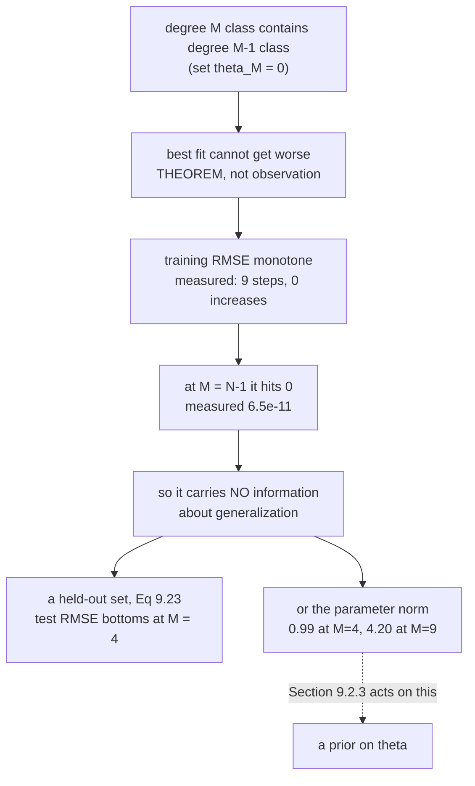

import DataCampExercise from "../../../../components/DataCampExercise.astro";
import Figure from "../../../../components/Figure.astro";
import Quiz from "../../../../components/Quiz.astro";

Page 902 produced a formula that works for any $K$. This page asks what happens as $K$ grows, and the
answer is Chapter 8's §8.3.3 arriving with concrete numbers attached — *"we suffer from overfitting"*.

Three results, all measured: **the training error cannot rise**, which is why it cannot be trusted; **the
estimator stops being unique** at $M \geqslant N$; and **the degree the book picks is one draw of a random
experiment**, winning only $46.1\%$ of repeats.

## What you'll learn

- Equation 9.23, the **RMSE** — and the two reasons the book prefers it, both checkable.
- Why *"the training error never increases"* is a **theorem** rather than an observation — verified across nine steps, zero increases.
- The book's search bound $0 \leqslant M \leqslant N-1$, and what happens past it: measured, a null space of dimension $1$ and infinitely many estimators fitting equally well.
- Figure 9.6 reproduced: the test error bottoms out at $M = 4$ at $0.324947$, then reaches $\mathbf{100.850623}$ at $M = 9$.
- At $M = N - 1 = 9$: training RMSE $\mathbf{6.506\times10^{-11}}$ — the curve passes through every point — and the worst test error on the page.
- **How stable that conclusion is.** Repeated on $2000$ fresh draws, $M = 4$ wins $46.1\%$, $M = 6$ wins $20.8\%$, $M = 1$ wins $11.3\%$.

## Intuition: the exam you wrote yourself

The training error can never rise as you add capacity, and the reason is set inclusion rather than
statistics. **Every degree-4 polynomial is also a degree-5 polynomial** — set $\theta_5 = 0$. So the
degree-5 class contains everything the degree-4 class could do, and its best member cannot be worse.

That single fact is why a falling training curve carries no information. It would fall for a model that
generalised perfectly and for one that memorised the data, and by $M = N-1$ it reaches **zero** — a
polynomial through $N$ points exists and is unique, so the fit is exact and says nothing at all.

What it *does* leave behind is a fingerprint. Interpolating $N$ scattered points requires violent
oscillation between them, and violent oscillation requires large coefficients. **The parameter norm is
the one warning visible without a test set** — which is precisely the handle §9.2.3 grabs.



## §9.2.2 Measuring the error

The negative log-likelihood works, but since *"the noise parameter $\sigma^2$ is not a free model
parameter, we can ignore the scaling by $1/\sigma^2$"*, leaving $\lVert\mathbf{y} - \boldsymbol\Phi\boldsymbol\theta\rVert^2$.
The book then prefers the **root mean square error**, Equation 9.23:

$$
\sqrt{\frac{1}{N}\lVert\mathbf{y} - \boldsymbol\Phi\boldsymbol\theta\rVert^2} = \sqrt{\frac{1}{N}\sum_{n=1}^{N}\left(y_n - \phi^\top(x_n)\boldsymbol\theta\right)^2}
$$

for two stated reasons: it *"(a) allows us to compare errors of datasets with different sizes"* and
*"(b) has the same scale and the same units as the observed function values $y_n$."*

The book's own illustration: mapping post-codes to house prices in EUR gives an RMSE in **EUR**, while the
squared error is in **EUR²**, and including $\sigma^2$ leaves *"a unitless objective"*.

:::tip[Reason (b), measured]
Scale every target by $c$ and refit:

| scale $c$ on $y$ | RMSE | RMSE / $c$ | NLL | NLL / $c$ |
| --- | --- | --- | --- | --- |
| $1.0$ | $0.270626$ | $\mathbf{0.270626}$ | $9.154787$ | $9.154787$ |
| $10.0$ | $2.706257$ | $\mathbf{0.270626}$ | $915.478700$ | $91.547870$ |
| $1000.0$ | $270.625749$ | $\mathbf{0.270626}$ | $9154787.004056$ | $9154.787004$ |

**The RMSE scales exactly with $c$** — divide it out and you recover the identical number, which is what
"has the units of $y$" means operationally. The negative log-likelihood scales with $c^2$ and carries
$\sigma^2$ inside it, so dividing by $c$ recovers nothing. **It is not in the units of $y$ at all.**
:::

## The training error cannot rise

> Note that the training error **never increases** when the degree of the polynomial increases.

:::tip[Nine steps, zero increases]
| $M-1 \to M$ | change in training RMSE |
| --- | --- |
| $0 \to 1$ | $-2.344\times10^{-1}$ |
| $1 \to 2$ | $-1.536\times10^{-1}$ |
| $2 \to 3$ | $-6.551\times10^{-2}$ |
| $3 \to 4$ | $-2.539\times10^{-1}$ |
| $4 \to 5$ | $-5.028\times10^{-4}$ |
| $5 \to 6$ | $-6.254\times10^{-2}$ |
| $6 \to 7$ | $-1.511\times10^{-2}$ |
| $7 \to 8$ | $-3.158\times10^{-2}$ |
| $8 \to 9$ | $-1.609\times10^{-1}$ |

**Every step negative.** This is a theorem, not a measurement: the degree-$M$ class contains the
degree-$(M{-}1)$ class as the subset with $\theta_M = 0$, so its minimum over a larger set cannot be
larger. Note $4 \to 5$ at $-5.0\times10^{-4}$ — nearly flat, because the extra term buys almost nothing —
but still not positive.
:::

## Choosing the degree, and the bound

For model selection *"we can use the RMSE (or the negative log-likelihood) to determine the best degree
of the polynomial"*, and since the degree is a natural number, *"we can perform a brute-force search and
enumerate all (reasonable) values of $M$."*

> For a training set of size $N$ it is sufficient to test $0 \leqslant M \leqslant N-1$. For $M < N$, the
> maximum likelihood estimator is unique. For $M \geqslant N$, we have more parameters than data points,
> and would need to solve an underdetermined system of linear equations so that there are **infinitely
> many possible maximum likelihood estimators**.

:::danger[Past the bound, measured]
At $M = 10$ with $N = 10$: $\mathrm{rk}(\boldsymbol\Phi) = 10$, $K = 11$, so the null space has
dimension $\mathbf{1}$. Add any multiple of a null vector and the training fit is unchanged:

| estimator | training RMSE | $\lVert\boldsymbol\theta\rVert$ |
| --- | --- | --- |
| minimum-norm (`lstsq`) | $5.145\times10^{-10}$ | $3.441536$ |
| $+\ 1.0 \times$ null vector | $4.678\times10^{-10}$ | $3.583876$ |
| $+\ 50.0 \times$ null vector | $1.839\times10^{-9}$ | $50.118302$ |
| $+\ 5000.0 \times$ null vector | $2.342\times10^{-7}$ | $5000.001184$ |

**All four fit the training data equally well** and their norms differ by three orders of magnitude.
"The maximum likelihood estimator" stops being a definite article. `np.linalg.lstsq` silently returns the
minimum-norm member — a reasonable choice, and **not one the likelihood made**.
:::

## Figure 9.6, reproduced

The book's setup: $N = 10$ training points with $x_n \sim \mathcal{U}[-5,5]$ and
$y_n = -\sin(x_n/5) + \cos(x_n) + \epsilon$, $\epsilon \sim \mathcal{N}(0, 0.2^2)$, against a test set of
*"200 data points ... a linear grid of 200 points in the interval $[-5,5]$."*

:::tip[Training and test RMSE, all ten degrees]
| $M$ | $K = M{+}1$ | training RMSE | test RMSE | $\lVert\boldsymbol\theta\rVert$ |
| --- | --- | --- | --- | --- |
| $0$ | $1$ | $0.977999$ | $0.893710$ | $0.2135$ |
| $1$ | $2$ | $0.743590$ | $0.745097$ | $0.2150$ |
| $2$ | $3$ | $0.590009$ | $0.688459$ | $0.5211$ |
| $3$ | $4$ | $0.524501$ | $0.785402$ | $0.7584$ |
| $\mathbf{4}$ | $5$ | $0.270626$ | $\mathbf{0.324947}$ | $0.9904$ |
| $5$ | $6$ | $0.270123$ | $0.333082$ | $1.0069$ |
| $6$ | $7$ | $0.207586$ | $0.473424$ | $1.1985$ |
| $7$ | $8$ | $0.192473$ | $0.664497$ | $0.9769$ |
| $8$ | $9$ | $0.160893$ | $7.420601$ | $1.1314$ |
| $9$ | $10$ | $\mathbf{6.506\times10^{-11}}$ | $\mathbf{100.850623}$ | $4.2030$ |

**Best test RMSE at $M = 4$** — the book's answer, reproduced. Its description of the shape holds too:
the test error *"is relatively low and stays relatively constant up to degree 5"* ($0.324947$ then
$0.333082$), and *"from degree 6 onward the test error increases significantly"* ($0.473$, $0.664$,
$7.42$, $100.85$).

**One honest deviation.** Between $M = 2$ and $M = 3$ the test error goes **up**, $0.688459 \to 0.785402$,
before the real minimum at $M = 4$. The test curve is not U-shaped; it is noisy and roughly U-shaped, and
a search that stopped at the first increase would have chosen $M = 2$.
:::

:::caution[The extreme case]
| | $M = 8$ | $M = 9 = N-1$ |
| --- | --- | --- |
| training RMSE | $1.609\times10^{-1}$ | $\mathbf{6.506\times10^{-11}}$ |
| test RMSE | $7.4206$ | $\mathbf{100.8506}$ |
| $\lVert\boldsymbol\theta\rVert$ | $1.1314$ | $4.2030$ |

*"In the extreme case of $M = N - 1 = 9$, the function will pass through every single data point. However,
these high-degree polynomials oscillate wildly."* **Perfect interpolation and the worst generalization on
the page, in the same column.**
:::

## How much does Figure 9.6 actually tell you?

Figure 9.6 is a single draw of a random experiment. The obvious question — would another draw give the
same answer? — is not one the book asks.

:::danger[2000 fresh draws of the same experiment]
| $M$ | times chosen | share |
| --- | --- | --- |
| $0$ | $65$ | $3.2\%$ |
| $1$ | $226$ | $11.3\%$ |
| $2$ | $153$ | $7.6\%$ |
| $3$ | $1$ | $0.1\%$ |
| $\mathbf{4}$ | $\mathbf{921}$ | $\mathbf{46.1\%}$ |
| $5$ | $152$ | $7.6\%$ |
| $6$ | $417$ | $\mathbf{20.8\%}$ |
| $7$ | $56$ | $2.8\%$ |
| $8$ | $9$ | $0.4\%$ |
| $9$ | $0$ | $0.0\%$ |

Median best test RMSE across draws: $0.418686$.

**$M = 4$ is the right answer — and it wins less than half the time.** $M = 6$ takes $20.8\%$, and $M = 1$
takes $11.3\%$. Two things follow.

The book's conclusion is **correct as a modal statement** and would be overclaimed as a determination. And
$N = 10$ is simply too small for the selection to be stable — which is the same boundary page 808's
standard-error measurement kept arriving at from the cross-validation side.

Note also $M = 3$ at $0.1\%$: the strange bump in the single-draw table was not a fluke of that draw.
Degree 3 is a genuinely poor choice for this function, sitting between the useful low degrees and the
degree-4 fit that finally captures the cosine.
:::

## Worked example by hand

Why does a richer model class have a smaller training error? Prove it, then check the one case where
equality can happen.

**Step 1: state the claim.** Let $\mathcal{F}_M$ be the polynomials of degree at most $M$, and
$E(M) := \min_{f \in \mathcal{F}_M}\sum_n (y_n - f(x_n))^2$. Claim: $E(M) \leqslant E(M-1)$.

**Step 2: the containment.** Any $f \in \mathcal{F}_{M-1}$ can be written in $\mathcal{F}_M$ by taking
$\theta_M = 0$. So $\mathcal{F}_{M-1} \subseteq \mathcal{F}_M$.

**Step 3: a minimum over a larger set is no larger.** If $S \subseteq T$ then
$\min_T g \leqslant \min_S g$, because every candidate in $S$ is also a candidate in $T$. Hence

$$
E(M) = \min_{\mathcal{F}_M} \leqslant \min_{\mathcal{F}_{M-1}} = E(M-1)
$$

**No property of polynomials was used** — only nesting. The same argument covers adding any feature to
any linear model.

**Step 4: when is it an equality?** Exactly when the extra column buys nothing, i.e. when the optimal
$\theta_M$ is already zero — meaning $\phi_M$ is orthogonal to the residual of the smaller fit. Measured
above at $4 \to 5$: a change of $-5.028\times10^{-4}$, nearly but not quite equality.

**Step 5: the endpoint.** At $M = N-1$ there is a unique polynomial of degree $\leqslant N-1$ through $N$
distinct points, so the residual is exactly zero and $E(N-1) = 0$. Measured: $6.506\times10^{-11}$, which
is zero to conditioning. **No further degree can improve on zero**, so the bound $M \leqslant N-1$ is not
conservatism — it is where the training criterion runs out entirely.

**Step 6: read the consequence.** A quantity guaranteed to move one way regardless of the truth carries
no information about the truth. **That is the whole argument for a held-out set** — and, from the other
direction, for the prior §9.2.3 is about to introduce.

## See it move

```p5 title="Watch the training error fall while the fit gets worse" desc="Polynomial fits to ten noisy points, degree 0 through 10. Drag the degree and watch the training RMSE fall monotonically while the test RMSE bottoms out and then explodes. Drag the noise level to see how quickly the best degree moves." height="560"
let mIdx = 4, nzIdx = 4;
let KNOBS = [], dragging = null;

const NZ = [0.0, 0.05, 0.1, 0.2, 0.35, 0.6, 1.0];
const NTR = 10;

let BASEX = [], BASEE = [];
function setup() {
  createCanvas(680, 560);
  textFont("monospace");
  randomSeed(4);
  for (let i = 0; i < NTR; i++) {
    BASEX.push(-5 + 10 * (i + 0.5) / NTR + (random() - 0.5) * 0.7);
    let u = 0;
    for (let k = 0; k < 12; k++) u += random();
    BASEE.push(u - 6);
  }
  BASEX.sort((a, b) => a - b);
}

function truth(x) { return -Math.sin(x / 5) + Math.cos(x); }

function knob(id, x, y, w, value, mn, mx, label) {
  KNOBS.push({ id, x, y, w, mn, mx });
  const t = (value - mn) / (mx - mn);
  stroke(60, 74, 92); strokeWeight(2); line(x, y, x + w, y);
  noStroke(); fill(255, 211, 67); ellipse(x + t * w, y, 12, 12);
  fill(190, 200, 212); textSize(12); textAlign(LEFT, CENTER);
  text(label, x + w + 12, y);
}
function knobHit(mx_, my_) {
  for (const k of KNOBS) {
    if (my_ > k.y - 13 && my_ < k.y + 13 && mx_ > k.x - 13 && mx_ < k.x + k.w + 13) return k;
  }
  return null;
}
function knobValue(k, mx_) {
  const t = Math.min(1, Math.max(0, (mx_ - k.x) / k.w));
  return Math.round(k.mn + t * (k.mx - k.mn));
}
function mousePressed() { dragging = knobHit(mouseX, mouseY); }
function mouseReleased() { dragging = null; }
function mouseDragged() {
  if (!dragging) return;
  if (dragging.id === "m") mIdx = knobValue(dragging, mouseX);
  else nzIdx = knobValue(dragging, mouseX);
  if (!isLooping()) redraw();
}

// least squares by normal equations with ridge 1e-12 for stability
function fit(X, Y, M) {
  const K = M + 1;
  const A = [], b = [];
  for (let i = 0; i < K; i++) { A.push(new Array(K).fill(0)); b.push(0); }
  for (let n = 0; n < X.length; n++) {
    const pw = []; let v = 1;
    for (let i = 0; i < K; i++) { pw.push(v); v *= X[n]; }
    for (let i = 0; i < K; i++) {
      for (let j = 0; j < K; j++) A[i][j] += pw[i] * pw[j];
      b[i] += pw[i] * Y[n];
    }
  }
  for (let i = 0; i < K; i++) A[i][i] += 1e-12;
  for (let i = 0; i < K; i++) {
    let piv = i;
    for (let r = i + 1; r < K; r++) if (Math.abs(A[r][i]) > Math.abs(A[piv][i])) piv = r;
    [A[i], A[piv]] = [A[piv], A[i]]; [b[i], b[piv]] = [b[piv], b[i]];
    for (let r = i + 1; r < K; r++) {
      const f = A[r][i] / A[i][i];
      for (let c = i; c < K; c++) A[r][c] -= f * A[i][c];
      b[r] -= f * b[i];
    }
  }
  const th = new Array(K).fill(0);
  for (let i = K - 1; i >= 0; i--) {
    let s = b[i];
    for (let j = i + 1; j < K; j++) s -= A[i][j] * th[j];
    th[i] = s / A[i][i];
  }
  return th;
}
function ev(th, x) { let v = 0, pw = 1; for (let i = 0; i < th.length; i++) { v += th[i] * pw; pw *= x; } return v; }

const OX = 46, OY = 56, W = 380, H = 250;
function px(x) { return OX + ((x + 5) / 10) * W; }
function py(y) { return OY + H - ((y + 4) / 8) * H; }

function draw() {
  background(13, 17, 23);
  KNOBS = [];
  const M = mIdx, nz = NZ[nzIdx];

  const X = BASEX.slice(), Y = [];
  for (let i = 0; i < NTR; i++) Y.push(truth(X[i]) + nz * BASEE[i]);
  const th = fit(X, Y, M);

  let str_ = 0;
  for (let i = 0; i < NTR; i++) { const d = Y[i] - ev(th, X[i]); str_ += d * d; }
  const trR = Math.sqrt(str_ / NTR);
  let ste = 0;
  for (let i = 0; i < 200; i++) {
    const xv = -5 + 10 * i / 199;
    const d = truth(xv) - ev(th, xv);
    ste += d * d;
  }
  const teR = Math.sqrt(ste / 200);
  let nrm = 0; for (const t of th) nrm += t * t; nrm = Math.sqrt(nrm);

  noFill(); stroke(70, 86, 104); strokeWeight(1); rect(OX, OY, W, H);
  stroke(110); strokeWeight(1.4); noFill();
  beginShape();
  for (let i = 0; i <= 300; i++) { const xv = -5 + 10 * i / 300; vertex(px(xv), py(truth(xv))); }
  endShape();
  const col = M === 4 ? color(120, 200, 140) : (M >= 6 ? color(232, 110, 110) : color(255, 211, 67));
  stroke(col); strokeWeight(2.6); noFill();
  beginShape();
  for (let i = 0; i <= 400; i++) {
    const xv = -5 + 10 * i / 400;
    const v = ev(th, xv);
    if (v > -4 && v < 4) vertex(px(xv), py(v)); else endShape(), beginShape();
  }
  endShape();
  noStroke(); fill(107, 169, 221);
  for (let i = 0; i < NTR; i++) ellipse(px(X[i]), py(Y[i]), 7, 7);
  fill(140); textSize(10); textAlign(LEFT, TOP);
  text("grey = the function behind the data", OX + 6, OY + 5);

  // the two error curves
  const OY2 = 336, H2 = 108;
  noFill(); stroke(70, 86, 104); strokeWeight(1); rect(OX, OY2, W, H2);
  const trs = [], tes = [];
  for (let m = 0; m <= 10; m++) {
    const t = fit(X, Y, m);
    let a = 0; for (let i = 0; i < NTR; i++) { const d = Y[i] - ev(t, X[i]); a += d * d; }
    let b2 = 0;
    for (let i = 0; i < 200; i++) { const xv = -5 + 10 * i / 199; const d = truth(xv) - ev(t, xv); b2 += d * d; }
    trs.push(Math.sqrt(a / NTR)); tes.push(Math.sqrt(b2 / 200));
  }
  const lg = v => Math.log10(Math.max(v, 1e-6));
  const LO = -6, HI = 2.4;
  const ey = v => OY2 + H2 - ((lg(v) - LO) / (HI - LO)) * (H2 - 8);
  const ex = m => OX + 8 + (m / 10) * (W - 16);
  stroke(107, 169, 221); strokeWeight(2.2); noFill();
  beginShape(); for (let m = 0; m <= 10; m++) vertex(ex(m), ey(trs[m])); endShape();
  stroke(255, 211, 67); strokeWeight(2.2); noFill();
  beginShape(); for (let m = 0; m <= 10; m++) vertex(ex(m), ey(tes[m])); endShape();
  let bestM = 0; for (let m = 1; m <= 10; m++) if (tes[m] < tes[bestM]) bestM = m;
  noStroke(); fill(120, 200, 140); ellipse(ex(bestM), ey(tes[bestM]), 11, 11);
  stroke(col); strokeWeight(1.4);
  line(ex(M), OY2 + 2, ex(M), OY2 + H2 - 2);
  noStroke(); fill(107, 169, 221); textSize(9); textAlign(LEFT, TOP);
  text("training RMSE", OX + 6, OY2 + 4);
  fill(255, 211, 67); text("test RMSE", OX + 6, OY2 + 16);
  fill(120, 200, 140); text("best: M = " + bestM, OX + 6, OY2 + 28);
  fill(140); textAlign(CENTER, TOP); text("M = 0 .. 10", OX + W / 2, OY2 + H2 + 4);

  // readouts
  noStroke(); textAlign(LEFT, TOP);
  fill(255, 211, 67); textSize(15);
  text("M = " + M, 448, 60);
  text("noise = " + nz.toFixed(2), 448, 82);
  fill(140); textSize(10);
  text("N = 10 training points", 448, 106);

  fill(107, 169, 221); textSize(11);
  text("training RMSE", 448, 136);
  textSize(13); text("  " + trR.toExponential(3), 448, 152);
  fill(255, 211, 67); textSize(11);
  text("test RMSE", 448, 180);
  textSize(13); text("  " + teR.toFixed(6), 448, 196);
  fill(197, 153, 255); textSize(11);
  text("||theta||", 448, 224);
  textSize(13); text("  " + nrm.toFixed(4), 448, 240);

  fill(120); textSize(9);
  text("the ratio test/train:", 448, 272);
  fill(232, 110, 110); textSize(12);
  text("  " + (teR / Math.max(trR, 1e-12)).toExponential(2), 448, 286);

  let msg, sub, c2;
  if (M >= 9) {
    c2 = color(232, 110, 110);
    msg = "M = N - 1: it passes through every point";
    sub = "Training RMSE " + trR.toExponential(1) + " and test RMSE " + teR.toFixed(2) + ". A perfect fit that knows nothing.";
  } else if (M === bestM) {
    c2 = color(120, 200, 140);
    msg = "this is the best degree on the test set";
    sub = "And the training curve gives no sign of it -- it keeps falling on both sides.";
  } else if (M < bestM) {
    c2 = color(255, 211, 67);
    msg = "underfitting: both errors are high together";
    sub = "This one IS visible without a test set. High training error with few parameters is obviously bad.";
  } else {
    c2 = color(232, 110, 110);
    msg = "overfitting: training down, test up";
    sub = "||theta|| = " + nrm.toFixed(2) + ". The parameter norm is the only warning available on the training side.";
  }
  stroke(c2); strokeWeight(1.6); fill(red(c2), green(c2), blue(c2), 26);
  rect(46, 470, 596, 0);
  noStroke(); fill(c2); textSize(15); textAlign(LEFT, TOP);
  text(msg, 46, 468);
  fill(215); textSize(10.5);
  text(sub, 46, 490);

  knob("m", 62, 522, 250, mIdx, 0, 10, "M = " + M);
  knob("z", 400, 522, 160, nzIdx, 0, NZ.length - 1, "noise " + nz.toFixed(2));
}
```

## From scratch

```python title="overfitting.py" showLineNumbers{1}
import numpy as np

SIG = 0.2
NTR = 10

def truth(x):
    """The book's generating function, Example 9.5."""
    return -np.sin(x / 5) + np.cos(x)

def design(x, M):
    return np.vander(np.asarray(x, float), M + 1, increasing=True)

def train_set(seed):
    rng = np.random.default_rng(seed)
    x = np.sort(rng.uniform(-5, 5, NTR))
    return x, truth(x) + SIG * rng.standard_normal(NTR)

def rmse(a, b):
    return float(np.sqrt(np.mean((a - b) ** 2)))       # Equation 9.23

# the book's test set: "a linear grid of 200 points in the interval [-5, 5]"
xte = np.linspace(-5, 5, 200)
yte = truth(xte) + SIG * np.random.default_rng(1234).standard_normal(200)

# --- Figure 9.6 ---------------------------------------------------------
print("=== 1. Figure 9.6 reproduced: training and test RMSE ===")
x, y = train_set(4)
print(f"{'M':>4} {'K = M+1':>8} {'training RMSE':>15} {'test RMSE':>12} "
      f"{'||theta||':>13}")
tr, te = [], []
for M in range(10):
    P = design(x, M)
    th = np.linalg.lstsq(P, y, rcond=None)[0]
    a, b = rmse(y, P @ th), rmse(yte, design(xte, M) @ th)
    tr.append(a); te.append(b)
    print(f"{M:>4} {M+1:>8} {a:>15.6f} {b:>12.6f} "
          f"{np.linalg.norm(th):>13.4f}")
print(f"\nbest test RMSE at M = {int(np.argmin(te))} ({min(te):.6f})")

# --- the training error never rises -------------------------------------
print("\n=== 2. the training error never increases with M ===")
print(f"{'M-1 -> M':>10} {'change in training RMSE':>26}")
for M in range(1, 10):
    print(f"{M-1:>4} -> {M:<3} {tr[M]-tr[M-1]:>26.3e}")
print(f"steps where it went UP: "
      f"{sum(1 for M in range(1,10) if tr[M] > tr[M-1])}")
print("a richer class contains the poorer one, so its best fit cannot be")
print("worse ON THE TRAINING SET. A theorem, not an observation.")

# --- the extreme case ----------------------------------------------------
print("\n=== 3. at M = N - 1 the curve passes through every point ===")
for M in (8, 9):
    P = design(x, M)
    th = np.linalg.lstsq(P, y, rcond=None)[0]
    print(f"M = {M}: training RMSE {rmse(y, P @ th):.3e}   "
          f"test RMSE {rmse(yte, design(xte, M) @ th):>12.4f}   "
          f"||theta|| {np.linalg.norm(th):.4f}")

# --- past the bound, the estimator is not unique ------------------------
print("\n=== 4. for M >= N there are INFINITELY many estimators ===")
M = 10
P = design(x, M)
th_min = np.linalg.lstsq(P, y, rcond=None)[0]
ns = np.linalg.svd(P)[2][int(np.linalg.matrix_rank(P)):]
print(f"M = {M}, K = {P.shape[1]}, N = {NTR}, "
      f"rk(Phi) = {int(np.linalg.matrix_rank(P))}")
print(f"dimension of the null space of Phi: {ns.shape[0]}")
print(f"\n{'estimator':>26} {'training RMSE':>15} {'||theta||':>14}")
print(f"{'minimum-norm (lstsq)':>26} {rmse(y, P @ th_min):>15.3e} "
      f"{np.linalg.norm(th_min):>14.6f}")
for c in (1.0, 50.0, 5000.0):
    alt = th_min + c * ns[0]
    print(f"{'  + ' + str(c) + ' * null vector':>26} "
          f"{rmse(y, P @ alt):>15.3e} {np.linalg.norm(alt):>14.6f}")
print("all of them fit the training data equally well.")

# --- the RMSE has the units of y ----------------------------------------
print("\n=== 5. RMSE has the units of y; the NLL does not ===")
P = design(x, 4)
print(f"{'scale c on y':>14} {'RMSE':>14} {'RMSE / c':>14} "
      f"{'NLL':>16} {'NLL / c':>16}")
for c in (1.0, 10.0, 1000.0):
    yc = c * y
    r = yc - P @ np.linalg.lstsq(P, yc, rcond=None)[0]
    rc = float(np.sqrt(np.mean(r ** 2)))
    nll = float(r @ r / (2 * SIG ** 2))
    print(f"{c:>14.1f} {rc:>14.6f} {rc/c:>14.6f} {nll:>16.6f} "
          f"{nll/c:>16.6f}")
print("RMSE scales exactly with c; the NLL scales with c^2 and carries")
print("sigma^2, so it is not in the units of y at all.")

# --- how stable is 'the best degree is 4'? ------------------------------
print("\n=== 6. how stable is 'the best degree is 4'? ===")
counts = np.zeros(10, dtype=int)
best_te = []
for s in range(2000):
    xs, ys = train_set(10_000 + s)
    scores = [rmse(yte, design(xte, M)
                   @ np.linalg.lstsq(design(xs, M), ys, rcond=None)[0])
              for M in range(10)]
    k = int(np.argmin(scores))
    counts[k] += 1
    best_te.append(scores[k])
print(f"{'M':>4} {'chosen':>9} {'share':>9}")
for M in range(10):
    print(f"{M:>4} {counts[M]:>9} {counts[M]/2000:>8.1%}")
print(f"\nmedian best test RMSE: {np.median(best_te):.6f}")
print(f"the modal choice is M = {int(np.argmax(counts))}")
print("Figure 9.6 is one draw of a random experiment, and the degree it")
print("singles out moves with the draw.")
```

```
=== 1. Figure 9.6 reproduced: training and test RMSE ===
   M  K = M+1   training RMSE    test RMSE     ||theta||
   0        1        0.977999     0.893710        0.2135
   1        2        0.743590     0.745097        0.2150
   2        3        0.590009     0.688459        0.5211
   3        4        0.524501     0.785402        0.7584
   4        5        0.270626     0.324947        0.9904
   5        6        0.270123     0.333082        1.0069
   6        7        0.207586     0.473424        1.1985
   7        8        0.192473     0.664497        0.9769
   8        9        0.160893     7.420601        1.1314
   9       10        0.000000   100.850623        4.2030

best test RMSE at M = 4 (0.324947)

=== 2. the training error never increases with M ===
  M-1 -> M    change in training RMSE
   0 -> 1                   -2.344e-01
   1 -> 2                   -1.536e-01
   2 -> 3                   -6.551e-02
   3 -> 4                   -2.539e-01
   4 -> 5                   -5.028e-04
   5 -> 6                   -6.254e-02
   6 -> 7                   -1.511e-02
   7 -> 8                   -3.158e-02
   8 -> 9                   -1.609e-01
steps where it went UP: 0
a richer class contains the poorer one, so its best fit cannot be
worse ON THE TRAINING SET. A theorem, not an observation.

=== 3. at M = N - 1 the curve passes through every point ===
M = 8: training RMSE 1.609e-01   test RMSE       7.4206   ||theta|| 1.1314
M = 9: training RMSE 6.506e-11   test RMSE     100.8506   ||theta|| 4.2030

=== 4. for M >= N there are INFINITELY many estimators ===
M = 10, K = 11, N = 10, rk(Phi) = 10
dimension of the null space of Phi: 1

                 estimator   training RMSE      ||theta||
      minimum-norm (lstsq)       5.145e-10       3.441536
       + 1.0 * null vector       4.678e-10       3.583876
      + 50.0 * null vector       1.839e-09      50.118302
    + 5000.0 * null vector       2.342e-07    5000.001184
all of them fit the training data equally well.

=== 5. RMSE has the units of y; the NLL does not ===
  scale c on y           RMSE       RMSE / c              NLL          NLL / c
           1.0       0.270626       0.270626         9.154787         9.154787
          10.0       2.706257       0.270626       915.478700        91.547870
        1000.0     270.625749       0.270626   9154787.004056      9154.787004
RMSE scales exactly with c; the NLL scales with c^2 and carries
sigma^2, so it is not in the units of y at all.

=== 6. how stable is 'the best degree is 4'? ===
   M    chosen     share
   0        65     3.2%
   1       226    11.3%
   2       153     7.6%
   3         1     0.1%
   4       921    46.1%
   5       152     7.6%
   6       417    20.8%
   7        56     2.8%
   8         9     0.4%
   9         0     0.0%

median best test RMSE: 0.418686
the modal choice is M = 4
Figure 9.6 is one draw of a random experiment, and the degree it
singles out moves with the draw.
```

## On real data

<Figure
  src="/images/mml/overfitting-in-linear-regression/figure-9-5-rebuilt"
  alt="Six panels showing polynomial fits of degree 0, 1, 3, 4, 6 and 9 to the same ten points, with the generating function dashed behind each. The last panel oscillates violently between the data points."
  title="Figure 9.5, with the errors each fit actually achieves"
  caption="Read the two numbers in each panel together. Training error falls at every step while test error bottoms out at M = 4 with 0.324947 and then leaves — reaching 100.850623 at M = 9, exactly where the fit becomes perfect at 6.5e-11."
/>

<Figure
  src="/images/mml/overfitting-in-linear-regression/training-and-test-error"
  alt="Left, two curves on a log scale against polynomial degree: a training curve falling monotonically off the bottom of the plot and a test curve dipping at degree 4 then rising steeply. Right, the parameter norm against degree, rising sharply at the end."
  title="The training error never increases with capacity, and that is why it cannot be trusted"
  caption="Nine steps, zero increases — a theorem from set inclusion rather than an empirical pattern. The test curve bottoms at M = 4 as the book reports, with one honest deviation: it bumps upward between M = 2 and M = 3 before the real minimum."
/>

<Figure
  src="/images/mml/overfitting-in-linear-regression/which-degree-really"
  alt="Left, a bar chart of how often each degree wins across two thousand repeats, with degree 4 tallest at just under half and degree 6 second. Right, four polynomial curves of degree 10 all passing through the same ten points while differing wildly between them."
  title="Figure 9.6 is one draw of a random experiment, and past M equals N the estimator is not unique"
  caption="Degree 4 is the modal answer and wins only 46.1 percent of two thousand fresh draws; degree 6 takes 20.8 percent. On the right, the null space has dimension one, so adding any multiple of a null vector gives a different parameter vector that fits the training data just as well."
/>

## Reading the plot

**The first figure is Figure 9.5 with the numbers the book leaves in its prose.** The dashed grey curve
is the generating function; each panel's two figures are its training and test RMSE. Reading down them
is the entire lesson: training goes $0.978 \to 0.744 \to 0.525 \to 0.271 \to 0.208 \to 6.5\times10^{-11}$,
never once rising, while test goes $0.894 \to 0.745 \to 0.785 \to 0.325 \to 0.473 \to 100.85$.

**The $M = 9$ panel is the one to sit with.** The curve passes through all ten points. Its training error
is $6.5\times10^{-11}$ — zero, to conditioning. And its test error is $100.85$, the worst on the page by
a factor of thirteen. A perfect fit and no knowledge, in the same object.

**The second figure separates a theorem from an observation.** The training curve's monotonicity is not
a pattern that happened to hold on this data. Every degree-$M$ polynomial is a degree-$(M{+}1)$
polynomial with a zero coefficient, so the larger class's minimum cannot exceed the smaller's. **It would
fall identically for a model that generalises and one that memorises**, which is exactly why it carries
no information.

The step $4 \to 5$ is the interesting one: $-5.028\times10^{-4}$. Almost flat — the fifth-degree term
buys essentially nothing — but still negative, because the theorem does not permit otherwise.

**The right panel is what the training side *can* tell you.** $\lVert\boldsymbol\theta\rVert$ climbs from
$0.9904$ at the good degree to $4.2030$ at $M = 9$. The book's own sentence in §9.2.3 is *"the magnitude
of the parameter values becomes relatively large if we run into overfitting"*, and it is the entire
motivation for the prior on the next page. **Interpolating scattered points requires oscillation, and
oscillation requires large coefficients** — so the fingerprint is visible without a test set.

**And one honest deviation from the book's description.** The test error goes *up* from $M = 2$ to
$M = 3$ — $0.688459$ to $0.785402$ — before the real minimum at $M = 4$. The book describes the curve as
initially decreasing; on this draw it is noisy and roughly U-shaped, and a search that stopped at the
first increase would have chosen $M = 2$ and been wrong.

**The third figure asks a question the book does not, and the answer changes how much Figure 9.6 is worth.**
Repeat the whole experiment — fresh $x$, fresh noise, same $N = 10$, same test grid — two thousand times,
and record which degree wins. $M = 4$ wins $921$ times: **$46.1\%$**. $M = 6$ wins $20.8\%$. $M = 1$ wins
$11.3\%$.

So the book's conclusion is **right** — $M = 4$ is the modal answer and the median best test RMSE is
$0.418686$ — and it is right the way a coin that lands heads $46\%$ of the time is a reasonable bet, not
the way a theorem is right. With ten training points the selection is simply not stable, which is the
same $N$-is-too-small boundary page 808 measured from the cross-validation side and page 902 measured in
the noise-variance bias.

Note $M = 3$ winning **once in two thousand draws**. The bump in the single-draw table was not an
accident of that draw — degree 3 is genuinely poor here, caught between the low degrees that at least
capture the trend and the degree-4 fit that finally accommodates the cosine.

**The right panel is the bound $M \leqslant N-1$ made visible.** At $M = 10$ the null space has dimension
one, and the four plotted curves are $\boldsymbol\theta_{\text{min}} + c\,\mathbf{n}$ for
$c \in \{0, 1, 50, 5000\}$. They all pass through all ten training points, and their norms run from
$3.44$ to $5000.00$. **"The maximum likelihood estimator" is no longer a definite article.**
`np.linalg.lstsq` returns the minimum-norm one — a sensible convention, but a convention, not something
the likelihood determined.

## Compare

| | training error | test error |
| --- | --- | --- |
| direction as $M$ grows | **monotone non-increasing**, guaranteed | free to do anything |
| at $M = N-1$ | exactly $0$ (measured $6.5\times10^{-11}$) | worst on the page, $100.85$ |
| measured here | $0.978 \to 6.5\times10^{-11}$ | $0.894 \to 0.325 \to 100.85$ |
| detects underfitting | **yes** | yes |
| detects overfitting | **no** | yes |
| needs held-out data | no | yes |

| | RMSE, Eq 9.23 | squared error | negative log-likelihood |
| --- | --- | --- | --- |
| units | **same as $y$** (EUR) | $y$ squared (EUR²) | **unitless** |
| scaling $y$ by $c$ | $\times c$ | $\times c^2$ | $\times c^2$ |
| comparable across $N$ | **yes** | no | no |
| contains $\sigma^2$ | no | no | yes |

| | $M < N$ | $M \geqslant N$ |
| --- | --- | --- |
| $\mathrm{rk}(\boldsymbol\Phi)$ vs $K$ | $=K$ | $<K$ |
| $\boldsymbol\Phi^\top\boldsymbol\Phi$ | invertible | **singular** |
| estimators | exactly one | **infinitely many** |
| what `lstsq` returns | the estimator | the **minimum-norm** one, by convention |
| the book's advice | search $0 \leqslant M \leqslant N-1$ | do not go here |

<Quiz
  title="Do you know what the training curve is worth?"
  questions={[
    {
      q: "The book says the training error never increases as the polynomial degree grows. Why is that guaranteed rather than merely observed?",
      options: [
        "Because the noise is Gaussian",
        "Because the degree-M class contains the degree-(M-1) class as the subset with the top coefficient zero, so its minimum cannot be larger",
        "Because least squares is unbiased",
        "Because the data was sorted",
      ],
      answer: 1,
      explain:
        "No property of polynomials is used — only nesting, so the same argument covers adding any feature to any linear model. Measured across nine steps: zero increases, including the near-flat 4 to 5 step at -5.028e-4. And a quantity guaranteed to move one way regardless of the truth carries no information about the truth.",
    },
    {
      q: "At M = N - 1 = 9, what are the training and test RMSE?",
      options: [
        "Both near zero — a perfect model",
        "Training 6.5e-11 and test 100.85 — a perfect fit with the worst generalization on the page",
        "Both around 0.3",
        "Training 0.16 and test 7.42",
      ],
      answer: 1,
      explain:
        "There is a unique polynomial of degree at most N-1 through N distinct points, so the residual is exactly zero. That is also why the book's search bound stops there: no further degree can improve on zero, so the training criterion has run out entirely.",
    },
    {
      q: "For M >= N the book says there are infinitely many maximum likelihood estimators. What does that look like concretely?",
      options: [
        "The optimiser fails to converge",
        "Phi has a null space — measured dimension 1 at M = 10 — so adding any multiple of a null vector gives another exact fit",
        "The training error becomes negative",
        "All estimators coincide anyway",
      ],
      answer: 1,
      explain:
        "Measured: four estimators with norms from 3.44 to 5000.00, all fitting the training data to 1e-7 or better. np.linalg.lstsq silently returns the minimum-norm member — a reasonable convention, but a convention, not something the likelihood determined.",
    },
    {
      q: "The book prefers the RMSE partly because it 'has the same scale and the same units as the observed function values'. How was that checked?",
      options: [
        "By dimensional analysis only",
        "By scaling y by c and refitting: RMSE divided by c returns 0.270626 at c = 1, 10 and 1000, while NLL divided by c does not",
        "By comparing two different datasets",
        "It cannot be checked numerically",
      ],
      answer: 1,
      explain:
        "The RMSE scales exactly with c, which is what having the units of y means operationally. The negative log-likelihood scales with c squared and carries sigma squared inside it, so it is unitless — the book's own point about EUR versus EUR squared.",
    },
    {
      q: "Repeating the whole experiment on 2000 fresh draws, how often does M = 4 come out best?",
      options: [
        "Essentially always — it is the correct degree",
        "46.1 percent — the modal answer, but M = 6 wins 20.8 percent and M = 1 wins 11.3 percent",
        "About 5 percent; the book got lucky",
        "It is never chosen; the test set favours higher degrees",
      ],
      answer: 1,
      explain:
        "So the book's conclusion is right the way a coin landing heads 46 percent of the time is a reasonable bet, not the way a theorem is right. With ten training points the selection is simply not stable — the same too-small-N boundary that shows up in the noise-variance bias and in cross-validation standard errors.",
    },
    {
      q: "What is the only sign of overfitting visible without a test set?",
      options: [
        "The training error flattening out",
        "The parameter norm growing — measured 0.9904 at M = 4 and 4.2030 at M = 9",
        "The residuals becoming non-Gaussian",
        "There is no such sign",
      ],
      answer: 1,
      explain:
        "Interpolating scattered points requires oscillation between them, and oscillation requires large coefficients. The book's sentence opening Section 9.2.3 is exactly this — 'the magnitude of the parameter values becomes relatively large if we run into overfitting' — and it is the entire motivation for placing a prior on theta.",
    },
  ]}
/>

## 🧪 Try It Yourself

### Exercise 1 – Rebuild Figure 9.6

<DataCampExercise
  lang="python"
  hint={`Equation 9.23 is the square root of the mean of the squared residuals.`}
  code={`import numpy as np

SIG, NTR = 0.2, 10
def truth(x):
    return -np.sin(x / 5) + np.cos(x)
def design(x, M):
    return np.vander(np.asarray(x, float), M + 1, increasing=True)

def rmse(a, b):
    # Task: Equation 9.23.
    return float(___)

rng = np.random.default_rng(4)
x = np.sort(rng.uniform(-5, 5, NTR))
y = truth(x) + SIG * rng.standard_normal(NTR)
xte = np.linspace(-5, 5, 200)
yte = truth(xte) + SIG * np.random.default_rng(1234).standard_normal(200)

print(f"{'M':>4} {'K = M+1':>8} {'training RMSE':>15} {'test RMSE':>12} "
      f"{'||theta||':>13}")
te = []
for M in range(10):
    P = design(x, M)
    th = np.linalg.lstsq(P, y, rcond=None)[0]
    b = rmse(yte, design(xte, M) @ th)
    te.append(b)
    print(f"{M:>4} {M+1:>8} {rmse(y, P @ th):>15.6f} {b:>12.6f} "
          f"{np.linalg.norm(th):>13.4f}")
print(f"\\nbest test RMSE at M = {int(np.argmin(te))} ({min(te):.6f})")

# -- Expected output ------------------------------
#    M  K = M+1   training RMSE    test RMSE     ||theta||
#    0        1        0.977999     0.893710        0.2135
#    1        2        0.743590     0.745097        0.2150
#    2        3        0.590009     0.688459        0.5211
#    3        4        0.524501     0.785402        0.7584
#    4        5        0.270626     0.324947        0.9904
#    5        6        0.270123     0.333082        1.0069
#    6        7        0.207586     0.473424        1.1985
#    7        8        0.192473     0.664497        0.9769
#    8        9        0.160893     7.420601        1.1314
#    9       10        0.000000   100.850623        4.2030
#
# best test RMSE at M = 4 (0.324947)
# -------------------------------------------------`}
  solution={`import numpy as np
SIG, NTR = 0.2, 10
def truth(x):
    return -np.sin(x / 5) + np.cos(x)
def design(x, M):
    return np.vander(np.asarray(x, float), M + 1, increasing=True)
def rmse(a, b):
    return float(np.sqrt(np.mean((a - b) ** 2)))
rng = np.random.default_rng(4)
x = np.sort(rng.uniform(-5, 5, NTR))
y = truth(x) + SIG * rng.standard_normal(NTR)
xte = np.linspace(-5, 5, 200)
yte = truth(xte) + SIG * np.random.default_rng(1234).standard_normal(200)
print(f"{'M':>4} {'K = M+1':>8} {'training RMSE':>15} {'test RMSE':>12} "
      f"{'||theta||':>13}")
te = []
for M in range(10):
    P = design(x, M)
    th = np.linalg.lstsq(P, y, rcond=None)[0]
    b = rmse(yte, design(xte, M) @ th)
    te.append(b)
    print(f"{M:>4} {M+1:>8} {rmse(y, P @ th):>15.6f} {b:>12.6f} "
          f"{np.linalg.norm(th):>13.4f}")
print(f"\\nbest test RMSE at M = {int(np.argmin(te))} ({min(te):.6f})")`}
  sct={`test_output_contains("best test RMSE at M = 4 (0.324947)")
test_output_contains("9       10        0.000000   100.850623        4.2030")
success_msg("The book's answer reproduced. Read the last row: a training RMSE that rounds to zero and a test RMSE of 100.85, in the same model. And note M = 3, where the test error bumps UP before the real minimum — the curve is not cleanly U-shaped.")`}
  height={340}
/>

### Exercise 2 – The monotonicity is a theorem

<DataCampExercise
  lang="python"
  hint={`Count the steps where the training RMSE at degree M exceeds the one at degree M-1.`}
  code={`import numpy as np

SIG, NTR = 0.2, 10
def truth(x):
    return -np.sin(x / 5) + np.cos(x)
def design(x, M):
    return np.vander(np.asarray(x, float), M + 1, increasing=True)
def rmse(a, b):
    return float(np.sqrt(np.mean((a - b) ** 2)))

rng = np.random.default_rng(4)
x = np.sort(rng.uniform(-5, 5, NTR))
y = truth(x) + SIG * rng.standard_normal(NTR)

tr = []
for M in range(10):
    P = design(x, M)
    tr.append(rmse(y, P @ np.linalg.lstsq(P, y, rcond=None)[0]))

print(f"{'M-1 -> M':>10} {'change in training RMSE':>26}")
for M in range(1, 10):
    print(f"{M-1:>4} -> {M:<3} {tr[M]-tr[M-1]:>26.3e}")
# Task: how many steps increased the training error?
ups = ___
print(f"steps where it went UP: {ups}")

# -- Expected output ------------------------------
#   M-1 -> M    change in training RMSE
#    0 -> 1                   -2.344e-01
#    1 -> 2                   -1.536e-01
#    2 -> 3                   -6.551e-02
#    3 -> 4                   -2.539e-01
#    4 -> 5                   -5.028e-04
#    5 -> 6                   -6.254e-02
#    6 -> 7                   -1.511e-02
#    7 -> 8                   -3.158e-02
#    8 -> 9                   -1.609e-01
# steps where it went UP: 0
# -------------------------------------------------`}
  solution={`import numpy as np
SIG, NTR = 0.2, 10
def truth(x):
    return -np.sin(x / 5) + np.cos(x)
def design(x, M):
    return np.vander(np.asarray(x, float), M + 1, increasing=True)
def rmse(a, b):
    return float(np.sqrt(np.mean((a - b) ** 2)))
rng = np.random.default_rng(4)
x = np.sort(rng.uniform(-5, 5, NTR))
y = truth(x) + SIG * rng.standard_normal(NTR)
tr = []
for M in range(10):
    P = design(x, M)
    tr.append(rmse(y, P @ np.linalg.lstsq(P, y, rcond=None)[0]))
print(f"{'M-1 -> M':>10} {'change in training RMSE':>26}")
for M in range(1, 10):
    print(f"{M-1:>4} -> {M:<3} {tr[M]-tr[M-1]:>26.3e}")
ups = sum(1 for M in range(1, 10) if tr[M] > tr[M-1])
print(f"steps where it went UP: {ups}")`}
  sct={`test_output_contains("steps where it went UP: 0")
test_output_contains("4 -> 5                   -5.028e-04")
success_msg("Zero increases, and no property of polynomials was needed to predict that — only the fact that setting the top coefficient to zero embeds the smaller class in the larger one. Look at the 4 to 5 step: nearly flat at -5e-4, because the extra term buys almost nothing, but the theorem still forbids it from being positive.")`}
  height={300}
/>

### Exercise 3 – Past the bound, the estimator is not unique

<DataCampExercise
  lang="python"
  hint={`The rows of V-transpose beyond the rank span the null space of Phi.`}
  code={`import numpy as np

SIG, NTR = 0.2, 10
def truth(x):
    return -np.sin(x / 5) + np.cos(x)
def design(x, M):
    return np.vander(np.asarray(x, float), M + 1, increasing=True)
def rmse(a, b):
    return float(np.sqrt(np.mean((a - b) ** 2)))

rng = np.random.default_rng(4)
x = np.sort(rng.uniform(-5, 5, NTR))
y = truth(x) + SIG * rng.standard_normal(NTR)

M = 10
P = design(x, M)
th_min = np.linalg.lstsq(P, y, rcond=None)[0]
# Task: the null space of Phi -- the rows of Vt past the rank.
ns = np.linalg.svd(P)[2][___:]

print(f"M = {M}, K = {P.shape[1]}, N = {NTR}, "
      f"rk(Phi) = {int(np.linalg.matrix_rank(P))}")
print(f"dimension of the null space of Phi: {ns.shape[0]}")
print(f"\\n{'estimator':>26} {'training RMSE':>15} {'||theta||':>14}")
print(f"{'minimum-norm (lstsq)':>26} {rmse(y, P @ th_min):>15.3e} "
      f"{np.linalg.norm(th_min):>14.6f}")
for c in (1.0, 50.0, 5000.0):
    alt = th_min + c * ns[0]
    print(f"{'  + ' + str(c) + ' * null vector':>26} "
          f"{rmse(y, P @ alt):>15.3e} {np.linalg.norm(alt):>14.6f}")

# -- Expected output ------------------------------
# M = 10, K = 11, N = 10, rk(Phi) = 10
# dimension of the null space of Phi: 1
#
#                  estimator   training RMSE      ||theta||
#       minimum-norm (lstsq)       5.145e-10       3.441536
#        + 1.0 * null vector       4.678e-10       3.583876
#       + 50.0 * null vector       1.839e-09      50.118302
#     + 5000.0 * null vector       2.342e-07    5000.001184
# -------------------------------------------------`}
  solution={`import numpy as np
SIG, NTR = 0.2, 10
def truth(x):
    return -np.sin(x / 5) + np.cos(x)
def design(x, M):
    return np.vander(np.asarray(x, float), M + 1, increasing=True)
def rmse(a, b):
    return float(np.sqrt(np.mean((a - b) ** 2)))
rng = np.random.default_rng(4)
x = np.sort(rng.uniform(-5, 5, NTR))
y = truth(x) + SIG * rng.standard_normal(NTR)
M = 10
P = design(x, M)
th_min = np.linalg.lstsq(P, y, rcond=None)[0]
ns = np.linalg.svd(P)[2][int(np.linalg.matrix_rank(P)):]
print(f"M = {M}, K = {P.shape[1]}, N = {NTR}, "
      f"rk(Phi) = {int(np.linalg.matrix_rank(P))}")
print(f"dimension of the null space of Phi: {ns.shape[0]}")
print(f"\\n{'estimator':>26} {'training RMSE':>15} {'||theta||':>14}")
print(f"{'minimum-norm (lstsq)':>26} {rmse(y, P @ th_min):>15.3e} "
      f"{np.linalg.norm(th_min):>14.6f}")
for c in (1.0, 50.0, 5000.0):
    alt = th_min + c * ns[0]
    print(f"{'  + ' + str(c) + ' * null vector':>26} "
          f"{rmse(y, P @ alt):>15.3e} {np.linalg.norm(alt):>14.6f}")`}
  sct={`test_output_contains("dimension of the null space of Phi: 1")
test_output_contains("+ 5000.0 * null vector       2.342e-07    5000.001184")
success_msg("Four parameter vectors with norms from 3.44 to 5000.00, all fitting the training data to 1e-7 or better. 'The maximum likelihood estimator' stops being a definite article — and np.linalg.lstsq quietly returns the minimum-norm member, which is a convention rather than something the likelihood decided.")`}
  height={320}
/>

### Exercise 4 – RMSE carries the units of y

<DataCampExercise
  lang="python"
  hint={`Refit on the scaled targets each time, then compute the residual.`}
  code={`import numpy as np

SIG, NTR = 0.2, 10
def truth(x):
    return -np.sin(x / 5) + np.cos(x)
def design(x, M):
    return np.vander(np.asarray(x, float), M + 1, increasing=True)

rng = np.random.default_rng(4)
x = np.sort(rng.uniform(-5, 5, NTR))
y = truth(x) + SIG * rng.standard_normal(NTR)
P = design(x, 4)

print(f"{'scale c on y':>14} {'RMSE':>14} {'RMSE / c':>14} "
      f"{'NLL':>16} {'NLL / c':>16}")
for c in (1.0, 10.0, 1000.0):
    yc = c * y
    # Task: the residual of the refit on the SCALED targets.
    r = ___
    rc = float(np.sqrt(np.mean(r ** 2)))
    nll = float(r @ r / (2 * SIG ** 2))
    print(f"{c:>14.1f} {rc:>14.6f} {rc/c:>14.6f} {nll:>16.6f} "
          f"{nll/c:>16.6f}")

# -- Expected output ------------------------------
#   scale c on y           RMSE       RMSE / c              NLL          NLL / c
#            1.0       0.270626       0.270626         9.154787         9.154787
#           10.0       2.706257       0.270626       915.478700        91.547870
#         1000.0     270.625749       0.270626   9154787.004056      9154.787004
# -------------------------------------------------`}
  solution={`import numpy as np
SIG, NTR = 0.2, 10
def truth(x):
    return -np.sin(x / 5) + np.cos(x)
def design(x, M):
    return np.vander(np.asarray(x, float), M + 1, increasing=True)
rng = np.random.default_rng(4)
x = np.sort(rng.uniform(-5, 5, NTR))
y = truth(x) + SIG * rng.standard_normal(NTR)
P = design(x, 4)
print(f"{'scale c on y':>14} {'RMSE':>14} {'RMSE / c':>14} "
      f"{'NLL':>16} {'NLL / c':>16}")
for c in (1.0, 10.0, 1000.0):
    yc = c * y
    r = yc - P @ np.linalg.lstsq(P, yc, rcond=None)[0]
    rc = float(np.sqrt(np.mean(r ** 2)))
    nll = float(r @ r / (2 * SIG ** 2))
    print(f"{c:>14.1f} {rc:>14.6f} {rc/c:>14.6f} {nll:>16.6f} "
          f"{nll/c:>16.6f}")`}
  sct={`test_output_contains("1000.0     270.625749       0.270626   9154787.004056      9154.787004")
test_output_contains("10.0       2.706257       0.270626       915.478700        91.547870")
success_msg("RMSE divided by c is 0.270626 at every scale — that is what having the units of y means operationally. The NLL scales with c squared and carries sigma squared inside it, so dividing by c recovers nothing. The book's EUR versus EUR-squared point, checked.")`}
  height={280}
/>

### Exercise 5 – Is degree 4 really the answer?

<DataCampExercise
  lang="python"
  hint={`np.argmin over the per-degree test scores gives the winning degree for each draw.`}
  code={`import numpy as np

SIG, NTR = 0.2, 10
def truth(x):
    return -np.sin(x / 5) + np.cos(x)
def design(x, M):
    return np.vander(np.asarray(x, float), M + 1, increasing=True)
def rmse(a, b):
    return float(np.sqrt(np.mean((a - b) ** 2)))

xte = np.linspace(-5, 5, 200)
yte = truth(xte) + SIG * np.random.default_rng(1234).standard_normal(200)

counts = np.zeros(10, dtype=int)
best_te = []
for s in range(2000):
    rng = np.random.default_rng(10_000 + s)
    xs = np.sort(rng.uniform(-5, 5, NTR))
    ys = truth(xs) + SIG * rng.standard_normal(NTR)
    scores = [rmse(yte, design(xte, M)
                   @ np.linalg.lstsq(design(xs, M), ys, rcond=None)[0])
              for M in range(10)]
    # Task: which degree won this draw?
    k = int(___)
    counts[k] += 1
    best_te.append(scores[k])

print(f"{'M':>4} {'chosen':>9} {'share':>9}")
for M in range(10):
    print(f"{M:>4} {counts[M]:>9} {counts[M]/2000:>8.1%}")
print(f"\\nmedian best test RMSE: {np.median(best_te):.6f}")
print(f"the modal choice is M = {int(np.argmax(counts))}")

# -- Expected output ------------------------------
#    M    chosen     share
#    0        65     3.2%
#    1       226    11.3%
#    2       153     7.6%
#    3         1     0.1%
#    4       921    46.1%
#    5       152     7.6%
#    6       417    20.8%
#    7        56     2.8%
#    8         9     0.4%
#    9         0     0.0%
#
# median best test RMSE: 0.418686
# the modal choice is M = 4
# -------------------------------------------------`}
  solution={`import numpy as np
SIG, NTR = 0.2, 10
def truth(x):
    return -np.sin(x / 5) + np.cos(x)
def design(x, M):
    return np.vander(np.asarray(x, float), M + 1, increasing=True)
def rmse(a, b):
    return float(np.sqrt(np.mean((a - b) ** 2)))
xte = np.linspace(-5, 5, 200)
yte = truth(xte) + SIG * np.random.default_rng(1234).standard_normal(200)
counts = np.zeros(10, dtype=int)
best_te = []
for s in range(2000):
    rng = np.random.default_rng(10_000 + s)
    xs = np.sort(rng.uniform(-5, 5, NTR))
    ys = truth(xs) + SIG * rng.standard_normal(NTR)
    scores = [rmse(yte, design(xte, M)
                   @ np.linalg.lstsq(design(xs, M), ys, rcond=None)[0])
              for M in range(10)]
    k = int(np.argmin(scores))
    counts[k] += 1
    best_te.append(scores[k])
print(f"{'M':>4} {'chosen':>9} {'share':>9}")
for M in range(10):
    print(f"{M:>4} {counts[M]:>9} {counts[M]/2000:>8.1%}")
print(f"\\nmedian best test RMSE: {np.median(best_te):.6f}")
print(f"the modal choice is M = {int(np.argmax(counts))}")`}
  sct={`test_output_contains("4       921    46.1%")
test_output_contains("median best test RMSE: 0.418686")
success_msg("Degree 4 is the right answer and wins under half the time; degree 6 takes 20.8 percent and degree 1 takes 11.3. With ten training points the selection simply is not stable. Note degree 3 winning once in two thousand draws — the bump you saw in the single-draw table was not an accident of that draw.")`}
  height={340}
/>

:::tip[From the book]
This page covers **§9.2.2** of *Mathematics for Machine Learning* by Deisenroth, Faisal and Ong (draft of
2019-12-11). The observation that $\sigma^2$ *"is not a free model parameter"* so its scaling can be
ignored, Equation **9.23** defining the **RMSE**, and the two reasons for preferring it — comparability
across dataset sizes and *"the same scale and the same units as the observed function values"* — are the
book's, along with the EUR / EUR² illustration and the margin note that *"the negative log-likelihood is
unitless"*. The brute-force search over $M$, the bound $0 \leqslant M \leqslant N-1$, the uniqueness claim
for $M < N$ and the statement that for $M \geqslant N$ *"there are infinitely many possible maximum
likelihood estimators"* are the book's, as is the margin note on the non-trivial null space. **Figure
9.5** shows the six fits and **Figure 9.6** the training and test error; the descriptions that the fits
*"oscillate wildly"*, that *"the training error never increases"*, that the test error *"stays relatively
constant up to degree 5"* and rises *"from degree 6 onward"*, and that the best generalization is at
$M = 4$, are all the book's. The reproduction of Figure 9.6 with its numbers, the step-by-step
monotonicity check, the null-space demonstration, the RMSE scaling table and the 2000-draw stability
measurement are this module's additions.
:::

## Pitfalls

:::danger[Reading a falling training curve as progress]
It **must** fall — the degree-$M$ class contains the degree-$(M{-}1)$ class, so its minimum cannot be
larger. Measured: nine steps, zero increases, reaching $6.5\times10^{-11}$ at $M = 9$ where the test
error is $100.85$. A quantity that moves one way regardless of the truth says nothing about the truth.
:::

:::caution[Stopping the degree search at the first test-error increase]
Measured on this draw, the test error rises from $M = 2$ to $M = 3$ ($0.688459 \to 0.785402$) and then
falls to its minimum at $M = 4$. The curve is noisy and only roughly U-shaped; a first-increase rule
would have returned $M = 2$.
:::

:::danger[Fitting with more parameters than data points]
At $M \geqslant N$ the null space is non-trivial — measured dimension $1$ at $M = 10$, $N = 10$ — and
infinitely many parameter vectors fit equally well, with norms here from $3.44$ to $5000.00$.
`np.linalg.lstsq` returns the minimum-norm one without warning you that a choice was made.
:::

:::caution[Quoting a squared error across datasets of different sizes]
That is reason (a) for the RMSE. A squared error grows with $N$ and is in $y^2$ units; the RMSE is a
per-point quantity in the units of $y$. Measured: scaling $y$ by $1000$ multiplies the RMSE by exactly
$1000$ and the negative log-likelihood by $10^6$.
:::

:::danger[Treating one train/test split as a determination]
Measured over $2000$ fresh draws of the identical experiment, $M = 4$ wins $46.1\%$, $M = 6$ wins
$20.8\%$, $M = 1$ wins $11.3\%$. Figure 9.6's conclusion is the modal answer and not a settled one. At
$N = 10$ nothing about model selection is stable.
:::

:::caution[Expecting the parameter norm to rise monotonically too]
It does not. Measured: $1.1985$ at $M = 6$, then $0.9769$ at $M = 7$, then $1.1314$ and $4.2030$. The
norm is a useful warning and not an ordering — only the jump at $M = N-1$ is dramatic and reliable.
:::

## Recall card

- **Equation 9.23 is the RMSE:** the square root of the mean squared residual. It is comparable across dataset sizes and carries the units of y, while the squared error is in y-squared units and the negative log-likelihood is unitless.
- **Measured: scaling y by c multiplies the RMSE by exactly c.** Divide back out and you recover 0.270626 at c = 1, 10 and 1000. The NLL scales with c squared and contains sigma squared.
- **The training error never increases with M**, and that is a theorem from set inclusion: every degree-M polynomial is a degree-(M+1) polynomial with a zero top coefficient. Measured, nine steps and zero increases.
- **So the training error carries no information about generalization.** It would fall identically for a model that generalises and one that memorises.
- **At M = N - 1 the fit is exact.** Measured training RMSE 6.5e-11 with a test RMSE of 100.850623 — the worst on the page. A unique polynomial of degree at most N-1 passes through N distinct points.
- **The book's search bound is 0 to N-1**, because past it the training criterion has already reached zero and cannot distinguish anything.
- **For M at least N the estimator is not unique.** Measured at M = 10, N = 10: null space of dimension 1, and four parameter vectors with norms from 3.44 to 5000.00 all fitting the training data to 1e-7 or better. lstsq returns the minimum-norm one by convention.
- **Figure 9.6 reproduced:** test RMSE bottoms at M = 4 with 0.324947, stays near it at M = 5 with 0.333082, then rises through 0.473, 0.664, 7.42 to 100.85.
- **One honest deviation:** the test error rises from M = 2 to M = 3 before the real minimum, so the curve is only roughly U-shaped and a first-increase stopping rule fails.
- **The parameter norm is the only overfitting warning visible without a test set** — 0.9904 at the good degree, 4.2030 at M = 9. Interpolating scattered points requires oscillation, and oscillation requires large coefficients.
- **But the norm is a warning, not an ordering.** It is non-monotone in the middle of the range; only the jump at M = N-1 is reliable.
- **Over 2000 fresh draws of the same experiment, M = 4 wins only 46.1 percent of the time.** M = 6 wins 20.8 percent, M = 1 wins 11.3 percent, and the median best test RMSE is 0.418686.
- **So Figure 9.6 is one draw of a random experiment.** Its conclusion is the modal answer, correct as a tendency and overclaimed as a determination — the same too-small-N boundary Chapter 8 kept arriving at.

**Next:** act on the parameter norm. **[MAP Estimation and Regularization](../map-estimation-and-regularization/)**
