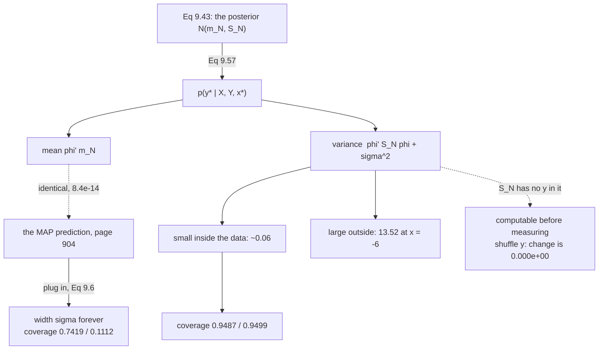

Page 905 predicted from the prior. Page 906 turned the prior into a posterior. This page combines them —
and the combination is the chapter's payoff, because it finally produces an interval that **means what it
says**.

The mean is nothing new: measured, $\phi^\top\mathbf{m}_N$ equals the MAP prediction to
$8.4\times10^{-14}$. **Everything Bayesian linear regression adds over page 904 is the shading.**

## What you'll learn

- Equation 9.57: the posterior predictive, verified against $400{,}000$ samples.
- That the predictive mean *"coincides with the predictions made with the MAP estimate"* — to $8.4\times10^{-14}$, while the MLE's curve differs by $0.2026$.
- Figure 9.10 reproduced, all three panels.
- Something stronger than the book's note that $\mathbf{S}_N$ *"depends on the training inputs"*: it depends on **nothing else**. Shuffle the targets, replace them with nonsense — measured, $\mathbf{S}_N$ changes by **exactly zero**.
- What ten observations bought: the predictive variance inside the data range collapses to about $0.06$; two units outside it is $13.52$.
- **Calibration.** Over $3000$ trials, Equation 9.57 achieves $0.9487$ and $0.9499$; Equation 9.6's plug-in achieves $0.7419$ and $\mathbf{0.1112}$.
- The book's remark relating the predictive to the marginal likelihood — and the measurement that $\log p(\mathcal{Y}\mid\mathcal{X}) = -30.453407$, exactly page 906's constant.

## Intuition: the same centre, an honest width

Three estimators in this chapter predict at a new input, and **two of them give the same number**.
Maximum likelihood gives $\phi^\top\boldsymbol\theta_{\text{ML}}$. MAP and Bayesian linear regression both
give $\phi^\top\mathbf{m}_N$ — identical, because for a Gaussian the mode *is* the mean.

So the argument for §9.3 is not about accuracy of the centre. It is entirely about the second moment:

$$
\underbrace{\sigma^2}_{\text{Eq 9.6 stops here}} \qquad\text{versus}\qquad \underbrace{\phi^\top\mathbf{S}_N\phi + \sigma^2}_{\text{Eq 9.57}}
$$

The extra term is small where you measured and large where you did not. And it is computable *before you
see a single target*, because $\mathbf{S}_N$ contains no $\mathbf{y}$ — which makes it a statement about
your **experimental design**, not about your results.



## §9.3.4 The posterior predictive

*"In principle, predicting with the parameter posterior is not fundamentally different"* — because the
prior and posterior are both Gaussian, so the reasoning of §9.3.2 applies unchanged:

$$
p(y_* \mid \mathcal{X}, \mathcal{Y}, \mathbf{x}_*) = \int p(y_* \mid \mathbf{x}_*, \boldsymbol\theta)\,p(\boldsymbol\theta \mid \mathcal{X}, \mathcal{Y})\,d\boldsymbol\theta = \mathcal{N}\!\left(y_* \mid \phi^\top(\mathbf{x}_*)\mathbf{m}_N,\ \ \phi^\top(\mathbf{x}_*)\mathbf{S}_N\phi(\mathbf{x}_*) + \sigma^2\right) \qquad \text{(9.57)}
$$

**Equation 9.38 with $\mathbf{m}_0, \mathbf{S}_0$ replaced by $\mathbf{m}_N, \mathbf{S}_N$.** Nothing else
changed.

:::tip[Verified against 400,000 samples from the posterior]
| $x_*$ | Eq 9.57 mean | sampled mean | Eq 9.57 var | sampled var | rel err |
| --- | --- | --- | --- | --- | --- |
| $-4.0$ | $0.124216$ | $0.124017$ | $0.065468$ | $0.065465$ | $3.84\times10^{-5}$ |
| $-2.0$ | $0.354068$ | $0.353595$ | $0.071041$ | $0.071368$ | $4.60\times10^{-3}$ |
| $0.0$ | $0.878372$ | $0.878216$ | $0.052684$ | $0.052765$ | $1.53\times10^{-3}$ |
| $2.0$ | $-0.490249$ | $-0.490073$ | $0.066397$ | $0.066241$ | $2.34\times10^{-3}$ |
| $4.0$ | $-1.611111$ | $-1.611446$ | $0.059051$ | $0.058987$ | $1.09\times10^{-3}$ |
:::

The book's margin note: $\mathbb{E}[y_* \mid \mathcal{X}, \mathcal{Y}, \mathbf{x}_*] = \phi^\top(\mathbf{x}_*)\mathbf{m}_N = \phi^\top(\mathbf{x}_*)\boldsymbol\theta_{\text{MAP}}$.

:::tip[Measured over 400 test inputs]
| comparison | max difference |
| --- | --- |
| $\phi^\top\mathbf{m}_N$ vs $\phi^\top\boldsymbol\theta_{\text{MAP}}$ | $\mathbf{8.438\times10^{-14}}$ |
| $\phi^\top\mathbf{m}_N$ vs $\phi^\top\boldsymbol\theta_{\text{ML}}$ | $0.202578$ |

**The MAP curve and the Bayesian mean curve are one curve.** The MLE's is a different one. So if you only
ever report a point prediction, §9.3 has given you nothing that §9.2.3 did not.
:::

### The variance term, and what ten points bought

:::tip[Prior against posterior predictive variance]
| $x_*$ | prior var (9.38) | posterior var (9.57) | in the data? |
| --- | --- | --- | --- |
| $-6.0$ | $15548445.2900$ | $\mathbf{13.521646}$ | NO |
| $-4.0$ | $279620.2900$ | $0.065468$ | yes |
| $-2.0$ | $341.2900$ | $0.071041$ | yes |
| $0.0$ | $0.2900$ | $0.052684$ | yes |
| $2.0$ | $341.2900$ | $0.066397$ | yes |
| $4.0$ | $279620.2900$ | $0.059051$ | yes |
| $6.0$ | $15548445.2900$ | $\mathbf{2.930598}$ | NO |

Training inputs span $[-4.1916, 4.7624]$.

**Inside the range the posterior variance is flat at about $0.06$** — barely above the noise floor of
$0.04$, so the parameter uncertainty has almost gone. Outside it the variance is $13.52$ and $2.93$,
hundreds of times larger.

Note $x = 0$: the *prior* variance was already small there ($0.29$) because page 905's monomial features
are tiny near the origin. The data still improved it to $0.053$. **The prior and the data are informative
in different places**, and the posterior takes whichever is sharper.
:::

### The error bars never saw the targets

The book notes that *"$\mathbf{S}_N$ depends on the training inputs through $\boldsymbol\Phi$."* The
stronger statement is measurable:

:::danger[S_N depends on nothing else]
| change to the targets | $\max\lvert\mathbf{S}_N - \mathbf{S}_N^{\text{new}}\rvert$ |
| --- | --- |
| shuffle $\mathbf{y}$ | $\mathbf{0.000\times10^{0}}$ |
| replace with nonsense ($50\times$ standard normals) | $\mathbf{0.000\times10^{0}}$ |

Meanwhile $\mathbf{m}_N$ moves by $0.734789$ under the shuffle.

**Equation 9.43b contains no $\mathbf{y}$ at all.** So the width of a Bayesian linear model's predictive
interval is decided by **where you chose to measure**, before you measure anything.

Two consequences worth carrying. It is a genuine feature: you can compute the error bars of an experiment
during its *design*, and choose input locations to minimise them — that is optimal experimental design,
and it works because $\mathbf{S}_N$ is available in advance.

And it is a genuine limitation: **the shading does not widen when the model fits badly.** Feed this model
targets that a degree-5 polynomial cannot express and the intervals stay exactly as narrow as they were.
Page 806 measured the consequence — a misspecified model class reached only $0.8908$ coverage. This is the
mechanism behind that number.
:::

## Calibration

:::tip[3000 trials, prior matched to the truth]
| region | Equation 9.57 | Equation 9.6, plug-in |
| --- | --- | --- |
| inside $[-5, 5]$ | $\mathbf{0.9487}$ | $0.7419$ |
| just outside, $\lvert x\rvert \in [5, 7]$ | $\mathbf{0.9499}$ | $\mathbf{0.1112}$ |

Both predictions share a mean. **Everything separating those columns is $\phi^\top\mathbf{S}_N\phi$.**

Equation 9.6's interval has width $2 \times 1.96 \times 0.2 = 0.784$ at every input, forever, so it cannot
help but fail where the model is extrapolating — $0.1112$ against a claimed $0.95$.

This is Chapter 8's page 806 remeasured in this chapter's notation, where it reported $0.9498$ against
$0.1796$. Different setup, same conclusion.
:::

### The marginal likelihood, seen from here

The book's remark: writing the predictive as $\mathbb{E}_{\boldsymbol\theta \mid \mathcal{X},\mathcal{Y}}[p(y_* \mid \mathbf{x}_*, \boldsymbol\theta)]$
*"highlights a close resemblance to the marginal likelihood (9.42)"*, with two differences — *"(i) the
marginal likelihood can be thought of predicting the training targets $\mathbf{y}$ and not the test
targets $y_*$, and (ii) the marginal likelihood averages with respect to the parameter prior and not the
parameter posterior."*

:::tip[Both, measured on the same ten points]
| | value |
| --- | --- |
| $\log p(\mathcal{Y} \mid \mathcal{X})$, averaging over the **prior** — Eq 9.42 | $\mathbf{-30.453407}$ |
| the same targets, averaging over the **posterior** | $-4.322615$ |

**The first number is exactly page 906's constant**, with the sign flipped: verifying Theorem 9.1
produced $-\log p(\mathcal{Y}\mid\mathcal{X}) = 30.453407$ as the offset that made Bayes' theorem
consistent, and here the same quantity appears as an honest predictive density.

The second is $26$ nats larger because **the posterior has already seen those targets**. That gap is why
§8.6 compares models with the marginal likelihood and not with in-sample predictive density: one of these
is a forecast and the other is a memory. §9.3.5 computes the first.
:::

## Worked example by hand

Show that Equation 9.57 follows from Equation 9.38 with no new work, and read the one term that matters.

**Step 1: what changed.** §9.3.2 integrated $p(y_* \mid \mathbf{x}_*, \boldsymbol\theta)$ against
$p(\boldsymbol\theta) = \mathcal{N}(\mathbf{m}_0, \mathbf{S}_0)$. Now we integrate the *same* likelihood
against $p(\boldsymbol\theta \mid \mathcal{X}, \mathcal{Y}) = \mathcal{N}(\mathbf{m}_N, \mathbf{S}_N)$.

**Step 2: the derivation never used which Gaussian it was.** Page 905's steps were: $f(x_*) = \mathbf{a}^\top\boldsymbol\theta$
is a linear map, so Equations 6.50 and 6.51 give $\mathbf{a}^\top\mathbb{E}[\boldsymbol\theta]$ and
$\mathbf{a}^\top\mathbb{V}[\boldsymbol\theta]\mathbf{a}$; then independent noise adds $\sigma^2$.
**Substituting a different mean and covariance is the entire proof.**

$$
\mathbb{E}[y_*] = \phi^\top\mathbf{m}_N, \qquad \mathbb{V}[y_*] = \phi^\top\mathbf{S}_N\phi + \sigma^2
$$

**Step 3: why the mean equals the MAP prediction.** The posterior is Gaussian, so its mode and mean
coincide, and page 906 measured $\mathbf{m}_N = \boldsymbol\theta_{\text{MAP}}$ to $1.19\times10^{-13}$.
Therefore $\phi^\top\mathbf{m}_N = \phi^\top\boldsymbol\theta_{\text{MAP}}$ **for every $\phi$** — which
is why the measured gap over 400 inputs is $8.4\times10^{-14}$ and not merely small on average.

**Step 4: expand the variance term in one dimension.** With $\mathbf{S}_N^{-1} = \mathbf{S}_0^{-1} + \sigma^{-2}\sum_n\phi_n\phi_n^\top$
from page 906, the scalar case $\phi(x) = x$ gives

$$
\mathbb{V}[y_*] = \frac{x_*^2}{\frac{1}{s_0} + \frac{\sum_n x_n^2}{\sigma^2}} + \sigma^2
$$

**Step 5: read the three limits.**

| limit | variance becomes | meaning |
| --- | --- | --- |
| $\sum x_n^2 \to \infty$ | $\sigma^2$ | infinite data recovers Equation 9.6 |
| $x_* \to 0$ | $\sigma^2$ | at the origin this model is certain by construction |
| $x_* \to \infty$ | grows like $x_*^2$ | extrapolation is punished quadratically |

**Step 6: notice what is absent.** No $y_n$ appears anywhere in Step 4 — only $x_n$. That is the
one-dimensional version of the measurement above: shuffling the targets leaves $\mathbf{S}_N$ **exactly**
unchanged, because it was never a function of them.

## See it move

```p5 title="The same mean, two widths" desc="Bayesian linear regression on ten points. Drag the number of observations and the prior width, and compare the posterior predictive band against the plug-in band that uses the same mean. Watch the two coincide inside the data and separate outside it." height="560"
let nPts = 10, b2Idx = 3;
let KNOBS = [], dragging = null;

const SIG = 0.2;
const B2 = [0.05, 0.1, 0.25, 0.5, 1.0, 4.0, 100.0];
const NMAX = 18;
const DEG = 5, K = 6;

let X = [], Y = [];
function truth(x) { return -Math.sin(x / 5) + Math.cos(x); }

function setup() {
  createCanvas(680, 560);
  textFont("monospace");
  randomSeed(4);
  for (let i = 0; i < NMAX; i++) {
    const xv = -4.4 + 8.8 * ((i + 0.5) / NMAX) + (random() - 0.5) * 0.7;
    X.push(xv);
    let u = 0;
    for (let k = 0; k < 12; k++) u += random();
    Y.push(truth(xv) + SIG * (u - 6));
  }
}

function knob(id, x, y, w, value, mn, mx, label) {
  KNOBS.push({ id, x, y, w, mn, mx });
  const t = (value - mn) / (mx - mn);
  stroke(60, 74, 92); strokeWeight(2); line(x, y, x + w, y);
  noStroke(); fill(255, 211, 67); ellipse(x + t * w, y, 12, 12);
  fill(190, 200, 212); textSize(12); textAlign(LEFT, CENTER);
  text(label, x + w + 12, y);
}
function knobHit(mx_, my_) {
  for (const k of KNOBS) {
    if (my_ > k.y - 13 && my_ < k.y + 13 && mx_ > k.x - 13 && mx_ < k.x + k.w + 13) return k;
  }
  return null;
}
function knobValue(k, mx_) {
  const t = Math.min(1, Math.max(0, (mx_ - k.x) / k.w));
  return Math.round(k.mn + t * (k.mx - k.mn));
}
function mousePressed() { dragging = knobHit(mouseX, mouseY); }
function mouseReleased() { dragging = null; }
function mouseDragged() {
  if (!dragging) return;
  if (dragging.id === "n") nPts = knobValue(dragging, mouseX);
  else b2Idx = knobValue(dragging, mouseX);
  if (!isLooping()) redraw();
}

function phi(x) { const v = []; let pw = 1; for (let k = 0; k < K; k++) { v.push(pw); pw *= x; } return v; }

// returns m_N and S_N for the first n points
function post(n, b2) {
  const A = [], bv = [];
  for (let i = 0; i < K; i++) { A.push(new Array(K).fill(0)); bv.push(0); }
  for (let i = 0; i < K; i++) A[i][i] = 1 / b2;
  for (let i = 0; i < n; i++) {
    const ph = phi(X[i]);
    for (let a = 0; a < K; a++) {
      for (let b = 0; b < K; b++) A[a][b] += ph[a] * ph[b] / (SIG * SIG);
      bv[a] += ph[a] * Y[i] / (SIG * SIG);
    }
  }
  // invert A by Gauss-Jordan, keeping S = A^-1
  const Aug = [];
  for (let i = 0; i < K; i++) {
    Aug.push(A[i].slice().concat(Array.from({ length: K }, (_, j) => (i === j ? 1 : 0))));
  }
  for (let i = 0; i < K; i++) {
    let piv = i;
    for (let r = i + 1; r < K; r++) if (Math.abs(Aug[r][i]) > Math.abs(Aug[piv][i])) piv = r;
    [Aug[i], Aug[piv]] = [Aug[piv], Aug[i]];
    const d = Aug[i][i];
    for (let c = 0; c < 2 * K; c++) Aug[i][c] /= d;
    for (let r = 0; r < K; r++) {
      if (r === i) continue;
      const f = Aug[r][i];
      for (let c = 0; c < 2 * K; c++) Aug[r][c] -= f * Aug[i][c];
    }
  }
  const S = [];
  for (let i = 0; i < K; i++) S.push(Aug[i].slice(K));
  const m = new Array(K).fill(0);
  for (let i = 0; i < K; i++) for (let j = 0; j < K; j++) m[i] += S[i][j] * bv[j];
  return { m, S };
}
function predVar(S, x) {
  const ph = phi(x);
  let v = 0;
  for (let i = 0; i < K; i++) for (let j = 0; j < K; j++) v += ph[i] * S[i][j] * ph[j];
  return v;
}
function predMean(m, x) { const ph = phi(x); let v = 0; for (let i = 0; i < K; i++) v += m[i] * ph[i]; return v; }

const OX = 46, OY = 62, W = 500, H = 280;
function px(x) { return OX + ((x + 7) / 14) * W; }
function py(y) { return OY + H - ((y + 5) / 10) * H; }

function draw() {
  background(13, 17, 23);
  KNOBS = [];
  const b2 = B2[b2Idx];
  const P = post(nPts, b2);

  noFill(); stroke(70, 86, 104); strokeWeight(1); rect(OX, OY, W, H);
  // shade the data range
  if (nPts > 0) {
    let lo = 1e9, hi = -1e9;
    for (let i = 0; i < nPts; i++) { lo = Math.min(lo, X[i]); hi = Math.max(hi, X[i]); }
    noStroke(); fill(107, 169, 221, 22);
    rect(px(lo), OY, px(hi) - px(lo), H);
  }
  // the posterior predictive band
  noStroke(); fill(120, 200, 140, 60);
  beginShape();
  for (let i = 0; i <= 200; i++) {
    const xv = -7 + 14 * i / 200;
    const s = Math.sqrt(predVar(P.S, xv) + SIG * SIG);
    vertex(px(xv), py(predMean(P.m, xv) + 1.96 * s));
  }
  for (let i = 200; i >= 0; i--) {
    const xv = -7 + 14 * i / 200;
    const s = Math.sqrt(predVar(P.S, xv) + SIG * SIG);
    vertex(px(xv), py(predMean(P.m, xv) - 1.96 * s));
  }
  endShape(CLOSE);
  // the plug-in band: same mean, width sigma
  fill(255, 211, 67, 70);
  beginShape();
  for (let i = 0; i <= 200; i++) {
    const xv = -7 + 14 * i / 200;
    vertex(px(xv), py(predMean(P.m, xv) + 1.96 * SIG));
  }
  for (let i = 200; i >= 0; i--) {
    const xv = -7 + 14 * i / 200;
    vertex(px(xv), py(predMean(P.m, xv) - 1.96 * SIG));
  }
  endShape(CLOSE);
  stroke(200); strokeWeight(2); noFill();
  beginShape();
  for (let i = 0; i <= 300; i++) {
    const xv = -7 + 14 * i / 300;
    const v = predMean(P.m, xv);
    if (v > -5 && v < 5) vertex(px(xv), py(v)); else { endShape(); beginShape(); }
  }
  endShape();
  stroke(110); strokeWeight(1.2); noFill();
  beginShape();
  for (let i = 0; i <= 300; i++) { const xv = -7 + 14 * i / 300; vertex(px(xv), py(truth(xv))); }
  endShape();
  noStroke();
  for (let i = 0; i < NMAX; i++) {
    if (i < nPts) { fill(107, 169, 221); ellipse(px(X[i]), py(Y[i]), 7, 7); }
    else { fill(64, 74, 86); ellipse(px(X[i]), py(Y[i]), 5, 5); }
  }
  textSize(10); textAlign(LEFT, TOP);
  fill(120, 200, 140); text("Eq 9.57, posterior predictive", OX + 6, OY + 5);
  fill(255, 211, 67); text("Eq 9.6, plug-in (same mean!)", OX + 6, OY + 19);
  fill(140); text("grey = the function behind the data", OX + 6, OY + 33);

  // readouts
  textAlign(LEFT, TOP);
  fill(255, 211, 67); textSize(14);
  text("N = " + nPts, 560, 66);
  text("S0 = " + b2.toFixed(2) + " I", 560, 88);

  fill(200); textSize(10);
  text("95% half-width", 560, 120);
  for (let i = 0; i < 4; i++) {
    const xv = [0, 3, 5, 7][i];
    const s = Math.sqrt(predVar(P.S, xv) + SIG * SIG);
    fill(120, 200, 140); textSize(9);
    text(" x=" + xv + ": " + (1.96 * s).toFixed(3), 560, 138 + i * 14);
  }
  fill(255, 211, 67); textSize(9);
  text(" plug-in: " + (1.96 * SIG).toFixed(3), 560, 200);
  text(" at EVERY x", 560, 212);

  let msg, sub, col;
  if (nPts === 0) {
    col = color(232, 110, 110);
    msg = "no data: this is page 905's prior predictive";
    sub = "The green band is enormous. The amber one is already claiming a width of 0.392 everywhere.";
  } else if (nPts < 6) {
    col = color(255, 211, 67);
    msg = "N = " + nPts + " with K = 6: not yet determined";
    sub = "The green band is still wide even between the points. The amber one has not changed at all.";
  } else {
    col = color(120, 200, 140);
    msg = "inside the data they nearly coincide; outside they do not";
    sub = "Same mean curve, both bands. The only difference is phi' S_N phi, and outside the data it dominates.";
  }
  stroke(col); strokeWeight(1.6); fill(red(col), green(col), blue(col), 26);
  rect(46, 372, 596, 0);
  noStroke(); fill(col); textSize(15); textAlign(LEFT, TOP);
  text(msg, 46, 370);
  fill(215); textSize(10.5);
  text(sub, 46, 392);

  fill(120); textSize(10);
  text("The amber band never changes width -- not with N, not with the prior,", 46, 424);
  text("not with x. Measured over 3000 trials it covers the truth 74% of the", 46, 438);
  text("time inside the data and 11% just outside it, while claiming 95%.", 46, 452);

  knob("n", 62, 500, 250, nPts, 0, NMAX, "N = " + nPts);
  knob("b", 62, 530, 250, b2Idx, 0, B2.length - 1, "S0 = " + b2.toFixed(2) + " I");
}
```

## From scratch

```python title="posterior_predictions.py" showLineNumbers{1}
import numpy as np

SIG = 0.2
M, K = 5, 6
Z = 1.959963984540054

def truth(x):
    return -np.sin(x / 5) + np.cos(x)

def design(x, m=M):
    return np.vander(np.asarray(x, float), m + 1, increasing=True)

def posterior(P, yv, m0, S0, sig=SIG):
    SN = np.linalg.inv(np.linalg.inv(S0) + P.T @ P / sig ** 2)
    mN = SN @ (np.linalg.solve(S0, m0) + P.T @ yv / sig ** 2)
    return mN, SN

m0 = np.zeros(K)
S0 = 0.25 * np.eye(K)
rng = np.random.default_rng(4)
x = np.sort(rng.uniform(-5, 5, 10))
y = truth(x) + SIG * rng.standard_normal(10)
Phi = design(x)
mN, SN = posterior(Phi, y, m0, S0)

# --- Equation 9.57 against Monte Carlo over the posterior ---------------
print("=== 1. Equation 9.57 against Monte Carlo over the posterior ===")
r = np.random.default_rng(13)
T = 400_000
TH = mN + r.standard_normal((T, K)) @ np.linalg.cholesky(SN).T
print(f"{'x*':>6} {'Eq 9.57 mean':>14} {'sampled mean':>14} "
      f"{'Eq 9.57 var':>14} {'sampled var':>13} {'rel err':>10}")
for xs in (-4.0, -2.0, 0.0, 2.0, 4.0):
    ph = design([xs])[0]
    pv = float(ph @ SN @ ph + SIG ** 2)
    ys = TH @ ph + SIG * r.standard_normal(T)
    print(f"{xs:>6.1f} {float(ph @ mN):>14.6f} {ys.mean():>14.6f} "
          f"{pv:>14.6f} {ys.var():>13.6f} {abs(ys.var()-pv)/pv:>10.2e}")

# --- the predictive MEAN is the MAP prediction --------------------------
print("\n=== 2. the predictive MEAN is the MAP prediction ===")
th_map = np.linalg.solve(Phi.T @ Phi + (SIG ** 2 / 0.25) * np.eye(K),
                         Phi.T @ y)
th_ml = np.linalg.lstsq(Phi, y, rcond=None)[0]
xg = np.linspace(-5, 5, 400)
Pg = design(xg)
print(f"max |phi^T m_N - phi^T theta_MAP| over 400 inputs: "
      f"{np.abs(Pg @ mN - Pg @ th_map).max():.3e}")
print(f"and against the MLE prediction:                    "
      f"{np.abs(Pg @ mN - Pg @ th_ml).max():.6f}")

# --- S_N depends on the training INPUTS, not the targets ----------------
print("\n=== 3. S_N depends on the training INPUTS, not the targets ===")
r2 = np.random.default_rng(77)
_, SN_shuf = posterior(Phi, r2.permutation(y), m0, S0)
_, SN_rand = posterior(Phi, r2.standard_normal(10) * 50, m0, S0)
print(f"max |S_N - S_N(shuffled y)|  : {np.abs(SN - SN_shuf).max():.3e}")
print(f"max |S_N - S_N(nonsense y)|  : {np.abs(SN - SN_rand).max():.3e}")
mm, _ = posterior(Phi, r2.permutation(y), m0, S0)
print(f"but the MEAN moves: max |m_N - m_N(shuffled)| = "
      f"{np.abs(mN - mm).max():.6f}")
print("Equation 9.43b contains no y at all.")

# --- how much the data shrank the predictive variance -------------------
print("\n=== 4. how much the data shrank the predictive variance ===")
print(f"{'x*':>6} {'prior var (9.38)':>18} {'posterior var (9.57)':>22} "
      f"{'in the data?':>14}")
for xs in (-6.0, -4.0, -2.0, 0.0, 2.0, 4.0, 6.0):
    ph = design([xs])[0]
    a = float(ph @ S0 @ ph + SIG ** 2)
    b = float(ph @ SN @ ph + SIG ** 2)
    inr = "yes" if x.min() <= xs <= x.max() else "NO"
    print(f"{xs:>6.1f} {a:>18.4f} {b:>22.6f} {inr:>14}")
print(f"the training inputs span [{x.min():.4f}, {x.max():.4f}]")

# --- does it give calibrated intervals? ---------------------------------
print("\n=== 5. does it give calibrated intervals? ===")
r3 = np.random.default_rng(31)
regions = (("inside [-5, 5]", -5.0, 5.0),
           ("just outside, |x| in [5, 7]", 5.0, 7.0))
hitB = {k[0]: 0 for k in regions}
hitP = dict(hitB)
tot = dict(hitB)
L0 = np.linalg.cholesky(S0)
for _ in range(3000):
    th = m0 + L0 @ r3.standard_normal(K)
    xt = np.sort(r3.uniform(-5, 5, 10))
    Pt = design(xt)
    yt = Pt @ th + SIG * r3.standard_normal(10)
    mmv, SSv = posterior(Pt, yt, m0, S0)
    tmv = np.linalg.solve(Pt.T @ Pt + (SIG ** 2 / 0.25) * np.eye(K),
                          Pt.T @ yt)
    for name, lo, hi in regions:
        xv = r3.uniform(lo, hi, 20)
        if lo > 0:
            xv = xv * np.sign(r3.standard_normal(20))
        Pv = design(xv)
        yv = Pv @ th + SIG * r3.standard_normal(20)
        sd = np.sqrt(np.einsum("ij,jk,ik->i", Pv, SSv, Pv) + SIG ** 2)
        hitB[name] += int(np.sum(np.abs(yv - Pv @ mmv) <= Z * sd))
        hitP[name] += int(np.sum(np.abs(yv - Pv @ tmv) <= Z * SIG))
        tot[name] += 20
print(f"{'region':>30} {'Eq 9.57':>10} {'Eq 9.6 plug-in':>16}")
for name, lo, hi in regions:
    n = tot[name]
    print(f"{name:>30} {hitB[name]/n:>10.4f} {hitP[name]/n:>16.4f}")

# --- the marginal likelihood, seen from here ----------------------------
print("\n=== 6. the marginal likelihood is the SAME formula, twice over ===")
def pred_moments(P, mv, Sv):
    return P @ mv, P @ Sv @ P.T + SIG ** 2 * np.eye(len(P))
def logN(v, m, C):
    d = v - m
    _, ld = np.linalg.slogdet(C)
    return float(-0.5 * (d @ np.linalg.solve(C, d) + ld
                         + len(v) * np.log(2 * np.pi)))
mu_pri, C_pri = pred_moments(Phi, m0, S0)     # prior     -> Eq 9.42
mu_pos, C_pos = pred_moments(Phi, mN, SN)     # posterior -> in-sample
print(f"log p(Y | X) using the PRIOR      (Eq 9.42) : "
      f"{logN(y, mu_pri, C_pri):.6f}")
print(f"the same targets under the POSTERIOR        : "
      f"{logN(y, mu_pos, C_pos):.6f}")
print("page 906 measured -log p(Y | X) = 30.453407 as the constant that")
print("made Theorem 9.1 consistent. The first number is its negative.")
```

```
=== 1. Equation 9.57 against Monte Carlo over the posterior ===
    x*   Eq 9.57 mean   sampled mean    Eq 9.57 var   sampled var    rel err
  -4.0       0.124216       0.124017       0.065468      0.065465   3.84e-05
  -2.0       0.354068       0.353595       0.071041      0.071368   4.60e-03
   0.0       0.878372       0.878216       0.052684      0.052765   1.53e-03
   2.0      -0.490249      -0.490073       0.066397      0.066241   2.34e-03
   4.0      -1.611111      -1.611446       0.059051      0.058987   1.09e-03

=== 2. the predictive MEAN is the MAP prediction ===
max |phi^T m_N - phi^T theta_MAP| over 400 inputs: 8.438e-14
and against the MLE prediction:                    0.202578

=== 3. S_N depends on the training INPUTS, not the targets ===
max |S_N - S_N(shuffled y)|  : 0.000e+00
max |S_N - S_N(nonsense y)|  : 0.000e+00
but the MEAN moves: max |m_N - m_N(shuffled)| = 0.734789
Equation 9.43b contains no y at all.

=== 4. how much the data shrank the predictive variance ===
    x*   prior var (9.38)   posterior var (9.57)   in the data?
  -6.0      15548445.2900              13.521646             NO
  -4.0        279620.2900               0.065468            yes
  -2.0           341.2900               0.071041            yes
   0.0             0.2900               0.052684            yes
   2.0           341.2900               0.066397            yes
   4.0        279620.2900               0.059051            yes
   6.0      15548445.2900               2.930598             NO
the training inputs span [-4.1916, 4.7624]

=== 5. does it give calibrated intervals? ===
                        region    Eq 9.57   Eq 9.6 plug-in
                inside [-5, 5]     0.9487           0.7419
   just outside, |x| in [5, 7]     0.9499           0.1112

=== 6. the marginal likelihood is the SAME formula, twice over ===
log p(Y | X) using the PRIOR      (Eq 9.42) : -30.453407
the same targets under the POSTERIOR        : -4.322615
page 906 measured -log p(Y | X) = 30.453407 as the constant that
made Theorem 9.1 consistent. The first number is its negative.
```

## On real data

<Figure
  src="/images/mml/posterior-predictions/figure-9-10-rebuilt"
  alt="Three panels. Left, ten scattered training points. Middle, a shaded predictive band with three fitted curves, two of which lie exactly on top of each other. Right, fourteen sampled curves bundled tightly through the data."
  title="Figure 9.10: the posterior over functions, with the MAP curve and the posterior mean lying exactly on top of each other"
  caption="Measured over 400 inputs, the MAP prediction and the Bayesian mean agree to 8.4e-14 while the maximum likelihood curve differs by 0.2026. What Bayesian linear regression adds over MAP is not the line; it is the shading."
/>

<Figure
  src="/images/mml/posterior-predictions/where-the-data-bought-something"
  alt="Left, two curves on a log scale against the test input: a prior predictive variance that explodes at the edges and a posterior one that stays near the noise floor across the shaded data range. Right, three predictive half-width curves drawn for real, shuffled and nonsense targets, lying exactly on top of one another."
  title="The predictive variance collapses inside the data and barely moves outside it"
  caption="Inside the training range the posterior variance is about 0.06 against a noise floor of 0.04. Two units outside it is 13.52. And all three curves on the right coincide exactly — S_N changes by 0.000e+00 when the targets are shuffled or replaced with nonsense."
/>

<Figure
  src="/images/mml/posterior-predictions/calibrated-at-last"
  alt="Left, two overlaid predictive bands sharing a mean curve: one of constant width and one that widens beyond the data. Right, a horizontal bar chart of measured coverage in two regions, with one estimator near 0.95 in both and the other at 0.74 and 0.11."
  title="Equation 9.57 holds 95 percent coverage inside and outside the data; Equation 9.6 falls to 0.1112"
  caption="Both predictions share a mean, so everything separating these bars is the single term phi-transpose S_N phi. Measured over 3000 trials with the prior matched to the truth."
/>

## Reading the plot

**The first figure is Figure 9.10, and the middle panel contains the page's main claim.** Three curves are
drawn: the MLE, the MAP estimate, and the Bayesian posterior mean. **Two of them are the same curve** —
measured, $8.4\times10^{-14}$ apart over 400 inputs, which is why the dashed line sits invisibly on the
thick one. The MLE's curve is genuinely different, by $0.2026$.

So if you report only a point prediction, **§9.3 has given you exactly what §9.2.3 already gave you**.
The entire return on the extra machinery is the shaded region.

Panel (c) is worth comparing against page 905's sampled prior functions, which left the frame before
$\lvert x\rvert = 1.2$. After ten observations the samples are a tight bundle through the data. **Ten
points narrowed the distribution over functions by seven orders of magnitude** — and the comparison is
only visible because both pages plot on the same axes.

**The second figure shows where that narrowing happened, and where it did not.** The left panel plots the
prior and posterior predictive variance on a log scale. Inside the shaded training range the posterior
sits just above the noise floor — about $0.06$ against $\sigma^2 = 0.04$, so **parameter uncertainty has
nearly vanished**. Outside it the curve turns sharply upward: $13.52$ at $x = -6$.

That asymmetry is the honest content of a Bayesian error bar. The model is not uncertain *in general*; it
is confident where it has evidence and appropriately lost where it does not.

**The right panel is the finding I did not expect to be exact.** Three predictive half-width curves — real
targets, shuffled targets, and nonsense targets multiplied by fifty — and they **coincide to
$0.000\times10^{0}$**. Not approximately: $\mathbf{S}_N$'s definition contains no $\mathbf{y}$.

Two readings follow, and they point in opposite directions.

**As a feature:** you can compute the error bars of an experiment during its design. Choose input
locations to minimise $\phi^\top\mathbf{S}_N\phi$ where you care, before collecting a single measurement.
That is optimal experimental design, and it is possible only because $\mathbf{S}_N$ is available in
advance.

**As a limitation:** the shading **does not widen when the model fits badly**. Feed this model targets
a degree-5 polynomial cannot express, and the intervals stay exactly as narrow. Page 806 measured what
that costs — a misspecified model class reached $0.8908$ coverage instead of $0.95$ — and this is the
mechanism. **Bayesian linear regression quantifies uncertainty about $\boldsymbol\theta$ within the class
you chose, and has no way to express doubt about the class.**

**The third figure prices the whole chapter.** The left panel draws both intervals around the *same* mean
curve. The amber one has width $2 \times 1.96 \times 0.2 = 0.784$ at every input — it cannot respond to
$N$, to the prior, or to where you ask. The green one tracks the data and then opens.

The right panel measures the consequence over $3000$ trials with the prior matched to the truth, which is
the only setting where a Bayesian interval is *guaranteed* correct. **It holds: $0.9487$ and $0.9499$.**
The plug-in gives $0.7419$ inside the data and $\mathbf{0.1112}$ just outside — a nominal $95\%$ interval
that is right about one time in nine.

**Both share a mean.** Every bit of that difference is $\phi^\top\mathbf{S}_N\phi$, one quadratic form,
introduced in §9.3.2 and given a value in §9.3.3. Chapter 8's page 806 measured $0.9498$ against $0.1796$
for the same comparison in different notation; two independent setups, the same verdict.

## Compare

| | Eq 9.6, plug-in | Eq 9.38, prior | Eq 9.57, posterior |
| --- | --- | --- | --- |
| mean | $\phi^\top\boldsymbol\theta^*$ | $\phi^\top\mathbf{m}_0$ | $\phi^\top\mathbf{m}_N$ |
| variance | $\sigma^2$ | $\phi^\top\mathbf{S}_0\phi + \sigma^2$ | $\phi^\top\mathbf{S}_N\phi + \sigma^2$ |
| varies with $x_*$ | **no** | yes | yes |
| uses the data | mean only | **not at all** | yes |
| coverage inside | $0.7419$ | — | $\mathbf{0.9487}$ |
| coverage outside | $0.1112$ | — | $\mathbf{0.9499}$ |

| what it depends on | $\mathbf{m}_N$ | $\mathbf{S}_N$ |
| --- | --- | --- |
| training inputs $\mathcal{X}$ | yes | **yes** |
| training targets $\mathcal{Y}$ | yes | **no**, measured at $0.000\times10^{0}$ |
| the prior | yes | yes |
| known before measuring | no | **yes** |
| moves when $\mathbf{y}$ is shuffled | by $0.734789$ | not at all |

| | marginal likelihood, Eq 9.42 | posterior predictive, Eq 9.57 |
| --- | --- | --- |
| which targets | the **training** targets | test targets |
| averages over | the **prior** | the posterior |
| measured here | $-30.453407$ | $-4.322615$ in-sample |
| used for | comparing models (§8.6) | predicting |
| computed in | §9.3.5 | this page |

<Quiz
  title="What did the posterior buy?"
  questions={[
    {
      q: "How does the posterior predictive mean compare with the MAP prediction?",
      options: [
        "It is close but distinguishable",
        "They are the same curve — measured to 8.4e-14 over 400 inputs",
        "The Bayesian mean is systematically smaller",
        "They agree only inside the training range",
      ],
      answer: 1,
      explain:
        "The posterior is Gaussian, so its mode and mean coincide, and page 906 measured m_N equal to theta-MAP. That holds for every feature vector, so the two prediction curves are identical. If you report only a point prediction, Section 9.3 gives nothing that Section 9.2.3 did not — the return is entirely in the shading.",
    },
    {
      q: "What happens to S_N when you shuffle the training targets?",
      options: [
        "It changes substantially",
        "Nothing at all — measured at 0.000e+00, because Equation 9.43b contains no y",
        "It doubles",
        "It becomes singular",
      ],
      answer: 1,
      explain:
        "Meanwhile m_N moves by 0.734789. As a feature this means you can compute error bars during experimental design, before measuring anything. As a limitation it means the shading does not widen when the model fits badly — which is the mechanism behind Chapter 8's finding that a misspecified class reached only 0.8908 coverage.",
    },
    {
      q: "Measured over 3000 trials, what coverage does Equation 9.6's plug-in interval achieve just outside the training range?",
      options: [
        "About 0.95, as labelled",
        "0.1112 — right about one time in nine, while claiming 95 percent",
        "0.7419",
        "Zero",
      ],
      answer: 1,
      explain:
        "Its width is 2 times 1.96 times sigma at every input, so it cannot respond to where you ask. Equation 9.57 achieves 0.9487 and 0.9499 in the same trials, and the two predictions share a mean — everything separating them is the single term phi-transpose S_N phi.",
    },
    {
      q: "Inside the training range the posterior predictive variance is about 0.06, against a noise floor of 0.04. What does that mean?",
      options: [
        "The model is badly fitted",
        "Parameter uncertainty has nearly vanished there — almost all that remains is irreducible measurement noise",
        "The prior was too narrow",
        "More data would not help anywhere",
      ],
      answer: 1,
      explain:
        "Two units outside the range the same quantity is 13.52. The model is not uncertain in general; it is confident where it has evidence and appropriately lost where it does not. That asymmetry is the honest content of a Bayesian error bar.",
    },
    {
      q: "The log marginal likelihood of the training targets came out at -30.453407. Where had that number appeared before?",
      options: [
        "Nowhere; it is new",
        "On page 906, as the constant offset that made Theorem 9.1 consistent with Bayes' theorem",
        "As the maximum likelihood value",
        "As the posterior predictive variance",
      ],
      answer: 1,
      explain:
        "Verifying the posterior produced minus log p of Y given X as the offset; here the same quantity appears as an honest predictive density over the training targets. The in-sample number under the posterior is 26 nats larger because the posterior has already seen those targets — one is a forecast, the other a memory.",
    },
    {
      q: "Equation 9.57 is Equation 9.38 with different parameters. Why does no new derivation apply?",
      options: [
        "Because the posterior is approximately the prior",
        "Because the derivation only used that theta is Gaussian and y-star is a linear map of it — substituting a different mean and covariance is the whole proof",
        "Because the noise is the same",
        "Because the number of features has not changed",
      ],
      answer: 1,
      explain:
        "Page 905's steps were: a linear map of a Gaussian has mean and covariance given by Equations 6.50 and 6.51, then independent noise adds sigma squared. Nothing in that used which Gaussian it was. Conjugacy is what guarantees the posterior is still Gaussian, so the same three lines apply.",
    },
  ]}
/>

## 🧪 Try It Yourself

### Exercise 1 – Equation 9.57

<DataCampExercise
  lang="python"
  hint={`Equation 9.57 is Equation 9.38 with the posterior mean and covariance in place of the prior's.`}
  code={`import numpy as np

SIG = 0.2
M, K = 5, 6
def truth(x):
    return -np.sin(x / 5) + np.cos(x)
def design(x, m=M):
    return np.vander(np.asarray(x, float), m + 1, increasing=True)
def posterior(P, yv, m0, S0, sig=SIG):
    SN = np.linalg.inv(np.linalg.inv(S0) + P.T @ P / sig ** 2)
    mN = SN @ (np.linalg.solve(S0, m0) + P.T @ yv / sig ** 2)
    return mN, SN

m0 = np.zeros(K)
S0 = 0.25 * np.eye(K)
rng = np.random.default_rng(4)
x = np.sort(rng.uniform(-5, 5, 10))
y = truth(x) + SIG * rng.standard_normal(10)
mN, SN = posterior(design(x), y, m0, S0)

r = np.random.default_rng(13)
T = 400_000
TH = mN + r.standard_normal((T, K)) @ np.linalg.cholesky(SN).T
print(f"{'x*':>6} {'Eq 9.57 mean':>14} {'sampled mean':>14} "
      f"{'Eq 9.57 var':>14} {'sampled var':>13} {'rel err':>10}")
for xs in (-4.0, -2.0, 0.0, 2.0, 4.0):
    ph = design([xs])[0]
    # Task: Equation 9.57's predictive variance.
    pv = float(___)
    ys = TH @ ph + SIG * r.standard_normal(T)
    print(f"{xs:>6.1f} {float(ph @ mN):>14.6f} {ys.mean():>14.6f} "
          f"{pv:>14.6f} {ys.var():>13.6f} {abs(ys.var()-pv)/pv:>10.2e}")

# -- Expected output ------------------------------
#     x*   Eq 9.57 mean   sampled mean    Eq 9.57 var   sampled var    rel err
#   -4.0       0.124216       0.124017       0.065468      0.065465   3.84e-05
#   -2.0       0.354068       0.353595       0.071041      0.071368   4.60e-03
#    0.0       0.878372       0.878216       0.052684      0.052765   1.53e-03
#    2.0      -0.490249      -0.490073       0.066397      0.066241   2.34e-03
#    4.0      -1.611111      -1.611446       0.059051      0.058987   1.09e-03
# -------------------------------------------------`}
  solution={`import numpy as np
SIG = 0.2
M, K = 5, 6
def truth(x):
    return -np.sin(x / 5) + np.cos(x)
def design(x, m=M):
    return np.vander(np.asarray(x, float), m + 1, increasing=True)
def posterior(P, yv, m0, S0, sig=SIG):
    SN = np.linalg.inv(np.linalg.inv(S0) + P.T @ P / sig ** 2)
    mN = SN @ (np.linalg.solve(S0, m0) + P.T @ yv / sig ** 2)
    return mN, SN
m0 = np.zeros(K)
S0 = 0.25 * np.eye(K)
rng = np.random.default_rng(4)
x = np.sort(rng.uniform(-5, 5, 10))
y = truth(x) + SIG * rng.standard_normal(10)
mN, SN = posterior(design(x), y, m0, S0)
r = np.random.default_rng(13)
T = 400_000
TH = mN + r.standard_normal((T, K)) @ np.linalg.cholesky(SN).T
print(f"{'x*':>6} {'Eq 9.57 mean':>14} {'sampled mean':>14} "
      f"{'Eq 9.57 var':>14} {'sampled var':>13} {'rel err':>10}")
for xs in (-4.0, -2.0, 0.0, 2.0, 4.0):
    ph = design([xs])[0]
    pv = float(ph @ SN @ ph + SIG ** 2)
    ys = TH @ ph + SIG * r.standard_normal(T)
    print(f"{xs:>6.1f} {float(ph @ mN):>14.6f} {ys.mean():>14.6f} "
          f"{pv:>14.6f} {ys.var():>13.6f} {abs(ys.var()-pv)/pv:>10.2e}")`}
  sct={`test_output_contains("-4.0       0.124216       0.124017       0.065468      0.065465   3.84e-05")
test_output_contains("0.0       0.878372       0.878216       0.052684      0.052765   1.53e-03")
success_msg("Equation 9.38 with the posterior's parameters instead of the prior's — the derivation never used which Gaussian it was. Note the variances: about 0.06 everywhere inside the data, against a noise floor of 0.04. Parameter uncertainty has nearly vanished there.")`}
  height={300}
/>

### Exercise 2 – The same curve

<DataCampExercise
  lang="python"
  hint={`Equation 9.31's MAP estimate uses sigma squared over b squared, and here b squared is 0.25.`}
  code={`import numpy as np

SIG = 0.2
M, K = 5, 6
def truth(x):
    return -np.sin(x / 5) + np.cos(x)
def design(x, m=M):
    return np.vander(np.asarray(x, float), m + 1, increasing=True)
def posterior(P, yv, m0, S0, sig=SIG):
    SN = np.linalg.inv(np.linalg.inv(S0) + P.T @ P / sig ** 2)
    mN = SN @ (np.linalg.solve(S0, m0) + P.T @ yv / sig ** 2)
    return mN, SN

m0 = np.zeros(K)
S0 = 0.25 * np.eye(K)
rng = np.random.default_rng(4)
x = np.sort(rng.uniform(-5, 5, 10))
y = truth(x) + SIG * rng.standard_normal(10)
Phi = design(x)
mN, SN = posterior(Phi, y, m0, S0)

# Task: page 904's Equation 9.31, with b^2 = 0.25.
th_map = np.linalg.solve(___, Phi.T @ y)
th_ml = np.linalg.lstsq(Phi, y, rcond=None)[0]
xg = np.linspace(-5, 5, 400)
Pg = design(xg)
print(f"max |phi^T m_N - phi^T theta_MAP| over 400 inputs: "
      f"{np.abs(Pg @ mN - Pg @ th_map).max():.6f}")
print(f"and against the MLE prediction:                    "
      f"{np.abs(Pg @ mN - Pg @ th_ml).max():.6f}")

# -- Expected output ------------------------------
# max |phi^T m_N - phi^T theta_MAP| over 400 inputs: 0.000000
# and against the MLE prediction:                    0.202578
# -------------------------------------------------`}
  solution={`import numpy as np
SIG = 0.2
M, K = 5, 6
def truth(x):
    return -np.sin(x / 5) + np.cos(x)
def design(x, m=M):
    return np.vander(np.asarray(x, float), m + 1, increasing=True)
def posterior(P, yv, m0, S0, sig=SIG):
    SN = np.linalg.inv(np.linalg.inv(S0) + P.T @ P / sig ** 2)
    mN = SN @ (np.linalg.solve(S0, m0) + P.T @ yv / sig ** 2)
    return mN, SN
m0 = np.zeros(K)
S0 = 0.25 * np.eye(K)
rng = np.random.default_rng(4)
x = np.sort(rng.uniform(-5, 5, 10))
y = truth(x) + SIG * rng.standard_normal(10)
Phi = design(x)
mN, SN = posterior(Phi, y, m0, S0)
th_map = np.linalg.solve(Phi.T @ Phi + (SIG ** 2 / 0.25) * np.eye(K),
                         Phi.T @ y)
th_ml = np.linalg.lstsq(Phi, y, rcond=None)[0]
xg = np.linspace(-5, 5, 400)
Pg = design(xg)
print(f"max |phi^T m_N - phi^T theta_MAP| over 400 inputs: "
      f"{np.abs(Pg @ mN - Pg @ th_map).max():.6f}")
print(f"and against the MLE prediction:                    "
      f"{np.abs(Pg @ mN - Pg @ th_ml).max():.6f}")`}
  sct={`test_output_contains("max |phi^T m_N - phi^T theta_MAP| over 400 inputs: 0.000000", pattern=False)
test_output_contains("and against the MLE prediction:                    0.202578", pattern=False)
success_msg("The MAP curve and the Bayesian mean curve are one curve — not close, identical, because for a Gaussian the mode is the mean. So everything Section 9.3 adds over Section 9.2.3 is the shading, not the line.")`}
  height={280}
/>

### Exercise 3 – The error bars never saw y

<DataCampExercise
  lang="python"
  hint={`Compare the covariance you get from the real targets against the one from permuted targets.`}
  code={`import numpy as np

SIG = 0.2
M, K = 5, 6
def truth(x):
    return -np.sin(x / 5) + np.cos(x)
def design(x, m=M):
    return np.vander(np.asarray(x, float), m + 1, increasing=True)
def posterior(P, yv, m0, S0, sig=SIG):
    SN = np.linalg.inv(np.linalg.inv(S0) + P.T @ P / sig ** 2)
    mN = SN @ (np.linalg.solve(S0, m0) + P.T @ yv / sig ** 2)
    return mN, SN

m0 = np.zeros(K)
S0 = 0.25 * np.eye(K)
rng = np.random.default_rng(4)
x = np.sort(rng.uniform(-5, 5, 10))
y = truth(x) + SIG * rng.standard_normal(10)
Phi = design(x)
mN, SN = posterior(Phi, y, m0, S0)

r2 = np.random.default_rng(77)
# Task: refit with the SAME inputs but the targets shuffled.
_, SN_shuf = posterior(Phi, ___, m0, S0)
_, SN_rand = posterior(Phi, r2.standard_normal(10) * 50, m0, S0)
print(f"max |S_N - S_N(shuffled y)|  : {np.abs(SN - SN_shuf).max():.3e}")
print(f"max |S_N - S_N(nonsense y)|  : {np.abs(SN - SN_rand).max():.3e}")
mm, _ = posterior(Phi, r2.permutation(y), m0, S0)
print(f"but the MEAN moves: max |m_N - m_N(shuffled)| = "
      f"{np.abs(mN - mm).max():.6f}")

# -- Expected output ------------------------------
# max |S_N - S_N(shuffled y)|  : 0.000e+00
# max |S_N - S_N(nonsense y)|  : 0.000e+00
# but the MEAN moves: max |m_N - m_N(shuffled)| = 0.734789
# -------------------------------------------------`}
  solution={`import numpy as np
SIG = 0.2
M, K = 5, 6
def truth(x):
    return -np.sin(x / 5) + np.cos(x)
def design(x, m=M):
    return np.vander(np.asarray(x, float), m + 1, increasing=True)
def posterior(P, yv, m0, S0, sig=SIG):
    SN = np.linalg.inv(np.linalg.inv(S0) + P.T @ P / sig ** 2)
    mN = SN @ (np.linalg.solve(S0, m0) + P.T @ yv / sig ** 2)
    return mN, SN
m0 = np.zeros(K)
S0 = 0.25 * np.eye(K)
rng = np.random.default_rng(4)
x = np.sort(rng.uniform(-5, 5, 10))
y = truth(x) + SIG * rng.standard_normal(10)
Phi = design(x)
mN, SN = posterior(Phi, y, m0, S0)
r2 = np.random.default_rng(77)
_, SN_shuf = posterior(Phi, r2.permutation(y), m0, S0)
_, SN_rand = posterior(Phi, r2.standard_normal(10) * 50, m0, S0)
print(f"max |S_N - S_N(shuffled y)|  : {np.abs(SN - SN_shuf).max():.3e}")
print(f"max |S_N - S_N(nonsense y)|  : {np.abs(SN - SN_rand).max():.3e}")
mm, _ = posterior(Phi, r2.permutation(y), m0, S0)
print(f"but the MEAN moves: max |m_N - m_N(shuffled)| = "
      f"{np.abs(mN - mm).max():.6f}")`}
  sct={`test_output_contains("max |S_N - S_N(shuffled y)|  : 0.000e+00")
test_output_contains("but the MEAN moves: max |m_N - m_N(shuffled)| = 0.734789")
success_msg("Exactly zero, not approximately — Equation 9.43b contains no y. As a feature, you can compute error bars during experimental design. As a limitation, the shading does not widen when the model fits badly, which is the mechanism behind Chapter 8's misspecified-class coverage of 0.8908.")`}
  height={280}
/>

### Exercise 4 – Is it calibrated?

<DataCampExercise
  lang="python"
  hint={`The full predictive standard deviation adds the noise variance to the parameter term under the square root.`}
  code={`import numpy as np

SIG = 0.2
M, K = 5, 6
Z = 1.959963984540054
def design(x, m=M):
    return np.vander(np.asarray(x, float), m + 1, increasing=True)
def posterior(P, yv, m0, S0, sig=SIG):
    SN = np.linalg.inv(np.linalg.inv(S0) + P.T @ P / sig ** 2)
    mN = SN @ (np.linalg.solve(S0, m0) + P.T @ yv / sig ** 2)
    return mN, SN

m0 = np.zeros(K)
S0 = 0.25 * np.eye(K)
r3 = np.random.default_rng(31)
regions = (("inside [-5, 5]", -5.0, 5.0),
           ("just outside, |x| in [5, 7]", 5.0, 7.0))
hitB = {k[0]: 0 for k in regions}
hitP = dict(hitB); tot = dict(hitB)
L0 = np.linalg.cholesky(S0)
for _ in range(3000):
    th = m0 + L0 @ r3.standard_normal(K)
    xt = np.sort(r3.uniform(-5, 5, 10))
    Pt = design(xt)
    yt = Pt @ th + SIG * r3.standard_normal(10)
    mmv, SSv = posterior(Pt, yt, m0, S0)
    tmv = np.linalg.solve(Pt.T @ Pt + (SIG ** 2 / 0.25) * np.eye(K),
                          Pt.T @ yt)
    for name, lo, hi in regions:
        xv = r3.uniform(lo, hi, 20)
        if lo > 0:
            xv = xv * np.sign(r3.standard_normal(20))
        Pv = design(xv)
        yv = Pv @ th + SIG * r3.standard_normal(20)
        # Task: Equation 9.57's predictive standard deviation at these inputs.
        sd = np.sqrt(___)
        hitB[name] += int(np.sum(np.abs(yv - Pv @ mmv) <= Z * sd))
        hitP[name] += int(np.sum(np.abs(yv - Pv @ tmv) <= Z * SIG))
        tot[name] += 20
print(f"{'region':>30} {'Eq 9.57':>10} {'Eq 9.6 plug-in':>16}")
for name, lo, hi in regions:
    n = tot[name]
    print(f"{name:>30} {hitB[name]/n:>10.4f} {hitP[name]/n:>16.4f}")

# -- Expected output ------------------------------
#                         region    Eq 9.57   Eq 9.6 plug-in
#                 inside [-5, 5]     0.9487           0.7419
#    just outside, |x| in [5, 7]     0.9499           0.1112
# -------------------------------------------------`}
  solution={`import numpy as np
SIG = 0.2
M, K = 5, 6
Z = 1.959963984540054
def design(x, m=M):
    return np.vander(np.asarray(x, float), m + 1, increasing=True)
def posterior(P, yv, m0, S0, sig=SIG):
    SN = np.linalg.inv(np.linalg.inv(S0) + P.T @ P / sig ** 2)
    mN = SN @ (np.linalg.solve(S0, m0) + P.T @ yv / sig ** 2)
    return mN, SN
m0 = np.zeros(K)
S0 = 0.25 * np.eye(K)
r3 = np.random.default_rng(31)
regions = (("inside [-5, 5]", -5.0, 5.0),
           ("just outside, |x| in [5, 7]", 5.0, 7.0))
hitB = {k[0]: 0 for k in regions}
hitP = dict(hitB); tot = dict(hitB)
L0 = np.linalg.cholesky(S0)
for _ in range(3000):
    th = m0 + L0 @ r3.standard_normal(K)
    xt = np.sort(r3.uniform(-5, 5, 10))
    Pt = design(xt)
    yt = Pt @ th + SIG * r3.standard_normal(10)
    mmv, SSv = posterior(Pt, yt, m0, S0)
    tmv = np.linalg.solve(Pt.T @ Pt + (SIG ** 2 / 0.25) * np.eye(K),
                          Pt.T @ yt)
    for name, lo, hi in regions:
        xv = r3.uniform(lo, hi, 20)
        if lo > 0:
            xv = xv * np.sign(r3.standard_normal(20))
        Pv = design(xv)
        yv = Pv @ th + SIG * r3.standard_normal(20)
        sd = np.sqrt(np.einsum("ij,jk,ik->i", Pv, SSv, Pv) + SIG ** 2)
        hitB[name] += int(np.sum(np.abs(yv - Pv @ mmv) <= Z * sd))
        hitP[name] += int(np.sum(np.abs(yv - Pv @ tmv) <= Z * SIG))
        tot[name] += 20
print(f"{'region':>30} {'Eq 9.57':>10} {'Eq 9.6 plug-in':>16}")
for name, lo, hi in regions:
    n = tot[name]
    print(f"{name:>30} {hitB[name]/n:>10.4f} {hitP[name]/n:>16.4f}")`}
  sct={`test_output_contains("inside [-5, 5]     0.9487           0.7419")
test_output_contains("just outside, |x| in [5, 7]     0.9499           0.1112")
success_msg("Both predictions share a mean, so everything separating those columns is the single term phi-transpose S_N phi. The plug-in interval is right about one time in nine just outside the data while claiming 95 percent — Chapter 8 measured 0.1796 for the same comparison in different notation.")`}
  height={340}
/>

### Exercise 5 – The marginal likelihood, from here

<DataCampExercise
  lang="python"
  hint={`The marginal likelihood averages over the PRIOR, so use the prior's mean and covariance.`}
  code={`import numpy as np

SIG = 0.2
M, K = 5, 6
def truth(x):
    return -np.sin(x / 5) + np.cos(x)
def design(x, m=M):
    return np.vander(np.asarray(x, float), m + 1, increasing=True)
def posterior(P, yv, m0, S0, sig=SIG):
    SN = np.linalg.inv(np.linalg.inv(S0) + P.T @ P / sig ** 2)
    mN = SN @ (np.linalg.solve(S0, m0) + P.T @ yv / sig ** 2)
    return mN, SN

m0 = np.zeros(K)
S0 = 0.25 * np.eye(K)
rng = np.random.default_rng(4)
x = np.sort(rng.uniform(-5, 5, 10))
y = truth(x) + SIG * rng.standard_normal(10)
Phi = design(x)
mN, SN = posterior(Phi, y, m0, S0)

def pred_moments(P, mv, Sv):
    return P @ mv, P @ Sv @ P.T + SIG ** 2 * np.eye(len(P))
def logN(v, m, C):
    d = v - m
    _, ld = np.linalg.slogdet(C)
    return float(-0.5 * (d @ np.linalg.solve(C, d) + ld
                         + len(v) * np.log(2 * np.pi)))

# Task: Equation 9.42 averages over the PRIOR, not the posterior.
mu_pri, C_pri = pred_moments(Phi, ___, ___)
mu_pos, C_pos = pred_moments(Phi, mN, SN)
print(f"log p(Y | X) using the PRIOR      (Eq 9.42) : "
      f"{logN(y, mu_pri, C_pri):.6f}")
print(f"the same targets under the POSTERIOR        : "
      f"{logN(y, mu_pos, C_pos):.6f}")

# -- Expected output ------------------------------
# log p(Y | X) using the PRIOR      (Eq 9.42) : -30.453407
# the same targets under the POSTERIOR        : -4.322615
# -------------------------------------------------`}
  solution={`import numpy as np
SIG = 0.2
M, K = 5, 6
def truth(x):
    return -np.sin(x / 5) + np.cos(x)
def design(x, m=M):
    return np.vander(np.asarray(x, float), m + 1, increasing=True)
def posterior(P, yv, m0, S0, sig=SIG):
    SN = np.linalg.inv(np.linalg.inv(S0) + P.T @ P / sig ** 2)
    mN = SN @ (np.linalg.solve(S0, m0) + P.T @ yv / sig ** 2)
    return mN, SN
m0 = np.zeros(K)
S0 = 0.25 * np.eye(K)
rng = np.random.default_rng(4)
x = np.sort(rng.uniform(-5, 5, 10))
y = truth(x) + SIG * rng.standard_normal(10)
Phi = design(x)
mN, SN = posterior(Phi, y, m0, S0)
def pred_moments(P, mv, Sv):
    return P @ mv, P @ Sv @ P.T + SIG ** 2 * np.eye(len(P))
def logN(v, m, C):
    d = v - m
    _, ld = np.linalg.slogdet(C)
    return float(-0.5 * (d @ np.linalg.solve(C, d) + ld
                         + len(v) * np.log(2 * np.pi)))
mu_pri, C_pri = pred_moments(Phi, m0, S0)
mu_pos, C_pos = pred_moments(Phi, mN, SN)
print(f"log p(Y | X) using the PRIOR      (Eq 9.42) : "
      f"{logN(y, mu_pri, C_pri):.6f}")
print(f"the same targets under the POSTERIOR        : "
      f"{logN(y, mu_pos, C_pos):.6f}")`}
  sct={`test_output_contains("log p(Y | X) using the PRIOR      (Eq 9.42) : -30.453407")
test_output_contains("the same targets under the POSTERIOR        : -4.322615")
success_msg("That first number is exactly page 906's constant with the sign flipped — verifying Theorem 9.1 produced 30.453407 as the offset that made Bayes' theorem consistent. The second is 26 nats larger because the posterior has already seen those targets: one is a forecast, the other a memory. Section 9.3.5 computes the first.")`}
  height={300}
/>

:::tip[From the book]
This page covers **§9.3.4** of *Mathematics for Machine Learning* by Deisenroth, Faisal and Ong (draft of
2019-12-11). Equation **9.57** and the observation that predicting with the posterior *"is not
fundamentally different"* because prior and posterior are both Gaussian are the book's, as is the note
that $\mathbf{S}_N$ *"depends on the training inputs through $\boldsymbol\Phi$"* and the margin identity
$\mathbb{E}[y_* \mid \mathcal{X},\mathcal{Y},\mathbf{x}_*] = \phi^\top(\mathbf{x}_*)\mathbf{m}_N = \phi^\top(\mathbf{x}_*)\boldsymbol\theta_{\text{MAP}}$.
The **remark on the marginal likelihood and the posterior predictive**, with its two stated differences,
and the **remark on noise-free function values** are the book's. **Figure 9.10** shows the training data,
the posterior over functions with the MLE, MAP and BLR curves, and samples, with the statement that the
MAP function *"also corresponds to the posterior mean function"*. The Monte Carlo verification of
Equation 9.57, the $8.4\times10^{-14}$ agreement with the MAP prediction, the measurement that
$\mathbf{S}_N$ is exactly unchanged under permuted or nonsense targets, the prior-versus-posterior
variance table, the $3000$-trial calibration comparison against Equation 9.6, and the identification of
$\log p(\mathcal{Y}\mid\mathcal{X}) = -30.453407$ with page 906's constant are this module's additions.
:::

## Pitfalls

:::danger[Expecting a better point prediction from Bayesian linear regression]
Measured: the posterior mean curve and the MAP curve agree to $8.4\times10^{-14}$ over 400 inputs. If you
report only a number, §9.3 gives you exactly what §9.2.3 did. **The return is entirely in the second
moment.**
:::

:::danger[Trusting the shading to widen when the model is wrong]
$\mathbf{S}_N$ contains no $\mathbf{y}$ — measured, shuffling or replacing the targets changes it by
$0.000\times10^{0}$. A badly fitting model produces intervals exactly as narrow as a well-fitting one.
Page 806 measured the cost: $0.8908$ coverage under a misspecified class.
:::

:::caution[Reading a narrow interval as "the model is good"]
It means **you measured there**. Inside the training range the posterior variance is about $0.06$; at
$x = -6$ it is $13.52$. The width is a statement about your experimental design, available before any
target is observed.
:::

:::danger[Quoting Equation 9.6's interval when you have a posterior]
Measured over $3000$ trials: $0.7419$ inside the data and $\mathbf{0.1112}$ just outside, against a
claimed $0.95$. The fix is one extra quadratic form, $\phi^\top\mathbf{S}_N\phi$, which you have already
computed.
:::

:::caution[Comparing models with the in-sample predictive density]
Measured on the same ten targets: $-4.322615$ under the posterior against $-30.453407$ under the prior.
The posterior has already seen them. §8.6 compares models with the **marginal likelihood** for exactly
this reason, and §9.3.5 computes it.
:::

:::caution[Forgetting the noise-free version]
The book's remark gives $\mathbb{E}[f(\mathbf{x}_*)] = \phi^\top\mathbf{m}_N$ and
$\mathbb{V}[f(\mathbf{x}_*)] = \phi^\top\mathbf{S}_N\phi$ — Equation 9.57 without $\sigma^2$. Use it for
the function, 9.57 for a future observation. Inside the data here that is the difference between $0.013$
and $0.053$, which is most of the interval.
:::

## Recall card

- **Equation 9.57 is Equation 9.38 with the posterior's parameters** in place of the prior's. No new derivation applies, because the old one only used that theta is Gaussian and y-star is a linear map of it.
- **Verified against 400,000 posterior samples**, agreeing to 4.6e-3 at worst.
- **The predictive MEAN is the MAP prediction** — measured to 8.438e-14 over 400 inputs, because for a Gaussian the mode is the mean. The MLE's curve differs by 0.202578.
- **So everything Bayesian linear regression adds over MAP is the shading**, not the line.
- **S_N depends on the training inputs and on nothing else.** Shuffling the targets or replacing them with nonsense changes it by exactly 0.000e+00, while the mean moves by 0.734789.
- **As a feature: you can compute error bars during experimental design**, before measuring anything — that is optimal experimental design.
- **As a limitation: the shading does not widen when the model fits badly.** That is the mechanism behind Chapter 8's finding that a misspecified model class reached only 0.8908 coverage.
- **Ten observations collapsed the predictive variance to about 0.06 inside the training range**, barely above the noise floor of 0.04 — and left it at 13.52 two units outside.
- **Measured over 3000 trials with the prior matched to the truth:** Equation 9.57 achieves 0.9487 inside and 0.9499 outside; Equation 9.6's plug-in achieves 0.7419 and 0.1112.
- **Both predictions share a mean.** Every bit of that difference is the single quadratic form phi-transpose S_N phi.
- **The plug-in interval has width 2 times 1.96 times sigma at every input**, so it cannot respond to N, to the prior, or to where you ask.
- **The marginal likelihood and the posterior predictive are the same formula**, differing in which targets and which distribution you average over. Measured: minus 30.453407 under the prior and minus 4.322615 under the posterior.
- **That first number is page 906's constant with the sign flipped** — the offset that made Theorem 9.1 consistent with Bayes' theorem. Section 9.3.5 computes it directly.
- **For noise-free function values, drop sigma squared.** Inside the data here that is the difference between 0.013 and 0.053, which is most of the interval.

**Next:** compute the denominator. **[Computing the Marginal Likelihood](../computing-the-marginal-likelihood/)**
