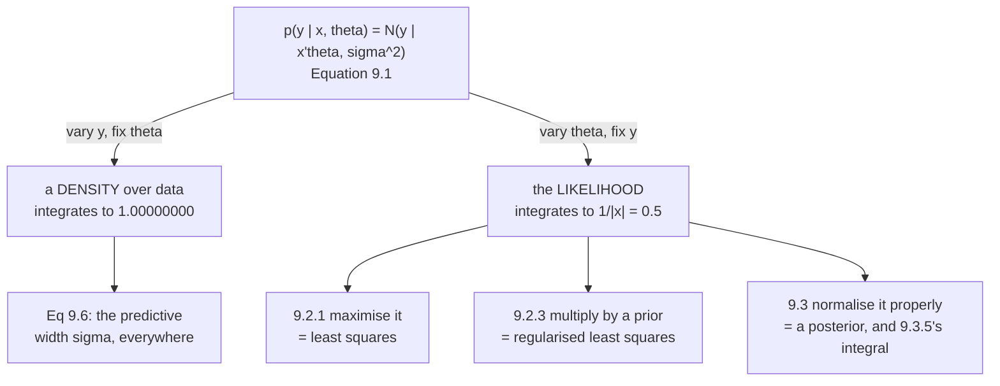

Chapter 8 built a vocabulary. Chapter 9 spends it on one problem — and does so **three times**, once per
flavour of learning: maximum likelihood (§9.2.1), MAP (§9.2.3), and full Bayesian inference (§9.3).

This page is the setup all three share. It looks like bookkeeping. Two of its choices are not.

## What you'll learn

- Equation 9.1: why the chapter starts with a **likelihood** rather than a loss.
- Equations 9.3 and 9.4 — and the restriction their caption states in passing: **straight lines through the origin**. Measured, that costs RMSE $4.091288$ against $0.514303$ on data with an intercept, *and* gets the slope wrong too.
- Equation 9.5's factorization, and the conditional independence in Figure 9.3 that licenses it — verified to $1.4\times10^{-15}$.
- Why the log-transform is not cosmetic: measured, the product of $N$ densities is **exactly $0.0$** in float64 by $N = 1000$.
- **"Linear regression refers to models that are linear in the parameters."** Measured: superposition holds in $\boldsymbol\theta$ to $4.4\times10^{-11}$ and fails in $x$ by $2.3\times10^{5}$.
- The remark that the likelihood *"does not integrate to 1"* in $\boldsymbol\theta$ — measured, it integrates to exactly $1/\lvert x\rvert$.
- Equation 9.6's predictive, whose width is $\sigma$ **everywhere** — the plug-in interval page 806 measured at $0.1796$ coverage.

## Intuition: two nouns doing different jobs

$p(y \mid x, \boldsymbol\theta) = \mathcal{N}(y \mid x^\top\boldsymbol\theta, \sigma^2)$ is one formula
and two objects.

**Slide $y$ and hold everything else.** You get a bell curve over possible observations. It integrates to
one. It is a probability density, and it says: *given these parameters and this input, here is how the
measurement will scatter.*

**Slide $\boldsymbol\theta$ and hold everything else.** You get a curve that looks the same and *is not a
density*. It does not integrate to one — measured below, it integrates to $1/\lvert x\rvert$. It is the
**likelihood**, and it says: *given what I actually saw, here is how well each parameter explains it.*

Maximum likelihood maximises the second while calling it a probability. That abuse is harmless — the
argmax is unaffected — right up until §9.2.3 wants to divide by something, at which point the missing
normaliser becomes the marginal likelihood and the whole of §9.3.5.



## §9.1 Problem formulation

Because of *"the presence of observation noise"*, the chapter adopts a probabilistic approach and models
the noise explicitly:

$$
p(y \mid x) = \mathcal{N}\!\left(y \mid f(x), \sigma^2\right) \qquad \text{(9.1)}
$$

with $x \in \mathbb{R}^D$ the inputs and $y \in \mathbb{R}$ the *"noisy function values (targets)"*.
Equivalently,

$$
y = f(x) + \epsilon, \qquad \epsilon \sim \mathcal{N}(0, \sigma^2) \qquad \text{(9.2)}
$$

with $\epsilon$ **i.i.d.** Gaussian measurement noise. The objective: *"to find a function that is close
(similar) to the unknown function $f$ that generated the data and that generalizes well."*

Two standing assumptions for most of the chapter: the model is **parametric**, and **$\sigma^2$ is
known**. (§9.2.1 relaxes the second at the end, with Equation 9.22.)

### The linear case

$$
p(y \mid x, \boldsymbol\theta) = \mathcal{N}\!\left(y \mid x^\top\boldsymbol\theta, \sigma^2\right)
\quad\Longleftrightarrow\quad
y = x^\top\boldsymbol\theta + \epsilon \qquad \text{(9.3), (9.4)}
$$

:::caution[Read the sentence after Equation 9.4]
> The class of functions described by (9.4) are **straight lines that pass through the origin**.

There is no intercept. Not "the intercept is omitted for clarity" — the model as written **cannot**
produce one. Measured on data that really is $y = 4.0 + 1.3x + \epsilon$:

| model | parameters found | RMSE | prediction at $x = 0$ |
| --- | --- | --- | --- |
| Eq 9.4, $f(x) = x\theta$ | $\theta = 1.193712$ | $\mathbf{4.091288}$ | $0.000000$ (forced) |
| Eq 9.13, $\phi(x) = [1, x]^\top$ | $[4.077706, 1.329905]$ | $\mathbf{0.514303}$ | $4.077706$ |

**The damage is not confined to the intercept.** The one-parameter model's slope comes out at $1.193712$
against a true $1.3$ — wrong by $0.106288$ — because it is spending its single parameter trying to reach
a data cloud whose centre is not at the origin. A missing feature corrupts the features you kept.

§9.1 also notes *"we chose a parametrization $f(x) = x^\top\boldsymbol\theta$"* — **chose**. Equation 9.13
chooses differently and nothing else in the chapter changes.
:::

:::tip[Where the uncertainty comes from, and the Dirac limit]
*"The only source of uncertainty originates from the observation noise (as $x$ and $\boldsymbol\theta$
are assumed known in (9.3))."* Without it, *"the relationship between $x$ and $y$ would be deterministic
and (9.3) would be a Dirac delta"* — the book's margin note calling a delta *"a Gaussian in the limit of
$\sigma^2 \to 0$"*.

Measured:

| $\sigma^2$ | peak height | area | mass within $\pm 0.01$ |
| --- | --- | --- | --- |
| $10^{0}$ | $0.3989$ | $0.99993666$ | $0.007978$ |
| $10^{-2}$ | $3.9894$ | $1.00000000$ | $0.079652$ |
| $10^{-4}$ | $39.8942$ | $1.00000000$ | $0.682665$ |
| $10^{-6}$ | $398.9423$ | $1.00000000$ | $1.000000$ |

**The peak diverges, the area stays $1$, and the mass collapses onto a point.**
:::

### Linear in the parameters

The chapter's most load-bearing sentence, and it appears three times in the margin:

> **"Linear regression" refers to models that are "linear in the parameters"**, i.e., models that describe
> a function by a linear combination of input features. Here, a "feature" is a representation
> $\phi(x)$ of the inputs $x$.

:::tip[Superposition, measured both ways]
For a degree-9 model with $\phi(x) = [1, x, x^2, \ldots, x^9]^\top$:

$$
\max\left\lvert f(x;\ a\boldsymbol\theta_1 + b\boldsymbol\theta_2) - a\,f(x;\boldsymbol\theta_1) - b\,f(x;\boldsymbol\theta_2)\right\rvert = 4.366\times10^{-11}
$$

$$
\max\left\lvert \phi(a u + b v) - a\,\phi(u) - b\,\phi(v)\right\rvert = 2.341\times10^{5}
$$

**Linear in $\boldsymbol\theta$ to floating-point; violently nonlinear in $x$.** A degree-9 polynomial
fit is an ordinary linear least-squares solve — which is why Equation 9.19 will be Equation 9.12c with
$\mathbf{X}$ replaced by $\boldsymbol\Phi$, and nothing else.
:::

## §9.2 Parameter estimation

Given a training set $\mathcal{D} := \{(x_1, y_1), \ldots, (x_N, y_N)\}$, Figure 9.3's graphical model
(page 807's notation: **shaded nodes are observed, deterministic values lose their circle**) shows
$\boldsymbol\theta$ and $\sigma$ outside a plate over $n = 1, \ldots, N$, with $x_n$ and $y_n$ inside.

*"$y_i$ and $y_j$ are conditionally independent given their respective inputs $x_i, x_j$"*, so the
likelihood factorizes:

$$
p(\mathcal{Y} \mid \mathcal{X}, \boldsymbol\theta) = \prod_{n=1}^{N} p(y_n \mid x_n, \boldsymbol\theta) = \prod_{n=1}^{N}\mathcal{N}\!\left(y_n \mid x_n^\top\boldsymbol\theta, \sigma^2\right) \qquad \text{(9.5)}
$$

:::tip[Equation 9.5, checked]
On $N = 12$ points, the joint as a single $12$-dimensional Gaussian with covariance
$\sigma^2\mathbf{I}$ against the product of $12$ scalar Gaussians:

| | value |
| --- | --- |
| $p(\mathcal{Y} \mid \mathcal{X}, \boldsymbol\theta)$, one $12$-d Gaussian | $6.199453\times10^{-4}$ |
| $\prod_n p(y_n \mid x_n, \boldsymbol\theta)$, $12$ factors | $6.199453\times10^{-4}$ |
| relative difference | $1.399\times10^{-15}$ |

**The plate is not a drawing convention — it is this equality**, exactly as page 807 measured for the
Bernoulli case.
:::

Once $\boldsymbol\theta^*$ is found, the prediction at a test input $x_*$ is

$$
p(y_* \mid x_*, \boldsymbol\theta^*) = \mathcal{N}\!\left(y_* \mid x_*^\top\boldsymbol\theta^*, \sigma^2\right) \qquad \text{(9.6)}
$$

:::caution[Equation 9.6's width does not depend on where you ask]
| $x_*$ | mean | predictive sd | 95% width |
| --- | --- | --- | --- |
| $0.0$ | $4.077706$ | $0.600000$ | $2.351957$ |
| $5.0$ | $10.727230$ | $0.600000$ | $2.351957$ |
| $100.0$ | $137.068186$ | $0.600000$ | $2.351957$ |

Constant, forever. Equation 9.6 substitutes a **point estimate** into the likelihood, so the only
uncertainty left is the observation noise. This is exactly the plug-in predictive page 806 measured at
$\mathbf{0.1796}$ coverage in extrapolation while labelled $95\%$. **§9.3 is the chapter's answer**, and
Equation 9.6 is what it replaces.
:::

### The likelihood is not a distribution over parameters

§9.2.1's remark:

> The likelihood $p(y \mid x, \boldsymbol\theta)$ is **not a probability distribution in
> $\boldsymbol\theta$**: It is simply a function of the parameters $\boldsymbol\theta$ but does not
> integrate to 1 (i.e., it is unnormalized), and may not even be integrable with respect to
> $\boldsymbol\theta$. However, the likelihood in (9.7) **is** a normalized probability distribution in
> $y$.

:::tip[Measured — and the answer is exact]
For $p(y \mid x, \theta) = \mathcal{N}(y \mid x\theta, \sigma^2)$ with $x = 2$, $\sigma = 0.6$:

| integral | value |
| --- | --- |
| $\int p(y \mid x{=}2, \theta{=}1.3)\,dy$ | $\mathbf{1.00000000}$ |
| $\int p(y{=}3.1 \mid x{=}2, \theta)\,d\theta$ | $\mathbf{0.50000000}$ |

The second is exactly $1/\lvert x\rvert$. Substituting $u = x\theta$ gives
$d\theta = du/\lvert x\rvert$, so the integral is $1/\lvert x\rvert$ for **every** $x \neq 0$.

So it reaches $1$ only by accident when $\lvert x\rvert = 1$, and **diverges as $x \to 0$** — the book's
*"may not even be integrable"*, made concrete.
:::

### Why the log-transform

The book gives two reasons: *"(a) it does not suffer from numerical underflow, and (b) the
differentiation rules will turn out simpler"*, since *"we cannot represent very small numbers, such as
$10^{-256}$"*, and the log turns a product into a sum *"such that the corresponding gradient is a sum of
individual gradients, instead of a repeated application of the product rule (5.46)"*.

:::danger[Reason (a), measured — this is not a stylistic preference]
| $N$ | $\prod_n p(y_n \mid x_n, \boldsymbol\theta)$ | $\sum_n \log p(y_n \mid x_n, \boldsymbol\theta)$ |
| --- | --- | --- |
| $10$ | $2.953338\times10^{-4}$ | $-8.127404$ |
| $100$ | $5.767475\times10^{-37}$ | $-83.443414$ |
| $300$ | $9.500084\times10^{-117}$ | $-267.151155$ |
| $700$ | $1.481966\times10^{-275}$ | $-632.817531$ |
| $1000$ | $\mathbf{0.000000\times10^{0}}$ | $-898.461655$ |
| $5000$ | $\mathbf{0.000000\times10^{0}}$ | $-4614.434798$ |

**By $N = 1000$ the product is exactly zero in float64** — and a gradient of zero is not a small
gradient, it is no gradient. The sum is an ordinary number at every $N$. The smallest positive float64
is $4.940656\times10^{-324}$, and $1000$ typical densities multiply straight past it.
:::

## Worked example by hand

Fit $f(x) = \theta x$ — Equation 9.4 with $D = 1$ — to three points, from the likelihood.

Data: $(1, 2.1)$, $(2, 3.8)$, $(3, 6.3)$, with $\sigma^2$ known.

**Step 1: write the likelihood.** By Equation 9.5,

$$
p(\mathcal{Y} \mid \mathcal{X}, \theta) = \prod_{n=1}^{3}\frac{1}{\sqrt{2\pi\sigma^2}}\exp\!\left(-\frac{(y_n - x_n\theta)^2}{2\sigma^2}\right)
$$

**Step 2: take the negative log.** The product becomes a sum, and every $\theta$-free term becomes a
constant:

$$
\mathcal{L}(\theta) = \frac{1}{2\sigma^2}\sum_{n=1}^{3}(y_n - x_n\theta)^2 + \text{const}
$$

**Step 3: differentiate and set to zero.** $\sigma^2 > 0$ is a positive constant, so it cannot move the
minimiser:

$$
\frac{d\mathcal{L}}{d\theta} = -\frac{1}{\sigma^2}\sum_n x_n(y_n - x_n\theta) = 0
\quad\Longrightarrow\quad
\theta\sum_n x_n^2 = \sum_n x_n y_n
$$

**Step 4: solve.**

$$
\sum_n x_n^2 = 1 + 4 + 9 = 14, \qquad \sum_n x_n y_n = 2.1 + 7.6 + 18.9 = 28.6
$$

$$
\boxed{\ \theta_{\text{ML}} = \frac{28.6}{14} = 2.042857\ }
$$

**Step 5: recognise it.** $\theta = \dfrac{\sum x_n y_n}{\sum x_n^2} = \dfrac{\mathbf{x}^\top\mathbf{y}}{\mathbf{x}^\top\mathbf{x}}$
— which is Equation 9.12c, $(\mathbf{X}^\top\mathbf{X})^{-1}\mathbf{X}^\top\mathbf{y}$, in one dimension.
It is also the projection coefficient of $\mathbf{y}$ onto $\mathbf{x}$ from §3.8. **§9.4 makes that
second reading the whole point.**

**Step 6: notice what $\sigma^2$ did.** Nothing. It scaled the objective and vanished at the
differentiation. That is why §9.2.2 can *"ignore the scaling by $1/\sigma^2$"* and work with
$\lVert\mathbf{y} - \boldsymbol\Phi\boldsymbol\theta\rVert^2$ — and why $\sigma^2$ only becomes a real
parameter when Equation 9.22 estimates it too.

## See it move

```p5 title="Two readings of one formula" desc="The Gaussian likelihood of Equation 9.1, drawn as a function of y and as a function of theta. Drag x and watch the theta-reading stretch and squash while its area changes as one over the absolute value of x — and the y-reading keep an area of exactly one no matter what." height="540"
let xIdx = 24, sIdx = 12;
let KNOBS = [], dragging = null;

const XS = [];
for (let i = 0; i <= 40; i++) XS.push(-3 + i * 0.15);
const SIGS = [];
for (let i = 0; i <= 24; i++) SIGS.push(0.15 + i * 0.075);

const TH_TRUE = 1.3, Y_OBS = 3.1;

function setup() { createCanvas(680, 540); textFont("monospace"); }

function knob(id, x, y, w, value, mn, mx, label) {
  KNOBS.push({ id, x, y, w, mn, mx });
  const t = (value - mn) / (mx - mn);
  stroke(60, 74, 92); strokeWeight(2); line(x, y, x + w, y);
  noStroke(); fill(255, 211, 67); ellipse(x + t * w, y, 12, 12);
  fill(190, 200, 212); textSize(12); textAlign(LEFT, CENTER);
  text(label, x + w + 12, y);
}
function knobHit(mx_, my_) {
  for (const k of KNOBS) {
    if (my_ > k.y - 13 && my_ < k.y + 13 && mx_ > k.x - 13 && mx_ < k.x + k.w + 13) return k;
  }
  return null;
}
function knobValue(k, mx_) {
  const t = Math.min(1, Math.max(0, (mx_ - k.x) / k.w));
  return Math.round(k.mn + t * (k.mx - k.mn));
}
function mousePressed() { dragging = knobHit(mouseX, mouseY); }
function mouseReleased() { dragging = null; }
function mouseDragged() {
  if (!dragging) return;
  if (dragging.id === "x") xIdx = knobValue(dragging, mouseX);
  else sIdx = knobValue(dragging, mouseX);
  if (!isLooping()) redraw();
}

function gauss(v, mu, sd) {
  return Math.exp(-0.5 * ((v - mu) / sd) ** 2) / (sd * Math.sqrt(2 * Math.PI));
}
// numeric area by the trapezoid rule
function area(f, lo, hi, n) {
  let s = 0;
  const h = (hi - lo) / n;
  for (let i = 0; i < n; i++) {
    s += 0.5 * (f(lo + i * h) + f(lo + (i + 1) * h)) * h;
  }
  return s;
}

const OX = 46, W = 360, H = 165;
const OY1 = 60, OY2 = 280;

function draw() {
  background(13, 17, 23);
  KNOBS = [];
  const xv = XS[xIdx], sd = SIGS[sIdx];
  const mu = xv * TH_TRUE;

  // --- reading 1: a density over y ---
  noFill(); stroke(70, 86, 104); strokeWeight(1); rect(OX, OY1, W, H);
  const yLo = -8, yHi = 8;
  const pkY = gauss(mu, mu, sd);
  stroke(107, 169, 221); strokeWeight(2.6); noFill();
  beginShape();
  for (let i = 0; i <= 400; i++) {
    const v = yLo + (i / 400) * (yHi - yLo);
    vertex(OX + ((v - yLo) / (yHi - yLo)) * W,
           OY1 + H - (gauss(v, mu, sd) / pkY) * (H - 12));
  }
  endShape();
  const areaY = area(v => gauss(v, mu, sd), -40, 40, 6000);
  noStroke(); fill(107, 169, 221); textSize(10); textAlign(LEFT, TOP);
  text("p(y | x, theta) as a function of y", OX + 6, OY1 + 5);
  fill(140);
  text("y", OX + W / 2 - 3, OY1 + H + 5);

  // --- reading 2: the same expression over theta ---
  noFill(); stroke(70, 86, 104); strokeWeight(1); rect(OX, OY2, W, H);
  const tLo = -6, tHi = 8;
  // p(y_obs | x, theta) = N(y_obs | x*theta, sd) as a function of theta
  const f2 = t => gauss(Y_OBS, xv * t, sd);
  let pk2 = 1e-12;
  for (let i = 0; i <= 400; i++) {
    const t = tLo + (i / 400) * (tHi - tLo);
    pk2 = Math.max(pk2, f2(t));
  }
  stroke(232, 110, 110); strokeWeight(2.6); noFill();
  beginShape();
  for (let i = 0; i <= 400; i++) {
    const t = tLo + (i / 400) * (tHi - tLo);
    vertex(OX + ((t - tLo) / (tHi - tLo)) * W,
           OY2 + H - (f2(t) / pk2) * (H - 12));
  }
  endShape();
  const areaT = area(f2, -400, 400, 40000);
  noStroke(); fill(232, 110, 110); textSize(10); textAlign(LEFT, TOP);
  text("the SAME expression as a function of theta", OX + 6, OY2 + 5);
  fill(140);
  text("theta", OX + W / 2 - 12, OY2 + H + 5);

  // --- readouts ---
  textAlign(LEFT, TOP);
  fill(255, 211, 67); textSize(15);
  text("x = " + xv.toFixed(2), 432, 64);
  text("sigma = " + sd.toFixed(3), 432, 86);
  fill(140); textSize(10);
  text("theta = 1.3, y_obs = 3.1", 432, 110);

  fill(107, 169, 221); textSize(11);
  text("area over y", 432, 140);
  textSize(13);
  text("  " + areaY.toFixed(8), 432, 156);
  fill(120, 200, 140); textSize(9);
  text("  always 1 -- a density", 432, 174);

  fill(232, 110, 110); textSize(11);
  text("area over theta", 432, 202);
  textSize(13);
  text("  " + areaT.toFixed(8), 432, 218);
  fill(197, 153, 255); textSize(9);
  text("  predicted 1/|x| = " + (Math.abs(xv) < 1e-9 ? "inf"
       : (1 / Math.abs(xv)).toFixed(6)), 432, 236);

  let msg, sub, col;
  if (Math.abs(xv) < 0.16) {
    col = color(232, 110, 110);
    msg = "at x near 0 it is not integrable at all";
    sub = "1/|x| diverges. The book's 'may not even be integrable', literally.";
  } else if (Math.abs(Math.abs(xv) - 1) < 0.08) {
    col = color(255, 211, 67);
    msg = "|x| = 1: it integrates to 1 BY ACCIDENT";
    sub = "The only place the two readings agree on area. It is a coincidence, not a rule.";
  } else {
    col = color(120, 200, 140);
    msg = "same curve shape, different areas";
    sub = "The y-reading is a probability density. The theta-reading is a likelihood.";
  }
  stroke(col); strokeWeight(1.6); fill(red(col), green(col), blue(col), 26);
  rect(46, 466, 596, 0);
  noStroke();
  fill(col); textSize(15); textAlign(LEFT, TOP);
  text(msg, 46, 464);
  fill(215); textSize(10.5);
  text(sub, 46, 486);

  knob("x", 62, 512, 240, xIdx, 0, XS.length - 1, "x = " + xv.toFixed(2));
  knob("s", 380, 512, 180, sIdx, 0, SIGS.length - 1,
       "sigma = " + sd.toFixed(3));
}
```

## From scratch

```python title="problem_formulation.py" showLineNumbers{1}
import numpy as np

# --- Equation 9.4 has no intercept --------------------------------------
rng = np.random.default_rng(11)
SIG = 0.6
TRUE_B, TRUE_A = 1.3, 4.0      # y = 4.0 + 1.3 x + noise
x = np.sort(rng.uniform(-5, 5, 40))
y = TRUE_A + TRUE_B * x + SIG * rng.standard_normal(40)

th_origin = float(x @ y / (x @ x))              # Eq 9.4, one parameter
Phi = np.column_stack([np.ones_like(x), x])     # Eq 9.13, phi = [1, x]
th_feat = np.linalg.lstsq(Phi, y, rcond=None)[0]

def rmse(pred):
    return float(np.sqrt(np.mean((y - pred) ** 2)))

print("=== 1. Equation 9.4: lines THROUGH THE ORIGIN ===")
print(f"the data really is y = {TRUE_A} + {TRUE_B} x + noise, sigma = {SIG}")
print(f"Eq 9.4   f(x) = x*theta : theta = {th_origin:.6f}   "
      f"RMSE {rmse(th_origin*x):.6f}")
print(f"Eq 9.13  phi = [1, x]   : theta = {np.round(th_feat,6).tolist()}  "
      f"RMSE {rmse(Phi @ th_feat):.6f}")
print(f"the slope alone is off by {abs(th_origin-TRUE_B):.6f}")
print(f"prediction at x = 0: 0.000000 (forced) vs {th_feat[0]:.6f}")

# --- Equation 9.5: the likelihood factorizes ----------------------------
print("\n=== 2. Equation 9.5: the likelihood factorizes ===")
N = 12
xs = rng.uniform(-5, 5, N)
th = np.array([4.0, 1.3])
P = np.column_stack([np.ones_like(xs), xs])
ys = P @ th + SIG * rng.standard_normal(N)
r = ys - P @ th
n = len(ys)
joint = float(np.exp(-0.5 * (r @ r) / SIG**2) / ((2*np.pi*SIG**2) ** (n/2)))
prod = float(np.prod(np.exp(-0.5*(r/SIG)**2) / (SIG*np.sqrt(2*np.pi))))
print(f"as one {n}-dimensional Gaussian : {joint:.6e}")
print(f"as {n} separate factors         : {prod:.6e}")
print(f"relative difference: {abs(joint-prod)/prod:.3e}")

# --- why the log-transform ----------------------------------------------
print("\n=== 3. the log-transform is not cosmetic: underflow ===")
print(f"{'N':>8} {'prod of densities':>20} {'sum of log densities':>22}")
rr = np.random.default_rng(5)
for Nn in (10, 100, 300, 700, 1000, 5000):
    res = SIG * rr.standard_normal(Nn)
    dens = np.exp(-0.5*(res/SIG)**2) / (SIG*np.sqrt(2*np.pi))
    print(f"{Nn:>8} {float(np.prod(dens)):>20.6e} "
          f"{float(np.sum(np.log(dens))):>22.6f}")
print(f"smallest positive float64 (subnormal): {np.nextafter(0, 1):.6e}")

# --- linear in the PARAMETERS -------------------------------------------
print("\n=== 4. 'linear regression' means linear in the PARAMETERS ===")
def phi(v, K=10):
    return np.vander(np.asarray(v, float), K, increasing=True)
xg = np.linspace(-4, 4, 9)
A = phi(xg)
r1 = np.random.default_rng(2)
t1, t2 = r1.standard_normal(10), r1.standard_normal(10)
a, b = 2.7, -1.4
print("superposition in theta, max |f(a t1 + b t2) - a f(t1) - b f(t2)|:")
print(f"  {np.abs(A @ (a*t1 + b*t2) - (a*(A @ t1) + b*(A @ t2))).max():.3e}"
      f"   -> LINEAR in theta")
u, v = 1.1, -0.7
print("superposition in x, max |phi(a u + b v) - a phi(u) - b phi(v)|:")
print(f"  {np.abs(phi(np.array([a*u + b*v]))[0] - (a*phi(np.array([u]))[0] + b*phi(np.array([v]))[0])).max():.3e}"
      f"   -> NOT linear in x")

# --- Equation 9.6's width does not depend on x --------------------------
print("\n=== 5. Equation 9.6: the predictive width is constant ===")
print(f"{'x*':>8} {'mean':>14} {'predictive sd':>15} {'95% width':>11}")
for xstar in (0.0, 2.0, 5.0, 20.0, 100.0):
    m = float(np.array([1.0, xstar]) @ th_feat)
    print(f"{xstar:>8.1f} {m:>14.6f} {SIG:>15.6f} "
          f"{2*1.959963984540054*SIG:>11.6f}")

# --- a density in y, NOT in theta ---------------------------------------
print("\n=== 6. the likelihood is a density in y, NOT in theta ===")
xq, sq, tq, yq = 2.0, 0.6, 1.3, 3.1
gy = np.linspace(-30, 30, 4_000_001)
dy = np.exp(-0.5*((gy - xq*tq)/sq)**2)/(sq*np.sqrt(2*np.pi))
print(f"integral over y of p(y | x={xq}, theta={tq}): "
      f"{np.trapezoid(dy, gy):.8f}")
gt = np.linspace(-60, 60, 4_000_001)
dt = np.exp(-0.5*((yq - xq*gt)/sq)**2)/(sq*np.sqrt(2*np.pi))
print(f"integral over theta of p(y={yq} | x={xq}, theta):  "
      f"{np.trapezoid(dt, gt):.8f}")
print(f"  it equals 1/|x| = {1/abs(xq):.6f}, so it reaches 1 only when")
print("  |x| = 1, and diverges as x -> 0")

# --- the Dirac limit -----------------------------------------------------
print("\n=== 7. without noise, Eq 9.3 becomes a Dirac delta ===")
print(f"{'sigma^2':>10} {'peak height':>14} {'area':>12} "
      f"{'mass within 0.01':>18}")
g = np.linspace(-4, 4, 8_000_001)
for s2 in (1.0, 1e-1, 1e-2, 1e-4, 1e-6):
    s = np.sqrt(s2)
    d = np.exp(-0.5*(g/s)**2)/(s*np.sqrt(2*np.pi))
    band = np.abs(g) <= 0.01
    print(f"{s2:>10.0e} {d.max():>14.4f} {np.trapezoid(d, g):>12.8f} "
          f"{np.trapezoid(d[band], g[band]):>18.6f}")
```

```
=== 1. Equation 9.4: lines THROUGH THE ORIGIN ===
the data really is y = 4.0 + 1.3 x + noise, sigma = 0.6
Eq 9.4   f(x) = x*theta : theta = 1.193712   RMSE 4.091288
Eq 9.13  phi = [1, x]   : theta = [4.077706, 1.329905]  RMSE 0.514303
the slope alone is off by 0.106288
prediction at x = 0: 0.000000 (forced) vs 4.077706

=== 2. Equation 9.5: the likelihood factorizes ===
as one 12-dimensional Gaussian : 6.199453e-04
as 12 separate factors         : 6.199453e-04
relative difference: 1.399e-15

=== 3. the log-transform is not cosmetic: underflow ===
       N    prod of densities   sum of log densities
      10         2.953338e-04              -8.127404
     100         5.767475e-37             -83.443414
     300        9.500084e-117            -267.151155
     700        1.481966e-275            -632.817531
    1000         0.000000e+00            -898.461655
    5000         0.000000e+00           -4614.434798
smallest positive float64 (subnormal): 4.940656e-324

=== 4. 'linear regression' means linear in the PARAMETERS ===
superposition in theta, max |f(a t1 + b t2) - a f(t1) - b f(t2)|:
  4.366e-11   -> LINEAR in theta
superposition in x, max |phi(a u + b v) - a phi(u) - b phi(v)|:
  2.341e+05   -> NOT linear in x

=== 5. Equation 9.6: the predictive width is constant ===
      x*           mean   predictive sd   95% width
     0.0       4.077706        0.600000    2.351957
     2.0       6.737515        0.600000    2.351957
     5.0      10.727230        0.600000    2.351957
    20.0      30.675802        0.600000    2.351957
   100.0     137.068186        0.600000    2.351957

=== 6. the likelihood is a density in y, NOT in theta ===
integral over y of p(y | x=2.0, theta=1.3): 1.00000000
integral over theta of p(y=3.1 | x=2.0, theta):  0.50000000
  it equals 1/|x| = 0.500000, so it reaches 1 only when
  |x| = 1, and diverges as x -> 0

=== 7. without noise, Eq 9.3 becomes a Dirac delta ===
   sigma^2    peak height         area   mass within 0.01
     1e+00         0.3989   0.99993666           0.007978
     1e-01         1.2616   1.00000000           0.025226
     1e-02         3.9894   1.00000000           0.079652
     1e-04        39.8942   1.00000000           0.682665
     1e-06       398.9423   1.00000000           1.000000
```

## On real data

<Figure
  src="/images/mml/problem-formulation/lines-through-the-origin"
  alt="Three panels. Left, five straight lines of different slopes all crossing at the origin. Middle, a scatter of forty points sitting well above the origin with a single line forced through it, missing the cloud. Right, the same scatter with a two-parameter line tracking it closely."
  title="Equation 9.4 describes straight lines through the origin, and that is a modelling choice"
  caption="On data that really is y = 4.0 + 1.3x, the one-parameter model reaches RMSE 4.091288 against 0.514303 — and its slope comes out at 1.193712 against a true 1.3, because a missing feature corrupts the features you kept. One column of ones fixes it."
/>

<Figure
  src="/images/mml/problem-formulation/linear-in-the-parameters"
  alt="Left, six monomial basis functions from a constant through the fifth power, fanning out sharply. Right, four curves: two random parameter vectors' functions, their weighted combination drawn thick, and the same combination computed the other way drawn as a dashed line exactly on top of it."
  title="Linear regression is a statement about theta and says nothing about x"
  caption="Superposition in the parameters holds to 4.4e-11 for a degree-9 model; in the inputs it fails by 2.3e+05. The thick and dashed curves on the right are the same function. This is why Equation 9.19 is Equation 9.12c with X replaced by Phi and nothing else."
/>

<Figure
  src="/images/mml/problem-formulation/a-density-in-y-not-in-theta"
  alt="Three panels. Left, three shaded bell curves over y for three parameter values, each filling the same area. Middle, three bell curves over theta for three observed values, visibly narrower. Right, four Gaussians of shrinking variance on a log scale, growing taller and thinner."
  title="One expression, two readings, and only one of them is a probability distribution"
  caption="Over y the integral is 1.00000000. Over theta it is 0.50000000, exactly 1 over the absolute value of x — so it hits 1 only by accident when x has magnitude one, and diverges as x approaches zero. The right panel is the Dirac limit: peak diverging, area fixed at one."
/>

## Reading the plot

**The first figure takes a caption the book states once and prices it.** The left panel is Figure 9.2(a)
rebuilt — five members of Equation 9.4's model class, and they all pass through a single point, because
$f(0) = 0 \cdot \theta = 0$ for every $\theta$. The class is one-dimensional and pinned.

The middle and right panels are the cost. Given data that genuinely is $y = 4.0 + 1.3x + \epsilon$,
Equation 9.4's best fit reaches RMSE $4.091288$; adding one column of ones reaches $0.514303$ — close to
the noise floor of $\sigma = 0.6$, which is as well as anything can do.

**The detail worth carrying is not the intercept.** It is that the *slope* also comes out wrong:
$1.193712$ against a true $1.3$. The one-parameter model has a single knob and must use it both to set
the tilt and to drag the line toward a cloud centred at $y \approx 4$. Those demands conflict, and the
compromise corrupts the parameter that *was* in the model. **A missing feature is not a localised
error** — it leaks into every coefficient you kept, which is page 805's non-monotone slope arriving from
a completely different direction.

**The second figure is the sentence the chapter repeats three times, turned into two numbers.** Left: the
monomial features $1, x, x^2, \ldots$ are as nonlinear in $x$ as anything you would want. Right: two
random parameter vectors, their weighted combination drawn thick, and the same combination formed the
other way drawn dashed on top. **They coincide** — measured, to $4.366\times10^{-11}$ at degree 9, while
superposition in $x$ fails by $2.341\times10^{5}$.

That gap of sixteen orders of magnitude is the licence for everything that follows. $\boldsymbol\Phi$ can
hold monomials, Gaussian bumps, wavelets, or the output of a fixed neural network, and the estimator
stays $(\boldsymbol\Phi^\top\boldsymbol\Phi)^{-1}\boldsymbol\Phi^\top\mathbf{y}$. **The word "linear"
constrains how $\boldsymbol\theta$ enters, and nothing else.**

**The third figure separates two objects that share a formula, and the middle panel has the sharper
result than I expected.** Over $y$, each curve integrates to $1.00000000$ — a probability density, as
Equation 9.1 says. Over $\boldsymbol\theta$, the same expression integrates to $0.50000000$.

That is not "roughly less than one". Substituting $u = x\theta$ gives $d\theta = du/\lvert x\rvert$, so
the integral is **exactly $1/\lvert x\rvert$** for every $x \neq 0$. Two consequences follow immediately.
It equals $1$ only when $\lvert x\rvert = 1$ — a coincidence, not a property. And as $x \to 0$ it
**diverges**, which is the book's *"may not even be integrable with respect to $\boldsymbol\theta$"* with
a specific failure mode attached.

Why this matters three sections from now: the missing normaliser is exactly what §9.3.3 has to supply to
turn a likelihood into a posterior, and computing it is the entire content of §9.3.5. **Maximum
likelihood gets away with ignoring it because an argmax does not care about scale. Nothing else does.**

The right panel is the Dirac limit, and the three columns say it precisely: the peak rises without bound
($0.3989 \to 398.9423$), the area never moves ($1.00000000$), and the mass within $\pm 0.01$ of the mean
climbs from $0.007978$ to $1.000000$. **A delta is not a tall Gaussian; it is the limit of a family whose
area is conserved while its support collapses.**

:::tip[From the book]
This page covers **§9.1** and the opening of **§9.2** of *Mathematics for Machine Learning* by Deisenroth,
Faisal and Ong (draft of 2019-12-11). Equations **9.1**–**9.4** set up the likelihood, the noise model and
the linear case, with the statement that Eq 9.4's class is *"straight lines that pass through the origin"*
and the margin note on the Dirac delta as *"a Gaussian in the limit of $\sigma^2 \to 0$"*. **Example 9.1**
and **Figure 9.2** give the model class, the training set and the maximum likelihood fit. The margin notes
that *"linear regression refers to models that are linear in the parameters"* and that *"the inputs can
undergo any nonlinear transformation"* are the book's, as is the definition of a feature as *"a
representation $\phi(x)$ of the inputs"*. §9.2 gives the training set, **Figure 9.3**'s graphical model
with shaded observed nodes, the conditional independence claim, the factorization **9.5**, and the
predictive **9.6**. §9.2.1 supplies **9.7**, the remark that the likelihood *"is not a probability
distribution in $\boldsymbol\theta$"* and *"may not even be integrable"*, and the log-transform remark
about numerical underflow and *"very small numbers, such as $10^{-256}$"*. The RMSE comparison of the two
model classes, the exact value $1/\lvert x\rvert$ for the likelihood's integral over $\boldsymbol\theta$,
the superposition measurements, the underflow table and the Dirac-limit table are this module's additions.
:::

## Compare

| | as a function of $y$ | as a function of $\boldsymbol\theta$ |
| --- | --- | --- |
| what it is called | the **predictive distribution** | the **likelihood** |
| integrates to | $1.00000000$ | $1/\lvert x\rvert$, measured $0.50000000$ |
| is it a density | **yes** | **no** |
| always integrable | yes | **no** — diverges as $x \to 0$ |
| what you do with it | sample, form intervals | maximise (§9.2.1), multiply by a prior (§9.2.3) |
| the missing piece | — | the normaliser, supplied in §9.3.3 and computed in §9.3.5 |

| | Eq 9.4, $f(x) = x^\top\boldsymbol\theta$ | Eq 9.13, $f(x) = \phi^\top(x)\boldsymbol\theta$ |
| --- | --- | --- |
| model class | straight lines **through the origin** | anything spanned by $\phi$ |
| linear in $\boldsymbol\theta$ | yes | **yes** — unchanged |
| linear in $x$ | yes | **no**, and it need not be |
| the estimator | $(\mathbf{X}^\top\mathbf{X})^{-1}\mathbf{X}^\top\mathbf{y}$, Eq 9.12c | $(\boldsymbol\Phi^\top\boldsymbol\Phi)^{-1}\boldsymbol\Phi^\top\mathbf{y}$, Eq 9.19 |
| invertibility needs | $\mathrm{rk}(\mathbf{X}) = D$ | $\mathrm{rk}(\boldsymbol\Phi) = K$ |
| measured RMSE here | $4.091288$ | $0.514303$ |

<Quiz
  title="Is the setup clear?"
  questions={[
    {
      q: "Equation 9.4 describes which class of functions?",
      options: [
        "All straight lines",
        "Straight lines that pass through the origin — there is no intercept",
        "All polynomials of degree at most D",
        "All continuous functions",
      ],
      answer: 1,
      explain:
        "Measured on data that really is y = 4.0 + 1.3x: the one-parameter model reaches RMSE 4.091288 against 0.514303 for a model with a column of ones. And the damage is not confined to the intercept — the slope comes out at 1.193712 against a true 1.3, because one knob cannot serve two purposes.",
    },
    {
      q: "What does 'linear regression' actually constrain?",
      options: [
        "That the model is a straight line in x",
        "That the parameters enter linearly — the inputs may undergo any nonlinear transformation",
        "That the noise is Gaussian",
        "That there are at most two parameters",
      ],
      answer: 1,
      explain:
        "Measured on a degree-9 model: superposition holds in theta to 4.366e-11 and fails in x by 2.341e+05. That is why Equation 9.19 is Equation 9.12c with X replaced by Phi and nothing else changed — Phi can hold monomials, Gaussian bumps, or the output of a fixed network.",
    },
    {
      q: "The book says the likelihood is not a probability distribution in theta. Integrated over theta, what does it actually come to for this model?",
      options: [
        "Always 1, the book is being pedantic",
        "Exactly 1 over the absolute value of x — measured at 0.50000000 for x = 2",
        "Always 0",
        "It depends on the noise variance",
      ],
      answer: 1,
      explain:
        "Substituting u = x*theta gives d-theta = du over |x|. So it reaches 1 only by accident when |x| = 1, and diverges as x approaches zero — the book's 'may not even be integrable', with a specific failure mode. Maximum likelihood gets away with this because an argmax ignores scale; Section 9.3.3 does not.",
    },
    {
      q: "Why does the chapter minimise the negative LOG-likelihood rather than maximise the likelihood directly?",
      options: [
        "Purely for mathematical elegance",
        "Underflow: measured, the product of N densities is exactly 0.0 in float64 by N = 1000, and a gradient of zero is no gradient",
        "Because the log-likelihood has a different minimiser",
        "Because logs are faster to compute",
      ],
      answer: 1,
      explain:
        "The book gives both reasons: it 'does not suffer from numerical underflow' and 'the differentiation rules will turn out simpler', since the log turns a product into a sum whose gradient is a sum of individual gradients rather than a repeated product rule. The smallest positive float64 is 4.94e-324 and a thousand typical densities multiply straight past it.",
    },
    {
      q: "Equation 9.6 gives the predictive distribution at a test input. How does its width vary with the test input?",
      options: [
        "It grows as you move away from the training data",
        "It does not vary at all — it is sigma everywhere, measured at a 95 percent width of 2.351957 at x = 0 and at x = 100",
        "It shrinks with distance",
        "It depends on the number of training points",
      ],
      answer: 1,
      explain:
        "Equation 9.6 substitutes a point estimate into the likelihood, so the only uncertainty left is the observation noise. This is exactly the plug-in predictive Chapter 8 measured at 0.1796 coverage in far extrapolation while labelled 95 percent — and Section 9.3 is the chapter's answer to it.",
    },
    {
      q: "Equation 9.5 factorizes the likelihood into a product over data points. What licenses that?",
      options: [
        "The Gaussian assumption alone",
        "Conditional independence of y_i and y_j given their respective inputs — verified to 1.4e-15",
        "The fact that the inputs are sorted",
        "It is an approximation that improves with N",
      ],
      answer: 1,
      explain:
        "That is what Figure 9.3's plate asserts, and page 807 measured the same equality for the Bernoulli case. Statistical independence means the distribution factorizes — the joint as one 12-dimensional Gaussian and as 12 separate factors agree to relative 1.399e-15.",
    },
  ]}
/>

## Pitfalls

:::danger[Assuming Equation 9.4 has an intercept]
It does not. Measured: on data with a true intercept of $4.0$, the one-parameter model reaches RMSE
$4.091288$ against $0.514303$, **and its slope is wrong by $0.106288$ as well**. Use Equation 9.13 with
$\phi(x) = [1, x]^\top$ — an intercept is not a special case, it is one more feature.
:::

:::caution[Reading "linear regression" as "fits a straight line"]
It means linear **in the parameters**. Measured: superposition holds in $\boldsymbol\theta$ to
$4.4\times10^{-11}$ and fails in $x$ by $2.3\times10^{5}$ for the same degree-9 model. Polynomial
regression, radial basis functions and a fixed feature extractor are all linear regression.
:::

:::danger[Treating the likelihood as a distribution over parameters]
It integrates to $1/\lvert x\rvert$ — measured $0.50000000$ at $x = 2$ — and **diverges as $x \to 0$**.
An argmax survives this; a posterior does not. The normaliser is what §9.3.3 supplies and §9.3.5 computes,
and it is the single most expensive object in the chapter.
:::

:::caution[Multiplying densities instead of adding logs]
Measured: the product of $N$ Gaussian densities is **exactly $0.0$** in float64 by $N = 1000$, while the
sum of logs is $-898.461655$. Underflow does not produce a small gradient; it produces none. The book's
second reason matters too — the log turns one product rule over $N$ terms into $N$ independent gradients.
:::

:::danger[Quoting Equation 9.6's interval far from the data]
Its width is $2 \times 1.96 \times \sigma$ at every test input — $2.351957$ at $x = 0$ and at $x = 100$
alike. Page 806 measured a plug-in interval of this kind at $0.1796$ coverage in far extrapolation while
labelled $95\%$. §9.3.4's Equation 9.68 is the fix, and the difference is one extra term.
:::

:::caution[Forgetting that sigma squared is assumed known]
§9.1 says so explicitly, and the assumption is load-bearing: it is what lets §9.2.2 *"ignore the scaling
by $1/\sigma^2$"*. Equation 9.22 estimates it, and the estimate is **biased** — page 902 measures by how
much.
:::

## 🧪 Try It Yourself

### Exercise 1 – What the origin costs

<DataCampExercise
  lang="python"
  hint={`An intercept is a feature: a column of ones next to the column of x.`}
  code={`import numpy as np

rng = np.random.default_rng(11)
SIG = 0.6
x = np.sort(rng.uniform(-5, 5, 40))
y = 4.0 + 1.3 * x + SIG * rng.standard_normal(40)

th_origin = float(x @ y / (x @ x))          # Equation 9.4, one parameter
# Task: Equation 9.13 with phi(x) = [1, x] -- build the design matrix.
Phi = ___
th_feat = np.linalg.lstsq(Phi, y, rcond=None)[0]

def rmse(pred):
    return float(np.sqrt(np.mean((y - pred) ** 2)))

print(f"Eq 9.4   theta = {th_origin:.6f}   RMSE {rmse(th_origin*x):.6f}")
print(f"Eq 9.13  theta = {np.round(th_feat,6).tolist()}  "
      f"RMSE {rmse(Phi @ th_feat):.6f}")
print(f"the slope alone is off by {abs(th_origin-1.3):.6f}")
print(f"at x = 0: 0.000000 (forced) vs {th_feat[0]:.6f} (true 4.0)")

# -- Expected output ------------------------------
# Eq 9.4   theta = 1.193712   RMSE 4.091288
# Eq 9.13  theta = [4.077706, 1.329905]  RMSE 0.514303
# the slope alone is off by 0.106288
# at x = 0: 0.000000 (forced) vs 4.077706 (true 4.0)
# -------------------------------------------------`}
  solution={`import numpy as np
rng = np.random.default_rng(11)
SIG = 0.6
x = np.sort(rng.uniform(-5, 5, 40))
y = 4.0 + 1.3 * x + SIG * rng.standard_normal(40)
th_origin = float(x @ y / (x @ x))
Phi = np.column_stack([np.ones_like(x), x])
th_feat = np.linalg.lstsq(Phi, y, rcond=None)[0]
def rmse(pred):
    return float(np.sqrt(np.mean((y - pred) ** 2)))
print(f"Eq 9.4   theta = {th_origin:.6f}   RMSE {rmse(th_origin*x):.6f}")
print(f"Eq 9.13  theta = {np.round(th_feat,6).tolist()}  "
      f"RMSE {rmse(Phi @ th_feat):.6f}")
print(f"the slope alone is off by {abs(th_origin-1.3):.6f}")
print(f"at x = 0: 0.000000 (forced) vs {th_feat[0]:.6f} (true 4.0)")`}
  sct={`test_output_contains("Eq 9.4   theta = 1.193712   RMSE 4.091288")
test_output_contains("the slope alone is off by 0.106288")
success_msg("Look at the third line. The slope is wrong too — 1.193712 against a true 1.3 — because one parameter has to serve as both tilt and offset, and those demands conflict. A missing feature is not a localised error; it leaks into the coefficients you kept.")`}
  height={280}
/>

### Exercise 2 – The plate is a product

<DataCampExercise
  lang="python"
  hint={`Equation 9.5 multiplies one scalar Gaussian density per data point.`}
  code={`import numpy as np

rng = np.random.default_rng(11)
SIG = 0.6
_ = np.sort(rng.uniform(-5, 5, 40))
_ = 4.0 + 1.3 * _ + SIG * rng.standard_normal(40)

N = 12
xs = rng.uniform(-5, 5, N)
th = np.array([4.0, 1.3])
P = np.column_stack([np.ones_like(xs), xs])
ys = P @ th + SIG * rng.standard_normal(N)
r = ys - P @ th
n = len(ys)

# the joint, as ONE n-dimensional Gaussian with covariance sigma^2 I
joint = float(np.exp(-0.5 * (r @ r) / SIG**2) / ((2*np.pi*SIG**2) ** (n/2)))
# Task: Equation 9.5 -- the same thing as n separate scalar factors.
prod = float(np.prod(___))

print(f"as one {n}-dimensional Gaussian : {joint:.6e}")
print(f"as {n} separate factors         : {prod:.6e}")
print(f"relative difference: {abs(joint-prod)/prod:.3e}")

# -- Expected output ------------------------------
# as one 12-dimensional Gaussian : 6.199453e-04
# as 12 separate factors         : 6.199453e-04
# relative difference: 1.399e-15
# -------------------------------------------------`}
  solution={`import numpy as np
rng = np.random.default_rng(11)
SIG = 0.6
_ = np.sort(rng.uniform(-5, 5, 40))
_ = 4.0 + 1.3 * _ + SIG * rng.standard_normal(40)
N = 12
xs = rng.uniform(-5, 5, N)
th = np.array([4.0, 1.3])
P = np.column_stack([np.ones_like(xs), xs])
ys = P @ th + SIG * rng.standard_normal(N)
r = ys - P @ th
n = len(ys)
joint = float(np.exp(-0.5 * (r @ r) / SIG**2) / ((2*np.pi*SIG**2) ** (n/2)))
prod = float(np.prod(np.exp(-0.5*(r/SIG)**2) / (SIG*np.sqrt(2*np.pi))))
print(f"as one {n}-dimensional Gaussian : {joint:.6e}")
print(f"as {n} separate factors         : {prod:.6e}")
print(f"relative difference: {abs(joint-prod)/prod:.3e}")`}
  sct={`test_output_contains("as one 12-dimensional Gaussian : 6.199453e-04")
test_output_contains("relative difference: 1.399e-15")
success_msg("Identical to the last bit of a double. Conditional independence of the targets given their inputs is exactly what licenses the factorization, and it is the whole content of Figure 9.3's plate.")`}
  height={280}
/>

### Exercise 3 – Why logs

<DataCampExercise
  lang="python"
  hint={`Turning a product into a sum means taking the logarithm before adding, not after multiplying.`}
  code={`import numpy as np

SIG = 0.6
print(f"{'N':>8} {'prod of densities':>20} {'sum of log densities':>22}")
rr = np.random.default_rng(5)
for Nn in (10, 100, 300, 700, 1000, 5000):
    res = SIG * rr.standard_normal(Nn)
    dens = np.exp(-0.5*(res/SIG)**2) / (SIG*np.sqrt(2*np.pi))
    # Task: the log-likelihood, computed WITHOUT forming the product.
    logsum = float(___)
    print(f"{Nn:>8} {float(np.prod(dens)):>20.6e} {logsum:>22.6f}")
print(f"smallest positive float64: {np.nextafter(0, 1):.6e}")

# -- Expected output ------------------------------
#        N    prod of densities   sum of log densities
#       10         2.953338e-04              -8.127404
#      100         5.767475e-37             -83.443414
#      300        9.500084e-117            -267.151155
#      700        1.481966e-275            -632.817531
#     1000         0.000000e+00            -898.461655
#     5000         0.000000e+00           -4614.434798
# smallest positive float64: 4.940656e-324
# -------------------------------------------------`}
  solution={`import numpy as np
SIG = 0.6
print(f"{'N':>8} {'prod of densities':>20} {'sum of log densities':>22}")
rr = np.random.default_rng(5)
for Nn in (10, 100, 300, 700, 1000, 5000):
    res = SIG * rr.standard_normal(Nn)
    dens = np.exp(-0.5*(res/SIG)**2) / (SIG*np.sqrt(2*np.pi))
    logsum = float(np.sum(np.log(dens)))
    print(f"{Nn:>8} {float(np.prod(dens)):>20.6e} {logsum:>22.6f}")
print(f"smallest positive float64: {np.nextafter(0, 1):.6e}")`}
  sct={`test_output_contains("1000         0.000000e+00            -898.461655")
test_output_contains("5000         0.000000e+00           -4614.434798")
success_msg("At N = 1000 the product is exactly zero — and a gradient of zero is not a small gradient, it is no gradient at all. The book's other reason is just as practical: the log turns one product rule over N terms into N independent gradients that simply add.")`}
  height={280}
/>

### Exercise 4 – It integrates to one over the magnitude of x

<DataCampExercise
  lang="python"
  hint={`Hold y fixed and sweep theta: the mean of the Gaussian is x times theta, so theta enters through the mean.`}
  code={`import numpy as np

sq, yq = 0.6, 3.1
gt = np.linspace(-60, 60, 4_000_001)

print(f"{'x':>7} {'integral over theta':>21} {'1/|x|':>12}")
for xq in (0.5, 1.0, 2.0, 4.0):
    # Task: p(y | x, theta) read as a function of theta, on the grid gt.
    dt = ___
    print(f"{xq:>7.1f} {np.trapezoid(dt, gt):>21.8f} {1/abs(xq):>12.8f}")

gy = np.linspace(-30, 30, 4_000_001)
dy = np.exp(-0.5*((gy - 2.0*1.3)/sq)**2)/(sq*np.sqrt(2*np.pi))
print(f"for comparison, the integral over y: {np.trapezoid(dy, gy):.8f}")

# -- Expected output ------------------------------
#       x   integral over theta        1/|x|
#     0.5            2.00000000   2.00000000
#     1.0            1.00000000   1.00000000
#     2.0            0.50000000   0.50000000
#     4.0            0.25000000   0.25000000
# for comparison, the integral over y: 1.00000000
# -------------------------------------------------`}
  solution={`import numpy as np
sq, yq = 0.6, 3.1
gt = np.linspace(-60, 60, 4_000_001)
print(f"{'x':>7} {'integral over theta':>21} {'1/|x|':>12}")
for xq in (0.5, 1.0, 2.0, 4.0):
    dt = np.exp(-0.5*((yq - xq*gt)/sq)**2)/(sq*np.sqrt(2*np.pi))
    print(f"{xq:>7.1f} {np.trapezoid(dt, gt):>21.8f} {1/abs(xq):>12.8f}")
gy = np.linspace(-30, 30, 4_000_001)
dy = np.exp(-0.5*((gy - 2.0*1.3)/sq)**2)/(sq*np.sqrt(2*np.pi))
print(f"for comparison, the integral over y: {np.trapezoid(dy, gy):.8f}")`}
  sct={`test_output_contains("0.5            2.00000000   2.00000000")
test_output_contains("4.0            0.25000000   0.25000000")
success_msg("Four values of x, four exact matches to one over its magnitude. Substituting u = x*theta gives d-theta = du over |x|, so this is a theorem rather than a coincidence — and it means the likelihood reaches 1 only when |x| equals 1, and diverges as x approaches zero.")`}
  height={280}
/>

### Exercise 5 – Linear in which argument?

<DataCampExercise
  lang="python"
  hint={`Superposition means f of a combination equals the same combination of the f values.`}
  code={`import numpy as np

def phi(v, K=10):
    return np.vander(np.asarray(v, float), K, increasing=True)

xg = np.linspace(-4, 4, 9)
A = phi(xg)
r1 = np.random.default_rng(2)
t1, t2 = r1.standard_normal(10), r1.standard_normal(10)
a, b = 2.7, -1.4

# Task: the superposition residual in theta -- f(a t1 + b t2) vs a f(t1) + b f(t2).
res_t = float(np.abs(___).max())

u, v = 1.1, -0.7
res_x = float(np.abs(phi(np.array([a*u + b*v]))[0]
                     - (a*phi(np.array([u]))[0]
                        + b*phi(np.array([v]))[0])).max())

print(f"superposition residual in theta < 1e-6: {res_t < 1e-6}   -> LINEAR")
print(f"superposition residual in x    : {res_x:.3e}   -> NOT linear")
print(f"ratio > 1e12: {res_x/res_t > 1e12}")

# -- Expected output ------------------------------
# superposition residual in theta < 1e-6: True   -> LINEAR
# superposition residual in x    : 2.341e+05   -> NOT linear
# ratio > 1e12: True
# -------------------------------------------------`}
  solution={`import numpy as np
def phi(v, K=10):
    return np.vander(np.asarray(v, float), K, increasing=True)
xg = np.linspace(-4, 4, 9)
A = phi(xg)
r1 = np.random.default_rng(2)
t1, t2 = r1.standard_normal(10), r1.standard_normal(10)
a, b = 2.7, -1.4
res_t = float(np.abs(A @ (a*t1 + b*t2) - (a*(A @ t1) + b*(A @ t2))).max())
u, v = 1.1, -0.7
res_x = float(np.abs(phi(np.array([a*u + b*v]))[0]
                     - (a*phi(np.array([u]))[0]
                        + b*phi(np.array([v]))[0])).max())
print(f"superposition residual in theta < 1e-6: {res_t < 1e-6}   -> LINEAR")
print(f"superposition residual in x    : {res_x:.3e}   -> NOT linear")
print(f"ratio > 1e12: {res_x/res_t > 1e12}")`}
  sct={`test_output_contains("superposition residual in theta < 1e-6: True", pattern=False)
test_output_contains("superposition residual in x    : 2.341e+05", pattern=False)
success_msg("Sixteen orders of magnitude apart, on the same degree-9 model. That gap is the licence for the whole chapter: Phi can hold monomials, Gaussian bumps or a fixed feature extractor, and the estimator stays the same normal-equations solve.")`}
  height={280}
/>

## Recall card

- **Equation 9.1 models the noise explicitly** rather than choosing a loss. Everything else in the chapter is a consequence of that one decision.
- **Equation 9.2:** y equals f of x plus i.i.d. zero-mean Gaussian noise of variance sigma squared. Sigma squared is assumed KNOWN for most of the chapter.
- **Equation 9.4's model class is straight lines through the origin.** Measured on data with a true intercept of 4.0: RMSE 4.091288 against 0.514303, and the slope itself comes out at 1.193712 against a true 1.3.
- **A missing feature is not a localised error.** It leaks into the coefficients you kept, because the remaining parameters must compensate.
- **Linear regression means linear in the PARAMETERS.** Superposition in theta holds to 4.366e-11; in x it fails by 2.341e+05. A feature is any representation phi of the inputs, and it may be as nonlinear as you like.
- **Equation 9.5: the likelihood factorizes** because y_i and y_j are conditionally independent given their inputs. Verified to a relative 1.399e-15. That is what Figure 9.3's plate asserts.
- **The log-transform is not cosmetic.** The product of N densities is exactly 0.0 in float64 by N = 1000; the sum of logs is an ordinary number at every N. The log also turns one product rule over N terms into N independent gradients.
- **The likelihood is a density in y and not in theta.** Over y it integrates to 1.00000000; over theta it integrates to exactly 1 over the absolute value of x — measured at 0.50000000 for x = 2, and it diverges as x approaches zero.
- **The missing normaliser is the marginal likelihood.** Maximum likelihood ignores it because an argmax ignores scale; Section 9.3.3 cannot, and Section 9.3.5 is the whole job of computing it.
- **Equation 9.6's predictive width is sigma everywhere** — a 95 percent width of 2.351957 at x = 0 and at x = 100 alike. That is the plug-in interval Chapter 8 measured at 0.1796 coverage in extrapolation.
- **Without noise, Equation 9.3 becomes a Dirac delta.** Measured as sigma squared falls from 1 to 1e-6: the peak rises from 0.3989 to 398.9423, the area stays at 1.00000000, and the mass within plus or minus 0.01 climbs from 0.007978 to 1.000000.
- **The negative log-likelihood is quadratic in theta**, which is why a unique global solution exists and iterative gradient descent is unnecessary here.

**Next:** solve it. **[Maximum Likelihood Estimation for Linear Regression](../maximum-likelihood-estimation-for-linear-regression/)**
