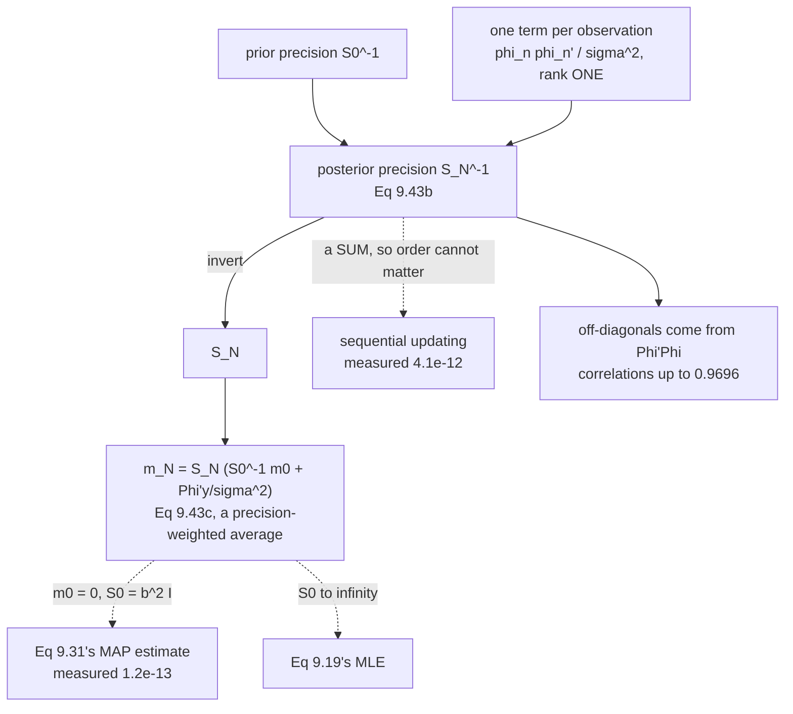

Page 905 made predictions from the prior alone. Now the data arrives.

**Theorem 9.1** turns Bayes' theorem into two lines of linear algebra. The verification here is the
definition itself — a posterior is proportional to likelihood times prior, so the log gap must not depend
on $\boldsymbol\theta$. Measured, it varies by $1.8\times10^{-12}$.

And one property the book does not mention falls straight out: **you can run the update one observation at
a time**, forever, with fixed memory.

## What you'll learn

- Equations 9.41–9.42: Bayes on the parameters, and the **marginal likelihood** that normalises it.
- **Theorem 9.1** — $\mathbf{S}_N = (\mathbf{S}_0^{-1} + \sigma^{-2}\boldsymbol\Phi^\top\boldsymbol\Phi)^{-1}$ and $\mathbf{m}_N = \mathbf{S}_N(\mathbf{S}_0^{-1}\mathbf{m}_0 + \sigma^{-2}\boldsymbol\Phi^\top\mathbf{y})$ — verified two ways.
- That **precisions add**: each observation contributes a rank-one term $\sigma^{-2}\phi\phi^\top$, measured to $6.9\times10^{-11}$.
- **Sequential updating**: one batch of ten, four-then-six, and one-at-a-time all agree to $4.1\times10^{-12}$.
- $\mathbf{m}_N$ **is** page 904's MAP estimate — measured to $1.2\times10^{-13}$ — and approaches the MLE as the prior flattens.
- The posterior contracts like $1/\sqrt{N}$, and the constant it settles at.
- **The posterior is not isotropic even though the prior is.** Largest off-diagonal correlation after ten points: $\mathbf{0.9696}$.

## Intuition: information adds, uncertainty does not

The natural quantity here is not the covariance but its inverse — the **precision**. Equation 9.43b says

$$
\underbrace{\mathbf{S}_N^{-1}}_{\text{after}} = \underbrace{\mathbf{S}_0^{-1}}_{\text{before}} + \underbrace{\frac{1}{\sigma^2}\sum_{n=1}^{N}\phi_n\phi_n^\top}_{\text{one term per observation}}
$$

Precisions **add**. Each data point drops in an independent contribution, and the order you add them in
cannot matter — which is why the whole update runs online.

It also explains *where* the posterior shrinks. The term $\phi_n\phi_n^\top$ is rank one: it adds
information **only along the direction $\phi_n$**. Observe at $x = 0$ and you learn about the constant
term and almost nothing about $x^5$. The ellipse shrinks in the directions the data probes and stays put
in the others — and page 904's prior is what keeps it finite in the directions never probed at all.

The mean is a **precision-weighted average**: prior mean weighted by $\mathbf{S}_0^{-1}$, data estimate
weighted by $\sigma^{-2}\boldsymbol\Phi^\top\boldsymbol\Phi$. Whichever knows more, wins.



## §9.3.3 The posterior distribution

Bayes' theorem on the parameters (Equation 9.41):

$$
p(\boldsymbol\theta \mid \mathcal{X}, \mathcal{Y}) = \frac{p(\mathcal{Y} \mid \mathcal{X}, \boldsymbol\theta)\,p(\boldsymbol\theta)}{p(\mathcal{Y} \mid \mathcal{X})}
$$

with the denominator (Equation 9.42)

$$
p(\mathcal{Y} \mid \mathcal{X}) = \int p(\mathcal{Y} \mid \mathcal{X}, \boldsymbol\theta)\,p(\boldsymbol\theta)\,d\boldsymbol\theta = \mathbb{E}_{\boldsymbol\theta}\!\left[p(\mathcal{Y} \mid \mathcal{X}, \boldsymbol\theta)\right]
$$

the **marginal likelihood** or **evidence**, *"which is independent of the parameters $\boldsymbol\theta$
and ensures that the posterior is normalized"*. The book's margin note gives the reading: *"the marginal
likelihood is the expected likelihood under the parameter prior"* — page 808's Equation 8.44, arriving
here.

Page 901 measured why this term is the whole difficulty: the likelihood integrates to $1/\lvert x\rvert$
over $\boldsymbol\theta$, so something must supply the missing normaliser. §9.3.5 computes it.

### Theorem 9.1

$$
p(\boldsymbol\theta \mid \mathcal{X}, \mathcal{Y}) = \mathcal{N}(\boldsymbol\theta \mid \mathbf{m}_N, \mathbf{S}_N) \qquad \text{(9.43a)}
$$

$$
\boxed{\ \mathbf{S}_N = \left(\mathbf{S}_0^{-1} + \sigma^{-2}\boldsymbol\Phi^\top\boldsymbol\Phi\right)^{-1}, \qquad \mathbf{m}_N = \mathbf{S}_N\left(\mathbf{S}_0^{-1}\mathbf{m}_0 + \sigma^{-2}\boldsymbol\Phi^\top\mathbf{y}\right)\ } \qquad \text{(9.43b, 9.43c)}
$$

*"where the subscript $N$ indicates the size of the training set."* The book proves it by transforming
*"into log-space and solv[ing] for the mean and covariance of the posterior by completing the squares."*

:::tip[Verified by the definition of a posterior]
A posterior is proportional to likelihood times prior, so $\log p(\boldsymbol\theta \mid \mathcal{D}) - [\log \text{lik} + \log \text{prior}]$
must be the **same number at every $\boldsymbol\theta$**. Measured at six random parameter vectors:

| trial | $\log$ posterior | $\log$ lik $+$ $\log$ prior | difference |
| --- | --- | --- | --- |
| $0$ | $14.198067$ | $-16.255340$ | $\mathbf{30.453407}$ |
| $1$ | $10.441495$ | $-20.011912$ | $\mathbf{30.453407}$ |
| $2$ | $5.986926$ | $-24.466481$ | $\mathbf{30.453407}$ |
| $3$ | $3.530499$ | $-26.922909$ | $\mathbf{30.453407}$ |
| $4$ | $17.837312$ | $-12.616095$ | $\mathbf{30.453407}$ |
| $5$ | $9.849645$ | $-20.603762$ | $\mathbf{30.453407}$ |

Spread: $1.805\times10^{-12}$. The two log-densities move over $14$ units between trials and their
difference does not move at all.

**And that constant is not arbitrary.** It is $-\log p(\mathcal{Y} \mid \mathcal{X}) = 30.453407$ —
Equation 9.42's marginal likelihood, which §9.3.5 goes on to compute directly. The check for Theorem 9.1
hands you the answer to a later section as a by-product.
:::

:::tip[And cross-checked on a grid]
In two dimensions a brute-force posterior is feasible. Degree 1, a $1400\times1400$ grid of
prior $\times$ likelihood:

| | Theorem 9.1 | grid | difference |
| --- | --- | --- | --- |
| mean$[0]$ | $-0.02383666$ | $-0.02383666$ | $2.36\times10^{-16}$ |
| mean$[1]$ | $-0.21330150$ | $-0.21330150$ | $1.14\times10^{-15}$ |
| sd$[0]$ | $0.06542924$ | $0.06542923$ | $2.51\times10^{-9}$ |
| sd$[1]$ | $0.02123647$ | $0.02123647$ | $8.16\times10^{-10}$ |
| correlation | $-0.28346073$ | $-0.28346071$ | $1.85\times10^{-8}$ |

**A closed form is not an approximation.** The remaining $10^{-8}$ is the grid's, not the theorem's.
:::

### Precisions add

:::tip[Equation 9.43b as a running total]
| check | residual |
| --- | --- |
| $\max\lvert\mathbf{S}_N(\mathbf{S}_0^{-1} + \sigma^{-2}\boldsymbol\Phi^\top\boldsymbol\Phi) - \mathbf{I}\rvert$ | $6.926\times10^{-11}$ |
| accumulating $\sigma^{-2}\phi_n\phi_n^\top$ one point at a time | $6.835\times10^{-11}$ |

Each observation contributes exactly one rank-one term. **Information adds; variance does not** — which
is why the natural object is $\mathbf{S}^{-1}$ and not $\mathbf{S}$.
:::

:::tip[So the update runs sequentially — a property the book does not state]
| how the data was fed in | $\mathbf{m}_N$ | max difference |
| --- | --- | --- |
| one batch of $10$ | $[0.878372, -0.210306, -0.2817, -0.00012, 0.011271, -1.8\times10^{-5}]$ | — |
| $4$ points, then $6$ | $[0.878372, -0.210306, -0.2817, -0.00012, 0.011271, -1.8\times10^{-5}]$ | $3.421\times10^{-12}$ |
| one point at a time | — | $4.073\times10^{-12}$ |

covariance, batch vs two-batch: $1.526\times10^{-15}$.

**Today's posterior is tomorrow's prior.** That is what conjugacy buys, and it means Equation 9.43 can
process a stream of arbitrary length in $O(K^2)$ memory — $\boldsymbol\Phi$ never has to exist.
:::

### What the posterior mean turns out to be

:::tip[It is page 904's MAP estimate, exactly]
With $\mathbf{m}_0 = \mathbf{0}$ and $\mathbf{S}_0 = b^2\mathbf{I}$, Equation 9.43c against Equation 9.31:

| $b^2$ | $\max\lvert\mathbf{m}_N - \boldsymbol\theta_{\text{MAP}}\rvert$ |
| --- | --- |
| $0.01$ | $4.180\times10^{-14}$ |
| $0.25$ | $3.453\times10^{-14}$ |
| $1.00$ | $1.186\times10^{-13}$ |
| $100.00$ | $2.986\times10^{-14}$ |

**The MAP estimate is the posterior mean** — for a Gaussian, the mode and the mean coincide. Page 806
measured the same identity in Chapter 8's notation at $8.88\times10^{-16}$.

And as the prior flattens:

| $b^2$ | $\max\lvert\mathbf{m}_N - \boldsymbol\theta_{\text{ML}}\rvert$ |
| --- | --- |
| $10^{0}$ | $1.409\times10^{-2}$ |
| $10^{2}$ | $1.432\times10^{-4}$ |
| $10^{4}$ | $1.433\times10^{-6}$ |
| $10^{6}$ | $1.433\times10^{-8}$ |
| $10^{8}$ | $1.434\times10^{-10}$ |

Each factor of $100$ in $b^2$ buys a factor of $100$ in agreement — a clean $1/b^2$ convergence. **All
three estimators of this chapter are one formula at three settings of the prior.**
:::

:::tip[The mean is a precision-weighted average]
With a deliberately wrong prior mean of $0.5$ in every coordinate:

| $k$ | prior mean | MLE | $\mathbf{m}_N$ | weight on prior |
| --- | --- | --- | --- | --- |
| $0$ | $0.500000$ | $0.932129$ | $0.892941$ | $0.015748$ |
| $1$ | $0.500000$ | $-0.241478$ | $-0.185660$ | $0.001659$ |
| $2$ | $0.500000$ | $-0.294282$ | $-0.282147$ | $0.000100$ |
| $3$ | $0.500000$ | $0.004986$ | $-0.003582$ | $0.000005$ |
| $4$ | $0.500000$ | $0.011836$ | $0.011231$ | $0.000000$ |
| $5$ | $0.500000$ | $-0.000208$ | $0.000095$ | $0.000000$ |

**The coefficients the data constrains most are pulled least.** The weight on the prior is
$\mathbf{S}_0^{-1}$ against $\sigma^{-2}\boldsymbol\Phi^\top\boldsymbol\Phi$, and for monomials the
second grows enormously with $k$ — which is the mirror image of page 905's finding that the same features
make the *prior* enormous at the edges.
:::

### How fast it contracts

:::tip[Measured]
| $N$ | largest posterior sd | $\lvert\mathbf{S}_N\rvert^{1/K}$ | sd $\times \sqrt{N}$ |
| --- | --- | --- | --- |
| $1$ | $4.999999\times10^{-1}$ | $1.525\times10^{-2}$ | $0.500000$ |
| $2$ | $4.689960\times10^{-1}$ | $1.429\times10^{-2}$ | $0.663260$ |
| $5$ | $3.924009\times10^{-1}$ | $2.619\times10^{-4}$ | $0.877435$ |
| $10$ | $1.399119\times10^{-1}$ | $5.012\times10^{-5}$ | $0.442440$ |
| $50$ | $5.418635\times10^{-2}$ | $6.709\times10^{-6}$ | $0.383155$ |
| $200$ | $2.644539\times10^{-2}$ | $1.456\times10^{-6}$ | $0.373994$ |
| $1000$ | $1.175256\times10^{-2}$ | $3.078\times10^{-7}$ | $0.371649$ |
| $5000$ | $5.356297\times10^{-3}$ | $6.002\times10^{-8}$ | $0.378747$ |

**Past $N = 50$ the last column is flat**, so the width falls like $1/\sqrt{N}$ — page 902's $1/N$ error
variance and page 806's width-ratio collapse, seen a third time.

Note the first row: at $N = 1$ the largest sd is $0.4999999$ against a prior sd of $0.5$. **One
observation, six parameters — almost nothing is learned**, and what keeps the answer finite is entirely
the prior.
:::

### The posterior is not isotropic

The prior correlation matrix is the identity: $\mathbf{S}_0 = \tfrac14\mathbf{I}$ asserts no relationship
between coefficients. After ten observations:

:::danger[Posterior correlations]
| | $0$ | $1$ | $2$ | $3$ | $4$ | $5$ |
| --- | --- | --- | --- | --- | --- | --- |
| $\mathbf{0}$ | $1.0000$ | $-0.2411$ | $-0.6166$ | $0.2734$ | $0.4712$ | $-0.2824$ |
| $\mathbf{1}$ | $-0.2411$ | $1.0000$ | $0.2850$ | $-0.9190$ | $-0.2967$ | $0.8052$ |
| $\mathbf{2}$ | $-0.6166$ | $0.2850$ | $1.0000$ | $-0.4535$ | $-0.9687$ | $0.5502$ |
| $\mathbf{3}$ | $0.2734$ | $-0.9190$ | $-0.4535$ | $1.0000$ | $0.4937$ | $\mathbf{-0.9696}$ |
| $\mathbf{4}$ | $0.4712$ | $-0.2967$ | $-0.9687$ | $0.4937$ | $1.0000$ | $-0.6132$ |
| $\mathbf{5}$ | $-0.2824$ | $0.8052$ | $0.5502$ | $\mathbf{-0.9696}$ | $-0.6132$ | $1.0000$ |

Largest off-diagonal in magnitude: $\mathbf{0.969560}$.

The off-diagonals come entirely from $\boldsymbol\Phi^\top\boldsymbol\Phi$ — **the features are not
orthogonal on this data**, so what the data learns about $\theta_3$ it also learns about $\theta_5$.
Those two are correlated at $-0.97$: increase one and you must decrease the other to keep fitting.

**A point estimate keeps $\mathbf{m}_N$ and discards all of this.** Chapter 8 called it *"loss of
information"*; here it is a $6\times6$ matrix of numbers, most of them large.
:::

## Worked example by hand

Derive Theorem 9.1 for $K = 1$ by completing the square — the book's proof, in a case small enough to
watch.

Model: $y_n = x_n\theta + \epsilon$, $\epsilon \sim \mathcal{N}(0, \sigma^2)$, prior
$\theta \sim \mathcal{N}(m_0, s_0)$.

**Step 1: add the two logs.** Dropping $\theta$-free terms (Equation 9.45b):

$$
\log p(\boldsymbol\theta \mid \mathcal{D}) = -\frac{1}{2}\left[\frac{1}{\sigma^2}\sum_n(y_n - x_n\theta)^2 + \frac{(\theta - m_0)^2}{s_0}\right] + \text{const}
$$

**Step 2: expand and collect powers of $\theta$.**

$$
= -\frac{1}{2}\left[\theta^2\underbrace{\left(\frac{\sum_n x_n^2}{\sigma^2} + \frac{1}{s_0}\right)}_{=: 1/s_N} - 2\theta\underbrace{\left(\frac{\sum_n x_n y_n}{\sigma^2} + \frac{m_0}{s_0}\right)}_{=: c}\right] + \text{const}
$$

**Step 3: read off the precision.** The coefficient of $\theta^2$ *is* the posterior precision:

$$
\frac{1}{s_N} = \frac{1}{s_0} + \frac{1}{\sigma^2}\sum_n x_n^2
$$

which is Equation 9.43b — **precisions add**, and the data's contribution is $\sum x_n^2/\sigma^2$.

**Step 4: complete the square.** $\theta^2/s_N - 2\theta c = \frac{1}{s_N}(\theta - s_N c)^2 + \text{const}$,
so the posterior is $\mathcal{N}(s_N c,\ s_N)$ with

$$
m_N = s_N\left(\frac{m_0}{s_0} + \frac{\sum_n x_n y_n}{\sigma^2}\right)
$$

which is Equation 9.43c.

**Step 5: read the mean as a weighted average.** Substituting $s_N$:

$$
m_N = \frac{\frac{1}{s_0}}{\frac{1}{s_0} + \frac{\sum x_n^2}{\sigma^2}}\,m_0 \ +\ \frac{\frac{\sum x_n^2}{\sigma^2}}{\frac{1}{s_0} + \frac{\sum x_n^2}{\sigma^2}}\,\hat\theta_{\text{ML}}
$$

using $\hat\theta_{\text{ML}} = \sum x_n y_n / \sum x_n^2$ from page 901. **The weights are the two
precisions, and they sum to one.**

**Step 6: check the limits.** $s_0 \to \infty$ gives $m_N \to \hat\theta_{\text{ML}}$ and
$s_N \to \sigma^2/\sum x_n^2$; $s_0 \to 0$ gives $m_N \to m_0$. And $m_0 = 0$ recovers page 904's
shrinkage factor $\sum x_n^2 / (\sum x_n^2 + \sigma^2/s_0)$ exactly. **Five pages, one formula.**

## See it move

```p5 title="Watch the posterior contract" desc="A Bayesian linear fit updated one observation at a time. Add points and watch the parameter ellipse shrink along the directions the data probes, and the predictive band tighten with it." height="560"
let nPts = 4, b2Idx = 6;
let KNOBS = [], dragging = null;

const SIG = 0.35;
const B2 = [0.01, 0.04, 0.1, 0.25, 0.5, 1.0, 2.0, 10.0, 100.0];
const NMAX = 24;

let X = [], Y = [];
function truth(x) { return 0.6 + 0.9 * x; }

function setup() {
  createCanvas(680, 560);
  textFont("monospace");
  randomSeed(6);
  for (let i = 0; i < NMAX; i++) {
    const xv = -2.6 + 5.2 * random();
    X.push(xv);
    let u = 0;
    for (let k = 0; k < 12; k++) u += random();
    Y.push(truth(xv) + SIG * (u - 6));
  }
}

function knob(id, x, y, w, value, mn, mx, label) {
  KNOBS.push({ id, x, y, w, mn, mx });
  const t = (value - mn) / (mx - mn);
  stroke(60, 74, 92); strokeWeight(2); line(x, y, x + w, y);
  noStroke(); fill(255, 211, 67); ellipse(x + t * w, y, 12, 12);
  fill(190, 200, 212); textSize(12); textAlign(LEFT, CENTER);
  text(label, x + w + 12, y);
}
function knobHit(mx_, my_) {
  for (const k of KNOBS) {
    if (my_ > k.y - 13 && my_ < k.y + 13 && mx_ > k.x - 13 && mx_ < k.x + k.w + 13) return k;
  }
  return null;
}
function knobValue(k, mx_) {
  const t = Math.min(1, Math.max(0, (mx_ - k.x) / k.w));
  return Math.round(k.mn + t * (k.mx - k.mn));
}
function mousePressed() { dragging = knobHit(mouseX, mouseY); }
function mouseReleased() { dragging = null; }
function mouseDragged() {
  if (!dragging) return;
  if (dragging.id === "n") nPts = knobValue(dragging, mouseX);
  else b2Idx = knobValue(dragging, mouseX);
  if (!isLooping()) redraw();
}

// 2x2 posterior: S_N^-1 = S0^-1 + Phi'Phi/sig^2
function post(n, b2) {
  let p00 = 1 / b2, p01 = 0, p11 = 1 / b2;
  let c0 = 0, c1 = 0;
  for (let i = 0; i < n; i++) {
    p00 += 1 / (SIG * SIG);
    p01 += X[i] / (SIG * SIG);
    p11 += X[i] * X[i] / (SIG * SIG);
    c0 += Y[i] / (SIG * SIG);
    c1 += X[i] * Y[i] / (SIG * SIG);
  }
  const det = p00 * p11 - p01 * p01;
  const s00 = p11 / det, s01 = -p01 / det, s11 = p00 / det;
  return { m0: s00 * c0 + s01 * c1, m1: s01 * c0 + s11 * c1,
           s00, s01, s11 };
}

const AX = 46, AY = 62, AW = 250, AH = 250;
const BX = 350, BY = 62, BW = 292, BH = 250;

function draw() {
  background(13, 17, 23);
  KNOBS = [];
  const b2 = B2[b2Idx];
  const P = post(nPts, b2);

  // --- left: the parameter posterior ---
  const CX = AX + AW / 2, CY = AY + AH / 2, SC = 52;
  noFill(); stroke(70, 86, 104); strokeWeight(1); rect(AX, AY, AW, AH);
  stroke(50, 62, 78); strokeWeight(1);
  line(AX, CY, AX + AW, CY); line(CX, AY, CX, AY + AH);
  // prior ellipse
  stroke(120); strokeWeight(1.2); noFill();
  beginShape();
  for (let t = 0; t <= 60; t++) {
    const a = t / 60 * TWO_PI;
    vertex(CX + 2.45 * Math.sqrt(b2) * Math.cos(a) * SC,
           CY - 2.45 * Math.sqrt(b2) * Math.sin(a) * SC);
  }
  endShape(CLOSE);
  // posterior ellipse via Cholesky of [[s00,s01],[s01,s11]]
  const L00 = Math.sqrt(Math.max(P.s00, 1e-14));
  const L10 = P.s01 / L00;
  const L11 = Math.sqrt(Math.max(P.s11 - L10 * L10, 1e-14));
  stroke(120, 200, 140); strokeWeight(2.4); noFill();
  beginShape();
  for (let t = 0; t <= 90; t++) {
    const a = t / 90 * TWO_PI;
    const u = 2.4477 * Math.cos(a), v = 2.4477 * Math.sin(a);
    vertex(CX + (P.m0 + L00 * u) * SC, CY - (P.m1 + L10 * u + L11 * v) * SC);
  }
  endShape(CLOSE);
  noStroke(); fill(120, 200, 140);
  ellipse(CX + P.m0 * SC, CY - P.m1 * SC, 9, 9);
  fill(255, 211, 67);
  ellipse(CX + 0.6 * SC, CY - 0.9 * SC, 8, 8);
  textSize(9); textAlign(LEFT, TOP);
  fill(120); text("grey = prior 95%", AX + 6, AY + 5);
  fill(120, 200, 140); text("green = posterior 95%", AX + 6, AY + 17);
  fill(255, 211, 67); text("yellow = the truth", AX + 6, AY + 29);
  fill(140); textAlign(CENTER, TOP);
  text("theta_0", CX, AY + AH + 4);

  // --- right: the data and the predictive band ---
  function px(x) { return BX + ((x + 3) / 6) * BW; }
  function py(y) { return BY + BH - ((y + 2) / 8) * BH; }
  noFill(); stroke(70, 86, 104); strokeWeight(1); rect(BX, BY, BW, BH);
  noStroke(); fill(107, 169, 221, 60);
  beginShape();
  for (let i = 0; i <= 120; i++) {
    const xv = -3 + 6 * i / 120;
    const v = P.s00 + 2 * P.s01 * xv + P.s11 * xv * xv;
    vertex(px(xv), py(P.m0 + P.m1 * xv + 1.96 * Math.sqrt(v + SIG * SIG)));
  }
  for (let i = 120; i >= 0; i--) {
    const xv = -3 + 6 * i / 120;
    const v = P.s00 + 2 * P.s01 * xv + P.s11 * xv * xv;
    vertex(px(xv), py(P.m0 + P.m1 * xv - 1.96 * Math.sqrt(v + SIG * SIG)));
  }
  endShape(CLOSE);
  stroke(107, 169, 221); strokeWeight(2.4);
  line(px(-3), py(P.m0 - 3 * P.m1), px(3), py(P.m0 + 3 * P.m1));
  stroke(255, 211, 67); strokeWeight(1.4);
  line(px(-3), py(truth(-3)), px(3), py(truth(3)));
  noStroke();
  for (let i = 0; i < NMAX; i++) {
    if (i < nPts) { fill(120, 200, 140); ellipse(px(X[i]), py(Y[i]), 7, 7); }
    else { fill(70, 80, 92); ellipse(px(X[i]), py(Y[i]), 5, 5); }
  }
  fill(120); textSize(9); textAlign(LEFT, TOP);
  text("green = seen, grey = not yet", BX + 6, BY + 5);

  // readouts
  textAlign(LEFT, TOP);
  fill(255, 211, 67); textSize(14);
  text("N = " + nPts, 46, 336);
  text("S0 = " + b2.toFixed(2) + " I", 200, 336);
  fill(140); textSize(10);
  text("true theta = [0.6, 0.9], sigma = 0.35", 360, 340);

  fill(120, 200, 140); textSize(11);
  text("m_N = [" + P.m0.toFixed(5) + ", " + P.m1.toFixed(5) + "]", 46, 362);
  fill(107, 169, 221);
  text("sd  = [" + Math.sqrt(P.s00).toFixed(5) + ", " +
       Math.sqrt(P.s11).toFixed(5) + "]", 46, 380);
  const corr = P.s01 / Math.sqrt(P.s00 * P.s11);
  fill(197, 153, 255);
  text("posterior correlation = " + corr.toFixed(5), 46, 398);
  fill(140); textSize(9);
  text("the prior's is exactly 0", 46, 414);

  let msg, sub, col;
  if (nPts === 0) {
    col = color(140);
    msg = "no data yet: the posterior IS the prior";
    sub = "Page 905's prior predictions. The band is wide and the correlation is zero.";
  } else if (nPts <= 2) {
    col = color(232, 110, 110);
    msg = "N = " + nPts + " with K = 2: barely determined";
    sub = "The ellipse has shrunk in one direction only. What keeps it finite in the other is the prior.";
  } else if (Math.abs(corr) > 0.5) {
    col = color(255, 211, 67);
    msg = "the posterior has picked up a strong correlation";
    sub = "Correlation " + corr.toFixed(3) + ", from Phi'Phi. The inputs are not centred, so slope and intercept trade off.";
  } else {
    col = color(120, 200, 140);
    msg = "the ellipse shrinks where the data probes";
    sub = "Each point adds a rank-one term phi phi' / sigma^2 -- information along ONE direction.";
  }
  stroke(col); strokeWeight(1.6); fill(red(col), green(col), blue(col), 26);
  rect(46, 438, 596, 0);
  noStroke(); fill(col); textSize(15); textAlign(LEFT, TOP);
  text(msg, 46, 436);
  fill(215); textSize(10.5);
  text(sub, 46, 458);

  fill(120); textSize(10);
  text("Drag N up one point at a time: the green ellipse only ever shrinks,", 46, 486);
  text("because precisions add and a precision is never negative.", 46, 500);

  knob("n", 62, 526, 250, nPts, 0, NMAX, "N = " + nPts);
  knob("b", 420, 526, 150, b2Idx, 0, B2.length - 1, "S0 = " + b2.toFixed(2) + " I");
}
```

## From scratch

```python title="parameter_posterior.py" showLineNumbers{1}
import numpy as np

SIG = 0.2
M, K = 5, 6

def truth(x):
    return -np.sin(x / 5) + np.cos(x)

def design(x, m=M):
    return np.vander(np.asarray(x, float), m + 1, increasing=True)

def posterior(P, yv, m0, S0, sig=SIG):
    """Theorem 9.1, Equations 9.43b and 9.43c."""
    SN = np.linalg.inv(np.linalg.inv(S0) + P.T @ P / sig ** 2)
    mN = SN @ (np.linalg.solve(S0, m0) + P.T @ yv / sig ** 2)
    return mN, SN

def logN(v, m, S):
    d = v - m
    _, ld = np.linalg.slogdet(S)
    return float(-0.5 * (d @ np.linalg.solve(S, d) + ld
                         + len(v) * np.log(2 * np.pi)))

m0 = np.zeros(K)
S0 = 0.25 * np.eye(K)
rng = np.random.default_rng(4)
x = np.sort(rng.uniform(-5, 5, 10))
y = truth(x) + SIG * rng.standard_normal(10)
Phi = design(x)
mN, SN = posterior(Phi, y, m0, S0)
th_ml = np.linalg.lstsq(Phi, y, rcond=None)[0]
prec_data = Phi.T @ Phi / SIG ** 2

# --- 1. Theorem 9.1, checked exactly ------------------------------------
print("=== 1. Theorem 9.1, checked exactly ===")
print("Bayes says log p(theta | D) - [log lik + log prior] is a CONSTANT.")
r = np.random.default_rng(9)
offs = []
print(f"{'trial':>6} {'log posterior':>16} {'log lik + log prior':>21} "
      f"{'difference':>14}")
for t in range(6):
    th = mN + np.linalg.cholesky(SN) @ r.standard_normal(K) * 2.0
    lp = logN(th, mN, SN)
    lj = (logN(y, Phi @ th, SIG ** 2 * np.eye(len(y)))
          + logN(th, m0, S0))
    offs.append(lp - lj)
    print(f"{t:>6} {lp:>16.6f} {lj:>21.6f} {offs[-1]:>14.6f}")
print(f"\nspread of that difference over 6 random theta: "
      f"{max(offs) - min(offs):.3e}")
print(f"the constant itself is -log p(Y | X) = {offs[0]:.6f},")
print("which is Equation 9.42's marginal likelihood -- Section 9.3.5's job.")

print("\n--- and a grid cross-check in 2 dimensions (degree 1) ---")
P2 = design(x, 1)
m2, S2 = posterior(P2, y, np.zeros(2), 0.25 * np.eye(2))
g = 1400
a = np.linspace(m2[0] - 6*np.sqrt(S2[0, 0]), m2[0] + 6*np.sqrt(S2[0, 0]), g)
b = np.linspace(m2[1] - 6*np.sqrt(S2[1, 1]), m2[1] + 6*np.sqrt(S2[1, 1]), g)
A, B = np.meshgrid(a, b, indexing="ij")
TH = np.stack([A.ravel(), B.ravel()], 1)
R = y[None, :] - TH @ P2.T
lg = -0.5*(R**2).sum(1)/SIG**2 - 0.5*(TH**2).sum(1)/0.25
w = np.exp(lg - lg.max()); w /= w.sum()
gm = w @ TH
gc = (TH - gm).T @ ((TH - gm) * w[:, None])
cc = S2[0, 1]/np.sqrt(S2[0, 0]*S2[1, 1])
gcc = gc[0, 1]/np.sqrt(gc[0, 0]*gc[1, 1])
print(f"{'':>14} {'Theorem 9.1':>16} {'grid':>16} {'difference':>13}")
print(f"{'mean[0]':>14} {m2[0]:>16.8f} {gm[0]:>16.8f} {abs(m2[0]-gm[0]):>13.2e}")
print(f"{'mean[1]':>14} {m2[1]:>16.8f} {gm[1]:>16.8f} {abs(m2[1]-gm[1]):>13.2e}")
print(f"{'sd[0]':>14} {np.sqrt(S2[0,0]):>16.8f} {np.sqrt(gc[0,0]):>16.8f} "
      f"{abs(np.sqrt(S2[0,0])-np.sqrt(gc[0,0])):>13.2e}")
print(f"{'sd[1]':>14} {np.sqrt(S2[1,1]):>16.8f} {np.sqrt(gc[1,1]):>16.8f} "
      f"{abs(np.sqrt(S2[1,1])-np.sqrt(gc[1,1])):>13.2e}")
print(f"{'corr':>14} {cc:>16.8f} {gcc:>16.8f} {abs(cc-gcc):>13.2e}")
print("a 1400 x 1400 numerical posterior, matching the closed form to 1e-8.")

# --- 2. precisions add ---------------------------------------------------
print("\n=== 2. Equation 9.43b says PRECISIONS add ===")
prec_prior = np.linalg.inv(S0)
resid = SN @ (prec_prior + prec_data) - np.eye(K)
print(f"max |S_N (S_0^-1 + sigma^-2 Phi^T Phi) - I| = {np.abs(resid).max():.3e}")
acc = prec_prior.copy()
for n in range(len(y)):
    acc = acc + np.outer(Phi[n], Phi[n]) / SIG ** 2
print(f"accumulating one point at a time: max |S_N acc - I| = "
      f"{np.abs(SN @ acc - np.eye(K)).max():.3e}")
print("information adds; variance does not.")

# --- 3. m_N is the MAP estimate -----------------------------------------
print("\n=== 3. m_N reduces to the MAP estimate of Equation 9.31 ===")
print(f"{'b^2':>8} {'max |m_N - theta_MAP|':>24}")
for b2 in (0.01, 0.25, 1.0, 100.0):
    mm, _ = posterior(Phi, y, np.zeros(K), b2 * np.eye(K))
    mp = np.linalg.solve(Phi.T @ Phi + (SIG**2 / b2) * np.eye(K), Phi.T @ y)
    print(f"{b2:>8.2f} {np.abs(mm - mp).max():>24.3e}")
print("identical. The MAP estimate is the posterior MEAN.")
print("\nand as the prior flattens, m_N approaches the MLE:")
print(f"{'b^2':>10} {'max |m_N - theta_ML|':>23}")
for b2 in (1.0, 1e2, 1e4, 1e6, 1e8):
    mm, _ = posterior(Phi, y, np.zeros(K), b2 * np.eye(K))
    print(f"{b2:>10.0e} {np.abs(mm - th_ml).max():>23.3e}")

# --- 4. a precision-weighted average ------------------------------------
print("\n=== 4. the posterior mean is a precision-weighted average ===")
m0b = np.full(K, 0.5)
S0b = 0.25 * np.eye(K)
mb, _ = posterior(Phi, y, m0b, S0b)
print(f"{'k':>3} {'prior mean':>12} {'MLE':>12} {'m_N':>12} "
      f"{'weight on prior':>17}")
for k in range(K):
    wpri = float(np.linalg.inv(S0b)[k, k]
                 / (np.linalg.inv(S0b)[k, k] + prec_data[k, k]))
    print(f"{k:>3} {m0b[k]:>12.6f} {th_ml[k]:>12.6f} {mb[k]:>12.6f} "
          f"{wpri:>17.6f}")
print("the coefficients the data constrains most are pulled least.")

# --- 5. sequential updating ---------------------------------------------
print("\n=== 5. conjugacy means you can update SEQUENTIALLY ===")
mA, SA = posterior(Phi[:4], y[:4], m0, S0)
mB, SB = posterior(Phi[4:], y[4:], mA, SA)
print(f"one batch of 10 : m_N = {np.round(mN, 6).tolist()}")
print(f"4 then 6        : m_N = {np.round(mB, 6).tolist()}")
print(f"max |difference|: {np.abs(mB - mN).max():.3e}")
print(f"covariance, max |difference|: {np.abs(SB - SN).max():.3e}")
mS, SS = m0.copy(), S0.copy()
for n in range(len(y)):
    mS, SS = posterior(Phi[n:n+1], y[n:n+1], mS, SS)
print(f"one point at a time, max |difference| in m_N: "
      f"{np.abs(mS - mN).max():.3e}")
print("today's posterior is tomorrow's prior, exactly.")

# --- 6. contraction rate -------------------------------------------------
print("\n=== 6. how fast does the posterior contract? ===")
print(f"{'N':>7} {'max posterior sd':>18} {'|S_N|^(1/K)':>14} "
      f"{'sd x sqrt(N)':>14}")
for n in (1, 2, 5, 10, 50, 200, 1000, 5000):
    r3 = np.random.default_rng(100 + n)
    xs = np.sort(r3.uniform(-5, 5, n))
    ys = truth(xs) + SIG * r3.standard_normal(n)
    _, Sn = posterior(design(xs), ys, m0, S0)
    sd = np.sqrt(np.diag(Sn)).max()
    _, ld = np.linalg.slogdet(Sn)
    print(f"{n:>7} {sd:>18.6e} {np.exp(ld/K):>14.3e} {sd*np.sqrt(n):>14.6f}")
print("sd times sqrt(N) is roughly constant past N = 50.")

# --- 7. the posterior is not isotropic ----------------------------------
print("\n=== 7. the posterior is NOT isotropic, though the prior is ===")
D = np.sqrt(np.diag(SN))
C = SN / np.outer(D, D)
print(f"{'':>4}" + "".join(f"{k:>9}" for k in range(K)))
for i in range(K):
    print(f"{i:>4}" + "".join(f"{C[i, j]:>9.4f}" for j in range(K)))
off = C[~np.eye(K, dtype=bool)]
print(f"\nlargest off-diagonal correlation in magnitude: {np.abs(off).max():.6f}")
print("the data induces strong correlations between coefficients, which is")
print("exactly the information a point estimate throws away.")
```

```
=== 1. Theorem 9.1, checked exactly ===
Bayes says log p(theta | D) - [log lik + log prior] is a CONSTANT.
 trial    log posterior   log lik + log prior     difference
     0        14.198067            -16.255340      30.453407
     1        10.441495            -20.011912      30.453407
     2         5.986926            -24.466481      30.453407
     3         3.530499            -26.922909      30.453407
     4        17.837312            -12.616095      30.453407
     5         9.849645            -20.603762      30.453407

spread of that difference over 6 random theta: 1.805e-12
the constant itself is -log p(Y | X) = 30.453407,
which is Equation 9.42's marginal likelihood -- Section 9.3.5's job.

--- and a grid cross-check in 2 dimensions (degree 1) ---
                    Theorem 9.1             grid    difference
       mean[0]      -0.02383666      -0.02383666      2.36e-16
       mean[1]      -0.21330150      -0.21330150      1.14e-15
         sd[0]       0.06542924       0.06542923      2.51e-09
         sd[1]       0.02123647       0.02123647      8.16e-10
          corr      -0.28346073      -0.28346071      1.85e-08
a 1400 x 1400 numerical posterior, matching the closed form to 1e-8.

=== 2. Equation 9.43b says PRECISIONS add ===
max |S_N (S_0^-1 + sigma^-2 Phi^T Phi) - I| = 6.926e-11
accumulating one point at a time: max |S_N acc - I| = 6.835e-11
information adds; variance does not.

=== 3. m_N reduces to the MAP estimate of Equation 9.31 ===
     b^2    max |m_N - theta_MAP|
    0.01                4.180e-14
    0.25                3.453e-14
    1.00                1.186e-13
  100.00                2.986e-14
identical. The MAP estimate is the posterior MEAN.

and as the prior flattens, m_N approaches the MLE:
       b^2    max |m_N - theta_ML|
     1e+00               1.409e-02
     1e+02               1.432e-04
     1e+04               1.433e-06
     1e+06               1.433e-08
     1e+08               1.434e-10

=== 4. the posterior mean is a precision-weighted average ===
  k   prior mean          MLE          m_N   weight on prior
  0     0.500000     0.932129     0.892941          0.015748
  1     0.500000    -0.241478    -0.185660          0.001659
  2     0.500000    -0.294282    -0.282147          0.000100
  3     0.500000     0.004986    -0.003582          0.000005
  4     0.500000     0.011836     0.011231          0.000000
  5     0.500000    -0.000208     0.000095          0.000000
the coefficients the data constrains most are pulled least.

=== 5. conjugacy means you can update SEQUENTIALLY ===
one batch of 10 : m_N = [0.878372, -0.210306, -0.2817, -0.00012, 0.011271, -1.8e-05]
4 then 6        : m_N = [0.878372, -0.210306, -0.2817, -0.00012, 0.011271, -1.8e-05]
max |difference|: 3.421e-12
covariance, max |difference|: 1.526e-15
one point at a time, max |difference| in m_N: 4.073e-12
today's posterior is tomorrow's prior, exactly.

=== 6. how fast does the posterior contract? ===
      N   max posterior sd    |S_N|^(1/K)   sd x sqrt(N)
      1       4.999999e-01      1.525e-02       0.500000
      2       4.689960e-01      1.429e-02       0.663260
      5       3.924009e-01      2.619e-04       0.877435
     10       1.399119e-01      5.012e-05       0.442440
     50       5.418635e-02      6.709e-06       0.383155
    200       2.644539e-02      1.456e-06       0.373994
   1000       1.175256e-02      3.078e-07       0.371649
   5000       5.356297e-03      6.002e-08       0.378747
sd times sqrt(N) is roughly constant past N = 50.

=== 7. the posterior is NOT isotropic, though the prior is ===
            0        1        2        3        4        5
   0   1.0000  -0.2411  -0.6166   0.2734   0.4712  -0.2824
   1  -0.2411   1.0000   0.2850  -0.9190  -0.2967   0.8052
   2  -0.6166   0.2850   1.0000  -0.4535  -0.9687   0.5502
   3   0.2734  -0.9190  -0.4535   1.0000   0.4937  -0.9696
   4   0.4712  -0.2967  -0.9687   0.4937   1.0000  -0.6132
   5  -0.2824   0.8052   0.5502  -0.9696  -0.6132   1.0000

largest off-diagonal correlation in magnitude: 0.969560
the data induces strong correlations between coefficients, which is
exactly the information a point estimate throws away.
```

## On real data

<Figure
  src="/images/mml/the-parameter-posterior/theorem-9-1-verified"
  alt="Left, three series across twenty-four random parameter vectors: two sloping log-density curves and a perfectly flat green line for their difference. Right, a filled contour map of a grid-evaluated posterior with three green ellipse contours from the closed form lying exactly on it."
  title="The posterior is Gaussian with precision S-zero-inverse plus Phi-transpose-Phi over sigma squared, and it is exact"
  caption="A posterior is proportional to likelihood times prior, so the log gap cannot depend on theta — measured, it varies by 1.8e-12 while the two densities move over fourteen units. The constant it settles at is minus the log marginal likelihood, 30.453407."
/>

<Figure
  src="/images/mml/the-parameter-posterior/precisions-add"
  alt="Left, seven nested ellipses shrinking inward as the sample size grows from zero to ten, each labelled by N. Right, the largest posterior standard deviation against sample size on log-log axes, tracking a dotted one-over-root-N reference line."
  title="Equation 9.43b is a running total of information, which is why it can be run online"
  caption="Each observation adds a rank-one term, so feeding the data in any order or grouping gives the same posterior to 4.1e-12. The width falls like one over root N, with the product settling near 0.37 past N = 50."
/>

<Figure
  src="/images/mml/the-parameter-posterior/the-posterior-is-not-isotropic"
  alt="Three panels. Left, a correlation matrix that is the identity, all off-diagonals zero. Middle, the posterior correlation matrix with several deep red and blue off-diagonal entries. Right, two overlaid clouds of sampled curves, one tightly bundled and one visibly wider."
  title="The prior asserts no relationship between coefficients; after ten observations they are correlated at 0.97"
  caption="The off-diagonal entries come entirely from Phi-transpose-Phi — the features are not orthogonal on this data. The right panel draws forty functions from the full posterior and forty using only its diagonal: same marginal spread per coefficient, completely different functions."
/>

## Reading the plot

**The first figure verifies Theorem 9.1 without redoing its algebra.** The definition of a posterior is
that it is proportional to likelihood times prior, so the difference of the two log-densities must be a
constant — the same number at every $\boldsymbol\theta$. The blue and amber series move over fourteen
units across twenty-four random draws. **The green line, their difference, does not move at all** —
$1.805\times10^{-12}$ of spread, which is floating point.

That is a stronger check than comparing a few numbers, because it tests the *whole function* rather than
a point. And the constant it lands on is not incidental: $30.453407 = -\log p(\mathcal{Y} \mid \mathcal{X})$,
**Equation 9.42's marginal likelihood**. Verifying the posterior hands you §9.3.5's answer as a
by-product, which is exactly the relationship Bayes' theorem asserts.

The right panel is an independent route. In two dimensions you can evaluate prior $\times$ likelihood on a
$1400\times1400$ grid and read off the moments numerically. The closed form matches to $10^{-8}$ in mean,
standard deviation **and correlation** — and the remaining error is the grid's.

**The second figure is Equation 9.43b as a picture.** Seven nested ellipses, one per sample size. They
**only ever shrink**, and that is forced: a precision matrix is positive semidefinite, and adding one
cannot reduce the total.

But look at *how* they shrink — not uniformly. Each observation adds $\sigma^{-2}\phi_n\phi_n^\top$, a
**rank-one** matrix, so it adds information along exactly one direction. The ellipse contracts hard where
the data probes and barely moves elsewhere. **That is the geometric reason page 904's prior was needed:
in directions no observation touches, the data adds nothing at all, and only $\mathbf{S}_0^{-1}$ keeps
the answer finite.**

The right panel measures two consequences. The width falls like $1/\sqrt{N}$ — $\text{sd}\times\sqrt{N}$
settles near $0.37$ past $N = 50$, which is page 902's $1/N$ error variance and page 806's width-ratio
collapse arriving a third time. And the sequential check: because the precision is a **sum**, the order
and grouping of the data cannot matter. Ten at once, four-then-six, and one-at-a-time agree to
$4.1\times10^{-12}$.

**The practical consequence is worth stating plainly.** Equation 9.43 never needs $\boldsymbol\Phi$ to
exist. Keep a $K\times K$ precision matrix and a $K$-vector, add one rank-one update per observation, and
you can process an unbounded stream in fixed memory. **The book computes the posterior in one shot; it
does not have to be computed that way**, and that is what conjugacy is worth beyond closed form.

**The third figure shows what a point estimate is discarding.** Left, the prior correlation matrix: the
identity, because $\mathbf{S}_0 = \tfrac14\mathbf{I}$ asserts nothing about how coefficients relate.
Middle, after ten observations: off-diagonal entries up to $\mathbf{0.9696}$ in magnitude.

Those correlations are not noise — they come entirely from $\boldsymbol\Phi^\top\boldsymbol\Phi$, and
they say something specific. $\theta_3$ and $\theta_5$ are correlated at $-0.97$: **increase one and you
must decrease the other** to keep fitting the same ten points. The data has determined a *combination*
far better than either coefficient alone.

The right panel prices that. Forty curves drawn from the full posterior $\mathbf{S}_N$, and forty drawn
using only its **diagonal** — identical marginal spread on every coefficient, correlations thrown away.
The second cloud is visibly wider and wrong. **The marginals are not the distribution**, and keeping only
$\mathbf{m}_N$ discards more than the marginals do.

## Compare

| | prior, page 905 | posterior, Theorem 9.1 |
| --- | --- | --- |
| mean | $\mathbf{m}_0$ | $\mathbf{S}_N(\mathbf{S}_0^{-1}\mathbf{m}_0 + \sigma^{-2}\boldsymbol\Phi^\top\mathbf{y})$ |
| precision | $\mathbf{S}_0^{-1}$ | $\mathbf{S}_0^{-1} + \sigma^{-2}\boldsymbol\Phi^\top\boldsymbol\Phi$ |
| correlations | none, measured $\mathbf{I}$ | up to $0.9696$ |
| needs data | no | yes |
| largest sd here | $0.5$ | $0.1399$ at $N = 10$ |

| setting of the prior | $\mathbf{m}_N$ becomes | measured |
| --- | --- | --- |
| $\mathbf{m}_0 = \mathbf{0}$, $\mathbf{S}_0 = b^2\mathbf{I}$ | $\boldsymbol\theta_{\text{MAP}}$, Eq 9.31 | $1.19\times10^{-13}$ |
| $\mathbf{S}_0 \to \infty$ | $\boldsymbol\theta_{\text{ML}}$, Eq 9.19 | $1.43\times10^{-10}$ at $b^2 = 10^8$ |
| $\mathbf{S}_0 \to \mathbf{0}$ | $\mathbf{m}_0$ | — |
| $N \to \infty$ | $\boldsymbol\theta_{\text{ML}}$ | sd $\propto 1/\sqrt{N}$ |

| | one batch | sequential |
| --- | --- | --- |
| memory | $\boldsymbol\Phi$, so $O(NK)$ | $O(K^2)$, fixed |
| result | — | identical to $4.1\times10^{-12}$ |
| needs all data present | yes | **no** |
| why it works | — | the precision is a **sum** |

<Quiz
  title="Does the posterior make sense?"
  questions={[
    {
      q: "How was Theorem 9.1 verified here, without redoing the completing-the-square proof?",
      options: [
        "By sampling from the prior and weighting by the likelihood",
        "By checking that the log posterior minus the log likelihood plus log prior is constant in theta — measured to vary by 1.8e-12",
        "By comparing to the maximum likelihood estimate",
        "It was assumed correct",
      ],
      answer: 1,
      explain:
        "That is the definition of a posterior, so the check tests the whole function rather than a point. The two log-densities move over fourteen units across the trials while their difference does not move at all — and the constant it settles at is minus the log marginal likelihood of Equation 9.42.",
    },
    {
      q: "Equation 9.43b says the posterior precision is the prior precision plus a data term. What shape is each observation's contribution?",
      options: [
        "Full rank, affecting all directions equally",
        "Rank one — phi-n phi-n-transpose over sigma squared, adding information along a single direction",
        "Diagonal",
        "It depends on the prior",
      ],
      answer: 1,
      explain:
        "So the ellipse shrinks hard where the data probes and barely moves elsewhere. That is the geometric reason page 904's prior was needed: in directions no observation touches, the data adds nothing, and only the prior precision keeps the answer finite.",
    },
    {
      q: "Because the precision is a sum, what follows that the book does not state?",
      options: [
        "Nothing of practical consequence",
        "The update can run sequentially — ten at once, four then six, and one at a time all agree to 4.1e-12",
        "The posterior becomes non-Gaussian",
        "The order of the data changes the answer",
      ],
      answer: 1,
      explain:
        "Today's posterior is tomorrow's prior. Keep a K-by-K precision matrix and a K-vector, add one rank-one update per observation, and you can process an unbounded stream in fixed memory — the design matrix never has to exist.",
    },
    {
      q: "With m-zero = 0 and S-zero = b squared times the identity, what is m_N?",
      options: [
        "The maximum likelihood estimate",
        "Exactly the MAP estimate of Equation 9.31, measured to 1.19e-13",
        "The prior mean",
        "Something new with no closed form",
      ],
      answer: 1,
      explain:
        "For a Gaussian the mode and the mean coincide, so the MAP estimate IS the posterior mean. Chapter 8's page on probabilistic modeling measured the same identity at 8.88e-16. All three estimators in this chapter are one formula at three settings of the prior.",
    },
    {
      q: "The prior correlation matrix is the identity. What is the largest off-diagonal posterior correlation after ten observations?",
      options: [
        "Still zero — the prior determines the correlation structure",
        "0.9696 in magnitude, coming entirely from Phi-transpose-Phi",
        "Exactly 0.5",
        "Undefined",
      ],
      answer: 1,
      explain:
        "The features are not orthogonal on this data, so what the data learns about one coefficient it learns about others. Theta-three and theta-five are correlated at minus 0.97: increase one and you must decrease the other to keep fitting the same ten points.",
    },
    {
      q: "Forty curves were drawn from the full posterior and forty using only its diagonal. What was the difference?",
      options: [
        "None — the marginals determine the distribution",
        "Identical marginal spread per coefficient, but visibly different and wider functions",
        "The diagonal version was narrower",
        "The diagonal version failed to compute",
      ],
      answer: 1,
      explain:
        "The marginals are not the distribution. Keeping only m_N discards even more than that — the whole correlation structure that the data worked to establish, which is precisely the loss of information Chapter 8's Section 8.4.2 warned about.",
    },
  ]}
/>

## 🧪 Try It Yourself

### Exercise 1 – Theorem 9.1

<DataCampExercise
  lang="python"
  hint={`Equation 9.43b inverts the sum of the prior precision and the data precision.`}
  code={`import numpy as np

SIG = 0.2
M, K = 5, 6
def truth(x):
    return -np.sin(x / 5) + np.cos(x)
def design(x, m=M):
    return np.vander(np.asarray(x, float), m + 1, increasing=True)

def posterior(P, yv, m0, S0, sig=SIG):
    # Task: Equations 9.43b and 9.43c.
    SN = np.linalg.inv(___)
    mN = SN @ (np.linalg.solve(S0, m0) + P.T @ yv / sig ** 2)
    return mN, SN

def logN(v, m, S):
    d = v - m
    _, ld = np.linalg.slogdet(S)
    return float(-0.5 * (d @ np.linalg.solve(S, d) + ld
                         + len(v) * np.log(2 * np.pi)))

m0 = np.zeros(K)
S0 = 0.25 * np.eye(K)
rng = np.random.default_rng(4)
x = np.sort(rng.uniform(-5, 5, 10))
y = truth(x) + SIG * rng.standard_normal(10)
Phi = design(x)
mN, SN = posterior(Phi, y, m0, S0)

r = np.random.default_rng(9)
offs = []
print(f"{'trial':>6} {'log posterior':>16} {'log lik + log prior':>21} "
      f"{'difference':>14}")
for t in range(6):
    th = mN + np.linalg.cholesky(SN) @ r.standard_normal(K) * 2.0
    lp = logN(th, mN, SN)
    lj = (logN(y, Phi @ th, SIG ** 2 * np.eye(len(y)))
          + logN(th, m0, S0))
    offs.append(lp - lj)
    print(f"{t:>6} {lp:>16.6f} {lj:>21.6f} {offs[-1]:>14.6f}")
print(f"\\nspread over 6 random theta: {max(offs) - min(offs):.6f}")

# -- Expected output ------------------------------
#  trial    log posterior   log lik + log prior     difference
#      0        14.198067            -16.255340      30.453407
#      1        10.441495            -20.011912      30.453407
#      2         5.986926            -24.466481      30.453407
#      3         3.530499            -26.922909      30.453407
#      4        17.837312            -12.616095      30.453407
#      5         9.849645            -20.603762      30.453407
#
# spread over 6 random theta: 0.000000
# -------------------------------------------------`}
  solution={`import numpy as np
SIG = 0.2
M, K = 5, 6
def truth(x):
    return -np.sin(x / 5) + np.cos(x)
def design(x, m=M):
    return np.vander(np.asarray(x, float), m + 1, increasing=True)
def posterior(P, yv, m0, S0, sig=SIG):
    SN = np.linalg.inv(np.linalg.inv(S0) + P.T @ P / sig ** 2)
    mN = SN @ (np.linalg.solve(S0, m0) + P.T @ yv / sig ** 2)
    return mN, SN
def logN(v, m, S):
    d = v - m
    _, ld = np.linalg.slogdet(S)
    return float(-0.5 * (d @ np.linalg.solve(S, d) + ld
                         + len(v) * np.log(2 * np.pi)))
m0 = np.zeros(K)
S0 = 0.25 * np.eye(K)
rng = np.random.default_rng(4)
x = np.sort(rng.uniform(-5, 5, 10))
y = truth(x) + SIG * rng.standard_normal(10)
Phi = design(x)
mN, SN = posterior(Phi, y, m0, S0)
r = np.random.default_rng(9)
offs = []
print(f"{'trial':>6} {'log posterior':>16} {'log lik + log prior':>21} "
      f"{'difference':>14}")
for t in range(6):
    th = mN + np.linalg.cholesky(SN) @ r.standard_normal(K) * 2.0
    lp = logN(th, mN, SN)
    lj = (logN(y, Phi @ th, SIG ** 2 * np.eye(len(y)))
          + logN(th, m0, S0))
    offs.append(lp - lj)
    print(f"{t:>6} {lp:>16.6f} {lj:>21.6f} {offs[-1]:>14.6f}")
print(f"\\nspread over 6 random theta: {max(offs) - min(offs):.6f}")`}
  sct={`test_output_contains("spread over 6 random theta: 0.000000", pattern=False)
test_output_contains("0        14.198067            -16.255340      30.453407", pattern=False)
success_msg("The two log-densities move over fourteen units and their difference does not move at all. That constant, 30.453407, is minus the log marginal likelihood of Equation 9.42 — verifying the posterior hands you Section 9.3.5's answer for free.")`}
  height={340}
/>

### Exercise 2 – Precisions add

<DataCampExercise
  lang="python"
  hint={`Each observation contributes the outer product of its feature vector with itself, scaled by the noise precision.`}
  code={`import numpy as np

SIG = 0.2
M, K = 5, 6
def truth(x):
    return -np.sin(x / 5) + np.cos(x)
def design(x, m=M):
    return np.vander(np.asarray(x, float), m + 1, increasing=True)
def posterior(P, yv, m0, S0, sig=SIG):
    SN = np.linalg.inv(np.linalg.inv(S0) + P.T @ P / sig ** 2)
    mN = SN @ (np.linalg.solve(S0, m0) + P.T @ yv / sig ** 2)
    return mN, SN

m0 = np.zeros(K)
S0 = 0.25 * np.eye(K)
rng = np.random.default_rng(4)
x = np.sort(rng.uniform(-5, 5, 10))
y = truth(x) + SIG * rng.standard_normal(10)
Phi = design(x)
mN, SN = posterior(Phi, y, m0, S0)

prec_prior = np.linalg.inv(S0)
prec_data = Phi.T @ Phi / SIG ** 2
resid = SN @ (prec_prior + prec_data) - np.eye(K)
print(f"max |S_N (S_0^-1 + sigma^-2 Phi^T Phi) - I| = {np.abs(resid).max():.6f}")

acc = prec_prior.copy()
for n in range(len(y)):
    # Task: the rank-one contribution of observation n.
    acc = acc + ___
print(f"accumulating one point at a time: max |S_N acc - I| = "
      f"{np.abs(SN @ acc - np.eye(K)).max():.6f}")

# -- Expected output ------------------------------
# max |S_N (S_0^-1 + sigma^-2 Phi^T Phi) - I| = 0.000000
# accumulating one point at a time: max |S_N acc - I| = 0.000000
# -------------------------------------------------`}
  solution={`import numpy as np
SIG = 0.2
M, K = 5, 6
def truth(x):
    return -np.sin(x / 5) + np.cos(x)
def design(x, m=M):
    return np.vander(np.asarray(x, float), m + 1, increasing=True)
def posterior(P, yv, m0, S0, sig=SIG):
    SN = np.linalg.inv(np.linalg.inv(S0) + P.T @ P / sig ** 2)
    mN = SN @ (np.linalg.solve(S0, m0) + P.T @ yv / sig ** 2)
    return mN, SN
m0 = np.zeros(K)
S0 = 0.25 * np.eye(K)
rng = np.random.default_rng(4)
x = np.sort(rng.uniform(-5, 5, 10))
y = truth(x) + SIG * rng.standard_normal(10)
Phi = design(x)
mN, SN = posterior(Phi, y, m0, S0)
prec_prior = np.linalg.inv(S0)
prec_data = Phi.T @ Phi / SIG ** 2
resid = SN @ (prec_prior + prec_data) - np.eye(K)
print(f"max |S_N (S_0^-1 + sigma^-2 Phi^T Phi) - I| = {np.abs(resid).max():.6f}")
acc = prec_prior.copy()
for n in range(len(y)):
    acc = acc + np.outer(Phi[n], Phi[n]) / SIG ** 2
print(f"accumulating one point at a time: max |S_N acc - I| = "
      f"{np.abs(SN @ acc - np.eye(K)).max():.6f}")`}
  sct={`test_output_contains("max |S_N (S_0^-1 + sigma^-2 Phi^T Phi) - I| = 0.000000", pattern=False)
test_output_contains("accumulating one point at a time: max |S_N acc - I| = 0.000000", pattern=False)
success_msg("Each observation adds a rank-one term — information along a single direction. That is why the ellipse shrinks hard where the data probes and barely moves elsewhere, and why in directions no observation touches only the prior keeps the answer finite.")`}
  height={300}
/>

### Exercise 3 – Today's posterior is tomorrow's prior

<DataCampExercise
  lang="python"
  hint={`To continue from a partial fit, pass the posterior you already have in as the prior.`}
  code={`import numpy as np

SIG = 0.2
M, K = 5, 6
def truth(x):
    return -np.sin(x / 5) + np.cos(x)
def design(x, m=M):
    return np.vander(np.asarray(x, float), m + 1, increasing=True)
def posterior(P, yv, m0, S0, sig=SIG):
    SN = np.linalg.inv(np.linalg.inv(S0) + P.T @ P / sig ** 2)
    mN = SN @ (np.linalg.solve(S0, m0) + P.T @ yv / sig ** 2)
    return mN, SN

m0 = np.zeros(K)
S0 = 0.25 * np.eye(K)
rng = np.random.default_rng(4)
x = np.sort(rng.uniform(-5, 5, 10))
y = truth(x) + SIG * rng.standard_normal(10)
Phi = design(x)
mN, SN = posterior(Phi, y, m0, S0)

mA, SA = posterior(Phi[:4], y[:4], m0, S0)
# Task: continue with the remaining six, starting from what you learned.
mB, SB = posterior(Phi[4:], y[4:], ___, ___)

print(f"one batch of 10 : m_N = {np.round(mN, 6).tolist()}")
print(f"4 then 6        : m_N = {np.round(mB, 6).tolist()}")
print(f"max |difference|: {np.abs(mB - mN).max():.6f}")
print(f"covariance, max |difference|: {np.abs(SB - SN).max():.6f}")

mS, SS = m0.copy(), S0.copy()
for n in range(len(y)):
    mS, SS = posterior(Phi[n:n+1], y[n:n+1], mS, SS)
print(f"one point at a time, max |difference| in m_N: "
      f"{np.abs(mS - mN).max():.6f}")

# -- Expected output ------------------------------
# one batch of 10 : m_N = [0.878372, -0.210306, -0.2817, -0.00012, 0.011271, -1.8e-05]
# 4 then 6        : m_N = [0.878372, -0.210306, -0.2817, -0.00012, 0.011271, -1.8e-05]
# max |difference|: 0.000000
# covariance, max |difference|: 0.000000
# one point at a time, max |difference| in m_N: 0.000000
# -------------------------------------------------`}
  solution={`import numpy as np
SIG = 0.2
M, K = 5, 6
def truth(x):
    return -np.sin(x / 5) + np.cos(x)
def design(x, m=M):
    return np.vander(np.asarray(x, float), m + 1, increasing=True)
def posterior(P, yv, m0, S0, sig=SIG):
    SN = np.linalg.inv(np.linalg.inv(S0) + P.T @ P / sig ** 2)
    mN = SN @ (np.linalg.solve(S0, m0) + P.T @ yv / sig ** 2)
    return mN, SN
m0 = np.zeros(K)
S0 = 0.25 * np.eye(K)
rng = np.random.default_rng(4)
x = np.sort(rng.uniform(-5, 5, 10))
y = truth(x) + SIG * rng.standard_normal(10)
Phi = design(x)
mN, SN = posterior(Phi, y, m0, S0)
mA, SA = posterior(Phi[:4], y[:4], m0, S0)
mB, SB = posterior(Phi[4:], y[4:], mA, SA)
print(f"one batch of 10 : m_N = {np.round(mN, 6).tolist()}")
print(f"4 then 6        : m_N = {np.round(mB, 6).tolist()}")
print(f"max |difference|: {np.abs(mB - mN).max():.6f}")
print(f"covariance, max |difference|: {np.abs(SB - SN).max():.6f}")
mS, SS = m0.copy(), S0.copy()
for n in range(len(y)):
    mS, SS = posterior(Phi[n:n+1], y[n:n+1], mS, SS)
print(f"one point at a time, max |difference| in m_N: "
      f"{np.abs(mS - mN).max():.6f}")`}
  sct={`test_output_contains("max |difference|: 0.000000", pattern=False)
test_output_contains("one point at a time, max |difference| in m_N: 0.000000", pattern=False)
success_msg("Any order, any grouping, same answer — because the precision is a SUM. That means Equation 9.43 can process an unbounded stream with a K-by-K matrix and a K-vector, and the design matrix never has to exist. The book computes it in one shot; it does not have to be.")`}
  height={320}
/>

### Exercise 4 – All three estimators are one formula

<DataCampExercise
  lang="python"
  hint={`Equation 9.31 adds sigma squared over b squared to the Gram matrix.`}
  code={`import numpy as np

SIG = 0.2
M, K = 5, 6
def truth(x):
    return -np.sin(x / 5) + np.cos(x)
def design(x, m=M):
    return np.vander(np.asarray(x, float), m + 1, increasing=True)
def posterior(P, yv, m0, S0, sig=SIG):
    SN = np.linalg.inv(np.linalg.inv(S0) + P.T @ P / sig ** 2)
    mN = SN @ (np.linalg.solve(S0, m0) + P.T @ yv / sig ** 2)
    return mN, SN

rng = np.random.default_rng(4)
x = np.sort(rng.uniform(-5, 5, 10))
y = truth(x) + SIG * rng.standard_normal(10)
Phi = design(x)
th_ml = np.linalg.lstsq(Phi, y, rcond=None)[0]

print(f"{'b^2':>8} {'m_N = theta_MAP?':>24}")
for b2 in (0.01, 0.25, 1.0, 100.0):
    mm, _ = posterior(Phi, y, np.zeros(K), b2 * np.eye(K))
    # Task: page 904's Equation 9.31, for this b squared.
    mp = np.linalg.solve(___, Phi.T @ y)
    print(f"{b2:>8.2f} {str(bool(np.abs(mm - mp).max() < 1e-9)):>24}")

print("\\nand as the prior flattens, m_N approaches the MLE:")
print(f"{'b^2':>10} {'max |m_N - theta_ML|':>23}")
for b2 in (1.0, 1e2, 1e4, 1e6, 1e8):
    mm, _ = posterior(Phi, y, np.zeros(K), b2 * np.eye(K))
    print(f"{b2:>10.0e} {np.abs(mm - th_ml).max():>23.3e}")

# -- Expected output ------------------------------
#      b^2         m_N = theta_MAP?
#     0.01                     True
#     0.25                     True
#     1.00                     True
#   100.00                     True
#
# and as the prior flattens, m_N approaches the MLE:
#        b^2    max |m_N - theta_ML|
#      1e+00               1.409e-02
#      1e+02               1.432e-04
#      1e+04               1.433e-06
#      1e+06               1.433e-08
#      1e+08               1.434e-10
# -------------------------------------------------`}
  solution={`import numpy as np
SIG = 0.2
M, K = 5, 6
def truth(x):
    return -np.sin(x / 5) + np.cos(x)
def design(x, m=M):
    return np.vander(np.asarray(x, float), m + 1, increasing=True)
def posterior(P, yv, m0, S0, sig=SIG):
    SN = np.linalg.inv(np.linalg.inv(S0) + P.T @ P / sig ** 2)
    mN = SN @ (np.linalg.solve(S0, m0) + P.T @ yv / sig ** 2)
    return mN, SN
rng = np.random.default_rng(4)
x = np.sort(rng.uniform(-5, 5, 10))
y = truth(x) + SIG * rng.standard_normal(10)
Phi = design(x)
th_ml = np.linalg.lstsq(Phi, y, rcond=None)[0]
print(f"{'b^2':>8} {'m_N = theta_MAP?':>24}")
for b2 in (0.01, 0.25, 1.0, 100.0):
    mm, _ = posterior(Phi, y, np.zeros(K), b2 * np.eye(K))
    mp = np.linalg.solve(Phi.T @ Phi + (SIG**2 / b2) * np.eye(K), Phi.T @ y)
    print(f"{b2:>8.2f} {str(bool(np.abs(mm - mp).max() < 1e-9)):>24}")
print("\\nand as the prior flattens, m_N approaches the MLE:")
print(f"{'b^2':>10} {'max |m_N - theta_ML|':>23}")
for b2 in (1.0, 1e2, 1e4, 1e6, 1e8):
    mm, _ = posterior(Phi, y, np.zeros(K), b2 * np.eye(K))
    print(f"{b2:>10.0e} {np.abs(mm - th_ml).max():>23.3e}")`}
  sct={`test_output_contains("    1.00                     True", pattern=False)
test_output_contains("1e+08               1.434e-10", pattern=False)
success_msg("The MAP estimate IS the posterior mean, because for a Gaussian the mode and the mean coincide. And each factor of 100 in the prior variance buys a factor of 100 of agreement with the MLE — a clean one-over-b-squared convergence. Three estimators, one formula, three settings of the prior.")`}
  height={320}
/>

### Exercise 5 – The correlations the prior did not have

<DataCampExercise
  lang="python"
  hint={`Divide the covariance by the outer product of the standard deviations.`}
  code={`import numpy as np

SIG = 0.2
M, K = 5, 6
def truth(x):
    return -np.sin(x / 5) + np.cos(x)
def design(x, m=M):
    return np.vander(np.asarray(x, float), m + 1, increasing=True)
def posterior(P, yv, m0, S0, sig=SIG):
    SN = np.linalg.inv(np.linalg.inv(S0) + P.T @ P / sig ** 2)
    mN = SN @ (np.linalg.solve(S0, m0) + P.T @ yv / sig ** 2)
    return mN, SN

m0 = np.zeros(K)
S0 = 0.25 * np.eye(K)
rng = np.random.default_rng(4)
x = np.sort(rng.uniform(-5, 5, 10))
y = truth(x) + SIG * rng.standard_normal(10)
mN, SN = posterior(design(x), y, m0, S0)

D = np.sqrt(np.diag(SN))
# Task: turn the covariance into a correlation matrix.
C = ___
print(f"{'':>4}" + "".join(f"{k:>9}" for k in range(K)))
for i in range(K):
    print(f"{i:>4}" + "".join(f"{C[i, j]:>9.4f}" for j in range(K)))
off = C[~np.eye(K, dtype=bool)]
print(f"\\nlargest off-diagonal correlation in magnitude: "
      f"{np.abs(off).max():.6f}")

# -- Expected output ------------------------------
#             0        1        2        3        4        5
#    0   1.0000  -0.2411  -0.6166   0.2734   0.4712  -0.2824
#    1  -0.2411   1.0000   0.2850  -0.9190  -0.2967   0.8052
#    2  -0.6166   0.2850   1.0000  -0.4535  -0.9687   0.5502
#    3   0.2734  -0.9190  -0.4535   1.0000   0.4937  -0.9696
#    4   0.4712  -0.2967  -0.9687   0.4937   1.0000  -0.6132
#    5  -0.2824   0.8052   0.5502  -0.9696  -0.6132   1.0000
#
# largest off-diagonal correlation in magnitude: 0.969560
# -------------------------------------------------`}
  solution={`import numpy as np
SIG = 0.2
M, K = 5, 6
def truth(x):
    return -np.sin(x / 5) + np.cos(x)
def design(x, m=M):
    return np.vander(np.asarray(x, float), m + 1, increasing=True)
def posterior(P, yv, m0, S0, sig=SIG):
    SN = np.linalg.inv(np.linalg.inv(S0) + P.T @ P / sig ** 2)
    mN = SN @ (np.linalg.solve(S0, m0) + P.T @ yv / sig ** 2)
    return mN, SN
m0 = np.zeros(K)
S0 = 0.25 * np.eye(K)
rng = np.random.default_rng(4)
x = np.sort(rng.uniform(-5, 5, 10))
y = truth(x) + SIG * rng.standard_normal(10)
mN, SN = posterior(design(x), y, m0, S0)
D = np.sqrt(np.diag(SN))
C = SN / np.outer(D, D)
print(f"{'':>4}" + "".join(f"{k:>9}" for k in range(K)))
for i in range(K):
    print(f"{i:>4}" + "".join(f"{C[i, j]:>9.4f}" for j in range(K)))
off = C[~np.eye(K, dtype=bool)]
print(f"\\nlargest off-diagonal correlation in magnitude: "
      f"{np.abs(off).max():.6f}")`}
  sct={`test_output_contains("largest off-diagonal correlation in magnitude: 0.969560")
test_output_contains("3   0.2734  -0.9190  -0.4535   1.0000   0.4937  -0.9696")
success_msg("The prior's correlation matrix is the identity — it asserted no relationship at all. Ten observations later, theta-three and theta-five are correlated at minus 0.97: increase one and you must decrease the other to keep fitting. All of that comes from Phi-transpose-Phi, and a point estimate keeps none of it.")`}
  height={300}
/>

:::tip[From the book]
This page covers **§9.3.3** of *Mathematics for Machine Learning* by Deisenroth, Faisal and Ong (draft of
2019-12-11). Equation **9.41** is Bayes' theorem for the parameters; **9.42** defines the **marginal
likelihood**/**evidence** with the margin note that it *"is the expected likelihood under the parameter
prior"* and the statement that it *"ensures that the posterior is normalized"*. **Theorem 9.1** and
Equations **9.43a**–**9.43c** give the closed form, and the proof sketch — transforming *"into log-space"*
and *"completing the squares"* — together with Equations **9.44** and **9.45** is the book's. The
verification that the log gap is constant, the $1400\times1400$ grid cross-check, the precision-accumulation
residuals, the sequential-updating measurement, the reduction of $\mathbf{m}_N$ to Equations 9.31 and 9.19,
the precision-weighted-average table, the $1/\sqrt{N}$ contraction sweep and the posterior correlation
matrix are this module's additions.
:::

## Pitfalls

:::danger[Thinking of the covariance as the natural quantity]
It is the **precision** that adds. Measured: $\mathbf{S}_N^{-1} = \mathbf{S}_0^{-1} + \sigma^{-2}\sum_n\phi_n\phi_n^\top$
to $6.9\times10^{-11}$, one rank-one term per observation. Covariances do not combine in any simple way;
precisions just sum.
:::

:::caution[Assuming the posterior must be computed in one batch]
Measured: ten at once, four-then-six and one-at-a-time agree to $4.1\times10^{-12}$. Because the
precision is a sum, Equation 9.43 runs online in $O(K^2)$ memory and $\boldsymbol\Phi$ never has to exist.
:::

:::danger[Treating the posterior marginals as the posterior]
Forty curves from the full $\mathbf{S}_N$ and forty from its diagonal have identical per-coefficient
spread and visibly different shapes. Measured, $\theta_3$ and $\theta_5$ are correlated at $-0.9696$ —
the data constrained a *combination* far better than either coefficient.
:::

:::caution[Expecting an isotropic prior to give an isotropic posterior]
The prior correlation matrix here is exactly the identity and the posterior's has entries up to $0.97$.
The off-diagonals come entirely from $\boldsymbol\Phi^\top\boldsymbol\Phi$, so they are a property of
**where you sampled**, not of what you believed.
:::

:::danger[Reading a small posterior width as a lot of data]
At $N = 1$ with $K = 6$ the largest posterior sd is $0.4999999$ against a prior sd of $0.5$ — essentially
nothing was learned, and the number is finite only because the prior made it so. Check
$\boldsymbol\Phi^\top\boldsymbol\Phi$, not just $\mathbf{S}_N$.
:::

:::caution[Forgetting that m_N is three estimators at once]
It is the MAP estimate exactly ($1.19\times10^{-13}$), it tends to the MLE as $\mathbf{S}_0$ grows
($1.43\times10^{-10}$ at $b^2 = 10^8$), and it tends to $\mathbf{m}_0$ as $\mathbf{S}_0$ shrinks. Reporting
"the Bayesian estimate" without the prior says almost nothing.
:::

## Recall card

- **Equation 9.41 is Bayes on the parameters**, and Equation 9.42's marginal likelihood is what normalises it — the expected likelihood under the prior. Section 9.3.5 computes it.
- **Theorem 9.1:** the posterior is Gaussian, with precision S-zero-inverse plus Phi-transpose-Phi over sigma squared, and mean S_N times the sum of the two precision-weighted terms.
- **Verified by definition:** log posterior minus log likelihood minus log prior is constant in theta, to 1.805e-12 — while the two densities move over fourteen units.
- **That constant is minus the log marginal likelihood, 30.453407.** Checking the posterior hands you Section 9.3.5's answer as a by-product.
- **Cross-checked on a 1400 by 1400 grid in two dimensions:** mean, standard deviation and correlation all match to 1e-8. A closed form is not an approximation.
- **Precisions add**, one rank-one term sigma-inverse-squared phi phi-transpose per observation — measured to 6.9e-11. Information adds; variance does not.
- **Rank one means information along ONE direction.** The ellipse shrinks where the data probes and barely moves elsewhere, which is why the prior is what keeps unprobed directions finite.
- **So the update runs sequentially.** One batch of ten, four-then-six and one-at-a-time agree to 4.1e-12, in fixed O(K squared) memory, with the design matrix never formed.
- **m_N IS the MAP estimate of Equation 9.31**, measured to 1.19e-13 — for a Gaussian the mode and the mean coincide.
- **And m_N tends to the MLE as the prior flattens**, gaining a factor of 100 of agreement per factor of 100 in b squared.
- **The mean is a precision-weighted average** of the prior mean and the data estimate. The coefficients the data constrains most are pulled least toward the prior.
- **The posterior contracts like one over root N.** Measured, sd times root N settles near 0.37 past N = 50 — the same rate as page 902's error variance and page 806's width ratio.
- **At N = 1 with K = 6, almost nothing is learned:** the largest sd is 0.4999999 against a prior 0.5.
- **The posterior is not isotropic even though the prior is.** Largest off-diagonal correlation after ten points: 0.969560, coming entirely from Phi-transpose-Phi.
- **A point estimate discards all of it.** Forty curves from the full covariance and forty from its diagonal have the same marginals and different shapes.

**Next:** use it to predict. **[Posterior Predictions](../posterior-predictions/)**
