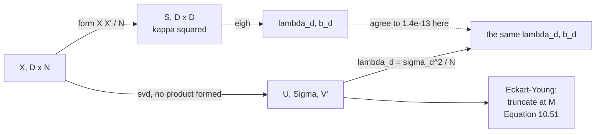

import DataCampExercise from "../../../../components/DataCampExercise.astro";
import Figure from "../../../../components/Figure.astro";
import Quiz from "../../../../components/Quiz.astro";

Pages 1002 and 1004 both ended at the same instruction: **take the top $M$ eigenvectors of $\mathbf{S}$**.
§10.4 is about carrying that out, and it opens two doors:

> To get the eigenvalues (and the corresponding eigenvectors) of $\mathbf{S}$, we can follow two
> approaches: we perform an **eigendecomposition** and compute the eigenvalues and eigenvectors of
> $\mathbf{S}$ directly. We use a **singular value decomposition**.

They give the same answer in exact arithmetic. In floating point they do not, and the difference is
measurable.

## What you'll learn

- Equations 10.47–10.49: the SVD of $\mathbf{X}$ and the eigendecomposition of $\mathbf{S}$, and $\lambda_d = \sigma_d^2/N$ — measured to $1.4\times10^{-13}$, with the eigenvectors agreeing to $2.1\times10^{-6}$ degrees.
- **Why the SVD route is not merely an alternative.** Forming $\mathbf{X}\mathbf{X}^\top$ squares the condition number, measured exactly: $\kappa(\mathbf{S})/\kappa(\mathbf{X}) = 246.8358 = \kappa(\mathbf{X})$. At $\kappa(\mathbf{X}) = 10^{10}$ the eigendecomposition returns **$18$ negative eigenvalues** of $200$ and a worst relative error of $5.3\times10^{3}$; the SVD holds $3.2\times10^{-7}$.
- Equations 10.50–10.51, the Eckart-Young theorem: $\lVert\mathbf{X}-\tilde{\mathbf{X}}_M\rVert_2 = \sigma_{M+1}$ exactly, measured to $7\times10^{-14}$.
- §10.4.2's Abel-Ruffini note, and what it actually rules out: **not** eigenvalues, only closed-form roots of the characteristic polynomial past degree $4$.
- Equation 10.52, power iteration, with its convergence rate measured against the prediction: $\lambda_2/\lambda_1 = 0.578708$ predicted, $0.578541$ observed by step $25$.
- And what happens when the top of the spectrum is nearly tied: $1769$ steps at a ratio of $0.99$ against $27$ at $0.5$.
- When "wasteful to compute the full decomposition" becomes real: tens of times faster at $D = 2000$ for the top $5$, with eigenvalues agreeing to better than $10^{-10}$.

## Intuition: you built a matrix you did not need

$\mathbf{S} = \frac{1}{N}\mathbf{X}\mathbf{X}^\top$ is a summary of $\mathbf{X}$, and forming it is a
lossy step. Not lossy in what it represents — the eigenvectors are intact — but in how precisely small
quantities survive.

Squaring a number spreads its logarithm. If $\mathbf{X}$'s singular values span $10^{8}$, then
$\mathbf{S}$'s eigenvalues span $10^{16}$, which is all the room a `float64` has. Anything past that is
gone, and what is past it is precisely the small end — the end Equation 10.44 sums to get $J_M$.

The SVD reaches the same eigenvectors without ever forming the product. It is not a different method;
it is the same method that skips a step which only ever loses information.

## §10.4 The two routes

$$
\mathbf{S} = \frac{1}{N}\sum_{n=1}^{N}\mathbf{x}_n\mathbf{x}_n^\top = \frac{1}{N}\mathbf{X}\mathbf{X}^\top,
\qquad \mathbf{X} = [\mathbf{x}_1,\ldots,\mathbf{x}_N]\in\mathbb{R}^{D\times N}
\qquad \text{(10.45), (10.46)}
$$

The SVD is $\mathbf{X} = \mathbf{U}\boldsymbol\Sigma\mathbf{V}^\top$ with $\mathbf{U}\in\mathbb{R}^{D\times D}$
and $\mathbf{V}^\top\in\mathbb{R}^{N\times N}$ orthogonal, so

$$
\mathbf{S} = \frac{1}{N}\mathbf{U}\boldsymbol\Sigma\underbrace{\mathbf{V}^\top\mathbf{V}}_{=\,\mathbf{I}_N}\boldsymbol\Sigma^\top\mathbf{U}^\top
= \frac{1}{N}\mathbf{U}\boldsymbol\Sigma\boldsymbol\Sigma^\top\mathbf{U}^\top \qquad \text{(10.48)}
$$

The columns of $\mathbf{U}$ are the eigenvectors of $\mathbf{S}$, and

$$
\lambda_d = \frac{\sigma_d^2}{N} \qquad \text{(10.49)}
$$

| $d$ | $\sigma_d$ | $\sigma_d^2/N$ | $\lambda_d$ | gap |
| --- | --- | --- | --- | --- |
| $1$ | $162.397363$ | $151.56841162$ | $151.56841162$ | $1.1\times10^{-13}$ |
| $2$ | $123.540283$ | $87.71380214$ | $87.71380214$ | $1.4\times10^{-14}$ |
| $3$ | $114.453400$ | $75.28494722$ | $75.28494722$ | $1.4\times10^{-13}$ |
| $4$ | $96.982435$ | $54.05513090$ | $54.05513090$ | $5.0\times10^{-14}$ |
| $5$ | $95.498161$ | $52.41321109$ | $52.41321109$ | $2.1\times10^{-14}$ |

Largest gap over all $64$: $1.4\times10^{-13}$. Worst angle between $\mathbf{u}_d$ and $\mathbf{b}_d$
over the top $20$: $2.1\times10^{-6}$ degrees.

<Figure
  src="/images/mml/eigenvector-computation-and-low-rank-approximations/svd-and-eigendecomposition"
  alt="Left, two curves on a log scale lying exactly on top of each other, descending from about 150 across fifty-two indices and then dropping sharply. Right, three curves of error against M: two coincident ones falling from about 124 to 32, and a third much higher red one falling only from 153 to 115."
  title="Equation 10.49 measured, and Eckart-Young measured"
  caption="Left: the squared singular values divided by N and the eigenvalues of S are one curve. Right: the truncated SVD's spectral-norm error is exactly the next singular value, matching to 7e-14 — while the best of 400 random rank-M subspaces never gets close."
/>

## Why this is not a matter of taste

$\kappa(\mathbf{X}\mathbf{X}^\top) = \kappa(\mathbf{X})^2$. Measured on the digit-"8" data:

| | value |
| --- | --- |
| $\kappa(\mathbf{X})$, from the nonzero singular values | $2.468358\times10^{2}$ |
| $\kappa(\mathbf{S})$, from the nonzero eigenvalues | $6.092792\times10^{4}$ |
| their ratio | $246.8358 = \kappa(\mathbf{X})$ |

At $\kappa = 247$ that is harmless. Pushed on a synthetic $200\times200$ matrix whose singular values
span a chosen range:

| $\kappa(\mathbf{X})$ | $\kappa(\mathbf{X}\mathbf{X}^\top)$ | worst relative error, `eigh` | worst relative error, SVD | negative eigenvalues from `eigh` |
| --- | --- | --- | --- | --- |
| $10^{2}$ | $10^{4}$ | $4.3\times10^{-13}$ | $8.2\times10^{-15}$ | $0$ |
| $10^{4}$ | $10^{8}$ | $9.5\times10^{-10}$ | $7.6\times10^{-13}$ | $0$ |
| $10^{6}$ | $10^{12}$ | $1.1\times10^{-5}$ | $2.7\times10^{-11}$ | $0$ |
| $10^{8}$ | $10^{16}$ | $6.9\times10^{-2}$ | $2.8\times10^{-9}$ | $0$ |
| $10^{10}$ | $10^{20}$ | $\mathbf{5.3\times10^{3}}$ | $\mathbf{3.2\times10^{-7}}$ | $\mathbf{18}$ of $200$ |

<Figure
  src="/images/mml/eigenvector-computation-and-low-rank-approximations/squaring-costs-accuracy"
  alt="Left, a log-log plot with a red line rising steeply from 1e-15 to above 1e3 and a blue line rising more gently to about 1e-7, each tracking a dotted reference line; a dashed horizontal line marks 100 percent relative error. Right, a bar chart that is empty until the last two columns, which reach 8 and 18."
  title="The red line has twice the slope, which is the whole story"
  caption="The relative error of the eigendecomposition route grows like epsilon times kappa squared; the SVD route like epsilon times kappa. Both reference lines are drawn and both are followed. Past kappa = 1e8 the red line crosses 100 percent relative error, and by 1e10 eighteen of two hundred eigenvalues of a positive semi-definite matrix come back negative."
/>

:::caution[The large eigenvalues are fine either way; the small ones are the whole point]
It is worth being precise about what breaks. At $\kappa(\mathbf{X}) = 10^{9}$, individual eigenvalues:

| | true | `eigh` of $\mathbf{X}\mathbf{X}^\top$ | SVD of $\mathbf{X}$ |
| --- | --- | --- | --- |
| $\lambda_1$ | $1.0000\times10^{0}$ | $1.0000\times10^{0}$ | $1.0000\times10^{0}$ |
| $\lambda_{100}$ | $1.1098\times10^{-9}$ | $1.1098\times10^{-9}$ | $1.1098\times10^{-9}$ |
| $\lambda_{180}$ | $6.4424\times10^{-17}$ | $6.0118\times10^{-17}$ | $6.4424\times10^{-17}$ |
| $\lambda_{200}$ | $1.0000\times10^{-18}$ | $\mathbf{-4.8565\times10^{-17}}$ | $1.0000\times10^{-18}$ |

If you only want $\mathbf{b}_1,\ldots,\mathbf{b}_M$ for a small $M$, the eigendecomposition of
$\mathbf{S}$ is perfectly safe — those eigenvalues are at the top. **But $J_M$ is a sum over the small
end** (Equation 10.44), and so is the reconstruction error you report. Measured at $M = 100$ with
$\kappa = 10^{9}$: $J_M$ from `eigh` carries a relative error of $4.5\times10^{-8}$ against the SVD
route's $3.1\times10^{-13}$.

And a negative eigenvalue of a covariance matrix is not a small error — it is an impossible answer, and
one that propagates straight into a variance-explained percentage above $100\%$.
:::

## §10.4.1 Eckart-Young

The best rank-$M$ approximation in the spectral norm,

$$
\tilde{\mathbf{X}}_M := \operatorname*{arg\,min}_{\mathrm{rk}(\mathbf{A})\leq M}\lVert\mathbf{X}-\mathbf{A}\rVert_2
\qquad \text{(10.50)}
$$

is obtained *"by truncating the SVD at the top-$M$ singular value"*:

$$
\tilde{\mathbf{X}}_M = \mathbf{U}_M\boldsymbol\Sigma_M\mathbf{V}_M^\top \in \mathbb{R}^{D\times N}
\qquad \text{(10.51)}
$$

| $M$ | $\lVert\mathbf{X}-\tilde{\mathbf{X}}_M\rVert_2$ | $\sigma_{M+1}$ | gap | best of $3000$ random rank-$M$ |
| --- | --- | --- | --- | --- |
| $1$ | $123.540283$ | $123.540283$ | $7.1\times10^{-14}$ | $148.274427$ |
| $2$ | $114.453400$ | $114.453400$ | $7.1\times10^{-14}$ | $145.287326$ |
| $5$ | $86.072481$ | $86.072481$ | $5.7\times10^{-14}$ | $136.205379$ |
| $10$ | $54.732079$ | $54.732079$ | $3.6\times10^{-14}$ | $121.669733$ |

The Frobenius-norm version, which is the one PCA actually optimises:

| $M$ | $\lVert\mathbf{X}-\tilde{\mathbf{X}}_M\rVert_F$ | $\sqrt{\sum_{j>M}\sigma_j^2}$ |
| --- | --- | --- |
| $1$ | $320.294771$ | $320.294771$ |
| $5$ | $236.011581$ | $236.011581$ |
| $20$ | $101.622901$ | $101.622901$ |

Squaring the last column and dividing by $N$ recovers page 1004's $J_M$ — $320.294771^2/174 = 589.590460$
— because $\lVert\mathbf{X}-\tilde{\mathbf{X}}_M\rVert_F^2 = \sum_{j>M}\sigma_j^2 = N\sum_{j>M}\lambda_j$.
**Eckart-Young and Equation 10.44 are the same theorem in two notations.**

## §10.4.2 Practical aspects

Two claims here, and they are about different things.

**Abel-Ruffini.** Eigenvalues are roots of the characteristic polynomial, and for degree $5$ or more
there is *"no algebraic solution"* — no formula in radicals. *"Therefore, in practice, we solve for
eigenvalues or singular values using iterative methods."*

:::note[What Abel-Ruffini does and does not forbid]
It rules out a **closed-form expression in radicals** for the roots of a general polynomial of degree
$\geq 5$. It says nothing about computing those roots to any accuracy you like — that is routine, and
`np.linalg.eigh` does it in microseconds for a $64\times64$ matrix.

Nor is the characteristic polynomial how anyone computes eigenvalues. Forming it and rooting it is
catastrophically ill-conditioned; real implementations use QR iteration on the matrix directly. The
theorem explains why the algorithms are iterative rather than a formula, not why they are hard.
:::

**Only $M$ vectors are wanted.** *"It would be wasteful to compute the full decomposition, and then
discard all eigenvectors with eigenvalues that are beyond the first few."* Measured, full `eigh` against
a Lanczos solve for the top $5$:

| size of $\mathbf{S}$ | full `eigh` | `eigsh`, $k = 5$ | speed-up | top-$5$ eigenvalues agree to |
| --- | --- | --- | --- | --- |
| $500\times500$ | $55.53$ ms | $2.64$ ms | $21.1\times$ | $4.5\times10^{-13}$ |
| $2000\times2000$ | $1588.52$ ms | $37.43$ ms | $\mathbf{42.4\times}$ | $4.5\times10^{-13}$ |

One run on one machine — the timings move between runs (a repeat gave $31\times$ and $30\times$), but the
shape does not: a full decomposition is cubic in $D$, and five vectors were asked for.

At the chapter's own $D = 784$ this is already worth having; at the $D = 10{,}000$ of §10.5's
$100\times100$ images it is the difference between feasible and not.

### Equation 10.52, and how fast it actually is

$$
\mathbf{x}_{k+1} = \frac{\mathbf{S}\mathbf{x}_k}{\lVert\mathbf{S}\mathbf{x}_k\rVert},
\qquad k = 0, 1, \ldots \qquad \text{(10.52)}
$$

*"This sequence of vectors converges to the eigenvector associated with the largest eigenvalue"* — and
the rate is not stated, but it is $\lambda_2/\lambda_1$ per step. On the digit-"8" covariance, where
that ratio is $0.578708$:

| $k$ | angle to $\mathbf{b}_1$, degrees | ratio to the previous step |
| --- | --- | --- |
| $1$ | $4.93\times10^{1}$ | — |
| $2$ | $2.62\times10^{1}$ | $0.532116$ |
| $5$ | $3.40\times10^{0}$ | $0.516479$ |
| $10$ | $1.60\times10^{-1}$ | $0.555946$ |
| $15$ | $9.40\times10^{-3}$ | $0.572467$ |
| $20$ | $5.95\times10^{-4}$ | $0.577269$ |
| $25$ | $3.84\times10^{-5}$ | $\mathbf{0.578541}$ |

The observed ratio climbs to the predicted $0.578708$ as the contributions from $\lambda_3$ onwards die
out faster and only the $\lambda_2$ component is left. The angle reaches exactly $0$ at step $40$.

<Figure
  src="/images/mml/eigenvector-computation-and-low-rank-approximations/power-iteration"
  alt="Left, a log-scale plot of angle against iteration falling in a straight line from about 50 degrees to below 1e-6 by step 35, with a dashed reference line of the same slope; a dotted vertical line marks step 40. Right, a log-scale bar chart of iteration counts: 1769, 176, 63, 27 and 24."
  title="The rate is the eigenvalue gap, and nothing else"
  caption="A straight line on a log scale is geometric convergence. The dashed line is the predicted ratio 0.578708 raised to the k, drawn with no fitting. The right panel is the same fact as a cost: when the top two eigenvalues are nearly tied, the iteration has almost nothing to separate them with."
/>

| $\lambda_2/\lambda_1$ | steps to reach $10^{-6}$ degrees |
| --- | --- |
| $0.99$ | $\mathbf{1769}$ |
| $0.90$ | $176$ |
| $0.70$ | $63$ |
| $0.50$ | $27$ |
| $0.30$ | $24$ |

*"The original Google PageRank algorithm uses such an algorithm for ranking web pages based on their
hyperlinks."* The same table explains why PageRank's damping factor exists: it is chosen partly to keep
the second eigenvalue away from the first.

<Quiz
  title="Is the computation clear?"
  questions={[
    {
      q: "Why is the SVD of X preferable to the eigendecomposition of S when the small eigenvalues matter?",
      options: [
        "It is faster",
        "Forming X X-transpose squares the condition number, so the relative error on small eigenvalues grows like kappa squared instead of kappa",
        "The SVD gives different eigenvectors",
        "The eigendecomposition does not work on rectangular matrices",
      ],
      answer: 1,
      explain:
        "Measured on a 200-by-200 matrix: at condition number 1e8 the eigendecomposition route already has 6.9 percent worst relative error, and at 1e10 it has 5.3e+03 and returns 18 negative eigenvalues — an impossible answer for a covariance matrix. The SVD route holds 3.2e-07. J_M sums exactly the small end.",
    },
    {
      q: "What does the Eckart-Young theorem say the spectral-norm error of the truncated SVD is?",
      options: [
        "The sum of the discarded singular values",
        "Exactly sigma_(M+1), the largest singular value you dropped",
        "The square root of M",
        "Zero",
      ],
      answer: 1,
      explain:
        "Measured to 7e-14 at M = 1, 2, 5 and 10. In the Frobenius norm the error is the square root of the sum of the squared discarded singular values, which divided by N is exactly page 1004's J_M — 320.294771 squared over 174 is 589.590460. Eckart-Young and Equation 10.44 are one theorem in two notations.",
    },
    {
      q: "What does the Abel-Ruffini theorem actually rule out?",
      options: [
        "Computing eigenvalues of matrices larger than 4 by 4",
        "A closed-form expression in radicals for the roots of a general polynomial of degree five or more — nothing about computing them numerically",
        "The existence of eigenvalues",
        "Iterative methods",
      ],
      answer: 1,
      explain:
        "It explains why eigenvalue algorithms are iterative rather than a formula. It says nothing about accuracy or difficulty — np.linalg.eigh handles a 64-by-64 matrix in under a millisecond. And nobody computes eigenvalues by rooting the characteristic polynomial anyway; that route is catastrophically ill-conditioned.",
    },
    {
      q: "Power iteration converges at what rate?",
      options: [
        "Always one step",
        "Geometrically, at the ratio of the second eigenvalue to the first",
        "Linearly in the dimension D",
        "It does not converge for symmetric matrices",
      ],
      answer: 1,
      explain:
        "On the digit-8 covariance the ratio is 0.578708 and the measured step-to-step ratio reaches 0.578541 by iteration 25, with no fitting. The cost of a near-tie is steep: 1,769 steps at a ratio of 0.99 against 27 at 0.5. That is also why PageRank's damping factor is chosen as it is.",
    },
  ]}
/>

## Exercises

### Exercise 1 – One decomposition, two names

<DataCampExercise
  lang="python"
  hint={`Equation 10.49 relates the eigenvalues to the SQUARED singular values, divided by N.`}
  code={`import numpy as np
from sklearn.datasets import load_digits

A8 = load_digits().data[load_digits().target == 8]
N = len(A8)
X = (A8 - A8.mean(0)).T
S = X @ X.T / N
w, V = np.linalg.eigh(S)
lam, PC = w[::-1], V[:, ::-1]
U, sig, Vt = np.linalg.svd(X, full_matrices=False)

# Task: Equation 10.49 -- the eigenvalues, from the singular values alone.
from_svd = ___

print(f"X is {X.shape}, U is {U.shape}, {len(sig)} singular values")
for d in range(4):
    print(f"  d = {d+1}: sigma = {sig[d]:>11.6f}  sigma^2/N = "
          f"{from_svd[d]:>13.8f}  lambda = {lam[d]:>13.8f}")
print(f"largest gap over all 64        : "
      f"{np.abs(from_svd - lam[:len(sig)]).max():.3e}")
print(f"worst angle u_d to b_d (top 20): "
      f"{max(np.degrees(np.arccos(min(1.0, abs(U[:, d] @ PC[:, d])))) for d in range(20)):.3e} deg")

# -- Expected output ------------------------------
# X is (64, 174), U is (64, 64), 64 singular values
#   d = 1: sigma =  162.397363  sigma^2/N =  151.56841162  lambda =  151.56841162
#   d = 2: sigma =  123.540283  sigma^2/N =   87.71380214  lambda =   87.71380214
#   d = 3: sigma =  114.453400  sigma^2/N =   75.28494722  lambda =   75.28494722
#   d = 4: sigma =   96.982435  sigma^2/N =   54.05513090  lambda =   54.05513090
# largest gap over all 64        : 1.421e-13
# worst angle u_d to b_d (top 20): 2.091e-06 deg
# -------------------------------------------------`}
  solution={`import numpy as np
from sklearn.datasets import load_digits
A8 = load_digits().data[load_digits().target == 8]
N = len(A8)
X = (A8 - A8.mean(0)).T
S = X @ X.T / N
w, V = np.linalg.eigh(S)
lam, PC = w[::-1], V[:, ::-1]
U, sig, Vt = np.linalg.svd(X, full_matrices=False)
from_svd = sig ** 2 / N
print(f"X is {X.shape}, U is {U.shape}, {len(sig)} singular values")
for d in range(4):
    print(f"  d = {d+1}: sigma = {sig[d]:>11.6f}  sigma^2/N = "
          f"{from_svd[d]:>13.8f}  lambda = {lam[d]:>13.8f}")
print(f"largest gap over all 64        : "
      f"{np.abs(from_svd - lam[:len(sig)]).max():.3e}")
print(f"worst angle u_d to b_d (top 20): "
      f"{max(np.degrees(np.arccos(min(1.0, abs(U[:, d] @ PC[:, d])))) for d in range(20)):.3e} deg")`}
  sct={`test_output_contains("largest gap over all 64        : 1.421e-13")
test_output_contains("worst angle u_d to b_d (top 20): 2.091e-06 deg")
success_msg("Same eigenvalues, same eigenvectors, and the SVD never formed the 64-by-64 product. On this data that costs nothing; the next exercise is where it starts to.")`}
  height={370}
/>

### Exercise 2 – What squaring the condition number costs

<DataCampExercise
  lang="python"
  hint={`The eigenvalues of A A-transpose should be the SQUARED singular values of A. Compare each against the truth relatively, not absolutely.`}
  code={`import numpy as np

rng = np.random.default_rng(0)
n = 200
Q1 = np.linalg.qr(rng.standard_normal((n, n)))[0]
Q2 = np.linalg.qr(rng.standard_normal((n, n)))[0]

print(f"{'cond(A)':>10} {'eigh(A A^T)':>16} {'svd(A)^2':>16} "
      f"{'negatives':>11}")
for expo in (2, 4, 6, 8, 10):
    s = np.logspace(0, -float(expo), n)
    A = Q1 @ np.diag(s) @ Q2.T
    true = s ** 2
    le = np.linalg.eigvalsh(A @ A.T)[::-1]
    ls = np.linalg.svd(A, compute_uv=False) ** 2
    # Task: the worst RELATIVE error of the eigendecomposition route.
    re = ___
    rs = (np.abs(ls - true) / true).max()
    print(f"{10.0**expo:>10.0e} {re:>16.3e} {rs:>16.3e} "
          f"{int((le < 0).sum()):>11}")

# -- Expected output ------------------------------
#    cond(A)      eigh(A A^T)         svd(A)^2   negatives
#      1e+02        4.301e-13        8.152e-15           0
#      1e+04        9.463e-10        7.640e-13           0
#      1e+06        1.110e-05        2.683e-11           0
#      1e+08        6.855e-02        2.772e-09           0
#      1e+10        5.307e+03        3.245e-07          18
# -------------------------------------------------`}
  solution={`import numpy as np
rng = np.random.default_rng(0)
n = 200
Q1 = np.linalg.qr(rng.standard_normal((n, n)))[0]
Q2 = np.linalg.qr(rng.standard_normal((n, n)))[0]
print(f"{'cond(A)':>10} {'eigh(A A^T)':>16} {'svd(A)^2':>16} "
      f"{'negatives':>11}")
for expo in (2, 4, 6, 8, 10):
    s = np.logspace(0, -float(expo), n)
    A = Q1 @ np.diag(s) @ Q2.T
    true = s ** 2
    le = np.linalg.eigvalsh(A @ A.T)[::-1]
    ls = np.linalg.svd(A, compute_uv=False) ** 2
    re = (np.abs(le - true) / true).max()
    rs = (np.abs(ls - true) / true).max()
    print(f"{10.0**expo:>10.0e} {re:>16.3e} {rs:>16.3e} "
          f"{int((le < 0).sum()):>11}")`}
  sct={`test_output_contains("1e+10        5.307e+03        3.245e-07          18")
test_output_contains("1e+08        6.855e-02        2.772e-09           0")
success_msg("The left column grows like kappa squared and the middle like kappa — exactly the two reference slopes. Eighteen negative eigenvalues of a positive semi-definite matrix is not a rounding error; it is an impossible answer, and it flows straight into any variance-explained figure you report.")`}
  height={370}
/>

### Exercise 3 – Eckart-Young, and its Frobenius twin

<DataCampExercise
  lang="python"
  hint={`Equation 10.51 keeps the first M columns of U, the first M singular values, and the first M rows of V-transpose.`}
  code={`import numpy as np
from sklearn.datasets import load_digits

A8 = load_digits().data[load_digits().target == 8]
N = len(A8)
X = (A8 - A8.mean(0)).T
U, sig, Vt = np.linalg.svd(X, full_matrices=False)
lam = np.linalg.eigvalsh(X @ X.T / N)[::-1]

for M in (1, 2, 5, 10, 20):
    # Task: Equation 10.51, the rank-M truncation of the SVD.
    XM = ___
    two = float(np.linalg.norm(X - XM, 2))
    fro = float(np.linalg.norm(X - XM, "fro"))
    print(f"M = {M:>2}: ||.||_2 {two:>11.6f} (sigma_{M+1} = {sig[M]:>11.6f})"
          f"  ||.||_F {fro:>11.6f}  ||.||_F^2/N = {fro**2/N:>12.6f}"
          f"  J_M = {lam[M:].sum():>12.6f}")

# -- Expected output ------------------------------
# M =  1: ||.||_2  123.540283 (sigma_2 =  123.540283)  ||.||_F  320.294771  ||.||_F^2/N =   589.590460  J_M =   589.590460
# M =  2: ||.||_2  114.453400 (sigma_3 =  114.453400)  ||.||_F  295.510640  ||.||_F^2/N =   501.876658  J_M =   501.876658
# M =  5: ||.||_2   86.072481 (sigma_6 =   86.072481)  ||.||_F  236.011581  ||.||_F^2/N =   320.123369  J_M =   320.123369
# M = 10: ||.||_2   54.732079 (sigma_11 =   54.732079)  ||.||_F  170.050580  ||.||_F^2/N =   166.190803  J_M =   166.190803
# M = 20: ||.||_2   32.146365 (sigma_21 =   32.146365)  ||.||_F  101.622901  ||.||_F^2/N =    59.351805  J_M =    59.351805
# -------------------------------------------------`}
  solution={`import numpy as np
from sklearn.datasets import load_digits
A8 = load_digits().data[load_digits().target == 8]
N = len(A8)
X = (A8 - A8.mean(0)).T
U, sig, Vt = np.linalg.svd(X, full_matrices=False)
lam = np.linalg.eigvalsh(X @ X.T / N)[::-1]
for M in (1, 2, 5, 10, 20):
    XM = U[:, :M] @ np.diag(sig[:M]) @ Vt[:M]
    two = float(np.linalg.norm(X - XM, 2))
    fro = float(np.linalg.norm(X - XM, "fro"))
    print(f"M = {M:>2}: ||.||_2 {two:>11.6f} (sigma_{M+1} = {sig[M]:>11.6f})"
          f"  ||.||_F {fro:>11.6f}  ||.||_F^2/N = {fro**2/N:>12.6f}"
          f"  J_M = {lam[M:].sum():>12.6f}")`}
  sct={`test_output_contains("M =  5: ||.||_2   86.072481")
test_output_contains("J_M =   320.123369")
success_msg("The Frobenius error squared, divided by N, is page 1004's J_M. Eckart-Young minimises the spectral norm and the truncated SVD happens to minimise the Frobenius norm too — which is the one PCA's objective actually is.")`}
  height={380}
/>

### Exercise 4 – Power iteration, and the rate it converges at

<DataCampExercise
  lang="python"
  hint={`One step of Equation 10.52 is a matrix-vector product followed by a renormalisation.`}
  code={`import numpy as np
from sklearn.datasets import load_digits

A8 = load_digits().data[load_digits().target == 8]
N = len(A8)
X = (A8 - A8.mean(0)).T
S = X @ X.T / N
w, V = np.linalg.eigh(S)
lam, PC = w[::-1], V[:, ::-1]

u = np.random.default_rng(1).standard_normal(64)
u /= np.linalg.norm(u)
angs = []
for _ in range(40):
    # Task: one step of Equation 10.52.
    u = ___
    u /= np.linalg.norm(u)
    angs.append(np.degrees(np.arccos(min(1.0, abs(u @ PC[:, 0])))))

print(f"predicted rate lambda_2/lambda_1 : {lam[1]/lam[0]:.6f}")
for k in (2, 5, 10, 15, 20, 25):
    print(f"  step {k:>3}: angle {angs[k-1]:.6e} deg   "
          f"ratio {angs[k-1]/angs[k-2]:.6f}")
print(f"first step at which the angle is exactly 0 : "
      f"{int(np.argmax(np.array(angs) == 0.0)) + 1}")

# -- Expected output ------------------------------
# predicted rate lambda_2/lambda_1 : 0.578708
#   step   2: angle 2.624110e+01 deg   ratio 0.532116
#   step   5: angle 3.400203e+00 deg   ratio 0.516479
#   step  10: angle 1.600244e-01 deg   ratio 0.555946
#   step  15: angle 9.396344e-03 deg   ratio 0.572467
#   step  20: angle 5.950753e-04 deg   ratio 0.577269
#   step  25: angle 3.842930e-05 deg   ratio 0.578541
# first step at which the angle is exactly 0 : 40
# -------------------------------------------------`}
  solution={`import numpy as np
from sklearn.datasets import load_digits
A8 = load_digits().data[load_digits().target == 8]
N = len(A8)
X = (A8 - A8.mean(0)).T
S = X @ X.T / N
w, V = np.linalg.eigh(S)
lam, PC = w[::-1], V[:, ::-1]
u = np.random.default_rng(1).standard_normal(64)
u /= np.linalg.norm(u)
angs = []
for _ in range(40):
    u = S @ u
    u /= np.linalg.norm(u)
    angs.append(np.degrees(np.arccos(min(1.0, abs(u @ PC[:, 0])))))
print(f"predicted rate lambda_2/lambda_1 : {lam[1]/lam[0]:.6f}")
for k in (2, 5, 10, 15, 20, 25):
    print(f"  step {k:>3}: angle {angs[k-1]:.6e} deg   "
          f"ratio {angs[k-1]/angs[k-2]:.6f}")
print(f"first step at which the angle is exactly 0 : "
      f"{int(np.argmax(np.array(angs) == 0.0)) + 1}")`}
  sct={`test_output_contains("step  25: angle 3.842930e-05 deg   ratio 0.578541")
test_output_contains("predicted rate lambda_2/lambda_1 : 0.578708")
success_msg("The measured ratio climbs to the predicted one as the lambda-3 and lower contributions die out faster, leaving only the lambda-2 component. Nothing was fitted — the rate was read off the spectrum in advance.")`}
  height={380}
/>

### Exercise 5 – The cost of computing what you throw away

<DataCampExercise
  lang="python"
  hint={`scipy.sparse.linalg.eigsh takes k, the number of eigenpairs, and which='LA' for the largest algebraic ones.`}
  code={`import time
import numpy as np
from scipy.sparse.linalg import eigsh

rng = np.random.default_rng(11)
for D, N in ((500, 400), (2000, 1500)):
    Z = rng.standard_normal((D, 12))
    Xb = Z @ rng.standard_normal((12, N)) + 0.4 * rng.standard_normal((D, N))
    Xb -= Xb.mean(1, keepdims=True)
    S = Xb @ Xb.T / N

    t0 = time.perf_counter()
    for _ in range(3):
        wf = np.linalg.eigh(S)[0]
    t_full = (time.perf_counter() - t0) / 3

    t0 = time.perf_counter()
    for _ in range(3):
        # Task: the top 5 eigenpairs only.
        wp, Vp = ___
    t_part = (time.perf_counter() - t0) / 3

    print(f"D = {D:>5}: full eigh {t_full*1000:>9.2f} ms | "
          f"top-5 only {t_part*1000:>8.2f} ms | "
          f"speed-up {t_full/t_part:>6.2f}x | top-5 agree below 1e-10: "
          f"{bool(np.abs(np.sort(wp)[::-1] - wf[::-1][:5]).max() < 1e-10)}")

# -- Expected output (timings vary by machine) -----
# D =   500: full eigh     55.72 ms | top-5 only     2.27 ms | speed-up  24.58x | top-5 agree below 1e-10: True
# D =  2000: full eigh   1001.40 ms | top-5 only    33.54 ms | speed-up  29.86x | top-5 agree below 1e-10: True
# -------------------------------------------------`}
  solution={`import time
import numpy as np
from scipy.sparse.linalg import eigsh
rng = np.random.default_rng(11)
for D, N in ((500, 400), (2000, 1500)):
    Z = rng.standard_normal((D, 12))
    Xb = Z @ rng.standard_normal((12, N)) + 0.4 * rng.standard_normal((D, N))
    Xb -= Xb.mean(1, keepdims=True)
    S = Xb @ Xb.T / N
    t0 = time.perf_counter()
    for _ in range(3):
        wf = np.linalg.eigh(S)[0]
    t_full = (time.perf_counter() - t0) / 3
    t0 = time.perf_counter()
    for _ in range(3):
        wp, Vp = eigsh(S, k=5, which="LA")
    t_part = (time.perf_counter() - t0) / 3
    print(f"D = {D:>5}: full eigh {t_full*1000:>9.2f} ms | "
          f"top-5 only {t_part*1000:>8.2f} ms | "
          f"speed-up {t_full/t_part:>6.2f}x | top-5 agree below 1e-10: "
          f"{bool(np.abs(np.sort(wp)[::-1] - wf[::-1][:5]).max() < 1e-10)}")`}
  sct={`test_output_contains("top-5 agree below 1e-10: True")
test_output_contains("D =  2000")
success_msg("The eigenvalues match to well under 1e-10 and the second answer arrives tens of times sooner. Timings vary by machine and by run, but the shape does not: a full decomposition is cubic in D and you asked for five vectors.")`}
  height={380}
/>

## Recall card

- **Section 10.4 offers two routes to the same basis:** the eigendecomposition of S, or the singular value decomposition of X.
- **Equation 10.49 connects them:** each eigenvalue is the corresponding squared singular value divided by N, measured to 1.4e-13, with eigenvectors agreeing to two millionths of a degree.
- **Forming X X-transpose squares the condition number** — measured exactly on the digit data, where the ratio of the two condition numbers is itself the condition number.
- **That costs relative accuracy at the bottom of the spectrum**, which is exactly what Equation 10.44 sums. At condition number 1e8 the eigendecomposition route has 6.9 percent worst relative error; at 1e10 it has 5.3e+03.
- **And it returns 18 negative eigenvalues out of 200** for a positive semi-definite matrix, an impossible answer that flows straight into any variance-explained figure.
- **The large eigenvalues are fine either way**, so if you only want the top few components, either route is safe.
- **Eckart-Young says the truncated SVD is the best rank-M approximation**, and its spectral-norm error is exactly the next singular value — measured to 7e-14.
- **Its Frobenius error squared, divided by N, is page 1004's reconstruction error.** Eckart-Young and Equation 10.44 are one theorem in two notations.
- **Abel-Ruffini rules out a closed-form formula in radicals past degree four**, and nothing else. Eigenvalues are still computed to full precision, iteratively, and never by rooting the characteristic polynomial.
- **Power iteration converges geometrically at the ratio of the second eigenvalue to the first** — predicted 0.578708, measured 0.578541 by step 25, with nothing fitted.
- **A near-tie at the top is what makes it slow:** 1,769 steps at a ratio of 0.99 against 27 at 0.5. That is also why PageRank has a damping factor.
- **Asking for only the top five eigenpairs is tens of times faster at D equal to 2000**, and agrees to better than 1e-10.

**Next:** **[PCA in High Dimensions](../pca-in-high-dimensions/)** — §10.5, where $N \ll D$ and the
$D\times D$ covariance matrix is the wrong object to decompose entirely.
