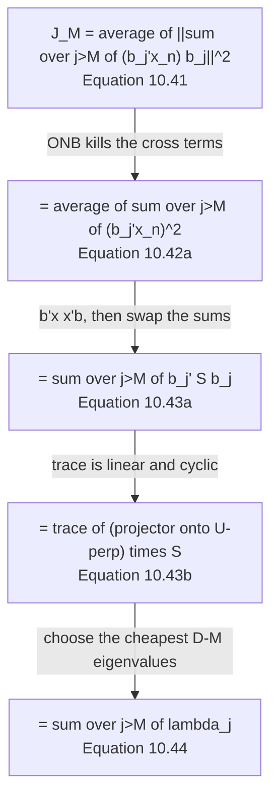

import DataCampExercise from "../../../../components/DataCampExercise.astro";
import Figure from "../../../../components/Figure.astro";
import Quiz from "../../../../components/Quiz.astro";

Page 1003 settled the coordinates and left one term standing:
$\lVert\mathbf{x}_n - \mathbf{B}\mathbf{B}^\top\mathbf{x}_n\rVert^2$, with no $\mathbf{z}$ in it. §10.3.3
minimises that over bases — and the book's own summary of where it ends up is worth reading before the
derivation:

> Therefore, we omit a derivation that is identical to the one presented in Section 10.2.

Two chapters' worth of setup, two genuinely different objectives, and **the same eigenvectors**. This
page shows why that had to happen, and what it costs to choose otherwise.

## What you'll learn

- Equations 10.41–10.43b: four rewritings that turn a sum of squared norms into $\mathrm{tr}(\cdot\,\mathbf{S})$ — each step using exactly one property, and every form measured to agree within $2.8\times10^{-13}$.
- **Equation 10.44, $J_M = \sum_{j>M}\lambda_j$**, and the one-line reason it forces the top-$M$ eigenvectors: you are choosing which eigenvalues to *pay*, so you discard the cheapest.
- The conservation law nobody states: $V_M + J_M = \mathrm{tr}(\mathbf{S})$ for every $M$ and every orthonormal $\mathbf{B}$ — measured constant to $2.3\times10^{-13}$. **§10.2 and §10.3 are one optimisation with two signs.**
- Whether the eigenbasis is genuinely optimal, tested rather than assumed: $200{,}000$ random orthonormal bases, **zero** of them better, best one worse by $304.302698$; and an L-BFGS search over $\mathbf{B}$ that lands back on the same subspace to $2.0\times10^{-7}$ — with a **different basis**.
- Why that last distinction matters: rotating $\mathbf{B}$ by any orthogonal $\mathbf{R}$ leaves $J_M$ *exactly* unchanged while moving the codes by $39.243537$. §10.7's Equation 10.78 will call this ambiguity by name.
- The one thing only the eigenbasis gives you: a code whose components are **uncorrelated** — measured largest off-diagonal covariance $5.1\times10^{-14}$ against $37.046852$ after a rotation.

## Intuition: you are not choosing what to keep, you are choosing what to pay

The trick of §10.3.3 is a change of viewpoint that Equation 10.38 already set up. The reconstruction
error is built entirely from the directions you **discarded** — so write the objective in terms of those.

Once you do, the answer is arithmetic. Each discarded direction contributes its eigenvalue to the bill.
Sixty-four eigenvalues, choose $D - M$ of them to pay: take the small ones.

## §10.3.3 The four moves

Starting from Equation 10.38b, the displacement expanded in the discarded basis vectors:

$$
J_M = \frac{1}{N}\sum_{n=1}^{N}\left\lVert\sum_{j=M+1}^{D}(\mathbf{b}_j^\top\mathbf{x}_n)\mathbf{b}_j\right\rVert^2
\qquad \text{(10.41)}
$$

**Move one — expand the squared norm.** The $\mathbf{b}_j$ are orthonormal, so every cross term
$\mathbf{b}_j^\top\mathbf{b}_k$ with $j \neq k$ is zero and the double sum collapses to a single one:

$$
J_M = \frac{1}{N}\sum_{n=1}^{N}\sum_{j=M+1}^{D}(\mathbf{b}_j^\top\mathbf{x}_n)^2 \qquad \text{(10.42a)}
$$

**Move two — a scalar is its own transpose.** $(\mathbf{b}_j^\top\mathbf{x}_n)^2
= \mathbf{b}_j^\top\mathbf{x}_n\mathbf{x}_n^\top\mathbf{b}_j$, which introduces the outer product:

$$
J_M = \frac{1}{N}\sum_{n=1}^{N}\sum_{j=M+1}^{D}\mathbf{b}_j^\top\mathbf{x}_n\mathbf{x}_n^\top\mathbf{b}_j
\qquad \text{(10.42b)}
$$

**Move three — swap the sums.** The $\mathbf{b}_j$ do not depend on $n$, so the average over $n$ falls
onto the outer products and $\mathbf{S}$ appears:

$$
J_M = \sum_{j=M+1}^{D}\mathbf{b}_j^\top\!\left(\frac{1}{N}\sum_{n=1}^{N}\mathbf{x}_n\mathbf{x}_n^\top\right)\!\mathbf{b}_j
= \sum_{j=M+1}^{D}\mathbf{b}_j^\top\mathbf{S}\mathbf{b}_j \qquad \text{(10.43a)}
$$

**Move four — the trace.** A scalar equals its own trace, and the trace is cyclic:

$$
J_M = \sum_{j=M+1}^{D}\mathrm{tr}\!\left(\mathbf{S}\mathbf{b}_j\mathbf{b}_j^\top\right)
= \mathrm{tr}\Bigg(\underbrace{\bigg(\sum_{j=M+1}^{D}\mathbf{b}_j\mathbf{b}_j^\top\bigg)}_{\text{projector onto } U^\perp}\mathbf{S}\Bigg)
\qquad \text{(10.43b)}
$$

> Minimizing the average squared reconstruction error is therefore equivalent to **minimizing the
> projection of the data covariance matrix onto the orthogonal complement** of the principal subspace.
> Equivalently, we **maximize the variance of the projection** that we retain in the principal subspace.

Every form, measured on the digit-"8" data:

| $M$ | Eq 10.29 | Eq 10.41 | Eq 10.43a | Eq 10.43b | Eq 10.44 |
| --- | --- | --- | --- | --- | --- |
| $1$ | $589.590460$ | $589.590460$ | $589.590460$ | $589.590460$ | $589.590460$ |
| $2$ | $501.876658$ | $501.876658$ | $501.876658$ | $501.876658$ | $501.876658$ |
| $5$ | $320.123369$ | $320.123369$ | $320.123369$ | $320.123369$ | $320.123369$ |
| $10$ | $166.190803$ | $166.190803$ | $166.190803$ | $166.190803$ | $166.190803$ |
| $20$ | $59.351805$ | $59.351805$ | $59.351805$ | $59.351805$ | $59.351805$ |
| $40$ | $2.892280$ | $2.892280$ | $2.892280$ | $2.892280$ | $2.892280$ |

Largest spread within any row, across all $M$ from $1$ to $63$: $2.8\times10^{-13}$.

<Figure
  src="/images/mml/finding-the-principal-subspace/one-number-five-spellings"
  alt="Left, three curves of reconstruction error against M lying exactly on top of each other, falling steeply from about 590 to near zero by M equal to forty. Right, a filled area chart where a blue region grows and a red region shrinks, their total pinned at a dotted horizontal line marked 741.158872."
  title="The five forms of J_M, and the budget that makes Sections 10.2 and 10.3 one problem"
  caption="Left: measured directly, computed as a trace, and read off the spectrum — three routes, one curve. Right: the variance kept and the variance lost always sum to the trace of S, measured constant to 2.3e-13. There is no trade-off to negotiate; maximising one is minimising the other."
/>

:::tip[The conservation law, which the book never states outright]
For any orthonormal $\mathbf{B}$ with complement $\mathbf{B}_\perp$, the two projectors sum to the
identity, so

$$
V_M + J_M = \mathrm{tr}(\mathbf{B}\mathbf{B}^\top\mathbf{S}) + \mathrm{tr}(\mathbf{B}_\perp\mathbf{B}_\perp^\top\mathbf{S})
= \mathrm{tr}(\mathbf{S})
$$

Measured, the worst deviation over $M = 1\ldots63$ is $2.3\times10^{-13}$, against a trace of
$741.158872$.

So **§10.2 and §10.3 are not two methods that happen to agree.** They are one objective read from either
end of a fixed total. Every unit of variance the projection keeps is a unit the residual does not pay.
That is why the book can say *"we omit a derivation that is identical to the one presented in
Section 10.2"* — there is genuinely nothing left to derive.
:::

## Equation 10.44, and why the choice is forced

Minimising Equation 10.43b over orthonormal $\mathbf{B}$ is minimising
$\sum_{j>M}\mathbf{b}_j^\top\mathbf{S}\mathbf{b}_j$ over the *discarded* directions — the same
Rayleigh-quotient problem §10.2 solved, with the sign flipped. The stationary points are eigenvectors,
and:

$$
J_M = \sum_{j=M+1}^{D}\lambda_j \qquad \text{(10.44)}
$$

> To minimize (10.44) we need to select the **smallest** $D-M$ eigenvalues, which then implies that their
> corresponding eigenvectors are the basis of the orthogonal complement of the principal subspace.

Which five of the $64$ eigenvectors you keep, measured:

| kept directions | $J_M$ |
| --- | --- |
| **the top $5$** (Equation 10.44) | $\mathbf{320.123369}$ |
| every $12$th ($1, 13, 25, 37, 49$) | $570.187987$ |
| five from the middle ($26$–$30$) | $725.666168$ |
| the bottom $5$ | $741.158872$ |

The last row is $\mathrm{tr}(\mathbf{S})$ exactly — those five eigenvalues are the machine zeros from
page 1001's dead border pixels, so keeping them keeps **nothing**. You have built a five-dimensional
subspace that stores no information at all, and the code is five numbers of noise.

<Figure
  src="/images/mml/finding-the-principal-subspace/the-eigenbasis-wins"
  alt="Left, a histogram of four thousand values clustered between about 640 and 720, with a solid vertical line far to their left at 320.12, a dashed line at 645.61 and a dotted line at 741.16. Right, a bar chart of four reconstruction errors: 320.12, 725.67, 570.19 and 741.16."
  title="Not one random subspace comes close, and neither does any other choice of five eigenvectors"
  caption="The histogram is 4,000 random orthonormal bases at M = 5; the full run of 200,000 produced a best of 624.426067 and exactly zero that beat 320.123369. The right panel's last bar equals the trace of S — keeping the five smallest eigenvectors keeps literally nothing, because those eigenvalues are machine zero."
/>

:::note[Tested rather than assumed]
Two independent checks that the eigenbasis really is the global minimum and not just a stationary point:

**$200{,}000$ random orthonormal bases**, each from a QR factorisation of a Gaussian matrix. Best
$J_5 = 624.426067$ against the eigenbasis's $320.123369$. Number that beat it: **$0$**.

**L-BFGS over $\mathbf{B}$ directly**, with a QR retraction to stay orthonormal, started from a random
basis. After $25$ iterations it reaches $J_5 = 320.123369$ — a gap of $7.1\times10^{-11}$ — and its
projector matches $\mathbf{B}\mathbf{B}^\top$ to $2.0\times10^{-7}$.

But its **basis** does not match: $\max\lvert\lvert Q\rvert - \lvert B\rvert\rvert = 0.351661$. The
optimiser found the right subspace and an arbitrary basis for it, which is exactly what the next section
predicts.
:::

## What the objective can and cannot see

$J_M$ depends on $\mathbf{B}$ only through $\mathbf{B}\mathbf{B}^\top$. So for any orthogonal
$\mathbf{R} \in \mathbb{R}^{M\times M}$, $(\mathbf{B}\mathbf{R})(\mathbf{B}\mathbf{R})^\top
= \mathbf{B}\mathbf{R}\mathbf{R}^\top\mathbf{B}^\top = \mathbf{B}\mathbf{B}^\top$, and the error cannot
tell the two apart:

| basis for the same $5$-dimensional span | $J_M$ | $\max\lvert\mathbf{B}\mathbf{B}^\top - \mathbf{B}_\star\mathbf{B}_\star^\top\rvert$ |
| --- | --- | --- |
| the eigenvectors themselves | $320.123369$ | $0.0$ |
| rotated by a random $\mathbf{R}$, draw $1$ | $320.123369$ | $1.1\times10^{-16}$ |
| rotated by a random $\mathbf{R}$, draw $2$ | $320.123369$ | $1.1\times10^{-16}$ |
| rotated by a random $\mathbf{R}$, draw $3$ | $320.123369$ | $8.3\times10^{-17}$ |
| rotated by a random $\mathbf{R}$, draw $4$ | $320.123369$ | $1.9\times10^{-16}$ |

<Figure
  src="/images/mml/finding-the-principal-subspace/same-subspace-different-basis"
  alt="Top row, four eight-by-eight red-and-blue images: two eigenvector images and two visibly different rotated versions. Bottom, two five-by-five covariance heatmaps — the left one is purely diagonal, the right one has substantial off-diagonal colour."
  title="Same subspace, same error, entirely different components"
  caption="Both bases give J_M = 320.123369 and identical reconstructions. The codes are not identical: they differ by 39.243537, though their norms agree to 1.1e-14. The bottom row is what the rotation destroys — the eigenbasis leaves the code's covariance diagonal to 5.1e-14, while the rotated basis mixes it to 37.046852."
/>

:::caution[What you lose by rotating, and what you never had]
The codes themselves change completely — measured $\max\lvert\mathbf{z} - \mathbf{z}_R\rvert = 39.243537$
across the dataset, while $\lVert\mathbf{z}\rVert$ is preserved to $1.1\times10^{-14}$ because
$\mathbf{R}$ is orthogonal.

What the rotation actually destroys is the per-component structure:

| | component variances |
| --- | --- |
| eigenbasis | $151.5684,\ 87.7138,\ 75.2849,\ 54.0551,\ 52.4132$ |
| rotated | $76.1443,\ 88.4270,\ 86.8514,\ 102.7435,\ 66.8694$ |

The eigenbasis's variances are the eigenvalues, sorted; the rotated ones are neither sorted nor
individually meaningful. And the codes are no longer uncorrelated — largest off-diagonal covariance
$5.1\times10^{-14}$ against $37.046852$.

So the extra properties are real, and they are **not** what §10.3.3 optimised for. The reconstruction
objective is genuinely indifferent. §10.7's Equation 10.78 will state the consequence formally:
$\mathbf{B}_{\mathrm{ML}} = \mathbf{T}(\boldsymbol\Lambda-\sigma^2\mathbf{I})^{1/2}\mathbf{R}$ with
$\mathbf{R}$ *"an arbitrary orthogonal matrix"*. §10.8's note that *"PCA can identify the best
lower-dimensional subspace in which the signals live, but not the signals themselves"* is the same fact,
and it is why ICA exists.
:::

## Example 10.3, in two dimensions

The book embeds MNIST's "0"s and "1"s in the first two principal components and observes *"a relatively
clear separation"* plus *"the variation within the set of '0' is significantly greater than the variation
within the set of '1'."*

Worth noting what that does **not** mean. The labels were never used. PCA found the directions of
greatest spread across all the images, and the classes happened to separate along them because *"0" or
"1"* is a large part of what varies. When the dominant variation is something else — lighting,
rotation, stroke width — the same two components will separate on that instead, and the classes will
overlap. That is the difference between an unsupervised method and a supervised one, and Chapter 12
takes the other road.

<Quiz
  title="Does the projection derivation land?"
  questions={[
    {
      q: "Which property makes the cross terms vanish when Equation 10.41's squared norm is expanded?",
      options: [
        "The data being centred",
        "Orthonormality of the basis vectors — b_j-transpose b_k is zero for j not equal to k",
        "S being positive semi-definite",
        "The i.i.d. assumption",
      ],
      answer: 1,
      explain:
        "Each of the four moves spends exactly one property: orthonormality collapses the double sum, a scalar equalling its own transpose introduces the outer product, independence of n lets the sums swap so S appears, and the trace being linear and cyclic gives Equation 10.43b. Measured, all five forms agree to 2.8e-13.",
    },
    {
      q: "Why must the DISCARDED directions be the ones with the smallest eigenvalues?",
      options: [
        "Because small eigenvalues are numerically unstable",
        "Because J_M is the sum of the eigenvalues of the directions you discard, so you discard the cheapest",
        "Because large eigenvalues are harder to compute",
        "It does not matter which you discard",
      ],
      answer: 1,
      explain:
        "Equation 10.44 makes the choice arithmetic. Measured at M = 5: keeping the top five costs 320.123369, five from the middle costs 725.666168, and keeping the bottom five costs 741.158872 — exactly the trace, because those eigenvalues are machine zero. That last subspace is five dimensions that store nothing.",
    },
    {
      q: "What is V_M + J_M, for any M and any orthonormal B?",
      options: [
        "It depends on M",
        "Always the trace of S — measured constant at 741.158872 to within 2.3e-13",
        "Always 1",
        "Always the largest eigenvalue",
      ],
      answer: 1,
      explain:
        "The two projectors sum to the identity, so the two traces sum to the trace of S. That is why Sections 10.2 and 10.3 are one optimisation read from either end, and why the book can omit the second derivation entirely.",
    },
    {
      q: "You rotate B by an orthogonal M-by-M matrix R. What changes?",
      options: [
        "The reconstruction error rises",
        "Nothing about the error or the reconstructions; the codes change completely and stop being uncorrelated",
        "The subspace changes",
        "The codes are unchanged",
      ],
      answer: 1,
      explain:
        "Measured: J_M stays at 320.123369 and B B-transpose matches to 1.1e-16, while the codes differ by 39.243537 with their norms preserved to 1.1e-14. The rotated code's covariance has off-diagonals up to 37.046852 against 5.1e-14 for the eigenbasis. Section 10.7's Equation 10.78 names this ambiguity, and Section 10.8 says it is why ICA exists.",
    },
  ]}
/>

## Exercises

### Exercise 1 – From a sum of squares to a trace

<DataCampExercise
  lang="python"
  hint={`Equation 10.43b is trace of the orthogonal-complement projector times S. Build the projector from the DISCARDED eigenvectors.`}
  code={`import numpy as np
from sklearn.datasets import load_digits

A8 = load_digits().data[load_digits().target == 8]
N = len(A8)
X = (A8 - A8.mean(0)).T
S = X @ X.T / N
w, V = np.linalg.eigh(S)
lam, PC = w[::-1], V[:, ::-1]

for M in (1, 5, 20, 40):
    B, Bp = PC[:, :M], PC[:, M:]
    e29 = float(((X - B @ B.T @ X) ** 2).sum() / N)
    e43a = float(sum(Bp[:, j] @ S @ Bp[:, j] for j in range(Bp.shape[1])))
    # Task: Equation 10.43b, as one trace.
    e43b = ___
    e44 = float(lam[M:].sum())
    print(f"M = {M:>2}: 10.29 {e29:>12.6f} | 10.43a {e43a:>12.6f} | "
          f"10.43b {e43b:>12.6f} | 10.44 {e44:>12.6f}")

# -- Expected output ------------------------------
# M =  1: 10.29   589.590460 | 10.43a   589.590460 | 10.43b   589.590460 | 10.44   589.590460
# M =  5: 10.29   320.123369 | 10.43a   320.123369 | 10.43b   320.123369 | 10.44   320.123369
# M = 20: 10.29    59.351805 | 10.43a    59.351805 | 10.43b    59.351805 | 10.44    59.351805
# M = 40: 10.29     2.892280 | 10.43a     2.892280 | 10.43b     2.892280 | 10.44     2.892280
# -------------------------------------------------`}
  solution={`import numpy as np
from sklearn.datasets import load_digits
A8 = load_digits().data[load_digits().target == 8]
N = len(A8)
X = (A8 - A8.mean(0)).T
S = X @ X.T / N
w, V = np.linalg.eigh(S)
lam, PC = w[::-1], V[:, ::-1]
for M in (1, 5, 20, 40):
    B, Bp = PC[:, :M], PC[:, M:]
    e29 = float(((X - B @ B.T @ X) ** 2).sum() / N)
    e43a = float(sum(Bp[:, j] @ S @ Bp[:, j] for j in range(Bp.shape[1])))
    e43b = float(np.trace((Bp @ Bp.T) @ S))
    e44 = float(lam[M:].sum())
    print(f"M = {M:>2}: 10.29 {e29:>12.6f} | 10.43a {e43a:>12.6f} | "
          f"10.43b {e43b:>12.6f} | 10.44 {e44:>12.6f}")`}
  sct={`test_output_contains("M =  5: 10.29   320.123369 | 10.43a   320.123369 | 10.43b   320.123369 | 10.44   320.123369")
test_output_contains("M = 40: 10.29     2.892280")
success_msg("Four spellings, one number. Each of the moves between them costs exactly one property — orthonormality, transposition, index-swapping, and the cyclic trace — and none of them touches the data.")`}
  height={350}
/>

### Exercise 2 – The conservation law

<DataCampExercise
  lang="python"
  hint={`V_M is the same trace as J_M but with the RETAINED projector, B @ B.T.`}
  code={`import numpy as np
from sklearn.datasets import load_digits

A8 = load_digits().data[load_digits().target == 8]
N = len(A8)
X = (A8 - A8.mean(0)).T
S = X @ X.T / N
w, V = np.linalg.eigh(S)
PC = V[:, ::-1]

worst = 0.0
for M in (1, 5, 20, 52):
    B, Bp = PC[:, :M], PC[:, M:]
    # Task: the variance retained, as a trace (Section 10.2's objective).
    VM = ___
    JM = float(np.trace((Bp @ Bp.T) @ S))
    print(f"M = {M:>2}: V_M {VM:>12.6f}  J_M {JM:>12.6f}  "
          f"sum {VM+JM:>12.6f}")

for M in range(1, 64):
    B, Bp = PC[:, :M], PC[:, M:]
    tot = (float(np.trace((B @ B.T) @ S))
           + float(np.trace((Bp @ Bp.T) @ S)))
    worst = max(worst, abs(tot - np.trace(S)))
print(f"\\ntrace(S)                                  : {np.trace(S):.6f}")
print(f"worst |V_M + J_M - trace(S)| over M = 1..63: {worst:.3e}")

# -- Expected output ------------------------------
# M =  1: V_M   151.568412  J_M   589.590460  sum   741.158872
# M =  5: V_M   421.035503  J_M   320.123369  sum   741.158872
# M = 20: V_M   681.807067  J_M    59.351805  sum   741.158872
# M = 52: V_M   741.158872  J_M     0.000000  sum   741.158872
#
# trace(S)                                  : 741.158872
# worst |V_M + J_M - trace(S)| over M = 1..63: 2.274e-13
# -------------------------------------------------`}
  solution={`import numpy as np
from sklearn.datasets import load_digits
A8 = load_digits().data[load_digits().target == 8]
N = len(A8)
X = (A8 - A8.mean(0)).T
S = X @ X.T / N
w, V = np.linalg.eigh(S)
PC = V[:, ::-1]
worst = 0.0
for M in (1, 5, 20, 52):
    B, Bp = PC[:, :M], PC[:, M:]
    VM = float(np.trace((B @ B.T) @ S))
    JM = float(np.trace((Bp @ Bp.T) @ S))
    print(f"M = {M:>2}: V_M {VM:>12.6f}  J_M {JM:>12.6f}  "
          f"sum {VM+JM:>12.6f}")
for M in range(1, 64):
    B, Bp = PC[:, :M], PC[:, M:]
    tot = (float(np.trace((B @ B.T) @ S))
           + float(np.trace((Bp @ Bp.T) @ S)))
    worst = max(worst, abs(tot - np.trace(S)))
print(f"\\ntrace(S)                                  : {np.trace(S):.6f}")
print(f"worst |V_M + J_M - trace(S)| over M = 1..63: {worst:.3e}")`}
  sct={`test_output_contains("worst |V_M + J_M - trace(S)| over M = 1..63: 2.274e-13")
test_output_contains("M = 20: V_M   681.807067  J_M    59.351805  sum   741.158872")
success_msg("The two projectors sum to the identity, so their traces against S sum to the trace of S. Section 10.2 pushes one number up and Section 10.3 pushes the other down, and there is only one number.")`}
  height={380}
/>

### Exercise 3 – Can any other subspace beat it?

<DataCampExercise
  lang="python"
  hint={`np.linalg.qr of a random D-by-M Gaussian matrix returns a random orthonormal basis in its first output.`}
  code={`import numpy as np
from sklearn.datasets import load_digits

A8 = load_digits().data[load_digits().target == 8]
N = len(A8)
X = (A8 - A8.mean(0)).T
S = X @ X.T / N
w, V = np.linalg.eigh(S)
PC = V[:, ::-1]
M = 5

def J(B):
    return float(((X - B @ B.T @ X) ** 2).sum() / N)

Jstar = J(PC[:, :M])
rng = np.random.default_rng(21)
best, better = np.inf, 0
for _ in range(20_000):
    # Task: a uniformly random orthonormal basis of an M-dimensional subspace.
    Q = ___
    j = J(Q)
    best = min(best, j)
    better += j < Jstar

print(f"J_M at the top-{M} eigenvectors      : {Jstar:.6f}")
print(f"best of 20,000 random orthonormal B : {best:.6f}")
print(f"how many of them beat it            : {better}")
print(f"the best random draw is worse by    : {best - Jstar:.6f}")

# -- Expected output ------------------------------
# J_M at the top-5 eigenvectors      : 320.123369
# best of 20,000 random orthonormal B : 635.272231
# how many of them beat it            : 0
# the best random draw is worse by    : 315.148862
# -------------------------------------------------`}
  solution={`import numpy as np
from sklearn.datasets import load_digits
A8 = load_digits().data[load_digits().target == 8]
N = len(A8)
X = (A8 - A8.mean(0)).T
S = X @ X.T / N
w, V = np.linalg.eigh(S)
PC = V[:, ::-1]
M = 5
def J(B):
    return float(((X - B @ B.T @ X) ** 2).sum() / N)
Jstar = J(PC[:, :M])
rng = np.random.default_rng(21)
best, better = np.inf, 0
for _ in range(20_000):
    Q = np.linalg.qr(rng.standard_normal((64, M)))[0]
    j = J(Q)
    best = min(best, j)
    better += j < Jstar
print(f"J_M at the top-{M} eigenvectors      : {Jstar:.6f}")
print(f"best of 20,000 random orthonormal B : {best:.6f}")
print(f"how many of them beat it            : {better}")
print(f"the best random draw is worse by    : {best - Jstar:.6f}")`}
  sct={`test_output_contains("how many of them beat it            : 0")
test_output_contains("J_M at the top-5 eigenvectors      : 320.123369")
success_msg("Zero out of twenty thousand — and zero out of two hundred thousand in the longer run, whose best was 624.426067. Random sampling is not a proof, but it is a sanity check that the Rayleigh-quotient argument delivers a global minimum rather than a saddle.")`}
  height={380}
/>

### Exercise 4 – The error cannot see the basis

<DataCampExercise
  lang="python"
  hint={`Any orthogonal M-by-M matrix will do: take the Q factor of a random M-by-M Gaussian matrix.`}
  code={`import numpy as np
from sklearn.datasets import load_digits

A8 = load_digits().data[load_digits().target == 8]
N = len(A8)
X = (A8 - A8.mean(0)).T
S = X @ X.T / N
w, V = np.linalg.eigh(S)
PC = V[:, ::-1]
M = 5
B = PC[:, :M]

def J(A):
    return float(((X - A @ A.T @ X) ** 2).sum() / N)

rng = np.random.default_rng(99)
print(f"{'basis':>34} {'J_M':>13} {'max |BB - B*B*|':>18}")
print(f"{'the eigenvectors themselves':>34} {J(B):>13.6f} {0.0:>18.3e}")
for k in range(4):
    # Task: an orthogonal M-by-M rotation, applied to B.
    R = ___
    BR = B @ R
    print(f"{'rotated by a random R, draw ' + str(k+1):>34} "
          f"{J(BR):>13.6f} "
          f"{np.abs(BR @ BR.T - B @ B.T).max():>18.3e}")

# -- Expected output ------------------------------
#                              basis           J_M    max |BB - B*B*|
#        the eigenvectors themselves    320.123369          0.000e+00
#      rotated by a random R, draw 1    320.123369          1.110e-16
#      rotated by a random R, draw 2    320.123369          1.110e-16
#      rotated by a random R, draw 3    320.123369          8.327e-17
#      rotated by a random R, draw 4    320.123369          1.943e-16
# -------------------------------------------------`}
  solution={`import numpy as np
from sklearn.datasets import load_digits
A8 = load_digits().data[load_digits().target == 8]
N = len(A8)
X = (A8 - A8.mean(0)).T
S = X @ X.T / N
w, V = np.linalg.eigh(S)
PC = V[:, ::-1]
M = 5
B = PC[:, :M]
def J(A):
    return float(((X - A @ A.T @ X) ** 2).sum() / N)
rng = np.random.default_rng(99)
print(f"{'basis':>34} {'J_M':>13} {'max |BB - B*B*|':>18}")
print(f"{'the eigenvectors themselves':>34} {J(B):>13.6f} {0.0:>18.3e}")
for k in range(4):
    R = np.linalg.qr(rng.standard_normal((M, M)))[0]
    BR = B @ R
    print(f"{'rotated by a random R, draw ' + str(k+1):>34} "
          f"{J(BR):>13.6f} "
          f"{np.abs(BR @ BR.T - B @ B.T).max():>18.3e}")`}
  sct={`test_output_contains("rotated by a random R, draw 4    320.123369          1.943e-16")
test_output_contains("the eigenvectors themselves    320.123369")
success_msg("Five different matrices, one projection, one error. The objective is a function of B B-transpose alone, so it is blind to any rotation inside the subspace — which is exactly the ambiguity Equation 10.78 will state formally.")`}
  height={380}
/>

### Exercise 5 – What the rotation destroys

<DataCampExercise
  lang="python"
  hint={`np.cov with bias=True gives the covariance of the code's components. Compare its off-diagonal entries.`}
  code={`import numpy as np
from sklearn.datasets import load_digits

A8 = load_digits().data[load_digits().target == 8]
N = len(A8)
X = (A8 - A8.mean(0)).T
S = X @ X.T / N
w, V = np.linalg.eigh(S)
PC = V[:, ::-1]
M = 5
B = PC[:, :M]
R = np.linalg.qr(np.random.default_rng(2).standard_normal((M, M)))[0]

Z1 = B.T @ X
Z2 = (B @ R).T @ X

def off(Z):
    C = np.cov(Z, bias=True)
    # Task: the largest entry of C that is NOT on the diagonal.
    return ___

print(f"codes differ by       : {np.abs(Z1 - Z2).max():.6f}")
print(f"code norms agree to   : "
      f"{np.abs(np.linalg.norm(Z1,axis=0)-np.linalg.norm(Z2,axis=0)).max():.3e}")
print(f"variances, eigenbasis : {np.round(Z1.var(1), 4)}")
print(f"variances, rotated    : {np.round(Z2.var(1), 4)}")
print(f"off-diagonal, eigenbasis : {off(Z1):.3e}")
print(f"off-diagonal, rotated    : {off(Z2):.6f}")

# -- Expected output ------------------------------
# codes differ by       : 39.243537
# code norms agree to   : 1.066e-14
# variances, eigenbasis : [151.5684  87.7138  75.2849  54.0551  52.4132]
# variances, rotated    : [ 76.1443  88.427   86.8514 102.7435  66.8694]
# off-diagonal, eigenbasis : 5.055e-14
# off-diagonal, rotated    : 37.046852
# -------------------------------------------------`}
  solution={`import numpy as np
from sklearn.datasets import load_digits
A8 = load_digits().data[load_digits().target == 8]
N = len(A8)
X = (A8 - A8.mean(0)).T
S = X @ X.T / N
w, V = np.linalg.eigh(S)
PC = V[:, ::-1]
M = 5
B = PC[:, :M]
R = np.linalg.qr(np.random.default_rng(2).standard_normal((M, M)))[0]
Z1 = B.T @ X
Z2 = (B @ R).T @ X
def off(Z):
    C = np.cov(Z, bias=True)
    return float(np.abs(C - np.diag(np.diag(C))).max())
print(f"codes differ by       : {np.abs(Z1 - Z2).max():.6f}")
print(f"code norms agree to   : "
      f"{np.abs(np.linalg.norm(Z1,axis=0)-np.linalg.norm(Z2,axis=0)).max():.3e}")
print(f"variances, eigenbasis : {np.round(Z1.var(1), 4)}")
print(f"variances, rotated    : {np.round(Z2.var(1), 4)}")
print(f"off-diagonal, eigenbasis : {off(Z1):.3e}")
print(f"off-diagonal, rotated    : {off(Z2):.6f}")`}
  sct={`test_output_contains("off-diagonal, rotated    : 37.046852")
test_output_contains("codes differ by       : 39.243537")
success_msg("The eigenbasis gives a code whose components are uncorrelated and whose variances are the sorted eigenvalues. Neither survives a rotation — and neither was optimised for. They come free with the choice the reconstruction error was indifferent about.")`}
  height={380}
/>

## Recall card

- **Section 10.3.3 rewrites the reconstruction error four times** and lands on a trace: the projection of the data covariance onto the orthogonal complement of the subspace you kept.
- **Each rewriting spends exactly one property** — orthonormality, a scalar equalling its transpose, independence of the data index, and the trace being linear and cyclic. None of them touches the data.
- **All five forms of the error agree to 2.8e-13** across every code length from one to sixty-three.
- **Equation 10.44 makes the choice arithmetic:** the error is the sum of the eigenvalues of the directions you discard, so you discard the smallest ones.
- **Keeping the five cheapest eigenvectors instead costs the entire trace**, because those eigenvalues are machine zero — five dimensions that store nothing.
- **The variance kept and the variance lost always sum to the trace of S**, measured constant to 2.3e-13. Sections 10.2 and 10.3 are one optimisation read from opposite ends.
- **Two hundred thousand random orthonormal bases, and none of them beats the eigenbasis.** The best is worse by 304.302698.
- **A numerical optimiser over the basis finds the same subspace to 2.0e-07 and a different basis**, differing by 0.351661 — which is the ambiguity the next sections name.
- **Rotating the basis by any orthogonal matrix leaves the error exactly unchanged**, because the objective depends on B B-transpose alone.
- **But it changes the codes by 39.243537** while preserving their norms, and destroys the two properties the eigenbasis happens to add: sorted per-component variances, and uncorrelated components.
- **Those extra properties were never optimised for.** Equation 10.78 states the ambiguity formally, and Section 10.8 says it is why independent component analysis exists.
- **Example 10.3's class separation used no labels.** PCA finds the directions of greatest spread; the classes separate only when the class is what varies most.

**Next:** **[Eigenvector Computation and Low-Rank Approximations](../eigenvector-computation-and-low-rank-approximations/)**
— §10.4 connects the eigendecomposition to the SVD, and asks how you would compute any of this at scale.
