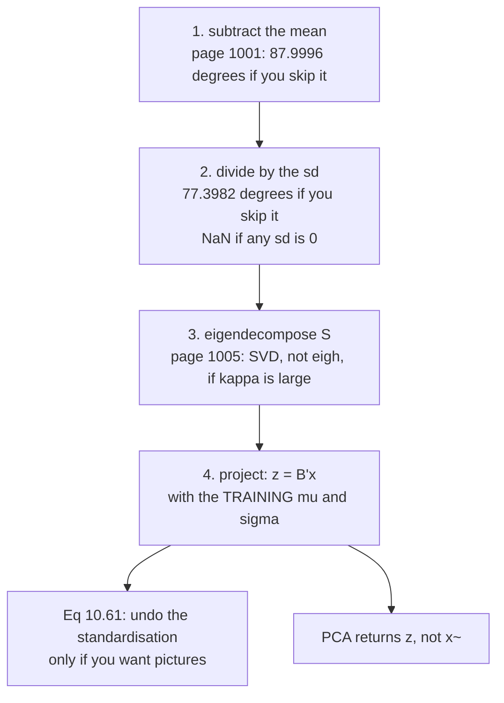

Six pages of derivation collapse into one recipe. §10.6 lists it, and two of its steps are not
bookkeeping:

**Step 2 changes the answer.** The book calls it *"standardization"* and moves on. Measured below,
skipping it lets a change of units rotate the leading direction by $77.3982^\circ$ on data that never
moved.

**Step 4 says whose mean and standard deviation to use.** *"We need to standardize $\mathbf{x}_*$ using
the mean $\mu_d$ and standard deviation $\sigma_d$ of the **training data**."* Using the test set's own
statistics instead makes the reported error *smaller*, which is why the mistake survives.

## What you'll learn

- The six steps as Figure 10.11 draws them, run end to end on one dataset.
- Why Step 1's *"not strictly necessary but reduces the risk of numerical problems"* understates it — page 1001 already measured the $87.9996^\circ$ swing.
- **What Step 2 actually does:** standardising then computing the covariance gives the **correlation matrix**, measured to $6.7\times10^{-16}$, and pins the total variance at exactly $D$.
- Measured on height and weight: unstandardised, the leading direction is $[0.003887, 0.999992]$ in metres and $[0.976750, 0.214380]$ in millimetres — $77.3982^\circ$ apart. Standardised, all three unit choices agree to $1.2\times10^{-6}$ degrees.
- Equations 10.58–10.61, the forward and inverse maps, with a round trip measured at $2.3\times10^{-14}$ when $M = D$.
- Two silent failures: dividing by a zero standard deviation produces **$2{,}088$ NaNs** on the digit-"8" images, and using the test set's own statistics reports $15.400250$ where the honest figure is $15.781992$.
- The sentence at the end of Step 4: **"PCA returns the coordinates (10.60), not the projections."**

## Intuition: PCA has no idea what your columns mean

Everything from §10.2 onward maximises variance, and variance has units. A column measured in millimetres
has a variance a million times larger than the same column in metres — so an unstandardised PCA will
point at whichever column happens to be recorded in the smallest unit.

Standardising sets every column's variance to $1$, which makes the question *"which direction varies
most"* meaningful across columns that measure different things. It is a decision, not a correction:
you are declaring that a one-standard-deviation move is equally important in every variable.

## §10.6 The six steps

**1. Mean subtraction.** *"This ensures that the dataset has mean $\mathbf{0}$. Mean subtraction is not
strictly necessary but reduces the risk of numerical problems."*

**2. Standardization.** Divide by the standard deviation $\sigma_d$ in every dimension. *"Now the data is
unit free, and it has variance $1$ along each axis."*

**3. Eigendecomposition of the covariance matrix.** By the spectral theorem an ONB of eigenvectors
exists; §10.4 covered how to obtain it.

**4. Projection.** For any $\mathbf{x}_*$:

$$
x_*^{(d)} \leftarrow \frac{x_*^{(d)} - \mu_d}{\sigma_d}, \qquad d = 1,\ldots,D \qquad \text{(10.58)}
$$

$$
\tilde{\mathbf{x}}_* = \mathbf{B}\mathbf{B}^\top\mathbf{x}_*,
\qquad
\mathbf{z}_* = \mathbf{B}^\top\mathbf{x}_* \qquad \text{(10.59), (10.60)}
$$

> **PCA returns the coordinates (10.60), not the projections $\mathbf{x}_*$.**

**5. Undoing the standardization**, if you want the picture back in the original space:

$$
\tilde{x}_*^{(d)} \leftarrow \tilde{x}_*^{(d)}\sigma_d + \mu_d, \qquad d = 1,\ldots,D \qquad \text{(10.61)}
$$

<Figure
  src="/images/mml/key-steps-of-pca-in-practice/the-six-steps"
  alt="Six scatter plots. The first shows a tilted cloud away from the origin; the second the same cloud centred; the third the same rescaled to unit variance with two axis arrows; the fourth the same with two eigenvector arrows of different lengths; the fifth the points collapsed onto a line; the sixth that line mapped back over the original cloud."
  title="Figure 10.11, run end to end"
  caption="Panels (c) and (d) hold the same points and differ only in what is drawn on them: the unit-variance axes Step 2 creates, then the eigenvectors Step 3 finds, scaled by the square roots of their eigenvalues. Panel (f) is Equation 10.61 — the projection carried back through the standardisation, which is why the orange line in (f) is not at 45 degrees."
/>

## Step 2 is a modelling decision

Take two genuinely different quantities — height and weight — with a correlation of $0.9198$, and vary
nothing but the unit of the first column:

| units of height | leading direction $\mathbf{b}_1$ | share of variance it keeps |
| --- | --- | --- |
| metres | $[0.003887,\ 0.999992]$ | $100.00\%$ |
| centimetres | $[0.369903,\ 0.929070]$ | $97.98\%$ |
| millimetres | $[0.976750,\ 0.214380]$ | $99.22\%$ |

| angle between two unstandardised answers | degrees |
| --- | --- |
| metres vs centimetres | $21.49$ |
| centimetres vs millimetres | $55.91$ |
| **metres vs millimetres** | $\mathbf{77.3982}$ |

Standardise first, and all three become $[0.707107,\ 0.707107]$ keeping $95.99\%$ — agreeing to
$1.2\times10^{-6}$ degrees.

<Figure
  src="/images/mml/key-steps-of-pca-in-practice/units-change-the-answer"
  alt="Top, three scatter plots of the same data with a red line through each; the line is nearly vertical in the first, diagonal in the second and nearly horizontal in the third. Bottom left, a log-scale bar chart pairing three large red bars around twenty to eighty degrees with three blue bars near 1e-7. Bottom right, two bars, 386.4299 and 2.0000."
  title="The same data, three units, three different first principal components"
  caption="Nothing about the data changed between the top three panels — only the number written on the height axis. Unstandardised PCA reports whichever column happens to carry the largest numbers. After Step 2 the three answers are the same direction to a millionth of a degree, and the total variance is exactly D."
/>

:::tip[What Step 2 is really doing]
Standardising and then forming Equation 10.1 gives the **correlation matrix**, not the covariance —
measured agreement with `np.corrcoef`, $6.7\times10^{-16}$:

| | raw covariance | after Step 2 |
| --- | --- | --- |
| the matrix | $\begin{bmatrix}0.0069 & 1.5019\\ 1.5019 & 386.4230\end{bmatrix}$ | $\begin{bmatrix}1 & 0.9198\\ 0.9198 & 1\end{bmatrix}$ |
| its trace | $386.429897$, in $\mathrm{m}^2 + \mathrm{kg}^2$ | $2.000000$, i.e. exactly $D$ |

That first trace is the giveaway. **It has no units** — it is a sum of a squared length and a squared
mass — so "the fraction of variance explained" computed from it is a ratio of two quantities that mean
nothing. After Step 2 the trace is $D$ for any dataset, and the fraction is a genuine share.

The trade-off is real and worth stating: standardising discards the information that one variable really
does vary more than another. When the columns share a unit — pixel intensities, say, or prices — that
information is meaningful and §10.6's Step 2 is the wrong default. **The digit pages in this chapter do
not standardise, for exactly that reason.**
:::

## Two silent failures

### A zero standard deviation

Equation 10.58 divides by $\sigma_d$. On the digit-"8" images, page 1001 measured $12$ pixels with
variance **exactly** zero:

| | value |
| --- | --- |
| pixels with $\sigma_d = 0$ | $12$ of $64$ |
| NaNs produced by Equation 10.58 | $\mathbf{2{,}088}$ ($= 12 \times 174$) |
| infinities produced | $0$ |

Every NaN is $0/0$, not a division of a nonzero number. `np.linalg.eigh` on the result raises nothing
useful; replacing the NaNs with zeros runs and decomposes a matrix built from values you invented. The
fix is to drop the constant dimensions first — they carry no information by construction, so removing
them costs nothing.

<Figure
  src="/images/mml/key-steps-of-pca-in-practice/standardise-carefully"
  alt="Left, an eight-by-eight heat map of pixel standard deviations with twelve dark cells around the left and right borders outlined in blue. Right, two nearly overlapping curves of test error against M, the red one slightly below the blue throughout."
  title="Both of these fail without raising anything"
  caption="Left: the outlined border pixels are black in every image, so Equation 10.58 divides zero by zero for each of them. Right: standardising the test set with its own mean and standard deviation reports a lower error at every M — 15.400250 against 15.781992 at M = 10 — because it has quietly re-centred the test set in a frame the basis was never fitted in."
/>

### The wrong mean and standard deviation

Step 4 is explicit that $\mu_d$ and $\sigma_d$ come from the **training** data. Measured on a
$140/34$ split of the digit-"8" images at $M = 10$:

| standardising the test set with | test RMS error, original units |
| --- | --- |
| the training mean and sd — Step 4 as written | $15.781992$ |
| the test set's own mean and sd | $\mathbf{15.400250}$ |

:::caution[The wrong answer is the better-looking one]
The difference is $-0.381741$: the leak makes the model look **better**, which is why it survives code
review. The test set's mean differs from the training mean by $5.900273$ and its per-pixel standard
deviations by up to $1.207279$, so re-standardising moves it into a frame that fits its own spread
slightly better than the frame $\mathbf{B}$ was fitted in.

The resulting number is not wrong by $0.38$ — it is **not a measurement of anything**, because the
basis and the data are now in different coordinate systems. And the effect grows with how much the two
sets differ, so a small test set makes it worse precisely when you can least afford it.
:::

## The round trip

Equations 10.58 → 10.60 → 10.59 → 10.61, on the same split, reporting the error back in the **original
pixel units**:

| $M$ | test RMS reconstruction error |
| --- | --- |
| $1$ | $24.179252$ |
| $5$ | $19.658189$ |
| $10$ | $15.781992$ |
| $20$ | $11.748255$ |
| $40$ | $6.473157$ |
| $64$ | $\mathbf{3.3\times10^{-14}}$ |

The last row is the check that matters: with every component kept, the whole pipeline — centre,
standardise, project, unproject, unstandardise — is the identity to floating point. (The exact
figure drifts in the last couple of digits between runs; what matters is that it is at machine
level and not, say, $10^{-6}$.)

:::note[Which number does PCA actually hand you?]
> PCA returns the coordinates (10.60), not the projections $\mathbf{x}_*$.

$\mathbf{z}_* = \mathbf{B}^\top\mathbf{x}_*$ is $M$ numbers; $\tilde{\mathbf{x}}_* = \mathbf{B}\mathbf{z}_*$
is $D$ numbers with only $M$ degrees of freedom, which page 1001 measured as a rank-$M$ matrix.

For one test image at $M = 10$, the code is

$$
[3.8604,\ -2.1537,\ 4.4452,\ -0.8718,\ 2.6041,\ -2.2010,\ 0.2211,\ 2.9317,\ 1.1960,\ -0.0958]
$$

That is what goes into the next model, the plot, or the index. The reconstruction exists only so you can
look at it — Equation 10.61's whole job is producing Figure 10.11(f) and Figure 10.12.
:::

<Quiz
  title="Is the recipe clear?"
  questions={[
    {
      q: "Why does Step 2 matter beyond being tidy?",
      options: [
        "It speeds up the eigendecomposition",
        "Without it the answer depends on the units — measured, a metres-to-millimetres change rotates the leading direction 77.3982 degrees",
        "It is required for the eigenvectors to be orthogonal",
        "It removes outliers",
      ],
      answer: 1,
      explain:
        "Variance has units, so a column recorded in a smaller unit has a larger variance and attracts the leading direction. In metres it comes out as [0.003887, 0.999992] and in millimetres as [0.976750, 0.214380] — the same data both times. After Step 2 the three unit choices agree to 1.2e-06 degrees.",
    },
    {
      q: "What matrix does the standardised data's covariance equal?",
      options: [
        "The identity",
        "The correlation matrix, and its trace is exactly D for any dataset",
        "The inverse covariance",
        "The Gram matrix",
      ],
      answer: 1,
      explain:
        "Measured to 6.7e-16. That is why the fraction-of-variance figure only means something after Step 2: the raw trace on height and weight was 386.429897 in units of squared metres plus squared kilograms, which is not a quantity. The cost is that you have declared a one-standard-deviation move equally important in every column.",
    },
    {
      q: "What happens if a dimension has zero variance and you apply Equation 10.58?",
      options: [
        "Nothing; the column becomes zero",
        "You divide zero by zero — 2,088 NaNs on the digit-8 images, with no error raised",
        "You get infinities",
        "numpy raises a ZeroDivisionError",
      ],
      answer: 1,
      explain:
        "Twelve of the sixty-four pixels are black in every image, giving 12 times 174 NaNs. No exception is raised; replacing them with zeros produces a decomposition of numbers you invented. Drop the constant dimensions first — they carry no information by construction.",
    },
    {
      q: "Step 4 says to standardise a new point with the training mean and standard deviation. What goes wrong otherwise?",
      options: [
        "The error goes up sharply",
        "The reported error goes DOWN — 15.400250 against an honest 15.781992 — and stops measuring anything",
        "The code has the wrong length",
        "The eigenvectors change",
      ],
      answer: 1,
      explain:
        "That is what makes the mistake durable: it flatters the result. The basis was fitted in the training coordinate frame, and re-standardising the test set moves it into a different frame that fits its own spread slightly better. The training and test means here differ by 5.900273.",
    },
  ]}
/>

## Exercises

### Exercise 1 – Change the unit, change the answer

<DataCampExercise
  lang="python"
  hint={`Step 2 divides each column by its own standard deviation, after subtracting the mean.`}
  code={`import numpy as np

rng = np.random.default_rng(7)
n = 400
h = 1.70 + 0.09 * rng.standard_normal(n)
wt = 20 * (h - 1.70) / 0.09 + 70 + 8 * rng.standard_normal(n)

def lead(A):
    A = A - A.mean(0)
    w, V = np.linalg.eigh(A.T @ A / len(A))
    v = V[:, -1]
    return v * np.sign(v[int(np.argmax(np.abs(v)))]), w[::-1]

def ang(u, v):
    return float(np.degrees(np.arccos(min(1.0, abs(u @ v)))))

raw, std = [], []
for name, sc in (("metres     ", 1.0), ("centimetres", 100.0),
                 ("millimetres", 1000.0)):
    A = np.c_[h * sc, wt]
    b, w = lead(A)
    raw.append(b)
    # Task: Step 2 -- make the data unit free.
    As = ___
    bs, ws = lead(As)
    std.append(bs)
    print(f"{name}: raw {np.round(b, 6)} ({w[0]/w.sum():6.2%})   "
          f"standardised {np.round(bs, 6)} ({ws[0]/ws.sum():6.2%})")

print(f"\\nraw, metres vs millimetres          : {ang(raw[0], raw[2]):.4f} deg")
print(f"standardised, worst of the three    : "
      f"{max(ang(std[i], std[j]) for i in range(3) for j in range(3)):.3f} deg")

# -- Expected output ------------------------------
# metres     : raw [0.003887 0.999992] (100.00%)   standardised [0.707107 0.707107] (95.99%)
# centimetres: raw [0.369903 0.92907 ] (97.98%)   standardised [0.707107 0.707107] (95.99%)
# millimetres: raw [0.97675 0.21438] (99.22%)   standardised [0.707107 0.707107] (95.99%)
#
# raw, metres vs millimetres          : 77.3982 deg
# standardised, worst of the three    : 0.000 deg
# -------------------------------------------------`}
  solution={`import numpy as np
rng = np.random.default_rng(7)
n = 400
h = 1.70 + 0.09 * rng.standard_normal(n)
wt = 20 * (h - 1.70) / 0.09 + 70 + 8 * rng.standard_normal(n)
def lead(A):
    A = A - A.mean(0)
    w, V = np.linalg.eigh(A.T @ A / len(A))
    v = V[:, -1]
    return v * np.sign(v[int(np.argmax(np.abs(v)))]), w[::-1]
def ang(u, v):
    return float(np.degrees(np.arccos(min(1.0, abs(u @ v)))))
raw, std = [], []
for name, sc in (("metres     ", 1.0), ("centimetres", 100.0),
                 ("millimetres", 1000.0)):
    A = np.c_[h * sc, wt]
    b, w = lead(A)
    raw.append(b)
    As = (A - A.mean(0)) / A.std(0)
    bs, ws = lead(As)
    std.append(bs)
    print(f"{name}: raw {np.round(b, 6)} ({w[0]/w.sum():6.2%})   "
          f"standardised {np.round(bs, 6)} ({ws[0]/ws.sum():6.2%})")
print(f"\\nraw, metres vs millimetres          : {ang(raw[0], raw[2]):.4f} deg")
print(f"standardised, worst of the three    : "
      f"{max(ang(std[i], std[j]) for i in range(3) for j in range(3)):.3f} deg")`}
  sct={`test_output_contains("raw, metres vs millimetres          : 77.3982 deg", pattern=False)
test_output_contains("standardised, worst of the three    : 0.000 deg", pattern=False)
success_msg("Seventy-seven degrees from a unit conversion. Every claim Sections 10.2 and 10.3 make is about variance, and variance carries the square of whatever unit you wrote down.")`}
  height={400}
/>

### Exercise 2 – What Step 2 turns the covariance into

<DataCampExercise
  lang="python"
  hint={`A correlation matrix is what you get when every variable has been divided by its own standard deviation.`}
  code={`import numpy as np

rng = np.random.default_rng(7)
n = 400
h = 1.70 + 0.09 * rng.standard_normal(n)
wt = 20 * (h - 1.70) / 0.09 + 70 + 8 * rng.standard_normal(n)
A = np.c_[h, wt]
Ac = A - A.mean(0)

S = Ac.T @ Ac / n
As = Ac / A.std(0)
Ss = As.T @ As / n
# Task: the matrix Ss turns out to be.
R = ___

print("raw covariance:")
print(np.round(S, 6))
print("after Step 2:")
print(np.round(Ss, 6))
print(f"max |Ss - R|  : {np.abs(Ss - R).max():.3e}")
print(f"trace(S)      : {np.trace(S):.6f}   (m^2 + kg^2)")
print(f"trace(Ss)     : {np.trace(Ss):.6f}   (= D)")

# -- Expected output ------------------------------
# raw covariance:
# [[6.90000000e-03 1.50189000e+00]
#  [1.50189000e+00 3.86422998e+02]]
# after Step 2:
# [[1.     0.9198]
#  [0.9198 1.    ]]
# max |Ss - R|  : 6.661e-16
# trace(S)      : 386.429897   (m^2 + kg^2)
# trace(Ss)     : 2.000000   (= D)
# -------------------------------------------------`}
  solution={`import numpy as np
rng = np.random.default_rng(7)
n = 400
h = 1.70 + 0.09 * rng.standard_normal(n)
wt = 20 * (h - 1.70) / 0.09 + 70 + 8 * rng.standard_normal(n)
A = np.c_[h, wt]
Ac = A - A.mean(0)
S = Ac.T @ Ac / n
As = Ac / A.std(0)
Ss = As.T @ As / n
R = np.corrcoef(A.T)
print("raw covariance:")
print(np.round(S, 6))
print("after Step 2:")
print(np.round(Ss, 6))
print(f"max |Ss - R|  : {np.abs(Ss - R).max():.3e}")
print(f"trace(S)      : {np.trace(S):.6f}   (m^2 + kg^2)")
print(f"trace(Ss)     : {np.trace(Ss):.6f}   (= D)")`}
  sct={`test_output_contains("max |Ss - R|  : 6.661e-16")
test_output_contains("trace(Ss)     : 2.000000")
success_msg("PCA after Step 2 is an eigendecomposition of the correlation matrix. Its trace is D for every dataset, which is the only reason a percentage of variance explained means anything — the raw trace here was a sum of squared metres and squared kilograms.")`}
  height={360}
/>

### Exercise 3 – Dividing by zero, quietly

<DataCampExercise
  lang="python"
  hint={`Some pixels are black in every image, so their standard deviation is exactly zero and Equation 10.58 computes 0/0.`}
  code={`import numpy as np
from sklearn.datasets import load_digits

A8 = load_digits().data[load_digits().target == 8]
N, D = A8.shape
sd = A8.std(0)

with np.errstate(divide="ignore", invalid="ignore"):
    # Task: Equation 10.58, applied to every column without thinking.
    Z = ___

print(f"pixels with sd exactly 0 : {int((sd == 0).sum())} of {D}")
print(f"NaNs produced            : {int(np.isnan(Z).sum())}")
print(f"infinities produced      : {int(np.isinf(Z).sum())}")
print(f"12 * 174                 : {12 * 174}")

live = sd > 0
Zs = (A8[:, live] - A8[:, live].mean(0)) / sd[live]
print(f"after dropping them      : shape {Zs.shape}, "
      f"{int(np.isnan(Zs).sum())} NaNs")

# -- Expected output ------------------------------
# pixels with sd exactly 0 : 12 of 64
# NaNs produced            : 2088
# infinities produced      : 0
# 12 * 174                 : 2088
# after dropping them      : shape (174, 52), 0 NaNs
# -------------------------------------------------`}
  solution={`import numpy as np
from sklearn.datasets import load_digits
A8 = load_digits().data[load_digits().target == 8]
N, D = A8.shape
sd = A8.std(0)
with np.errstate(divide="ignore", invalid="ignore"):
    Z = (A8 - A8.mean(0)) / sd
print(f"pixels with sd exactly 0 : {int((sd == 0).sum())} of {D}")
print(f"NaNs produced            : {int(np.isnan(Z).sum())}")
print(f"infinities produced      : {int(np.isinf(Z).sum())}")
print(f"12 * 174                 : {12 * 174}")
live = sd > 0
Zs = (A8[:, live] - A8[:, live].mean(0)) / sd[live]
print(f"after dropping them      : shape {Zs.shape}, "
      f"{int(np.isnan(Zs).sum())} NaNs")`}
  sct={`test_output_contains("NaNs produced            : 2088")
test_output_contains("after dropping them      : shape (174, 52), 0 NaNs")
success_msg("Every NaN is 0/0, not a real division — the numerator is zero too, because a constant column is already centred. Replacing them with zeros runs fine and decomposes numbers you made up; dropping the columns costs nothing, since they had no information to begin with.")`}
  height={340}
/>

### Exercise 4 – The round trip, in the original units

<DataCampExercise
  lang="python"
  hint={`Equation 10.61 multiplies by the standard deviation and then adds the mean back — the exact inverse of Equation 10.58.`}
  code={`import numpy as np
from sklearn.datasets import load_digits

A8 = load_digits().data[load_digits().target == 8]
N, D = A8.shape
idx = np.random.default_rng(3).permutation(N)
tr, te = idx[:140], idx[140:]
mu, sd = A8[tr].mean(0), A8[tr].std(0)
live = sd > 0

def standardise(A):
    Z = np.zeros_like(A, dtype=float)
    Z[:, live] = (A[:, live] - mu[live]) / sd[live]
    return Z

Ztr = standardise(A8[tr])
PC = np.linalg.eigh(Ztr.T @ Ztr / len(tr))[1][:, ::-1]

errs = {}
for M in (1, 5, 10, 20, 40, 64):
    B = PC[:, :M]
    z = standardise(A8[te]) @ B                  # Equation 10.60
    Xt = z @ B.T                                 # Equation 10.59
    # Task: Equation 10.61 -- back to the original units.
    back = ___
    errs[M] = float(np.sqrt(((A8[te] - back) ** 2).sum(1).mean()))
    if M < 64:
        print(f"M = {M:>2}: test RMS error = {errs[M]:.6e}")
print(f"M = 64: the round trip is exact below 1e-10: "
      f"{errs[64] < 1e-10}")

# -- Expected output ------------------------------
# M =  1: test RMS error = 2.417925e+01
# M =  5: test RMS error = 1.965819e+01
# M = 10: test RMS error = 1.578199e+01
# M = 20: test RMS error = 1.174826e+01
# M = 40: test RMS error = 6.473157e+00
# M = 64: the round trip is exact below 1e-10: True
# -------------------------------------------------`}
  solution={`import numpy as np
from sklearn.datasets import load_digits
A8 = load_digits().data[load_digits().target == 8]
N, D = A8.shape
idx = np.random.default_rng(3).permutation(N)
tr, te = idx[:140], idx[140:]
mu, sd = A8[tr].mean(0), A8[tr].std(0)
live = sd > 0
def standardise(A):
    Z = np.zeros_like(A, dtype=float)
    Z[:, live] = (A[:, live] - mu[live]) / sd[live]
    return Z
Ztr = standardise(A8[tr])
PC = np.linalg.eigh(Ztr.T @ Ztr / len(tr))[1][:, ::-1]
errs = {}
for M in (1, 5, 10, 20, 40, 64):
    B = PC[:, :M]
    z = standardise(A8[te]) @ B
    Xt = z @ B.T
    back = Xt * np.where(live, sd, 1.0) + mu
    errs[M] = float(np.sqrt(((A8[te] - back) ** 2).sum(1).mean()))
    if M < 64:
        print(f"M = {M:>2}: test RMS error = {errs[M]:.6e}")
print(f"M = 64: the round trip is exact below 1e-10: "
      f"{errs[64] < 1e-10}")`}
  sct={`test_output_contains("M = 10: test RMS error = 1.578199e+01")
test_output_contains("M = 64: the round trip is exact below 1e-10: True")
success_msg("The last row is the check that matters: keep every component and the whole pipeline is the identity to floating point. If it is not, one of the five steps has been inverted wrongly.")`}
  height={380}
/>

### Exercise 5 – Whose mean and standard deviation

<DataCampExercise
  lang="python"
  hint={`Step 4 says the TRAINING statistics. Build the second version with the test set's own mean and sd, and compare.`}
  code={`import numpy as np
from sklearn.datasets import load_digits

A8 = load_digits().data[load_digits().target == 8]
N, D = A8.shape
idx = np.random.default_rng(3).permutation(N)
tr, te = idx[:140], idx[140:]
mu, sd = A8[tr].mean(0), A8[tr].std(0)
live = sd > 0
mu_te, sd_te = A8[te].mean(0), A8[te].std(0)
live_te = sd_te > 0

Z = np.zeros((len(tr), D))
Z[:, live] = (A8[tr][:, live] - mu[live]) / sd[live]
B = np.linalg.eigh(Z.T @ Z / len(tr))[1][:, ::-1][:, :10]

def round_trip(m, s, lv):
    Zq = np.zeros((len(te), D))
    Zq[:, lv] = (A8[te][:, lv] - m[lv]) / s[lv]
    back = ((Zq @ B) @ B.T) * np.where(lv, s, 1.0) + m
    return float(np.sqrt(((A8[te] - back) ** 2).sum(1).mean()))

honest = round_trip(mu, sd, live)
# Task: the same thing, standardising the test set with its OWN statistics.
leaky = ___

print(f"training mean and sd (Step 4) : {honest:.6f}")
print(f"the test set's own statistics : {leaky:.6f}")
print(f"difference                    : {leaky - honest:+.6f}")
print(f"||mu_train - mu_test||        : {np.linalg.norm(mu - mu_te):.6f}")
print(f"largest |sd difference|       : {np.abs(sd - sd_te).max():.6f}")

# -- Expected output ------------------------------
# training mean and sd (Step 4) : 15.781992
# the test set's own statistics : 15.400250
# difference                    : -0.381741
# ||mu_train - mu_test||        : 5.900273
# largest |sd difference|       : 1.207279
# -------------------------------------------------`}
  solution={`import numpy as np
from sklearn.datasets import load_digits
A8 = load_digits().data[load_digits().target == 8]
N, D = A8.shape
idx = np.random.default_rng(3).permutation(N)
tr, te = idx[:140], idx[140:]
mu, sd = A8[tr].mean(0), A8[tr].std(0)
live = sd > 0
mu_te, sd_te = A8[te].mean(0), A8[te].std(0)
live_te = sd_te > 0
Z = np.zeros((len(tr), D))
Z[:, live] = (A8[tr][:, live] - mu[live]) / sd[live]
B = np.linalg.eigh(Z.T @ Z / len(tr))[1][:, ::-1][:, :10]
def round_trip(m, s, lv):
    Zq = np.zeros((len(te), D))
    Zq[:, lv] = (A8[te][:, lv] - m[lv]) / s[lv]
    back = ((Zq @ B) @ B.T) * np.where(lv, s, 1.0) + m
    return float(np.sqrt(((A8[te] - back) ** 2).sum(1).mean()))
honest = round_trip(mu, sd, live)
leaky = round_trip(mu_te, sd_te, live_te)
print(f"training mean and sd (Step 4) : {honest:.6f}")
print(f"the test set's own statistics : {leaky:.6f}")
print(f"difference                    : {leaky - honest:+.6f}")
print(f"||mu_train - mu_test||        : {np.linalg.norm(mu - mu_te):.6f}")
print(f"largest |sd difference|       : {np.abs(sd - sd_te).max():.6f}")`}
  sct={`test_output_contains("the test set's own statistics : 15.400250")
test_output_contains("difference                    : -0.381741")
success_msg("The leak makes the model look better, which is why it survives. The number is not wrong by 0.38 — it is not a measurement, because the basis and the data are now in different coordinate frames, and the gap grows with how much the two sets differ.")`}
  height={400}
/>

## Recall card

- **Section 10.6 is the recipe:** centre, standardise, eigendecompose, project with the training statistics, and optionally undo the standardisation to get a picture back.
- **Step 2 is a modelling decision, not tidiness.** Variance carries the square of whatever unit you wrote down, so an unstandardised PCA points at whichever column has the largest numbers.
- **Measured, switching height from metres to millimetres rotates the leading direction 77.3982 degrees** on data that never moved. After standardising, three unit choices agree to about a millionth of a degree.
- **Standardising and then computing Equation 10.1 gives the correlation matrix**, matched to 6.7e-16, and its trace is exactly D for every dataset.
- **Which is why a percentage of variance explained only means something after Step 2** — the raw trace on height and weight was a sum of squared metres and squared kilograms.
- **But the trade-off is real:** when the columns share a unit, the fact that one varies more is information, and standardising throws it away. The digit pages in this chapter do not standardise.
- **A zero standard deviation makes Equation 10.58 compute zero over zero.** On the digit-8 images that is 2,088 NaNs and no exception. Drop the constant columns first.
- **Step 4 says to use the training mean and standard deviation for any new point**, and the failure mode is the dangerous kind: using the test set's own statistics reports 15.400250 where the honest number is 15.781992.
- **A leak that flatters the result is the one that survives code review.**
- **Kept in full, the pipeline is the identity to about 3e-14** — the check worth writing whenever you implement it.
- **PCA returns the coordinates, not the projections.** The code is M numbers; the reconstruction is D numbers with only M degrees of freedom, and exists so you can look at it.

**Next:** **[The Latent Variable Perspective](../the-latent-variable-perspective/)** — §10.7 puts a
probabilistic model behind all of this, and recovers everything so far as the noise-free limit.
