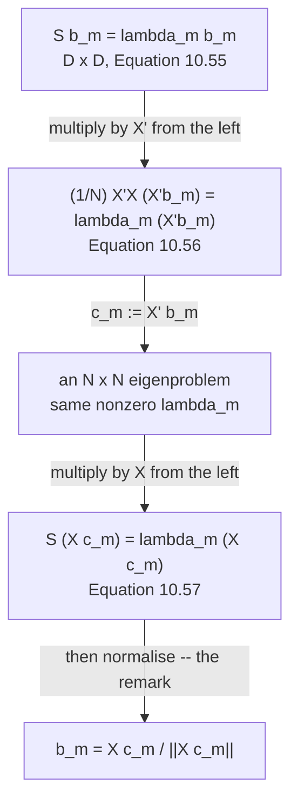

import DataCampExercise from "../../../../components/DataCampExercise.astro";
import Figure from "../../../../components/Figure.astro";
import Quiz from "../../../../components/Quiz.astro";

§10.4 asked how to compute the eigenvectors. §10.5 asks a sharper question: **is $\mathbf{S}$ even the
right matrix to decompose?**

> For example, if our $\mathbf{x}_n$ are images with $10{,}000$ pixels (e.g., $100 \times 100$ pixel
> images), we would need to compute the eigendecomposition of a $10{,}000 \times 10{,}000$ covariance
> matrix.

That matrix is $0.75$ GiB and its decomposition is cubic in $D$. If you have $50$ images, almost all of
it is zeros.

## What you'll learn

- Why $N \ll D$ makes $\mathbf{S}$ enormously redundant — and exactly how redundant: measured, a $784\times784$ covariance built from $50$ points has $735$ eigenvalues at machine zero.
- Equation 10.56's substitution $\mathbf{c}_m := \mathbf{X}^\top\mathbf{b}_m$, turning a $D\times D$ eigenproblem into an $N\times N$ one with the **same** nonzero eigenvalues — measured agreement $3.4\times10^{-13}$.
- Equation 10.57's recovery of $\mathbf{b}_m$ from $\mathbf{c}_m$, and the one-line remark after it that is **not** optional: measured, skipping the normalisation turns a reconstruction error of $1.160\times10^{1}$ into $6.269\times10^{4}$.
- What it actually saves: $47.9\times$ at $D = 500$ rising to $\mathbf{4565\times}$ at $D = 4000$, with the top five eigenvalues agreeing to $5.5\times10^{-12}$; and $0.75$ GiB of memory against $19.5$ KiB.
- **Two claims in §10.5 that centred data contradicts.** The book says the rank of $\mathbf{S}$ is $N$, and that $\frac{1}{N}\mathbf{X}^\top\mathbf{X}$ *"has rank $N$ and is invertible"*. Both are off by one: centring puts $\mathbf{1}$ in the null space, so the rank is $N-1$ and the Gram matrix is singular — measured condition number $4.15\times10^{17}$.
- Why §10.8 says this idea *"can be pushed to the extreme"*: the $N\times N$ matrix is built entirely from inner products, which is the door to kernel PCA.

## Intuition: fifty points cannot span ten thousand directions

$N$ points span at most an $N$-dimensional subspace — $N-1$ once you have subtracted their mean. Every
direction outside it has **exactly zero** variance in the data, so $\mathbf{S}$ has a huge null space
that was never interesting.

Decomposing $\mathbf{S}$ spends $O(D^3)$ work to discover that $D - N + 1$ of its eigenvalues are zero.
The Gram matrix $\frac{1}{N}\mathbf{X}^\top\mathbf{X}$ carries the same information in $N\times N$
numbers, because it never leaves the subspace the data occupies.

## §10.5 The substitution

Starting from the eigenvector equation with $\mathbf{S} = \frac{1}{N}\mathbf{X}\mathbf{X}^\top$:

$$
\mathbf{S}\mathbf{b}_m = \frac{1}{N}\mathbf{X}\mathbf{X}^\top\mathbf{b}_m = \lambda_m\mathbf{b}_m
\qquad \text{(10.55)}
$$

Multiply both sides by $\mathbf{X}^\top \in \mathbb{R}^{N\times D}$ from the left:

$$
\underbrace{\frac{1}{N}\mathbf{X}^\top\mathbf{X}}_{N\times N}\underbrace{\mathbf{X}^\top\mathbf{b}_m}_{=:\,\mathbf{c}_m}
= \lambda_m\mathbf{X}^\top\mathbf{b}_m
\iff
\frac{1}{N}\mathbf{X}^\top\mathbf{X}\,\mathbf{c}_m = \lambda_m\mathbf{c}_m \qquad \text{(10.56)}
$$

*"$\lambda_m$ remains eigenvalue, which confirms our results from Section 4.5.3 that the nonzero
eigenvalues of $\mathbf{X}\mathbf{X}^\top$ equal the nonzero eigenvalues of $\mathbf{X}^\top\mathbf{X}$."*

Measured on $N = 50$ synthetic images in $D = 784$ dimensions:

| $m$ | from the $784\times784$ | from the $50\times50$ | gap |
| --- | --- | --- | --- |
| $1$ | $1010.57711272$ | $1010.57711272$ | $0.0$ |
| $2$ | $968.72514472$ | $968.72514472$ | $3.4\times10^{-13}$ |
| $3$ | $663.10638499$ | $663.10638499$ | $0.0$ |
| $4$ | $642.21899801$ | $642.21899801$ | $0.0$ |
| $5$ | $505.05599122$ | $505.05599122$ | $2.3\times10^{-13}$ |

Nonzero eigenvalues in the $50\times50$ matrix: $\mathbf{49}$. Largest gap across all of them:
$3.4\times10^{-13}$. Largest of eigenvalues $50$ through $784$ of the big matrix: $2.0\times10^{-13}$.

And to get back:

$$
\underbrace{\frac{1}{N}\mathbf{X}\mathbf{X}^\top}_{\mathbf{S}}\mathbf{X}\mathbf{c}_m = \lambda_m\mathbf{X}\mathbf{c}_m
\qquad \text{(10.57)}
$$

> **Remark.** If we want to apply the PCA algorithm that we discussed in Section 10.6, we need to
> **normalize** the eigenvectors $\mathbf{X}\mathbf{c}_m$ of $\mathbf{S}$ so that they have norm $1$.

## That remark is the whole recipe, not a footnote

$\mathbf{X}\mathbf{c}_m$ points the right way and is the wrong length. Measured:

| $m$ | $\lVert\mathbf{X}\mathbf{c}_m\rVert$ | angle to $\mathbf{b}_m$ |
| --- | --- | --- |
| $1$ | $54.370770$ | $1.7\times10^{-6}$ deg |
| $2$ | $41.710546$ | $2.4\times10^{-6}$ deg |
| $3$ | $36.191109$ | $0.0$ deg |
| $4$ | $32.711041$ | $1.5\times10^{-6}$ deg |
| $5$ | $30.086078$ | $0.0$ deg |

(Measured on the $20$ digit-"8" images used in the exercises below. The synthetic
$784$-dimensional set gives norms in the hundreds instead, and the same angles.)

Every downstream formula — Equation 10.32's $\mathbf{z} = \mathbf{B}^\top\mathbf{x}$, Equation 10.34's
$\mathbf{B}\mathbf{B}^\top$, page 1004's $\mathrm{tr}(\mathbf{B}\mathbf{B}^\top) = M$ — assumed
$\mathbf{B}^\top\mathbf{B} = \mathbf{I}$. Page 1003 already measured what happens when it isn't. Here,
on the digit-"8" images with $N = 20$ and $M = 5$:

| $\mathbf{B}$ built from | reconstruction error |
| --- | --- |
| $\mathbf{X}\mathbf{c}_m$, used as is | $\mathbf{6.269\times10^{4}}$ |
| the same, normalised | $1.160\times10^{1}$ |
| the direct eigenvectors of $\mathbf{S}$ | $1.160\times10^{1}$ |

<Figure
  src="/images/mml/pca-in-high-dimensions/normalise-or-else"
  alt="Top row, four eight-by-eight images: a handwritten eight, a saturated black-and-white blob that looks nothing like it, and two identical faithful reconstructions. Bottom, a bar chart of eight column norms between about 18 and 54, with a dashed line near zero marking the value 1."
  title="Equation 10.57 gives the right directions and the wrong lengths"
  caption="The second panel is the same subspace and the wrong coordinates, which page 1003 measured as the cost of assuming orthonormality you do not have. The bar chart is why: these columns have norms between 18.52 and 54.37, and every formula from Equation 10.32 onwards assumed 1."
/>

## Two off-by-one claims in §10.5

The book states, of the $N \ll D$ case:

> If there are no duplicate data points, the rank of the covariance matrix $\mathbf{S}$ is $N$, so it has
> $D - N + 1$ many eigenvalues that are $0$.

Those two halves are inconsistent: rank $N$ implies $D - N$ zeros, not $D - N + 1$. And later:

> Assuming we have no duplicate data points, this matrix has rank $N$ and is **invertible**.

Both are true for **uncentred** data and false for the centred data §10.5 assumes in its first sentence
(*"Assume we have a centered dataset"*). Centring makes the rows of $\mathbf{X}$ sum to zero, so
$\mathbf{X}\mathbf{1} = \mathbf{0}$ and $\mathbf{1}$ is in the null space of
$\mathbf{X}^\top\mathbf{X}$:

| $\mathbf{X}$ | $\mathrm{rank}(\mathbf{X})$ | $\mathrm{rank}(\frac{1}{N}\mathbf{X}^\top\mathbf{X})$ | smallest eigenvalue | $\kappa$ |
| --- | --- | --- | --- | --- |
| uncentred | $50$ | $50$ | $2.407700$ | $4.45\times10^{2}$ |
| **centred**, as §10.5 assumes | $\mathbf{49}$ | $\mathbf{49}$ | $2.5\times10^{-14}$ | $\mathbf{4.15\times10^{17}}$ |

<Figure
  src="/images/mml/pca-in-high-dimensions/the-rank-is-what-you-have"
  alt="Left, two overlaid eigenvalue curves on a log scale, falling from about a thousand and then dropping off a cliff at index forty-nine, marked by a dotted vertical line. Right, two bars of height 49 and 50 against a dotted line at fifty, labelled with condition numbers 4.15e+17 and 1.59e+04."
  title="N points, N minus one directions"
  caption="The D-by-D and N-by-N spectra are the same curve until the cliff. The cliff is at 49, not 50 — subtracting the mean uses up one degree of freedom, so the all-ones vector lands in the null space. The book's D minus N plus one figure for the number of zeros is the correct one; its statement that the rank is N, and that the Gram matrix is invertible, is not."
/>

:::caution[This matters in code, not just on paper]
If you take the book's word that the Gram matrix is invertible and call `np.linalg.solve` or `inv` on it,
you get either a `LinAlgError` or — worse — a silently garbage answer at condition number
$4\times10^{17}$.

Nothing in §10.5 actually needs the inverse. `eigh` on a singular symmetric matrix is perfectly
well-behaved; it simply returns a zero eigenvalue, whose eigenvector is $\mathbf{1}/\sqrt{N}$ and whose
$\mathbf{X}\mathbf{c}_m$ is the zero vector. **Take $M \leq N-1$ components and the issue never arises.**

The same off-by-one appears throughout PCA practice: $N$ points give you $N-1$ usable components. It is
the same $-1$ as the $N-1$ in an unbiased sample variance, and for the same reason — the mean was
estimated from the data.
:::

## What it saves

The book's own example, $100\times100$ pixel images:

| object | size in memory, float64 |
| --- | --- |
| $\mathbf{S}$, $10{,}000\times10{,}000$ | $\mathbf{0.745}$ GiB |
| the Gram matrix, $50\times50$ | $19.5$ KiB |

Measured, at fixed $N = 50$, forming the matrix and decomposing it:

| $D$ | $D\times D$ route | $N\times N$ route | speed-up | top-$5$ eigenvalues agree to |
| --- | --- | --- | --- | --- |
| $500$ | $30.56$ ms | $0.64$ ms | $47.9\times$ | $6.8\times10^{-13}$ |
| $1000$ | $112.57$ ms | $0.69$ ms | $162.2\times$ | $6.8\times10^{-13}$ |
| $2000$ | $631.67$ ms | $1.35$ ms | $468.8\times$ | $6.8\times10^{-13}$ |
| $4000$ | $6188.99$ ms | $1.36$ ms | $\mathbf{4565.2\times}$ | $5.5\times10^{-12}$ |

<Figure
  src="/images/mml/pca-in-high-dimensions/two-routes-one-spectrum"
  alt="Left, a log-log plot with a red line climbing steeply from about 30 to 6000 milliseconds alongside a dotted cubic reference, and a blue line staying near one millisecond throughout. Right, a log-scale bar chart in which the red bars grow to about 760 MiB while the blue bars stay flat at a fraction of a MiB."
  title="One route grows with D cubed; the other barely moves"
  caption="At fixed N the Gram-matrix route's only D-dependent cost is forming X-transpose X and the final X c_m, both linear in D. The red curve tracks the cubic reference. The gap is 47.9 times at D = 500 and 4565 times at D = 4000, for eigenvalues agreeing to 5.5e-12."
/>

:::tip[Where this idea goes next]
Notice what $\frac{1}{N}\mathbf{X}^\top\mathbf{X}$ actually contains: its $(i,j)$ entry is
$\frac{1}{N}\mathbf{x}_i^\top\mathbf{x}_j$, an **inner product between two data points**. The dimension
$D$ appears nowhere in the matrix — only in the cost of computing each entry.

§10.8 draws the conclusion: *"By exploiting the insight that PCA can be performed by computing (many)
inner products, this idea can be pushed to the extreme by considering **infinite-dimensional
features**. The kernel trick is the basis of kernel PCA."*

Replace $\mathbf{x}_i^\top\mathbf{x}_j$ with $k(\mathbf{x}_i,\mathbf{x}_j)$ and everything on this page
still works, for a feature map you never write down. Chapter 12 will use the same substitution on the
support vector machine.
:::

<Quiz
  title="Is the high-dimensional trick clear?"
  questions={[
    {
      q: "With N = 50 centred points in D = 784 dimensions, how many nonzero eigenvalues does S have?",
      options: [
        "784",
        "49 — N points give N minus one directions once the mean is subtracted",
        "50",
        "It depends on the data",
      ],
      answer: 1,
      explain:
        "Measured: 49 nonzero, 735 at machine zero. The book's count of D minus N plus one zeros is right; its statement that the rank is N is off by one for the centred data it assumes two paragraphs earlier. Centring puts the all-ones vector in the null space of X-transpose X.",
    },
    {
      q: "What does Equation 10.56 achieve?",
      options: [
        "It approximates the eigenvalues",
        "It turns the D-by-D eigenproblem into an N-by-N one with exactly the same nonzero eigenvalues",
        "It only works for Gaussian data",
        "It computes the eigenvectors directly",
      ],
      answer: 1,
      explain:
        "Multiply S b = lambda b by X-transpose from the left, and X-transpose b becomes the eigenvector of the N-by-N Gram matrix with the same eigenvalue. Measured agreement on the top five: 3.4e-13. The eigenvectors come back via Equation 10.57, X c_m — after normalising.",
    },
    {
      q: "Why is the remark about normalising X c_m not optional?",
      options: [
        "Because otherwise the direction is wrong",
        "Because every formula from Equation 10.32 onwards assumes B-transpose B equals the identity, and these columns have norms in the hundreds",
        "Because numpy requires unit vectors",
        "Because the eigenvalues would change",
      ],
      answer: 1,
      explain:
        "The directions are exact — measured to under two millionths of a degree. The lengths are not: on the digit data the norms run from 18.52 to 54.37. Using them as is gives a reconstruction error of 6.269e+04 against 1.160e+01, which is page 1003's non-orthonormal-basis measurement all over again.",
    },
    {
      q: "What is the entry (i, j) of the matrix Equation 10.56 decomposes?",
      options: [
        "A covariance between pixels i and j",
        "An inner product between data points i and j, divided by N — which is why the kernel trick applies",
        "A distance",
        "A pixel value",
      ],
      answer: 1,
      explain:
        "The dimension D appears nowhere in the matrix, only in the cost of forming each entry. Section 10.8 pushes that to infinite-dimensional features: replace the inner product with a kernel and the whole of this page still works. That is kernel PCA, and Chapter 12 uses the same substitution on the support vector machine.",
    },
  ]}
/>

## Exercises

### Exercise 1 – How much of S is empty

<DataCampExercise
  lang="python"
  hint={`Centring subtracts the mean, which uses up one degree of freedom. Count the eigenvalues above a small threshold.`}
  code={`import numpy as np

rng = np.random.default_rng(0)
for D, N in ((784, 20), (784, 50), (10000, 50)):
    Z = rng.standard_normal((D, 6))
    X = Z @ rng.standard_normal((6, N)) + 0.5 * rng.standard_normal((D, N))
    # Task: centre the data, with the points as COLUMNS.
    X = ___
    r = np.linalg.matrix_rank(X)
    print(f"D = {D:>6}, N = {N:>3}: rank(X) = {r:>3}  ->  S is "
          f"{D}x{D} with {r} nonzero eigenvalues and {D - r} zeros")
    print(f"{'':>21}  the book's D - N + 1 = {D - N + 1}, "
          f"and D - N = {D - N}")

# -- Expected output ------------------------------
# D =    784, N =  20: rank(X) =  19  ->  S is 784x784 with 19 nonzero eigenvalues and 765 zeros
#                        the book's D - N + 1 = 765, and D - N = 764
# D =    784, N =  50: rank(X) =  49  ->  S is 784x784 with 49 nonzero eigenvalues and 735 zeros
#                        the book's D - N + 1 = 735, and D - N = 734
# D =  10000, N =  50: rank(X) =  49  ->  S is 10000x10000 with 49 nonzero eigenvalues and 9951 zeros
#                        the book's D - N + 1 = 9951, and D - N = 9950
# -------------------------------------------------`}
  solution={`import numpy as np
rng = np.random.default_rng(0)
for D, N in ((784, 20), (784, 50), (10000, 50)):
    Z = rng.standard_normal((D, 6))
    X = Z @ rng.standard_normal((6, N)) + 0.5 * rng.standard_normal((D, N))
    X = X - X.mean(1, keepdims=True)
    r = np.linalg.matrix_rank(X)
    print(f"D = {D:>6}, N = {N:>3}: rank(X) = {r:>3}  ->  S is "
          f"{D}x{D} with {r} nonzero eigenvalues and {D - r} zeros")
    print(f"{'':>21}  the book's D - N + 1 = {D - N + 1}, "
          f"and D - N = {D - N}")`}
  sct={`test_output_contains("rank(X) =  49  ->  S is 784x784 with 49 nonzero eigenvalues and 735 zeros")
test_output_contains("the book's D - N + 1 = 9951")
success_msg("The zero count matches the book's D - N + 1 exactly, which means the rank is N - 1 and not N. Both halves of that sentence cannot hold at once, and it is the rank half that is off by one for centred data.")`}
  height={340}
/>

### Exercise 2 – Equation 10.56, and the eigenvalues that survive

<DataCampExercise
  lang="python"
  hint={`The N-by-N matrix is X-transpose X over N — the Gram matrix of inner products between data points.`}
  code={`import numpy as np

rng = np.random.default_rng(0)
D, N = 784, 50
Z = rng.standard_normal((D, 6))
X = Z @ rng.standard_normal((6, N)) + 0.5 * rng.standard_normal((D, N))
X -= X.mean(1, keepdims=True)

S_big = X @ X.T / N
# Task: Equation 10.56's N x N matrix.
K_small = ___

wb = np.linalg.eigvalsh(S_big)[::-1]
ws = np.linalg.eigvalsh(K_small)[::-1]
print(f"S is {S_big.shape}, the Gram matrix is {K_small.shape}")
for m in range(4):
    print(f"  m = {m+1}: {wb[m]:>16.8f}  vs  {ws[m]:>16.8f}   "
          f"gap {abs(wb[m]-ws[m]):.2e}")
nz = int((ws > 1e-8).sum())
print(f"nonzero in the N x N        : {nz} of {N}")
print(f"largest gap over those      : {np.abs(wb[:nz]-ws[:nz]).max():.3e}")
print(f"largest of eigenvalues {nz+1}..{D} : {np.abs(wb[nz:]).max():.3e}")

# -- Expected output ------------------------------
# S is (784, 784), the Gram matrix is (50, 50)
#   m = 1:    1010.57711272  vs     1010.57711272   gap 0.00e+00
#   m = 2:     968.72514472  vs      968.72514472   gap 3.41e-13
#   m = 3:     663.10638499  vs      663.10638499   gap 0.00e+00
#   m = 4:     642.21899801  vs      642.21899801   gap 0.00e+00
# nonzero in the N x N        : 49 of 50
# largest gap over those      : 3.411e-13
# largest of eigenvalues 50..784 : 1.951e-13
# -------------------------------------------------`}
  solution={`import numpy as np
rng = np.random.default_rng(0)
D, N = 784, 50
Z = rng.standard_normal((D, 6))
X = Z @ rng.standard_normal((6, N)) + 0.5 * rng.standard_normal((D, N))
X -= X.mean(1, keepdims=True)
S_big = X @ X.T / N
K_small = X.T @ X / N
wb = np.linalg.eigvalsh(S_big)[::-1]
ws = np.linalg.eigvalsh(K_small)[::-1]
print(f"S is {S_big.shape}, the Gram matrix is {K_small.shape}")
for m in range(4):
    print(f"  m = {m+1}: {wb[m]:>16.8f}  vs  {ws[m]:>16.8f}   "
          f"gap {abs(wb[m]-ws[m]):.2e}")
nz = int((ws > 1e-8).sum())
print(f"nonzero in the N x N        : {nz} of {N}")
print(f"largest gap over those      : {np.abs(wb[:nz]-ws[:nz]).max():.3e}")
print(f"largest of eigenvalues {nz+1}..{D} : {np.abs(wb[nz:]).max():.3e}")`}
  sct={`test_output_contains("nonzero in the N x N        : 49 of 50")
test_output_contains("largest gap over those      : 3.411e-13")
success_msg("A 50-by-50 matrix carries every eigenvalue the 784-by-784 one has that is not zero, to 3.4e-13. The 735 it omits were never worth computing.")`}
  height={360}
/>

### Exercise 3 – The book says invertible; check it

<DataCampExercise
  lang="python"
  hint={`If the columns of X sum to zero across each row, then X times the all-ones vector is zero.`}
  code={`import numpy as np

rng = np.random.default_rng(0)
D, N = 784, 50
Z = rng.standard_normal((D, 6))
Xu = Z @ rng.standard_normal((6, N)) + 0.5 * rng.standard_normal((D, N))
Xc = Xu - Xu.mean(1, keepdims=True)

ones = np.ones(N) / np.sqrt(N)
for name, M in (("uncentred", Xu), ("centred  ", Xc)):
    K = M.T @ M / N
    w = np.linalg.eigvalsh(K)
    # Task: is the all-ones direction in the null space of K?
    null_test = ___
    print(f"{name}: rank {np.linalg.matrix_rank(K):>3}  "
          f"smallest eig {w[0]:>12.4e}  cond {np.linalg.cond(K):>10.4e}  "
          f"||K @ 1/sqrt(N)|| = {null_test:.3e}")

# -- Expected output ------------------------------
# uncentred: rank  50  smallest eig   2.4077e+00  cond 4.4482e+02  ||K @ 1/sqrt(N)|| = 3.597e+02
# centred  : rank  49  smallest eig   2.4869e-14  cond 4.1544e+17  ||K @ 1/sqrt(N)|| = 6.540e-14
# -------------------------------------------------`}
  solution={`import numpy as np
rng = np.random.default_rng(0)
D, N = 784, 50
Z = rng.standard_normal((D, 6))
Xu = Z @ rng.standard_normal((6, N)) + 0.5 * rng.standard_normal((D, N))
Xc = Xu - Xu.mean(1, keepdims=True)
ones = np.ones(N) / np.sqrt(N)
for name, M in (("uncentred", Xu), ("centred  ", Xc)):
    K = M.T @ M / N
    w = np.linalg.eigvalsh(K)
    null_test = float(np.linalg.norm(K @ ones))
    print(f"{name}: rank {np.linalg.matrix_rank(K):>3}  "
          f"smallest eig {w[0]:>12.4e}  cond {np.linalg.cond(K):>10.4e}  "
          f"||K @ 1/sqrt(N)|| = {null_test:.3e}")`}
  sct={`test_output_contains("centred  : rank  49")
test_output_contains("cond 4.1544e+17")
success_msg("Condition number 4.15e+17 is a singular matrix, and the null vector is exactly the direction the centring removed. Nothing in Section 10.5 needs the inverse — eigh handles a singular symmetric matrix fine, and you simply take M at most N minus one.")`}
  height={330}
/>

### Exercise 4 – Equation 10.57, with and without the remark

<DataCampExercise
  lang="python"
  hint={`np.linalg.norm(B, axis=0) gives the norm of each column; dividing by it makes every column a unit vector.`}
  code={`import numpy as np
from sklearn.datasets import load_digits

A8 = load_digits().data[load_digits().target == 8][:20]
N, D = A8.shape
X = (A8 - A8.mean(0)).T
M = 5

w, C = np.linalg.eigh(X.T @ X / N)
C = C[:, ::-1]
B_raw = X @ C[:, :M]                 # Equation 10.57
# Task: the remark after Equation 10.57.
B_ok = ___
PCd = np.linalg.eigh(X @ X.T / N)[1][:, ::-1][:, :M]

x0 = X[:, 0]
print(f"column norms of X c_m : {np.round(np.linalg.norm(B_raw, axis=0), 4)}")
for name, B in (("X c_m, as is      ", B_raw),
                ("after normalising ", B_ok),
                ("direct eigenvectors", PCd)):
    print(f"{name}: ||B'B - I|| = "
          f"{np.abs(B.T @ B - np.eye(M)).max():>12.4e}   "
          f"error = {np.linalg.norm(x0 - B @ (B.T @ x0)):>12.6e}")

# -- Expected output ------------------------------
# column norms of X c_m : [54.3708 41.7105 36.1911 32.711  30.0861]
# X c_m, as is      : ||B'B - I|| =   2.9552e+03   error = 6.269106e+04
# after normalising : ||B'B - I|| =   5.0283e-16   error = 1.159747e+01
# direct eigenvectors: ||B'B - I|| =   1.9984e-15   error = 1.159747e+01
# -------------------------------------------------`}
  solution={`import numpy as np
from sklearn.datasets import load_digits
A8 = load_digits().data[load_digits().target == 8][:20]
N, D = A8.shape
X = (A8 - A8.mean(0)).T
M = 5
w, C = np.linalg.eigh(X.T @ X / N)
C = C[:, ::-1]
B_raw = X @ C[:, :M]
B_ok = B_raw / np.linalg.norm(B_raw, axis=0)
PCd = np.linalg.eigh(X @ X.T / N)[1][:, ::-1][:, :M]
x0 = X[:, 0]
print(f"column norms of X c_m : {np.round(np.linalg.norm(B_raw, axis=0), 4)}")
for name, B in (("X c_m, as is      ", B_raw),
                ("after normalising ", B_ok),
                ("direct eigenvectors", PCd)):
    print(f"{name}: ||B'B - I|| = "
          f"{np.abs(B.T @ B - np.eye(M)).max():>12.4e}   "
          f"error = {np.linalg.norm(x0 - B @ (B.T @ x0)):>12.6e}")`}
  sct={`test_output_contains("error = 6.269106e+04")
test_output_contains("error = 1.159747e+01")
success_msg("A factor of 5,400 in reconstruction error for one missing division. The directions were right all along — the angle to the true eigenvectors is under two millionths of a degree — but Equation 10.32 was never a formula about directions.")`}
  height={360}
/>

### Exercise 5 – The whole pipeline, both ways

<DataCampExercise
  lang="python"
  hint={`Both routes should give the same J_M. Build B from X c_m, normalise it, and use the same reconstruction formula.`}
  code={`import numpy as np
from sklearn.datasets import load_digits

A8 = load_digits().data[load_digits().target == 8][:20]
N, D = A8.shape
X = (A8 - A8.mean(0)).T
M = 5

PCd = np.linalg.eigh(X @ X.T / N)[1][:, ::-1]
w, C = np.linalg.eigh(X.T @ X / N)
C = C[:, ::-1]
Br = X @ C[:, :M]
Br /= np.linalg.norm(Br, axis=0)

def J(B):
    # Task: the average squared reconstruction error, Equation 10.29.
    return ___

print(f"N = {N}, D = {D}, rank(X) = {np.linalg.matrix_rank(X)}")
print(f"J_5, the D x D route : {J(PCd[:, :M]):.6f}")
print(f"J_5, the N x N route : {J(Br):.6f}")
print(f"worst angle b_m vs recovered : "
      f"{max(np.degrees(np.arccos(min(1.0, abs(Br[:, m] @ PCd[:, m])))) for m in range(M)):.3e} deg")

# -- Expected output ------------------------------
# N = 20, D = 64, rank(X) = 19
# J_5, the D x D route : 130.550949
# J_5, the N x N route : 130.550949
# worst angle b_m vs recovered : 2.415e-06 deg
# -------------------------------------------------`}
  solution={`import numpy as np
from sklearn.datasets import load_digits
A8 = load_digits().data[load_digits().target == 8][:20]
N, D = A8.shape
X = (A8 - A8.mean(0)).T
M = 5
PCd = np.linalg.eigh(X @ X.T / N)[1][:, ::-1]
w, C = np.linalg.eigh(X.T @ X / N)
C = C[:, ::-1]
Br = X @ C[:, :M]
Br /= np.linalg.norm(Br, axis=0)
def J(B):
    return float(((X - B @ B.T @ X) ** 2).sum() / N)
print(f"N = {N}, D = {D}, rank(X) = {np.linalg.matrix_rank(X)}")
print(f"J_5, the D x D route : {J(PCd[:, :M]):.6f}")
print(f"J_5, the N x N route : {J(Br):.6f}")
print(f"worst angle b_m vs recovered : "
      f"{max(np.degrees(np.arccos(min(1.0, abs(Br[:, m] @ PCd[:, m])))) for m in range(M)):.3e} deg")`}
  sct={`test_output_contains("J_5, the N x N route : 130.550949")
test_output_contains("J_5, the D x D route : 130.550949")
success_msg("Identical to six decimals. Section 10.5 is not an approximation — it is the same computation with the empty directions never formed.")`}
  height={340}
/>

## Recall card

- **Section 10.5 is for the case where you have far fewer data points than dimensions**, which is the normal situation with images.
- **N centred points span N minus one directions**, so the D-by-D covariance matrix has D minus N plus one eigenvalues at machine zero. Measured: 49 nonzero out of 784 for fifty points.
- **Equation 10.56 multiplies the eigenvector equation by X-transpose from the left**, turning the D-by-D problem into an N-by-N one with exactly the same nonzero eigenvalues — measured agreement 3.4e-13.
- **Equation 10.57 recovers the eigenvectors as X times c**, and the remark after it says to normalise them.
- **That remark is the whole recipe, not a footnote.** The columns have norms in the tens or hundreds, and using them unnormalised turns a reconstruction error of 11.6 into 62,687.
- **The book says the Gram matrix has rank N and is invertible.** For the centred data it assumes, the rank is N minus one and the condition number is 4.15e+17 — the all-ones vector is in the null space.
- **Nothing in Section 10.5 needs that inverse.** Take at most N minus one components and the singularity never bites.
- **The saving is large and grows:** 47.9 times faster at D equal to 500, and 4565 times at D equal to 4000, for eigenvalues agreeing to 5.5e-12.
- **And in memory, 0.75 GiB against 19.5 KiB** for the book's own hundred-by-hundred pixel example.
- **Every entry of the N-by-N matrix is an inner product between two data points**, and the dimension appears nowhere in the matrix itself.
- **That is the door to kernel PCA**, which Section 10.8 names, and to the same substitution Chapter 12 makes in the support vector machine.

**Next:** **[Key Steps of PCA in Practice](../key-steps-of-pca-in-practice/)** — §10.6 assembles
everything into a six-step recipe, including the standardisation step that changes the answer.
