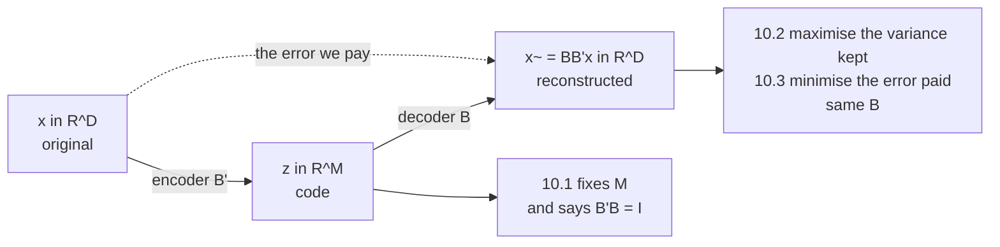

Chapter 9 fitted a function to labelled data. Chapter 10 has **no labels at all** — only $\mathbf{x}$,
and a request: *"find projections $\tilde{\mathbf{x}}_n$ of data points $\mathbf{x}_n$ that are as
similar to the original data points as possible, but which have a significantly lower intrinsic
dimensionality."*

This page is §10.1: three equations, one worked example, and a phrase in Equation 10.1's preamble that
decides whether any of it works.

## What you'll learn

- Equations 10.1–10.3: the **data covariance matrix**, the **code** $\mathbf{z} = \mathbf{B}^\top\mathbf{x}$, and the **projection matrix** $\mathbf{B}$.
- The four words *"with mean $\mathbf{0}$"* attached to Equation 10.1 — and what breaks without them. Measured on $174$ images of the digit "8": the leading direction moves $87.9996^\circ$, landing $0.2851^\circ$ from the **mean image**, which says nothing about how the digits differ.
- Why $\mathbf{B}^\top\mathbf{B}$ and $\mathbf{B}\mathbf{B}^\top$ are different objects. The first is $\mathbf{I}_M$ exactly; the second is $D\times D$ with $\mathrm{tr} = M$ — §10.3 will call it *"the best rank-$M$ approximation of the identity"*.
- Example 10.1, run three ways: the same $M = 1$ budget gives reconstruction errors $5.000000$, $3.000000$ and $0.000000$. **Choosing $\mathbf{b}$ is the entire rest of the chapter.**
- The book's own notation warning: data points are the **columns** of $\mathbf{X}$ here, not the rows. Every matrix shape in Chapter 10 depends on it.
- What "overcomplete" measures out to: rank $52$ of $64$, $12$ pixels with exactly zero variance, and $57$ of $1326$ pixel pairs correlated above $0.5$.

## Intuition: a bottleneck you choose the shape of

Compression is a promise about *what you are allowed to forget*. Figure 10.2 draws it as a funnel:
$\mathbf{x} \in \mathbb{R}^D$ goes in, a code $\mathbf{z} \in \mathbb{R}^M$ comes out the narrow part,
and a reconstruction $\tilde{\mathbf{x}} \in \mathbb{R}^D$ comes out the far side. The reconstruction has
$D$ numbers in it again — but only $M$ of them are free.

Two decisions live in that picture and they are not the same decision:

**How narrow is the neck?** That is $M$, and it is yours to pick. It fixes the storage bill and nothing else.

**Which directions survive it?** That is $\mathbf{B}$, and §10.1 does not answer it. It only says the
columns are orthonormal. Example 10.1 below shows two bases with the identical $M = 1$ budget producing
errors of $5$ and $3$ on the same vector — and a third reaching $0$. §10.2 and §10.3 are two derivations
of the *same* answer to this second question.

## §10.1 The three equations

The dataset is i.i.d., $\mathcal{X} = \{\mathbf{x}_1, \ldots, \mathbf{x}_N\}$ with $\mathbf{x}_n \in \mathbb{R}^D$,
**with mean $\mathbf{0}$**, and it *"possesses the data covariance matrix"*

$$
\mathbf{S} = \frac{1}{N}\sum_{n=1}^{N} \mathbf{x}_n\mathbf{x}_n^\top \qquad \text{(10.1)}
$$

There is assumed to exist a low-dimensional *compressed representation (code)*

$$
\mathbf{z}_n = \mathbf{B}^\top\mathbf{x}_n \in \mathbb{R}^M \qquad \text{(10.2)}
$$

with the *projection matrix*

$$
\mathbf{B} := [\mathbf{b}_1, \ldots, \mathbf{b}_M] \in \mathbb{R}^{D\times M} \qquad \text{(10.3)}
$$

whose columns are **orthonormal**: $\mathbf{b}_i^\top\mathbf{b}_j = 0$ for $i \neq j$ and
$\mathbf{b}_i^\top\mathbf{b}_i = 1$. The projected data are
$\tilde{\mathbf{x}} = \mathbf{B}\mathbf{B}^\top\mathbf{x} \in \mathbb{R}^D$, living in a subspace
$U \subseteq \mathbb{R}^D$ with $\dim(U) = M < D$.

:::caution[Read the shapes, then read the book's own warning]
> Throughout this chapter, we do not follow the convention of collecting data as the rows of the data
> matrix, but we define them to be the **columns** of $\mathbf{X}$.

So $\mathbf{X} \in \mathbb{R}^{D\times N}$, and $\mathbf{S} = \frac{1}{N}\mathbf{X}\mathbf{X}^\top$ is
$D\times D$. Almost every other textbook, and every `scikit-learn` array you will meet, is the transpose
of this. The book gives its reason plainly: *"the algebra operations work out smoothly without the need
to either transpose the matrix or to redefine vectors as row vectors."*

It is worth the five seconds to check: for the digit-"8" images used below, `sklearn` hands you a
$174\times 64$ array and the book wants the $64\times 174$ one. Getting this backwards produces a
$174\times174$ "covariance matrix" that will happily decompose and mean nothing.
:::

| symbol | shape | what it is |
| --- | --- | --- |
| $\mathbf{x}_n$ | $D\times 1$ | one data point |
| $\mathbf{X}$ | $D\times N$ | all of them, **as columns** |
| $\mathbf{S}$ | $D\times D$ | Equation 10.1 |
| $\mathbf{B}$ | $D\times M$ | Equation 10.3, orthonormal columns |
| $\mathbf{z}_n$ | $M\times 1$ | the code, Equation 10.2 |
| $\mathbf{B}^\top\mathbf{B}$ | $M\times M$ | **exactly $\mathbf{I}_M$** |
| $\mathbf{B}\mathbf{B}^\top$ | $D\times D$ | a projection, rank $M$ |

## The four words that carry the weight

Equation 10.1 is introduced as *"the data covariance matrix"*. It is one only because of the clause
before it: *"with mean $\mathbf{0}$"*. Written out, $\frac{1}{N}\sum \mathbf{x}_n\mathbf{x}_n^\top$ is the
matrix of **second moments**, and the covariance is

$$
\mathrm{Cov}[\mathcal{X}] = \frac{1}{N}\sum_{n=1}^{N}\mathbf{x}_n\mathbf{x}_n^\top - \boldsymbol\mu\boldsymbol\mu^\top
$$

The two agree exactly when $\boldsymbol\mu = \mathbf{0}$ and not otherwise. §10.6 will list centring as
"Step 1" and call it *"not strictly necessary but reduces the risk of numerical problems"* — which
understates it. Measured on the running dataset:

| quantity | value |
| --- | --- |
| $\lVert\boldsymbol\mu\rVert$ of the raw images | $57.264578$ |
| $\max\lvert\mathbf{S}_{\text{raw}} - \mathbf{S}_{\text{centred}}\rvert$ | $196.805423$ |
| and that gap **is** $\boldsymbol\mu\boldsymbol\mu^\top$, to | $5.7\times10^{-14}$ |
| $\mathrm{tr}(\mathbf{S}_{\text{centred}})$ — the total variance | $741.158872$ |
| $\mathrm{tr}(\mathbf{S}_{\text{raw}})$ | $4020.390805$, a factor of $\mathbf{5.4245}$ |

The trace is what §10.2 is about to start maximising, so inflating it by $5.4$ is not a rounding concern.
Where it actually lands:

| angle between | degrees |
| --- | --- |
| centred $\mathbf{b}_1$ and the mean image | $88.0699$ |
| **uncentred $\mathbf{b}_1$ and the mean image** | $\mathbf{0.2851}$ |
| centred $\mathbf{b}_1$ and uncentred $\mathbf{b}_1$ | $87.9996$ |

<Figure
  src="/images/mml/problem-setting/centring-is-not-optional"
  alt="Top left, a tilted elliptical cloud of points sitting well away from the origin; a yellow line runs from the origin through the cloud's centre while a blue line runs along the cloud's own long axis, nearly perpendicular to it. Top right, a horizontal bar chart of three angles: 88.07, 0.29 and 88.00 degrees. Bottom, three eight-by-eight images: a blurry grey average digit, a red-and-blue image that looks like that same average, and a third red-and-blue image with a quite different structure."
  title="Equation 10.1 is a covariance only when the mean is zero"
  caption="Skip the centring and the leading direction rotates 87.9996 degrees, to within 0.2851 degrees of the mean image — a direction along which every data point has nearly the same coordinate, and which therefore carries almost no information about how the digits differ from each other. The bottom row is the same statement as pictures."
/>

:::tip[Why the uncentred answer is degenerate, not merely different]
It is not that the uncentred direction is a worse choice among reasonable ones. It is that
$\frac{1}{N}\sum\mathbf{x}_n\mathbf{x}_n^\top$ measures **distance from the origin**, and the origin is
an arbitrary point that has nothing to do with the data. When $\lVert\boldsymbol\mu\rVert$ is large
compared with the spread — here $57.26$ against a total standard deviation of
$\sqrt{741.16} = 27.22$ — the sum is dominated by $N\boldsymbol\mu\boldsymbol\mu^\top$, a rank-one matrix
whose only eigenvector with a nonzero eigenvalue is $\boldsymbol\mu$ itself.

So the first "principal component" comes back as the mean, and the first coordinate $z_{1n}$ is
approximately the same number for every $n$. You have spent your entire $M = 1$ budget storing a constant.
:::

## Example 10.1, and the question §10.1 does not answer

The book's example is deliberately plain: in $\mathbb{R}^2$ with the canonical basis,
$[5, 3]^\top = 5\mathbf{e}_1 + 3\mathbf{e}_2$, while any vector of the form $[0, z]^\top$ needs only the
single coordinate $z$ with respect to $\mathbf{e}_2$. The set of such vectors is a subspace with
$\dim(U) = 1$, because $U = \mathrm{span}[\mathbf{e}_2]$.

Run it as a compression problem instead, on the vector $[5,3]^\top$ itself, with $M = 1$ throughout:

| basis $\mathbf{b}$ | code $\mathbf{z}$ | $\tilde{\mathbf{x}}$ | $\lVert\mathbf{x} - \tilde{\mathbf{x}}\rVert$ |
| --- | --- | --- | --- |
| $\mathbf{e}_2$ | $[3]$ | $[0, 3]^\top$ | $5.000000$ |
| $\mathbf{e}_1$ | $[5]$ | $[5, 0]^\top$ | $3.000000$ |
| $\mathbf{x}/\lVert\mathbf{x}\rVert$ | $[5.830952]$ | $[5, 3]^\top$ | $\mathbf{0.000000}$ |

<Figure
  src="/images/mml/problem-setting/one-budget-two-bases"
  alt="Left, a red cross at coordinates five, three with three coloured lines through the origin — vertical, horizontal and diagonal — and a dotted drop line from the cross to each. The diagonal line passes through the cross itself. Right, a bar chart of three reconstruction errors: five, three, and zero."
  title="One code length, three bases, three answers"
  caption="Every row spends exactly one number. The book's Section 10.1 fixes M and requires orthonormal columns, and stops there — nothing said so far prefers any of these three. Sections 10.2 and 10.3 are two different derivations of the same preference."
/>

:::note[One data point is a special case, and it is worth knowing why]
With a single vector, the perfect basis is the vector itself, and a code of length $1$ is lossless. That
is $\mathbf{S} = \frac{1}{1}\mathbf{x}\mathbf{x}^\top$, a rank-one matrix: **one** nonzero eigenvalue,
$\lVert\mathbf{x}\rVert^2 = 34$, with eigenvector $\mathbf{x}/\lVert\mathbf{x}\rVert$.

The whole difficulty of PCA arrives with the second data point, when one direction has to serve two
vectors that disagree about which direction is best.
:::

## The bottleneck, on a real image

The book's running example is MNIST: $60{,}000$ handwritten digits at $28\times28$ pixels, so
$\mathbf{x} \in \mathbb{R}^{784}$. The pages here use the $8\times8$ version of the same corpus that
ships inside `scikit-learn`, which needs no download and reproduces to the digit — $D = 64$, and
$N = 174$ images of the digit "8". Everything on this page scales; only the numbers change.

<Figure
  src="/images/mml/problem-setting/code-and-reconstruction"
  alt="Top row, six small eight-by-eight greyscale images: an original handwritten eight, then five reconstructions at code lengths one, two, five, ten and twenty, labelled with the fraction of raw storage each uses. Bottom row, the five residual images in red and blue, fading steadily towards blank as the code length grows."
  title="The reconstruction has 64 numbers in it and M degrees of freedom"
  caption="The top row is Figure 10.2 run end to end. Each reconstruction is a full 64-pixel image, but the matrix of all 174 of them has rank exactly M — measured at 1, 2, 5, 10 and 20. The bottom row is what was thrown away: the residual visibly drains as M grows, and the error norm falls 25.92, 23.99, 20.06, 15.36, 9.35."
/>

The storage arithmetic is worth doing once, because it is the only reason to compress at all. Keeping
the codes **and** the basis costs $NM + DM = M(N+D)$ numbers against $ND$ raw:

| $M$ | rank of $\tilde{\mathbf{X}}$ | numbers stored | share of $11{,}136$ |
| --- | --- | --- | --- |
| $1$ | $1$ | $238$ | $2.1\%$ |
| $2$ | $2$ | $476$ | $4.3\%$ |
| $5$ | $5$ | $1190$ | $10.7\%$ |
| $10$ | $10$ | $2380$ | $21.4\%$ |
| $20$ | $20$ | $4760$ | $42.7\%$ |

:::caution[The basis is a fixed cost, and with few data points it dominates]
$M(N+D) < ND$ fails once $M \geq \frac{ND}{N+D}$. Here that is $11136/238 = 46.79$, so **$M = 47$ or more
stores more numbers than the raw data** — even though $M = 47$ is still a genuine dimensionality
reduction from $D = 64$.

With $N = 60{,}000$ MNIST images the basis is negligible and the ratio is essentially $M/D$. With $N$
comparable to $D$ it is not, and that asymmetry is exactly the regime §10.5 is written for.
:::

## Two matrices that are easy to confuse

$\mathbf{B}^\top\mathbf{B}$ and $\mathbf{B}\mathbf{B}^\top$ are built from the same $D\times M$ matrix and
are nothing alike.

$$
\mathbf{B}^\top\mathbf{B} = \mathbf{I}_M \in \mathbb{R}^{M\times M},
\qquad
\mathbf{B}\mathbf{B}^\top = \sum_{m=1}^{M}\mathbf{b}_m\mathbf{b}_m^\top \in \mathbb{R}^{D\times D}
$$

The first is the orthonormality assumption restated. The second is the projection onto
$\mathrm{span}[\mathbf{b}_1,\ldots,\mathbf{b}_M]$ — §10.3 arrives at it as Equation 10.39 and notes it is
*"the best rank-$M$ approximation of the identity matrix"*. Measured, using the same tests page 909 ran
on the linear-regression hat matrix:

| $M$ | $\lvert\mathbf{B}^\top\mathbf{B} - \mathbf{I}\rvert$ | $\lvert P^2 - P\rvert$ | $\lvert P - P^\top\rvert$ | $\mathrm{tr}(P)$ |
| --- | --- | --- | --- | --- |
| $1$ | $4.4\times10^{-16}$ | $6.9\times10^{-17}$ | $0.0$ | $1.000000$ |
| $2$ | $3.3\times10^{-16}$ | $8.3\times10^{-17}$ | $0.0$ | $2.000000$ |
| $5$ | $6.7\times10^{-16}$ | $2.2\times10^{-16}$ | $0.0$ | $5.000000$ |
| $10$ | $1.3\times10^{-15}$ | $4.2\times10^{-16}$ | $0.0$ | $10.000000$ |

**The trace of a projection is its rank**, which is the same fact page 909 used to explain Equation
9.22's $(N-K)/N$ bias. Chapter 10 will use it again in Equation 10.43b.

## What "overcomplete" actually measures

The chapter's opening claim is that high-dimensional data *"is often overcomplete, i.e., many dimensions
are redundant and can be explained by a combination of other dimensions"*, and that dimensions *"are
often correlated so that the data possesses an intrinsic lower-dimensional structure."* On the
digit-"8" images:

| claim | measurement |
| --- | --- |
| dimensions are redundant | the centred $64\times174$ matrix has rank $\mathbf{52}$, not $64$ |
| some carry nothing at all | $\mathbf{12}$ pixels have **exactly** zero variance; $19$ have variance below $1$ |
| dimensions are correlated | mean $\lvert\text{corr}\rvert$ between live pixels $= 0.152872$ |
| strongly, in places | $\mathbf{57}$ of $1326$ pixel pairs exceed $\lvert\text{corr}\rvert = 0.5$ |

Twelve dead pixels is a free dimensionality reduction that needs no eigendecomposition: they are the
image border, always black in every "8". The other $12$ lost ranks are the interesting part — no single
pixel is redundant, but the $52$ live directions span everything.

<Quiz
  title="Is the setup clear?"
  questions={[
    {
      q: "Equation 10.1 defines S as the average of x x-transpose. When is that the data covariance matrix?",
      options: [
        "Always — it is the definition of covariance",
        "Only when the data has mean zero; otherwise it exceeds the covariance by mu mu-transpose",
        "Only when the data is Gaussian",
        "Only when N is larger than D",
      ],
      answer: 1,
      explain:
        "Measured on 174 images of the digit 8: the gap between the raw second-moment matrix and the true covariance matches mu mu-transpose to 5.7e-14, the trace is inflated by a factor of 5.4245, and the leading direction rotates 87.9996 degrees onto the mean image itself — 0.2851 degrees from it.",
    },
    {
      q: "B is D-by-M with orthonormal columns. What is B-transpose times B, and what is B times B-transpose?",
      options: [
        "Both are the identity",
        "B-transpose B is the M-by-M identity; B B-transpose is D-by-D with rank M and trace M",
        "B-transpose B is D-by-D; B B-transpose is M-by-M",
        "Neither is symmetric",
      ],
      answer: 1,
      explain:
        "Measured at M = 1, 2, 5 and 10: B-transpose B matches the identity to 1.3e-15 at worst, while B B-transpose is exactly symmetric, idempotent to 4.2e-16, and has trace exactly M. The trace of a projection is its rank — the same fact page 909 used on the regression hat matrix.",
    },
    {
      q: "Section 10.1 fixes M and requires orthonormal columns. What does it NOT do?",
      options: [
        "It does not say what D is",
        "It does not choose the basis — nothing in Section 10.1 prefers one orthonormal B over another",
        "It does not allow the data to be centred",
        "It does not define the reconstruction",
      ],
      answer: 1,
      explain:
        "Example 10.1 run as a compression problem: the vector [5, 3] with M = 1 gives reconstruction errors 5.000000 with b = e2, 3.000000 with b = e1, and 0.000000 with b along x itself. Same budget, same orthonormality, three answers. Sections 10.2 and 10.3 are two derivations of the same choice.",
    },
    {
      q: "For the 174 digit-8 images with D = 64, at what M does storing codes plus basis stop saving anything?",
      options: [
        "M = 64, when the code is as long as the data",
        "M = 47, because the basis costs D*M numbers on top of the N*M codes",
        "M = 32, half of D",
        "It always saves, for any M less than D",
      ],
      answer: 1,
      explain:
        "M(N + D) < N*D fails at M >= 11136/238 = 46.79. The basis is a fixed cost paid once, so it only disappears when N is large — with 60,000 MNIST images it is negligible and the ratio is essentially M/D. When N is comparable to D it is not, which is the regime Section 10.5 addresses.",
    },
  ]}
/>

## Exercises

### Exercise 1 – Equation 10.1 is a covariance only if you centre

<DataCampExercise
  lang="python"
  hint={`The gap between the raw second-moment matrix and the covariance is the outer product of the mean with itself: np.outer(mu, mu).`}
  code={`import numpy as np
from sklearn.datasets import load_digits

A8 = load_digits().data[load_digits().target == 8]   # (174, 64), rows
N, D = A8.shape
mu = A8.mean(0)
Xc = (A8 - mu).T                    # the book's layout: D x N

S_cen = Xc @ Xc.T / N               # Equation 10.1 on centred data
S_raw = A8.T @ A8 / N               # Equation 10.1 applied literally

# Task: the difference between the two is one rank-one matrix. Which?
gap = ___

print(f"N = {N}, D = {D}, ||mu|| = {np.linalg.norm(mu):.6f}")
print(f"max |S_raw - S_cen|          : {np.abs(S_raw - S_cen).max():.6f}")
print(f"and it IS that matrix, to    : {np.abs(S_raw - S_cen - gap).max():.3e}")
print(f"trace(S_cen)                 : {np.trace(S_cen):.6f}")
print(f"trace(S_raw)                 : {np.trace(S_raw):.6f}  "
      f"({np.trace(S_raw)/np.trace(S_cen):.4f}x)")

# -- Expected output ------------------------------
# N = 174, D = 64, ||mu|| = 57.264578
# max |S_raw - S_cen|          : 196.805423
# and it IS that matrix, to    : 5.684e-14
# trace(S_cen)                 : 741.158872
# trace(S_raw)                 : 4020.390805  (5.4245x)
# -------------------------------------------------`}
  solution={`import numpy as np
from sklearn.datasets import load_digits
A8 = load_digits().data[load_digits().target == 8]
N, D = A8.shape
mu = A8.mean(0)
Xc = (A8 - mu).T
S_cen = Xc @ Xc.T / N
S_raw = A8.T @ A8 / N
gap = np.outer(mu, mu)
print(f"N = {N}, D = {D}, ||mu|| = {np.linalg.norm(mu):.6f}")
print(f"max |S_raw - S_cen|          : {np.abs(S_raw - S_cen).max():.6f}")
print(f"and it IS that matrix, to    : {np.abs(S_raw - S_cen - gap).max():.3e}")
print(f"trace(S_cen)                 : {np.trace(S_cen):.6f}")
print(f"trace(S_raw)                 : {np.trace(S_raw):.6f}  "
      f"({np.trace(S_raw)/np.trace(S_cen):.4f}x)")`}
  sct={`test_output_contains("max |S_raw - S_cen|          : 196.805423")
test_output_contains("(5.4245x)")
success_msg("The trace is the total variance, and Section 10.2 is about to start maximising it. Inflating it by 5.4245 is not a numerical nicety — it is a different objective.")`}
  height={330}
/>

### Exercise 2 – Where the uncentred direction actually points

<DataCampExercise
  lang="python"
  hint={`np.linalg.eigh returns eigenvalues in ASCENDING order, so the leading eigenvector is the LAST column: V[:, -1].`}
  code={`import numpy as np
from sklearn.datasets import load_digits

A8 = load_digits().data[load_digits().target == 8]
N = len(A8)
mu = A8.mean(0)
Xc = (A8 - mu).T

_, V_cen = np.linalg.eigh(Xc @ Xc.T / N)
_, V_raw = np.linalg.eigh(A8.T @ A8 / N)

# Task: eigh sorts ASCENDING. Take the leading eigenvector of each.
b_cen = ___
b_raw = ___

mh = mu / np.linalg.norm(mu)
def ang(u, v):
    return float(np.degrees(np.arccos(abs(u @ v))))

print(f"centred b1   vs mean image : {ang(b_cen, mh):.4f} deg")
print(f"uncentred b1 vs mean image : {ang(b_raw, mh):.4f} deg")
print(f"centred b1   vs uncentred  : {ang(b_cen, b_raw):.4f} deg")

# -- Expected output ------------------------------
# centred b1   vs mean image : 88.0699 deg
# uncentred b1 vs mean image : 0.2851 deg
# centred b1   vs uncentred  : 87.9996 deg
# -------------------------------------------------`}
  solution={`import numpy as np
from sklearn.datasets import load_digits
A8 = load_digits().data[load_digits().target == 8]
N = len(A8)
mu = A8.mean(0)
Xc = (A8 - mu).T
_, V_cen = np.linalg.eigh(Xc @ Xc.T / N)
_, V_raw = np.linalg.eigh(A8.T @ A8 / N)
b_cen = V_cen[:, -1]
b_raw = V_raw[:, -1]
mh = mu / np.linalg.norm(mu)
def ang(u, v):
    return float(np.degrees(np.arccos(abs(u @ v))))
print(f"centred b1   vs mean image : {ang(b_cen, mh):.4f} deg")
print(f"uncentred b1 vs mean image : {ang(b_raw, mh):.4f} deg")
print(f"centred b1   vs uncentred  : {ang(b_cen, b_raw):.4f} deg")`}
  sct={`test_output_contains("uncentred b1 vs mean image : 0.2851 deg")
test_output_contains("centred b1   vs uncentred  : 87.9996 deg")
success_msg("0.2851 degrees from the mean image. That direction has nearly the same coordinate for every data point, so the first code number would be a constant — the whole M = 1 budget spent storing something you already knew.")`}
  height={330}
/>

### Exercise 3 – Two matrices, two shapes, one projection

<DataCampExercise
  lang="python"
  hint={`B is D x M, so B.T @ B is M x M and B @ B.T is D x D. Only one of them can be the identity.`}
  code={`import numpy as np
from sklearn.datasets import load_digits

A8 = load_digits().data[load_digits().target == 8]
N = len(A8)
Xc = (A8 - A8.mean(0)).T
_, V = np.linalg.eigh(Xc @ Xc.T / N)
PC = V[:, ::-1]                      # largest eigenvalue first

for M in (1, 2, 5, 10):
    B = PC[:, :M]
    # Task: build the projection onto span(b_1 ... b_M).
    P = ___
    print(f"M = {M:>2}: B'B is {str((B.T @ B).shape):>8}, off I by "
          f"{np.abs(B.T @ B - np.eye(M)).max():.1e} | "
          f"BB' is {str(P.shape):>9}, off P*P by "
          f"{np.abs(P @ P - P).max():.1e}, tr = {np.trace(P):.6f}")

# -- Expected output ------------------------------
# M =  1: B'B is   (1, 1), off I by 4.4e-16 | BB' is  (64, 64), off P*P by 6.9e-17, tr = 1.000000
# M =  2: B'B is   (2, 2), off I by 3.3e-16 | BB' is  (64, 64), off P*P by 8.3e-17, tr = 2.000000
# M =  5: B'B is   (5, 5), off I by 6.7e-16 | BB' is  (64, 64), off P*P by 2.2e-16, tr = 5.000000
# M = 10: B'B is (10, 10), off I by 1.3e-15 | BB' is  (64, 64), off P*P by 4.2e-16, tr = 10.000000
# -------------------------------------------------`}
  solution={`import numpy as np
from sklearn.datasets import load_digits
A8 = load_digits().data[load_digits().target == 8]
N = len(A8)
Xc = (A8 - A8.mean(0)).T
_, V = np.linalg.eigh(Xc @ Xc.T / N)
PC = V[:, ::-1]
for M in (1, 2, 5, 10):
    B = PC[:, :M]
    P = B @ B.T
    print(f"M = {M:>2}: B'B is {str((B.T @ B).shape):>8}, off I by "
          f"{np.abs(B.T @ B - np.eye(M)).max():.1e} | "
          f"BB' is {str(P.shape):>9}, off P*P by "
          f"{np.abs(P @ P - P).max():.1e}, tr = {np.trace(P):.6f}")`}
  sct={`test_output_contains("tr = 10.000000")
test_output_contains("tr = 1.000000")
success_msg("The trace of a projection is its rank. That single fact reappears as Equation 10.43b, and page 909 already used it to explain Equation 9.22's (N-K)/N bias.")`}
  height={330}
/>

### Exercise 4 – Example 10.1 as a compression problem

<DataCampExercise
  lang="python"
  hint={`For a unit vector b, the reconstruction is b times (b dot x). The error is the norm of what is left.`}
  code={`import numpy as np

x = np.array([5.0, 3.0])
e1, e2 = np.eye(2)

bases = [("e2      ", e2),
         ("e1      ", e1),
         ("x/||x|| ", x / np.linalg.norm(x))]

for name, b in bases:
    B = b.reshape(2, 1)              # D x M with M = 1
    z = B.T @ x                      # Equation 10.2
    # Task: Equation 10.3's reconstruction, from the code back to R^D.
    xt = ___
    print(f"b = {name} z = [{z[0]:8.6f}]  x~ = "
          f"[{xt[0]:.3f}, {xt[1]:.3f}]  error = "
          f"{np.linalg.norm(x - xt):.6f}")

print(f"\\nS for a single point has rank 1, eigenvalue ||x||^2 = {x @ x:.0f}")

# -- Expected output ------------------------------
# b = e2       z = [3.000000]  x~ = [0.000, 3.000]  error = 5.000000
# b = e1       z = [5.000000]  x~ = [5.000, 0.000]  error = 3.000000
# b = x/||x||  z = [5.830952]  x~ = [5.000, 3.000]  error = 0.000000
#
# S for a single point has rank 1, eigenvalue ||x||^2 = 34
# -------------------------------------------------`}
  solution={`import numpy as np
x = np.array([5.0, 3.0])
e1, e2 = np.eye(2)
bases = [("e2      ", e2),
         ("e1      ", e1),
         ("x/||x|| ", x / np.linalg.norm(x))]
for name, b in bases:
    B = b.reshape(2, 1)
    z = B.T @ x
    xt = B @ z
    print(f"b = {name} z = [{z[0]:8.6f}]  x~ = "
          f"[{xt[0]:.3f}, {xt[1]:.3f}]  error = "
          f"{np.linalg.norm(x - xt):.6f}")
print(f"\\nS for a single point has rank 1, eigenvalue ||x||^2 = {x @ x:.0f}")`}
  sct={`test_output_contains("error = 5.000000")
test_output_contains("error = 0.000000")
success_msg("Three orthonormal bases, one code length, errors of 5, 3 and 0. Everything Section 10.1 says is satisfied by all three — which is precisely why Sections 10.2 and 10.3 have something to derive.")`}
  height={330}
/>

### Exercise 5 – When does compressing stop saving anything?

<DataCampExercise
  lang="python"
  hint={`Storing the codes costs N*M numbers, and storing the basis costs D*M more. Raw storage is N*D.`}
  code={`import numpy as np
from sklearn.datasets import load_digits

A8 = load_digits().data[load_digits().target == 8]
N, D = A8.shape
raw = N * D

# Task: total numbers kept for a code of length M -- codes AND basis.
def stored(M):
    return ___

print(f"N = {N}, D = {D}, raw = {raw}")
for M in (1, 2, 5, 10, 20):
    print(f"  M = {M:>2}: {stored(M):>6} numbers  ({stored(M)/raw:6.1%})")

break_even = next(M for M in range(1, D + 1) if stored(M) >= raw)
print(f"\\nfirst M that saves nothing : {break_even}  "
      f"(N*D/(N+D) = {raw/(N+D):.2f})")
print(f"with N = 60000 MNIST images, that M would be "
      f"{60000*784/(60000+784):.2f}")

# -- Expected output ------------------------------
# N = 174, D = 64, raw = 11136
#   M =  1:    238 numbers  (  2.1%)
#   M =  2:    476 numbers  (  4.3%)
#   M =  5:   1190 numbers  ( 10.7%)
#   M = 10:   2380 numbers  ( 21.4%)
#   M = 20:   4760 numbers  ( 42.7%)
#
# first M that saves nothing : 47  (N*D/(N+D) = 46.79)
# with N = 60000 MNIST images, that M would be 773.89
# -------------------------------------------------`}
  solution={`import numpy as np
from sklearn.datasets import load_digits
A8 = load_digits().data[load_digits().target == 8]
N, D = A8.shape
raw = N * D
def stored(M):
    return N * M + D * M
print(f"N = {N}, D = {D}, raw = {raw}")
for M in (1, 2, 5, 10, 20):
    print(f"  M = {M:>2}: {stored(M):>6} numbers  ({stored(M)/raw:6.1%})")
break_even = next(M for M in range(1, D + 1) if stored(M) >= raw)
print(f"\\nfirst M that saves nothing : {break_even}  "
      f"(N*D/(N+D) = {raw/(N+D):.2f})")
print(f"with N = 60000 MNIST images, that M would be "
      f"{60000*784/(60000+784):.2f}")`}
  sct={`test_output_contains("first M that saves nothing : 47")
test_output_contains("M = 20:   4760 numbers")
success_msg("The basis is a fixed cost paid once. With 174 images it eats the saving by M = 47; with 60,000 it does not bite until M = 774, essentially D itself. That asymmetry between N and D is what Section 10.5 is built around.")`}
  height={380}
/>

## Recall card

- **Chapter 10 has no labels.** The data is just x, and the request is a projection of it that keeps most of what the original said while needing far fewer numbers.
- **Equation 10.1's S is the data covariance matrix only because the data is assumed to have mean zero.** Applied to raw data it is the second-moment matrix, larger by the outer product of the mean with itself.
- **Measured on 174 images of the digit eight, skipping the centring moves the leading direction by 87.9996 degrees**, to within 0.2851 degrees of the mean image — a direction on which every point has nearly the same coordinate.
- **It also inflates the total variance by a factor of 5.4245**, and the total variance is exactly what Section 10.2 is about to maximise.
- **The code is z = B-transpose x and the reconstruction is x-tilde = B B-transpose x.** B is D by M with orthonormal columns.
- **B-transpose B is the M by M identity; B B-transpose is D by D with rank M.** They are built from the same matrix and are not the same object.
- **The trace of B B-transpose is exactly M**, measured at M equal to 1, 2, 5 and 10. The trace of a projection is its rank, which is the same fact page 909 used on the regression hat matrix.
- **Section 10.1 fixes the code length and requires orthonormality, and chooses nothing else.** Example 10.1's vector with M equal to one gives errors of 5, 3 and 0 under three different orthonormal bases.
- **Chapter 10 stores data points as the columns of X, not the rows**, so X is D by N and every shape in the chapter follows from that.
- **Storage costs M times N plus D, against N times D raw.** With 174 images and 64 pixels, a code of length 47 already saves nothing, because the basis is a fixed cost paid once.
- **Overcomplete, measured:** the 64 by 174 centred matrix has rank 52, twelve pixels have exactly zero variance, and 57 of 1326 pixel pairs are correlated above one half.

**Next:** **[The Maximum Variance Perspective](../the-maximum-variance-perspective/)** — the first of two
derivations that answer the question §10.1 leaves open, by asking which direction keeps the most variance.
