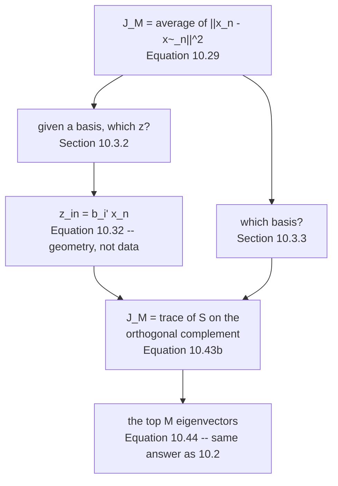

§10.2 asked what to **keep**. §10.3 asks what you **pay**:

> In the following, we will derive PCA as an algorithm that directly minimizes the average reconstruction
> error. This perspective allows us to interpret PCA as implementing an **optimal linear auto-encoder**.

Page 1002 already measured the punchline — the reconstruction error came out as the leftover eigenvalues
without anyone asking for it. This page is the first half of the derivation that explains why, and it has
a structure worth noticing: **the coordinates are settled before the basis is**.

## What you'll learn

- Equation 10.29's objective $J_M = \frac{1}{N}\sum_n\lVert\mathbf{x}_n - \tilde{\mathbf{x}}_n\rVert^2$, and the two-step plan: **coordinates first, basis second**.
- Equations 10.30–10.32: the derivative that produces $z_{in} = \mathbf{b}_i^\top\mathbf{x}_n$. Checked against a $100{,}001$-point grid search and against BFGS in $64$ dimensions — agreement to $1.6\times10^{-6}$, with identical objective values to $8$ decimals.
- **Why it is the minimum and not merely a stationary point**, by an exact identity rather than a search: $\lVert\mathbf{x}-\mathbf{B}\mathbf{z}\rVert^2 = \lVert\mathbf{x}-\mathbf{B}\mathbf{B}^\top\mathbf{x}\rVert^2 + \lVert\mathbf{B}^\top\mathbf{x}-\mathbf{z}\rVert^2$, verified over $200{,}000$ random $\mathbf{z}$ to $1.7\times10^{-15}$.
- Equation 10.34, and the thing it quietly assumes. Applying $\mathbf{z} = \mathbf{B}^\top\mathbf{x}$ to a basis that spans the right subspace but is **not** orthonormal gives error $24.728409$ where $16.316272$ was available.
- Equation 10.38: the displacement $\mathbf{x}_n - \tilde{\mathbf{x}}_n$ lies entirely in $U^\perp$ — measured, $100\%$ of its squared norm, with $\mathbf{B}^\top(\mathbf{x}_n-\tilde{\mathbf{x}}_n)$ never above $2.5\times10^{-14}$ across $174$ images.
- Why $\zeta_m = z_m$ for $m \leq M$: the coordinates of $\mathbf{x}$ and of $\tilde{\mathbf{x}}$ **are the same numbers** in the retained directions. Measured gap: exactly $0$.

## Intuition: two questions, and only one of them is hard

Minimising $\lVert\mathbf{x} - \tilde{\mathbf{x}}\rVert$ looks like one optimisation over two unknowns —
where the subspace sits, and where in it to land. It is not. **Given any subspace, the best point in it
is forced**: drop a perpendicular. That is a fact about Euclidean geometry, true before you know anything
about the data.

So the two unknowns separate cleanly. §10.3.2 disposes of the coordinates in half a page and hands a
much smaller problem to §10.3.3: of all the $M$-dimensional subspaces, which one has the shortest
perpendiculars on average?

## §10.3.1 The objective

Assume an ordered ONB $B = (\mathbf{b}_1,\ldots,\mathbf{b}_D)$ of $\mathbb{R}^D$. Any $\mathbf{x}$ splits
along it:

$$
\mathbf{x} = \sum_{d=1}^{D}\zeta_d\mathbf{b}_d
= \sum_{m=1}^{M}\zeta_m\mathbf{b}_m + \sum_{j=M+1}^{D}\zeta_j\mathbf{b}_j \qquad \text{(10.26)}
$$

The reconstruction is restricted to the first $M$ of them, in the *principal subspace* $U$:

$$
\tilde{\mathbf{x}}_n := \sum_{m=1}^{M} z_{mn}\mathbf{b}_m = \mathbf{B}\mathbf{z}_n \in \mathbb{R}^D
\qquad \text{(10.27), (10.28)}
$$

and the objective is the average squared Euclidean distance — the **reconstruction error**, due to
Pearson (1901):

$$
J_M := \frac{1}{N}\sum_{n=1}^{N}\lVert\mathbf{x}_n - \tilde{\mathbf{x}}_n\rVert^2 \qquad \text{(10.29)}
$$

:::note[The book flags the one thing you must not assume]
> Note that at this point we need to assume that the coordinates $z_m$ of $\tilde{\mathbf{x}}$ and
> $\zeta_m$ of $\mathbf{x}$ are **not identical**.

They turn out to be — §10.3.2 proves it and the measurement below confirms it to exactly $0$ — but
assuming it up front would be assuming the answer. The derivation has to reach it.
:::

## §10.3.2 The coordinates, settled by one derivative

By the chain rule,
$\frac{\partial J_M}{\partial z_{in}} = \frac{\partial J_M}{\partial\tilde{\mathbf{x}}_n}\frac{\partial\tilde{\mathbf{x}}_n}{\partial z_{in}}$
with

$$
\frac{\partial J_M}{\partial\tilde{\mathbf{x}}_n} = -\frac{2}{N}(\mathbf{x}_n-\tilde{\mathbf{x}}_n)^\top,
\qquad
\frac{\partial\tilde{\mathbf{x}}_n}{\partial z_{in}} = \mathbf{b}_i
\qquad \text{(10.30b), (10.30c)}
$$

so that, using $\mathbf{b}_i^\top\mathbf{b}_j = \delta_{ij}$,

$$
\frac{\partial J_M}{\partial z_{in}}
= -\frac{2}{N}\!\left(\mathbf{x}_n - \sum_{m=1}^{M}z_{mn}\mathbf{b}_m\right)^{\!\top}\!\mathbf{b}_i
= -\frac{2}{N}\!\left(\mathbf{x}_n^\top\mathbf{b}_i - z_{in}\right) \qquad \text{(10.31b)}
$$

Setting it to $0$:

$$
z_{in} = \mathbf{x}_n^\top\mathbf{b}_i = \mathbf{b}_i^\top\mathbf{x}_n \qquad \text{(10.32)}
$$

The book states the three consequences flatly, and they are worth keeping:

> - **The optimal linear projection $\tilde{\mathbf{x}}_n$ of $\mathbf{x}_n$ is an orthogonal projection.**
> - The coordinates of $\tilde{\mathbf{x}}_n$ are the coordinates of the orthogonal projection of $\mathbf{x}_n$ onto the principal subspace.
> - An orthogonal projection is the **best linear mapping** given the objective (10.29).

<Figure
  src="/images/mml/the-projection-perspective/the-best-coordinate"
  alt="Left, a red cross at five, three with a grey line through the origin at a steep angle; twenty-six faint red segments run from the cross down to points along the line, and one thick blue segment meets the line at a marked right angle. Right, a U-shaped curve of distance against the coordinate, with its single minimum marked at 4.919350."
  title="Figures 10.7 and 10.8: one minimum, and Equation 10.32 lands on it"
  caption="The right panel is the objective as a function of z alone. A 100,001-point grid search over the interval finds its minimum at z = 4.919360; Equation 10.32 returns 4.919350 with no search, and the two give the same distance to eight decimals. The right angle in the left panel is the whole content of Equation 10.32."
/>

The same check where there is no picture to appeal to — $D = 64$, $M = 5$, BFGS started from
$\mathbf{z} = \mathbf{0}$ with a gradient tolerance of $10^{-12}$:

| | value |
| --- | --- |
| iterations | $8$ |
| $\max\lvert\mathbf{z}_{\text{BFGS}} - \mathbf{B}^\top\mathbf{x}\rvert$ | $1.6\times10^{-6}$ |
| $J$ at the optimiser's answer | $266.22074143$ |
| $J$ at Equation 10.32 | $266.22074143$ |

:::tip[A stationary point is not a minimum, and there is an exact way to see this one is]
Setting a derivative to zero finds a stationary point. Rather than trust it — or search — expand the
objective around Equation 10.32's answer. For orthonormal $\mathbf{B}$ and **any** $\mathbf{z}$:

$$
\lVert\mathbf{x}-\mathbf{B}\mathbf{z}\rVert^2
= \underbrace{\lVert\mathbf{x}-\mathbf{B}\mathbf{B}^\top\mathbf{x}\rVert^2}_{\text{fixed, no } \mathbf{z}}
+ \underbrace{\lVert\mathbf{B}^\top\mathbf{x}-\mathbf{z}\rVert^2}_{\geq 0,\ \text{zero only at Eq 10.32}}
$$

The cross term vanishes exactly because the residual is orthogonal to $U$. Measured over $200{,}000$
random $\mathbf{z}$ drawn at four scales, from $0.1$ to $1000$: **worst relative gap
$1.7\times10^{-15}$**, with the fixed term at $266.220741$.

So the first term is what §10.3.3 goes on to minimise over bases, and the second is the entire cost of
using anything other than the orthogonal projection. No search settles this; the identity does.
:::

### Where the orthonormality assumption is spent

Equation 10.33 recaps the general orthogonal projection from §3.8, and Equation 10.34 gives the
$M$-dimensional case:

$$
\tilde{\mathbf{x}} = \mathbf{B}\big(\underbrace{\mathbf{B}^\top\mathbf{B}}_{=\,\mathbf{I}}\big)^{-1}\mathbf{B}^\top\mathbf{x}
= \mathbf{B}\mathbf{B}^\top\mathbf{x} \qquad \text{(10.34)}
$$

The brace is doing real work. Take five columns spanning exactly the same subspace as
$\mathbf{b}_1,\ldots,\mathbf{b}_5$ — rescale them and add a multiple of one to another, so
$\mathbf{G}^\top\mathbf{G}$ is off the identity by $3.84$ — and reconstruct one image three ways:

| coordinate rule | $\lVert\mathbf{x}-\tilde{\mathbf{x}}\rVert$ |
| --- | --- |
| $\mathbf{z} = \mathbf{G}^\top\mathbf{x}$, Equation 10.32 applied anyway | $24.728409$ |
| $\mathbf{z} = (\mathbf{G}^\top\mathbf{G})^{-1}\mathbf{G}^\top\mathbf{x}$, Equation 10.34 | $\mathbf{16.316272}$ |
| an orthonormal basis for the identical span | $\mathbf{16.316272}$ |

<Figure
  src="/images/mml/the-projection-perspective/orthonormality-is-required"
  alt="Top row, four small eight-by-eight images: an original digit and three reconstructions labelled with errors 24.728409, 16.316272 and 16.316272; the first reconstruction is visibly distorted while the last two are identical. Bottom, a horizontal bar chart of those three errors."
  title="The same subspace, three coordinate rules, and only two of them reach it"
  caption="Nothing about the subspace changed between the rows — all three reconstructions are confined to the same five-dimensional plane. The first simply lands in the wrong place within it, by 8.412137. Equation 10.32 is what Equation 10.34 collapses to when the columns are orthonormal; it is not a general formula for coordinates."
/>

:::caution[This is the practical trap in the whole chapter]
Eigenvectors from `np.linalg.eigh` come out orthonormal, so if you follow the recipe nothing goes wrong.
Two common deviations break it silently:

**Scaling the components.** Multiplying $\mathbf{b}_m$ by $\sqrt{\lambda_m}$ — a common convention for
"loadings" — destroys $\mathbf{B}^\top\mathbf{B} = \mathbf{I}$, and $\mathbf{B}^\top\mathbf{x}$ is then
the wrong answer.

**A basis obtained some other way.** Columns fitted, sampled, or carried over from another method span a
subspace but are rarely orthonormal. `np.linalg.qr` costs almost nothing and restores the guarantee.

There is no error message. The reconstruction is still in the right subspace; it is just not the
closest point in it.
:::

## Equation 10.38 and what a residual is made of

Writing $\mathbf{x}_n$ in the full basis and splitting the sum at $M$,

$$
\mathbf{x}_n = \left(\sum_{m=1}^{M}\mathbf{b}_m\mathbf{b}_m^\top\right)\mathbf{x}_n
+ \left(\sum_{j=M+1}^{D}\mathbf{b}_j\mathbf{b}_j^\top\right)\mathbf{x}_n \qquad \text{(10.37b)}
$$

so the displacement is exactly the second piece:

$$
\mathbf{x}_n - \tilde{\mathbf{x}}_n
= \left(\sum_{j=M+1}^{D}\mathbf{b}_j\mathbf{b}_j^\top\right)\mathbf{x}_n
= \sum_{j=M+1}^{D}(\mathbf{x}_n^\top\mathbf{b}_j)\mathbf{b}_j \qquad \text{(10.38a), (10.38b)}
$$

> The displacement vector $\mathbf{x}_n - \tilde{\mathbf{x}}_n$ lies in the subspace that is **orthogonal
> to the principal subspace**.

<Figure
  src="/images/mml/the-projection-perspective/displacement-in-the-orthogonal-complement"
  alt="Left, a scatter of blue points around a grey line, each joined by a short red segment to an orange point on the line; every red segment is parallel to a dashed line marked U-perp. Right, a log-scale bar chart of six tiny values between 1e-14 and 3e-14 for M equal to 1, 2, 5, 10, 20 and 40."
  title="Figure 10.9: the residual has no component inside the subspace"
  caption="Measured across all 174 images and six code lengths, the largest component of any displacement inside U is 2.5e-14 — machine noise. Equivalently, 100.000000000000 percent of the squared reconstruction error lies in the orthogonal complement. This is what makes Equations 10.42 to 10.43b possible, since the cross terms are exactly zero."
/>

And the coordinates agree where they overlap. For $\mathbf{x}$'s full coordinate vector
$\boldsymbol\zeta = \mathbf{B}_{\text{full}}^\top\mathbf{x}$ and $\tilde{\mathbf{x}}$'s
$\mathbf{z} = \mathbf{B}^\top\mathbf{x}$ at $M = 5$:

| | values |
| --- | --- |
| $\zeta_1\ldots\zeta_5$ | $-3.189454,\ -14.198109,\ 8.885848,\ 1.020749,\ 7.821227$ |
| $z_1\ldots z_5$ | $-3.189454,\ -14.198109,\ 8.885848,\ 1.020749,\ 7.821227$ |
| $\max\lvert$difference$\rvert$ | $\mathbf{0.0}$ exactly |
| $\sum_{j>5}\zeta_j^2$, the discarded tail | $266.220741$ |
| $\lVert\mathbf{x}-\tilde{\mathbf{x}}\rVert^2$ | $266.220741$ |

**Projecting does not recompute the coordinates you keep — it deletes the ones you don't.** That is the
sentence the book reaches at the top of §10.3.3, and it is what makes the whole thing a truncation rather
than a re-fit.

## Two forms of the objective, and where the next page starts

Equation 10.39 names $\sum_m\mathbf{b}_m\mathbf{b}_m^\top = \mathbf{B}\mathbf{B}^\top$ as a symmetric
rank-$M$ matrix, so

$$
J_M = \frac{1}{N}\sum_{n=1}^{N}\left\lVert\mathbf{x}_n - \mathbf{B}\mathbf{B}^\top\mathbf{x}_n\right\rVert^2
= \frac{1}{N}\sum_{n=1}^{N}\left\lVert(\mathbf{I}-\mathbf{B}\mathbf{B}^\top)\mathbf{x}_n\right\rVert^2
\qquad \text{(10.40a), (10.40b)}
$$

— *"finding orthonormal basis vectors which minimize the difference between the original data and their
projections is equivalent to finding the best rank-$M$ approximation $\mathbf{B}\mathbf{B}^\top$ of the
identity matrix."*

Measured both ways, as a per-point sum and as one Frobenius norm:

| $M$ | $\frac{1}{N}\sum_n\lVert\mathbf{x}_n-\mathbf{B}\mathbf{B}^\top\mathbf{x}_n\rVert^2$ | $\frac{1}{N}\lVert(\mathbf{I}-\mathbf{B}\mathbf{B}^\top)\mathbf{X}\rVert_F^2$ |
| --- | --- | --- |
| $1$ | $589.590460$ | $589.590460$ |
| $5$ | $320.123369$ | $320.123369$ |
| $20$ | $59.351805$ | $59.351805$ |
| $52$ | $0.000000$ | $0.000000$ |

Those are page 1002's $J_M$ values, reached from the opposite direction. The next page finishes the job:
it turns Equation 10.40b into a trace, and the trace into a statement about eigenvalues.

<Quiz
  title="Is the projection argument clear?"
  questions={[
    {
      q: "Why does Section 10.3 optimise the coordinates before the basis?",
      options: [
        "Because the coordinates matter more",
        "Because for ANY subspace the best point in it is forced — the orthogonal projection — so that half needs no knowledge of the data",
        "Because the basis cannot be optimised at all",
        "Because the objective is not differentiable in the basis",
      ],
      answer: 1,
      explain:
        "Equation 10.32 gives z = b-transpose x with no reference to which subspace was chosen. Verified by BFGS in 64 dimensions: eight iterations, agreeing with the closed form to 1.6e-06, identical objective values to eight decimals. That leaves Section 10.3.3 the genuinely hard half.",
    },
    {
      q: "Equation 10.32 sets a derivative to zero. What makes that a minimum rather than just a stationary point?",
      options: [
        "Searching over many candidate z values and finding none better",
        "An exact identity: the objective splits into a term with no z in it plus the squared distance from z to B-transpose x",
        "The fact that the objective is linear",
        "Nothing — it is only a stationary point",
      ],
      answer: 1,
      explain:
        "The cross term vanishes because the residual is orthogonal to the subspace, leaving ||x - Bz||^2 = ||x - BB'x||^2 + ||B'x - z||^2. Measured over 200,000 random z at scales from 0.1 to 1000, the worst relative gap was 1.7e-15. The second term is zero exactly at Equation 10.32 and positive everywhere else.",
    },
    {
      q: "You have five columns spanning the right subspace, but they are not orthonormal. What does z = G-transpose x give you?",
      options: [
        "The orthogonal projection, as usual",
        "A point in the right subspace, but not the closest one — measured at error 24.728409 against an available 16.316272",
        "An error, because the shapes do not match",
        "A point outside the subspace",
      ],
      answer: 1,
      explain:
        "Equation 10.34 is B (B-transpose B)-inverse B-transpose x, and the inverse factor is the identity ONLY when the columns are orthonormal. Rescaling components by the square root of their eigenvalue is enough to break it, and there is no error message — the reconstruction is still in the subspace, just in the wrong place within it. np.linalg.qr fixes it.",
    },
    {
      q: "What does Equation 10.38 say about the displacement x minus x-tilde?",
      options: [
        "It is orthogonal to the data",
        "It lies entirely in the orthogonal complement of the principal subspace",
        "It is always zero",
        "It is parallel to the first principal component",
      ],
      answer: 1,
      explain:
        "Measured across 174 images at M = 1, 2, 5, 10, 20 and 40: the largest component of any displacement inside U is 2.5e-14, and 100 percent of the squared error sits in the complement. That exact orthogonality is what kills the cross terms in Equations 10.42a and 10.42b, and it is why the coordinates you keep are untouched by the projection — the measured gap between zeta and z is exactly zero.",
    },
  ]}
/>

## Exercises

### Exercise 1 – Search for the best coordinate, then stop searching

<DataCampExercise
  lang="python"
  hint={`Equation 10.32 is a single dot product: b @ x.`}
  code={`import numpy as np

b = np.array([1.0, 2.0])
b /= np.linalg.norm(b)
x = np.array([5.0, 3.0])

zs = np.linspace(-2, 12, 100001)
errs = np.sqrt(((x[None, :] - zs[:, None] * b[None, :]) ** 2).sum(1))
k = int(errs.argmin())

# Task: Equation 10.32, with no search at all.
z_star = ___

print(f"grid minimiser over 100,001 values : z = {zs[k]:.6f}")
print(f"Equation 10.32                     : z = {z_star:.6f}")
print(f"gap                                : {abs(zs[k]-z_star):.3e}")
print(f"distance at the grid minimum       : {errs[k]:.8f}")
print(f"distance at Equation 10.32         : "
      f"{np.linalg.norm(x - z_star*b):.8f}")
print(f"residual dotted into b             : "
      f"{(x - z_star*b) @ b:.3e}")

# -- Expected output ------------------------------
# grid minimiser over 100,001 values : z = 4.919360
# Equation 10.32                     : z = 4.919350
# gap                                : 1.045e-05
# distance at the grid minimum       : 3.13049517
# distance at Equation 10.32         : 3.13049517
# residual dotted into b             : 5.433e-16
# -------------------------------------------------`}
  solution={`import numpy as np
b = np.array([1.0, 2.0])
b /= np.linalg.norm(b)
x = np.array([5.0, 3.0])
zs = np.linspace(-2, 12, 100001)
errs = np.sqrt(((x[None, :] - zs[:, None] * b[None, :]) ** 2).sum(1))
k = int(errs.argmin())
z_star = float(b @ x)
print(f"grid minimiser over 100,001 values : z = {zs[k]:.6f}")
print(f"Equation 10.32                     : z = {z_star:.6f}")
print(f"gap                                : {abs(zs[k]-z_star):.3e}")
print(f"distance at the grid minimum       : {errs[k]:.8f}")
print(f"distance at Equation 10.32         : "
      f"{np.linalg.norm(x - z_star*b):.8f}")
print(f"residual dotted into b             : "
      f"{(x - z_star*b) @ b:.3e}")`}
  sct={`test_output_contains("Equation 10.32                     : z = 4.919350")
test_output_contains("distance at Equation 10.32         : 3.13049517")
success_msg("The gap of 1.045e-05 is the grid spacing, not an error in either answer — the distances agree to eight decimals. The last line is the reason: the residual is perpendicular to b.")`}
  height={360}
/>

### Exercise 2 – Prove it is the minimum, without searching

<DataCampExercise
  lang="python"
  hint={`The fixed part is the error at the orthogonal projection: ||x - B @ (B.T @ x)||^2. The rest depends on z.`}
  code={`import numpy as np
from sklearn.datasets import load_digits

A8 = load_digits().data[load_digits().target == 8]
X = (A8 - A8.mean(0)).T
S = X @ X.T / len(A8)
_, V = np.linalg.eigh(S)
B = V[:, ::-1][:, :5]
x = X[:, 0]

fixed = float(((x - B @ (B.T @ x)) ** 2).sum())
rng = np.random.default_rng(7)
worst = 0.0
for _ in range(10_000):
    z = rng.standard_normal(5) * rng.choice([0.1, 1.0, 10.0, 1000.0])
    lhs = float(((x - B @ z) ** 2).sum())
    # Task: the right-hand side of the Pythagoras split.
    rhs = ___
    worst = max(worst, abs(lhs - rhs) / abs(rhs))

print(f"worst relative gap over 10,000 random z < 1e-9 : {bool(worst < 1e-9)}")
print(f"the fixed term ||x - B B' x||^2          : {fixed:.6f}")
print(f"at z = B' x the variable term is         : "
      f"{float(((B.T @ x - B.T @ x) ** 2).sum()):.6f}")

# -- Expected output ------------------------------
# worst relative gap over 10,000 random z < 1e-9 : True
# the fixed term ||x - B B' x||^2          : 266.220741
# at z = B' x the variable term is         : 0.000000
# -------------------------------------------------`}
  solution={`import numpy as np
from sklearn.datasets import load_digits
A8 = load_digits().data[load_digits().target == 8]
X = (A8 - A8.mean(0)).T
S = X @ X.T / len(A8)
_, V = np.linalg.eigh(S)
B = V[:, ::-1][:, :5]
x = X[:, 0]
fixed = float(((x - B @ (B.T @ x)) ** 2).sum())
rng = np.random.default_rng(7)
worst = 0.0
for _ in range(10_000):
    z = rng.standard_normal(5) * rng.choice([0.1, 1.0, 10.0, 1000.0])
    lhs = float(((x - B @ z) ** 2).sum())
    rhs = fixed + float(((B.T @ x - z) ** 2).sum())
    worst = max(worst, abs(lhs - rhs) / abs(rhs))
print(f"worst relative gap over 10,000 random z < 1e-9 : {bool(worst < 1e-9)}")
print(f"the fixed term ||x - B B' x||^2          : {fixed:.6f}")
print(f"at z = B' x the variable term is         : "
      f"{float(((B.T @ x - B.T @ x) ** 2).sum()):.6f}")`}
  sct={`test_output_contains("worst relative gap over 10,000 random z < 1e-9 : True", pattern=False)
test_output_contains("the fixed term ||x - B B' x||^2          : 266.220741", pattern=False)
success_msg("An identity, not a search. One term has no z in it — that is what Section 10.3.3 minimises over bases — and the other is a squared distance that is zero exactly at Equation 10.32.")`}
  height={380}
/>

### Exercise 3 – What Equation 10.34's inverse is for

<DataCampExercise
  lang="python"
  hint={`Equation 10.34 is B (B'B)^-1 B' x. Solve the normal equations rather than forming the inverse.`}
  code={`import numpy as np
from sklearn.datasets import load_digits

A8 = load_digits().data[load_digits().target == 8]
X = (A8 - A8.mean(0)).T
S = X @ X.T / len(A8)
_, V = np.linalg.eigh(S)
PC = V[:, ::-1]
x = X[:, 0]

G = PC[:, :5] @ np.diag([1.0, 1.4, 0.6, 2.2, 0.5])  # same span, rescaled
G[:, 1] += 0.3 * G[:, 0]                            # and not orthogonal

z_naive = G.T @ x                                   # Equation 10.32 anyway
# Task: Equation 10.34's coordinates for a non-orthonormal basis.
z_right = ___
Bo = np.linalg.qr(G)[0]                             # an ONB for the span

print(f"G'G is off the identity by  : {np.abs(G.T @ G - np.eye(5)).max():.6f}")
print(f"z = G'x            -> error : {np.linalg.norm(x - G@z_naive):.6f}")
print(f"z = (G'G)^-1 G'x   -> error : {np.linalg.norm(x - G@z_right):.6f}")
print(f"an ONB, same span  -> error : "
      f"{np.linalg.norm(x - Bo@(Bo.T@x)):.6f}")
print(f"the cost of ignoring (G'G)^-1: "
      f"{np.linalg.norm(x - G@z_naive) - np.linalg.norm(x - G@z_right):.6f}")

# -- Expected output ------------------------------
# G'G is off the identity by  : 3.840000
# z = G'x            -> error : 24.728409
# z = (G'G)^-1 G'x   -> error : 16.316272
# an ONB, same span  -> error : 16.316272
# the cost of ignoring (G'G)^-1: 8.412137
# -------------------------------------------------`}
  solution={`import numpy as np
from sklearn.datasets import load_digits
A8 = load_digits().data[load_digits().target == 8]
X = (A8 - A8.mean(0)).T
S = X @ X.T / len(A8)
_, V = np.linalg.eigh(S)
PC = V[:, ::-1]
x = X[:, 0]
G = PC[:, :5] @ np.diag([1.0, 1.4, 0.6, 2.2, 0.5])
G[:, 1] += 0.3 * G[:, 0]
z_naive = G.T @ x
z_right = np.linalg.solve(G.T @ G, G.T @ x)
Bo = np.linalg.qr(G)[0]
print(f"G'G is off the identity by  : {np.abs(G.T @ G - np.eye(5)).max():.6f}")
print(f"z = G'x            -> error : {np.linalg.norm(x - G@z_naive):.6f}")
print(f"z = (G'G)^-1 G'x   -> error : {np.linalg.norm(x - G@z_right):.6f}")
print(f"an ONB, same span  -> error : "
      f"{np.linalg.norm(x - Bo@(Bo.T@x)):.6f}")
print(f"the cost of ignoring (G'G)^-1: "
      f"{np.linalg.norm(x - G@z_naive) - np.linalg.norm(x - G@z_right):.6f}")`}
  sct={`test_output_contains("z = G'x            -> error : 24.728409")
test_output_contains("an ONB, same span  -> error : 16.316272")
success_msg("Identical subspace in all three rows. Rescaling the components — a common convention for loadings — is enough to break B'B = I, and nothing raises an error. The reconstruction stays in the subspace, just not at the closest point.")`}
  height={380}
/>

### Exercise 4 – The residual has no component you kept

<DataCampExercise
  lang="python"
  hint={`The residual for all N points at once is X - B @ B.T @ X. Its component inside U is B.T applied to it.`}
  code={`import numpy as np
from sklearn.datasets import load_digits

A8 = load_digits().data[load_digits().target == 8]
N = len(A8)
X = (A8 - A8.mean(0)).T
S = X @ X.T / N
_, V = np.linalg.eigh(S)
PC = V[:, ::-1]

for M in (1, 5, 20):
    B = PC[:, :M]
    R = X - B @ B.T @ X
    # Task: the part of every residual that lies INSIDE the subspace.
    inside = ___
    Bperp = PC[:, M:]
    share = (np.abs(Bperp.T @ R) ** 2).sum() / (R ** 2).sum()
    print(f"M = {M:>2}: max |inside U| = {np.abs(inside).max():.6f}   "
          f"share of the error in U-perp = {share:.12f}")

# -- Expected output ------------------------------
# M =  1: max |inside U| = 0.000000   share of the error in U-perp = 1.000000000000
# M =  5: max |inside U| = 0.000000   share of the error in U-perp = 1.000000000000
# M = 20: max |inside U| = 0.000000   share of the error in U-perp = 1.000000000000
# -------------------------------------------------`}
  solution={`import numpy as np
from sklearn.datasets import load_digits
A8 = load_digits().data[load_digits().target == 8]
N = len(A8)
X = (A8 - A8.mean(0)).T
S = X @ X.T / N
_, V = np.linalg.eigh(S)
PC = V[:, ::-1]
for M in (1, 5, 20):
    B = PC[:, :M]
    R = X - B @ B.T @ X
    inside = B.T @ R
    Bperp = PC[:, M:]
    share = (np.abs(Bperp.T @ R) ** 2).sum() / (R ** 2).sum()
    print(f"M = {M:>2}: max |inside U| = {np.abs(inside).max():.6f}   "
          f"share of the error in U-perp = {share:.12f}")`}
  sct={`test_output_contains("share of the error in U-perp = 1.000000000000", pattern=False)
test_output_contains("M =  5: max |inside U| = 0.000000   share of the error in U-perp = 1.000000000000", pattern=False)
success_msg("All of the error, to twelve decimals, sits in the directions you discarded. That exact orthogonality is what makes the cross terms in Equations 10.42a and 10.42b vanish, which is what turns the objective into a trace on the next page.")`}
  height={340}
/>

### Exercise 5 – Projecting deletes coordinates, it does not recompute them

<DataCampExercise
  lang="python"
  hint={`zeta uses the FULL D-by-D basis; z uses only its first M columns.`}
  code={`import numpy as np
from sklearn.datasets import load_digits

A8 = load_digits().data[load_digits().target == 8]
X = (A8 - A8.mean(0)).T
S = X @ X.T / len(A8)
_, V = np.linalg.eigh(S)
PC = V[:, ::-1]
x = X[:, 0]
M = 5

# Task: Equation 10.26's coordinates of x in the FULL basis.
zeta = ___
z = PC[:, :M].T @ x                      # Equation 10.32, M of them

print(f"zeta_1..5 : {np.round(zeta[:M], 6)}")
print(f"z_1..5    : {np.round(z, 6)}")
print(f"max |difference| : {np.abs(zeta[:M] - z).max():.3e}")
print(f"discarded tail, sum of zeta_6..64 squared : {(zeta[M:]**2).sum():.6f}")
print(f"||x - x~||^2                              : "
      f"{np.linalg.norm(x - PC[:, :M] @ z)**2:.6f}")

# -- Expected output ------------------------------
# zeta_1..5 : [ -3.189454 -14.198109   8.885848   1.020749   7.821227]
# z_1..5    : [ -3.189454 -14.198109   8.885848   1.020749   7.821227]
# max |difference| : 0.000e+00
# discarded tail, sum of zeta_6..64 squared : 266.220741
# ||x - x~||^2                              : 266.220741
# -------------------------------------------------`}
  solution={`import numpy as np
from sklearn.datasets import load_digits
A8 = load_digits().data[load_digits().target == 8]
X = (A8 - A8.mean(0)).T
S = X @ X.T / len(A8)
_, V = np.linalg.eigh(S)
PC = V[:, ::-1]
x = X[:, 0]
M = 5
zeta = PC.T @ x
z = PC[:, :M].T @ x
print(f"zeta_1..5 : {np.round(zeta[:M], 6)}")
print(f"z_1..5    : {np.round(z, 6)}")
print(f"max |difference| : {np.abs(zeta[:M] - z).max():.3e}")
print(f"discarded tail, sum of zeta_6..64 squared : {(zeta[M:]**2).sum():.6f}")
print(f"||x - x~||^2                              : "
      f"{np.linalg.norm(x - PC[:, :M] @ z)**2:.6f}")`}
  sct={`test_output_contains("max |difference| : 0.000e+00")
test_output_contains("discarded tail, sum of zeta_6..64 squared : 266.220741")
success_msg("Exactly zero, not approximately. Compression here is truncation — the coordinates you keep are untouched, and the squared error is precisely the sum of the squares of the ones you dropped. That last line is Equation 10.41, one point at a time.")`}
  height={360}
/>

## Recall card

- **Section 10.3 minimises the reconstruction error** rather than maximising the variance, and reaches the same basis. The objective is Equation 10.29, the average squared distance between each point and its reconstruction.
- **The problem splits into coordinates and basis**, and only the second half is hard: for any subspace the best point in it is the orthogonal projection, which is geometry rather than a fact about the data.
- **Equation 10.32 gives the optimal coordinate as b-transpose x.** Checked against a hundred-thousand-point grid search and against BFGS in 64 dimensions, agreeing to about one part in a million with identical objective values.
- **It is a minimum, not merely a stationary point, by an exact identity:** the objective equals a term with no z in it plus the squared distance from z to B-transpose x. Verified to 1.7e-15 over 200,000 random z.
- **Equation 10.34's inverse factor is the identity only because the columns are orthonormal.** Apply Equation 10.32 to a non-orthonormal basis spanning the same subspace and the error goes from 16.316272 to 24.728409, with no warning.
- **Rescaling components by the square root of their eigenvalue is enough to break it.** A QR factorisation restores the guarantee at negligible cost.
- **Equation 10.38: the displacement lies entirely in the orthogonal complement.** Measured across 174 images, the largest component inside the retained subspace is 2.5e-14, and the share of squared error in the complement is 1 to twelve decimals.
- **Projecting deletes the coordinates you discard and leaves the ones you keep untouched** — measured difference exactly zero. Compression here is truncation, not refitting.
- **The squared error equals the sum of the squared discarded coordinates**, 266.220741 for one image at M equal to five.
- **Equation 10.40b rewrites the objective as the identity minus B B-transpose applied to the data**, which makes finding the basis the same as finding the best rank-M approximation of the identity matrix.

**Next:** **[Finding the Principal Subspace](../finding-the-principal-subspace/)** — §10.3.3 turns
Equation 10.40b into a trace and the trace into the leftover eigenvalues, meeting §10.2 from the far side.
