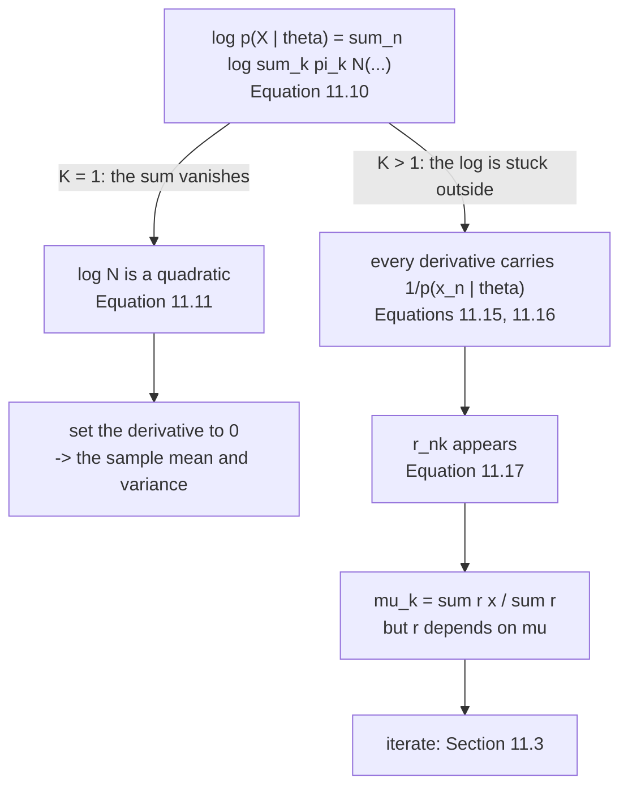

import DataCampExercise from "../../../../components/DataCampExercise.astro";
import Figure from "../../../../components/Figure.astro";
import Quiz from "../../../../components/Quiz.astro";

Chapters 9 and 10 both ended in a formula. This one does not, and the book says so before it starts:

> Our "normal" procedure would be to compute the gradient $\mathrm{d}L/\mathrm{d}\boldsymbol\theta$ of the
> log-likelihood with respect to the model parameters $\boldsymbol\theta$, set it to $\mathbf{0}$, and
> solve for $\boldsymbol\theta$. However [...] **we cannot obtain a closed-form solution.**

This page is about exactly what that sentence costs, measured on the book's own seven data points.

## What you'll learn

- The book's running example, reproduced: $\mathcal{X} = \{-3, -2.5, -1, 0, 2, 4, 5\}$ with $K = 3$ initialised at $\mathcal{N}(-4,1)$, $\mathcal{N}(0,0.2)$, $\mathcal{N}(8,3)$ — negative log-likelihood $28.325536$, which is the $28.3$ the book prints.
- Equations 11.9–11.10, and why the log form is not cosmetic: the **product underflows to exactly $0.0$ by about $N = 185$**.
- Equation 11.11: with $K = 1$ the log gets inside and there *is* a closed form — checked against a numerical optimiser to $5.8\times10^{-8}$.
- Equations 11.12–11.16, and the precise sense in which Equation 11.20 is **not** a solution: put $\boldsymbol\mu$ in, get a different $\boldsymbol\mu$ out — measured, by $4.295713$ on the first round.
- The analytic gradient of Equation 11.22c, checked against central differences to $3.0\times10^{-10}$.
- **The likelihood surface has many summits.** $400$ restarts on seven points find $17$ distinct values — and $218$ of them ($54.5\%$) collapse a component onto a data point.
- **§11.5's singularity, measured:** pin a mean to a data point and shrink its variance, and the log-likelihood climbs without bound — $+16.377668$ at $\sigma^2 = 10^{-30}$ against the book's converged $-13.973323$.
- A finding the book does not mention: its own initialisation reaches $-13.973323$, while a different basin reaches $\mathbf{-13.906162}$ — a genuinely better non-degenerate fit, by $0.067161$ nats.

## Intuition: the log cannot get past the sum

Every closed form in Chapters 9 and 10 came from the same accident. The log-likelihood of a Gaussian is a
**quadratic** in the parameters, so setting its derivative to zero gives a linear system, and a linear
system you can solve.

Take a mixture and that collapses. Equation 11.10 is $\sum_n \log \sum_k(\cdot)$, and the outer log
cannot be moved inside the inner sum. Differentiate it and every term carries a factor
$1/\sum_j \pi_j\mathcal{N}(\cdot)$ — the whole mixture density — so the equation for $\boldsymbol\mu_k$
mentions every other parameter. You get a **condition** the answer satisfies, not the answer.

## §11.2 The likelihood

For an i.i.d. dataset $\mathcal{X} = \{\mathbf{x}_1,\ldots,\mathbf{x}_N\}$:

$$
p(\mathcal{X}\mid\boldsymbol\theta) = \prod_{n=1}^{N} p(\mathbf{x}_n\mid\boldsymbol\theta),
\qquad
p(\mathbf{x}_n\mid\boldsymbol\theta) = \sum_{k=1}^{K}\pi_k\,\mathcal{N}(\mathbf{x}_n\mid\boldsymbol\mu_k,\boldsymbol\Sigma_k)
\qquad \text{(11.9)}
$$

$$
\log p(\mathcal{X}\mid\boldsymbol\theta) = \sum_{n=1}^{N}\log\sum_{k=1}^{K}\pi_k\,\mathcal{N}(\mathbf{x}_n\mid\boldsymbol\mu_k,\boldsymbol\Sigma_k) =: L
\qquad \text{(11.10)}
$$

On the book's seven points at its initialisation:

| | value |
| --- | --- |
| the product, Equation 11.9 | $4.993168\times10^{-13}$ |
| its logarithm | $-28.325536$ |
| the sum of logs, Equation 11.10 | $-28.325536$ (gap $7.1\times10^{-15}$) |
| the negative log-likelihood | $\mathbf{28.325536}$ — the book's $28.3$ |

<Figure
  src="/images/mml/maximum-likelihood-and-its-obstacle/log-of-a-sum"
  alt="Left, a log-scale curve of the product likelihood falling from about 1e-20 to the bottom of the axis and flat-lining at a dashed vertical marker near N equals 185. Right, the sum of log densities falling smoothly and roughly linearly to about minus 1300."
  title="The same quantity, computed two ways, one of which stops existing"
  caption="Both panels show the same likelihood for growing sample sizes. The product form crosses the smallest positive float64 and becomes exactly 0.0 at about N = 185, after which its logarithm is minus infinity. The sum of logs is linear in N and never in trouble."
/>

:::note[Two different reasons to take the log, and only one of them is the chapter's problem]
**Numerically**, the log turns a product of $N$ small numbers into a sum — measured above, that is the
difference between a usable quantity and $0.0$ past $N \approx 185$.

**Analytically**, the log usually simplifies the expression. Equation 11.11 is the case where it does:

$$
\log\mathcal{N}(\mathbf{x}\mid\boldsymbol\mu,\boldsymbol\Sigma) = -\tfrac{D}{2}\log(2\pi) - \tfrac12\log\det(\boldsymbol\Sigma) - \tfrac12(\mathbf{x}-\boldsymbol\mu)^\top\boldsymbol\Sigma^{-1}(\mathbf{x}-\boldsymbol\mu)
$$

Measured on the same seven points with $K = 1$: the closed-form answer is the sample mean $0.6428571429$
and sample variance $8.3367346939$, and a Nelder–Mead search agrees to $5.8\times10^{-8}$.

**The first benefit survives $K > 1$. The second does not.** That asymmetry is the chapter.
:::

## The necessary conditions, and what they are not

Setting the three gradients to zero (Equations 11.12–11.14) requires, by the chain rule,

$$
\frac{\partial\log p(\mathbf{x}_n\mid\boldsymbol\theta)}{\partial\boldsymbol\theta}
= \frac{1}{p(\mathbf{x}_n\mid\boldsymbol\theta)}\frac{\partial p(\mathbf{x}_n\mid\boldsymbol\theta)}{\partial\boldsymbol\theta},
\qquad
\frac{1}{p(\mathbf{x}_n\mid\boldsymbol\theta)} = \frac{1}{\sum_{j}\pi_j\mathcal{N}(\mathbf{x}_n\mid\boldsymbol\mu_j,\boldsymbol\Sigma_j)}
\qquad \text{(11.15), (11.16)}
$$

That denominator is the whole mixture. **Every parameter's equation now mentions every other
parameter** — which is precisely where the responsibilities of page 1103 come from, and precisely why
Equation 11.20 is a fixed-point condition:

<Figure
  src="/images/mml/maximum-likelihood-and-its-obstacle/a-fixed-point-not-a-formula"
  alt="Left, an S-shaped blue curve crossing a dotted diagonal line once, with a marked intersection and small tick marks along the bottom showing the seven data points. Right, a log-scale plot of how far the parameter moved each round, falling from about 4.3 to under 1e-4 over eight rounds."
  title="Put the answer in, get a different answer out"
  caption="A closed-form solution would be a flat line on the left — output independent of input. Instead the update is a genuine map with a fixed point, and reaching it takes iteration: the first round moves the means by 4.295713, the second by 0.130775, the third by 0.018414."
/>

The gradient itself is exactly what the book derives. Equation 11.22c gives
$\partial L/\partial\boldsymbol\mu_k = \sum_n r_{nk}(\mathbf{x}_n-\boldsymbol\mu_k)^\top\boldsymbol\Sigma_k^{-1}$,
and against central differences on the initialisation:

| | $k = 1$ | $k = 2$ | $k = 3$ |
| --- | --- | --- | --- |
| analytic, Equation 11.22c | $2.671866$ | $-4.052278$ | $-4.200868$ |
| central differences | $2.671866$ | $-4.052278$ | $-4.200868$ |

Largest relative gap: $3.0\times10^{-10}$. **The derivation is right; it just does not solve anything.**

## The surface, and what is on it

Run the iteration from $400$ random starting points on the same seven numbers:

| | count | share |
| --- | --- | --- |
| distinct final log-likelihoods | $\mathbf{17}$ | |
| runs where a component collapsed ($\sigma_k^2 < 10^{-6}$) | $\mathbf{218}$ | $54.5\%$ |
| genuine fits | $182$ | $45.5\%$ |
| distinct **non-degenerate** optima | $\mathbf{2}$ | |

<Figure
  src="/images/mml/maximum-likelihood-and-its-obstacle/many-summits"
  alt="Left, a histogram of final log-likelihoods: one tall blue bar at about minus 14 and a scatter of red bars spread from minus 7 up to plus 6. Right, a rising line showing the log-likelihood climbing steadily as the variance axis runs from 1 down to 1e-30, crossing far above a dashed horizontal line."
  title="The highest points on this surface are not models"
  caption="Every red bar sits to the right of every blue one — the degenerate solutions report a higher likelihood than any genuine fit, up to plus 5.5802 against minus 13.9062. The right panel is why: a component sitting exactly on a data point with a vanishing variance drives the density at that point to infinity, so the likelihood is unbounded above."
/>

:::caution[The best likelihood on this surface is not the best model]
Split the $400$ runs by whether any component's variance collapsed:

| | log-likelihood range |
| --- | --- |
| the $218$ collapsed runs | $-6.6900$ to $\mathbf{+5.5802}$ |
| the $182$ genuine fits | $-13.9733$ to $-13.9062$ |

**Every degenerate run beats every honest one.** And §11.5 names the mechanism: *"this happens when the
mean of a mixture component is identical to a data point and the covariance tends to $0$. Then, the
likelihood approaches infinity."* Measured by pinning $\mu_1 = -3$ and shrinking:

| $\sigma_1^2$ | log-likelihood |
| --- | --- |
| $10^{-1}$ | $-16.174872$ |
| $10^{-4}$ | $-13.548611$ |
| $10^{-8}$ | $-8.950695$ |
| $10^{-16}$ | $+0.259572$ |
| $10^{-30}$ | $\mathbf{+16.377668}$ |

So **"the maximum likelihood estimate" does not exist** for a GMM with free covariances. Every algorithm
in this chapter finds a *local* optimum, and the useful ones are not the tallest.
:::

:::tip[A better fit than the book's, in the book's own example]
Among the $182$ non-degenerate runs there are exactly **two** distinct optima, and the book's
initialisation does not reach the better one:

| | $\log p(\mathcal{X}\mid\boldsymbol\theta)$ | $\boldsymbol\mu$ | $\boldsymbol\sigma^2$ | $\boldsymbol\pi$ |
| --- | --- | --- | --- | --- |
| from the book's start | $-13.973323$ | $-2.7500,\ -0.5041,\ 3.6446$ | $0.0625,\ 0.2506,\ 1.6289$ | $0.2857,\ 0.2832,\ 0.4311$ |
| **the better basin** | $\mathbf{-13.906162}$ | $-2.7543,\ 0.2828,\ 4.5051$ | $0.0625,\ 1.8561,\ 0.2500$ | $0.2737,\ 0.4442,\ 0.2821$ |

The difference is $0.067161$ nats. Both have well-separated components and a smallest variance of
$0.0625$ — neither is degenerate. The second simply puts its narrow third component on
$\{4, 5\}$ and lets the middle one cover everything from $-1$ to $2$.

$51.6\%$ of the non-degenerate runs find the better one, and $23.5\%$ of all $400$ find the book's. This
is §11.4.5's warning made concrete: *"there are no guarantees that EM converges to the maximum
likelihood solution."*
:::

<Quiz
  title="Is the obstacle clear?"
  questions={[
    {
      q: "Why does Equation 11.10 use a sum of logarithms rather than the product of Equation 11.9?",
      options: [
        "Only for readability",
        "For two reasons: the product underflows to exactly 0.0 by about N = 185, and the log usually simplifies the algebra",
        "Because the product is not differentiable",
        "Because the log is the likelihood",
      ],
      answer: 1,
      explain:
        "The numerical benefit survives any K. The analytic one does not: at K = 1 the log lands directly on the Gaussian and gives a closed form, and at K greater than 1 it is stuck outside a sum. That asymmetry is what the rest of the chapter is about.",
    },
    {
      q: "In what sense is Equation 11.20 not a solution for the means?",
      options: [
        "It is only approximate",
        "Its right-hand side depends on the means through the responsibilities, so feeding the answer back in changes it — measured, by 4.295713 on the first round",
        "It only works for K = 1",
        "It requires the covariances to be known",
      ],
      answer: 1,
      explain:
        "The chain rule brings 1 over the whole mixture density into every derivative, so each parameter's equation mentions every other parameter. The result is a fixed-point condition. Plotted against its input it is an S-shaped curve crossing the diagonal, where a formula would be a flat line.",
    },
    {
      q: "400 random restarts on seven data points produced how many distinct final log-likelihoods?",
      options: [
        "One — the algorithm is deterministic",
        "Seventeen, of which 218 runs had collapsed a component onto a data point",
        "Three, one per component",
        "Four hundred",
      ],
      answer: 1,
      explain:
        "54.5 percent of runs collapsed a component, and those report higher likelihoods than any genuine fit — up to plus 5.5802 against minus 13.9062. Among the 182 honest runs there are exactly two optima, and the book's initialisation reaches the worse one by 0.067161 nats.",
    },
    {
      q: "What happens to the likelihood if a component's mean sits exactly on a data point and its variance shrinks?",
      options: [
        "It approaches zero",
        "It grows without bound — measured at plus 16.377668 for a variance of 1e-30",
        "It stays constant",
        "The component is ignored",
      ],
      answer: 1,
      explain:
        "Section 11.5 names this. Because the likelihood is unbounded above, the maximum likelihood estimate for a GMM with free covariances does not exist, and every algorithm in the chapter is finding a local optimum. The tallest points on the surface are not models.",
    },
  ]}
/>

## Exercises

### Exercise 1 – Reproduce the book's 28.3

<DataCampExercise
  lang="python"
  hint={`Equation 11.10 sums the log of the mixture density at each point. The mixture density is the weighted sum over components.`}
  code={`import numpy as np

X = np.array([-3.0, -2.5, -1.0, 0.0, 2.0, 4.0, 5.0])
MU = np.array([-4.0, 0.0, 8.0])
VAR = np.array([1.0, 0.2, 3.0])
PI = np.ones(3)/3

def gauss(x, mu, var):
    return np.exp(-0.5*(x - mu)**2/var)/np.sqrt(2*np.pi*var)

W = PI[None, :]*gauss(X[:, None], MU[None, :], VAR[None, :])

prod = float(np.prod(W.sum(1)))          # Equation 11.9
# Task: Equation 11.10.
logl = ___

print(f"the product, Equation 11.9   : {prod:.6e}")
print(f"its logarithm                : {np.log(prod):.6f}")
print(f"the sum of logs, Eq 11.10    : {logl:.6f}")
print(f"gap                          : {abs(np.log(prod) - logl):.3e}")
print(f"negative log-likelihood      : {-logl:.6f}   (the book: 28.3)")

# -- Expected output ------------------------------
# the product, Equation 11.9   : 4.993168e-13
# its logarithm                : -28.325536
# the sum of logs, Eq 11.10    : -28.325536
# gap                          : 7.105e-15
# negative log-likelihood      : 28.325536   (the book: 28.3)
# -------------------------------------------------`}
  solution={`import numpy as np
X = np.array([-3.0, -2.5, -1.0, 0.0, 2.0, 4.0, 5.0])
MU = np.array([-4.0, 0.0, 8.0])
VAR = np.array([1.0, 0.2, 3.0])
PI = np.ones(3)/3
def gauss(x, mu, var):
    return np.exp(-0.5*(x - mu)**2/var)/np.sqrt(2*np.pi*var)
W = PI[None, :]*gauss(X[:, None], MU[None, :], VAR[None, :])
prod = float(np.prod(W.sum(1)))
logl = float(np.log(W.sum(1)).sum())
print(f"the product, Equation 11.9   : {prod:.6e}")
print(f"its logarithm                : {np.log(prod):.6f}")
print(f"the sum of logs, Eq 11.10    : {logl:.6f}")
print(f"gap                          : {abs(np.log(prod) - logl):.3e}")
print(f"negative log-likelihood      : {-logl:.6f}   (the book: 28.3)")`}
  sct={`test_output_contains("negative log-likelihood      : 28.325536")
test_output_contains("the product, Equation 11.9   : 4.993168e-13")
success_msg("28.325536 rounds to the 28.3 the book prints for its initialisation. Every number in this chapter's running example is reproducible from seven data points and six parameters.")`}
  height={340}
/>

### Exercise 2 – Watch the product die

<DataCampExercise
  lang="python"
  hint={`np.prod of many small numbers eventually returns exactly 0.0; np.log applied first and then summed does not.`}
  code={`import numpy as np

MU = np.array([-4.0, 0.0, 8.0])
VAR = np.array([1.0, 0.2, 3.0])
PI = np.ones(3)/3

def gauss(x, mu, var):
    return np.exp(-0.5*(x - mu)**2/var)/np.sqrt(2*np.pi*var)

rng = np.random.default_rng(0)
for n in (10, 50, 100, 200, 400, 1000):
    xs = rng.normal(0, 3, n)
    W = (PI[None, :]*gauss(xs[:, None], MU[None, :], VAR[None, :])).sum(1)
    prod = float(np.prod(W))
    # Task: the same quantity, computed so it survives.
    logs = ___
    print(f"N = {n:>5}: product {prod:>10.3e}   sum of logs {logs:>12.4f}   "
          f"product usable? {prod > 0}")

# -- Expected output ------------------------------
# N =    10: product  2.960e-18   sum of logs     -40.3612   product usable? True
# N =    50: product  6.561e-88   sum of logs    -200.7464   product usable? True
# N =   100: product 9.595e-182   sum of logs    -416.8092   product usable? True
# N =   200: product  0.000e+00   sum of logs    -838.1587   product usable? False
# N =   400: product  0.000e+00   sum of logs   -1665.5311   product usable? False
# N =  1000: product  0.000e+00   sum of logs   -4086.6470   product usable? False
# -------------------------------------------------`}
  solution={`import numpy as np
MU = np.array([-4.0, 0.0, 8.0])
VAR = np.array([1.0, 0.2, 3.0])
PI = np.ones(3)/3
def gauss(x, mu, var):
    return np.exp(-0.5*(x - mu)**2/var)/np.sqrt(2*np.pi*var)
rng = np.random.default_rng(0)
for n in (10, 50, 100, 200, 400, 1000):
    xs = rng.normal(0, 3, n)
    W = (PI[None, :]*gauss(xs[:, None], MU[None, :], VAR[None, :])).sum(1)
    prod = float(np.prod(W))
    logs = float(np.log(W).sum())
    print(f"N = {n:>5}: product {prod:>10.3e}   sum of logs {logs:>12.4f}   "
          f"product usable? {prod > 0}")`}
  sct={`test_output_contains("N =   200: product  0.000e+00")
test_output_contains("N =  1000: product  0.000e+00   sum of logs   -4086.6470")
success_msg("Two hundred points is a small dataset, and the product form is already gone. That is one of the two reasons for the log in Equation 11.10 — and it is the reason that keeps working when K is greater than one.")`}
  height={350}
/>

### Exercise 3 – Where the closed form still exists

<DataCampExercise
  lang="python"
  hint={`For a single Gaussian, maximum likelihood gives the sample mean and the sample variance — the biased one, dividing by N.`}
  code={`import numpy as np
from scipy.optimize import minimize

X = np.array([-3.0, -2.5, -1.0, 0.0, 2.0, 4.0, 5.0])

def gauss(x, mu, var):
    return np.exp(-0.5*(x - mu)**2/var)/np.sqrt(2*np.pi*var)

# Task: the closed-form maximum likelihood estimates Equation 11.11 allows.
mu_hat, var_hat = ___

def negll(p):
    return -float(np.log(gauss(X, p[0], np.exp(p[1]))).sum())

r = minimize(negll, np.array([0.0, 0.0]), method="Nelder-Mead",
             options={"xatol": 1e-12, "fatol": 1e-12, "maxiter": 20000})

print(f"closed form          : {mu_hat:.10f}, {var_hat:.10f}")
print(f"numerical optimiser  : {r.x[0]:.10f}, {np.exp(r.x[1]):.10f}")
print(f"gap                  : "
      f"{max(abs(r.x[0]-mu_hat), abs(np.exp(r.x[1])-var_hat)):.3e}")

# -- Expected output ------------------------------
# closed form          : 0.6428571429, 8.3367346939
# numerical optimiser  : 0.6428572012, 8.3367347378
# gap                  : 5.838e-08
# -------------------------------------------------`}
  solution={`import numpy as np
from scipy.optimize import minimize
X = np.array([-3.0, -2.5, -1.0, 0.0, 2.0, 4.0, 5.0])
def gauss(x, mu, var):
    return np.exp(-0.5*(x - mu)**2/var)/np.sqrt(2*np.pi*var)
mu_hat, var_hat = float(X.mean()), float(X.var())
def negll(p):
    return -float(np.log(gauss(X, p[0], np.exp(p[1]))).sum())
r = minimize(negll, np.array([0.0, 0.0]), method="Nelder-Mead",
             options={"xatol": 1e-12, "fatol": 1e-12, "maxiter": 20000})
print(f"closed form          : {mu_hat:.10f}, {var_hat:.10f}")
print(f"numerical optimiser  : {r.x[0]:.10f}, {np.exp(r.x[1]):.10f}")
print(f"gap                  : "
      f"{max(abs(r.x[0]-mu_hat), abs(np.exp(r.x[1])-var_hat)):.3e}")`}
  sct={`test_output_contains("closed form          : 0.6428571429, 8.3367346939")
test_output_contains("gap                  : 5.838e-08")
success_msg("With K = 1 you write the answer down and an optimiser only confirms it. Equation 11.11 is the whole reason — and there is no version of it once the log sits outside a sum.")`}
  height={340}
/>

### Exercise 4 – Put the answer in, get a different answer out

<DataCampExercise
  lang="python"
  hint={`The update is a responsibility-weighted mean: sum of r times x, over the sum of r.`}
  code={`import numpy as np

X = np.array([-3.0, -2.5, -1.0, 0.0, 2.0, 4.0, 5.0])
VAR = np.array([1.0, 0.2, 3.0])
PI = np.ones(3)/3

def gauss(x, mu, var):
    return np.exp(-0.5*(x - mu)**2/var)/np.sqrt(2*np.pi*var)

def resp(mu):
    W = PI[None, :]*gauss(X[:, None], mu[None, :], VAR[None, :])
    return W/W.sum(1, keepdims=True)

mu = np.array([-4.0, 0.0, 8.0])
for it in range(6):
    R = resp(mu)
    # Task: Equation 11.20's right-hand side.
    out = ___
    print(f"round {it}: in {str(np.round(mu, 4)):>28} -> "
          f"out {str(np.round(out, 4)):>28}  moved {np.abs(out-mu).max():.6f}")
    mu = out

# -- Expected output ------------------------------
# round 0: in                [-4.  0.  8.] -> out    [-2.7012 -0.4034  3.7043]  moved 4.295713
# round 1: in    [-2.7012 -0.4034  3.7043] -> out    [-2.5705 -0.4539  3.6003]  moved 0.130775
# round 2: in    [-2.5705 -0.4539  3.6003] -> out    [-2.552  -0.455   3.5891]  moved 0.018414
# round 3: in    [-2.552  -0.455   3.5891] -> out    [-2.5476 -0.4541  3.5881]  moved 0.004401
# round 4: in    [-2.5476 -0.4541  3.5881] -> out    [-2.5463 -0.4537  3.5881]  moved 0.001360
# round 5: in    [-2.5463 -0.4537  3.5881] -> out    [-2.5458 -0.4535  3.5881]  moved 0.000469
# -------------------------------------------------`}
  solution={`import numpy as np
X = np.array([-3.0, -2.5, -1.0, 0.0, 2.0, 4.0, 5.0])
VAR = np.array([1.0, 0.2, 3.0])
PI = np.ones(3)/3
def gauss(x, mu, var):
    return np.exp(-0.5*(x - mu)**2/var)/np.sqrt(2*np.pi*var)
def resp(mu):
    W = PI[None, :]*gauss(X[:, None], mu[None, :], VAR[None, :])
    return W/W.sum(1, keepdims=True)
mu = np.array([-4.0, 0.0, 8.0])
for it in range(6):
    R = resp(mu)
    out = (R*X[:, None]).sum(0)/R.sum(0)
    print(f"round {it}: in {str(np.round(mu, 4)):>28} -> "
          f"out {str(np.round(out, 4)):>28}  moved {np.abs(out-mu).max():.6f}")
    mu = out`}
  sct={`test_output_contains("moved 4.295713")
test_output_contains("moved 0.000469")
success_msg("A closed-form solution would move by zero on the first round, because the answer would not depend on the guess. This one moves by 4.295713, and shrinking by roughly a factor of three each round is what iteration buys you.")`}
  height={370}
/>

### Exercise 5 – Climb the singularity

<DataCampExercise
  lang="python"
  hint={`Pin one component's mean exactly onto a data point and let its variance run to zero.`}
  code={`import numpy as np

X = np.array([-3.0, -2.5, -1.0, 0.0, 2.0, 4.0, 5.0])

def gauss(x, mu, var):
    return np.exp(-0.5*(x - mu)**2/var)/np.sqrt(2*np.pi*var)

def loglik(pi, mu, var):
    W = pi[None, :]*gauss(X[:, None], mu[None, :], var[None, :])
    return float(np.log(W.sum(1)).sum())

pi = np.array([0.1, 0.45, 0.45])
for v in (1e-1, 1e-2, 1e-4, 1e-8, 1e-16, 1e-30):
    # Task: put the first component exactly on the first data point.
    mu = ___
    var = np.array([v, 4.0, 4.0])
    print(f"sigma_1^2 = {v:>8.0e}: log-likelihood {loglik(pi, mu, var):>12.6f}")
print("the book's converged fit reaches only -13.973323")

# -- Expected output ------------------------------
# sigma_1^2 =    1e-01: log-likelihood   -16.174872
# sigma_1^2 =    1e-02: log-likelihood   -15.787527
# sigma_1^2 =    1e-04: log-likelihood   -13.548611
# sigma_1^2 =    1e-08: log-likelihood    -8.950695
# sigma_1^2 =    1e-16: log-likelihood     0.259572
# sigma_1^2 =    1e-30: log-likelihood    16.377668
# the book's converged fit reaches only -13.973323
# -------------------------------------------------`}
  solution={`import numpy as np
X = np.array([-3.0, -2.5, -1.0, 0.0, 2.0, 4.0, 5.0])
def gauss(x, mu, var):
    return np.exp(-0.5*(x - mu)**2/var)/np.sqrt(2*np.pi*var)
def loglik(pi, mu, var):
    W = pi[None, :]*gauss(X[:, None], mu[None, :], var[None, :])
    return float(np.log(W.sum(1)).sum())
pi = np.array([0.1, 0.45, 0.45])
for v in (1e-1, 1e-2, 1e-4, 1e-8, 1e-16, 1e-30):
    mu = np.array([X[0], 0.0, 4.0])
    var = np.array([v, 4.0, 4.0])
    print(f"sigma_1^2 = {v:>8.0e}: log-likelihood {loglik(pi, mu, var):>12.6f}")
print("the book's converged fit reaches only -13.973323")`}
  sct={`test_output_contains("sigma_1^2 =    1e-30: log-likelihood    16.377668")
test_output_contains("sigma_1^2 =    1e-16: log-likelihood     0.259572")
success_msg("Unbounded above, so the maximum likelihood estimate does not exist. Section 11.5 names this and every algorithm in the chapter quietly relies on not finding it — which is why a variance floor, or a prior, is standard practice in any real implementation.")`}
  height={350}
/>

## Recall card

- **The book's running example is seven numbers**, three components initialised deliberately badly, and a negative log-likelihood of 28.325536 — the 28.3 it prints.
- **Equation 11.10 takes the log for two reasons**, and only one of them survives K greater than one.
- **Numerically:** the product of Equation 11.9 underflows to exactly zero by about two hundred data points, and its logarithm becomes minus infinity.
- **Analytically:** at K equal to one the log lands directly on the Gaussian, Equation 11.11, and the answer is the sample mean and sample variance — confirmed by an optimiser to 6e-08.
- **At K greater than one the log is stuck outside a sum**, so the chain rule drags one over the whole mixture density into every derivative.
- **Which means every parameter's equation mentions every other parameter.** Equation 11.20 is a condition the answer satisfies, not the answer.
- **Measured, feeding the means back in moves them by 4.295713 on the first round**, then 0.130775, then 0.018414. A formula would move them by zero.
- **The analytic gradient is right** — it matches central differences to 3e-10 — it simply cannot be solved.
- **Four hundred restarts on seven points find seventeen distinct optima.**
- **Two hundred and eighteen of them, 54.5 percent, collapse a component onto a data point**, and every one of those reports a higher likelihood than every genuine fit.
- **The likelihood is unbounded above**: pin a mean to a data point and shrink its variance and the log-likelihood reaches plus 16.377668 at 1e-30. So the maximum likelihood estimate does not exist.
- **Among the honest fits there are exactly two optima**, and the book's own initialisation reaches the worse one — minus 13.973323 against an available minus 13.906162.

**Next:** **[Responsibilities](../responsibilities/)** — §11.2.1, the quantity that appeared in every
derivative above, and what it means.
