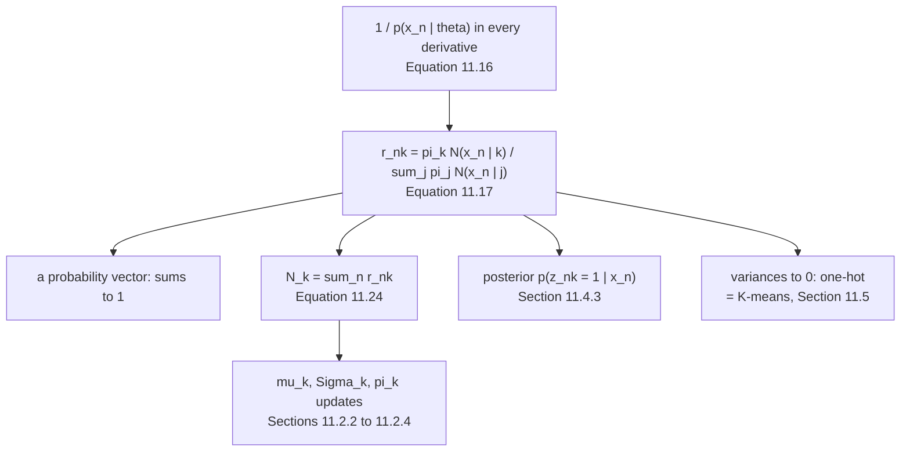

Page 1102 ended with the same factor appearing in every derivative:
$\pi_k\mathcal{N}(\mathbf{x}_n\mid\cdot)$ over the whole mixture density. §11.2.1 gives it a name and a
meaning, and the book flags how much work it will do:

> But before we do this, we introduce a quantity that will play a central role in the remainder of this
> chapter: **responsibilities**.

## What you'll learn

- Equation 11.17's definition, and Equation 11.19 checked entry by entry — including **one place the book's printed matrix disagrees with the arithmetic**, by $0.001$.
- Equation 11.24: $N_k = \sum_n r_{nk}$, and $\sum_k N_k = N$ to $7.000000000000$.
- The margin note *"$\mathbf{r}_n$ follows a Boltzmann/Gibbs distribution"*, verified: $\mathbf{r}_n = \mathrm{softmax}(-\mathbf{E}_n)$ with $E_{nk} = -\log\pi_k - \log\mathcal{N}(x_n\mid\mu_k,\sigma_k^2)$, matching to $1.1\times10^{-16}$.
- What *"soft assignment"* buys on this data: at the initialisation the least-decided point is $x = 2$ at $0.933753$; at convergence it is $x = 0$ at $0.983469$.
- The entropy of $\mathbf{r}_n$ as a measure of how much softness is actually in play — mean $0.066338$ at the start against a maximum of $\log 3 = 1.098612$.
- **Shrink every variance and the responsibilities become indicator vectors** — which is K-means, exactly as §11.5 says.
- And a practical trap: **Equation 11.17 typed out as written produces $21$ NaNs of $21$ entries** once the variances are small; in log-space it produces the exact one-hot answer.

## Intuition: a soft assignment is the only thing that can be differentiated

Suppose you knew which component made each point. Then fitting is trivial — split the data and fit
each Gaussian to its own share, with the closed forms of Chapter 8. That is the whole difficulty:
**you do not know**.

The obvious repair is to guess — assign each point to its most likely component and fit. That is
K-means, and it works, but it throws away the fact that some points are genuinely ambiguous. Worse, it
is not differentiable: nudge a parameter and a point's label jumps discontinuously.

The responsibility is the repair that keeps the calculus. Each point contributes to **every** component,
weighted by how plausible that component makes it. Nothing jumps, everything differentiates, and the
hard assignment reappears as a limit.

## §11.2.1 The definition

$$
r_{nk} := \frac{\pi_k\mathcal{N}(\mathbf{x}_n\mid\boldsymbol\mu_k,\boldsymbol\Sigma_k)}{\sum_{j=1}^{K}\pi_j\mathcal{N}(\mathbf{x}_n\mid\boldsymbol\mu_j,\boldsymbol\Sigma_j)}
\qquad \text{(11.17)}
$$

> The responsibility $r_{nk}$ of the $k$th mixture component for data point $\mathbf{x}_n$ is
> proportional to the likelihood [...] Therefore, mixture components have a **high responsibility for a
> data point when the data point could be a plausible sample from that mixture component.**

$\mathbf{r}_n = [r_{n1},\ldots,r_{nK}]^\top$ is a normalised probability vector, $\sum_k r_{nk} = 1$ with
$r_{nk} \geq 0$ — a *"soft assignment"* of $\mathbf{x}_n$ to the $K$ components.

<Figure
  src="/images/mml/responsibilities/the-responsibility-matrix"
  alt="Top, two seven-by-three heat maps of responsibilities, mostly bright yellow or dark purple with a few intermediate cells, labelled with their values. Bottom, a stacked area chart across the real line in three colours summing to one everywhere, with seven red triangular markers showing the data."
  title="Equation 11.19, and the same quantity at every other x"
  caption="Each row of the heat maps sums to 1. The bottom panel is the converged model's responsibilities as continuous functions of x — they partition the line, and the transitions between components are smooth rather than abrupt, which is exactly what makes them differentiable."
/>

:::caution[One entry of Equation 11.19 does not round the way the book prints it]
Computed at the book's own initialisation, to six decimals:

| $x_n$ | $r_{n1}$ | $r_{n2}$ | $r_{n3}$ | the book's row |
| --- | --- | --- | --- | --- |
| $-3.0$ | $1.000000$ | $0.000000$ | $0.000000$ | $[1, 0, 0]$ |
| $-2.5$ | $0.999999$ | $0.000001$ | $0.000000$ | $[1, 0, 0]$ |
| $-1.0$ | $0.057069$ | $0.942926$ | $0.000004$ | $[0.057, 0.943, 0]$ |
| $\mathbf{0.0}$ | $\mathbf{0.000150}$ | $\mathbf{0.999844}$ | $0.000006$ | $\mathbf{[0.001, 0.999, 0]}$ |
| $2.0$ | $0.000010$ | $0.066237$ | $0.933753$ | $[0, 0.066, 0.934]$ |
| $4.0$ | $0.000000$ | $0.000000$ | $1.000000$ | $[0, 0, 1]$ |
| $5.0$ | $0.000000$ | $0.000000$ | $1.000000$ | $[0, 0, 1]$ |

Every row matches to the printed precision except the fourth: $0.000150$ rounds to $0.000$, not
$0.001$, and $0.999844$ rounds to $1.000$, not $0.999$. The largest disagreement is $0.001$ — a typo or
a rounding choice, not a mathematical error, and it changes nothing downstream. Worth knowing if you
check your own implementation against the printed matrix.

The book's reading of the matrix does hold: *"the third mixture component is not responsible for any of
the first four data points"* — measured, its largest responsibility among those four is
$6.0\times10^{-6}$.
:::

Summing down the columns gives Equation 11.24:

$$
N_k := \sum_{n=1}^{N} r_{nk} \qquad \text{(11.24)}
$$

| | $k=1$ | $k=2$ | $k=3$ | total |
| --- | --- | --- | --- | --- |
| $N_k$ at the initialisation | $2.057228$ | $2.009008$ | $2.933763$ | $\mathbf{7.000000000000}$ |

**$N_k$ is a count that need not be a whole number** — the effective number of points each component
owns. That it sums to $N$ exactly is the column-sum counterpart of the rows summing to $1$, and it is
what makes Equation 11.42's $\pi_k = N_k/N$ a valid set of weights.

## The margin note, checked

> $\mathbf{r}_n$ follows a Boltzmann/Gibbs distribution.

Write $E_{nk} := -\log\pi_k - \log\mathcal{N}(x_n\mid\mu_k,\sigma_k^2)$. Then Equation 11.17 is exactly

$$
r_{nk} = \frac{e^{-E_{nk}}}{\sum_j e^{-E_{nj}}} = \mathrm{softmax}(-\mathbf{E}_n)_k
$$

Measured, $\max\lvert\mathrm{softmax}(-\mathbf{E}) - \mathbf{r}\rvert = 1.1\times10^{-16}$.

<Figure
  src="/images/mml/responsibilities/a-softmax-over-energies"
  alt="Left, three lines of energy against data point, crossing each other so that a different one is lowest in each of three regions. Right, grouped bars of responsibility with a small dark dot sitting exactly on top of every bar."
  title="The same numbers, as energies and as probabilities"
  caption="On the left the lowest energy wins — but softly, because the gap matters, not just the order. At x = -1 the first two energies are 6.5176 and 3.7128, a gap of 2.8, giving 0.057 against 0.943. The dots on the right are the softmax of the negated energies; they land on the bars to 1.1e-16."
/>

:::tip[Why this framing is worth keeping]
Three things follow immediately from *softmax over energies*, and each reappears later:

**The gap is what matters, not the ranking.** $r_{n1}/r_{n2} = e^{E_{n2}-E_{n1}}$, so a component two nats
better takes about $7.4$ times the responsibility regardless of what the other energies are.

**The prior enters as an offset.** $-\log\pi_k$ shifts a component's energy uniformly in $x$, so
changing the mixture weights slides responsibility without changing *where* the boundaries are shaped —
which is why page 1106's weight update is the simplest of the three.

**Temperature is variance.** Scaling every $\sigma_k^2$ by $t$ scales the quadratic part of every energy
by $1/t$, which is a Boltzmann distribution at temperature $t$. That is the next section.
:::

## Soft, and how soft

On the book's seven points, soft assignment is barely being used:

| | least-decided point | its $\max_k r_{nk}$ | points below $0.9$ | mean entropy |
| --- | --- | --- | --- | --- |
| at the initialisation | $x = 2$ | $0.933753$ | $0$ of $7$ | $0.066338$ |
| at convergence | $x = 0$ | $0.983469$ | $0$ of $7$ | $0.013865$ |

against a maximum possible entropy of $\log 3 = 1.098612$. Seven well-separated points in one dimension
do not need much softness — but the algorithm does, because a hard assignment is not differentiable,
and because the book's own Figure 11.10(b) shows the opposite case: *"the responsibilities of these two
clusters for those points are around $0.5$."*

## Turn the temperature down and you get K-means

Scaling every variance by $t$ and letting $t \to 0$:

| $t$ | mean $\max_k r_{nk}$ | mean entropy | points above $0.99$ |
| --- | --- | --- | --- |
| $10^{2}$ | $0.513458$ | $0.943042$ | $0$ |
| $10^{1}$ | $0.793531$ | $0.514462$ | $1$ |
| $10^{0}$ | $0.997409$ | $0.013865$ | $6$ |
| $10^{-1}$ | $1.000000$ | $0.000000$ | $7$ |
| $10^{-6}$ | $\mathbf{1.000000}$ | $\mathbf{0.000000}$ | $\mathbf{7}$ |

<Figure
  src="/images/mml/responsibilities/soft-becomes-hard"
  alt="Left, a blue curve rising from about 0.5 to 1 and an amber curve falling from near 1 to 0 as the variance scale decreases, with dotted guide lines at one and one third. Right, a red curve that is flat at zero and then jumps to 21, against a blue dashed line that stays at zero throughout."
  title="The same formula, and the same formula written differently"
  caption="Left: at large variances every component is equally plausible and the responsibilities approach 1/K; at small variances they become indicator vectors, which is K-means. Right: the naive form of Equation 11.17 computes zero over zero once the densities underflow, returning NaN for all 21 entries, while the log-space form returns the exact one-hot answer."
/>

§11.5 states the relationship: *"If we treat the means in the GMM as cluster centers and ignore the
covariances (or set them to $\mathbf{I}$), we arrive at K-means. [...] K-means makes a 'hard' assignment
of data points to cluster centers, whereas a GMM makes a 'soft' assignment via the responsibilities."*

On this data, run from the book's own starting means, the two do **not** land in the same place:

| | centres | cluster sizes | within-cluster SS |
| --- | --- | --- | --- |
| GMM at convergence | $-2.750036,\ -0.504119,\ 3.644573$ | $1.982478,\ 1.999703,\ 3.017819$ | — |
| K-means from $[-4, 0, 8]$ | $-2.166667,\ 1.000000,\ 4.500000$ | $3, 2, 2$ | $\mathbf{4.666667}$ |
| K-means handed the GMM's answer | $-2.750000,\ -0.500000,\ 3.666667$ | $2, 2, 3$ | $5.291667$ |

Two things worth separating. **From the same start the two algorithms disagree by $1.504119$** — they
split the seven points differently, $3\!-\!2\!-\!2$ against effectively $2\!-\!2\!-\!3$. And the
GMM's partition is not even the better *K-means* answer: its within-cluster sum of squares is
$5.291667$ against $4.666667$.

The reason is in the last row of the GMM's parameters: its variances are $0.0625$, $0.250581$ and
$1.628941$ — a factor of $26.06$ apart. **K-means has no variances**, so it cannot prefer a tight
cluster of two over a loose cluster of three. Only if you hand K-means the GMM's own answer does it stay
there, and then the centres agree to $0.022094$ and the counts differ only by being integers.

:::caution[Equation 11.17, typed out as written, breaks]
The numerator and denominator both underflow long before the ratio does. Measured on the converged model
with every variance scaled by $t$:

| $t$ | NaNs from Equation 11.17 as written | NaNs in log-space |
| --- | --- | --- |
| $10^{-2}$ | $0$ | $0$ |
| $10^{-3}$ | $3$ | $0$ |
| $10^{-6}$ | $\mathbf{21}$ of $21$ | $\mathbf{0}$ |

The fix is the same one every implementation uses: form
$\log\pi_k + \log\mathcal{N}(x_n\mid\cdot)$, subtract the row's `logsumexp`, and exponentiate. Where both
work they agree to $2.2\times10^{-16}$.

This is not a small-variance curiosity. In $D$ dimensions the log-density scales with $D$, so a
well-conditioned model on $784$-pixel images hits the same underflow at perfectly ordinary parameter
values.
:::

<Quiz
  title="Are responsibilities clear?"
  questions={[
    {
      q: "What is r_nk, in one sentence?",
      options: [
        "The distance from x_n to the k-th mean",
        "The share of x_n that component k is credited with — its weighted density over the whole mixture's density at that point",
        "The probability that component k exists",
        "The k-th mixture weight",
      ],
      answer: 1,
      explain:
        "Equation 11.17. Each row sums to one, so it is a probability vector over components — a soft assignment. Section 11.4.3 later identifies it as a genuine posterior, the probability that the k-th component generated the n-th point.",
    },
    {
      q: "The book's margin note calls r_n a Boltzmann distribution. Is that exact?",
      options: [
        "It is a loose analogy",
        "It is exact: r_n is the softmax of minus the energies -log pi_k - log N(x_n | k), matching to 1.1e-16",
        "Only for equal mixture weights",
        "Only in one dimension",
      ],
      answer: 1,
      explain:
        "And the framing pays: the ratio of two responsibilities is the exponential of their energy gap, the mixture weight enters as a uniform offset, and scaling all the variances by t is exactly a temperature. The last of those is the K-means limit.",
    },
    {
      q: "What is N_k, and why need it not be a whole number?",
      options: [
        "The number of points assigned to component k, always an integer",
        "The column sum of the responsibilities — an effective count, fractional because the assignment is soft, summing to N exactly",
        "The number of components",
        "The number of data points",
      ],
      answer: 1,
      explain:
        "Measured at the book's initialisation: 2.057228, 2.009008 and 2.933763, summing to 7.000000000000. K-means from the same start gives integer sizes 3, 2 and 2 — a different split entirely, because it has no variances with which to prefer a tight cluster over a loose one.",
    },
    {
      q: "What goes wrong if you code Equation 11.17 exactly as printed?",
      options: [
        "Nothing",
        "Numerator and denominator both underflow to zero, giving NaN — all 21 entries of a 7-by-3 matrix once the variances are small",
        "It gives negative values",
        "The rows stop summing to one",
      ],
      answer: 1,
      explain:
        "The fix is to work in log-space: add the log weight to the log density, subtract the row's logsumexp, exponentiate. Where both forms work they agree to 2.2e-16. This is not exotic — in D dimensions the log-density scales with D, so 784-pixel images hit it at ordinary parameter values.",
    },
  ]}
/>

## Exercises

### Exercise 1 – Check Equation 11.19 against the arithmetic

<DataCampExercise
  lang="python"
  hint={`Equation 11.17 divides each weighted component density by the row's total.`}
  code={`import numpy as np

X = np.array([-3.0, -2.5, -1.0, 0.0, 2.0, 4.0, 5.0])
MU = np.array([-4.0, 0.0, 8.0])
VAR = np.array([1.0, 0.2, 3.0])
PI = np.ones(3)/3

def gauss(x, mu, var):
    return np.exp(-0.5*(x - mu)**2/var)/np.sqrt(2*np.pi*var)

W = PI[None, :]*gauss(X[:, None], MU[None, :], VAR[None, :])
# Task: Equation 11.17, for all seven points at once.
R = ___

book = np.array([[1.0, 0.0, 0.0], [1.0, 0.0, 0.0], [0.057, 0.943, 0.0],
                 [0.001, 0.999, 0.0], [0.0, 0.066, 0.934], [0.0, 0.0, 1.0],
                 [0.0, 0.0, 1.0]])
for n in range(7):
    print(f"x = {X[n]:>5.1f}: {R[n,0]:.6f} {R[n,1]:.6f} {R[n,2]:.6f}"
          f"   row sum {R[n].sum():.10f}")
d = np.abs(np.round(R, 3) - book)
i, j = np.unravel_index(np.argmax(d), d.shape)
print(f"\\nlargest gap to the book's printed matrix : {d.max():.3f}")
print(f"  at x = {X[i]}, component {j+1}: book {book[i,j]:.3f}, "
      f"computed {R[i,j]:.6f}")
print(f"N_k (Equation 11.24) : {np.round(R.sum(0), 6)}, "
      f"summing to {R.sum():.12f}")

# -- Expected output ------------------------------
# x =  -3.0: 1.000000 0.000000 0.000000   row sum 1.0000000000
# x =  -2.5: 0.999999 0.000001 0.000000   row sum 1.0000000000
# x =  -1.0: 0.057069 0.942926 0.000004   row sum 1.0000000000
# x =   0.0: 0.000150 0.999844 0.000006   row sum 1.0000000000
# x =   2.0: 0.000010 0.066237 0.933753   row sum 1.0000000000
# x =   4.0: 0.000000 0.000000 1.000000   row sum 1.0000000000
# x =   5.0: 0.000000 0.000000 1.000000   row sum 1.0000000000
#
# largest gap to the book's printed matrix : 0.001
#   at x = 0.0, component 2: book 0.999, computed 0.999844
# N_k (Equation 11.24) : [2.057228 2.009008 2.933763], summing to 7.000000000000
# -------------------------------------------------`}
  solution={`import numpy as np
X = np.array([-3.0, -2.5, -1.0, 0.0, 2.0, 4.0, 5.0])
MU = np.array([-4.0, 0.0, 8.0])
VAR = np.array([1.0, 0.2, 3.0])
PI = np.ones(3)/3
def gauss(x, mu, var):
    return np.exp(-0.5*(x - mu)**2/var)/np.sqrt(2*np.pi*var)
W = PI[None, :]*gauss(X[:, None], MU[None, :], VAR[None, :])
R = W/W.sum(1, keepdims=True)
book = np.array([[1.0, 0.0, 0.0], [1.0, 0.0, 0.0], [0.057, 0.943, 0.0],
                 [0.001, 0.999, 0.0], [0.0, 0.066, 0.934], [0.0, 0.0, 1.0],
                 [0.0, 0.0, 1.0]])
for n in range(7):
    print(f"x = {X[n]:>5.1f}: {R[n,0]:.6f} {R[n,1]:.6f} {R[n,2]:.6f}"
          f"   row sum {R[n].sum():.10f}")
d = np.abs(np.round(R, 3) - book)
i, j = np.unravel_index(np.argmax(d), d.shape)
print(f"\\nlargest gap to the book's printed matrix : {d.max():.3f}")
print(f"  at x = {X[i]}, component {j+1}: book {book[i,j]:.3f}, "
      f"computed {R[i,j]:.6f}")
print(f"N_k (Equation 11.24) : {np.round(R.sum(0), 6)}, "
      f"summing to {R.sum():.12f}")`}
  sct={`test_output_contains("at x = 0.0, component 2: book 0.999, computed 0.999844")
test_output_contains("summing to 7.000000000000")
success_msg("Every row sums to one and the columns sum to N. The single disagreement with the printed matrix is 0.001 at one entry — worth knowing when you check your own implementation, and harmless downstream.")`}
  height={400}
/>

### Exercise 2 – The margin note, as arithmetic

<DataCampExercise
  lang="python"
  hint={`An energy is minus the log of the weighted component density. A softmax of the negated energies is exp over the sum of exps.`}
  code={`import numpy as np

X = np.array([-3.0, -2.5, -1.0, 0.0, 2.0, 4.0, 5.0])
MU = np.array([-4.0, 0.0, 8.0])
VAR = np.array([1.0, 0.2, 3.0])
PI = np.ones(3)/3

def gauss(x, mu, var):
    return np.exp(-0.5*(x - mu)**2/var)/np.sqrt(2*np.pi*var)

W = PI[None, :]*gauss(X[:, None], MU[None, :], VAR[None, :])
R = W/W.sum(1, keepdims=True)

# Task: the energies E_nk = -log(pi_k) - log N(x_n | mu_k, var_k).
E = ___
S = np.exp(-E)
S = S/S.sum(1, keepdims=True)

print(f"max |softmax(-E) - r| : {np.abs(S - R).max():.3e}")
for n in (2, 4):
    print(f"x = {X[n]:>5.1f}: energies {np.round(E[n], 4)}")
    print(f"          gap E_2 - E_1 = {E[n,1]-E[n,0]:>9.4f}, "
          f"ratio r_1/r_2 = {R[n,0]/R[n,1]:>9.4f}, "
          f"exp(-gap) = {np.exp(-(E[n,1]-E[n,0])):>9.4f}")

# -- Expected output ------------------------------
# max |softmax(-E) - r| : 1.110e-16
# x =  -1.0: energies [ 6.5176  3.7128 16.0669]
#           gap E_2 - E_1 =   -2.8047, ratio r_1/r_2 =    0.0605, exp(-gap) =   16.5224
# x =   2.0: energies [20.0176 11.2128  8.5669]
#           gap E_2 - E_1 =   -8.8047, ratio r_1/r_2 =    0.0002, exp(-gap) = 6665.6247
# -------------------------------------------------`}
  solution={`import numpy as np
X = np.array([-3.0, -2.5, -1.0, 0.0, 2.0, 4.0, 5.0])
MU = np.array([-4.0, 0.0, 8.0])
VAR = np.array([1.0, 0.2, 3.0])
PI = np.ones(3)/3
def gauss(x, mu, var):
    return np.exp(-0.5*(x - mu)**2/var)/np.sqrt(2*np.pi*var)
W = PI[None, :]*gauss(X[:, None], MU[None, :], VAR[None, :])
R = W/W.sum(1, keepdims=True)
E = -(np.log(PI)[None, :] + np.log(gauss(X[:, None], MU[None, :],
                                         VAR[None, :])))
S = np.exp(-E)
S = S/S.sum(1, keepdims=True)
print(f"max |softmax(-E) - r| : {np.abs(S - R).max():.3e}")
for n in (2, 4):
    print(f"x = {X[n]:>5.1f}: energies {np.round(E[n], 4)}")
    print(f"          gap E_2 - E_1 = {E[n,1]-E[n,0]:>9.4f}, "
          f"ratio r_1/r_2 = {R[n,0]/R[n,1]:>9.4f}, "
          f"exp(-gap) = {np.exp(-(E[n,1]-E[n,0])):>9.4f}")`}
  sct={`test_output_contains("max |softmax(-E) - r| : 1.110e-16")
test_output_contains("exp(-gap) =   16.5224")
success_msg("The ratio of two responsibilities is exactly the exponential of their energy gap, with no reference to the third component. That is what makes the Boltzmann framing more than a metaphor.")`}
  height={370}
/>

### Exercise 3 – How much softness is actually used

<DataCampExercise
  lang="python"
  hint={`The entropy of a probability vector is minus the sum of p times log p; clamp the log's argument so zeros do not blow up.`}
  code={`import numpy as np

X = np.array([-3.0, -2.5, -1.0, 0.0, 2.0, 4.0, 5.0])
N = len(X)

def gauss(x, mu, var):
    return np.exp(-0.5*(x - mu)**2/var)/np.sqrt(2*np.pi*var)

def resp(pi, mu, var):
    W = pi[None, :]*gauss(X[:, None], mu[None, :], var[None, :])
    return W/W.sum(1, keepdims=True)

pi = np.ones(3)/3
mu = np.array([-4.0, 0.0, 8.0])
var = np.array([1.0, 0.2, 3.0])
R0 = resp(pi, mu, var)
for _ in range(300):
    R = resp(pi, mu, var)
    Nk = R.sum(0)
    mu = (R*X[:, None]).sum(0)/Nk
    var = (R*(X[:, None] - mu[None, :])**2).sum(0)/Nk
    pi = Nk/N
Rc = resp(pi, mu, var)

# Task: the entropy of each row.
def entropy(M):
    return ___

print(f"maximum possible entropy, log K : {np.log(3):.6f}")
print(f"mean entropy at the start       : {entropy(R0).mean():.6f}")
print(f"mean entropy at convergence     : {entropy(Rc).mean():.6f}")
print(f"least decided at the start      : x = "
      f"{X[np.argmin(R0.max(1))]}, max r = {R0.max(1).min():.6f}")
print(f"least decided at convergence    : x = "
      f"{X[np.argmin(Rc.max(1))]}, max r = {Rc.max(1).min():.6f}")

# -- Expected output ------------------------------
# maximum possible entropy, log K : 1.098612
# mean entropy at the start       : 0.066338
# mean entropy at convergence     : 0.013865
# least decided at the start      : x = 2.0, max r = 0.933753
# least decided at convergence    : x = 0.0, max r = 0.983469
# -------------------------------------------------`}
  solution={`import numpy as np
X = np.array([-3.0, -2.5, -1.0, 0.0, 2.0, 4.0, 5.0])
N = len(X)
def gauss(x, mu, var):
    return np.exp(-0.5*(x - mu)**2/var)/np.sqrt(2*np.pi*var)
def resp(pi, mu, var):
    W = pi[None, :]*gauss(X[:, None], mu[None, :], var[None, :])
    return W/W.sum(1, keepdims=True)
pi = np.ones(3)/3
mu = np.array([-4.0, 0.0, 8.0])
var = np.array([1.0, 0.2, 3.0])
R0 = resp(pi, mu, var)
for _ in range(300):
    R = resp(pi, mu, var)
    Nk = R.sum(0)
    mu = (R*X[:, None]).sum(0)/Nk
    var = (R*(X[:, None] - mu[None, :])**2).sum(0)/Nk
    pi = Nk/N
Rc = resp(pi, mu, var)
def entropy(M):
    return -(M*np.log(np.maximum(M, 1e-300))).sum(1)
print(f"maximum possible entropy, log K : {np.log(3):.6f}")
print(f"mean entropy at the start       : {entropy(R0).mean():.6f}")
print(f"mean entropy at convergence     : {entropy(Rc).mean():.6f}")
print(f"least decided at the start      : x = "
      f"{X[np.argmin(R0.max(1))]}, max r = {R0.max(1).min():.6f}")
print(f"least decided at convergence    : x = "
      f"{X[np.argmin(Rc.max(1))]}, max r = {Rc.max(1).min():.6f}")`}
  sct={`test_output_contains("mean entropy at convergence     : 0.013865")
test_output_contains("least decided at convergence    : x = 0.0, max r = 0.983469")
success_msg("Seven well-separated points in one dimension barely use the softness — mean entropy 0.014 against a possible 1.099. The algorithm still needs it, because a hard assignment cannot be differentiated.")`}
  height={380}
/>

### Exercise 4 – Turn the temperature down

<DataCampExercise
  lang="python"
  hint={`Scaling every variance by t scales the quadratic part of every energy by 1/t — a Boltzmann distribution at temperature t.`}
  code={`import numpy as np
from scipy.special import logsumexp

X = np.array([-3.0, -2.5, -1.0, 0.0, 2.0, 4.0, 5.0])
N = len(X)
PI = np.array([0.285672, 0.283211, 0.431117])
MU = np.array([-2.750036, -0.504119, 3.644573])
VAR = np.array([0.0625, 0.250581, 1.628941])

def resp_naive(pi, mu, var):
    g = (np.exp(-0.5*(X[:, None]-mu[None, :])**2/var[None, :])
         / np.sqrt(2*np.pi*var[None, :]))
    W = pi[None, :]*g
    return W/W.sum(1, keepdims=True)

def resp_log(pi, mu, var):
    lw = (np.log(pi)[None, :]
          - 0.5*(X[:, None]-mu[None, :])**2/var[None, :]
          - 0.5*np.log(2*np.pi*var[None, :]))
    # Task: normalise in log-space, then exponentiate.
    return ___

print(f"{'t':>9} {'mean max r':>12} {'NaNs naive':>12} {'NaNs log':>10}")
for t in (1e2, 1e0, 1e-2, 1e-3, 1e-6):
    a, b = resp_naive(PI, MU, VAR*t), resp_log(PI, MU, VAR*t)
    print(f"{t:>9.0e} {b.max(1).mean():>12.6f} "
          f"{int(np.isnan(a).sum()):>12} {int(np.isnan(b).sum()):>10}")
print(f"\\nat t = 1e-06 the log-space answer is")
print(resp_log(PI, MU, VAR*1e-6))

# -- Expected output ------------------------------
#         t   mean max r   NaNs naive   NaNs log
#     1e+02     0.513458            0          0
#     1e+00     0.997409            0          0
#     1e-02     1.000000            0          0
#     1e-03     1.000000            3          0
#     1e-06     1.000000           21          0
#
# at t = 1e-06 the log-space answer is
# [[1. 0. 0.]
#  [1. 0. 0.]
#  [0. 1. 0.]
#  [0. 1. 0.]
#  [0. 0. 1.]
#  [0. 0. 1.]
#  [0. 0. 1.]]
# -------------------------------------------------`}
  solution={`import numpy as np
from scipy.special import logsumexp
X = np.array([-3.0, -2.5, -1.0, 0.0, 2.0, 4.0, 5.0])
N = len(X)
PI = np.array([0.285672, 0.283211, 0.431117])
MU = np.array([-2.750036, -0.504119, 3.644573])
VAR = np.array([0.0625, 0.250581, 1.628941])
def resp_naive(pi, mu, var):
    g = (np.exp(-0.5*(X[:, None]-mu[None, :])**2/var[None, :])
         / np.sqrt(2*np.pi*var[None, :]))
    W = pi[None, :]*g
    return W/W.sum(1, keepdims=True)
def resp_log(pi, mu, var):
    lw = (np.log(pi)[None, :]
          - 0.5*(X[:, None]-mu[None, :])**2/var[None, :]
          - 0.5*np.log(2*np.pi*var[None, :]))
    return np.exp(lw - logsumexp(lw, axis=1, keepdims=True))
print(f"{'t':>9} {'mean max r':>12} {'NaNs naive':>12} {'NaNs log':>10}")
for t in (1e2, 1e0, 1e-2, 1e-3, 1e-6):
    a, b = resp_naive(PI, MU, VAR*t), resp_log(PI, MU, VAR*t)
    print(f"{t:>9.0e} {b.max(1).mean():>12.6f} "
          f"{int(np.isnan(a).sum()):>12} {int(np.isnan(b).sum()):>10}")
print(f"\\nat t = 1e-06 the log-space answer is")
print(resp_log(PI, MU, VAR*1e-6))`}
  sct={`test_output_contains("1e-06     1.000000           21          0")
test_output_contains("1e+02     0.513458            0          0")
success_msg("Twenty-one NaNs of twenty-one entries from the formula as printed, and the exact one-hot K-means assignment from the same formula in log-space. Every library implementation does the second.")`}
  height={420}
/>

### Exercise 5 – Soft counts against hard counts

<DataCampExercise
  lang="python"
  hint={`K-means assigns each point to the nearest centre, then moves each centre to the mean of its points.`}
  code={`import numpy as np

X = np.array([-3.0, -2.5, -1.0, 0.0, 2.0, 4.0, 5.0])
N = len(X)

def gauss(x, mu, var):
    return np.exp(-0.5*(x - mu)**2/var)/np.sqrt(2*np.pi*var)

def resp(pi, mu, var):
    W = pi[None, :]*gauss(X[:, None], mu[None, :], var[None, :])
    return W/W.sum(1, keepdims=True)

pi = np.ones(3)/3
mu = np.array([-4.0, 0.0, 8.0])
var = np.array([1.0, 0.2, 3.0])
for _ in range(300):
    R = resp(pi, mu, var)
    Nk = R.sum(0)
    mu = (R*X[:, None]).sum(0)/Nk
    var = (R*(X[:, None] - mu[None, :])**2).sum(0)/Nk
    pi = Nk/N

c = np.array([-4.0, 0.0, 8.0])
for _ in range(200):
    # Task: the hard assignment -- nearest centre for every point.
    lab = ___
    for k in range(3):
        if (lab == k).any():
            c[k] = X[lab == k].mean()

lab = np.argmin((X[:, None] - c[None, :])**2, 1)
print(f"GMM means          : {np.round(np.sort(mu), 6)}")
print(f"K-means centres    : {np.round(np.sort(c), 6)}")
print(f"largest difference : {np.abs(np.sort(mu) - np.sort(c)).max():.6f}")
print(f"K-means sizes      : {[int((lab == k).sum()) for k in range(3)]}")
print(f"GMM's N_k          : {np.round(np.sort(resp(pi, mu, var).sum(0)), 6)}")

# -- Expected output ------------------------------
# GMM means          : [-2.750036 -0.504119  3.644573]
# K-means centres    : [-2.166667  1.        4.5     ]
# largest difference : 1.504119
# K-means sizes      : [3, 2, 2]
# GMM's N_k          : [1.982478 1.999703 3.017819]
# -------------------------------------------------`}
  solution={`import numpy as np
X = np.array([-3.0, -2.5, -1.0, 0.0, 2.0, 4.0, 5.0])
N = len(X)
def gauss(x, mu, var):
    return np.exp(-0.5*(x - mu)**2/var)/np.sqrt(2*np.pi*var)
def resp(pi, mu, var):
    W = pi[None, :]*gauss(X[:, None], mu[None, :], var[None, :])
    return W/W.sum(1, keepdims=True)
pi = np.ones(3)/3
mu = np.array([-4.0, 0.0, 8.0])
var = np.array([1.0, 0.2, 3.0])
for _ in range(300):
    R = resp(pi, mu, var)
    Nk = R.sum(0)
    mu = (R*X[:, None]).sum(0)/Nk
    var = (R*(X[:, None] - mu[None, :])**2).sum(0)/Nk
    pi = Nk/N
c = np.array([-4.0, 0.0, 8.0])
for _ in range(200):
    lab = np.argmin((X[:, None] - c[None, :])**2, 1)
    for k in range(3):
        if (lab == k).any():
            c[k] = X[lab == k].mean()
lab = np.argmin((X[:, None] - c[None, :])**2, 1)
print(f"GMM means          : {np.round(np.sort(mu), 6)}")
print(f"K-means centres    : {np.round(np.sort(c), 6)}")
print(f"largest difference : {np.abs(np.sort(mu) - np.sort(c)).max():.6f}")
print(f"K-means sizes      : {[int((lab == k).sum()) for k in range(3)]}")
print(f"GMM's N_k          : {np.round(np.sort(resp(pi, mu, var).sum(0)), 6)}")`}
  sct={`test_output_contains("largest difference : 1.504119")
test_output_contains("GMM's N_k          : [1.982478 1.999703 3.017819]")
success_msg("From the same starting means the two algorithms split seven points differently -- 3-2-2 against effectively 2-2-3, centres 1.504119 apart. K-means has no variances, so it cannot prefer a tight pair over a loose triple; the GMM's variances here differ by a factor of 26.")`}
  height={400}
/>

## Recall card

- **The responsibility is the factor that appeared in every derivative on the previous page**, given a name: component k's weighted density at a point, over the whole mixture's density there.
- **Each row is a probability vector**, so responsibilities are a soft assignment of a point to the components.
- **Summing down a column gives N_k**, the effective number of points a component owns — fractional, and summing to N exactly.
- **The book's printed responsibility matrix disagrees with the arithmetic at one entry**, by 0.001; the computed value at x equal to zero is 0.000150, not 0.001.
- **The margin note is exact, not a metaphor:** the responsibility vector is the softmax of minus the energies, matching to 1.1e-16.
- **So the ratio of two responsibilities is the exponential of their energy gap**, the mixture weights enter as a uniform offset, and the variances act as a temperature.
- **On the book's seven points the softness is barely used** — mean entropy 0.014 at convergence against a possible 1.099 — because the clusters are well separated.
- **Shrinking every variance drives the responsibilities to indicator vectors**, which is K-means. Section 11.5 says exactly this.
- **But from the same starting means they do not agree:** centres 1.504119 apart, splitting the points 3-2-2 against effectively 2-2-3, because K-means has no variances to weigh a tight cluster against a loose one.
- **Equation 11.17 typed out as written divides a vanishing number by a vanishing number**, returning NaN for all 21 entries once the variances are small.
- **In log-space it returns the exact answer**, and where both work they agree to 2.2e-16.
- **A hard assignment is not a rounding of a soft one — it is a different algorithm**, and the soft version is the one that can be differentiated.

**Next:** **[Updating the Means](../updating-the-means/)** — §11.2.2, the first of three updates, and
the one the book draws a picture for.
