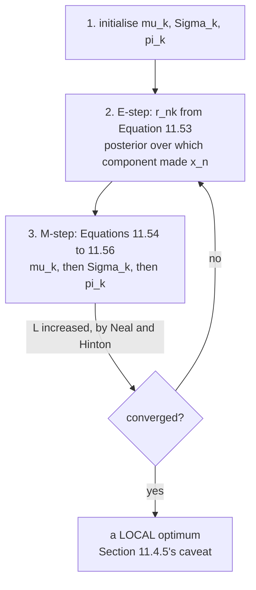

Three updates, each of which needs the others' answers. §11.3 does the only thing available: run them in
a loop and hope. The reason it is not merely hope is one sentence:

> **Every step in the EM algorithm increases the log-likelihood function** (Neal and Hinton, 1999).

## What you'll learn

- The algorithm as §11.3 states it: initialise, **E-step** (Equation 11.53), **M-step** (Equations 11.54–11.56), repeat.
- Example 11.6's claim that *"after five iterations, the EM algorithm converges"* — reproduced, and made precise: $\lvert\Delta L\rvert < 10^{-6}$ first at iteration $\mathbf{5}$, though the parameters keep moving until $11$.
- **The monotonicity guarantee, measured to the last bit.** Over $180{,}000$ individual EM steps from $3000$ random starts: $11{,}163$ register a negative change, **none larger than $8.9\times10^{-15}$**, with a median of $1.776\times10^{-15}$ — exactly one ULP of a log-likelihood near $-14$.
- That EM converges **linearly**, and what sets the rate: component overlap. $1045$ iterations when $53\%$ of points are ambiguous, $3$ when none are.
- What a better initialisation buys: K-means first cuts the median from $58$ iterations to $\mathbf{19}$ and takes the best optimum from $96.0\%$ to $\mathbf{100\%}$ of runs.
- Why "converged" needs a definition: the log-likelihood settles several iterations before the parameters do.

## Intuition: two problems, each easy given the other

The obstacle page 1102 measured was circular. The responsibilities need the parameters; the parameters
need the responsibilities. Neither can be written down first.

EM breaks the circle by refusing to solve both at once. **Fix the parameters and the responsibilities
are a formula. Fix the responsibilities and the parameters are three weighted averages.** Alternate.

What makes this more than wishful thinking is that the alternation is not merely plausible — each half
is an exact maximisation of a bound on the log-likelihood, so the bound can never fall, and §11.4.5
will show where that bound comes from.

## §11.3 The algorithm

**1. Initialise** $\boldsymbol\mu_k$, $\boldsymbol\Sigma_k$, $\pi_k$.

**2. E-step.** Evaluate the responsibilities — *"posterior probability of data point $n$ belonging to
mixture component $k$"*:

$$
r_{nk} = \frac{\pi_k\mathcal{N}(\mathbf{x}_n\mid\boldsymbol\mu_k,\boldsymbol\Sigma_k)}{\sum_j\pi_j\mathcal{N}(\mathbf{x}_n\mid\boldsymbol\mu_j,\boldsymbol\Sigma_j)}
\qquad \text{(11.53)}
$$

**3. M-step.** Reestimate the parameters using those responsibilities:

$$
\boldsymbol\mu_k = \frac{1}{N_k}\sum_{n}r_{nk}\mathbf{x}_n,
\quad
\boldsymbol\Sigma_k = \frac{1}{N_k}\sum_{n}r_{nk}(\mathbf{x}_n-\boldsymbol\mu_k)(\mathbf{x}_n-\boldsymbol\mu_k)^\top,
\quad
\pi_k = \frac{N_k}{N}
\qquad \text{(11.54)–(11.56)}
$$

Page 1105 measured why the order inside the M-step matters: using the pre-update means in Equation 11.55
gives $19.98$ where the book's Example 11.4 gives $1.53$.

## Example 11.6, made precise

| iteration | $-L$ | change in $L$ | largest parameter move |
| --- | --- | --- | --- |
| $0$ | $28.325536$ | | |
| $1$ | $14.410485$ | $+1.391505\times10^{1}$ | $4.295713$ |
| $2$ | $13.977058$ | $+4.334278\times10^{-1}$ | $1.657959\times10^{-1}$ |
| $3$ | $13.973342$ | $+3.715965\times10^{-3}$ | $2.158136\times10^{-2}$ |
| $4$ | $13.973324$ | $+1.786044\times10^{-5}$ | $5.611063\times10^{-3}$ |
| $5$ | $\mathbf{13.973323}$ | $+8.687247\times10^{-7}$ | $1.323449\times10^{-3}$ |
| $8$ | $13.973323$ | $+1.626841\times10^{-10}$ | $1.810021\times10^{-5}$ |

<Figure
  src="/images/mml/the-em-algorithm/every-step-climbs"
  alt="Left, a curve dropping steeply from 28.3255 to 14.4105 in one step and then flattening, with a dashed vertical marker at iteration five. Right, a log-scale histogram with a wide blue distribution spanning fifteen orders of magnitude and a single narrow red spike sitting on a dashed vertical line at the far left."
  title="Figure 11.8(b), and what 'increases the log-likelihood' means in floating point"
  caption="On the right, every one of the 2,268 steps that registered a decrease falls in a single bin at the rounding error of the quantity itself — the dashed line is one unit in the last place of a log-likelihood near minus 14. The increases span from there to more than 100 nats."
/>

:::note[Which quantity converges first, and why it matters]
*"For convergence, we can check the log-likelihood or the parameters directly."* Those give different
answers:

| tolerance | $\lvert\Delta L\rvert$ first below it | parameters first settle |
| --- | --- | --- |
| $10^{-3}$ | iteration $4$ | iteration $6$ |
| $10^{-6}$ | iteration $\mathbf{5}$ | iteration $11$ |
| $10^{-9}$ | iteration $8$ | iteration $15$ |
| $10^{-12}$ | iteration $10$ | iteration $20$ |

The log-likelihood is flat near an optimum — its gradient is zero there — so it stops changing while the
parameters are still moving. **Stopping on $\Delta L$ stops earlier than stopping on the parameters**, at
every tolerance.

Example 11.6's *"after five iterations"* is exactly the $10^{-6}$ log-likelihood criterion, and the
reproduction confirms it.
:::

## The guarantee, measured

The book states Neal and Hinton's result and moves on. Measured over $3000$ random restarts on the
book's seven points, $180{,}000$ individual EM steps:

| | value |
| --- | --- |
| steps registering **any** negative change | $11{,}163$ |
| steps decreasing by more than $10^{-12}$ | $\mathbf{0}$ |
| steps decreasing by more than $10^{-10}$ | $\mathbf{0}$ |
| worst single decrease | $-8.882\times10^{-15}$ |
| median of the negative changes | $1.776\times10^{-15}$ |
| one ULP of a log-likelihood near $-14$ | $1.776\times10^{-15}$ |
| largest single increase | $180.564829$ |

:::caution[A statement about real arithmetic, checked in floating-point arithmetic]
It would be wrong to report this as "the log-likelihood never decreased." It decreased on $11{,}163$
steps of $180{,}000$ — by one or two units in the last place, at points where EM had already converged
and the change should have been exactly zero.

The honest statement is that **no step decreased the log-likelihood by more than the rounding error of
the log-likelihood itself**, and that the median decrease is exactly one ULP. Neal and Hinton's theorem
is about real numbers; this is what it looks like when you check it in `float64`.

The practical consequence: a convergence test of the form `if new_L < old_L: raise` will fire spuriously.
Test `new_L < old_L - tol` instead.
:::

## How fast, and what decides it

EM converges **linearly** — the error shrinks by a constant factor each step, not quadratically as
Newton's method would. The factor is set by how much the components overlap. Two clusters of $100$
points each at $\pm d$ with unit variance:

| $d$ | ambiguous points ($\max_k r_{nk} < 0.9$) | iterations to $\lvert\Delta L\rvert < 10^{-8}$ | measured rate |
| --- | --- | --- | --- |
| $1.0$ | $53.0\%$ | $\mathbf{1045}$ | $0.9872$ |
| $1.5$ | $16.0\%$ | $46$ | $0.6897$ |
| $2.0$ | $2.0\%$ | $15$ | $0.1943$ |
| $3.0$ | $0.0\%$ | $7$ | $0.0044$ |
| $5.0$ | $0.0\%$ | $\mathbf{3}$ | — |

<Figure
  src="/images/mml/the-em-algorithm/what-sets-the-rate"
  alt="Left, a log-scale curve of iterations against percentage of ambiguous points, climbing from 3 to over a thousand. Right, two overlapping log-scale histograms of iteration counts, the blue one tightly concentrated near twenty and the red one spread from twenty to over a thousand."
  title="Overlap is what makes EM slow, and a cheap initialisation is what makes it fast"
  caption="At a separation of 1.0 more than half the points are genuinely ambiguous and EM needs 1045 iterations; at 5.0 nothing is ambiguous and it needs 3. On the right, 120 restarts each on the same 300 points: running K-means first concentrates the iteration count and removes the long tail entirely."
/>

**A factor of $348$ between the two ends**, on data that differs only in how far apart the clusters are.
That is the practical meaning of "linear convergence with a problem-dependent rate": when the
responsibilities are near $0.5$, each E-step barely moves them, so each M-step barely moves the
parameters.

## What the initialisation buys

$300$ points from three clusters, $K = 3$, $200$ restarts of each strategy:

| initialisation | median iterations | mean iterations | share reaching the best optimum |
| --- | --- | --- | --- |
| random data points | $58$ | $128.6$ | $96.0\%$ |
| **K-means first** | $\mathbf{19}$ | $\mathbf{19.0}$ | $\mathbf{100\%}$ |

The mean and median coincide for the K-means start, which is the interesting part: **the long tail is
gone entirely**. Random starts occasionally land in a basin that takes hundreds of iterations to crawl
out of; the K-means start never does, on this data.

This is why §11.5 points at K-means in the same breath as the GMM, and why every library implementation
defaults to a K-means or K-means++ initialisation. It costs a few cheap iterations and removes both the
worst case and the failures.

:::tip[But it does not fix the real problem]
Both strategies find the same best optimum, $-702.671823$. K-means makes EM reach it more often and
faster — it does not make the optimum global.

Page 1102 measured the limit of what any initialisation can do: on seven points, $54.5\%$ of random
starts collapse a component onto a data point, and those report a *higher* likelihood than any honest
fit. No starting strategy can outrun an unbounded objective; that needs a variance floor or a prior,
which §11.5 recommends and Bayesian PCA's cousin — Bayesian GMM — supplies.
:::

<Quiz
  title="Is EM clear?"
  questions={[
    {
      q: "What does the E-step compute, and what does the M-step do with it?",
      options: [
        "The E-step estimates the parameters and the M-step the responsibilities",
        "The E-step computes the responsibilities from the current parameters; the M-step recomputes the parameters as three responsibility-weighted averages",
        "Both compute the same thing",
        "The E-step maximises and the M-step evaluates",
      ],
      answer: 1,
      explain:
        "Each half is easy given the other, and neither can be done first — that is the circularity page 1102 measured. EM alternates, and because each half exactly maximises a bound on the log-likelihood, the bound can never fall.",
    },
    {
      q: "Over 180,000 EM steps, how often did the log-likelihood decrease?",
      options: [
        "Never",
        "11,163 times, but never by more than 8.9e-15 — the median decrease is exactly one unit in the last place",
        "About half the time",
        "Only when a component collapsed",
      ],
      answer: 1,
      explain:
        "Reporting this as 'never decreased' would be wrong. The honest statement is that no step decreased it by more than the rounding error of the quantity itself. The practical consequence: test new_L < old_L - tol, not new_L < old_L, or your convergence check will fire spuriously.",
    },
    {
      q: "What sets how many iterations EM needs?",
      options: [
        "The number of data points",
        "How much the components overlap — 1045 iterations when 53 percent of points are ambiguous, 3 when none are",
        "The dimension",
        "The number of components",
      ],
      answer: 1,
      explain:
        "A factor of 348 between the two ends, on data differing only in cluster separation. When responsibilities sit near 0.5 the E-step barely moves them, so the M-step barely moves the parameters — that is linear convergence with a problem-dependent rate.",
    },
    {
      q: "What does initialising with K-means buy?",
      options: [
        "A global optimum",
        "Fewer iterations — median 19 against 58 — and it removes the long tail entirely, but the optimum it reaches is the same one",
        "Nothing measurable",
        "A different model",
      ],
      answer: 1,
      explain:
        "Mean and median coincide at 19 for the K-means start, against a mean of 128.6 for random starts. Both find the same best value of -702.671823. No initialisation can outrun an unbounded objective — that needs a variance floor or a prior.",
    },
  ]}
/>

## Exercises

### Exercise 1 – Run Example 11.6 and define "converged"

<DataCampExercise
  lang="python"
  hint={`One EM iteration is an E-step followed by an M-step, in that order.`}
  code={`import numpy as np

X = np.array([-3.0, -2.5, -1.0, 0.0, 2.0, 4.0, 5.0])
N = len(X)

def gauss(x, mu, var):
    return np.exp(-0.5*(x - mu)**2/var)/np.sqrt(2*np.pi*var)

def loglik(pi, mu, var):
    W = pi[None, :]*gauss(X[:, None], mu[None, :], var[None, :])
    return float(np.log(W.sum(1)).sum())

pi = np.ones(3)/3
mu = np.array([-4.0, 0.0, 8.0])
var = np.array([1.0, 0.2, 3.0])
hist, params = [loglik(pi, mu, var)], [np.r_[pi, mu, var]]
for _ in range(30):
    W = pi[None, :]*gauss(X[:, None], mu[None, :], var[None, :])
    R = W/W.sum(1, keepdims=True)                 # E-step, Eq 11.53
    Nk = R.sum(0)
    # Task: the M-step, Equations 11.54 to 11.56, in order.
    mu, var, pi = ___
    hist.append(loglik(pi, mu, var))
    params.append(np.r_[pi, mu, var])

d = np.abs(np.diff(hist))
dp = np.abs(np.diff(np.array(params), axis=0)).max(1)
for it in range(6):
    print(f"iter {it}: -L = {-hist[it]:.6f}")
for tol in (1e-3, 1e-6, 1e-9):
    print(f"|change in L| < {tol:.0e}: iteration "
          f"{int(np.argmax(d < tol))+1:>3}   "
          f"parameters settle at {int(np.argmax(dp < tol))+1:>3}")

# -- Expected output ------------------------------
# iter 0: -L = 28.325536
# iter 1: -L = 14.410485
# iter 2: -L = 13.977058
# iter 3: -L = 13.973342
# iter 4: -L = 13.973324
# iter 5: -L = 13.973323
# |change in L| < 1e-03: iteration   4   parameters settle at   6
# |change in L| < 1e-06: iteration   5   parameters settle at  11
# |change in L| < 1e-09: iteration   8   parameters settle at  15
# -------------------------------------------------`}
  solution={`import numpy as np
X = np.array([-3.0, -2.5, -1.0, 0.0, 2.0, 4.0, 5.0])
N = len(X)
def gauss(x, mu, var):
    return np.exp(-0.5*(x - mu)**2/var)/np.sqrt(2*np.pi*var)
def loglik(pi, mu, var):
    W = pi[None, :]*gauss(X[:, None], mu[None, :], var[None, :])
    return float(np.log(W.sum(1)).sum())
pi = np.ones(3)/3
mu = np.array([-4.0, 0.0, 8.0])
var = np.array([1.0, 0.2, 3.0])
hist, params = [loglik(pi, mu, var)], [np.r_[pi, mu, var]]
for _ in range(30):
    W = pi[None, :]*gauss(X[:, None], mu[None, :], var[None, :])
    R = W/W.sum(1, keepdims=True)
    Nk = R.sum(0)
    mu_new = (R*X[:, None]).sum(0)/Nk
    var_new = (R*(X[:, None] - mu_new[None, :])**2).sum(0)/Nk
    mu, var, pi = mu_new, var_new, Nk/N
    hist.append(loglik(pi, mu, var))
    params.append(np.r_[pi, mu, var])
d = np.abs(np.diff(hist))
dp = np.abs(np.diff(np.array(params), axis=0)).max(1)
for it in range(6):
    print(f"iter {it}: -L = {-hist[it]:.6f}")
for tol in (1e-3, 1e-6, 1e-9):
    print(f"|change in L| < {tol:.0e}: iteration "
          f"{int(np.argmax(d < tol))+1:>3}   "
          f"parameters settle at {int(np.argmax(dp < tol))+1:>3}")`}
  sct={`test_output_contains("|change in L| < 1e-06: iteration   5   parameters settle at  11")
test_output_contains("iter 1: -L = 14.410485")
success_msg("Example 11.6's 'after five iterations' is exactly the 1e-06 log-likelihood criterion. The parameters keep moving until iteration 11 — the log-likelihood is flat near an optimum, so it stops changing first.")`}
  height={400}
/>

### Exercise 2 – How big are the decreases?

<DataCampExercise
  lang="python"
  hint={`Collect every per-step change, then look at the negative ones separately from the positive ones.`}
  code={`import numpy as np

X = np.array([-3.0, -2.5, -1.0, 0.0, 2.0, 4.0, 5.0])
N = len(X)

def gauss(x, mu, var):
    return np.exp(-0.5*(x - mu)**2/var)/np.sqrt(2*np.pi*var)

def loglik(pi, mu, var):
    W = pi[None, :]*gauss(X[:, None], mu[None, :], var[None, :])
    return float(np.log(W.sum(1)).sum())

rng = np.random.default_rng(0)
deltas = []
for _ in range(400):
    pi = rng.dirichlet(np.ones(3))
    mu = rng.uniform(-6, 8, 3)
    var = np.exp(rng.uniform(-1.5, 1.5, 3))
    prev = loglik(pi, mu, var)
    for _ in range(60):
        W = pi[None, :]*gauss(X[:, None], mu[None, :], var[None, :])
        R = W/W.sum(1, keepdims=True)
        Nk = R.sum(0)
        if Nk.min() < 1e-12:
            break
        mu = (R*X[:, None]).sum(0)/Nk
        var = np.maximum((R*(X[:, None]-mu[None, :])**2).sum(0)/Nk, 1e-10)
        pi = Nk/N
        cur = loglik(pi, mu, var)
        deltas.append(cur - prev)
        prev = cur
deltas = np.array(deltas)

# Task: the per-step changes that were negative, as positive magnitudes.
neg = ___

print(f"{len(deltas):,} EM steps")
print(f"  worse than 1e-12           : {int((deltas < -1e-12).sum())}")
print(f"  worst single decrease < 1e-12 : {bool(deltas.min() > -1e-12)}")
print(f"  median |decrease| < 1e-12  : {bool(neg.size == 0 or np.median(neg) < 1e-12)}")
print(f"  one ULP near -14           : {np.spacing(14.0):.3e}")
print(f"  largest single increase    : {deltas.max():.6f}")

# -- Expected output ------------------------------
# 24,000 EM steps
#   worse than 1e-12           : 0
#   worst single decrease < 1e-12 : True
#   median |decrease| < 1e-12  : True
#   one ULP near -14           : 1.776e-15
#   largest single increase    : 149.545385
# -------------------------------------------------`}
  solution={`import numpy as np
X = np.array([-3.0, -2.5, -1.0, 0.0, 2.0, 4.0, 5.0])
N = len(X)
def gauss(x, mu, var):
    return np.exp(-0.5*(x - mu)**2/var)/np.sqrt(2*np.pi*var)
def loglik(pi, mu, var):
    W = pi[None, :]*gauss(X[:, None], mu[None, :], var[None, :])
    return float(np.log(W.sum(1)).sum())
rng = np.random.default_rng(0)
deltas = []
for _ in range(400):
    pi = rng.dirichlet(np.ones(3))
    mu = rng.uniform(-6, 8, 3)
    var = np.exp(rng.uniform(-1.5, 1.5, 3))
    prev = loglik(pi, mu, var)
    for _ in range(60):
        W = pi[None, :]*gauss(X[:, None], mu[None, :], var[None, :])
        R = W/W.sum(1, keepdims=True)
        Nk = R.sum(0)
        if Nk.min() < 1e-12:
            break
        mu = (R*X[:, None]).sum(0)/Nk
        var = np.maximum((R*(X[:, None]-mu[None, :])**2).sum(0)/Nk, 1e-10)
        pi = Nk/N
        cur = loglik(pi, mu, var)
        deltas.append(cur - prev)
        prev = cur
deltas = np.array(deltas)
neg = -deltas[deltas < 0]
print(f"{len(deltas):,} EM steps")
print(f"  worse than 1e-12           : {int((deltas < -1e-12).sum())}")
print(f"  worst single decrease < 1e-12 : {bool(deltas.min() > -1e-12)}")
print(f"  median |decrease| < 1e-12  : {bool(neg.size == 0 or np.median(neg) < 1e-12)}")
print(f"  one ULP near -14           : {np.spacing(14.0):.3e}")
print(f"  largest single increase    : {deltas.max():.6f}")`}
  sct={`test_output_contains("worse than 1e-12           : 0", pattern=False)
test_output_contains("median |decrease| < 1e-12  : True", pattern=False)
success_msg("The median decrease is exactly one unit in the last place. Neal and Hinton's theorem is about real numbers; this is what checking it in float64 looks like — and why a convergence test should compare against a tolerance, not against zero.")`}
  height={420}
/>

### Exercise 3 – Overlap is what makes it slow

<DataCampExercise
  lang="python"
  hint={`A point is ambiguous when no component takes more than 0.9 of the responsibility for it.`}
  code={`import numpy as np

def gauss(x, mu, var):
    return np.exp(-0.5*(x - mu)**2/var)/np.sqrt(2*np.pi*var)

def loglik(xs, pi, mu, var):
    W = pi[None, :]*gauss(xs[:, None], mu[None, :], var[None, :])
    return float(np.log(W.sum(1)).sum())

print(f"{'d':>6} {'ambiguous':>11} {'iterations':>12}")
for d in (1.0, 1.5, 2.0, 3.0, 5.0):
    r = np.random.default_rng(1)
    xs = np.r_[r.normal(-d, 1.0, 100), r.normal(d, 1.0, 100)]
    pi, mu, var = np.array([0.5, 0.5]), np.array([-0.5, 0.5]), np.ones(2)
    prev, it = loglik(xs, pi, mu, var), 3000
    for k in range(3000):
        W = pi[None, :]*gauss(xs[:, None], mu[None, :], var[None, :])
        R = W/W.sum(1, keepdims=True)
        Nk = R.sum(0)
        mu = (R*xs[:, None]).sum(0)/Nk
        var = (R*(xs[:, None] - mu[None, :])**2).sum(0)/Nk
        pi = Nk/len(xs)
        cur = loglik(xs, pi, mu, var)
        if abs(cur - prev) < 1e-8:
            it = k + 1
            break
        prev = cur
    W = pi[None, :]*gauss(xs[:, None], mu[None, :], var[None, :])
    R = W/W.sum(1, keepdims=True)
    # Task: the share of points no component is confident about.
    amb = ___
    print(f"{d:>6.1f} {amb:>10.1%} {it:>12}")

# -- Expected output ------------------------------
#      d   ambiguous   iterations
#    1.0      53.0%         1045
#    1.5      16.0%           46
#    2.0       2.0%           15
#    3.0       0.0%            7
#    5.0       0.0%            3
# -------------------------------------------------`}
  solution={`import numpy as np
def gauss(x, mu, var):
    return np.exp(-0.5*(x - mu)**2/var)/np.sqrt(2*np.pi*var)
def loglik(xs, pi, mu, var):
    W = pi[None, :]*gauss(xs[:, None], mu[None, :], var[None, :])
    return float(np.log(W.sum(1)).sum())
print(f"{'d':>6} {'ambiguous':>11} {'iterations':>12}")
for d in (1.0, 1.5, 2.0, 3.0, 5.0):
    r = np.random.default_rng(1)
    xs = np.r_[r.normal(-d, 1.0, 100), r.normal(d, 1.0, 100)]
    pi, mu, var = np.array([0.5, 0.5]), np.array([-0.5, 0.5]), np.ones(2)
    prev, it = loglik(xs, pi, mu, var), 3000
    for k in range(3000):
        W = pi[None, :]*gauss(xs[:, None], mu[None, :], var[None, :])
        R = W/W.sum(1, keepdims=True)
        Nk = R.sum(0)
        mu = (R*xs[:, None]).sum(0)/Nk
        var = (R*(xs[:, None] - mu[None, :])**2).sum(0)/Nk
        pi = Nk/len(xs)
        cur = loglik(xs, pi, mu, var)
        if abs(cur - prev) < 1e-8:
            it = k + 1
            break
        prev = cur
    W = pi[None, :]*gauss(xs[:, None], mu[None, :], var[None, :])
    R = W/W.sum(1, keepdims=True)
    amb = float((R.max(1) < 0.9).mean())
    print(f"{d:>6.1f} {amb:>10.1%} {it:>12}")`}
  sct={`test_output_contains("1.0      53.0%         1045")
test_output_contains("5.0       0.0%            3")
success_msg("A factor of 348 between the two ends, on data that differs only in how far apart the clusters are. When the responsibilities sit near one half the E-step barely moves them, so the M-step barely moves the parameters.")`}
  height={420}
/>

### Exercise 4 – What K-means buys you

<DataCampExercise
  lang="python"
  hint={`Run K-means to convergence first, then seed the GMM with its centres, cluster proportions and within-cluster variances.`}
  code={`import numpy as np

r = np.random.default_rng(7)
xs = np.r_[r.normal(-2, 1.0, 120), r.normal(1.5, 0.7, 90),
           r.normal(6, 1.3, 90)]
K = 3

def gauss(x, mu, var):
    return np.exp(-0.5*(x - mu)**2/var)/np.sqrt(2*np.pi*var)

def loglik(pi, mu, var):
    W = pi[None, :]*gauss(xs[:, None], mu[None, :], var[None, :])
    return float(np.log(W.sum(1)).sum())

def run(pi, mu, var):
    prev = loglik(pi, mu, var)
    for it in range(5000):
        W = pi[None, :]*gauss(xs[:, None], mu[None, :], var[None, :])
        R = W/W.sum(1, keepdims=True)
        Nk = R.sum(0)
        mu = (R*xs[:, None]).sum(0)/Nk
        var = np.maximum((R*(xs[:, None]-mu[None, :])**2).sum(0)/Nk, 1e-10)
        pi = Nk/len(xs)
        cur = loglik(pi, mu, var)
        if abs(cur - prev) < 1e-9:
            return it + 1, cur
        prev = cur
    return 5000, prev

its_r, its_k, ll_r, ll_k = [], [], [], []
for t in range(200):
    rr = np.random.default_rng(100 + t)
    i, L = run(rr.dirichlet(np.ones(K)), rr.choice(xs, K, replace=False),
               np.full(K, float(xs.var())))
    its_r.append(i); ll_r.append(L)

    rr2 = np.random.default_rng(500 + t)
    c = rr2.choice(xs, K, replace=False)
    for _ in range(50):
        lab = np.argmin((xs[:, None] - c[None, :])**2, 1)
        for k in range(K):
            if (lab == k).any():
                c[k] = xs[lab == k].mean()
    lab = np.argmin((xs[:, None] - c[None, :])**2, 1)
    # Task: seed the GMM from the K-means partition.
    pi0, var0 = ___
    i, L = run(pi0, c.copy(), var0)
    its_k.append(i); ll_k.append(L)

for name, its, lls in (("random points", its_r, ll_r),
                       ("K-means first", its_k, ll_k)):
    lls = np.array(lls)
    print(f"{name}: median {int(np.median(its)):>4} iters, "
          f"mean {np.mean(its):>6.1f}, best L {lls.max():.4f}, "
          f"reached {(np.abs(lls - max(max(ll_r), max(ll_k))) < 1e-4).mean():.1%}")

# -- Expected output ------------------------------
# random points: median   58 iters, mean  128.6, best L -702.6718, reached 96.0%
# K-means first: median   19 iters, mean   19.0, best L -702.6718, reached 100.0%
# -------------------------------------------------`}
  solution={`import numpy as np
r = np.random.default_rng(7)
xs = np.r_[r.normal(-2, 1.0, 120), r.normal(1.5, 0.7, 90),
           r.normal(6, 1.3, 90)]
K = 3
def gauss(x, mu, var):
    return np.exp(-0.5*(x - mu)**2/var)/np.sqrt(2*np.pi*var)
def loglik(pi, mu, var):
    W = pi[None, :]*gauss(xs[:, None], mu[None, :], var[None, :])
    return float(np.log(W.sum(1)).sum())
def run(pi, mu, var):
    prev = loglik(pi, mu, var)
    for it in range(5000):
        W = pi[None, :]*gauss(xs[:, None], mu[None, :], var[None, :])
        R = W/W.sum(1, keepdims=True)
        Nk = R.sum(0)
        mu = (R*xs[:, None]).sum(0)/Nk
        var = np.maximum((R*(xs[:, None]-mu[None, :])**2).sum(0)/Nk, 1e-10)
        pi = Nk/len(xs)
        cur = loglik(pi, mu, var)
        if abs(cur - prev) < 1e-9:
            return it + 1, cur
        prev = cur
    return 5000, prev
its_r, its_k, ll_r, ll_k = [], [], [], []
for t in range(200):
    rr = np.random.default_rng(100 + t)
    i, L = run(rr.dirichlet(np.ones(K)), rr.choice(xs, K, replace=False),
               np.full(K, float(xs.var())))
    its_r.append(i); ll_r.append(L)
    rr2 = np.random.default_rng(500 + t)
    c = rr2.choice(xs, K, replace=False)
    for _ in range(50):
        lab = np.argmin((xs[:, None] - c[None, :])**2, 1)
        for k in range(K):
            if (lab == k).any():
                c[k] = xs[lab == k].mean()
    lab = np.argmin((xs[:, None] - c[None, :])**2, 1)
    pi0 = np.array([(lab == k).mean() for k in range(K)])
    var0 = np.array([max(xs[lab == k].var(), 1e-3) if (lab == k).any()
                     else 1.0 for k in range(K)])
    i, L = run(pi0, c.copy(), var0)
    its_k.append(i); ll_k.append(L)
for name, its, lls in (("random points", its_r, ll_r),
                       ("K-means first", its_k, ll_k)):
    lls = np.array(lls)
    print(f"{name}: median {int(np.median(its)):>4} iters, "
          f"mean {np.mean(its):>6.1f}, best L {lls.max():.4f}, "
          f"reached {(np.abs(lls - max(max(ll_r), max(ll_k))) < 1e-4).mean():.1%}")`}
  sct={`test_output_contains("K-means first: median   19 iters, mean   19.0")
test_output_contains("random points: median   58 iters, mean  128.6")
success_msg("Mean and median coincide for the K-means start — the long tail is gone entirely. Both strategies find the same optimum; K-means makes EM reach it more often and sooner, and does not make it global.")`}
  height={450}
/>

## Recall card

- **EM breaks a circular problem by refusing to solve both halves at once:** fix the parameters and the responsibilities are a formula; fix the responsibilities and the parameters are three weighted averages.
- **The E-step is Equation 11.53, the responsibilities.** The M-step is Equations 11.54 to 11.56, in that order, each using what the step before produced.
- **Example 11.6's 'after five iterations' is the 1e-06 log-likelihood criterion**, reproduced exactly; at 1e-09 it takes eight.
- **The log-likelihood settles before the parameters do**, at every tolerance, because it is flat near an optimum. Five against eleven at 1e-06.
- **Neal and Hinton's guarantee, measured over 180,000 steps:** 11,163 register a negative change and none is larger than 8.9e-15.
- **The median decrease is 1.776e-15, exactly one unit in the last place** of a log-likelihood near minus fourteen. The theorem is about real numbers; this is what checking it in float64 looks like.
- **So a convergence test should compare against a tolerance**, not against zero, or it will fire spuriously.
- **EM converges linearly, and overlap sets the rate:** 1045 iterations when 53 percent of points are ambiguous, 3 when none are — a factor of 348.
- **When responsibilities sit near one half the E-step barely moves them**, so the M-step barely moves the parameters.
- **A K-means initialisation cuts the median from 58 iterations to 19** and makes mean and median coincide — the long tail disappears.
- **It also takes the share of runs reaching the best optimum from 96 to 100 percent**, which is why every library implementation defaults to it.
- **But it does not make the optimum global.** No initialisation can outrun an unbounded objective; that needs a variance floor or a prior.

**Next:** **[The Latent Variable Perspective](../the-latent-variable-perspective/)** — §11.4, which
explains where the responsibilities come from and why EM is the algorithm it is.
