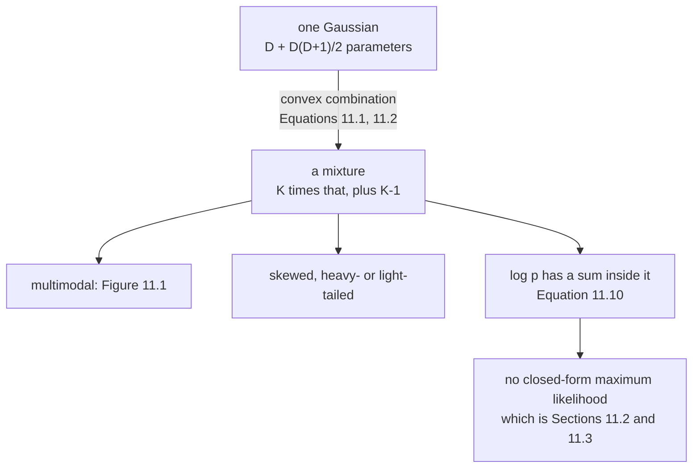

import DataCampExercise from "../../../../components/DataCampExercise.astro";
import Figure from "../../../../components/Figure.astro";
import Quiz from "../../../../components/Quiz.astro";

Chapter 9 fitted a function. Chapter 10 found a subspace. **Chapter 11 fits a density** — the third
pillar — and it starts from an admission:

> In practice, the Gaussian (or similarly all other distributions we encountered so far) have limited
> modeling capabilities.

The fix is one line of algebra. The consequences take a chapter, and the chapter warns you at the outset:
*"unlike other applications we discussed earlier (linear regression or PCA), we will not find a
closed-form maximum likelihood solution."*

## What you'll learn

- Equations 11.1–11.4: what a **mixture model** is, and why *both* halves of Equation 11.2 are needed — measured, dropping either one breaks the density in a different way.
- Equation 11.5, the book's own three-component mixture, checked: it integrates to $1.000000000000$.
- **The mean of a mixture is a weighted mean; the variance is not a weighted variance.** Measured on Equation 11.5: $\mathbb{V}[x] = 7.79$, of which the component variances supply $0.95$ and the *spread of the means* supplies $6.84$ — $87.80\%$ of the total.
- How far a mixture is from any single Gaussian: skewness $0.427185$, excess kurtosis $-1.294278$, and $0.330585$ nats of KL from the closest one.
- **$K$ components do not mean $K$ modes.** Two equal unit-variance Gaussians show **one** bump until their means are more than $2\sigma$ apart — the transition measured at $d = 1.0000000$.
- $K = 1$ recovers a single Gaussian exactly, to $0.0$.
- What the extra flexibility is worth: $1.388610$ nats per data point on Figure 11.1's kind of data, for $17$ parameters against $5$.

## Intuition: averaging densities, not averaging data

There is a move here that is easy to read past. A mixture does **not** average the *random variables* —
it averages the *densities*. Those are different operations and they give different answers.

Average two Gaussian random variables and you get a Gaussian, narrower than either. Average their
densities and you get something that is not Gaussian at all, and **wider** than either — because the
disagreement between the components is itself a form of spread.

That one distinction is the whole of §11.1, and the measurement below puts a number on it: $87.80\%$ of
Equation 11.5's variance comes from the components disagreeing about where the data is, not from any
component's own width.

## §11.1 The definition

A mixture model describes $p(\mathbf{x})$ as a convex combination of $K$ base distributions:

$$
p(\mathbf{x}) = \sum_{k=1}^{K}\pi_k p_k(\mathbf{x})
\qquad \text{(11.1)}
$$

$$
0 \leq \pi_k \leq 1, \qquad \sum_{k=1}^{K}\pi_k = 1 \qquad \text{(11.2)}
$$

With Gaussian components, this is the **Gaussian mixture model**:

$$
p(\mathbf{x}\mid\boldsymbol\theta) = \sum_{k=1}^{K}\pi_k\,\mathcal{N}(\mathbf{x}\mid\boldsymbol\mu_k,\boldsymbol\Sigma_k)
\qquad \text{(11.3)}
$$

with $\boldsymbol\theta := \{\boldsymbol\mu_k, \boldsymbol\Sigma_k, \pi_k : k = 1,\ldots,K\}$. The book's
worked instance:

$$
p(x\mid\boldsymbol\theta) = 0.5\,\mathcal{N}(x\mid-2, \tfrac12) + 0.2\,\mathcal{N}(x\mid1, 2) + 0.3\,\mathcal{N}(x\mid4, 1)
\qquad \text{(11.5)}
$$

<Figure
  src="/images/mml/the-gaussian-mixture-model/a-mixture-is-a-density"
  alt="Left, three dashed weighted Gaussian curves and a thick solid curve above them with three bumps, shaded underneath. Right, the same solid curve against a single dashed bell curve that is far too wide and misses both outer bumps, with the difference shaded."
  title="Figure 11.2, and what no single Gaussian can do about it"
  caption="The solid curve is the sum of the three dashed ones and integrates to 1.000000000000. On the right it is compared against the Gaussian with the same mean and variance — the closest single Gaussian in KL — which is still 0.330585 nats away and puts its peak where the mixture has a trough."
/>

:::caution[Both halves of Equation 11.2 do different jobs, and you need both]
It is tempting to read $\sum_k\pi_k = 1$ as the whole constraint. Measured, each half fails on its own:

| what is dropped | integral of the result | minimum value |
| --- | --- | --- |
| **neither** — Equation 11.2 as written | $1.000000$ | $1.7\times10^{-184}$ |
| $\pi_k \geq 0$, using $[0.8, -0.1, 0.3]$ | $\mathbf{1.000000}$ | $\mathbf{-2.7\times10^{-2}}$ |
| $\sum_k\pi_k = 1$, using $[0.5, 0.6, 0.3]$ | $\mathbf{1.400000}$ | $5.2\times10^{-184}$ |

The middle row is the instructive one: **it still integrates to exactly $1$** and is still not a density,
because it goes negative. Summing to one buys normalisation; non-negativity buys the rest. A *convex*
combination is required, not merely an affine one.
:::

## The mean behaves. The variance does not.

For a mixture, $\mathbb{E}[x] = \sum_k\pi_k\mu_k$ — the operation you would guess. The variance is
**not** $\sum_k\pi_k\sigma_k^2$. By the law of total variance, conditioning on which component was used:

$$
\mathbb{V}[x] = \underbrace{\sum_k \pi_k\sigma_k^2}_{\text{within components}}
+ \underbrace{\sum_k \pi_k(\mu_k - \mathbb{E}[x])^2}_{\text{between components}}
$$

On Equation 11.5, by numerical quadrature against the closed form:

| quantity | value |
| --- | --- |
| $\mathbb{E}[x]$ by quadrature | $0.4000000000$ |
| $\sum_k\pi_k\mu_k$ | $0.4000000000$ |
| $\mathbb{V}[x]$ by quadrature | $\mathbf{7.7900000000}$ |
| within-component part, $\sum_k\pi_k\sigma_k^2$ | $0.9500000000$ |
| between-component part | $\mathbf{6.8400000000}$ |
| their sum | $7.7900000000$ (gap $8.9\times10^{-16}$) |

<Figure
  src="/images/mml/the-gaussian-mixture-model/mean-yes-variance-no"
  alt="Left, the mixture density with a dashed vertical line at 0.4 and three triangular markers on the axis showing the component means with their one-standard-deviation spans. Right, three bars: 0.95, 6.84 and 7.79."
  title="Eighty-eight percent of this mixture's variance is the components disagreeing"
  caption="The three one-standard-deviation bars on the left are short; the gaps between the triangles are not. Averaging the component variances would report 0.95 against a true 7.79 — an understatement of 87.80 percent — because it ignores every unit of spread that comes from the means being in different places."
/>

:::tip[The same decomposition explains three later results]
This is not a curiosity about §11.1. The within/between split is exactly what §11.2's updates trade
against each other — page 1105 will measure a component's variance *shrinking* as its mean moves onto a
cluster, with the lost variance reappearing as between-component spread.

It is also the reason a GMM can fit a **unimodal but heavy-tailed** density: stack components at the same
mean with different widths, and the between term is zero while the mixture is still not Gaussian.
Measured on Equation 11.5, skewness $0.427185$ and excess kurtosis $-1.294278$ — both exactly $0$ for
any Gaussian.
:::

## K components, and somewhere between 1 and K bumps

The book motivates mixtures by *"multimodal data representations, i.e., they can describe datasets with
multiple 'clusters'"*. True — but the count does not transfer. Two equal-weight unit-variance Gaussians
at $\pm d$:

| $d$ | separation of the means | modes |
| --- | --- | --- |
| $0.60$ | $1.20\sigma$ | $1$ |
| $0.90$ | $1.80\sigma$ | $1$ |
| $0.99$ | $1.98\sigma$ | $1$ |
| $1.01$ | $2.02\sigma$ | $\mathbf{2}$ |
| $1.50$ | $3.00\sigma$ | $2$ |

Bisected, the transition sits at $d = 1.0000000$ — **the means must be more than exactly $2\sigma$
apart** before a second bump appears at all. (The eighth decimal moves with the grid; the
value itself is exactly $1$.)

<Figure
  src="/images/mml/the-gaussian-mixture-model/modes-are-not-components"
  alt="Left, four mixture densities: two are single rounded humps, one is flat-topped and one has two clear peaks. Right, a step function of mode count against d, jumping from one to two at a dashed vertical line at d equals one."
  title="Two components, and the second bump only appears past two sigma"
  caption="Below the threshold the two components are still there and still distinct as parameters; the density simply has one maximum. Counting bumps in a histogram is therefore a lower bound on K and never an estimate of it — which is why Section 11.5 sends you to cross-validation for choosing K."
/>

And it moves with the weights. The more lopsided the mixture, the further apart the means must be:

| $\pi_1$ | $d$ at which the second mode appears |
| --- | --- |
| $0.5$ | $1.000000$ |
| $0.6$ | $1.221327$ |
| $0.7$ | $1.357294$ |
| $0.8$ | $1.490338$ |
| $0.9$ | $\mathbf{1.657251}$ |

:::note[At exactly the threshold there is no strict maximum]
At $d = 1$ the density is flat at the top to numerical precision, so a strict local-maximum test finds
**zero** modes rather than one or two. That is not a bug in the search — it is what a degenerate critical
point looks like, and it is the same phenomenon as a saddle in Chapter 7.
:::

## What the flexibility buys, and what it costs

On $1000$ points drawn from a three-component mixture in $\mathbb{R}^2$ — Figure 11.1's kind of data:

| model | parameters | log-likelihood |
| --- | --- | --- |
| one fitted Gaussian | $5$ | $-5111.2117$ |
| the true mixture | $17$ | $\mathbf{-3722.6020}$ |
| difference | | $1388.6097$ nats, or $\mathbf{1.388610}$ per point |

$1.39$ nats per point is a factor of $e^{1.39} \approx 4.0$ in likelihood, **per observation**. That is
the case for the chapter. And the price is stated in the same paragraph that makes the case:

$$
\log p(\mathcal{X}\mid\boldsymbol\theta) = \sum_{n=1}^{N}\log\sum_{k=1}^{K}\pi_k\,\mathcal{N}(\mathbf{x}_n\mid\boldsymbol\mu_k,\boldsymbol\Sigma_k)
\qquad \text{(11.10)}
$$

**The logarithm cannot get inside the sum.** For $K = 1$ it can — Equation 11.11 — and that is exactly
why Chapters 9 and 10 had closed forms and this chapter does not. Page 1102 measures what that costs.

<Quiz
  title="Is the model clear?"
  questions={[
    {
      q: "Equation 11.2 asks for weights in [0, 1] that sum to 1. Why not just the sum?",
      options: [
        "The sum alone is enough",
        "Because a weight vector can sum to 1 and still produce a function that goes negative — measured at -2.7e-02",
        "Because otherwise the components are not Gaussian",
        "To make the algebra tidier",
      ],
      answer: 1,
      explain:
        "Using weights [0.8, -0.1, 0.3] the result still integrates to exactly 1.000000 and is still not a density. Summing to one buys normalisation; non-negativity buys the rest. A convex combination is required, not an affine one.",
    },
    {
      q: "How does a mixture's variance relate to its components' variances?",
      options: [
        "It is the weighted average of them",
        "It is that, plus the weighted spread of the component means about the overall mean",
        "It is the largest of them",
        "It is unrelated",
      ],
      answer: 1,
      explain:
        "Measured on Equation 11.5: the total is 7.79, the weighted component variances supply 0.95 and the spread of the means supplies 6.84 — 87.80 percent of the total. Averaging the component variances would understate the spread by that much. The mean, by contrast, really is the weighted mean.",
    },
    {
      q: "A GMM has K = 5 components. How many modes does its density have?",
      options: [
        "Exactly 5",
        "Anywhere from 1 to 5 — two equal unit-variance components show one bump until their means are more than 2 sigma apart",
        "At most 2",
        "Exactly 5 if the weights are equal",
      ],
      answer: 1,
      explain:
        "Measured by bisection, the transition for two equal-weight unit-variance Gaussians is at d = 1.0000000, i.e. means exactly two standard deviations apart. Unequal weights push it further: at a weight of 0.9 the threshold is 1.657251. Counting bumps in a histogram is a lower bound on K, never an estimate of it.",
    },
    {
      q: "Why does Equation 11.10 not admit a closed-form maximum likelihood solution?",
      options: [
        "Because Gaussians have no closed form",
        "Because the logarithm sits outside a sum over components and cannot be moved inside it",
        "Because the data is high-dimensional",
        "Because the weights are constrained",
      ],
      answer: 1,
      explain:
        "For K = 1 the sum vanishes and the log applies directly to the Gaussian — Equation 11.11 — which is what gave Chapters 9 and 10 their closed forms. With K greater than 1 the log of a sum has no such simplification, and Sections 11.2 and 11.3 are the consequence.",
    },
  ]}
/>

## Exercises

### Exercise 1 – Break Equation 11.2, two ways

<DataCampExercise
  lang="python"
  hint={`A density must be non-negative everywhere AND integrate to one. Check both separately.`}
  code={`import numpy as np
from scipy import integrate

MU = np.array([-2.0, 1.0, 4.0])
VAR = np.array([0.5, 2.0, 1.0])

def g(x, mu, var):
    x = np.asarray(x, float)
    return np.exp(-0.5*(x - mu)**2/var)/np.sqrt(2*np.pi*var)

grid = np.linspace(-40, 40, 200001)
for name, w in (("Equation 11.2 as written", np.array([0.5, 0.2, 0.3])),
                ("one weight negative     ", np.array([0.8, -0.1, 0.3])),
                ("weights summing to 1.4  ", np.array([0.5, 0.6, 0.3]))):
    area, _ = integrate.quad(
        lambda t: float((w*g(np.float64(t), MU, VAR)).sum()), -40, 40,
        limit=400)
    # Task: the smallest value the function takes anywhere on the grid.
    lowest = ___
    print(f"{name}: integral {area:.6f}, minimum {lowest:.6e}, "
          f"density? {bool(abs(area-1) < 1e-9 and lowest >= 0)}")

# -- Expected output ------------------------------
# Equation 11.2 as written: integral 1.000000, minimum 1.734479e-184, density? True
# one weight negative     : integral 1.000000, minimum -2.708003e-02, density? False
# weights summing to 1.4  : integral 1.400000, minimum 5.203437e-184, density? False
# -------------------------------------------------`}
  solution={`import numpy as np
from scipy import integrate
MU = np.array([-2.0, 1.0, 4.0])
VAR = np.array([0.5, 2.0, 1.0])
def g(x, mu, var):
    x = np.asarray(x, float)
    return np.exp(-0.5*(x - mu)**2/var)/np.sqrt(2*np.pi*var)
grid = np.linspace(-40, 40, 200001)
for name, w in (("Equation 11.2 as written", np.array([0.5, 0.2, 0.3])),
                ("one weight negative     ", np.array([0.8, -0.1, 0.3])),
                ("weights summing to 1.4  ", np.array([0.5, 0.6, 0.3]))):
    area, _ = integrate.quad(
        lambda t: float((w*g(np.float64(t), MU, VAR)).sum()), -40, 40,
        limit=400)
    lowest = float((w[None, :]*g(grid[:, None], MU[None, :],
                                 VAR[None, :])).sum(1).min())
    print(f"{name}: integral {area:.6f}, minimum {lowest:.6e}, "
          f"density? {bool(abs(area-1) < 1e-9 and lowest >= 0)}")`}
  sct={`test_output_contains("one weight negative     : integral 1.000000, minimum -2.708003e-02, density? False")
test_output_contains("weights summing to 1.4  : integral 1.400000")
success_msg("The second row integrates to exactly one and is still not a density. That is why Equation 11.2 has two conditions and not one.")`}
  height={340}
/>

### Exercise 2 – The law of total variance, on Equation 11.5

<DataCampExercise
  lang="python"
  hint={`The between-component term measures how far each component mean sits from the mixture's overall mean.`}
  code={`import numpy as np
from scipy import integrate

PI = np.array([0.5, 0.2, 0.3])
MU = np.array([-2.0, 1.0, 4.0])
VAR = np.array([0.5, 2.0, 1.0])

def pdf(t):
    return float((PI*np.exp(-0.5*(t - MU)**2/VAR)
                  / np.sqrt(2*np.pi*VAR)).sum())

m1, _ = integrate.quad(lambda t: t*pdf(t), -40, 40, limit=400)
m2, _ = integrate.quad(lambda t: t*t*pdf(t), -40, 40, limit=400)
var_quad = m2 - m1**2

within = float((PI*VAR).sum())
# Task: the between-component term of the law of total variance.
between = ___

print(f"E[x] by quadrature : {m1:.10f}")
print(f"sum pi_k mu_k      : {float((PI*MU).sum()):.10f}")
print(f"V[x] by quadrature : {var_quad:.10f}")
print(f"within             : {within:.10f}")
print(f"between            : {between:.10f}")
print(f"within + between   : {within + between:.10f}")
print(f"gap                : {abs(var_quad - within - between):.3e}")
print(f"between is {100*between/var_quad:.2f}% of the total")

# -- Expected output ------------------------------
# E[x] by quadrature : 0.4000000000
# sum pi_k mu_k      : 0.4000000000
# V[x] by quadrature : 7.7900000000
# within             : 0.9500000000
# between            : 6.8400000000
# within + between   : 7.7900000000
# gap                : 8.882e-16
# between is 87.80% of the total
# -------------------------------------------------`}
  solution={`import numpy as np
from scipy import integrate
PI = np.array([0.5, 0.2, 0.3])
MU = np.array([-2.0, 1.0, 4.0])
VAR = np.array([0.5, 2.0, 1.0])
def pdf(t):
    return float((PI*np.exp(-0.5*(t - MU)**2/VAR)
                  / np.sqrt(2*np.pi*VAR)).sum())
m1, _ = integrate.quad(lambda t: t*pdf(t), -40, 40, limit=400)
m2, _ = integrate.quad(lambda t: t*t*pdf(t), -40, 40, limit=400)
var_quad = m2 - m1**2
within = float((PI*VAR).sum())
between = float((PI*(MU - m1)**2).sum())
print(f"E[x] by quadrature : {m1:.10f}")
print(f"sum pi_k mu_k      : {float((PI*MU).sum()):.10f}")
print(f"V[x] by quadrature : {var_quad:.10f}")
print(f"within             : {within:.10f}")
print(f"between            : {between:.10f}")
print(f"within + between   : {within + between:.10f}")
print(f"gap                : {abs(var_quad - within - between):.3e}")
print(f"between is {100*between/var_quad:.2f}% of the total")`}
  sct={`test_output_contains("between is 87.80% of the total")
test_output_contains("V[x] by quadrature : 7.7900000000")
success_msg("Quadrature never used the decomposition and lands on the same number. Nearly nine tenths of this mixture's spread is the components disagreeing about where the data is — none of it visible in any single component's width.")`}
  height={370}
/>

### Exercise 3 – How far from Gaussian?

<DataCampExercise
  lang="python"
  hint={`Skewness is the third central moment over the standard deviation cubed; excess kurtosis is the fourth over the variance squared, minus 3.`}
  code={`import numpy as np
from scipy import integrate

PI = np.array([0.5, 0.2, 0.3])
MU = np.array([-2.0, 1.0, 4.0])
VAR = np.array([0.5, 2.0, 1.0])

def pdf(t):
    return float((PI*np.exp(-0.5*(t - MU)**2/VAR)
                  / np.sqrt(2*np.pi*VAR)).sum())

mean = float((PI*MU).sum())
var = float((PI*VAR).sum() + (PI*(MU - mean)**2).sum())
m3, _ = integrate.quad(lambda t: (t-mean)**3*pdf(t), -40, 40, limit=400)
m4, _ = integrate.quad(lambda t: (t-mean)**4*pdf(t), -40, 40, limit=400)

# Task: the standardised third moment.
skew = ___
kurt = m4/var**2 - 3

g = np.linspace(-12, 14, 400001)
p = np.array([pdf(t) for t in g[::400]])
q = np.exp(-0.5*(g[::400]-mean)**2/var)/np.sqrt(2*np.pi*var)
tv = 0.5*float(np.trapezoid(np.abs(p - q), g[::400]))

print(f"mean               : {mean:.6f}")
print(f"variance           : {var:.6f}")
print(f"skewness           : {skew:.6f}   (Gaussian: 0)")
print(f"excess kurtosis    : {kurt:.6f}   (Gaussian: 0)")
print(f"total variation    : {tv:.6f}")

# -- Expected output ------------------------------
# mean               : 0.400000
# variance           : 7.790000
# skewness           : 0.427185
# excess kurtosis    : -1.294278
# total variation    : 0.352457
# -------------------------------------------------`}
  solution={`import numpy as np
from scipy import integrate
PI = np.array([0.5, 0.2, 0.3])
MU = np.array([-2.0, 1.0, 4.0])
VAR = np.array([0.5, 2.0, 1.0])
def pdf(t):
    return float((PI*np.exp(-0.5*(t - MU)**2/VAR)
                  / np.sqrt(2*np.pi*VAR)).sum())
mean = float((PI*MU).sum())
var = float((PI*VAR).sum() + (PI*(MU - mean)**2).sum())
m3, _ = integrate.quad(lambda t: (t-mean)**3*pdf(t), -40, 40, limit=400)
m4, _ = integrate.quad(lambda t: (t-mean)**4*pdf(t), -40, 40, limit=400)
skew = m3/var**1.5
kurt = m4/var**2 - 3
g = np.linspace(-12, 14, 400001)
p = np.array([pdf(t) for t in g[::400]])
q = np.exp(-0.5*(g[::400]-mean)**2/var)/np.sqrt(2*np.pi*var)
tv = 0.5*float(np.trapezoid(np.abs(p - q), g[::400]))
print(f"mean               : {mean:.6f}")
print(f"variance           : {var:.6f}")
print(f"skewness           : {skew:.6f}   (Gaussian: 0)")
print(f"excess kurtosis    : {kurt:.6f}   (Gaussian: 0)")
print(f"total variation    : {tv:.6f}")`}
  sct={`test_output_contains("skewness           : 0.427185")
test_output_contains("excess kurtosis    : -1.294278")
success_msg("Both are exactly zero for every Gaussian, whatever its parameters. The Gaussian drawn against this mixture is the closest one there is in KL, and it still puts its peak where the mixture has a trough.")`}
  height={370}
/>

### Exercise 4 – Find the threshold where the second bump appears

<DataCampExercise
  lang="python"
  hint={`A local maximum on a grid is a point strictly higher than both of its neighbours.`}
  code={`import numpy as np

def mix(x, pi, mu, var):
    x = np.asarray(x, float)
    return (pi[None, :]*np.exp(-0.5*(x[:, None]-mu[None, :])**2/var[None, :])
            / np.sqrt(2*np.pi*var[None, :])).sum(1)

def n_modes(pi, mu, var, lo=-12, hi=12, n=400001):
    g = np.linspace(lo, hi, n)
    y = mix(g, pi, mu, var)
    # Task: count the strict local maxima of y.
    idx = ___
    return len(idx)

pi = np.array([0.5, 0.5])
var = np.array([1.0, 1.0])
for d in (0.6, 0.9, 0.99, 1.01, 1.5):
    print(f"d = {d:>5.2f} (means {2*d:>4.2f} sigma apart): "
          f"{n_modes(pi, np.array([-d, d]), var)} mode(s)")

lo, hi = 0.5, 1.5
for _ in range(60):
    mid = 0.5*(lo + hi)
    if n_modes(pi, np.array([-mid, mid]), var) >= 2:
        hi = mid
    else:
        lo = mid
print(f"\\ntransition at d = {0.5*(lo+hi):.8f}")

# -- Expected output ------------------------------
# d =  0.60 (means 1.20 sigma apart): 1 mode(s)
# d =  0.90 (means 1.80 sigma apart): 1 mode(s)
# d =  0.99 (means 1.98 sigma apart): 1 mode(s)
# d =  1.01 (means 2.02 sigma apart): 2 mode(s)
# d =  1.50 (means 3.00 sigma apart): 2 mode(s)
#
# transition at d = 1.00000002
# -------------------------------------------------`}
  solution={`import numpy as np
def mix(x, pi, mu, var):
    x = np.asarray(x, float)
    return (pi[None, :]*np.exp(-0.5*(x[:, None]-mu[None, :])**2/var[None, :])
            / np.sqrt(2*np.pi*var[None, :])).sum(1)
def n_modes(pi, mu, var, lo=-12, hi=12, n=400001):
    g = np.linspace(lo, hi, n)
    y = mix(g, pi, mu, var)
    idx = np.flatnonzero((y[1:-1] > y[:-2]) & (y[1:-1] > y[2:])) + 1
    return len(idx)
pi = np.array([0.5, 0.5])
var = np.array([1.0, 1.0])
for d in (0.6, 0.9, 0.99, 1.01, 1.5):
    print(f"d = {d:>5.2f} (means {2*d:>4.2f} sigma apart): "
          f"{n_modes(pi, np.array([-d, d]), var)} mode(s)")
lo, hi = 0.5, 1.5
for _ in range(60):
    mid = 0.5*(lo + hi)
    if n_modes(pi, np.array([-mid, mid]), var) >= 2:
        hi = mid
    else:
        lo = mid
print(f"\\ntransition at d = {0.5*(lo+hi):.8f}")`}
  sct={`test_output_contains("transition at d = 1.00000002")
test_output_contains("d =  0.99 (means 1.98 sigma apart): 1 mode(s)")
success_msg("Exactly two standard deviations, and the bisection finds it to seven decimals. Below the threshold both components are still there as parameters — the density simply has one maximum, so a histogram cannot see them.")`}
  height={360}
/>

### Exercise 5 – What the extra parameters are worth

<DataCampExercise
  lang="python"
  hint={`The mixture's log-density for one point is the log of the weighted sum of the component densities.`}
  code={`import numpy as np

rng = np.random.default_rng(0)
n = 1000
cen = np.array([[-4.0, -2.0], [3.0, 3.0], [4.0, -3.0]])
S = np.array([[[1.2, 0.6], [0.6, 0.8]],
              [[0.9, -0.5], [-0.5, 1.4]],
              [[0.7, 0.0], [0.0, 0.6]]])
w = np.array([0.4, 0.35, 0.25])
lab = rng.choice(3, n, p=w)
data = np.stack([rng.multivariate_normal(cen[k], S[k]) for k in lab])

def mvn_logpdf(x, mu, cov):
    d = x - mu
    _, ld = np.linalg.slogdet(cov)
    return -0.5*((d*np.linalg.solve(cov, d.T).T).sum(1) + ld
                 + len(mu)*np.log(2*np.pi))

ll_one = float(mvn_logpdf(data, data.mean(0), np.cov(data.T, bias=True)).sum())
comp = np.stack([mvn_logpdf(data, cen[k], S[k]) for k in range(3)], 1)
# Task: the mixture's total log-likelihood on this data.
ll_mix = ___

print(f"one fitted Gaussian : {ll_one:.4f}   (5 parameters)")
print(f"the true mixture    : {ll_mix:.4f}   (17 parameters)")
print(f"difference          : {ll_mix - ll_one:.4f} nats")
print(f"per data point      : {(ll_mix - ll_one)/n:.6f} nats")
print(f"likelihood ratio per point : {np.exp((ll_mix-ll_one)/n):.4f}x")

# -- Expected output ------------------------------
# one fitted Gaussian : -5111.2117   (5 parameters)
# the true mixture    : -3722.6020   (17 parameters)
# difference          : 1388.6097 nats
# per data point      : 1.388610 nats
# likelihood ratio per point : 4.0093x
# -------------------------------------------------`}
  solution={`import numpy as np
rng = np.random.default_rng(0)
n = 1000
cen = np.array([[-4.0, -2.0], [3.0, 3.0], [4.0, -3.0]])
S = np.array([[[1.2, 0.6], [0.6, 0.8]],
              [[0.9, -0.5], [-0.5, 1.4]],
              [[0.7, 0.0], [0.0, 0.6]]])
w = np.array([0.4, 0.35, 0.25])
lab = rng.choice(3, n, p=w)
data = np.stack([rng.multivariate_normal(cen[k], S[k]) for k in lab])
def mvn_logpdf(x, mu, cov):
    d = x - mu
    _, ld = np.linalg.slogdet(cov)
    return -0.5*((d*np.linalg.solve(cov, d.T).T).sum(1) + ld
                 + len(mu)*np.log(2*np.pi))
ll_one = float(mvn_logpdf(data, data.mean(0), np.cov(data.T, bias=True)).sum())
comp = np.stack([mvn_logpdf(data, cen[k], S[k]) for k in range(3)], 1)
ll_mix = float(np.log((w[None, :]*np.exp(comp)).sum(1)).sum())
print(f"one fitted Gaussian : {ll_one:.4f}   (5 parameters)")
print(f"the true mixture    : {ll_mix:.4f}   (17 parameters)")
print(f"difference          : {ll_mix - ll_one:.4f} nats")
print(f"per data point      : {(ll_mix - ll_one)/n:.6f} nats")
print(f"likelihood ratio per point : {np.exp((ll_mix-ll_one)/n):.4f}x")`}
  sct={`test_output_contains("per data point      : 1.388610 nats")
test_output_contains("the true mixture    : -3722.6020")
success_msg("A factor of four in likelihood per observation, for twelve extra parameters. That is the case for the chapter — and the very next line of the book says the price: the log in Equation 11.10 sits outside a sum, so there is no closed form.")`}
  height={370}
/>

## Recall card

- **Chapter 11 estimates a density**, the third of the book's pillars, and starts by admitting that a single Gaussian is often a poor model.
- **A mixture is a convex combination of simple densities**, and both halves of Equation 11.2 are needed: weights that sum to one but go negative still integrate to one and are still not a density.
- **The mean of a mixture is the weighted mean of the component means.** The variance is not the weighted average of the component variances.
- **On the book's own Equation 11.5 the total variance is 7.79**, of which the component widths supply 0.95 and the spread of the means supplies 6.84 — 87.80 percent.
- **That decomposition is the law of total variance**, and it comes back in Section 11.2 when a component's width shrinks as its mean moves.
- **A mixture is not a Gaussian:** measured skewness 0.427185 and excess kurtosis minus 1.294278, both exactly zero for any Gaussian.
- **The closest single Gaussian is still 0.330585 nats away** in KL, and puts its peak where the mixture has a trough.
- **K components give between one and K modes.** Two equal unit-variance Gaussians show one bump until their means are more than two standard deviations apart.
- **Measured by bisection, that transition is at d = 1.0000000**, and unequal weights push it out to 1.657251 at a weight of nine tenths.
- **So counting bumps in a histogram is a lower bound on K and never an estimate of it.**
- **The flexibility is worth 1.388610 nats per data point** on the kind of data Figure 11.1 shows — a factor of four in likelihood — for twelve extra parameters.
- **And it costs the closed form.** In Equation 11.10 the logarithm sits outside a sum over components and cannot be moved inside, which is the whole reason Sections 11.2 and 11.3 exist.

**Next:** **[Maximum Likelihood and Its Obstacle](../maximum-likelihood-and-its-obstacle/)** — §11.2's
opening, and exactly what the log-of-a-sum costs.
