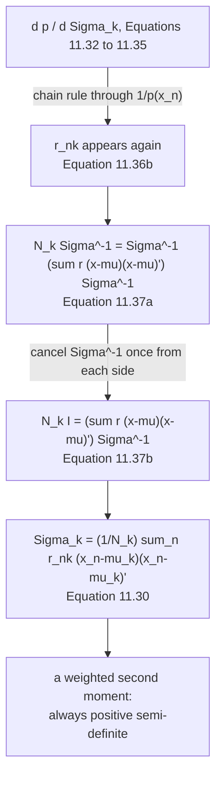

import DataCampExercise from "../../../../components/DataCampExercise.astro";
import Figure from "../../../../components/Figure.astro";
import Quiz from "../../../../components/Quiz.astro";

The second update runs the same argument as the first, with a harder derivative. §11.2.3 spends three
pages on matrix calculus to reach a formula you could have guessed — and the interesting part is what it
does to page 1101's decomposition once it is in place.

## What you'll learn

- **Theorem 11.2**, Equation 11.30, and Example 11.4 reproduced: $1 \to 0.144000$, $0.2 \to 0.438492$, $3 \to 1.526594$, rounding to the book's $0.14$, $0.44$, $1.53$.
- **Which $\boldsymbol\mu_k$ Equation 11.30 means.** Written with the old means it gives $1.83$, $0.60$, $19.98$; with the just-updated means it gives the book's numbers. The equation does not say, and the answer differs by a factor of $13$ on the third component.
- Equations 11.31–11.38: the proof, and the single cancellation that turns a messy stationarity condition into a weighted second moment. Measured to $2.2\times10^{-16}$.
- Why no positive-definiteness repair is ever needed: measured over $60{,}000$ variances from random responsibilities, **zero** negative results.
- **An invariant the book does not state, stronger than page 1104's:** after *any* M-step, the mixture's **variance** equals the sample variance exactly — measured to $3.6\times10^{-15}$ over $20{,}000$ arbitrary responsibility matrices, and for every $K$ from $2$ to $10$.
- So EM moves variance from *between* components to *within* them and back, with the total pinned — page 1101's decomposition, in motion.
- And the singularity from the covariance side: as a component's responsibility concentrates on one point, $\sigma_k^2 \to 0$ linearly in the leftover mass.

## Intuition: the same weighted average, one moment up

Page 1104's update was $\sum_n w_n x_n$ with $w_n = r_{nk}/N_k$. This one is
$\sum_n w_n(x_n-\mu_k)^2$ — **the same weights, applied to squared deviations instead of positions**.

That is the whole of Theorem 11.2. The three pages of matrix calculus exist to show that the derivative
of $\log\det$ and the derivative of a quadratic form conspire to leave exactly this, with the inverse
covariances cancelling as they did for the means.

## §11.2.3 Theorem 11.2

> **Theorem 11.2 (Updates of the GMM Covariances).** The update of the covariance parameters
> $\boldsymbol\Sigma_k$ of the GMM is given by
>
> $$
> \boldsymbol\Sigma_k^{\text{new}} = \frac{1}{N_k}\sum_{n=1}^{N} r_{nk}(\mathbf{x}_n-\boldsymbol\mu_k)(\mathbf{x}_n-\boldsymbol\mu_k)^\top
> \qquad \text{(11.30)}
> $$

The proof needs two identities from Chapter 5 — Equation 5.101 for $\partial\det(\boldsymbol\Sigma)^{-1/2}$
and Equation 5.106 for the derivative of the quadratic form — which combine into

$$
\frac{\partial p(\mathbf{x}_n\mid\boldsymbol\theta)}{\partial\boldsymbol\Sigma_k}
= \pi_k\mathcal{N}(\mathbf{x}_n\mid\boldsymbol\mu_k,\boldsymbol\Sigma_k)\cdot\left(-\tfrac12\big(\boldsymbol\Sigma_k^{-1}-\boldsymbol\Sigma_k^{-1}(\mathbf{x}_n-\boldsymbol\mu_k)(\mathbf{x}_n-\boldsymbol\mu_k)^\top\boldsymbol\Sigma_k^{-1}\big)\right)
\qquad \text{(11.35)}
$$

and, after the responsibilities reappear and the derivative is set to zero,

$$
N_k\boldsymbol\Sigma_k^{-1} = \boldsymbol\Sigma_k^{-1}\left(\sum_n r_{nk}(\mathbf{x}_n-\boldsymbol\mu_k)(\mathbf{x}_n-\boldsymbol\mu_k)^\top\right)\boldsymbol\Sigma_k^{-1}
\qquad \text{(11.37a)}
$$

Cancelling $\boldsymbol\Sigma_k^{-1}$ once from each side gives Equation 11.37b and then Equation 11.30.
In one dimension, checked on the book's numbers:

| | $k=1$ | $k=2$ | $k=3$ |
| --- | --- | --- | --- |
| $N_k/\sigma_k^2$ | $14.286319$ | $4.581629$ | $1.921770$ |
| $\left(\sum_n r_{nk}(x_n-\mu_k)^2\right)/(\sigma_k^2)^2$ | $14.286319$ | $4.581629$ | $1.921770$ |

with a gap of $2.2\times10^{-16}$.

## Which mean does Equation 11.30 use?

The equation writes $\boldsymbol\mu_k$ with no superscript. It matters:

| | $k=1$ | $k=2$ | $k=3$ |
| --- | --- | --- | --- |
| with the **old** means $(-4, 0, 8)$ | $1.830803$ | $0.601232$ | $\mathbf{19.979741}$ |
| with the **new** means from Equation 11.20 | $\mathbf{0.144000}$ | $\mathbf{0.438492}$ | $\mathbf{1.526594}$ |
| Example 11.4 as printed | $0.14$ | $0.44$ | $1.53$ |

<Figure
  src="/images/mml/updating-the-covariances/which-mean-does-it-use"
  alt="Left, three groups of three bars on a log scale; in each group the red bar is much taller than the blue and yellow ones, which match. Right, three dotted bell curves and three solid ones, the solid ones taller and narrower except the middle one which is shorter and wider."
  title="The equation does not say which mean, and the two answers differ by a factor of 13"
  caption="Example 11.4 follows Example 11.3, and the book's Figure 11.6(a) is its Figure 11.5(b) — so the means have already moved. Using them reproduces the printed variances; using the pre-update means gives 19.98 for the third component instead of 1.53."
/>

:::note[This is the ordering that makes EM what it is]
Both readings are defensible from Equation 11.30 alone, and the difference is not small. The book
resolves it by ordering the examples — §11.2.2 then §11.2.3, with Figure 11.6(a) repeating Figure
11.5(b) — and §11.3's algorithm makes it explicit: the M-step reestimates
$\boldsymbol\mu_k, \boldsymbol\Sigma_k, \pi_k$ in that order, each using the values already computed in
the same step.

Using the stale means is not merely different, it is *worse*: it measures spread about a point the
component has already left. The third component's $19.98$ is the squared distance from $8$ to data that
lives below $5$.
:::

## Always positive semi-definite, for free

Equation 11.30 is $\sum_n w_n \mathbf{v}_n\mathbf{v}_n^\top$ with $w_n \geq 0$ — a non-negative
combination of rank-one positive semi-definite matrices. So the result is positive semi-definite by
construction, with no projection, clipping or eigenvalue repair.

Measured in one dimension over $20{,}000$ random responsibility matrices ($60{,}000$ variances):

| | value |
| --- | --- |
| variances that came out negative | $\mathbf{0}$ |
| smallest value seen | $1.508415$ |

Compare page 1005's measurement, where `eigh` on a badly conditioned $\mathbf{X}\mathbf{X}^\top$ returned
$18$ negative eigenvalues of $200$. **Here the structure of the update guarantees what the numerics
there could not.**

## The invariant, one moment up

Page 1104 measured $\sum_k N_k\mu_k = \sum_n x_n$. The same swap-the-summation argument, applied to
second moments, gives more:

$$
\sum_k \pi_k\left(\sigma_k^2 + \mu_k^2\right) = \frac{1}{N}\sum_n x_n^2
$$

so **the fitted mixture's variance is the sample variance, exactly**, after any M-step:

| | value |
| --- | --- |
| sample mean | $0.642857142857$ |
| sample variance | $8.336734693878$ |
| worst $\lvert$mixture mean $-$ sample mean$\rvert$, $20{,}000$ random $\mathbf{R}$ | $5.6\times10^{-16}$ |
| worst $\lvert$mixture variance $-$ sample variance$\rvert$ | $\mathbf{3.6\times10^{-15}}$ |

and it does not depend on $K$:

| $K$ | worst mean gap | worst variance gap |
| --- | --- | --- |
| $2$ | $5.6\times10^{-16}$ | $3.6\times10^{-15}$ |
| $3$ | $5.6\times10^{-16}$ | $3.6\times10^{-15}$ |
| $5$ | $6.7\times10^{-16}$ | $3.6\times10^{-15}$ |
| $10$ | $5.6\times10^{-16}$ | $1.8\times10^{-15}$ |

<Figure
  src="/images/mml/updating-the-covariances/moments-are-pinned"
  alt="Left, a stacked area chart over nine M-steps: a thin blue band at the bottom and a large purple band above it, with a yellow total line that drops once and then runs exactly along a dashed red horizontal line. Right, a log-scale histogram of four thousand values between 1e-17 and 4e-15."
  title="The total never moves again after the first M-step"
  caption="Iteration 0 is the book's initialisation, whose mixture variance is 26.288889 — it has not been fitted to anything yet. Every M-step after that lands the total exactly on the sample variance, 8.336735, and all subsequent movement is variance migrating between the two bands."
/>

:::tip[What EM is actually doing, in one sentence]
Page 1101 split a mixture's variance into a **within**-component part and a **between**-component part.
This invariant says their sum is fixed the moment you fit. So:

| M-step | within | between | total |
| --- | --- | --- | --- |
| $0$ (the initialisation) | $1.400000$ | $24.888889$ | $26.288889$ |
| $1$ | $0.807977$ | $7.528757$ | $\mathbf{8.336735}$ |
| $2$ | $0.783119$ | $7.553616$ | $\mathbf{8.336735}$ |
| $6$ | $0.791038$ | $7.545697$ | $\mathbf{8.336735}$ |

**EM cannot make the model narrower or wider than the data — it can only decide how much of the spread
is "different components" and how much is "width within a component."** That is the trade it is
running, and the log-likelihood is what scores it.

It also explains the failure mode of page 1102 from a new angle: a component collapsing to zero width
pushes *all* its variance into the between term, which is free, while the within term goes to zero. The
invariant is satisfied and the model is useless.
:::

## The singularity, from this side

As a component's responsibility concentrates on a single point, Equation 11.30's weighted second moment
about that point collapses:

| $r_{11}$ | $\mu_1$ | $\sigma_1^2$ |
| --- | --- | --- |
| $0.5$ | $-0.875000$ | $8.088542$ |
| $0.9$ | $-2.575000$ | $2.340208$ |
| $0.99$ | $-2.957500$ | $2.502771\times10^{-1}$ |
| $0.999$ | $-2.995750$ | $2.519027\times10^{-2}$ |
| $0.99999$ | $-2.999958$ | $\mathbf{2.520815\times10^{-4}}$ |

<Figure
  src="/images/mml/updating-the-covariances/towards-the-singularity"
  alt="Left, a straight descending line on log-log axes as the leftover responsibility mass shrinks, with two marked points. Right, four Gaussian curves on a log vertical scale, each narrower and taller than the last, the narrowest a thin spike over the leftmost data point."
  title="The variance falls linearly with the mass the component has left elsewhere"
  caption="Nothing pathological happens at any finite step — the variance simply tracks the leftover responsibility. Page 1102 measured the same event from the likelihood side, where it produced plus 16.377668 at a variance of 1e-30. This is why real implementations floor the variance or put a prior on it."
/>

<Quiz
  title="Is the covariance update clear?"
  questions={[
    {
      q: "What does the three-page derivation of Theorem 11.2 actually produce?",
      options: [
        "A fundamentally new kind of formula",
        "The same responsibility-weighted average as the means, applied to squared deviations instead of positions",
        "An approximation",
        "A system that must be solved numerically",
      ],
      answer: 1,
      explain:
        "The matrix calculus exists to show that the derivatives of the log-determinant and the quadratic form conspire so the inverse covariances cancel, exactly as they did for the means. What is left is a weighted second moment — checked against Equation 11.37b to 0.0.",
    },
    {
      q: "Equation 11.30 writes mu_k without saying whether it is the old or the new mean. Does it matter?",
      options: [
        "No, they give the same answer",
        "Yes — the old means give 1.83, 0.60 and 19.98; the new ones give the book's 0.14, 0.44 and 1.53",
        "Only for the first component",
        "Only when K is large",
      ],
      answer: 1,
      explain:
        "The book resolves it by ordering: Example 11.4 follows Example 11.3, and Figure 11.6(a) is Figure 11.5(b). Section 11.3's algorithm makes it explicit. Using stale means is not merely different but worse — 19.98 is the squared distance from 8 to data that lives below 5.",
    },
    {
      q: "Why does the covariance update never need a positive-definiteness repair?",
      options: [
        "It does, in practice",
        "It is a non-negative combination of rank-one positive semi-definite matrices, so the result is PSD by construction",
        "Because the responsibilities are normalised",
        "Because the data is centred",
      ],
      answer: 1,
      explain:
        "Measured over 60,000 variances from random responsibility matrices: zero negatives. Compare page 1005, where eigh on a badly conditioned product returned 18 negative eigenvalues of 200 — there the numerics broke a mathematical guarantee; here the structure of the update supplies it.",
    },
    {
      q: "After any M-step, what is the fitted mixture's variance?",
      options: [
        "It depends on the responsibilities",
        "Exactly the sample variance — measured to 3.6e-15 over 20,000 arbitrary responsibility matrices and every K from 2 to 10",
        "Always smaller than the sample variance",
        "The largest component's variance",
      ],
      answer: 1,
      explain:
        "So EM cannot make the model narrower or wider than the data overall. It can only decide how much of the spread is between components and how much is within them — page 1101's decomposition, with the total pinned. A collapsing component satisfies the invariant and is still useless.",
    },
  ]}
/>

## Exercises

### Exercise 1 – Reproduce Example 11.4, and find which mean it used

<DataCampExercise
  lang="python"
  hint={`Compute the variance update twice: once about the old means, once about the means Equation 11.20 has just produced.`}
  code={`import numpy as np

X = np.array([-3.0, -2.5, -1.0, 0.0, 2.0, 4.0, 5.0])
MU = np.array([-4.0, 0.0, 8.0])
VAR = np.array([1.0, 0.2, 3.0])
PI = np.ones(3)/3

def gauss(x, mu, var):
    return np.exp(-0.5*(x - mu)**2/var)/np.sqrt(2*np.pi*var)

W = PI[None, :]*gauss(X[:, None], MU[None, :], VAR[None, :])
R = W/W.sum(1, keepdims=True)
Nk = R.sum(0)
mu_new = (R*X[:, None]).sum(0)/Nk

v_old = (R*(X[:, None] - MU[None, :])**2).sum(0)/Nk
# Task: Equation 11.30 about the means Equation 11.20 just produced.
v_new = ___

print(f"the book prints : 1 -> 0.14, 0.2 -> 0.44, 3 -> 1.53")
print(f"about the OLD means : {np.round(v_old, 6)}  "
      f"-> {np.round(v_old, 2)}")
print(f"about the NEW means : {np.round(v_new, 6)}  "
      f"-> {np.round(v_new, 2)}")
print(f"ratio on component 3 : {v_old[2]/v_new[2]:.4f}x")

# -- Expected output ------------------------------
# the book prints : 1 -> 0.14, 0.2 -> 0.44, 3 -> 1.53
# about the OLD means : [ 1.830803  0.601232 19.979741]  -> [ 1.83  0.6  19.98]
# about the NEW means : [0.144    0.438492 1.526594]  -> [0.14 0.44 1.53]
# ratio on component 3 : 13.0878x
# -------------------------------------------------`}
  solution={`import numpy as np
X = np.array([-3.0, -2.5, -1.0, 0.0, 2.0, 4.0, 5.0])
MU = np.array([-4.0, 0.0, 8.0])
VAR = np.array([1.0, 0.2, 3.0])
PI = np.ones(3)/3
def gauss(x, mu, var):
    return np.exp(-0.5*(x - mu)**2/var)/np.sqrt(2*np.pi*var)
W = PI[None, :]*gauss(X[:, None], MU[None, :], VAR[None, :])
R = W/W.sum(1, keepdims=True)
Nk = R.sum(0)
mu_new = (R*X[:, None]).sum(0)/Nk
v_old = (R*(X[:, None] - MU[None, :])**2).sum(0)/Nk
v_new = (R*(X[:, None] - mu_new[None, :])**2).sum(0)/Nk
print(f"the book prints : 1 -> 0.14, 0.2 -> 0.44, 3 -> 1.53")
print(f"about the OLD means : {np.round(v_old, 6)}  "
      f"-> {np.round(v_old, 2)}")
print(f"about the NEW means : {np.round(v_new, 6)}  "
      f"-> {np.round(v_new, 2)}")
print(f"ratio on component 3 : {v_old[2]/v_new[2]:.4f}x")`}
  sct={`test_output_contains("about the NEW means : [0.144    0.438492 1.526594]")
test_output_contains("ratio on component 3 : 13.0878x")
success_msg("A factor of thirteen on the third component, decided by a superscript the equation does not carry. Section 11.3's algorithm settles it: the M-step updates the means first and the covariances use them.")`}
  height={360}
/>

### Exercise 2 – The cancellation in Equation 11.37

<DataCampExercise
  lang="python"
  hint={`In one dimension the inverse covariance is just one over the variance, so Equation 11.37a has a 1/sigma^2 on the left and a 1/sigma^4 on the right.`}
  code={`import numpy as np

X = np.array([-3.0, -2.5, -1.0, 0.0, 2.0, 4.0, 5.0])
MU = np.array([-4.0, 0.0, 8.0])
VAR = np.array([1.0, 0.2, 3.0])
PI = np.ones(3)/3

def gauss(x, mu, var):
    return np.exp(-0.5*(x - mu)**2/var)/np.sqrt(2*np.pi*var)

W = PI[None, :]*gauss(X[:, None], MU[None, :], VAR[None, :])
R = W/W.sum(1, keepdims=True)
Nk = R.sum(0)
mu_new = (R*X[:, None]).sum(0)/Nk
v_new = (R*(X[:, None] - mu_new[None, :])**2).sum(0)/Nk

lhs = Nk/v_new                    # Equation 11.37a, left side
# Task: Equation 11.37a's right side, in one dimension.
rhs = ___

print(f"N_k / sigma_k^2                  : {np.round(lhs, 8)}")
print(f"(sum r (x-mu)^2) / (sigma^2)^2   : {np.round(rhs, 8)}")
print(f"max gap                          : {np.abs(lhs - rhs).max():.3e}")

# -- Expected output ------------------------------
# N_k / sigma_k^2                  : [14.28631905  4.58162864  1.92177034]
# (sum r (x-mu)^2) / (sigma^2)^2   : [14.28631905  4.58162864  1.92177034]
# max gap                          : 2.220e-16
# -------------------------------------------------`}
  solution={`import numpy as np
X = np.array([-3.0, -2.5, -1.0, 0.0, 2.0, 4.0, 5.0])
MU = np.array([-4.0, 0.0, 8.0])
VAR = np.array([1.0, 0.2, 3.0])
PI = np.ones(3)/3
def gauss(x, mu, var):
    return np.exp(-0.5*(x - mu)**2/var)/np.sqrt(2*np.pi*var)
W = PI[None, :]*gauss(X[:, None], MU[None, :], VAR[None, :])
R = W/W.sum(1, keepdims=True)
Nk = R.sum(0)
mu_new = (R*X[:, None]).sum(0)/Nk
v_new = (R*(X[:, None] - mu_new[None, :])**2).sum(0)/Nk
lhs = Nk/v_new
rhs = (R*(X[:, None] - mu_new[None, :])**2).sum(0)/v_new**2
print(f"N_k / sigma_k^2                  : {np.round(lhs, 8)}")
print(f"(sum r (x-mu)^2) / (sigma^2)^2   : {np.round(rhs, 8)}")
print(f"max gap                          : {np.abs(lhs - rhs).max():.3e}")`}
  sct={`test_output_contains("max gap                          : 2.220e-16")
test_output_contains("N_k / sigma_k^2                  : [14.28631905  4.58162864  1.92177034]")
success_msg("One factor of the inverse variance cancels from each side and Equation 11.30 falls out. In D dimensions the same cancellation is Equation 11.37b, and it is the only step in three pages of matrix calculus that actually does anything.")`}
  height={340}
/>

### Exercise 3 – A weighted second moment cannot be negative

<DataCampExercise
  lang="python"
  hint={`Each term is a non-negative weight times a squared number.`}
  code={`import numpy as np

X = np.array([-3.0, -2.5, -1.0, 0.0, 2.0, 4.0, 5.0])
N = len(X)
rng = np.random.default_rng(0)

neg, smallest = 0, np.inf
for _ in range(20000):
    R = rng.dirichlet(np.ones(3), N)
    Nk = R.sum(0)
    mu = (R*X[:, None]).sum(0)/Nk
    # Task: Equation 11.30, in one dimension.
    var = ___
    neg += int((var < 0).sum())
    smallest = min(smallest, float(var.min()))

print(f"20,000 random responsibility matrices, {3*20000:,} variances")
print(f"  how many came out negative : {neg}")
print(f"  smallest value seen        : {smallest:.6e}")

# -- Expected output ------------------------------
# 20,000 random responsibility matrices, 60,000 variances
#   how many came out negative : 0
#   smallest value seen        : 1.508415e+00
# -------------------------------------------------`}
  solution={`import numpy as np
X = np.array([-3.0, -2.5, -1.0, 0.0, 2.0, 4.0, 5.0])
N = len(X)
rng = np.random.default_rng(0)
neg, smallest = 0, np.inf
for _ in range(20000):
    R = rng.dirichlet(np.ones(3), N)
    Nk = R.sum(0)
    mu = (R*X[:, None]).sum(0)/Nk
    var = (R*(X[:, None] - mu[None, :])**2).sum(0)/Nk
    neg += int((var < 0).sum())
    smallest = min(smallest, float(var.min()))
print(f"20,000 random responsibility matrices, {3*20000:,} variances")
print(f"  how many came out negative : {neg}")
print(f"  smallest value seen        : {smallest:.6e}")`}
  sct={`test_output_contains("how many came out negative : 0")
test_output_contains("smallest value seen        : 1.508415e+00")
success_msg("Zero out of sixty thousand, because the update is a non-negative combination of squares. In D dimensions the same argument gives a positive semi-definite matrix for free — compare page 1005, where the numerics of a badly conditioned product produced 18 negative eigenvalues.")`}
  height={330}
/>

### Exercise 4 – The invariant, one moment up

<DataCampExercise
  lang="python"
  hint={`The mixture's variance is the within-component part plus the between-component part — page 1101's decomposition.`}
  code={`import numpy as np

X = np.array([-3.0, -2.5, -1.0, 0.0, 2.0, 4.0, 5.0])
N = len(X)
rng = np.random.default_rng(0)

print(f"the data: mean {X.mean():.12f}, variance {X.var():.12f}")
for K in (2, 3, 5, 10):
    wm = wv = 0.0
    for _ in range(3000):
        R = rng.dirichlet(np.ones(K), N)
        Nk = R.sum(0)
        mu = (R*X[:, None]).sum(0)/Nk
        var = (R*(X[:, None] - mu[None, :])**2).sum(0)/Nk
        pi = Nk/N
        m = float((pi*mu).sum())
        # Task: the mixture's variance, from its components.
        v = ___
        wm = max(wm, abs(m - float(X.mean())))
        wv = max(wv, abs(v - float(X.var())))
    print(f"K = {K:>3}: worst mean gap {wm:.3e}, "
          f"worst variance gap {wv:.3e}")

# -- Expected output ------------------------------
# the data: mean 0.642857142857, variance 8.336734693878
# K =   2: worst mean gap 5.551e-16, worst variance gap 3.553e-15
# K =   3: worst mean gap 5.551e-16, worst variance gap 3.553e-15
# K =   5: worst mean gap 6.661e-16, worst variance gap 3.553e-15
# K =  10: worst mean gap 5.551e-16, worst variance gap 1.776e-15
# -------------------------------------------------`}
  solution={`import numpy as np
X = np.array([-3.0, -2.5, -1.0, 0.0, 2.0, 4.0, 5.0])
N = len(X)
rng = np.random.default_rng(0)
print(f"the data: mean {X.mean():.12f}, variance {X.var():.12f}")
for K in (2, 3, 5, 10):
    wm = wv = 0.0
    for _ in range(3000):
        R = rng.dirichlet(np.ones(K), N)
        Nk = R.sum(0)
        mu = (R*X[:, None]).sum(0)/Nk
        var = (R*(X[:, None] - mu[None, :])**2).sum(0)/Nk
        pi = Nk/N
        m = float((pi*mu).sum())
        v = float((pi*var).sum() + (pi*(mu - m)**2).sum())
        wm = max(wm, abs(m - float(X.mean())))
        wv = max(wv, abs(v - float(X.var())))
    print(f"K = {K:>3}: worst mean gap {wm:.3e}, "
          f"worst variance gap {wv:.3e}")`}
  sct={`test_output_contains("K =  10: worst mean gap 5.551e-16, worst variance gap 1.776e-15")
test_output_contains("the data: mean 0.642857142857, variance 8.336734693878")
success_msg("The responsibilities here are random Dirichlet draws with no connection to the data, and both moments still land on the sample's. EM cannot make the model wider or narrower than the data overall — only redistribute the spread between and within components.")`}
  height={360}
/>

### Exercise 5 – Watch the within/between trade run

<DataCampExercise
  lang="python"
  hint={`The within part is the weighted average of the component variances; the between part is the weighted spread of the component means.`}
  code={`import numpy as np

X = np.array([-3.0, -2.5, -1.0, 0.0, 2.0, 4.0, 5.0])
N = len(X)

def gauss(x, mu, var):
    return np.exp(-0.5*(x - mu)**2/var)/np.sqrt(2*np.pi*var)

pi = np.ones(3)/3
mu = np.array([-4.0, 0.0, 8.0])
var = np.array([1.0, 0.2, 3.0])

print(f"{'M-step':>7} {'within':>11} {'between':>11} {'total':>11}")
for it in range(7):
    m = float((pi*mu).sum())
    within = float((pi*var).sum())
    # Task: page 1101's between-component term.
    between = ___
    print(f"{it:>7} {within:>11.6f} {between:>11.6f} "
          f"{within+between:>11.6f}")
    W = pi[None, :]*gauss(X[:, None], mu[None, :], var[None, :])
    R = W/W.sum(1, keepdims=True)
    Nk = R.sum(0)
    mu = (R*X[:, None]).sum(0)/Nk
    var = (R*(X[:, None] - mu[None, :])**2).sum(0)/Nk
    pi = Nk/N
print(f"the sample variance is {X.var():.6f}")

# -- Expected output ------------------------------
#  M-step      within     between       total
#       0    1.400000   24.888889   26.288889
#       1    0.807977    7.528757    8.336735
#       2    0.783119    7.553616    8.336735
#       3    0.787723    7.549012    8.336735
#       4    0.790257    7.546477    8.336735
#       5    0.790887    7.545848    8.336735
#       6    0.791038    7.545697    8.336735
# the sample variance is 8.336735
# -------------------------------------------------`}
  solution={`import numpy as np
X = np.array([-3.0, -2.5, -1.0, 0.0, 2.0, 4.0, 5.0])
N = len(X)
def gauss(x, mu, var):
    return np.exp(-0.5*(x - mu)**2/var)/np.sqrt(2*np.pi*var)
pi = np.ones(3)/3
mu = np.array([-4.0, 0.0, 8.0])
var = np.array([1.0, 0.2, 3.0])
print(f"{'M-step':>7} {'within':>11} {'between':>11} {'total':>11}")
for it in range(7):
    m = float((pi*mu).sum())
    within = float((pi*var).sum())
    between = float((pi*(mu - m)**2).sum())
    print(f"{it:>7} {within:>11.6f} {between:>11.6f} "
          f"{within+between:>11.6f}")
    W = pi[None, :]*gauss(X[:, None], mu[None, :], var[None, :])
    R = W/W.sum(1, keepdims=True)
    Nk = R.sum(0)
    mu = (R*X[:, None]).sum(0)/Nk
    var = (R*(X[:, None] - mu[None, :])**2).sum(0)/Nk
    pi = Nk/N
print(f"the sample variance is {X.var():.6f}")`}
  sct={`test_output_contains("      1    0.807977    7.528757    8.336735")
test_output_contains("the sample variance is 8.336735")
success_msg("Row zero is the initialisation, which has not been fitted to anything. Every row after it has a total of exactly 8.336735 — and all the remaining movement is variance migrating between the two columns. That is what EM is optimising over.")`}
  height={370}
/>

## Recall card

- **Theorem 11.2 is the mean update one moment higher:** the same responsibility weights, applied to squared deviations instead of positions.
- **Three pages of matrix calculus produce one cancellation** — an inverse covariance removed from each side of the stationarity condition — and Equation 11.30 falls out. Checked to 2.2e-16.
- **Equation 11.30 does not say which mean it uses, and it matters:** the old means give 1.83, 0.60 and 19.98, the just-updated ones give the book's 0.14, 0.44 and 1.53.
- **The ordering is the answer.** Section 11.3's M-step updates the means first; using stale means measures spread about a point the component has already left.
- **The update is a non-negative combination of squares**, so it is positive semi-definite by construction — zero negatives in sixty thousand measured values, with no repair step anywhere.
- **An invariant stronger than page 1104's:** after any M-step the mixture's variance equals the sample variance exactly, measured to 3.6e-15 over twenty thousand arbitrary responsibility matrices.
- **And it holds for every K from two to ten**, because the argument is only the rows of the responsibility matrix summing to one.
- **So EM cannot make the model wider or narrower than the data.** It can only decide how much spread is between components and how much is within them.
- **That is page 1101's decomposition, in motion:** on the book's example the total drops to 8.336735 at the first M-step and never moves again, while within and between keep trading.
- **It also reframes the collapse:** a component shrinking to zero width pushes all its variance into the between term, satisfies the invariant, and is useless.
- **From this side the singularity is linear:** the variance falls in step with the responsibility mass the component has left elsewhere, reaching 2.5e-04 at a responsibility of 0.99999.

**Next:** **[Updating the Mixture Weights](../updating-the-mixture-weights/)** — §11.2.4, the shortest
of the three, and the only one that needs a Lagrange multiplier.
